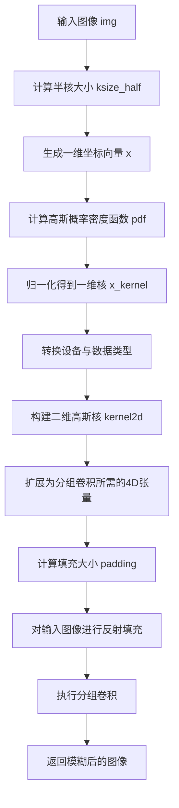
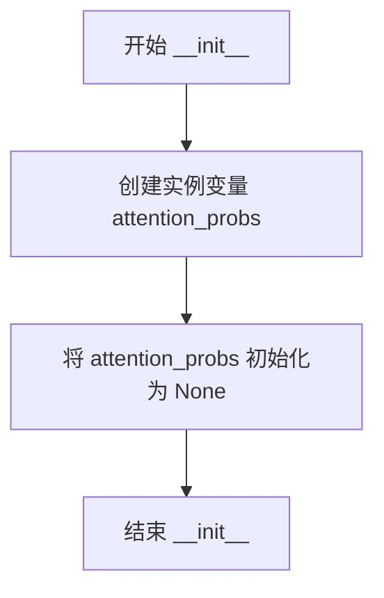
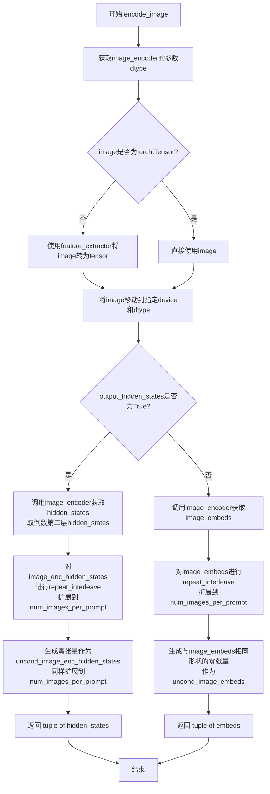
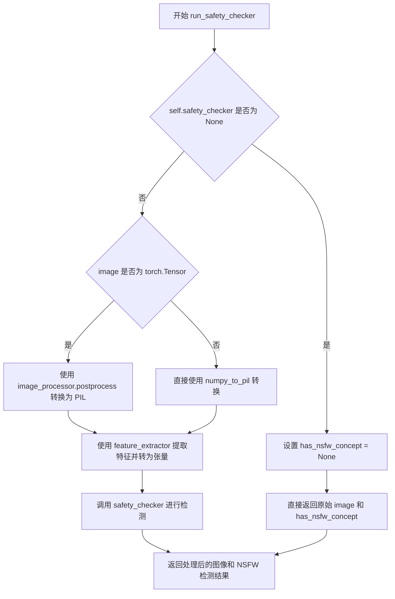
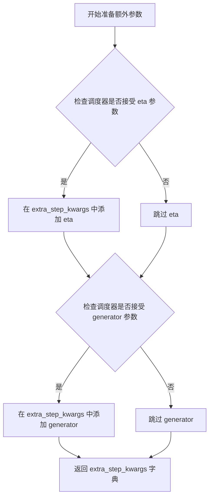
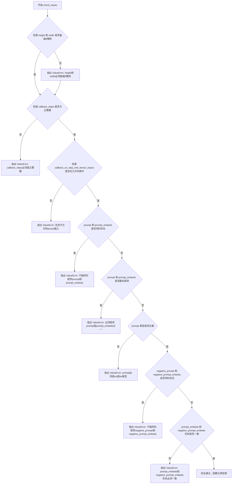
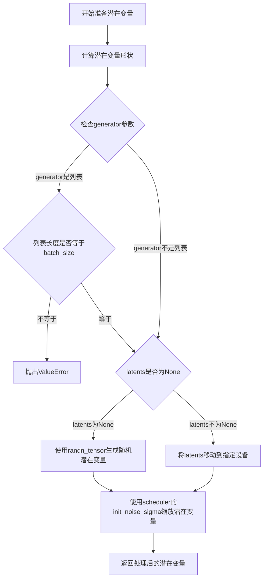

```mermaid
flowchart TD
    A[开始 __call__] --> B[设置默认高度和宽度]
    B --> C[检查输入参数 check_inputs]
    C --> D[确定批次大小 batch_size]
    D --> E[判断是否启用CFG do_classifier_free_guidance]
    E --> F{guidance_scale > 1.0?}
    F -->|Yes| G[do_classifier_free_guidance = True]
    F -->|No| H[do_classifier_free_guidance = False]
    G --> I[判断是否启用SAG do_self_attention_guidance]
    H --> I
    I --> J{sag_scale > 0.0?}
    J -->|Yes| K[do_self_attention_guidance = True]
    J -->|No| L[do_self_attention_guidance = False]
    K --> M[准备IP适配器图像嵌入 prepare_ip_adapter_image_embeds]
    L --> N[编码输入提示 encode_prompt]
    M --> N
    N --> O{do_classifier_free_guidance?}
    O -->|Yes| P[拼接负面和正面提示嵌入]
    O -->|No| Q[设置时间步 set_timesteps]
    P --> Q
    Q --> R[准备潜在变量 prepare_latents]
    R --> S[准备额外参数 prepare_extra_step_kwargs]
    S --> T[添加IP-Adapter条件 added_cond_kwargs]
    T --> U[保存原始注意力处理器并注册存储处理器]
    U --> V[进入去噪循环 for t in timesteps]
    V --> W[扩展潜在变量（CFG时）]
    W --> X[调度器缩放输入 scale_model_input]
    X --> Y[UNet预测噪声残差]
    Y --> Z{do_classifier_free_guidance?}
    Z -->|Yes| AA[分离无条件和有条件预测]
    AA --> AB[计算CFG引导后的噪声预测]
    Z -->|No| AC[跳过CFG计算]
    AB --> AD{do_self_attention_guidance?}
    AC --> AD
    AD -->|Yes| AE[预测x0 pred_x0]
    AE --> AF[获取存储的注意力图]
    AF --> AG[SAG掩码处理生成退化潜在向量]
    AG --> AH[UNet再次预测获取退化预测]
    AH --> AI[计算SAG引导后的噪声预测]
    AD -->|No| AJ[跳过SAG计算]
    AI --> AK[调度器执行一步去噪]
    AJ --> AK
    AK --> AL{是否是最后一个时间步?}
    AL -->|No| AM[更新进度条并执行回调]
    AM --> V
    AL -->|Yes| AN[是否需要解码为图像?]
    AN -->|Yes| AO[VAE解码 latent -> 图像]
    AN -->|No| AP[图像 = latents]
    AO --> AQ[运行安全检查 run_safety_checker]
    AP --> AR[后处理图像 postprocess]
    AQ --> AR
    AR --> AS[恢复原始注意力处理器]
    AS --> AT{return_dict?}
    AT -->|Yes| AU[返回 StableDiffusionPipelineOutput]
    AT -->|No| AV[返回 tuple 图像和nsfw标志]
    AU --> AV --> AW[结束]
```

```mermaid
flowchart TD
    A[开始 pred_x0] --> B[获取alpha_prod_t和beta_prod_t]
    B --> C{检查prediction_type}
    
    C -->|epsilon| D[使用DDIM去噪公式<br/>x0 = &#40;sample - β_t^0.5 × model_output&#41; / α_t^0.5]
    D --> G[返回pred_original_sample]
    
    C -->|sample| E[直接使用model_output作为x0]
    E --> G
    
    C -->|v_prediction| F[使用v-prediction公式<br/>x0 = α_t^0.5 × sample - β_t^0.5 × model_output]
    F --> G
    
    C -->|其他| H[抛出ValueError]
    H --> I[结束]
    G --> I
```

# `diffusers\src\diffusers\pipelines\stable_diffusion_sag\pipeline_stable_diffusion_sag.py` 详细设计文档

StableDiffusionSAGPipeline 是一个基于 Stable Diffusion 的文本到图像生成pipeline，引入了自注意力引导(SAG)技术。该技术通过分析并修改UNet中间层的自注意力图，生成更精确、更符合文本描述的图像。

## 整体流程

```mermaid
graph TD
A[开始] --> B[检查输入参数]
B --> C[编码文本提示encode_prompt]
C --> D[准备时间步timesteps]
D --> E[准备潜在变量prepare_latents]
E --> F{开始去噪循环}
F --> G[UNet预测噪声]
G --> H{执行分类器自由引导?}
H -- 是 --> I[分离uncond和text噪声预测]
H -- 否 --> J[直接使用噪声预测]
I --> K{执行SAG引导?}
J --> K
K -- 是 --> L[存储注意力图CrossAttnStoreProcessor]
K -- 否 --> M[调度器步进]
L --> N[计算pred_x0和pred_epsilon]
N --> O[sag_masking生成退化潜在变量]
O --> P[UNet再次预测退化噪声]
P --> Q[应用SAG引导: noise_pred += sag_scale * (noise_pred_uncond - degraded_pred)]
Q --> M
M --> R{是否完成所有步?}
R -- 否 --> F
R -- 是 --> S[VAE解码潜在变量]
S --> T[运行安全检查run_safety_checker]
T --> U[后处理图像postprocess]
U --> V[返回结果]
```

## 类结构

```
DiffusionPipeline (抽象基类)
└── StableDiffusionSAGPipeline (主Pipeline类)
   ├── CrossAttnStoreProcessor (注意力存储处理器)
   └── gaussian_blur_2d (工具函数)
```

## 全局变量及字段


### `logger`
    
模块日志记录器

类型：`logging.Logger`
    


### `XLA_AVAILABLE`
    
XLA加速可用性标志

类型：`bool`
    


### `EXAMPLE_DOC_STRING`
    
示例文档字符串

类型：`str`
    


### `CrossAttnStoreProcessor.attention_probs`
    
存储注意力概率矩阵

类型：`torch.Tensor | None`
    


### `StableDiffusionSAGPipeline.vae`
    
变分自编码器模型

类型：`AutoencoderKL`
    


### `StableDiffusionSAGPipeline.text_encoder`
    
CLIP文本编码器

类型：`CLIPTextModel`
    


### `StableDiffusionSAGPipeline.tokenizer`
    
CLIP分词器

类型：`CLIPTokenizer`
    


### `StableDiffusionSAGPipeline.unet`
    
UNet2D条件模型

类型：`UNet2DConditionModel`
    


### `StableDiffusionSAGPipeline.scheduler`
    
扩散调度器

类型：`KarrasDiffusionSchedulers`
    


### `StableDiffusionSAGPipeline.safety_checker`
    
安全检查器

类型：`StableDiffusionSafetyChecker | None`
    


### `StableDiffusionSAGPipeline.feature_extractor`
    
图像特征提取器

类型：`CLIPImageProcessor | None`
    


### `StableDiffusionSAGPipeline.image_encoder`
    
CLIP视觉编码器

类型：`CLIPVisionModelWithProjection | None`
    


### `StableDiffusionSAGPipeline.vae_scale_factor`
    
VAE缩放因子

类型：`int`
    


### `StableDiffusionSAGPipeline.image_processor`
    
图像处理器

类型：`VaeImageProcessor`
    
    

## 全局函数及方法


### `gaussian_blur_2d`

该函数实现2D高斯模糊，通过构建二维高斯核并使用分组卷积对输入图像进行模糊处理。

参数：

- `img`：`torch.Tensor`，输入图像张量，形状为 (B, C, H, W)
- `kernel_size`：`int`，高斯核的大小（必须为奇数），控制模糊半径
- `sigma`：`float`，高斯分布的标准差，控制模糊程度，值越大模糊越强

返回值：`torch.Tensor`，返回模糊后的图像张量，形状与输入相同 (B, C, H, W)

#### 流程图



#### 带注释源码

```
# Gaussian blur
def gaussian_blur_2d(img, kernel_size, sigma):
    # 1. 计算核半径的一半，用于生成对称的核坐标
    ksize_half = (kernel_size - 1) * 0.5

    # 2. 生成从 -ksize_half 到 +ksize_half 的一维坐标向量
    x = torch.linspace(-ksize_half, ksize_half, steps=kernel_size)

    # 3. 计算高斯概率密度函数: pdf = exp(-0.5 * (x/sigma)^2)
    pdf = torch.exp(-0.5 * (x / sigma).pow(2))

    # 4. 归一化核，使其和为1，保证模糊后图像亮度保持一致
    x_kernel = pdf / pdf.sum()
    # 5. 将核转换到与输入图像相同的设备和数据类型
    x_kernel = x_kernel.to(device=img.device, dtype=img.dtype)

    # 6. 使用矩阵乘法将两个一维高斯核外积得到二维高斯核
    kernel2d = torch.mm(x_kernel[:, None], x_kernel[None, :])
    # 7. 扩展为4D张量，形状为 [C, 1, kernel_size, kernel_size]
    # 其中 C 是输入图像的通道数，用于分组卷积
    kernel2d = kernel2d.expand(img.shape[-3], 1, kernel2d.shape[0], kernel2d.shape[1])

    # 8. 计算填充大小，使用 same padding 策略
    padding = [kernel_size // 2, kernel_size // 2, kernel_size // 2, kernel_size // 2]

    # 9. 使用反射模式填充输入图像，避免边缘效应
    img = F.pad(img, padding, mode="reflect")
    # 10. 执行分组卷积，每个通道独立进行卷积，实现逐通道模糊
    # groups=img.shape[-3] 表示按通道分组
    img = F.conv2d(img, kernel2d, groups=img.shape[-3])

    # 11. 返回模糊后的图像
    return img
```


### `CrossAttnStoreProcessor.__init__`

初始化 `CrossAttnStoreProcessor` 处理器，用于在自注意力引导（SAG）过程中存储注意力概率矩阵。

参数：

- 无显式参数（除 `self` 外）

返回值：`None`，无返回值（隐式返回 `None`）

#### 流程图



#### 带注释源码

```python
def __init__(self):
    # 初始化实例变量用于存储注意力概率
    # 默认为 None，在 __call__ 方法执行时会被赋值为实际的注意力概率张量
    self.attention_probs = None
```


### CrossAttnStoreProcessor.__call__

执行注意力计算并存储注意力概率，用于后续的自注意力指导（SAG）过程。

参数：

- `attn`：`torch.nn.Module`，注意力模块，包含查询、键、值的线性变换层以及归一化层
- `hidden_states`：`torch.Tensor`，输入的隐藏状态张量，形状为 (batch_size, sequence_length, hidden_dim)
- `encoder_hidden_states`：`torch.Tensor | None`，编码器的隐藏状态，如果为 None 则使用 hidden_states 本身
- `attention_mask`：`torch.Tensor | None`，用于遮盖特定位置的注意力权重

返回值：`torch.Tensor`，经过注意力计算和线性投影后的隐藏状态

#### 流程图

```mermaid
flowchart TD
    A[开始] --> B[获取 batch_size 和 sequence_length]
    B --> C[准备注意力掩码]
    C --> D[计算 Query: attn.to_qhidden_states]
    D --> E{encoder_hidden_states<br/>是否为 None?}
    E -->|是| F[使用 hidden_states]
    E -->|否| G{attn.norm_cross<br/>是否存在?}
    G -->|是| H[归一化 encoder_hidden_states]
    G -->|否| I[直接使用 encoder_hidden_states]
    F --> J[计算 Key 和 Value]
    H --> J
    I --> J
    J --> K[将 Query/Key/Value 转换为批次维度]
    K --> L[计算注意力分数并存储到 self.attention_probs]
    L --> M[使用注意力概率加权 Value]
    M --> N[转换回头维度]
    N --> O[线性投影 out[0]]
    O --> P[Dropout out[1]]
    P --> Q[返回 hidden_states]
```

#### 带注释源码

```python
def __call__(
    self,
    attn,                          # 注意力模块，包含 to_q, to_k, to_v 等方法
    hidden_states,                # 输入的隐藏状态 (batch, seq_len, hidden_dim)
    encoder_hidden_states=None,   # 编码器隐藏状态，可选
    attention_mask=None,          # 注意力掩码，可选
):
    # 1. 获取输入维度信息
    batch_size, sequence_length, _ = hidden_states.shape
    
    # 2. 准备注意力掩码，处理不同长度的序列
    attention_mask = attn.prepare_attention_mask(attention_mask, sequence_length, batch_size)
    
    # 3. 对输入隐藏状态进行线性变换得到 Query
    query = attn.to_q(hidden_states)

    # 4. 处理 encoder_hidden_states
    if encoder_hidden_states is None:
        # 如果没有提供编码器隐藏状态，则使用输入隐藏状态（自注意力）
        encoder_hidden_states = hidden_states
    elif attn.norm_cross:
        # 如果需要归一化，则对编码器隐藏状态进行归一化处理
        encoder_hidden_states = attn.norm_encoder_hidden_states(encoder_hidden_states)

    # 5. 对 encoder_hidden_states 进行线性变换得到 Key 和 Value
    key = attn.to_k(encoder_hidden_states)
    value = attn.to_v(encoder_hidden_states)

    # 6. 将多头注意力的查询、键、值从 (batch, head, seq, dim) 转换为 (batch*head, seq, dim) 格式
    query = attn.head_to_batch_dim(query)
    key = attn.head_to_batch_dim(key)
    value = attn.head_to_batch_dim(value)

    # 7. 计算注意力分数并存储，供后续 SAG 过程使用
    self.attention_probs = attn.get_attention_scores(query, key, attention_mask)
    
    # 8. 使用注意力概率对 Value 进行加权求和
    hidden_states = torch.bmm(self.attention_probs, value)
    
    # 9. 将结果从批次维度转换回头维度
    hidden_states = attn.batch_to_head_dim(hidden_states)

    # 10. 线性投影
    hidden_states = attn.to_out[0](hidden_states)
    
    # 11. Dropout 正则化
    hidden_states = attn.to_out[1](hidden_states)

    return hidden_states
```


### `StableDiffusionSAGPipeline.__init__`

该函数是 `StableDiffusionSAGPipeline` 的构造函数，负责实例化并初始化扩散管道所需的所有核心组件（如 VAE、文本编码器、UNet、调度器等），同时配置图像处理参数和安全检查器选项，为后续的图像生成推理做好准备。

参数：

- `vae`：`AutoencoderKL`， variational auto-encoder (VAE) 模型，用于在潜在表示和图像之间进行编码和解码。
- `text_encoder`：`CLIPTextModel`，冻结的文本编码器（如 clip-vit-large-patch14），用于将文本提示转换为嵌入向量。
- `tokenizer`：`CLIPTokenizer`，用于将文本分词为 token 序列。
- `unet`：`UNet2DConditionModel`，条件 UNet 模型，用于对编码后的图像潜在向量进行去噪。
- `scheduler`：`KarrasDiffusionSchedulers`，扩散调度器，用于控制去噪过程中的噪声调度。
- `safety_checker`：`StableDiffusionSafetyChecker`，安全检查器模块，用于检测并过滤可能有害的生成图像。
- `feature_extractor`：`CLIPImageProcessor`，图像特征提取器，用于从生成的图像中提取特征以供安全检查器使用。
- `image_encoder`：`CLIPVisionModelWithProjection | None`（可选），图像编码器，用于支持 IP-Adapter 功能。
- `requires_safety_checker`：`bool`，布尔值，指定是否需要在生成后运行安全检查器。

返回值：`None`，构造函数不返回值，仅初始化对象状态。

#### 流程图

```mermaid
graph TD
    A([开始初始化]) --> B[调用 super().__init__]
    B --> C[调用 self.register_modules 注册所有子模块]
    C --> D{检查 VAE 是否存在}
    D -- 是 --> E[根据 VAE 配置计算 vae_scale_factor]
    D -- 否 --> F[设置默认 vae_scale_factor 为 8]
    E --> G[实例化 VaeImageProcessor]
    F --> G
    G --> H[调用 self.register_to_config 注册配置项]
    H --> I([结束初始化])
```

#### 带注释源码

```python
def __init__(
    self,
    vae: AutoencoderKL,
    text_encoder: CLIPTextModel,
    tokenizer: CLIPTokenizer,
    unet: UNet2DConditionModel,
    scheduler: KarrasDiffusionSchedulers,
    safety_checker: StableDiffusionSafetyChecker,
    feature_extractor: CLIPImageProcessor,
    image_encoder: CLIPVisionModelWithProjection | None = None,
    requires_safety_checker: bool = True,
):
    # 调用父类的初始化方法，完成基础管道的设置
    super().__init__()

    # 注册所有传入的模型组件，使其成为 Pipeline 的可访问属性
    self.register_modules(
        vae=vae,
        text_encoder=text_encoder,
        tokenizer=tokenizer,
        unet=unet,
        scheduler=scheduler,
        safety_checker=safety_checker,
        feature_extractor=feature_extractor,
        image_encoder=image_encoder,
    )
    
    # 计算 VAE 的缩放因子，通常为 2^(len(block_out_channels) - 1)
    # 如果 VAE 存在则根据其配置计算，否则使用默认值 8
    self.vae_scale_factor = 2 ** (len(self.vae.config.block_out_channels) - 1) if getattr(self, "vae", None) else 8
    
    # 初始化图像后处理器，用于处理 VAE 解码后的图像
    self.image_processor = VaeImageProcessor(vae_scale_factor=self.vae_scale_factor)
    
    # 将 requires_safety_checker 参数注册到配置中，以便在推理时控制安全检查
    self.register_to_config(requires_safety_checker=requires_safety_checker)
```


### `StableDiffusionSAGPipeline._encode_prompt`

该方法是StableDiffusionSAGPipeline中已废弃的提示词编码函数，用于将文本提示词编码为嵌入向量。它已被`encode_prompt`方法取代，该方法内部调用新的`encode_prompt`方法并对返回结果进行拼接以保持向后兼容性。

参数：

- `prompt`：`str | list[str] | None`，待编码的文本提示词
- `device`：`torch.device`，torch设备对象
- `num_images_per_prompt`：`int`，每个提示词生成的图像数量
- `do_classifier_free_guidance`：`bool`，是否使用无分类器自由引导
- `negative_prompt`：`str | list[str] | None`，负面提示词，用于引导不包含在图像中的内容
- `prompt_embeds`：`torch.Tensor | None`，预生成的文本嵌入，可用于轻松调整文本输入
- `negative_prompt_embeds`：`torch.Tensor | None`，预生成的负面文本嵌入
- `lora_scale`：`float | None`，应用于文本编码器所有LoRA层的LoRA比例因子
- `**kwargs`：其他可选参数

返回值：`torch.Tensor`，拼接后的提示词嵌入张量（包含负面嵌入和正向嵌入的拼接，用于向后兼容）

#### 流程图

```mermaid
flowchart TD
    A[开始 _encode_prompt] --> B[发出废弃警告]
    B --> C[调用 encode_prompt 方法]
    C --> D[获取元组返回: prompt_embeds_tuple]
    D --> E[拼接 embeddings: torch.cat[prompt_embeds_tuple[1], prompt_embeds_tuple[0]]]
    E --> F[返回拼接后的 prompt_embeds]
```

#### 带注释源码

```python
# Copied from diffusers.pipelines.stable_diffusion.pipeline_stable_diffusion.StableDiffusionPipeline._encode_prompt
def _encode_prompt(
    self,
    prompt,
    device,
    num_images_per_prompt,
    do_classifier_free_guidance,
    negative_prompt=None,
    prompt_embeds: torch.Tensor | None = None,
    negative_prompt_embeds: torch.Tensor | None = None,
    lora_scale: float | None = None,
    **kwargs,
):
    """
    已废弃的提示词编码方法。
    内部调用新的encode_prompt方法并将返回结果拼接以保持向后兼容性。
    """
    # 发出废弃警告，提示用户使用encode_prompt方法代替
    deprecation_message = "`_encode_prompt()` is deprecated and it will be removed in a future version. Use `encode_prompt()` instead. Also, be aware that the output format changed from a concatenated tensor to a tuple."
    deprecate("_encode_prompt()", "1.0.0", deprecation_message, standard_warn=False)

    # 调用新的encode_prompt方法获取编码结果（返回元组格式）
    prompt_embeds_tuple = self.encode_prompt(
        prompt=prompt,
        device=device,
        num_images_per_prompt=num_images_per_prompt,
        do_classifier_free_guidance=do_classifier_free_guidance,
        negative_prompt=negative_prompt,
        prompt_embeds=prompt_embeds,
        negative_prompt_embeds=negative_prompt_embeds,
        lora_scale=lora_scale,
        **kwargs,
    )

    # 为了向后兼容性，将元组中的负向和正向embeddings拼接
    # prompt_embeds_tuple[0] 是正向embeddings
    # prompt_embeds_tuple[1] 是负向embeddings
    # 拼接顺序: [negative_prompt_embeds, prompt_embeds]
    prompt_embeds = torch.cat([prompt_embeds_tuple[1], prompt_embeds_tuple[0]])

    return prompt_embeds
```


### `StableDiffusionSAGPipeline.encode_prompt`

该方法负责将文本提示（prompt）编码为文本编码器的隐藏状态（embeddings），支持正面提示和负面提示的编码，处理 classifier-free guidance所需的unconditional embeddings，并应用 LORA 缩放和 CLIP skip 等高级功能。

参数：

- `self`：`StableDiffusionSAGPipeline` 实例本身
- `prompt`：`str | list[str] | None`，要编码的文本提示，可以是单个字符串或字符串列表
- `device`：`torch.device`，torch 设备，用于将计算结果放到指定设备上
- `num_images_per_prompt`：`int`，每个提示要生成的图像数量，用于复制 embeddings
- `do_classifier_free_guidance`：`bool`，是否使用 classifier-free guidance
- `negative_prompt`：`str | list[str] | None`，负面提示，用于指导不生成什么内容
- `prompt_embeds`：`torch.Tensor | None`，可选的预生成文本嵌入，如果提供则直接使用而不从 prompt 生成
- `negative_prompt_embeds`：`torch.Tensor | None`，可选的预生成负面文本嵌入
- `lora_scale`：`float | None`，LORA 缩放因子，用于调整 LoRA 层的权重
- `clip_skip`：`int | None`，CLIP 模型要跳过的层数，用于获取不同层的特征

返回值：`tuple[torch.Tensor, torch.Tensor]`，返回两个 tensor：第一个是正面提示的 embeddings，第二个是负面提示的 embeddings（或全零/空字符串对应的 embeddings）

#### 流程图

```mermaid
flowchart TD
    A[开始 encode_prompt] --> B{是否传入 lora_scale?}
    B -->|是| C[设置 self._lora_scale]
    B -->|否| D{是否有 LoRA 模型?}
    
    C --> D
    D -->|是且非 PEFT| E[adjust_lora_scale_text_encoder]
    D -->|是且 PEFT| F[scale_lora_layers]
    D -->|否| G{判断 batch_size}
    
    E --> G
    F --> G
    
    G -->|prompt 是 str| H[batch_size = 1]
    G -->|prompt 是 list| I[batch_size = len prompt]
    G -->|其他| J[batch_size = prompt_embeds.shape[0]]
    
    H --> K{prompt_embeds 为 None?}
    I --> K
    J --> K
    
    K -->|是| L{是否有 TextualInversion?}
    K -->|否| Q[直接使用 prompt_embeds]
    
    L -->|是| M[maybe_convert_prompt 处理多向量 token]
    L -->|否| N[tokenizer 处理 prompt]
    
    M --> N
    N --> O[text_encoder 编码]
    O -->|clip_skip 为 None| P[使用输出[0]]
    O -->|clip_skip 不为 None| R[获取 hidden_states 并取倒数第 clip_skip+1 层]
    R --> S[应用 final_layer_norm]
    
    P --> T[确定 prompt_embeds_dtype]
    S --> T
    Q --> T
    
    T --> U[转换为正确 dtype 和 device]
    U --> V[重复 embeddings num_images_per_prompt 次]
    
    V --> W{do_classifier_free_guidance 且 negative_prompt_embeds 为 None?}
    W -->|是| X[处理 negative_prompt]
    W -->|否| Y[返回 embeddings 元组]
    
    X -->|negative_prompt 为 None| Z[使用空字符串]
    X -->|类型不匹配| AA[抛出 TypeError]
    X -->|batch_size 不匹配| AB[抛出 ValueError]
    
    Z --> AC[tokenizer 处理 uncond_tokens]
    AA --> AD[抛出异常]
    AB --> AD
    AC --> AE[text_encoder 编码获取 negative_prompt_embeds]
    
    AE --> AF[重复 negative_prompt_embeds]
    AF --> AG{是否使用 StableDiffusionLoraLoaderMixin 且是 PEFT?}
    AG -->|是| AH[unscale_lora_layers 恢复原始 scale]
    AG -->|否| Y
    
    AH --> Y
    
    Y[结束, 返回 prompt_embeds, negative_prompt_embeds]
```

#### 带注释源码

```python
def encode_prompt(
    self,
    prompt,
    device,
    num_images_per_prompt,
    do_classifier_free_guidance,
    negative_prompt=None,
    prompt_embeds: torch.Tensor | None = None,
    negative_prompt_embeds: torch.Tensor | None = None,
    lora_scale: float | None = None,
    clip_skip: int | None = None,
):
    r"""
    Encodes the prompt into text encoder hidden states.

    Args:
        prompt (`str` or `list[str]`, *optional*):
            prompt to be encoded
        device: (`torch.device`):
            torch device
        num_images_per_prompt (`int`):
            number of images that should be generated per prompt
        do_classifier_free_guidance (`bool`):
            whether to use classifier free guidance or not
        negative_prompt (`str` or `list[str]`, *optional*):
            The prompt or prompts not to guide the image generation. If not defined, one has to pass
            `negative_prompt_embeds` instead. Ignored when not using guidance (i.e., ignored if `guidance_scale` is
            less than `1`).
        prompt_embeds (`torch.Tensor`, *optional*):
            Pre-generated text embeddings. Can be used to easily tweak text inputs, *e.g.* prompt weighting. If not
            provided, text embeddings will be generated from `prompt` input argument.
        negative_prompt_embeds (`torch.Tensor`, *optional*):
            Pre-generated negative text embeddings. Can be used to easily tweak text inputs, *e.g.* prompt
            weighting. If not provided, negative_prompt_embeds will be generated from `negative_prompt` input
            argument.
        lora_scale (`float`, *optional*):
            A LoRA scale that will be applied to all LoRA layers of the text encoder if LoRA layers are loaded.
        clip_skip (`int`, *optional*):
            Number of layers to be skipped from CLIP while computing the prompt embeddings. A value of 1 means that
            the output of the pre-final layer will be used for computing the prompt embeddings.
    """
    # 设置 lora scale 以便 text encoder 的 monkey patched LoRA 函数能正确访问
    # 如果传入了 lora_scale 且当前 pipeline 是 StableDiffusionLoraLoaderMixin 的实例
    if lora_scale is not None and isinstance(self, StableDiffusionLoraLoaderMixin):
        self._lora_scale = lora_scale

        # 动态调整 LoRA scale
        if not USE_PEFT_BACKEND:
            # 非 PEFT 后端：直接调整 LoRA scale
            adjust_lora_scale_text_encoder(self.text_encoder, lora_scale)
        else:
            # PEFT 后端：使用 scale_lora_layers
            scale_lora_layers(self.text_encoder, lora_scale)

    # 确定 batch_size
    if prompt is not None and isinstance(prompt, str):
        batch_size = 1
    elif prompt is not None and isinstance(prompt, list):
        batch_size = len(prompt)
    else:
        # 如果 prompt 为 None，则必须提供 prompt_embeds
        batch_size = prompt_embeds.shape[0]

    # 如果没有提供 prompt_embeds，则从 prompt 生成
    if prompt_embeds is None:
        # 处理 textual inversion：如果有 TextualInversionLoaderMixin，
        # 可能需要处理多向量 token
        if isinstance(self, TextualInversionLoaderMixin):
            prompt = self.maybe_convert_prompt(prompt, self.tokenizer)

        # 使用 tokenizer 将文本转换为 token IDs
        text_inputs = self.tokenizer(
            prompt,
            padding="max_length",
            max_length=self.tokenizer.model_max_length,
            truncation=True,
            return_tensors="pt",
        )
        text_input_ids = text_inputs.input_ids
        
        # 获取未截断的 token IDs，用于警告用户哪些内容被截断
        untruncated_ids = self.tokenizer(prompt, padding="longest", return_tensors="pt").input_ids

        # 检查是否有内容被截断
        if untruncated_ids.shape[-1] >= text_input_ids.shape[-1] and not torch.equal(
            text_input_ids, untruncated_ids
        ):
            removed_text = self.tokenizer.batch_decode(
                untruncated_ids[:, self.tokenizer.model_max_length - 1 : -1]
            )
            logger.warning(
                "The following part of your input was truncated because CLIP can only handle sequences up to"
                f" {self.tokenizer.model_max_length} tokens: {removed_text}"
            )

        # 检查 text_encoder 是否使用 attention mask
        if hasattr(self.text_encoder.config, "use_attention_mask") and self.text_encoder.config.use_attention_mask:
            attention_mask = text_inputs.attention_mask.to(device)
        else:
            attention_mask = None

        # 根据 clip_skip 参数决定如何获取 embeddings
        if clip_skip is None:
            # 直接使用 text_encoder 获取 embeddings
            prompt_embeds = self.text_encoder(text_input_ids.to(device), attention_mask=attention_mask)
            prompt_embeds = prompt_embeds[0]
        else:
            # 获取所有 hidden states，选择倒数第 clip_skip+1 层
            prompt_embeds = self.text_encoder(
                text_input_ids.to(device), attention_mask=attention_mask, output_hidden_states=True
            )
            # hidden_states 是一个元组，包含所有 encoder 层的输出
            # 取倒数第 clip_skip+1 层（即从后往前数）
            prompt_embeds = prompt_embeds[-1][-(clip_skip + 1)]
            # 应用 final_layer_norm 以获得正确的表示
            prompt_embeds = self.text_encoder.text_model.final_layer_norm(prompt_embeds)

    # 确定 prompt_embeds 的数据类型
    if self.text_encoder is not None:
        prompt_embeds_dtype = self.text_encoder.dtype
    elif self.unet is not None:
        prompt_embeds_dtype = self.unet.dtype
    else:
        prompt_embeds_dtype = prompt_embeds.dtype

    # 将 prompt_embeds 转换为正确的 dtype 和 device
    prompt_embeds = prompt_embeds.to(dtype=prompt_embeds_dtype, device=device)

    # 获取 embeddings 的形状并复制以支持每个提示生成多个图像
    bs_embed, seq_len, _ = prompt_embeds.shape
    # 复制 embeddings：每个 prompt 生成 num_images_per_prompt 个图像
    prompt_embeds = prompt_embeds.repeat(1, num_images_per_prompt, 1)
    prompt_embeds = prompt_embeds.view(bs_embed * num_images_per_prompt, seq_len, -1)

    # 获取 classifier-free guidance 所需的 unconditional embeddings
    if do_classifier_free_guidance and negative_prompt_embeds is None:
        uncond_tokens: list[str]
        
        # 处理 negative_prompt
        if negative_prompt is None:
            # 如果没有提供 negative_prompt，使用空字符串
            uncond_tokens = [""] * batch_size
        elif prompt is not None and type(prompt) is not type(negative_prompt):
            # 类型不匹配，抛出异常
            raise TypeError(
                f"`negative_prompt` should be the same type to `prompt`, but got {type(negative_prompt)} !="
                f" {type(prompt)}."
            )
        elif isinstance(negative_prompt, str):
            # negative_prompt 是单个字符串
            uncond_tokens = [negative_prompt]
        elif batch_size != len(negative_prompt):
            # batch_size 不匹配
            raise ValueError(
                f"`negative_prompt`: {negative_prompt} has batch size {len(negative_prompt)}, but `prompt`:"
                f" {prompt} has batch size {batch_size}. Please make sure that passed `negative_prompt` matches"
                " the batch size of `prompt`."
            )
        else:
            uncond_tokens = negative_prompt

        # 处理 textual inversion 的多向量 token
        if isinstance(self, TextualInversionLoaderMixin):
            uncond_tokens = self.maybe_convert_prompt(uncond_tokens, self.tokenizer)

        # 使用与 prompt_embeds 相同的长度
        max_length = prompt_embeds.shape[1]
        uncond_input = self.tokenizer(
            uncond_tokens,
            padding="max_length",
            max_length=max_length,
            truncation=True,
            return_tensors="pt",
        )

        # 处理 attention mask
        if hasattr(self.text_encoder.config, "use_attention_mask") and self.text_encoder.config.use_attention_mask:
            attention_mask = uncond_input.attention_mask.to(device)
        else:
            attention_mask = None

        # 编码 negative_prompt
        negative_prompt_embeds = self.text_encoder(
            uncond_input.input_ids.to(device),
            attention_mask=attention_mask,
        )
        negative_prompt_embeds = negative_prompt_embeds[0]

    # 如果使用 classifier-free guidance，复制 negative_prompt_embeds
    if do_classifier_free_guidance:
        seq_len = negative_prompt_embeds.shape[1]

        # 转换 dtype 和 device
        negative_prompt_embeds = negative_prompt_embeds.to(dtype=prompt_embeds_dtype, device=device)

        # 复制以匹配 num_images_per_prompt
        negative_prompt_embeds = negative_prompt_embeds.repeat(1, num_images_per_prompt, 1)
        negative_prompt_embeds = negative_prompt_embeds.view(batch_size * num_images_per_prompt, seq_len, -1)

    # 如果使用了 LoRA 且是 PEFT 后端，需要恢复原始 scale
    if self.text_encoder is not None:
        if isinstance(self, StableDiffusionLoraLoaderMixin) and USE_PEFT_BACKEND:
            # 恢复原始 scale
            unscale_lora_layers(self.text_encoder, lora_scale)

    # 返回 prompt_embeds 和 negative_prompt_embeds
    return prompt_embeds, negative_prompt_embeds
```


### `StableDiffusionSAGPipeline.encode_image`

该方法用于将输入图像编码为图像embeddings，可选择输出隐藏状态或图像embededs。支持条件和无条件图像嵌入的生成，用于图像到图像的条件扩散模型中。

参数：

- `image`：`Union[torch.Tensor, PIL.Image, numpy.array]`，输入图像，可以是PyTorch张量、PIL图像或numpy数组
- `device`：`torch.device`，目标设备，用于将图像和张量移动到指定设备
- `num_images_per_prompt`：`int`，每个prompt生成的图像数量，用于复制embeddings
- `output_hidden_states`：`Optional[bool]`，是否输出图像编码器的隐藏状态。如果为True，返回隐藏状态；否则返回图像embeddings

返回值：`Tuple[torch.Tensor, torch.Tensor]`，返回两个张量元组：
- 第一个是条件图像embeddings或隐藏状态
- 第二个是无条件（零）图像embeddings或隐藏状态
两者维度都会被扩展到`num_images_per_prompt`

#### 流程图



#### 带注释源码

```python
def encode_image(self, image, device, num_images_per_prompt, output_hidden_states=None):
    """
    Encodes the input image into embeddings or hidden states.

    Args:
        image: Input image (PIL Image, numpy array, or torch.Tensor)
        device: Target device for computation
        num_images_per_prompt: Number of images to generate per prompt
        output_hidden_states: If True, returns hidden states instead of image embeddings

    Returns:
        Tuple of (image_embeds, uncond_image_embeds) or (image_hidden_states, uncond_image_hidden_states)
    """
    # 1. 获取image_encoder模型参数的数据类型
    dtype = next(self.image_encoder.parameters()).dtype

    # 2. 如果输入不是torch.Tensor，使用feature_extractor进行预处理
    if not isinstance(image, torch.Tensor):
        image = self.feature_extractor(image, return_tensors="pt").pixel_values

    # 3. 将图像移动到目标设备并转换数据类型
    image = image.to(device=device, dtype=dtype)

    # 4. 根据output_hidden_states参数选择不同的处理路径
    if output_hidden_states:
        # 路径A: 输出隐藏状态
        # 获取图像编码器的倒数第二层隐藏状态
        image_enc_hidden_states = self.image_encoder(image, output_hidden_states=True).hidden_states[-2]
        # 沿着batch维度重复，以匹配num_images_per_prompt
        image_enc_hidden_states = image_enc_hidden_states.repeat_interleave(num_images_per_prompt, dim=0)
        
        # 生成零张量的无条件隐藏状态（用于classifier-free guidance）
        uncond_image_enc_hidden_states = self.image_encoder(
            torch.zeros_like(image), output_hidden_states=True
        ).hidden_states[-2]
        uncond_image_enc_hidden_states = uncond_image_enc_hidden_states.repeat_interleave(
            num_images_per_prompt, dim=0
        )
        
        # 返回隐藏状态元组
        return image_enc_hidden_states, uncond_image_enc_hidden_states
    else:
        # 路径B: 输出图像embeddings
        # 获取图像的embeddings表示
        image_embeds = self.image_encoder(image).image_embeds
        # 沿着batch维度重复
        image_embeds = image_embeds.repeat_interleave(num_images_per_prompt, dim=0)
        
        # 生成零张量的无条件embeddings（用于classifier-free guidance）
        uncond_image_embeds = torch.zeros_like(image_embeds)

        # 返回embeddings元组
        return image_embeds, uncond_image_embeds
```


### `StableDiffusionSAGPipeline.prepare_ip_adapter_image_embeds`

该方法负责为 IP-Adapter 准备图像 embeddings。如果调用者未直接提供预计算的 embeddings，方法将对输入图像进行编码、处理批量生成（`num_images_per_prompt`）以及无分类器引导（Classifier-Free Guidance）的逻辑，最终输出适合扩散模型使用的图像条件嵌入列表。

参数：

-  `ip_adapter_image`：`PipelineImageInput | None`，输入的图像数据，用于提取图像特征。如果提供了 `ip_adapter_image_embeds`，此参数可为空。
-  `ip_adapter_image_embeds`：`list[torch.Tensor] | None`，可选的预计算图像 embeddings。如果为 `None`，则根据 `ip_adapter_image` 动态计算。
-   `device`：`torch.device`，计算设备（CPU/CUDA）。
-   `num_images_per_prompt`：`int`，每个 prompt 需生成的图像数量，用于在 embedding 维度上进行重复以匹配批量大小。
-   `do_classifier_free_guidance`：`bool`，是否启用无分类器引导。如果为 `True`，方法会将负样本（无条件）embeddings 和正样本（条件）embeddings 拼接在一起。

返回值：`list[torch.Tensor]`，包含处理后图像 embeddings 的列表。列表中的每个元素对应一个 IP-Adapter 的图像 embedding。

#### 流程图

```mermaid
graph TD
    A([Start: prepare_ip_adapter_image_embeds]) --> B{ip_adapter_image_embeds is None?}
    B -- Yes --> C[Normalize ip_adapter_image to List]
    C --> D{Check Length Match <br> len(ip_adapter_image) vs <br> num IP Adapters}
    D -- Mismatch --> E[Raise ValueError]
    D -- Match --> F[Loop: Iterate Images & Projection Layers]
    F --> G[Call self.encode_image]
    G --> H[Repeat Embeddings by num_images_per_prompt]
    H --> I{do_classifier_free_guidance?}
    I -- Yes --> J[Concat: negative_image_embeds + image_embeds]
    I -- No --> K[Keep image_embeds]
    J --> L[Append to image_embeds List]
    K --> L
    L --> M{More Images?}
    M -- Yes --> F
    M -- No --> N[Return image_embeds List]
    B -- No --> O[Return input ip_adapter_image_embeds]
```

#### 带注释源码

```python
def prepare_ip_adapter_image_embeds(
    self, ip_adapter_image, ip_adapter_image_embeds, device, num_images_per_prompt, do_classifier_free_guidance
):
    # 如果没有预先生成的图像embeddings，则需要从图像输入进行编码
    if ip_adapter_image_embeds is None:
        # 确保图像输入是列表格式，以便统一处理多个IP-Adapter
        if not isinstance(ip_adapter_image, list):
            ip_adapter_image = [ip_adapter_image]

        # 验证输入图像数量是否与UNet中注册的IP-Adapter投影层数量一致
        if len(ip_adapter_image) != len(self.unet.encoder_hid_proj.image_projection_layers):
            raise ValueError(
                f"`ip_adapter_image` must have same length as the number of IP Adapters. Got {len(ip_adapter_image)} images and {len(self.unet.encoder_hid_proj.image_projection_layers)} IP Adapters."
            )

        image_embeds = []
        # 遍历每个IP-Adapter对应的图像和图像投影层
        for single_ip_adapter_image, image_proj_layer in zip(
            ip_adapter_image, self.unet.encoder_hid_proj.image_projection_layers
        ):
            # 判断是否需要输出隐藏状态（通常ImageProjection层不需要，CLIPVisionModel需要）
            output_hidden_state = not isinstance(image_proj_layer, ImageProjection)
            # 调用类内方法编码图像
            single_image_embeds, single_negative_image_embeds = self.encode_image(
                single_ip_adapter_image, device, 1, output_hidden_state
            )
            
            # 为每个prompt生成的图像数量复制embeddings维度
            single_image_embeds = torch.stack([single_image_embeds] * num_images_per_prompt, dim=0)
            single_negative_image_embeds = torch.stack(
                [single_negative_image_embeds] * num_images_per_prompt, dim=0
            )

            # 如果启用无分类器引导（CFG），将负样本和正样本embeddings在批次维度拼接
            # 格式通常为 [negative, positive]
            if do_classifier_free_guidance:
                single_image_embeds = torch.cat([single_negative_image_embeds, single_image_embeds])
                single_image_embeds = single_image_embeds.to(device)

            image_embeds.append(single_image_embeds)
    else:
        # 如果直接提供了embeddings，则直接使用，不做处理
        image_embeds = ip_adapter_image_embeds
        
    return image_embeds
```


### `StableDiffusionSAGPipeline.run_safety_checker`

该方法用于在图像生成完成后运行安全检查器（Safety Checker），检测生成的图像是否包含不当内容（NSFW）。如果安全检查器被禁用或未配置，则直接返回原始图像和 `None`。

参数：

- `image`：`torch.Tensor | list[Any]`，输入的图像数据，可以是 PyTorch 张量或 PIL 图像列表
- `device`：`torch.device`，指定进行安全检查的设备（如 CPU 或 CUDA）
- `dtype`：`torch.dtype`，用于将特征提取器输入转换为指定的数据类型

返回值：`(图像, has_nsfw_concept)` 元组，其中 `图像` 为处理后的图像（类型取决于输入），`has_nsfw_concept` 为 `list[bool] | None`，指示对应图像是否检测到不当内容

#### 流程图



#### 带注释源码

```python
def run_safety_checker(self, image, device, dtype):
    """
    运行安全检查器来检测生成的图像是否包含不当内容（NSFW）。
    
    参数:
        image: 输入图像，可以是 torch.Tensor 或 PIL 图像列表
        device: 计算设备
        dtype: 计算数据类型
    
    返回:
        tuple: (处理后的图像, NSFW检测结果)
    """
    # 如果安全检查器未配置，跳过检查并返回 None
    if self.safety_checker is None:
        has_nsfw_concept = None
    else:
        # 根据输入类型进行预处理
        if torch.is_tensor(image):
            # 如果是张量，使用后处理器转换为 PIL 图像
            feature_extractor_input = self.image_processor.postprocess(image, output_type="pil")
        else:
            # 如果是 numpy 数组或其他格式，直接转为 PIL 图像
            feature_extractor_input = self.image_processor.numpy_to_pil(image)
        
        # 使用特征提取器提取特征并转为 PyTorch 张量
        safety_checker_input = self.feature_extractor(feature_extractor_input, return_tensors="pt").to(device)
        
        # 调用安全检查器进行 NSFW 检测
        # 将像素值转换为指定的数据类型（dtype）
        image, has_nsfw_concept = self.safety_checker(
            images=image, 
            clip_input=safety_checker_input.pixel_values.to(dtype)
        )
    
    # 返回处理后的图像和 NSFW 检测标志
    return image, has_nsfw_concept
```


### `StableDiffusionSAGPipeline.decode_latents`

该方法是StableDiffusionSAGPipeline类中的一个已废弃的解码潜在变量的方法，负责将VAE的潜在表示解码为可视化的图像张量。它通过VAE解码器将潜在变量反缩放、解码为图像，并进行归一化和格式转换，最终返回NumPy数组格式的图像数据。

参数：

- `latents`：`torch.Tensor`，输入的潜在变量张量，通常来自UNet去噪过程的输出

返回值：`numpy.ndarray`，解码后的图像张量，形状为(batch_size, height, width, channels)，像素值范围为[0, 1]

#### 流程图

```mermaid
flowchart TD
    A[输入: latents 潜在变量] --> B[反缩放: latents = 1/scaling_factor \* latents]
    B --> C[VAE解码: image = vae.decode(latents)]
    C --> D[归一化: image = (image/2 + 0.5).clamp(0, 1)]
    D --> E[设备转换: image.cpu()]
    E --> F[维度转换: permute(0, 2, 3, 1)]
    F --> G[类型转换: .float().numpy()]
    G --> H[输出: numpy.ndarray 图像]
```

#### 带注释源码

```python
def decode_latents(self, latents):
    """
    解码潜在变量为图像（已废弃方法）
    
    注意：此方法已被废弃，将在1.0.0版本中移除。
    建议使用 VaeImageProcessor.postprocess(...) 代替。
    """
    # 发出废弃警告，提醒用户使用新方法
    deprecation_message = "The decode_latents method is deprecated and will be removed in 1.0.0. Please use VaeImageProcessor.postprocess(...) instead"
    deprecate("decode_latents", "1.0.0", deprecation_message, standard_warn=False)

    # 第一步：反缩放潜在变量
    # VAE在编码时会将latents乘以scaling_factor，这里需要除以回来
    latents = 1 / self.vae.config.scaling_factor * latents
    
    # 第二步：使用VAE解码器将潜在变量解码为图像
    # vae.decode返回的是一个元组(idx=0是图像, idx=1可能是其他输出)
    image = self.vae.decode(latents, return_dict=False)[0]
    
    # 第三步：图像归一化
    # 将图像值从[-1, 1]范围转换到[0, 1]范围
    # 原始VAE输出通常是[-1, 1]，通过(image/2 + 0.5)转换到[0, 1]
    # .clamp(0, 1)确保值不会超出[0, 1]范围
    image = (image / 2 + 0.5).clamp(0, 1)
    
    # 第四步：转换为NumPy数组以便后续处理
    # 1. .cpu() - 将张量从GPU移至CPU（diffusers主要在CPU上做后处理）
    # 2. .permute(0, 2, 3, 1) - 调整维度顺序从(N, C, H, W)变为(N, H, W, C)
    # 3. .float() - 转换为float32，因为这个操作开销不大且与bfloat16兼容
    # 4. .numpy() - 转换为NumPy数组
    image = image.cpu().permute(0, 2, 3, 1).float().numpy()
    
    # 返回解码后的图像
    return image
```


### `StableDiffusionSAGPipeline.prepare_extra_step_kwargs`

该方法用于为调度器（Scheduler）的步骤函数准备额外的关键字参数。由于不同的调度器（例如 DDIMScheduler、PNDMScheduler 等）可能接受不同的参数，此方法通过检查调度器 `step` 函数的签名，动态地添加 `eta`（用于 DDIM 等调度器的噪声尺度参数）和 `generator`（用于控制随机性生成器）到返回的参数字典中，确保只有调度器支持的参数才会被传递。

参数：

- `self`：`StableDiffusionSAGPipeline` 实例本身，隐式参数。
- `generator`：`torch.Generator | list[torch.Generator] | None`，用于控制生成过程的随机性生成器。如果调度器支持，则会被包含在返回的参数字典中。
- `eta`：`float`，对应 DDIM 论文中的 η 参数，用于控制采样过程中的随机性。取值范围通常在 [0, 1] 之间。如果调度器不支持此参数，则会被忽略。

返回值：`dict[str, Any]`，返回一个包含调度器额外参数的字典。可能包含 `eta` 和/或 `generator` 键，取决于调度器的签名支持。

#### 流程图



#### 带注释源码

```python
def prepare_extra_step_kwargs(self, generator, eta):
    # 准备调度器步骤所需的额外关键字参数，因为并非所有调度器都具有相同的函数签名。
    # eta (η) 仅在 DDIMScheduler 中使用，在其他调度器中会被忽略。
    # eta 对应 DDIM 论文 (https://huggingface.co/papers/2010.02502) 中的参数，值应介于 [0, 1] 之间。

    # 使用 inspect 模块检查调度器的 step 方法是否接受 'eta' 参数
    accepts_eta = "eta" in set(inspect.signature(self.scheduler.step).parameters.keys())
    
    # 初始化空字典用于存储额外参数
    extra_step_kwargs = {}
    
    # 如果调度器接受 eta，则将其添加到参数字典中
    if accepts_eta:
        extra_step_kwargs["eta"] = eta

    # 检查调度器是否接受 'generator' 参数
    accepts_generator = "generator" in set(inspect.signature(self.scheduler.step).parameters.keys())
    
    # 如果调度器接受 generator，则将其添加到参数字典中
    if accepts_generator:
        extra_step_kwargs["generator"] = generator
    
    # 返回包含有效额外参数的字典
    return extra_step_kwargs
```


### `StableDiffusionSAGPipeline.check_inputs`

该方法用于验证Stable Diffusion SAGPipeline在执行推理前输入参数的有效性，确保图像尺寸符合VAE的缩放要求、回调步骤配置正确、prompt与prompt_embeds参数互斥且至少提供一个，以及negative_prompt与negative_prompt_embeds参数的互斥性检查，从而防止因参数错误导致的运行时异常。

#### 参数

- `self`：`StableDiffusionSAGPipeline`实例对象，隐式参数，用于访问类成员变量如`_callback_tensor_inputs`
- `prompt`：`str | list[str] | None`，用户输入的文本提示，可以是单个字符串或字符串列表，用于指导图像生成
- `height`：`int`，生成的图像高度（像素），必须能被8整除以适配VAE的下采样比例
- `width`：`int`，生成的图像宽度（像素），必须能被8整除以适配VAE的下采样比例
- `callback_steps`：`int | None`，回调函数被调用的频率步数，必须为正整数
- `negative_prompt`：`str | list[str] | None`，可选的负面提示，用于指导图像生成时排除的内容
- `prompt_embeds`：`torch.Tensor | None`，可选的预生成文本嵌入向量，用于替代prompt参数
- `negative_prompt_embeds`：`torch.Tensor | None`，可选的预生成负面文本嵌入向量，用于替代negative_prompt参数
- `callback_on_step_end_tensor_inputs`：`list[str] | None`，可选的回调函数在每步结束时接收的张量输入名称列表

#### 流程图



#### 带注释源码

```python
def check_inputs(
    self,
    prompt,
    height,
    width,
    callback_steps,
    negative_prompt=None,
    prompt_embeds=None,
    negative_prompt_embeds=None,
    callback_on_step_end_tensor_inputs=None,
):
    """
    验证输入参数的有效性，确保满足管道执行的前置条件。
    
    该方法会在推理调用前被自动调用，检查以下方面：
    1. 输出图像尺寸是否与VAE的缩放因子兼容
    2. 回调配置参数是否合法
    3. prompt与prompt_embeds的互斥性
    4. negative_prompt与negative_prompt_embeds的互斥性
    5. embeds形状一致性
    """
    
    # 检查图像尺寸是否满足VAE的下采样要求
    # Stable Diffusion的VAE通常将图像下采样8倍，因此尺寸必须能被8整除
    if height % 8 != 0 or width % 8 != 0:
        raise ValueError(f"`height` and `width` have to be divisible by 8 but are {height} and {width}.")

    # 验证callback_steps参数的有效性
    # 必须是正整数，用于控制回调函数被调用的频率
    if callback_steps is not None and (not isinstance(callback_steps, int) or callback_steps <= 0):
        raise ValueError(
            f"`callback_steps` has to be a positive integer but is {callback_steps} of type"
            f" {type(callback_steps)}."
        )
    
    # 验证回调张量输入名称是否在允许的列表中
    # _callback_tensor_inputs定义了回调函数可以接收哪些张量参数
    if callback_on_step_end_tensor_inputs is not None and not all(
        k in self._callback_tensor_inputs for k in callback_on_step_end_tensor_inputs
    ):
        raise ValueError(
            f"`callback_on_step_end_tensor_inputs` has to be in {self._callback_tensor_inputs}, but found {[k for k in callback_on_step_end_tensor_inputs if k not in self._callback_tensor_inputs]}"
        )

    # prompt和prompt_embeds是互斥的，不能同时提供
    # 允许用户提供原始文本prompt或预计算的embeddings，但不能同时使用
    if prompt is not None and prompt_embeds is not None:
        raise ValueError(
            f"Cannot forward both `prompt`: {prompt} and `prompt_embeds`: {prompt_embeds}. Please make sure to"
            " only forward one of the two."
        )
    # 至少需要提供prompt或prompt_embeds之一，管道需要文本信息来指导生成
    elif prompt is None and prompt_embeds is None:
        raise ValueError(
            "Provide either `prompt` or `prompt_embeds`. Cannot leave both `prompt` and `prompt_embeds` undefined."
        )
    # 验证prompt的数据类型，必须是字符串或字符串列表
    elif prompt is not None and (not isinstance(prompt, str) and not isinstance(prompt, list)):
        raise ValueError(f"`prompt` has to be of type `str` or `list` but is {type(prompt)}")

    # negative_prompt和negative_prompt_embeds也是互斥的
    if negative_prompt is not None and negative_prompt_embeds is not None:
        raise ValueError(
            f"Cannot forward both `negative_prompt`: {negative_prompt} and `negative_prompt_embeds`:"
            f" {negative_prompt_embeds}. Please make sure to only forward one of the two."
        )

    # 如果同时提供了prompt_embeds和negative_prompt_embeds，必须确保形状一致
    # 因为它们会在管道内部进行concatenation操作
    if prompt_embeds is not None and negative_prompt_embeds is not None:
        if prompt_embeds.shape != negative_prompt_embeds.shape:
            raise ValueError(
                "`prompt_embeds` and `negative_prompt_embeds` must have the same shape when passed directly, but"
                f" got: `prompt_embeds` {prompt_embeds.shape} != `negative_prompt_embeds`"
                f" {negative_prompt_embeds.shape}."
            )
```


### `StableDiffusionSAGPipeline.prepare_latents`

该方法负责为Stable Diffusion pipeline准备初始潜在变量（latents），即生成或处理用于去噪过程的初始噪声张量，并根据scheduler的要求进行噪声标准差的缩放，是图像生成流程中的关键初始化步骤。

参数：

- `batch_size`：`int`，生成的图像批次大小
- `num_channels_latents`：`int`，潜在变量通道数，通常对应于UNet的输入通道数
- `height`：`int`，生成图像的高度（像素）
- `width`：`int`，生成图像的宽度（像素）
- `dtype`：`torch.dtype`，潜在变量的数据类型（如torch.float16）
- `device`：`torch.device`，潜在变量存放的设备（CPU/CUDA）
- `generator`：`torch.Generator | list[torch.Generator] | None`，用于生成确定性随机数的生成器，若为列表则长度需与batch_size匹配
- `latents`：`torch.Tensor | None`，可选的预生成潜在变量，若为None则随机生成

返回值：`torch.Tensor`，处理后的潜在变量张量，形状为(batch_size, num_channels_latents, height//vae_scale_factor, width//vae_scale_factor)

#### 流程图



#### 带注释源码

```python
def prepare_latents(
    self,
    batch_size: int,
    num_channels_latents: int,
    height: int,
    width: int,
    dtype: torch.dtype,
    device: torch.device,
    generator: torch.Generator | list[torch.Generator] | None,
    latents: torch.Tensor | None = None
) -> torch.Tensor:
    """
    准备用于去噪过程的初始潜在变量。
    
    参数:
        batch_size: 批次大小
        num_channels_latents: UNet输入通道数
        height: 输出图像高度
        width: 输出图像宽度
        dtype: 潜在变量的数据类型
        device: 计算设备
        generator: 随机数生成器，用于确保可重复性
        latents: 可选的预生成潜在变量
    
    返回:
        缩放后的潜在变量张量
    """
    # 1. 计算潜在变量的形状，考虑VAE缩放因子
    # VAE通常将图像缩小2^(层数-1)倍，所以潜在变量尺寸为图像尺寸除以vae_scale_factor
    shape = (
        batch_size,
        num_channels_latents,
        int(height) // self.vae_scale_factor,
        int(width) // self.vae_scale_factor,
    )
    
    # 2. 验证generator列表长度与batch_size的一致性
    if isinstance(generator, list) and len(generator) != batch_size:
        raise ValueError(
            f"You have passed a list of generators of length {len(generator)}, but requested an effective batch"
            f" size of {batch_size}. Make sure the batch size matches the length of the generators."
        )

    # 3. 生成或加载潜在变量
    if latents is None:
        # 使用randn_tensor从标准正态分布生成随机潜在变量
        # 通过generator确保可复现性
        latents = randn_tensor(shape, generator=generator, device=device, dtype=dtype)
    else:
        # 如果提供了预生成的潜在变量，确保其位于正确设备上
        latents = latents.to(device)

    # 4. 根据scheduler的初始噪声标准差缩放潜在变量
    # 不同scheduler对初始噪声有不同的缩放要求（如DDIM使用1.0，DDPM使用不同值）
    # 这是为了让潜在变量符合scheduler期望的噪声分布
    latents = latents * self.scheduler.init_noise_sigma
    
    return latents
```


### `StableDiffusionSAGPipeline.__call__`

这是 Stable Diffusion SAG Pipeline 的主生成方法，实现了结合自注意力引导（Self-Attention Guidance, SAG）技术的文本到图像生成功能。该方法在标准扩散去噪过程中额外加入了基于自注意力图的图像退化与再预测过程，以提升生成图像的质量与文本对齐度。

参数：

- `prompt`：`str | list[str] | None`，用于引导图像生成的文本提示，若未定义则需传入 `prompt_embeds`
- `height`：`int | None`，生成图像的高度（像素），默认值为 `self.unet.config.sample_size * self.vae_scale_factor`
- `width`：`int | None`，生成图像的宽度（像素），默认值为 `self.unet.config.sample_size * self.vae_scale_factor`
- `num_inference_steps`：`int`，去噪步数，默认为 50，步数越多图像质量越高但推理速度越慢
- `guidance_scale`：`float`，无分类器引导（CFG）尺度，默认为 7.5，值越大越贴近文本提示但可能降低图像质量
- `sag_scale`：`float`，自注意力引导尺度，默认为 0.75，用于控制 SAG 效果的强度，值为 0 时表示不使用 SAG
- `negative_prompt`：`str | list[str] | None`，负面提示，用于指定不希望出现在图像中的元素
- `num_images_per_prompt`：`int`，每个提示生成的图像数量，默认为 1
- `eta`：`float`，DDIM 调度器参数，仅对 DDIMScheduler 有效，默认为 0.0
- `generator`：`torch.Generator | list[torch.Generator] | None`，用于确保生成可复现的随机数生成器
- `latents`：`torch.Tensor | None`，预生成的噪声潜在向量，若未提供则使用随机 `generator` 生成
- `prompt_embeds`：`torch.Tensor | None`，预生成的文本嵌入，可用于便捷地调整文本输入权重
- `negative_prompt_embeds`：`torch.Tensor | None`，预生成的负面文本嵌入
- `ip_adapter_image`：`PipelineImageInput | None`，IP 适配器的可选图像输入
- `ip_adapter_image_embeds`：`list[torch.Tensor] | None`，IP 适配器的预生成图像嵌入
- `output_type`：`str | None`，生成图像的输出格式，可选 "pil" 或 "np.array"，默认为 "pil"
- `return_dict`：`bool`，是否返回 `StableDiffusionPipelineOutput`，默认为 True
- `callback`：`Callable[[int, int, torch.Tensor], None] | None`，每 `callback_steps` 步调用的回调函数
- `callback_steps`：`int | None`，回调函数被调用的频率，默认为 1
- `cross_attention_kwargs`：`dict[str, Any] | None`，传递给注意力处理器的额外关键字参数
- `clip_skip`：`int | None`，计算提示嵌入时从 CLIP 跳过的层数

返回值：`StableDiffusionPipelineOutput | tuple`，若 `return_dict` 为 True 返回 `StableDiffusionPipelineOutput`，否则返回元组（图像列表，是否包含 NSFW 内容的布尔列表）

#### 流程图



#### 带注释源码

```python
@torch.no_grad()
@replace_example_docstring(EXAMPLE_DOC_STRING)
def __call__(
    self,
    prompt: str | list[str] = None,
    height: int | None = None,
    width: int | None = None,
    num_inference_steps: int = 50,
    guidance_scale: float = 7.5,
    sag_scale: float = 0.75,
    negative_prompt: str | list[str] | None = None,
    num_images_per_prompt: int | None = 1,
    eta: float = 0.0,
    generator: torch.Generator | list[torch.Generator] | None = None,
    latents: torch.Tensor | None = None,
    prompt_embeds: torch.Tensor | None = None,
    negative_prompt_embeds: torch.Tensor | None = None,
    ip_adapter_image: PipelineImageInput | None = None,
    ip_adapter_image_embeds: list[torch.Tensor] | None = None,
    output_type: str | None = "pil",
    return_dict: bool = True,
    callback: Callable[[int, int, torch.Tensor], None] | None = None,
    callback_steps: int | None = 1,
    cross_attention_kwargs: dict[str, Any] | None = None,
    clip_skip: int | None = None,
):
    r"""
    The call function to the pipeline for generation.

    Args:
        prompt (`str` or `list[str]`, *optional*):
            The prompt or prompts to guide image generation. If not defined, you need to pass `prompt_embeds`.
        height (`int`, *optional*, defaults to `self.unet.config.sample_size * self.vae_scale_factor`):
            The height in pixels of the generated image.
        width (`int`, *optional*, defaults to `self.unet.config.sample_size * self.vae_scale_factor`):
            The width in pixels of the generated image.
        num_inference_steps (`int`, *optional*, defaults to 50):
            The number of denoising steps. More denoising steps usually lead to a higher quality image at the
            expense of slower inference.
        guidance_scale (`float`, *optional*, defaults to 7.5):
            A higher guidance scale value encourages the model to generate images closely linked to the text
            `prompt` at the expense of lower image quality. Guidance scale is enabled when `guidance_scale > 1`.
        sag_scale (`float`, *optional*, defaults to 0.75):
            Chosen between [0, 1.0] for better quality.
        negative_prompt (`str` or `list[str]`, *optional*):
            The prompt or prompts to guide what to not include in image generation. If not defined, you need to
            pass `negative_prompt_embeds` instead. Ignored when not using guidance (`guidance_scale < 1`).
        num_images_per_prompt (`int`, *optional*, defaults to 1):
            The number of images to generate per prompt.
        eta (`float`, *optional*, defaults to 0.0):
            Corresponds to parameter eta (η) from the [DDIM](https://huggingface.co/papers/2010.02502) paper. Only
            applies to the [`~schedulers.DDIMScheduler`], and is ignored in other schedulers.
        generator (`torch.Generator` or `list[torch.Generator]`, *optional*):
            A [`torch.Generator`](https://pytorch.org/docs/stable/generated/torch.Generator.html) to make
            generation deterministic.
        latents (`torch.Tensor`, *optional*):
            Pre-generated noisy latents sampled from a Gaussian distribution, to be used as inputs for image
            generation. Can be used to tweak the same generation with different prompts. If not provided, a latents
            tensor is generated by sampling using the supplied random `generator`.
        prompt_embeds (`torch.Tensor`, *optional*):
            Pre-generated text embeddings. Can be used to easily tweak text inputs (prompt weighting). If not
            provided, text embeddings are generated from the `prompt` input argument.
        negative_prompt_embeds (`torch.Tensor`, *optional*):
            Pre-generated negative text embeddings. Can be used to easily tweak text inputs (prompt weighting). If
            not provided, `negative_prompt_embeds` are generated from the `negative_prompt` input argument.
        ip_adapter_image: (`PipelineImageInput`, *optional*):
            Optional image input to work with IP Adapters.
        ip_adapter_image_embeds (`list[torch.Tensor]`, *optional*):
            Pre-generated image embeddings for IP-Adapter. If not provided, embeddings are computed from the
            `ip_adapter_image` input argument.
        output_type (`str`, *optional*, defaults to `"pil"`):
            The output format of the generated image. Choose between `PIL.Image` or `np.array`.
        return_dict (`bool`, *optional*, defaults to `True`):
            Whether or not to return a [`~pipelines.stable_diffusion.StableDiffusionPipelineOutput`] instead of a
            plain tuple.
        callback (`Callable`, *optional*):
            A function that calls every `callback_steps` steps during inference. The function is called with the
            following arguments: `callback(step: int, timestep: int, latents: torch.Tensor)`.
        callback_steps (`int`, *optional*, defaults to 1):
            The frequency at which the `callback` function is called. If not specified, the callback is called at
            every step.
        cross_attention_kwargs (`dict`, *optional*):
            A kwargs dictionary that if specified is passed along to the [`AttentionProcessor`] as defined in
            [`self.processor`](https://github.com/huggingface/diffusers/blob/main/src/diffusers/models/attention_processor.py).
        clip_skip (`int`, *optional*):
            Number of layers to be skipped from CLIP while computing the prompt embeddings. A value of 1 means that
            the output of the pre-final layer will be used for computing the prompt embeddings.
    Examples:

    Returns:
        [`~pipelines.stable_diffusion.StableDiffusionPipelineOutput`] or `tuple`:
            If `return_dict` is `True`, [`~pipelines.stable_diffusion.StableDiffusionPipelineOutput`] is returned,
            otherwise a `tuple` is returned where the first element is a list with the generated images and the
            second element is a list of `bool`s indicating whether the corresponding generated image contains
            "not-safe-for-work" (nsfw) content.
    """
    # 0. Default height and width to unet
    # 如果未指定高度和宽度，则使用 UNet 配置的 sample_size 乘以 VAE 缩放因子作为默认值
    height = height or self.unet.config.sample_size * self.vae_scale_factor
    width = width or self.unet.config.sample_size * self.vae_scale_factor

    # 1. Check inputs. Raise error if not correct
    # 检查输入参数的合法性，包括高度/宽度的可整除性、回调步数、正负提示的一致性等
    self.check_inputs(
        prompt, height, width, callback_steps, negative_prompt, prompt_embeds, negative_prompt_embeds
    )

    # 2. Define call parameters
    # 根据 prompt 或 prompt_embeds 确定批次大小
    if prompt is not None and isinstance(prompt, str):
        batch_size = 1
    elif prompt is not None and isinstance(prompt, list):
        batch_size = len(prompt)
    else:
        batch_size = prompt_embeds.shape[0]

    # 获取执行设备
    device = self._execution_device
    
    # 3. Determine whether to use classifier free guidance and self-attention guidance
    # guidance_scale 类似 Imagen 论文中的权重 w，值为 1 表示不使用 CFG
    do_classifier_free_guidance = guidance_scale > 1.0
    # sag_scale 是自注意力引导论文中的参数 s，值为 0 表示不使用 SAG
    do_self_attention_guidance = sag_scale > 0.0

    # 3.1 Prepare IP Adapter image embeds if provided
    # 如果提供了 IP 适配器图像或图像嵌入，准备 IP 适配器图像嵌入
    if ip_adapter_image is not None or ip_adapter_image_embeds is not None:
        ip_adapter_image_embeds = self.prepare_ip_adapter_image_embeds(
            ip_adapter_image,
            ip_adapter_image_embeds,
            device,
            batch_size * num_images_per_prompt,
            do_classifier_free_guidance,
        )

        # 分离正向和负向图像嵌入（用于 CFG）
        if do_classifier_free_guidance:
            image_embeds = []
            negative_image_embeds = []
            for tmp_image_embeds in ip_adapter_image_embeds:
                single_negative_image_embeds, single_image_embeds = tmp_image_embeds.chunk(2)
                image_embeds.append(single_image_embeds)
                negative_image_embeds.append(single_negative_image_embeds)
        else:
            image_embeds = ip_adapter_image_embeds

    # 3. Encode input prompt
    # 编码输入的文本提示为嵌入向量
    prompt_embeds, negative_prompt_embeds = self.encode_prompt(
        prompt,
        device,
        num_images_per_prompt,
        do_classifier_free_guidance,
        negative_prompt,
        prompt_embeds=prompt_embeds,
        negative_prompt_embeds=negative_prompt_embeds,
        clip_skip=clip_skip,
    )
    
    # For classifier free guidance, we need to do two forward passes.
    # Here we concatenate the unconditional and text embeddings into a single batch
    # to avoid doing two forward passes
    # 将无条件嵌入和文本嵌入拼接为一个批次，避免两次前向传播
    if do_classifier_free_guidance:
        prompt_embeds = torch.cat([negative_prompt_embeds, prompt_embeds])

    # 4. Prepare timesteps
    # 设置调度器的时间步
    self.scheduler.set_timesteps(num_inference_steps, device=device)
    timesteps = self.scheduler.timesteps

    # 验证调度器类型是否支持
    if timesteps.dtype not in [torch.int16, torch.int32, torch.int64]:
        raise ValueError(
            f"{self.__class__.__name__} does not support using a scheduler of type {self.scheduler.__class__.__name__}. Please make sure to use one of 'DDIMScheduler, PNDMScheduler, DDPMScheduler, DEISMultistepScheduler, UniPCMultistepScheduler, DPMSolverMultistepScheduler, DPMSolverSinglestepScheduler'."
        )

    # 5. Prepare latent variables
    # 准备潜在变量（噪声图像的潜在表示）
    num_channels_latents = self.unet.config.in_channels
    latents = self.prepare_latents(
        batch_size * num_images_per_prompt,
        num_channels_latents,
        height,
        width,
        prompt_embeds.dtype,
        device,
        generator,
        latents,
    )

    # 6. Prepare extra step kwargs. TODO: Logic should ideally just be moved out of the pipeline
    # 准备调度器步骤的额外参数
    extra_step_kwargs = self.prepare_extra_step_kwargs(generator, eta)

    # 6.1 Add image embeds for IP-Adapter
    # 为 IP-Adapter 添加条件参数
    added_cond_kwargs = (
        {"image_embeds": image_embeds}
        if ip_adapter_image is not None or ip_adapter_image_embeds is not None
        else None
    )

    if do_classifier_free_guidance:
        added_uncond_kwargs = (
            {"image_embeds": negative_image_embeds}
            if ip_adapter_image is not None or ip_adapter_image_embeds is not None
            else None
        )

    # 7. Denoising loop
    # 保存原始注意力处理器
    original_attn_proc = self.unet.attn_processors
    # 创建用于存储注意力概率的处理器
    store_processor = CrossAttnStoreProcessor()
    # 替换中间块的第一个 transformer block 的 attn1 处理器为存储处理器
    # 这是用于获取自注意力图（SAG 的核心）
    self.unet.mid_block.attentions[0].transformer_blocks[0].attn1.processor = store_processor
    
    # 计算预热步数
    num_warmup_steps = len(timesteps) - num_inference_steps * self.scheduler.order

    map_size = None

    # 钩子函数用于获取注意力图的尺寸
    def get_map_size(module, input, output):
        nonlocal map_size
        map_size = output[0].shape[-2:]

    # 注册前向钩子以获取注意力图尺寸
    with self.unet.mid_block.attentions[0].register_forward_hook(get_map_size):
        with self.progress_bar(total=num_inference_steps) as progress_bar:
            for i, t in enumerate(timesteps):
                # expand the latents if we are doing classifier free guidance
                # 如果使用 CFG，扩展潜在变量（复制为两份：无条件和有条件）
                latent_model_input = torch.cat([latents] * 2) if do_classifier_free_guidance else latents
                # 调度器缩放输入
                latent_model_input = self.scheduler.scale_model_input(latent_model_input, t)

                # predict the noise residual
                # 使用 UNet 预测噪声残差
                noise_pred = self.unet(
                    latent_model_input,
                    t,
                    encoder_hidden_states=prompt_embeds,
                    cross_attention_kwargs=cross_attention_kwargs,
                    added_cond_kwargs=added_cond_kwargs,
                ).sample

                # perform guidance
                # 执行无分类器引导
                if do_classifier_free_guidance:
                    noise_pred_uncond, noise_pred_text = noise_pred.chunk(2)
                    noise_pred = noise_pred_uncond + guidance_scale * (noise_pred_text - noise_pred_uncond)

                # perform self-attention guidance with the stored self-attention map
                # 执行自注意力引导
                if do_self_attention_guidance:
                    # classifier-free guidance produces two chunks of attention map
                    # and we only use unconditional one according to equation (25)
                    # in https://huggingface.co/papers/2210.00939
                    if do_classifier_free_guidance:
                        # DDIM-like prediction of x0
                        # 使用 DDIM 方式预测 x0（原始干净图像）
                        pred_x0 = self.pred_x0(latents, noise_pred_uncond, t)
                        # get the stored attention maps
                        # 获取存储的注意力图
                        uncond_attn, cond_attn = store_processor.attention_probs.chunk(2)
                        # self-attention-based degrading of latents
                        # 基于自注意力图对潜在变量进行退化
                        degraded_latents = self.sag_masking(
                            pred_x0, uncond_attn, map_size, t, self.pred_epsilon(latents, noise_pred_uncond, t)
                        )
                        uncond_emb, _ = prompt_embeds.chunk(2)
                        # forward and give guidance
                        # 使用退化后的潜在变量再次预测
                        degraded_pred = self.unet(
                            degraded_latents,
                            t,
                            encoder_hidden_states=uncond_emb,
                            added_cond_kwargs=added_uncond_kwargs,
                        ).sample
                        # 应用 SAG 引导
                        noise_pred += sag_scale * (noise_pred_uncond - degraded_pred)
                    else:
                        # DDIM-like prediction of x0
                        pred_x0 = self.pred_x0(latents, noise_pred, t)
                        # get the stored attention maps
                        cond_attn = store_processor.attention_probs
                        # self-attention-based degrading of latents
                        degraded_latents = self.sag_masking(
                            pred_x0, cond_attn, map_size, t, self.pred_epsilon(latents, noise_pred, t)
                        )
                        # forward and give guidance
                        degraded_pred = self.unet(
                            degraded_latents,
                            t,
                            encoder_hidden_states=prompt_embeds,
                            added_cond_kwargs=added_cond_kwargs,
                        ).sample
                        noise_pred += sag_scale * (noise_pred - degraded_pred)

                # compute the previous noisy sample x_t -> x_t-1
                # 使用调度器执行一步去噪：从 x_t 计算 x_{t-1}
                latents = self.scheduler.step(noise_pred, t, latents, **extra_step_kwargs).prev_sample

                # call the callback, if provided
                # 在适当的时机调用回调函数
                if i == len(timesteps) - 1 or ((i + 1) > num_warmup_steps and (i + 1) % self.scheduler.order == 0):
                    progress_bar.update()
                    if callback is not None and i % callback_steps == 0:
                        step_idx = i // getattr(self.scheduler, "order", 1)
                        callback(step_idx, t, latents)

                # Handle PyTorch XLA device
                if XLA_AVAILABLE:
                    xm.mark_step()

    # 8. Decode latents to image
    # 如果输出类型不是 latent，则使用 VAE 解码
    if not output_type == "latent":
        image = self.vae.decode(latents / self.vae.config.scaling_factor, return_dict=False)[0]
        # 运行安全检查器
        image, has_nsfw_concept = self.run_safety_checker(image, device, prompt_embeds.dtype)
    else:
        image = latents
        has_nsfw_concept = None

    # 9. Post-process the image
    # 处理 NSFW 检测结果，进行去归一化
    if has_nsfw_concept is None:
        do_denormalize = [True] * image.shape[0]
    else:
        do_denormalize = [not has_nsfw for has_nsfw in has_nsfw_concept]

    # 后处理图像：将潜变量转换为最终输出格式
    image = self.image_processor.postprocess(image, output_type=output_type, do_denormalize=do_denormalize)

    # 10. Cleanup
    # 释放模型钩子
    self.maybe_free_model_hooks()
    # 恢复原始注意力处理器
    self.unet.set_attn_processor(original_attn_proc)

    # 11. Return results
    if not return_dict:
        return (image, has_nsfw_concept)

    return StableDiffusionPipelineOutput(images=image, nsfw_content_detected=has_nsfw_concept)
```


### `StableDiffusionSAGPipeline.sag_masking`

SAG掩码处理方法，用于根据自注意力图对潜在表示进行降级处理，实现自注意力引导（Self-Attention Guidance）功能。该方法通过生成注意力掩码、对原始潜在表示进行高斯模糊、根据掩码混合模糊后的潜在表示与原始潜在表示，最后重新添加噪声以匹配当前噪声水平，从而引导生成过程关注图像的主要语义区域。

参数：

- `self`：隐式参数，StableDiffusionSAGPipeline 实例本身
- `original_latents`：`torch.Tensor`，原始的潜在表示，形状为 (batch, latent_channel, latent_h, latent_w)
- `attn_map`：`torch.Tensor`，自注意力图，形状为 (batch * heads, height * width, height * width)，用于确定需要关注的区域
- `map_size`：`tuple[int, int]`或`Tuple[int, int]`，注意力图的尺寸 (height, width)
- `t`：`torch.Tensor`，当前的时间步，用于添加噪声
- `eps`：`torch.Tensor`，噪声样本，用于重新添加到降级的潜在表示中以匹配当前时间步的噪声水平

返回值：`torch.Tensor`，降级后的潜在表示，形状与 original_latents 相同

#### 流程图

```mermaid
flowchart TD
    A[开始 sag_masking] --> B[获取输入参数]
    B --> C[从注意力图形状提取 batch, heads, height, width]
    C --> D[从原始潜在表示获取 batch, channels, height, width]
    D --> E[获取注意力头维度 attention_head_dim]
    E --> F{判断 h 是否为列表}
    F -->|是| G[取列表最后一个值]
    F -->|否| H[直接使用 h]
    G --> I
    H --> I
    I[重塑注意力图: bh,hw1,hw2 -> b,h,hw1,hw2] --> J[计算平均注意力掩码: mean + sum > 1.0]
    J --> K[重塑为二维掩码并重复通道数]
    K --> L[插值到潜在表示空间尺寸]
    L --> M[高斯模糊原始潜在表示 kernel_size=9, sigma=1.0]
    M --> N[混合: degraded = blurred \* mask + original \* (1 - mask)]
    N --> O[根据时间步添加噪声: scheduler.add_noise]
    O --> P[返回降级后的潜在表示]
```

#### 带注释源码

```python
def sag_masking(self, original_latents, attn_map, map_size, t, eps):
    # Same masking process as in SAG paper: https://huggingface.co/papers/2210.00939
    # 获取注意力图的形状: batch*heads, height*width, height*width
    bh, hw1, hw2 = attn_map.shape
    # 获取原始潜在表示的形状: batch, channels, height, width
    b, latent_channel, latent_h, latent_w = original_latents.shape
    # 获取UNet配置中的注意力头维度
    h = self.unet.config.attention_head_dim
    # 如果是列表类型，取最后一个值
    if isinstance(h, list):
        h = h[-1]

    # Produce attention mask - 生成注意力掩码
    # 将注意力图重塑为 (batch, heads, height*width, height*width)
    attn_map = attn_map.reshape(b, h, hw1, hw2)
    # 对heads维度求平均，然后对空间维度求和，大于1.0的位置标记为需要关注的区域
    # 这会生成一个布尔掩码，标识自注意力较强的区域
    attn_mask = attn_map.mean(1, keepdim=False).sum(1, keepdim=False) > 1.0
    # 重塑掩码为 (batch, map_height, map_width)，然后扩展到所有通道维度
    attn_mask = (
        attn_mask.reshape(b, map_size[0], map_size[1])
        .unsqueeze(1)  # 在通道维度前插入一个维度
        .repeat(1, latent_channel, 1, 1)  # 重复以匹配潜在表示的通道数
        .type(attn_map.dtype)  # 转换为与注意力图相同的数据类型
    )
    # 使用双线性插值将掩码调整到潜在表示的空间尺寸
    attn_mask = F.interpolate(attn_mask, (latent_h, latent_w))

    # Blur according to the self-attention mask - 根据自注意力掩码进行模糊处理
    # 对原始潜在表示进行高斯模糊，核大小为9，sigma为1.0
    degraded_latents = gaussian_blur_2d(original_latents, kernel_size=9, sigma=1.0)
    # 根据注意力掩码混合模糊后的潜在表示和原始潜在表示
    # 注意力强的区域使用模糊版本，注意力弱的区域保留原始版本
    degraded_latents = degraded_latents * attn_mask + original_latents * (1 - attn_mask)

    # Noise it again to match the noise level - 重新添加噪声以匹配当前噪声水平
    # 使用scheduler的add_noise方法，将噪声eps添加到降级的潜在表示中
    degraded_latents = self.scheduler.add_noise(degraded_latents, noise=eps, timesteps=t[None])

    return degraded_latents
```


### StableDiffusionSAGPipeline.pred_x0

该方法根据DDIM（Denoising Diffusion Implicit Models）采样公式，从噪声样本和模型输出预测原始干净样本x0。这是扩散模型反向推理过程中的核心步骤，根据调度器的prediction_type配置执行不同的去噪计算逻辑。

参数：

- `sample`：`torch.Tensor`，当前的噪声样本（latents），即扩散过程中的x_t
- `model_output`：`torch.Tensor`，UNet模型预测的噪声或相关输出，取决于prediction_type配置
- `timestep`：`int`，当前扩散时间步，用于获取对应的alpha累积乘积

返回值：`torch.Tensor`，预测的原始干净样本x0，即扩散过程的起点

#### 流程图



#### 带注释源码

```python
def pred_x0(self, sample, model_output, timestep):
    """
    根据DDIM采样公式从噪声样本预测原始干净样本x0
    
    参数:
        sample: 当前噪声样本x_t
        model_output: UNet预测的噪声ε或v值
        timestep: 当前时间步t
    """
    # 获取当前时间步的alpha累积乘积α_t
    alpha_prod_t = self.scheduler.alphas_cumprod[timestep].to(sample.device)
    
    # 计算beta累积乘积β_t = 1 - α_t
    beta_prod_t = 1 - alpha_prod_t
    
    # 根据预测类型执行不同的去噪计算
    if self.scheduler.config.prediction_type == "epsilon":
        # 噪声预测模式：标准DDIM去噪公式
        # x0 = (xt - √(1-α_t) × ε) / √α_t
        pred_original_sample = (sample - beta_prod_t ** (0.5) * model_output) / alpha_prod_t ** (0.5)
        
    elif self.scheduler.config.prediction_type == "sample":
        # 样本预测模式：直接使用模型输出作为x0
        pred_original_sample = model_output
        
    elif self.scheduler.config.prediction_type == "v_prediction":
        # V-prediction模式：从v预测转换为x0
        # x0 = √α_t × x_t - √β_t × v
        pred_original_sample = (alpha_prod_t**0.5) * sample - (beta_prod_t**0.5) * model_output
        # 同时更新model_output为v值供后续使用
        model_output = (alpha_prod_t**0.5) * model_output + (beta_prod_t**0.5) * sample
        
    else:
        # 不支持的预测类型，抛出异常
        raise ValueError(
            f"prediction_type given as {self.scheduler.config.prediction_type} must be one of `epsilon`, `sample`,"
            " or `v_prediction`"
        )
    
    # 返回预测的原始干净样本
    return pred_original_sample
```


### `StableDiffusionSAGPipeline.pred_epsilon`

该函数用于根据模型输出、当前样本和时间步，预测噪声epsilon（ε）。这是自注意力引导（SAG）过程中的关键步骤，支持三种预测类型：epsilon、sample和v_prediction，通过不同的数学公式将模型输出转换为噪声预测。

参数：

- `sample`：`torch.Tensor`，当前的去噪样本（latents）
- `model_output`：`torch.Tensor`，UNet模型的输出预测
- `timestep`：`int` 或 `torch.Tensor`，当前扩散过程的时间步

返回值：`torch.Tensor`，预测的噪声epsilon值

#### 流程图

```mermaid
flowchart TD
    A[开始 pred_epsilon] --> B[获取 alpha_prod_t]
    B --> C[计算 beta_prod_t = 1 - alpha_prod_t]
    C --> D{检查 prediction_type}
    
    D -->|epsilon| E[pred_eps = model_output]
    E --> J[返回 pred_eps]
    
    D -->|sample| F[pred_eps = (sample - α^0.5 × model_output) / β^0.5]
    F --> J
    
    D -->|v_prediction| G[pred_eps = β^0.5 × sample + α^0.5 × model_output]
    G --> J
    
    D -->|其他| H[抛出 ValueError]
    H --> I[错误提示: prediction_type 必须是 epsilon/sample/v_prediction]
```

#### 带注释源码

```python
def pred_epsilon(self, sample, model_output, timestep):
    """
    预测噪声epsilon（ε）
    
    该方法根据当前样本、模型输出和时间步，预测扩散过程中的噪声。
    支持三种预测类型，由scheduler的prediction_type决定。
    
    参数:
        sample: 当前的去噪样本（latents）
        model_output: UNet模型的输出
        timestep: 当前时间步
    
    返回:
        预测的噪声epsilon
    """
    # 获取累积alpha值（α_t）
    alpha_prod_t = self.scheduler.alphas_cumprod[timestep]

    # 计算beta值（β_t = 1 - α_t）
    beta_prod_t = 1 - alpha_prod_t
    
    # 根据预测类型计算epsilon
    if self.scheduler.config.prediction_type == "epsilon":
        # 直接使用模型输出作为epsilon预测（标准方式）
        pred_eps = model_output
    elif self.scheduler.config.prediction_type == "sample":
        # 从sample预测转换到epsilon预测
        # 公式: ε = (x_t - α_t^0.5 * x_0) / β_t^0.5
        pred_eps = (sample - (alpha_prod_t**0.5) * model_output) / (beta_prod_t**0.5)
    elif self.scheduler.config.prediction_type == "v_prediction":
        # 从v-prediction转换到epsilon预测
        # 公式: ε = β_t^0.5 * x_t + α_t^0.5 * v
        pred_eps = (beta_prod_t**0.5) * sample + (alpha_prod_t**0.5) * model_output
    else:
        raise ValueError(
            f"prediction_type given as {self.scheduler.config.prediction_type} must be one of `epsilon`, `sample`,"
            " or `v_prediction`"
        )

    return pred_eps
```

## 关键组件


### CrossAttnStoreProcessor

用于在去噪过程中捕获并存储自注意力概率的处理器，以便后续进行自注意力引导(SAG)处理。

### StableDiffusionSAGPipeline

继承自DiffusionPipeline的主Pipeline类，实现了基于Stable Diffusion的文本到图像生成，并集成了自注意力引导(SAG)机制以提升生成质量。

### sag_masking

根据存储的注意力图对原始潜在表示进行掩码处理和模糊降质，模拟SAG论文中的自注意力引导过程。

### pred_x0

基于DDIM调度器的预测模式，从噪声预测中预测原始干净样本x0，支持epsilon、sample和v_prediction三种预测类型。

### pred_epsilon

基于DDIM调度器的预测模式，从原始样本和模型输出中预测噪声epsilon，支持三种预测类型的逆向计算。

### gaussian_blur_2d

对输入图像或潜在表示进行2D高斯模糊处理，用于SAG中的特征图模糊操作。

### encode_prompt

将文本提示编码为文本嵌入向量，支持LoRA权重调整、CLIP跳过层、分类器自由引导等高级功能。

### encode_image

将输入图像编码为图像嵌入向量，支持IP-Adapter集成，可选择输出隐藏状态或仅输出图像嵌入。

### prepare_ip_adapter_image_embeds

为IP-Adapter准备图像嵌入，处理多适配器场景，支持分类器自由引导下的条件和非条件嵌入。

### run_safety_checker

对生成的图像进行安全检查，检测NSFW内容，返回处理后的图像和NSFW标志。

### prepare_latents

准备初始潜在变量，支持自定义随机种子和生成器，处理批处理大小的潜在变量初始化。

### decode_latents

将潜在表示解码为可见图像，将潜在空间缩放回像素空间并进行后处理。


## 问题及建议


### 已知问题

-   **硬编码参数缺乏灵活性**：`sag_masking`方法中的`kernel_size=9`和`sigma=1.0`是硬编码的，这些参数应该可以通过配置或构造函数传入，增加API的灵活性。
-   **直接修改UNet的processor**：在`__call__`方法中直接赋值`self.unet.mid_block.attentions[0].transformer_blocks[0].attn1.processor = store_processor`，这是一种侵入式的修改方式，缺乏封装性，且假设了特定的UNet结构（如transformer_blocks存在）。
-   **重复计算和对象创建**：`gaussian_blur_2d`函数在每次推理步骤中都重新创建高斯kernel，效率低下，应该预计算或缓存kernel。
-   **缺少对image_encoder的检查**：当使用IP-Adapter时，代码未检查`self.image_encoder`是否为None，可能导致运行时错误。
-   **deprecated方法仍保留完整实现**：`_encode_prompt`和`decode_latents`已标记deprecated但仍保留完整实现，增加了代码维护负担。
-   **潜在的dtype不匹配**：在多处使用`prompt_embeds.dtype`进行转换，但没有统一管理，可能在不同设备上产生意外行为。
-   **hook未正确清理的风险**：虽然代码在最后调用了`self.unet.set_attn_processor(original_attn_proc)`恢复原始processor，但如果推理过程中抛出异常，可能导致processor未被恢复。

### 优化建议

-   **将硬编码参数提取为构造函数参数**：在`__init__`中添加`sag_kernel_size`和`sag_sigma`参数，默认为9和1.0。
-   **使用上下文管理器或try-finally确保资源清理**：将processor的保存和恢复放在try-finally块中，确保异常情况下也能恢复原始状态。
-   **缓存高斯kernel**：在类初始化时预计算`gaussian_blur_2d`所需的kernel，或添加缓存机制。
-   **添加IP-Adapter的完整校验**：在使用IP-Adapter功能前，检查`image_encoder`是否存在，不存在时给出明确错误信息。
-   **移除deprecated方法或添加移除计划**：为`_encode_prompt`和`decode_latents`设置具体的版本移除计划，并在文档中标注为已废弃功能。
-   **统一dtype管理**：创建辅助方法来统一处理dtype转换，提高代码可维护性。
-   **增加单元测试覆盖**：针对`sag_masking`、`pred_x0`、`pred_epsilon`等核心逻辑添加更多边界条件测试。


## 其它


### 设计目标与约束

本Pipeline的设计目标是实现Self-Attention Guidance (SAG) 文本到图像生成，通过在去噪过程中引入自注意力引导来提高生成图像的质量。核心约束包括：1) 仅支持DDIM、PNDM、DDPM、DEISMultistep、UniPCMultistep、DPMSolverMultistep、DPMSolverSinglestep调度器；2) 图像尺寸必须能被8整除；3) 高度和宽度默认为unet.config.sample_size * vae_scale_factor；4) 支持Classifier-Free Guidance (CFG)且guidance_scale > 1.0时生效；5) SAG引导通过sag_scale参数控制，设为0时禁用。

### 错误处理与异常设计

代码中实现了多层次的错误检查：1) check_inputs方法验证height/width必须被8整除；2) callback_steps必须为正整数；3) prompt和prompt_embeds不能同时传递；4) negative_prompt和negative_prompt_embeds不能同时传递；5) prompt_embeds和negative_prompt_embeds形状必须一致；6) IP-Adapter图像数量必须与IP Adapters数量匹配；7) 调度器类型不支持时抛出ValueError；8) 文本截断时发出logger.warning警告；9) 使用deprecate函数标记过时方法。

### 数据流与状态机

Pipeline的数据流如下：1) 初始化阶段：加载VAE、Text Encoder、UNet、Scheduler、Safety Checker、Feature Extractor；2) 输入阶段：验证prompt和参数，编码prompt获取embeddings；3) 去噪循环阶段：准备latent变量，遍历timesteps进行迭代；4) 每步迭代包括：扩展latents、UNet前向传播、CFGguidance计算、SAG引导计算（可选）、scheduler.step更新latents；5) 输出阶段：VAE解码、safety check、后处理。状态转换：latents (噪声) -> 逐步去噪 -> 最终latents -> VAE解码 -> 图像。

### 外部依赖与接口契约

主要依赖包括：1) transformers库：CLIPTextModel、CLIPTokenizer、CLIPImageProcessor、CLIPVisionModelWithProjection；2) diffusers内部模块：AutoencoderKL、UNet2DConditionModel、KarrasDiffusionSchedulers、PipelineImageInput、VaeImageProcessor、StableDiffusionSafetyChecker；3) torch及torch.nn.functional；4) 可选依赖：torch_xla（XLA设备支持）。接口契约：encode_prompt返回(prompt_embeds, negative_prompt_embeds)元组；run_safety_checker返回(image, has_nsfw_concept)元组；__call__返回StableDiffusionPipelineOutput或(image, nsfw_content_detected)元组。

### 性能考虑与优化空间

性能关键点：1) 使用torch.no_grad()装饰器禁用梯度计算；2) XLA设备支持通过xm.mark_step()优化；3) 使用register_forward_hook获取attention map避免重复计算；4) 支持Model CPU Offload和Model Hooks；5) 支持PEFT Backend的LoRA层管理。优化空间：1) 可使用xformers加速attention计算；2) 可添加VAE Tiling处理超大图像；3) 可实现torch.compile加速；4) attention map可缓存避免重复获取。

### 安全性与伦理考虑

Safety Checker集成：1) 使用StableDiffusionSafetyChecker检测NSFW内容；2) 后处理阶段对图像进行安全检查；3) has_nsfw_concept标志每个生成图像是否包含不安全内容；4) 支持通过requires_safety_checker参数禁用安全检查器；5) 当safety_checker为None时，has_nsfw_concept返回None。注意：Safety Checker基于CLIP模型，可能存在误判或漏判。

### 并发与异步支持

当前实现为同步pipeline，支持的并发特性：1) num_images_per_prompt参数支持批量生成；2) generator参数支持随机数种子控制实现可重复生成；3) callback机制支持进度回调；4) 支持XLA设备异步执行（is_torch_xla_available）。不支持的特性：1) 无async/await异步接口；2) 无流式输出支持。

### 版本兼容性与迁移指南

兼容性信息：1) _last_supported_version = "0.33.1"标记最后支持版本；2) 使用deprecation_warning标记过时接口（_encode_prompt、decode_latents）；3) DeprecatedPipelineMixin处理废弃的pipeline属性。迁移建议：1) 使用encode_prompt代替_encode_prompt；2) 使用VaeImageProcessor.postprocess代替decode_latents；3) 使用StableDiffusionPipelineOutput代替tuple返回。

### 配置管理与参数详解

主要配置参数：1) model_cpu_offload_seq定义CPU offload顺序"text_encoder->unet->vae"；2) _optional_components标记可选组件["safety_checker", "feature_extractor", "image_encoder"]；3) _exclude_from_cpu_offload排除safety_checker；4) vae_scale_factor根据VAE block_out_channels计算。运行时参数通过__init__的requires_safety_checker和register_modules注册各模块。

### 测试策略建议

建议测试覆盖：1) 单元测试：各方法的边界条件验证；2) 集成测试：完整pipeline运行验证；3) 回归测试：确保不同版本输出一致性；4) 性能测试：推理时间和内存使用；5) 安全测试：NSFW检测准确性；6) 兼容性测试：不同调度器组合；7) 参数组合测试：各种guidance_scale和sag_scale值。

    