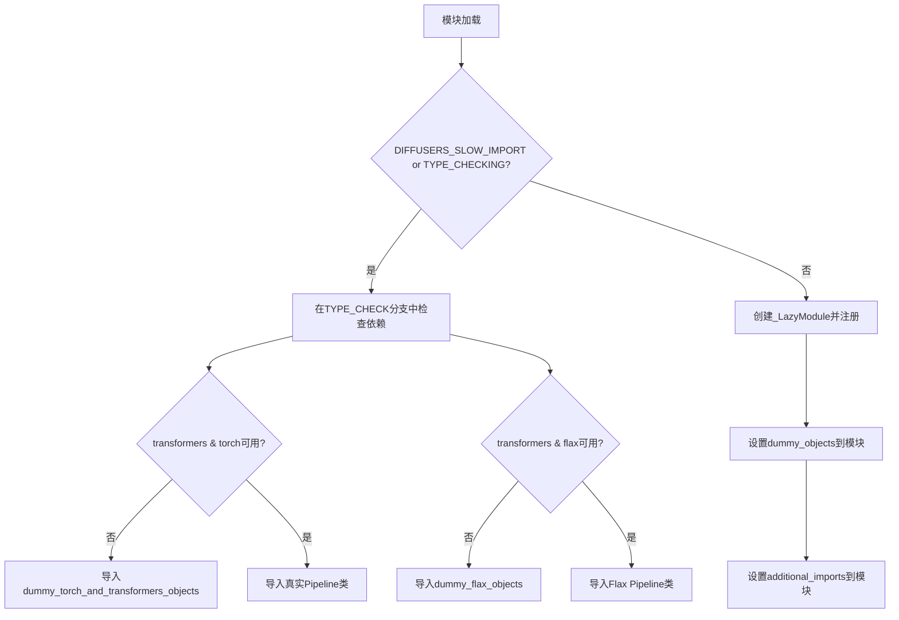
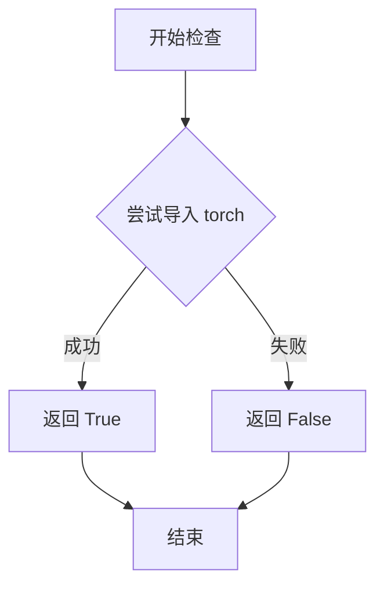
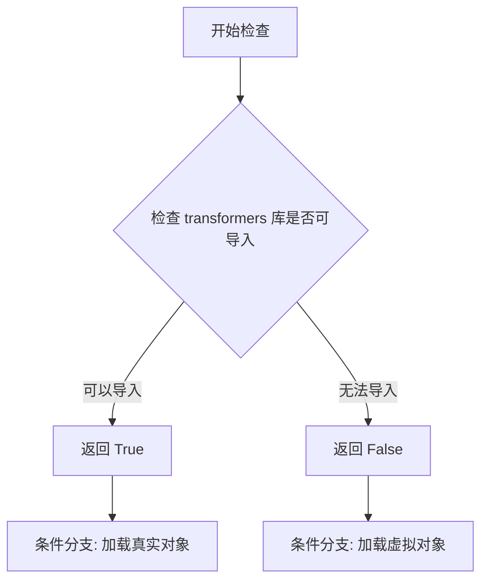
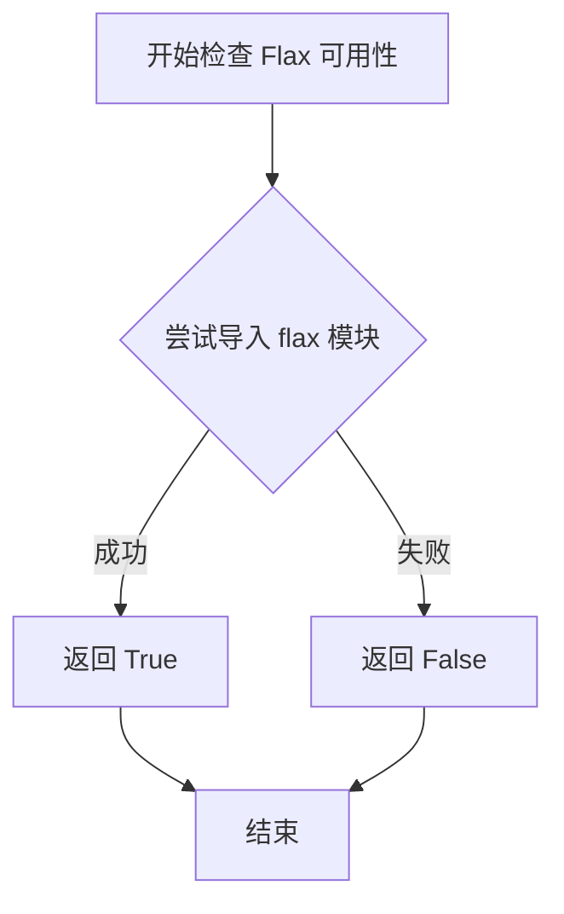
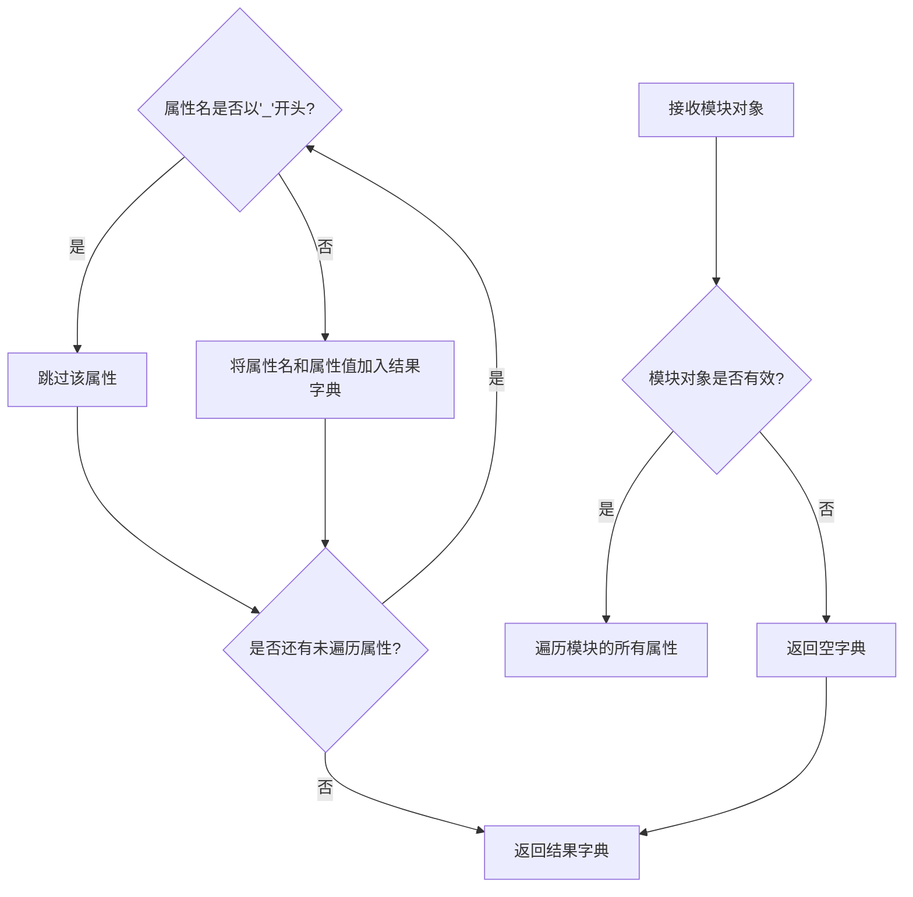
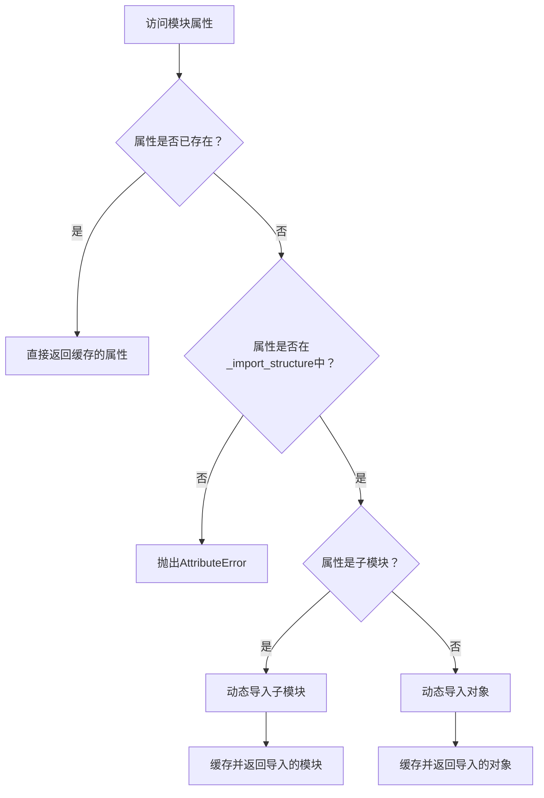
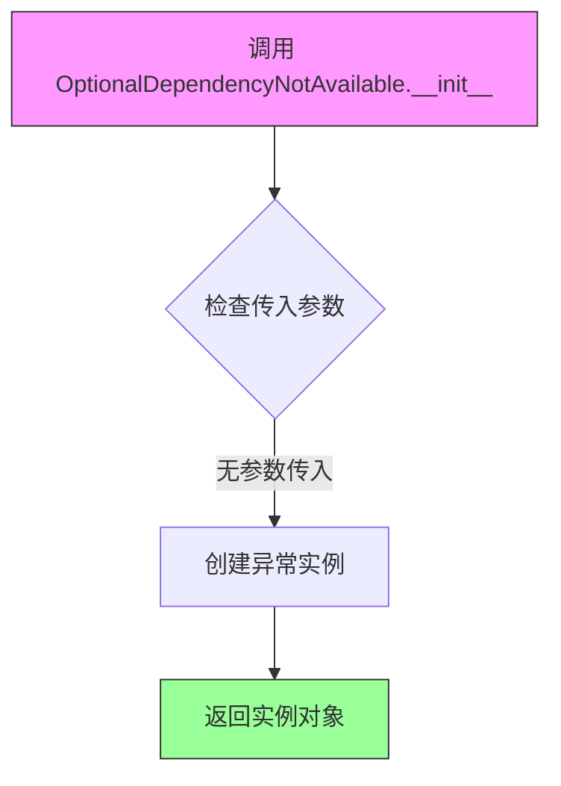

# `diffusers\src\diffusers\pipelines\stable_diffusion_xl\__init__.py` 详细设计文档

这是一个懒加载模块初始化文件，用于在diffusers库中动态导入Stable Diffusion XL相关的Pipeline类（如StableDiffusionXLPipeline、StableDiffusionXLImg2ImgPipeline等）。它通过_LazyModule机制和可选依赖检查，处理torch、transformers和flax等多种后端的条件导入，确保在缺少相应依赖时使用虚拟对象替代，从而提供优雅的向后兼容性。

## 整体流程



## 类结构

```
LazyModule System
├── _import_structure (字典 - 定义导入结构)
├── _dummy_objects (字典 - 虚拟对象)
├── _additional_imports (字典 - 额外导入)
└── TYPE_CHECKING分支 (类型检查时的导入)
```

## 全局变量及字段


### `_dummy_objects`
    
存储虚拟对象的字典，当可选依赖不可用时使用

类型：`dict`
    


### `_additional_imports`
    
存储额外导入项的字典，如Flax调度器状态

类型：`dict`
    


### `_import_structure`
    
定义模块导入结构的字典，映射子模块到导出名称

类型：`dict`
    


### `DIFFUSERS_SLOW_IMPORT`
    
标志位，控制是否启用慢速导入模式

类型：`bool`
    


### `TYPE_CHECKING`
    
typing模块标志，用于类型检查时导入类型而不执行代码

类型：`bool`
    


### `_LazyModule.__name__`
    
模块的名称

类型：`str`
    


### `_LazyModule.__file__`
    
模块文件的绝对路径

类型：`str`
    


### `_LazyModule._import_structure`
    
模块的导入结构定义

类型：`dict`
    


### `_LazyModule.__spec__`
    
模块的规范对象，包含模块元数据

类型：`ModuleSpec`
    
    

## 全局函数及方法


### `is_torch_available`

该函数是用于检查 PyTorch 库是否可用的辅助函数，通常在库中用于条件导入和可选依赖处理。

参数： 无

返回值： `bool`，返回 `True` 表示 PyTorch 可用，返回 `False` 表示 PyTorch 不可用。

#### 流程图



#### 带注释源码

```
# 这是从 ...utils 导入的函数，非本文件定义
# 以下是函数在本文件中的使用示例：
from ...utils import is_torch_available

# 使用方式 1: 条件导入检查
if is_transformers_available() and is_torch_available():
    # 当 transformers 和 torch 都可用时执行
    _import_structure["pipeline_stable_diffusion_xl"] = ["StableDiffusionXLPipeline"]

# 使用方式 2: 异常抛出用于可选依赖
try:
    if not (is_transformers_available() and is_torch_available()):
        raise OptionalDependencyNotAvailable()
except OptionalDependencyNotAvailable:
    # 加载虚拟对象作为占位符
    from ...utils import dummy_torch_and_transformers_objects
    _dummy_objects.update(get_objects_from_module(dummy_torch_and_transformers_objects))

# 使用方式 3: TYPE_CHECKING 块中的类型检查
if TYPE_CHECKING or DIFFUSERS_SLOW_IMPORT:
    try:
        if not (is_transformers_available() and is_torch_available()):
            raise OptionalDependencyNotAvailable()
    except OptionalDependencyNotAvailable:
        from ...utils.dummy_torch_and_transformers_objects import *
    else:
        # 导入实际的类型
        from .pipeline_stable_diffusion_xl import StableDiffusionXLPipeline
```

#### 备注

- **函数来源**：`is_torch_available` 函数定义在 `...utils` 模块中（非本文件）
- **通用模式**：这是 Hugging Face Diffusers 库中常用的可选依赖检查模式
- **配套函数**：通常与 `is_transformers_available()`、`is_flax_available()` 等一起使用


### `is_transformers_available`

该函数是从 `...utils` 模块导入的依赖检查函数，用于在运行时检测 `transformers` 库是否可用，以便条件性地导入需要该依赖的模块。

参数：空（无参数）

返回值：`bool`，返回 `True` 表示 `transformers` 库已安装且可用，返回 `False` 表示不可用

#### 流程图



#### 带注释源码

```python
# 该函数定义在 ...utils 模块中，当前文件只是导入并使用
# 以下是函数在当前文件中的典型使用方式：

# 导入声明
from ...utils import (
    DIFFUSERS_SLOW_IMPORT,
    OptionalDependencyNotAvailable,
    _LazyModule,
    get_objects_from_module,
    is_flax_available,
    is_torch_available,
    is_transformers_available,  # <-- 从 utils 导入的依赖检查函数
)

# 典型使用场景 1: 条件导入 Flax 相关模块
if is_transformers_available() and is_flax_available():
    _import_structure["pipeline_output"].extend(["FlaxStableDiffusionXLPipelineOutput"])

# 典型使用场景 2: 条件导入 PyTorch 相关模块
try:
    if not (is_transformers_available() and is_torch_available()):
        raise OptionalDependencyNotAvailable()
except OptionalDependencyNotAvailable:
    from ...utils import dummy_torch_and_transformers_objects
    _dummy_objects.update(get_objects_from_module(dummy_torch_and_transformers_objects))
else:
    _import_structure["pipeline_stable_diffusion_xl"] = ["StableDiffusionXLPipeline"]
    # ... 其他真实模块

# 典型使用场景 3: TYPE_CHECKING 块中的条件导入
if TYPE_CHECKING or DIFFUSERS_SLOW_IMPORT:
    try:
        if not (is_transformers_available() and is_torch_available()):
            raise OptionalDependencyNotAvailable()
    except OptionalDependencyNotAvailable:
        from ...utils.dummy_torch_and_transformers_objects import *
    else:
        from .pipeline_stable_diffusion_xl import StableDiffusionXLPipeline
        # ... 其他真实模块导入
```


### `is_flax_available`

该函数用于检查当前环境中 Flax 库（JAX 的高级 API）是否可用，通过尝试导入 `flax` 模块来判断，返回布尔值。

参数：无

返回值：`bool`，如果 Flax 库可用返回 `True`，否则返回 `False`

#### 流程图



#### 带注释源码

```python
# 该函数定义在 ...utils 模块中，此处为引用
from ...utils import is_flax_available

# 在当前文件中的典型用法：
# 1. 检查 Flax 和 Transformers 都可用时，导入 Flax 管道相关类
if is_transformers_available() and is_flax_available():
    _import_structure["pipeline_output"].extend(["FlaxStableDiffusionXLPipelineOutput"])

# 2. 检查 Flax 可用时，导入 Flax 调度器状态
if is_transformers_available() and is_flax_available():
    from ...schedulers.scheduling_pndm_flax import PNDMSchedulerState

# 3. 在 TYPE_CHECK 模式下检查 Flax 可用性
try:
    if not (is_transformers_available() and is_flax_available()):
        raise OptionalDependencyNotAvailable()
except OptionalDependencyNotAvailable:
    from ...utils.dummy_flax_objects import *
else:
    from .pipeline_flax_stable_diffusion_xl import (
        FlaxStableDiffusionXLPipeline,
    )
```

#### 技术说明

`is_flax_available()` 函数通常实现逻辑如下：

```python
# 可能的实现方式（位于 ...utils 模块）
def is_flax_available() -> bool:
    """
    检查 Flax 库是否已安装且可用
    
    Returns:
        bool: 如果可以成功导入 flax 返回 True，否则返回 False
    """
    try:
        import flax  # noqa: F401
        return True
    except ImportError:
        return False
```


### `get_objects_from_module`

该函数是 `diffusers` 库中的工具函数，用于从给定模块中提取所有非私有对象（类、函数等），返回一个以对象名称为键、对象本身为值的字典，常用于懒加载机制中动态获取模块成员。

参数：

- `module`：模块对象，需要从中提取对象的 Python 模块

返回值：`dict`，返回模块中所有非下划线开头的对象，键为对象名称字符串，值为对象本身（类或函数）

#### 流程图



#### 带注释源码

```
def get_objects_from_module(module):
    """
    从给定模块中提取所有非私有对象。
    
    该函数主要用于懒加载机制，收集模块中所有公开的类、函数等对象，
    排除以下划线开头的私有成员。
    
    参数:
        module: Python模块对象，需要从中提取对象的模块
        
    返回:
        dict: 键为对象名称字符串，值为对象本身的字典
    """
    # 初始化结果字典
    objects = {}
    
    # 遍历模块的所有属性
    for attr_name in dir(module):
        # 跳过以下划线开头的私有/内部属性
        if attr_name.startswith('_'):
            continue
            
        # 获取属性值
        attr_value = getattr(module, attr_name)
        
        # 将公开对象添加到结果字典
        objects[attr_name] = attr_value
        
    return objects

# 在代码中的实际使用示例：
_dummy_objects.update(get_objects_from_module(dummy_torch_and_transformers_objects))
# 将dummy_torch_and_transformers_objects模块中的所有公开对象
# 批量添加到_dummy_objects字典中，用于后续的懒加载注册
```


### `setattr` (内置函数)

设置指定对象指定名称的属性值。如果属性不存在，则创建该属性。

参数：

- `obj`：对象（object），要在其上设置属性的目标对象
- `name`：字符串（str），要设置的属性名称
- `value`：任意类型（any），要设置的属性值

返回值：`None`，无返回值

#### 流程图

```mermaid
flowchart TD
    A[开始] --> B{检查 name 是否为字符串}
    B -->|是| C{检查对象是否有 __setattr__}
    B -->|否| D[抛出 TypeError]
    C -->|是| E[调用对象的 __setattr__ 方法]
    C -->|否| F[抛出 AttributeError]
    E --> G[在对象上设置属性]
    G --> H[返回 None]
    
    I[开始] --> J[遍历 _dummy_objects]
    J --> K[获取 name, value]
    K --> L[调用 setattr sys.modules[__name__], name, value]
    L --> M[继续遍历]
    M --> J
    M --> N{遍历结束?}
    N -->|是| O[遍历 _additional_imports]
    O --> P[获取 name, value]
    P --> Q[调用 setattr sys.modules[__name__], name, value]
    Q --> R[继续遍历]
    R --> O
    R --> S{遍历结束?}
    S --> T[结束]
```

#### 带注释源码

```python
# setattr 是 Python 内置函数，用于设置对象的属性值
# 在本代码中有两处调用：

# 第一处：将虚拟对象添加到当前模块
for name, value in _dummy_objects.items():
    # 语法：setattr(obj, name, value)
    # 参数：
    #   obj: sys.modules[__name__] - 当前模块对象
    #   name: str - 属性名（来自 _dummy_objects 字典的键）
    #   value: 任意类型 - 属性值（来自 _dummy_objects 字典的值）
    setattr(sys.modules[__name__], name, value)

# 第二处：将额外的导入项添加到当前模块
for name, value in _additional_imports.items():
    # 语法：setattr(obj, name, value)
    # 参数：
    #   obj: sys.modules[__name__] - 当前模块对象
    #   name: str - 属性名（来自 _additional_imports 字典的键）
    #   value: 任意类型 - 属性值（来自 _additional_imports 字典的值，通常是类或模块）
    setattr(sys.modules[__name__], name, value)

# 注意：setattr 函数本身返回 None，它就地修改对象的状态
```

#### 详细说明

| 属性 | 描述 |
|------|------|
| **函数类型** | Python 内置函数 |
| **模块** | 内置 |
| **语法** | `setattr(obj, name, value)` |
| **异常处理** | 如果 `name` 不是字符串，抛出 `TypeError`；如果对象不允许设置属性，抛出 `AttributeError` |

#### 在本代码中的作用

1. **动态模块构建**：在 `else` 分支（非 TYPE_CHECKING 模式）下，使用 `setattr` 将延迟加载的虚拟对象和额外导入项动态添加到模块中
2. **懒加载机制**：配合 `_LazyModule` 实现延迟导入，只有在实际使用这些对象时才从模块中获取


### `_LazyModule.__getattr__`

`_LazyModule` 类的动态属性访问方法，用于在模块被导入时延迟加载子模块或类。当访问模块的某个属性时，如果该属性尚未被加载，则根据 `_import_structure` 动态导入并返回对应的对象。

参数：

-  `name`：`str`，要访问的属性名称

返回值：`Any`，返回延迟加载的属性对象（类、函数或模块），如果属性不存在则抛出 `AttributeError`

#### 流程图



#### 带注释源码

```python
# _LazyModule.__getattr__ 方法的典型实现
# 位于 ...utils._LazyModule 类中

def __getattr__(name: str):
    """
    动态属性访问方法，用于延迟加载模块属性。
    
    当访问模块的某个属性时：
    1. 首先检查该属性是否已经被缓存（已加载）
    2. 如果未缓存，查找_import_structure中是否定义了此属性
    3. 如果存在定义，则动态导入并缓存该属性
    4. 如果不存在，则抛出AttributeError
    """
    # 检查属性是否已经在缓存中
    if name in self._objects:
        return self._objects[name]
    
    # 检查属性是否在导入结构中定义
    if name not in self._import_structure:
        raise AttributeError(f"module {self.__name__!r} has no attribute {name!r}")
    
    # 获取导入结构中的类型信息
    value = self._import_structure[name]
    
    # 根据类型处理导入
    if isinstance(value, tuple):
        # 对于元组类型（如：(模块路径, [类名列表])）
        module_path, attr_names = value
        # 动态导入模块
        module = importlib.import_module(module_path)
        # 如果只有一个属性，直接返回该属性
        if len(attr_names) == 1:
            value = getattr(module, attr_names[0])
        else:
            # 如果有多个属性，返回包含这些属性的子模块
            value = module
    else:
        # 对于字符串类型，直接导入
        module = importlib.import_module(value)
        value = module
    
    # 缓存导入的对象以避免重复导入
    self._objects[name] = value
    
    return value
```

#### 补充说明

- **延迟加载机制**：通过 `__getattr__` 实现按需导入，只有当代码实际使用某个类或模块时才会将其加载到内存中
- **缓存机制**：首次访问属性后会将结果缓存到 `_objects` 字典中，后续访问直接返回缓存值
- **与 setattr 配合**：代码中使用 `setattr(sys.modules[__name__], name, value)` 为模块添加虚拟的占位对象，这些对象在后续访问时会被 `__getattr__` 拦截并处理
- **错误处理**：如果访问的属性既不在缓存中，也不在导入结构中，会抛出标准的 `AttributeError` 异常


### `OptionalDependencyNotAvailable.__init__`

该方法是 `OptionalDependencyNotAvailable` 类的构造函数，用于实例化一个可选依赖不可用异常。该类在 `...utils` 模块中定义，在当前代码文件中被导入并用于处理可选依赖缺失的情况。当 transformers 和 torch 同时不可用时，会抛出此异常。

参数：

- `self`：实例对象本身（隐式参数）

返回值：`None`，__init__ 方法通常不返回值

#### 流程图



#### 带注释源码

```
# 注意：OptionalDependencyNotAvailable 类的定义不在当前代码文件中
# 而是从 ...utils 模块导入

# 使用示例（来自当前代码文件）:
try:
    if not (is_transformers_available() and is_torch_available()):
        raise OptionalDependencyNotAvailable()  # <-- 实例化该异常类
except OptionalDependencyNotAvailable:
    from ...utils import dummy_torch_and_transformers_objects
    _dummy_objects.update(get_objects_from_module(dummy_torch_and_transformers_objects))

# 从用法可以推断:
# - 这是一个异常类（通过 raise 关键字使用）
# - __init__ 不需要任何参数（调用时为空括号）
# - 继承自某个基础异常类（可能是 Exception）
```

> **注意**：由于 `OptionalDependencyNotAvailable` 类的实际定义在 `...utils` 模块中（未在当前代码文件中提供），上述源码是基于该类在当前文件中的使用方式推断得出的。该异常类用于在可选依赖（torch 和 transformers）不可用时抛出，以便程序能够优雅地处理这种情况并回退到 dummy 对象。

## 关键组件


### 惰性加载模块系统 (_LazyModule)

使用 _LazyModule 实现延迟导入机制，只有在实际访问模块时才加载真实的类和函数，避免启动时的全量导入开销。

### 可选依赖检查与虚拟对象

通过 is_transformers_available()、is_torch_available()、is_flax_available() 动态检测可选依赖，当依赖不可用时使用 _dummy_objects 提供虚拟对象保证模块可导入。

### 导入结构定义 (_import_structure)

定义模块的公共API接口，包含 pipeline_output、pipeline_stable_diffusion_xl、pipeline_flax_stable_diffusion_xl 等子模块的导出清单。

### Stable Diffusion XL  Pipeline 集合

提供四个主要的 Stable Diffusion XL Pipeline：StableDiffusionXLPipeline（文本到图像）、StableDiffusionXLImg2ImgPipeline（图像到图像）、StableDiffusionXLInpaintPipeline（图像修复）、StableDiffusionXLInstructPix2PixPipeline（指令式图像编辑）。

### Flax 支持层

包含 Flax 框架的 Stable Diffusion XL 实现和 PNDMSchedulerState 调度器状态，用于高性能的 JAX/Flax 推理。

### 类型检查分支 (TYPE_CHECKING)

在类型检查模式下直接导入所有类型，用于静态类型分析和IDE代码补全，不执行惰性加载逻辑。


## 问题及建议


### 已知问题

-   **重复的条件检查**：代码中两次出现 `is_transformers_available() and is_torch_available()` 的检查逻辑，一次在 try-except 块中，一次在 TYPE_CHECKING 分支中，违反了 DRY 原则
-   **通配符导入**：`from ...utils.dummy_torch_and_transformers_objects import *` 和 `from ...utils.dummy_flax_objects import *` 使用了通配符导入，降低了代码的可读性和可维护性，且可能导入未使用的对象
-   **魔法字符串与硬编码**：模块名称（如 "pipeline_stable_diffusion_xl"）以字符串形式硬编码在 `_import_structure` 字典中，容易出现拼写错误且难以追踪
-   **混合的条件逻辑风格**：混用了 try-except 和 if-else 两种方式处理可选依赖，导致逻辑流程不清晰，增加了理解成本
-   **动态属性赋值**：`setattr(sys.modules[__name__], name, value)` 的方式动态添加模块成员，隐藏了实际的模块接口，不利于 IDE 静态分析和类型检查
-   **重复的导入结构构建**：在 try-except 和 TYPE_CHECKING 分支中分别构建了相似的导入结构，导致代码冗余

### 优化建议

-   **提取公共函数**：将可选依赖检查逻辑封装为函数，例如 ` _check_transformers_and_torch()`，避免重复代码
-   **显式导入替代通配符**：改用显式的导入方式，列出实际需要的 dummy 对象，提高代码可读性
-   **使用枚举或常量类**：将模块名称字符串定义为常量或使用枚举，避免硬编码字符串
-   **统一条件逻辑风格**：统一使用 try-except 或 if-else 中的一种方式处理可选依赖，提高一致性
-   **集中管理模块导出**：考虑使用 `__all__` 显式声明导出的公共接口，配合类型注解完善文档
-   **重构 LazyModule 配置**：将动态属性赋值的逻辑集中管理，减少运行时动态修改模块状态的行为

## 其它


### 设计目标与约束

本模块的设计目标是实现Stable Diffusion XL (SDXL)系列Pipeline的延迟加载（Lazy Loading），通过`_LazyModule`机制在用户实际使用时才导入重量级依赖（torch、transformers、flax），从而优化库的初始导入速度。核心约束包括：1) 必须同时满足torch和transformers可用才能加载SDXL核心pipeline；2) Flax版本pipeline需要transformers和flax同时可用；3) 需要保持与Diffusers框架其他模块的导入结构一致性；4) 需支持TYPE_CHECKING模式下的静态类型检查。

### 错误处理与异常设计

模块采用可选依赖检查模式处理导入错误：1) 使用`OptionalDependencyNotAvailable`异常标记可选依赖不可用的情况；2) 当transformers和torch任一不可用时，触发异常并回退到导入dummy对象；3) 当transformers和flax任一不可用时，同样触发异常并导入dummy flax对象；4) 通过try-except捕获异常，避免程序中断；5) dummy对象作为占位符，确保模块结构完整但功能受限。

### 外部依赖与接口契约

**核心依赖**：transformers、torch、flax（可选）、diffusers.utils模块  
**接口契约**：  
- `_LazyModule`：接收模块名、文件路径、导入结构字典、模块规格，实现按需导入  
- `get_objects_from_module`：从模块获取对象字典的工具函数  
- `is_*_available()`：各依赖库的可用性检查函数  
- 导出类遵循统一命名规范（如`StableDiffusionXLPipeline`），返回类型为`StableDiffusionXLPipelineOutput`

### 版本兼容性考虑

本模块需要特定版本兼容：1) Transformers库需支持SDXL模型结构；2) PyTorch版本需满足transformers的运行要求；3) Flax版本需与JAX/Flax生态兼容；4) 需兼容Diffusers库的版本发布节奏，保持API稳定性；5) 建议在requirements中明确最低版本要求。

### 配置管理与环境检测

模块通过环境变量和运行时检测实现配置：1) `DIFFUSERS_SLOW_IMPORT`变量控制是否跳过延迟加载；2) `TYPE_CHECKING`用于静态类型检查阶段的完全导入；3) 依赖可用性在模块加载时动态检测；4) 支持通过`sys.modules`手动注册模块实例。

### 性能优化策略

延迟加载机制带来以下性能优势：1) 减少库初始化时的内存占用；2) 缩短首次import的响应时间；3) 按需加载GPU相关依赖；4) dummy对象机制避免导入错误的同时保持API一致性；5) 建议配合`__all__`显式声明导出接口以进一步优化。

### 测试策略建议

应包含以下测试用例：1) 依赖可用性检测的正确性测试；2) 延迟加载模式下模块属性的正确解析；3) TYPE_CHECKING模式下的类型导入验证；4) 可选依赖缺失时的回退机制测试；5) dummy对象的存在性和行为验证；6) 与其他Diffusers模块的集成测试。

### 安全考虑

模块本身为纯Python导入层，安全性考量包括：1) 导入的动态代码执行限定在受信任的内部模块；2) 避免使用eval/exec等危险函数；3) 通过框架官方渠道获取依赖；4) 建议在生产环境中使用固定版本依赖以确保可重现性。

### 部署与分发

本模块作为Diffusers库的子模块分发，部署时需注意：1) 确保所有依赖库正确安装；2) 遵循库的版本兼容矩阵；3) GPU环境需预装CUDA和对应PyTorch版本；4) 容器化部署时需包含完整的依赖链；5) 建议使用虚拟环境隔离项目依赖。

    