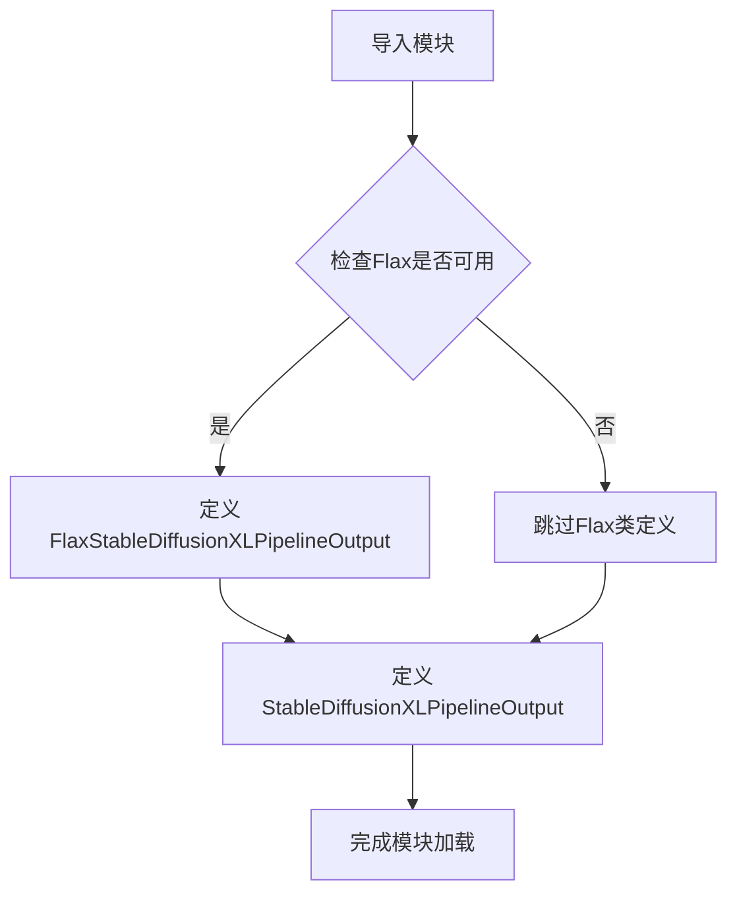

# `diffusers\src\diffusers\pipelines\stable_diffusion_xl\pipeline_output.py` 详细设计文档

该文件定义了Stable Diffusion XL管道的输出类，用于封装去噪后的图像数据。包含两个输出类：一个是标准的Python实现（支持PIL图像列表或numpy数组），另一个是针对JAX/Flax框架的特殊实现（仅numpy数组）。

## 整体流程



## 类结构

```
BaseOutput (抽象基类)
└── StableDiffusionXLPipelineOutput (数据类)
BaseOutput (抽象基类)
└── FlaxStableDiffusionXLPipelineOutput (Flax数据类，仅当Flax可用时)
```

## 全局变量及字段


### `StableDiffusionXLPipelineOutput.images`
    
去噪后的图像列表或numpy数组，形状为(batch_size, height, width, num_channels)

类型：`list[PIL.Image.Image] | np.ndarray`
    


### `FlaxStableDiffusionXLPipelineOutput.images`
    
去噪后的numpy数组图像，形状为(batch_size, height, width, num_channels)

类型：`np.ndarray`
    
    

## 全局函数及方法


## 关键组件


### StableDiffusionXLPipelineOutput

数据类，继承自 BaseOutput，用于存储 Stable Diffusion XL 管道推理后的去噪图像输出。包含 images 属性，可以是 PIL.Image 列表或 NumPy 数组，类型为 list[PIL.Image.Image] | np.ndarray。

### FlaxStableDiffusionXLPipelineOutput

Flax 结构化数据类，继承自 BaseOutput，用于存储 Flax 版本的 Stable Diffusion XL 管道输出。专门为 JAX/Flax 框架优化，使用 flax.struct.dataclass 装饰器以支持不可变数据结构。

### BaseOutput

基类，定义了管道输出的通用接口，是所有管道输出类的父类，提供基础的数据结构支持。

### images

类字段，类型为 list[PIL.Image.Image] | np.ndarray，表示去噪后的图像输出，可以是 PIL 图像列表或 NumPy 数组，形状为 (batch_size, height, width, num_channels)。

### is_flax_available

全局函数/工具函数，用于检查 Flax 框架是否可用，根据可用性动态决定是否定义 Flax 专用的输出类。


## 问题及建议


### 已知问题

-   **类型注解兼容性问题**：使用了 Python 3.10+ 的联合类型语法 `list[PIL.Image.Image] | np.ndarray`，降低了与旧版本 Python 的兼容性
-   **文档不完整**：`StableDiffusionXLPipelineOutput` 的 docstring 中 `images` 参数的描述被截断，缺少对参数含义的完整说明
-   **条件定义无提示**：`FlaxStableDiffusionXLPipelineOutput` 类在 `is_flax_available()` 返回 False 时不会被定义，但没有任何文档说明这种条件依赖
-   **缺少类型验证**：没有在 `__post_init__` 中验证 `images` 字段的实际类型是否与声明的类型一致
-   **Flax 类缺少批注**：Flax 版本使用 `flax.struct.dataclass` 装饰器，但未说明该类的使用场景和与普通版本的区别

### 优化建议

-   使用 `typing.Union` 替代联合类型语法以提升兼容性：`Union[List[PIL.Image.Image], np.ndarray]`
-   完善 docstring，为 `images` 参数添加完整的参数描述，说明不同类型返回值的使用场景
-   在类中添加 `__post_init__` 方法进行类型检查和验证，确保 `images` 字段类型正确
-   在模块级别添加明确的注释或文档字符串，说明 Flax 版本的依赖条件和可选性
-   考虑为两个输出类添加默认值或可选参数的文档说明，提升 API 的易用性


## 其它


### 设计目标与约束

该代码模块的设计目标是定义 Stable Diffusion XL Pipeline 的输出数据结构，提供统一的输出格式封装，支持 PIL 图像和 NumPy 数组两种格式。设计约束包括：必须继承自 BaseOutput 基类以保持一致性；当 Flax 框架可用时，提供对应的 Flax 结构化输出类以支持 JAX/Flax 生态；使用 Python 3.10+ 的类型联合语法以获得更好的类型提示支持。

### 错误处理与异常设计

由于该模块仅作为数据容器（Data Class），不包含复杂的业务逻辑，因此错误处理主要依赖于数据类型的运行时检查。调用方需要确保传入的 images 参数类型符合预期（PIL.Image.Image 列表或 np.ndarray）。若类型不匹配，预期在后续的 Pipeline 处理流程中抛出 TypeError 异常。建议在文档中明确标注类型要求，以供静态类型检查工具（如 mypy）进行验证。

### 外部依赖与接口契约

该模块依赖以下外部组件：`BaseOutput` 来自 `...utils` 包（相对导入），提供基础输出类的定义；`is_flax_available()` 函数用于检测 Flax 框架是否可用；`PIL.Image` 提供图像处理能力；`numpy` 提供数值数组支持。接口契约方面，`StableDiffusionXLPipelineOutput` 期望接收 `images` 参数，类型为 `list[PIL.Image.Image]` 或 `np.ndarray`，该字段将在 Pipeline 的推理完成后被赋值。

### 性能考虑与优化空间

当前实现使用 `@dataclass` 装饰器，对于大规模批处理场景（如 batch_size 较大的图像生成任务），数据类的内存开销可能成为瓶颈。当 Flax 可用时，`flax.struct.dataclass` 提供了更好的性能优化，建议在 JAX/Flax 环境下优先使用。后续可考虑添加 `__slots__` 优化内存使用，或根据性能分析结果决定是否需要进一步优化。

### 测试策略建议

建议包含以下测试用例：实例化 `StableDiffusionXLPipelineOutput` 并验证 `images` 字段正确存储；测试类型联合的兼容性，验证可接受 `list[PIL.Image.Image]` 和 `np.ndarray` 两种类型；验证继承关系，确认继承自 `BaseOutput`；条件测试：当 Flax 可用时，验证 `FlaxStableDiffusionXLPipelineOutput` 的正确性和不可变性特性。

### 版本兼容性说明

该代码使用了 Python 3.10+ 的类型联合语法（`|` 操作符），不兼容 Python 3.9 及更早版本。若需要支持更低版本的 Python，应改用 `Union` 类型从 `typing` 模块导入。Flax 相关的类为条件定义，仅在 `is_flax_available()` 返回 True 时可用。

### 文档与注释充分性

当前代码包含基础的文档字符串，说明了输出类的用途和参数含义。建议补充更详细的使用场景说明，例如在实际 Pipeline 中的调用时机和数据流向。此外，可添加 seealso 引用，链接到相关的 Pipeline 实现类和 BaseOutput 基类，以便开发者快速查阅完整上下文。


    