# `diffusers\src\diffusers\pipelines\stable_diffusion_xl\pipeline_stable_diffusion_xl.py` 详细设计文档

Stable Diffusion XL Pipeline是一个用于文本到图像生成的高质量扩散模型管道，支持双文本编码器（CLIP Text Encoder和CLIP Text Encoder with Projection）、VAE解码、IP Adapter图像适配器、LoRA权重加载、文本反转嵌入、水印处理等功能，实现了基于文本提示的图像生成能力。

## 整体流程

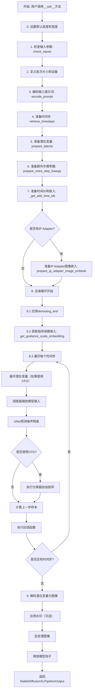

## 类结构

```
DiffusionPipeline (抽象基类)
├── StableDiffusionMixin
├── FromSingleFileMixin
├── StableDiffusionXLLoraLoaderMixin
├── TextualInversionLoaderMixin
├── IPAdapterMixin
└── StableDiffusionXLPipeline
```

## 全局变量及字段


### `logger`
    
模块级日志记录器，用于输出调试和运行信息

类型：`logging.Logger`
    


### `EXAMPLE_DOC_STRING`
    
示例文档字符串，展示StableDiffusionXLPipeline的基本用法

类型：`str`
    


### `XLA_AVAILABLE`
    
标志位，指示PyTorch XLA是否可用以支持TPU加速

类型：`bool`
    


### `rescale_noise_cfg`
    
根据guidance_rescale参数重新缩放噪声预测张量以改善图像质量

类型：`function`
    


### `retrieve_timesteps`
    
获取调度器的 timesteps 列表，支持自定义时间步和 sigma

类型：`function`
    


### `StableDiffusionXLPipeline.model_cpu_offload_seq`
    
定义模型卸载到CPU的顺序序列

类型：`str`
    


### `StableDiffusionXLPipeline._optional_components`
    
可选组件列表，用于标识哪些模块可以缺失

类型：`list[str]`
    


### `StableDiffusionXLPipeline._callback_tensor_inputs`
    
回调函数可访问的张量输入名称列表

类型：`list[str]`
    


### `StableDiffusionXLPipeline.vae`
    
变分自编码器，用于图像与潜在表示之间的转换

类型：`AutoencoderKL`
    


### `StableDiffusionXLPipeline.text_encoder`
    
冻结的文本编码器，将文本提示转换为嵌入向量

类型：`CLIPTextModel`
    


### `StableDiffusionXLPipeline.text_encoder_2`
    
第二个冻结的文本编码器，提供池化输出和投影维度

类型：`CLIPTextModelWithProjection`
    


### `StableDiffusionXLPipeline.tokenizer`
    
第一个分词器，用于将文本转换为token ID

类型：`CLIPTokenizer`
    


### `StableDiffusionXLPipeline.tokenizer_2`
    
第二个分词器，配合 text_encoder_2 使用

类型：`CLIPTokenizer`
    


### `StableDiffusionXLPipeline.unet`
    
条件U-Net模型，用于去噪潜在表示

类型：`UNet2DConditionModel`
    


### `StableDiffusionXLPipeline.scheduler`
    
扩散调度器，控制去噪过程的噪声调度

类型：`KarrasDiffusionSchedulers`
    


### `StableDiffusionXLPipeline.image_encoder`
    
图像编码器，用于IP-Adapter图像特征提取

类型：`CLIPVisionModelWithProjection`
    


### `StableDiffusionXLPipeline.feature_extractor`
    
图像特征提取器，用于预处理输入图像

类型：`CLIPImageProcessor`
    


### `StableDiffusionXLPipeline.force_zeros_for_empty_prompt`
    
是否对空提示强制使用零嵌入

类型：`bool`
    


### `StableDiffusionXLPipeline.vae_scale_factor`
    
VAE缩放因子，用于计算潜在空间的尺寸

类型：`int`
    


### `StableDiffusionXLPipeline.image_processor`
    
图像处理器，用于VAE解码后的图像后处理

类型：`VaeImageProcessor`
    


### `StableDiffusionXLPipeline.default_sample_size`
    
默认采样尺寸，基于UNet配置的样本大小

类型：`int`
    


### `StableDiffusionXLPipeline.watermark`
    
水印处理器，用于添加不可见水印

类型：`StableDiffusionXLWatermarker | None`
    


### `StableDiffusionXLPipeline._guidance_scale`
    
无分类器自由引导的guidance缩放因子

类型：`float`
    


### `StableDiffusionXLPipeline._guidance_rescale`
    
噪声预测重新缩放因子，用于修复过度曝光

类型：`float`
    


### `StableDiffusionXLPipeline._clip_skip`
    
CLIP编码器跳过的层数

类型：`int | None`
    


### `StableDiffusionXLPipeline._cross_attention_kwargs`
    
交叉注意力关键参数字典

类型：`dict[str, Any] | None`
    


### `StableDiffusionXLPipeline._denoising_end`
    
提前终止去噪过程的阈值

类型：`float | None`
    


### `StableDiffusionXLPipeline._num_timesteps`
    
去噪过程的总时间步数

类型：`int`
    


### `StableDiffusionXLPipeline._interrupt`
    
中断标志，用于暂停或停止生成过程

类型：`bool`
    
    

## 全局函数及方法


### `rescale_noise_cfg`

该函数是一个全局函数，用于根据`guidance_rescale`参数重新缩放噪声预测张量，以提高图像质量并修复过度曝光问题。该方法基于论文"Common Diffusion Noise Schedules and Sample Steps are Flawed"第3.4节的内容。

参数：

- `noise_cfg`：`torch.Tensor`，引导扩散过程中预测的噪声张量
- `noise_pred_text`：`torch.Tensor`，文本引导扩散过程中预测的噪声张量
- `guidance_rescale`：`float`，可选参数，默认值为0.0应用于噪声预测的重缩放因子

返回值：`torch.Tensor`，重缩放后的噪声预测张量

#### 流程图

```mermaid
flowchart TD
    A[开始] --> B[计算noise_pred_text的标准差std_text]
    B --> C[计算noise_cfg的标准差std_cfg]
    C --> D[计算缩放后的噪声预测noise_pred_rescaled = noise_cfg × std_text/std_cfg]
    D --> E[根据guidance_rescale混合: noise_cfg = guidance_rescale × noise_pred_rescaled + (1 - guidance_rescale) × noise_cfg]
    E --> F[返回重缩放后的noise_cfg]
```

#### 带注释源码

```
def rescale_noise_cfg(noise_cfg, noise_pred_text, guidance_rescale=0.0):
    r"""
    Rescales `noise_cfg` tensor based on `guidance_rescale` to improve image quality and fix overexposure. Based on
    Section 3.4 from [Common Diffusion Noise Schedules and Sample Steps are
    Flawed](https://huggingface.co/papers/2305.08891).

    Args:
        noise_cfg (`torch.Tensor`):
            The predicted noise tensor for the guided diffusion process.
        noise_pred_text (`torch.Tensor`):
            The predicted noise tensor for the text-guided diffusion process.
        guidance_rescale (`float`, *optional*, defaults to 0.0):
            A rescale factor applied to the noise predictions.

    Returns:
        noise_cfg (`torch.Tensor`): The rescaled noise prediction tensor.
    """
    # 计算文本预测噪声在所有空间维度上的标准差
    # keepdim=True保持维度以便后续广播计算
    std_text = noise_pred_text.std(dim=list(range(1, noise_pred_text.ndim)), keepdim=True)
    
    # 计算噪声配置在所有空间维度上的标准差
    std_cfg = noise_cfg.std(dim=list(range(1, noise_cfg.ndim)), keepdim=True)
    
    # 使用文本预测噪声的标准差重新缩放噪声配置（修复过度曝光）
    noise_pred_rescaled = noise_cfg * (std_text / std_cfg)
    
    # 将重缩放后的结果与原始结果按guidance_rescale因子混合
    # 避免生成"平淡无奇"的图像
    noise_cfg = guidance_rescale * noise_pred_rescaled + (1 - guidance_rescale) * noise_cfg
    
    return noise_cfg
```


### `retrieve_timesteps`

该函数是 Stable Diffusion XL Pipeline 中的工具函数，用于获取扩散模型的时间步调度。它调用调度器的 `set_timesteps` 方法，并根据传入的自定义参数（timesteps 或 sigmas）或默认的推理步数来生成时间步序列。同时，它还负责验证调度器是否支持所请求的时间步设置方式。

参数：

- `scheduler`：`SchedulerMixin`，调度器对象，用于生成时间步序列
- `num_inference_steps`：`int | None`，推理步数，用于生成样本的扩散步数，当使用此参数时，`timesteps` 必须为 `None`
- `device`：`str | torch.device | None`，时间步要移动到的设备，如果为 `None`，则不移动时间步
- `timesteps`：`list[int] | None`，自定义时间步，用于覆盖调度器的时间步间隔策略，如果传入此参数，`num_inference_steps` 和 `sigmas` 必须为 `None`
- `sigmas`：`list[float] | None`，自定义 sigmas，用于覆盖调度器的时间步间隔策略，如果传入此参数，`num_inference_steps` 和 `timesteps` 必须为 `None`
- `**kwargs`：任意关键字参数，将传递给调度器的 `set_timesteps` 方法

返回值：`tuple[torch.Tensor, int]`，第一个元素是调度器的时间步张量，第二个元素是推理步数

#### 流程图

```mermaid
flowchart TD
    A[开始 retrieve_timesteps] --> B{检查 timesteps 和 sigmas 是否同时传入}
    B -->|是| C[抛出 ValueError: 只能传一个]
    B -->|否| D{是否传入 timesteps}
    D -->|是| E{检查 scheduler.set_timesteps 是否支持 timesteps 参数}
    E -->|不支持| F[抛出 ValueError: 当前调度器不支持自定义时间步]
    E -->|支持| G[调用 scheduler.set_timesteps<br/>传入 timesteps 和 device]
    G --> H[获取 scheduler.timesteps]
    H --> I[计算 num_inference_steps = len(timesteps)]
    I --> J[返回 timesteps 和 num_inference_steps]
    D -->|否| K{是否传入 sigmas}
    K -->|是| L{检查 scheduler.set_timesteps 是否支持 sigmas 参数}
    L -->|不支持| M[抛出 ValueError: 当前调度器不支持自定义 sigmas]
    L -->|支持| N[调用 scheduler.set_timesteps<br/>传入 sigmas 和 device]
    N --> O[获取 scheduler.timesteps]
    O --> P[计算 num_inference_steps = len(timesteps)]
    P --> J
    K -->|否| Q[调用 scheduler.set_timesteps<br/>传入 num_inference_steps 和 device]
    Q --> R[获取 scheduler.timesteps]
    R --> S[获取 scheduler 默认的 num_inference_steps]
    S --> J
```

#### 带注释源码

```python
def retrieve_timesteps(
    scheduler,
    num_inference_steps: int | None = None,
    device: str | torch.device | None = None,
    timesteps: list[int] | None = None,
    sigmas: list[float] | None = None,
    **kwargs,
):
    r"""
    Calls the scheduler's `set_timesteps` method and retrieves timesteps from the scheduler after the call. Handles
    custom timesteps. Any kwargs will be supplied to `scheduler.set_timesteps`.

    Args:
        scheduler (`SchedulerMixin`):
            The scheduler to get timesteps from.
        num_inference_steps (`int`):
            The number of diffusion steps used when generating samples with a pre-trained model. If used, `timesteps`
            must be `None`.
        device (`str` or `torch.device`, *optional*):
            The device to which the timesteps should be moved to. If `None`, the timesteps are not moved.
        timesteps (`list[int]`, *optional*):
            Custom timesteps used to override the timestep spacing strategy of the scheduler. If `timesteps` is passed,
            `num_inference_steps` and `sigmas` must be `None`.
        sigmas (`list[float]`, *optional*):
            Custom sigmas used to override the timestep spacing strategy of the scheduler. If `sigmas` is passed,
            `num_inference_steps` and `timesteps` must be `None`.

    Returns:
        `tuple[torch.Tensor, int]`: A tuple where the first element is the timestep schedule from the scheduler and the
        second element is the number of inference steps.
    """
    # 检查是否同时传入了 timesteps 和 sigmas，两者只能选其一
    if timesteps is not None and sigmas is not None:
        raise ValueError("Only one of `timesteps` or `sigmas` can be passed. Please choose one to set custom values")
    
    # 处理自定义时间步的情况
    if timesteps is not None:
        # 检查调度器的 set_timesteps 方法是否接受 timesteps 参数
        accepts_timesteps = "timesteps" in set(inspect.signature(scheduler.set_timesteps).parameters.keys())
        if not accepts_timesteps:
            raise ValueError(
                f"The current scheduler class {scheduler.__class__}'s `set_timesteps` does not support custom"
                f" timestep schedules. Please check whether you are using the correct scheduler."
            )
        # 调用调度器的 set_timesteps 方法设置自定义时间步
        scheduler.set_timesteps(timesteps=timesteps, device=device, **kwargs)
        # 从调度器获取生成的时间步
        timesteps = scheduler.timesteps
        # 计算推理步数
        num_inference_steps = len(timesteps)
    
    # 处理自定义 sigmas 的情况
    elif sigmas is not None:
        # 检查调度器的 set_timesteps 方法是否接受 sigmas 参数
        accept_sigmas = "sigmas" in set(inspect.signature(scheduler.set_timesteps).parameters.keys())
        if not accept_sigmas:
            raise ValueError(
                f"The current scheduler class {scheduler.__class__}'s `set_timesteps` does not support custom"
                f" sigmas schedules. Please check whether you are using the correct scheduler."
            )
        # 调用调度器的 set_timesteps 方法设置自定义 sigmas
        scheduler.set_timesteps(sigmas=sigmas, device=device, **kwargs)
        # 从调度器获取生成的时间步
        timesteps = scheduler.timesteps
        # 计算推理步数
        num_inference_steps = len(timesteps)
    
    # 使用默认的推理步数
    else:
        scheduler.set_timesteps(num_inference_steps, device=device, **kwargs)
        timesteps = scheduler.timesteps
    
    # 返回时间步序列和推理步数
    return timesteps, num_inference_steps
```


### `StableDiffusionXLPipeline.__init__`

这是 Stable Diffusion XL Pipeline 的初始化方法，负责接收并注册所有必要的模型组件（VAE、文本编码器、UNet、调度器等），配置图像处理器、默认采样尺寸，以及可选的水印处理器。

参数：

- `vae`：`AutoencoderKL`，Variational Auto-Encoder (VAE) 模型，用于将图像编码和解码为潜在表示
- `text_encoder`：`CLIPTextModel`，冻结的文本编码器，Stable Diffusion XL 使用 CLIP 的文本部分
- `text_encoder_2`：`CLIPTextModelWithProjection`，第二个冻结的文本编码器，使用 CLIP 的文本和池化部分
- `tokenizer`：`CLIPTokenizer`，CLIPTokenizer 类的分词器
- `tokenizer_2`：`CLIPTokenizer`，第二个 CLIPTokenizer 分词器
- `unet`：`UNet2DConditionModel`，条件 U-Net 架构，用于对编码后的图像潜在表示进行去噪
- `scheduler`：`KarrasDiffusionSchedulers`，与 unet 结合使用的调度器，用于对编码后的图像潜在表示进行去噪
- `image_encoder`：`CLIPVisionModelWithProjection | None` = None，可选的图像编码器，用于 IP-Adapter
- `feature_extractor`：`CLIPImageProcessor | None` = None，可选的特征提取器
- `force_zeros_for_empty_prompt`：`bool` = True，是否将负提示词嵌入强制设置为 0
- `add_watermarker`：`bool | None` = None，是否使用 invisible_watermark 库对输出图像添加水印

返回值：`None`，构造函数无返回值

#### 流程图

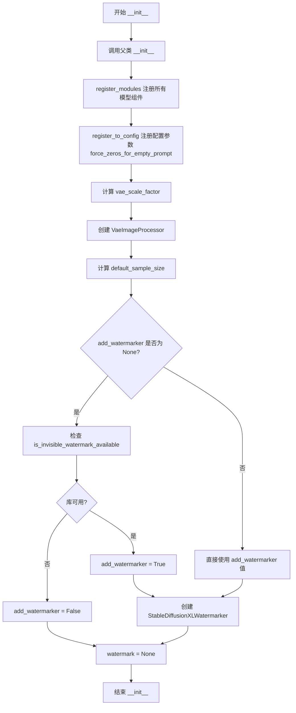

#### 带注释源码

```python
def __init__(
    self,
    vae: AutoencoderKL,
    text_encoder: CLIPTextModel,
    text_encoder_2: CLIPTextModelWithProjection,
    tokenizer: CLIPTokenizer,
    tokenizer_2: CLIPTokenizer,
    unet: UNet2DConditionModel,
    scheduler: KarrasDiffusionSchedulers,
    image_encoder: CLIPVisionModelWithProjection = None,
    feature_extractor: CLIPImageProcessor = None,
    force_zeros_for_empty_prompt: bool = True,
    add_watermarker: bool | None = None,
):
    """
    初始化 StableDiffusionXLPipeline 的所有必要组件
    
    参数:
        vae: Variational Auto-Encoder (VAE) Model，用于图像与潜在表示之间的编解码
        text_encoder: 第一个冻结的文本编码器 (CLIP)
        text_encoder_2: 第二个冻结的文本编码器，带投影层
        tokenizer: 第一个分词器
        tokenizer_2: 第二个分词器
        unet: 条件 U-Net，用于去噪
        scheduler: 扩散调度器
        image_encoder: 可选的图像编码器，用于 IP-Adapter
        feature_extractor: 可选的图像特征提取器
        force_zeros_for_empty_prompt: 是否对空提示词强制使用零嵌入
        add_watermarker: 是否添加水印，None 时自动检测
    """
    # 调用父类 DiffusionPipeline 的初始化方法
    # 父类会设置基本属性如 _execution_device, _callback_tensor_inputs 等
    super().__init__()

    # 通过 register_modules 注册所有模型组件到 Pipeline
    # 这使得 Pipeline 可以通过 self.vae, self.text_encoder 等访问这些组件
    self.register_modules(
        vae=vae,
        text_encoder=text_encoder,
        text_encoder_2=text_encoder_2,
        tokenizer=tokenizer,
        tokenizer_2=tokenizer_2,
        unet=unet,
        scheduler=scheduler,
        image_encoder=image_encoder,
        feature_extractor=feature_extractor,
    )

    # 将 force_zeros_for_empty_prompt 注册到配置中
    # 用于在 encode_prompt 中决定是否将负提示词置零
    self.register_to_config(force_zeros_for_empty_prompt=force_zeros_for_empty_prompt)

    # 计算 VAE 缩放因子
    # VAE 的下采样倍数 = 2^(block_out_channels数量 - 1)
    # 例如 SDXL 的 VAE 有 [128, 256, 512, 512] 四个通道，缩放因子 = 2^3 = 8
    self.vae_scale_factor = 2 ** (len(self.vae.config.block_out_channels) - 1) if getattr(self, "vae", None) else 8

    # 创建图像处理器，用于 VAE 编解码后的图像后处理
    self.image_processor = VaeImageProcessor(vae_scale_factor=self.vae_scale_factor)

    # 计算默认采样尺寸
    # 从 UNet 配置中获取 sample_size，如果不可用则默认为 128
    self.default_sample_size = (
        self.unet.config.sample_size
        if hasattr(self, "unet") and self.unet is not None and hasattr(self.unet.config, "sample_size")
        else 128
    )

    # 处理水印添加选项
    # 如果 add_watermarker 为 None，则自动检测 invisible_watermark 库是否可用
    add_watermarker = add_watermarker if add_watermarker is not None else is_invisible_watermark_available()

    # 根据设置创建水印处理器或设为 None
    if add_watermarker:
        # 创建 StableDiffusionXLWatermarker 用于在生成的图像上添加不可见水印
        self.watermark = StableDiffusionXLWatermarker()
    else:
        self.watermark = None
```


### `StableDiffusionXLPipeline.encode_prompt`

该方法负责将文本提示（prompt）编码为文本编码器的隐藏状态向量，支持Stable Diffusion XL的双文本编码器架构，并处理无分类器自由引导（Classifier-Free Guidance）所需的正向和负向提示嵌入，同时集成LoRA权重调整和CLIP层跳过等功能。

参数：

- `prompt`：`str | list[str]`，要编码的主提示文本，可以是单个字符串或字符串列表
- `prompt_2`：`str | list[str] | None`，发送给第二个tokenizer和text_encoder_2的提示，若为None则使用prompt
- `device`：`torch.device | None`，执行编码的torch设备，若为None则使用执行设备
- `num_images_per_prompt`：`int`，每个提示要生成的图像数量，用于复制embeddings
- `do_classifier_free_guidance`：`bool`，是否启用无分类器自由引导
- `negative_prompt`：`str | list[str] | None`，负向提示，用于引导图像不包含的内容
- `negative_prompt_2`：`str | list[str] | None`，发送给第二个tokenizer和text_encoder_2的负向提示
- `prompt_embeds`：`torch.Tensor | None`，预生成的文本嵌入，若提供则跳过从prompt生成
- `negative_prompt_embeds`：`torch.Tensor | None`，预生成的负向文本嵌入
- `pooled_prompt_embeds`：`torch.Tensor | None`，预生成的池化文本嵌入
- `negative_pooled_prompt_embeds`：`torch.Tensor | None`，预生成的负向池化文本嵌入
- `lora_scale`：`float | None`，LoRA缩放因子，用于调整LoRA层的影响
- `clip_skip`：`int | None`，从CLIP模型倒数第几层获取隐藏状态，1表示使用倒数第二层

返回值：`tuple[torch.Tensor, torch.Tensor, torch.Tensor, torch.Tensor]`，返回四个张量——编码后的提示嵌入、负向提示嵌入、池化提示嵌入和负向池化提示嵌入

#### 流程图

```mermaid
flowchart TD
    A[开始 encode_prompt] --> B{检查 lora_scale}
    B -->|lora_scale 非空| C[设置 self._lora_scale]
    C --> D{使用 PEFT 后端?}
    D -->|否| E[adjust_lora_scale_text_encoder]
    D -->|是| F[scale_lora_layers]
    E --> G[继续]
    F --> G
    B -->|lora_scale 为空| G
    G --> H[标准化 prompt 为列表]
    H --> I{计算 batch_size}
    I -->|prompt 非空| J[batch_size = len(prompt)]
    I -->|prompt 为空| K[batch_size = prompt_embeds.shape[0]]
    J --> L[定义 tokenizers 和 text_encoders]
    K --> L
    L --> M{prompt_embeds 为空?}
    M -->|是| N[处理 prompt 和 prompt_2]
    N --> O[遍历 tokenizers 和 text_encoders]
    O --> P{使用 TextualInversion?}
    P -->|是| Q[maybe_convert_prompt]
    P -->|否| R
    Q --> R
    R --> S[tokenizer 编码文本]
    S --> T{检测截断?}
    T -->|是| U[记录警告日志]
    T -->|否| V
    U --> V
    V --> W[text_encoder 获取 hidden_states]
    W --> X{clip_skip 为空?}
    X -->|是| Y[使用 hidden_states[-2]]
    X -->|否| Z[使用 hidden_states[-(clip_skip+2)]]
    Y --> AA[添加到 prompt_embeds_list]
    Z --> AA
    AA --> AB[concat 所有 prompt_embeds]
    M -->|否| AC[直接使用 prompt_embeds]
    AB --> AD{需要 CFG?}
    AC --> AD
    AD -->|是 且无负向embed| AE{zero_out_negative_prompt?}
    AD -->|否| AF
    AE -->|是| AG[创建零张量]
    AE -->|否| AH[处理 negative_prompt]
    AG --> AF
    AH --> AI[遍历生成负向embeddings]
    AF --> J1[转换 dtype 和 device]
    J1 --> K1{有 text_encoder_2?}
    K1 -->|是| L1[使用 text_encoder_2.dtype]
    K1 -->|否| M1[使用 unet.dtype]
    L1 --> N1
    M1 --> N1
    N1[重复 embeddings] --> O1[返回四个 embeddings]
```

#### 带注释源码

```python
def encode_prompt(
    self,
    prompt: str,
    prompt_2: str | None = None,
    device: torch.device | None = None,
    num_images_per_prompt: int = 1,
    do_classifier_free_guidance: bool = True,
    negative_prompt: str | None = None,
    negative_prompt_2: str | None = None,
    prompt_embeds: torch.Tensor | None = None,
    negative_prompt_embeds: torch.Tensor | None = None,
    pooled_prompt_embeds: torch.Tensor | None = None,
    negative_pooled_prompt_embeds: torch.Tensor | None = None,
    lora_scale: float | None = None,
    clip_skip: int | None = None,
):
    r"""
    Encodes the prompt into text encoder hidden states.

    Args:
        prompt (`str` or `list[str]`, *optional*):
            prompt to be encoded
        prompt_2 (`str` or `list[str]`, *optional*):
            The prompt or prompts to be sent to the `tokenizer_2` and `text_encoder_2`. If not defined, `prompt` is
            used in both text-encoders
        device: (`torch.device`):
            torch device
        num_images_per_prompt (`int`):
            number of images that should be generated per prompt
        do_classifier_free_guidance (`bool`):
            whether to use classifier free guidance or not
        negative_prompt (`str` or `list[str]`, *optional*):
            The prompt or prompts not to guide the image generation. If not defined, one has to pass
            `negative_prompt_embeds` instead. Ignored when not using guidance (i.e., ignored if `guidance_scale` is
            less than `1`).
        negative_prompt_2 (`str` or `list[str]`, *optional*):
            The prompt or prompts not to guide the image generation to be sent to `tokenizer_2` and
            `text_encoder_2`. If not defined, `negative_prompt` is used in both text-encoders
        prompt_embeds (`torch.Tensor`, *optional*):
            Pre-generated text embeddings. Can be used to easily tweak text inputs, *e.g.* prompt weighting. If not
            provided, text embeddings will be generated from `prompt` input argument.
        negative_prompt_embeds (`torch.Tensor`, *optional*):
            Pre-generated negative text embeddings. Can be used to easily tweak text inputs, *e.g.* prompt
            weighting. If not provided, negative_prompt_embeds will be generated from `negative_prompt` input
            argument.
        pooled_prompt_embeds (`torch.Tensor`, *optional*):
            Pre-generated pooled text embeddings. Can be used to easily tweak text inputs, *e.g.* prompt weighting.
            If not provided, pooled text embeddings will be generated from `prompt` input argument.
        negative_pooled_prompt_embeds (`torch.Tensor`, *optional*):
            Pre-generated negative pooled text embeddings. Can be used to easily tweak text inputs, *e.g.* prompt
            weighting. If not provided, pooled negative_prompt_embeds will be generated from `negative_prompt`
            input argument.
        lora_scale (`float`, *optional*):
            A lora scale that will be applied to all LoRA layers of the text encoder if LoRA layers are loaded.
        clip_skip (`int`, *optional*):
            Number of layers to be skipped from CLIP while computing the prompt embeddings. A value of 1 means that
            the output of the pre-final layer will be used for computing the prompt embeddings.
    """
    # 确定执行设备，优先使用传入的device，否则使用pipeline的执行设备
    device = device or self._execution_device

    # 设置lora scale以便text encoder的LoRA函数可以正确访问
    # 检查是否传入了lora_scale且当前pipeline支持LoRA
    if lora_scale is not None and isinstance(self, StableDiffusionXLLoraLoaderMixin):
        self._lora_scale = lora_scale

        # 动态调整LoRA scale
        if self.text_encoder is not None:
            if not USE_PEFT_BACKEND:
                # 非PEFT后端使用旧版LoRA调整方法
                adjust_lora_scale_text_encoder(self.text_encoder, lora_scale)
            else:
                # PEFT后端使用缩放LoRA层
                scale_lora_layers(self.text_encoder, lora_scale)

        if self.text_encoder_2 is not None:
            if not USE_PEFT_BACKEND:
                adjust_lora_scale_text_encoder(self.text_encoder_2, lora_scale)
            else:
                scale_lora_layers(self.text_encoder_2, lora_scale)

    # 标准化prompt为列表格式
    prompt = [prompt] if isinstance(prompt, str) else prompt

    # 确定batch size
    if prompt is not None:
        batch_size = len(prompt)
    else:
        batch_size = prompt_embeds.shape[0]

    # 定义tokenizers和text encoders列表
    # 支持只有一个tokenizer/text_encoder的情况
    tokenizers = [self.tokenizer, self.tokenizer_2] if self.tokenizer is not None else [self.tokenizer_2]
    text_encoders = (
        [self.text_encoder, self.text_encoder_2] if self.text_encoder is not None else [self.text_encoder_2]
    )

    # 如果没有提供prompt_embeds，则从prompt生成
    if prompt_embeds is None:
        # prompt_2默认为prompt
        prompt_2 = prompt_2 or prompt
        prompt_2 = [prompt_2] if isinstance(prompt_2, str) else prompt_2

        # 用于存储所有text encoder的embeddings
        prompt_embeds_list = []
        prompts = [prompt, prompt_2]
        
        # 遍历两个text encoder进行编码
        for prompt, tokenizer, text_encoder in zip(prompts, tokenizers, text_encoders):
            # 如果支持TextualInversion，转换多向量token
            if isinstance(self, TextualInversionLoaderMixin):
                prompt = self.maybe_convert_prompt(prompt, tokenizer)

            # tokenizer将文本转为tensor
            text_inputs = tokenizer(
                prompt,
                padding="max_length",
                max_length=tokenizer.model_max_length,
                truncation=True,
                return_tensors="pt",
            )

            text_input_ids = text_inputs.input_ids
            # 获取未截断的token ids用于检测截断
            untruncated_ids = tokenizer(prompt, padding="longest", return_tensors="pt").input_ids

            # 检测是否发生了截断并警告
            if untruncated_ids.shape[-1] >= text_input_ids.shape[-1] and not torch.equal(
                text_input_ids, untruncated_ids
            ):
                removed_text = tokenizer.batch_decode(untruncated_ids[:, tokenizer.model_max_length - 1 : -1])
                logger.warning(
                    "The following part of your input was truncated because CLIP can only handle sequences up to"
                    f" {tokenizer.model_max_length} tokens: {removed_text}"
                )

            # 获取text encoder的hidden states
            prompt_embeds = text_encoder(text_input_ids.to(device), output_hidden_states=True)

            # 从最终text encoder获取pooled输出
            if pooled_prompt_embeds is None and prompt_embeds[0].ndim == 2:
                pooled_prompt_embeds = prompt_embeds[0]

            # 根据clip_skip选择hidden states层
            if clip_skip is None:
                # 默认使用倒数第二层
                prompt_embeds = prompt_embeds.hidden_states[-2]
            else:
                # SDXL总是从倒数第(clip_skip+2)层索引，因为最后一层是pooled output
                prompt_embeds = prompt_embeds.hidden_states[-(clip_skip + 2)]

            prompt_embeds_list.append(prompt_embeds)

        # 在最后一个维度拼接两个text encoder的embeddings
        prompt_embeds = torch.concat(prompt_embeds_list, dim=-1)

    # 处理无分类器自由引导的负向embeddings
    zero_out_negative_prompt = negative_prompt is None and self.config.force_zeros_for_empty_prompt
    
    # 如果需要CFG且没有提供负向embeddings
    if do_classifier_free_guidance and negative_prompt_embeds is None and zero_out_negative_prompt:
        # 对于空负向提示，使用零张量
        negative_prompt_embeds = torch.zeros_like(prompt_embeds)
        negative_pooled_prompt_embeds = torch.zeros_like(pooled_prompt_embeds)
    elif do_classifier_free_guidance and negative_prompt_embeds is None:
        # 需要从negative_prompt生成embeddings
        negative_prompt = negative_prompt or ""
        negative_prompt_2 = negative_prompt_2 or negative_prompt

        # 标准化为列表
        negative_prompt = batch_size * [negative_prompt] if isinstance(negative_prompt, str) else negative_prompt
        negative_prompt_2 = (
            batch_size * [negative_prompt_2] if isinstance(negative_prompt_2, str) else negative_prompt_2
        )

        # 类型检查
        uncond_tokens: list[str]
        if prompt is not None and type(prompt) is not type(negative_prompt):
            raise TypeError(
                f"`negative_prompt` should be the same type to `prompt`, but got {type(negative_prompt)} !="
                f" {type(prompt)}."
            )
        elif batch_size != len(negative_prompt):
            raise ValueError(
                f"`negative_prompt`: {negative_prompt} has batch size {len(negative_prompt)}, but `prompt`:"
                f" {prompt} has batch size {batch_size}. Please make sure that passed `negative_prompt` matches"
                " the batch size of `prompt`."
            )
        else:
            uncond_tokens = [negative_prompt, negative_prompt_2]

        # 生成负向embeddings
        negative_prompt_embeds_list = []
        for negative_prompt, tokenizer, text_encoder in zip(uncond_tokens, tokenizers, text_encoders):
            if isinstance(self, TextualInversionLoaderMixin):
                negative_prompt = self.maybe_convert_prompt(negative_prompt, tokenizer)

            max_length = prompt_embeds.shape[1]
            uncond_input = tokenizer(
                negative_prompt,
                padding="max_length",
                max_length=max_length,
                truncation=True,
                return_tensors="pt",
            )

            negative_prompt_embeds = text_encoder(
                uncond_input.input_ids.to(device),
                output_hidden_states=True,
            )

            # 获取pooled输出
            if negative_pooled_prompt_embeds is None and negative_prompt_embeds[0].ndim == 2:
                negative_pooled_prompt_embeds = negative_prompt_embeds[0]
            
            # 使用倒数第二层
            negative_prompt_embeds = negative_prompt_embeds.hidden_states[-2]

            negative_prompt_embeds_list.append(negative_prompt_embeds)

        # 拼接负向embeddings
        negative_prompt_embeds = torch.concat(negative_prompt_embeds_list, dim=-1)

    # 确保embeddings的dtype和device正确
    if self.text_encoder_2 is not None:
        prompt_embeds = prompt_embeds.to(dtype=self.text_encoder_2.dtype, device=device)
    else:
        prompt_embeds = prompt_embeds.to(dtype=self.unet.dtype, device=device)

    # 获取embeddings的形状信息
    bs_embed, seq_len, _ = prompt_embeds.shape
    
    # 为每个prompt复制多次（用于生成多张图像）
    # 使用MPS友好的方法
    prompt_embeds = prompt_embeds.repeat(1, num_images_per_prompt, 1)
    prompt_embeds = prompt_embeds.view(bs_embed * num_images_per_prompt, seq_len, -1)

    # 如果使用CFG，同样处理负向embeddings
    if do_classifier_free_guidance:
        seq_len = negative_prompt_embeds.shape[1]

        if self.text_encoder_2 is not None:
            negative_prompt_embeds = negative_prompt_embeds.to(dtype=self.text_encoder_2.dtype, device=device)
        else:
            negative_prompt_embeds = negative_prompt_embeds.to(dtype=self.unet.dtype, device=device)

        negative_prompt_embeds = negative_prompt_embeds.repeat(1, num_images_per_prompt, 1)
        negative_prompt_embeds = negative_prompt_embeds.view(batch_size * num_images_per_prompt, seq_len, -1)

    # 处理pooled embeddings的重复
    pooled_prompt_embeds = pooled_prompt_embeds.repeat(1, num_images_per_prompt).view(
        bs_embed * num_images_per_prompt, -1
    )
    if do_classifier_free_guidance:
        negative_pooled_prompt_embeds = negative_pooled_prompt_embeds.repeat(1, num_images_per_prompt).view(
            bs_embed * num_images_per_prompt, -1
        )

    # 如果使用PEFT后端，恢复LoRA层到原始scale
    if self.text_encoder is not None:
        if isinstance(self, StableDiffusionXLLoraLoaderMixin) and USE_PEFT_BACKEND:
            # 通过取消缩放LoRA层来检索原始scale
            unscale_lora_layers(self.text_encoder, lora_scale)

    if self.text_encoder_2 is not None:
        if isinstance(self, StableDiffusionXLLoraLoaderMixin) and USE_PEFT_BACKEND:
            unscale_lora_layers(self.text_encoder_2, lora_scale)

    # 返回四个embeddings张量
    return prompt_embeds, negative_prompt_embeds, pooled_prompt_embeds, negative_pooled_prompt_embeds
```


### `StableDiffusionXLPipeline.encode_image`

该方法用于将输入图像编码为图像嵌入向量或隐藏状态，支持有条件和无条件的图像编码，以便在图像生成过程中实现分类器无引导（Classifier-Free Guidance）。

参数：

- `image`：图像输入，支持 `torch.Tensor`、`PIL.Image.Image` 或 `numpy.ndarray` 等类型，需要被编码的原始图像数据
- `device`：`torch.device`，图像编码所执行的设备（CPU 或 CUDA）
- `num_images_per_prompt`：`int`，每个提示词生成的图像数量，用于对图像嵌入进行重复
- `output_hidden_states`：`bool` 或 `None`，可选参数，指定是否返回图像编码器的隐藏状态而非图像嵌入

返回值：`tuple[torch.Tensor, torch.Tensor]`，返回两个张量组成的元组——第一个是条件图像嵌入（或隐藏状态），第二个是无条件图像嵌入（或隐藏状态），两者均按 `num_images_per_prompt` 重复

#### 流程图

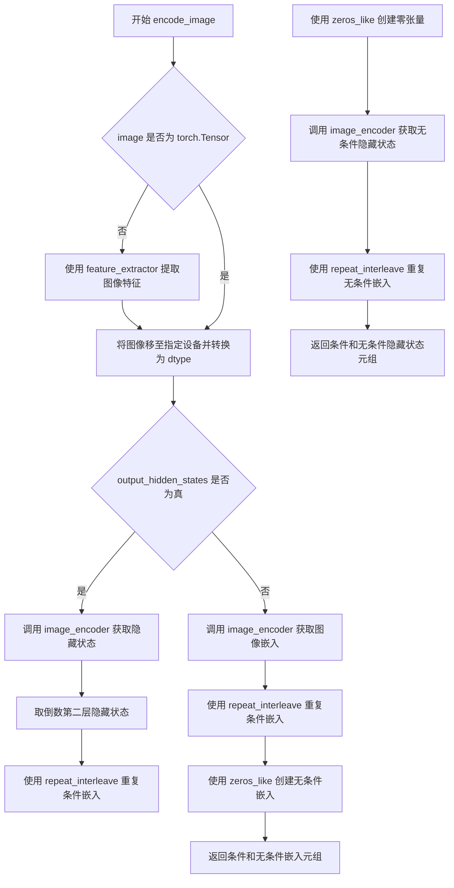

#### 带注释源码

```python
def encode_image(self, image, device, num_images_per_prompt, output_hidden_states=None):
    """
    Encodes the input image into embeddings or hidden states.
    
    Args:
        image: The input image to encode (PIL Image, numpy array, or torch.Tensor)
        device: The torch device to run the encoding on
        num_images_per_prompt: Number of images to generate per prompt
        output_hidden_states: Whether to return hidden states instead of image embeddings
    
    Returns:
        Tuple of (image_embeds, uncond_image_embeds) or (image_hidden_states, uncond_image_hidden_states)
    """
    # 获取图像编码器的参数数据类型
    dtype = next(self.image_encoder.parameters()).dtype

    # 如果输入不是张量，则使用特征提取器进行处理
    if not isinstance(image, torch.Tensor):
        image = self.feature_extractor(image, return_tensors="pt").pixel_values

    # 将图像移动到指定设备并转换为正确的 dtype
    image = image.to(device=device, dtype=dtype)
    
    # 根据 output_hidden_states 参数决定返回隐藏状态还是图像嵌入
    if output_hidden_states:
        # 获取编码器的隐藏状态，取倒数第二层（通常用于更精细的特征表示）
        image_enc_hidden_states = self.image_encoder(image, output_hidden_states=True).hidden_states[-2]
        # 按 num_images_per_prompt 重复每个图像的嵌入，以匹配批量生成
        image_enc_hidden_states = image_enc_hidden_states.repeat_interleave(num_images_per_prompt, dim=0)
        
        # 创建零张量作为无条件的图像表示（用于 classifier-free guidance）
        uncond_image_enc_hidden_states = self.image_encoder(
            torch.zeros_like(image), output_hidden_states=True
        ).hidden_states[-2]
        # 同样重复无条件嵌入
        uncond_image_enc_hidden_states = uncond_image_enc_hidden_states.repeat_interleave(
            num_images_per_prompt, dim=0
        )
        # 返回隐藏状态元组
        return image_enc_hidden_states, uncond_image_enc_hidden_states
    else:
        # 获取图像嵌入（pooled image embeddings）
        image_embeds = self.image_encoder(image).image_embeds
        # 按 num_images_per_prompt 重复嵌入
        image_embeds = image_embeds.repeat_interleave(num_images_per_prompt, dim=0)
        # 创建零张量作为无条件图像嵌入
        uncond_image_embeds = torch.zeros_like(image_embeds)

        # 返回图像嵌入元组
        return image_embeds, uncond_image_embeds
```


### `StableDiffusionXLPipeline.prepare_ip_adapter_image_embeds`

该方法用于准备IP适配器的图像嵌入向量。它处理两种输入情况：如果提供原始图像，则使用图像编码器进行编码；如果提供预计算的图像嵌入，则直接进行处理。该方法还支持分类器-free引导（classifier-free guidance），会为每个图像生成正向和负向嵌入。

参数：

- `self`：隐式参数，StableDiffusionXLPipeline实例
- `ip_adapter_image`：可选的`PipelineImageInput`类型，输入的IP适配器图像，用于编码为图像嵌入。如果提供了`ip_adapter_image_embeds`，则此参数可省略
- `ip_adapter_image_embeds`：可选的`list[torch.Tensor]`类型，预计算的IP适配器图像嵌入列表。每个元素应该是形状为`(batch_size, num_images, emb_dim)`的张量。如果提供了`ip_adapter_image`，则此参数可省略
- `device`：`torch.device`类型，计算设备，用于将图像嵌入移动到指定设备
- `num_images_per_prompt`：`int`类型，每个提示词生成的图像数量
- `do_classifier_free_guidance`：`bool`类型，是否使用分类器-free引导。如果为True，则会生成负向图像嵌入用于无分类器引导

返回值：`list[torch.Tensor]`，处理后的IP适配器图像嵌入列表，每个元素是拼接了负向嵌入（如果使用CFG）的张量

#### 流程图

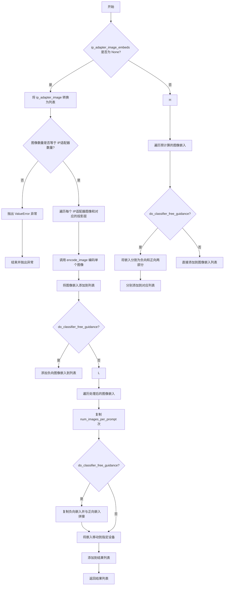

#### 带注释源码

```python
def prepare_ip_adapter_image_embeds(
    self, 
    ip_adapter_image,  # IP适配器输入图像
    ip_adapter_image_embeds,  # 预计算的图像嵌入
    device,  # 计算设备
    num_images_per_prompt,  # 每个提示生成的图像数量
    do_classifier_free_guidance  # 是否使用分类器-free引导
):
    """
    准备IP适配器的图像嵌入向量。
    
    该方法处理两种输入模式：
    1. 提供原始图像 - 通过图像编码器编码
    2. 提供预计算的嵌入 - 直接处理
    
    当启用分类器-free引导时，会为每个图像生成负向嵌入。
    """
    image_embeds = []  # 存储处理后的图像嵌入
    if do_classifier_free_guidance:
        negative_image_embeds = []  # 存储负向图像嵌入
    
    # 情况1：需要从原始图像编码
    if ip_adapter_image_embeds is None:
        # 确保输入是列表格式
        if not isinstance(ip_adapter_image, list):
            ip_adapter_image = [ip_adapter_image]
        
        # 验证图像数量与IP适配器数量匹配
        if len(ip_adapter_image) != len(self.unet.encoder_hid_proj.image_projection_layers):
            raise ValueError(
                f"`ip_adapter_image` must have same length as the number of IP Adapters. "
                f"Got {len(ip_adapter_image)} images and {len(self.unet.encoder_hid_proj.image_projection_layers)} IP Adapters."
            )
        
        # 遍历每个IP适配器图像和对应的投影层
        for single_ip_adapter_image, image_proj_layer in zip(
            ip_adapter_image, 
            self.unet.encoder_hid_proj.image_projection_layers
        ):
            # 判断是否需要输出隐藏状态（ImageProjection层不需要）
            output_hidden_state = not isinstance(image_proj_layer, ImageProjection)
            
            # 编码单个图像
            single_image_embeds, single_negative_image_embeds = self.encode_image(
                single_ip_adapter_image, 
                device, 
                1,  # 每个适配器只处理一张图像
                output_hidden_state
            )
            
            # 添加批次维度并存储
            image_embeds.append(single_image_embeds[None, :])
            if do_classifier_free_guidance:
                negative_image_embeds.append(single_negative_image_embeds[None, :])
    
    # 情况2：使用预计算的嵌入
    else:
        for single_image_embeds in ip_adapter_image_embeds:
            if do_classifier_free_guidance:
                # 将嵌入分割为负向和正向两部分
                single_negative_image_embeds, single_image_embeds = single_image_embeds.chunk(2)
                negative_image_embeds.append(single_negative_image_embeds)
            image_embeds.append(single_image_embeds)
    
    # 扩展嵌入以匹配生成的图像数量
    ip_adapter_image_embeds = []
    for i, single_image_embeds in enumerate(image_embeds):
        # 复制以匹配每个提示生成的图像数量
        single_image_embeds = torch.cat([single_image_embeds] * num_images_per_prompt, dim=0)
        
        if do_classifier_free_guidance:
            # 同样复制负向嵌入
            single_negative_image_embeds = torch.cat([negative_image_embeds[i]] * num_images_per_prompt, dim=0)
            # 拼接负向和正向嵌入（负向在前，符合CFG的惯例）
            single_image_embeds = torch.cat([single_negative_image_embeds, single_image_embeds], dim=0)
        
        # 移动到指定设备
        single_image_embeds = single_image_embeds.to(device=device)
        ip_adapter_image_embeds.append(single_image_embeds)
    
    return ip_adapter_image_embeds
```


### `StableDiffusionXLPipeline.prepare_extra_step_kwargs`

该方法用于准备调度器（scheduler）的额外参数，因为不同的调度器具有不同的签名。该方法检查当前调度器是否支持`eta`参数（仅DDIMScheduler使用）和`generator`参数，并将支持的值添加到返回的字典中。

参数：

- `self`：`StableDiffusionXLPipeline`，Pipeline实例本身
- `generator`：`torch.Generator | list[torch.Generator] | None`，用于生成确定性随机数的PyTorch生成器
- `eta`：`float`，DDIM调度器使用的η参数，值应在[0,1]范围内，其他调度器会忽略此参数

返回值：`dict[str, Any]`，包含调度器`step`方法所需额外参数（`eta`和/或`generator`）的字典

#### 流程图

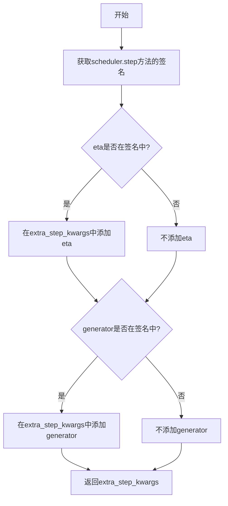

#### 带注释源码

```python
def prepare_extra_step_kwargs(self, generator, eta):
    """
    为调度器步骤准备额外参数，因为并非所有调度器都具有相同的签名。
    eta (η) 仅在 DDIMScheduler 中使用，其他调度器会忽略它。
    eta 对应 DDIM 论文中的 η：https://huggingface.co/papers/2010.02502
    取值应在 [0, 1] 范围内。
    
    Args:
        generator: PyTorch生成器，用于生成确定性随机数
        eta: DDIM调度器使用的η参数
    
    Returns:
        包含调度器额外参数的字典
    """
    # 使用inspect模块检查scheduler.step方法的签名参数
    accepts_eta = "eta" in set(inspect.signature(self.scheduler.step).parameters.keys())
    extra_step_kwargs = {}
    
    # 如果调度器接受eta参数，则添加到extra_step_kwargs
    if accepts_eta:
        extra_step_kwargs["eta"] = eta

    # 检查调度器是否接受generator参数
    accepts_generator = "generator" in set(inspect.signature(self.scheduler.step).parameters.keys())
    if accepts_generator:
        extra_step_kwargs["generator"] = generator
    
    return extra_step_kwargs
```


### `StableDiffusionXLPipeline.check_inputs`

该方法用于验证文本到图像生成管道的输入参数是否合法，确保用户提供的提示词、嵌入向量、图像适配器等参数符合模型要求，并在参数不符合预期时抛出详细的错误信息。

参数：

- `prompt`：`str | list[str] | None`，主提示词，用于指导图像生成内容
- `prompt_2`：`str | list[str] | None`，第二个提示词，用于第二文本编码器
- `height`：`int`，生成图像的高度（像素），必须能被 8 整除
- `width`：`int`，生成图像的宽度（像素），必须能被 8 整除
- `callback_steps`：`int | None`，回调函数调用间隔步数，必须为正整数
- `negative_prompt`：`str | list[str] | None`，负面提示词，用于指导图像避免生成的内容
- `negative_prompt_2`：`str | list[str] | None`，第二负面提示词
- `prompt_embeds`：`torch.Tensor | None`，预生成的主提示词嵌入向量
- `negative_prompt_embeds`：`torch.Tensor | None`，预生成的负面提示词嵌入向量
- `pooled_prompt_embeds`：`torch.Tensor | None`，预生成的池化提示词嵌入向量
- `negative_pooled_prompt_embeds`：`torch.Tensor | None`，预生成的负面池化提示词嵌入向量
- `ip_adapter_image`：`PipelineImageInput | None`，IP 适配器输入图像
- `ip_adapter_image_embeds`：`list[torch.Tensor] | None`，预生成的 IP 适配器图像嵌入
- `callback_on_step_end_tensor_inputs`：`list[str] | None`，在步骤结束时回调的张量输入列表

返回值：`None`，该方法不返回任何值，仅通过抛出 `ValueError` 来指示参数错误

#### 流程图

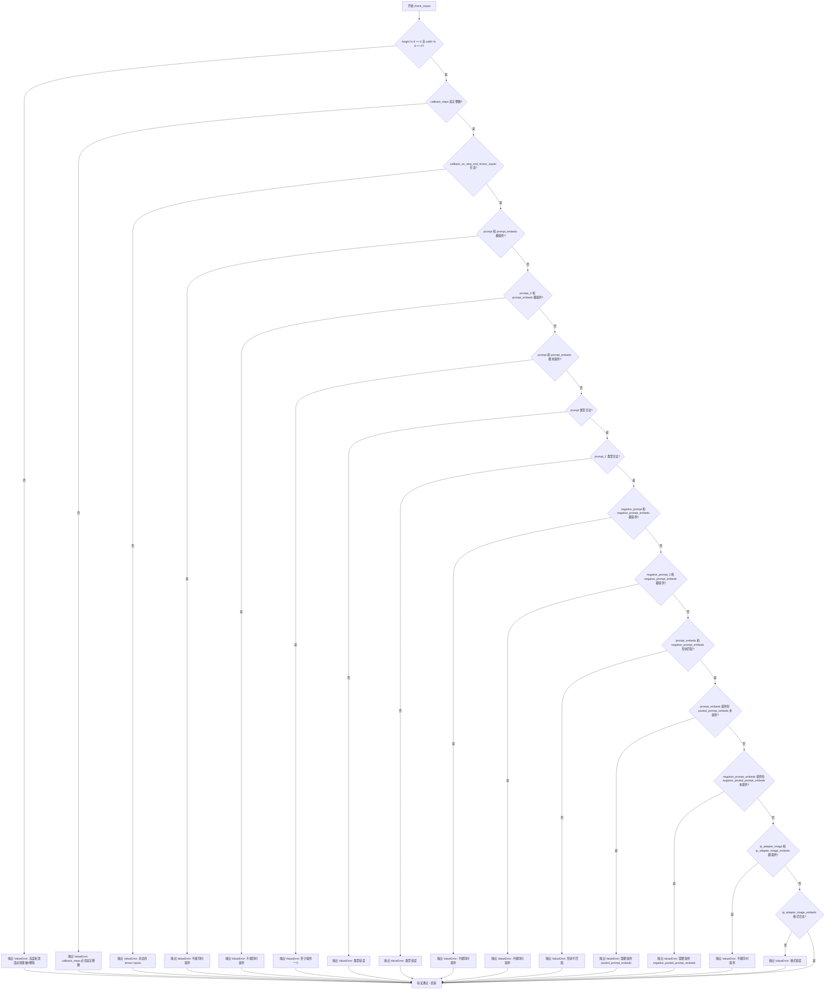

#### 带注释源码

```python
def check_inputs(
    self,
    prompt,                       # 主提示词 (str 或 list)
    prompt_2,                     # 第二提示词 (str 或 list 或 None)
    height,                       # 输出图像高度 (int)
    width,                        # 输出图像宽度 (int)
    callback_steps,               # 回调步数 (int 或 None)
    negative_prompt=None,         # 负面提示词 (str 或 list 或 None)
    negative_prompt_2=None,       # 第二负面提示词 (str 或 list 或 None)
    prompt_embeds=None,           # 预生成提示词嵌入 (Tensor 或 None)
    negative_prompt_embeds=None, # 预生成负面提示词嵌入 (Tensor 或 None)
    pooled_prompt_embeds=None,   # 预生成池化提示词嵌入 (Tensor 或 None)
    negative_pooled_prompt_embeds=None,  # 预生成负面池化嵌入 (Tensor 或 None)
    ip_adapter_image=None,       # IP适配器图像输入 (PipelineImageInput 或 None)
    ip_adapter_image_embeds=None, # IP适配器图像嵌入列表 (list 或 None)
    callback_on_step_end_tensor_inputs=None,  # 回调张量输入列表 (list 或 None)
):
    """
    验证 Stable Diffusion XL pipeline 的输入参数合法性
    
    该方法执行以下验证:
    1. 图像尺寸必须是8的倍数
    2. callback_steps 必须是正整数
    3. callback_on_step_end_tensor_inputs 必须在允许列表中
    4. prompt 和 prompt_embeds 不能同时提供
    5. prompt_2 和 prompt_embeds 不能同时提供
    6. prompt 或 prompt_embeds 必须至少提供一个
    7. prompt 和 prompt_2 类型必须是 str 或 list
    8. negative_prompt 和 negative_prompt_embeds 不能同时提供
    9. negative_prompt_2 和 negative_prompt_embeds 不能同时提供
    10. prompt_embeds 和 negative_prompt_embeds 形状必须一致
    11. 如果提供 prompt_embeds，必须同时提供 pooled_prompt_embeds
    12. 如果提供 negative_prompt_embeds，必须同时提供 negative_pooled_prompt_embeds
    13. ip_adapter_image 和 ip_adapter_image_embeds 不能同时提供
    14. ip_adapter_image_embeds 必须是3D或4D张量列表
    """
    
    # 验证1: 检查图像尺寸是否为8的倍数
    if height % 8 != 0 or width % 8 != 0:
        raise ValueError(f"`height` and `width` have to be divisible by 8 but are {height} and {width}.")

    # 验证2: 检查 callback_steps 是否为正整数
    if callback_steps is not None and (not isinstance(callback_steps, int) or callback_steps <= 0):
        raise ValueError(
            f"`callback_steps` has to be a positive integer but is {callback_steps} of type"
            f" {type(callback_steps)}."
        )

    # 验证3: 检查 callback_on_step_end_tensor_inputs 是否在允许列表中
    if callback_on_step_end_tensor_inputs is not None and not all(
        k in self._callback_tensor_inputs for k in callback_on_step_end_tensor_inputs
    ):
        raise ValueError(
            f"`callback_on_step_end_tensor_inputs` has to be in {self._callback_tensor_inputs}, but found {[k for k in callback_on_step_end_tensor_inputs if k not in self._callback_tensor_inputs]}"
        )

    # 验证4: prompt 和 prompt_embeds 互斥
    if prompt is not None and prompt_embeds is not None:
        raise ValueError(
            f"Cannot forward both `prompt`: {prompt} and `prompt_embeds`: {prompt_embeds}. Please make sure to"
            " only forward one of the two."
        )
    # 验证5: prompt_2 和 prompt_embeds 互斥
    elif prompt_2 is not None and prompt_embeds is not None:
        raise ValueError(
            f"Cannot forward both `prompt_2`: {prompt_2} and `prompt_embeds`: {prompt_embeds}. Please make sure to"
            " only forward one of the two."
        )
    # 验证6: 必须提供至少一个 prompt 或 prompt_embeds
    elif prompt is None and prompt_embeds is None:
        raise ValueError(
            "Provide either `prompt` or `prompt_embeds`. Cannot leave both `prompt` and `prompt_embeds` undefined."
        )
    # 验证7: prompt 类型检查
    elif prompt is not None and (not isinstance(prompt, str) and not isinstance(prompt, list)):
        raise ValueError(f"`prompt` has to be of type `str` or `list` but is {type(prompt)}")
    # 验证8: prompt_2 类型检查
    elif prompt_2 is not None and (not isinstance(prompt_2, str) and not isinstance(prompt_2, list)):
        raise ValueError(f"`prompt_2` has to be of type `str` or `list` but is {type(prompt_2)}")

    # 验证9: negative_prompt 和 negative_prompt_embeds 互斥
    if negative_prompt is not None and negative_prompt_embeds is not None:
        raise ValueError(
            f"Cannot forward both `negative_prompt`: {negative_prompt} and `negative_prompt_embeds`:"
            f" {negative_prompt_embeds}. Please make sure to only forward one of the two."
        )
    # 验证10: negative_prompt_2 和 negative_prompt_embeds 互斥
    elif negative_prompt_2 is not None and negative_prompt_embeds is not None:
        raise ValueError(
            f"Cannot forward both `negative_prompt_2`: {negative_prompt_2} and `negative_prompt_embeds`:"
            f" {negative_prompt_embeds}. Please make sure to only forward one of the two."
        )

    # 验证11: prompt_embeds 和 negative_prompt_embeds 形状一致性
    if prompt_embeds is not None and negative_prompt_embeds is not None:
        if prompt_embeds.shape != negative_prompt_embeds.shape:
            raise ValueError(
                "`prompt_embeds` and `negative_prompt_embeds` must have the same shape when passed directly, but"
                f" got: `prompt_embeds` {prompt_embeds.shape} != `negative_prompt_embeds`"
                f" {negative_prompt_embeds.shape}."
            )

    # 验证12: prompt_embeds 必须配合 pooled_prompt_embeds 使用
    if prompt_embeds is not None and pooled_prompt_embeds is None:
        raise ValueError(
            "If `prompt_embeds` are provided, `pooled_prompt_embeds` also have to be passed. Make sure to generate `pooled_prompt_embeds` from the same text encoder that was used to generate `prompt_embeds`."
        )

    # 验证13: negative_prompt_embeds 必须配合 negative_pooled_prompt_embeds 使用
    if negative_prompt_embeds is not None and negative_pooled_prompt_embeds is None:
        raise ValueError(
            "If `negative_prompt_embeds` are provided, `negative_pooled_prompt_embeds` also have to be passed. Make sure to generate `negative_pooled_prompt_embeds` from the same text encoder that was used to generate `negative_prompt_embeds`."
        )

    # 验证14: ip_adapter_image 和 ip_adapter_image_embeds 互斥
    if ip_adapter_image is not None and ip_adapter_image_embeds is not None:
        raise ValueError(
            "Provide either `ip_adapter_image` or `ip_adapter_image_embeds`. Cannot leave both `ip_adapter_image` and `ip_adapter_image_embeds` defined."
        )

    # 验证15: ip_adapter_image_embeds 格式检查
    if ip_adapter_image_embeds is not None:
        if not isinstance(ip_adapter_image_embeds, list):
            raise ValueError(
                f"`ip_adapter_image_embeds` has to be of type `list` but is {type(ip_adapter_image_embeds)}"
            )
        elif ip_adapter_image_embeds[0].ndim not in [3, 4]:
            raise ValueError(
                f"`ip_adapter_image_embeds` has to be a list of 3D or 4D tensors but is {ip_adapter_image_embeds[0].ndim}D"
            )
```


### `StableDiffusionXLPipeline.prepare_latents`

该方法用于为Stable Diffusion XL管道准备初始潜在向量（latents）。它根据指定的批次大小、图像尺寸和潜在通道数创建随机潜在向量，或将预先提供的潜在向量移动到指定设备，并根据调度器的初始噪声标准差对潜在向量进行缩放。

参数：

- `batch_size`：`int`，生成的图像批次大小
- `num_channels_latents`：`int`，UNet模型的潜在通道数，通常对应于模型配置中的`in_channels`
- `height`：`int`，目标图像的高度（像素）
- `width`：`int`，目标图像的宽度（像素）
- `dtype`：`torch.dtype`，生成的潜在向量的数据类型
- `device`：`torch.device`，潜在向量要放置到的设备
- `generator`：`torch.Generator | list[torch.Generator] | None`，用于生成确定性随机数的PyTorch生成器，可选
- `latents`：`torch.Tensor | None`，预先生成的噪声潜在向量，如果为None则随机生成，可选

返回值：`torch.Tensor`，处理后的潜在向量张量，形状为`(batch_size, num_channels_latents, height // vae_scale_factor, width // vae_scale_factor)`

#### 流程图

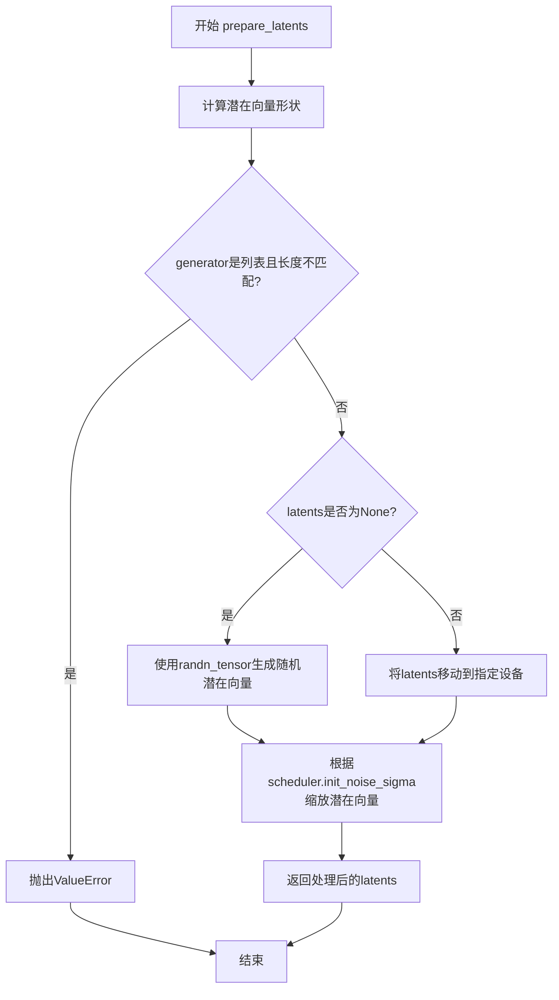

#### 带注释源码

```python
def prepare_latents(
    self,
    batch_size: int,
    num_channels_latents: int,
    height: int,
    width: int,
    dtype: torch.dtype,
    device: torch.device,
    generator: torch.Generator | list[torch.Generator] | None,
    latents: torch.Tensor | None = None,
) -> torch.Tensor:
    """
    准备用于扩散过程的潜在向量。

    Args:
        batch_size: 生成的批次大小
        num_channels_latents: 潜在通道数
        height: 图像高度
        width: 图像宽度
        dtype: 潜在向量数据类型
        device: 设备
        generator: 随机生成器
        latents: 预提供的潜在向量

    Returns:
        处理后的潜在向量
    """
    # 计算潜在向量的形状，根据VAE缩放因子调整空间维度
    shape = (
        batch_size,
        num_channels_latents,
        int(height) // self.vae_scale_factor,
        int(width) // self.vae_scale_factor,
    )
    
    # 验证生成器列表长度是否与批次大小匹配
    if isinstance(generator, list) and len(generator) != batch_size:
        raise ValueError(
            f"You have passed a list of generators of length {len(generator)}, but requested an effective batch"
            f" size of {batch_size}. Make sure the batch size matches the length of the generators."
        )

    # 如果没有提供潜在向量，则使用随机张量生成
    if latents is None:
        latents = randn_tensor(shape, generator=generator, device=device, dtype=dtype)
    else:
        # 否则将提供的潜在向量移动到目标设备
        latents = latents.to(device)

    # 使用调度器的初始噪声标准差缩放潜在向量
    # 这是扩散过程的重要预处理步骤，确保噪声幅度与调度器期望一致
    latents = latents * self.scheduler.init_noise_sigma
    
    return latents
```


### `StableDiffusionXLPipeline._get_add_time_ids`

该方法用于生成Stable Diffusion XL pipeline中的额外时间嵌入ID（add_time_ids），它将原始图像尺寸、裁剪坐标和目标图像尺寸组合成一个向量，并验证其维度是否与UNet模型的期望维度匹配，以确保模型能够正确处理图像尺寸相关的条件信息。

参数：

- `self`：`StableDiffusionXLPipeline`实例，Pipeline对象本身
- `original_size`：`tuple[int, int]`，原始图像尺寸，格式为(height, width)
- `crops_coords_top_left`：`tuple[int, int]`，裁剪区域的左上角坐标，格式为(y, x)
- `target_size`：`tuple[int, int]`，目标图像尺寸，格式为(height, width)
- `dtype`：`torch.dtype`，输出张量的数据类型
- `text_encoder_projection_dim`：`int | None`，文本编码器的投影维度，默认为None

返回值：`torch.Tensor`，包含时间ID的2D张量，形状为(1, embedding_dim)，用于后续的UNet条件生成

#### 流程图

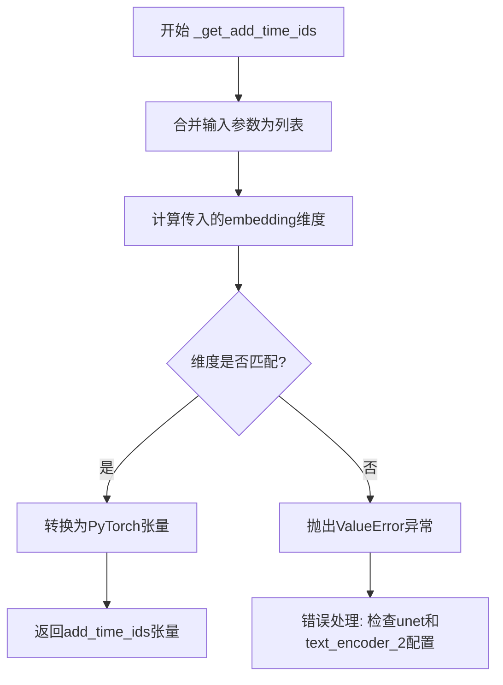

#### 带注释源码

```python
def _get_add_time_ids(
    self, original_size, crops_coords_top_left, target_size, dtype, text_encoder_projection_dim=None
):
    # 将原始尺寸、裁剪坐标和目标尺寸合并为一个列表
    # 格式: [original_height, original_width, crop_y, crop_x, target_height, target_width]
    add_time_ids = list(original_size + crops_coords_top_left + target_size)

    # 计算传入的embedding维度
    # = addition_time_embed_dim * 数量(3个二维参数) + text_encoder_projection_dim
    passed_add_embed_dim = (
        self.unet.config.addition_time_embed_dim * len(add_time_ids) + text_encoder_projection_dim
    )

    # 从UNet配置中获取期望的embedding维度
    expected_add_embed_dim = self.unet.add_embedding.linear_1.in_features

    # 验证传入维度与期望维度是否匹配
    if expected_add_embed_dim != passed_add_embed_dim:
        raise ValueError(
            f"Model expects an added time embedding vector of length {expected_add_embed_dim}, but a vector of {passed_add_embed_dim} was created. The model has an incorrect config. Please check `unet.config.time_embedding_type` and `text_encoder_2.config.projection_dim`."
        )

    # 将列表转换为PyTorch张量，形状为(1, 6)
    add_time_ids = torch.tensor([add_time_ids], dtype=dtype)
    return add_time_ids
```


### `StableDiffusionXLPipeline.upcast_vae`

该方法用于将 VAE（变分自编码器）的数据类型从 float16 上转换为 float32，以避免在解码过程中出现数值溢出。该方法已被废弃，推荐直接使用 `pipe.vae.to(torch.float32)` 代替。

参数：

- 该方法无显式参数（仅包含 `self`）

返回值：`None`，该方法无返回值，仅执行副作用操作。

#### 流程图

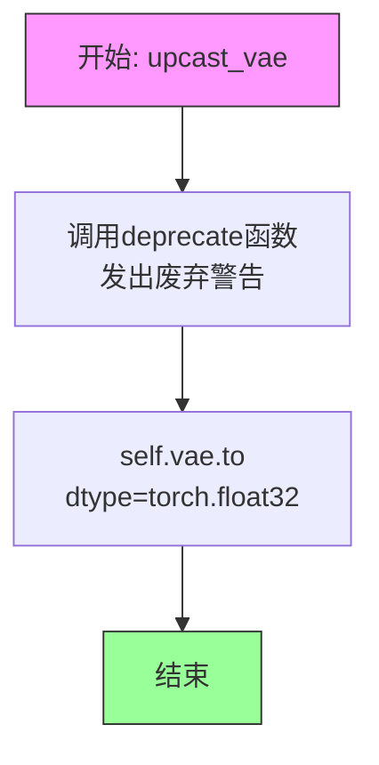

#### 带注释源码

```python
def upcast_vae(self):
    """
    将 VAE（变分自编码器）上转换为 float32 类型。

    该方法已被废弃。在旧版本中，VAE 在 float16 模式下可能发生溢出，
    因此提供了此方法将其上转换为 float32。现在推荐直接使用
    pipe.vae.to(torch.float32) 替代。

    废弃警告内容会引导用户查阅：
    https://github.com/huggingface/diffusers/pull/12619#issue-3606633695

    注意：
    - 该方法修改了 self.vae 的内部状态
    - 调用后，VAE 将使用 float32 进行前向传播
    """
    # 调用 deprecate 函数发出废弃警告
    # 参数说明：
    #   - "upcast_vae": 被废弃的功能名称
    #   - "1.0.0": 废弃版本号
    #   - 第三个参数为废弃原因及替代方案说明
    deprecate(
        "upcast_vae",
        "1.0.0",
        "`upcast_vae` is deprecated. Please use `pipe.vae.to(torch.float32)`. For more details, please refer to: https://github.com/huggingface/diffusers/pull/12619#issue-3606633695.",
    )
    # 将 VAE 模型转换为 float32 数据类型
    # 目的：避免在 VAE 解码过程中出现数值溢出/下溢问题
    self.vae.to(dtype=torch.float32)
```


### StableDiffusionXLPipeline.get_guidance_scale_embedding

该方法用于根据指定的guidance scale生成嵌入向量，用于后续增强时间步嵌入。这是实现Classifier-Free Guidance的关键技术之一，通过将guidance scale映射到高维向量空间，使模型能够更好地理解引导强度的变化。

参数：

- `self`：`StableDiffusionXLPipeline`，Pipeline类的实例方法
- `w`：`torch.Tensor`，一维张量，需要生成嵌入向量的guidance scale值
- `embedding_dim`：`int`，可选，默认值为512，生成的嵌入向量的维度
- `dtype`：`torch.dtype`，可选，默认值为`torch.float32`，生成嵌入向量的数据类型

返回值：`torch.Tensor`，形状为`(len(w), embedding_dim)`的嵌入向量张量

#### 流程图

```mermaid
flowchart TD
    A[开始: 输入w, embedding_dim, dtype] --> B{验证w维度}
    B -->|assert len(w.shape) == 1| C[将w乘以1000.0]
    C --> D[计算half_dim = embedding_dim // 2]
    D --> E[计算基础频率: emb = log(10000.0) / (half_dim - 1)]
    E --> F[生成指数衰减频率: emb = exp(arange(half_dim) * -emb)]
    F --> G[计算加权和: emb = w[:, None] * emb[None, :]]
    G --> H[拼接sin和cos: emb = cat([sin(emb), cos(emb)], dim=1)]
    H --> I{embedding_dim为奇数?}
    I -->|是| J[零填充: pad(emb, (0, 1))]
    I -->|否| K[验证输出形状]
    J --> K
    K --> L[返回嵌入向量]
```

#### 带注释源码

```python
def get_guidance_scale_embedding(
    self, w: torch.Tensor, embedding_dim: int = 512, dtype: torch.dtype = torch.float32
) -> torch.Tensor:
    """
    See https://github.com/google-research/vdm/blob/dc27b98a554f65cdc654b800da5aa1846545d41b/model_vdm.py#L298

    Args:
        w (`torch.Tensor`):
            Generate embedding vectors with a specified guidance scale to subsequently enrich timestep embeddings.
        embedding_dim (`int`, *optional*, defaults to 512):
            Dimension of the embeddings to generate.
        dtype (`torch.dtype`, *optional*, defaults to `torch.float32`):
            Data type of the generated embeddings.

    Returns:
        `torch.Tensor`: Embedding vectors with shape `(len(w), embedding_dim)`.
    """
    # 验证输入w是一维张量
    assert len(w.shape) == 1
    
    # 将guidance scale缩放1000倍，以获得更好的数值范围
    w = w * 1000.0

    # 计算嵌入维度的一半（用于sin和cos的组合）
    half_dim = embedding_dim // 2
    
    # 计算基础频率，使用对数函数生成指数分布的频率基向量
    # 类似于Transformer中的位置编码公式
    emb = torch.log(torch.tensor(10000.0)) / (half_dim - 1)
    
    # 生成指数衰减的频率序列
    emb = torch.exp(torch.arange(half_dim, dtype=dtype) * -emb)
    
    # 将w与频率基向量相乘，得到加权的频率值
    # w[:, None] 和 emb[None, :] 进行广播乘法
    emb = w.to(dtype)[:, None] * emb[None, :]
    
    # 拼接sin和cos函数的结果，形成完整的嵌入向量
    # 这是一种常用的位置编码技术
    emb = torch.cat([torch.sin(emb), torch.cos(emb)], dim=1)
    
    # 如果embedding_dim为奇数，需要进行零填充
    if embedding_dim % 2 == 1:  # zero pad
        emb = torch.nn.functional.pad(emb, (0, 1))
    
    # 验证输出形状是否正确
    assert emb.shape == (w.shape[0], embedding_dim)
    
    # 返回生成的嵌入向量
    return emb
```


### `StableDiffusionXLPipeline.guidance_scale`

该属性返回分类器自由引导（Classifier-Free Guidance）的比例因子（guidance scale），用于控制生成图像与文本提示的匹配程度。值越大，生成的图像越紧密地遵循文本提示，但可能降低图像质量。

参数：
- （无 - 这是一个属性而非方法）

返回值：`float`，返回分类器自由引导的比例因子，用于控制图像生成过程中文本引导的强度。

#### 流程图

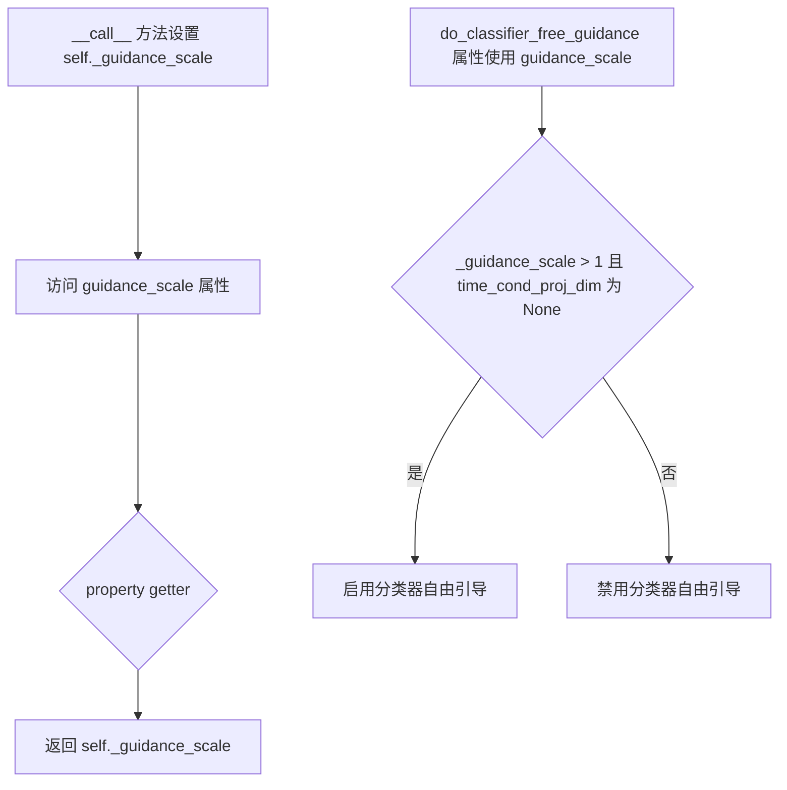

#### 带注释源码

```python
@property
def guidance_scale(self):
    """
    返回分类器自由引导（Classifier-Free Guidance）的比例因子。
    
    该值在 __call__ 方法中被设置，用于控制生成图像与文本提示的匹配程度。
    guidance_scale > 1 时启用分类器自由引导，值越大生成的图像越紧密遵循提示。
    
    返回:
        float: 分类器自由引导的比例因子
    """
    return self._guidance_scale


# 相关的 do_classifier_free_guidance 属性使用了 guidance_scale
@property
def do_classifier_free_guidance(self):
    """
    判断是否启用分类器自由引导。
    
    只有当 guidance_scale > 1 且 unet 不使用时间条件投影维度时才启用。
    这对应于 Imagen 论文中的方程 (2)，其中 guidance_scale = 1 表示不进行引导。
    
    返回:
        bool: 是否启用分类器自由引导
    """
    return self._guidance_scale > 1 and self.unet.config.time_cond_proj_dim is None


# 在 __call__ 方法中设置 guidance_scale
# self._guidance_scale = guidance_scale  # guidance_scale 参数默认为 5.0

# 在推理过程中使用 guidance_scale
# noise_pred = noise_pred_uncond + self.guidance_scale * (noise_pred_text - noise_pred_uncond)
```


### `rescale_noise_cfg`

该函数根据 `guidance_rescale` 参数重新缩放噪声预测张量，用于改善图像质量并修复过度曝光问题。基于论文 [Common Diffusion Noise Schedules and Sample Steps are Flawed](https://huggingface.co/papers/2305.08891) 的 Section 3.4。

参数：

- `noise_cfg`：`torch.Tensor`，引导扩散过程中预测的噪声张量
- `noise_pred_text`：`torch.Tensor`，文本引导扩散过程中预测的噪声张量
- `guidance_rescale`：`float`，可选，默认为 0.0，用于重新缩放噪声预测的因子

返回值：`torch.Tensor`，重新缩放后的噪声预测张量

#### 流程图

```mermaid
flowchart TD
    A[开始] --> B[计算 noise_pred_text 的标准差 std_text]
    B --> C[计算 noise_cfg 的标准差 std_cfg]
    C --> D[计算 rescaled 噪声预测: noise_pred_rescaled = noise_cfg * std_text / std_cfg]
    D --> E[混合原始和 rescaled 结果: noise_cfg = guidance_rescale * noise_pred_rescaled + (1 - guidance_rescale) * noise_cfg]
    E --> F[返回重新缩放后的 noise_cfg]
```

#### 带注释源码

```python
def rescale_noise_cfg(noise_cfg, noise_pred_text, guidance_rescale=0.0):
    r"""
    Rescales `noise_cfg` tensor based on `guidance_rescale` to improve image quality and fix overexposure. Based on
    Section 3.4 from [Common Diffusion Noise Schedules and Sample Steps are
    Flawed](https://huggingface.co/papers/2305.08891).

    Args:
        noise_cfg (`torch.Tensor`):
            The predicted noise tensor for the guided diffusion process.
        noise_pred_text (`torch.Tensor`):
            The predicted noise tensor for the text-guided diffusion process.
        guidance_rescale (`float`, *optional*, defaults to 0.0):
            A rescale factor applied to the noise predictions.

    Returns:
        noise_cfg (`torch.Tensor`): The rescaled noise prediction tensor.
    """
    # 计算文本预测噪声在所有维度（除批次维度外）的标准差
    std_text = noise_pred_text.std(dim=list(range(1, noise_pred_text.ndim)), keepdim=True)
    # 计算噪声配置在所有维度（除批次维度外）的标准差
    std_cfg = noise_cfg.std(dim=list(range(1, noise_cfg.ndim)), keepdim=True)
    
    # 重新缩放引导结果（修复过度曝光）
    # 通过将 noise_cfg 乘以 std_text / std_cfg 来对齐文本预测的标准差
    noise_pred_rescaled = noise_cfg * (std_text / std_cfg)
    
    # 通过 guidance_rescale 因子混合原始引导结果，避免图像看起来"平淡无奇"
    # 当 guidance_rescale = 0 时，返回原始 noise_cfg
    # 当 guidance_rescale = 1 时，完全使用重新缩放的结果
    noise_cfg = guidance_rescale * noise_pred_rescaled + (1 - guidance_rescale) * noise_cfg
    
    return noise_cfg
```

---

### `StableDiffusionXLPipeline.__call__` 中的 `guidance_rescale` 处理

在 `__call__` 方法中，`guidance_rescale` 参数被用于控制噪声预测的重新缩放。

#### 关键代码片段

```python
# 在 __call__ 方法的参数定义中
guidance_rescale: float = 0.0,

# 在方法内部设置实例属性
self._guidance_rescale = guidance_rescale

# 在去噪循环中使用
if self.do_classifier_free_guidance and self.guidance_rescale > 0.0:
    # Based on 3.4. in https://huggingface.co/papers/2305.08891
    noise_pred = rescale_noise_cfg(noise_pred, noise_pred_text, guidance_rescale=self.guidance_rescale)
```

#### 流程图

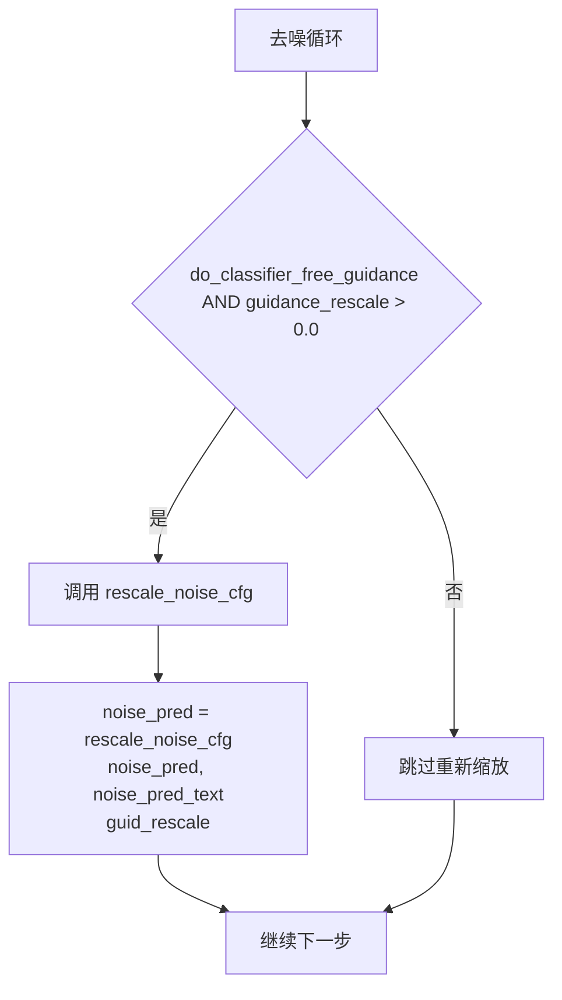

#### 带注释源码

```python
# 引导后的噪声预测计算
if self.do_classifier_free_guidance:
    noise_pred_uncond, noise_pred_text = noise_pred.chunk(2)
    noise_pred = noise_pred_uncond + self.guidance_scale * (noise_pred_text - noise_pred_uncond)

# 应用 guidance_rescale 重新缩放噪声预测
# 这基于论文 Common Diffusion Noise Schedules and Sample Steps are Flawed
# Section 3.4，用于修复过度曝光问题
if self.do_classifier_free_guidance and self.guidance_rescale > 0.0:
    # Based on 3.4. in https://huggingface.co/papers/2305.08891
    noise_pred = rescale_noise_cfg(noise_pred, noise_pred_text, guidance_rescale=self.guidance_rescale)
```


### `StableDiffusionXLPipeline.clip_skip`

这是一个属性方法（Property），用于获取在图像生成过程中从 CLIP 文本编码器跳过的层数。该属性允许用户控制在计算提示嵌入时使用 CLIP 模型的哪一层输出，从而影响生成图像的质量和风格。

参数：

- 该方法无参数（通过 `self` 访问实例属性）

返回值：`int | None`，返回 CLIP 跳过的层数。如果未设置，则返回 `None`。

#### 流程图

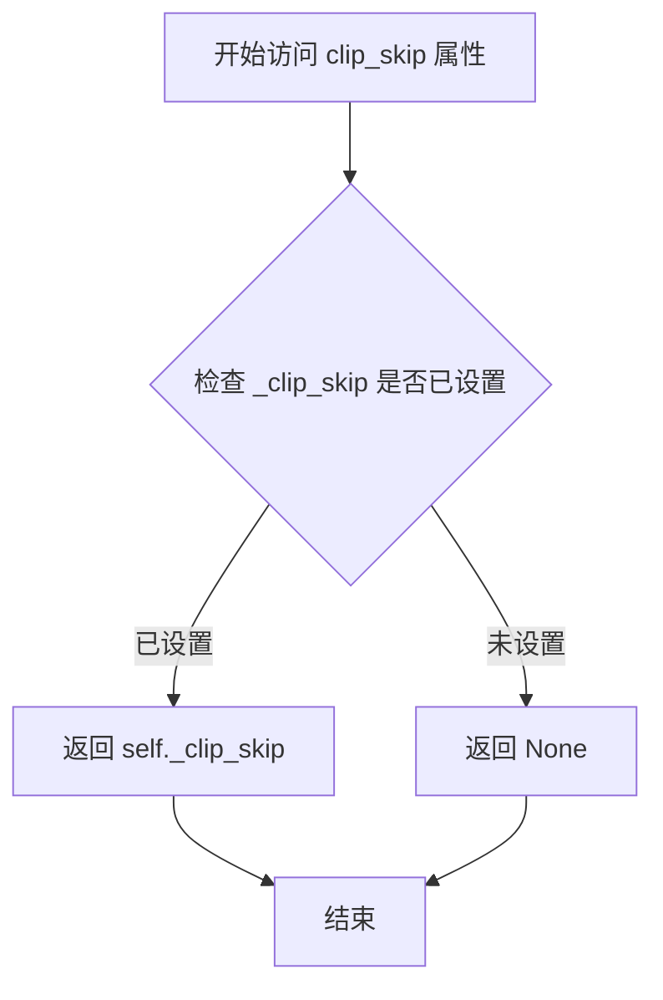

#### 带注释源码

```python
@property
def clip_skip(self):
    """
    属性方法：获取 CLIP 文本编码器跳过的层数。

    该属性返回在调用 pipeline 时设置的 _clip_skip 值。
    clip_skip 参数用于控制从 CLIP 模型的哪一层获取隐藏状态：
    - clip_skip=None: 使用倒数第二层 (hidden_states[-2])
    - clip_skip=1: 使用倒数第三层 (hidden_states[-3])
    - clip_skip=2: 使用倒数第四层 (hidden_states[-4])
    依此类推。

    在 encode_prompt 方法中的使用逻辑：
        if clip_skip is None:
            prompt_embeds = prompt_embeds.hidden_states[-2]
        else:
            # "2" 是因为 SDXL 总是从倒数第二层开始索引
            prompt_embeds = prompt_embeds.hidden_states[-(clip_skip + 2)]

    返回值:
        int | None: 跳过的层数，未设置时返回 None
    """
    return self._clip_skip
```

#### 相关上下文信息

**设置方式**：`clip_skip` 的值在 `__call__` 方法中被设置：

```python
self._clip_skip = clip_skip
```

**使用位置**：在 `encode_prompt` 方法中根据 `clip_skip` 的值选择不同层的隐藏状态：

```python
if clip_skip is None:
    prompt_embeds = prompt_embeds.hidden_states[-2]
else:
    # "2" because SDXL always indexes from the penultimate layer.
    prompt_embeds = prompt_embeds.hidden_states[-(clip_skip + 2)]
```

**设计目的**：通过跳过 CLIP 的最后几层，可以获取不同层次的语义信息。较浅的层通常包含更多细粒度的视觉信息，而较深的层包含更抽象的语义信息。这为用户提供了调整生成结果的能力。


### `StableDiffusionXLPipeline.do_classifier_free_guidance`

该属性用于判断当前管道是否启用Classifier-Free Guidance（CFG）技术。通过判断`guidance_scale`是否大于1且UNet的时间条件投影维度是否为None来确定是否执行无分类器引导。

参数：无（该方法为属性访问器，仅使用隐式参数`self`）

返回值：`bool`，表示是否启用无分类器引导（当guidance_scale大于1且UNet未使用时间条件投影时返回True）

#### 流程图

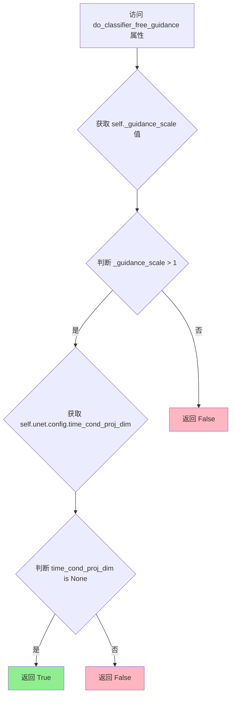

#### 带注释源码

```python
@property
def do_classifier_free_guidance(self):
    """
    属性：判断是否启用无分类器引导（Classifier-Free Guidance）
    
    该属性决定了在去噪过程中是否执行CFG。CFG通过同时预测条件噪声（基于文本提示）
    和无条件噪声（无文本提示），然后根据guidance_scale进行加权组合，从而提高生成图像
    与文本提示的一致性。
    
    决策逻辑：
    1. guidance_scale > 1: 只有当引导尺度大于1时才启用CFG（等于1时等价于不使用CFG）
    2. time_cond_proj_dim is None: 确保UNet不使用时间条件投影（这是SDXL的特定配置）
    
    注意：当UNet配置了time_cond_proj_dim时，说明模型内部已经包含了条件引导逻辑，
    此时外部的CFG可能与之冲突，因此返回False。
    
    Returns:
        bool: 是否启用无分类器引导
    """
    return self._guidance_scale > 1 and self.unet.config.time_cond_proj_dim is None
```


### `StableDiffusionXLPipeline.cross_attention_kwargs`

这是一个属性 getter 方法，用于获取在扩散模型推理过程中传递给注意力处理器（AttentionProcessor）的关键字参数字典。该属性允许用户自定义注意力机制的行为，例如控制注意力dropout、注意力模式等高级功能。

参数：无（属性 getter 不接受参数）

返回值：`dict[str, Any] | None`，返回存储在 pipeline 实例中的交叉注意力 kwargs 字典，如果未设置则返回 `None`。

#### 流程图

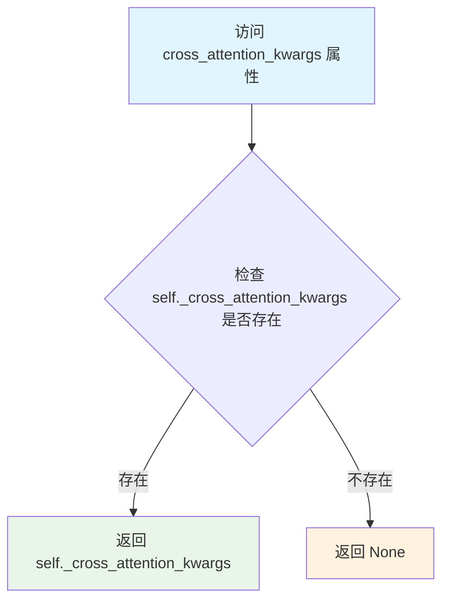

#### 带注释源码

```python
@property
def cross_attention_kwargs(self):
    """
    属性 getter：获取交叉注意力关键字参数
    
    该属性返回在 pipeline 调用时设置的交叉注意力 kwargs，这些参数会被传递
    给 UNet 模型中的 AttentionProcessor，用于自定义注意力机制的行为。
    
    常见用途：
    - 控制注意力dropout比例
    - 切换不同的注意力实现模式
    - 传递自定义注意力处理器所需的参数
    
    返回:
        dict[str, Any] | None: 交叉注意力参数字典，如果未设置则返回 None
    """
    return self._cross_attention_kwargs
```

#### 关联上下文代码

```python
# 在 __call__ 方法中设置此属性
self._cross_attention_kwargs = cross_attention_kwargs

# 在去噪循环中使用该属性
noise_pred = self.unet(
    latent_model_input,
    t,
    encoder_hidden_states=prompt_embeds,
    timestep_cond=timestep_cond,
    cross_attention_kwargs=self.cross_attention_kwargs,  # 传递给 UNet
    added_cond_kwargs=added_cond_kwargs,
    return_dict=False,
)[0]
```

#### 使用示例

```python
# 设置 cross_attention_kwargs
pipe = StableDiffusionXLPipeline.from_pretrained(...)
pipe = pipe.to("cuda")

# 方式1：在调用时传递
image = pipe(
    prompt="a photo of an astronaut riding a horse",
    cross_attention_kwargs={"scale": 0.5}  # 设置 LoRA 权重
)

# 方式2：获取已设置的 cross_attention_kwargs
current_kwargs = pipe.cross_attention_kwargs
print(current_kwargs)  # 输出: {'scale': 0.5} 或 None
```


### `StableDiffusionXLPipeline.denoising_end`

这是一个属性方法（getter），用于获取 pipelines 的内部变量 `_denoising_end`，该变量控制去噪过程的提前终止时机。在 "__call__" 方法中被设置为参数 `denoising_end` 的值，并在去噪循环开始前根据该值调整推理步数。

参数： 无（这是一个属性 getter，不接受任何参数）

返回值： `float | None`，返回去噪结束参数的值，用于控制在何时提前终止去噪过程（值为 0.0 到 1.0 之间的小数）

#### 流程图

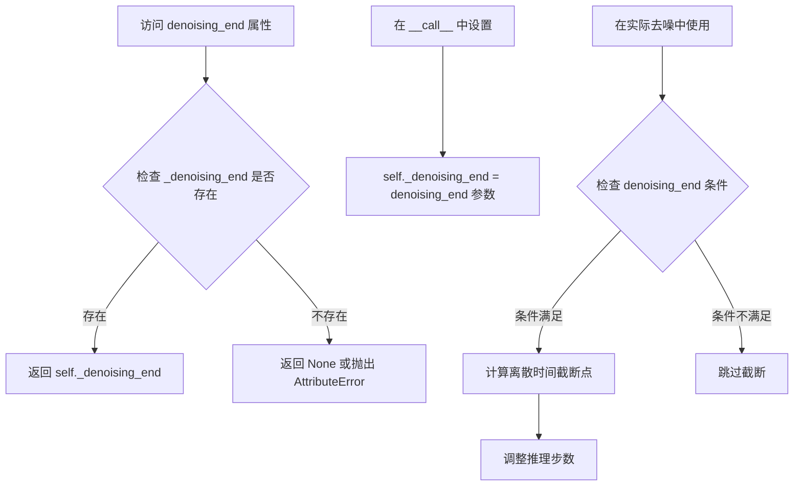

#### 带注释源码

```python
@property
def denoising_end(self):
    r"""
    属性 getter 方法，用于获取去噪结束参数。
    
    该属性返回在 pipeline 调用时设置的去噪结束值（_denoising_end）。
    当设置此值时，可以控制在总去噪过程完成之前提前终止推理，
    从而保留一定量的噪声。这在"Mixture of Denoisers"多pipeline设置中非常有用。
    
    返回:
        float | None: 去噪结束参数，值为 0.0 到 1.0 之间的小数，表示
        在总去噪过程中应该完成的比例。None 表示不使用提前终止。
    """
    return self._denoising_end
```

#### 相关使用上下文

```python
# 在 __call__ 方法中设置该属性
self._denoising_end = denoising_end

# 在去噪循环开始前使用该属性进行调整
if (
    self.denoising_end is not None
    and isinstance(self.denoising_end, float)
    and self.denoising_end > 0
    and self.denoising_end < 1
):
    # 计算离散时间截断点
    discrete_timestep_cutoff = int(
        round(
            self.scheduler.config.num_train_timesteps
            - (self.denoising_end * self.scheduler.config.num_train_timesteps)
        )
    )
    # 根据截断点调整推理步数
    num_inference_steps = len(list(filter(lambda ts: ts >= discrete_timestep_cutoff, timesteps)))
    timesteps = timesteps[:num_inference_steps]
```


### `StableDiffusionXLPipeline.num_timesteps`

该属性返回扩散模型在推理过程中执行的去噪步骤数量，即时间步的总数。该值在调用pipeline生成图像时通过`__call__`方法自动设置。

参数： 无

返回值：`int`，返回推理过程中使用的时间步总数（即去噪步骤数）

#### 流程图

```mermaid
flowchart TD
    A[开始] --> B[读取self._num_timesteps]
    B --> C[返回_num_timesteps值]
    C --> D[结束]
```

#### 带注释源码

```python
@property
def num_timesteps(self):
    """
    属性装饰器，将方法转换为属性访问。
    返回扩散pipeline在推理过程中使用的时间步数量。
    
    该值在__call__方法中被设置为len(timesteps)，
    即扩散调度器在去噪过程中使用的时间步总数。
    """
    return self._num_timesteps
```


### `StableDiffusionXLPipeline.interrupt`

这是一个属性（property），用于获取或设置推理过程中的中断标志，允许用户在生成过程中随时中断图像生成。

参数：
- 无（这是一个属性 getter）

返回值：`bool`，返回当前的中断状态。`True` 表示请求中断推理循环，`False` 表示继续正常生成。

#### 流程图

```mermaid
flowchart TD
    A[获取 interrupt 属性] --> B{返回 self._interrupt}
    B -->|True| C[推理循环中检测到中断标志]
    C --> D[continue 跳过当前迭代]
    B -->|False| E[继续正常执行]
```

#### 带注释源码

```python
@property
def interrupt(self):
    """
    属性：中断标志
    
    用于控制推理过程的中断。当设置为 True 时，__call__ 方法中的
    denoising loop 会检测到该标志并跳过当前迭代，实际上是提前终止生成过程。
    
    使用示例：
        # 在另一个线程中设置中断标志
        pipe.interrupt = True
    
    返回：
        bool: 当前中断状态。True 表示请求中断，False 表示继续生成。
    """
    return self._interrupt
```

---

### 补充说明

**在 `__call__` 方法中的使用：**

```python
# 在推理开始前初始化中断标志
self._interrupt = False

# 在去噪循环中检查中断标志
for i, t in enumerate(timesteps):
    if self.interrupt:
        continue  # 跳过当前迭代，实际上是提前退出循环
    # ... 正常的推理逻辑
```

**设计目的：**
- 允许用户在任何时候通过设置 `pipe.interrupt = True` 来中断正在进行的图像生成
- 这对于长时间运行的生成任务特别有用，可以节省计算资源
- 实现方式是检查属性值并使用 `continue` 语句跳过当前迭代，由于循环是 `with self.progress_bar(total=num_inference_steps)` 上下文管理器，跳出循环后会自动退出生成流程

**潜在优化空间：**
1. 目前使用 `continue` 跳过迭代，可以考虑直接使用 `break` 提前退出循环，可能更高效
2. 没有提供 setter 方法的显式文档，用户需要通过 `pipe.interrupt = True` 来设置中断
3. 中断后没有清理或资源释放的逻辑，可能导致部分资源未释放


### `StableDiffusionXLPipeline.__call__`

这是Stable Diffusion XL管道的主生成方法，负责根据文本提示生成图像。它执行完整的扩散模型推理流程，包括编码提示词、准备潜变量、迭代去噪、VAE解码等步骤，最终返回生成的图像。

参数：

- `prompt`：`str | list[str] | None`，用于指导图像生成的主要提示词
- `prompt_2`：`str | list[str] | None`，发送给第二个tokenizer和text_encoder的提示词
- `height`：`int | None`，生成图像的高度（像素），默认由模型配置决定
- `width`：`int | None`，生成图像的宽度（像素），默认由模型配置决定
- `num_inference_steps`：`int`，去噪步数，默认50步
- `timesteps`：`list[int] | None`，自定义时间步列表
- `sigmas`：`list[float] | None`，自定义sigma值
- `denoising_end`：`float | None`，提前终止去噪的比例（0.0-1.0）
- `guidance_scale`：`float`，分类器自由引导尺度，默认5.0
- `negative_prompt`：`str | list[str] | None`，不引导图像生成的负面提示词
- `negative_prompt_2`：`str | list[str] | None`，第二负面提示词
- `num_images_per_prompt`：`int | None`，每个提示词生成的图像数量
- `eta`：`float`，DDIM论文中的η参数，仅DDIM调度器有效
- `generator`：`torch.Generator | list[torch.Generator] | None`，随机数生成器用于确定性生成
- `latents`：`torch.Tensor | None`，预生成的噪声潜变量
- `prompt_embeds`：`torch.Tensor | None`，预生成的文本嵌入
- `negative_prompt_embeds`：`torch.Tensor | None`，预生成的负面文本嵌入
- `pooled_prompt_embeds`：`torch.Tensor | None`，预生成的池化文本嵌入
- `negative_pooled_prompt_embeds`：`torch.Tensor | None`，预生成的负面池化文本嵌入
- `ip_adapter_image`：`PipelineImageInput | None`，IP适配器图像输入
- `ip_adapter_image_embeds`：`list[torch.Tensor] | None`，IP适配器图像嵌入列表
- `output_type`：`str | None`，输出格式，默认"pil"
- `return_dict`：`bool`，是否返回字典格式结果，默认True
- `cross_attention_kwargs`：`dict[str, Any] | None`，交叉注意力额外参数
- `guidance_rescale`：`float`，引导重缩放因子，默认0.0
- `original_size`：`tuple[int, int] | None`，原始尺寸，用于微条件
- `crops_coords_top_left`：`tuple[int, int]`，裁剪坐标起点，默认(0, 0)
- `target_size`：`tuple[int, int] | None`，目标尺寸，用于微条件
- `negative_original_size`：`tuple[int, int] | None`，负面条件原始尺寸
- `negative_crops_coords_top_left`：`tuple[int, int]`，负面条件裁剪坐标
- `negative_target_size`：`tuple[int, int] | None`，负面条件目标尺寸
- `clip_skip`：`int | None`，CLIP层跳过的数量
- `callback_on_step_end`：`Callable | PipelineCallback | MultiPipelineCallbacks | None`，每步结束时的回调函数
- `callback_on_step_end_tensor_inputs`：`list[str]`，回调函数接受的张量输入列表

返回值：`StableDiffusionXLPipelineOutput | tuple`，返回生成的图像输出对象或元组

#### 流程图

```mermaid
flowchart TD
    A[开始 __call__] --> B[获取默认高度和宽度]
    B --> C[检查输入参数有效性]
    C --> D[设置引导尺度/裁剪参数]
    E[编码输入提示词] --> F[准备时间步]
    F --> G[准备潜变量]
    G --> H[准备额外步骤参数]
    H --> I[准备添加的时间ID和嵌入]
    I --> J{是否有IP-Adapter?}
    J -->|是| K[准备IP-Adapter图像嵌入]
    J -->|否| L[去噪循环开始]
    K --> L
    L --> M[展开潜变量用于分类器自由引导]
    M --> N[调度器缩放模型输入]
    N --> O[UNet预测噪声残差]
    O --> P{执行分类器自由引导?}
    P -->|是| Q[分割噪声预测并应用引导]
    P -->|否| R[计算上一时间步]
    Q --> S[应用引导重缩放]
    S --> R
    R --> T{是否结束回调?}
    T -->|是| U[执行回调函数]
    T -->|否| V[更新进度条]
    U --> V
    V --> W{是否还有时间步?}
    W -->|是| L
    W --> X{输出类型是否为latent?}
    X -->|否| Y[VAE解码]
    X -->|是| Z[直接输出latent]
    Y --> AA[应用水印]
    AA --> AB[后处理图像]
    Z --> AC[释放模型内存]
    AB --> AC
    AC --> AD[返回结果]
```

#### 带注释源码

```python
@torch.no_grad()
@replace_example_docstring(EXAMPLE_DOC_STRING)
def __call__(
    self,
    prompt: str | list[str] = None,
    prompt_2: str | list[str] | None = None,
    height: int | None = None,
    width: int | None = None,
    num_inference_steps: int = 50,
    timesteps: list[int] = None,
    sigmas: list[float] = None,
    denoising_end: float | None = None,
    guidance_scale: float = 5.0,
    negative_prompt: str | list[str] | None = None,
    negative_prompt_2: str | list[str] | None = None,
    num_images_per_prompt: int | None = 1,
    eta: float = 0.0,
    generator: torch.Generator | list[torch.Generator] | None = None,
    latents: torch.Tensor | None = None,
    prompt_embeds: torch.Tensor | None = None,
    negative_prompt_embeds: torch.Tensor | None = None,
    pooled_prompt_embeds: torch.Tensor | None = None,
    negative_pooled_prompt_embeds: torch.Tensor | None = None,
    ip_adapter_image: PipelineImageInput | None = None,
    ip_adapter_image_embeds: list[torch.Tensor] | None = None,
    output_type: str | None = "pil",
    return_dict: bool = True,
    cross_attention_kwargs: dict[str, Any] | None = None,
    guidance_rescale: float = 0.0,
    original_size: tuple[int, int] | None = None,
    crops_coords_top_left: tuple[int, int] = (0, 0),
    target_size: tuple[int, int] | None = None,
    negative_original_size: tuple[int, int] | None = None,
    negative_crops_coords_top_left: tuple[int, int] = (0, 0),
    negative_target_size: tuple[int, int] | None = None,
    clip_skip: int | None = None,
    callback_on_step_end: Callable[[int, int], None] | PipelineCallback | MultiPipelineCallbacks | None = None,
    callback_on_step_end_tensor_inputs: list[str] = ["latents"],
    **kwargs,
):
    r"""
    Function invoked when calling the pipeline for generation.
    ...
    """
    # 处理已废弃的callback参数
    callback = kwargs.pop("callback", None)
    callback_steps = kwargs.pop("callback_steps", None)

    if callback is not None:
        deprecate(
            "callback",
            "1.0.0",
            "Passing `callback` as an input argument to `__call__` is deprecated, consider use `callback_on_step_end`",
        )
    if callback_steps is not None:
        deprecate(
            "callback_steps",
            "1.0.0",
            "Passing `callback_steps` as an input argument to `__call__` is deprecated, consider use `callback_on_step_end`",
        )

    if isinstance(callback_on_step_end, (PipelineCallback, MultiPipelineCallbacks)):
        callback_on_step_end_tensor_inputs = callback_on_step_end.tensor_inputs

    # 0. 默认高度和宽度
    height = height or self.default_sample_size * self.vae_scale_factor
    width = width or self.default_sample_size * self.vae_scale_factor

    original_size = original_size or (height, width)
    target_size = target_size or (height, width)

    # 1. 检查输入
    self.check_inputs(
        prompt, prompt_2, height, width, callback_steps,
        negative_prompt, negative_prompt_2, prompt_embeds,
        negative_prompt_embeds, pooled_prompt_embeds,
        negative_pooled_prompt_embeds, ip_adapter_image,
        ip_adapter_image_embeds, callback_on_step_end_tensor_inputs,
    )

    # 设置内部状态
    self._guidance_scale = guidance_scale
    self._guidance_rescale = guidance_rescale
    self._clip_skip = clip_skip
    self._cross_attention_kwargs = cross_attention_kwargs
    self._denoising_end = denoising_end
    self._interrupt = False

    # 2. 定义批次大小
    if prompt is not None and isinstance(prompt, str):
        batch_size = 1
    elif prompt is not None and isinstance(prompt, list):
        batch_size = len(prompt)
    else:
        batch_size = prompt_embeds.shape[0]

    device = self._execution_device

    # 3. 编码提示词
    lora_scale = (
        self.cross_attention_kwargs.get("scale", None) if self.cross_attention_kwargs is not None else None
    )

    (
        prompt_embeds,
        negative_prompt_embeds,
        pooled_prompt_embeds,
        negative_pooled_prompt_embeds,
    ) = self.encode_prompt(
        prompt=prompt,
        prompt_2=prompt_2,
        device=device,
        num_images_per_prompt=num_images_per_prompt,
        do_classifier_free_guidance=self.do_classifier_free_guidance,
        negative_prompt=negative_prompt,
        negative_prompt_2=negative_prompt_2,
        prompt_embeds=prompt_embeds,
        negative_prompt_embeds=negative_prompt_embeds,
        pooled_prompt_embeds=pooled_prompt_embeds,
        negative_pooled_prompt_embeds=negative_pooled_prompt_embeds,
        lora_scale=lora_scale,
        clip_skip=self.clip_skip,
    )

    # 4. 准备时间步
    if XLA_AVAILABLE:
        timestep_device = "cpu"
    else:
        timestep_device = device
    timesteps, num_inference_steps = retrieve_timesteps(
        self.scheduler, num_inference_steps, timestep_device, timesteps, sigmas
    )

    # 5. 准备潜变量
    num_channels_latents = self.unet.config.in_channels
    latents = self.prepare_latents(
        batch_size * num_images_per_prompt,
        num_channels_latents,
        height,
        width,
        prompt_embeds.dtype,
        device,
        generator,
        latents,
    )

    # 6. 准备额外步骤参数
    extra_step_kwargs = self.prepare_extra_step_kwargs(generator, eta)

    # 7. 准备添加的时间ID和嵌入
    add_text_embeds = pooled_prompt_embeds
    if self.text_encoder_2 is None:
        text_encoder_projection_dim = int(pooled_prompt_embeds.shape[-1])
    else:
        text_encoder_projection_dim = self.text_encoder_2.config.projection_dim

    add_time_ids = self._get_add_time_ids(
        original_size,
        crops_coords_top_left,
        target_size,
        dtype=prompt_embeds.dtype,
        text_encoder_projection_dim=text_encoder_projection_dim,
    )
    # 处理负面条件的时间ID
    if negative_original_size is not None and negative_target_size is not None:
        negative_add_time_ids = self._get_add_time_ids(
            negative_original_size,
            negative_crops_coords_top_left,
            negative_target_size,
            dtype=prompt_embeds.dtype,
            text_encoder_projection_dim=text_encoder_projection_dim,
        )
    else:
        negative_add_time_ids = add_time_ids

    # 分类器自由引导：拼接负面和正面条件
    if self.do_classifier_free_guidance:
        prompt_embeds = torch.cat([negative_prompt_embeds, prompt_embeds], dim=0)
        add_text_embeds = torch.cat([negative_pooled_prompt_embeds, add_text_embeds], dim=0)
        add_time_ids = torch.cat([negative_add_time_ids, add_time_ids], dim=0)

    prompt_embeds = prompt_embeds.to(device)
    add_text_embeds = add_text_embeds.to(device)
    add_time_ids = add_time_ids.to(device).repeat(batch_size * num_images_per_prompt, 1)

    # 处理IP-Adapter图像嵌入
    if ip_adapter_image is not None or ip_adapter_image_embeds is not None:
        image_embeds = self.prepare_ip_adapter_image_embeds(
            ip_adapter_image,
            ip_adapter_image_embeds,
            device,
            batch_size * num_images_per_prompt,
            self.do_classifier_free_guidance,
        )

    # 8. 去噪循环
    num_warmup_steps = max(len(timesteps) - num_inference_steps * self.scheduler.order, 0)

    # 8.1 应用denoising_end提前停止
    if (
        self.denoising_end is not None
        and isinstance(self.denoising_end, float)
        self.denoising_end > 0
        and self.denoising_end < 1
    ):
        discrete_timestep_cutoff = int(
            round(
                self.scheduler.config.num_train_timesteps
                - (self.denoising_end * self.scheduler.config.num_train_timesteps)
            )
        )
        num_inference_steps = len(list(filter(lambda ts: ts >= discrete_timestep_cutoff, timesteps)))
        timesteps = timesteps[:num_inference_steps]

    # 9. 可选：获取引导尺度嵌入
    timestep_cond = None
    if self.unet.config.time_cond_proj_dim is not None:
        guidance_scale_tensor = torch.tensor(self.guidance_scale - 1).repeat(batch_size * num_images_per_prompt)
        timestep_cond = self.get_guidance_scale_embedding(
            guidance_scale_tensor, embedding_dim=self.unet.config.time_cond_proj_dim
        ).to(device=device, dtype=latents.dtype)

    self._num_timesteps = len(timesteps)
    with self.progress_bar(total=num_inference_steps) as progress_bar:
        for i, t in enumerate(timesteps):
            if self.interrupt:
                continue

            # 展开潜变量
            latent_model_input = torch.cat([latents] * 2) if self.do_classifier_free_guidance else latents

            latent_model_input = self.scheduler.scale_model_input(latent_model_input, t)

            # 预测噪声残差
            added_cond_kwargs = {"text_embeds": add_text_embeds, "time_ids": add_time_ids}
            if ip_adapter_image is not None or ip_adapter_image_embeds is not None:
                added_cond_kwargs["image_embeds"] = image_embeds
            noise_pred = self.unet(
                latent_model_input,
                t,
                encoder_hidden_states=prompt_embeds,
                timestep_cond=timestep_cond,
                cross_attention_kwargs=self.cross_attention_kwargs,
                added_cond_kwargs=added_cond_kwargs,
                return_dict=False,
            )[0]

            # 执行引导
            if self.do_classifier_free_guidance:
                noise_pred_uncond, noise_pred_text = noise_pred.chunk(2)
                noise_pred = noise_pred_uncond + self.guidance_scale * (noise_pred_text - noise_pred_uncond)

            # 应用引导重缩放
            if self.do_classifier_free_guidance and self.guidance_rescale > 0.0:
                noise_pred = rescale_noise_cfg(noise_pred, noise_pred_text, guidance_rescale=self.guidance_rescale)

            # 计算前一个噪声样本 x_t -> x_t-1
            latents_dtype = latents.dtype
            latents = self.scheduler.step(noise_pred, t, latents, **extra_step_kwargs, return_dict=False)[0]
            if latents.dtype != latents_dtype:
                if torch.backends.mps.is_available():
                    latents = latents.to(latents_dtype)

            # 步骤结束回调
            if callback_on_step_end is not None:
                callback_kwargs = {}
                for k in callback_on_step_end_tensor_inputs:
                    callback_kwargs[k] = locals()[k]
                callback_outputs = callback_on_step_end(self, i, t, callback_kwargs)

                latents = callback_outputs.pop("latents", latents)
                prompt_embeds = callback_outputs.pop("prompt_embeds", prompt_embeds)
                add_text_embeds = callback_outputs.pop("add_text_embeds", add_text_embeds)
                add_time_ids = callback_outputs.pop("add_time_ids", add_time_ids)

            # 进度更新和旧回调
            if i == len(timesteps) - 1 or ((i + 1) > num_warmup_steps and (i + 1) % self.scheduler.order == 0):
                progress_bar.update()
                if callback is not None and i % callback_steps == 0:
                    step_idx = i // getattr(self.scheduler, "order", 1)
                    callback(step_idx, t, latents)

            if XLA_AVAILABLE:
                xm.mark_step()

    # 10. 解码潜变量
    if not output_type == "latent":
        # 确保VAE为float32模式
        needs_upcasting = self.vae.dtype == torch.float16 and self.vae.config.force_upcast

        if needs_upcasting:
            self.upcast_vae()
            latents = latents.to(next(iter(self.vae.post_quant_conv.parameters())).dtype)
        elif latents.dtype != self.vae.dtype:
            if torch.backends.mps.is_available():
                self.vae = self.vae.to(latents.dtype)

        # 反归一化潜变量
        has_latents_mean = hasattr(self.vae.config, "latents_mean") and self.vae.config.latents_mean is not None
        has_latents_std = hasattr(self.vae.config, "latents_std") and self.vae.config.latents_std is not None
        if has_latents_mean and has_latents_std:
            latents_mean = (
                torch.tensor(self.vae.config.latents_mean).view(1, 4, 1, 1).to(latents.device, latents.dtype)
            )
            latents_std = (
                torch.tensor(self.vae.config.latents_std).view(1, 4, 1, 1).to(latents.device, latents.dtype)
            )
            latents = latents * latents_std / self.vae.config.scaling_factor + latents_mean
        else:
            latents = latents / self.vae.config.scaling_factor

        image = self.vae.decode(latents, return_dict=False)[0]

        # 恢复fp16
        if needs_upcasting:
            self.vae.to(dtype=torch.float16)
    else:
        image = latents

    # 11. 后处理
    if not output_type == "latent":
        # 应用水印
        if self.watermark is not None:
            image = self.watermark.apply_watermark(image)

        image = self.image_processor.postprocess(image, output_type=output_type)

    # 释放模型内存
    self.maybe_free_model_hooks()

    if not return_dict:
        return (image,)

    return StableDiffusionXLPipelineOutput(images=image)
```

## 关键组件


### StableDiffusionXLPipeline

Stable Diffusion XL 文本到图像生成管道，支持双文本编码器、IP Adapter、LoRA 微调、水印和多种调度器，实现高质量图像合成。

### 张量索引与惰性加载

通过 `clip_skip` 参数实现对 CLIP 文本编码器隐藏状态的灵活索引，支持跳过最后N层获取中间层表示，实现提示词嵌入的惰性加载优化。

### 反量化支持

`upcast_vae` 方法和 decode 流程中处理 VAE 从 float16 到 float32 的类型转换，以及 MPS 设备的 dtype 兼容性处理，确保跨平台数值稳定性。

### 量化策略

管道支持文本编码器和 UNet 的 dtype 切换，通过 `to(dtype=...)` 统一管理模型权重的量化状态，并在推理后恢复原始数据类型。

### 双文本编码器架构

支持 `text_encoder` 和 `text_encoder_2` 双通道文本编码，分别处理不同粒度的文本特征，通过 `pooled_prompt_embeds` 和 `prompt_embeds` 融合多模态信息。

### IP Adapter 图像适配

`prepare_ip_adapter_image_embeds` 方法处理图像条件注入，支持预计算图像嵌入或实时编码，实现图像引导的文本到图像生成。

### LoRA 权重动态管理

集成 `StableDiffusionXLLoraLoaderMixin`，通过 `scale_lora_layers` 和 `unscale_lora_layers` 动态调整 LoRA 权重，配合 PEFT 后端实现高效微调。

### 调度器时间步检索

`retrieve_timesteps` 函数封装调度器的 `set_timesteps` 方法，支持自定义 timesteps 或 sigmas，提供灵活的去噪步数配置。

### 水印后处理

可选的 `StableDiffusionXLWatermarker` 对输出图像添加不可见水印，通过 `image_processor.postprocess` 完成最终图像格式转换。

### 微条件编码

`_get_add_time_ids` 方法处理 SDXL 的微条件（original_size、crops_coords_top_left、target_size），将这些元数据编码为时间嵌入向量。

## 问题及建议


### 已知问题

-   **方法职责过重**: `__call__` 方法超过 400 行，包含了输入验证、编码、调度器配置、潜在变量准备、去噪循环、VAE 解码等多个职责，违反了单一职责原则（SRP），导致代码难以维护和测试。
-   **重复代码**: `encode_image` 和 `prepare_ip_adapter_image_embeds` 方法通过注释标记为从其他管道复制（如 `# Copied from diffusers.pipelines.stable_diffusion.pipeline_stable_diffusion.StableDiffusionPipeline`），表明存在代码重复问题。
-   **类型比较使用 `is`**: 代码中 `type(prompt) is not type(negative_prompt)` 使用 `is` 进行类型比较，这是不正确的，应该使用 `==`，因为 `is` 比较的是对象身份而非类型。
-   **双重回调系统**: 代码同时支持旧的回调机制（`callback`, `callback_steps`）和新的回调机制（`callback_on_step_end`），增加了代码复杂性和维护成本。旧系统已标记为弃用但仍被保留。
-   **弃用方法仍存在**: `upcast_vae` 方法已被弃用（`deprecate` 调用），但仍保留在类中以保持向后兼容性，增加了代码库的冗余。
-   **模块级函数与类耦合**: `rescale_noise_cfg` 和 `retrieve_timesteps` 定义在模块级别，但与 `StableDiffusionXLPipeline` 类紧密耦合，如果要重用到其他管道需要复制粘贴。
-   **条件导入**: 代码包含条件导入（`is_invisible_watermark_available()`, `is_torch_xla_available()`），这增加了代码的复杂性和运行时的不确定性。

### 优化建议

-   **重构 `__call__` 方法**: 将 `__call__` 方法分解为多个私有辅助方法，例如 `_encode_prompt`, `_prepare_latents`, `_run_denoising_loop`, `_decode_latents` 等，每个方法负责一个具体的任务。
-   **提取通用模块**: 将 `rescale_noise_cfg` 和 `retrieve_timesteps` 移入一个通用的基类或工具模块中，避免代码重复。
-   **统一回调系统**: 移除旧的回调机制（`callback`, `callback_steps`），只保留新的 `callback_on_step_end` 系统，并更新文档。
-   **修复类型比较**: 将 `type(prompt) is not type(negative_prompt)` 改为 `type(prompt) != type(negative_prompt)`。
-   **移除弃用代码**: 在下一个主版本中移除 `upcast_vae` 方法及其相关弃用警告。
-   **减少参数数量**: 考虑使用配置对象（dataclass 或 Pydantic 模型）来封装 `__call__` 方法的众多参数，提高可读性和可维护性。
-   **抽象 IP Adapter 处理**: 将 IP Adapter 相关的图像嵌入准备逻辑提取到独立的 mixin 或辅助类中。

## 其它


### 设计目标与约束

**设计目标：**
- 实现Stable Diffusion XL (SDXL) 文本到图像生成Pipeline，支持高分辨率图像生成（默认1024x1024）
- 支持双文本编码器架构（CLIP Text Encoder + CLIP Text Encoder with Projection）
- 支持Classifier-Free Guidance (CFG) 引导生成
- 支持IP-Adapter图像提示增强
- 支持LoRA权重加载与文本反演嵌入
- 支持单文件模型加载（.ckpt格式）
- 支持水印添加（invisible watermark）

**设计约束：**
- 图像尺寸必须能被8整除（height % 8 == 0 && width % 8 == 0）
- 最低支持512x512分辨率，低于此分辨率生成质量较差
- prompt_embeds和negative_prompt_embeds形状必须一致
- prompt_embeds和pooled_prompt_embeds必须同时提供
- callback_steps必须为正整数
- IP-Adapter图像数量必须与IP-Adapters数量匹配

### 错误处理与异常设计

**参数校验异常（check_inputs方法）：**
- 图像尺寸不合规：ValueError("`height` and `width` have to be divisible by 8 but are {height} and {width}.")
- callback_steps非正整数：ValueError("`callback_steps` has to be a positive integer...")
- callback_on_step_end_tensor_inputs包含非法张量：ValueError("`callback_on_step_end_tensor_inputs` has to be in...")
- prompt和prompt_embeds同时提供：ValueError("Cannot forward both `prompt` and `prompt_embeds`...")
- prompt类型错误：ValueError("`prompt` has to be of type `str` or `list` but is {type(prompt)}")
- prompt和negative_prompt类型不一致：TypeError("`negative_prompt` should be the same type to `prompt`...")
- batch size不匹配：ValueError("`negative_prompt` has batch size... but `prompt` has batch size...")
- prompt_embeds形状不匹配：ValueError("`prompt_embeds` and `negative_prompt_embeds` must have the same shape...")
- IP-Adapter参数冲突：ValueError("Provide either `ip_adapter_image` or `ip_adapter_image_embeds`...")

**调度器兼容性校验（retrieve_timesteps方法）：**
- 同时传递timesteps和sigmas：ValueError("Only one of `timesteps` or `sigmas` can be passed...")
- 调度器不支持自定义timesteps：ValueError("The current scheduler class... does not support custom timestep schedules...")
- 调度器不支持自定义sigmas：ValueError("The current scheduler class... does not support custom sigmas schedules...")

**潜在运行时异常：**
- 设备兼容性问题（MPS bug导致类型转换）：代码中有特殊处理 `torch.backends.mps.is_available()`
- 内存溢出风险：大批量生成时可能触发OOM
- 模型dtype不匹配：VAE在float16时可能溢出，需要upcast到float32

**弃用警告处理：**
- callback参数已弃用：deprecate("callback", "1.0.0", "Passing `callback` as an input argument...")
- callback_steps参数已弃用：deprecate("callback_steps", "1.0.0", "Passing `callback_steps` as an input argument...")
- upcast_vae方法已弃用：deprecate("upcast_vae", "1.0.0", "`upcast_vae` is deprecated...")

### 数据流与状态机

**主生成流程状态机（__call__方法）：**

```
[初始化] 
  → [参数校验] check_inputs()
  → [设置内部状态] _guidance_scale, _guidance_rescale, _clip_skip, _cross_attention_kwargs, _denoising_end, _interrupt
  → [编码Prompt] encode_prompt()
  → [获取时间步] retrieve_timesteps()
  → [准备潜在变量] prepare_latents()
  → [准备额外参数] prepare_extra_step_kwargs()
  → [准备时间ID] _get_add_time_ids()
  → [准备IP-Adapter] prepare_ip_adapter_image_embeds()
  → [Denoising循环]
      → [噪声预测] unet()
      → [Guidance应用] CFG计算
      → [噪声调度] scheduler.step()
      → [回调处理] callback_on_step_end()
  → [VAE解码] vae.decode()
  → [后处理] postprocess()
  → [水印处理] watermark.apply_watermark()
  → [输出] StableDiffusionXLPipelineOutput
```

**数据流转关键路径：**
1. **文本编码路径**：prompt → tokenizer → text_encoder → prompt_embeds/pooled_prompt_embeds → UNet条件输入
2. **图像潜在空间路径**：随机噪声 → prepare_latents() → UNet去噪循环 → VAE解码 → 像素图像
3. **Guidance路径**：unconditional embeddings + guidance_scale * (conditional - unconditional)
4. **IP-Adapter路径**：ip_adapter_image → encode_image() → prepare_ip_adapter_image_embeds() → UNet added_cond_kwargs

**关键状态变量：**
- `_guidance_scale`: 引导强度（默认5.0）
- `_guidance_rescale`: 噪声cfg重缩放因子（默认0.0）
- `_clip_skip`: CLIP跳过的层数
- `_denoising_end`: 提前终止去噪的比例
- `_num_timesteps`: 总去噪步数
- `_interrupt`: 中断标志

### 外部依赖与接口契约

**核心依赖模型组件：**
- `AutoencoderKL`: VAE编解码器，负责潜在空间与图像空间的转换
- `CLIPTextModel`: 第一文本编码器（clip-vit-large-patch14）
- `CLIPTextModelWithProjection`: 第二文本编码器（CLIP-ViT-bigG-14-laion2B）
- `CLIPTokenizer` / `CLIPTokenizer_2`: 文本分词器
- `UNet2DConditionModel`: 条件去噪U-Net
- `CLIPVisionModelWithProjection`: 图像编码器（IP-Adapter用）
- `CLIPImageProcessor`: 图像特征提取

**调度器依赖：**
- `KarrasDiffusionSchedulers`: 支持DDIMScheduler、LMSDiscreteScheduler、PNDMScheduler等
- 调度器必须实现 `set_timesteps()` 和 `step()` 方法
- 部分调度器支持eta参数（DDIMScheduler）

**Mixins接口契约：**
- `StableDiffusionMixin`: 通用SD功能
- `FromSingleFileMixin`: 单文件加载（.ckpt）
- `StableDiffusionXLLoraLoaderMixin`: LoRA权重加载/保存
- `TextualInversionLoaderMixin`: 文本反演嵌入加载
- `IPAdapterMixin`: IP-Adapter加载

**第三方库依赖：**
- `transformers`: CLIP模型
- `torch`: 张量计算
- `invisible_watermark`: 隐形水印（可选）
- `torch_xla`: XLA加速（可选）

**输出格式契约：**
- `StableDiffusionXLPipelineOutput`: 包含images字段的命名元组
- 支持output_type: "pil", "np", "latent", "pt"
- return_dict=True时返回PipelineOutput，否则返回tuple

### 性能考量与优化空间

**内存优化：**
- 模型CPU卸载序列：`model_cpu_offload_seq = "text_encoder->text_encoder_2->image_encoder->unet->vae"`
- VAE分块解码（tile decoding）支持：大图像时可启用
- 梯度禁用：`@torch.no_grad()` 装饰器应用于主生成方法
- MPS设备特殊处理：避免特定平台的dtype bug

**计算优化：**
- LoRA动态调整：lora_scale参数即时生效
- 文本嵌入批处理：支持批量prompt处理
- 无条件 embeddings 预计算：CFG时重复使用
- Guidance Scale Embedding：可选的timestep条件嵌入加速

**生成效率：**
- 默认50步去噪，可通过num_inference_steps调整
- 支持自定义timesteps/sigmas跳过不必要的步
- denoising_end参数支持早期退出

**已识别的性能瓶颈：**
- 双文本编码器串行执行：text_encoder和text_encoder_2可并行
- 每步都进行VAE解码检查：可优化为仅最后一步解码
- IP-Adapter图像编码在主循环外但未充分利用

### 安全性考虑

**输入验证：**
- prompt长度限制（CLIP tokenizer model_max_length）
- 图像尺寸限制（防止过大导致OOM）
- callback_on_step_end_tensor_inputs白名单检查

**模型安全：**
- 强制zero embeddings用于空negative_prompt（force_zeros_for_empty_prompt）
- 水印添加防止图像滥用
- IP-Adapter图像嵌入隔离处理

**设备安全：**
- CUDA内存管理：使用梯度检查点节省显存
- XLA设备特殊路径处理
- dtype转换安全检查（MPS兼容性问题处理）

### 并发与线程安全性

**线程安全设计：**
- Pipeline实例为无状态设计（内部状态通过方法参数传递）
- 模型组件为只读共享
- 随机生成器（generator）可列表传入实现可重复生成
- 内部状态变量使用下划线前缀（_guidance_scale等）标识

**并发限制：**
- 单次__call__调用内不支持真正的并行去噪
- 多个Pipeline实例可并行运行（需独立设备）
- callback_on_step_end在主线程顺序执行

### 配置管理与版本兼容性

**配置参数（register_to_config）：**
- `force_zeros_for_empty_prompt`: 默认True，空提示时强制零向量
- `vae_scale_factor`: VAE缩放因子（基于block_out_channels计算）
- `default_sample_size`: 默认采样尺寸（128）

**可选组件（_optional_components）：**
```python
["tokenizer", "tokenizer_2", "text_encoder", "text_encoder_2", "image_encoder", "feature_extractor"]
```

**版本相关：**
- 弃用callback/callback_steps：推荐使用callback_on_step_end
- 弃用upcast_vae：推荐直接使用pipe.vae.to(torch.float32)
- PEFT后端支持：USE_PEFT_BACKEND标志切换LoRA处理方式

### 测试策略建议

**单元测试覆盖点：**
- check_inputs()各类参数校验
- encode_prompt() Embeddings生成
- prepare_latents() 潜在变量初始化
- retrieve_timesteps() 时间步获取
- 不同output_type输出格式
- LoRA/Textual Inversion加载

**集成测试：**
- 端到端图像生成验证
- IP-Adapter功能验证
- 单文件加载验证
- 多调度器兼容性

**性能测试：**
- 内存占用基准测试
- 生成速度基准测试
- 批量生成吞吐量

### 部署注意事项

**环境要求：**
- Python 3.8+
- PyTorch 2.0+
- CUDA 11.8+（GPU推理）
- transformers库
- diffusers库

**模型下载：**
- 默认从HuggingFace Hub下载stabilityai/stable-diffusion-xl-base-1.0
- 可通过from_single_file加载本地.ckpt
- LoRA权重需单独下载

**GPU内存建议：**
- FP16推理：~8GB VRAM
- FP32推理：~16GB VRAM
- 批量生成：需相应增加显存

**生产部署建议：**
- 使用model_cpu_offload_seq优化显存
- 考虑使用xFormers加速Attention计算
- 启用flash attention（兼容设备）
- 配置合适的num_inference_steps（质量vs速度权衡）


    