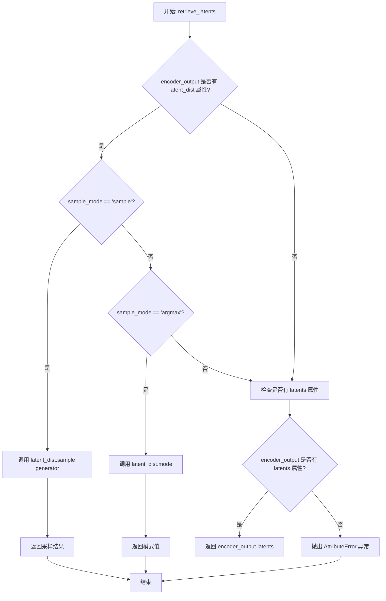
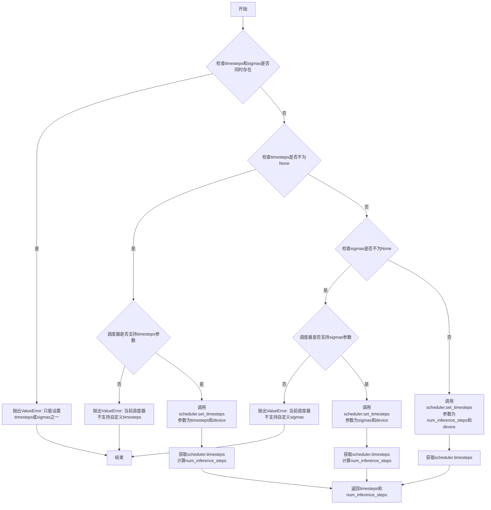
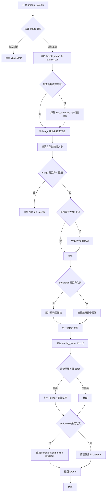
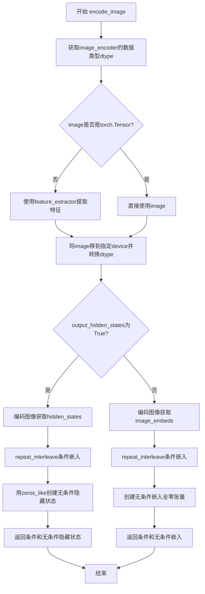
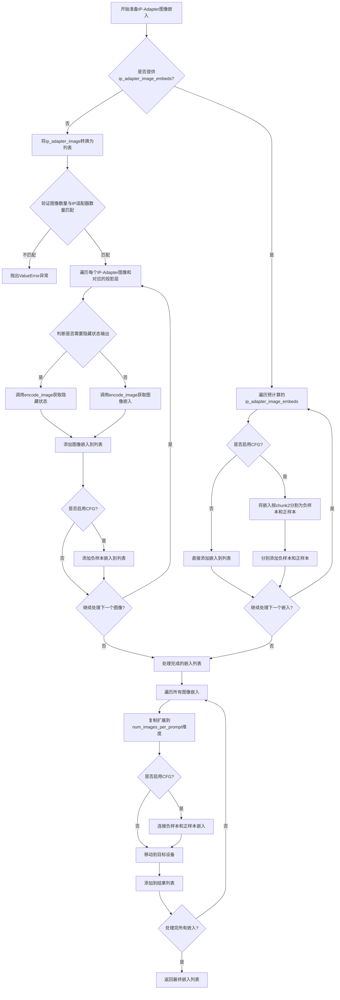
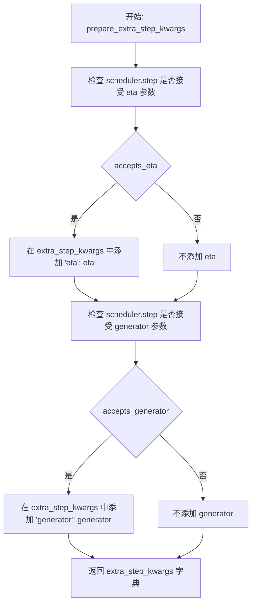
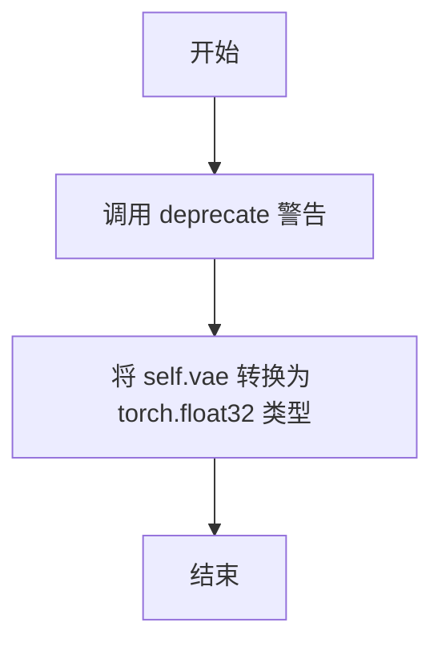

```mermaid
flowchart TD
    A[开始 __call__] --> B[检查输入参数 check_inputs]
    B --> C[定义调用参数: batch_size, device]
    C --> D[编码输入提示 encode_prompt]
    D --> E[预处理图像 image_processor.preprocess]
    E --> F[准备时间步 retrieve_timesteps & get_timesteps]
    F --> G[准备潜在变量 prepare_latents]
    G --> H[准备额外步骤参数 prepare_extra_step_kwargs]
    H --> I[准备添加的时间 ID 和嵌入 _get_add_time_ids]
    I --> J{是否有 IP Adapter?}
    J -->|是| K[准备 IP Adapter 图像嵌入 prepare_ip_adapter_image_embeds]
    J -->|否| L[去噪循环开始]
    K --> L
    L --> M[获取时间步 t]
    M --> N{执行 classifier free guidance?}
    N -->|是| O[扩展潜在变量 latent_model_input = torch.cat]
    N -->|否| P[缩放模型输入 scheduler.scale_model_input]
    O --> P
    P --> Q[UNet 预测噪声噪声残差 noise_pred]
    Q --> R{启用 guidance?}
    R -->|是| S[计算引导后的噪声预测]
    R -->|否| T[调度器步骤 scheduler.step]
    S --> T
    T --> U{有 callback_on_step_end?}
    U -->|是| V[执行回调函数]
    U -->|否| W{是否完成所有时间步?}
    V --> W
    W -->|否| M
    W -->|是| X{output_type == 'latent'?}
    X -->|是| Y[直接返回 latents]
    X -->|否| Z[VAE 解码 latents 到图像]
    Z --> AA[应用水印 watermark.apply_watermark]
    AA --> BB[后处理图像 image_processor.postprocess]
    BB --> CC[释放模型钩子 maybe_free_model_hooks]
    CC --> DD{return_dict == True?}
    DD -->|是| EE[返回 StableDiffusionXLPipelineOutput]
    DD -->|否| FF[返回元组]
```

# `diffusers\src\diffusers\pipelines\stable_diffusion_xl\pipeline_stable_diffusion_xl_img2img.py` 详细设计文档

Stable Diffusion XL Image-to-Image Pipeline，用于根据文本提示对输入图像进行去噪扩散处理，生成基于提示的变体图像。该管道继承自DiffusionPipeline，支持文本反转、LoRA权重加载、IP Adapter等高级功能。

## 整体流程

```mermaid
graph TD
    A[开始: 调用__call__] --> B[1. 检查输入参数check_inputs]
B --> C[2. 编码输入提示encode_prompt]
C --> D[3. 预处理图像image_processor.preprocess]
D --> E[4. 准备时间步retrieve_timesteps + get_timesteps]
E --> F[5. 准备潜在向量prepare_latents]
F --> G[6. 准备额外步骤参数prepare_extra_step_kwargs]
G --> H[7. 准备时间ID和时间嵌入_get_add_time_ids]
H --> I{是否存在IP Adapter?}
I -- 是 --> J[准备IP Adapter图像嵌入prepare_ip_adapter_image_embeds]
I -- 否 --> K[9. 去噪循环开始]
J --> K
K --> L[遍历每个时间步t]
L --> M[扩展潜在向量用于无分类器引导]
M --> N[scheduler.scale_model_input]
N --> O[UNet预测噪声残差]
O --> P{是否启用引导?}
P -- 是 --> Q[执行无分类器引导计算]
P -- 否 --> R[scheduler.step更新潜在向量]
Q --> R
R --> S{是否有回调?]
S -- 是 --> T[执行callback_on_step_end]
S -- 否 --> U{是否还有时间步?}
U -- 是 --> L
U -- 否 --> V[10. VAE解码潜在向量]
V --> W[11. 后处理图像]
W --> X[12. 添加水印(可选)]
X --> Y[返回生成图像]
```

## 类结构

```
DiffusionPipeline (抽象基类)
├── StableDiffusionMixin
├── TextualInversionLoaderMixin
├── FromSingleFileMixin
├── StableDiffusionXLLoraLoaderMixin
├── IPAdapterMixin
└── StableDiffusionXLImg2ImgPipeline (主类)
```

## 全局变量及字段


### `logger`
    
模块日志记录器，用于记录管道运行时的日志信息

类型：`logging.Logger`
    


### `EXAMPLE_DOC_STRING`
    
示例文档字符串，包含管道使用示例的Python代码

类型：`str`
    


### `XLA_AVAILABLE`
    
XLA可用性标志，指示是否支持PyTorch XLA加速

类型：`bool`
    


### `model_cpu_offload_seq`
    
CPU卸载顺序，定义模型组件从CPU卸载到GPU的序列

类型：`str`
    


### `_optional_components`
    
可选组件列表，包含管道中可选的模型组件名称

类型：`list[str]`
    


### `_callback_tensor_inputs`
    
回调张量输入列表，定义回调函数可访问的张量变量名

类型：`list[str]`
    


### `StableDiffusionXLImg2ImgPipeline.vae`
    
变分自编码器，用于编码和解码图像与潜在表示

类型：`AutoencoderKL`
    


### `StableDiffusionXLImg2ImgPipeline.text_encoder`
    
冻结的文本编码器(CLIP ViT-L/14)，用于将文本转换为嵌入向量

类型：`CLIPTextModel`
    


### `StableDiffusionXLImg2ImgPipeline.text_encoder_2`
    
第二个冻结文本编码器(含投影)，用于SDXL的文本条件编码

类型：`CLIPTextModelWithProjection`
    


### `StableDiffusionXLImg2ImgPipeline.tokenizer`
    
第一个分词器，用于将文本分割为token

类型：`CLIPTokenizer`
    


### `StableDiffusionXLImg2ImgPipeline.tokenizer_2`
    
第二个分词器，用于SDXL的文本处理

类型：`CLIPTokenizer`
    


### `StableDiffusionXLImg2ImgPipeline.unet`
    
条件U-Net架构，用于去噪潜在表示

类型：`UNet2DConditionModel`
    


### `StableDiffusionXLImg2ImgPipeline.scheduler`
    
去噪调度器，控制扩散过程的噪声调度

类型：`KarrasDiffusionSchedulers`
    


### `StableDiffusionXLImg2ImgPipeline.image_encoder`
    
可选的图像编码器，用于IP-Adapter图像条件

类型：`CLIPVisionModelWithProjection`
    


### `StableDiffusionXLImg2ImgPipeline.feature_extractor`
    
图像特征提取器，用于预处理输入图像

类型：`CLIPImageProcessor`
    


### `StableDiffusionXLImg2ImgPipeline.image_processor`
    
图像处理器，用于图像的预处理和后处理

类型：`VaeImageProcessor`
    


### `StableDiffusionXLImg2ImgPipeline.watermark`
    
可见水印器，用于添加不可见水印

类型：`StableDiffusionXLWatermarker`
    


### `StableDiffusionXLImg2ImgPipeline.vae_scale_factor`
    
VAE缩放因子，用于调整潜在空间的尺度

类型：`int`
    


### `StableDiffusionXLImg2ImgPipeline._guidance_scale`
    
引导尺度，控制分类器-free guidance的强度

类型：`float`
    


### `StableDiffusionXLImg2ImgPipeline._guidance_rescale`
    
引导重缩放因子，用于调整噪声预测以改善图像质量

类型：`float`
    


### `StableDiffusionXLImg2ImgPipeline._clip_skip`
    
CLIP跳过的层数，控制使用CLIP的哪一层输出

类型：`int`
    


### `StableDiffusionXLImg2ImgPipeline._cross_attention_kwargs`
    
交叉注意力参数，用于传递给注意力处理器

类型：`dict[str, Any]`
    


### `StableDiffusionXLImg2ImgPipeline._denoising_end`
    
去噪结束点，控制去噪过程的提前终止

类型：`float`
    


### `StableDiffusionXLImg2ImgPipeline._denoising_start`
    
去噪起始点，控制从部分去噪图像开始的条件

类型：`float`
    


### `StableDiffusionXLImg2ImgPipeline._num_timesteps`
    
时间步数，记录去噪过程的总步数

类型：`int`
    


### `StableDiffusionXLImg2ImgPipeline._interrupt`
    
中断标志，用于控制管道执行的中断

类型：`bool`
    
    

## 全局函数及方法


### `rescale_noise_cfg`

根据 guidance_rescale 重缩放噪声配置以改善图像质量并修复过度曝光问题。该函数基于论文 "Common Diffusion Noise Schedules and Sample Steps are Flawed" 第 3.4 节的方法，通过计算文本预测噪声和_CFG噪声的标准差来进行重新缩放，从而解决过度曝光问题，并通过混合因子避免图像看起来过于平淡。

参数：

- `noise_cfg`：`torch.Tensor`，引导扩散过程中预测的噪声张量
- `noise_pred_text`：`torch.Tensor`，文本引导扩散过程中预测的噪声张量
- `guidance_rescale`：`float`，可选，默认值为 0.0，应用到噪声预测的重缩放因子

返回值：`torch.Tensor`，重缩放后的噪声预测张量

#### 流程图

```mermaid
flowchart TD
    A[输入 noise_cfg, noise_pred_text, guidance_rescale] --> B[计算 noise_pred_text 的标准差 std_text]
    A --> C[计算 noise_cfg 的标准差 std_cfg]
    B --> D[计算重缩放因子: noise_pred_rescaled = noise_cfg * (std_text / std_cfg)]
    C --> D
    D --> E[根据 guidance_rescale 混合: noise_cfg = guidance_rescale * noise_pred_rescaled + (1 - guidance_rescale) * noise_cfg]
    E --> F[返回重缩放后的 noise_cfg]
    
    style D fill:#f9f,stroke:#333
    style E fill:#9f9,stroke:#333
```

#### 带注释源码

```python
def rescale_noise_cfg(noise_cfg, noise_pred_text, guidance_rescale=0.0):
    r"""
    Rescales `noise_cfg` tensor based on `guidance_rescale` to improve image quality and fix overexposure. Based on
    Section 3.4 from [Common Diffusion Noise Schedules and Sample Steps are
    Flawed](https://huggingface.co/papers/2305.08891).

    Args:
        noise_cfg (`torch.Tensor`):
            The predicted noise tensor for the guided diffusion process.
        noise_pred_text (`torch.Tensor`):
            The predicted noise tensor for the text-guided diffusion process.
        guidance_rescale (`float`, *optional*, defaults to 0.0):
            A rescale factor applied to the noise predictions.

    Returns:
        noise_cfg (`torch.Tensor`): The rescaled noise prediction tensor.
    """
    # 计算文本预测噪声在除批处理维度外的所有维度上的标准差
    # keepdim=True 保持维度以便后续广播操作
    std_text = noise_pred_text.std(dim=list(range(1, noise_pred_text.ndim)), keepdim=True)
    
    # 计算CFG噪声在除批处理维度外的所有维度上的标准差
    std_cfg = noise_cfg.std(dim=list(range(1, noise_cfg.ndim)), keepdim=True)
    
    # 使用文本预测噪声的标准差对CFG噪声进行重缩放
    # 这可以修复过度曝光问题 (fixes overexposure)
    noise_pred_rescaled = noise_cfg * (std_text / std_cfg)
    
    # 将重缩放后的结果与原始CFG结果按 guidance_rescale 因子混合
    # 这可以避免生成"平淡无奇"的图像 (avoid "plain looking" images)
    # 当 guidance_rescale=0 时返回原始 noise_cfg
    # 当 guidance_rescale=1 时返回完全重缩放的 noise_pred_rescaled
    noise_cfg = guidance_rescale * noise_pred_rescaled + (1 - guidance_rescale) * noise_cfg
    
    return noise_cfg
```


### `retrieve_latents`

从编码器输出中检索潜在向量，支持从潜在分布中采样或获取其模式值。

参数：

- `encoder_output`：`torch.Tensor`，编码器输出对象，通常包含 `latent_dist` 或 `latents` 属性
- `generator`：`torch.Generator | None`，可选的随机数生成器，用于确保采样过程的可重复性
- `sample_mode`：`str`，采样模式，可选值为 `"sample"`（从分布中采样）或 `"argmax"`（获取分布的模式值），默认为 `"sample"`

返回值：`torch.Tensor`，检索到的潜在向量张量

#### 流程图



#### 带注释源码

```
def retrieve_latents(
    encoder_output: torch.Tensor, generator: torch.Generator | None = None, sample_mode: str = "sample"
):
    """
    从编码器输出中检索潜在向量。
    
    该函数支持三种方式获取潜在向量：
    1. 从 latent_dist 分布中采样（sample_mode="sample"）
    2. 获取 latent_dist 分布的模式/最可能值（sample_mode="argmax"）
    3. 直接返回预计算的 latents 属性
    
    Args:
        encoder_output: 编码器输出对象，通常是 VAE 编码器的输出
        generator: 可选的随机数生成器，用于采样时的可重复性
        sample_mode: 采样模式，"sample" 或 "argmax"
    
    Returns:
        潜在向量张量
    
    Raises:
        AttributeError: 当 encoder_output 既没有 latent_dist 也没有 latents 属性时
    """
    # 检查编码器输出是否有 latent_dist 属性，且采样模式为 "sample"
    if hasattr(encoder_output, "latent_dist") and sample_mode == "sample":
        # 从潜在分布中采样，可选使用生成器确保可重复性
        return encoder_output.latent_dist.sample(generator)
    # 检查编码器输出是否有 latent_dist 属性，且采样模式为 "argmax"
    elif hasattr(encoder_output, "latent_dist") and sample_mode == "argmax":
        # 获取潜在分布的模式值（概率最大的值）
        return encoder_output.latent_dist.mode()
    # 检查编码器输出是否有预计算的 latents 属性
    elif hasattr(encoder_output, "latents"):
        # 直接返回预计算的潜在向量
        return encoder_output.latents
    else:
        # 如果无法访问潜在向量，抛出 AttributeError 异常
        raise AttributeError("Could not access latents of provided encoder_output")
```


### `retrieve_timesteps`

该函数是扩散模型调度器的辅助函数，用于从调度器获取时间步（timesteps），支持三种模式：使用 `num_inference_steps` 自动计算时间步、使用自定义 `timesteps` 列表或使用自定义 `sigmas` 列表。函数会调用调度器的 `set_timesteps` 方法并返回更新后的时间步张量和实际的推理步数。

参数：

-  `scheduler`：`SchedulerMixin`，调度器对象，用于获取时间步的调度器实例
-  `num_inference_steps`：`int | None`，推理步数，用于生成样本的扩散步数，如果使用此参数则 `timesteps` 必须为 `None`
-  `device`：`str | torch.device | None`，时间步要移动到的设备，如果为 `None` 则不移动时间步
-  `timesteps`：`list[int] | None`，自定义时间步列表，用于覆盖调度器的时间步间隔策略
-  `sigmas`：`list[float] | None`，自定义 sigmas 列表，用于覆盖调度器的 sigma 间隔策略

返回值：`tuple[torch.Tensor, int]`，元组包含两个元素：第一个是调度器的时间步张量，第二个是推理步数

#### 流程图



#### 带注释源码

```python
# Copied from diffusers.pipelines.stable_diffusion.pipeline_stable_diffusion.retrieve_timesteps
def retrieve_timesteps(
    scheduler,  # 调度器对象，用于获取时间步
    num_inference_steps: int | None = None,  # 推理步数
    device: str | torch.device | None = None,  # 目标设备
    timesteps: list[int] | None = None,  # 自定义时间步列表
    sigmas: list[float] | None = None,  # 自定义sigmas列表
    **kwargs,  # 其他传递给scheduler.set_timesteps的参数
):
    r"""
    Calls the scheduler's `set_timesteps` method and retrieves timesteps from the scheduler after the call. Handles
    custom timesteps. Any kwargs will be supplied to `scheduler.set_timesteps`.

    Args:
        scheduler (`SchedulerMixin`):
            The scheduler to get timesteps from.
        num_inference_steps (`int`):
            The number of diffusion steps used when generating samples with a pre-trained model. If used, `timesteps`
            must be `None`.
        device (`str` or `torch.device`, *optional*):
            The device to which the timesteps should be moved to. If `None`, the timesteps are not moved.
        timesteps (`list[int]`, *optional*):
            Custom timesteps used to override the timestep spacing strategy of the scheduler. If `timesteps` is passed,
            `num_inference_steps` and `sigmas` must be `None`.
        sigmas (`list[float]`, *optional*):
            Custom sigmas used to override the timestep spacing strategy of the scheduler. If `sigmas` is passed,
            `num_inference_steps` and `timesteps` must be `None`.

    Returns:
        `tuple[torch.Tensor, int]`: A tuple where the first element is the timestep schedule from the scheduler and the
        second element is the number of inference steps.
    """
    # 验证：timesteps和sigmas不能同时指定
    if timesteps is not None and sigmas is not None:
        raise ValueError("Only one of `timesteps` or `sigmas` can be passed. Please choose one to set custom values")
    
    # 场景1：使用自定义timesteps
    if timesteps is not None:
        # 检查调度器的set_timesteps方法是否支持timesteps参数
        accepts_timesteps = "timesteps" in set(inspect.signature(scheduler.set_timesteps).parameters.keys())
        if not accepts_timesteps:
            raise ValueError(
                f"The current scheduler class {scheduler.__class__}'s `set_timesteps` does not support custom"
                f" timestep schedules. Please check whether you are using the correct scheduler."
            )
        # 调用调度器的set_timesteps方法设置自定义时间步
        scheduler.set_timesteps(timesteps=timesteps, device=device, **kwargs)
        # 从调度器获取更新后的时间步
        timesteps = scheduler.timesteps
        # 计算实际的推理步数
        num_inference_steps = len(timesteps)
    
    # 场景2：使用自定义sigmas
    elif sigmas is not None:
        # 检查调度器的set_timesteps方法是否支持sigmas参数
        accept_sigmas = "sigmas" in set(inspect.signature(scheduler.set_timesteps).parameters.keys())
        if not accept_sigmas:
            raise ValueError(
                f"The current scheduler class {scheduler.__class__}'s `set_timesteps` does not support custom"
                f" sigmas schedules. Please check whether you are using the correct scheduler."
            )
        # 调用调度器的set_timesteps方法设置自定义sigmas
        scheduler.set_timesteps(sigmas=sigmas, device=device, **kwargs)
        # 从调度器获取更新后的时间步
        timesteps = scheduler.timesteps
        # 计算实际的推理步数
        num_inference_steps = len(timesteps)
    
    # 场景3：使用默认的num_inference_steps
    else:
        scheduler.set_timesteps(num_inference_steps, device=device, **kwargs)
        timesteps = scheduler.timesteps
    
    # 返回时间步张量和推理步数
    return timesteps, num_inference_steps
```


### `StableDiffusionXLImg2ImgPipeline.__init__`

这是 `StableDiffusionXLImg2ImgPipeline` 类的构造函数，负责初始化 Stable Diffusion XL图像到图像（Img2Img）推理管道的所有核心组件，包括 VAE、文本编码器、UNet、调度器等，并注册可选组件和水印处理器。

参数：

-  `vae`：`AutoencoderKL`，用于将图像编码和解码到潜在表示的变分自编码器模型
-  `text_encoder`：`CLIPTextModel`，冻结的文本编码器，Stable Diffusion XL 使用 CLIP 的文本部分
-  `text_encoder_2`：`CLIPTextModelWithProjection`，第二个冻结的文本编码器，使用 CLIP 的文本和池化部分
-  `tokenizer`：`CLIPTokenizer`，CLIPTokenizer 类的分词器
-  `tokenizer_2`：`CLIPTokenizer`，第二个 CLIPTokenizer 类的分词器
-  `unet`：`UNet2DConditionModel`，条件 U-Net 架构，用于对编码后的图像潜在表示进行去噪
-  `scheduler`：`KarrasDiffusionSchedulers`，与 `unet` 结合使用对编码图像潜在表示进行去噪的调度器
-  `image_encoder`：`CLIPVisionModelWithProjection | None` = None，用于 IP-Adapter 的可选图像编码器
-  `feature_extractor`：`CLIPImageProcessor | None` = None，用于 IP-Adapter 的可选特征提取器
-  `requires_aesthetics_score`：`bool` = False，是否在推理期间要求传入 `aesthetic_score` 条件
-  `force_zeros_for_empty_prompt`：`bool` = True，是否将负提示词嵌入强制设为零
-  `add_watermarker`：`bool | None` = None，是否使用 invisible_watermark 库对输出图像加水印

返回值：`None`，构造函数无返回值

#### 流程图

```mermaid
flowchart TD
    A[__init__ 开始] --> B[调用 super().__init__]
    B --> C[register_modules 注册所有模块]
    C --> D[register_to_config 注册配置参数]
    D --> E[计算 vae_scale_factor]
    E --> F[创建 VaeImageProcessor]
    F --> G{add_watermarker 是否为 None?}
    G -->|是| H[检查 is_invisible_watermark_available]
    G -->|否| I{add_watermarker 为 True?}
    H --> J[设置 add_watermarker]
    J --> I
    I -->|是| K[创建 StableDiffusionXLWatermarker]
    I -->|否| L[设置 watermark 为 None]
    K --> M[__init__ 结束]
    L --> M
```

#### 带注释源码

```python
def __init__(
    self,
    vae: AutoencoderKL,
    text_encoder: CLIPTextModel,
    text_encoder_2: CLIPTextModelWithProjection,
    tokenizer: CLIPTokenizer,
    tokenizer_2: CLIPTokenizer,
    unet: UNet2DConditionModel,
    scheduler: KarrasDiffusionSchedulers,
    image_encoder: CLIPVisionModelWithProjection = None,
    feature_extractor: CLIPImageProcessor = None,
    requires_aesthetics_score: bool = False,
    force_zeros_for_empty_prompt: bool = True,
    add_watermarker: bool | None = None,
):
    """
    初始化 StableDiffusionXLImg2ImgPipeline 管道
    
    参数:
        vae: 变分自编码器，用于图像与潜在表示之间的转换
        text_encoder: 第一个冻结的 CLIP 文本编码器
        text_encoder_2: 第二个冻结的 CLIP 文本编码器（带投影）
        tokenizer: 第一个 CLIP 分词器
        tokenizer_2: 第二个 CLIP 分词器
        unet: 条件 U-Net，用于去噪
        scheduler: 扩散调度器
        image_encoder: 可选的图像编码器，用于 IP-Adapter
        feature_extractor: 可选的图像特征提取器
        requires_aesthetics_score: 是否需要美学评分条件
        force_zeros_for_empty_prompt: 空提示词时是否强制为零嵌入
        add_watermarker: 是否添加水印
    """
    # 调用父类 DiffusionPipeline 的初始化方法
    super().__init__()

    # 注册所有模块，使管道能够访问和保存这些组件
    self.register_modules(
        vae=vae,
        text_encoder=text_encoder,
        text_encoder_2=text_encoder_2,
        tokenizer=tokenizer,
        tokenizer_2=tokenizer_2,
        unet=unet,
        image_encoder=image_encoder,
        feature_extractor=feature_extractor,
        scheduler=scheduler,
    )
    
    # 将配置参数注册到管道配置中
    self.register_to_config(force_zeros_for_empty_prompt=force_zeros_for_empty_prompt)
    self.register_to_config(requires_aesthetics_score=requires_aesthetics_score)
    
    # 计算 VAE 缩放因子，基于 VAE 块输出通道数的深度
    # 2^(len(block_out_channels) - 1)，典型值为 8
    self.vae_scale_factor = 2 ** (len(self.vae.config.block_out_channels) - 1) if getattr(self, "vae", None) else 8
    
    # 创建图像处理器，用于图像的预处理和后处理
    self.image_processor = VaeImageProcessor(vae_scale_factor=self.vae_scale_factor)

    # 如果 add_watermarker 为 None，则根据水印库是否可用来决定
    add_watermarker = add_watermarker if add_watermarker is not None else is_invisible_watermark_available()

    # 根据 add_watermarker 配置水印处理器
    if add_watermarker:
        self.watermark = StableDiffusionXLWatermarker()
    else:
        self.watermark = None
```


### `StableDiffusionXLImg2ImgPipeline.encode_prompt`

该函数负责将文本提示（prompt）编码为文本编码器的隐藏状态向量，支持双文本编码器架构（CLIP Text Encoder和CLIP Text Encoder with Projection），并处理LoRA权重调整、无分类器自由引导（CFG）的负样本嵌入、以及基于CLIP跳过层的高级提示嵌入计算。

参数：

- `prompt`：`str | list[str] | None`，要编码的主提示文本，支持字符串或字符串列表
- `prompt_2`：`str | list[str] | None`，发送给第二tokenizer和text_encoder_2的提示，若不定义则使用prompt
- `device`：`torch.device | None`，torch设备对象，若为None则使用执行设备
- `num_images_per_prompt`：`int`，每个提示要生成的图像数量，默认为1
- `do_classifier_free_guidance`：`bool`，是否启用无分类器自由引导，默认为True
- `negative_prompt`：`str | list[str] | None`，负向提示，用于引导图像生成方向，若不定义需传递negative_prompt_embeds
- `negative_prompt_2`：`str | list[str] | None`，发送给第二tokenizer和text_encoder_2的负向提示
- `prompt_embeds`：`torch.Tensor | None`，预生成的文本嵌入，可用于轻松调整文本输入
- `negative_prompt_embeds`：`torch.Tensor | None`，预生成的负向文本嵌入
- `pooled_prompt_embeds`：`torch.Tensor | None`，预生成的池化文本嵌入
- `negative_pooled_prompt_embeds`：`torch.Tensor | None`，预生成的负向池化文本嵌入
- `lora_scale`：`float | None`，应用于文本编码器所有LoRA层的缩放因子
- `clip_skip`：`int | None`，计算提示嵌入时从CLIP跳过的层数

返回值：`tuple[torch.Tensor, torch.Tensor, torch.Tensor, torch.Tensor]`，返回四个张量：prompt_embeds（编码后的提示嵌入）、negative_prompt_embeds（负向提示嵌入）、pooled_prompt_embeds（池化后的提示嵌入）、negative_pooled_prompt_embeds（负向池化提示嵌入）

#### 流程图

```mermaid
flowchart TD
    A[encode_prompt 开始] --> B{检查lora_scale参数}
    B -->|非None| C[设置self._lora_scale]
    C --> D{判断USE_PEFT_BACKEND}
    D -->|True| E[使用scale_lora_layers调整LoRA]
    D -->|False| F[使用adjust_lora_scale_text_encoder调整LoRA]
    E --> G[标准化prompt为列表]
    F --> G
    B -->|None| G
    G --> H{计算batch_size}
    H -->|prompt不为None| I[batch_size = len(prompt)]
    H -->|prompt为None| J[batch_size = prompt_embeds.shape[0]]
    I --> K[定义tokenizers和text_encoders列表]
    J --> K
    K --> L{prompt_embeds是否为None}
    L -->|Yes| M[处理prompt_2]
    L -->|No| R[跳过embedding生成]
    M --> N{遍历prompts和tokenizers/text_encoders}
    N --> O[调用maybe_convert_prompt处理文本反转]
    O --> P[tokenizer编码文本]
    P --> Q{检查是否截断}
    Q -->|是| R1[记录警告日志]
    Q -->|否| S[text_encoder生成hidden_states]
    R1 --> S
    S --> T{clip_skip是否为None}
    T -->|Yes| U[使用倒数第二层hidden_states]
    T -->|No| V[使用倒数第clip_skip+2层]
    U --> W[提取pooled_prompt_embeds]
    V --> W
    W --> X[添加到prompt_embeds_list]
    X --> Y{prompts遍历完成?}
    Y -->|No| N
    Y -->|Yes| Z[concat所有prompt_embeds]
    R --> Z
    Z --> AA{是否需要CFG}
    AA -->|Yes且negative_prompt_embeds为None| AB{检查force_zeros_for_empty_prompt}
    AB -->|Yes| AC[创建全零negative_prompt_embeds]
    AC --> AE[创建全零negative_pooled_prompt_embeds]
    AB -->|No| AD[处理negative_prompt]
    AD --> AF[遍历negative_prompts]
    AF --> AG[tokenizer编码负向文本]
    AG --> AH[text_encoder生成负向hidden_states]
    AH --> AI[提取负向pooled_embeds]
    AI --> AJ[添加到negative_prompt_embeds_list]
    AJ --> AK[concat负向embeddings]
    AA -->|No| AL[dtype转换prompt_embeds]
    AK --> AL
    AE --> AL
    AL --> AM[重复embeddings以匹配num_images_per_prompt]
    AM --> AN{do_classifier_free_guidance?}
    AN -->|Yes| AO[重复negative_prompt_embeds]
    AN -->|No| AP[跳过negative处理]
    AO --> AQ[重复pooled_prompt_embeds]
    AP --> AQ
    AQ --> AR{处理LoRA后处理}
    AR --> AS{USE_PEFT_BACKEND?}
    AS -->|Yes| AT[调用unscale_lora_layers恢复]
    AS -->|No| AU[跳过恢复]
    AT --> AV[返回四个embeddings]
    AU --> AV
```

#### 带注释源码

```python
def encode_prompt(
    self,
    prompt: str,
    prompt_2: str | None = None,
    device: torch.device | None = None,
    num_images_per_prompt: int = 1,
    do_classifier_free_guidance: bool = True,
    negative_prompt: str | None = None,
    negative_prompt_2: str | None = None,
    prompt_embeds: torch.Tensor | None = None,
    negative_prompt_embeds: torch.Tensor | None = None,
    pooled_prompt_embeds: torch.Tensor | None = None,
    negative_pooled_prompt_embeds: torch.Tensor | None = None,
    lora_scale: float | None = None,
    clip_skip: int | None = None,
):
    r"""
    Encodes the prompt into text encoder hidden states.

    Args:
        prompt (`str` or `list[str]`, *optional*):
            prompt to be encoded
        prompt_2 (`str` or `list[str]`, *optional*):
            The prompt or prompts to be sent to the `tokenizer_2` and `text_encoder_2`. If not defined, `prompt` is
            used in both text-encoders
        device: (`torch.device`):
            torch device
        num_images_per_prompt (`int`):
            number of images that should be generated per prompt
        do_classifier_free_guidance (`bool`):
            whether to use classifier free guidance or not
        negative_prompt (`str` or `list[str]`, *optional*):
            The prompt or prompts not to guide the image generation. If not defined, one has to pass
            `negative_prompt_embeds` instead. Ignored when not using guidance (i.e., ignored if `guidance_scale` is
            less than `1`).
        negative_prompt_2 (`str` or `list[str]`, *optional*):
            The prompt or prompts not to guide the image generation to be sent to `tokenizer_2` and
            `text_encoder_2`. If not defined, `negative_prompt` is used in both text-encoders
        prompt_embeds (`torch.Tensor`, *optional*):
            Pre-generated text embeddings. Can be used to easily tweak text inputs, *e.g.* prompt weighting. If not
            provided, text embeddings will be generated from `prompt` input argument.
        negative_prompt_embeds (`torch.Tensor`, *optional*):
            Pre-generated negative text embeddings. Can be used to easily tweak text inputs, *e.g.* prompt
            weighting. If not provided, negative_prompt_embeds will be generated from `negative_prompt` input
            argument.
        pooled_prompt_embeds (`torch.Tensor`, *optional*):
            Pre-generated pooled text embeddings. Can be used to easily tweak text inputs, *e.g.* prompt weighting.
            If not provided, pooled text embeddings will be generated from `prompt` input argument.
        negative_pooled_prompt_embeds (`torch.Tensor`, *optional*):
            Pre-generated negative pooled text embeddings. Can be used to easily tweak text inputs, *e.g.* prompt
            weighting. If not provided, pooled negative_prompt_embeds will be generated from `negative_prompt`
            input argument.
        lora_scale (`float`, *optional*):
            A lora scale that will be applied to all LoRA layers of the text encoder if LoRA layers are loaded.
        clip_skip (`int`, *optional*):
            Number of layers to be skipped from CLIP while computing the prompt embeddings. A value of 1 means that
            the output of the pre-final layer will be used for computing the prompt embeddings.
    """
    # 确定设备，若未指定则使用执行设备
    device = device or self._execution_device

    # 设置lora scale以便text encoder的LoRA函数可以正确访问
    # 只有当lora_scale非空且当前pipeline支持LoRA时才进行处理
    if lora_scale is not None and isinstance(self, StableDiffusionXLLoraLoaderMixin):
        self._lora_scale = lora_scale

        # 动态调整LoRA scale
        if self.text_encoder is not None:
            if not USE_PEFT_BACKEND:
                # 非PEFT后端直接调整LoRA scale
                adjust_lora_scale_text_encoder(self.text_encoder, lora_scale)
            else:
                # PEFT后端使用scale_lora_layers
                scale_lora_layers(self.text_encoder, lora_scale)

        if self.text_encoder_2 is not None:
            if not USE_PEFT_BACKEND:
                adjust_lora_scale_text_encoder(self.text_encoder_2, lora_scale)
            else:
                scale_lora_layers(self.text_encoder_2, lora_scale)

    # 标准化prompt为列表形式
    prompt = [prompt] if isinstance(prompt, str) else prompt

    # 计算batch_size
    if prompt is not None:
        batch_size = len(prompt)
    else:
        batch_size = prompt_embeds.shape[0]

    # 定义tokenizers和text encoders列表
    # 支持单个或双文本编码器架构
    tokenizers = [self.tokenizer, self.tokenizer_2] if self.tokenizer is not None else [self.tokenizer_2]
    text_encoders = (
        [self.text_encoder, self.text_encoder_2] if self.text_encoder is not None else [self.text_encoder_2]
    )

    # 如果未提供prompt_embeds，则从prompt生成
    if prompt_embeds is None:
        # prompt_2默认为prompt
        prompt_2 = prompt_2 or prompt
        prompt_2 = [prompt_2] if isinstance(prompt_2, str) else prompt_2

        # textual inversion: 处理多向量token（如有需要）
        prompt_embeds_list = []
        prompts = [prompt, prompt_2]
        
        # 遍历两个prompts和对应的tokenizer、text_encoder
        for prompt, tokenizer, text_encoder in zip(prompts, tokenizers, text_encoders):
            # 检查是否启用了TextualInversionLoaderMixin
            if isinstance(self, TextualInversionLoaderMixin):
                prompt = self.maybe_convert_prompt(prompt, tokenizer)

            # tokenizer编码文本
            text_inputs = tokenizer(
                prompt,
                padding="max_length",
                max_length=tokenizer.model_max_length,
                truncation=True,
                return_tensors="pt",
            )

            text_input_ids = text_inputs.input_ids
            # 使用最长padding获取未截断的ids用于检测截断
            untruncated_ids = tokenizer(prompt, padding="longest", return_tensors="pt").input_ids

            # 检测是否发生了截断并记录警告
            if untruncated_ids.shape[-1] >= text_input_ids.shape[-1] and not torch.equal(
                text_input_ids, untruncated_ids
            ):
                removed_text = tokenizer.batch_decode(untruncated_ids[:, tokenizer.model_max_length - 1 : -1])
                logger.warning(
                    "The following part of your input was truncated because CLIP can only handle sequences up to"
                    f" {tokenizer.model_max_length} tokens: {removed_text}"
                )

            # text_encoder生成hidden_states
            prompt_embeds = text_encoder(text_input_ids.to(device), output_hidden_states=True)

            # 提取pooled输出（最终层的 pooled output）
            if pooled_prompt_embeds is None and prompt_embeds[0].ndim == 2:
                pooled_prompt_embeds = prompt_embeds[0]

            # 根据clip_skip选择hidden_states层
            if clip_skip is None:
                # 默认使用倒数第二层
                prompt_embeds = prompt_embeds.hidden_states[-2]
            else:
                # SDXL总是从倒数第clip_skip+2层索引（penultimate layer）
                prompt_embeds = prompt_embeds.hidden_states[-(clip_skip + 2)]

            prompt_embeds_list.append(prompt_embeds)

        # 沿最后一个维度拼接两个文本编码器的embeddings
        prompt_embeds = torch.concat(prompt_embeds_list, dim=-1)

    # 获取无分类器自由引导的无条件embeddings
    zero_out_negative_prompt = negative_prompt is None and self.config.force_zeros_for_empty_prompt
    
    # 处理negative_prompt_embeds
    if do_classifier_free_guidance and negative_prompt_embeds is None and zero_out_negative_prompt:
        # 如果配置要求对空prompt强制为零，则创建全零tensor
        negative_prompt_embeds = torch.zeros_like(prompt_embeds)
        negative_pooled_prompt_embeds = torch.zeros_like(pooled_prompt_embeds)
    elif do_classifier_free_guidance and negative_prompt_embeds is None:
        # 需要从negative_prompt生成embeddings
        negative_prompt = negative_prompt or ""
        negative_prompt_2 = negative_prompt_2 or negative_prompt

        # 标准化为列表
        negative_prompt = batch_size * [negative_prompt] if isinstance(negative_prompt, str) else negative_prompt
        negative_prompt_2 = (
            batch_size * [negative_prompt_2] if isinstance(negative_prompt_2, str) else negative_prompt_2
        )

        # 类型检查
        uncond_tokens: list[str]
        if prompt is not None and type(prompt) is not type(negative_prompt):
            raise TypeError(
                f"`negative_prompt` should be the same type to `prompt`, but got {type(negative_prompt)} !="
                f" {type(prompt)}."
            )
        elif batch_size != len(negative_prompt):
            raise ValueError(
                f"`negative_prompt`: {negative_prompt} has batch size {len(negative_prompt)}, but `prompt`:"
                f" {prompt} has batch size {batch_size}. Please make sure that passed `negative_prompt` matches"
                " the batch size of `prompt`."
            )
        else:
            uncond_tokens = [negative_prompt, negative_prompt_2]

        # 处理negative prompts
        negative_prompt_embeds_list = []
        for negative_prompt, tokenizer, text_encoder in zip(uncond_tokens, tokenizers, text_encoders):
            if isinstance(self, TextualInversionLoaderMixin):
                negative_prompt = self.maybe_convert_prompt(negative_prompt, tokenizer)

            # 使用prompt_embeds的长度作为max_length
            max_length = prompt_embeds.shape[1]
            uncond_input = tokenizer(
                negative_prompt,
                padding="max_length",
                max_length=max_length,
                truncation=True,
                return_tensors="pt",
            )

            negative_prompt_embeds = text_encoder(
                uncond_input.input_ids.to(device),
                output_hidden_states=True,
            )

            # 提取pooled输出
            if negative_pooled_prompt_embeds is None and negative_prompt_embeds[0].ndim == 2:
                negative_pooled_prompt_embeds = negative_prompt_embeds[0]
            
            # 使用倒数第二层
            negative_prompt_embeds = negative_prompt_embeds.hidden_states[-2]

            negative_prompt_embeds_list.append(negative_prompt_embeds)

        # 拼接negative embeddings
        negative_prompt_embeds = torch.concat(negative_prompt_embeds_list, dim=-1)

    # 转换dtype和device
    if self.text_encoder_2 is not None:
        prompt_embeds = prompt_embeds.to(dtype=self.text_encoder_2.dtype, device=device)
    else:
        prompt_embeds = prompt_embeds.to(dtype=self.unet.dtype, device=device)

    # 获取embeddings的形状信息
    bs_embed, seq_len, _ = prompt_embeds.shape
    
    # 为每个prompt复制多个images进行生成（MPS友好的方法）
    prompt_embeds = prompt_embeds.repeat(1, num_images_per_prompt, 1)
    prompt_embeds = prompt_embeds.view(bs_embed * num_images_per_prompt, seq_len, -1)

    # 处理negative embeddings（如果启用CFG）
    if do_classifier_free_guidance:
        seq_len = negative_prompt_embeds.shape[1]

        if self.text_encoder_2 is not None:
            negative_prompt_embeds = negative_prompt_embeds.to(dtype=self.text_encoder_2.dtype, device=device)
        else:
            negative_prompt_embeds = negative_prompt_embeds.to(dtype=self.unet.dtype, device=device)

        negative_prompt_embeds = negative_prompt_embeds.repeat(1, num_images_per_prompt, 1)
        negative_prompt_embeds = negative_prompt_embeds.view(batch_size * num_images_per_prompt, seq_len, -1)

    # 处理pooled embeddings的重复
    pooled_prompt_embeds = pooled_prompt_embeds.repeat(1, num_images_per_prompt).view(
        bs_embed * num_images_per_prompt, -1
    )
    
    if do_classifier_free_guidance:
        negative_pooled_prompt_embeds = negative_pooled_prompt_embeds.repeat(1, num_images_per_prompt).view(
            bs_embed * num_images_per_prompt, -1
        )

    # LoRA后处理：恢复原始scale
    if self.text_encoder is not None:
        if isinstance(self, StableDiffusionXLLoraLoaderMixin) and USE_PEFT_BACKEND:
            # 通过取消缩放LoRA层来恢复原始scale
            unscale_lora_layers(self.text_encoder, lora_scale)

    if self.text_encoder_2 is not None:
        if isinstance(self, StableDiffusionXLLoraLoaderMixin) and USE_PEFT_BACKEND:
            unscale_lora_layers(self.text_encoder_2, lora_scale)

    # 返回四个embeddings
    return prompt_embeds, negative_prompt_embeds, pooled_prompt_embeds, negative_pooled_prompt_embeds
```


### `StableDiffusionXLImg2ImgPipeline.check_inputs`

该方法用于验证Stable Diffusion XL图像到图像流水线的输入参数是否合法，包括检查提示词、强度、推理步数、回调步数、负面提示词、嵌入向量以及IP适配器相关的参数，确保所有参数符合模型要求并抛出相应的错误信息。

参数：

- `prompt`：`str | list[str] | None`，主要的文本提示词，用于指导图像生成
- `prompt_2`：`str | list[str] | None`，发送给第二个tokenizer和text_encoder的提示词，若不定义则使用prompt
- `strength`：`float`，图像转换的概念强度值，控制在0到1之间
- `num_inference_steps`：`int`，去噪步数，用于生成样本
- `callback_steps`：`int | None`，每多少步执行一次回调函数
- `negative_prompt`：`str | list[str] | None`，不引导图像生成的负面提示词
- `negative_prompt_2`：`str | list[str] | None`，发送给第二个tokenizer和text_encoder的负面提示词
- `prompt_embeds`：`torch.Tensor | None`，预生成的文本嵌入，可用于调整文本输入
- `negative_prompt_embeds`：`torch.Tensor | None`，预生成的负面文本嵌入
- `ip_adapter_image`：`PipelineImageInput | None`，用于IP适配器的可选图像输入
- `ip_adapter_image_embeds`：`list[torch.Tensor] | None`，IP适配器的预生成图像嵌入列表
- `callback_on_step_end_tensor_inputs`：`list[str] | None`，步骤结束时回调函数需要的张量输入列表

返回值：`None`，该方法不返回任何值，仅进行参数验证

#### 流程图

```mermaid
flowchart TD
    A[开始 check_inputs] --> B{strength 在 [0, 1] 范围内?}
    B -->|否| B1[抛出 ValueError]
    B -->|是| C{num_inference_steps 是正整数?}
    C -->|否| C1[抛出 ValueError]
    C -->|是| D{callback_steps 是正整数?}
    D -->|否| D1[抛出 ValueError]
    D -->|是| E{callback_on_step_end_tensor_inputs 合法?}
    E -->|否| E1[抛出 ValueError]
    E -->|是| F{prompt 和 prompt_embeds 不能同时提供?}
    F -->|否| F1[抛出 ValueError]
    F -->|是| G{prompt_2 和 prompt_embeds 不能同时提供?}
    G -->|否| G1[抛出 ValueError]
    G -->|是| H{prompt 或 prompt_embeds 必须提供一个?}
    H -->|否| H1[抛出 ValueError]
    H -->|是| I{prompt 类型合法?}
    I -->|否| I1[抛出 ValueError]
    I -->|是| J{prompt_2 类型合法?}
    J -->|否| J1[抛出 ValueError]
    J -->|是| K{negative_prompt 和 negative_prompt_embeds 不同时提供?}
    K -->|否| K1[抛出 ValueError]
    K -->|是| L{negative_prompt_2 和 negative_prompt_embeds 不同时提供?}
    L -->|否| L1[抛出 ValueError]
    L -->|是| M{prompt_embeds 和 negative_prompt_embeds 形状相同?}
    M -->|否| M1[抛出 ValueError]
    M -->|是| N{ip_adapter_image 和 ip_adapter_image_embeds 不同时提供?}
    N -->|否| N1[抛出 ValueError]
    N -->|是| O{ip_adapter_image_embeds 格式合法?}
    O -->|否| O1[抛出 ValueError]
    O -->|是| P[结束 - 验证通过]
    
    B1 --> P
    C1 --> P
    D1 --> P
    E1 --> P
    F1 --> P
    G1 --> P
    H1 --> P
    I1 --> P
    J1 --> P
    K1 --> P
    L1 --> P
    M1 --> P
    N1 --> P
    O1 --> P
```

#### 带注释源码

```python
def check_inputs(
    self,
    prompt,
    prompt_2,
    strength,
    num_inference_steps,
    callback_steps,
    negative_prompt=None,
    negative_prompt_2=None,
    prompt_embeds=None,
    negative_prompt_embeds=None,
    ip_adapter_image=None,
    ip_adapter_image_embeds=None,
    callback_on_step_end_tensor_inputs=None,
):
    # 验证 strength 参数必须在 [0.0, 1.0] 范围内
    # strength 控制图像转换的程度，0 表示不转换，1 表示最大转换
    if strength < 0 or strength > 1:
        raise ValueError(f"The value of strength should in [0.0, 1.0] but is {strength}")
    
    # 验证 num_inference_steps 不能为 None
    if num_inference_steps is None:
        raise ValueError("`num_inference_steps` cannot be None.")
    # 验证 num_inference_steps 必须是正整数
    elif not isinstance(num_inference_steps, int) or num_inference_steps <= 0:
        raise ValueError(
            f"`num_inference_steps` has to be a positive integer but is {num_inference_steps} of type"
            f" {type(num_inference_steps)}."
        )
    
    # 验证 callback_steps 必须是正整数（如果提供）
    if callback_steps is not None and (not isinstance(callback_steps, int) or callback_steps <= 0):
        raise ValueError(
            f"`callback_steps` has to be a positive integer but is {callback_steps} of type"
            f" {type(callback_steps)}."
        )

    # 验证 callback_on_step_end_tensor_inputs 必须是合法的张量输入
    # 只能使用预定义的回调张量输入列表中的元素
    if callback_on_step_end_tensor_inputs is not None and not all(
        k in self._callback_tensor_inputs for k in callback_on_step_end_tensor_inputs
    ):
        raise ValueError(
            f"`callback_on_step_end_tensor_inputs` has to be in {self._callback_tensor_inputs}, but found {[k for k in callback_on_step_end_tensor_inputs if k not in self._callback_tensor_inputs]}"
        )

    # 验证 prompt 和 prompt_embeds 不能同时提供
    # 只能选择其中一种方式传递文本提示信息
    if prompt is not None and prompt_embeds is not None:
        raise ValueError(
            f"Cannot forward both `prompt`: {prompt} and `prompt_embeds`: {prompt_embeds}. Please make sure to"
            " only forward one of the two."
        )
    # 验证 prompt_2 和 prompt_embeds 不能同时提供
    elif prompt_2 is not None and prompt_embeds is not None:
        raise ValueError(
            f"Cannot forward both `prompt_2`: {prompt_2} and `prompt_embeds`: {prompt_embeds}. Please make sure to"
            " only forward one of the two."
        )
    # 验证必须提供 prompt 或 prompt_embeds 之一
    elif prompt is None and prompt_embeds is None:
        raise ValueError(
            "Provide either `prompt` or `prompt_embeds`. Cannot leave both `prompt` and `prompt_embeds` undefined."
        )
    # 验证 prompt 必须是 str 或 list 类型
    elif prompt is not None and (not isinstance(prompt, str) and not isinstance(prompt, list)):
        raise ValueError(f"`prompt` has to be of type `str` or `list` but is {type(prompt)}")
    # 验证 prompt_2 必须是 str 或 list 类型
    elif prompt_2 is not None and (not isinstance(prompt_2, str) and not isinstance(prompt_2, list)):
        raise ValueError(f"`prompt_2` has to be of type `str` or `list` but is {type(prompt_2)}")

    # 验证 negative_prompt 和 negative_prompt_embeds 不能同时提供
    if negative_prompt is not None and negative_prompt_embeds is not None:
        raise ValueError(
            f"Cannot forward both `negative_prompt`: {negative_prompt} and `negative_prompt_embeds`:"
            f" {negative_prompt_embeds}. Please make sure to only forward one of the two."
        )
    # 验证 negative_prompt_2 和 negative_prompt_embeds 不能同时提供
    elif negative_prompt_2 is not None and negative_prompt_embeds is not None:
        raise ValueError(
            f"Cannot forward both `negative_prompt_2`: {negative_prompt_2} and `negative_prompt_embeds`:"
            f" {negative_prompt_embeds}. Please make sure to only forward one of the two."
        )

    # 验证 prompt_embeds 和 negative_prompt_embeds 形状必须相同
    # 确保引导生成和负面引导的嵌入维度一致
    if prompt_embeds is not None and negative_prompt_embeds is not None:
        if prompt_embeds.shape != negative_prompt_embeds.shape:
            raise ValueError(
                "`prompt_embeds` and `negative_prompt_embeds` must have the same shape when passed directly, but"
                f" got: `prompt_embeds` {prompt_embeds.shape} != `negative_prompt_embeds`"
                f" {negative_prompt_embeds.shape}."
            )

    # 验证 ip_adapter_image 和 ip_adapter_image_embeds 不能同时提供
    # IP适配器图像和嵌入只能选择一种方式提供
    if ip_adapter_image is not None and ip_adapter_image_embeds is not None:
        raise ValueError(
            "Provide either `ip_adapter_image` or `ip_adapter_image_embeds`. Cannot leave both `ip_adapter_image` and `ip_adapter_image_embeds` defined."
        )

    # 验证 ip_adapter_image_embeds 的格式是否合法
    # 必须是列表类型，且元素是3D或4D张量
    if ip_adapter_image_embeds is not None:
        if not isinstance(ip_adapter_image_embeds, list):
            raise ValueError(
                f"`ip_adapter_image_embeds` has to be of type `list` but is {type(ip_adapter_image_embeds)}"
            )
        elif ip_adapter_image_embeds[0].ndim not in [3, 4]:
            raise ValueError(
                f"`ip_adapter_image_embeds` has to be a list of 3D or 4D tensors but is {ip_adapter_image_embeds[0].ndim}D"
            )
```


### `StableDiffusionXLImg2ImgPipeline.get_timesteps`

该方法用于根据推理步数、图像强度（strength）和可选的去噪起始点（denoising_start）计算并返回合适的时间步（timesteps）序列。它是Stable Diffusion XL图像到图像转换Pipeline的核心辅助方法，负责确定去噪过程的起止时间步。

参数：

- `num_inference_steps`：`int`，总推理步数，指定去噪过程需要执行的步数
- `strength`：`float`，图像转换强度，值在0到1之间，决定保留多少原始图像信息
- `device`：`torch.device`，计算设备，用于指定张量存放位置（本参数在方法内未直接使用）
- `denoising_start`：`float | None`，可选的去噪起始点，取值范围0.0到1.0，表示从完整去噪过程的哪个比例开始

返回值：`tuple[torch.Tensor, int]`，返回元组包含两个元素：第一个是时间步序列（torch.Tensor），表示去噪过程中使用的时间步；第二个是实际使用的推理步数（int）

#### 流程图

```mermaid
flowchart TD
    A[开始 get_timesteps] --> B{denoising_start 是否为 None?}
    B -->|是| C[计算 init_timestep = min(num_inference_steps × strength, num_inference_steps)]
    C --> D[计算 t_start = max(num_inference_steps - init_timestep, 0)]
    D --> E[从 scheduler.timesteps 中切片获取时间步序列]
    E --> F{scheduler 是否有 set_begin_index 方法?}
    F -->|是| G[调用 scheduler.set_begin_index 设置起始索引]
    F -->|否| H[跳过设置]
    G --> I[返回 timesteps 和 num_inference_steps - t_start]
    H --> I
    B -->|否| J[计算离散时间步截止点 discrete_timestep_cutoff]
    J --> K[计算新的 num_inference_steps]
    K --> L{scheduler.order == 2 且 num_inference_steps 为偶数?}
    L -->|是| M[num_inference_steps 加 1]
    L -->|否| N[保持不变]
    M --> O[计算 t_start 和切片 timesteps]
    N --> O
    O --> P{scheduler 是否有 set_begin_index 方法?}
    P -->|是| Q[调用 scheduler.set_begin_index]
    P -->|否| R[跳过设置]
    Q --> S[返回 timesteps 和 num_inference_steps]
    R --> S
    I --> T[结束]
    S --> T
```

#### 带注释源码

```python
def get_timesteps(self, num_inference_steps, strength, device, denoising_start=None):
    """
    计算并返回适合当前图像转换任务的时间步序列。
    
    参数:
        num_inference_steps: 推理步数
        strength: 转换强度 (0-1)
        device: 计算设备
        denoising_start: 可选的去噪起始点 (0.0-1.0)
    
    返回:
        (timesteps, num_inference_steps): 时间步序列和实际推理步数
    """
    
    # === 场景1: 常规模式 (denoising_start 未指定) ===
    if denoising_start is None:
        # 根据 strength 计算实际起始时间步
        # strength 越高，init_timestep 越大，保留的原始图像信息越少
        init_timestep = min(int(num_inference_steps * strength), num_inference_steps)
        
        # 计算从时间步序列的哪个位置开始
        # num_inference_steps - init_timestep 决定跳过的步数
        t_start = max(num_inference_steps - init_timestep, 0)
        
        # 从 scheduler 的时间步序列中切片获取需要的时间步
        # 使用 scheduler.order 确保正确处理多步调度器
        timesteps = self.scheduler.timesteps[t_start * self.scheduler.order :]
        
        # 如果调度器支持，设置内部起始索引
        if hasattr(self.scheduler, "set_begin_index"):
            self.scheduler.set_begin_index(t_start * self.scheduler.order)
        
        # 返回时间步和实际推理步数
        return timesteps, num_inference_steps - t_start

    # === 场景2: 指定了 denoising_start (多调度器混合模式) ===
    else:
        # 当直接指定起始时间点时，strength 参数被忽略
        # 根据 denoising_start 计算对应的时间步截止点
        discrete_timestep_cutoff = int(
            round(
                self.scheduler.config.num_train_timesteps
                - (denoising_start * self.scheduler.config.num_train_timesteps)
            )
        )
        
        # 计算小于截止点的时间步数量
        num_inference_steps = (self.scheduler.timesteps < discrete_timestep_cutoff).sum().item()
        
        # 特殊处理二阶调度器
        # 如果是二阶调度器且推理步数为偶数，需要加1
        # 原因：偶数意味着在去噪步骤中间截断（1阶和2阶导数之间），会导致错误结果
        # 加1确保去噪过程总是在2阶导数步骤之后结束
        if self.scheduler.order == 2 and num_inference_steps % 2 == 0:
            num_inference_steps = num_inference_steps + 1
        
        # 从时间步序列末尾开始切片
        t_start = len(self.scheduler.timesteps) - num_inference_steps
        timesteps = self.scheduler.timesteps[t_start:]
        
        # 设置调度器起始索引
        if hasattr(self.scheduler, "set_begin_index"):
            self.scheduler.set_begin_index(t_start)
            
        return timesteps, num_inference_steps
```


### `StableDiffusionXLImg2ImgPipeline.prepare_latents`

该方法负责将输入图像编码为潜在向量（latents），并根据需要对潜在向量进行批处理扩展和噪声添加。这是 Stable Diffusion XL图像到图像生成流程中的关键步骤，用于准备扩散模型的初始潜在表示。

参数：

- `self`：隐式参数，StableDiffusionXLImg2ImgPipeline 实例
- `image`：`torch.Tensor | PIL.Image.Image | list`，要处理的输入图像
- `timestep`：`torch.Tensor`，当前扩散时间步，用于噪声调度
- `batch_size`：`int`，原始批处理大小
- `num_images_per_prompt`：`int`，每个提示词生成的图像数量
- `dtype`：`torch.dtype`，张量的数据类型
- `device`：`torch.device`，计算设备
- `generator`：`torch.Generator | list[torch.Generator] | None`，可选的随机数生成器，用于确定性生成
- `add_noise`：`bool`，是否向潜在向量添加噪声，默认为 True

返回值：`torch.Tensor`，准备好的潜在向量张量

#### 流程图



#### 带注释源码

```python
def prepare_latents(
    self, image, timestep, batch_size, num_images_per_prompt, dtype, device, generator=None, add_noise=True
):
    """
    准备图像的潜在向量表示，用于 Stable Diffusion XL 图像到图像生成。
    
    该方法执行以下操作：
    1. 验证输入图像类型
    2. 获取 VAE 的潜在向量统计参数（均值和标准差）
    3. 将图像编码为潜在向量（如果尚未编码）
    4. 应用缩放因子进行归一化
    5. 根据批处理大小扩展潜在向量
    6. 可选地添加噪声
    
    参数:
        image: 输入图像，支持 torch.Tensor, PIL.Image.Image 或 list
        timestep: 当前扩散时间步
        batch_size: 原始批处理大小
        num_images_per_prompt: 每个提示词生成的图像数量
        dtype: 张量数据类型
        device: 计算设备
        generator: 可选的随机数生成器
        add_noise: 是否添加噪声
    
    返回:
        准备好的潜在向量张量
    """
    # 1. 验证输入类型 - 确保 image 是支持的类型
    if not isinstance(image, (torch.Tensor, PIL.Image.Image, list)):
        raise ValueError(
            f"`image` has to be of type `torch.Tensor`, `PIL.Image.Image` or list but is {type(image)}"
        )

    # 2. 获取 VAE 配置中的潜在向量统计参数（用于归一化）
    latents_mean = latents_std = None
    if hasattr(self.vae.config, "latents_mean") and self.vae.config.latents_mean is not None:
        # 将配置中的均值转换为张量并reshape为 (1, 4, 1, 1) 形状
        latents_mean = torch.tensor(self.vae.config.latents_mean).view(1, 4, 1, 1)
    if hasattr(self.vae.config, "latents_std") and self.vae.config.latents_std is not None:
        # 将配置中的标准差转换为张量并reshape为 (1, 4, 1, 1) 形状
        latents_std = torch.tensor(self.vae.config.latents_std).view(1, 4, 1, 1)

    # 3. 如果启用了模型卸载 hook，卸载 text_encoder_2 以释放显存
    if hasattr(self, "final_offload_hook") and self.final_offload_hook is not None:
        self.text_encoder_2.to("cpu")
        empty_device_cache()

    # 4. 将图像移动到指定设备和数据类型
    image = image.to(device=device, dtype=dtype)

    # 5. 计算有效批处理大小 = 原始批处理 × 每提示词图像数
    batch_size = batch_size * num_images_per_prompt

    # 6. 判断图像是否已经是 latent 格式（4通道）
    if image.shape[1] == 4:
        # 图像已经是 latent 格式，直接使用
        init_latents = image

    else:
        # 图像需要通过 VAE 编码为 latent
        # 7. 如果 VAE 配置了 force_upcast，将其转为 float32 避免溢出
        if self.vae.config.force_upcast:
            image = image.float()
            self.vae.to(dtype=torch.float32)

        # 8. 验证 generator 列表长度与批处理大小是否匹配
        if isinstance(generator, list) and len(generator) != batch_size:
            raise ValueError(
                f"You have passed a list of generators of length {len(generator)}, but requested an effective batch"
                f" size of {batch_size}. Make sure the batch size matches the length of the generators."
            )

        # 9. 根据 generator 类型（列表或单个）分别编码图像
        elif isinstance(generator, list):
            # 图像批处理大小不足时进行复制扩展
            if image.shape[0] < batch_size and batch_size % image.shape[0] == 0:
                image = torch.cat([image] * (batch_size // image.shape[0]), dim=0)
            elif image.shape[0] < batch_size and batch_size % image.shape[0] != 0:
                raise ValueError(
                    f"Cannot duplicate `image` of batch size {image.shape[0]} to effective batch_size {batch_size} "
                )

            # 逐个编码图像块，使用对应的 generator
            init_latents = [
                retrieve_latents(self.vae.encode(image[i : i + 1]), generator=generator[i])
                for i in range(batch_size)
            ]
            # 合并所有 latent 结果
            init_latents = torch.cat(init_latents, dim=0)
        else:
            # 单个 generator，直接编码整个图像批次
            init_latents = retrieve_latents(self.vae.encode(image), generator=generator)

        # 10. VAE 上浮完成后，恢复原始数据类型
        if self.vae.config.force_upcast:
            self.vae.to(dtype)

        # 11. 转换 latent 数据类型
        init_latents = init_latents.to(dtype)
        
        # 12. 应用归一化：使用 VAE 的 scaling_factor 和可选的均值/标准差
        if latents_mean is not None and latents_std is not None:
            latents_mean = latents_mean.to(device=device, dtype=dtype)
            latents_std = latents_std.to(device=device, dtype=dtype)
            # 标准化: (latents - mean) * scaling_factor / std
            init_latents = (init_latents - latents_mean) * self.vae.config.scaling_factor / latents_std
        else:
            # 仅使用 scaling_factor 进行缩放
            init_latents = self.vae.config.scaling_factor * init_latents

    # 13. 根据批处理大小扩展 latent（如果需要）
    if batch_size > init_latents.shape[0] and batch_size % init_latents.shape[0] == 0:
        # 扩展 latent 以匹配目标批处理大小
        additional_image_per_prompt = batch_size // init_latents.shape[0]
        init_latents = torch.cat([init_latents] * additional_image_per_prompt, dim=0)
    elif batch_size > init_latents.shape[0] and batch_size % init_latents.shape[0] != 0:
        raise ValueError(
            f"Cannot duplicate `image` of batch size {init_latents.shape[0]} to {batch_size} text prompts."
        )
    else:
        # 已经是正确的批处理大小，确保维度一致
        init_latents = torch.cat([init_latents], dim=0)

    # 14. 如果需要添加噪声，使用调度器添加噪声
    if add_noise:
        shape = init_latents.shape
        # 生成与 latent 形状相同的随机噪声
        noise = randn_tensor(shape, generator=generator, device=device, dtype=dtype)
        # 通过调度器将噪声添加到初始 latent
        init_latents = self.scheduler.add_noise(init_latents, noise, timestep)

    # 15. 设置最终返回的 latents
    latents = init_latents

    return latents
```


### `StableDiffusionXLImg2ImgPipeline.encode_image`

该方法负责将输入图像编码为图像嵌入向量或隐藏状态，用于Stable Diffusion XL图像到图像扩散过程中。它支持两种输出模式：返回图像嵌入（用于IP-Adapter条件）或者返回隐藏状态（用于更精细的图像特征控制），同时为分类器-free guidance生成条件和无条件嵌入。

参数：

- `image`：`torch.Tensor | PIL.Image | list`，要编码的输入图像，可以是PyTorch张量、PIL图像或图像列表
- `device`：`torch.device`，编码设备，用于将图像移到的目标计算设备
- `num_images_per_prompt`：`int`，每个提示词生成的图像数量，用于对嵌入进行重复以匹配批量大小
- `output_hidden_states`：`bool | None`，可选参数，控制是否返回图像编码器的隐藏状态而非图像嵌入

返回值：`tuple[torch.Tensor, torch.Tensor]`：返回两个张量组成的元组——第一个是条件图像嵌入/隐藏状态，第二个是无条件（零）图像嵌入/隐藏状态，用于分类器-free guidance

#### 流程图



#### 带注释源码

```python
def encode_image(self, image, device, num_images_per_prompt, output_hidden_states=None):
    """
    将输入图像编码为图像嵌入或隐藏状态，用于扩散模型的图像条件控制
    
    参数:
        image: 输入图像，支持torch.Tensor、PIL.Image或list类型
        device: 目标设备
        num_images_per_prompt: 每个提示生成的图像数量
        output_hidden_states: 是否返回隐藏状态而非图像嵌入
    
    返回:
        (条件嵌入, 无条件嵌入)的元组
    """
    
    # 获取图像编码器的参数数据类型，用于保持数据类型一致
    dtype = next(self.image_encoder.parameters()).dtype

    # 如果输入不是张量，则使用特征提取器将其转换为张量
    if not isinstance(image, torch.Tensor):
        image = self.feature_extractor(image, return_tensors="pt").pixel_values

    # 将图像移动到指定设备并转换为正确的dtype
    image = image.to(device=device, dtype=dtype)
    
    # 根据output_hidden_states决定输出类型
    if output_hidden_states:
        # 模式1：返回图像编码器的隐藏状态（倒数第二层）
        
        # 编码图像获取隐藏状态
        image_enc_hidden_states = self.image_encoder(image, output_hidden_states=True).hidden_states[-2]
        # 重复嵌入以匹配每个提示的图像数量
        image_enc_hidden_states = image_enc_hidden_states.repeat_interleave(num_images_per_prompt, dim=0)
        
        # 创建零张量用于无条件图像编码（classifier-free guidance）
        uncond_image_enc_hidden_states = self.image_encoder(
            torch.zeros_like(image), output_hidden_states=True
        ).hidden_states[-2]
        # 同样重复无条件嵌入
        uncond_image_enc_hidden_states = uncond_image_enc_hidden_states.repeat_interleave(
            num_images_per_prompt, dim=0
        )
        
        return image_enc_hidden_states, uncond_image_enc_hidden_states
    else:
        # 模式2：返回图像嵌入（默认行为，用于IP-Adapter）
        
        # 编码图像获取图像嵌入
        image_embeds = self.image_encoder(image).image_embeds
        # 重复嵌入以匹配批量大小
        image_embeds = image_embeds.repeat_interleave(num_images_per_prompt, dim=0)
        
        # 创建零张量作为无条件图像嵌入
        uncond_image_embeds = torch.zeros_like(image_embeds)

        return image_embeds, uncond_image_embeds
```


### `StableDiffusionXLImg2ImgPipeline.prepare_ip_adapter_image_embeds`

该方法用于准备IP-Adapter的图像嵌入向量，将输入的IP-Adapter图像或预计算的图像嵌入转换为适合UNet模型使用的格式，同时支持分类器自由引导（Classifier-Free Guidance）模式下的负样本嵌入处理。

参数：

- `self`：`StableDiffusionXLImg2ImgPipeline`实例本身，隐式传递
- `ip_adapter_image`：`PipelineImageInput | None`，待处理的IP-Adapter输入图像，支持torch.Tensor、PIL.Image.Image、np.ndarray或列表格式
- `ip_adapter_image_embeds`：`list[torch.Tensor] | None`，预计算的图像嵌入列表，如果为None则从ip_adapter_image编码生成
- `device`：`torch.device`，目标设备，用于将张量移动到指定设备
- `num_images_per_prompt`：`int`，每个提示词生成的图像数量，用于复制扩展嵌入维度
- `do_classifier_free_guidance`：`bool`，是否启用分类器自由引导，启用时需要生成负样本嵌入

返回值：`list[torch.Tensor]`，处理后的IP-Adapter图像嵌入列表，每个元素为形状(batch_size * num_images_per_prompt, embed_dim)的张量，启用CFG时包含负样本和正样本的连接

#### 流程图



#### 带注释源码

```python
def prepare_ip_adapter_image_embeds(
    self, ip_adapter_image, ip_adapter_image_embeds, device, num_images_per_prompt, do_classifier_free_guidance
):
    """
    准备IP-Adapter的图像嵌入向量。
    
    该方法处理两种输入模式：
    1. 当ip_adapter_image_embeds为None时，从ip_adapter_image编码生成嵌入
    2. 当ip_adapter_image_embeds为预计算嵌入时，直接使用并进行后处理
    
    支持分类器自由引导(CFG)模式，此时每个嵌入包含负样本和正样本的连接。
    
    参数:
        ip_adapter_image: IP-Adapter输入图像，支持多种格式
        ip_adapter_image_embeds: 预计算的图像嵌入，可选
        device: 目标计算设备
        num_images_per_prompt: 每个提示生成的图像数量
        do_classifier_free_guidance: 是否启用CFG
    
    返回:
        处理后的IP-Adapter图像嵌入列表
    """
    # 初始化用于存储正样本图像嵌入的列表
    image_embeds = []
    
    # 如果启用CFG，同时初始化用于存储负样本图像嵌入的列表
    if do_classifier_free_guidance:
        negative_image_embeds = []
    
    # 情况1：未提供预计算的嵌入，需要从图像编码
    if ip_adapter_image_embeds is None:
        # 确保ip_adapter_image是列表格式，便于批量处理多个IP-Adapter
        if not isinstance(ip_adapter_image, list):
            ip_adapter_image = [ip_adapter_image]
        
        # 验证输入图像数量与已加载的IP-Adapter数量是否匹配
        # 每个IP-Adapter对应一个图像投影层(image_projection_layer)
        if len(ip_adapter_image) != len(self.unet.encoder_hid_proj.image_projection_layers):
            raise ValueError(
                f"`ip_adapter_image` must have same length as the number of IP Adapters. "
                f"Got {len(ip_adapter_image)} images and "
                f"{len(self.unet.encoder_hid_proj.image_projection_layers)} IP Adapters."
            )
        
        # 遍历每个IP-Adapter图像及其对应的图像投影层
        for single_ip_adapter_image, image_proj_layer in zip(
            ip_adapter_image, self.unet.encoder_hid_proj.image_projection_layers
        ):
            # 判断是否需要输出隐藏状态
            # ImageProjection类型返回投影后的嵌入，其他类型返回隐藏状态
            output_hidden_state = not isinstance(image_proj_layer, ImageProjection)
            
            # 调用encode_image方法编码单个图像
            # 参数1: 单个IP-Adapter图像
            # 参数2: 目标设备
            # 参数3: 每次调用编码1张图像(num_images_per_prompt=1)
            # 参数4: 是否输出隐藏状态
            single_image_embeds, single_negative_image_embeds = self.encode_image(
                single_ip_adapter_image, device, 1, output_hidden_state
            )
            
            # 将编码后的嵌入添加到列表
            # 使用[None, :]增加batch维度，从(embed_dim)变为(1, embed_dim)
            image_embeds.append(single_image_embeds[None, :])
            
            # 如果启用CFG，同时保存负样本嵌入
            if do_classifier_free_guidance:
                negative_image_embeds.append(single_negative_image_embeds[None, :])
    
    # 情况2：提供了预计算的嵌入，直接使用
    else:
        # 遍历每个预计算的嵌入
        for single_image_embeds in ip_adapter_image_embeds:
            # 如果启用CFG，假设嵌入已经包含负样本和正样本，需要分割
            if do_classifier_free_guidance:
                # 使用chunk(2)将嵌入分割为负样本和正样本两部分
                single_negative_image_embeds, single_image_embeds = single_image_embeds.chunk(2)
                negative_image_embeds.append(single_negative_image_embeds)
            
            # 将处理后的嵌入添加到列表
            image_embeds.append(single_image_embeds)
    
    # 对所有嵌入进行后处理：复制扩展和设备转移
    ip_adapter_image_embeds = []
    
    # 遍历处理每个图像嵌入
    for i, single_image_embeds in enumerate(image_embeds):
        # 复制扩展嵌入维度以匹配num_images_per_prompt
        # 例如：从(1, embed_dim)扩展为(num_images_per_prompt, embed_dim)
        single_image_embeds = torch.cat([single_image_embeds] * num_images_per_prompt, dim=0)
        
        # 如果启用CFG，对负样本嵌入进行相同的复制扩展
        if do_classifier_free_guidance:
            single_negative_image_embeds = torch.cat([negative_image_embeds[i]] * num_images_per_prompt, dim=0)
            # 连接负样本和正样本：[-neg_embeds-, +pos_embeds-]
            # 最终形状：(2 * num_images_per_prompt, embed_dim)
            single_image_embeds = torch.cat([single_negative_image_embeds, single_image_embeds], dim=0)
        
        # 将处理后的张量移动到目标设备
        single_image_embeds = single_image_embeds.to(device=device)
        
        # 添加到最终结果列表
        ip_adapter_image_embeds.append(single_image_embeds)
    
    # 返回处理完成的IP-Adapter图像嵌入列表
    return ip_adapter_image_embeds
```


### `StableDiffusionXLImg2ImgPipeline._get_add_time_ids`

该方法用于生成 Stable Diffusion XL 图像到图像管道的时间标识（time IDs），这些标识包含图像的原始尺寸、裁剪坐标、目标尺寸以及美学评分等信息，用于微条件（micro-conditioning）来指导扩散模型的生成过程。

参数：

- `self`：`StableDiffusionXLImg2ImgPipeline` 实例，管道对象本身
- `original_size`：`tuple[int, int]`，原始输入图像的尺寸 (高度, 宽度)
- `crops_coords_top_left`：`tuple[int, int]`，图像裁剪的左上角坐标 (y, x)
- `target_size`：`tuple[int, int]`，目标输出图像的尺寸 (高度, 宽度)
- `aesthetic_score`：`float`，用于模拟生成图像美学评分的正向条件值
- `negative_aesthetic_score`：`float`，用于模拟生成图像美学评分的负向条件值
- `negative_original_size`：`tuple[int, int]`，负向提示的原始图像尺寸
- `negative_crops_coords_top_left`：`tuple[int, int]`，负向提示的裁剪左上角坐标
- `negative_target_size`：`tuple[int, int]`，负向提示的目标图像尺寸
- `dtype`：`torch.dtype`，输出张量的数据类型
- `text_encoder_projection_dim`：`int | None`，文本编码器的投影维度，默认为 None

返回值：`tuple[torch.Tensor, torch.Tensor]`，返回两个张量——第一个是 `add_time_ids`（正向时间标识），第二个是 `add_neg_time_ids`（负向时间标识），形状均为 (1, n) 其中 n 取决于配置

#### 流程图

```mermaid
flowchart TD
    A[开始 _get_add_time_ids] --> B{检查 requires_aesthetics_score 配置}
    
    B -->|True| C[构建 add_time_ids:<br/>original_size + crops_coords_top_left + aesthetic_score]
    B -->|False| D[构建 add_time_ids:<br/>original_size + crops_coords_top_left + target_size]
    
    C --> E[构建 add_neg_time_ids:<br/>negative_original_size + negative_crops_coords_top_left + negative_aesthetic_score]
    D --> F[构建 add_neg_time_ids:<br/>negative_original_size + negative_crops_coords_top_left + negative_target_size]
    
    E --> G[计算 passed_add_embed_dim]
    F --> G
    
    G --> H{验证嵌入维度}
    
    H -->|期望维度 > 传递维度<br/>且差值 = addition_time_embed_dim| I[抛出错误:<br/>需要启用 requires_aesthetics_score]
    H -->|期望维度 < 传递维度<br/>且差值 = addition_time_embed_dim| J[抛出错误:<br/>需要禁用 requires_aesthetics_score]
    H -->|维度不匹配| K[抛出错误:<br/>模型配置不正确]
    H -->|维度匹配| L[将列表转换为 torch.Tensor]
    
    L --> M[返回 (add_time_ids, add_neg_time_ids)]
```

#### 带注释源码

```python
def _get_add_time_ids(
    self,
    original_size,                     # 原始图像尺寸 tuple[int, int]
    crops_coords_top_left,              # 裁剪左上角坐标 tuple[int, int]
    target_size,                       # 目标图像尺寸 tuple[int, int]
    aesthetic_score,                   # 正向美学评分 float
    negative_aesthetic_score,          # 负向美学评分 float
    negative_original_size,            # 负向原始尺寸 tuple[int, int]
    negative_crops_coords_top_left,    # 负向裁剪坐标 tuple[int, int]
    negative_target_size,              # 负向目标尺寸 tuple[int, int]
    dtype,                             # 输出张量数据类型 torch.dtype
    text_encoder_projection_dim=None,  # 文本编码器投影维度 int | None
):
    """
    生成用于 Stable Diffusion XL 的时间标识 Embedding
    
    根据模型配置 (requires_aesthetics_score) 构建包含图像尺寸信息
    和美学评分的时间嵌入向量，用于 UNet 的额外条件输入
    """
    
    # 根据配置决定时间ID的组成格式
    if self.config.requires_aesthetics_score:
        # 当模型需要美学评分时: 原始尺寸 + 裁剪坐标 + 美学评分
        # 格式: [original_height, original_width, crops_y, crops_x, aesthetic_score]
        add_time_ids = list(original_size + crops_coords_top_left + (aesthetic_score,))
        add_neg_time_ids = list(
            negative_original_size + negative_crops_coords_top_left + (negative_aesthetic_score,)
        )
    else:
        # 当模型不需要美学评分时: 原始尺寸 + 裁剪坐标 + 目标尺寸
        # 格式: [original_height, original_width, crops_y, crops_x, target_height, target_width]
        add_time_ids = list(original_size + crops_coords_top_left + target_size)
        add_neg_time_ids = list(negative_original_size + crops_coords_top_left + negative_target_size)

    # 计算实际传递的嵌入维度
    # addition_time_embed_dim * 时间ID数量 + 文本编码器投影维度
    passed_add_embed_dim = (
        self.unet.config.addition_time_embed_dim * len(add_time_ids) + text_encoder_projection_dim
    )
    # 获取模型期望的嵌入维度 (UNet 的 linear_1 层的输入特征数)
    expected_add_embed_dim = self.unet.add_embedding.linear_1.in_features

    # 验证维度匹配性，处理美学评分配置不一致的情况
    if (
        expected_add_embed_dim > passed_add_embed_dim
        and (expected_add_embed_dim - passed_add_embed_dim) == self.unet.config.addition_time_embed_dim
    ):
        # 模型期望更多维度但传递不足，提示需要启用 requires_aesthetics_score
        raise ValueError(
            f"Model expects an added time embedding vector of length {expected_add_embed_dim}, but a vector of {passed_add_embed_dim} was created. Please make sure to enable `requires_aesthetics_score` with `pipe.register_to_config(requires_aesthetics_score=True)` to make sure `aesthetic_score` {aesthetic_score} and `negative_aesthetic_score` {negative_aesthetic_score} is correctly used by the model."
        )
    elif (
        expected_add_embed_dim < passed_add_embed_dim
        and (passed_add_embed_dim - expected_add_embed_dim) == self.unet.config.addition_time_embed_dim
    ):
        # 模型期望更少维度但传递过多，提示需要禁用 requires_aesthetics_score
        raise ValueError(
            f"Model expects an added time embedding vector of length {expected_add_embed_dim}, but a vector of {passed_add_embed_dim} was created. Please make sure to disable `requires_aesthetics_score` with `pipe.register_to_config(requires_aesthetics_score=False)` to make sure `target_size` {target_size} is correctly used by the model."
        )
    elif expected_add_embed_dim != passed_add_embed_dim:
        # 维度完全不匹配，检查 UNet 和文本编码器的配置
        raise ValueError(
            f"Model expects an added time embedding vector of length {expected_add_embed_dim}, but a vector of {passed_add_embed_dim} was created. The model has an incorrect config. Please check `unet.config.time_embedding_type` and `text_encoder_2.config.projection_dim`."
        )

    # 将 Python 列表转换为 PyTorch 张量，形状为 (1, n)
    add_time_ids = torch.tensor([add_time_ids], dtype=dtype)
    add_neg_time_ids = torch.tensor([add_neg_time_ids], dtype=dtype)

    return add_time_ids, add_neg_time_ids
```


### `StableDiffusionXLImg2ImgPipeline.prepare_extra_step_kwargs`

该方法用于为调度器（scheduler）的 step 方法准备额外的关键字参数。由于不同的调度器具有不同的签名（如 DDIMScheduler 支持 eta 参数，而其他调度器可能不支持），该方法通过反射检查调度器 step 方法的签名，动态地添加或忽略相应参数，以确保与各种调度器的兼容性。

参数：

- `generator`：`torch.Generator | list[torch.Generator] | None`，用于控制随机数生成以确保可重复性
- `eta`：`float`，DDIM 调度器专用的噪声参数（η），取值范围为 [0, 1]，其他调度器会忽略此参数

返回值：`dict`，包含调度器 step 方法所需的关键字参数字典，可能包含 `eta` 和/或 `generator` 键

#### 流程图



#### 带注释源码

```python
# Copied from diffusers.pipelines.stable_diffusion.pipeline_stable_diffusion.StableDiffusionPipeline.prepare_extra_step_kwargs
def prepare_extra_step_kwargs(self, generator, eta):
    # prepare extra kwargs for the scheduler step, since not all schedulers have the same signature
    # eta (η) is only used with the DDIMScheduler, it will be ignored for other schedulers.
    # eta corresponds to η in DDIM paper: https://huggingface.co/papers/2010.02502
    # and should be between [0, 1]

    # 使用反射检查 scheduler 的 step 方法是否接受 eta 参数
    accepts_eta = "eta" in set(inspect.signature(self.scheduler.step).parameters.keys())
    # 初始化额外的关键字参数字典
    extra_step_kwargs = {}
    # 如果调度器支持 eta，则将其添加到参数字典中
    if accepts_eta:
        extra_step_kwargs["eta"] = eta

    # 检查调度器是否接受 generator 参数（用于控制随机性）
    accepts_generator = "generator" in set(inspect.signature(self.scheduler.step).parameters.keys())
    if accepts_generator:
        extra_step_kwargs["generator"] = generator
    # 返回包含调度器所需额外参数的字典
    return extra_step_kwargs
```


### `StableDiffusionXLImg2ImgPipeline.upcast_vae`

将 VAE（变分自编码器）模型从当前数据类型（通常是 float16）转换为 float32 类型，以避免在解码过程中出现数值溢出。该方法已弃用，建议直接使用 `pipe.vae.to(torch.float32)` 替代。

参数：

- 无显式参数（`self` 为隐式参数）

返回值：`None`，无返回值（该方法直接修改对象属性，不返回任何值）

#### 流程图



#### 带注释源码

```
# Copied from diffusers.pipelines.stable_diffusion.pipeline_stable_diffusion_upscale.StableDiffusionUpscalePipeline.upcast_vae
def upcast_vae(self):
    """
    将 VAE 模型转换为 float32 类型。

    该方法已被弃用，建议直接使用 pipe.vae.to(torch.float32) 替代。
    转换原因：在 float16 精度下，VAE 解码时可能会出现数值溢出问题。
    """
    # 发出弃用警告，提醒用户该方法将在未来版本中移除
    deprecate(
        "upcast_vae",
        "1.0.0",
        "`upcast_vae` is deprecated. Please use `pipe.vae.to(torch.float32)`. For more details, please refer to: https://github.com/huggingface/diffusers/pull/12619#issue-3606633695.",
    )
    # 将 VAE 模型转换为 float32 类型，避免数值溢出
    self.vae.to(dtype=torch.float32)
```


### `StableDiffusionXLImg2ImgPipeline.get_guidance_scale_embedding`

该方法根据论文 [VDM](https://github.com/google-research/vdm/blob/dc27b98a554f65cdc654b800da5aa1846545d41b/model_vdm.py#L298) 实现了guidance scale（引导强度）的嵌入向量生成。它将标量引导强度值映射到高维向量空间，以便在U-Net的时间条件投影中使用，这是实现Classifier-Free Guidance（无分类器引导）条件生成的关键组件。

参数：

- `self`：隐式参数，StableDiffusionXLImg2ImgPipeline实例本身
- `w`：`torch.Tensor`，一维张量，包含要生成嵌入向量的guidance scale值
- `embedding_dim`：`int`，可选参数，默认值为512，指定生成嵌入向量的维度
- `dtype`：`torch.dtype`，可选参数，默认值为`torch.float32`，指定生成嵌入向量的数据类型

返回值：`torch.Tensor`，形状为`(len(w), embedding_dim)`的嵌入向量张量

#### 流程图

```mermaid
flowchart TD
    A[开始: 输入 w, embedding_dim, dtype] --> B{检查 w 是否为一维}
    B -->|是| C[将 w 乘以 1000.0]
    B -->|否| Z[抛出断言错误]
    C --> D[计算 half_dim = embedding_dim // 2]
    D --> E[计算频率基数: emb = log(10000.0) / (half_dim - 1)]
    E --> F[生成指数频率序列: exp(arange(half_dim) * -emb)]
    F --> G[将 w 与频率进行外积: w[:, None] * emb[None, :]]
    G --> H[拼接 sin 和 cos: torch.cat([sin, cos], dim=1)]
    H --> I{embedding_dim 是否为奇数?}
    I -->|是| J[零填充: pad emb with (0, 1)]
    I -->|否| K[跳过填充]
    J --> L[验证输出形状]
    K --> L
    L --> M[返回嵌入向量]
```

#### 带注释源码

```python
def get_guidance_scale_embedding(
    self, w: torch.Tensor, embedding_dim: int = 512, dtype: torch.dtype = torch.float32
) -> torch.Tensor:
    """
    See https://github.com/google-research/vdm/blob/dc27b98a554f65cdc654b800da5aa1846545d41b/model_vdm.py#L298

    Args:
        w (`torch.Tensor`):
            Generate embedding vectors with a specified guidance scale to subsequently enrich timestep embeddings.
        embedding_dim (`int`, *optional*, defaults to 512):
            Dimension of the embeddings to generate.
        dtype (`torch.dtype`, *optional*, defaults to `torch.float32`):
            Data type of the generated embeddings.

    Returns:
        `torch.Tensor`: Embedding vectors with shape `(len(w), embedding_dim)`.
    """
    # 断言确保输入 w 是一维张量
    assert len(w.shape) == 1
    
    # 将 guidance scale 乘以 1000 以增大数值范围
    # 这有助于在训练期间更好地捕捉不同 guidance scale 之间的差异
    w = w * 1000.0

    # 计算嵌入维度的一半（因为 sin 和 cos 各占一半）
    half_dim = embedding_dim // 2
    
    # 计算频率基数: log(10000) / (half_dim - 1)
    # 这创建了一个从大到小的频率范围，用于捕获不同尺度的特征
    emb = torch.log(torch.tensor(10000.0)) / (half_dim - 1)
    
    # 生成指数衰减的频率序列
    # 使用 torch.arange 创建 [0, 1, 2, ..., half_dim-1]
    # 然后乘以 -emb 创建指数衰减的频率
    emb = torch.exp(torch.arange(half_dim, dtype=dtype) * -emb)
    
    # 对 w 和频率进行外积操作
    # w: (batch_size,) -> (batch_size, 1)
    # emb: (half_dim,) -> (1, half_dim)
    # 结果: (batch_size, half_dim)
    emb = w.to(dtype)[:, None] * emb[None, :]
    
    # 拼接 sin 和 cos 函数的结果
    # 使用三角函数编码可以提供周期性的特征表示
    # 这使得模型能够区分不同的 guidance scale 值
    emb = torch.cat([torch.sin(emb), torch.cos(emb)], dim=1)
    
    # 如果 embedding_dim 是奇数，需要在最后填充一个零
    # 这是因为 half_dim * 2 = embedding_dim - 1
    if embedding_dim % 2 == 1:  # zero pad
        emb = torch.nn.functional.pad(emb, (0, 1))
    
    # 最终验证输出形状是否符合预期
    assert emb.shape == (w.shape[0], embedding_dim)
    
    # 返回生成的嵌入向量
    return emb
```


### `StableDiffusionXLImg2ImgPipeline.__call__`

该方法是 Stable Diffusion XL Img2Img Pipeline 的核心调用函数，负责根据文本提示对输入图像进行图像到图像的转换生成（Image-to-Image Generation）。它通过编码提示词、处理输入图像、准备潜在变量、执行去噪循环，最终解码潜在变量生成目标图像。

参数：

- `prompt`：`str | list[str] | None`，用于引导图像生成的文本提示。如果未定义，则必须传递 `prompt_embeds`。
- `prompt_2`：`str | list[str] | None`，发送给 `tokenizer_2` 和 `text_encoder_2` 的提示词。如果未定义，则使用 `prompt`。
- `image`：`PipelineImageInput`，要通过管道修改的图像(s)，可以是 torch.Tensor、PIL.Image.Image、np.ndarray 或其列表。
- `strength`：`float`，概念上表示对参考图像的变换程度。必须在 0 到 1 之间，值越大表示添加的噪声越多。
- `num_inference_steps`：`int`，去噪步数。更多去噪步骤通常会导致更高质量的图像，但推理速度较慢。
- `timesteps`：`list[int] | None`，自定义时间步，用于支持 `timesteps` 参数的调度器。
- `sigmas`：`list[float] | None`，自定义 sigmas，用于支持 `sigmas` 参数的调度器。
- `denoising_start`：`float | None`，指定总分去噪过程的分数（0.0 到 1.0 之间），在去噪开始前跳过初始部分。
- `denoising_end`：`float | None`，指定去噪过程完成 fraction 后提前终止。
- `guidance_scale`：`float`，分类器自由扩散引导（CFG）比例，值大于 1 时启用引导生成。
- `negative_prompt`：`str | list[str] | None`，不引导图像生成的负面提示。
- `negative_prompt_2`：`str | list[str] | None`，发送给第二个 tokenizer 和 text_encoder 的负面提示。
- `num_images_per_prompt`：`int`，每个提示生成的图像数量。
- `eta`：`float`，DDIM 论文中的 eta 参数，仅适用于 DDIMScheduler。
- `generator`：`torch.Generator | list[torch.Generator] | None`，随机生成器，用于使生成具有确定性。
- `latents`：`torch.Tensor | None`，预生成的噪声潜在变量，可用于使用不同提示调整相同生成。
- `prompt_embeds`：`torch.Tensor | None`，预生成的文本嵌入，可用于轻松调整文本输入。
- `negative_prompt_embeds`：`torch.Tensor | None`，预生成的负面文本嵌入。
- `pooled_prompt_embeds`：`torch.Tensor | None`，预生成的池化文本嵌入。
- `negative_pooled_prompt_embeds`：`torch.Tensor | None`，预生成的负面池化文本嵌入。
- `ip_adapter_image`：`PipelineImageInput | None`，用于 IP Adapter 的可选图像输入。
- `ip_adapter_image_embeds`：`list[torch.Tensor] | None`，IP-Adapter 的预生成图像嵌入列表。
- `output_type`：`str | None`，生成图像的输出格式，默认为 "pil"。
- `return_dict`：`bool`，是否返回 PipelineOutput 而不是元组。
- `cross_attention_kwargs`：`dict[str, Any] | None`，传递给注意力处理器的 kwargs 字典。
- `guidance_rescale`：`float`，引导重缩放因子，用于修复过度曝光问题。
- `original_size`：`tuple[int, int]`，原始图像尺寸，用于 SDXL 微条件。
- `crops_coords_top_left`：`tuple[int, int]`，裁剪坐标起始点，默认为 (0, 0)。
- `target_size`：`tuple[int, int]`，目标图像尺寸。
- `negative_original_size`：`tuple[int, int] | None`，负面条件生成过程的原始尺寸。
- `negative_crops_coords_top_left`：`tuple[int, int]`，负面条件生成过程的裁剪坐标。
- `negative_target_size`：`tuple[int, int] | None`，负面条件生成过程的目标尺寸。
- `aesthetic_score`：`float`，用于模拟生成图像的美学评分。
- `negative_aesthetic_score`：`float`，用于负面条件生成的美学评分。
- `clip_skip`：`int | None`，CLIP 计算提示嵌入时跳过的层数。
- `callback_on_step_end`：`Callable | PipelineCallback | MultiPipelineCallbacks | None`，每个去噪步骤结束时调用的回调函数。
- `callback_on_step_end_tensor_inputs`：`list[str]`，传递给回调函数的张量输入列表。

返回值：`StableDiffusionXLPipelineOutput | tuple`，如果 `return_dict` 为 True，返回包含生成图像列表的 PipelineOutput 对象；否则返回元组。

#### 流程图



#### 带注释源码

```python
@torch.no_grad()
@replace_example_docstring(EXAMPLE_DOC_STRING)
def __call__(
    self,
    prompt: str | list[str] = None,
    prompt_2: str | list[str] | None = None,
    image: PipelineImageInput = None,
    strength: float = 0.3,
    num_inference_steps: int = 50,
    timesteps: list[int] = None,
    sigmas: list[float] = None,
    denoising_start: float | None = None,
    denoising_end: float | None = None,
    guidance_scale: float = 5.0,
    negative_prompt: str | list[str] | None = None,
    negative_prompt_2: str | list[str] | None = None,
    num_images_per_prompt: int | None = 1,
    eta: float = 0.0,
    generator: torch.Generator | list[torch.Generator] | None = None,
    latents: torch.Tensor | None = None,
    prompt_embeds: torch.Tensor | None = None,
    negative_prompt_embeds: torch.Tensor | None = None,
    pooled_prompt_embeds: torch.Tensor | None = None,
    negative_pooled_prompt_embeds: torch.Tensor | None = None,
    ip_adapter_image: PipelineImageInput | None = None,
    ip_adapter_image_embeds: list[torch.Tensor] | None = None,
    output_type: str | None = "pil",
    return_dict: bool = True,
    cross_attention_kwargs: dict[str, Any] | None = None,
    guidance_rescale: float = 0.0,
    original_size: tuple[int, int] = None,
    crops_coords_top_left: tuple[int, int] = (0, 0),
    target_size: tuple[int, int] = None,
    negative_original_size: tuple[int, int] | None = None,
    negative_crops_coords_top_left: tuple[int, int] = (0, 0),
    negative_target_size: tuple[int, int] | None = None,
    aesthetic_score: float = 6.0,
    negative_aesthetic_score: float = 2.5,
    clip_skip: int | None = None,
    callback_on_step_end: Callable[[int, int], None] | PipelineCallback | MultiPipelineCallbacks | None = None,
    callback_on_step_end_tensor_inputs: list[str] = ["latents"],
    **kwargs,
):
    r"""
    Function invoked when calling the pipeline for generation.
    """
    # 处理已弃用的 callback 参数
    callback = kwargs.pop("callback", None)
    callback_steps = kwargs.pop("callback_steps", None)

    if callback is not None:
        deprecate("callback", "1.0.0", "Passing `callback` as an input argument to `__call__` is deprecated, consider use `callback_on_step_end`")
    if callback_steps is not None:
        deprecate("callback_steps", "1.0.0", "Passing `callback_steps` as an input argument to `__call__` is deprecated, consider use `callback_on_step_end`")

    # 处理 PipelineCallback 或 MultiPipelineCallbacks
    if isinstance(callback_on_step_end, (PipelineCallback, MultiPipelineCallbacks)):
        callback_on_step_end_tensor_inputs = callback_on_step_end.tensor_inputs

    # 1. 检查输入参数
    self.check_inputs(
        prompt, prompt_2, strength, num_inference_steps, callback_steps,
        negative_prompt, negative_prompt_2, prompt_embeds, negative_prompt_embeds,
        ip_adapter_image, ip_adapter_image_embeds, callback_on_step_end_tensor_inputs,
    )

    # 设置内部状态变量
    self._guidance_scale = guidance_scale
    self._guidance_rescale = guidance_rescale
    self._clip_skip = clip_skip
    self._denoising_end = denoising_end
    self._denoising_start = denoising_start
    self._interrupt = False

    # 2. 定义调用参数
    if prompt is not None and isinstance(prompt, str):
        batch_size = 1
    elif prompt is not None and isinstance(prompt, list):
        batch_size = len(prompt)
    else:
        batch_size = prompt_embeds.shape[0]

    device = self._execution_device

    # 3. 编码输入提示
    text_encoder_lora_scale = (
        self.cross_attention_kwargs.get("scale", None) if self.cross_attention_kwargs is not None else None
    )
    (
        prompt_embeds,
        negative_prompt_embeds,
        pooled_prompt_embeds,
        negative_pooled_prompt_embeds,
    ) = self.encode_prompt(
        prompt=prompt, prompt_2=prompt_2, device=device,
        num_images_per_prompt=num_images_per_prompt,
        do_classifier_free_guidance=self.do_classifier_free_guidance,
        negative_prompt=negative_prompt, negative_prompt_2=negative_prompt_2,
        prompt_embeds=prompt_embeds, negative_prompt_embeds=negative_prompt_embeds,
        pooled_prompt_embeds=pooled_prompt_embeds,
        negative_pooled_prompt_embeds=negative_pooled_prompt_embeds,
        lora_scale=text_encoder_lora_scale, clip_skip=self.clip_skip,
    )

    # 4. 预处理图像
    image = self.image_processor.preprocess(image)

    # 5. 准备时间步
    def denoising_value_valid(dnv):
        return isinstance(dnv, float) and 0 < dnv < 1

    # XLA 设备处理
    if XLA_AVAILABLE:
        timestep_device = "cpu"
    else:
        timestep_device = device
    
    # 获取时间步
    timesteps, num_inference_steps = retrieve_timesteps(
        self.scheduler, num_inference_steps, timestep_device, timesteps, sigmas
    )
    timesteps, num_inference_steps = self.get_timesteps(
        num_inference_steps, strength, device,
        denoising_start=self.denoising_start if denoising_value_valid(self.denoising_start) else None,
    )
    latent_timestep = timesteps[:1].repeat(batch_size * num_images_per_prompt)

    # 确定是否添加噪声
    add_noise = True if self.denoising_start is None else False

    # 6. 准备潜在变量
    if latents is None:
        latents = self.prepare_latents(
            image, latent_timestep, batch_size, num_images_per_prompt,
            prompt_embeds.dtype, device, generator, add_noise,
        )

    # 7. 准备额外步骤参数
    extra_step_kwargs = self.prepare_extra_step_kwargs(generator, eta)

    # 计算图像尺寸
    height, width = latents.shape[-2:]
    height = height * self.vae_scale_factor
    width = width * self.vae_scale_factor

    # 设置原始尺寸和目标尺寸
    original_size = original_size or (height, width)
    target_size = target_size or (height, width)

    # 8. 准备添加的时间 ID 和嵌入
    if negative_original_size is None:
        negative_original_size = original_size
    if negative_target_size is None:
        negative_target_size = target_size

    add_text_embeds = pooled_prompt_embeds
    
    # 获取 text_encoder_projection_dim
    if self.text_encoder_2 is None:
        text_encoder_projection_dim = int(pooled_prompt_embeds.shape[-1])
    else:
        text_encoder_projection_dim = self.text_encoder_2.config.projection_dim

    # 获取添加的时间 ID
    add_time_ids, add_neg_time_ids = self._get_add_time_ids(
        original_size, crops_coords_top_left, target_size,
        aesthetic_score, negative_aesthetic_score,
        negative_original_size, negative_crops_coords_top_left,
        negative_target_size, dtype=prompt_embeds.dtype,
        text_encoder_projection_dim=text_encoder_projection_dim,
    )
    add_time_ids = add_time_ids.repeat(batch_size * num_images_per_prompt, 1)

    # 应用 classifier free guidance
    if self.do_classifier_free_guidance:
        prompt_embeds = torch.cat([negative_prompt_embeds, prompt_embeds], dim=0)
        add_text_embeds = torch.cat([negative_pooled_prompt_embeds, add_text_embeds], dim=0)
        add_neg_time_ids = add_neg_time_ids.repeat(batch_size * num_images_per_prompt, 1)
        add_time_ids = torch.cat([add_neg_time_ids, add_time_ids], dim=0)

    # 将张量移动到设备
    prompt_embeds = prompt_embeds.to(device)
    add_text_embeds = add_text_embeds.to(device)
    add_time_ids = add_time_ids.to(device)

    # 准备 IP Adapter 图像嵌入
    if ip_adapter_image is not None or ip_adapter_image_embeds is not None:
        image_embeds = self.prepare_ip_adapter_image_embeds(
            ip_adapter_image, ip_adapter_image_embeds, device,
            batch_size * num_images_per_prompt, self.do_classifier_free_guidance,
        )

    # 9. 去噪循环
    num_warmup_steps = max(len(timesteps) - num_inference_steps * self.scheduler.order, 0)

    # 9.1 应用 denoising_end
    if (
        self.denoising_end is not None and self.denoising_start is not None
        and denoising_value_valid(self.denoising_end)
        and denoising_value_valid(self.denoising_start)
        and self.denoising_start >= self.denoising_end
    ):
        raise ValueError(
            f"`denoising_start`: {self.denoising_start} cannot be larger than or equal to `denoising_end`: "
            + f" {self.denoising_end} when using type float."
        )
    elif self.denoising_end is not None and denoising_value_valid(self.denoising_end):
        discrete_timestep_cutoff = int(
            round(
                self.scheduler.config.num_train_timesteps
                - (self.denoising_end * self.scheduler.config.num_train_timesteps)
            )
        )
        num_inference_steps = len(list(filter(lambda ts: ts >= discrete_timestep_cutoff, timesteps)))
        timesteps = timesteps[:num_inference_steps]

    # 9.2 可选获取 Guidance Scale Embedding
    timestep_cond = None
    if self.unet.config.time_cond_proj_dim is not None:
        guidance_scale_tensor = torch.tensor(self.guidance_scale - 1).repeat(batch_size * num_images_per_prompt)
        timestep_cond = self.get_guidance_scale_embedding(
            guidance_scale_tensor, embedding_dim=self.unet.config.time_cond_proj_dim
        ).to(device=device, dtype=latents.dtype)

    self._num_timesteps = len(timesteps)
    
    # 进度条
    with self.progress_bar(total=num_inference_steps) as progress_bar:
        for i, t in enumerate(timesteps):
            # 检查中断标志
            if self.interrupt:
                continue

            # 扩展潜在变量用于 classifier free guidance
            latent_model_input = torch.cat([latents] * 2) if self.do_classifier_free_guidance else latents

            # 缩放模型输入
            latent_model_input = self.scheduler.scale_model_input(latent_model_input, t)

            # 预测噪声残差
            added_cond_kwargs = {"text_embeds": add_text_embeds, "time_ids": add_time_ids}
            if ip_adapter_image is not None or ip_adapter_image_embeds is not None:
                added_cond_kwargs["image_embeds"] = image_embeds
            
            noise_pred = self.unet(
                latent_model_input, t, encoder_hidden_states=prompt_embeds,
                timestep_cond=timestep_cond, cross_attention_kwargs=self.cross_attention_kwargs,
                added_cond_kwargs=added_cond_kwargs, return_dict=False,
            )[0]

            # 执行引导
            if self.do_classifier_free_guidance:
                noise_pred_uncond, noise_pred_text = noise_pred.chunk(2)
                noise_pred = noise_pred_uncond + self.guidance_scale * (noise_pred_text - noise_pred_uncond)

            # 应用 guidance_rescale
            if self.do_classifier_free_guidance and self.guidance_rescale > 0.0:
                noise_pred = rescale_noise_cfg(noise_pred, noise_pred_text, guidance_rescale=self.guidance_rescale)

            # 计算前一个噪声样本 x_t -> x_t-1
            latents_dtype = latents.dtype
            latents = self.scheduler.step(noise_pred, t, latents, **extra_step_kwargs, return_dict=False)[0]
            
            # 处理数据类型不匹配
            if latents.dtype != latents_dtype:
                if torch.backends.mps.is_available():
                    latents = latents.to(latents_dtype)

            # 步骤结束回调
            if callback_on_step_end is not None:
                callback_kwargs = {}
                for k in callback_on_step_end_tensor_inputs:
                    callback_kwargs[k] = locals()[k]
                callback_outputs = callback_on_step_end(self, i, t, callback_kwargs)

                latents = callback_outputs.pop("latents", latents)
                prompt_embeds = callback_outputs.pop("prompt_embeds", prompt_embeds)
                add_text_embeds = callback_outputs.pop("add_text_embeds", add_text_embeds)
                add_time_ids = callback_outputs.pop("add_time_ids", add_time_ids)

            # 调用回调函数
            if i == len(timesteps) - 1 or ((i + 1) > num_warmup_steps and (i + 1) % self.scheduler.order == 0):
                progress_bar.update()
                if callback is not None and i % callback_steps == 0:
                    step_idx = i // getattr(self.scheduler, "order", 1)
                    callback(step_idx, t, latents)

            # XLA 处理
            if XLA_AVAILABLE:
                xm.mark_step()

    # 10. 后处理
    if not output_type == "latent":
        # 确保 VAE 为 float32 模式
        needs_upcasting = self.vae.dtype == torch.float16 and self.vae.config.force_upcast

        if needs_upcasting:
            self.upcast_vae()
            latents = latents.to(next(iter(self.vae.post_quant_conv.parameters())).dtype)
        elif latents.dtype != self.vae.dtype:
            if torch.backends.mps.is_available():
                self.vae = self.vae.to(latents.dtype)

        # 逆归一化 latents
        has_latents_mean = hasattr(self.vae.config, "latents_mean") and self.vae.config.latents_mean is not None
        has_latents_std = hasattr(self.vae.config, "latents_std") and self.vae.config.latents_std is not None
        if has_latents_mean and has_latents_std:
            latents_mean = (
                torch.tensor(self.vae.config.latents_mean).view(1, 4, 1, 1).to(latents.device, latents.dtype)
            )
            latents_std = (
                torch.tensor(self.vae.config.latents_std).view(1, 4, 1, 1).to(latents.device, latents.dtype)
            )
            latents = latents * latents_std / self.vae.config.scaling_factor + latents_mean
        else:
            latents = latents / self.vae.config.scaling_factor

        # VAE 解码
        image = self.vae.decode(latents, return_dict=False)[0]

        # 转换回 fp16
        if needs_upcasting:
            self.vae.to(dtype=torch.float16)
    else:
        image = latents

    # 应用水印
    if self.watermark is not None:
        image = self.watermark.apply_watermark(image)

    # 后处理图像
    image = self.image_processor.postprocess(image, output_type=output_type)

    # 释放所有模型
    self.maybe_free_model_hooks()

    if not return_dict:
        return (image,)

    return StableDiffusionXLPipelineOutput(images=image)
```

## 关键组件


### 张量索引与惰性加载

在 `prepare_latents` 方法中，通过检查编码器输出的属性（`latent_dist` 或 `latents`）来动态获取潜在表示。`retrieve_latents` 函数实现了这一逻辑：对于 `latent_dist` 类型的输出，根据 `sample_mode` 参数选择采样或取模；对于直接存储的 `latents` 属性则直接返回。这种设计允许 pipeline 支持不同类型的 VAE 模型实现，同时保持了代码的灵活性。

### 反量化支持

在 `prepare_latents` 和 `__call__` 方法中实现了 VAE 的数据类型转换。当 `vae.config.force_upcast` 为真时，会将图像和 VAE 临时转换为 float32 以避免溢出，之后再转换回原始数据类型。此外，在解码阶段还处理了 float16 类型可能导致溢出的问题，通过检查 `needs_upcasting` 条件来确保 VAE 在正确的数据类型下运行。

### 量化策略

虽然代码中没有直接实现完整的量化策略，但通过 `dtype` 参数和与 `self.unet.dtype` 的兼容性检查，间接支持了模型的量化部署。`encode_prompt` 方法中会根据文本编码器的 dtype 来对齐 `prompt_embeds` 的数据类型，确保混合精度推理的正确性。

### 噪声调度与时间步管理

`retrieve_timesteps` 函数负责与调度器交互，获取用于去噪过程的时间步序列。它支持自定义时间步和 sigmas，并处理了不同调度器的参数签名差异。`get_timesteps` 方法进一步根据 `strength` 参数和 `denoising_start` 条件来调整实际使用的时间步，实现图像转换强度的控制。

### 双文本编码器架构

SDXL pipeline 采用了两个文本编码器（`text_encoder` 和 `text_encoder_2`）的架构，分别对应 CLIP 的两个变体。`encode_prompt` 方法并行处理两个编码器的输入，并将输出的嵌入向量在特征维度上拼接，形成更丰富的文本表示。这种设计允许模型利用不同规模 CLIP 模型的互补优势。

### IP-Adapter 图像提示集成

`prepare_ip_adapter_image_embeds` 方法实现了 IP-Adapter 的图像嵌入准备逻辑。它支持同时传入预计算的嵌入或原始图像，并处理了 classifier-free guidance 下的条件和非条件图像嵌入。该功能允许用户通过图像而非仅文本提示来引导生成过程。

### 微条件（Micro-conditioning）

`_get_add_time_ids` 方法实现了 SDXL 的微条件机制，包括原始尺寸、裁剪坐标、目标尺寸和美学评分等条件信息。这些条件通过额外的时间嵌入传递给 UNet，使模型能够更好地控制生成图像的构图和风格属性。


## 问题及建议


### 已知问题

- **函数重复代码过多**：多个函数直接从其他pipeline复制而来（如`rescale_noise_cfg`、`retrieve_latents`、`retrieve_timesteps`、`encode_prompt`、`prepare_extra_step_kwargs`、`encode_image`、`prepare_ip_adapter_image_embeds`、`upcast_vae`、`get_guidance_scale_embedding`），未进行统一抽象，导致维护成本高。
- **`__call__`方法过于庞大**：主生成方法包含超过500行代码，耦合了输入验证、prompt编码、图像预处理、时间步计算、潜在变量准备、去噪循环、VAE解码等多个逻辑单元，缺乏单一职责原则。
- **魔法数值硬编码**：默认值如`strength=0.3`、`guidance_scale=5.0`、`num_inference_steps=50`、默认尺寸`(1024, 1024)`、美学分数`6.0`和`2.5`散落在代码各处，缺乏统一的配置常量定义。
- **内部状态通过属性封装存在副作用风险**：使用`@property`动态管理`_guidance_scale`、`_guidance_rescale`、`_clip_skip`等内部状态，在并发或异常场景下可能导致状态不一致。
- **设备转换存在冗余**：代码中多次出现`.to(device=device, dtype=dtype)`调用，且在循环内部对同一张量进行设备转移，可能产生性能开销。
- **混合继承层级复杂**：`StableDiffusionXLImg2ImgPipeline`同时继承6个mixin（`DiffusionPipeline`、`StableDiffusionMixin`、`TextualInversionLoaderMixin`、`FromSingleFileMixin`、`StableDiffusionXLLoraLoaderMixin`、`IPAdapterMixin`），增加了理解难度和潜在的方法冲突风险。
- **XLA支持的特殊处理**：`XLA_AVAILABLE`的条件分支和`xm.mark_step()`调用与主逻辑耦合，代码可读性受影响。
- **类型提示不完整**：部分参数如`kwargs`使用`dict[str, Any]`，内部变量缺乏类型标注。
- **弃用模式处理冗余**：仍保留对`callback`和`callback_steps`的兼容处理，增加了代码分支复杂度。
- **去噪循环内部条件判断重复**：`do_classifier_free_guidance`的检查在循环内多次执行，应提取到循环外预计算。

### 优化建议

- **提取公共工具模块**：将复制的函数统一迁移至`diffusers.pipelines.stable_diffusion.sdxl_utils`或类似模块，避免代码重复。
- **拆分`__call__`方法**：将主方法拆分为`encode_prompts()`、`prepare_timesteps()`、`prepare_latents()`、`denoise()`、`decode_latents()`等独立方法，每方法控制在50-100行以内。
- **建立配置常量类**：创建`SDXLImg2ImgPipelineConfig` dataclass或枚举类，集中管理所有默认参数和阈值。
- **引入状态管理类**：使用独立的状态对象（如`PipelineState` dataclass）封装内部状态，而非散落的私有属性。
- **优化设备转移策略**：在循环外预计算设备转移操作，使用`torch.no_grad()`上下文减少不必要的梯度追踪。
- **简化继承结构**：考虑使用组合而非继承，或通过抽象基类减少mixin数量。
- **提取XLA逻辑**：创建`_apply_xla_step_marker()`等辅助方法，或使用策略模式处理不同后端。
- **完善类型标注**：使用`typing.TYPE_CHECKING`为内部变量添加类型提示，提升IDE支持。
- **移除废弃API**：在后续大版本中移除对`callback`和`callback_steps`的兼容代码。
- **预计算条件标志**：将`do_classifier_free_guidance`等布尔标志在循环外计算一次，避免重复条件分支。

## 其它


### 设计目标与约束

本Pipeline的设计目标是实现Stable Diffusion XL的图像到图像（Image-to-Image）生成功能，允许用户通过文本提示将输入图像转换为目标图像。核心约束包括：支持SDXL双文本编码器架构、兼容LoRA和Textual Inversion等微调技术、集成IP-Adapter实现图像提示支持、遵循diffusers库的标准化Pipeline接口规范、支持CPU和GPU混合推理、满足HuggingFace Transformer库的兼容性要求。

### 错误处理与异常设计

Pipeline在多个关键位置实现了输入验证和错误处理。在`check_inputs`方法中检查strength参数范围（0-1）、num_inference_steps有效性、callback_steps正整数校验、prompt与prompt_embeds互斥关系、负向提示与负向嵌入的互斥、IP-Adapter图像输入的互斥等。Scheduler相关错误在`retrieve_timesteps`中处理，包括timesteps和sigmas冲突检查、scheduler对自定义timesteps支持验证。VAE处理中捕获float16溢出问题，通过`upcast_vae`机制解决MPS设备的dtype不兼容问题。

### 数据流与状态机

Pipeline执行流程分为以下阶段：初始化阶段（模型加载、组件注册）、输入预处理阶段（图像预处理、提示编码）、噪声调度阶段（timestep计算、latent初始化）、去噪循环阶段（UNet推理、噪声预测、条件引导、latent更新）、后处理阶段（VAE解码、水印应用、图像格式化）。状态转换通过`scheduler.step()`驱动，denoising_start和denoising_end参数支持部分去噪的"Mixture of Denoisers"工作流。

### 外部依赖与接口契约

主要依赖包括：transformers库提供CLIPTextModel、CLIPTextModelWithProjection、CLIPTokenizer、CLIPVisionModelWithProjection；diffusers内部模块提供AutoencoderKL、UNet2DConditionModel、KarrasDiffusionSchedulers、VaeImageProcessor；可选依赖invisible_watermark用于水印嵌入。接口契约遵循DiffusionPipeline基类定义的__call__方法签名，返回StableDiffusionXLPipelineOutput或元组，支持从预训练模型通过from_pretrained方法加载。

### 性能优化策略

Pipeline实现了多种性能优化：模型CPU卸载序列（model_cpu_offload_seq）支持分阶段卸载；XLA设备支持通过torch_xla加速；VAE分块解码（tile decoding）潜在支持；CLIP序列处理时的截断警告机制避免不必要的全量计算；batch_size与num_images_per_prompt的重复操作使用MPS友好的view和repeat方法； Guidance Scale Embedding预计算避免重复计算；progress_bar提供推理进度反馈。

### 安全性考虑

Pipeline包含以下安全机制：水印功能可选启用，防止生成图像被恶意使用；force_zeros_for_empty_prompt配置控制空提示的负向嵌入处理；IP-Adapter的图像嵌入在classifier-free guidance模式下自动生成负向嵌入；文本编码器的LoRA层动态调整和恢复机制防止权重污染；MPS设备特殊处理避免dtype不兼容导致的数值错误。

### 配置管理与版本兼容性

通过register_to_config机制管理配置参数，包括force_zeros_for_empty_prompt、requires_aesthetics_score等。_optional_components定义了可选组件列表，支持不同部署场景。_callback_tensor_inputs定义回调支持的tensor输入类型。版本兼容性通过deprecate函数处理废弃参数（如callback和callback_steps），引导用户迁移到新API。scheduler兼容性通过inspect.signature检查动态验证。

### 资源管理与内存优化

Latent处理采用标准化因子（scaling_factor）进行缩放/反缩放，支持自定义latents_mean和latents_std。VAE强制float32模式处理输入避免溢出，推理后恢复原始dtype。Model CPU offload通过final_offload_hook和maybe_free_model_hooks管理模型内存生命周期。randn_tensor支持指定generator实现可复现生成。XLA设备使用mark_step()显式标记计算步骤。

### 测试策略建议

建议测试覆盖：输入验证测试（各种错误参数组合）、图像编码/解码往返一致性测试、LoRA权重加载/保存测试、Textual Inversion嵌入测试、IP-Adapter功能测试、多scheduler兼容性测试、CPU/GPU/MPS设备兼容性测试、内存泄漏检测、batch_size和num_images_per_prompt组合测试、denoising_start/denoising_end部分去噪测试。


    