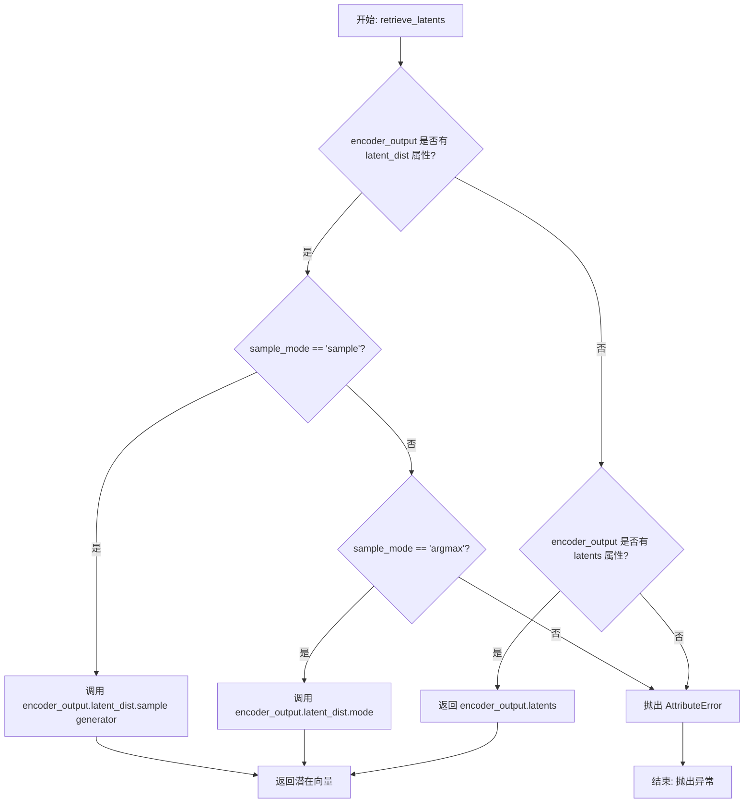
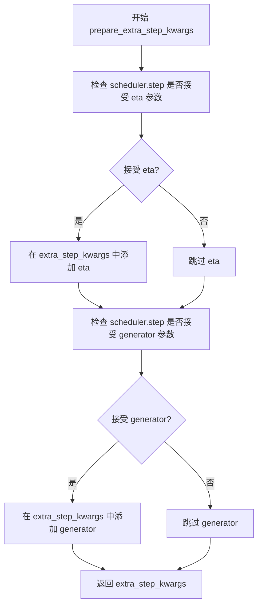
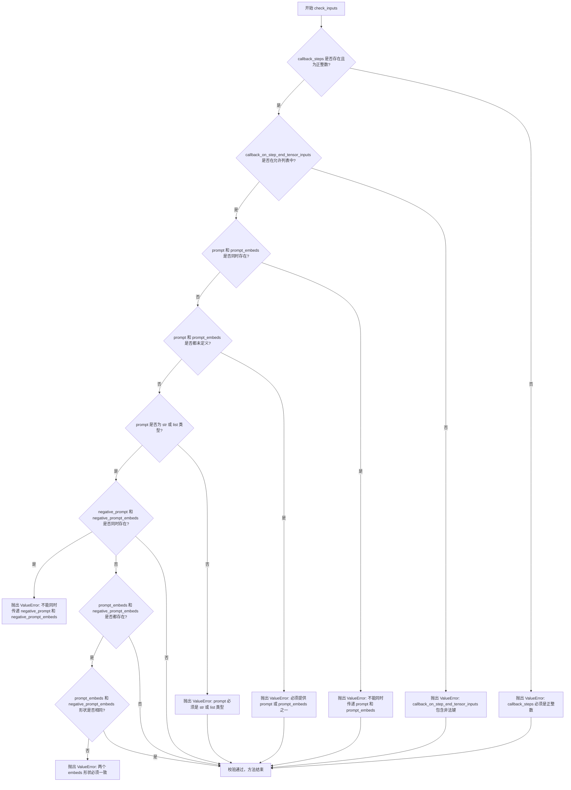
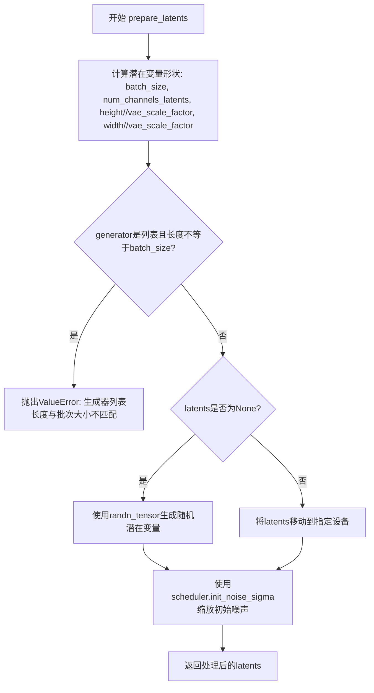
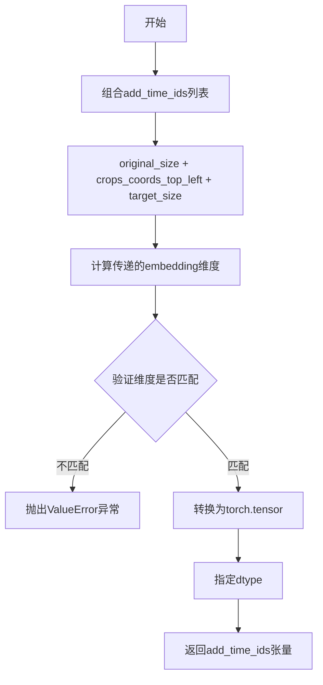
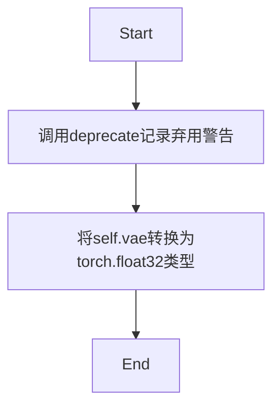
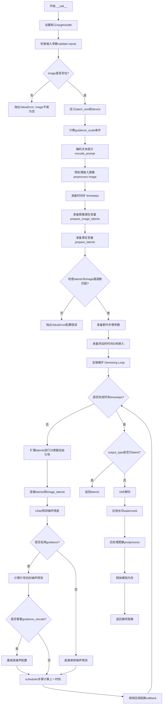

# `diffusers\src\diffusers\pipelines\stable_diffusion_xl\pipeline_stable_diffusion_xl_instruct_pix2pix.py` 详细设计文档

Stable Diffusion XL InstructPix2Pix Pipeline - 基于Stable Diffusion XL的像素级图像编辑pipeline，通过文本指令指导图像修改，支持双文本编码器、LoRA加载、文本反转和单文件模型导入。

## 整体流程

```mermaid
graph TD
A[开始] --> B[检查输入参数]
B --> C{image是否存在?}
C -- 否 --> D[抛出ValueError]
C -- 是 --> E[定义批次大小]
E --> F[编码提示词 encode_prompt]
F --> G[预处理图像]
G --> H[准备时间步]
H --> I[准备图像潜在向量 prepare_image_latents]
I --> J[准备潜在变量 prepare_latents]
J --> K[验证UNet通道配置]
K --> L[准备额外步骤参数]
L --> M[准备额外时间ID和嵌入]
M --> N{进入去噪循环}
N --> O[扩展潜在向量用于分类器自由引导]
O --> P[连接潜在向量和图像潜在向量]
P --> Q[UNet预测噪声残差]
Q --> R{执行分类器自由引导?]
R -- 是 --> S[计算引导噪声预测]
R -- 否 --> T[跳过引导]
S --> U[重新缩放噪声配置]
T --> V[scheduler步骤计算前一潜在向量]
U --> V
V --> W{是否完成所有步骤?}
W -- 否 --> N
W -- 是 --> X{output_type是否为latent?}
X -- 否 --> Y[VAE解码生成图像]
X -- 是 --> Z[直接返回潜在向量]
Y --> AA[应用水印]
AA --> AB[后处理图像]
AB --> AC[卸载模型]
Z --> AD[返回结果]
AC --> AD
```

## 类结构

```
DiffusionPipeline (抽象基类)
├── StableDiffusionMixin
├── TextualInversionLoaderMixin
├── FromSingleFileMixin
├── StableDiffusionXLLoraLoaderMixin
└── StableDiffusionXLInstructPix2PixPipeline
```

## 全局变量及字段


### `logger`
    
模块级日志记录器，用于记录管道运行过程中的日志信息

类型：`logging.Logger`
    


### `EXAMPLE_DOC_STRING`
    
示例文档字符串，包含管道使用示例的Python代码

类型：`str`
    


### `XLA_AVAILABLE`
    
XLA加速可用性标志，指示是否可以使用PyTorch XLA进行加速

类型：`bool`
    


### `StableDiffusionXLInstructPix2PixPipeline.model_cpu_offload_seq`
    
CPU卸载顺序，定义模型组件卸载到CPU的顺序

类型：`str`
    


### `StableDiffusionXLInstructPix2PixPipeline._optional_components`
    
可选组件列表，包含管道中可选的模型组件名称

类型：`list`
    


### `StableDiffusionXLInstructPix2PixPipeline.vae`
    
变分自编码器，用于编码和解码图像到潜在表示

类型：`AutoencoderKL`
    


### `StableDiffusionXLInstructPix2PixPipeline.text_encoder`
    
第一个冻结文本编码器，用于将文本提示编码为嵌入向量

类型：`CLIPTextModel`
    


### `StableDiffusionXLInstructPix2PixPipeline.text_encoder_2`
    
第二个冻结文本编码器，用于生成带有投影的文本嵌入

类型：`CLIPTextModelWithProjection`
    


### `StableDiffusionXLInstructPix2PixPipeline.tokenizer`
    
第一个分词器，用于将文本转换为token IDs

类型：`CLIPTokenizer`
    


### `StableDiffusionXLInstructPix2PixPipeline.tokenizer_2`
    
第二个分词器，用于将文本转换为token IDs

类型：`CLIPTokenizer`
    


### `StableDiffusionXLInstructPix2PixPipeline.unet`
    
条件U-Net去噪网络，用于根据文本嵌入和图像潜在表示预测噪声

类型：`UNet2DConditionModel`
    


### `StableDiffusionXLInstructPix2PixPipeline.scheduler`
    
扩散调度器，控制去噪过程中的噪声调度

类型：`KarrasDiffusionSchedulers`
    


### `StableDiffusionXLInstructPix2PixPipeline.vae_scale_factor`
    
VAE缩放因子，用于计算潜在空间的缩放比例

类型：`int`
    


### `StableDiffusionXLInstructPix2PixPipeline.image_processor`
    
图像处理器，用于图像的预处理和后处理

类型：`VaeImageProcessor`
    


### `StableDiffusionXLInstructPix2PixPipeline.default_sample_size`
    
默认采样尺寸，用于确定生成图像的默认高度和宽度

类型：`int`
    


### `StableDiffusionXLInstructPix2PixPipeline.watermark`
    
水印处理器，用于在输出图像上添加不可见水印

类型：`StableDiffusionXLWatermarker or None`
    


### `StableDiffusionXLInstructPix2PixPipeline.is_cosxl_edit`
    
CosXL编辑标志，指示是否使用CosXL编辑模式

类型：`bool`
    
    

## 全局函数及方法


### `retrieve_latents`

该函数是一个全局工具函数，用于从变分自编码器（VAE）的编码器输出中提取潜在向量。它支持两种提取模式：通过 `sample_mode="sample"` 进行随机采样，或通过 `sample_mode="argmax"` 进行确定性取模。当编码器输出对象包含 `latent_dist` 属性时，根据指定模式调用相应的方法；当直接包含 `latents` 属性时则直接返回。

参数：

- `encoder_output`：`torch.Tensor`，编码器的输出对象，通常是 VAE 编码后的结果，可能包含 `latent_dist` 或 `latents` 属性
- `generator`：`torch.Generator | None`，可选的随机数生成器，用于控制采样过程的随机性，确保结果可复现
- `sample_mode`：`str`，提取模式，默认为 `"sample"`，支持 `"sample"`（随机采样）或 `"argmax"`（取模）两种模式

返回值：`torch.Tensor`，提取出的潜在向量张量

#### 流程图



#### 带注释源码

```python
# 从 diffusers.pipelines.stable_diffusion.pipeline_stable_diffusion_img2img.retrieve_latents 复制
def retrieve_latents(
    encoder_output: torch.Tensor,  # 编码器输出对象，包含 latent_dist 或 latents 属性
    generator: torch.Generator | None = None,  # 可选的随机生成器，用于采样时控制随机性
    sample_mode: str = "sample"  # 提取模式：'sample' 或 'argmax'
):
    """
    从编码器输出中提取潜在向量。
    
    支持两种模式：
    - sample: 从潜在分布中随机采样
    - argmax: 返回潜在分布的众数（确定性取模）
    """
    # 检查编码器输出是否有 latent_dist 属性，并且模式为 sample
    if hasattr(encoder_output, "latent_dist") and sample_mode == "sample":
        # 从潜在分布中采样，支持通过 generator 控制随机性
        return encoder_output.latent_dist.sample(generator)
    # 检查编码器输出是否有 latent_dist 属性，并且模式为 argmax
    elif hasattr(encoder_output, "latent_dist") and sample_mode == "argmax":
        # 返回潜在分布的众数（最大值对应的潜在向量）
        return encoder_output.latent_dist.mode()
    # 检查编码器输出是否直接包含 latents 属性
    elif hasattr(encoder_output, "latents"):
        # 直接返回预计算的潜在向量
        return encoder_output.latents
    else:
        # 如果无法访问所需的潜在向量，抛出属性错误
        raise AttributeError("Could not access latents of provided encoder_output")
```


### `rescale_noise_cfg`

该函数根据 guidance_rescale 参数重新缩放噪声配置（noise_cfg），基于论文 "Common Diffusion Noise Schedules and Sample Steps are Flawed" 的研究结果，通过调整噪声预测的标准差来解决图像过曝问题，并避免生成的图像看起来过于平淡。

参数：

- `noise_cfg`：`torch.Tensor`，经过分类器自由引导（classifier-free guidance）后的噪声预测配置
- `noise_pred_text`：`torch.Tensor`，文本条件的噪声预测结果
- `guidance_rescale`：`float`，Guidance 重缩放因子，默认为 0.0，用于控制重新缩放后的噪声预测与原始噪声预测的混合比例

返回值：`torch.Tensor`，重新缩放后的噪声配置

#### 流程图

```mermaid
flowchart TD
    A[开始] --> B[计算 noise_pred_text 的标准差 std_text]
    B --> C[计算 noise_cfg 的标准差 std_cfg]
    C --> D[计算缩放后的噪声预测: noise_pred_rescaled = noise_cfg * (std_text / std_cfg)]
    D --> E[根据 guidance_rescale 混合: noise_cfg = guidance_rescale * noise_pred_rescaled + (1 - guidance_rescale) * noise_cfg]
    E --> F[返回重新缩放后的 noise_cfg]
```

#### 带注释源码

```python
def rescale_noise_cfg(noise_cfg, noise_pred_text, guidance_rescale=0.0):
    """
    Rescale `noise_cfg` according to `guidance_rescale`. Based on findings of [Common Diffusion Noise Schedules and
    Sample Steps are Flawed](https://huggingface.co/papers/2305.08891). See Section 3.4
    """
    # 计算文本条件噪声预测在所有空间维度上的标准差
    # keepdim=True 保持维度以便后续广播操作
    std_text = noise_pred_text.std(dim=list(range(1, noise_pred_text.ndim)), keepdim=True)
    
    # 计算经过 guidance 后的噪声预测在所有空间维度上的标准差
    std_cfg = noise_cfg.std(dim=list(range(1, noise_cfg.ndim)), keepdim=True)
    
    # 根据标准差比率重新缩放噪声预测（修复过曝问题）
    # 这种方法确保 guidance 后的噪声预测具有与文本条件噪声预测相同的方差尺度
    noise_pred_rescaled = noise_cfg * (std_text / std_cfg)
    
    # 使用 guidance_rescale 因子混合原始结果和重新缩放后的结果
    # 这样可以避免生成的图像看起来"平淡无奇"
    # 当 guidance_rescale=0 时，返回原始 noise_cfg（不进行任何缩放）
    # 当 guidance_rescale=1 时，完全使用重新缩放后的结果
    noise_cfg = guidance_rescale * noise_pred_rescaled + (1 - guidance_rescale) * noise_cfg
    
    return noise_cfg
```


### `StableDiffusionXLInstructPix2PixPipeline.__init__`

这是 Stable Diffusion XL InstructPix2Pix 管道类的构造函数，负责初始化所有必要的组件，包括 VAE、文本编码器、分词器、U-Net 和调度器等，并注册到管道中。

参数：

- `vae`：`AutoencoderKL`，用于将图像编码和解码到潜在表示的变分自编码器模型
- `text_encoder`：`CLIPTextModel`，冻结的文本编码器，Stable Diffusion XL 使用 CLIP 的文本部分
- `text_encoder_2`：`CLIPTextModelWithProjection`，第二个冻结的文本编码器，包含文本和池化部分
- `tokenizer`：`CLIPTokenizer`，用于对文本进行分词的 CLIP 分词器
- `tokenizer_2`：`CLIPTokenizer`，第二个 CLIP 分词器
- `unet`：`UNet2DConditionModel`，条件 U-Net 架构，用于对编码的图像潜在表示进行去噪
- `scheduler`：`KarrasDiffusionSchedulers`，与 `unet` 结合使用以对编码图像进行去噪的调度器
- `force_zeros_for_empty_prompt`：`bool`，可选，默认为 `True`，是否将负提示嵌入强制设置为 0
- `add_watermarker`：`bool | None`，可选，是否使用 invisible_watermark 库为输出图像添加水印
- `is_cosxl_edit`：`bool | None`，可选，默认为 `False`，设置时将对图像潜在表示进行缩放

返回值：无（构造函数）

#### 流程图

```mermaid
flowchart TD
    A[__init__ 开始] --> B[调用 super().__init__]
    B --> C[register_modules 注册所有模型组件]
    C --> D[register_to_config 注册配置参数]
    D --> E[计算 vae_scale_factor]
    E --> F[创建 VaeImageProcessor]
    F --> G[设置 default_sample_size]
    G --> H[设置 is_cosxl_edit 标志]
    H --> I{add_watermarker 是否为 None?}
    I -->|是| J[检查 is_invisible_watermark_available]
    J --> K[设置 add_watermarker]
    I -->|否| L[使用传入的 add_watermarker 值]
    K --> M{add_watermarker 为 True?}
    L --> M
    M -->|是| N[创建 StableDiffusionXLWatermarker 实例]
    M -->|否| O[设置 watermark 为 None]
    N --> P[__init__ 结束]
    O --> P
```

#### 带注释源码

```python
def __init__(
    self,
    vae: AutoencoderKL,
    text_encoder: CLIPTextModel,
    text_encoder_2: CLIPTextModelWithProjection,
    tokenizer: CLIPTokenizer,
    tokenizer_2: CLIPTokenizer,
    unet: UNet2DConditionModel,
    scheduler: KarrasDiffusionSchedulers,
    force_zeros_for_empty_prompt: bool = True,
    add_watermarker: bool | None = None,
    is_cosxl_edit: bool | None = False,
):
    """
    初始化 StableDiffusionXLInstructPix2PixPipeline 管道。
    
    参数:
        vae: 变分自编码器模型，用于图像与潜在表示之间的转换
        text_encoder: 第一个冻结的文本编码器（CLIP）
        text_encoder_2: 第二个冻结的文本编码器（带投影）
        tokenizer: 第一个 CLIP 分词器
        tokenizer_2: 第二个 CLIP 分词器
        unet: 条件 U-Net 模型，用于去噪
        scheduler: 扩散调度器
        force_zeros_for_empty_prompt: 是否强制零嵌入负提示
        add_watermarker: 是否添加水印（None 时自动检测）
        is_cosxl_edit: 是否使用 cosxl 编辑模式
    """
    # 调用父类 DiffusionPipeline 的初始化方法
    # 设置管道的基本结构和执行设备
    super().__init__()

    # 注册所有模型组件到管道，使它们可以通过 self.xxx 访问
    # 这些模块会在模型卸载、内存管理等功能中被使用
    self.register_modules(
        vae=vae,
        text_encoder=text_encoder,
        text_encoder_2=text_encoder_2,
        tokenizer=tokenizer,
        token_utilsizer_2=tokenizer_2,
        unet=unet,
        scheduler=scheduler,
    )
    
    # 将 force_zeros_for_empty_prompt 注册到配置中
    # 这样可以在序列化/反序列化时保留此设置
    self.register_to_config(force_zeros_for_empty_prompt=force_zeros_for_empty_prompt)
    
    # 计算 VAE 缩放因子，基于 VAE 的块输出通道数
    # 2^(len(block_out_channels) - 1)，典型值为 8
    # 这用于在像素空间和潜在空间之间进行缩放
    self.vae_scale_factor = 2 ** (len(self.vae.config.block_out_channels) - 1) if getattr(self, "vae", None) else 8
    
    # 创建图像处理器，用于预处理输入图像和后处理输出图像
    self.image_processor = VaeImageProcessor(vae_scale_factor=self.vae_scale_factor)
    
    # 设置默认采样大小，用于生成图像的默认高度和宽度
    # 从 UNet 配置中获取 sample_size，默认为 128
    self.default_sample_size = (
        self.unet.config.sample_size
        if hasattr(self, "unet") and self.unet is not None and hasattr(self.unet.config, "sample_size")
        else 128
    )
    
    # 设置 cosxl 编辑模式标志
    self.is_cosxl_edit = is_cosxl_edit

    # 如果 add_watermarker 未指定，则根据水印库是否可用自动决定
    add_watermarker = add_watermarker if add_watermarker is not None else is_invisible_watermark_available()

    # 如果需要添加水印，创建水印处理器实例
    if add_watermarker:
        self.watermark = StableDiffusionXLWatermarker()
    else:
        self.watermark = None
```


### `StableDiffusionXLInstructPix2PixPipeline.encode_prompt`

该方法负责将文本提示（prompt）编码为文本编码器的隐藏状态向量（embeddings）。它是Stable Diffusion XL pipeline的核心组件，支持双文本编码器架构、LoRA权重调整、无分类器自由引导（classifier-free guidance）以及负面提示（negative prompt）处理。该方法处理文本标记化、编码、嵌入扩展等关键步骤，为后续的图像生成过程准备文本条件信息。

参数：

- `prompt`：`str` 或 `list[str]`，需要编码的主提示文本
- `prompt_2`：`str` 或 `list[str]` 或 `None`，发送给第二个文本编码器的提示，若不指定则使用`prompt`
- `device`：`torch.device` 或 `None`，执行编码的设备，若不指定则使用执行设备
- `num_images_per_prompt`：`int`，每个提示生成的图像数量，用于扩展嵌入维度
- `do_classifier_free_guidance`：`bool`，是否启用无分类器自由引导
- `negative_prompt`：`str` 或 `list[str]` 或 `None`，不引导图像生成的负面提示
- `negative_prompt_2`：`str` 或 `list[str]` 或 `None`，发送给第二个文本编码器的负面提示
- `prompt_embeds`：`torch.Tensor` 或 `None`，预生成的文本嵌入，可用于轻松调整文本输入
- `negative_prompt_embeds`：`torch.Tensor` 或 `None`，预生成的负面文本嵌入
- `pooled_prompt_embeds`：`torch.Tensor` 或 `None`，预生成的池化文本嵌入
- `negative_pooled_prompt_embeds`：`torch.Tensor` 或 `None`，预生成的负面池化文本嵌入
- `lora_scale`：`float` 或 `None`，应用于文本编码器所有LoRA层的LoRA缩放因子

返回值：`Tuple[torch.Tensor, torch.Tensor, torch.Tensor, torch.Tensor]`，返回四个张量元组：prompt_embeds（编码后的提示嵌入）、negative_prompt_embeds（编码后的负面提示嵌入）、pooled_prompt_embeds（池化后的提示嵌入）、negative_pooled_prompt_embeds（池化后的负面提示嵌入）

#### 流程图

```mermaid
flowchart TD
    A[开始 encode_prompt] --> B{检查 lora_scale}
    B -->|非空且是 StableDiffusionXLLoraLoaderMixin| C[设置 self._lora_scale]
    C --> D[动态调整 LoRA scale]
    B -->|空或不是 LoRA Loader| E{检查 batch_size}
    
    E --> F{判断 prompt 类型}
    F -->|str| G[batch_size = 1]
    F -->|list| H[batch_size = len(prompt)]
    F -->|其他| I[batch_size = prompt_embeds.shape[0]]
    
    G --> J[定义 tokenizers 和 text_encoders 列表]
    H --> J
    I --> J
    
    J --> K{prompt_embeds 是否为空?}
    K -->|是| L[处理双文本编码器流程]
    K -->|否| M[跳过编码直接使用提供的嵌入]
    
    L --> N[遍历两个 prompt 和 encoder]
    N --> O[检查 TextualInversionLoaderMixin]
    O -->|是| P[maybe_convert_prompt 转换提示]
    O -->|否| Q[直接使用原始提示]
    
    P --> R[tokenizer 分词]
    Q --> R
    R --> S[tokenizer 返回张量]
    S --> T[text_encoder 编码]
    T --> U[提取 pooled embeddings]
    U --> V[提取 hidden_states 倒数第二层]
    V --> W[追加到 prompt_embeds_list]
    
    N --> X{处理完两个编码器?}
    X -->|否| N
    X -->|是| Y[torch.concat 合并 embeddings]
    
    Y --> Z{处理 negative prompt}
    
    Z --> AA{需要生成 zero embeddings?}
    AA -->|是| AB[torch.zeros_like 创建零嵌入]
    AA -->|否| AC{negative_prompt_embeds 为空?}
    
    AC -->|是| AD[处理 negative_prompt 编码流程]
    AC -->|否| AE[使用提供的 negative embeddings]
    
    AD --> AF[遍历 negative_prompt 和 encoder]
    AF --> AG[tokenizer 分词]
    AG --> AH[text_encoder 编码]
    AH --> AI[提取 embeddings]
    AI --> AJ[追加到列表]
    AF --> AK{处理完两个 negative encoder?}
    AK -->|否| AF
    AK -->|是| AL[torch.concat 合并]
    
    Z --> AM{do_classifier_free_guidance?}
    AA --> AM
    AE --> AM
    AB --> AM
    AL --> AM
    
    AM -->|是| AN[复制 embeddings 扩展到 num_images_per_prompt]
    AM -->|否| AO[只处理 prompt embeddings]
    
    AN --> AP[转换为正确 dtype 和 device]
    AO --> AP
    
    AP --> AQ[重复 pooled embeddings]
    AQ --> AR[返回四个 embeddings 元组]
```

#### 带注释源码

```python
def encode_prompt(
    self,
    prompt: str,
    prompt_2: str | None = None,
    device: torch.device | None = None,
    num_images_per_prompt: int = 1,
    do_classifier_free_guidance: bool = True,
    negative_prompt: str | None = None,
    negative_prompt_2: str | None = None,
    prompt_embeds: torch.Tensor | None = None,
    negative_prompt_embeds: torch.Tensor | None = None,
    pooled_prompt_embeds: torch.Tensor | None = None,
    negative_pooled_prompt_embeds: torch.Tensor | None = None,
    lora_scale: float | None = None,
):
    r"""
    Encodes the prompt into text encoder hidden states.
    
    该方法将文本提示编码为文本编码器的隐藏状态。它支持双文本编码器架构
    （Stable Diffusion XL 特性），可以处理 LoRA 权重调整，并支持无分类器
    自由引导（classifier-free guidance）用于高质量图像生成。
    
    Args:
        prompt: 主提示文本，可以是字符串或字符串列表
        prompt_2: 发送给第二个文本编码器的提示，若为None则使用prompt
        device: torch设备对象，指定在哪个设备上执行编码
        num_images_per_prompt: 每个提示生成的图像数量，用于扩展embeddings
        do_classifier_free_guidance: 是否启用无分类器自由引导
        negative_prompt: 负面提示，用于引导图像生成远离不需要的内容
        negative_prompt_2: 发送给第二个文本编码器的负面提示
        prompt_embeds: 预生成的文本嵌入，可用于调整文本输入（如prompt weighting）
        negative_prompt_embeds: 预生成的负面文本嵌入
        pooled_prompt_embeds: 预生成的池化文本嵌入
        negative_pooled_prompt_embeds: 预生成的负面池化文本嵌入
        lora_scale: LoRA缩放因子，用于调整LoRA层的影响
    """
    # 如果未指定device，使用执行设备（通常是CUDA或CPU）
    device = device or self._execution_device

    # 设置LoRA缩放因子，使text encoder的monkey patched LoRA函数可以正确访问
    # 这允许动态调整LoRA权重对生成结果的影响
    if lora_scale is not None and isinstance(self, StableDiffusionXLLoraLoaderMixin):
        self._lora_scale = lora_scale

        # 动态调整LoRA scale
        if self.text_encoder is not None:
            if not USE_PEFT_BACKEND:
                # 非PEFT后端：直接调整LoRA scale
                adjust_lora_scale_text_encoder(self.text_encoder, lora_scale)
            else:
                # PEFT后端：使用scale_lora_layers函数
                scale_lora_layers(self.text_encoder, lora_scale)

        if self.text_encoder_2 is not None:
            if not USE_PEFT_BACKEND:
                adjust_lora_scale_text_encoder(self.text_encoder_2, lora_scale)
            else:
                scale_lora_layers(self.text_encoder_2, lora_scale)

    # 确定batch_size：根据prompt类型或已提供的embeddings维度
    if prompt is not None and isinstance(prompt, str):
        batch_size = 1
    elif prompt is not None and isinstance(prompt, list):
        batch_size = len(prompt)
    else:
        batch_size = prompt_embeds.shape[0]

    # 定义tokenizers和text encoders列表
    # Stable Diffusion XL使用两个文本编码器：CLIP和CLIP with Projection
    # 支持只使用一个编码器的情况（当另一个为None时）
    tokenizers = [self.tokenizer, self.tokenizer_2] if self.tokenizer is not None else [self.tokenizer_2]
    text_encoders = (
        [self.text_encoder, self.text_encoder_2] if self.text_encoder is not None else [self.text_encoder_2]
    )

    # 如果未提供prompt_embeds，则从prompt生成
    if prompt_embeds is None:
        # prompt_2默认为prompt（双编码器可以使用不同的prompt）
        prompt_2 = prompt_2 or prompt
        
        # textual inversion处理：处理多向量tokens（如自定义embedding）
        prompt_embeds_list = []
        prompts = [prompt, prompt_2]
        
        # 遍历两个文本编码器，分别编码prompt
        for prompt, tokenizer, text_encoder in zip(prompts, tokenizers, text_encoders):
            # 检查是否启用了TextualInversion（自定义token嵌入）
            if isinstance(self, TextualInversionLoaderMixin):
                prompt = self.maybe_convert_prompt(prompt, tokenizer)

            # tokenize：将文本转换为token IDs
            text_inputs = tokenizer(
                prompt,
                padding="max_length",
                max_length=tokenizer.model_max_length,
                truncation=True,
                return_tensors="pt",
            )

            text_input_ids = text_inputs.input_ids
            
            # 检查是否被截断：获取未截断的token IDs用于比较
            untruncated_ids = tokenizer(prompt, padding="longest", return_tensors="pt").input_ids

            # 检测截断：CLIP模型有最大token长度限制
            if untruncated_ids.shape[-1] >= text_input_ids.shape[-1] and not torch.equal(
                text_input_ids, untruncated_ids
            ):
                removed_text = tokenizer.batch_decode(untruncated_ids[:, tokenizer.model_max_length - 1 : -1])
                logger.warning(
                    "The following part of your input was truncated because CLIP can only handle sequences up to"
                    f" {tokenizer.model_max_length} tokens: {removed_text}"
                )

            # text encoding：将token IDs转换为embeddings
            # output_hidden_states=True确保返回所有隐藏层用于获取更丰富的表示
            prompt_embeds = text_encoder(
                text_input_ids.to(device),
                output_hidden_states=True,
            )

            # 提取pooled output：用于SDXL的text condition
            # SDXL使用最后一个encoder的pooled output作为额外条件
            if pooled_prompt_embeds is None and prompt_embeds[0].ndim == 2:
                pooled_prompt_embeds = prompt_embeds[0]

            # 使用倒数第二层的hidden states（通常表现最好）
            # 最后一层可能过于接近预测层
            prompt_embeds = prompt_embeds.hidden_states[-2]

            prompt_embeds_list.append(prompt_embeds)

        # 沿最后一个维度连接两个编码器的embeddings
        # 这创建了组合的text embeddings用于SDXL
        prompt_embeds = torch.concat(prompt_embeds_list, dim=-1)

    # 获取无分类器自由引导所需的unconditional embeddings
    # 如果配置要求对空prompt强制为零，则使用零张量
    zero_out_negative_prompt = negative_prompt is None and self.config.force_zeros_for_empty_prompt
    
    if do_classifier_free_guidance and negative_prompt_embeds is None and zero_out_negative_prompt:
        # 强制为零embeddings（用于无条件生成）
        negative_prompt_embeds = torch.zeros_like(prompt_embeds)
        negative_pooled_prompt_embeds = torch.zeros_like(pooled_prompt_embeds)
    elif do_classifier_free_guidance and negative_prompt_embeds is None:
        # 需要从negative_prompt生成embeddings
        negative_prompt = negative_prompt or ""
        negative_prompt_2 = negative_prompt_2 or negative_prompt

        # 类型检查：negative_prompt和prompt类型必须一致
        uncond_tokens: list[str]
        if prompt is not None and type(prompt) is not type(negative_prompt):
            raise TypeError(
                f"`negative_prompt` should be the same type to `prompt`, but got {type(negative_prompt)} !="
                f" {type(prompt)}."
            )
        elif isinstance(negative_prompt, str):
            uncond_tokens = [negative_prompt, negative_prompt_2]
        elif batch_size != len(negative_prompt):
            raise ValueError(
                f"`negative_prompt`: {negative_prompt} has batch size {len(negative_prompt)}, but `prompt`:"
                f" {prompt} has batch size {batch_size}. Please make sure that passed `negative_prompt` matches"
                " the batch size of `prompt`."
            )
        else:
            uncond_tokens = [negative_prompt, negative_prompt_2]

        # 处理negative prompt的编码（与正向prompt类似的流程）
        negative_prompt_embeds_list = []
        for negative_prompt, tokenizer, text_encoder in zip(uncond_tokens, tokenizers, text_encoders):
            # TextualInversion处理
            if isinstance(self, TextualInversionLoaderMixin):
                negative_prompt = self.maybe_convert_prompt(negative_prompt, tokenizer)

            # 使用与prompt_embeds相同的长度进行padding
            max_length = prompt_embeds.shape[1]
            uncond_input = tokenizer(
                negative_prompt,
                padding="max_length",
                max_length=max_length,
                truncation=True,
                return_tensors="pt",
            )

            # 编码negative prompt
            negative_prompt_embeds = text_encoder(
                uncond_input.input_ids.to(device),
                output_hidden_states=True,
            )
            
            # 提取pooled embeddings
            if negative_pooled_prompt_embeds is None and negative_prompt_embeds[0].ndim == 2:
                negative_pooled_prompt_embeds = negative_prompt_embeds[0]
            
            # 使用倒数第二层hidden states
            negative_prompt_embeds = negative_prompt_embeds.hidden_states[-2]

            negative_prompt_embeds_list.append(negative_prompt_embeds)

        # 合并negative embeddings
        negative_prompt_embeds = torch.concat(negative_prompt_embeds_list, dim=-1)

    # 确定embeddings的数据类型（优先使用text_encoder_2的dtype）
    prompt_embeds_dtype = self.text_encoder_2.dtype if self.text_encoder_2 is not None else self.unet.dtype
    
    # 转换embeddings到正确的dtype和device
    prompt_embeds = prompt_embeds.to(dtype=prompt_embeds_dtype, device=device)
    
    # 获取embeddings的形状信息
    bs_embed, seq_len, _ = prompt_embeds.shape
    
    # 为每个prompt复制多次（对应num_images_per_prompt）
    # 使用MPS友好的方法：repeat然后reshape
    prompt_embeds = prompt_embeds.repeat(1, num_images_per_prompt, 1)
    prompt_embeds = prompt_embeds.view(bs_embed * num_images_per_prompt, seq_len, -1)

    # 处理无分类器自由引导：复制unconditional embeddings
    if do_classifier_free_guidance:
        seq_len = negative_prompt_embeds.shape[1]
        negative_prompt_embeds = negative_prompt_embeds.to(dtype=prompt_embeds_dtype, device=device)
        negative_prompt_embeds = negative_prompt_embeds.repeat(1, num_images_per_prompt, 1)
        negative_prompt_embeds = negative_prompt_embeds.view(batch_size * num_images_per_prompt, seq_len, -1)

    # 处理pooled embeddings的扩展
    pooled_prompt_embeds = pooled_prompt_embeds.repeat(1, num_images_per_prompt).view(
        bs_embed * num_images_per_prompt, -1
    )
    
    # 如果使用引导，也扩展negative pooled embeddings
    if do_classifier_free_guidance:
        negative_pooled_prompt_embeds = negative_pooled_prompt_embeds.repeat(1, num_images_per_prompt).view(
            bs_embed * num_images_per_prompt, -1
        )

    # 返回四个embeddings元组
    # 1. prompt_embeds: 正向条件text embeddings
    # 2. negative_prompt_embeds: 无条件text embeddings（用于CFG）
    # 3. pooled_prompt_embeds: 池化的正向embeddings（用于SDXL条件）
    # 4. negative_pooled_prompt_embeds: 池化的无条件embeddings
    return prompt_embeds, negative_prompt_embeds, pooled_prompt_embeds, negative_pooled_prompt_embeds
```


### `StableDiffusionXLInstructPix2PixPipeline.prepare_extra_step_kwargs`

该方法用于准备调度器（scheduler）步骤所需的额外参数。由于不同调度器具有不同的签名，此方法通过检查调度器的 `step` 方法是否接受 `eta` 和 `generator` 参数来动态构建额外的关键字参数字典，确保与各种调度器类型兼容。

参数：

- `self`：`StableDiffusionXLInstructPix2PixPipeline` 类的实例
- `generator`：`torch.Generator | list[torch.Generator] | None`，用于生成确定性噪声的随机数生成器
- `eta`：`float`，DDIM 调度器使用的 η 参数，值应在 [0, 1] 范围内

返回值：`dict`，包含调度器步骤所需额外参数（如 `eta` 和/或 `generator`）的字典

#### 流程图



#### 带注释源码

```python
def prepare_extra_step_kwargs(self, generator, eta):
    # 准备调度器步骤的额外参数，因为并非所有调度器都具有相同的签名
    # eta (η) 仅与 DDIMScheduler 一起使用，对于其他调度器将被忽略。
    # eta 对应于 DDIM 论文中的 η：https://huggingface.co/papers/2010.02502
    # 取值应在 [0, 1] 范围内
    
    # 通过检查调度器的 step 方法签名来判断是否接受 eta 参数
    accepts_eta = "eta" in set(inspect.signature(self.scheduler.step).parameters.keys())
    # 初始化空字典用于存储额外参数
    extra_step_kwargs = {}
    # 如果调度器接受 eta 参数，则将其添加到 extra_step_kwargs 中
    if accepts_eta:
        extra_step_kwargs["eta"] = eta

    # 检查调度器是否接受 generator 参数
    accepts_generator = "generator" in set(inspect.signature(self.scheduler.step).parameters.keys())
    # 如果调度器接受 generator 参数，则将其添加到 extra_step_kwargs 中
    if accepts_generator:
        extra_step_kwargs["generator"] = generator
    
    # 返回包含调度器所需额外参数的字典
    return extra_step_kwargs
```


### `StableDiffusionXLInstructPix2PixPipeline.check_inputs`

该方法用于验证调用管道生成图像时输入参数的有效性，确保用户提供的 `prompt`、`callback_steps`、`negative_prompt` 等参数符合预期，否则抛出相应的错误信息。

参数：

- `self`：隐式参数，指向类的实例本身
- `prompt`：`str` 或 `list`，要编码的文本提示词，不能与 `prompt_embeds` 同时传递
- `callback_steps`：`int`，回调函数被调用的频率，必须为正整数
- `negative_prompt`：`str` 或 `list`，可选的负面提示词，不能与 `negative_prompt_embeds` 同时传递
- `prompt_embeds`：`torch.Tensor`，可选的预生成文本嵌入，不能与 `prompt` 同时传递
- `negative_prompt_embeds`：`torch.Tensor`，可选的预生成负面文本嵌入，必须与 `prompt_embeds` 形状一致
- `callback_on_step_end_tensor_inputs`：`list`，可选的回调张量输入列表，必须是 `self._callback_tensor_inputs` 的子集

返回值：`None`，该方法不返回任何值，仅进行参数校验，若校验失败则抛出 `ValueError` 异常。

#### 流程图



#### 带注释源码

```python
def check_inputs(
    self,
    prompt,
    callback_steps,
    negative_prompt=None,
    prompt_embeds=None,
    negative_prompt_embeds=None,
    callback_on_step_end_tensor_inputs=None,
):
    # 校验 callback_steps 参数：必须存在且为正整数
    if callback_steps is not None and (not isinstance(callback_steps, int) or callback_steps <= 0):
        raise ValueError(
            f"`callback_steps` has to be a positive integer but is {callback_steps} of type"
            f" {type(callback_steps)}."
        )

    # 校验 callback_on_step_end_tensor_inputs：必须在允许的回调张量输入列表中
    if callback_on_step_end_tensor_inputs is not None and not all(
        k in self._callback_tensor_inputs for k in callback_on_step_end_tensor_inputs
    ):
        raise ValueError(
            f"`callback_on_step_end_tensor_inputs` has to be in {self._callback_tensor_inputs}, but found {[k for k in callback_on_step_end_tensor_inputs if k not in self._callback_tensor_inputs]}"
        )

    # 校验 prompt 和 prompt_embeds：不能同时传递
    if prompt is not None and prompt_embeds is not None:
        raise ValueError(
            f"Cannot forward both `prompt`: {prompt} and `prompt_embeds`: {prompt_embeds}. Please make sure to"
            " only forward one of the two."
        )
    # 校验 prompt 和 prompt_embeds：至少要传递一个
    elif prompt is None and prompt_embeds is None:
        raise ValueError(
            "Provide either `prompt` or `prompt_embeds`. Cannot leave both `prompt` and `prompt_embeds` undefined."
        )
    # 校验 prompt 类型：必须是 str 或 list
    elif prompt is not None and (not isinstance(prompt, str) and not isinstance(prompt, list)):
        raise ValueError(f"`prompt` has to be of type `str` or `list` but is {type(prompt)}")

    # 校验 negative_prompt 和 negative_prompt_embeds：不能同时传递
    if negative_prompt is not None and negative_prompt_embeds is not None:
        raise ValueError(
            f"Cannot forward both `negative_prompt`: {negative_prompt} and `negative_prompt_embeds`:"
            f" {negative_prompt_embeds}. Please make sure to only forward one of the two."
        )

    # 校验 prompt_embeds 和 negative_prompt_embeds：形状必须一致
    if prompt_embeds is not None and negative_prompt_embeds is not None:
        if prompt_embeds.shape != negative_prompt_embeds.shape:
            raise ValueError(
                "`prompt_embeds` and `negative_prompt_embeds` must have the same shape when passed directly, but"
                f" got: `prompt_embeds` {prompt_embeds.shape} != `negative_prompt_embeds`"
                f" {negative_prompt_embeds.shape}."
            )
```


### `StableDiffusionXLInstructPix2PixPipeline.prepare_latents`

该方法用于准备扩散模型的潜在变量（latents），根据指定的批次大小、图像尺寸和潜在通道数创建或处理潜在变量，并将其缩放至调度器所需的初始噪声标准差。

参数：

- `batch_size`：`int`，生成图像的批次大小
- `num_channels_latents`：`int`，潜在变量的通道数
- `height`：`int`，生成图像的高度（像素）
- `width`：`int`，生成图像的宽度（像素）
- `dtype`：`torch.dtype`，潜在变量的数据类型
- `device`：`torch.device`，潜在变量所在的设备
- `generator`：`torch.Generator | list[torch.Generator] | None`，用于生成确定性随机数的PyTorch生成器
- `latents`：`torch.Tensor | None`，可选的预生成潜在变量，如果提供则直接使用，否则随机生成

返回值：`torch.Tensor`，处理后的潜在变量张量

#### 流程图



#### 带注释源码

```python
def prepare_latents(
    self,
    batch_size: int,
    num_channels_latents: int,
    height: int,
    width: int,
    dtype: torch.dtype,
    device: torch.device,
    generator: torch.Generator | list[torch.Generator] | None = None,
    latents: torch.Tensor | None = None
):
    """
    准备用于去噪过程的潜在变量。
    
    参数:
        batch_size: 批处理大小
        num_channels_latents: 潜在通道数
        height: 图像高度
        width: 图像宽度
        dtype: 数据类型
        device: 设备
        generator: 随机生成器
        latents: 可选的预生成潜在变量
    
    返回:
        处理后的潜在变量张量
    """
    # 计算潜在变量的形状，考虑VAE的缩放因子
    shape = (
        batch_size,
        num_channels_latents,
        int(height) // self.vae_scale_factor,
        int(width) // self.vae_scale_factor,
    )
    
    # 验证生成器列表长度与批次大小是否匹配
    if isinstance(generator, list) and len(generator) != batch_size:
        raise ValueError(
            f"You have passed a list of generators of length {len(generator)}, but requested an effective batch"
            f" size of {batch_size}. Make sure the batch size matches the length of the generators."
        )

    # 如果没有提供潜在变量，则随机生成
    if latents is None:
        latents = randn_tensor(shape, generator=generator, device=device, dtype=dtype)
    else:
        # 如果提供了潜在变量，则确保其在正确的设备上
        latents = latents.to(device)

    # 使用调度器的初始噪声标准差缩放初始噪声
    # 这是扩散模型采样的关键步骤
    latents = latents * self.scheduler.init_noise_sigma
    return latents
```


### `StableDiffusionXLInstructPix2PixPipeline.prepare_image_latents`

该方法负责将输入图像编码为图像潜在向量（latents），为后续的图像编辑扩散过程准备条件输入。它处理图像类型验证、设备和 dtype 转换、VAE 编码、批次扩展以及无分类器自由引导（CFG）所需的潜在向量复制。

参数：

- `self`：`StableDiffusionXLInstructPix2PixPipeline` 实例本身
- `image`：`torch.Tensor | PIL.Image.Image | list`，输入的原始图像数据
- `batch_size`：`int`，文本提示的批次大小
- `num_images_per_prompt`：`int`，每个提示生成的图像数量
- `dtype`：`torch.dtype`，目标数据类型
- `device`：`torch.device`，目标设备
- `do_classifier_free_guidance`：`bool`，是否启用无分类器自由引导
- `generator`：`torch.Generator | None`，可选的随机数生成器

返回值：`torch.Tensor`，编码后的图像潜在向量

#### 流程图

```mermaid
flowchart TD
    A[开始: prepare_image_latents] --> B{验证 image 类型}
    B -->|类型错误| C[抛出 ValueError]
    B -->|类型正确| D[将 image 移动到 device 并转换 dtype]
    D --> E[计算实际 batch_size = batch_size * num_images_per_prompt]
    E --> F{image.shape[1] == 4?}
    F -->|是| G[直接使用 image 作为 image_latents]
    F -->|否| H{VAE 需要上转?}
    H -->|是| I[将 image 转为 float32]
    I --> J[调用 upcast_vae]
    J --> K[使用 VAE encode 图像并获取 latents]
    K --> L{需要恢复 fp16?}
    L -->|是| M[VAE 恢复为 float16]
    L -->|否| N[继续]
    H -->|否| K
    G --> O{batch_size > image_latents.shape[0]?}
    M --> O
    N --> O
    O -->|是且整除| P[扩展 image_latents 以匹配 batch_size]
    O -->|是且不整除| Q[抛出 ValueError]
    O -->|否| R[保持不变]
    P --> S{do_classifier_free_guidance?}
    R --> S
    Q --> S
    S -->|是| T[创建 uncond_image_latents 全零向量]
    T --> U[拼接: [image_latents, image_latents, uncond_image_latents]]
    S -->|否| V[直接返回 image_latents]
    U --> W{is_cosxl_edit?}
    V --> W
    W -->|是| X[乘以 scaling_factor]
    X --> Y[返回最终 image_latents]
    W -->|否| Y
```

#### 带注释源码

```python
def prepare_image_latents(
    self, image, batch_size, num_images_per_prompt, dtype, device, do_classifier_free_guidance, generator=None
):
    """
    准备图像潜在向量用于后续的图像编辑扩散过程
    
    参数:
        image: 输入图像，支持 torch.Tensor, PIL.Image.Image 或 list 格式
        batch_size: 文本提示的批次大小
        num_images_per_prompt: 每个提示生成的图像数量
        dtype: 目标数据类型
        device: 目标设备
        do_classifier_free_guidance: 是否启用无分类器自由引导
        generator: 可选的随机数生成器
        
    返回:
        编码后的图像潜在向量
    """
    
    # 1. 验证输入图像类型是否合法
    if not isinstance(image, (torch.Tensor, PIL.Image.Image, list)):
        raise ValueError(
            f"`image` has to be of type `torch.Tensor`, `PIL.Image.Image` or list but is {type(image)}"
        )

    # 2. 将图像移动到指定设备并转换数据类型
    image = image.to(device=device, dtype=dtype)

    # 3. 计算实际需要的批次大小（考虑每提示生成的图像数）
    batch_size = batch_size * num_images_per_prompt

    # 4. 判断图像是否已经是潜在向量格式（4通道）
    if image.shape[1] == 4:
        # 图像已经是 latent 格式，直接使用
        image_latents = image
    else:
        # 5. 需要通过 VAE 编码图像为潜在向量
        
        # 检查 VAE 是否需要上转（float16 溢出问题）
        needs_upcasting = self.vae.dtype == torch.float16 and self.vae.config.force_upcast
        if needs_upcasting:
            # 将图像转为 float32 避免溢出
            image = image.float()
            # 上转 VAE 到 float32
            self.upcast_vae()

        # 使用 VAE 编码图像获取潜在向量（使用 argmax 模式）
        image_latents = retrieve_latents(self.vae.encode(image), sample_mode="argmax")

        # 如果之前上转了 VAE，恢复为 float16
        if needs_upcasting:
            self.vae.to(dtype=torch.float16)

    # 6. 处理批次大小不匹配的情况（扩展图像潜在向量）
    if batch_size > image_latents.shape[0] and batch_size % image_latents.shape[0] == 0:
        # 扩展 image_latents 以匹配 batch_size
        deprecation_message = (
            f"You have passed {batch_size} text prompts (`prompt`), but only {image_latents.shape[0]} initial"
            " images (`image`). Initial images are now duplicating to match the number of text prompts. Note"
            " that this behavior is deprecated and will be removed in a version 1.0.0. Please make sure to update"
            " your script to pass as many initial images as text prompts to suppress this warning."
        )
        deprecate("len(prompt) != len(image)", "1.0.0", deprecation_message, standard_warn=False)
        additional_image_per_prompt = batch_size // image_latents.shape[0]
        image_latents = torch.cat([image_latents] * additional_image_per_prompt, dim=0)
    elif batch_size > image_latents.shape[0] and batch_size % image_latents.shape[0] != 0:
        raise ValueError(
            f"Cannot duplicate `image` of batch size {image_latents.shape[0]} to {batch_size} text prompts."
        )
    else:
        # 批次大小匹配，保持不变
        image_latents = torch.cat([image_latents], dim=0)

    # 7. 无分类器自由引导处理：创建条件和无条件潜在向量
    if do_classifier_free_guidance:
        # 创建全零的无条件图像潜在向量
        uncond_image_latents = torch.zeros_like(image_latents)
        # 拼接：[条件图像, 条件图像, 无条件图像]
        image_latents = torch.cat([image_latents, image_latents, uncond_image_latents], dim=0)

    # 8. 确保潜在向量类型与 VAE 类型一致
    if image_latents.dtype != self.vae.dtype:
        image_latents = image_latents.to(dtype=self.vae.dtype)

    # 9. CosXL 编辑模式特殊处理：应用缩放因子
    if self.is_cosxl_edit:
        image_latents = image_latents * self.vae.config.scaling_factor

    return image_latents
```


### `StableDiffusionXLInstructPix2PixPipeline._get_add_time_ids`

该方法用于生成Stable Diffusion XL pipeline中的"add_time_ids"（额外时间标识），这些标识包含了原始图像尺寸、裁剪坐标和目标尺寸等信息，用于SDXL的微条件（micro-conditioning）机制，帮助模型更好地理解图像的空间属性。

参数：

- `self`：`StableDiffusionXLInstructPix2PixPipeline` 实例本身，隐式传递
- `original_size`：`tuple[int, int]`，原始图像的尺寸，格式为 (高度, 宽度)
- `crops_coords_top_left`：`tuple[int, int]`，裁剪区域的左上角坐标，格式为 (y坐标, x坐标)
- `target_size`：`tuple[int, int]`，目标图像的尺寸，格式为 (高度, 宽度)
- `dtype`：`torch.dtype`，返回张量的数据类型
- `text_encoder_projection_dim`：`int | None`，文本编码器的投影维度，如果为None则使用默认值

返回值：`torch.Tensor`，包含原始尺寸、裁剪坐标和目标尺寸组合后转换为张量的形式，形状为 (1, 6)

#### 流程图



#### 带注释源码

```python
# 从稳定扩散XL管道复制的方法
# Copied from diffusers.pipelines.stable_diffusion_xl.pipeline_stable_diffusion_xl.StableDiffusionXLPipeline._get_add_time_ids
def _get_add_time_ids(
    self, original_size, crops_coords_top_left, target_size, dtype, text_encoder_projection_dim=None
):
    """
    生成额外的时间标识，用于SDXL的微条件机制。
    
    这些标识包含了图像的原始尺寸、裁剪坐标和目标尺寸，
    帮助模型理解图像的空间属性。
    """
    
    # 将原始尺寸、裁剪坐标左上角和目标尺寸合并为一个列表
    # original_size: (height, width)
    # crops_coords_top_left: (y, x)
    # target_size: (height, width)
    # 最终形成 [orig_h, orig_w, crop_y, crop_x, target_h, target_w]
    add_time_ids = list(original_size + crops_coords_top_left + target_size)

    # 计算传递的额外embedding维度
    # addition_time_embed_dim 是UNet配置中的时间嵌入维度
    # 乘以 add_time_ids 的长度（6个值），再加上文本编码器投影维度
    passed_add_embed_dim = (
        self.unet.config.addition_time_embed_dim * len(add_time_ids) + text_encoder_projection_dim
    )
    
    # 获取UNet期望的embedding维度
    # 从UNet的add_embedding.linear_1层的输入特征数获取
    expected_add_embed_dim = self.unet.add_embedding.linear_1.in_features

    # 验证维度是否匹配，如果不匹配则抛出详细的错误信息
    if expected_add_embed_dim != passed_add_embed_dim:
        raise ValueError(
            f"Model expects an added time embedding vector of length {expected_add_embed_dim}, but a vector of {passed_add_embed_dim} was created. The model has an incorrect config. Please check `unet.config.time_embedding_type` and `text_encoder_2.config.projection_dim`."
        )

    # 将列表转换为PyTorch张量
    # 形状为 (1, 6)，包含6个维度的时间标识
    add_time_ids = torch.tensor([add_time_ids], dtype=dtype)
    
    # 返回生成的时间标识张量
    return add_time_ids
```


### `StableDiffusionXLInstructPix2PixPipeline.upcast_vae`

该方法用于将VAE模型从当前数据类型（通常是float16）上转换为float32，以避免在解码过程中出现数值溢出。该方法已被弃用，推荐直接使用`pipe.vae.to(torch.float32)`。

参数：

- 无（仅包含`self`参数）

返回值：`None`，无返回值

#### 流程图



#### 带注释源码

```python
def upcast_vae(self):
    """
    将VAE模型上转换为float32类型以避免数值溢出。
    
    注意：此方法已被弃用，推荐使用 pipe.vae.to(torch.float32) 代替。
    """
    # 记录弃用警告，提示用户在版本1.0.0后该方法将被移除
    deprecate(
        "upcast_vae",
        "1.0.0",
        "`upcast_vae` is deprecated. Please use `pipe.vae.to(torch.float32)`. For more details, please refer to: https://github.com/huggingface/diffusers/pull/12619#issue-3606633695.",
    )
    # 将VAE模型的参数转换为float32类型
    self.vae.to(dtype=torch.float32)
```


### StableDiffusionXLInstructPix2PixPipeline.__call__

该方法是Stable Diffusion XL图像编辑Pipeline的核心调用函数，通过文本指令（InstructPix2Pix）结合图像引导和文本引导两种条件，实现对输入图像的像素级编辑生成。

参数：

- `prompt`：`str | list[str] | None`，用于指导图像生成的文本提示，若未定义则需传入`prompt_embeds`
- `prompt_2`：`str | list[str] | None`，发送给第二个tokenizer和text_encoder的文本提示，若未定义则使用`prompt`
- `image`：`PipelineImageInput`，要通过pipeline修改的图像，支持torch.Tensor、PIL.Image.Image、np.ndarray或列表形式
- `height`：`int | None`，生成图像的高度像素值，默认为self.unet.config.sample_size * self.vae_scale_factor
- `width`：`int | None`，生成图像的宽度像素值，默认为self.unet.config.sample_size * self.vae_scale_factor
- `num_inference_steps`：`int`，去噪步数，默认为100，步数越多通常图像质量越高但推理越慢
- `denoising_end`：`float | None`，指定总去噪过程的分数(0.0-1.0)后提前终止，用于Mixture of Denoisers多pipeline设置
- `guidance_scale`：`float`，文本引导系数，定义为Imagen论文中的w，>=1时启用，值越高越贴近文本提示
- `image_guidance_scale`：`float`，图像引导系数，使生成图像贴近源图像，>=1时启用，该pipeline要求值至少为1
- `negative_prompt`：`str | list[str] | None`，不引导图像生成的负面提示，若未定义需传入negative_prompt_embeds
- `negative_prompt_2`：`str | list[str] | None`，发送给tokenizer_2和text_encoder_2的负面提示，若未定义使用negative_prompt
- `num_images_per_prompt`：`int | None`，每个提示生成的图像数量，默认为1
- `eta`：`float`，DDIM论文中的η参数，仅DDIMScheduler生效
- `generator`：`torch.Generator | list[torch.Generator] | None`，torch随机生成器，用于确定性生成
- `latents`：`torch.Tensor | None`，预生成的噪声潜在变量，可用于使用不同提示调整相同生成
- `prompt_embeds`：`torch.Tensor | None`，预生成的文本嵌入，用于轻松调整文本输入如提示加权
- `negative_prompt_embeds`：`torch.Tensor | None`，预生成的负面文本嵌入
- `pooled_prompt_embeds`：`torch.Tensor | None`，预生成的池化文本嵌入
- `negative_pooled_prompt_embeds`：`torch.Tensor | None`，预生成的负面池化文本嵌入
- `output_type`：`str | None`，生成图像的输出格式，默认为"pil"，可选PIL.Image.Image或np.array
- `return_dict`：`bool`，是否返回StableDiffusionXLPipelineOutput而非元组，默认为True
- `callback`：`Callable[[int, int, torch.Tensor], None] | None`，每callback_steps步调用的回调函数
- `callback_steps`：`int`，回调函数调用频率，默认为1
- `cross_attention_kwargs`：`dict[str, Any] | None`，传递给AttentionProcessor的kwargs字典
- `guidance_rescale`：`float`，根据Common Diffusion Noise Schedules论文提出的引导重缩放因子，用于修复过度曝光
- `original_size`：`tuple[int, int]`，原始尺寸，默认为(1024, 1024)，用于SDXL微条件
- `crops_coords_top_left`：`tuple[int, int]`，裁剪坐标起始点，默认为(0, 0)，用于SDXL微条件
- `target_size`：`tuple[int, int]`，目标尺寸，默认为(height, width)，用于SDXL微条件

返回值：`StableDiffusionXLPipelineOutput | tuple`，返回编辑后的图像，若return_dict为True则返回StableDiffusionXLPipelineOutput对象，否则返回元组（第一个元素为生成的图像列表）

#### 流程图



#### 带注释源码

```python
@torch.no_grad()
@replace_example_docstring(EXAMPLE_DOC_STRING)
def __call__(
    self,
    prompt: str | list[str] = None,
    prompt_2: str | list[str] | None = None,
    image: PipelineImageInput = None,
    height: int | None = None,
    width: int | None = None,
    num_inference_steps: int = 100,
    denoising_end: float | None = None,
    guidance_scale: float = 5.0,
    image_guidance_scale: float = 1.5,
    negative_prompt: str | list[str] | None = None,
    negative_prompt_2: str | list[str] | None = None,
    num_images_per_prompt: int | None = 1,
    eta: float = 0.0,
    generator: torch.Generator | list[torch.Generator] | None = None,
    latents: torch.Tensor | None = None,
    prompt_embeds: torch.Tensor | None = None,
    negative_prompt_embeds: torch.Tensor | None = None,
    pooled_prompt_embeds: torch.Tensor | None = None,
    negative_pooled_prompt_embeds: torch.Tensor | None = None,
    output_type: str | None = "pil",
    return_dict: bool = True,
    callback: Callable[[int, int, torch.Tensor], None] | None = None,
    callback_steps: int = 1,
    cross_attention_kwargs: dict[str, Any] | None = None,
    guidance_rescale: float = 0.0,
    original_size: tuple[int, int] = None,
    crops_coords_top_left: tuple[int, int] = (0, 0),
    target_size: tuple[int, int] = None,
):
    # 0. 默认高度和宽度设置为unet的样本大小
    height = height or self.default_sample_size * self.vae_scale_factor
    width = width or self.default_sample_size * self.vae_scale_factor

    # 如果未指定original_size和target_size，则默认为图像尺寸
    original_size = original_size or (height, width)
    target_size = target_size or (height, width)

    # 1. 检查输入参数，如果不正确定义则抛出错误
    self.check_inputs(prompt, callback_steps, negative_prompt, prompt_embeds, negative_prompt_embeds)

    # 确保image输入不为空
    if image is None:
        raise ValueError("`image` input cannot be undefined.")

    # 2. 定义调用参数：确定batch_size
    if prompt is not None and isinstance(prompt, str):
        batch_size = 1
    elif prompt is not None and isinstance(prompt, list):
        batch_size = len(prompt)
    else:
        batch_size = prompt_embeds.shape[0]

    # 获取执行设备
    device = self._execution_device

    # 确定是否启用分类器自由引导（同时需要guidance_scale和image_guidance_scale都>=1）
    do_classifier_free_guidance = guidance_scale > 1.0 and image_guidance_scale >= 1.0

    # 3. 编码输入提示词
    text_encoder_lora_scale = (
        cross_attention_kwargs.get("scale", None) if cross_attention_kwargs is not None else None
    )
    (
        prompt_embeds,
        negative_prompt_embeds,
        pooled_prompt_embeds,
        negative_pooled_prompt_embeds,
    ) = self.encode_prompt(
        prompt=prompt,
        prompt_2=prompt_2,
        device=device,
        num_images_per_prompt=num_images_per_prompt,
        do_classifier_free_guidance=do_classifier_free_guidance,
        negative_prompt=negative_prompt,
        negative_prompt_2=negative_prompt_2,
        prompt_embeds=prompt_embeds,
        negative_prompt_embeds=negative_prompt_embeds,
        pooled_prompt_embeds=pooled_prompt_embeds,
        negative_pooled_prompt_embeds=negative_pooled_prompt_embeds,
        lora_scale=text_encoder_lora_scale,
    )

    # 4. 预处理图像
    image = self.image_processor.preprocess(image, height=height, width=width).to(device)

    # 5. 准备时间步
    self.scheduler.set_timesteps(num_inference_steps, device=device)
    timesteps = self.scheduler.timesteps

    # 6. 准备图像潜在变量
    image_latents = self.prepare_image_latents(
        image,
        batch_size,
        num_images_per_prompt,
        prompt_embeds.dtype,
        device,
        do_classifier_free_guidance,
    )

    # 7. 准备潜在变量
    num_channels_latents = self.vae.config.latent_channels
    latents = self.prepare_latents(
        batch_size * num_images_per_prompt,
        num_channels_latents,
        height,
        width,
        prompt_embeds.dtype,
        device,
        generator,
        latents,
    )

    # 8. 检查latents和image的通道数是否与UNet配置匹配
    num_channels_image = image_latents.shape[1]
    if num_channels_latents + num_channels_image != self.unet.config.in_channels:
        raise ValueError(
            f"Incorrect configuration settings! The config of `pipeline.unet`: {self.unet.config} expects"
            f" {self.unet.config.in_channels} but received `num_channels_latents`: {num_channels_latents} +"
            f" `num_channels_image`: {num_channels_image} "
            f" = {num_channels_latents + num_channels_image}. Please verify the config of"
            " `pipeline.unet` or your `image` input."
        )

    # 9. 准备额外步骤参数
    extra_step_kwargs = self.prepare_extra_step_kwargs(generator, eta)

    # 10. 准备添加的时间ID和嵌入
    add_text_embeds = pooled_prompt_embeds
    if self.text_encoder_2 is None:
        text_encoder_projection_dim = int(pooled_prompt_embeds.shape[-1])
    else:
        text_encoder_projection_dim = self.text_encoder_2.config.projection_dim

    add_time_ids = self._get_add_time_ids(
        original_size,
        crops_coords_top_left,
        target_size,
        dtype=prompt_embeds.dtype,
        text_encoder_projection_dim=text_encoder_projection_dim,
    )

    # 对于分类器自由引导，将prompt_embeds、add_text_embeds、add_time_ids按三份连接（uncond、text、image）
    if do_classifier_free_guidance:
        prompt_embeds = torch.cat([prompt_embeds, negative_prompt_embeds, negative_prompt_embeds], dim=0)
        add_text_embeds = torch.cat(
            [add_text_embeds, negative_pooled_prompt_embeds, negative_pooled_prompt_embeds], dim=0
        )
        add_time_ids = torch.cat([add_time_ids, add_time_ids, add_time_ids], dim=0)

    # 将张量移动到设备
    prompt_embeds = prompt_embeds.to(device)
    add_text_embeds = add_text_embeds.to(device)
    add_time_ids = add_time_ids.to(device).repeat(batch_size * num_images_per_prompt, 1)

    # 11. 去噪循环
    num_warmup_steps = max(len(timesteps) - num_inference_steps * self.scheduler.order, 0)
    
    # 处理denoising_end提前终止
    if denoising_end is not None and isinstance(denoising_end, float) and denoising_end > 0 and denoising_end < 1:
        discrete_timestep_cutoff = int(
            round(
                self.scheduler.config.num_train_timesteps
                - (denoising_end * self.scheduler.config.num_train_timesteps)
            )
        )
        num_inference_steps = len(list(filter(lambda ts: ts >= discrete_timestep_cutoff, timesteps)))
        timesteps = timesteps[:num_inference_steps]

    # 进度条循环遍历每个timestep
    with self.progress_bar(total=num_inference_steps) as progress_bar:
        for i, t in enumerate(timesteps):
            # 扩展latents以进行分类器自由引导
            # latents扩展3次，因为pix2pix需要对文本和输入图像都应用引导
            latent_model_input = torch.cat([latents] * 3) if do_classifier_free_guidance else latents

            # 在通道维度连接latents和image_latents
            scaled_latent_model_input = self.scheduler.scale_model_input(latent_model_input, t)
            scaled_latent_model_input = torch.cat([scaled_latent_model_input, image_latents], dim=1)

            # 预测噪声残差
            added_cond_kwargs = {"text_embeds": add_text_embeds, "time_ids": add_time_ids}
            noise_pred = self.unet(
                scaled_latent_model_input,
                t,
                encoder_hidden_states=prompt_embeds,
                cross_attention_kwargs=cross_attention_kwargs,
                added_cond_kwargs=added_cond_kwargs,
                return_dict=False,
            )[0]

            # 执行引导
            if do_classifier_free_guidance:
                # 分割噪声预测：文本、图像、无条件
                noise_pred_text, noise_pred_image, noise_pred_uncond = noise_pred.chunk(3)
                # 组合引导：文本引导 + 图像引导
                noise_pred = (
                    noise_pred_uncond
                    + guidance_scale * (noise_pred_text - noise_pred_image)
                    + image_guidance_scale * (noise_pred_image - noise_pred_uncond)
                )

            # 应用guidance_rescale避免过度曝光
            if do_classifier_free_guidance and guidance_rescale > 0.0:
                noise_pred = rescale_noise_cfg(noise_pred, noise_pred_text, guidance_rescale=guidance_rescale)

            # 计算前一个噪声样本 x_t -> x_t-1
            latents_dtype = latents.dtype
            latents = self.scheduler.step(noise_pred, t, latents, **extra_step_kwargs, return_dict=False)[0]
            
            # 处理MPS后端的dtype转换bug
            if latents.dtype != latents_dtype:
                if torch.backends.mps.is_available():
                    latents = latents.to(latents_dtype)

            # 调用回调函数
            if i == len(timesteps) - 1 or ((i + 1) > num_warmup_steps and (i + 1) % self.scheduler.order == 0):
                progress_bar.update()
                if callback is not None and i % callback_steps == 0:
                    step_idx = i // getattr(self.scheduler, "order", 1)
                    callback(step_idx, t, latents)

            # XLA设备优化
            if XLA_AVAILABLE:
                xm.mark_step()

    # 12. 如果不需要latent输出，则解码到图像
    if not output_type == "latent":
        # 确保VAE在float32模式以避免float16溢出
        needs_upcasting = self.vae.dtype == torch.float16 and self.vae.config.force_upcast

        if needs_upcasting:
            self.upcast_vae()
            latents = latents.to(next(iter(self.vae.post_quant_conv.parameters())).dtype)
        elif latents.dtype != self.vae.dtype:
            if torch.backends.mps.is_available():
                self.vae = self.vae.to(latents.dtype)

        # 反归一化latents
        has_latents_mean = hasattr(self.vae.config, "latents_mean") and self.vae.config.latents_mean is not None
        has_latents_std = hasattr(self.vae.config, "latents_std") and self.vae.config.latents_std is not None
        if has_latents_mean and has_latents_std:
            latents_mean = (
                torch.tensor(self.vae.config.latents_mean).view(1, 4, 1, 1).to(latents.device, latents.dtype)
            )
            latents_std = (
                torch.tensor(self.vae.config.latents_std).view(1, 4, 1, 1).to(latents.device, latents.dtype)
            )
            latents = latents * latents_std / self.vae.config.scaling_factor + latents_mean
        else:
            latents = latents / self.vae.config.scaling_factor

        # VAE解码
        image = self.vae.decode(latents, return_dict=False)[0]

        # 如果需要则转回fp16
        if needs_upcasting:
            self.vae.to(dtype=torch.float16)
    else:
        return StableDiffusionXLPipelineOutput(images=latents)

    # 13. 应用水印（如果可用）
    if self.watermark is not None:
        image = self.watermark.apply_watermark(image)

    # 14. 后处理图像
    image = self.image_processor.postprocess(image, output_type=output_type)

    # 15. 释放所有模型内存
    self.maybe_free_model_hooks()

    # 16. 返回结果
    if not return_dict:
        return (image,)

    return StableDiffusionXLPipelineOutput(images=image)
```

## 关键组件


### 张量索引与通道维度拼接

在 `__call__` 方法的去噪循环中，代码通过 `torch.cat([latents] * 3)` 扩展 latents 以实现 classifier-free guidance，并通过 `torch.cat([scaled_latent_model_input, image_latents], dim=1)` 在通道维度拼接 latents 和 image_latents。此外在 `prepare_image_latents` 中使用 `torch.cat([image_latents, image_latents, uncond_image_latents], dim=0)` 实现三联拼接。

### 惰性加载与设备迁移

代码多处使用 `.to(device)` 和 `.to(dtype=...)` 进行惰性设备迁移，包括 `prompt_embeds.to(dtype=prompt_embeds_dtype, device=device)`、`image.to(device=device, dtype=dtype)` 以及 `latents.to(device)`。同时通过 `self._execution_device` 获取执行设备，实现模型运行时的动态设备分配。

### 反量化与精度管理

在 `prepare_image_latents` 和 `__call__` 方法中，代码实现了一套完整的 float16 反量化流程：当 VAE 为 float16 且配置 `force_upcast` 为真时，执行 `upcast_vae()` 将 VAE 临时转为 float32 以避免溢出，计算完成后通过 `self.vae.to(dtype=torch.float16)` 恢复 fp16 精度。同时处理了 MPS (Apple Silicon) 的特殊兼容性问题。

### VAE 编码与 Latent 提取

`retrieve_latents` 函数提供了从 VAE encoder output 中提取 latents 的统一接口，支持从 `latent_dist.sample()` 或 `latent_dist.mode()` 获取，也可以直接从 `encoder_output.latents` 属性读取。`prepare_image_latents` 方法封装了完整的图像到 latent 的转换流程，包括数据类型转换和条件生成准备。

### 多文本编码器支持

Pipeline 同时支持两个 CLIP 文本编码器（`text_encoder` 和 `text_encoder_2`），`encode_prompt` 方法分别处理两个编码器的 tokenization 和 embedding 生成，并通过 `torch.concat` 合并两者的隐藏状态。在推理时通过 `add_time_ids` 和 `add_text_embeds` 将额外条件传入 UNet。

### 噪声调度与Guidance策略

`rescale_noise_cfg` 函数实现了基于论文 Common Diffusion Noise Schedules and Sample Steps are Flawed 的噪声重新缩放，通过 `guidance_rescale` 参数混合原始 guidance 预测以避免图像过度曝光。推理时使用 `guidance_scale` 和 `image_guidance_scale` 双 Guidance 策略，分别控制文本和图像条件的影响强度。

### 微条件编码

`_get_add_time_ids` 方法实现了 SDXL 的微条件（micro-conditioning）编码，将 `original_size`、`crops_coords_top_left` 和 `target_size` 打包为时间嵌入向量，并验证与 UNet 配置的维度匹配性。

### 水印处理

当 `is_invisible_watermark_available()` 返回真时，Pipeline 加载 `StableDiffusionXLWatermarker` 并在生成完成后通过 `self.watermark.apply_watermark(image)` 为输出图像添加不可见水印。


## 问题及建议


### 已知问题

- **代码重复**：大量方法（如 `encode_prompt`、`prepare_latents`、`prepare_extra_step_kwargs`、`upcast_vae`、`_get_add_time_ids`）是从其他 Pipeline 复制过来的，导致代码冗余，维护成本高。
- **复杂的继承结构**：该类继承了 `DiffusionPipeline`、`StableDiffusionMixin`、`TextualInversionLoaderMixin`、`FromSingleFileMixin`、`StableDiffusionXLLoraLoaderMixin` 五个 mixin，继承层次过深，导致代码理解难度增加。
- **硬编码默认值**：`image_guidance_scale` 默认值为 1.5 是硬编码的魔法数字，缺乏配置灵活性。
- **类型注解不完整**：部分方法参数缺少类型注解（如 `callback` 参数），部分变量类型推断不够明确。
- **错误处理不够全面**：`check_inputs` 方法未验证 `image_guidance_scale` 参数的有效性（如必须 >= 1 的约束）。
- **性能开销**：在去噪循环中多次执行 `torch.cat` 操作，且 VAE 的上 casting/down casting 操作可能带来额外性能损耗。
- **潜在的张量形状问题**：在 `encode_prompt` 中处理 `negative_pooled_prompt_embeds` 时，如果传入的 `negative_prompt_embeds` 为 None 但 `prompt_embeds` 已提供，可能导致形状不匹配错误。
- **设备兼容性处理复杂**：针对 MPS 设备的特殊处理代码（如 `torch.backends.mps.is_available()` 检查）散落在多处，增加代码复杂度。

### 优化建议

- **提取公共基类或工具模块**：将复用的方法抽取到共享的基类或工具模块中，通过组合而非继承来复用代码，减少代码冗余。
- **简化继承结构**：考虑使用组合（composition）代替部分继承，例如将 LoaderMixin 的功能通过组合方式引入。
- **配置外部化**：将硬编码的默认值（如 `image_guidance_scale`）提取到配置文件中，或通过构造函数参数传入。
- **增强类型注解**：为所有公共方法参数添加完整的类型注解，提高代码可读性和 IDE 支持。
- **完善输入验证**：在 `check_inputs` 中增加对 `image_guidance_scale >= 1` 的验证，并处理更多边界情况。
- **优化张量操作**：合并部分 `torch.cat` 操作以减少内存分配，考虑使用 inplace 操作或预分配张量。
- **统一设备处理逻辑**：将 MPS 和 XLA 设备的相关处理逻辑封装到工具函数中，提高代码可读性。
- **添加缓存机制**：对于不变的张量（如 `add_time_ids`），可以在首次计算后缓存结果，避免重复计算。

## 其它


### 设计目标与约束

本Pipeline的设计目标是实现基于Stable Diffusion XL的指令式图像编辑（InstructPix2Pix），允许用户通过文本指令修改输入图像。核心约束包括：1）支持图像引导和文本引导的联合生成；2）兼容SDXL生态系统的双文本编码器架构；3）遵循diffusers库的Pipeline标准接口；4）支持LoRA权重加载和文本反演嵌入；5）支持单文件模型加载。性能约束方面，Pipeline设计为在GPU环境下运行，默认使用float16精度以平衡质量和显存占用。

### 错误处理与异常设计

Pipeline采用多层错误处理机制。在输入验证层面，`check_inputs`方法检查callback_steps的正整数属性、callback_on_step_end_tensor_inputs的合法性、以及prompt与prompt_embeds的互斥关系。在图像处理层面，`prepare_image_latents`方法验证输入图像类型，支持torch.Tensor、PIL.Image.Image或list类型。在模型配置层面，`_get_add_time_ids`方法验证unet的时间嵌入维度与text_encoder_2的投影维度匹配性。在去噪循环中，验证latents和image的通道数总和是否等于UNet的输入通道数。异常信息通过Python标准异常和diffusers库的deprecate函数抛出，包含详细的错误上下文信息。

### 数据流与状态机

Pipeline的执行流程遵循以下状态机：初始化状态（__init__）-> 输入验证状态（check_inputs）-> 提示编码状态（encode_prompt）-> 图像预处理状态（image_processor.preprocess）-> 时间步准备状态（scheduler.set_timesteps）-> 图像潜在向量准备状态（prepare_image_latents）-> 潜在变量准备状态（prepare_latents）-> 去噪循环状态（denoising loop）-> 潜在向量解码状态（vae.decode）-> 后处理状态（image_processor.postprocess）-> 水印应用状态（watermark.apply_watermark）-> 最终输出状态。数据流方向：用户输入（prompt, image） -> 文本嵌入（prompt_embeds） -> 图像潜在向量（image_latents） -> 噪声潜在向量（latents） -> UNet预测（noise_pred） -> 调度器更新（scheduler.step） -> 解码图像（image） -> 输出结果。

### 外部依赖与接口契约

本Pipeline依赖以下核心外部组件。transformers库：CLIPTextModel和CLIPTextModelWithProjection用于文本编码，CLIPTokenizer用于分词。diffusers库：AutoencoderKL用于VAE编解码，UNet2DConditionModel用于去噪网络，KarrasDiffusionSchedulers用于扩散调度器，PipelineImageInput和VaeImageProcessor用于图像处理，DiffusionPipeline和StableDiffusionMixin作为基类。PIL库：PIL.Image用于图像表示。torch库：PyTorch张量运算。可选依赖：invisible_watermark库用于数字水印，torch_xla用于XLA加速。接口契约方面，Pipeline接收prompt（str或list[str]）、image（PipelineImageInput）、height/width（int）、num_inference_steps（int）、guidance_scale（float）、image_guidance_scale（float）等参数，输出StableDiffusionXLPipelineOutput或tuple类型。

### 性能考虑与优化空间

Pipeline包含多项性能优化设计：1）模型CPU卸载序列（model_cpu_offload_seq）定义了"text_encoder->text_encoder_2->unet->vae"的卸载顺序以优化显存；2）默认使用float16精度减少显存占用和加速计算；3）VAE在处理溢出风险时自动向上转换为float32；4）MPS后端特殊处理以避免PyTorch bug导致的类型转换问题；5）XLA支持通过xm.mark_step()实现加速。优化空间包括：1）可引入xFormers优化注意力计算；2）可添加torch.compile加速UNet推理；3）可实现分块VAE解码处理大分辨率图像；4）可增加批处理优化以支持更多并发请求。

### 安全性考虑

Pipeline涉及以下安全考量：1）图像生成可能产生不当内容，但Pipeline本身不包含内容过滤机制，需由调用方负责；2）文本反演和LoRA加载涉及外部权重，需验证来源可靠性；3）单文件加载（FromSingleFileMixin）需注意恶意模型文件的潜在风险；4）数字水印（StableDiffusionXLWatermarker）用于追踪AI生成图像；5）不支持用户提供的随机数生成器时使用确定性生成。输入验证确保prompt_embeds和negative_prompt_embeds形状匹配，防止潜在的嵌入空间错位攻击。

### 版本兼容性信息

本Pipeline基于以下版本假设设计：Python 3.8+、PyTorch 2.0+、diffusers 0.21.0+。Scheduler配置依赖KarrasDiffusionSchedulers枚举值。CLIPTokenizer的model_max_length属性用于确定最大序列长度。VAE的latent_channels、force_upcast、scaling_factor、latents_mean、latents_std等配置项需与模型权重匹配。UNet的addition_time_embed_dim、add_embedding.linear_1.in_features、in_channels等配置用于验证兼容性。text_encoder_2的projection_dim用于计算时间嵌入维度。未来版本可能移除upcast_vae方法，建议使用vae.to(torch.float32)替代。

### 资源管理

Pipeline在资源管理方面采用以下策略：1）GPU显存管理：通过model_cpu_offload_seq实现模型按需加载和卸载；2）内存管理：VAE在编解码阶段可能需要临时转换为float32以避免溢出；3）批处理大小控制：num_images_per_prompt参数控制每prompt生成的图像数量；4）潜在向量维度：根据vae_scale_factor和目标分辨率计算latents形状；5）进度条跟踪：通过progress_bar监控去噪循环进度；6）模型钩子清理：maybe_free_model_hooks()在推理完成后释放模型钩子。XLA环境下使用xm.mark_step()确保计算完成。

### 测试策略建议

建议为本Pipeline实现以下测试用例：1）单元测试：测试retrieve_latents、rescale_noise_cfg等工具函数；2）集成测试：测试完整推理流程，验证输出图像尺寸和类型；3）输入验证测试：测试check_inputs对各种非法输入的响应；4）LoRA加载测试：验证LoRA权重正确加载并影响生成结果；5）文本反演测试：验证文本反演嵌入正确应用；6）调度器兼容性测试：验证不同调度器（DDIMScheduler、LMSDiscreteScheduler等）的兼容性；7）精度测试：验证float16和float32精度下的输出质量差异；8）边界条件测试：测试极端分辨率、单prompt批量生成等场景。

### 使用示例与最佳实践

基础用法：使用from_pretrained加载预训练模型，调用__call__方法生成编辑后的图像。性能优化：使用enable_vae_tiling处理高分辨率图像，使用enable_model_cpu_offload管理显存，使用torch.compile加速推理。高级用法：通过cross_attention_kwargs传递LoRA缩放因子，通过generator参数控制随机性，通过latents参数实现图像变体生成，通过callback实现进度监控。最佳实践：1）确保CUDA可用；2）推荐使用torch.float16精度；3）guidance_scale建议范围7.0-13.0，image_guidance_scale建议范围1.0-3.0；4）num_inferences_steps建议20-50步；5）原始图像和目标尺寸建议匹配以获得最佳效果。


    