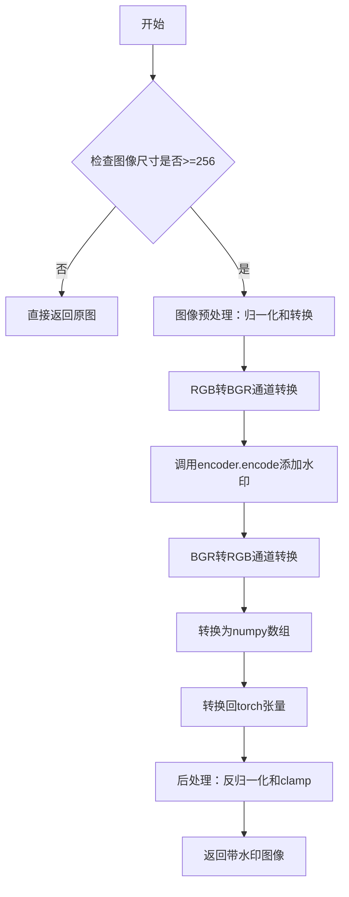
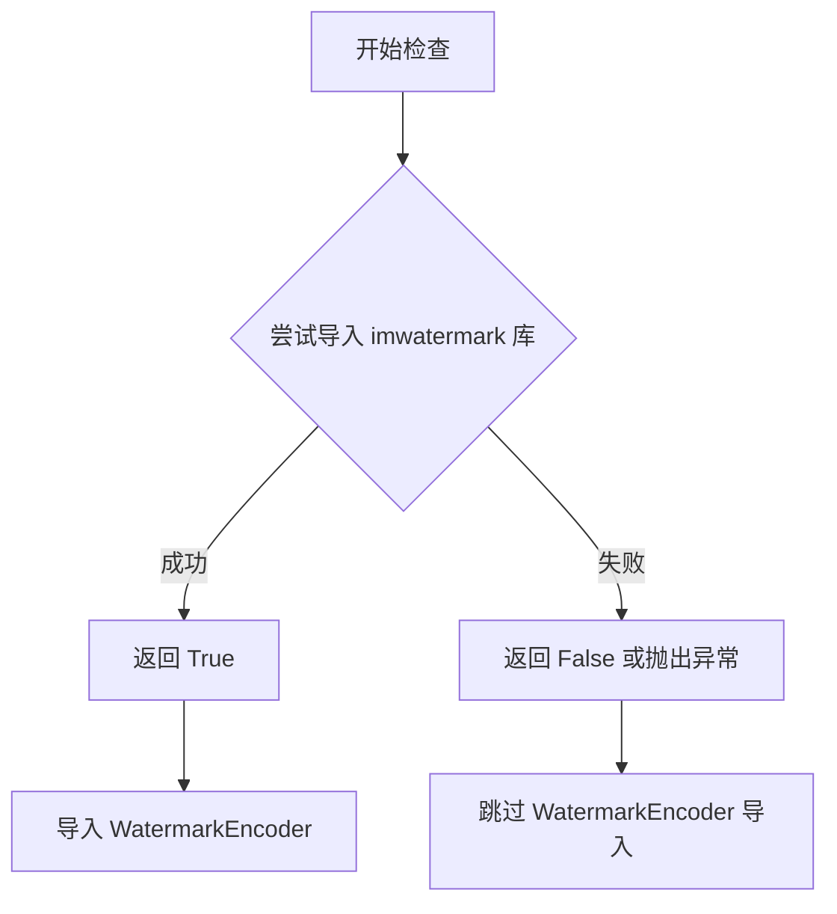
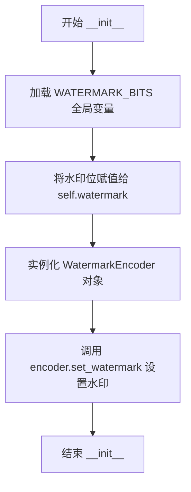

# `diffusers\src\diffusers\pipelines\stable_diffusion_xl\watermark.py` 详细设计文档

该代码实现了一个不可见水印模块，通过Stable Diffusion XL模型为图像添加数字水印。核心功能是将预定义的二进制水印消息编码到图像像素中，利用DWT-DCT变换方法实现不可见的水印嵌入，用于图像来源追踪和版权保护。

## 整体流程



## 类结构

```
StableDiffusionXLWatermarker (水印处理类)
```

## 全局变量及字段


### `WATERMARK_MESSAGE`
    
预定义的水印消息常量（56位二进制）

类型：`int`
    


### `WATERMARK_BITS`
    
水印消息转换后的比特列表

类型：`List[int]`
    


### `StableDiffusionXLWatermarker.watermark`
    
预定义的水印比特序列

类型：`List[int]`
    


### `StableDiffusionXLWatermarker.encoder`
    
水印编码器实例

类型：`WatermarkEncoder`
    
    

## 全局函数及方法


### `is_invisible_watermark_available`

检查不可见水印库（imwatermark）是否可用的工具函数。该函数用于条件导入，当库可用时返回 True，否则返回 False 或抛出异常。

参数：

- 无参数

返回值：`bool`，如果 imwatermark 库可用则返回 True，否则返回 False

#### 流程图



#### 带注释源码

```python
# 从上级目录的 utils 模块导入 is_invisible_watermark_available 函数
# 该函数用于检查 imwatermark 库是否已安装可用
from ...utils import is_invisible_watermark_available

# 条件导入：如果 imwatermark 可用，则导入 WatermarkEncoder 类
# is_invisible_watermark_available() 返回 True 时才执行导入
if is_invisible_watermark_available():
    from imwatermark import WatermarkEncoder
```

---

### 附加信息

**关键组件信息：**

- `is_invisible_watermark_available`：工具函数，用于检测 imwatermark 库是否可用
- `WatermarkEncoder`：水印编码器类，用于添加不可见水印

**设计目标与约束：**

- 该函数的目的是实现条件导入，避免在没有安装 imwatermark 库时程序崩溃
- 这是一种防御性编程实践，提高代码的健壮性

**潜在的技术债务或优化空间：**

- 当前代码没有对 is_invisible_watermark_available 返回 False 的情况进行处理，如果库不可用，后续的 StableDiffusionXLWatermarker 类将无法正常工作
- 建议添加明确的错误处理或友好的错误提示信息


### `StableDiffusionXLWatermarker.__init__`

构造函数，初始化水印编码器，加载预定义的水印位信息并配置编码器。

参数：
- 无（除 `self` 外）

返回值：`None`，构造函数无返回值

#### 流程图



#### 带注释源码

```
def __init__(self):
    # 将预定义的水印位序列赋值给实例变量 watermark
    # 这些位来自 WATERMARK_MESSAGE 常量（一个 48 位的二进制数）
    self.watermark = WATERMARK_BITS
    
    # 创建 WatermarkEncoder 实例，用于对图像进行水印编码
    # 该编码器来自 imwatermark 库
    self.encoder = WatermarkEncoder()
    
    # 使用 "bits" 模式设置水印内容
    # "dwtDct" 是 apply_watermark 方法中使用的编码算法
    self.encoder.set_watermark("bits", self.watermark)
```

---

## 完整类设计文档

### 一段话描述

`StableDiffusionXLWatermarker` 类是一个水印处理器，负责对 Stable Diffusion XL 生成的图像添加不可见数字水印。该类使用 DWT-DCT 变换域水印技术，将预定义的水印位信息嵌入到图像 RGB 通道中，以实现图像来源追溯和版权保护。

### 文件的整体运行流程

1. **模块导入**：导入 numpy、torch 和条件导入 imwatermark 库
2. **全局常量定义**：定义水印消息位序列 `WATERMARK_BITS`
3. **类实例化**：创建 `StableDiffusionXLWatermarker` 对象时调用 `__init__` 初始化编码器
4. **水印应用**：调用 `apply_watermark` 方法对图像张量批量添加水印
5. **图像后处理**：将图像转换回 PyTorch 张量格式并归一化到 [-1, 1]

### 类详细信息

#### 全局变量

| 名称 | 类型 | 描述 |
|------|------|------|
| `WATERMARK_MESSAGE` | `int` | 水印消息的整数值（48 位二进制数） |
| `WATERMARK_BITS` | `List[int]` | 水印消息的位列表（0/1 序列） |

#### 类字段

| 名称 | 类型 | 描述 |
|------|------|------|
| `self.watermark` | `List[int]` | 存储水印位序列，用于编码时调用 |
| `self.encoder` | `WatermarkEncoder` | imwatermark 库的水印编码器实例 |

#### 类方法

| 方法名 | 功能描述 |
|--------|----------|
| `__init__` | 构造函数，初始化水印编码器和水印位数据 |
| `apply_watermark` | 对图像张量应用不可见水印 |

### 关键组件信息

| 组件名称 | 一句话描述 |
|----------|------------|
| `WatermarkEncoder` | imwatermark 库提供的 DCT 域水印编码器，支持多种编码算法 |
| `WATERMARK_BITS` | 预定义的水印位序列，用于标识图像来源 |
| DWT-DCT 变换 | 离散小波变换结合离散余弦变换的水印嵌入算法 |

### 潜在的技术债务或优化空间

1. **硬编码水印密钥**：水印消息 `WATERMARK_MESSAGE` 硬编码在代码中，缺乏灵活性，应考虑从配置文件或环境变量加载
2. **错误处理缺失**：`__init__` 方法未处理 `imwatermark` 库不可用时的异常情况，仅依赖条件导入
3. **图像尺寸假设**：假设输入图像尺寸不小于 256 像素，未提供图像放大或拒绝处理的策略
4. **性能优化**：水印编码逐图像处理，可考虑批量并行处理以提升性能
5. **类型注解不完整**：`apply_watermark` 方法的参数和返回值缺少类型注解

### 其它项目

#### 设计目标与约束
- **目标**：为 Stable Diffusion XL 生成的图像添加不可见数字水印
- **约束**：输入图像尺寸必须不小于 256×256 像素
- **水印算法**：DWT-DCT（离散小波变换-离散余弦变换）

#### 错误处理与异常设计
- 当图像尺寸小于 256 时，直接返回原始图像而不进行水印处理
- 依赖 `is_invisible_watermark_available()` 函数检查库可用性

#### 数据流与状态机
1. **初始化状态**：加载水印位 → 创建编码器 → 配置水印
2. **处理状态**：接收图像张量 → 转换为 BGR → 编码水印 → 转换回 RGB → 归一化输出

#### 外部依赖与接口契约
- **必需依赖**：`torch`、`numpy`、`imwatermark`（通过条件导入）
- **输入接口**：`apply_watermark(images: torch.Tensor)` 接受 4D 张量 (N, C, H, W)
- **输出接口**：返回添加水印后的 torch.Tensor，形状不变，归一化到 [-1, 1]


### `StableDiffusionXLWatermarker.apply_watermark`

该方法接收 Stable Diffusion XL 生成的图像张量，通过不可见水印编码器将预定义的二进制水印信息嵌入到图像中，最后返回带有不可见水印的图像张量。整个过程涉及图像格式转换、通道顺序调整、水印编码和数值范围归一化等步骤。

参数：

- `images`：`torch.Tensor`，输入的图像张量，形状通常为 (batch_size, channels, height, width)，数值范围为 [-1, 1]

返回值：`torch.Tensor`，添加了不可见水印后的图像张量，形状与输入相同，数值范围为 [-1, 1]

#### 流程图

```mermaid
flowchart TD
    A[开始: 输入图像张量 images] --> B{检查图像尺寸}
    B -->|images.shape[-1] < 256| C[直接返回原图像]
    B -->|images.shape[-1] >= 256| D[图像预处理]
    
    D --> D1[将图像从 [-1,1] 映射到 [0,255]]
    D1 --> D2[转换为 NumPy 数组并调整维度顺序]
    D2 --> D3[通道顺序转换: RGB to BGR]
    
    D3 --> E[水印编码]
    E --> E1[对每张图像调用 encoder.encode]
    E1 --> E2[使用 dwtDct 算法编码]
    E2 --> E3[通道顺序转换: BGR to RGB]
    
    E3 --> F[转换为 PyTorch 张量]
    F --> G[调整维度顺序回 CHW]
    
    G --> H[数值范围归一化到 [-1,1]]
    H --> I[返回带水印的图像张量]
    
    C --> I
```

#### 带注释源码

```python
def apply_watermark(self, images: torch.Tensor):
    """
    对输入图像应用不可见水印
    
    参数:
        images: torch.Tensor, 输入图像张量, 形状为 (batch, channels, height, width),
                值域范围为 [-1, 1]
    
    返回:
        torch.Tensor, 添加水印后的图像张量, 形状相同, 值域范围为 [-1, 1]
    """
    
    # 检查图像尺寸, 如果图像宽度小于256像素则无法编码水印
    # 直接返回原始图像不做任何处理
    if images.shape[-1] < 256:
        return images

    # Step 1: 图像预处理 - 将图像值域从 [-1, 1] 转换到 [0, 255]
    # 公式解释: 2 * (x / 2 + 0.5) = x + 1, 然后乘以 255 得到 [0, 255] 范围
    # .cpu() 移至 CPU, .permute(0, 2, 3, 1) 将 CHW 转为 HWC 格式
    # .float() 转为浮点数, .numpy() 转为 NumPy 数组
    images = (255 * (images / 2 + 0.5)).cpu().permute(0, 2, 3, 1).float().numpy()

    # Step 2: 通道顺序转换 - RGB 转 BGR
    # WatermarkEncoder 期望 BGR 格式的输入, [::-1] 实现通道反转
    images = images[:, :, :, ::-1]

    # Step 3: 水印编码 - 对批次中每张图像应用 DWT-DCT 水印
    # self.encoder 已在 __init__ 中初始化, 加载了预定义的 WATERMARK_BITS
    # dwtDct 算法结合了离散小波变换和离散余弦变换, 提供较强的鲁棒性
    images = [self.encoder.encode(image, "dwtDct")[:, :, ::-1] for image in images]

    # Step 4: 转换为张量 - 将编码后的图像列表转为 NumPy 数组
    images = np.array(images)

    # Step 5: 转换回 PyTorch 张量并调整维度 - HWC 转 CHW
    images = torch.from_numpy(images).permute(0, 3, 1, 2)

    # Step 6: 数值归一化 - 将 [0, 255] 范围映射回 [-1, 1]
    # 公式: 2 * (images / 255 - 0.5) 将 [0,255] 映射到 [-1, 1]
    # torch.clamp 确保值被限制在 [-1.0, 1.0] 范围内
    images = torch.clamp(2 * (images / 255 - 0.5), min=-1.0, max=1.0)
    
    return images
```

#### 关键组件信息

| 组件名称 | 描述 |
|---------|------|
| `WatermarkEncoder` | imwatermark 库中的水印编码器，负责将二进制水印信息嵌入到图像中 |
| `WATERMARK_BITS` | 预定义的二进制水印位序列，用于标识图像来源 |
| `dwtDct` | 离散小波变换-离散余弦变换水印算法，提供较好的不可见性和鲁棒性平衡 |

#### 潜在技术债务与优化空间

1. **硬编码的水印消息**：`WATERMARK_MESSAGE` 和 `WATERMARK_BITS` 是硬编码的二进制序列，缺乏灵活性，应考虑支持外部配置或动态生成

2. **缺少错误处理**：当 `imwatermark` 库不可用或编码失败时没有异常捕获和处理机制

3. **尺寸检查不完整**：仅检查 `images.shape[-1] < 256`，未检查高度维度，且未验证通道数是否为 3

4. **性能优化空间**：列表推导式 `[self.encoder.encode(image, "dwtDct")[:, :, ::-1] for image in images]` 可考虑使用向量化操作或批处理提高性能

5. **硬编码阈值**：256 像素的最小尺寸限制应作为可配置参数

#### 其它设计说明

- **设计目标**：为 Stable Diffusion XL 生成的图像添加不可见水印，用于图像来源追溯和版权保护
- **约束条件**：输入图像尺寸必须大于等于 256 像素，否则无法嵌入水印
- **外部依赖**：依赖 `imwatermark` 库（通过 `is_invisible_watermark_available()` 条件导入）
- **接口契约**：输入输出均为 PyTorch 张量，值域范围保持在 [-1, 1]，确保与扩散模型生态的兼容性

## 关键组件


### StableDiffusionXLWatermarker

主类，负责对Stable Diffusion XL生成的图像应用不可见水印。该类封装了水印编码器和水印位信息，并提供了将水印嵌入到图像张量中的方法。

### WATERMARK_MESSAGE

预定义的水印消息常量，以整数形式表示其二进制位模式，用于生成水印位序列。

### WATERMARK_BITS

将水印消息整数转换为二进制位列表，用于水印编码器进行水印嵌入。

### __init__

构造函数，初始化水印编码器并设置水印位。

### apply_watermark

核心方法，接收图像张量，应用不可见水印（DWT+DCT算法），返回带有水印的图像张量。


## 问题及建议


### 已知问题

-   **硬编码水印配置**：`WATERMARK_MESSAGE` 和水印编码方法 `"dwtDct"` 被硬编码在代码中，缺乏灵活性，无法在不修改源码的情况下更改水印内容或编码方式
-   **魔法数字缺乏解释**：代码中包含多个魔法数字（256、255、2、0.5等），没有任何注释说明其含义和来源，影响可维护性
-   **缺少错误处理和边界检查**：没有对 `images` 参数的类型、形状、值范围进行验证；当 `WatermarkEncoder` 初始化或编码失败时缺乏异常捕获
-   **假设固定设备**：直接使用 `.cpu()` 进行转换，忽略了可能的 GPU 环境，没有根据实际设备进行动态处理
-   **缺少类型注解的完整性**：部分变量（如 `self.watermark`）缺少类型注解
-   **假设输入数据范围**：假设输入图像值在 [-1, 1] 范围内，但没有进行运行时验证，可能导致转换结果不正确
-   **依赖可用性检查不足**：仅检查库是否可用，未检查 `WatermarkEncoder` 是否正确初始化或方法是否存在

### 优化建议

-   将水印消息和编码方式提取为类构造参数或配置文件，提高可配置性
-   为所有魔法数字定义具名常量或配置参数，并添加详细注释说明其用途
-   在 `apply_watermark` 方法入口添加输入验证：检查 `images` 类型、维度（应为4D）、值范围，捕获并合理处理异常
-   根据输入张量所在设备动态选择 `.to()` 的目标设备，而非硬编码 `.cpu()`
-   在方法入口增加输入值范围验证，确保图像在预期的 [-1, 1] 范围内
-   为 `WatermarkEncoder` 的可用性添加更健壮的检查，包括版本验证和方法存在性检查
-   考虑添加类文档字符串和方法文档字符串，提升代码可读性和可维护性

## 其它


### 设计目标与约束

**设计目标**：为Stable Diffusion XL生成的图像添加不可见数字水印，实现图像来源追踪和版权保护功能。

**设计约束**：
- 输入图像尺寸必须大于等于256x256像素
- 输入图像格式须为PyTorch张量，通道顺序为CHW（通道、高度、宽度）
- 输出图像格式为PyTorch张量，值域范围[-1.0, 1.0]
- 水印编码采用DWT-DCT算法，需依赖imwatermark库
- 仅在is_invisible_watermark_available()返回True时加载水印功能

### 错误处理与异常设计

**异常处理场景**：
- **图像尺寸不足**：当images.shape[-1] < 256时，直接返回原图像，不抛出异常
- **依赖库不可用**：通过is_invisible_watermark_available()检查，若不可用则不导入WatermarkEncoder
- **数据类型转换异常**：使用numpy和torch的显式转换方法，确保类型兼容性

**错误传播机制**：本类不主动抛出异常，对于不符合处理条件的输入（图像过小），采用静默处理策略直接返回原图。

### 数据流与状态机

**输入数据流**：
1. 接收torch.Tensor类型的图像批次，形状为[B, C, H, W]，值域[-1.0, 1.0]
2. 转换为numpy数组，值域[0, 255]
3. RGB转BGR通道顺序
4. 编码水印
5. BGR转RGB通道顺序
6. 转换回torch.Tensor，值域[-1.0, 1.0]

**状态转换**：
- 初始状态：类初始化，encoder设置水印bits
- 处理状态：apply_watermark方法执行水印编码
- 输出状态：返回带水印的图像张量

**边界条件**：图像尺寸小于256像素时，跳过水印编码直接返回

### 外部依赖与接口契约

**外部依赖**：
- **imwatermark库**：提供WatermarkEncoder类，用于DWT-DCT水印编码
- **numpy**：数值计算和数组操作
- **torch**：张量操作和类型转换
- **项目内utils模块**：is_invisible_watermark_available()函数

**接口契约**：
- **输入接口**：apply_watermark(images: torch.Tensor) -> torch.Tensor
  - 参数images：4D张量[B, C, H, W]，值域[-1.0, 1.0]
  - 最小尺寸要求：H >= 256, W >= 256
- **输出接口**：返回带水印的4D张量[B, C, H, W]，值域[-1.0, 1.0]
- **类初始化**：无参数要求，使用预定义常量WATERMARK_BITS

### 性能考虑

**性能特征**：
- 图像处理采用批处理方式，list comprehension逐张编码
- 涉及多次GPU-CPU数据迁移（.cpu()）
- 通道转换和数组操作带来额外开销

**优化建议**：
- 考虑使用torch的GPU加速操作替代部分numpy计算
- 对于大批量图像，可考虑并行编码
- 预先分配numpy数组空间避免频繁内存分配

### 安全性考虑

**水印安全性**：
- 使用预定义的固定水印位串WATERMARK_MESSAGE
- 水印算法（DWT-DCT）具有一定的鲁棒性，可抵抗常见图像处理操作

**潜在安全风险**：
- 水印位串以硬编码方式存储，缺乏动态密钥管理
- 未对输入图像进行合法性验证，可能接受恶意构造的张量

### 兼容性考虑

**框架兼容性**：
- 依赖PyTorch和NumPy两大主流数值计算库
- 水印编码器imwatermark需单独安装

**版本兼容性**：
- 代码使用PyTorch 2.x新特性（如有）需验证
- imwatermark库版本变化可能影响encode方法行为

**平台兼容性**：
- 跨平台支持（Windows/Linux/MacOS）
- CPU和GPU环境均可运行

### 使用示例

```python
# 初始化水印器
watermarker = StableDiffusionXLWatermarker()

# 准备输入图像（batch_size=1, channels=3, height=512, width=512）
images = torch.randn(1, 3, 512, 512)

# 应用水印
watermarked_images = watermarker.apply_watermark(images)

# 验证输出
print(watermarked_images.shape)  # torch.Size([1, 3, 512, 512])
print(watermarked_images.min(), watermarked_images.max())  # -1.0 ~ 1.0
```

### 测试策略

**单元测试**：
- 测试类初始化和encoder配置
- 测试正常尺寸图像的水印添加
- 测试小尺寸图像的跳过逻辑
- 测试输出值域范围[-1.0, 1.0]

**集成测试**：
- 测试与Stable Diffusion XL pipeline的集成
- 验证水印的可检测性（需配合WatermarkDecoder）
- 测试批量图像处理

**边界测试**：
- 测试最小有效尺寸（256x256）
- 测试单通道和多通道图像
- 测试极端值输入

    