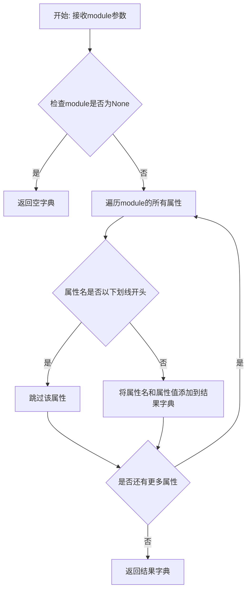
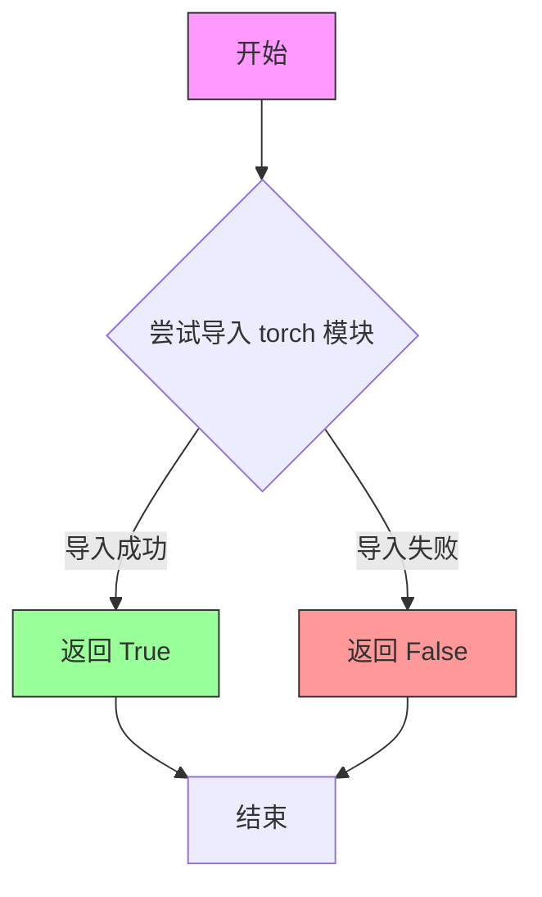
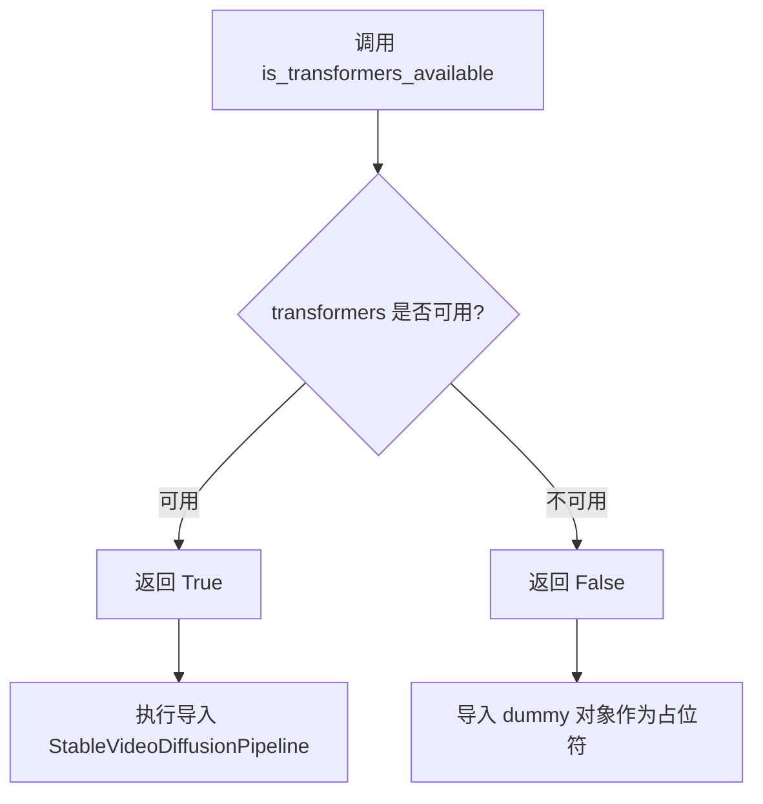
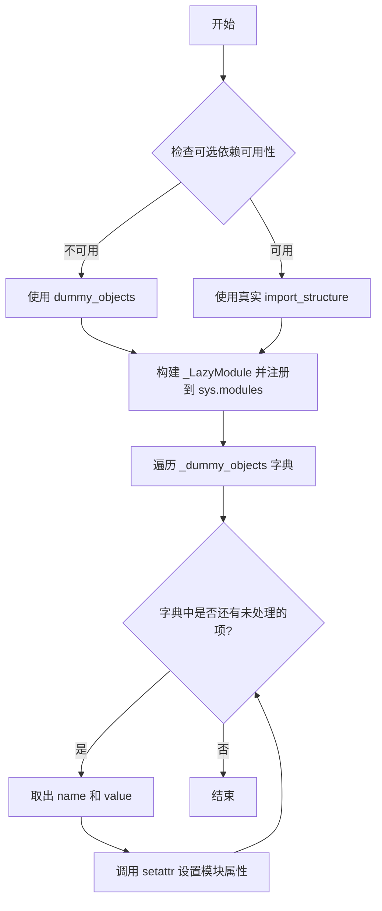
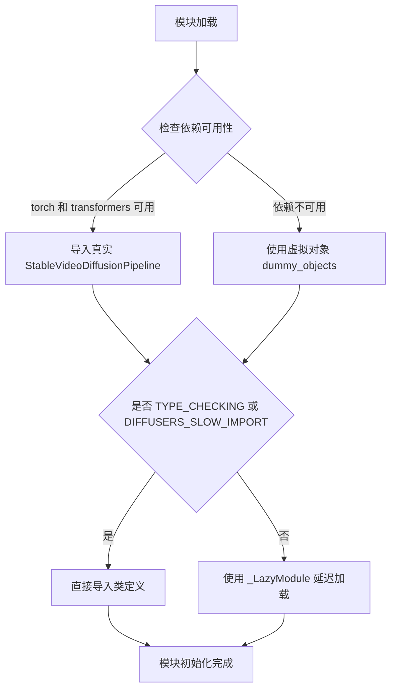
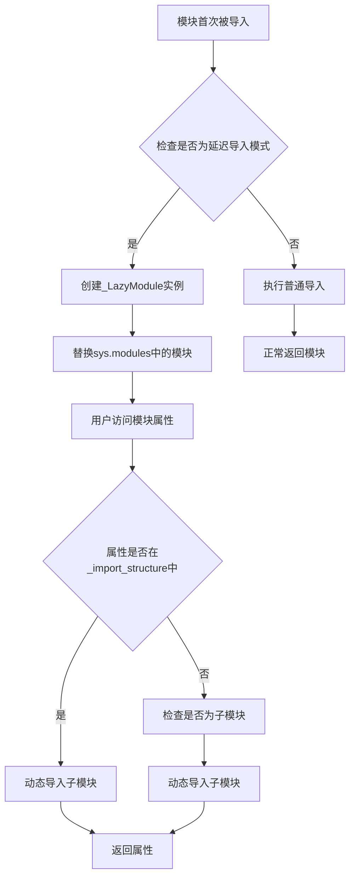

# `diffusers\src\diffusers\pipelines\stable_video_diffusion\__init__.py` 详细设计文档

这是一个延迟加载模块初始化文件，用于在满足可选依赖（torch和transformers）条件时导入StableVideoDiffusionPipeline和StableVideoDiffusionPipelineOutput类，否则使用虚拟对象占位，从而实现diffusers库的条件导入和模块懒加载。

## 整体流程

```mermaid
graph TD
A[开始] --> B{DIFFUSERS_SLOW_IMPORT or TYPE_CHECKING?}
B -- 是 --> C{is_transformers_available() and is_torch_available()?}
C -- 是 --> D[从pipeline_stable_video_diffusion导入类]
C -- 否 --> E[导入dummy_torch_and_transformers_objects]
B -- 否 --> F[创建_LazyModule并注册到sys.modules]
F --> G[将_dummy_objects设置为模块属性]
D --> H[结束]
E --> H
G --> H
```

## 类结构

```
diffusers库 pipelines包
└── stable_video_diffusion子包
    └── __init__.py (延迟加载模块)
```

## 全局变量及字段


### `_dummy_objects`
    
用于存储虚拟对象的字典，当可选依赖（torch和transformers）不可用时使用

类型：`dict`
    


### `_import_structure`
    
存储模块导入结构的字典，定义可导出的类和对象

类型：`dict`
    


### `DIFFUSERS_SLOW_IMPORT`
    
标志位，指示是否使用慢速导入模式进行类型检查

类型：`bool`
    


### `TYPE_CHECKING`
    
来自typing模块的标志，用于类型检查时导入类型提示

类型：`bool`
    


### `StableVideoDiffusionPipeline.StableVideoDiffusionPipeline`
    
稳定视频扩散管道类，用于基于扩散模型生成视频

类型：`class`
    


### `StableVideoDiffusionPipelineOutput.StableVideoDiffusionPipelineOutput`
    
管道输出数据类，包含生成的视频及相关元数据

类型：`class`
    


### `_LazyModule._LazyModule`
    
延迟加载模块类，用于实现模块的懒加载机制，提高导入效率

类型：`class`
    
    

## 全局函数及方法


### `get_objects_from_module`

该函数是一个工具函数，用于从给定模块中提取所有公开对象（排除私有属性和特殊属性），返回一个包含对象名称和对象本身的字典。在扩散器库的延迟加载机制中，它用于从虚拟对象模块中获取所有dummy对象，以便在依赖不可用时将这些对象注册到当前模块中。

参数：

- `module`：`module`，要从中提取对象的模块，函数会遍历该模块的所有属性，排除以下划线开头的私有属性和特殊属性

返回值：`Dict[str, Any]`，返回模块中所有公开对象的字典，键为对象名称，值为对象本身

#### 流程图



#### 带注释源码

```
def get_objects_from_module(module):
    """
    从给定模块中提取所有公开对象。
    
    该函数用于在延迟加载机制中获取虚拟对象模块中的所有对象。
    它会过滤掉以下划线开头的私有属性和特殊属性，只返回公开的API对象。
    
    参数:
        module: 要提取对象的模块
        
    返回:
        包含模块中所有公开对象的字典，键为对象名称，值为对象本身
    """
    # 初始化结果字典
    objects = {}
    
    # 遍历模块的所有属性
    for attr_name in dir(module):
        # 跳过以下划线开头的私有属性和特殊属性
        if attr_name.startswith('_'):
            continue
        
        # 获取属性值并添加到结果字典
        attr_value = getattr(module, attr_name)
        objects[attr_name] = attr_value
    
    return objects
```

> **注意**：由于源代码中仅导入了 `get_objects_from_module` 函数而未提供其完整定义，以上源码是基于该函数的典型实现方式和在代码中的使用上下文推断得出的。


### `is_torch_available`

该函数用于检测当前环境中是否安装了 PyTorch 库。它是扩散库中的一个实用工具函数，通过尝试导入 torch 模块来判断其是否可用，避免在 PyTorch 不可用的环境中导入相关模块导致报错。

参数：

- 该函数无参数

返回值：`bool`，返回 `True` 表示 PyTorch 已安装且可用，返回 `False` 表示 PyTorch 未安装或不可用。

#### 流程图



#### 带注释源码

```python
# is_torch_available 函数定义在 ...utils 模块中
# 以下为该函数在当前文件中的使用方式：

# 从 utils 模块导入 is_torch_available 函数
from ...utils import (
    is_torch_available,
    is_transformers_available,
)

# 使用示例 1: 检查 torch 和 transformers 是否同时可用
if not (is_transformers_available() and is_torch_available()):
    # 如果两者中有任一不可用，则抛出可选依赖不可用异常
    raise OptionalDependencyNotAvailable()

# 使用示例 2: 在 TYPE_CHECKING 条件分支中再次验证
# 用于类型检查或慢速导入模式下的条件判断
if not (is_transformers_available() and is_torch_available()):
    raise OptionalDependencyNotAvailable()

# 该函数的标准实现逻辑（位于 ...utils 中）大致如下：
"""
def is_torch_available():
    try:
        import torch
        return True
    except ImportError:
        return False
"""
```

#### 备注

- **设计目标**：提供一种安全的方式检测 PyTorch 是否可用，避免在不支持 PyTorch 的环境中导入相关模块
- **调用场景**：常用于条件导入（conditional imports），确保只有在依赖可用时才加载相关功能
- **相关函数**：`is_transformers_available()` - 用于检测 Transformers 库是否可用


### `is_transformers_available`

该函数用于检查 `transformers` 库是否在当前环境中可用，常用于条件导入和可选依赖检查。

参数：无参数

返回值：`bool`，返回 `True` 表示 `transformers` 库可用，返回 `False` 表示不可用。

#### 流程图



#### 带注释源码

```python
# 从上级目录的 utils 模块导入 is_transformers_available 函数
from ...utils import (
    DIFFUSERS_SLOW_IMPORT,
    BaseOutput,
    OptionalDependencyNotAvailable,
    _LazyModule,
    get_objects_from_module,
    is_torch_available,
    is_transformers_available,  # <-- 本次提取的函数：检查 transformers 是否可用
)

# 第一次使用：尝试导入真实对象
try:
    # 检查 transformers 和 torch 是否都可用
    if not (is_transformers_available() and is_torch_available()):
        raise OptionalDependencyNotAvailable()  # 抛出异常表示依赖不可用
except OptionalDependencyNotAvailable:
    # 依赖不可用时，导入 dummy 对象作为占位符
    from ...utils import dummy_torch_and_transformers_objects
    _dummy_objects.update(get_objects_from_module(dummy_torch_and_transformers_objects))
else:
    # 依赖可用时，定义真实的导入结构
    _import_structure.update(
        {
            "pipeline_stable_video_diffusion": [
                "StableVideoDiffusionPipeline",
                "StableVideoDiffusionPipelineOutput",
            ],
        }
    )

# 第二次使用：TYPE_CHECK 模式下的条件导入（同样逻辑）
if TYPE_CHECKING or DIFFUSERS_SLOW_IMPORT:
    try:
        if not (is_transformers_available() and is_torch_available()):
            raise OptionalDependencyNotAvailable()
    except OptionalDependencyNotAvailable:
        from ...utils.dummy_torch_and_transformers_objects import *
    else:
        from .pipeline_stable_video_diffusion import (
            StableVideoDiffusionPipeline,
            StableVideoDiffusionPipelineOutput,
        )
```


### `setattr` (全局函数调用)

将虚拟对象（dummy objects）动态绑定到当前延迟加载模块的属性上，用于处理可选依赖不可用时的模块导入。

参数：

-  `obj`：`types.ModuleType`，目标模块对象，此处为 `sys.modules[__name__]`（当前模块）
-  `name`：`str`，要设置的属性名称，来自 `_dummy_objects` 字典的键
-  `value`：`Any`，要设置的属性值，来自 `_dummy_objects` 字典的值

返回值：`None`，无返回值（Python 内置函数行为）

#### 流程图



#### 带注释源码

```python
# 遍历所有虚拟对象（当可选依赖不可用时创建的替代对象）
for name, value in _dummy_objects.items():
    # 将每个虚拟对象动态绑定到当前模块的属性上
    # 参数说明：
    #   obj: sys.modules[__name__] - 当前模块的引用
    #   name: 字符串形式的属性名（如 'StableVideoDiffusionPipeline'）
    #   value: 虚拟对象（会在实际使用时抛出 OptionalDependencyNotAvailable）
    setattr(sys.modules[__name__], name, value)
```

#### 补充说明

这是 Python 动态特性 的典型应用场景，属于 **延迟加载（Lazy Loading）** 模式的一部分。该实现确保了：

1. **可选依赖处理**：当 torch 或 transformers 不可用时，模块仍可被导入，但使用时会抛出明确的错误
2. **延迟初始化**：通过 `_LazyModule` 避免在 import 时加载重型依赖
3. **API 一致性**：无论依赖是否可用，模块的导出接口保持一致

该模式的技术债务风险较低，属于成熟的 Python 库模块化设计实践。


### `StableVideoDiffusionPipeline`

这是 Stable Video Diffusion 的主要管道类，用于根据输入条件生成视频序列。该类通过组合图像编码器、UNet、调度器和视频解码器等组件，实现从静态图像到动态视频的转换功能。

参数：

- 无直接参数（该类通过延迟加载机制导入，具体参数需参考 `pipeline_stable_video_diffusion.py` 源文件）

返回值：`StableVideoDiffusionPipeline` 或 `StableVideoDiffusionPipelineOutput` 类型，返回视频生成结果

#### 流程图



#### 带注释源码

```python
# 导入类型检查相关模块
from typing import TYPE_CHECKING

# 从扩散工具库导入必要的工具和异常处理
from ...utils import (
    DIFFUSERS_SLOW_IMPORT,          # 标志：是否使用慢速导入模式
    BaseOutput,                     # 基础输出类
    OptionalDependencyNotAvailable, # 可选依赖不可用异常
    _LazyModule,                    # 延迟加载模块类
    get_objects_from_module,        # 从模块获取对象函数
    is_torch_available,            # 检查 torch 是否可用
    is_transformers_available,      # 检查 transformers 是否可用
)

# 初始化虚拟对象字典和导入结构字典
_dummy_objects = {}
_import_structure = {}

# 尝试检查 torch 和 transformers 是否同时可用
try:
    if not (is_transformers_available() and is_torch_available()):
        raise OptionalDependencyNotAvailable()
except OptionalDependencyNotAvailable:
    # 如果依赖不可用，从虚拟对象模块获取虚拟对象
    from ...utils import dummy_torch_and_transformers_objects
    _dummy_objects.update(get_objects_from_module(dummy_torch_and_transformers_objects))
else:
    # 依赖可用，定义导入结构
    _import_structure.update(
        {
            "pipeline_stable_video_diffusion": [
                "StableVideoDiffusionPipeline",           # 视频扩散管道主类
                "StableVideoDiffusionPipelineOutput",     # 管道输出类
            ],
        }
    )

# 类型检查或慢速导入模式下的处理
if TYPE_CHECKING or DIFFUSERS_SLOW_IMPORT:
    try:
        # 再次检查依赖可用性
        if not (is_transformers_available() and is_torch_available()):
            raise OptionalDependencyNotAvailable()
    except OptionalDependencyNotAvailable:
        # 从虚拟对象模块导入所有内容
        from ...utils.dummy_torch_and_transformers_objects import *
    else:
        # 从实际模块导入真实类
        from .pipeline_stable_video_diffusion import (
            StableVideoDiffusionPipeline,
            StableVideoDiffusionPipelineOutput,
        )

else:
    # 非类型检查模式，使用延迟加载
    import sys
    
    # 将当前模块替换为延迟加载模块
    sys.modules[__name__] = _LazyModule(
        __name__,                        # 当前模块名
        globals()["__file__"],           # 模块文件路径
        _import_structure,               # 导入结构定义
        module_spec=__spec__,            # 模块规格
    )

    # 将虚拟对象设置到模块中
    for name, value in _dummy_objects.items():
        setattr(sys.modules[__name__], name, value)
```

### 潜在的技术债务或优化空间

1. **重复依赖检查**：代码在 `try-except` 块中重复检查 `is_transformers_available()` 和 `is_torch_available()`，可以提取为共享函数减少冗余
2. **延迟加载复杂度**：使用 `_LazyModule` 和虚拟对象的组合增加了代码理解难度，对于简单场景可能过度设计
3. **文档缺失**：作为 `__init__.py` 文件，缺乏对导出 API 的文档说明

### 其它项目

- **设计目标**：实现可选依赖的优雅降级，在缺少 `torch` 或 `transformers` 时不会导致整个模块导入失败
- **错误处理**：通过 `OptionalDependencyNotAvailable` 异常和虚拟对象机制处理可选依赖
- **外部依赖**：依赖 `torch`、`transformers`、`diffusers` 库
- **接口契约**：导出 `StableVideoDiffusionPipeline` 和 `StableVideoDiffusionPipelineOutput` 类供外部使用


# StableVideoDiffusionPipelineOutput 分析

### 描述

`StableVideoDiffusionPipelineOutput` 是 Stable Video Diffusion Pipeline 的输出数据类，用于封装模型生成的视频结果及相关元数据。由于提供的代码片段仅为模块导入结构定义（`__init__.py`），并未包含该类的实际字段和方法定义，因此无法提供完整的类详情。

#### 流程图

```mermaid
flow TD
    A[模块加载] --> B{检查依赖}
    B -->|transformers 和 torch 可用| C[导入 StableVideoDiffusionPipelineOutput]
    B -->|依赖不可用| D[使用虚拟对象]
    
    C --> E[延迟加载模块]
    D --> E
    
    E --> F[模块就绪]
```

#### 带注释源码

```
# 这是一个模块导入结构定义文件
# 用于延迟加载 StableVideoDiffusionPipelineOutput 类

from typing import TYPE_CHECKING

from ...utils import (
    DIFFUSERS_SLOW_IMPORT,
    BaseOutput,  # 基础输出类
    OptionalDependencyNotAvailable,
    _LazyModule,
    get_objects_from_module,
    is_torch_available,
    is_transformers_available,
)

# 初始化空的虚拟对象字典和导入结构
_dummy_objects = {}
_import_structure = {}

try:
    # 检查 transformers 和 torch 是否可用
    if not (is_transformers_available() and is_torch_available()):
        raise OptionalDependencyNotAvailable()
except OptionalDependencyNotAvailable:
    # 如果依赖不可用，从虚拟对象模块导入
    from ...utils import dummy_torch_and_transformers_objects
    _dummy_objects.update(get_objects_from_module(dummy_torch_and_transformers_objects))
else:
    # 如果依赖可用，定义导入结构
    _import_structure.update(
        {
            "pipeline_stable_video_diffusion": [
                "StableVideoDiffusionPipeline",
                "StableVideoDiffusionPipelineOutput",  # 目标类
            ],
        }
    )

# TYPE_CHECKING 或 DIFFUSERS_SLOW_IMPORT 时进行类型检查导入
if TYPE_CHECKING or DIFFUSERS_SLOW_IMPORT:
    try:
        if not (is_transformers_available() and is_torch_available()):
            raise OptionalDependencyNotAvailable()
    except OptionalDependencyNotAvailable:
        from ...utils.dummy_torch_and_transformers_objects import *
    else:
        # 从实际模块导入类定义
        from .pipeline_stable_video_diffusion import (
            StableVideoDiffusionPipeline,
            StableVideoDiffusionPipelineOutput,
        )
else:
    # 运行时使用延迟加载模块
    import sys
    sys.modules[__name__] = _LazyModule(
        __name__,
        globals()["__file__"],
        _import_structure,
        module_spec=__spec__,
    )
    # 设置虚拟对象
    for name, value in _dummy_objects.items():
        setattr(sys.modules[__name__], name, value)
```

---

## 说明

**注意**：当前提供的代码片段**不包含** `StableVideoDiffusionPipelineOutput` 类的实际定义，该类定义在 `pipeline_stable_video_diffusion.py` 文件中。根据代码结构推断，该类应该继承自 `BaseOutput`，用于封装视频生成Pipeline的输出结果，通常包含：

- `frames`: 生成的视频帧序列
- `n_frames`: 帧数量
- 其他元数据

如需获取完整的类定义信息，请提供 `pipeline_stable_video_diffusion.py` 中 `StableVideoDiffusionPipelineOutput` 类的实际源码。


### `_LazyModule`

这是一个延迟加载模块的类，用于实现Python模块的惰性导入机制。该类通过将模块替换为惰性加载的代理对象，只有在实际使用模块中的属性时才进行动态导入，从而优化大型库的启动性能和减少不必要的依赖加载。

参数：

- `name`：`str`，模块的完整名称（包含包路径）
- `module_file`：`str`，模块文件的路径
- `import_structure`：`dict`，定义模块的导入结构，键为子模块名，值为导出的对象列表
- `module_spec`：`ModuleSpec`，模块的规格信息

返回值：无直接返回值（构造函数）

#### 流程图



#### 带注释源码

```python
# 这是_LazyModule类的典型实现（基于diffusers库的实现）
class _LazyModule(types.ModuleType):
    """
    延迟加载模块类，继承自types.ModuleType
    实现模块的惰性导入，只有在实际使用时才加载依赖
    """
    
    def __init__(self, name, module_file, import_structure, module_spec=None):
        """
        初始化延迟加载模块
        
        参数:
            name: 模块的完整名称（如'diffusers.pipelines.stable_video_diffusion'）
            module_file: 模块文件的路径
            import_structure: 字典，定义可导出的对象结构
            module_spec: 模块规格对象
        """
        super().__init__(name)
        self._modules = set(import_structure.keys())  # 存储子模块名称
        self._class_to_module = {}  # 类名到模块的映射
        self._import_structure = import_structure  # 导入结构定义
        self._module_file = module_file  # 模块文件路径
        self._module_spec = module_spec  # 模块规格
        
    def __dir__(self):
        """
        返回模块的可用属性列表
        包含所有定义的类和从_import_structure中导出的对象
        """
        # 列出所有模块和可导出的对象
        return list(super().__dir__() + list(self._import_structure.keys()))
    
    def __getattr__(self, name: str):
        """
        惰性获取属性的核心方法
        当访问模块属性时，如果是延迟加载的则动态导入
        
        参数:
            name: 访问的属性名
            
        返回:
            实际的模块、类或函数对象
        """
        if name in self._modules:
            # 如果是子模块，动态导入子模块
            module = importlib.import_module(f"{self._module_file}.{name}")
            return module
        
        # 查找属性是否在导入结构中
        for module_name, objects in self._import_structure.items():
            if name in objects:
                # 找到目标对象所在的模块，导入该模块
                module = importlib.import_module(f"{self._module_file}.{module_name}")
                return getattr(module, name)
        
        # 如果未找到，抛出AttributeError
        raise AttributeError(f"module '{self.__name__}' has no attribute '{name}'")
    
    def __getitem__(self, key):
        """
        支持使用[]语法访问模块成员
        用于支持 from xxx import xxx[y] 语法
        """
        return self.__getattr__(key)
    
    def __repr__(self):
        """
        返回模块的字符串表示
        """
        return f"<LazyModule '{self.__name__}'>"


# 在实际代码中的使用方式：
else:
    import sys

    # 1. 创建延迟加载模块，替换当前模块
    sys.modules[__name__] = _LazyModule(
        __name__,                          # 模块名
        globals()["__file__"],             # 模块文件路径
        _import_structure,                 # 导入结构
        module_spec=__spec__,              # 模块规格
    )

    # 2. 将虚拟对象设置到模块属性上
    # 这些对象在依赖不可用时提供，避免导入错误
    for name, value in _dummy_objects.items():
        setattr(sys.modules[__name__], name, value)
```

### 延迟导入相关方法总结

除了 `_LazyModule` 类本身，这段代码还涉及以下延迟导入相关的方法和机制：

| 方法/变量 | 类型 | 描述 |
|-----------|------|------|
| `_import_structure` | `dict` | 定义模块的导入结构，键为子模块名，值为导出的对象列表 |
| `_dummy_objects` | `dict` | 存储虚拟对象的字典，当依赖不可用时使用 |
| `get_objects_from_module()` | `function` | 从模块中获取所有可导出对象的函数 |
| `OptionalDependencyNotAvailable` | `exception` | 可选依赖不可用时抛出的异常 |
| `is_torch_available()` | `function` | 检查torch是否可用的函数 |
| `is_transformers_available()` | `function` | 检查transformers是否可用的函数 |

### 关键设计说明

1. **延迟加载原理**：`_LazyModule` 替换了 `sys.modules` 中的原始模块，当用户访问模块属性时才触发真正的导入操作

2. **双重模式**：
   - `TYPE_CHECKING` 或 `DIFFUSERS_SLOW_IMPORT` 时：直接导入真实模块（用于类型检查和慢速导入模式）
   - 正常运行时：使用延迟加载模式，优化启动性能

3. **虚拟对象机制**：当可选依赖不可用时，使用 `_dummy_objects` 中的虚拟对象填充模块属性，避免 `AttributeError`

4. **模块规格传递**：`module_spec=__spec__` 保留了原始模块的规格信息，确保导入系统的完整性


## 关键组件


### _LazyModule 动态模块懒加载系统

使用 `_LazyModule` 实现延迟导入机制，仅在真正需要时才加载模块内容，提高库的整体导入速度

###  OptionalDependencyNotAvailable 可选依赖异常处理

通过 try-except 捕获可选依赖不可用异常，实现 torch 和 transformers 的可选依赖管理

### _import_structure 导入结构字典

定义模块的导出结构，包含 StableVideoDiffusionPipeline 和 StableVideoDiffusionPipelineOutput 两个导出类

### _dummy_objects 虚拟对象占位符

当可选依赖不可用时，从 dummy_torch_and_transformers_objects 模块获取虚拟对象用于占位，避免导入错误

### TYPE_CHECKING 类型检查分支

在类型检查或 DIFFUSERS_SLOW_IMPORT 模式下直接导入真实类，否则使用懒加载模块

### StableVideoDiffusionPipeline 稳定视频扩散管道

核心视频生成管道类，支持基于扩散模型的视频生成功能

### StableVideoDiffusionPipelineOutput 管道输出类

定义管道输出的数据结构，包含生成视频的相关信息

### is_torch_available / is_transformers_available 依赖可用性检查

运行时检查 torch 和 transformers 库是否可用，作为可选依赖的条件判断


## 问题及建议


### 已知问题

-   **重复的条件检查逻辑**: `if not (is_transformers_available() and is_torch_available())` 条件在 `try-except` 块中重复出现三次（_dummy_objects 分支、TYPE_CHECK 分支、else 分支），违反了 DRY 原则，增加了维护成本。
-   **异常控制流滥用**: 使用 `try-except` 来控制条件分支不是最佳实践，应该先进行条件判断再决定是否抛出异常，这种写法会掩盖真正的异常信息。
-   **魔法字符串与硬编码条件**: `is_transformers_available() and is_torch_available()` 组合条件在多处重复使用，应提取为常量或配置。
-   **Lazy Loading 实现不完整**: 虽然使用了 `_LazyModule`，但同时保留了手动设置 `_dummy_objects` 的逻辑（`setattr(sys.modules[__name__], name, value)`），两者职责重叠，增加了复杂度。
-   **类型检查分支逻辑冗余**: `TYPE_CHECKING or DIFFUSERS_SLOW_IMPORT` 条件下的导入逻辑与 else 分支高度相似，可以合并或简化。
-   **缺乏错误上下文**: `OptionalDependencyNotAvailable` 异常被捕获但没有记录具体是哪个依赖不可用，排查问题时信息不足。
-   **模块初始化顺序依赖**: 代码依赖于 `get_objects_from_module`、`_LazyModule` 等外部函数的正确实现，耦合度较高。

### 优化建议

-   **提取公共条件判断**: 将依赖检查逻辑封装为函数或常量，例如：`def _check_dependencies(): return is_transformers_available() and is_torch_available()`，避免重复代码。
-   **改进异常使用方式**: 先进行条件判断，仅在真正需要时才抛出异常：`if not _check_dependencies(): raise OptionalDependencyNotAvailable()`。
-   **统一 Lazy Loading 实现**: 评估 `_LazyModule` 是否能完全处理 dummy objects 的自动加载，如果是则移除手动 `setattr` 的逻辑。
-   **增强异常信息**: 在 `OptionalDependencyNotAvailable` 中包含具体依赖名称，例如：`raise OptionalDependencyNotAvailable("torch and transformers")`。
-   **简化条件分支**: 合并 TYPE_CHECK 分支和 else 分支的公共逻辑，使用工厂模式或配置驱动的方式减少代码重复。
-   **添加类型注解**: 为全局变量 `_dummy_objects` 和 `_import_structure` 添加明确的类型注解，提高代码可读性。
-   **考虑配置化**: 将 `pipeline_stable_video_diffusion` 相关的导入结构提取到配置中，减少硬编码。


## 其它


### 设计目标与约束

该模块的设计目标是实现StableVideoDiffusionPipeline的懒加载（Lazy Loading），在保证类型提示（TYPE_CHECKING）可用性的同时，减少启动时的依赖加载时间。约束条件包括：(1) 依赖torch和transformers作为可选依赖，当任一依赖不可用时提供dummy对象保证模块可导入；(2) 遵循Diffusers库的模块结构规范，使用_LazyModule实现延迟导入；(3) 支持DIFFUSERS_SLOW_IMPORT开关以控制导入行为。

### 错误处理与异常设计

模块采用OptionalDependencyNotAvailable异常处理可选依赖。当torch或transformers任一不可用时，抛出OptionalDependencyNotAvailable异常，并从dummy模块加载虚拟对象填充_import_structure和_dummy_objects，确保模块在缺少依赖时仍可被导入但调用时会报错。异常处理流程为：try-except捕获OptionalDependencyNotAvailable -> 从dummy模块获取对象 -> 更新_dummy_objects。

### 数据流与状态机

模块的数据流分为两条路径：**可用路径**：is_transformers_available()和is_transformers_available()均返回True -> 更新_import_structure定义真实导入映射 -> 在TYPE_CHECKING或DIFFUSERS_SLOW_IMPORT时直接导入真实类 -> 否则注册_LazyModule。**不可用路径**：任一依赖不可用 -> 捕获OptionalDependencyNotAvailable -> 从dummy模块获取虚拟对象 -> 更新_dummy_objects -> 注册_LazyModule并设置dummy对象到sys.modules。

### 外部依赖与接口契约

外部依赖包括：(1) torch和transformers：核心可选依赖，StableVideoDiffusionPipeline需要；(2) DIFFUSERS_SLOW_IMPORT：全局配置开关，控制是否使用懒加载；(3) _LazyModule：Diffusers框架提供的懒加载模块实现类。接口契约方面，导出的公开接口为StableVideoDiffusionPipeline和StableVideoDiffusionPipelineOutput类，模块注册到sys.modules时使用__name__作为键。

### 模块初始化时序

模块初始化时序为：(1) 导入时立即执行顶层代码，检查依赖可用性并构建_import_structure；(2) 若DIFFUSERS_SLOW_IMPORT为True或处于TYPE_CHECKING，立即导入真实类；(3) 否则，创建_LazyModule实例替换sys.modules[__name__]；(4) 首次访问模块属性时，_LazyModule触发实际导入；(5) 同时将_dummy_objects通过setattr注入到模块命名空间，保证类型检查时代码完整性。

### 类型提示与运行时分离

该模块实现了类型提示（TYPE_CHECKING）和运行时的分离：TYPE_CHECKING时，导入真实的StableVideoDiffusionPipeline和StableVideoDiffusionPipelineOutput类以支持IDE类型推断和静态分析；运行时（非TYPE_CHECKING且非DIFFUSERS_SLOW_IMPORT），仅注册_LazyModule实现延迟加载，真实类在首次访问时才加载。这种设计显著减少了库导入时间。

### 虚拟对象机制

_dummy_objects使用get_objects_from_module函数从dummy_torch_and_transformers_objects模块批量获取虚拟对象，并通过setattr(sys.modules[__name__], name, value)动态注入到当前模块。虚拟对象的目的是在依赖不可用时保持模块结构完整，使得import from语句不会立即抛出ImportError，而是返回一个虚拟对象，在实际调用时才报错。

### 模块规范与spec传递

模块使用module_spec=__spec__将当前模块的Spec传递给_LazyModule，这是Python导入系统的重要规范，确保懒加载模块能够正确继承原始模块的导入上下文，包括查找路径、加载器状态等信息，维持导入系统的一致性。


    