# `diffusers\src\diffusers\pipelines\stable_video_diffusion\pipeline_stable_video_diffusion.py` 详细设计文档

Stable Video Diffusion Pipeline是一个基于扩散模型的视频生成管道，能够从输入图像生成连续的视频帧。该管道使用CLIP图像编码器、VAE模型和时空条件UNet进行去噪处理，结合Euler离散调度器实现高质量视频生成。

## 整体流程

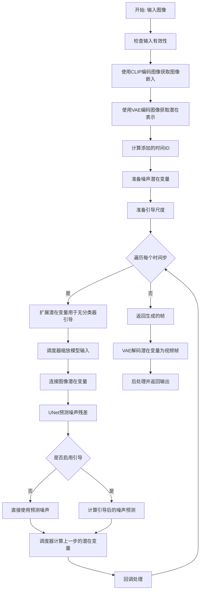

## 类结构

```
DiffusionPipeline (基类)
└── StableVideoDiffusionPipeline (主Pipeline类)
    └── StableVideoDiffusionPipelineOutput (输出数据类)
```

## 全局变量及字段


### `logger`
    
日志记录器

类型：`logging.Logger`
    


### `XLA_AVAILABLE`
    
XLA可用性标志

类型：`bool`
    


### `EXAMPLE_DOC_STRING`
    
示例文档字符串

类型：`str`
    


### `StableVideoDiffusionPipeline.vae`
    
VAE模型用于编解码

类型：`AutoencoderKLTemporalDecoder`
    


### `StableVideoDiffusionPipeline.image_encoder`
    
CLIP图像编码器

类型：`CLIPVisionModelWithProjection`
    


### `StableVideoDiffusionPipeline.unet`
    
时空条件UNet去噪模型

类型：`UNetSpatioTemporalConditionModel`
    


### `StableVideoDiffusionPipeline.scheduler`
    
离散Euler调度器

类型：`EulerDiscreteScheduler`
    


### `StableVideoDiffusionPipeline.feature_extractor`
    
CLIP图像处理器

类型：`CLIPImageProcessor`
    


### `StableVideoDiffusionPipeline.vae_scale_factor`
    
VAE缩放因子

类型：`int`
    


### `StableVideoDiffusionPipeline.video_processor`
    
视频处理器

类型：`VideoProcessor`
    


### `StableVideoDiffusionPipeline.model_cpu_offload_seq`
    
模型CPU卸载顺序

类型：`str`
    


### `StableVideoDiffusionPipeline._callback_tensor_inputs`
    
回调张量输入列表

类型：`list`
    


### `StableVideoDiffusionPipeline._guidance_scale`
    
引导尺度

类型：`float`
    


### `StableVideoDiffusionPipeline._num_timesteps`
    
时间步数量

类型：`int`
    


### `StableVideoDiffusionPipelineOutput.frames`
    
生成的视频帧

类型：`list[list[PIL.Image.Image]] | np.ndarray | torch.Tensor`
    
    

## 全局函数及方法


### `_append_dims`

在张量的末尾追加维度，使其达到目标维度数，常用于匹配不同维度张量的广播操作。

参数：

- `x`：`torch.Tensor`，输入张量，需要追加维度的张量
- `target_dims`：`int`，目标维度数，希望张量达到的总维度数

返回值：`torch.Tensor`，追加维度后的张量，维度数等于 `target_dims`

#### 流程图

```mermaid
flowchart TD
    A[开始: _append_dims] --> B[计算需要追加的维度数量<br/>dims_to_append = target_dims - x.ndim]
    B --> C{检查: dims_to_append < 0?}
    C -->|是| D[抛出 ValueError<br/>输入维度大于目标维度]
    C -->|否| E[构建扩展索引<br/>使用 ... + (None,) * dims_to_append]
    E --> F[使用索引扩展张量<br/>x[(...,) + (None,) * dims_to_append]]
    F --> G[返回扩展后的张量]
```

#### 带注释源码

```python
def _append_dims(x, target_dims):
    """
    在张量的末尾追加维度，直到它达到 target_dims 维度。
    
    这在需要将低维度张量广播到高维度张量时非常有用，
    例如在Stable Diffusion pipelines中调整 guidance_scale 的维度以匹配 latents。
    
    Args:
        x: 输入张量
        target_dims: 目标总维度数
    
    Returns:
        追加维度后的张量
    
    Raises:
        ValueError: 当输入张量的维度已经大于目标维度时
    """
    # 计算需要追加的维度数量
    # 例如: x.ndim=2, target_dims=5 -> dims_to_append=3
    dims_to_append = target_dims - x.ndim
    
    # 检查目标维度是否小于输入维度
    # 如果是，则抛出错误，因为无法减少维度
    if dims_to_append < 0:
        raise ValueError(
            f"input has {x.ndim} dims but target_dims is {target_dims}, which is less"
        )
    
    # 使用 None 进行维度扩展
    # (...,) 保持原有的所有维度
    # (None,) * dims_to_append 在末尾添加指定数量的新维度
    # 例如: dims_to_append=3 时，等价于 x[..., None, None, None]
    return x[(...,) + (None,) * dims_to_append]
```


### `retrieve_timesteps`

获取调度器时间步。该函数调用调度器的 `set_timesteps` 方法并从中获取时间步，支持自定义时间步和 sigmas，任何额外的关键字参数将传递给调度器的 `set_timesteps` 方法。

参数：

- `scheduler`：`SchedulerMixin`，要获取时间步的调度器对象
- `num_inference_steps`：`int | None`，生成样本时使用的扩散步数，若使用此参数则 `timesteps` 必须为 `None`
- `device`：`str | torch.device | None`，时间步应移动到的设备，若为 `None` 则不移动
- `timesteps`：`list[int] | None`，自定义时间步，用于覆盖调度器的时间步间隔策略，若传入此参数则 `num_inference_steps` 和 `sigmas` 必须为 `None`
- `sigmas`：`list[float] | None`，自定义 sigmas，用于覆盖调度器的时间步间隔策略，若传入此参数则 `num_inference_steps` 和 `timesteps` 必须为 `None`
- `**kwargs`：任意关键字参数，将传递给调度器的 `set_timesteps` 方法

返回值：`tuple[torch.Tensor, int]`，包含调度器的时间步张量和推理步数

#### 流程图

```mermaid
flowchart TD
    A[开始] --> B{检查timesteps和sigmas是否同时存在}
    B -->|是| C[抛出ValueError: 只能选择timesteps或sigmas之一]
    B -->|否| D{检查timesteps是否不为None}
    D -->|是| E{检查scheduler.set_timesteps是否接受timesteps参数}
    E -->|否| F[抛出ValueError: 当前调度器不支持自定义timesteps]
    E -->|是| G[调用scheduler.set_timesteps<br/>timesteps=timesteps, device=device, **kwargs]
    G --> H[获取scheduler.timesteps]
    H --> I[计算num_inference_steps = len(timesteps)]
    D -->|否| J{检查sigmas是否不为None}
    J -->|是| K{检查scheduler.set_timesteps是否接受sigmas参数}
    K -->|否| L[抛出ValueError: 当前调度器不支持自定义sigmas]
    K -->|是| M[调用scheduler.set_timesteps<br/>sigmas=sigmas, device=device, **kwargs]
    M --> N[获取scheduler.timesteps]
    N --> O[计算num_inference_steps = len(timesteps)]
    J -->|否| P[调用scheduler.set_timesteps<br/>num_inference_steps, device=device, **kwargs]
    P --> Q[获取scheduler.timesteps]
    Q --> R[返回timesteps和num_inference_steps]
    I --> R
    O --> R
```

#### 带注释源码

```python
# Copied from diffusers.pipelines.stable_diffusion.pipeline_stable_diffusion.retrieve_timesteps
def retrieve_timesteps(
    scheduler,
    num_inference_steps: int | None = None,
    device: str | torch.device | None = None,
    timesteps: list[int] | None = None,
    sigmas: list[float] | None = None,
    **kwargs,
):
    r"""
    Calls the scheduler's `set_timesteps` method and retrieves timesteps from the scheduler after the call. Handles
    custom timesteps. Any kwargs will be supplied to `scheduler.set_timesteps`.

    Args:
        scheduler (`SchedulerMixin`):
            The scheduler to get timesteps from.
        num_inference_steps (`int`):
            The number of diffusion steps used when generating samples with a pre-trained model. If used, `timesteps`
            must be `None`.
        device (`str` or `torch.device`, *optional*):
            The device to which the timesteps should be moved to. If `None`, the timesteps are not moved.
        timesteps (`list[int]`, *optional*):
            Custom timesteps used to override the timestep spacing strategy of the scheduler. If `timesteps` is passed,
            `num_inference_steps` and `sigmas` must be `None`.
        sigmas (`list[float]`, *optional*):
            Custom sigmas used to override the timestep spacing strategy of the scheduler. If `sigmas` is passed,
            `num_inference_steps` and `timesteps` must be `None`.

    Returns:
        `tuple[torch.Tensor, int]`: A tuple where the first element is the timestep schedule from the scheduler and the
        second element is the number of inference steps.
    """
    # 检查是否同时传入了timesteps和sigmas，这是不允许的
    if timesteps is not None and sigmas is not None:
        raise ValueError("Only one of `timesteps` or `sigmas` can be passed. Please choose one to set custom values")
    
    # 处理自定义timesteps的情况
    if timesteps is not None:
        # 检查调度器的set_timesteps方法是否支持timesteps参数
        accepts_timesteps = "timesteps" in set(inspect.signature(scheduler.set_timesteps).parameters.keys())
        if not accepts_timesteps:
            raise ValueError(
                f"The current scheduler class {scheduler.__class__}'s `set_timesteps` does not support custom"
                f" timestep schedules. Please check whether you are using the correct scheduler."
            )
        # 调用调度器的set_timesteps方法设置自定义时间步
        scheduler.set_timesteps(timesteps=timesteps, device=device, **kwargs)
        # 从调度器获取时间步
        timesteps = scheduler.timesteps
        # 计算推理步数
        num_inference_steps = len(timesteps)
    # 处理自定义sigmas的情况
    elif sigmas is not None:
        # 检查调度器的set_timesteps方法是否支持sigmas参数
        accept_sigmas = "sigmas" in set(inspect.signature(scheduler.set_timesteps).parameters.keys())
        if not accept_sigmas:
            raise ValueError(
                f"The current scheduler class {scheduler.__class__}'s `set_timesteps` does not support custom"
                f" sigmas schedules. Please check whether you are using the correct scheduler."
            )
        # 调用调度器的set_timesteps方法设置自定义sigmas
        scheduler.set_timesteps(sigmas=sigmas, device=device, **kwargs)
        # 从调度器获取时间步
        timesteps = scheduler.timesteps
        # 计算推理步数
        num_inference_steps = len(timesteps)
    # 默认情况：使用num_inference_steps
    else:
        scheduler.set_timesteps(num_inference_steps, device=device, **kwargs)
        timesteps = scheduler.timesteps
    
    # 返回时间步张量和推理步数
    return timesteps, num_inference_steps
```


### `_resize_with_antialiasing`

该函数通过高斯模糊配合双三次插值实现抗锯齿的图像大小调整，首先计算基于缩放因子的高斯核 sigma 值和 kernel size，然后对输入图像进行高斯模糊以减少锯齿效应，最后使用指定的插值模式调整到目标尺寸。

参数：

- `input`：`torch.Tensor`，输入图像张量，形状为 `(batch, channels, height, width)`
- `size`：`tuple[int, int]`，目标尺寸，格式为 `(height, width)`
- `interpolation`：`str`，插值方式，默认为 `"bicubic"`，支持 `linear`、`bilinear`、`bicubic`、`trilinear`、`area` 等
- `align_corners`：`bool`，是否对齐角落，默认为 `True`，仅在 `bicubic` 和 `linear` 插值时生效

返回值：`torch.Tensor`，调整大小后的图像张量，形状为 `(batch, channels, size[0], size[1])`

#### 流程图

```mermaid
flowchart TD
    A[开始: _resize_with_antialiasing] --> B[获取输入图像高度h和宽度w]
    B --> C[计算缩放因子factors: h/size[0], w/size[1]]
    C --> D[计算高斯核sigma值<br/>max((factors-1)/2, 0.001)]
    D --> E[计算kernel size<br/>ks = max(2*2*sigma, 3)]
    E --> F[确保kernel size为奇数]
    F --> G[调用_gaussian_blur2d进行高斯模糊]
    G --> H[调用torch.nn.functional.interpolate<br/>进行插值缩放]
    H --> I[返回调整大小后的图像]
```

#### 带注释源码

```python
def _resize_with_antialiasing(input, size, interpolation="bicubic", align_corners=True):
    """
    使用抗锯齿技术调整图像大小。
    
    实现原理：
    1. 根据缩放比例计算高斯核的sigma值（参考skimage实现）
    2. 根据sigma计算高斯核大小（取2倍sigma，确保至少为3）
    3. 对输入图像进行高斯模糊以减少锯齿
    4. 使用指定的插值方式调整到目标尺寸
    
    Args:
        input: 输入图像张量，形状为 (batch, channels, height, width)
        size: 目标尺寸 tuple (height, width)
        interpolation: 插值方式，默认 "bicubic"
        align_corners: 是否对齐角落，默认 True
    
    Returns:
        调整大小后的图像张量
    """
    # 获取输入图像的高度和宽度
    h, w = input.shape[-2:]
    # 计算高度和宽度方向的缩放因子
    factors = (h / size[0], w / size[1])

    # 首先确定高斯核的sigma（标准差）
    # 借鉴 scikit-image 的实现：https://github.com/scikit-image/scikit-image/blob/v0.19.2/skimage/transform/_warps.py#L171
    # sigma = max((scale_factor - 1) / 2, 0.001)，确保sigma不会太小
    sigmas = (
        max((factors[0] - 1.0) / 2.0, 0.001),
        max((factors[1] - 1.0) / 2.0, 0.001),
    )

    # 计算高斯核大小（kernel size）
    # 理论上3倍sigma能获得最好效果，但计算量大
    # Pillow使用1倍sigma，但采用两次Pass（更优）
    # 这里采用2倍sigma作为折中方案
    ks = int(max(2.0 * 2 * sigmas[0], 3)), int(max(2.0 * 2 * sigmas[1], 3))

    # 确保kernel size为奇数（高斯核通常需要奇数大小以保持中心对称）
    if (ks[0] % 2) == 0:
        ks = ks[0] + 1, ks[1]

    if (ks[1] % 2) == 0:
        ks = ks[0], ks[1] + 1

    # 对输入图像进行高斯模糊处理，减少锯齿效应
    # 这是抗锯齿的关键步骤：在缩放前平滑图像
    input = _gaussian_blur2d(input, ks, sigmas)

    # 使用PyTorch的内置插值函数进行最终缩放
    # 支持多种插值模式：bicubic, bilinear, linear, nearest, area等
    output = torch.nn.functional.interpolate(
        input, 
        size=size, 
        mode=interpolation, 
        align_corners=align_corners
    )
    return output
```


### `_compute_padding`

计算卷积操作所需的填充大小，用于在应用滤波器时保持输入输出尺寸的一致性。

参数：

- `kernel_size`：`list[int]`，卷积核的大小列表，如 [kernel_height, kernel_width]

返回值：`list[int]`，填充大小列表，包含每个维度前后方向的填充值，格式为 [padding_left, padding_right, padding_top, padding_bottom]

#### 流程图

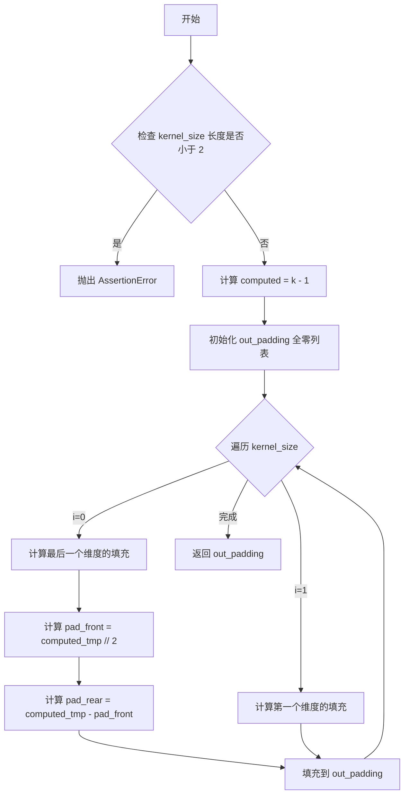

#### 带注释源码

```
def _compute_padding(kernel_size):
    """Compute padding tuple."""
    # 4 or 6 ints:  (padding_left, padding_right,padding_top,padding_bottom)
    # https://pytorch.org/docs/stable/nn.html#torch.nn.functional.pad
    
    # 输入验证：kernel_size 至少需要2个元素（高和宽）
    if len(kernel_size) < 2:
        raise AssertionError(kernel_size)
    
    # 计算每个维度需要的填充量：kernel_size - 1
    computed = [k - 1 for k in kernel_size]

    # 对于偶数卷积核，需要使用非对称填充
    # 初始化填充列表，长度为 2 * len(kernel_size)
    out_padding = 2 * len(kernel_size) * [0]

    # 遍历每个维度，计算前后方向的填充
    for i in range(len(kernel_size)):
        # 从后往前取 computed 值
        computed_tmp = computed[-(i + 1)]

        # 前向填充：取整除以2
        pad_front = computed_tmp // 2
        # 后向填充：减去前向填充，剩余部分
        pad_rear = computed_tmp - pad_front

        # 填充到对应位置（偶数索引为前，奇数索引为后）
        out_padding[2 * i + 0] = pad_front
        out_padding[2 * i + 1] = pad_rear

    return out_padding
```


### `_filter2d`

对输入图像张量进行2D卷积滤波的内部函数，通过将滤波核扩展到与输入通道数匹配并进行分组卷积来实现高效的图像滤波操作。

参数：

- `input`：`torch.Tensor`，输入的图像张量，形状为 `[batch, channels, height, width]`
- `kernel`：`torch.Tensor`，滤波核张量，形状为 `[batch, kernel_height, kernel_width]`

返回值：`torch.Tensor`，滤波后的图像张量，形状与输入相同 `[batch, channels, height, width]`

#### 流程图

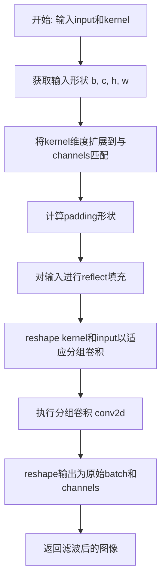

#### 带注释源码

```python
def _filter2d(input, kernel):
    """
    对输入图像进行2D卷积滤波
    
    参数:
        input: 输入图像张量 [batch, channels, height, width]
        kernel: 滤波核 [batch, kernel_height, kernel_width]
    返回:
        滤波后的图像 [batch, channels, height, width]
    """
    # 获取输入的批量大小、通道数、高度和宽度
    b, c, h, w = input.shape
    
    # 将kernel从 [batch, kh, kw] 扩展为 [batch, channels, kh, kw]
    # 使得每个通道使用相同的核进行滤波
    tmp_kernel = kernel[:, None, ...].to(device=input.device, dtype=input.dtype)
    tmp_kernel = tmp_kernel.expand(-1, c, -1, -1)

    # 获取核的高度和宽度
    height, width = tmp_kernel.shape[-2:]

    # 计算需要填充的像素数量，用于保持输出尺寸与输入相同
    padding_shape: list[int] = _compute_padding([height, width])
    
    # 对输入进行对称反射填充，避免边缘效应
    input = torch.nn.functional.pad(input, padding_shape, mode="reflect")

    # 将kernel reshape为 [batch*channels, 1, kh, kw] 格式
    # 将input reshape为 [batch*channels, 1, h, w] 格式
    # 以便进行分组卷积
    tmp_kernel = tmp_kernel.reshape(-1, 1, height, width)
    input = input.view(-1, tmp_kernel.size(0), input.size(-2), input.size(-1))

    # 执行分组卷积，每个通道独立进行卷积
    # groups=tmp_kernel.size(0) 意味着分成 batch*c 个组
    output = torch.nn.functional.conv2d(input, tmp_kernel, groups=tmp_kernel.size(0), padding=0, stride=1)

    # 将输出reshape回 [batch, channels, height, width]
    out = output.view(b, c, h, w)
    return out
```


### `_gaussian`

生成一维高斯核函数，用于高斯模糊操作。该函数根据窗口大小和标准差生成归一化的高斯权重向量，常用于图像处理中的高斯滤波操作。

参数：

- `window_size`：`int`，高斯核的窗口大小（奇数），决定了核的长度
- `sigma`：`float` 或 `torch.Tensor`，高斯核的标准差，可以是单个浮点数或批量张量

返回值：`torch.Tensor`，形状为 (batch_size, window_size) 的归一化高斯核张量

#### 流程图

```mermaid
flowchart TD
    A[开始: _gaussian] --> B{sigma是否为float?}
    B -->|是| C[将sigma转换为torch.tensor]
    B -->|否| D[保持sigma为tensor]
    C --> E[获取batch_size]
    D --> E
    E --> F[生成坐标向量x: arange从-window_size//2到window_size//2]
    F --> G[使用expand将x扩展到batch_size维度]
    G --> H{window_size是否为偶数?}
    H -->|是| I[坐标x加0.5进行偏移]
    H -->|否| J[跳过偏移]
    I --> K[计算高斯值: exp(-x²/2σ²)]
    J --> K
    K --> L[归一化: gauss / gauss.sum]
    L --> M[返回归一化后的高斯核]
```

#### 带注释源码

```python
def _gaussian(window_size: int, sigma):
    """
    生成一维高斯核函数。
    
    Args:
        window_size: 高斯窗口大小，必须为整数
        sigma: 标准差，可以是float或torch.Tensor
    
    Returns:
        归一化的高斯核张量，形状为 (batch_size, window_size)
    """
    # 如果sigma是浮点数，转换为1x1的tensor，便于后续批量处理
    if isinstance(sigma, float):
        sigma = torch.tensor([[sigma]])

    # 获取batch_size，用于后续扩展
    batch_size = sigma.shape[0]

    # 生成坐标向量：从 -window_size//2 到 window_size//2
    # 例如window_size=5时，生成 [-2, -1, 0, 1, 2]
    x = (torch.arange(window_size, device=sigma.device, dtype=sigma.dtype) - window_size // 2).expand(batch_size, -1)

    # 对于偶数窗口大小，需要进行0.5的偏移以保证对称性
    # 这是因为偶数窗口没有中心像素，需要偏移以保持对称
    if window_size % 2 == 0:
        x = x + 0.5

    # 计算高斯函数值：exp(-x² / (2σ²))
    gauss = torch.exp(-x.pow(2.0) / (2 * sigma.pow(2.0)))

    # 归一化：确保高斯核所有元素之和为1
    return gauss / gauss.sum(-1, keepdim=True)
```


### `_gaussian_blur2d`

该函数实现了2D高斯模糊，通过分离x和y方向的高斯核进行两次1D卷积来实现高效的图像模糊处理。函数首先根据kernel_size和sigma生成可分离的高斯核，然后使用`_filter2d`函数依次在x和y方向进行卷积。

参数：

- `input`：`torch.Tensor`，输入图像张量，形状为 `[batch, channels, height, width]`
- `kernel_size`：`tuple` 或 `list`，高斯卷积核的大小，格式为 `(kernel_height, kernel_width)`
- `sigma`：`float`、`tuple` 或 `torch.tensor`，高斯核的标准差，控制模糊程度

返回值：`torch.Tensor`，经过高斯模糊处理后的输出张量，形状与输入相同

#### 流程图

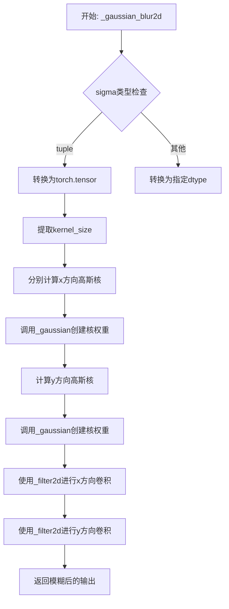

#### 带注释源码

```python
def _gaussian_blur2d(input, kernel_size, sigma):
    """
    2D高斯模糊实现函数。
    
    该函数通过分离x和y方向的高斯核进行两次1D卷积来实现高效的图像模糊处理。
    分离卷积相比直接进行2D卷积具有更好的计算效率。
    
    Args:
        input: 输入图像张量，形状为 [batch, channels, height, width]
        kernel_size: 高斯卷积核大小，格式为 (height, width)
        sigma: 高斯核标准差，可以是浮点数、元组或张量
    
    Returns:
        经过高斯模糊处理的输出张量，形状与输入相同
    """
    # 处理sigma参数：如果sigma是元组，转换为张量；否则确保dtype与input一致
    if isinstance(sigma, tuple):
        sigma = torch.tensor([sigma], dtype=input.dtype)
    else:
        sigma = sigma.to(dtype=input.dtype)

    # 从kernel_size提取卷积核的高度和宽度
    ky, kx = int(kernel_size[0]), int(kernel_size[1])
    
    # 获取batch大小，用于分别生成每个样本的高斯核
    bs = sigma.shape[0]
    
    # 生成x方向的高斯核
    # sigma[:, 1] 提取每个样本在x方向的标准差
    # view(bs, 1) 调整形状以匹配batch维度
    kernel_x = _gaussian(kx, sigma[:, 1].view(bs, 1))
    
    # 生成y方向的高斯核
    # sigma[:, 0] 提取每个样本在y方向的标准差
    kernel_y = _gaussian(ky, sigma[:, 0].view(bs, 1))
    
    # 先在x方向进行卷积滤波
    # kernel_x[..., None, :] 添加维度以便与多通道图像进行分组卷积
    out_x = _filter2d(input, kernel_x[..., None, :])
    
    # 再在y方向进行卷积滤波
    # kernel_y[..., None] 添加维度以便进行分组卷积
    out = _filter2d(out_x, kernel_y[..., None])

    return out
```


### `StableVideoDiffusionPipeline.__init__`

这是 Stable Video Diffusion 管道（Pipeline）的初始化方法，负责接收并注册所有必需的模型组件（VAE、图像编码器、UNet、调度器和特征提取器），并初始化视频处理器和相关配置参数。

参数：

- `vae`：`AutoencoderKLTemporalDecoder`，用于将图像编码到潜在空间并从潜在空间解码回图像的变分自编码器模型
- `image_encoder`：`CLIPVisionModelWithProjection`，冻结的 CLIP 图像编码器，用于从输入图像提取视觉嵌入向量
- `unet`：`UNetSpatioTemporalConditionModel`，时空条件 UNet 模型，用于对编码后的图像潜在表示进行去噪
- `scheduler`：`EulerDiscreteScheduler`，调度器，用于在去噪过程中逐步调整噪声时间步
- `feature_extractor`：`CLIPImageProcessor`，CLIP 图像处理器，用于从生成的图像中提取特征

返回值：`None`，该方法为构造函数，不返回任何值，仅初始化对象状态

#### 流程图

```mermaid
flowchart TD
    A[开始 __init__] --> B[调用父类 DiffusionPipeline.__init__]
    B --> C[register_modules: 注册 vae]
    C --> D[register_modules: 注册 image_encoder]
    D --> E[register_modules: 注册 unet]
    E --> F[register_modules: 注册 scheduler]
    F --> G[register_modules: 注册 feature_extractor]
    G --> H{self.vae 是否存在?}
    H -->|是| I[计算 vae_scale_factor: 2^(len(vae.config.block_out_channels) - 1)]
    H -->|否| J[设置 vae_scale_factor = 8]
    I --> K[创建 VideoProcessor]
    J --> K
    K --> L[结束 __init__]
```

#### 带注释源码

```
def __init__(
    self,
    vae: AutoencoderKLTemporalDecoder,
    image_encoder: CLIPVisionModelWithProjection,
    unet: UNetSpatioTemporalConditionModel,
    scheduler: EulerDiscreteScheduler,
    feature_extractor: CLIPImageProcessor,
):
    """
    初始化 Stable Video Diffusion Pipeline
    
    参数:
        vae: 变分自编码器，用于图像到潜在空间的编码和解码
        image_encoder: CLIP 视觉模型，用于提取图像条件嵌入
        unet: 时空条件去噪网络
        scheduler: 离散欧拉调度器
        feature_extractor: CLIP 图像预处理处理器
    """
    # 调用父类 DiffusionPipeline 的初始化方法
    # 父类负责基础框架的初始化工作
    super().__init__()

    # 使用 register_modules 方法注册所有模型组件
    # 该方法来自 DiffusionPipeline 基类，会将各组件赋值给实例属性
    # 并支持后续的模型移动（to(device)）和模型卸载（from_pretrained 等）
    self.register_modules(
        vae=vae,
        image_encoder=image_encoder,
        unet=unet,
        scheduler=scheduler,
        feature_extractor=feature_extractor,
    )
    
    # 计算 VAE 的缩放因子
    # VAE 的缩放因子通常为 2^(num_layers-1)，用于调整潜在空间的尺寸
    # 例如：对于 3 层编码器，scale_factor = 2^2 = 4
    # 该因子用于在图像预处理时计算正确的目标尺寸
    self.vae_scale_factor = 2 ** (len(self.vae.config.block_out_channels) - 1) if getattr(self, "vae", None) else 8
    
    # 创建视频处理器
    # VideoProcessor 负责：
    # - PIL 图像与 NumPy 数组之间的转换
    # - PyTorch 张量与 PIL 图像之间的转换
    # - 根据 vae_scale_factor 进行图像尺寸调整
    self.video_processor = VideoProcessor(do_resize=True, vae_scale_factor=self.vae_scale_factor)
```


### `StableVideoDiffusionPipeline._encode_image`

该方法负责将输入图像编码为 CLIP 图像嵌入向量，用于条件引导视频生成。它首先对输入图像进行预处理（归一化、调整大小、CLIP标准化），然后通过预训练的 CLIP 图像编码器提取特征，最后根据是否启用无分类器自由guidance对嵌入进行复制和拼接处理。

参数：

- `image`：`PipelineImageInput`，输入的图像，可以是 PIL.Image、List[PIL.Image] 或 torch.Tensor
- `device`：`str | torch.device`，用于计算的目标设备
- `num_videos_per_prompt`：`int`，每个提示词生成的视频数量，用于复制图像嵌入
- `do_classifier_free_guidance`：`bool`，是否启用无分类器自由guidance，若为true则需要生成负样本嵌入

返回值：`torch.Tensor`，编码后的图像嵌入向量，形状为 `(batch_size * num_videos_per_prompt * (2 if cfg else 1), seq_len, embed_dim)`

#### 流程图

```mermaid
flowchart TD
    A[开始 _encode_image] --> B[获取 image_encoder 的 dtype]
    B --> C{image 是否为 torch.Tensor?}
    C -->|否| D[使用 video_processor 将 PIL 转为 numpy 再转为 pt]
    C -->|是| E[跳过转换]
    D --> E
    E --> F[图像归一化: image = image * 2.0 - 1.0]
    F --> G[使用 _resize_with_antialiasing 调整大小到 224x224]
    G --> H[图像反归一化: image = (image + 1.0) / 2.0]
    H --> I[使用 feature_extractor 进行 CLIP 标准化]
    I --> J[将图像数据移动到 device 并转换为 dtype]
    J --> K[通过 image_encoder 获取 image_embeds]
    K --> L[在维度1添加单例维度: unsqueeze(1)]
    L --> M[复制嵌入: repeat(1, num_videos_per_prompt, 1)]
    M --> N[重塑嵌入: view(bs_embed * num_videos_per_prompt, seq_len, -1)]
    N --> O{do_classifier_free_guidance?}
    O -->|是| P[创建零张量 negative_image_embeddings]
    O -->|否| Q[跳过负样本创建]
    P --> R[拼接: torch.cat([negative_image_embeddings, image_embeddings], dim=0)]
    Q --> S[返回 image_embeddings]
    R --> S
```

#### 带注释源码

```python
def _encode_image(
    self,
    image: PipelineImageInput,
    device: str | torch.device,
    num_videos_per_prompt: int,
    do_classifier_free_guidance: bool,
) -> torch.Tensor:
    # 获取图像编码器的参数数据类型（通常为 float16 或 float32）
    dtype = next(self.image_encoder.parameters()).dtype

    # 如果输入不是 PyTorch 张量，则从 PIL 图像转换
    if not isinstance(image, torch.Tensor):
        # 使用视频处理器将 PIL 图像转换为 numpy 数组
        image = self.video_processor.pil_to_numpy(image)
        # 将 numpy 数组转换为 PyTorch 张量
        image = self.video_processor.numpy_to_pt(image)

        # 为了匹配原始实现，先归一化图像，然后再调整大小
        # 调整大小后再反归一化
        # 图像归一化到 [-1, 1] 范围
        image = image * 2.0 - 1.0
        # 使用抗锯齿调整到 CLIP 要求的 224x224
        image = _resize_with_antialiasing(image, (224, 224))
        # 反归一化回 [0, 1] 范围
        image = (image + 1.0) / 2.0

    # 使用 CLIP 特征提取器进行标准化
    # 这是 CLIP 模型要求的标准化方式
    image = self.feature_extractor(
        images=image,
        do_normalize=True,     # 启用标准化
        do_center_crop=False,  # 不使用中心裁剪
        do_resize=False,       # 不调整大小（已在前面处理）
        do_rescale=False,      # 不重缩放
        return_tensors="pt",   # 返回 PyTorch 张量
    ).pixel_values

    # 将图像数据移动到指定设备并转换为正确的数据类型
    image = image.to(device=device, dtype=dtype)
    
    # 通过 CLIP 图像编码器获取图像嵌入
    image_embeddings = self.image_encoder(image).image_embeds
    # 在序列维度前添加一个维度，便于后续广播操作
    image_embeddings = image_embeddings.unsqueeze(1)

    # 为每个提示词生成多个视频复制图像嵌入
    # 使用 MPS 友好的方法进行复制
    bs_embed, seq_len, _ = image_embeddings.shape
    # 复制 num_videos_per_prompt 次
    image_embeddings = image_embeddings.repeat(1, num_videos_per_prompt, 1)
    # 重塑为 (batch_size * num_videos_per_prompt, seq_len, embed_dim)
    image_embeddings = image_embeddings.view(bs_embed * num_videos_per_prompt, seq_len, -1)

    # 如果启用无分类器自由 guidance，需要生成负样本
    if do_classifier_free_guidance:
        # 创建与图像嵌入形状相同的零张量作为无条件嵌入
        negative_image_embeddings = torch.zeros_like(image_embeddings)

        # 为了避免两次前向传播，将无条件嵌入和条件嵌入拼接在一起
        # 前面一半是无条件（零）嵌入，后面一半是条件嵌入
        # 在推理时通过 chunk(2) 分离
        image_embeddings = torch.cat([negative_image_embeddings, image_embeddings])

    return image_embeddings
```


### `StableVideoDiffusionPipeline._encode_vae_image`

该方法使用变分自编码器（VAE）将预处理后的输入图像编码为潜在空间表示，并根据`num_videos_per_prompt`参数复制潜在变量以支持批量生成，同时在启用无分类器指导时添加零潜在变量以实现双通道前向传播。

参数：

- `image`：`torch.Tensor`，输入的图像张量，通常是经过预处理的图像数据
- `device`：`str | torch.device`，计算设备（CPU 或 CUDA 等）
- `num_videos_per_prompt`：`int`，每个提示词生成的视频数量，用于复制潜在变量
- `do_classifier_free_guidance`：`bool`，是否启用无分类器指导，启用时会在潜在空间中拼接零张量

返回值：`torch.Tensor`，编码后的图像潜在表示，形状根据批量大小和图像尺寸而定

#### 流程图

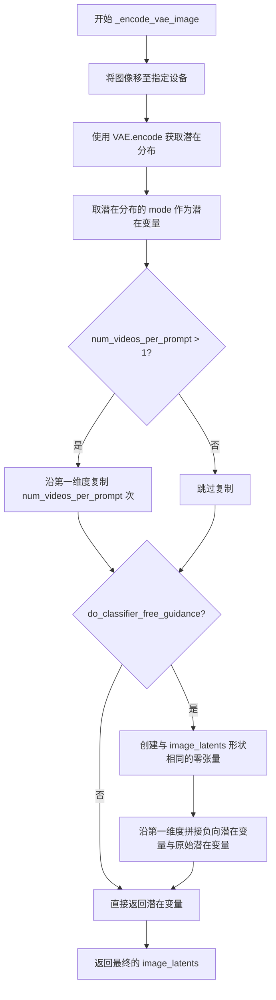

#### 带注释源码

```python
def _encode_vae_image(
    self,
    image: torch.Tensor,
    device: str | torch.device,
    num_videos_per_prompt: int,
    do_classifier_free_guidance: bool,
):
    # 将输入图像张量移动到指定的计算设备上
    image = image.to(device=device)
    
    # 使用 VAE 的 encode 方法将图像编码为潜在空间表示
    # 返回 latent_dist 对象，我们取其 mode（众数）作为确定性编码
    image_latents = self.vae.encode(image).latent_dist.mode()

    # 为每个提示词生成多个视频复制潜在变量
    # 使用 MPS 友好的方法沿第一维度（批量维度）复制
    # 复制后的形状: [batch * num_videos_per_prompt, channels, height, width]
    image_latents = image_latents.repeat(num_videos_per_prompt, 1, 1, 1)

    # 如果启用无分类器指导，需要创建负向（无条件）潜在变量
    if do_classifier_free_guidance:
        # 创建与 image_latens 形状相同的零张量作为负向嵌入
        negative_image_latents = torch.zeros_like(image_latents)

        # 为了避免执行两次前向传播，我们将无条件和有条件潜在变量
        # 在批量维度上拼接，使第一次前向传播同时计算两种情况
        # 拼接后形状: [batch * 2 * num_videos_per_prompt, channels, height, width]
        image_latents = torch.cat([negative_image_latents, image_latents])

    # 返回编码后的图像潜在变量
    return image_latents
```


### `StableVideoDiffusionPipeline._get_add_time_ids`

该方法用于构建并返回视频扩散模型所需的额外时间嵌入向量（Additional Time IDs），这些向量包含了帧率、运动桶ID和噪声增强强度等条件信息，用于条件化 UNet 模型的时序生成过程。方法还会验证生成的嵌入维度是否与模型配置期望的维度匹配，以确保兼容性。

参数：

- `fps`：`int`，目标帧率，用于控制生成视频的帧率
- `motion_bucket_id`：`int`，运动桶ID，用于控制生成视频中的运动量，数值越高表示运动越多
- `noise_aug_strength`：`float`，噪声增强强度，用于控制在初始图像上添加的噪声量
- `dtype`：`torch.dtype`，张量的数据类型（如 torch.float16）
- `batch_size`：`int`，批次大小，即一次生成的视频数量
- `num_videos_per_prompt`：`int`，每个提示词生成的视频数量
- `do_classifier_free_guidance`：`bool`，是否启用无分类器引导（CFG），启用时会复制时间ID以匹配CFG的两个分支

返回值：`torch.Tensor`，形状为 `[batch_size * num_videos_per_prompt * (1 + do_classifier_free_guidance), 3]` 的时间嵌入张量

#### 流程图

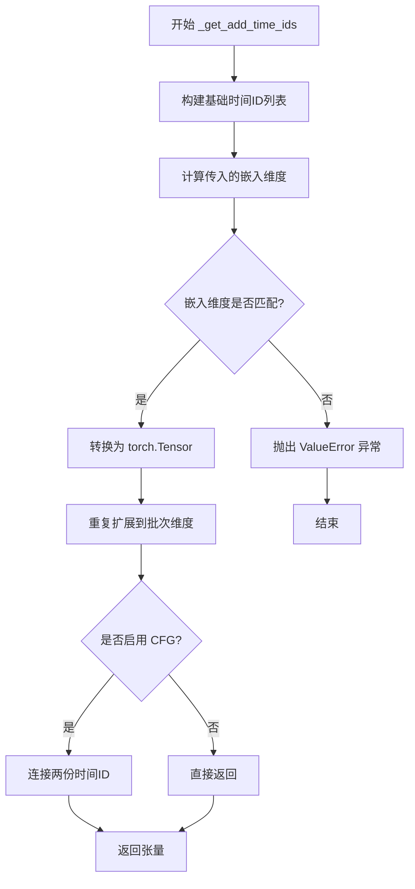

#### 带注释源码

```python
def _get_add_time_ids(
    self,
    fps: int,
    motion_bucket_id: int,
    noise_aug_strength: float,
    dtype: torch.dtype,
    batch_size: int,
    num_videos_per_prompt: int,
    do_classifier_free_guidance: bool,
):
    # 步骤1: 将三个时间相关参数组合成列表
    # 这些参数控制视频生成的时序特性：帧率、运动量、噪声增强
    add_time_ids = [fps, motion_bucket_id, noise_aug_strength]

    # 步骤2: 计算传入的时间嵌入维度
    # UNet 配置中的 addition_time_embed_dim 乘以参数数量（3个）
    passed_add_embed_dim = self.unet.config.addition_time_embed_dim * len(add_time_ids)
    # 获取 UNet 模型第一个线性层期望的输入特征维度
    expected_add_embed_dim = self.unet.add_embedding.linear_1.in_features

    # 步骤3: 验证嵌入维度是否与模型期望一致
    # 如果不匹配，说明模型配置可能有误，抛出异常
    if expected_add_embed_dim != passed_add_embed_dim:
        raise ValueError(
            f"Model expects an added time embedding vector of length {expected_add_embed_dim}, but a vector of {passed_add_embed_dim} was created. The model has an incorrect config. Please check `unet.config.time_embedding_type` and `text_encoder_2.config.projection_dim`."
        )

    # 步骤4: 将列表转换为 PyTorch 张量
    # 形状: [1, 3] - 包含3个时间参数的一维向量
    add_time_ids = torch.tensor([add_time_ids], dtype=dtype)

    # 步骤5: 扩展张量到批次维度
    # 复制以匹配批次大小和每个提示生成的视频数量
    # 形状: [batch_size * num_videos_per_prompt, 3]
    add_time_ids = add_time_ids.repeat(batch_size * num_videos_per_prompt, 1)

    # 步骤6: 如果启用无分类器引导（CFG）
    # 需要为无条件分支和条件分支各准备一份时间ID
    # 结果形状: [2 * batch_size * num_videos_per_prompt, 3]
    if do_classifier_free_guidance:
        add_time_ids = torch.cat([add_time_ids, add_time_ids])

    # 返回最终的时间嵌入张量
    return add_time_ids
```


### `StableVideoDiffusionPipeline.decode_latents`

该方法负责将 VAE 潜在表示解码为实际视频帧。通过分块解码策略避免内存溢出，并对输出进行形状重排以符合预期的视频张量格式。

参数：

- `self`：`StableVideoDiffusionPipeline` 实例本身
- `latents`：`torch.Tensor`，潜在表示张量，形状为 `[batch, frames, channels, height, width]`，需要解码的 VAE 潜在变量
- `num_frames`：`int`，视频的总帧数，用于最终输出形状的重排
- `decode_chunk_size`：`int = 14`，每次解码的帧块大小，用于控制内存使用，默认为 14

返回值：`torch.Tensor`，解码后的视频帧，形状为 `[batch, channels, frames, height, width]` 的 float32 类型张量

#### 流程图

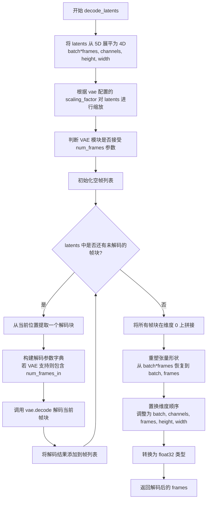

#### 带注释源码

```
def decode_latents(self, latents: torch.Tensor, num_frames: int, decode_chunk_size: int = 14):
    # 将 [batch, frames, channels, height, width] 展平为 [batch*frames, channels, height, width]
    # 这样可以将所有帧作为批量进行处理
    latents = latents.flatten(0, 1)

    # 根据 VAE 的缩放因子对潜在表示进行反标准化
    # 这是 VAE 编码的逆操作
    latents = 1 / self.vae.config.scaling_factor * latents

    # 获取 VAE 的前向传播函数
    # 如果 VAE 被 torch.compile 编译过，使用 _orig_mod，否则使用普通的 forward
    forward_vae_fn = self.vae._orig_mod.forward if is_compiled_module(self.vae) else self.vae.forward
    
    # 检查 VAE 的 decode 方法是否接受 num_frames 参数
    # 不同版本的 VAE 可能支持不同的参数
    accepts_num_frames = "num_frames" in set(inspect.signature(forward_vae_fn).parameters.keys())

    # 分块解码以避免内存溢出 (OOM)
    # 一次性解码大量帧可能导致显存不足
    frames = []
    for i in range(0, latents.shape[0], decode_chunk_size):
        # 计算当前块的帧数
        num_frames_in = latents[i : i + decode_chunk_size].shape[0]
        decode_kwargs = {}
        
        # 如果 VAE 支持 num_frames 参数，则传递当前块的帧数
        if accepts_num_frames:
            # 只在 VAE 期望该参数时才传递
            decode_kwargs["num_frames"] = num_frames_in

        # 解码当前帧块并获取采样结果
        frame = self.vae.decode(latents[i : i + decode_chunk_size], **decode_kwargs).sample
        frames.append(frame)
    
    # 将所有解码的帧块在维度 0 上拼接起来
    frames = torch.cat(frames, dim=0)

    # 将 [batch*frames, channels, height, width] 重塑为 [batch, channels, frames, height, width]
    # 首先恢复 batch 维度，然后保留 num_frames 维度
    frames = frames.reshape(-1, num_frames, *frames.shape[1:]).permute(0, 2, 1, 3, 4)

    # 始终转换为 float32，因为这种方法不会造成显著开销
    # 并且与 bfloat16 兼容
    frames = frames.float()
    return frames
```


### `StableVideoDiffusionPipeline.check_inputs`

该方法用于验证输入图像和尺寸参数是否符合管道要求，确保图像类型正确且尺寸可被8整除，以满足VAE和UNet的输入约束。

参数：

- `image`：`PipelineImageInput`（`torch.Tensor` | `PIL.Image.Image` | `list[PIL.Image.Image]`），输入的引导图像，用于生成视频
- `height`：`int`，生成的视频高度（像素），必须是8的倍数
- `width`：`int`，生成的视频宽度（像素），必须是8的倍数

返回值：`None`，该方法仅进行参数验证，不返回任何值

#### 流程图

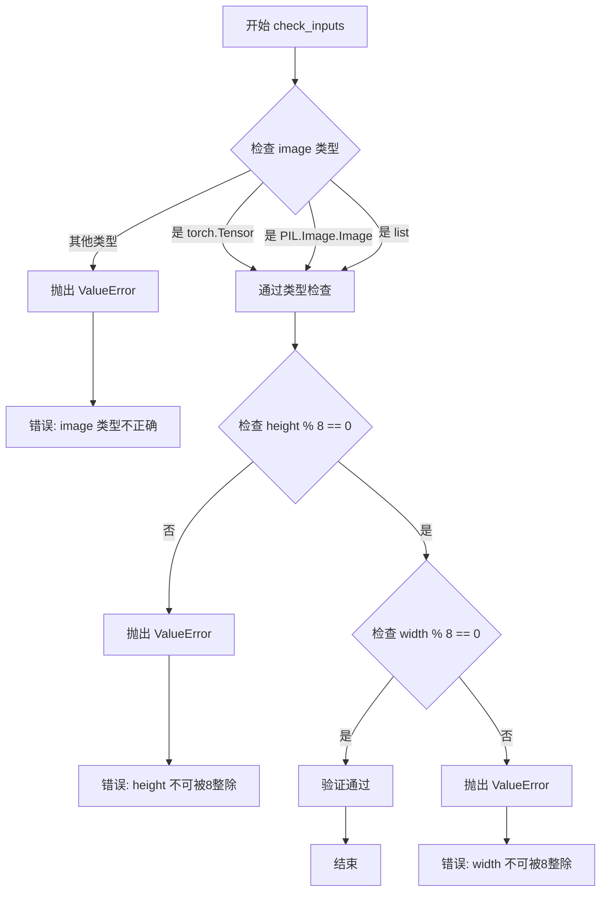

#### 带注释源码

```python
def check_inputs(self, image, height, width):
    """
    验证输入参数的有效性。
    
    检查输入图像的类型是否受支持（torch.Tensor、PIL.Image.Image 或列表），
    以及生成图像的尺寸是否可被8整除（VAE的下采样因子要求）。
    
    Args:
        image: 输入的引导图像，可以是 PyTorch 张量、PIL 图像或图像列表
        height: 期望输出的高度（像素）
        width: 期望输出的宽度（像素）
    
    Raises:
        ValueError: 当 image 类型不支持或尺寸不能被8整除时
    """
    # 检查 image 是否为支持的类型：torch.Tensor、PIL.Image.Image 或 list
    if (
        not isinstance(image, torch.Tensor)
        and not isinstance(image, PIL.Image.Image)
        and not isinstance(image, list)
    ):
        raise ValueError(
            "`image` has to be of type `torch.Tensor` or `PIL.Image.Image` or `list[PIL.Image.Image]` but is"
            f" {type(image)}"
        )

    # 验证高度和宽度是否可被8整除（VAE的2^3下采样因子要求）
    if height % 8 != 0 or width % 8 != 0:
        raise ValueError(f"`height` and `width` have to be divisible by 8 but are {height} and {width}.")
```


### `StableVideoDiffusionPipeline.prepare_latents`

该方法用于为视频扩散模型准备初始潜在变量（latents）。它根据批次大小、帧数、通道数和图像尺寸构建潜在张量形状，如果未提供预生成的潜在变量，则使用随机噪声初始化，并结合调度器的初始噪声标准差进行缩放。

参数：

- `self`：`StableVideoDiffusionPipeline` 实例本身
- `batch_size`：`int`，生成的视频批次大小
- `num_frames`：`int`，要生成的视频帧数
- `num_channels_latents`：`int`，潜在变量的通道数（通常为 UNet 的输入通道数）
- `height`：`int`，生成图像的高度（像素）
- `width`：`int`，生成图像的宽度（像素）
- `dtype`：`torch.dtype`，潜在张量的数据类型（如 `torch.float16`）
- `device`：`str | torch.device`，计算设备（如 `"cuda"` 或 `torch.device("cuda")`）
- `generator`：`torch.Generator`，用于生成确定性随机数的 PyTorch 随机生成器
- `latents`：`torch.Tensor | None`，可选的预生成潜在变量；若为 `None`，则随机生成

返回值：`torch.Tensor`，处理后的潜在变量张量，形状为 `(batch_size, num_frames, num_channels_latents // 2, height // vae_scale_factor, width // vae_scale_factor)`

#### 流程图

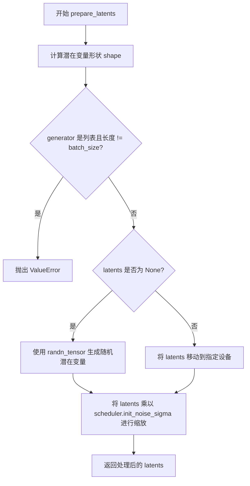

#### 带注释源码

```python
def prepare_latents(
    self,
    batch_size: int,
    num_frames: int,
    num_channels_latents: int,
    height: int,
    width: int,
    dtype: torch.dtype,
    device: str | torch.device,
    generator: torch.Generator,
    latents: torch.Tensor | None = None,
):
    # 计算潜在变量的形状
    # 形状维度: [batch_size, num_frames, channels, height/vae_scale, width/vae_scale]
    # 注意: num_channels_latents // 2 是因为潜在空间通常下采样因子为2
    shape = (
        batch_size,
        num_frames,
        num_channels_latents // 2,
        height // self.vae_scale_factor,
        width // self.vae_scale_factor,
    )
    
    # 验证生成器列表长度与批次大小是否匹配
    if isinstance(generator, list) and len(generator) != batch_size:
        raise ValueError(
            f"You have passed a list of generators of length {len(generator)}, but requested an effective batch"
            f" size of {batch_size}. Make sure the batch size matches the length of the generators."
        )

    # 如果没有提供预生成的潜在变量，则随机生成
    if latents is None:
        latents = randn_tensor(shape, generator=generator, device=device, dtype=dtype)
    else:
        # 如果提供了潜在变量，确保其位于正确的设备上
        latents = latents.to(device)

    # 使用调度器的初始噪声标准差对潜在变量进行缩放
    # 这是扩散模型的关键步骤，确保初始噪声与调度器的噪声调度策略一致
    latents = latents * self.scheduler.init_noise_sigma
    
    return latents
```


### `StableVideoDiffusionPipeline.__call__`

这是 Stable Video Diffusion 管道的主调用方法，用于将输入图像转换为视频序列。该方法执行完整的视频生成流程，包括图像编码、潜在变量初始化、去噪循环和最终的视频解码。

参数：

- `image`：`PIL.Image.Image | list[PIL.Image.Image] | torch.Tensor`，用于引导视频生成的输入图像。如果提供张量，期望值范围在 [0, 1] 之间。
- `height`：`int`，可选，默认为 576（`self.unet.config.sample_size * self.vae_scale_factor`），生成图像的高度（像素）。
- `width`：`int`，可选，默认为 1024（`self.unet.config.sample_size * self.vae_scale_factor`），生成图像的宽度（像素）。
- `num_frames`：`int | None`，可选，要生成的视频帧数。默认为 `self.unet.config.num_frames`（14 用于 `stable-video-diffusion-img2vid`，25 用于 `stable-video-diffusion-img2vid-xt`）。
- `num_inference_steps`：`int`，可选，默认为 25，去噪步骤数。更多去噪步骤通常会带来更高质量的视频，但推理速度较慢。
- `sigmas`：`list[float] | None`，可选，自定义 sigmas 用于支持 sigmas 参数的调度器的去噪过程。
- `min_guidance_scale`：`float`，可选，默认为 1.0，用于第一帧的分类器自由引导的最小引导比例。
- `max_guidance_scale`：`float`，可选，默认为 3.0，用于最后一帧的分类器自由引导的最大引导比例。
- `fps`：`int`，可选，默认为 7，每秒帧数。生成后导出的视频帧率。注意：Stable Diffusion Video 的 UNet 在训练时基于 fps-1 进行微调。
- `motion_bucket_id`：`int`，可选，默认为 127，用于条件化生成的运动量。数字越高，视频中运动越多。
- `noise_aug_strength`：`float`，可选，默认为 0.02，添加到初始图像的噪声量，值越高视频越不像初始图像。
- `decode_chunk_size`：`int | None`，可选，一次解码的帧数。较高的分块大小带来更好的时间一致性，但内存使用更高。默认情况下，解码器一次解码所有帧以获得最高质量。
- `num_videos_per_prompt`：`int | optional`，可选，默认为 1，每个提示生成的视频数量。
- `generator`：`torch.Generator | list[torch.Generator] | None`，可选，用于使生成确定性的 PyTorch 生成器。
- `latents`：`torch.Tensor | None`，可选，预生成的噪声潜在变量，可用于使用不同提示调整相同生成。如果未提供，将使用提供的随机生成器生成潜在张量。
- `output_type`：`str | None`，可选，默认为 `"pil"`，生成图像的输出格式。可选择 `pil`、`np` 或 `pt`。
- `callback_on_step_end`：`Callable | None`，可选，在推理过程中每个去噪步骤结束时调用的函数。
- `callback_on_step_end_tensor_inputs`：`list[str]`，可选，默认为 `["latents"]`，`callback_on_step_end` 函数的张量输入列表。
- `return_dict`：`bool`，可选，默认为 `True`，是否返回 `StableVideoDiffusionPipelineOutput` 而不是元组。

返回值：`StableVideoDiffusionPipelineOutput | tuple`，如果 `return_dict` 为 `True`，返回 `StableVideoDiffusionPipelineOutput`，否则返回帧列表（`list[list[PIL.Image.Image]]` 或 `np.ndarray` 或 `torch.Tensor`）。

#### 流程图

```mermaid
flowchart TD
    A[开始 __call__] --> B[1. 设置默认高度和宽度]
    B --> C[2. 检查输入参数]
    C --> D[3. 定义调用参数<br/>确定 batch_size 和 device]
    D --> E[4. 编码输入图像<br/>调用 _encode_image]
    E --> F[5. 调整 fps 值<br/>fps = fps - 1]
    F --> G[6. 预处理输入图像<br/>使用 video_processor]
    G --> H[7. 添加噪声到图像<br/>image + noise_aug_strength * noise]
    H --> I[8. VAE 上_cast处理<br/>如需要]
    I --> J[9. 编码 VAE 图像<br/>调用 _encode_vae_image]
    J --> K[10. 扩展 image_latents<br/>匹配 num_frames]
    K --> L[11. 获取添加的时间 ID<br/>调用 _get_add_time_ids]
    L --> M[12. 准备时间步<br/>调用 retrieve_timesteps]
    M --> N[13. 准备潜在变量<br/>调用 prepare_latents]
    N --> O[14. 准备引导比例<br/>在 min 和 max 之间线性插值]
    O --> P[15. 去噪循环]
    P --> Q{当前步骤 <br/>num_inference_steps?}
    Q -->|是| R[扩展潜在变量<br/>进行分类器自由引导]
    R --> S[调度器缩放模型输入]
    S --> T[连接 image_latents<br/>在通道维度]
    T --> U[UNet 预测噪声残差]
    U --> V{进行分类器<br/>自由引导?}
    V -->|是| W[分割噪声预测<br/>计算引导后的噪声]
    V -->|否| X
    W --> X[调度器步骤计算<br/>上一时刻的潜在变量]
    X --> Y{callback_on_step_end<br/>已定义?}
    Y -->|是| Z[调用回调函数<br/>更新 latents]
    Y -->|否| AA[更新进度条]
    Z --> AA
    AA --> AB{XLA 可用?}
    AB -->|是| AC[xm.mark_step]
    AB -->|否| AD
    AC --> AD
    AD --> AE{还有更多<br/>时间步?}
    AE -->|是| P
    AE -->|否| AF{output_type ==<br/>'latent'?}
    AF -->|是| AG[返回 latents]
    AF -->|否| AH[VAE 恢复到 fp16<br/>如需要]
    AH --> AI[解码潜在变量<br/>调用 decode_latents]
    AI --> AJ[后处理视频<br/>调用 video_processor.postprocess_video]
    AJ --> AK[释放模型钩子]
    AK --> AL{return_dict?]
    AL -->|是| AM[返回 StableVideoDiffusionPipelineOutput]
    AL -->|否| AN[返回 frames 元组]
    AM --> AO[结束]
    AN --> AO
    AG --> AO
```

#### 带注释源码

```python
@torch.no_grad()
@replace_example_docstring(EXAMPLE_DOC_STRING)
def __call__(
    self,
    image: PIL.Image.Image | list[PIL.Image.Image] | torch.Tensor,
    height: int = 576,
    width: int = 1024,
    num_frames: int | None = None,
    num_inference_steps: int = 25,
    sigmas: list[float] | None = None,
    min_guidance_scale: float = 1.0,
    max_guidance_scale: float = 3.0,
    fps: int = 7,
    motion_bucket_id: int = 127,
    noise_aug_strength: float = 0.02,
    decode_chunk_size: int | None = None,
    num_videos_per_prompt: int | None = 1,
    generator: torch.Generator | list[torch.Generator] | None = None,
    latents: torch.Tensor | None = None,
    output_type: str | None = "pil",
    callback_on_step_end: Callable[[int, int], None] | None = None,
    callback_on_step_end_tensor_inputs: list[str] = ["latents"],
    return_dict: bool = True,
):
    r"""
    The call function to the pipeline for generation.

    Args:
        image (`PIL.Image.Image` or `list[PIL.Image.Image]` or `torch.Tensor`):
            Image(s) to guide image generation. If you provide a tensor, the expected value range is between `[0,
            1]`.
        height (`int`, *optional*, defaults to `self.unet.config.sample_size * self.vae_scale_factor`):
            The height in pixels of the generated image.
        width (`int`, *optional*, defaults to `self.unet.config.sample_size * self.vae_scale_factor`):
            The width in pixels of the generated image.
        num_frames (`int`, *optional*):
            The number of video frames to generate. Defaults to `self.unet.config.num_frames` (14 for
            `stable-video-diffusion-img2vid` and to 25 for `stable-video-diffusion-img2vid-xt`).
        num_inference_steps (`int`, *optional*, defaults to 25):
            The number of denoising steps. More denoising steps usually lead to a higher quality video at the
            expense of slower inference. This parameter is modulated by `strength`.
        sigmas (`list[float]`, *optional*):
            Custom sigmas to use for the denoising process with schedulers which support a `sigmas` argument in
            their `set_timesteps` method. If not defined, the default behavior when `num_inference_steps` is passed
            will be used.
        min_guidance_scale (`float`, *optional*, defaults to 1.0):
            The minimum guidance scale. Used for the classifier free guidance with first frame.
        max_guidance_scale (`float`, *optional*, defaults to 3.0):
            The maximum guidance scale. Used for the classifier free guidance with last frame.
        fps (`int`, *optional*, defaults to 7):
            Frames per second. The rate at which the generated images shall be exported to a video after
            generation. Note that Stable Diffusion Video's UNet was micro-conditioned on fps-1 during training.
        motion_bucket_id (`int`, *optional*, defaults to 127):
            Used for conditioning the amount of motion for the generation. The higher the number the more motion
            will be in the video.
        noise_aug_strength (`float`, *optional*, defaults to 0.02):
            The amount of noise added to the init image, the higher it is the less the video will look like the
            init image. Increase it for more motion.
        decode_chunk_size (`int`, *optional*):
            The number of frames to decode at a time. Higher chunk size leads to better temporal consistency at the
            expense of more memory usage. By default, the decoder decodes all frames at once for maximal quality.
            For lower memory usage, reduce `decode_chunk_size`.
        num_videos_per_prompt (`int`, *optional*, defaults to 1):
            The number of videos to generate per prompt.
        generator (`torch.Generator` or `list[torch.Generator]`, *optional*):
            A [`torch.Generator`](https://pytorch.org/docs/stable/generated/torch.Generator.html) to make
            generation deterministic.
        latents (`torch.Tensor`, *optional*):
            Pre-generated noisy latents sampled from a Gaussian distribution, to be used as inputs for video
            generation. Can be used to tweak the same generation with different prompts. If not provided, a latents
            tensor is generated by sampling using the supplied random `generator`.
        output_type (`str`, *optional*, defaults to `"pil"`):
            The output format of the generated image. Choose between `pil`, `np` or `pt`.
        callback_on_step_end (`Callable`, *optional*):
            A function that is called at the end of each denoising step during inference. The function is called
            with the following arguments:
                `callback_on_step_end(self: DiffusionPipeline, step: int, timestep: int, callback_kwargs: Dict)`.
            `callback_kwargs` will include a list of all tensors as specified by
            `callback_on_step_end_tensor_inputs`.
        callback_on_step_end_tensor_inputs (`list`, *optional*):
            The list of tensor inputs for the `callback_on_step_end` function. The tensors specified in the list
            will be passed as `callback_kwargs` argument. You will only be able to include variables listed in the
            `._callback_tensor_inputs` attribute of your pipeline class.
        return_dict (`bool`, *optional*, defaults to `True`):
            Whether or not to return a [`~pipelines.stable_diffusion.StableDiffusionPipelineOutput`] instead of a
            plain tuple.

    Examples:

    Returns:
        [`~pipelines.stable_diffusion.StableVideoDiffusionPipelineOutput`] or `tuple`:
            If `return_dict` is `True`, [`~pipelines.stable_diffusion.StableVideoDiffusionPipelineOutput`] is
            returned, otherwise a `tuple` of (`list[list[PIL.Image.Image]]` or `np.ndarray` or `torch.Tensor`) is
            returned.
    """
    # 0. Default height and width to unet
    # 如果未指定 height 和 width，则使用 UNet 配置的样本大小乘以 VAE 缩放因子
    height = height or self.unet.config.sample_size * self.vae_scale_factor
    width = width or self.unet.config.sample_size * self.vae_scale_factor

    # 设置默认的帧数和解码块大小
    num_frames = num_frames if num_frames is not None else self.unet.config.num_frames
    decode_chunk_size = decode_chunk_size if decode_chunk_size is not None else num_frames

    # 1. Check inputs. Raise error if not correct
    # 验证输入参数的有效性
    self.check_inputs(image, height, width)

    # 2. Define call parameters
    # 根据输入图像类型确定批处理大小
    if isinstance(image, PIL.Image.Image):
        batch_size = 1
    elif isinstance(image, list):
        batch_size = len(image)
    else:
        batch_size = image.shape[0]
    
    # 获取执行设备
    device = self._execution_device
    
    # 设置引导比例（类似 Imagen 论文中的权重 w）
    # guidance_scale = 1 表示不进行分类器自由引导
    self._guidance_scale = max_guidance_scale

    # 3. Encode input image
    # 使用图像编码器对输入图像进行编码，获取图像嵌入
    image_embeddings = self._encode_image(image, device, num_videos_per_prompt, self.do_classifier_free_guidance)

    # NOTE: Stable Video Diffusion was conditioned on fps - 1, which is why it is reduced here.
    # Stable Video Diffusion 在训练时基于 fps-1 条件化，因此这里需要减 1
    # See: https://github.com/Stability-AI/generative-models/blob/ed0997173f98eaf8f4edf7ba5fe8f15c6b877fd3/scripts/sampling/simple_video_sample.py#L188
    fps = fps - 1

    # 4. Encode input image using VAE
    # 预处理输入图像（调整大小、归一化等）
    image = self.video_processor.preprocess(image, height=height, width=width).to(device)
    
    # 生成噪声并添加到图像中（噪声增强）
    noise = randn_tensor(image.shape, generator=generator, device=device, dtype=image.dtype)
    image = image + noise_aug_strength * noise

    # 检查 VAE 是否需要上转换（当 dtype 为 float16 时可能需要）
    needs_upcasting = self.vae.dtype == torch.float16 and self.vae.config.force_upcast
    if needs_upcasting:
        self.vae.to(dtype=torch.float32)

    # 使用 VAE 编码图像获取潜在表示
    image_latents = self._encode_vae_image(
        image,
        device=device,
        num_videos_per_prompt=num_videos_per_prompt,
        do_classifier_free_guidance=self.do_classifier_free_guidance,
    )
    
    # 转换到与图像嵌入相同的 dtype
    image_latents = image_latents.to(image_embeddings.dtype)

    # 如果之前上转换了VAE，现在转换回 fp16
    if needs_upcasting:
        self.vae.to(dtype=torch.float16)

    # 重复图像潜在变量以匹配帧数
    # image_latents [batch, channels, height, width] ->[batch, num_frames, channels, height, width]
    image_latents = image_latents.unsqueeze(1).repeat(1, num_frames, 1, 1, 1)

    # 5. Get Added Time IDs
    # 获取额外的时间 ID（fps, motion_bucket_id, noise_aug_strength）
    added_time_ids = self._get_add_time_ids(
        fps,
        motion_bucket_id,
        noise_aug_strength,
        image_embeddings.dtype,
        batch_size,
        num_videos_per_prompt,
        self.do_classifier_free_guidance,
    )
    added_time_ids = added_time_ids.to(device)

    # 6. Prepare timesteps
    # 设置时间步
    if XLA_AVAILABLE:
        timestep_device = "cpu"
    else:
        timestep_device = device
    timesteps, num_inference_steps = retrieve_timesteps(
        self.scheduler, num_inference_steps, timestep_device, None, sigmas
    )

    # 7. Prepare latent variables
    # 准备潜在变量（初始化噪声）
    num_channels_latents = self.unet.config.in_channels
    latents = self.prepare_latents(
        batch_size * num_videos_per_prompt,
        num_frames,
        num_channels_latents,
        height,
        width,
        image_embeddings.dtype,
        device,
        generator,
        latents,
    )

    # 8. Prepare guidance scale
    # 在 min_guidance_scale 和 max_guidance_scale 之间为每一帧创建线性插值的引导比例
    guidance_scale = torch.linspace(min_guidance_scale, max_guidance_scale, num_frames).unsqueeze(0)
    guidance_scale = guidance_scale.to(device, latents.dtype)
    guidance_scale = guidance_scale.repeat(batch_size * num_videos_per_prompt, 1)
    guidance_scale = _append_dims(guidance_scale, latents.ndim)

    self._guidance_scale = guidance_scale

    # 9. Denoising loop
    # 准备热身步骤和总时间步数
    num_warmup_steps = len(timesteps) - num_inference_steps * self.scheduler.order
    self._num_timesteps = len(timesteps)
    
    # 使用进度条进行去噪循环
    with self.progress_bar(total=num_inference_steps) as progress_bar:
        for i, t in enumerate(timesteps):
            # expand the latents if we are doing classifier free guidance
            # 如果进行分类器自由引导，则扩展潜在变量
            latent_model_input = torch.cat([latents] * 2) if self.do_classifier_free_guidance else latents
            latent_model_input = self.scheduler.scale_model_input(latent_model_input, t)

            # Concatenate image_latents over channels dimension
            # 在通道维度连接图像潜在变量
            latent_model_input = torch.cat([latent_model_input, image_latents], dim=2)

            # predict the noise residual
            # 使用 UNet 预测噪声残差
            noise_pred = self.unet(
                latent_model_input,
                t,
                encoder_hidden_states=image_embeddings,
                added_time_ids=added_time_ids,
                return_dict=False,
            )[0]

            # perform guidance
            # 执行分类器自由引导
            if self.do_classifier_free_guidance:
                noise_pred_uncond, noise_pred_cond = noise_pred.chunk(2)
                noise_pred = noise_pred_uncond + self.guidance_scale * (noise_pred_cond - noise_pred_uncond)

            # compute the previous noisy sample x_t -> x_t-1
            # 使用调度器计算前一时刻的潜在变量
            latents = self.scheduler.step(noise_pred, t, latents).prev_sample

            # 如果定义了回调函数，在每步结束时调用
            if callback_on_step_end is not None:
                callback_kwargs = {}
                for k in callback_on_step_end_tensor_inputs:
                    callback_kwargs[k] = locals()[k]
                callback_outputs = callback_on_step_end(self, i, t, callback_kwargs)

                latents = callback_outputs.pop("latents", latents)

            # 更新进度条
            if i == len(timesteps) - 1 or ((i + 1) > num_warmup_steps and (i + 1) % self.scheduler.order == 0):
                progress_bar.update()

            # 如果使用 XLA，进行标记步骤
            if XLA_AVAILABLE:
                xm.mark_step()

    # 如果输出不是潜在变量，则解码
    if not output_type == "latent":
        # cast back to fp16 if needed
        if needs_upcasting:
            self.vae.to(dtype=torch.float16)
        # 解码潜在变量为视频帧
        frames = self.decode_latents(latents, num_frames, decode_chunk_size)
        # 后处理视频帧
        frames = self.video_processor.postprocess_video(video=frames, output_type=output_type)
    else:
        frames = latents

    # 释放模型钩子
    self.maybe_free_model_hooks()

    # 根据 return_dict 返回结果
    if not return_dict:
        return frames

    return StableVideoDiffusionPipelineOutput(frames=frames)
```


### `StableVideoDiffusionPipeline.guidance_scale`

该属性是StableVideoDiffusionPipeline类的guidance_scale属性，用于返回当前管道的引导比例（guidance_scale）值。该值在推理过程中被设置为torch.Tensor类型，用于控制分类器自由引导（Classifier-Free Guidance）的强度，值越大表示引导强度越高。

参数：无（这是一个属性访问器，不接受任何参数）

返回值：`torch.Tensor`，返回当前管道的guidance_scale值，用于控制图像/视频生成过程中分类器自由引导的权重。

#### 流程图

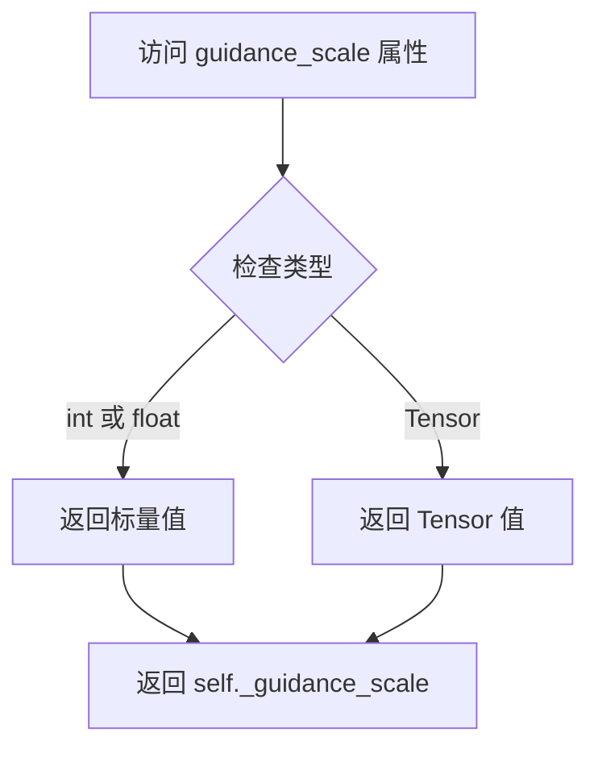

#### 带注释源码

```python
@property
def guidance_scale(self):
    """
    属性 getter: 获取当前的 guidance_scale 值。
    
    guidance_scale 用于控制分类器自由引导 (Classifier-Free Guidance) 的强度。
    在 Stable Video Diffusion 中，该值被设置为在 min_guidance_scale 和 max_guidance_scale 
    之间线性插值的张量，用于在视频生成的不同帧之间动态调整引导强度。
    
    返回:
        self._guidance_scale: torch.Tensor 或 float
            当前管道的 guidance_scale 值。
    """
    return self._guidance_scale
```


### `StableVideoDiffusionPipeline.do_classifier_free_guidance`

该属性用于判断当前是否需要启用分类器无引导（Classifier-Free Guidance，CFG）模式。它通过检查 `guidance_scale` 参数的值来决定：如果 `guidance_scale` 大于 1，则返回 `True` 表示启用 CFG；否则返回 `False`。在视频扩散管道中，CFG 用于通过同时处理条件和无条件噪声预测来提高生成质量。

参数： 无

返回值：`bool`，返回是否启用分类器无引导。如果 guidance_scale 大于 1 则返回 `True`，否则返回 `False`。

#### 流程图

```mermaid
flowchart TD
    A[开始] --> B{self.guidance_scale 是否为 int 或 float 类型}
    B -->|是| C{self.guidance_scale > 1}
    C -->|是| D[返回 True]
    C -->|否| E[返回 False]
    B -->|否| F[返回 self.guidance_scale.max() > 1]
    D --> G[结束]
    E --> G
    F --> G
```

#### 带注释源码

```python
@property
def do_classifier_free_guidance(self):
    """
    属性：判断是否启用分类器无引导（Classifier-Free Guidance）

    该属性检查 guidance_scale 的值来确定是否需要执行分类器无引导。
    根据 Imagen 论文中的定义，guidance_scale = 1 表示不执行 CFG。
    当 guidance_scale > 1 时，CFG 会被启用，通过同时预测条件和无条件噪声
    来改善生成质量。

    Returns:
        bool: 如果 guidance_scale 大于 1 则返回 True（启用 CFG），
              否则返回 False（不启用 CFG）。
    """
    # 判断 guidance_scale 是否为标量（int 或 float 类型）
    if isinstance(self.guidance_scale, (int, float)):
        # 对于标量，直接比较是否大于 1
        return self.guidance_scale > 1
    
    # 如果 guidance_scale 是数组或张量（如视频生成中每帧有不同的值）
    # 则检查其最大值是否大于 1
    return self.guidance_scale.max() > 1
```


### `StableVideoDiffusionPipeline.num_timesteps`

该属性是一个只读的 getter 方法，用于获取扩散模型在推理过程中实际使用的时间步数量，该值在管道执行去噪循环前被设置。

参数：无

返回值：`int`，返回推理过程中使用的时间步总数。

#### 流程图

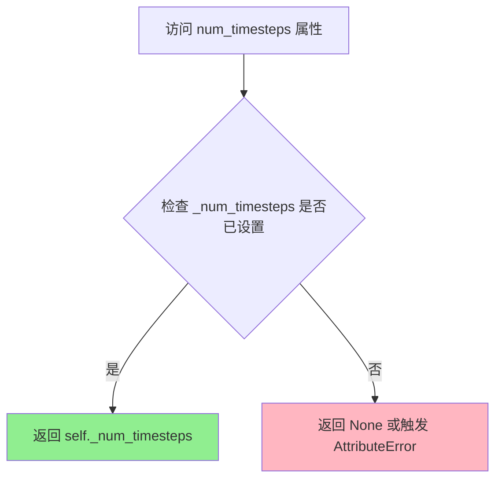

#### 带注释源码

```python
@property
def num_timesteps(self):
    """
    返回扩散推理过程中使用的时间步数量。
    
    该属性在 __call__ 方法的去噪循环开始前被设置：
    self._num_timesteps = len(timesteps)
    
    Returns:
        int: 推理过程中使用的时间步总数，通常等于 num_inference_steps。
    """
    return self._num_timesteps
```

## 关键组件


### StableVideoDiffusionPipeline

主pipeline类，负责从输入图像生成视频，整合了VAE、UNet、图像编码器和调度器。

### 张量索引与惰性加载 (decode_latents分块解码)

在`decode_latents`方法中实现，通过`decode_chunk_size`参数控制每次解码的帧数，避免OOM。代码使用循环分块处理：`for i in range(0, latents.shape[0], decode_chunk_size)`，每次只解码部分帧然后拼接，这是典型的惰性加载模式。

### 反量化支持 (FP16/FP32转换)

代码中存在显式的精度转换逻辑：`needs_upcasting = self.vae.dtype == torch.float16 and self.vae.config.force_upcast`。当VAE为FP16且配置force_upcast为True时，会先将VAE转为FP32进行推理，完成后再转回FP16。这是一种针对量化模型的精度补偿机制。

### 量化策略 (模型精度管理)

通过`self.vae.dtype`检测和`force_upcast`配置控制量化策略。代码在编码VAE图像时执行：`if needs_upcasting: self.vae.to(dtype=torch.float32)`和`if needs_upcasting: self.vae.to(dtype=torch.float16)`，实现了动态精度切换以平衡内存和精度。

### CLIP图像编码 (_encode_image)

使用CLIPVisionModelWithProjection将输入图像编码为image_embeds，支持classifier-free guidance的双向嵌入生成。

### VAE潜在编码 (_encode_vae_image)

使用AutoencoderKLTemporalDecoder将预处理后的图像编码为潜在表示，支持批量生成和条件引导。

### 时间步检索 (retrieve_timesteps)

从调度器获取去噪时间步，支持自定义timesteps和sigmas，提供了灵活的时间步调度策略。

### 潜在变量准备 (prepare_latents)

初始化或处理噪声潜在变量，根据batch_size、帧数和分辨率构建张量形状，并应用调度器的初始噪声标准差。

### 图像抗锯齿缩放 (_resize_with_antialiasing)

使用高斯模糊和双线性插值实现高质量图像缩放，避免锯齿效应，确保CLIP输入图像(224x224)的预处理质量。

### 视频后处理 (video_processor.postprocess_video)

将解码后的张量转换为PIL图像、numpy数组或PyTorch张量格式，支持多种输出类型。


## 问题及建议


### 已知问题

-   **未使用的导入**: 代码中导入了 `inspect` 模块但在多个地方使用 `inspect.signature()`，这会引入性能开销
-   **TODO 遗留**: `_resize_with_antialiasing` 函数上方有 `# TODO: clean up later` 注释，表明辅助函数组织混乱，这些图像处理函数应重构到独立模块
-   **魔法数字**: `fps = fps - 1` 使用硬编码的 -1，虽然有注释说明来源，但不易维护；`motion_bucket_id` 默认值 127 缺乏解释
-   **属性副作用**: `do_classifier_free_guidance` 和 `guidance_scale` 属性依赖内部 `_guidance_scale` 变量，在 `__call__` 中直接赋值修改，可能导致不一致状态
-   **类型检查冗余**: `_encode_image` 中多次进行 `isinstance` 检查和 PIL/numpy/tensor 转换，缺乏统一的预处理流水线
-   **VAE 解码复杂度**: `decode_latents` 中使用 `self.vae._orig_mod.forward if is_compiled_module(self.vae) else self.vae.forward` 的兼容性处理增加了代码复杂度和维护成本
-   **缺失参数验证**: `check_inputs` 未验证 `num_frames` 和 `decode_chunk_size` 参数的有效性（如负数或零值）
-   **条件分支过多**: `__call__` 方法中大量嵌套的条件判断（XLA、设备类型、output_type 等）导致方法过长（超过 200 行）

### 优化建议

-   **模块化重构**: 将 `_resize_with_antialiasing` 及相关高斯模糊函数提取到独立的图像处理工具模块，移除 TODO 标记
-   **缓存签名检查**: 对 `scheduler.set_timesteps` 和 `forward_vae_fn` 的签名检查结果进行缓存，避免每次调用都进行反射
-   **参数验证增强**: 在 `check_inputs` 中添加 `num_frames > 0` 和 `decode_chunk_size > 0` 的验证
-   **配置外部化**: 将 `motion_bucket_id` 默认值和 `fps - 1` 逻辑移至配置文件或构造函数参数
-   **属性设计优化**: 考虑将 `_guidance_scale` 作为 `__call__` 的局部变量而非实例变量，或使用明确的状态管理方法
-   **解耦复杂方法**: 将 `__call__` 中的图像编码、VAE 编码、去噪循环等逻辑拆分为私有方法，每个方法职责单一

## 其它


### 设计目标与约束

本Pipeline的设计目标是实现从静态图像生成动态视频的功能，基于Stable Video Diffusion模型，采用图像到视频的扩散生成范式。核心约束包括：输入图像尺寸需能被8整除；生成的视频帧数受限于UNet配置（默认14或25帧）；必须使用CUDA设备以保证推理性能；视频生成过程中需要较大的GPU显存（建议16GB以上）。

### 错误处理与异常设计

代码中实现了多层次的错误处理机制。在输入验证方面，`check_inputs`方法检查图像类型（支持torch.Tensor、PIL.Image.Image、list类型）以及尺寸是否满足8的倍数要求。在调度器配置方面，`retrieve_timesteps`函数验证自定义timesteps和sigmas参数是否被调度器支持。时间嵌入维度验证在`_get_add_time_ids`方法中进行，确保UNet配置的正确性。Generator长度验证在`prepare_latents`方法中处理。此外，对于FP16模型的VAE上 casting操作通过`needs_upcasting`变量控制，以避免OOM错误。

### 数据流与状态机

 Pipeline的推理过程可分为以下主要状态：初始化状态（模型加载）→ 输入预处理状态（图像编码、VAE编码）→ 潜在变量准备状态 → 去噪循环状态（迭代执行UNet预测和调度器步进）→ 解码状态（VAE解码潜在变量到视频帧）→ 后处理状态（转换为输出格式）。数据流从输入图像开始，经过CLIP图像编码器提取图像嵌入，VAE编码图像到潜在空间，结合噪声潜在变量和时间条件信息，在UNet中进行多步去噪，最终通过VAE解码器将去噪后的潜在变量解码为视频帧序列。

### 外部依赖与接口契约

本Pipeline依赖以下核心外部组件：transformers库提供的CLIPVisionModelWithProjection和CLIPImageProcessor用于图像特征提取；diffusers内部的AutoencoderKLTemporalDecoder（VAE模型）、UNetSpatioTemporalConditionModel（时序UNet）、EulerDiscreteScheduler（调度器）、VideoProcessor（视频处理工具）。输入接口要求image参数为PIL.Image.Image、list[PIL.Image.Image]或torch.Tensor类型，值域为[0,1]。输出接口返回StableVideoDiffusionPipelineOutput对象，包含frames属性，格式为list[list[PIL.Image.Image]]、np.ndarray或torch.Tensor。

### 性能考虑与优化策略

代码实现了多项性能优化策略。模型卸载顺序通过`model_cpu_offload_seq`指定为"image_encoder->unet->vae"，优化CPU-GPU内存切换。VAE解码采用分块处理策略（decode_chunk_size参数），避免一次性解码所有帧导致的OOM问题。调度器步进使用`self.scheduler.order`属性进行顺序控制。对于XLA设备，调用`xm.mark_step()`进行计算图优化。图像嵌入复制使用MPS友好的`repeat`方法而非`expand`以提高兼容性。

### 配置参数详解

关键配置参数包括：height/width控制输出视频分辨率（默认576x1024）；num_frames控制生成帧数（默认14或25）；num_inference_steps控制去噪步数（默认25）；fps控制输出视频帧率（实际使用fps-1进行条件编码）；motion_bucket_id控制运动幅度（默认127，值越大运动越多）；noise_aug_strength控制噪声增强强度（默认0.02）；min_guidance_scale和max_guidance_scale控制分类器自由引导的强度范围；decode_chunk_size控制解码分块大小（默认为总帧数，减小可降低显存占用）。

### 安全性考虑

代码中包含XLA可用性检查，确保在TPU环境下正确处理设备Placement。模型 dtype转换过程中进行fp16/fp32的适当切换，避免数值精度问题。图像预处理过程中进行值域归一化（*2.0-1.0和+1.0/2.0操作），确保与CLIP模型输入要求匹配。对于classifier-free guidance，使用torch.zeros_like创建负样本嵌入，确保无条件生成的正确性。

    