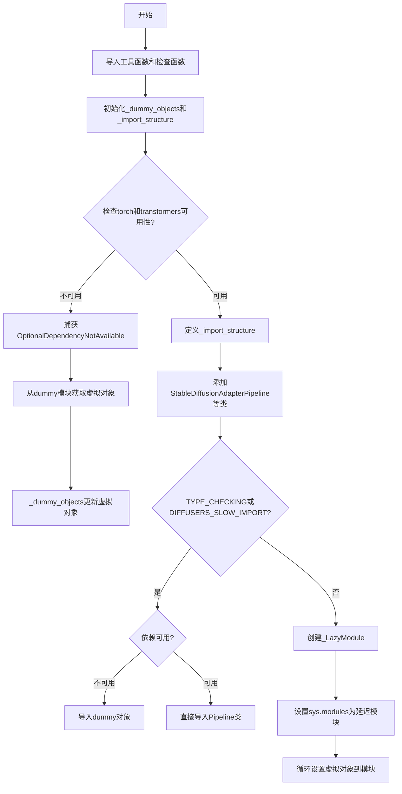
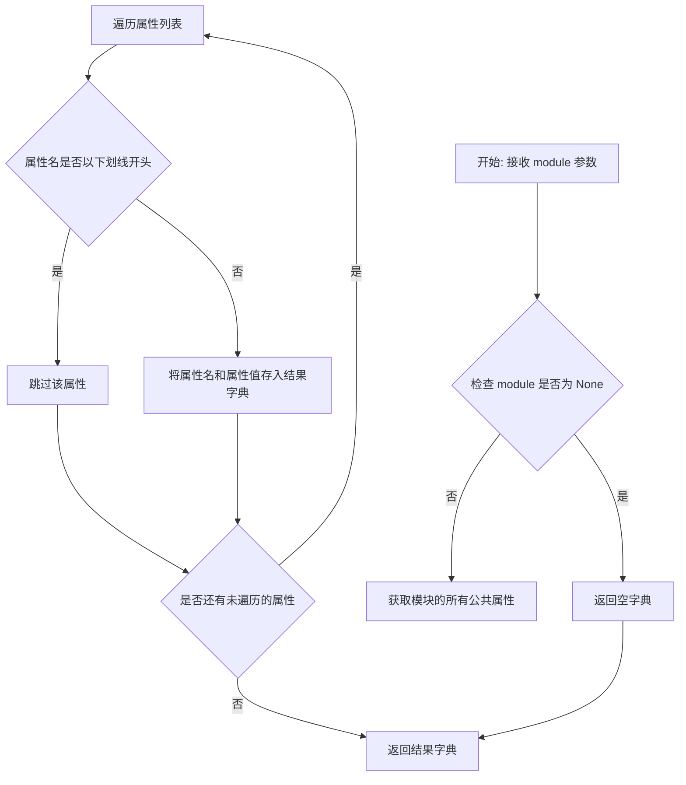
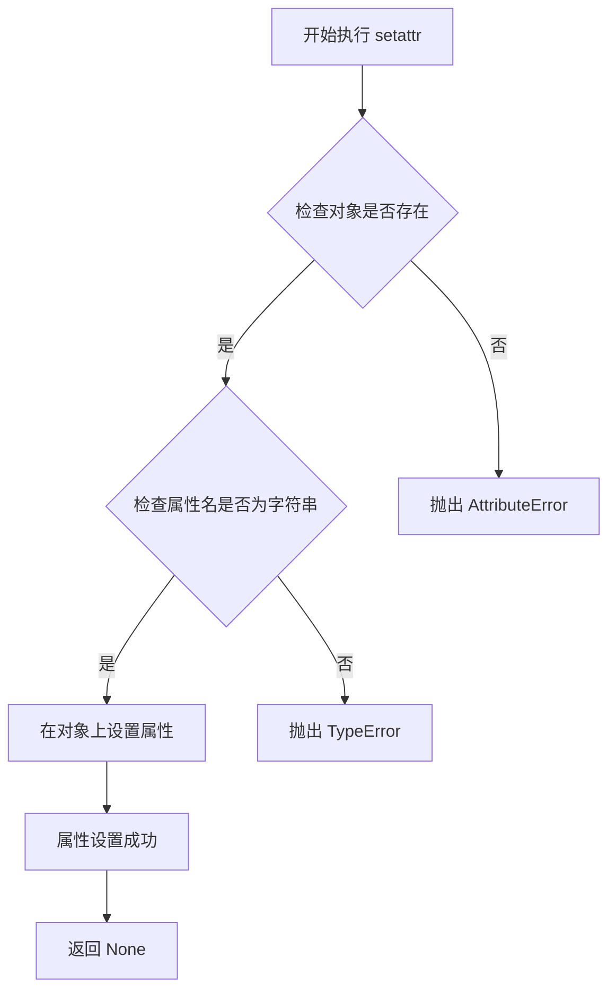
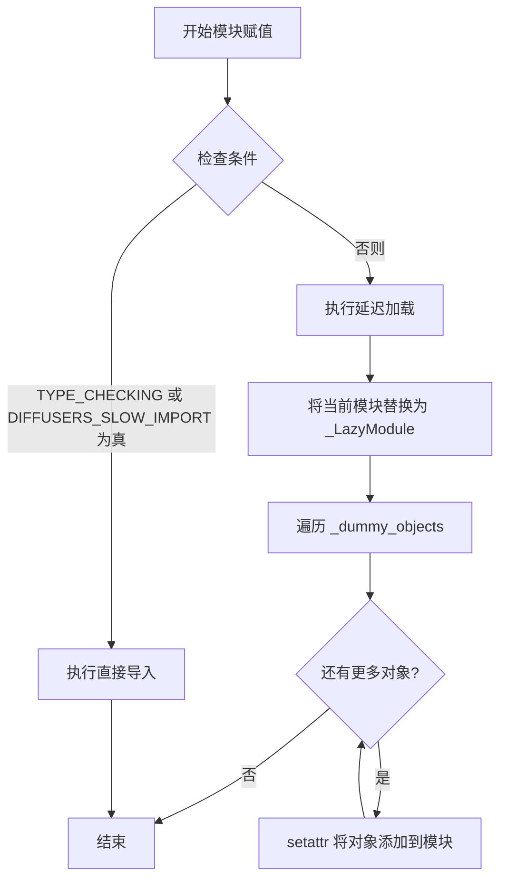

# `diffusers\src\diffusers\pipelines\t2i_adapter\__init__.py` 详细设计文档

这是一个Diffusers库的延迟加载模块初始化文件，通过LazyModule机制实现Stable Diffusion Adapter相关Pipeline类的条件导入和动态加载，处理torch和transformers可选依赖，并在依赖不可用时提供虚拟对象以保证模块导入成功。

## 整体流程



## 类结构

```
Module: adapter (包初始化)
├── _LazyModule (延迟加载机制)
├── StableDiffusionAdapterPipeline
└── StableDiffusionXLAdapterPipeline
```

## 全局变量及字段


### `_dummy_objects`
    
存储虚拟对象的字典，用于在可选依赖不可用时提供替代对象

类型：`dict`
    


### `_import_structure`
    
定义模块导入结构的字典，映射模块名到可导出的类名列表

类型：`dict`
    


### `TYPE_CHECKING`
    
来自typing的标志，表示当前是否处于类型检查模式

类型：`bool`
    


### `DIFFUSERS_SLOW_IMPORT`
    
来自utils的标志，控制是否使用延迟导入模式

类型：`bool`
    


### `is_torch_available`
    
检查PyTorch是否可用的函数，返回布尔值

类型：`Callable[[], bool]`
    


### `is_transformers_available`
    
检查Transformers库是否可用的函数，返回布尔值

类型：`Callable[[], bool]`
    


    

## 全局函数及方法


### `get_objects_from_module`

该函数是 Diffusers 库中用于延迟加载（Lazy Loading）机制的核心工具函数。它接收一个模块作为输入，遍历该模块的所有公共属性（排除以下划线开头的属性），返回一个由属性名到属性值映射的字典。在给定代码中，它被用于从 `dummy_torch_and_transformers_objects` 模块中提取虚拟对象（Dummy Objects），以便在可选依赖（torch 和 transformers）不可用时保持模块接口的完整性。

参数：

-  `module`：`Module`，需要提取对象的源模块，通常为包含虚拟对象的模块（如 `dummy_torch_and_transformers_objects`）

返回值：`Dict[str, Any]`，返回一个字典，键为对象名称（字符串），值为模块中对应的实际对象

#### 流程图



#### 带注释源码

```python
def get_objects_from_module(module):
    """
    从给定模块中提取所有公共对象，返回名称到对象的映射字典。
    用于延迟加载机制中获取虚拟对象或模块成员。
    
    参数:
        module: 要提取对象的 Python 模块
        
    返回:
        字典，键为对象名称，值为模块中的实际对象
    """
    # 初始化结果字典
    objects = {}
    
    # 遍历模块的所有属性
    for attr_name in dir(module):
        # 跳过以单下划线或双下划线开头的私有属性
        if attr_name.startswith('_'):
            continue
        
        # 获取实际的对象引用
        attr_value = getattr(module, attr_name)
        
        # 将对象添加到结果字典
        objects[attr_name] = attr_value
    
    return objects
```

#### 在上下文代码中的使用示例

```python
# 在 __init__.py 中的实际调用方式：
try:
    # 检查可选依赖是否可用
    if not (is_transformers_available() and is_torch_available()):
        raise OptionalDependencyNotAvailable()
except OptionalDependencyNotAvailable:
    # 依赖不可用时，导入虚拟对象模块
    from ...utils import dummy_torch_and_transformers_objects
    
    # 使用 get_objects_from_module 获取所有虚拟对象
    # 并更新到 _dummy_objects 字典中
    _dummy_objects.update(get_objects_from_module(dummy_torch_and_transformers_objects))
```

---

### 补充信息

#### 设计目标与约束

- **设计目标**：实现可选依赖的优雅降级，当 torch 或 transformers 不可用时，模块仍能通过虚拟对象保持接口一致性
- **约束**：该函数假设传入的是有效的 Python 模块对象，且模块中的对象可以被 `getattr` 访问

#### 潜在的技术债务或优化空间

1. **缺乏类型提示**：当前函数定义中缺少参数和返回值的类型注解
2. **属性过滤逻辑简单**：仅通过 `startswith('_')` 过滤，可能遗漏特殊情况
3. **无错误处理**：未对 `getattr` 调用失败的情况进行处理

#### 错误处理与异常设计

- 如果传入的 `module` 为 `None`，函数应返回空字典（当前实现会抛出 `TypeError`）
- 如果模块属性访问失败（如属性只读或不存在），可能抛出 `AttributeError`


### `setattr`

`setattr` 是 Python 的内置函数，用于动态设置对象的属性值。在本代码中，它用于将虚拟对象（dummy objects）注册到模块的命名空间中，使得在可选依赖不可用时，这些对象仍然可以被导入。

参数：

- `sys.modules[__name__]`：`module`，要设置属性的模块对象
- `name`：`str`，要设置的属性名称（来自 `_dummy_objects` 字典的键）
- `value`：任意类型，要设置的属性值（来自 `_dummy_objects` 字典的值）

返回值：`None`，该函数不返回任何值

#### 流程图



#### 带注释源码

```python
# setattr 是 Python 内置函数，用于设置对象的属性值
# 语法: setattr(obj, name, value)
# 等同于: obj.name = value

# 遍历所有虚拟对象（dummy objects）
for name, value in _dummy_objects.items():
    # 将每个虚拟对象设置为当前模块的属性
    # sys.modules[__name__] 获取当前模块
    # name 是属性名称（字符串）
    # value 是属性值（通常是虚拟对象或类）
    setattr(sys.modules[__name__], name, value)

# 示例说明：
# 假设 _dummy_objects = {'DummyClass': <class '...'>}
# 执行 setattr(sys.modules[__name__], 'DummyClass', <class '...'>)
# 效果等同于：sys.modules[__name__].DummyClass = <class '...'>
# 这样当代码尝试导入 DummyClass 时，虽然实际类不存在，
# 但模块属性存在，避免导入错误
```


### `sys.modules` 赋值（模块初始化）

这是模块的延迟加载（Lazy Loading）核心逻辑，通过将当前模块替换为 `_LazyModule` 实例来实现可选依赖的动态导入，同时将虚拟对象（dummy objects）注入到模块命名空间中。

参数：无

返回值：无（执行副作用操作：修改 `sys.modules` 和模块属性）

#### 流程图



#### 带注释源码

```python
# else 分支：当不是类型检查且不是慢导入模式时执行
else:
    import sys

    # 核心：将当前模块名称映射到一个延迟加载的模块对象
    # _LazyModule 会在首次访问属性时动态导入实际模块
    sys.modules[__name__] = _LazyModule(
        __name__,                      # 模块名称 (如 "diffusers.pipeline_stable_diffusion_adapter")
        globals()["__file__"],         # 模块文件路径
        _import_structure,             # 导入结构字典 {模块路径: [导出类列表]}
        module_spec=__spec__,         # 模块规格信息 (MetaPathFinder 使用)
    )
    
    # 将虚拟对象（dummy objects）注入到模块命名空间
    # 这些对象在可选依赖不可用时替代真实类，防止导入错误
    for name, value in _dummy_objects.items():
        setattr(sys.modules[__name__], name, value)
```


## 关键组件


### 懒加载模块机制 (Lazy Loading Module)

通过 `_LazyModule` 实现模块的延迟加载，只有在实际使用时才导入具体类，提高库的初始化速度。

### 可选依赖检查与处理 (Optional Dependency Handling)

使用 `OptionalDependencyNotAvailable` 异常类和 `is_torch_available()`、`is_transformers_available()` 函数检查 torch 和 transformers 依赖，根据依赖可用性动态决定导入内容。

### 虚拟对象模式 (Dummy Objects Pattern)

当依赖不可用时，使用 `_dummy_objects` 字典和 `get_objects_from_module()` 从虚拟模块导入占位对象，确保模块结构完整但调用时抛出错误。

### 导入结构定义 (Import Structure Definition)

通过 `_import_structure` 字典定义模块的公开接口，包含 `StableDiffusionAdapterPipeline` 和 `StableDiffusionXLAdapterPipeline` 两个管道类。

### 条件类型检查 (Conditional Type Checking)

使用 `TYPE_CHECKING` 标志在类型检查时导入完整模块，在运行时使用懒加载机制，优化导入性能。


## 问题及建议


### 已知问题

-   **重复的条件检查逻辑**：在第12-14行和第21-23行重复检查 `is_transformers_available() and is_torch_available()`，违反了DRY原则，增加维护成本
-   **使用通配符导入**：`from ...utils.dummy_torch_and_transformers_objects import *` 使用 `*` 导入，违反显式导入原则，降低代码可读性和IDE支持
-   **空字典初始化**：`_import_structure = {}` 先初始化为空，后续才添加内容，可直接初始化为预期结构
-   **魔法操作**：直接操作 `sys.modules[__name__]` 并使用 `setattr` 动态设置属性，属于隐形魔法，降低代码可理解性
-   **异常处理缺乏上下文**：捕获 `OptionalDependencyNotAvailable` 时没有添加额外错误信息，难以追踪问题来源
-   **缺乏类型注解**：关键变量如 `_import_structure` 和 `_dummy_objects` 缺乏类型注解，降低了类型安全性

### 优化建议

-   将重复的可选依赖检查逻辑提取为独立的辅助函数或变量，避免代码重复
-   将通配符导入改为显式导入，列出具体需要的对象名称，提升可维护性
-   使用类型注解为全局变量添加类型声明，提升代码健壮性
-   在异常处理块中添加上下文信息或日志记录，便于调试
-   考虑将 `_import_structure` 的初始化与赋值合并，减少中间状态
-   为 LazyModule 的使用添加明确的注释说明，降低后续维护者的理解成本


## 其它


### 设计目标与约束

该模块的设计目标是实现可选依赖的延迟加载机制，确保在torch和transformers未安装时不会导致整个diffusers库导入失败，同时提供清晰的API接口供用户使用Stable Diffusion适配器管道。设计约束包括：必须依赖TYPE_CHECKING或DIFFUSERS_SLOW_IMPORT环境变量来决定导入方式，必须维护_import_structure和_dummy_objects的一致性，模块必须符合diffusers库的lazy loading架构规范。

### 错误处理与异常设计

当torch和transformers均不可用时，抛出OptionalDependencyNotAvailable异常并从dummy_torch_and_transformers_objects模块加载Dummy对象，这些Dummy对象在调用时会抛出适当的未可用异常。异常处理采用try-except捕获OptionalDependencyNotAvailable，确保在两种导入路径（TYPE_CHECKING/运行时）中的一致性。对于LazyModule的初始化，任何模块属性访问错误都会被封装并传播给调用者。

### 数据流与状态机

模块存在三种状态：初始状态（未初始化）、可用状态（依赖满足）、不可用状态（依赖缺失）。状态转换由is_transformers_available()和is_torch_available()的返回值决定。数据流从_import_structure定义开始，经过_LazyModule封装，最终通过sys.modules注册。TYPE_CHECKING分支直接导入真实类，非TYPE_CHECKING分支使用LazyModule代理。

### 外部依赖与接口契约

外部依赖包括：torch（必需但可选）、transformers（必需但可选）、diffusers.utils._LazyModule、diffusers.utils.get_objects_from_module、diffusers.utils.dummy_torch_and_transformers_objects。接口契约规定：导出StableDiffusionAdapterPipeline和StableDiffusionXLAdapterPipeline两个类，在依赖不可用时提供Dummy对象，模块实例必须可哈希且支持sys.modules注册。

### 模块化与扩展性

模块采用插件化架构，通过_import_structure字典定义可导出项，便于未来添加新的适配器管道。增加新的适配器管道只需在_import_structure中添加条目并导入对应的类，无需修改核心逻辑。_dummy_objects的更新机制支持自动同步Dummy对象集合。

### 版本兼容性考虑

该模块需要Python 3.7+（支持typing.TYPE_CHECKING），需要diffusers 0.21.0+版本以支持_LazyModule。需兼容torch 1.9+和transformers 4.20+的组合。建议在文档中标注最低版本要求，并提供版本检测机制。

### 性能优化考量

延迟加载机制本身已提供性能优化，避免了不必要的模块导入。_LazyModule的实现应确保属性访问开销最小化。在非TYPE_CHECKING模式下，首次导入时只注册模块壳，实际类导入延迟到属性访问时。DIFFUSERS_SLOW_IMPORT标志允许在需要完整导入场景下绕过延迟加载。

### 安全与权限

模块本身不涉及敏感数据处理或权限管理。但需确保dummy_torch_and_transformers_objects模块中的Dummy对象不会泄露任何实际实现细节。导入路径应使用相对导入避免路径遍历风险。

    