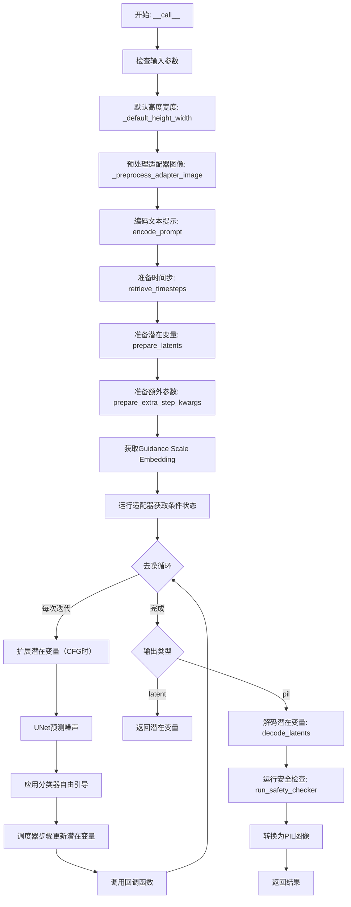
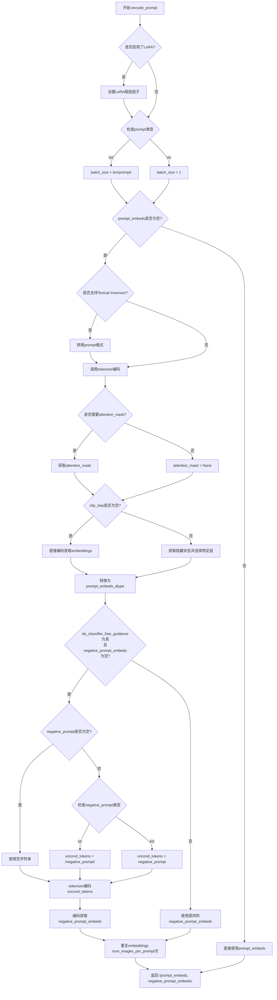
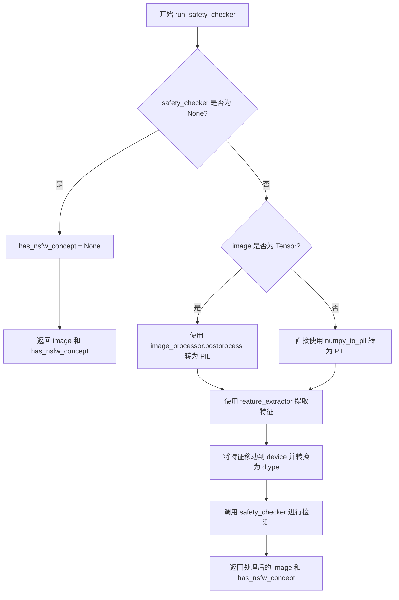
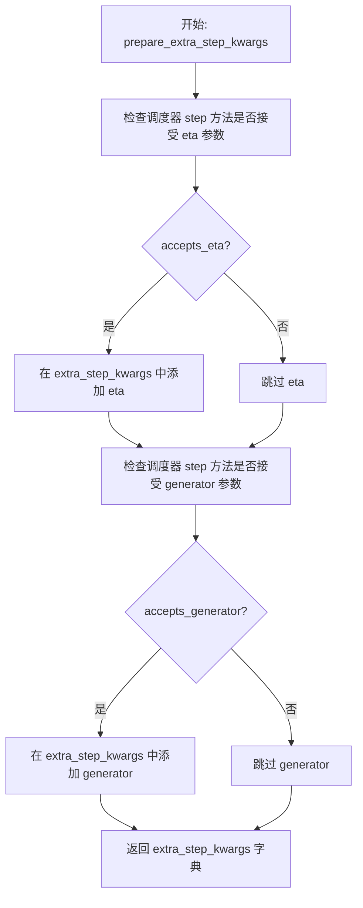
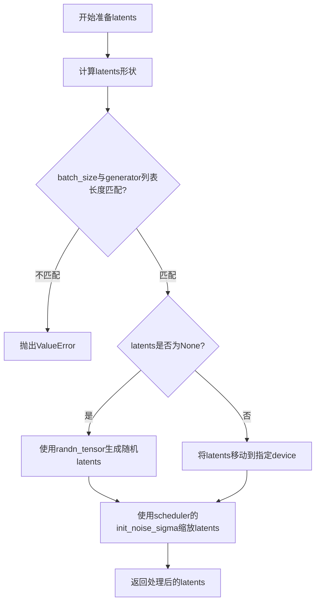
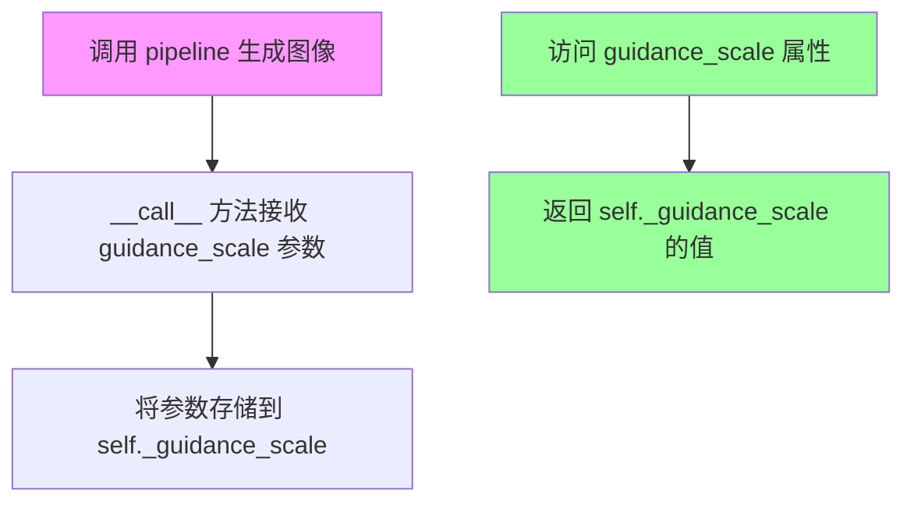
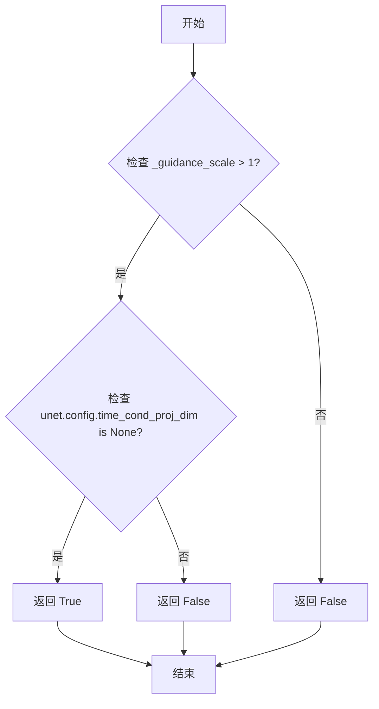

```mermaid
flowchart TD
    A[Start __call__] --> B[设置默认高度和宽度]
    B --> C{检查输入参数}
    C -->|不通过| D[抛出 ValueError]
    C -->|通过| E[获取执行设备]
    E --> F{处理适配器输入}
    F -->|MultiAdapter| G[遍历处理每张图像]
    G --> H[预处理并移动到设备]
    F -->|单适配器| I[预处理并移动到设备]
    H --> J[定义批处理大小]
    I --> J
    J --> K[编码文本提示]
    K --> L{是否使用 CFG}
    L -->|是| M[拼接负向和正向嵌入]
    L -->|否| N[仅使用正向嵌入]
    M --> O[准备时间步]
    N --> O
    O --> P[准备潜在变量]
    P --> Q[准备额外调度器参数]
    Q --> R{获取引导缩放嵌入}
    R -->|需要| S[计算 timestep_cond]
    R -->|不需要| T[初始化为空]
    S --> U{处理适配器状态}
    U -->|MultiAdapter| V[调用 adapter 获取状态]
    V --> W[应用 adapter_conditioning_scale]
    U -->|单适配器| X[调用 adapter 获取状态]
    X --> Y[复制适配器状态]
    Y --> Z{num_images_per_prompt > 1}
    Z -->|是| AA[重复适配器状态]
    Z -->|否| AB[继续]
    AA --> AC{是否使用 CFG}
    AB --> AC
    AC -->|是| AD[拼接两份适配器状态]
    AC -->|否| AE[去噪循环]
    AD --> AE
    AE --> AF[计算预热步数]
    AF --> AG[进入去噪循环 for each timestep]
    AG --> AH{当前步是否为最后一步或满足更新条件}
    AH -->|是| AI[更新进度条并调用回调]
    AH -->|否| AJ[继续]
    AI --> AK[执行调度器 step]
    AJ --> AK
    AK --> AL{是否还有剩余时间步}
    AL -->|是| AM[继续下一轮]
    AL -->|否| AN{output_type == latent}
    AM --> AG
    AN -->|是| AO[直接返回 latents]
    AN -->|否| AP[解码潜在变量]
    AP --> AQ[运行安全检查器]
    AQ --> AR{output_type == pil}
    AR -->|是| AS[转换为 PIL 图像]
    AR -->|否| AT[直接返回数组]
    AS --> AU[释放模型钩子]
    AT --> AU
    AO --> AU
    AU --> AV{return_dict == True}
    AV -->|是| AW[返回 PipelineOutput]
    AV -->|否| AX[返回元组]
```

# `diffusers\src\diffusers\pipelines\t2i_adapter\pipeline_stable_diffusion_adapter.py` 详细设计文档

这是一个使用T2I-Adapter增强的Stable Diffusion文本到图像生成管道，通过适配器图像提供额外的条件信息来指导图像生成过程，支持多适配器集成、LoRA微调、分类器自由引导和安全性检查。

## 整体流程



## 类结构

```
DiffusionPipeline (抽象基类)
├── StableDiffusionMixin
├── FromSingleFileMixin
└── StableDiffusionAdapterPipeline
    └── StableDiffusionAdapterPipelineOutput (数据类)
```

## 全局变量及字段


### `logger`
    
模块日志记录器，用于记录管道运行过程中的信息

类型：`logging.Logger`
    


### `EXAMPLE_DOC_STRING`
    
示例文档字符串，包含管道使用示例代码

类型：`str`
    


### `XLA_AVAILABLE`
    
XLA可用性标志，指示是否支持PyTorch XLA加速

类型：`bool`
    


### `PIL_INTERPOLATION`
    
PIL插值方法字典，包含各种图像重采样方法

类型：`dict`
    


### `USE_PEFT_BACKEND`
    
PEFT后端使用标志，指示是否使用PEFT库进行LoRA调整

类型：`bool`
    


### `StableDiffusionAdapterPipelineOutput.StableDiffusionAdapterPipeline`
    
生成的图像列表，包含去噪后的PIL图像或numpy数组

类型：`list[PIL.Image.Image] | np.ndarray`
    


### `StableDiffusionAdapterPipelineOutput.StableDiffusionAdapterPipeline`
    
NSFW内容检测标志列表，标记生成的图像是否包含不当内容

类型：`list[bool] | None`
    


### `StableDiffusionAdapterPipeline.vae`
    
VAE模型，用于编码和解码图像到潜在表示

类型：`AutoencoderKL`
    


### `StableDiffusionAdapterPipeline.text_encoder`
    
文本编码器，将文本提示转换为嵌入向量

类型：`CLIPTextModel`
    


### `StableDiffusionAdapterPipeline.tokenizer`
    
文本分词器，将文本分割为token序列

类型：`CLIPTokenizer`
    


### `StableDiffusionAdapterPipeline.unet`
    
条件U-Net去噪模型，用于预测噪声残差

类型：`UNet2DConditionModel`
    


### `StableDiffusionAdapterPipeline.adapter`
    
T2I适配器，提供额外的条件信息给U-Net

类型：`T2IAdapter | MultiAdapter | list[T2IAdapter]`
    


### `StableDiffusionAdapterPipeline.scheduler`
    
扩散调度器，控制去噪过程中的时间步长

类型：`KarrasDiffusionSchedulers`
    


### `StableDiffusionAdapterPipeline.safety_checker`
    
安全检查器，检测生成图像是否包含不当内容

类型：`StableDiffusionSafetyChecker`
    


### `StableDiffusionAdapterPipeline.feature_extractor`
    
特征提取器，从图像中提取特征用于安全检查

类型：`CLIPImageProcessor`
    


### `StableDiffusionAdapterPipeline.vae_scale_factor`
    
VAE缩放因子，用于调整潜在空间的尺寸

类型：`int`
    


### `StableDiffusionAdapterPipeline.image_processor`
    
图像处理器，用于图像的后处理和格式转换

类型：`VaeImageProcessor`
    


### `StableDiffusionAdapterPipeline._guidance_scale`
    
引导尺度，控制文本提示对生成图像的影响程度

类型：`float`
    


### `StableDiffusionAdapterPipeline.model_cpu_offload_seq`
    
模型CPU卸载顺序，定义模型卸载到CPU的序列

类型：`str`
    


### `StableDiffusionAdapterPipeline._optional_components`
    
可选组件列表，包含可选的管道组件名称

类型：`list[str]`
    
    

## 全局函数及方法


### `_preprocess_adapter_image`

该函数是一个全局预处理函数，用于将适配器图像标准化为统一的 `torch.Tensor` 格式，支持 PIL Image 和 PyTorch Tensor 两种输入类型，并确保输出符合模型的维度要求（Batch, Channel, Height, Width）。

参数：

- `image`：`torch.Tensor | PIL.Image.Image | list[PIL.Image.Image]`，待预处理的适配器输入图像，可以是单个 PIL 图像、图像列表或已转换的 Tensor
- `height`：`int`，目标输出高度（像素）
- `width`：`int`，目标输出宽度（像素）

返回值：`torch.Tensor`，形状为 `(batch_size, channels, height, width)` 的浮点型张量，值域归一化至 `[0, 1]`

#### 流程图

```mermaid
flowchart TD
    A[开始: _preprocess_adapter_image] --> B{image 类型检查}
    B -->|torch.Tensor| C[直接返回原 Tensor]
    B -->|PIL.Image.Image| D[转换为 list]
    
    D --> E{image[0] 类型检查}
    E -->|PIL.Image.Image| F[逐图像 resize 到目标尺寸]
    F --> G[转换为 numpy array]
    G --> H[维度扩展: [h,w] 或 [h,w,c] -> [b,h,w,c]]
    H --> I[沿 batch 轴拼接]
    I --> J[数据类型转换为 float32]
    J --> K[归一化: /255.0]
    K --> L[转置: HWC -> CHW]
    L --> M[转换为 torch.Tensor]
    
    E -->|torch.Tensor| N{检查 Tensor 维度}
    N -->|3维| O[torch.stack 沿 batch 维度]
    N -->|4维| P[torch.cat 沿 batch 维度]
    N -->|其他| Q[抛出 ValueError 异常]
    
    M --> R[返回处理后的 Tensor]
    O --> R
    P --> R
    
    Q --> S[结束: 抛出异常]
```

#### 带注释源码

```python
def _preprocess_adapter_image(image, height, width):
    """
    预处理适配器图像,支持PIL.Image和torch.Tensor输入,统一输出为CHW格式的torch.Tensor
    
    Args:
        image: 输入图像,支持PIL.Image.Image、torch.Tensor或list[PIL.Image.Image]
        height: 目标高度
        width: 目标宽度
    
    Returns:
        torch.Tensor: 预处理后的图像张量,shape为(batch, channels, height, width)
    """
    # 如果已经是 Tensor,直接返回(可能已经是正确格式)
    if isinstance(image, torch.Tensor):
        return image
    # 单个 PIL Image 转为 list 以便统一处理
    elif isinstance(image, PIL.Image.Image):
        image = [image]

    # 处理 PIL Image 类型的输入列表
    if isinstance(image[0], PIL.Image.Image):
        # 1. resize 到目标尺寸,使用 lanczos 插值
        image = [np.array(i.resize((width, height), resample=PIL_INTERPOLATION["lanczos"])) for i in image]
        
        # 2. 扩展维度: 将 [h,w] 或 [h,w,c] 扩展为 [b,h,w,c]
        # 如果是灰度图(ndim=2),扩展为 [1,h,w,1]
        # 如果是RGB图(ndim=3),扩展为 [1,h,w,c]
        image = [
            i[None, ..., None] if i.ndim == 2 else i[None, ...] for i in image
        ]
        
        # 3. 沿 batch 维度拼接所有图像
        image = np.concatenate(image, axis=0)
        
        # 4. 归一化到 [0,1] 范围
        image = np.array(image).astype(np.float32) / 255.0
        
        # 5. 维度转换: HWC -> CHW (Height,Width,Channel -> Channel,Height,Width)
        image = image.transpose(0, 3, 1, 2)
        
        # 6. 转换为 PyTorch Tensor
        image = torch.from_numpy(image)
    
    # 处理 torch.Tensor 类型的输入列表
    elif isinstance(image[0], torch.Tensor):
        if image[0].ndim == 3:
            # 3D Tensor [C,H,W] 列表 -> 使用 stack 创建 4D Tensor [B,C,H,W]
            image = torch.stack(image, dim=0)
        elif image[0].ndim == 4:
            # 4D Tensor [B,C,H,W] 列表 -> 使用 cat 沿 batch 维度拼接
            image = torch.cat(image, dim=0)
        else:
            raise ValueError(
                f"Invalid image tensor! Expecting image tensor with 3 or 4 dimension, but receive: {image[0].ndim}"
            )
    
    return image
```


### `retrieve_timesteps`

该函数是扩散调度器的辅助函数，用于调用调度器的 `set_timesteps` 方法并从中检索时间步。它处理自定义时间步和自定义 sigmas，任何额外的 kwargs 都会传递给调度器的 `set_timesteps` 方法。

参数：

- `scheduler`：`SchedulerMixin`，要获取时间步的调度器实例
- `num_inference_steps`：`int | None`，生成样本时使用的扩散步数，如果使用此参数则 `timesteps` 必须为 `None`
- `device`：`str | torch.device | None`，时间步要移动到的目标设备，如果为 `None` 则不移动
- `timesteps`：`list[int] | None`，自定义时间步列表，用于覆盖调度器的默认时间步间隔策略，传入此参数时 `num_inference_steps` 和 `sigmas` 必须为 `None`
- `sigmas`：`list[float] | None`，自定义 sigmas 列表，用于覆盖调度器的默认 sigma 间隔策略，传入此参数时 `num_inference_steps` 和 `timesteps` 必须为 `None`
- `**kwargs`：可变关键字参数，会被传递给调度器的 `set_timesteps` 方法

返回值：`tuple[torch.Tensor, int]`，第一个元素是调度器的时间步张量，第二个元素是推理步数

#### 流程图

```mermaid
flowchart TD
    A[开始: retrieve_timesteps] --> B{检查timesteps和sigmas是否同时存在}
    B -- 是 --> C[抛出ValueError: 只能指定timesteps或sigmas之一]
    B -- 否 --> D{是否传入了timesteps}
    D -- 是 --> E{调度器是否支持timesteps参数}
    E -- 否 --> F[抛出ValueError: 调度器不支持自定义timesteps]
    E -- 是 --> G[调用scheduler.set_timesteps<br/>传入timesteps和device]
    G --> H[从scheduler获取timesteps<br/>num_inference_steps = len(timesteps)]
    D -- 否 --> I{是否传入了sigmas}
    I -- 是 --> J{调度器是否支持sigmas参数}
    J -- 否 --> K[抛出ValueError: 调度器不支持自定义sigmas]
    J -- 是 --> L[调用scheduler.set_timesteps<br/>传入sigmas和device]
    L --> M[从scheduler获取timesteps<br/>num_inference_steps = len(timesteps)]
    I -- 否 --> N[调用scheduler.set_timesteps<br/>传入num_inference_steps和device]
    N --> O[从scheduler获取timesteps]
    H --> P[返回timesteps和num_inference_steps]
    M --> P
    O --> P
```

#### 带注释源码

```python
def retrieve_timesteps(
    scheduler,                          # 调度器实例 (SchedulerMixin)
    num_inference_steps: int | None = None,  # 推理步数
    device: str | torch.device | None = None,  # 目标设备
    timesteps: list[int] | None = None,  # 自定义时间步列表
    sigmas: list[float] | None = None,   # 自定义sigma列表
    **kwargs,                           # 额外参数传递给set_timesteps
):
    r"""
    调用调度器的 set_timesteps 方法并从中检索时间步。
    处理自定义时间步。任何 kwargs 将被传递给 scheduler.set_timesteps。

    参数:
        scheduler: 调度器对象
        num_inference_steps: 推理步数
        device: 设备
        timesteps: 自定义时间步
        sigmas: 自定义sigmas

    返回:
        tuple: (timesteps, num_inference_steps)
    """
    # 检查是否同时传入了timesteps和sigmas，这是不允许的
    if timesteps is not None and sigmas is not None:
        raise ValueError(
            "Only one of `timesteps` or `sigmas` can be passed. "
            "Please choose one to set custom values"
        )
    
    # 处理自定义timesteps的情况
    if timesteps is not None:
        # 检查调度器的set_timesteps方法是否接受timesteps参数
        accepts_timesteps = "timesteps" in set(
            inspect.signature(scheduler.set_timesteps).parameters.keys()
        )
        if not accepts_timesteps:
            raise ValueError(
                f"The current scheduler class {scheduler.__class__}'s "
                f"`set_timesteps` does not support custom timestep schedules. "
                f"Please check whether you are using the correct scheduler."
            )
        
        # 调用调度器的set_timesteps方法，传入自定义timesteps
        scheduler.set_timesteps(timesteps=timesteps, device=device, **kwargs)
        # 从调度器获取更新后的timesteps
        timesteps = scheduler.timesteps
        # 计算推理步数
        num_inference_steps = len(timesteps)
    
    # 处理自定义sigmas的情况
    elif sigmas is not None:
        # 检查调度器的set_timesteps方法是否接受sigmas参数
        accept_sigmas = "sigmas" in set(
            inspect.signature(scheduler.set_timesteps).parameters.keys()
        )
        if not accept_sigmas:
            raise ValueError(
                f"The current scheduler class {scheduler.__class__}'s "
                f"`set_timesteps` does not support custom sigmas schedules. "
                f"Please check whether you are using the correct scheduler."
            )
        
        # 调用调度器的set_timesteps方法，传入自定义sigmas
        scheduler.set_timesteps(sigmas=sigmas, device=device, **kwargs)
        # 从调度器获取更新后的timesteps
        timesteps = scheduler.timesteps
        # 计算推理步数
        num_inference_steps = len(timesteps)
    
    # 默认情况：使用num_inference_steps设置时间步
    else:
        scheduler.set_timesteps(num_inference_steps, device=device, **kwargs)
        timesteps = scheduler.timesteps
    
    # 返回时间步张量和推理步数
    return timesteps, num_inference_steps
```


### `StableDiffusionAdapterPipeline.__init__`

这是 Stable Diffusion 适配器管道（Stable Diffusion Augmented with T2I-Adapter）的初始化方法，负责接收并注册所有必需的模型组件（VAE、文本编码器、Tokenizer、UNet、适配器、调度器、安全检查器等），并完成图像处理器的初始化配置。

参数：

- `vae`：`AutoencoderKL`，Variational Auto-Encoder (VAE) 模型，用于将图像编码和解码到潜在表示
- `text_encoder`：`CLIPTextModel`，冻结的文本编码器，Stable Diffusion 使用 CLIP 的文本部分
- `tokenizer`：`CLIPTokenizer`，CLIPTokenizer 类的分词器
- `unet`：`UNet2DConditionModel`，条件 U-Net 架构，用于对编码后的图像潜在表示进行去噪
- `adapter`：`T2IAdapter | MultiAdapter | list[T2IAdapter]`，T2I-Adapter 或 MultiAdapter，提供额外的条件信息给 UNet
- `scheduler`：`KarrasDiffusionSchedulers`，与 UNet 结合使用的调度器，用于对编码后的图像潜在表示进行去噪
- `safety_checker`：`StableDiffusionSafetyChecker`，安全检查器模块，用于估计生成的图像是否包含不当内容
- `feature_extractor`：`CLIPImageProcessor`，用于从生成的图像中提取特征作为安全检查器的输入
- `requires_safety_checker`：`bool`，是否需要安全检查器，默认为 True

返回值：`None`，构造函数无返回值，直接初始化对象状态

#### 流程图

```mermaid
flowchart TD
    A[开始 __init__] --> B[调用 super().__init__]
    B --> C{safety_checker is None<br/>且 requires_safety_checker?}
    C -->|是| D[发出安全检查器禁用警告]
    C -->|否| E{safety_checker is not None<br/>且 feature_extractor is None?}
    D --> E
    E -->|是| F[抛出 ValueError]
    E -->|否| G{adapter 是 list 或 tuple?}
    F --> H[结束]
    G -->|是| I[将 adapter 转换为 MultiAdapter]
    G -->|否| J[注册所有模块到 pipeline]
    I --> J
    J --> K[计算 vae_scale_factor]
    K --> L[初始化 VaeImageProcessor]
    L --> M[注册 requires_safety_checker 到 config]
    M --> H
```

#### 带注释源码

```python
def __init__(
    self,
    vae: AutoencoderKL,
    text_encoder: CLIPTextModel,
    tokenizer: CLIPTokenizer,
    unet: UNet2DConditionModel,
    adapter: T2IAdapter | MultiAdapter | list[T2IAdapter],
    scheduler: KarrasDiffusionSchedulers,
    safety_checker: StableDiffusionSafetyChecker,
    feature_extractor: CLIPImageProcessor,
    requires_safety_checker: bool = True,
):
    """
    初始化 StableDiffusionAdapterPipeline
    
    参数:
        vae: Variational Auto-Encoder (VAE) Model，用于编码和解码图像
        text_encoder: 冻结的文本编码器 (CLIPTextModel)
        tokenizer: CLIPTokenizer 分词器
        unet: 条件 U-Net 架构，用于去噪
        adapter: T2IAdapter 或 MultiAdapter，提供额外条件
        scheduler: 扩散调度器
        safety_checker: 安全检查器
        feature_extractor: 图像特征提取器
        requires_safety_checker: 是否需要安全检查器
    """
    # 调用父类 DiffusionPipeline 的初始化方法
    super().__init__()

    # 如果 safety_checker 为 None 但 requires_safety_checker 为 True，发出警告
    if safety_checker is None and requires_safety_checker:
        logger.warning(
            f"You have disabled the safety checker for {self.__class__} by passing `safety_checker=None`. Ensure"
            " that you abide to the conditions of the Stable Diffusion license and do not expose unfiltered"
            " results in services or applications open to the public. Both the diffusers team and Hugging Face"
            " strongly recommend to keep the safety filter enabled in all public facing circumstances, disabling"
            " it only for use-cases that involve analyzing network behavior or auditing its results. For more"
            " information, please have a look at https://github.com/huggingface/diffusers/pull/254 ."
        )

    # 如果提供了 safety_checker 但没有提供 feature_extractor，抛出错误
    if safety_checker is not None and feature_extractor is None:
        raise ValueError(
            "Make sure to define a feature extractor when loading {self.__class__} if you want to use the safety"
            " checker. If you do not want to use the safety checker, you can pass `'safety_checker=None'` instead."
        )

    # 如果 adapter 是列表或元组，转换为 MultiAdapter
    if isinstance(adapter, (list, tuple)):
        adapter = MultiAdapter(adapter)

    # 注册所有模块到 pipeline，使它们可以通过 self.xxx 访问
    self.register_modules(
        vae=vae,
        text_encoder=text_encoder,
        tokenizer=tokenizer,
        unet=unet,
        adapter=adapter,
        scheduler=scheduler,
        safety_checker=safety_checker,
        feature_extractor=feature_extractor,
    )
    
    # 计算 VAE 缩放因子，基于 VAE 的 block_out_channels 数量
    # 2 ** (len(block_out_channels) - 1)，例如 [128, 256, 512, 512] -> 8
    self.vae_scale_factor = 2 ** (len(self.vae.config.block_out_channels) - 1) if getattr(self, "vae", None) else 8
    
    # 初始化 VAE 图像处理器，用于后处理
    self.image_processor = VaeImageProcessor(vae_scale_factor=self.vae_scale_factor)
    
    # 将 requires_safety_checker 注册到配置中
    self.register_to_config(requires_safety_checker=requires_safety_checker)
```


### `StableDiffusionAdapterPipeline._encode_prompt`

该方法是一个已废弃的提示词编码方法，用于将文本提示词编码为文本编码器的隐藏状态。它通过调用 `encode_prompt()` 方法实现实际功能，并为了向后兼容性将正负提示词嵌入进行连接后返回。

参数：

- `self`：隐式参数，Pipeline 实例本身
- `prompt`：`str` 或 `list[str]`，需要编码的提示词
- `device`：`torch.device`，torch 设备
- `num_images_per_prompt`：`int`，每个提示词生成的图像数量
- `do_classifier_free_guidance`：`bool`，是否使用无分类器引导
- `negative_prompt`：`str` 或 `list[str]`，不引导图像生成的负面提示词
- `prompt_embeds`：`torch.Tensor | None`，预生成的文本嵌入
- `negative_prompt_embeds`：`torch.Tensor | None`，预生成的负面文本嵌入
- `lora_scale`：`float | None`，应用于文本编码器所有 LoRA 层的 LoRA 缩放因子
- `**kwargs`：其他关键字参数

返回值：`torch.Tensor`，连接后的提示词嵌入张量

#### 流程图

```mermaid
flowchart TD
    A[开始 _encode_prompt] --> B[记录废弃警告]
    B --> C[调用 encode_prompt 方法]
    C --> D[获取返回的元组 prompt_embeds_tuple]
    E[连接嵌入: torch.cat<br/>[prompt_embeds_tuple[1], prompt_embeds_tuple[0]]]
    D --> E
    E --> F[返回连接后的 prompt_embeds]
```

#### 带注释源码

```
def _encode_prompt(
    self,
    prompt,                         # 输入的文本提示词，str或list类型
    device,                         # torch设备，用于指定计算设备
    num_images_per_prompt,          # 每个提示词生成的图像数量
    do_classifier_free_guidance,    # 是否使用无分类器引导
    negative_prompt=None,           # 负面提示词，用于引导避免生成的内容
    prompt_embeds: torch.Tensor | None = None,   # 预计算的提示词嵌入
    negative_prompt_embeds: torch.Tensor | None = None,  # 预计算的负面提示词嵌入
    lora_scale: float | None = None,  # LoRA缩放因子，用于调整LoRA层的影响
    **kwargs,                      # 其他可选关键字参数
):
    # 发出废弃警告，提示用户改用encode_prompt方法
    # 同时警告输出格式已从concatenated tensor改为tuple
    deprecation_message = "`_encode_prompt()` is deprecated and it will be removed in a future version. Use `encode_prompt()` instead. Also, be aware that the output format changed from a concatenated tensor to a tuple."
    deprecate("_encode_prompt()", "1.0.0", deprecation_message, standard_warn=False)

    # 调用实际的encode_prompt方法处理提示词编码
    prompt_embeds_tuple = self.encode_prompt(
        prompt=prompt,
        device=device,
        num_images_per_prompt=num_images_per_prompt,
        do_classifier_free_guidance=do_classifier_free_guidance,
        negative_prompt=negative_prompt,
        prompt_embeds=prompt_embeds,
        negative_prompt_embeds=negative_prompt_embeds,
        lora_scale=lora_scale,
        **kwargs,
    )

    # 为了向后兼容性，将正负提示词嵌入连接起来
    # 注意：新版本encode_prompt返回的是tuple (prompt_embeds, negative_prompt_embeds)
    # 这里按照旧的顺序连接：[negative_prompt_embeds, prompt_embeds]
    prompt_embeds = torch.cat([prompt_embeds_tuple[1], prompt_embeds_tuple[0]])

    return prompt_embeds
```


### `StableDiffusionAdapterPipeline.encode_prompt`

该方法负责将文本提示词编码为文本编码器的隐藏状态，支持单个或批量提示词、可选的LoRA权重调整、CLIP层跳过以及负面提示词的无条件嵌入生成，为Stable Diffusion提供文本条件引导。

参数：

- `prompt`：`str | list[str] | None`，要编码的文本提示词，可以是单个字符串或字符串列表
- `device`：`torch.device`，PyTorch设备对象，指定计算设备
- `num_images_per_prompt`：`int`，每个提示词需要生成的图像数量，用于复制文本嵌入
- `do_classifier_free_guidance`：`bool`，是否启用无分类器自由引导（CFG）技术
- `negative_prompt`：`str | list[str] | None`，负面提示词，用于引导模型避免生成相关内容
- `prompt_embeds`：`torch.Tensor | None`，可选的预生成文本嵌入，如提供则直接使用
- `negative_prompt_embeds`：`torch.Tensor | None`，可选的预生成负面文本嵌入
- `lora_scale`：`float | None`，LoRA缩放因子，用于调整LoRA层的影响权重
- `clip_skip`：`int | None`，CLIP模型中要跳过的层数，用于获取不同层次的特征表示

返回值：`tuple[torch.Tensor, torch.Tensor]`，返回两个张量——第一个是编码后的提示词嵌入（`prompt_embeds`），第二个是负面提示词嵌入（`negative_prompt_embeds`）

#### 流程图



#### 带注释源码

```python
def encode_prompt(
    self,
    prompt,
    device,
    num_images_per_prompt,
    do_classifier_free_guidance,
    negative_prompt=None,
    prompt_embeds: torch.Tensor | None = None,
    negative_prompt_embeds: torch.Tensor | None = None,
    lora_scale: float | None = None,
    clip_skip: int | None = None,
):
    r"""
    Encodes the prompt into text encoder hidden states.

    Args:
        prompt (`str` or `list[str]`, *optional*):
            prompt to be encoded
        device: (`torch.device`):
            torch device
        num_images_per_prompt (`int`):
            number of images that should be generated per prompt
        do_classifier_free_guidance (`bool`):
            whether to use classifier free guidance or not
        negative_prompt (`str` or `list[str]`, *optional*):
            The prompt or prompts not to guide the image generation. If not defined, one has to pass
            `negative_prompt_embeds` instead. Ignored when not using guidance (i.e., ignored if `guidance_scale` is
            less than `1`).
        prompt_embeds (`torch.Tensor`, *optional*):
            Pre-generated text embeddings. Can be used to easily tweak text inputs, *e.g.* prompt weighting. If not
            provided, text embeddings will be generated from `prompt` input argument.
        negative_prompt_embeds (`torch.Tensor`, *optional*):
            Pre-generated negative text embeddings. Can be used to easily tweak text inputs, *e.g.* prompt
            weighting. If not provided, negative_prompt_embeds will be generated from `negative_prompt` input
            argument.
        lora_scale (`float`, *optional*):
            A LoRA scale that will be applied to all LoRA layers of the text encoder if LoRA layers are loaded.
        clip_skip (`int`, *optional*):
            Number of layers to be skipped from CLIP while computing the prompt embeddings. A value of 1 means that
            the output of the pre-final layer will be used for computing the prompt embeddings.
    """
    # 如果启用了LoRA且当前pipeline支持LoRA，则设置LoRA缩放因子
    if lora_scale is not None and isinstance(self, StableDiffusionLoraLoaderMixin):
        self._lora_scale = lora_scale

        # 动态调整LoRA缩放因子
        if not USE_PEFT_BACKEND:
            adjust_lora_scale_text_encoder(self.text_encoder, lora_scale)
        else:
            scale_lora_layers(self.text_encoder, lora_scale)

    # 确定batch_size：如果prompt是字符串则为1，如果是列表则为列表长度，否则使用prompt_embeds的shape[0]
    if prompt is not None and isinstance(prompt, str):
        batch_size = 1
    elif prompt is not None and isinstance(prompt, list):
        batch_size = len(prompt)
    else:
        batch_size = prompt_embeds.shape[0]

    # 如果没有提供prompt_embeds，则需要从prompt生成
    if prompt_embeds is None:
        # 如果支持Textual Inversion，处理多向量token
        if isinstance(self, TextualInversionLoaderMixin):
            prompt = self.maybe_convert_prompt(prompt, self.tokenizer)

        # 使用tokenizer将prompt转换为token ids
        text_inputs = self.tokenizer(
            prompt,
            padding="max_length",
            max_length=self.tokenizer.model_max_length,
            truncation=True,
            return_tensors="pt",
        )
        text_input_ids = text_inputs.input_ids
        # 同时获取未截断的token ids用于警告检测
        untruncated_ids = self.tokenizer(prompt, padding="longest", return_tensors="pt").input_ids

        # 如果未截断的序列长度大于模型最大长度且与输入不一致，则发出警告
        if untruncated_ids.shape[-1] >= text_input_ids.shape[-1] and not torch.equal(
            text_input_ids, untruncated_ids
        ):
            removed_text = self.tokenizer.batch_decode(
                untruncated_ids[:, self.tokenizer.model_max_length - 1 : -1]
            )
            logger.warning(
                "The following part of your input was truncated because CLIP can only handle sequences up to"
                f" {self.tokenizer.model_max_length} tokens: {removed_text}"
            )

        # 获取attention_mask，如果text_encoder配置中启用了attention_mask则使用，否则为None
        if hasattr(self.text_encoder.config, "use_attention_mask") and self.text_encoder.config.use_attention_mask:
            attention_mask = text_inputs.attention_mask.to(device)
        else:
            attention_mask = None

        # 根据是否指定clip_skip来决定如何编码
        if clip_skip is None:
            # 直接使用text_encoder获取embeddings
            prompt_embeds = self.text_encoder(text_input_ids.to(device), attention_mask=attention_mask)
            prompt_embeds = prompt_embeds[0]
        else:
            # 获取所有隐藏状态
            prompt_embeds = self.text_encoder(
                text_input_ids.to(device), attention_mask=attention_mask, output_hidden_states=True
            )
            # 获取倒数第(clip_skip + 1)层的隐藏状态
            prompt_embeds = prompt_embeds[-1][-(clip_skip + 1)]
            # 应用final_layer_norm以保持表示的一致性
            prompt_embeds = self.text_encoder.text_model.final_layer_norm(prompt_embeds)

    # 确定prompt_embeds的数据类型
    if self.text_encoder is not None:
        prompt_embeds_dtype = self.text_encoder.dtype
    elif self.unet is not None:
        prompt_embeds_dtype = self.unet.dtype
    else:
        prompt_embeds_dtype = prompt_embeds.dtype

    # 将prompt_embeds转换为适当的dtype和device
    prompt_embeds = prompt_embeds.to(dtype=prompt_embeds_dtype, device=device)

    # 获取embeddings的形状并复制以支持每个prompt生成多个图像
    bs_embed, seq_len, _ = prompt_embeds.shape
    # 使用MPS友好的方法复制text embeddings
    prompt_embeds = prompt_embeds.repeat(1, num_images_per_prompt, 1)
    prompt_embeds = prompt_embeds.view(bs_embed * num_images_per_prompt, seq_len, -1)

    # 为无分类器自由引导获取无条件embeddings
    if do_classifier_free_guidance and negative_prompt_embeds is None:
        uncond_tokens: list[str]
        if negative_prompt is None:
            # 如果没有提供negative_prompt，使用空字符串
            uncond_tokens = [""] * batch_size
        elif prompt is not None and type(prompt) is not type(negative_prompt):
            raise TypeError(
                f"`negative_prompt` should be the same type to `prompt`, but got {type(negative_prompt)} !="
                f" {type(prompt)}."
            )
        elif isinstance(negative_prompt, str):
            uncond_tokens = [negative_prompt]
        elif batch_size != len(negative_prompt):
            raise ValueError(
                f"`negative_prompt`: {negative_prompt} has batch size {len(negative_prompt)}, but `prompt`:"
                f" {prompt} has batch size {batch_size}. Please make sure that passed `negative_prompt` matches"
                " the batch size of `prompt`."
            )
        else:
            uncond_tokens = negative_prompt

        # 如果支持Textual Inversion，处理多向量token
        if isinstance(self, TextualInversionLoaderMixin):
            uncond_tokens = self.maybe_convert_prompt(uncond_tokens, self.tokenizer)

        # 使用与prompt_embeds相同的长度进行tokenize
        max_length = prompt_embeds.shape[1]
        uncond_input = self.tokenizer(
            uncond_tokens,
            padding="max_length",
            max_length=max_length,
            truncation=True,
            return_tensors="pt",
        )

        # 获取unconditional embeddings的attention_mask
        if hasattr(self.text_encoder.config, "use_attention_mask") and self.text_encoder.config.use_attention_mask:
            attention_mask = uncond_input.attention_mask.to(device)
        else:
            attention_mask = None

        # 编码获取negative_prompt_embeds
        negative_prompt_embeds = self.text_encoder(
            uncond_input.input_ids.to(device),
            attention_mask=attention_mask,
        )
        negative_prompt_embeds = negative_prompt_embeds[0]

    # 如果使用CFG，为每个prompt复制unconditional embeddings
    if do_classifier_free_guidance:
        seq_len = negative_prompt_embeds.shape[1]

        negative_prompt_embeds = negative_prompt_embeds.to(dtype=prompt_embeds_dtype, device=device)

        negative_prompt_embeds = negative_prompt_embeds.repeat(1, num_images_per_prompt, 1)
        negative_prompt_embeds = negative_prompt_embeds.view(batch_size * num_images_per_prompt, seq_len, -1)

    # 如果使用了LoRA且使用PEFT backend，恢复原始的LoRA scale
    if self.text_encoder is not None:
        if isinstance(self, StableDiffusionLoraLoaderMixin) and USE_PEFT_BACKEND:
            unscale_lora_layers(self.text_encoder, lora_scale)

    return prompt_embeds, negative_prompt_embeds
```


### `StableDiffusionAdapterPipeline.run_safety_checker`

该方法用于对生成的图像进行安全检查，检测图像是否包含不适合工作内容（NSFW），并根据检测结果对图像进行模糊处理或标记。

参数：

- `image`：`torch.Tensor | np.ndarray`，待检查的图像张量或numpy数组
- `device`：`torch.device`，用于将特征提取器输入移动到指定设备
- `dtype`：`torch.dtype`，用于将像素值转换为指定的数据类型

返回值：`tuple[torch.Tensor | np.ndarray, list[bool] | None]`，返回处理后的图像和NSFW检测结果元组。第一个元素是处理后的图像，第二个元素是布尔值列表或None（当safety_checker为None时）

#### 流程图



#### 带注释源码

```python
def run_safety_checker(self, image, device, dtype):
    """
    运行安全检查器，检测输入图像是否包含不适内容
    
    参数:
        image: 输入图像，可以是 torch.Tensor 或 numpy array
        device: 计算设备
        dtype: 数据类型
    
    返回:
        (image, has_nsfw_concept): 处理后的图像和NSFW检测结果
    """
    # 如果安全检查器未初始化，直接返回None表示没有NSFW检测
    if self.safety_checker is None:
        has_nsfw_concept = None
    else:
        # 根据图像类型进行不同的预处理
        if torch.is_tensor(image):
            # 如果是PyTorch张量，使用image_processor后处理为PIL图像
            feature_extractor_input = self.image_processor.postprocess(image, output_type="pil")
        else:
            # 如果是numpy数组，直接转换为PIL图像
            feature_extractor_input = self.image_processor.numpy_to_pil(image)
        
        # 使用特征提取器提取图像特征，并移动到指定设备
        safety_checker_input = self.feature_extractor(feature_extractor_input, return_tensors="pt").to(device)
        
        # 调用安全检查器进行NSFW检测
        # 将像素值转换为指定的dtype以匹配模型期望的输入格式
        image, has_nsfw_concept = self.safety_checker(
            images=image, clip_input=safety_checker_input.pixel_values.to(dtype)
        )
    
    # 返回处理后的图像和检测结果
    return image, has_nsfw_concept
```


### `StableDiffusionAdapterPipeline.decode_latents`

该方法用于将 VAE 的潜在表示（latents）解码为实际的图像像素数据。首先通过 VAE 配置的缩放因子对 latents 进行反缩放，然后使用 VAE 解码器将潜在空间转换为图像空间，接着对图像进行归一化处理（从 [-1,1] 映射到 [0,1]），最后将张量转换为 NumPy 数组格式输出。

参数：

-  `latents`：`torch.Tensor`，需要解码的 VAE 潜在表示张量，通常是去噪过程产生的潜在特征

返回值：`np.ndarray`，解码后的图像数组，形状为 `(batch_size, height, width, num_channels)`，像素值范围在 [0, 1] 之间

#### 流程图

```mermaid
flowchart TD
    A[开始 decode_latents] --> B[记录弃用警告]
    B --> C{latents 缩放因子处理}
    C --> D[latents = 1 / scaling_factor * latents]
    D --> E[调用 VAE decode 方法]
    E --> F[获取解码后的图像张量]
    F --> G[图像归一化: (image / 2 + 0.5).clamp(0, 1)]
    G --> H[移至 CPU 并转换维度顺序]
    H --> I[转换为 float32 类型]
    I --> J[转换为 NumPy 数组]
    J --> K[返回图像数组]
```

#### 带注释源码

```python
def decode_latents(self, latents):
    """
    将 VAE 潜在表示解码为图像像素数据。
    
    注意: 此方法已弃用,将在 1.0.0 版本中移除。建议使用 VaeImageProcessor.postprocess(...) 代替。
    """
    # 记录弃用警告,提示用户使用新方法
    deprecation_message = "The decode_latents method is deprecated and will be removed in 1.0.0. Please use VaeImageProcessor.postprocess(...) instead"
    deprecate("decode_latents", "1.0.0", deprecation_message, standard_warn=False)

    # 第一步: 反缩放 latents
    # VAE 在编码时会将 latents 乘以 scaling_factor,解码时需要除以该因子恢复原始分布
    latents = 1 / self.vae.config.scaling_factor * latents
    
    # 第二步: 使用 VAE 解码器将潜在表示转换为图像
    # return_dict=False 时返回元组,取第一个元素即为图像张量
    image = self.vae.decode(latents, return_dict=False)[0]
    
    # 第三步: 图像归一化
    # VAE 输出范围通常在 [-1, 1],这里将其映射到 [0, 1] 范围
    # .clamp(0, 1) 确保像素值不超出有效范围
    image = (image / 2 + 0.5).clamp(0, 1)
    
    # 第四步: 转换为 NumPy 数组以便后续处理
    # .cpu() 将张量从 GPU 移至 CPU
    # .permute(0, 2, 3, 1) 调整维度顺序: 从 [B, C, H, W] 转为 [B, H, W, C]
    # .float() 转换为 float32,兼容 bfloat16 且开销可忽略
    # .numpy() 将 PyTorch 张量转换为 NumPy 数组
    image = image.cpu().permute(0, 2, 3, 1).float().numpy()
    
    # 返回解码后的图像数组
    return image
```


### `StableDiffusionAdapterPipeline.prepare_extra_step_kwargs`

该方法用于为调度器（scheduler）的 `step` 方法准备额外的关键字参数。由于不同调度器的 `step` 方法签名可能不同，此方法通过检查调度器是否支持 `eta` 和 `generator` 参数来动态构建所需的关键字参数字典。

参数：

- `self`：`StableDiffusionAdapterPipeline` 实例本身
- `generator`：`torch.Generator | list[torch.Generator] | None`，用于控制生成过程的随机性生成器
- `eta`：`float`，DDIM 调度器专用的 eta 参数（取值范围 [0, 1]），其他调度器会忽略此参数

返回值：`dict`，包含调度器 `step` 方法所需的关键字参数（如 `eta` 和/或 `generator`）

#### 流程图



#### 带注释源码

```python
def prepare_extra_step_kwargs(self, generator, eta):
    """
    为调度器步骤准备额外参数，因为并非所有调度器都具有相同的签名。
    eta (η) 仅与 DDIMScheduler 一起使用，其他调度器将忽略它。
    eta 对应于 DDIM 论文 (https://huggingface.co/papers/2010.02502) 中的 η，
    取值应在 [0, 1] 范围内。
    """
    
    # 通过检查调度器 step 方法的签名来判断是否接受 eta 参数
    accepts_eta = "eta" in set(inspect.signature(self.scheduler.step).parameters.keys())
    
    # 初始化空字典用于存储额外参数
    extra_step_kwargs = {}
    
    # 如果调度器接受 eta 参数，则将其添加到 extra_step_kwargs
    if accepts_eta:
        extra_step_kwargs["eta"] = eta

    # 检查调度器 step 方法是否接受 generator 参数
    accepts_generator = "generator" in set(inspect.signature(self.scheduler.step).parameters.keys())
    
    # 如果调度器接受 generator 参数，则将其添加到 extra_step_kwargs
    if accepts_generator:
        extra_step_kwargs["generator"] = generator
    
    # 返回构建好的参数字典
    return extra_step_kwargs
```


### `StableDiffusionAdapterPipeline.check_inputs`

该方法用于验证 Stable Diffusion Adapter Pipeline 的输入参数是否合法，确保用户提供的提示词、图像尺寸、回调步骤等参数符合模型要求，并在参数不符合要求时抛出明确的错误信息。

参数：

- `self`：`StableDiffusionAdapterPipeline` 实例本身
- `prompt`：`str | list[str] | None`，正向提示词，用于指导图像生成
- `height`：`int`，生成图像的高度（像素），必须能被 8 整除
- `width`：`int`，生成图像的宽度（像素），必须能被 8 整除
- `callback_steps`：`int`，回调函数的调用频率，必须为正整数
- `image`：`torch.Tensor | PIL.Image.Image | list[PIL.Image.Image] | None`，T2I-Adapter 的输入条件图像
- `negative_prompt`：`str | list[str] | None`，负向提示词，用于指导图像生成
- `prompt_embeds`：`torch.Tensor | None`，预生成的正向文本嵌入
- `negative_prompt_embeds`：`torch.Tensor | None`，预生成的负向文本嵌入

返回值：`None`，该方法不返回任何值，仅进行参数验证，若参数不合法则抛出 `ValueError`

#### 流程图

```mermaid
flowchart TD
    A[开始 check_inputs] --> B{height % 8 == 0 && width % 8 == 0?}
    B -->|否| C[抛出 ValueError: 高度和宽度必须能被8整除]
    B -->|是| D{callback_steps 是正整数?}
    D -->|否| E[抛出 ValueError: callback_steps必须是正整数]
    D -->|是| F{prompt 和 prompt_embeds 是否同时存在?}
    F -->|是| G[抛出 ValueError: 不能同时提供prompt和prompt_embeds]
    F -->|否| H{prompt 和 prompt_embeds 都未提供?}
    H -->|是| I[抛出 ValueError: 必须提供prompt或prompt_embeds之一]
    H -->|否| J{prompt 是 str 或 list?}
    J -->|否| K[抛出 ValueError: prompt必须是str或list类型]
    J -->|是| L{negative_prompt 和 negative_prompt_embeds 同时存在?}
    L -->|是| M[抛出 ValueError: 不能同时提供negative_prompt和negative_prompt_embeds]
    L -->|否| N{prompt_embeds 和 negative_prompt_embeds 同时提供?}
    N -->|是| O{形状是否相同?}
    O -->|否| P[抛出 ValueError: prompt_embeds和negative_prompt_embeds形状必须相同]
    O -->|是| Q{adapter 是 MultiAdapter?}
    N -->|否| Q
    Q -->|是| R{image 是 list?}
    R -->|否| S[抛出 ValueError: MultiAdapter需要提供图片列表]
    R -->|是| T{len(image) == len(adapters)?]
    T -->|否| U[抛出 ValueError: 图片数量必须与adapter数量匹配]
    T -->|是| V[验证通过，方法结束]
    Q -->|否| V
    C --> V
    E --> V
    I --> V
    K --> V
    M --> V
    P --> V
    S --> V
    U --> V
```

#### 带注释源码

```python
def check_inputs(
    self,
    prompt,
    height,
    width,
    callback_steps,
    image,
    negative_prompt=None,
    prompt_embeds=None,
    negative_prompt_embeds=None,
):
    """
    验证 Stable Diffusion Adapter Pipeline 的输入参数合法性
    
    该方法会检查以下内容:
    1. 图像高度和宽度必须能被 8 整除
    2. callback_steps 必须为正整数
    3. prompt 和 prompt_embeds 不能同时提供
    4. prompt 和 prompt_embeds 至少提供一个
    5. prompt 类型必须是 str 或 list
    6. negative_prompt 和 negative_prompt_embeds 不能同时提供
    7. prompt_embeds 和 negative_prompt_embeds 形状必须相同
    8. 当使用 MultiAdapter 时，image 必须为列表且长度与 adapter 数量匹配
    """
    
    # 检查图像尺寸是否满足 8 的倍数要求
    # Stable Diffusion 模型内部使用 VAE 进行编解码，要求图像尺寸能被 8 整除
    if height % 8 != 0 or width % 8 != 0:
        raise ValueError(f"`height` and `width` have to be divisible by 8 but are {height} and {width}.")

    # 验证 callback_steps 参数有效性
    # callback_steps 用于控制推理过程中回调函数的调用频率，必须为正整数
    if (callback_steps is None) or (
        callback_steps is not None and (not isinstance(callback_steps, int) or callback_steps <= 0)
    ):
        raise ValueError(
            f"`callback_steps` has to be a positive integer but is {callback_steps} of type"
            f" {type(callback_steps)}."
        )

    # 检查 prompt 和 prompt_embeds 的互斥关系
    # 两者不能同时提供，只能源泉其中一个作为文本输入
    if prompt is not None and prompt_embeds is not None:
        raise ValueError(
            f"Cannot forward both `prompt`: {prompt} and `prompt_embeds`: {prompt_embeds}. Please make sure to"
            " only forward one of the two."
        )
    # 检查是否至少提供了其中一个
    elif prompt is None and prompt_embeds is None:
        raise ValueError(
            "Provide either `prompt` or `prompt_embeds`. Cannot leave both `prompt` and `prompt_embeds` undefined."
        )
    # 验证 prompt 的数据类型
    elif prompt is not None and (not isinstance(prompt, str) and not isinstance(prompt, list)):
        raise ValueError(f"`prompt` has to be of type `str` or `list` but is {type(prompt)}")

    # 检查 negative_prompt 和 negative_prompt_embeds 的互斥关系
    if negative_prompt is not None and negative_prompt_embeds is not None:
        raise ValueError(
            f"Cannot forward both `negative_prompt`: {negative_prompt} and `negative_prompt_embeds`:"
            f" {negative_prompt_embeds}. Please make sure to only forward one of the two."
        )

    # 验证 prompt_embeds 和 negative_prompt_embeds 的形状一致性
    # 两者形状必须相同才能在 Classifier-Free Guidance 中使用
    if prompt_embeds is not None and negative_prompt_embeds is not None:
        if prompt_embeds.shape != negative_prompt_embeds.shape:
            raise ValueError(
                "`prompt_embeds` and `negative_prompt_embeds` must have the same shape when passed directly, but"
                f" got: `prompt_embeds` {prompt_embeds.shape} != `negative_prompt_embeds`"
                f" {negative_prompt_embeds.shape}."
            )

    # 当使用 MultiAdapter 时，验证图像列表参数
    # MultiAdapter 支持多个 Adapter 同时使用，每个 Adapter 需要对应的输入图像
    if isinstance(self.adapter, MultiAdapter):
        # 检查 image 是否为列表类型
        if not isinstance(image, list):
            raise ValueError(
                "MultiAdapter is enabled, but `image` is not a list. Please pass a list of images to `image`."
            )

        # 验证图像数量是否与 Adapter 数量匹配
        if len(image) != len(self.adapter.adapters):
            raise ValueError(
                f"MultiAdapter requires passing the same number of images as adapters. Given {len(image)} images and {len(self.adapter.adapters)} adapters."
            )
```


### `StableDiffusionAdapterPipeline.prepare_latents`

该方法用于为 Stable Diffusion 适配器管道准备潜在向量（latents），根据批处理大小、图像尺寸和 VAE 缩放因子计算潜在张量的形状，生成随机噪声或使用提供的潜在张量，并通过调度器的初始噪声标准差进行缩放。

参数：

- `batch_size`：`int`，批处理大小，指定要生成的图像数量
- `num_channels_latents`：`int`，潜在通道数，对应 UNet 的输入通道数
- `height`：`int`，目标图像的高度（像素）
- `width`：`int`，目标图像的宽度（像素）
- `dtype`：`torch.dtype`，潜在张量的数据类型
- `device`：`torch.device`，潜在张量存放的设备
- `generator`：`torch.Generator | list[torch.Generator] | None`，随机数生成器，用于确保可重复性
- `latents`：`torch.Tensor | None`，可选的预生成潜在张量，如果为 None 则随机生成

返回值：`torch.Tensor`，处理并缩放后的潜在张量

#### 流程图



#### 带注释源码

```python
# Copied from diffusers.pipelines.stable_diffusion.pipeline_stable_diffusion.StableDiffusionPipeline.prepare_latents
def prepare_latents(
    self,
    batch_size,  # int: 批处理大小
    num_channels_latents,  # int: latent通道数
    height,  # int: 图像高度
    width,  # int: 图像宽度
    dtype,  # torch.dtype: 数据类型
    device,  # torch.device: 设备
    generator,  # torch.Generator | list[torch.Generator] | None: 随机生成器
    latents=None,  # torch.Tensor | None: 可选的预生成latents
):
    # 计算潜在张量的形状：根据VAE缩放因子调整高度和宽度
    # 形状为 (batch_size, num_channels_latents, height // vae_scale_factor, width // vae_scale_factor)
    shape = (
        batch_size,
        num_channels_latents,
        int(height) // self.vae_scale_factor,
        int(width) // self.vae_scale_factor,
    )
    
    # 检查generator列表长度是否与batch_size匹配
    if isinstance(generator, list) and len(generator) != batch_size:
        raise ValueError(
            f"You have passed a list of generators of length {len(generator)}, but requested an effective batch"
            f" size of {batch_size}. Make sure the batch size matches the length of the generators."
        )

    # 如果没有提供latents，则使用randn_tensor生成随机噪声
    if latents is None:
        latents = randn_tensor(shape, generator=generator, device=device, dtype=dtype)
    else:
        # 如果提供了latents，则确保其位于正确的设备上
        latents = latents.to(device)

    # 使用调度器的初始噪声标准差缩放初始噪声
    # 这是调度器特定的操作，用于与噪声调度策略保持一致
    latents = latents * self.scheduler.init_noise_sigma
    
    return latents
```


### `StableDiffusionAdapterPipeline._default_height_width`

该方法用于根据输入图像自动计算并调整生成图像的高度和宽度，确保尺寸是适配器下采样因子的倍数，以适配T2I-Adapter的处理需求。当用户未指定高度或宽度时，方法会从输入图像中提取尺寸信息，并进行向下取整对齐。

参数：

- `self`：类实例，隐式参数，指向当前管道对象
- `height`：`int | None`，用户指定的高度值，如果为 `None` 则从输入图像中推断
- `width`：`int | None`，用户指定的宽度值，如果为 `None` 则从输入图像中推断
- `image`：`torch.Tensor | PIL.Image.Image | list`，输入的适配器图像，用于推断高度和宽度

返回值：`tuple[int, int]`，返回调整后的高度和宽度，确保是 `self.adapter.downscale_factor` 的倍数

#### 流程图

```mermaid
flowchart TD
    A[开始 _default_height_width] --> B{image 是列表?}
    B -->|是| C[取出列表第一个元素]
    B -->|否| D[直接使用 image]
    C --> D
    D --> E{height is None?}
    E -->|是| F{image 是 PIL.Image?}
    E -->|否| G{width is None?}
    F -->|是| H[height = image.height]
    F -->|否| I{image 是 Tensor?}
    I -->|是| J[height = image.shape[-2]]
    I -->|否| K[跳过 height 处理]
    H --> L[height = (height // downscale_factor) * downscale_factor]
    J --> L
    K --> L
    L --> G
    G -->|是| M{image 是 PIL.Image?}
    G -->|否| N[返回 (height, width)]
    M -->|是| O[width = image.width]
    M -->|否| P{image 是 Tensor?}
    P -->|是| Q[width = image.shape[-1]]
    P -->|否| R[跳过 width 处理]
    O --> S[width = (width // downscale_factor) * downscale_factor]
    Q --> S
    R --> S
    S --> N
```

#### 带注释源码

```python
def _default_height_width(self, height, width, image):
    """
    根据输入图像自动计算生成图像的默认高度和宽度。
    
    注意：虽然列表中的图像可能有不同的尺寸，但只检查第一张图像
    并不完全准确，不过这样实现比较简单。
    """
    
    # 处理图像列表：递归展开直到获取单个图像
    # NOTE: It is possible that a list of images have different
    # dimensions for each image, so just checking the first image
    # is not _exactly_ correct, but it is simple.
    while isinstance(image, list):
        image = image[0]

    # 处理高度：如果用户未指定，则从图像中推断
    if height is None:
        if isinstance(image, PIL.Image.Image):
            # PIL图像直接获取height属性
            height = image.height
        elif isinstance(image, torch.Tensor):
            # Tensor图像从shape的倒数第二个维度获取
            height = image.shape[-2]

        # 向下取整到adapter.downscale_factor的倍数
        # round down to nearest multiple of `self.adapter.downscale_factor`
        height = (height // self.adapter.downscale_factor) * self.adapter.downscale_factor

    # 处理宽度：如果用户未指定，则从图像中推断
    if width is None:
        if isinstance(image, PIL.Image.Image):
            # PIL图像直接获取width属性
            width = image.width
        elif isinstance(image, torch.Tensor):
            # Tensor图像从shape的最后一个维度获取
            width = image.shape[-1]

        # 向下取整到adapter.downscale_factor的倍数
        # round down to nearest multiple of `self.adapter.downscale_factor`
        width = (width // self.adapter.downscale_factor) * self.adapter.downscale_factor

    return height, width
```


### `StableDiffusionAdapterPipeline.get_guidance_scale_embedding`

该方法用于根据指定的引导比例（guidance scale）生成嵌入向量，这些嵌入向量随后用于丰富时间步嵌入（timestep embeddings）。该实现基于 VDMs（Variational Diffusion Models）中描述的方法，通过正弦和余弦函数将标量引导值映射到高维向量空间。

参数：

- `w`：`torch.Tensor`，输入的引导比例标量，用于生成嵌入向量
- `embedding_dim`：`int`，可选，默认为 512，生成嵌入向量的维度
- `dtype`：`torch.dtype`，可选，默认为 `torch.float32`，生成嵌入向量的数据类型

返回值：`torch.Tensor`，形状为 `(len(w), embedding_dim)` 的嵌入向量

#### 流程图

```mermaid
flowchart TD
    A[开始] --> B{输入验证: w.shape == 1?}
    B -->|否| C[抛出断言错误]
    B -->|是| D[w = w * 1000.0]
    D --> E[half_dim = embedding_dim // 2]
    E --> F[计算基础频率: emb = log(10000.0) / (half_dim - 1)]
    F --> G[生成指数衰减序列: emb = exp(arange(half_dim) * -emb)]
    G --> H[叉乘: emb = w[:, None] * emb[None, :]]
    H --> I[拼接正弦余弦: emb = concat([sin(emb), cos(emb)], dim=1)]
    I --> J{embedding_dim % 2 == 1?}
    J -->|是| K[零填充: pad emb with 0]
    J -->|否| L{形状验证: emb.shape == (w.shape[0], embedding_dim)?}
    K --> L
    L -->|是| M[返回嵌入向量]
    L -->|否| N[抛出断言错误]
```

#### 带注释源码

```python
def get_guidance_scale_embedding(
    self, w: torch.Tensor, embedding_dim: int = 512, dtype: torch.dtype = torch.float32
) -> torch.Tensor:
    """
    基于 Google Research VDM 实现生成引导比例嵌入向量
    参考: https://github.com/google-research/vdm/blob/dc27b98a554f65cdc654b800da5aa1846545d41b/model_vdm.py#L298

    Args:
        w (torch.Tensor): 
            输入的引导比例标量，用于生成嵌入向量。该值通常来自 guidance_scale - 1，用于控制分类器自由引导的强度
        embedding_dim (int, optional): 
            嵌入向量的维度，默认为 512。必须是偶数以便平分为正弦和余弦部分
        dtype (torch.dtype, optional): 
            嵌入向量的数据类型，默认为 torch.float32

    Returns:
        torch.Tensor: 形状为 (len(w), embedding_dim) 的嵌入向量
    """
    # 验证输入是1维向量
    assert len(w.shape) == 1
    
    # 将引导比例缩放1000倍，以适配后续的对数空间计算
    w = w * 1000.0

    # 计算嵌入向量的一半维度（正弦和余弦各占一半）
    half_dim = embedding_dim // 2
    
    # 计算基础频率因子，使用对数空间实现指数级频率分布
    # log(10000.0) / (half_dim - 1) 确保频率从大到小指数衰减
    emb = torch.log(torch.tensor(10000.0)) / (half_dim - 1)
    
    # 生成指数衰减的频率序列: [1, e^(-emb), e^(-2*emb), ..., e^(-(half_dim-1)*emb)]
    emb = torch.exp(torch.arange(half_dim, dtype=dtype) * -emb)
    
    # 将引导值与频率进行叉乘，产生每个引导值对应的频率加权
    # 结果形状: (batch_size, half_dim)
    emb = w.to(dtype)[:, None] * emb[None, :]
    
    # 拼接正弦和余弦变换，形成完整的三角函数嵌入
    # 使用sin和cos的组合可以更好地捕获周期性特征
    emb = torch.cat([torch.sin(emb), torch.cos(emb)], dim=1)
    
    # 如果embedding_dim为奇数，进行零填充以满足维度要求
    if embedding_dim % 2 == 1:  # zero pad
        emb = torch.nn.functional.pad(emb, (0, 1))
    
    # 验证输出形状正确
    assert emb.shape == (w.shape[0], embedding_dim)
    return emb
```


### `StableDiffusionAdapterPipeline.guidance_scale`

该属性是一个只读的 getter 属性，用于获取当前分类器自由引导（Classifier-Free Guidance）的尺度值。该值在调用 pipeline 生成图像时通过 `__call__` 方法的 `guidance_scale` 参数设置，控制图像生成过程中文本提示的影响程度。

参数：无

返回值：`float`，返回分类器自由引导的尺度值。值为 1.0 表示不进行引导，大于 1.0 的值表示进行引导，值越大生成的图像与文本提示的相关性越高，但可能导致图像质量下降。

#### 流程图



#### 带注释源码

```python
@property
def guidance_scale(self):
    """
    获取当前分类器自由引导的尺度值。
    
    该属性对应于 Imagen 论文中的引导权重 w（方程2）：
    https://huggingface.co/papers/2205.11487
    
    guidance_scale = 1 表示不进行分类器自由引导。
    较高的 guidance_scale 值会鼓励生成与文本提示更紧密相关的图像，
    通常以牺牲图像质量为代价。
    
    Returns:
        float: 分类器自由引导的尺度值
    """
    return self._guidance_scale
```

---

**补充说明**：

该属性与 `do_classifier_free_guidance` 属性配合使用：

```python
@property
def do_classifier_free_guidance(self):
    """
    判断是否执行分类器自由引导。
    
    当 guidance_scale > 1 且 unet 配置中没有 time_cond_proj_dim 时返回 True。
    """
    return self._guidance_scale > 1 and self.unet.config.time_cond_proj_dim is None
```

在实际生成过程中，`guidance_scale` 用于以下计算：

```python
# 在去噪循环中执行引导
if self.do_classifier_free_guidance:
    noise_pred_uncond, noise_pred_text = noise_pred.chunk(2)
    noise_pred = noise_pred_uncond + guidance_scale * (noise_pred_text - noise_pred_uncond)
```


### `StableDiffusionAdapterPipeline.do_classifier_free_guidance`

该属性用于判断当前是否启用了分类器无引导（Classifier-Free Guidance，CFG）机制。它通过检查`guidance_scale`是否大于1且UNet模型未配置时间条件投影维度来确定是否执行CFG。

参数：
- （该属性无参数）

返回值：`bool`，如果启用分类器无引导则返回`True`，否则返回`False`。

#### 流程图



#### 带注释源码

```python
@property
def do_classifier_free_guidance(self):
    """
    属性：判断是否启用分类器无引导（Classifier-Free Guidance）

    分类器无引导是一种提高生成图像质量的技术，通过在推理时同时考虑条件和无条件预测来引导生成过程。
    当 guidance_scale > 1 时启用，此时会执行两次前向传播：一次使用文本嵌入（条件），一次使用空嵌入（无条件）。
    
    如果 UNet 配置了 time_cond_proj_dim（时间条件投影维度），则该模型已经内置了对引导缩放的支持，
    此时不需要额外的分类器无引导处理，因此返回 False。

    返回：
        bool: 是否启用分类器无引导
    """
    # 检查 guidance_scale 是否大于1（大于1表示启用CFG）
    # 同时检查 UNet 是否没有配置 time_cond_proj_dim（如果配置了则不需要额外的CFG处理）
    return self._guidance_scale > 1 and self.unet.config.time_cond_proj_dim is None
```


### `StableDiffusionAdapterPipeline.__call__`

该方法是 Stable Diffusion 与 T2I-Adapter 组合管道的核心调用函数，负责接收文本提示和适配器图像输入，经过去噪循环生成与文本描述和适配器条件相匹配的图像，并可选地执行安全检查和后处理。

参数：

- `prompt`：`str | list[str] | None`，用于引导图像生成的文本提示，若未定义则需传递 prompt_embeds
- `image`：`torch.Tensor | PIL.Image.Image | list[PIL.Image.Image] | None`，适配器的输入条件图像，用于为 Unet 提供额外引导，可接受张量或 PIL 图像
- `height`：`int | None`，生成图像的高度（像素），默认值为 unet.config.sample_size * vae_scale_factor
- `width`：`int | None`，生成图像的宽度（像素），默认值为 unet.config.sample_size * vae_scale_factor
- `num_inference_steps`：`int`，去噪步数，步数越多通常图像质量越高但推理速度越慢，默认值为 50
- `timesteps`：`list[int] | None`，自定义时间步列表，用于支持 timesteps 参数的调度器，若未定义则使用默认行为
- `sigmas`：`list[float] | None`，自定义 sigma 值，用于支持 sigmas 参数的调度器
- `guidance_scale`：`float`，分类器自由引导（CFG）比例，值越大生成的图像与文本提示越相关，默认值为 7.5
- `negative_prompt`：`str | list[str] | None`，用于反向引导的提示，用于指定不想出现的内容
- `num_images_per_prompt`：`int | None`，每个提示生成的图像数量，默认值为 1
- `eta`：`float`，DDIM 调度器参数 η，仅对 DDIMScheduler 生效，默认值为 0.0
- `generator`：`torch.Generator | list[torch.Generator] | None`，用于确保生成确定性的随机数生成器
- `latents`：`torch.Tensor | None`，预生成的噪声潜在向量，若未提供则使用随机生成器采样
- `prompt_embeds`：`torch.Tensor | None`，预生成的文本嵌入，可用于调整文本输入权重
- `negative_prompt_embeds`：`torch.Tensor | None`，预生成的反向文本嵌入
- `output_type`：`str | None`，输出格式，可选 "pil" 或 "latent"，默认值为 "pil"
- `return_dict`：`bool`，是否返回 StableDiffusionAdapterPipelineOutput 对象，默认值为 True
- `callback`：`Callable[[int, int, torch.Tensor], None] | None`，每 callback_steps 步调用的回调函数
- `callback_steps`：`int`，回调函数调用频率，默认值为 1
- `cross_attention_kwargs`：`dict[str, Any] | None`，传递给 AttnProcessor 的关键字参数
- `adapter_conditioning_scale`：`float | list[float]`，适配器输出乘以的缩放因子，默认值为 1.0
- `clip_skip`：`int | None`，CLIP 计算嵌入时跳过的层数

返回值：`StableDiffusionAdapterPipelineOutput | tuple`，返回包含生成图像列表和 NSFW 检测标志的输出对象，或当 return_dict 为 False 时返回元组

#### 流程图



#### 带注释源码

```python
@torch.no_grad()
@replace_example_docstring(EXAMPLE_DOC_STRING)
def __call__(
    self,
    prompt: str | list[str] = None,
    image: torch.Tensor | PIL.Image.Image | list[PIL.Image.Image] = None,
    height: int | None = None,
    width: int | None = None,
    num_inference_steps: int = 50,
    timesteps: list[int] = None,
    sigmas: list[float] = None,
    guidance_scale: float = 7.5,
    negative_prompt: str | list[str] | None = None,
    num_images_per_prompt: int | None = 1,
    eta: float = 0.0,
    generator: torch.Generator | list[torch.Generator] | None = None,
    latents: torch.Tensor | None = None,
    prompt_embeds: torch.Tensor | None = None,
    negative_prompt_embeds: torch.Tensor | None = None,
    output_type: str | None = "pil",
    return_dict: bool = True,
    callback: Callable[[int, int, torch.Tensor], None] | None = None,
    callback_steps: int = 1,
    cross_attention_kwargs: dict[str, Any] | None = None,
    adapter_conditioning_scale: float | list[float] = 1.0,
    clip_skip: int | None = None,
):
    r"""
    当调用管道生成图像时执行的函数。

    Args:
        prompt: 引导图像生成的文本提示，可为字符串或字符串列表
        image: T2I-Adapter 的输入条件图像，自动调整大小以适应输出图像
        height: 生成图像的高度（像素）
        width: 生成图像的宽度（像素）
        num_inference_steps: 去噪步数
        timesteps: 自定义时间步列表
        sigmas: 自定义 sigma 列表
        guidance_scale: 分类器自由引导比例
        negative_prompt: 反向引导提示
        num_images_per_prompt: 每个提示生成的图像数量
        eta: DDIM 调度器参数
        generator: 随机数生成器
        latents: 预生成的噪声潜在向量
        prompt_embeds: 预生成的文本嵌入
        negative_prompt_embeds: 预生成的反向文本嵌入
        output_type: 输出格式 ("pil" 或 "latent")
        return_dict: 是否返回 PipelineOutput 对象
        callback: 推理过程中的回调函数
        callback_steps: 回调函数调用频率
        cross_attention_kwargs: 交叉注意力关键参数
        adapter_conditioning_scale: 适配器条件缩放因子
        clip_skip: CLIP 跳过的层数
    """
    # 0. 默认高度和宽度设置为 unet 配置的样本大小乘以 vae 缩放因子
    height, width = self._default_height_width(height, width, image)
    device = self._execution_device

    # 1. 检查输入参数，若不正确则抛出错误
    self.check_inputs(
        prompt, height, width, callback_steps, image, negative_prompt, prompt_embeds, negative_prompt_embeds
    )

    # 记录引导比例供后续使用
    self._guidance_scale = guidance_scale

    # 2. 处理适配器输入
    # 根据适配器类型（MultiAdapter 或单适配器）预处理图像
    if isinstance(self.adapter, MultiAdapter):
        adapter_input = []
        # 遍历每张图像进行预处理
        for one_image in image:
            one_image = _preprocess_adapter_image(one_image, height, width)
            one_image = one_image.to(device=device, dtype=self.adapter.dtype)
            adapter_input.append(one_image)
    else:
        # 单适配器直接处理
        adapter_input = _preprocess_adapter_image(image, height, width)
        adapter_input = adapter_input.to(device=device, dtype=self.adapter.dtype)

    # 3. 定义调用参数
    # 根据 prompt 类型确定批处理大小
    if prompt is not None and isinstance(prompt, str):
        batch_size = 1
    elif prompt is not None and isinstance(prompt, list):
        batch_size = len(prompt)
    else:
        # 若无 prompt 则使用 prompt_embeds 的批大小
        batch_size = prompt_embeds.shape[0]

    # 4. 编码输入文本提示
    prompt_embeds, negative_prompt_embeds = self.encode_prompt(
        prompt,
        device,
        num_images_per_prompt,
        self.do_classifier_free_guidance,
        negative_prompt,
        prompt_embeds=prompt_embeds,
        negative_prompt_embeds=negative_prompt_embeds,
        clip_skip=clip_skip,
    )
    
    # 5. 分类器自由引导需要两次前向传播
    # 这里将无条件嵌入和文本嵌入拼接为一个批次以避免两次前向传播
    if self.do_classifier_free_guidance:
        prompt_embeds = torch.cat([negative_prompt_embeds, prompt_embeds])

    # 6. 准备时间步
    # 处理 XLA 设备特殊情况
    if XLA_AVAILABLE:
        timestep_device = "cpu"
    else:
        timestep_device = device
    timesteps, num_inference_steps = retrieve_timesteps(
        self.scheduler, num_inference_steps, timestep_device, timesteps, sigmas
    )

    # 7. 准备潜在变量
    num_channels_latents = self.unet.config.in_channels
    latents = self.prepare_latents(
        batch_size * num_images_per_prompt,
        num_channels_latents,
        height,
        width,
        prompt_embeds.dtype,
        device,
        generator,
        latents,
    )

    # 8. 准备额外的调度器参数
    extra_step_kwargs = self.prepare_extra_step_kwargs(generator, eta)

    # 8.5 可选获取引导缩放嵌入
    timestep_cond = None
    if self.unet.config.time_cond_proj_dim is not None:
        # 创建引导比例张量并重复以匹配批处理大小
        guidance_scale_tensor = torch.tensor(self.guidance_scale - 1).repeat(batch_size * num_images_per_prompt)
        timestep_cond = self.get_guidance_scale_embedding(
            guidance_scale_tensor, embedding_dim=self.unet.config.time_cond_proj_dim
        ).to(device=device, dtype=latents.dtype)

    # 9. 去噪循环
    # 获取适配器状态
    if isinstance(self.adapter, MultiAdapter):
        adapter_state = self.adapter(adapter_input, adapter_conditioning_scale)
        for k, v in enumerate(adapter_state):
            adapter_state[k] = v
    else:
        adapter_state = self.adapter(adapter_input)
        for k, v in enumerate(adapter_state):
            # 应用适配器条件缩放因子
            adapter_state[k] = v * adapter_conditioning_scale
    
    # 如果每个提示生成多张图像，重复适配器状态
    if num_images_per_prompt > 1:
        for k, v in enumerate(adapter_state):
            adapter_state[k] = v.repeat(num_images_per_prompt, 1, 1, 1)
    
    # 分类器自由引导下需要拼接适配器状态
    if self.do_classifier_free_guidance:
        for k, v in enumerate(adapter_state):
            adapter_state[k] = torch.cat([v] * 2, dim=0)

    # 计算预热步数
    num_warmup_steps = len(timesteps) - num_inference_steps * self.scheduler.order
    
    # 进度条上下文管理器
    with self.progress_bar(total=num_inference_steps) as progress_bar:
        # 遍历每个时间步进行去噪
        for i, t in enumerate(timesteps):
            # 扩展潜在变量以进行分类器自由引导
            latent_model_input = torch.cat([latents] * 2) if self.do_classifier_free_guidance else latents
            latent_model_input = self.scheduler.scale_model_input(latent_model_input, t)

            # 预测噪声残差
            noise_pred = self.unet(
                latent_model_input,
                t,
                encoder_hidden_states=prompt_embeds,
                timestep_cond=timestep_cond,
                cross_attention_kwargs=cross_attention_kwargs,
                # 传递适配器状态作为块内额外残差
                down_intrablock_additional_residuals=[state.clone() for state in adapter_state],
                return_dict=False,
            )[0]

            # 执行分类器自由引导
            if self.do_classifier_free_guidance:
                noise_pred_uncond, noise_pred_text = noise_pred.chunk(2)
                # 计算引导后的噪声预测
                noise_pred = noise_pred_uncond + guidance_scale * (noise_pred_text - noise_pred_uncond)

            # 计算前一个噪声样本 x_t -> x_t-1
            latents = self.scheduler.step(noise_pred, t, latents, **extra_step_kwargs).prev_sample

            # 调用的回调函数
            if i == len(timesteps) - 1 or ((i + 1) > num_warmup_steps and (i + 1) % self.scheduler.order == 0):
                progress_bar.update()
                if callback is not None and i % callback_steps == 0:
                    step_idx = i // getattr(self.scheduler, "order", 1)
                    callback(step_idx, t, latents)

            # XLA 设备特殊处理
            if XLA_AVAILABLE:
                xm.mark_step()

    # 10. 后处理
    if output_type == "latent":
        # 直接返回潜在变量
        image = latents
        has_nsfw_concept = None
    elif output_type == "pil":
        # 11. 解码潜在变量为图像
        image = self.decode_latents(latents)

        # 12. 运行安全检查器
        image, has_nsfw_concept = self.run_safety_checker(image, device, prompt_embeds.dtype)

        # 13. 转换为 PIL 图像
        image = self.numpy_to_pil(image)
    else:
        # 解码潜在变量
        image = self.decode_latents(latents)
        # 运行安全检查器
        image, has_nsfw_concept = self.run_safety_checker(image, device, prompt_embeds.dtype)

    # 释放所有模型
    self.maybe_free_model_hooks()

    # 根据 return_dict 返回结果
    if not return_dict:
        return (image, has_nsfw_concept)

    # 返回管道输出对象
    return StableDiffusionAdapterPipelineOutput(images=image, nsfw_content_detected=has_nsfw_concept)
```

## 关键组件


# 关键组件识别

## StableDiffusionAdapterPipeline

核心文生图管道类,整合Stable Diffusion与T2I-Adapter实现增强的文本到图像生成能力。

### T2IAdapter/MultiAdapter

提供额外的图像条件信息,用于引导UNet去噪过程,支持单一适配器或多适配器组合。

### VaeImageProcessor

VAE图像处理器,负责图像的预处理和后处理,包括潜在表示与像素空间的转换。

### _preprocess_adapter_image

预处理适配器输入图像,支持PIL图像和PyTorch张量,自动调整尺寸并转换为模型所需格式。

### retrieve_timesteps

获取扩散调度器的时间步序列,支持自定义时间步和sigma值,处理调度器的兼容性检查。

### encode_prompt

编码文本提示词为嵌入向量,支持LoRA权重调整、文本反转、clip_skip等功能,处理分类器自由引导的无条件嵌入。

### run_safety_checker

运行NSFW内容安全检查,使用CLIP特征提取器检测生成图像是否包含不当内容。

### prepare_latents

准备初始噪声潜在表示,支持随机生成或使用预提供的潜在变量,应用调度器的初始噪声标准差。

### __call__ (主生成流程)

完整图像生成流程:检查输入→编码提示词→准备时间步→去噪循环→后处理→安全检查→返回结果。

### 适配器状态处理

在去噪循环前获取适配器输出,应用条件缩放因子,为分类器自由引导复制适配器状态。

### Guidance Scale Embedding

生成引导 scale 嵌入向量,用于时间步条件投影,增强模型对引导强度的条件化能力。

## 问题及建议


### 已知问题

- **过时的方法仍然存在**: `_encode_prompt` 和 `decode_latents` 方法已被标记为废弃（使用 `deprecate`），但仍在代码中保留，可能导致维护负担和潜在混淆。
- **类型提示不一致**: 部分参数使用新版联合类型语法（如 `str | list[str]`），但某些地方仍混用旧写法，可能影响代码可读性和类型检查工具的一致性。
- **适配器状态处理冗余**: 在 `__call__` 方法中，适配器状态的处理包含冗余循环操作（如 `for k, v in enumerate(adapter_state): adapter_state[k] = v` 这种无实际作用的复制操作）。
- **高度/宽度默认值处理缺陷**: `_default_height_width` 方法在 `image` 为 `None` 且 `height` 和 `width` 都未指定时缺乏合理回退逻辑，可能导致后续计算出错。
- **Guidance Scale Embedding 包含魔法数字**: `get_guidance_scale_embedding` 方法中直接使用 `10000.0` 和 `1000.0` 等魔法数字，缺乏常量定义，降低了代码可读性。
- **内存占用问题**: 在去噪循环中每次迭代都对 `adapter_state` 进行 `clone()` 操作，当批量大小较大时可能导致不必要的内存开销。

### 优化建议

- **移除废弃方法**: 考虑完全移除 `_encode_prompt` 和 `decode_latents` 方法，或将其移至兼容层，并更新所有调用处使用新方法。
- **统一类型提示风格**: 全面采用 Python 3.10+ 的联合类型语法，或统一使用 `typing.Union` 以保持一致性。
- **简化适配器状态处理**: 移除无实际作用的循环复制操作，合并重复的适配器 conditioning 缩放逻辑。
- **增强默认值处理健壮性**: 在 `_default_height_width` 中增加对 `image` 为 `None` 情况的处理，提供基于 UNet 配置的默认高度和宽度。
- **提取魔法数字**: 将 `10000.0`、`1000.0`、`512` 等数值定义为类常量或配置文件常量，并添加文档说明其含义。
- **优化内存使用**: 考虑在去噪循环中使用原地操作替代不必要的克隆操作，或提供梯度检查点选项以支持长序列生成。
- **添加性能监控**: 在关键路径（如去噪循环、编码器调用）添加性能计时日志，帮助识别潜在瓶颈。
- **完善错误消息**: 某些错误消息中使用字符串插值但未正确格式化（如 `Make sure to define a feature extractor when loading {self.__class__}` 应使用 f-string）。

## 其它


### 设计目标与约束

该Pipeline的设计目标是结合Stable Diffusion模型与T2I-Adapter技术，实现基于文本提示和图像适配器条件的图像生成任务。核心约束包括：输入图像高度和宽度必须能被8整除；支持单个或多个Adapter的MultiAdapter模式；当使用多个Adapter时必须提供对应数量的输入图像；推理时批量大小受限于GPU显存；支持LoRA权重加载但需要正确配置PEFT后端；T2I-Adapter的下采样因子决定了图像尺寸的量化基准。

### 错误处理与异常设计

代码在多个关键位置实现了参数校验和异常抛出机制。在`check_inputs`方法中验证图像尺寸是否被8整除、callback_steps是否为正整数、prompt和prompt_embeds不能同时传递、negative_prompt和negative_prompt_embeds不能同时传递、prompt_embeds和negative_prompt_embeds的形状必须一致、MultiAdapter模式下image必须为列表且长度与adapters数量匹配。在`prepare_latents`中检查generator列表长度与batch_size是否匹配。在`_preprocess_adapter_image`中验证输入图像张量的维度（必须为3或4维）。此外，`retrieve_timesteps`函数会检查scheduler是否支持自定义timesteps或sigmas参数。所有异常均通过`ValueError`类型抛出并携带描述性错误信息。

### 数据流与状态机

Pipeline的执行流程遵循以下状态转换：首先在`__call__`方法中执行输入预处理状态，包括获取默认尺寸、验证输入参数、预处理适配器图像；然后进入编码状态，调用`encode_prompt`生成文本嵌入，处理分类器自由引导的负向嵌入；接着进入时间步准备状态，调用`retrieve_timesteps`获取调度器的时间步序列；随后进入潜在变量准备状态，调用`prepare_latents`初始化或加载噪声潜在变量；之后进入去噪循环状态，迭代执行U-Net预测噪声、分类器自由引导计算、调度器步进；最后进入后处理状态，解码潜在变量、运行安全检查器、转换为PIL图像或numpy数组。整个过程中adapter状态在循环开始前一次性计算并在每次迭代中通过`down_intrablock_additional_residuals`传递给UNet。

### 外部依赖与接口契约

该Pipeline依赖以下核心外部组件：PyTorch作为深度学习框架；transformers库提供CLIPTextModel和CLIPTokenizer用于文本编码；diffusers内部的AutoencoderKL用于VAE编解码、UNet2DConditionModel用于去噪网络、T2IAdapter和MultiAdapter用于适配器模型、KarrasDiffusionSchedulers提供各类扩散调度器、StableDiffusionSafetyChecker用于NSFW检测、CLIPImageProcessor用于特征提取。接口契约要求：adapter输入可以是torch.Tensor、PIL.Image.Image或列表形式；输出支持"pil"、"np"、"latent"三种模式；所有模型设备由diffusers的模型加载机制自动管理；支持通过`cross_attention_kwargs`传递注意力处理器自定义参数；LoRA支持通过`lora_scale`参数和StableDiffusionLoraLoaderMixin接口集成。

### 性能考虑

代码在性能方面采用了以下策略：使用`torch.no_grad()`装饰器禁用梯度计算以减少显存占用；支持PyTorch XLA加速通过`is_torch_xla_available()`检测；通过`model_cpu_offload_seq`定义模型卸载顺序以优化显存使用；支持模型梯度检查点技术；文本嵌入在推理时进行批量复制而非重复编码；适配器状态在循环前预计算并通过克隆传递以避免重复计算；使用`progress_bar`提供推理进度反馈。当使用分类器自由引导时，通过张量拼接在单次前向传播中完成条件和非条件预测。

### 安全性考虑

该Pipeline集成了StableDiffusionSafetyChecker用于检测生成图像中可能存在的NSFW内容。安全检查器接收图像和CLIP特征作为输入，输出是否检测到不适当内容的标志。Pipeline输出通过`StableDiffusionAdapterPipelineOutput`包含`nsfw_content_detected`字段，调用者可据此过滤不安全内容。代码中包含对禁用安全检查器的警告提示，建议在公共-facing应用中保持安全检查器启用。当safety_checker为None但requires_safety_checker为True时会发出警告。

### 兼容性考虑

代码设计了多项兼容性机制：支持从单文件加载预训练模型的FromSingleFileMixin；支持LoRA权重加载的StableDiffusionLoraLoaderMixin；支持TextualInversion的TextualInversionLoaderMixin；通过`clip_skip`参数支持不同CLIP层的特征提取；支持自定义timesteps和sigmas以兼容不同的调度器配置；通过`adapter_conditioning_scale`支持多个Adapter的权重调节；输出格式支持PIL、numpy数组和latent三种形式以适配不同下游任务；通过`return_dict`参数兼容旧版元组返回值。代码使用Python 3.9+的类型注解语法但通过import兼容旧版Python。

### 配置与参数说明

Pipeline的构造函数接收以下核心配置：vae、text_encoder、tokenizer、unet为Stable Diffusion的核心组件；adapter支持T2IAdapter、MultiAdapter或列表形式；scheduler提供扩散过程的时间步调度；safety_checker和feature_extractor用于内容安全检测；requires_safety_checker控制是否强制要求安全检查器。运行时参数中guidance_scale控制分类器自由引导强度（1.0表示禁用）；num_inference_steps控制去噪步数；adapter_conditioning_scale控制适配器影响的权重；cross_attention_kwargs用于传递注意力机制的自定义参数。预处理器参数vae_scale_factor由VAE的block_out_channels自动计算，用于潜在空间与像素空间的尺寸转换。

### 测试策略建议

建议针对以下场景编写测试用例：单Adapter和MultiAdapter模式的图像生成；不同输出类型（pil、np、latent）的验证；分类器自由引导开启和关闭的性能对比；自定义timesteps和sigmas的调度器兼容性；LoRA权重加载和lora_scale参数的影响；安全检查器开启和关闭的输出差异；输入图像尺寸边界条件（8的倍数）的验证；batch_size大于1时的多图生成；callback函数的调用频率验证；设备迁移（CPU/GPU）的兼容性。


    