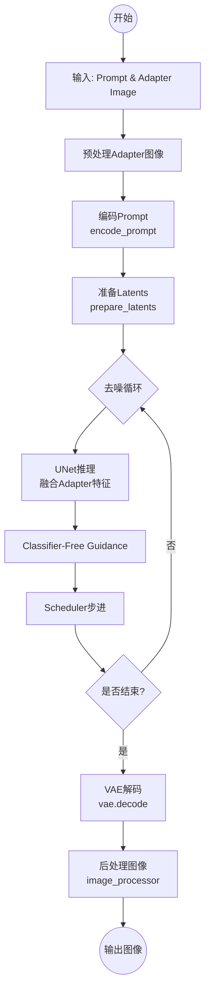
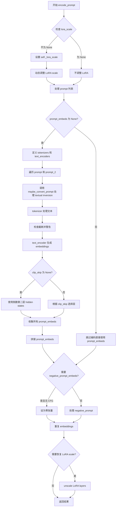
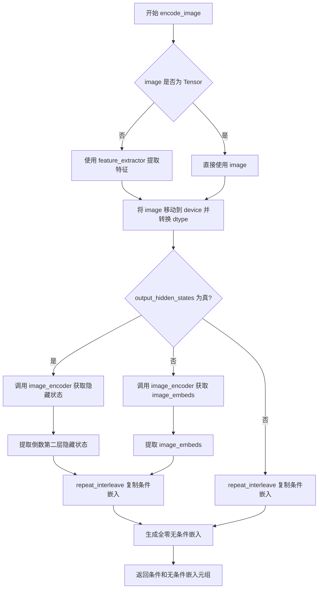
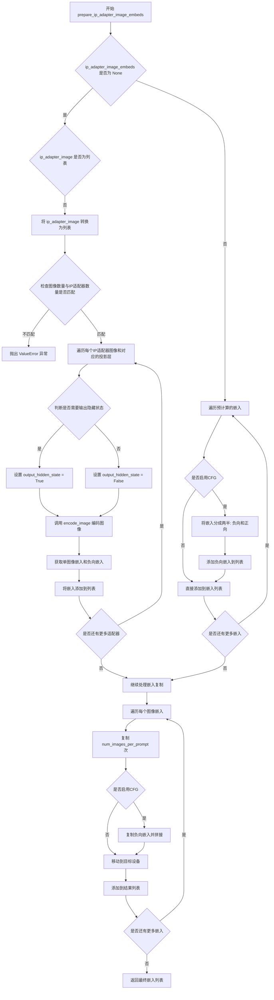
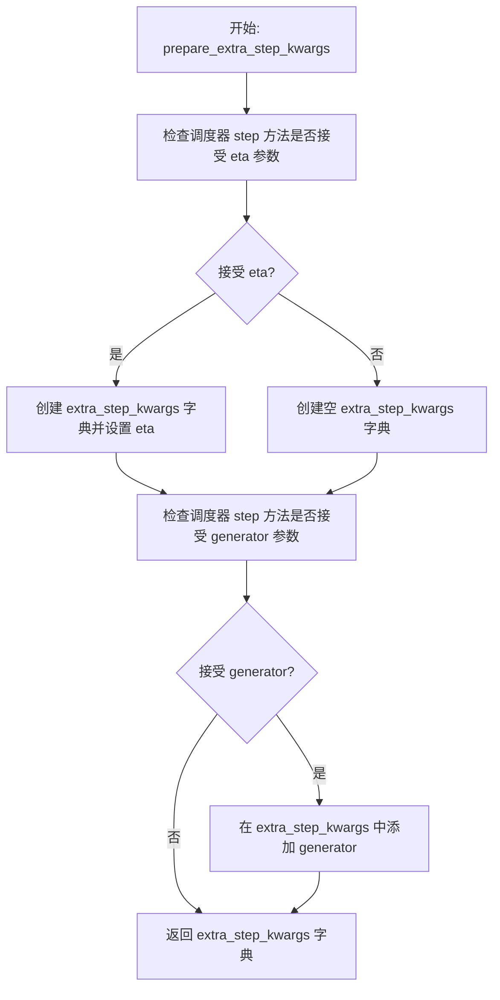
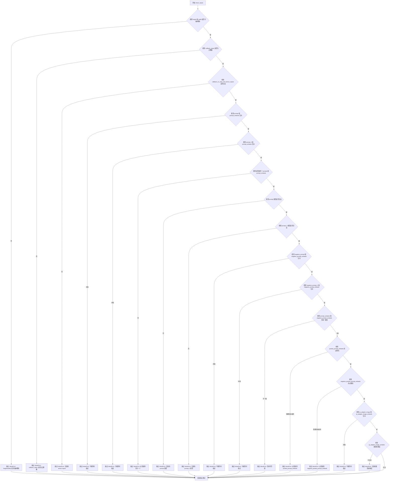
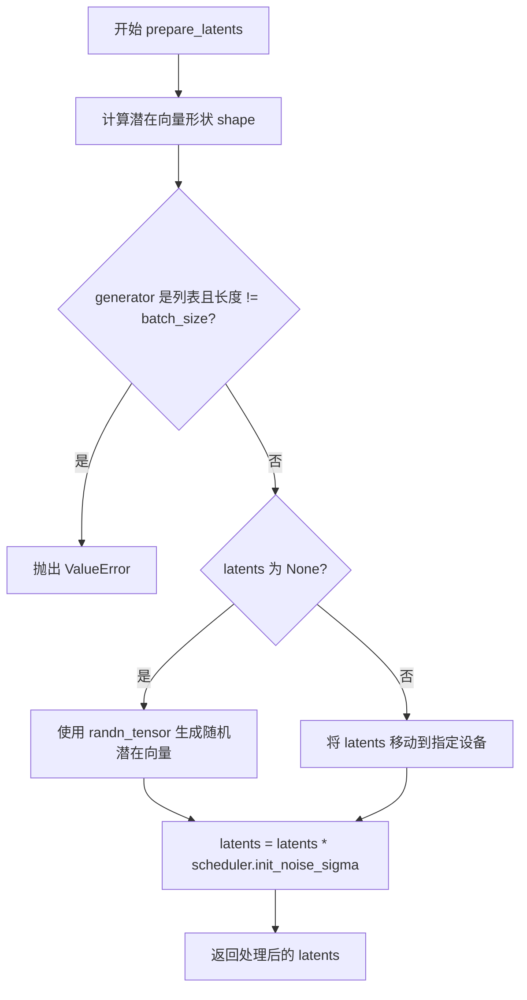
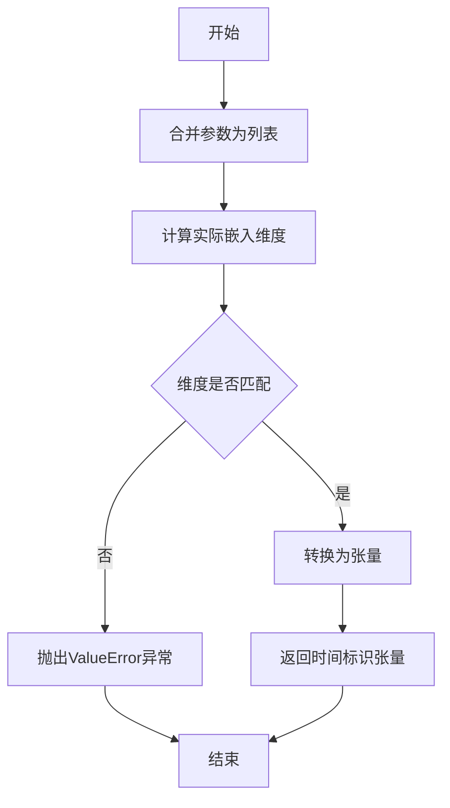
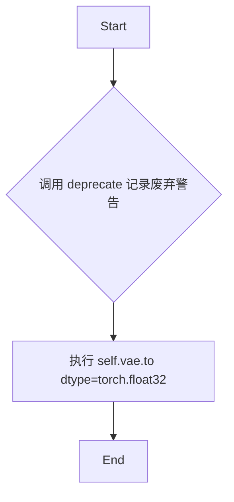
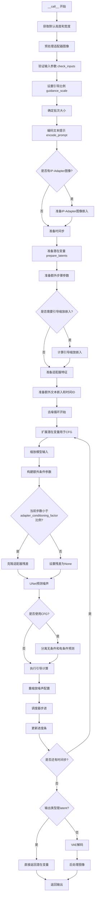

# `diffusers\src\diffusers\pipelines\t2i_adapter\pipeline_stable_diffusion_xl_adapter.py` 详细设计文档

A Diffusers pipeline implementation for text-to-image generation that combines Stable Diffusion XL (SDXL) with T2I-Adapter (e.g., Sketch/Canny) and IP-Adapter, supporting advanced conditioning, LoRA loading, and textual inversions.

## 整体流程



## 类结构

```
StableDiffusionXLAdapterPipeline
├── DiffusionPipeline (基类)
├── StableDiffusionMixin (SDXL混入)
├── TextualInversionLoaderMixin (文本反转加载)
├── StableDiffusionXLLoraLoaderMixin (XL LoRA加载)
├── IPAdapterMixin (IP Adapter加载)
└── FromSingleFileMixin (单文件加载)
```

## 全局变量及字段


### `logger`
    
模块级日志记录器，用于输出调试和信息类日志

类型：`logging.Logger`
    


### `EXAMPLE_DOC_STRING`
    
包含pipeline使用示例的文档字符串，展示如何进行text-to-image生成

类型：`str`
    


### `XLA_AVAILABLE`
    
标志位，指示PyTorch XLA是否可用，用于支持TPU加速

类型：`bool`
    


### `model_cpu_offload_seq`
    
定义模型组件CPU卸载顺序的字符串，按依赖顺序排列各模块

类型：`str`
    


### `_optional_components`
    
列出pipeline中可选的组件名称，用于动态加载和初始化检查

类型：`list[str]`
    


### `StableDiffusionXLAdapterPipeline.vae`
    
变分自编码器，用于将图像编码到潜在空间和解码回像素空间

类型：`AutoencoderKL`
    


### `StableDiffusionXLAdapterPipeline.text_encoder`
    
冻结的CLIP文本编码器，将文本提示转换为嵌入向量用于引导图像生成

类型：`CLIPTextModel`
    


### `StableDiffusionXLAdapterPipeline.text_encoder_2`
    
第二文本编码器，带投影层用于SDXL的双文本编码器架构

类型：`CLIPTextModelWithProjection`
    


### `StableDiffusionXLAdapterPipeline.tokenizer`
    
CLIP分词器，将文本字符串分词为token IDs序列

类型：`CLIPTokenizer`
    


### `StableDiffusionXLAdapterPipeline.tokenizer_2`
    
第二个CLIP分词器，用于双文本编码器系统的第二分支

类型：`CLIPTokenizer`
    


### `StableDiffusionXLAdapterPipeline.unet`
    
条件U-Net模型，在去噪过程中预测噪声以逐步生成图像

类型：`UNet2DConditionModel`
    


### `StableDiffusionXLAdapterPipeline.adapter`
    
T2I适配器，提供额外的条件信息来引导UNet的去噪过程

类型：`T2IAdapter | MultiAdapter | list[T2IAdapter]`
    


### `StableDiffusionXLAdapterPipeline.scheduler`
    
扩散调度器，控制去噪过程中的噪声调度和时间步长

类型：`KarrasDiffusionSchedulers`
    


### `StableDiffusionXLAdapterPipeline.feature_extractor`
    
CLIP图像处理器，从图像中提取特征用于安全检查器

类型：`CLIPImageProcessor`
    


### `StableDiffusionXLAdapterPipeline.image_encoder`
    
CLIP视觉编码器，用于处理IP-Adapter的图像输入

类型：`CLIPVisionModelWithProjection`
    


### `StableDiffusionXLAdapterPipeline.vae_scale_factor`
    
VAE缩放因子，用于计算潜在空间的尺寸，基于VAE块输出通道数

类型：`int`
    


### `StableDiffusionXLAdapterPipeline.image_processor`
    
VAE图像处理器，处理图像的预处理和后处理操作

类型：`VaeImageProcessor`
    


### `StableDiffusionXLAdapterPipeline.default_sample_size`
    
默认采样尺寸，来源于UNet配置的样本大小，用于确定生成图像的默认分辨率

类型：`int`
    
    

## 全局函数及方法


### `_preprocess_adapter_image`

该函数是 Stable Diffusion XL Adapter Pipeline 中的图像预处理函数，负责将多种格式（PIL.Image.Image、torch.Tensor、列表等）的适配器图像统一转换为符合模型输入要求的 4D PyTorch 张量（batch_size, channels, height, width）。

参数：

- `image`：`torch.Tensor | PIL.Image.Image | list[torch.Tensor] | list[PIL.Image.Image]`，待预处理的适配器图像输入，支持单个图像或图像列表
- `height`：`int`，目标输出高度（像素）
- `width`：`int`，目标输出宽度（像素）

返回值：`torch.Tensor`，预处理后的 4D 张量，形状为 (batch_size, channels, height, width)，数据类型为 float32

#### 流程图

```mermaid
flowchart TD
    A[开始: _preprocess_adapter_image] --> B{image 是 torch.Tensor?}
    B -->|Yes| E[直接返回 tensor]
    B -->|No| C{image 是 PIL.Image.Image?}
    C -->|Yes| F[转换为列表]
    C -->|No| G[假设已是列表]
    F --> H{image[0] 是 PIL.Image?}
    H -->|Yes| I[遍历调整大小为 width×height]
    I --> J[转为 numpy array 并归一化 0-1]
    J --> K[维度扩展: [h,w]→[1,h,w,1] 或 [h,w,c]→[1,h,w,c]]
    K --> L[拼接为 batch 维度]
    L --> M[维度转置: HWC → CHW]
    M --> N[转为 torch.Tensor]
    H -->|No| O{image[0] 是 torch.Tensor?}
    O -->|Yes| P{ndim == 3?}
    O -->|No| Q[抛出 ValueError]
    P -->|Yes| R[torch.stack 堆叠]
    P -->|No| S{ndim == 4?}
    S -->|Yes| T[torch.cat 拼接]
    S -->|No| Q
    Q --> U[返回预处理后的 tensor]
    E --> U
    N --> U
    R --> U
    T --> U
```

#### 带注释源码

```python
def _preprocess_adapter_image(image, height, width):
    """
    预处理适配器图像，将其转换为统一格式的 PyTorch 张量。
    
    Args:
        image: 输入图像，支持 torch.Tensor、PIL.Image.Image 或其列表形式
        height: 目标高度
        width: 目标宽度
    
    Returns:
        torch.Tensor: 预处理后的图像张量，形状为 (batch, channel, height, width)
    """
    # 1. 如果输入已经是 torch.Tensor，直接返回（可能已完成预处理）
    if isinstance(image, torch.Tensor):
        return image
    # 2. 如果是单个 PIL.Image，转换为列表以便统一处理
    elif isinstance(image, PIL.Image.Image):
        image = [image]

    # 3. 处理 PIL.Image.Image 列表
    if isinstance(image[0], PIL.Image.Image):
        # 3.1 调整每个图像大小到目标尺寸，使用 lanczos 插值
        image = [np.array(i.resize((width, height), resample=PIL_INTERPOLATION["lanczos"])) for i in image]
        # 3.2 扩展维度：从 [h, w] 或 [h, w, c] 扩展为 [1, h, w, c] 以支持批量处理
        image = [
            i[None, ..., None] if i.ndim == 2 else i[None, ...] for i in image
        ]
        # 3.3 在 batch 维度（0轴）拼接所有图像
        image = np.concatenate(image, axis=0)
        # 3.4 归一化到 [0, 1] 范围，转换为 float32
        image = np.array(image).astype(np.float32) / 255.0
        # 3.5 维度转置：从 HWC (height, width, channels) 转换为 CHW (channels, height, width)
        image = image.transpose(0, 3, 1, 2)
        # 3.6 转换为 PyTorch 张量
        image = torch.from_numpy(image)
    
    # 4. 处理 torch.Tensor 列表
    elif isinstance(image[0], torch.Tensor):
        # 4.1 3D 张量 (1, H, W) -> 使用 stack 保持批量维度
        if image[0].ndim == 3:
            image = torch.stack(image, dim=0)
        # 4.2 4D 张量 (B, H, W, C) -> 使用 cat 拼接
        elif image[0].ndim == 4:
            image = torch.cat(image, dim=0)
        # 4.3 维度不合法，抛出异常
        else:
            raise ValueError(
                f"Invalid image tensor! Expecting image tensor with 3 or 4 dimension, but receive: {image[0].ndim}"
            )
    
    return image
```


### `rescale_noise_cfg`

该函数用于根据 `guidance_rescale` 参数重新缩放噪声预测张量，以改善图像质量并修复过度曝光问题。该方法基于论文 Common Diffusion Noise Schedules and Sample Steps are Flawed (Section 3.4)。

参数：

- `noise_cfg`：`torch.Tensor`，引导扩散过程中预测的噪声张量（即 CFG 预测结果）
- `noise_pred_text`：`torch.Tensor`，文本引导扩散过程中预测的噪声张量（即条件预测结果）
- `guidance_rescale`：`float`，可选参数，默认值为 0.0，用于重新缩放噪声预测的因子

返回值：`torch.Tensor`，重新缩放后的噪声预测张量

#### 流程图

```mermaid
flowchart TD
    A[开始] --> B[计算 noise_pred_text 的标准差 std_text]
    B --> C[计算 noise_cfg 的标准差 std_cfg]
    C --> D[计算缩放后的噪声预测: noise_pred_rescaled = noise_cfg * std_text / std_cfg]
    D --> E[根据 guidance_rescale 混合: noise_cfg = guidance_rescale * noise_pred_rescaled + (1 - guidance_rescale) * noise_cfg]
    E --> F[返回重新缩放后的 noise_cfg]
```

#### 带注释源码

```python
def rescale_noise_cfg(noise_cfg, noise_pred_text, guidance_rescale=0.0):
    r"""
    Rescales `noise_cfg` tensor based on `guidance_rescale` to improve image quality and fix overexposure. Based on
    Section 3.4 from [Common Diffusion Noise Schedules and Sample Steps are
    Flawed](https://huggingface.co/papers/2305.08891).

    Args:
        noise_cfg (`torch.Tensor`):
            The predicted noise tensor for the guided diffusion process.
        noise_pred_text (`torch.Tensor`):
            The predicted noise tensor for the text-guided diffusion process.
        guidance_rescale (`float`, *optional*, defaults to 0.0):
            A rescale factor applied to the noise predictions.

    Returns:
        noise_cfg (`torch.Tensor`): The rescaled noise prediction tensor.
    """
    # 计算文本预测噪声的标准差（保留维度用于后续广播）
    std_text = noise_pred_text.std(dim=list(range(1, noise_pred_text.ndim)), keepdim=True)
    
    # 计算 CFG 预测噪声的标准差（保留维度用于后续广播）
    std_cfg = noise_cfg.std(dim=list(range(1, noise_cfg.ndim)), keepdim=True)
    
    # 根据论文方法，重新缩放噪声预测以修复过度曝光问题
    # 将 noise_cfg 缩放到与 noise_pred_text 相同的标准差尺度
    noise_pred_rescaled = noise_cfg * (std_text / std_cfg)
    
    # 使用 guidance_rescale 因子混合原始结果，避免生成"平淡"的图像
    # 当 guidance_rescale=1.0 时完全使用缩放后的结果
    # 当 guidance_rescale=0.0 时保留原始 CFG 结果（不进行重新缩放）
    noise_cfg = guidance_rescale * noise_pred_rescaled + (1 - guidance_rescale) * noise_cfg
    
    return noise_cfg
```


### `retrieve_timesteps`

该函数是 DiffusionPipeline 中用于获取推理所需时间步（timesteps）的核心工具函数。它负责调用调度器（Scheduler）的 `set_timesteps` 方法，并根据传入的自定义参数（自定义时间步或自定义 sigmas）或默认配置，生成并返回最终的时间步序列以及实际的推理步数。

参数：

- `scheduler`：`SchedulerMixin`，调度器对象，用于生成时间步。
- `num_inference_steps`：`int | None`，扩散模型推理的步数。如果使用了此参数，`timesteps` 必须为 `None`。
- `device`：`str | torch.device | None`，时间步要迁移到的设备。如果为 `None`，则不移动。
- `timesteps`：`list[int] | None`，自定义的时间步列表，用于覆盖调度器的默认时间步策略。如果传入此参数，`num_inference_steps` 和 `sigmas` 必须为 `None`。
- `sigmas`：`list[float] | None`，自定义的 sigmas 列表，用于覆盖调度器的默认时间步策略。如果传入此参数，`num_inference_steps` 和 `timesteps` 必须为 `None`。
- `**kwargs`：任意关键字参数，将传递给调度器的 `set_timesteps` 方法。

返回值：`tuple[torch.Tensor, int]`，元组包含两个元素：第一个是调度器生成的时间步序列（Tensor），第二个是实际的推理步数（int）。

#### 流程图

```mermaid
flowchart TD
    A([开始]) --> B{检查: timesteps 和 sigmas 是否同时存在?}
    B -- 是 --> C[抛出 ValueError: 只能选择其中一个]
    B -- 否 --> D{timesteps 是否非空?}
    D -- 是 --> E[检查 scheduler.set_timesteps 是否接受 timesteps]
    E -- 不接受 --> F[抛出 ValueError: 当前调度器不支持自定义 timesteps]
    E -- 接受 --> G[调用 scheduler.set_timesteps<br/>传入 timesteps 和 device]
    G --> H[获取 scheduler.timesteps]
    H --> I[计算 num_inference_steps = len(timesteps)]
    I --> J[返回 timesteps, num_inference_steps]
    
    D -- 否 --> K{sigmas 是否非空?}
    K -- 是 --> L[检查 scheduler.set_timesteps 是否接受 sigmas]
    L -- 不接受 --> M[抛出 ValueError: 当前调度器不支持自定义 sigmas]
    L -- 接受 --> N[调用 scheduler.set_timesteps<br/>传入 sigmas 和 device]
    N --> O[获取 scheduler.timesteps]
    O --> P[计算 num_inference_steps = len(timesteps)]
    P --> J
    
    K -- 否 --> Q[调用 scheduler.set_timesteps<br/>传入 num_inference_steps 和 device]
    Q --> R[获取 scheduler.timesteps]
    R --> J
    
    J --> S([结束])
```

#### 带注释源码

```python
def retrieve_timesteps(
    scheduler,
    num_inference_steps: int | None = None,
    device: str | torch.device | None = None,
    timesteps: list[int] | None = None,
    sigmas: list[float] | None = None,
    **kwargs,
):
    r"""
    Calls the scheduler's `set_timesteps` method and retrieves timesteps from the scheduler after the call. Handles
    custom timesteps. Any kwargs will be supplied to `scheduler.set_timesteps`.

    Args:
        scheduler (`SchedulerMixin`):
            The scheduler to get timesteps from.
        num_inference_steps (`int`):
            The number of diffusion steps used when generating samples with a pre-trained model. If used, `timesteps`
            must be `None`.
        device (`str` or `torch.device`, *optional*):
            The device to which the timesteps should be moved to. If `None`, the timesteps are not moved.
        timesteps (`list[int]`, *optional*):
            Custom timesteps used to override the timestep spacing strategy of the scheduler. If `timesteps` is passed,
            `num_inference_steps` and `sigmas` must be `None`.
        sigmas (`list[float]`, *optional*):
            Custom sigmas used to override the timestep spacing strategy of the scheduler. If `sigmas` is passed,
            `num_inference_steps` and `timesteps` must be `None`.

    Returns:
        `tuple[torch.Tensor, int]`: A tuple where the first element is the timestep schedule from the scheduler and the
        second element is the number of inference steps.
    """
    # 校验参数：timesteps 和 sigmas 互斥，不能同时传入
    if timesteps is not None and sigmas is not None:
        raise ValueError("Only one of `timesteps` or `sigmas` can be passed. Please choose one to set custom values")
    
    # 场景1：使用自定义 timesteps
    if timesteps is not None:
        # 通过 inspect 检查 scheduler.set_timesteps 方法是否接受 timesteps 参数
        accepts_timesteps = "timesteps" in set(inspect.signature(scheduler.set_timesteps).parameters.keys())
        if not accepts_timesteps:
            raise ValueError(
                f"The current scheduler class {scheduler.__class__}'s `set_timesteps` does not support custom"
                f" timestep schedules. Please check whether you are using the correct scheduler."
            )
        # 调用调度器的 set_timesteps 方法
        scheduler.set_timesteps(timesteps=timesteps, device=device, **kwargs)
        # 从调度器获取生成的时间步
        timesteps = scheduler.timesteps
        # 计算推理步数
        num_inference_steps = len(timesteps)
    
    # 场景2：使用自定义 sigmas
    elif sigmas is not None:
        # 通过 inspect 检查 scheduler.set_timesteps 方法是否接受 sigmas 参数
        accept_sigmas = "sigmas" in set(inspect.signature(scheduler.set_timesteps).parameters.keys())
        if not accept_sigmas:
            raise ValueError(
                f"The current scheduler class {scheduler.__class__}'s `set_timesteps` does not support custom"
                f" sigmas schedules. Please check whether you are using the correct scheduler."
            )
        scheduler.set_timesteps(sigmas=sigmas, device=device, **kwargs)
        timesteps = scheduler.timesteps
        num_inference_steps = len(timesteps)
    
    # 场景3：使用默认配置，仅传入 num_inference_steps
    else:
        scheduler.set_timesteps(num_inference_steps, device=device, **kwargs)
        timesteps = scheduler.timesteps
        
    # 返回时间步序列和推理步数
    return timesteps, num_inference_steps
```


### StableDiffusionXLAdapterPipeline.__init__

该方法是 StableDiffusionXLAdapterPipeline 类的构造函数，负责初始化整个 T2I-Adapter 管道所需的各个组件，包括 VAE、文本编码器、UNet、适配器、调度器等，并注册到管道模块中，同时配置图像处理的缩放因子和默认样本大小。

参数：

- `vae`：`AutoencoderKL`，Variational Auto-Encoder (VAE) 模型，用于将图像编码和解码到潜在表示
- `text_encoder`：`CLIPTextModel`，冻结的文本编码器，Stable Diffusion 使用 CLIP 的文本部分
- `text_encoder_2`：`CLIPTextModelWithProjection`，SDXL 的第二个文本编码器，带投影层
- `tokenizer`：`CLIPTokenizer`，第一个分词器，用于将文本转换为 token
- `tokenizer_2`：`CLIPTokenizer`，第二个分词器，用于 SDXL 的文本编码
- `unet`：`UNet2DConditionModel`，条件 U-Net 架构，用于对编码的图像潜在表示进行去噪
- `adapter`：`T2IAdapter | MultiAdapter | list[T2IAdapter]`，T2I-Adapter 模型，提供额外的条件信息
- `scheduler`：`KarrasDiffusionSchedulers`，调度器，与 unet 结合用于去噪潜在表示
- `force_zeros_for_empty_prompt`：`bool`，默认为 True，当提示为空时是否强制为零
- `feature_extractor`：`CLIPImageProcessor`，可选，从生成图像中提取特征的模型
- `image_encoder`：`CLIPVisionModelWithProjection`，可选，用于 IP-Adapter 的图像编码器

返回值：无（`None`），构造函数不返回值

#### 流程图

```mermaid
flowchart TD
    A[__init__ 开始] --> B[调用 super().__init__ 初始化基类]
    B --> C[register_modules 注册所有模块]
    C --> D[register_to_config 注册配置参数]
    D --> E[计算 vae_scale_factor]
    E --> F[创建 VaeImageProcessor]
    F --> G[计算 default_sample_size]
    G --> H[__init__ 结束]
```

#### 带注释源码

```python
def __init__(
    self,
    vae: AutoencoderKL,                                    # VAE模型，用于编解码图像潜在表示
    text_encoder: CLIPTextModel,                            # 第一个文本编码器 (CLIP)
    text_encoder_2: CLIPTextModelWithProjection,            # 第二个文本编码器 (SDXL专用)
    tokenizer: CLIPTokenizer,                               # 第一个分词器
    tokenizer_2: CLIPTokenizer,                             # 第二个分词器
    unet: UNet2DConditionModel,                             # 条件UNet去噪网络
    adapter: T2IAdapter | MultiAdapter | list[T2IAdapter],  # T2I-Adapter模型
    scheduler: KarrasDiffusionSchedulers,                   # 噪声调度器
    force_zeros_for_empty_prompt: bool = True,              # 空提示时是否强制零向量
    feature_extractor: CLIPImageProcessor = None,           # 可选：图像特征提取器
    image_encoder: CLIPVisionModelWithProjection = None,     # 可选：IP-Adapter图像编码器
):
    # 1. 调用父类构造函数，进行基础初始化
    super().__init__()

    # 2. 注册所有子模块，使管道可以正确保存/加载模型
    self.register_modules(
        vae=vae,
        text_encoder=text_encoder,
        text_encoder_2=text_encoder_2,
        tokenizer=tokenizer,
        tokenizer_2=tokenizer_2,
        unet=unet,
        adapter=adapter,
        scheduler=scheduler,
        feature_extractor=feature_extractor,
        image_encoder=image_encoder,
    )

    # 3. 将 force_zeros_for_empty_prompt 注册到配置中
    self.register_to_config(force_zeros_for_empty_prompt=force_zeros_for_empty_prompt)

    # 4. 计算VAE缩放因子，用于潜在空间到像素空间的转换
    # 基于VAE的block_out_channels计算，典型值为8
    self.vae_scale_factor = 2 ** (len(self.vae.config.block_out_channels) - 1) if getattr(self, "vae", None) else 8

    # 5. 创建图像处理器，用于VAE前后的图像预处理和后处理
    self.image_processor = VaeImageProcessor(vae_scale_factor=self.vae_scale_factor)

    # 6. 计算默认样本大小，用于确定生成图像的分辨率
    # 从UNet配置中获取sample_size，默认为128
    self.default_sample_size = (
        self.unet.config.sample_size
        if hasattr(self, "unet") and self.unet is not None and hasattr(self.unet.config, "sample_size")
        else 128
    )
```


### `StableDiffusionXLAdapterPipeline.encode_prompt`

该方法负责将文本提示（prompt）编码为文本编码器的隐藏状态（hidden states），支持双文本编码器（CLIP Text Encoder 和 CLIP Text Encoder 2）架构，用于 Stable Diffusion XL 模型的文本条件生成。

参数：

- `prompt`：`str | list[str] | None`，要编码的主提示文本
- `prompt_2`：`str | list[str] | None`，发送给第二个 tokenizer 和 text_encoder_2 的提示，若不定义则使用 prompt
- `device`：`torch.device | None`，torch 设备，若为 None 则使用执行设备
- `num_images_per_prompt`：`int`，每个提示生成的图像数量，默认为 1
- `do_classifier_free_guidance`：`bool`，是否使用无分类器引导，默认为 True
- `negative_prompt`：`str | list[str] | None`，负向提示，用于引导图像生成方向
- `negative_prompt_2`：`str | list[str] | None`，发送给第二个编码器的负向提示
- `prompt_embeds`：`torch.Tensor | None`，预生成的文本嵌入，可用于轻松调整文本输入
- `negative_prompt_embeds`：`torch.Tensor | None`，预生成的负向文本嵌入
- `pooled_prompt_embeds`：`torch.Tensor | None`，预生成的池化文本嵌入
- `negative_pooled_prompt_embeds`：`torch.Tensor | None`，预生成的负向池化文本嵌入
- `lora_scale`：`float | None`，LoRA 缩放因子，用于调整 LoRA 层的影响
- `clip_skip`：`int | None`，计算提示嵌入时从 CLIP 跳过的层数

返回值：`tuple[torch.Tensor, torch.Tensor, torch.Tensor, torch.Tensor]`，返回四个张量：
- `prompt_embeds`：编码后的提示嵌入
- `negative_prompt_embeds`：编码后的负向提示嵌入
- `pooled_prompt_embeds`：池化后的提示嵌入
- `negative_pooled_prompt_embeds`：池化后的负向提示嵌入

#### 流程图



#### 带注释源码

```python
def encode_prompt(
    self,
    prompt: str,
    prompt_2: str | None = None,
    device: torch.device | None = None,
    num_images_per_prompt: int = 1,
    do_classifier_free_guidance: bool = True,
    negative_prompt: str | None = None,
    negative_prompt_2: str | None = None,
    prompt_embeds: torch.Tensor | None = None,
    negative_prompt_embeds: torch.Tensor | None = None,
    pooled_prompt_embeds: torch.Tensor | None = None,
    negative_pooled_prompt_embeds: torch.Tensor | None = None,
    lora_scale: float | None = None,
    clip_skip: int | None = None,
):
    r"""
    Encodes the prompt into text encoder hidden states.

    Args:
        prompt (`str` or `list[str]`, *optional*):
            prompt to be encoded
        prompt_2 (`str` or `list[str]`, *optional*):
            The prompt or prompts to be sent to the `tokenizer_2` and `text_encoder_2`. If not defined, `prompt` is
            used in both text-encoders
        device: (`torch.device`):
            torch device
        num_images_per_prompt (`int`):
            number of images that should be generated per prompt
        do_classifier_free_guidance (`bool`):
            whether to use classifier free guidance or not
        negative_prompt (`str` or `list[str]`, *optional*):
            The prompt or prompts not to guide the image generation. If not defined, one has to pass
            `negative_prompt_embeds` instead. Ignored when not using guidance (i.e., ignored if `guidance_scale` is
            less than `1`).
        negative_prompt_2 (`str` or `list[str]`, *optional*):
            The prompt or prompts not to guide the image generation to be sent to `tokenizer_2` and
            `text_encoder_2`. If not defined, `negative_prompt` is used in both text-encoders
        prompt_embeds (`torch.Tensor`, *optional*):
            Pre-generated text embeddings. Can be used to easily tweak text inputs, *e.g.* prompt weighting. If not
            provided, text embeddings will be generated from `prompt` input argument.
        negative_prompt_embeds (`torch.Tensor`, *optional*):
            Pre-generated negative text embeddings. Can be used to easily tweak text inputs, *e.g.* prompt
            weighting. If not provided, negative_prompt_embeds will be generated from `negative_prompt` input
            argument.
        pooled_prompt_embeds (`torch.Tensor`, *optional*):
            Pre-generated pooled text embeddings. Can be used to easily tweak text inputs, *e.g.* prompt weighting.
            If not provided, pooled text embeddings will be generated from `prompt` input argument.
        negative_pooled_prompt_embeds (`torch.Tensor`, *optional*):
            Pre-generated negative pooled text embeddings. Can be used to easily tweak text inputs, *e.g.* prompt
            weighting. If not provided, pooled negative_prompt_embeds will be generated from `negative_prompt`
            input argument.
        lora_scale (`float`, *optional*):
            A lora scale that will be applied to all LoRA layers of the text encoder if LoRA layers are loaded.
        clip_skip (`int`, *optional*):
            Number of layers to be skipped from CLIP while computing the prompt embeddings. A value of 1 means that
            the output of the pre-final layer will be used for computing the prompt embeddings.
    """
    # 确定设备，默认为执行设备
    device = device or self._execution_device

    # 设置 LoRA scale，使 monkey patched LoRA 函数可以正确访问
    # 只有在存在 LoRA loader mixin 时才处理
    if lora_scale is not None and isinstance(self, StableDiffusionXLLoraLoaderMixin):
        self._lora_scale = lora_scale

        # 动态调整 LoRA scale
        if self.text_encoder is not None:
            if not USE_PEFT_BACKEND:
                adjust_lora_scale_text_encoder(self.text_encoder, lora_scale)
            else:
                scale_lora_layers(self.text_encoder, lora_scale)

        if self.text_encoder_2 is not None:
            if not USE_PEFT_BACKEND:
                adjust_lora_scale_text_encoder(self.text_encoder_2, lora_scale)
            else:
                scale_lora_layers(self.text_encoder_2, lora_scale)

    # 将 prompt 转换为列表，统一处理
    prompt = [prompt] if isinstance(prompt, str) else prompt

    # 确定 batch_size
    if prompt is not None:
        batch_size = len(prompt)
    else:
        batch_size = prompt_embeds.shape[0]

    # 定义 tokenizers 和 text encoders
    # 如果 tokenizer 不为 None，则使用两个，否则只使用 tokenizer_2
    tokenizers = [self.tokenizer, self.tokenizer_2] if self.tokenizer is not None else [self.tokenizer_2]
    text_encoders = (
        [self.text_encoder, self.text_encoder_2] if self.text_encoder is not None else [self.text_encoder_2]
    )

    # 如果未提供 prompt_embeds，则从 prompt 生成
    if prompt_embeds is None:
        # prompt_2 默认等于 prompt
        prompt_2 = prompt_2 or prompt
        prompt_2 = [prompt_2] if isinstance(prompt_2, str) else prompt_2

        # textual inversion: 如果需要，处理多向量 token
        prompt_embeds_list = []
        prompts = [prompt, prompt_2]
        
        # 遍历两个 prompt（CLIP Text Encoder 和 CLIP Text Encoder 2）
        for prompt, tokenizer, text_encoder in zip(prompts, tokenizers, text_encoders):
            # 如果包含 TextualInversionLoaderMixin，可能需要转换 prompt
            if isinstance(self, TextualInversionLoaderMixin):
                prompt = self.maybe_convert_prompt(prompt, tokenizer)

            # tokenizer 处理文本
            text_inputs = tokenizer(
                prompt,
                padding="max_length",
                max_length=tokenizer.model_max_length,
                truncation=True,
                return_tensors="pt",
            )

            text_input_ids = text_inputs.input_ids
            
            # 获取未截断的 token ids 用于检查
            untruncated_ids = tokenizer(prompt, padding="longest", return_tensors="pt").input_ids

            # 检查是否有内容被截断，并记录警告
            if untruncated_ids.shape[-1] >= text_input_ids.shape[-1] and not torch.equal(
                text_input_ids, untruncated_ids
            ):
                removed_text = tokenizer.batch_decode(untruncated_ids[:, tokenizer.model_max_length - 1 : -1])
                logger.warning(
                    "The following part of your input was truncated because CLIP can only handle sequences up to"
                    f" {tokenizer.model_max_length} tokens: {removed_text}"
                )

            # text_encoder 生成 embeddings
            prompt_embeds = text_encoder(text_input_ids.to(device), output_hidden_states=True)

            # 获取池化输出（最终层的 pooled output）
            if pooled_prompt_embeds is None and prompt_embeds[0].ndim == 2:
                pooled_prompt_embeds = prompt_embeds[0]

            # 根据 clip_skip 选择 hidden states 层
            if clip_skip is None:
                prompt_embeds = prompt_embeds.hidden_states[-2]  # 默认使用倒数第二层
            else:
                # "2" 因为 SDXL 总是从倒数第二层索引
                prompt_embeds = prompt_embeds.hidden_states[-(clip_skip + 2)]

            prompt_embeds_list.append(prompt_embeds)

        # 沿最后一个维度拼接两个 text encoder 的 embeddings
        prompt_embeds = torch.concat(prompt_embeds_list, dim=-1)

    # 获取无分类器引导的无条件 embeddings
    zero_out_negative_prompt = negative_prompt is None and self.config.force_zeros_for_empty_prompt
    
    # 如果使用 CFG 且没有提供 negative_prompt_embeds 且需要置零
    if do_classifier_free_guidance and negative_prompt_embeds is None and zero_out_negative_prompt:
        negative_prompt_embeds = torch.zeros_like(prompt_embeds)
        negative_pooled_prompt_embeds = torch.zeros_like(pooled_prompt_embeds)
    # 如果使用 CFG 但没有 negative_prompt_embeds，则从 negative_prompt 生成
    elif do_classifier_free_guidance and negative_prompt_embeds is None:
        negative_prompt = negative_prompt or ""
        negative_prompt_2 = negative_prompt_2 or negative_prompt

        # 标准化为列表
        negative_prompt = batch_size * [negative_prompt] if isinstance(negative_prompt, str) else negative_prompt
        negative_prompt_2 = (
            batch_size * [negative_prompt_2] if isinstance(negative_prompt_2, str) else negative_prompt_2
        )

        uncond_tokens: list[str]
        
        # 类型检查
        if prompt is not None and type(prompt) is not type(negative_prompt):
            raise TypeError(
                f"`negative_prompt` should be the same type to `prompt`, but got {type(negative_prompt)} !="
                f" {type(prompt)}."
            )
        elif batch_size != len(negative_prompt):
            raise ValueError(
                f"`negative_prompt`: {negative_prompt} has batch size {len(negative_prompt)}, but `prompt`:"
                f" {prompt} has batch size {batch_size}. Please make sure that passed `negative_prompt` matches"
                " the batch size of `prompt`."
            )
        else:
            uncond_tokens = [negative_prompt, negative_prompt_2]

        negative_prompt_embeds_list = []
        
        # 遍历生成 negative prompt embeddings
        for negative_prompt, tokenizer, text_encoder in zip(uncond_tokens, tokenizers, text_encoders):
            if isinstance(self, TextualInversionLoaderMixin):
                negative_prompt = self.maybe_convert_prompt(negative_prompt, tokenizer)

            max_length = prompt_embeds.shape[1]
            uncond_input = tokenizer(
                negative_prompt,
                padding="max_length",
                max_length=max_length,
                truncation=True,
                return_tensors="pt",
            )

            negative_prompt_embeds = text_encoder(
                uncond_input.input_ids.to(device),
                output_hidden_states=True,
            )

            # 获取池化输出
            if negative_pooled_prompt_embeds is None and negative_prompt_embeds[0].ndim == 2:
                negative_pooled_prompt_embeds = negative_prompt_embeds[0]
            negative_prompt_embeds = negative_prompt_embeds.hidden_states[-2]

            negative_prompt_embeds_list.append(negative_prompt_embeds)

        # 拼接 negative prompt embeddings
        negative_prompt_embeds = torch.concat(negative_prompt_embeds_list, dim=-1)

    # 转换 embeddings 的 dtype 和 device
    if self.text_encoder_2 is not None:
        prompt_embeds = prompt_embeds.to(dtype=self.text_encoder_2.dtype, device=device)
    else:
        prompt_embeds = prompt_embeds.to(dtype=self.unet.dtype, device=device)

    # 获取 embeddings 的形状
    bs_embed, seq_len, _ = prompt_embeds.shape
    
    # 复制 text embeddings 以支持每个 prompt 生成多个图像
    # 使用 MPS 友好的方法
    prompt_embeds = prompt_embeds.repeat(1, num_images_per_prompt, 1)
    prompt_embeds = prompt_embeds.view(bs_embed * num_images_per_prompt, seq_len, -1)

    # 如果使用无分类器引导
    if do_classifier_free_guidance:
        # 复制无条件 embeddings 以支持每个 prompt 生成多个图像
        seq_len = negative_prompt_embeds.shape[1]

        if self.text_encoder_2 is not None:
            negative_prompt_embeds = negative_prompt_embeds.to(dtype=self.text_encoder_2.dtype, device=device)
        else:
            negative_prompt_embeds = negative_prompt_embeds.to(dtype=self.unet.dtype, device=device)

        negative_prompt_embeds = negative_prompt_embeds.repeat(1, num_images_per_prompt, 1)
        negative_prompt_embeds = negative_prompt_embeds.view(batch_size * num_images_per_prompt, seq_len, -1)

    # 复制 pooled embeddings
    pooled_prompt_embeds = pooled_prompt_embeds.repeat(1, num_images_per_prompt).view(
        bs_embed * num_images_per_prompt, -1
    )
    if do_classifier_free_guidance:
        negative_pooled_prompt_embeds = negative_pooled_prompt_embeds.repeat(1, num_images_per_prompt).view(
            bs_embed * num_images_per_prompt, -1
        )

    # 如果使用 PEFT backend，恢复 LoRA layers 的原始 scale
    if self.text_encoder is not None:
        if isinstance(self, StableDiffusionXLLoraLoaderMixin) and USE_PEFT_BACKEND:
            # 通过 unscale LoRA layers 恢复原始 scale
            unscale_lora_layers(self.text_encoder, lora_scale)

    if self.text_encoder_2 is not None:
        if isinstance(self, StableDiffusionXLLoraLoaderMixin) and USE_PEFT_BACKEND:
            unscale_lora_layers(self.text_encoder_2, lora_scale)

    # 返回编码后的 embeddings
    return prompt_embeds, negative_prompt_embeds, pooled_prompt_embeds, negative_pooled_prompt_embeds
```


### `StableDiffusionXLAdapterPipeline.encode_image`

该方法将输入图像编码为图像嵌入（image embeddings）或隐藏状态（hidden states），用于条件扩散模型的图像生成过程。它支持两种模式：输出图像嵌入或输出图像编码器的隐藏状态，并同时生成对应的无条件（unconditional）图像嵌入以支持 classifier-free guidance。

参数：

- `image`：`torch.Tensor | PIL.Image.Image`，需要编码的输入图像
- `device`：`torch.device`，图像数据将要移动到的目标设备
- `num_images_per_prompt`：`int`，每个 prompt 生成的图像数量，用于复制图像嵌入
- `output_hidden_states`：`bool | None`，可选参数，决定是否返回图像编码器的隐藏状态而非图像嵌入

返回值：`tuple[torch.Tensor, torch.Tensor]`，返回两个张量组成的元组：
- 第一个元素是条件图像嵌入（或隐藏状态），对应原始输入图像
- 第二个元素是无条件图像嵌入（或隐藏状态），全零张量，用于 classifier-free guidance

#### 流程图



#### 带注释源码

```python
def encode_image(self, image, device, num_images_per_prompt, output_hidden_states=None):
    """
    将输入图像编码为图像嵌入或隐藏状态，用于条件扩散模型生成。
    
    Args:
        image: 输入图像，PIL.Image 或 torch.Tensor
        device: 目标设备
        num_images_per_prompt: 每个prompt生成的图像数量
        output_hidden_states: 是否返回隐藏状态而非嵌入
    """
    # 获取图像编码器的参数数据类型
    dtype = next(self.image_encoder.parameters()).dtype

    # 如果输入不是tensor，使用feature_extractor进行预处理
    if not isinstance(image, torch.Tensor):
        image = self.feature_extractor(image, return_tensors="pt").pixel_values

    # 将图像移动到指定设备并转换数据类型
    image = image.to(device=device, dtype=dtype)
    
    # 根据output_hidden_states参数决定输出格式
    if output_hidden_states:
        # 返回隐藏状态模式：获取倒数第二层的隐藏状态
        image_enc_hidden_states = self.image_encoder(image, output_hidden_states=True).hidden_states[-2]
        # 复制条件嵌入以匹配num_images_per_prompt
        image_enc_hidden_states = image_enc_hidden_states.repeat_interleave(num_images_per_prompt, dim=0)
        
        # 生成无条件嵌入（全零），用于classifier-free guidance
        uncond_image_enc_hidden_states = self.image_encoder(
            torch.zeros_like(image), output_hidden_states=True
        ).hidden_states[-2]
        uncond_image_enc_hidden_states = uncond_image_enc_hidden_states.repeat_interleave(
            num_images_per_prompt, dim=0
        )
        return image_enc_hidden_states, uncond_image_enc_hidden_states
    else:
        # 标准模式：直接获取图像嵌入
        image_embeds = self.image_encoder(image).image_embeds
        image_embeds = image_embeds.repeat_interleave(num_images_per_prompt, dim=0)
        # 生成无条件嵌入（全零）
        uncond_image_embeds = torch.zeros_like(image_embeds)

        return image_embeds, uncond_image_embeds
```


### StableDiffusionXLAdapterPipeline.prepare_ip_adapter_image_embeds

该方法负责为IP-Adapter准备图像嵌入向量，处理图像输入或预计算的嵌入，并根据是否启用分类器自由引导（CFG）来生成正向和负向图像嵌入，最后将嵌入复制到指定设备上以供后续去噪过程使用。

参数：

- `self`：`StableDiffusionXLAdapterPipeline` 实例本身
- `ip_adapter_image`：`PipelineImageInput | None`，要处理的IP-Adapter输入图像，可以是单个图像或图像列表
- `ip_adapter_image_embeds`：`list[torch.Tensor] | None`，预计算的图像嵌入向量列表，如果为None则从图像编码
- `device`：`torch.device`，目标设备，用于将嵌入移动到指定设备
- `num_images_per_prompt`：`int`，每个提示生成的图像数量，用于复制嵌入维度
- `do_classifier_free_guidance`：`bool`，是否启用分类器自由引导，启用时需要生成负向嵌入

返回值：`list[torch.Tensor]`，处理后的IP-Adapter图像嵌入列表，每个元素为拼接了负向嵌入（如果启用CFG）的张量

#### 流程图



#### 带注释源码

```python
def prepare_ip_adapter_image_embeds(
    self,
    ip_adapter_image,                          # IP-Adapter输入图像或图像列表
    ip_adapter_image_embeds,                   # 预计算的图像嵌入(可选)
    device,                                     # 目标设备
    num_images_per_prompt,                      # 每个prompt生成的图像数量
    do_classifier_free_guidance                # 是否启用分类器自由引导
):
    """
    准备IP-Adapter的图像嵌入向量。
    
    处理两种情况:
    1. 提供原始图像: 编码图像生成嵌入
    2. 提供预计算嵌入: 直接使用传入的嵌入
    
    根据do_classifier_free_guidance参数决定是否生成负向嵌入。
    """
    
    # 初始化正向图像嵌入列表
    image_embeds = []
    
    # 如果启用CFG，同时初始化负向图像嵌入列表
    if do_classifier_free_guidance:
        negative_image_embeds = []
    
    # 情况1: 未提供预计算嵌入，需要从图像编码
    if ip_adapter_image_embeds is None:
        # 确保图像是列表格式
        if not isinstance(ip_adapter_image, list):
            ip_adapter_image = [ip_adapter_image]

        # 验证图像数量与IP适配器数量匹配
        # IP-Adapter数量由unet的encoder_hid_proj.image_projection_layers决定
        if len(ip_adapter_image) != len(self.unet.encoder_hid_proj.image_projection_layers):
            raise ValueError(
                f"`ip_adapter_image` must have same length as the number of IP Adapters. "
                f"Got {len(ip_adapter_image)} images and "
                f"{len(self.unet.encoder_hid_proj.image_projection_layers)} IP Adapters."
            )

        # 遍历每个IP-Adapter图像和对应的图像投影层
        for single_ip_adapter_image, image_proj_layer in zip(
            ip_adapter_image, self.unet.encoder_hid_proj.image_projection_layers
        ):
            # 确定是否需要输出隐藏状态
            # 如果投影层不是ImageProjection类型，则需要输出隐藏状态
            output_hidden_state = not isinstance(image_proj_layer, ImageProjection)
            
            # 调用encode_image方法编码单个图像
            # 返回正向嵌入和负向嵌入(如果启用CFG)
            single_image_embeds, single_negative_image_embeds = self.encode_image(
                single_ip_adapter_image,  # 单个IP-Adapter图像
                device,                   # 设备
                1,                        # num_images_per_prompt=1(编码时)
                output_hidden_state       # 是否输出隐藏状态
            )

            # 将正向嵌入添加到列表(在batch维度添加新维度)
            image_embeds.append(single_image_embeds[None, :])
            
            # 如果启用CFG，添加负向嵌入
            if do_classifier_free_guidance:
                negative_image_embeds.append(single_negative_image_embeds[None, :])
    
    # 情况2: 已提供预计算嵌入，直接使用
    else:
        for single_image_embeds in ip_adapter_image_embeds:
            if do_classifier_free_guidance:
                # 预计算的嵌入通常包含CFG的正向和负向两部分
                # 使用chunk(2)将它们分开
                single_negative_image_embeds, single_image_embeds = single_image_embeds.chunk(2)
                negative_image_embeds.append(single_negative_image_embeds)
            
            image_embeds.append(single_image_embeds)

    # 处理嵌入复制和设备转移
    ip_adapter_image_embeds = []
    
    # 遍历每个图像嵌入
    for i, single_image_embeds in enumerate(image_embeds):
        # 根据num_images_per_prompt复制嵌入
        # 将[1, emb_dim] -> [num_images_per_prompt, emb_dim]
        single_image_embeds = torch.cat([single_image_embeds] * num_images_per_prompt, dim=0)
        
        if do_classifier_free_guidance:
            # 同样复制负向嵌入
            single_negative_image_embeds = torch.cat([negative_image_embeds[i]] * num_images_per_prompt, dim=0)
            # 在embedding维度拼接负向和正向嵌入
            # 结果: [2*num_images_per_prompt, emb_dim]
            # 前半部分为负向embeddings，后半部分为正向embeddings
            single_image_embeds = torch.cat([single_negative_image_embeds, single_image_embeds], dim=0)

        # 将最终嵌入转移到目标设备
        single_image_embeds = single_image_embeds.to(device=device)
        
        # 添加到结果列表
        ip_adapter_image_embeds.append(single_image_embeds)

    return ip_adapter_image_embeds
```


### `StableDiffusionXLAdapterPipeline.prepare_extra_step_kwargs`

该方法用于为调度器（scheduler）的单步执行准备额外的关键字参数。由于不同的调度器（如 DDIMScheduler、LMSDiscreteScheduler 等）具有不同的签名，该方法通过检查调度器 `step` 方法的参数列表，动态决定是否将 `eta` 和 `generator` 参数传递给调度器。

参数：

- `self`：隐式参数，StableDiffusionXLAdapterPipeline 类的实例
- `generator`：`torch.Generator | list[torch.Generator] | None`，用于生成确定性随机数的 PyTorch 随机数生成器
- `eta`：`float`，DDIM 调度器的 η 参数，仅在支持该参数的调度器中生效，应在 [0, 1] 范围内

返回值：`dict[str, Any]`，包含调度器 `step` 方法所需额外参数 的字典，可能包含 `eta` 和/或 `generator` 键

#### 流程图



#### 带注释源码

```python
def prepare_extra_step_kwargs(self, generator, eta):
    """
    为调度器步骤准备额外的关键字参数，因为并非所有调度器都具有相同的签名。
    eta (η) 仅在 DDIMScheduler 中使用，其他调度器会忽略它。
    eta 对应于 DDIM 论文中的 η：https://huggingface.co/papers/2010.02502
    取值应在 [0, 1] 范围内。
    
    参数:
        generator: torch.Generator 或其列表，用于生成确定性随机数
        eta: float，DDIM 调度器的 eta 参数
    
    返回:
        dict: 包含调度器 step 方法所需额外参数的字典
    """
    # 使用 inspect 模块检查调度器的 step 方法签名，判断是否接受 eta 参数
    accepts_eta = "eta" in set(inspect.signature(self.scheduler.step).parameters.keys())
    
    # 初始化空字典用于存储额外参数
    extra_step_kwargs = {}
    
    # 如果调度器接受 eta 参数，则将其添加到 extra_step_kwargs
    if accepts_eta:
        extra_step_kwargs["eta"] = eta

    # 检查调度器是否接受 generator 参数
    accepts_generator = "generator" in set(inspect.signature(self.scheduler.step).parameters.keys())
    
    # 如果调度器接受 generator 参数，则将其添加到 extra_step_kwargs
    if accepts_generator:
        extra_step_kwargs["generator"] = generator
    
    # 返回包含额外参数的字典，供调度器 step 方法使用
    return extra_step_kwargs
```


### StableDiffusionXLAdapterPipeline.check_inputs

该方法用于验证 StableDiffusionXLAdapterPipeline 的输入参数合法性，包括检查图像尺寸是否可被8整除、回调步骤是否为正整数、提示词与预计算嵌入的互斥关系、嵌入形状一致性，以及 IP Adapter 相关参数的合法性。

参数：

- `self`：`StableDiffusionXLAdapterPipeline` 实例，Pipeline 对象本身
- `prompt`：`str | list[str] | None`，主提示词，用于引导图像生成
- `prompt_2`：`str | list[str] | None`，发送给第二个 tokenizer 和 text_encoder 的提示词
- `height`：`int`，生成图像的高度（像素）
- `width`：`int`，生成图像的宽度（像素）
- `callback_steps`：`int`，回调函数调用频率
- `negative_prompt`：`str | list[str] | None`，负面提示词，用于引导图像生成
- `negative_prompt_2`：`str | list[str] | None`，发送给第二个 tokenizer 和 text_encoder 的负面提示词
- `prompt_embeds`：`torch.Tensor | None`，预生成的文本嵌入
- `negative_prompt_embeds`：`torch.Tensor | None`，预生成的负面文本嵌入
- `pooled_prompt_embeds`：`torch.Tensor | None`，预生成的池化文本嵌入
- `negative_pooled_prompt_embeds`：`torch.Tensor | None`，预生成的负面池化文本嵌入
- `ip_adapter_image`：`PipelineImageInput | None`，IP Adapter 输入图像
- `ip_adapter_image_embeds`：`list[torch.Tensor] | None`，预生成的 IP Adapter 图像嵌入
- `callback_on_step_end_tensor_inputs`：`list[str] | None`，步结束回调中允许的 tensor 输入键

返回值：`None`，该方法不返回任何值，仅通过抛出 ValueError 来表示验证失败

#### 流程图



#### 带注释源码

```python
def check_inputs(
    self,
    prompt,
    prompt_2,
    height,
    width,
    callback_steps,
    negative_prompt=None,
    negative_prompt_2=None,
    prompt_embeds=None,
    negative_prompt_embeds=None,
    pooled_prompt_embeds=None,
    negative_pooled_prompt_embeds=None,
    ip_adapter_image=None,
    ip_adapter_image_embeds=None,
    callback_on_step_end_tensor_inputs=None,
):
    """
    检查输入参数的合法性，验证各种参数组合是否满足 Pipeline 的要求。
    
    该方法会在 Pipeline 的 __call__ 方法开始时被调用，确保所有输入参数正确无误。
    如果任何检查失败，会抛出详细的 ValueError 描述问题所在。
    """
    
    # 检查1: 验证图像高度和宽度是否为8的倍数
    # Stable Diffusion 模型要求尺寸可被8整除，否则无法正确处理
    if height % 8 != 0 or width % 8 != 0:
        raise ValueError(f"`height` and `width` have to be divisible by 8 but are {height} and {width}.")

    # 检查2: 验证回调步骤为正整数
    # callback_steps 必须是一个正整数，用于控制回调频率
    if callback_steps is not None and (not isinstance(callback_steps, int) or callback_steps <= 0):
        raise ValueError(
            f"`callback_steps` has to be a positive integer but is {callback_steps} of type"
            f" {type(callback_steps)}."
        )

    # 检查3: 验证回调tensor输入是否在允许列表中
    # callback_on_step_end_tensor_inputs 必须全部来自 _callback_tensor_inputs
    if callback_on_step_end_tensor_inputs is not None and not all(
        k in self._callback_tensor_inputs for k in callback_on_step_end_tensor_inputs
    ):
        raise ValueError(
            f"`callback_on_step_end_tensor_inputs` has to be in {self._callback_tensor_inputs}, but found {[k for k in callback_on_step_end_tensor_inputs if k not in self._callback_tensor_inputs]}"
        )

    # 检查4: prompt 和 prompt_embeds 互斥，不能同时提供
    if prompt is not None and prompt_embeds is not None:
        raise ValueError(
            f"Cannot forward both `prompt`: {prompt} and `prompt_embeds`: {prompt_embeds}. Please make sure to"
            " only forward one of the two."
        )
    
    # 检查5: prompt_2 和 prompt_embeds 互斥
    elif prompt_2 is not None and prompt_embeds is not None:
        raise ValueError(
            f"Cannot forward both `prompt_2`: {prompt_2} and `prompt_embeds`: {prompt_embeds}. Please make sure to"
            " only forward one of the two."
        )
    
    # 检查6: 必须提供至少一个 prompt 或 prompt_embeds
    elif prompt is None and prompt_embeds is None:
        raise ValueError(
            "Provide either `prompt` or `prompt_embeds`. Cannot leave both `prompt` and `prompt_embeds` undefined."
        )
    
    # 检查7: prompt 类型必须为 str 或 list
    elif prompt is not None and (not isinstance(prompt, str) and not isinstance(prompt, list)):
        raise ValueError(f"`prompt` has to be of type `str` or `list` but is {type(prompt)}")
    
    # 检查8: prompt_2 类型必须为 str 或 list
    elif prompt_2 is not None and (not isinstance(prompt_2, str) and not isinstance(prompt_2, list)):
        raise ValueError(f"`prompt_2` has to be of type `str` or `list` but is {type(prompt_2)}")

    # 检查9: negative_prompt 和 negative_prompt_embeds 互斥
    if negative_prompt is not None and negative_prompt_embeds is not None:
        raise ValueError(
            f"Cannot forward both `negative_prompt`: {negative_prompt} and `negative_prompt_embeds`:"
            f" {negative_prompt_embeds}. Please make sure to only forward one of the two."
        )
    
    # 检查10: negative_prompt_2 和 negative_prompt_embeds 互斥
    elif negative_prompt_2 is not None and negative_prompt_embeds is not None:
        raise ValueError(
            f"Cannot forward both `negative_prompt_2`: {negative_prompt_2} and `negative_prompt_embeds`:"
            f" {negative_prompt_embeds}. Please make sure to only forward one of the two."
        )

    # 检查11: prompt_embeds 和 negative_prompt_embeds 形状必须一致
    if prompt_embeds is not None and negative_prompt_embeds is not None:
        if prompt_embeds.shape != negative_prompt_embeds.shape:
            raise ValueError(
                "`prompt_embeds` and `negative_prompt_embeds` must have the same shape when passed directly, but"
                f" got: `prompt_embeds` {prompt_embeds.shape} != `negative_prompt_embeds`"
                f" {negative_prompt_embeds.shape}."
            )

    # 检查12: 如果提供了 prompt_embeds，则必须也提供 pooled_prompt_embeds
    # pooled_prompt_embeds 用于 SDXL 的池化文本嵌入
    if prompt_embeds is not None and pooled_prompt_embeds is None:
        raise ValueError(
            "If `prompt_embeds` are provided, `pooled_prompt_embeds` also have to be passed. Make sure to generate `pooled_prompt_embeds` from the same text encoder that was used to generate `prompt_embeds`."
        )

    # 检查13: 如果提供了 negative_prompt_embeds，则必须也提供 negative_pooled_prompt_embeds
    if negative_prompt_embeds is not None and negative_pooled_prompt_embeds is None:
        raise ValueError(
            "If `negative_prompt_embeds` are provided, `negative_pooled_prompt_embeds` also have to be passed. Make sure to generate `negative_pooled_prompt_embeds` from the same text encoder that was used to generate `negative_prompt_embeds`."
        )

    # 检查14: ip_adapter_image 和 ip_adapter_image_embeds 互斥
    # IP Adapter 可以直接提供图像或预计算的嵌入
    if ip_adapter_image is not None and ip_adapter_image_embeds is not None:
        raise ValueError(
            "Provide either `ip_adapter_image` or `ip_adapter_image_embeds`. Cannot leave both `ip_adapter_image` and `ip_adapter_image_embeds` defined."
        )

    # 检查15: 验证 ip_adapter_image_embeds 的类型和维度
    if ip_adapter_image_embeds is not None:
        # 必须是一个列表
        if not isinstance(ip_adapter_image_embeds, list):
            raise ValueError(
                f"`ip_adapter_image_embeds` has to be of type `list` but is {type(ip_adapter_image_embeds)}"
            )
        # 每个元素必须是3D或4D张量
        elif ip_adapter_image_embeds[0].ndim not in [3, 4]:
            raise ValueError(
                f"`ip_adapter_image_embeds` has to be a list of 3D or 4D tensors but is {ip_adapter_image_embeds[0].ndim}D"
            )
```


### `StableDiffusionXLAdapterPipeline.prepare_latents`

该方法用于准备扩散模型的潜在向量（latents），包括计算潜在向量的形状、生成随机噪声或使用提供的潜在向量，并根据调度器的初始噪声标准差对潜在向量进行缩放。

参数：

- `batch_size`：`int`，批次大小，指定要生成的图像数量
- `num_channels_latents`：`int`，潜在向量通道数，对应 UNet 的输入通道数
- `height`：`int`，目标图像高度（像素）
- `width`：`int`，目标图像宽度（像素）
- `dtype`：`torch.dtype`，潜在向量的数据类型（如 torch.float16）
- `device`：`torch.device`，潜在向量要放置的设备（如 cuda:0）
- `generator`：`torch.Generator` 或 `list[torch.Generator]`，可选的随机数生成器，用于确保可复现性
- `latents`：`torch.Tensor | None`，可选的预生成潜在向量，如果提供则直接使用，否则随机生成

返回值：`torch.Tensor`，处理后的潜在向量张量，形状为 (batch_size, num_channels_latents, height/vae_scale_factor, width/vae_scale_factor)

#### 流程图



#### 带注释源码

```python
def prepare_latents(
    self,
    batch_size: int,
    num_channels_latents: int,
    height: int,
    width: int,
    dtype: torch.dtype,
    device: torch.device,
    generator: torch.Generator | list[torch.Generator] | None,
    latents: torch.Tensor | None = None
) -> torch.Tensor:
    """
    准备扩散模型的潜在向量（latents）。
    
    参数:
        batch_size: 批次大小
        num_channels_latents: 潜在向量通道数
        height: 图像高度
        width: 图像宽度
        dtype: 潜在向量数据类型
        device: 设备
        generator: 随机数生成器
        latents: 可选的预生成潜在向量
    
    返回:
        处理后的潜在向量张量
    """
    # 计算潜在向量的形状，根据 VAE 缩放因子调整高度和宽度
    shape = (
        batch_size,
        num_channels_latents,
        int(height) // self.vae_scale_factor,
        int(width) // self.vae_scale_factor,
    )
    
    # 验证生成器列表长度与批次大小是否匹配
    if isinstance(generator, list) and len(generator) != batch_size:
        raise ValueError(
            f"You have passed a list of generators of length {len(generator)}, but requested an effective batch"
            f" size of {batch_size}. Make sure the batch size matches the length of the generators."
        )

    # 如果未提供潜在向量，则随机生成
    if latents is None:
        latents = randn_tensor(shape, generator=generator, device=device, dtype=dtype)
    else:
        # 否则将提供的潜在向量移动到指定设备
        latents = latents.to(device)

    # 根据调度器的初始噪声标准差缩放潜在向量
    # 这是扩散模型采样的关键步骤，确保噪声幅度与调度器期望一致
    latents = latents * self.scheduler.init_noise_sigma
    
    return latents
```


### `StableDiffusionXLAdapterPipeline._get_add_time_ids`

该方法用于生成Stable Diffusion XL模型中所需的时间标识（add_time_ids），这些标识包含了原始图像尺寸、裁剪坐标和目标尺寸信息，用于微调模型的时序嵌入维度。

参数：

- `original_size`：`tuple[int, int]`，原始图像的尺寸（高度，宽度）
- `crops_coords_top_left`：`tuple[int, int]`，裁剪坐标的左上角位置（垂直偏移，水平偏移）
- `target_size`：`tuple[int, int]`，目标图像的尺寸（高度，宽度）
- `dtype`：`torch.dtype`，输出张量的数据类型
- `text_encoder_projection_dim`：`int | None`，文本编码器的投影维度，用于计算期望的嵌入维度

返回值：`torch.Tensor`，包含时间标识的张量，形状为`(1, 6)`，其中6个元素分别对应original_size的两个元素、crops_coords_top_left的两个元素和target_size的两个元素

#### 流程图



#### 带注释源码

```python
# Copied from diffusers.pipelines.stable_diffusion_xl.pipeline_stable_diffusion_xl.StableDiffusionXLPipeline._get_add_time_ids
def _get_add_time_ids(
    self, original_size, crops_coords_top_left, target_size, dtype, text_encoder_projection_dim=None
):
    # 将原始尺寸、裁剪坐标和目标尺寸合并为一个列表
    # 列表顺序为: [original_height, original_width, crop_y, crop_x, target_height, target_width]
    add_time_ids = list(original_size + crops_coords_top_left + target_size)

    # 计算实际传入的嵌入维度
    # 基于unet配置中的addition_time_embed_dim乘以add_time_ids的长度，再加上文本编码器投影维度
    passed_add_embed_dim = (
        self.unet.config.addition_time_embed_dim * len(add_time_ids) + text_encoder_projection_dim
    )
    
    # 从unet模型配置中获取期望的嵌入维度
    # 该值对应于add_embedding.linear_1层的输入特征数
    expected_add_embed_dim = self.unet.add_embedding.linear_1.in_features

    # 验证实际传入的维度与模型期望的维度是否匹配
    if expected_add_embed_dim != passed_add_embed_dim:
        raise ValueError(
            f"Model expects an added time embedding vector of length {expected_add_embed_dim}, but a vector of {passed_add_embed_dim} was created. The model has an incorrect config. Please check `unet.config.time_embedding_type` and `text_encoder_2.config.projection_dim`."
        )

    # 将时间标识列表转换为PyTorch张量
    # 形状为(1, 6)，用于后续与批次数据一起处理
    add_time_ids = torch.tensor([add_time_ids], dtype=dtype)
    return add_time_ids
```


### `StableDiffusionXLAdapterPipeline.upcast_vae`

该方法用于将 VAE（变分自编码器）模型强制转换为 `torch.float32` 数据类型，以避免在 `float16` 推理过程中发生数值溢出。此方法已被标记为废弃，推荐用户直接调用 `pipe.vae.to(torch.float32)`。

参数：

-  `self`：`StableDiffusionXLAdapterPipeline`，管道实例本身，隐含参数。

返回值：`None`，无返回值。

#### 流程图



#### 带注释源码

```python
def upcast_vae(self):
    # 调用 deprecate 函数记录废弃警告，提示用户未来版本将移除此方法，
    # 并引导用户使用新的 API: pipe.vae.to(torch.float32)
    deprecate(
        "upcast_vae",
        "1.0.0",
        "`upcast_vae` is deprecated. Please use `pipe.vae.to(torch.float32)`. For more details, please refer to: https://github.com/huggingface/diffusers/pull/12619#issue-3606633695.",
    )
    # 将 VAE 模型的所有参数和缓冲区转换为 float32 类型
    self.vae.to(dtype=torch.float32)
```


### `StableDiffusionXLAdapterPipeline._default_height_width`

该方法用于根据输入图像自动确定生成图像的高度和宽度，当用户未指定尺寸时使用。它会从 PIL 图像或 PyTorch 张量中提取尺寸，并向下取整到适配器下采样因子的整数倍，以确保与 T2I-Adapter 兼容。

参数：

- `height`：`int | None`，用户指定的高度值，如果为 `None` 则从图像中推断
- `width`：`int | None`，用户指定的宽度值，如果为 `None` 则从图像中推断
- `image`：`PipelineImageInput`，输入的适配器图像，可以是 `torch.Tensor`、`PIL.Image.Image`、`list[torch.Tensor]` 或 `list[PIL.Image.Image]`

返回值：`tuple[int, int]`，返回计算后的高度和宽度元组

#### 流程图

```mermaid
flowchart TD
    A[开始 _default_height_width] --> B{image 是 list?}
    B -->|Yes| C[取出 image[0]]
    B -->|No| D{height is None?}
    C --> B
    D -->|Yes| E{image 是 PIL.Image?}
    D -->|No| F{width is None?}
    E -->|Yes| G[height = image.height]
    E -->|No| H{image 是 Tensor?}
    H -->|Yes| I[height = image.shape[-2]]
    H -->|No| F
    G --> J[height = (height // downscale_factor) * downscale_factor]
    I --> J
    J --> F
    F -->|Yes| K{image 是 PIL.Image?}
    F -->|No| L[返回 (height, width)]
    K -->|Yes| M[width = image.width]
    K -->|No| N{image 是 Tensor?}
    N -->|Yes| O[width = image.shape[-1]]
    N -->|No| L
    M --> P[width = (width // downscale_factor) * downscale_factor]
    O --> P
    P --> L
```

#### 带注释源码

```python
# Copied from diffusers.pipelines.t2i_adapter.pipeline_stable_diffusion_adapter.StableDiffusionAdapterPipeline._default_height_width
def _default_height_width(self, height, width, image):
    # NOTE: It is possible that a list of images have different
    # dimensions for each image, so just checking the first image
    # is not _exactly_ correct, but it is simple.
    # 循环解包嵌套列表，直到获得第一个图像元素
    while isinstance(image, list):
        image = image[0]

    # 如果高度未指定，从图像中推断
    if height is None:
        if isinstance(image, PIL.Image.Image):
            # 从 PIL 图像获取高度
            height = image.height
        elif isinstance(image, torch.Tensor):
            # 从张量形状获取高度（倒数第二个维度）
            height = image.shape[-2]

        # 向下取整到适配器下采样因子的整数倍
        # 这确保生成的图像尺寸与 T2I-Adapter 的下采样比例兼容
        height = (height // self.adapter.downscale_factor) * self.adapter.downscale_factor

    # 如果宽度未指定，从图像中推断
    if width is None:
        if isinstance(image, PIL.Image.Image):
            # 从 PIL 图像获取宽度
            width = image.width
        elif isinstance(image, torch.Tensor):
            # 从张量形状获取宽度（最后一个维度）
            width = image.shape[-1]

        # 向下取整到适配器下采样因子的整数倍
        width = (width // self.adapter.downscale_factor) * self.adapter.downscale_factor

    # 返回计算得到的高度和宽度
    return height, width
```


### StableDiffusionXLAdapterPipeline.get_guidance_scale_embedding

该方法用于将指导比例（guidance scale）转换为高维嵌入向量，通过正弦和余弦函数创建周期性特征表示，以便后续增强时间步嵌入。

参数：

- `self`：`StableDiffusionXLAdapterPipeline`，Pipeline 实例本身
- `w`：`torch.Tensor`，要生成嵌入向量的指导比例值（一维张量）
- `embedding_dim`：`int`，可选，默认值为 512，生成的嵌入向量的维度
- `dtype`：`torch.dtype`，可选，默认值为 `torch.float32`，生成嵌入的数据类型

返回值：`torch.Tensor`，形状为 `(len(w), embedding_dim)` 的嵌入向量张量

#### 流程图

```mermaid
flowchart TD
    A[输入指导比例 w] --> B[验证 w 维度为1维]
    B --> C[将 w 乘以 1000.0 进行缩放]
    C --> D[计算嵌入维度的一半 half_dim]
    D --> E[计算对数基础: log10000/(half_dim-1)]
    E --> F[生成频率序列: exp(-arange(half_dim) * 对数基础)]
    F --> G[将 w 与频率序列相乘得到 emb]
    G --> H[拼接 sin 和 cos 形成完整嵌入]
    H --> I{embedding_dim 是否为奇数?}
    I -->|是| J[零填充到目标维度]
    I -->|否| K[验证输出形状]
    J --> K
    K --> L[返回嵌入向量]
```

#### 带注释源码

```python
def get_guidance_scale_embedding(
    self, w: torch.Tensor, embedding_dim: int = 512, dtype: torch.dtype = torch.float32
) -> torch.Tensor:
    """
    See https://github.com/google-research/vdm/blob/dc27b98a554f65cdc654b800da5aa1846545d41b/model_vdm.py#L298

    Args:
        w (`torch.Tensor`):
            Generate embedding vectors with a specified guidance scale to subsequently enrich timestep embeddings.
        embedding_dim (`int`, *optional*, defaults to 512):
            Dimension of the embeddings to generate.
        dtype (`torch.dtype`, *optional*, defaults to `torch.float32`):
            Data type of the generated embeddings.

    Returns:
        `torch.Tensor`: Embedding vectors with shape `(len(w), embedding_dim)`.
    """
    # 验证输入张量 w 是一维的
    assert len(w.shape) == 1
    # 将指导比例乘以 1000 进行缩放，以便更好地适应嵌入空间
    w = w * 1000.0

    # 计算嵌入维度的一半（因为每个维度会产生 sin 和 cos 两个值）
    half_dim = embedding_dim // 2
    # 计算对数基础，用于生成频率序列
    # 这创建了一个从大到小的频率范围
    emb = torch.log(torch.tensor(10000.0)) / (half_dim - 1)
    # 生成频率序列：从 0 到 half_dim-1 的指数衰减序列
    emb = torch.exp(torch.arange(half_dim, dtype=dtype) * -emb)
    # 将缩放后的指导比例与频率序列相乘
    # w[:, None] 将 w 从 [n] 扩展为 [n, 1]
    # emb[None, :] 将 emb 从 [half_dim] 扩展为 [1, half_dim]
    # 结果 emb 的形状为 [n, half_dim]
    emb = w.to(dtype)[:, None] * emb[None, :]
    # 拼接 sin 和 cos 函数的结果，形成完整的嵌入向量
    # 结果形状为 [n, half_dim * 2] = [n, embedding_dim]（假设 embedding_dim 为偶数）
    emb = torch.cat([torch.sin(emb), torch.cos(emb)], dim=1)
    # 如果 embedding_dim 是奇数，需要用零填充到目标维度
    if embedding_dim % 2 == 1:  # zero pad
        emb = torch.nn.functional.pad(emb, (0, 1))
    # 验证输出形状是否正确
    assert emb.shape == (w.shape[0], embedding_dim)
    return emb
```


### StableDiffusionXLAdapterPipeline.__call__

该方法是Stable Diffusion XL适配器管道的主入口函数，用于根据文本提示和适配器图像生成图像。它集成了T2I-Adapter技术，通过额外的图像条件来引导扩散模型的生成过程，支持SDXL的所有高级特性如LoRA、IP-Adapter、文本反转等。

参数：

- `prompt`：`str | list[str] | None`，用于引导图像生成的文本提示。如果未定义，则必须传递`prompt_embeds`。
- `prompt_2`：`str | list[str] | None`，发送给`tokenizer_2`和`text_encoder_2`的提示。如果未定义，则使用`prompt`。
- `image`：`PipelineImageInput | None`，T2I-Adapter的输入条件图像，用于向Unet提供额外的条件信息。
- `height`：`int | None`，生成图像的高度（像素），默认为unet配置值乘以vae缩放因子。
- `width`：`int | None`，生成图像的宽度（像素），默认为unet配置值乘以vae缩放因子。
- `num_inference_steps`：`int`，去噪步数，默认50步，步数越多图像质量越高但推理越慢。
- `timesteps`：`list[int] | None`，自定义时间步，用于支持自定义时间步调度的降噪过程。
- `sigmas`：`list[float] | None`，自定义sigma值，用于支持自定义sigma调度的降噪过程。
- `denoising_end`：`float | None`，指定总去噪过程的提前终止比例（0.0到1.0之间）。
- `guidance_scale`：`float`，分类器自由引导（CFG）比例，默认5.0，值越大越接近文本提示但可能降低图像质量。
- `negative_prompt`：`str | list[str] | None`，不引导图像生成的负面提示。
- `negative_prompt_2`：`str | list[str] | None`，发送给第二个tokenizer和text_encoder的负面提示。
- `num_images_per_prompt`：`int | None`，每个提示生成的图像数量，默认1。
- `eta`：`float`，DDIM论文中的eta参数，仅适用于DDIM调度器。
- `generator`：`torch.Generator | list[torch.Generator] | None`，用于生成确定性结果的随机生成器。
- `latents`：`torch.Tensor | None`，预生成的噪声潜在向量，可用于通过不同提示微调相同生成。
- `prompt_embeds`：`torch.Tensor | None`，预生成的文本嵌入，可用于轻松调整文本输入。
- `negative_prompt_embeds`：`torch.Tensor | None`，预生成的负面文本嵌入。
- `pooled_prompt_embeds`：`torch.Tensor | None`，预生成的池化文本嵌入。
- `negative_pooled_prompt_embeds`：`torch.Tensor | None`，预生成的负面池化文本嵌入。
- `ip_adapter_image`：`PipelineImageInput | None`，用于IP-Adapter的可选图像输入。
- `ip_adapter_image_embeds`：`list[torch.Tensor] | None`，IP-Adapter的预生成图像嵌入列表。
- `output_type`：`str | None`，生成图像的输出格式，可选"pil"或"latent"，默认"pil"。
- `return_dict`：`bool | None`，是否返回管道输出对象而非元组，默认True。
- `callback`：`Callable[[int, int, torch.Tensor], None] | None`，推理过程中每callback_steps步调用的回调函数。
- `callback_steps`：`int`，回调函数被调用的频率，默认1。
- `cross_attention_kwargs`：`dict[str, Any] | None`，传递给注意力处理器的额外关键字参数。
- `guidance_rescale`：`float`，根据论文建议的重缩放因子，用于修复过度曝光问题。
- `original_size`：`tuple[int, int] | None`，原始图像尺寸，用于SDXL微条件处理。
- `crops_coords_top_left`：`tuple[int, int]`，裁剪坐标起点，用于SDXL微条件处理。
- `target_size`：`tuple[int, int] | None`，目标图像尺寸，用于SDXL微条件处理。
- `negative_original_size`：`tuple[int, int] | None`，负面条件的原始尺寸。
- `negative_crops_coords_top_left`：`tuple[int, int]`，负面条件的裁剪坐标。
- `negative_target_size`：`tuple[int, int] | None`，负面条件的目标尺寸。
- `adapter_conditioning_scale`：`float | list[float]`，适配器输出在添加到Unet残差前的缩放因子，默认1.0。
- `adapter_conditioning_factor`：`float`，应用适配器的时间步比例，默认1.0表示全部时间步都应用。
- `clip_skip`：`int | None`，CLIP计算提示嵌入时跳过的层数。

返回值：`StableDiffusionXLPipelineOutput | tuple`，生成的图像输出。如果return_dict为True，返回StableDiffusionXLPipelineOutput对象；否则返回元组，第一个元素是生成的图像列表。

#### 流程图



#### 带注释源码

```python
@torch.no_grad()
@replace_example_docstring(EXAMPLE_DOC_STRING)
def __call__(
    self,
    prompt: str | list[str] = None,
    prompt_2: str | list[str] | None = None,
    image: PipelineImageInput = None,
    height: int | None = None,
    width: int | None = None,
    num_inference_steps: int = 50,
    timesteps: list[int] = None,
    sigmas: list[float] = None,
    denoising_end: float | None = None,
    guidance_scale: float = 5.0,
    negative_prompt: str | list[str] | None = None,
    negative_prompt_2: str | list[str] | None = None,
    num_images_per_prompt: int | None = 1,
    eta: float = 0.0,
    generator: torch.Generator | list[torch.Generator] | None = None,
    latents: torch.Tensor | None = None,
    prompt_embeds: torch.Tensor | None = None,
    negative_prompt_embeds: torch.Tensor | None = None,
    pooled_prompt_embeds: torch.Tensor | None = None,
    negative_pooled_prompt_embeds: torch.Tensor | None = None,
    ip_adapter_image: PipelineImageInput | None = None,
    ip_adapter_image_embeds: list[torch.Tensor] | None = None,
    output_type: str | None = "pil",
    return_dict: bool = True,
    callback: Callable[[int, int, torch.Tensor], None] | None = None,
    callback_steps: int = 1,
    cross_attention_kwargs: dict[str, Any] | None = None,
    guidance_rescale: float = 0.0,
    original_size: tuple[int, int] | None = None,
    crops_coords_top_left: tuple[int, int] = (0, 0),
    target_size: tuple[int, int] | None = None,
    negative_original_size: tuple[int, int] | None = None,
    negative_crops_coords_top_left: tuple[int, int] = (0, 0),
    negative_target_size: tuple[int, int] | None = None,
    adapter_conditioning_scale: float | list[float] = 1.0,
    adapter_conditioning_factor: float = 1.0,
    clip_skip: int | None = None,
):
    # 0. 获取默认高度和宽度
    # 如果未指定height/width，则从输入图像或unet配置中推断
    height, width = self._default_height_width(height, width, image)
    device = self._execution_device

    # 预处理适配器图像（支持多种格式：PIL.Image, torch.Tensor, list等）
    if isinstance(self.adapter, MultiAdapter):
        # 多适配器情况：分别处理每个图像
        adapter_input = []
        for one_image in image:
            one_image = _preprocess_adapter_image(one_image, height, width)
            one_image = one_image.to(device=device, dtype=self.adapter.dtype)
            adapter_input.append(one_image)
    else:
        # 单适配器情况：直接处理
        adapter_input = _preprocess_adapter_image(image, height, width)
        adapter_input = adapter_input.to(device=device, dtype=self.adapter.dtype)
    
    # 设置默认的原始尺寸和目标尺寸
    original_size = original_size or (height, width)
    target_size = target_size or (height, width)

    # 1. 检查输入参数合法性
    self.check_inputs(
        prompt, prompt_2, height, width, callback_steps,
        negative_prompt, negative_prompt_2, prompt_embeds,
        negative_prompt_embeds, pooled_prompt_embeds,
        negative_pooled_prompt_embeds, ip_adapter_image,
        ip_adapter_image_embeds,
    )

    # 保存引导比例供后续使用
    self._guidance_scale = guidance_scale

    # 2. 确定批次大小
    if prompt is not None and isinstance(prompt, str):
        batch_size = 1
    elif prompt is not None and isinstance(prompt, list):
        batch_size = len(prompt)
    else:
        batch_size = prompt_embeds.shape[0]

    # 3.1 编码输入提示（文本编码）
    (
        prompt_embeds,
        negative_prompt_embeds,
        pooled_prompt_embeds,
        negative_pooled_prompt_embeds,
    ) = self.encode_prompt(
        prompt=prompt,
        prompt_2=prompt_2,
        device=device,
        num_images_per_prompt=num_images_per_prompt,
        do_classifier_free_guidance=self.do_classifier_free_guidance,
        negative_prompt=negative_prompt,
        negative_prompt_2=negative_prompt_2,
        prompt_embeds=prompt_embeds,
        negative_prompt_embeds=negative_prompt_embeds,
        pooled_prompt_embeds=pooled_prompt_embeds,
        negative_pooled_prompt_embeds=negative_pooled_prompt_embeds,
        clip_skip=clip_skip,
    )

    # 3.2 编码IP-Adapter图像嵌入（如果提供了IP-Adapter）
    if ip_adapter_image is not None or ip_adapter_image_embeds is not None:
        image_embeds = self.prepare_ip_adapter_image_embeds(
            ip_adapter_image,
            ip_adapter_image_embeds,
            device,
            batch_size * num_images_per_prompt,
            self.do_classifier_free_guidance,
        )

    # 4. 准备时间步（从调度器获取）
    if XLA_AVAILABLE:
        timestep_device = "cpu"
    else:
        timestep_device = device
    timesteps, num_inference_steps = retrieve_timesteps(
        self.scheduler, num_inference_steps, timestep_device, timesteps, sigmas
    )

    # 5. 准备潜在变量（初始化噪声）
    num_channels_latents = self.unet.config.in_channels
    latents = self.prepare_latents(
        batch_size * num_images_per_prompt,
        num_channels_latents,
        height,
        width,
        prompt_embeds.dtype,
        device,
        generator,
        latents,
    )

    # 6.1 准备额外步骤参数（调度器需要）
    extra_step_kwargs = self.prepare_extra_step_kwargs(generator, eta)

    # 6.2 可选地获取引导比例嵌入（如果unet支持时间条件投影）
    timestep_cond = None
    if self.unet.config.time_cond_proj_dim is not None:
        guidance_scale_tensor = torch.tensor(self.guidance_scale - 1).repeat(batch_size * num_images_per_prompt)
        timestep_cond = self.get_guidance_scale_embedding(
            guidance_scale_tensor, embedding_dim=self.unet.config.time_cond_proj_dim
        ).to(device=device, dtype=latents.dtype)

    # 7. 准备额外时间ID和适配器特征
    # 运行适配器获取额外条件
    if isinstance(self.adapter, MultiAdapter):
        adapter_state = self.adapter(adapter_input, adapter_conditioning_scale)
        for k, v in enumerate(adapter_state):
            adapter_state[k] = v
    else:
        adapter_state = self.adapter(adapter_input)
        for k, v in enumerate(adapter_state):
            adapter_state[k] = v * adapter_conditioning_scale
    
    # 重复适配器状态以匹配每提示生成的图像数量
    if num_images_per_prompt > 1:
        for k, v in enumerate(adapter_state):
            adapter_state[k] = v.repeat(num_images_per_prompt, 1, 1, 1)
    
    # 为分类器自由引导复制适配器状态
    if self.do_classifier_free_guidance:
        for k, v in enumerate(adapter_state):
            adapter_state[k] = torch.cat([v] * 2, dim=0)

    # 获取池化文本嵌入
    add_text_embeds = pooled_prompt_embeds
    
    # 确定文本编码器投影维度
    if self.text_encoder_2 is None:
        text_encoder_projection_dim = int(pooled_prompt_embeds.shape[-1])
    else:
        text_encoder_projection_dim = self.text_encoder_2.config.projection_dim

    # 获取额外时间ID（SDXL微条件）
    add_time_ids = self._get_add_time_ids(
        original_size,
        crops_coords_top_left,
        target_size,
        dtype=prompt_embeds.dtype,
        text_encoder_projection_dim=text_encoder_projection_dim,
    )
    
    # 处理负面条件的时间ID
    if negative_original_size is not None and negative_target_size is not None:
        negative_add_time_ids = self._get_add_time_ids(
            negative_original_size,
            negative_crops_coords_top_left,
            negative_target_size,
            dtype=prompt_embeds.dtype,
            text_encoder_projection_dim=text_encoder_projection_dim,
        )
    else:
        negative_add_time_ids = add_time_ids

    # 为分类器自由引导合并embeddings
    if self.do_classifier_free_guidance:
        prompt_embeds = torch.cat([negative_prompt_embeds, prompt_embeds], dim=0)
        add_text_embeds = torch.cat([negative_pooled_prompt_embeds, add_text_embeds], dim=0)
        add_time_ids = torch.cat([negative_add_time_ids, add_time_ids], dim=0)

    # 将所有张量移到设备上
    prompt_embeds = prompt_embeds.to(device)
    add_text_embeds = add_text_embeds.to(device)
    add_time_ids = add_time_ids.to(device).repeat(batch_size * num_images_per_prompt, 1)

    # 8. 去噪循环
    num_warmup_steps = max(len(timesteps) - num_inference_steps * self.scheduler.order, 0)
    
    # 处理denoising_end参数
    if denoising_end is not None and isinstance(denoising_end, float) and denoising_end > 0 and denoising_end < 1:
        discrete_timestep_cutoff = int(
            round(
                self.scheduler.config.num_train_timesteps
                - (denoising_end * self.scheduler.config.num_train_timesteps)
            )
        )
        num_inference_steps = len(list(filter(lambda ts: ts >= discrete_timestep_cutoff, timesteps)))
        timesteps = timesteps[:num_inference_steps]

    with self.progress_bar(total=num_inference_steps) as progress_bar:
        for i, t in enumerate(timesteps):
            # 扩展潜在变量用于分类器自由引导
            latent_model_input = torch.cat([latents] * 2) if self.do_classifier_free_guidance else latents

            # 缩放模型输入（调度器特定）
            latent_model_input = self.scheduler.scale_model_input(latent_model_input, t)

            # 构建额外条件参数
            added_cond_kwargs = {"text_embeds": add_text_embeds, "time_ids": add_time_ids}

            # 添加IP-Adapter图像嵌入
            if ip_adapter_image is not None or ip_adapter_image_embeds is not None:
                added_cond_kwargs["image_embeds"] = image_embeds

            # 根据adapter_conditioning_factor决定是否使用适配器
            if i < int(num_inference_steps * adapter_conditioning_factor):
                down_intrablock_additional_residuals = [state.clone() for state in adapter_state]
            else:
                down_intrablock_additional_residuals = None

            # UNet预测噪声残差
            noise_pred = self.unet(
                latent_model_input,
                t,
                encoder_hidden_states=prompt_embeds,
                timestep_cond=timestep_cond,
                cross_attention_kwargs=cross_attention_kwargs,
                down_intrablock_additional_residuals=down_intrablock_additional_residuals,
                added_cond_kwargs=added_cond_kwargs,
                return_dict=False,
            )[0]

            # 执行分类器自由引导
            if self.do_classifier_free_guidance:
                noise_pred_uncond, noise_pred_text = noise_pred.chunk(2)
                noise_pred = noise_pred_uncond + guidance_scale * (noise_pred_text - noise_pred_uncond)

            # 应用引导重缩放（修复过度曝光）
            if self.do_classifier_free_guidance and guidance_rescale > 0.0:
                noise_pred = rescale_noise_cfg(noise_pred, noise_pred_text, guidance_rescale=guidance_rescale)

            # 计算前一个噪声样本 x_t -> x_t-1
            latents = self.scheduler.step(noise_pred, t, latents, **extra_step_kwargs, return_dict=False)[0]

            # 调用回调函数（如果提供）
            if i == len(timesteps) - 1 or ((i + 1) > num_warmup_steps and (i + 1) % self.scheduler.order == 0):
                progress_bar.update()
                if callback is not None and i % callback_steps == 0:
                    step_idx = i // getattr(self.scheduler, "order", 1)
                    callback(step_idx, t, latents)

            # XLA设备特殊处理
            if XLA_AVAILABLE:
                xm.mark_step()

    # 9. 后处理：解码潜在变量到图像
    if not output_type == "latent":
        # 确保VAE在float32模式以避免溢出
        needs_upcasting = self.vae.dtype == torch.float16 and self.vae.config.force_upcast

        if needs_upcasting:
            self.upcast_vae()
            latents = latents.to(next(iter(self.vae.post_quant_conv.parameters())).dtype)

        # VAE解码
        image = self.vae.decode(latents / self.vae.config.scaling_factor, return_dict=False)[0]

        # 转换回fp16如果需要
        if needs_upcasting:
            self.vae.to(dtype=torch.float16)
    else:
        image = latents
        return StableDiffusionXLPipelineOutput(images=image)

    # 后处理图像（转换为PIL或numpy）
    image = self.image_processor.postprocess(image, output_type=output_type)

    # 释放所有模型内存
    self.maybe_free_model_hooks()

    if not return_dict:
        return (image,)

    return StableDiffusionXLPipelineOutput(images=image)
```

## 关键组件


### StableDiffusionXLAdapterPipeline

主pipeline类，负责使用T2I-Adapter进行Stable Diffusion XL的文本到图像生成，集成了多模态条件加载器和适配器混合器。

### _preprocess_adapter_image

预处理适配器输入图像的函数，将PIL图像或张量转换为统一的张量格式，支持批量处理和维度扩展。

### rescale_noise_cfg

根据guidance_rescale参数重新缩放噪声预测张量的函数，用于改善图像质量并修复过度曝光问题，基于Common Diffusion Noise Schedules论文。

### retrieve_timesteps

检索调度器时间步的函数，支持自定义时间步和sigma值，处理调度器的set_timesteps方法调用并返回时间步序列。

### encode_prompt

编码文本提示词的核心方法，支持双文本编码器（CLIP Text Encoder和CLIP Text Encoder with Projection），处理LoRA缩放、文本反演、分类器自由引导等复杂逻辑。

### encode_image

编码图像为嵌入向量的方法，支持可选的隐藏状态输出，用于IP-Adapter图像条件编码。

### prepare_ip_adapter_image_embeds

准备IP-Adapter图像嵌入的方法，处理图像投影层、批量生成和分类器自由引导条件下的负样本嵌入。

### prepare_latents

准备扩散模型潜在变量的方法，支持随机生成或使用预提供的潜在变量，并应用调度器的初始噪声标准差。

### check_inputs

验证输入参数合法性的方法，检查提示词、尺寸、回调步骤、IP-Adapter参数等是否符合要求。

### _get_add_time_ids

生成SDXL微条件时间嵌入的方法，包括原始尺寸、裁剪坐标和目标尺寸，用于增强生成图像的尺寸控制。

### get_guidance_scale_embedding

生成指导比例嵌入向量的方法，用于增强时间步嵌入，基于VDM论文实现。

### __call__

主生成方法，执行完整的文本到图像生成流程，包括：输入预处理、提示词编码、潜在变量初始化、适配器特征提取、去噪循环、VAE解码和后处理。

### T2IAdapter/MultiAdapter

T2I适配器模型，提供额外的条件信息给UNet，用于控制图像生成的特定方面（如草图、边缘、深度等）。

### IPAdapterMixin

IP-Adapter混合器类，提供图像提示适配器功能，支持从图像提取条件信息进行生成引导。

### VaeImageProcessor

VAE图像处理器，负责图像的预处理和后处理，包括归一化、缩放和格式转换。

### StableDiffusionXLLoraLoaderMixin

SDXL LoRA加载器混合器，支持LoRA权重的加载和保存，用于模型微调。

### TextualInversionLoaderMixin

文本反演加载器混合器，支持文本反演嵌入的加载，用于自定义概念注入。


## 问题及建议


### 已知问题

-   **代码重复**：多处出现相似的张量操作逻辑，如`prompt_embeds`和`negative_prompt_embeds`的repeat/view操作在多处重复；`_preprocess_adapter_image`函数内部对tensor和PIL.Image的处理逻辑可以进一步抽象
-   **方法过长**：`encode_prompt`方法超过300行，`__call__`方法超过400行，违反单一职责原则，维护困难
-   **硬编码默认值**：`default_sample_size = 128`、各种默认尺寸(1024x1024)等作为魔法数字分散在代码中
-   **运行时类型检查过多**：大量使用`isinstance`进行类型检查，这些可以在早期验证或通过类型提示优化
-   **复制代码**：多个方法注释"Copied from"表明代码是从其他pipeline复制而来，长期维护需要同步更新
- **缺少缓存机制**：重复计算的内容如`self._execution_device`、`vae_scale_factor`等没有缓存，每次调用都重新获取
- **错误信息不够友好**：某些异常信息过于技术化，如"`callback_on_step_end_tensor_inputs` has to be in..."缺乏对普通用户的指导
- **混合关注点**：Pipeline类同时负责模型加载、推理执行、参数验证等多种职责

### 优化建议

-   **提取子方法**：将`encode_prompt`中的文本编码逻辑、`__call__`中的去噪循环预处理等拆分为独立私有方法
-   **统一配置管理**：创建配置类或dataclass集中管理所有默认值和魔法数字
-   **添加缓存装饰器**：对`guidance_scale`、`do_classifier_free_guidance`等计算属性添加缓存
-   **使用类型提示优化**：增加更多细粒度的类型提示，利用静态分析工具提前发现类型问题
-   **建立代码同步机制**：对于复制的代码建立文档或脚本进行同步维护
-   **分层验证**：将输入验证从运行时移到初始化后或首次调用时，减少运行时开销
-   **提取验证逻辑**：将`check_inputs`拆分为更细粒度的验证方法，如`validate_prompt`、`validate_image`等

## 其它


### 设计目标与约束

本Pipeline的设计目标是实现基于Stable Diffusion XL的T2I-Adapter图像生成管线，支持通过额外的Adapter图像条件来引导图像生成过程。核心约束包括：支持SDXL 1.0架构、兼容多种Adapter类型（T2IAdapter、MultiAdapter）、支持IP-Adapter集成、支持LoRA权重加载、支持文本反转（Textual Inversion）嵌入、支持单文件模型加载。管线必须满足batch_size兼容性处理、图像尺寸必须能被8整除、仅支持torch.float16和torch.float32数据类型。

### 错误处理与异常设计

代码中实现了多层次错误处理机制。在`check_inputs`方法中验证：图像尺寸合法性（height%8==0且width%8==0）、callback_steps为正整数、prompt与prompt_embeds不能同时传递、negative_prompt与negative_prompt_embeds不能同时传递、prompt_embeds与negative_prompt_embeds形状必须匹配、pooled_prompt_embeds与negative_pooled_prompt_embeds必须成对提供、ip_adapter_image与ip_adapter_image_embeds互斥。在`_preprocess_adapter_image`中处理无效图像tensor维度。在`retrieve_timesteps`中验证scheduler是否支持自定义timesteps或sigmas。所有异常均抛出ValueError并携带详细错误信息。

### 数据流与状态机

Pipeline的核心数据流如下：1）输入预处理阶段：将Adapter图像resize到目标尺寸并转换为tensor格式；2）Prompt编码阶段：通过CLIPTokenizer和CLIPTextModel/CLIPTextModelWithProjection将文本prompt转换为embeddings；3）Latents初始化阶段：使用randn_tensor生成初始噪声并根据scheduler的init_noise_sigma进行缩放；4）去噪循环阶段：执行多步denoising，每步包括latent扩展、scheduler缩放、UNet预测噪声、CFGguidance计算、scheduler.step更新latents；5）VAE解码阶段：将最终latents通过VAE解码为图像；6）后处理阶段：将tensor转换为PIL.Image或numpy数组。整个过程为单向顺序执行，无状态回退机制。

### 外部依赖与接口契约

本Pipeline依赖以下核心外部组件：transformers库提供CLIPTextModel、CLIPTextModelWithProjection、CLIPTokenizer、CLIPImageProcessor、CLIPVisionModelWithProjection；diffusers库提供AutoencoderKL、UNet2DConditionModel、KarrasDiffusionSchedulers、VaeImageProcessor；自定义模块包括T2IAdapter、MultiAdapter、ImageProjection。接口契约要求：adapter必须实现__call__方法返回特征图、scheduler必须实现set_timesteps和step方法、vae必须实现decode方法、text_encoder必须实现output_hidden_states=True参数支持。

### 性能考虑与优化建议

代码包含多项性能优化：使用torch.no_grad()装饰器禁用梯度计算；支持XLA设备加速（通过is_torch_xla_available检测）；支持模型CPU offload（model_cpu_offload_seq定义卸载顺序）；支持梯度检查点（通过prepare_latents复用tensor）；支持LoRA动态缩放（scale_lora_layers/unscale_lora_layers）。潜在优化空间包括：1）中间tensor内存复用可进一步优化；2）多Adapter处理可并行化；3）可添加torch.compile加速；4）图像预处理可使用F.prefetch或异步IO。

### 安全性考虑

代码实现了NSFW安全检查器集成（通过safety_checker和feature_extractor组件）。CLIPImageProcessor用于提取生成的图像特征进行安全评估。提供了negative_prompt机制允许用户过滤不当内容。提示词截断处理防止CLIP tokenizer序列溢出。敏感信息通过logger.warning记录而非直接输出。

### 并发与异步处理

当前实现为同步执行模式，未使用asyncio或threading。多图生成通过向量化操作（repeat、repeat_interleave）实现批量处理。Callback机制提供进度报告接口，允许外部系统在每步完成后执行自定义操作。XLA设备支持通过xm.mark_step()实现设备间同步。无内置GPU间分布式训练支持。

### 资源管理与内存优化

内存管理策略包括：1）vae_scale_factor计算VAE下采样比例用于latent尺寸计算；2）模型offload序列定义按序卸载；3）maybe_free_model_hooks在管线完成后释放模型权重；4）dtype转换在encoder和decoder间切换以平衡精度和内存；5）latents在每步去噪后即时释放旧tensor。XLA模式下使用mark_step()控制内存释放时机。

### 配置与可扩展性

Pipeline通过__init__注册模块（self.register_modules）和配置（self.register_to_config）实现灵活组合。_optional_components定义可选组件列表，支持tokenizer_2、text_encoder_2、feature_extractor等组件的缺失处理。IP-Adapter通过load_ip_adapter方法动态加载。LoRA权重通过StableDiffusionXLLoraLoaderMixin动态加载/保存。Adapter类型支持T2IAdapter、MultiAdapter或列表形式的多种Adapter组合。

### 版本兼容性

代码声明Apache License 2.0兼容。依赖transformers和diffusers库版本需匹配SDXL架构要求。torch.dtype支持float16（fp16变体）和float32。PIL.Image支持多种图像格式。Numpy数组作为中间格式确保兼容性。Python类型注解使用Union语法（str|list[str]）需Python 3.10+支持。

### 测试策略建议

建议添加以下测试用例：1）单元测试验证_preprocess_adapter_image处理PIL.Image、torch.Tensor、list等输入类型；2）集成测试验证完整pipeline生成图像；3）边界测试验证尺寸边界条件（最小/最大分辨率）；4）错误测试验证各类输入错误的异常抛出；5）性能测试验证不同batch_size和inference_steps下的内存/耗时；6）兼容性测试验证不同版本的模型权重加载。

    