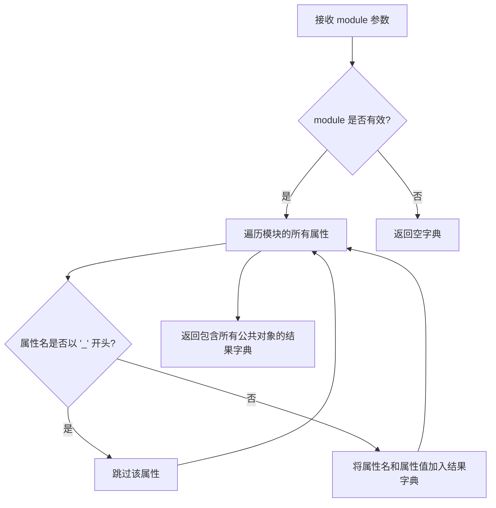
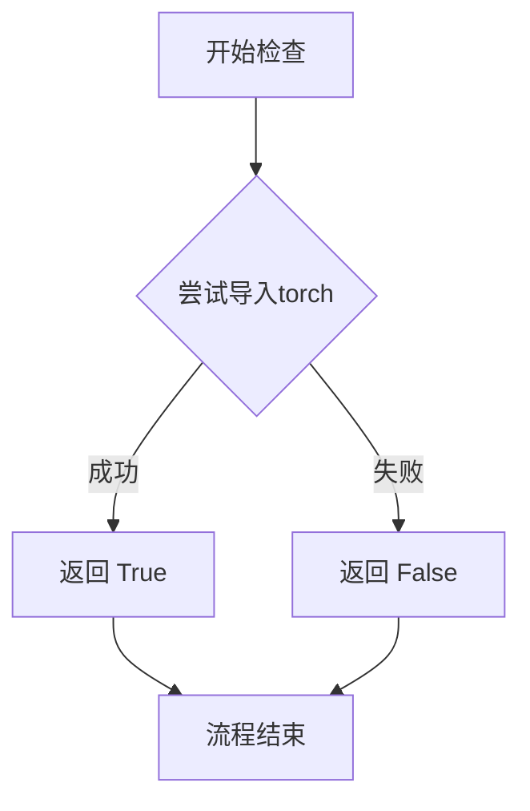
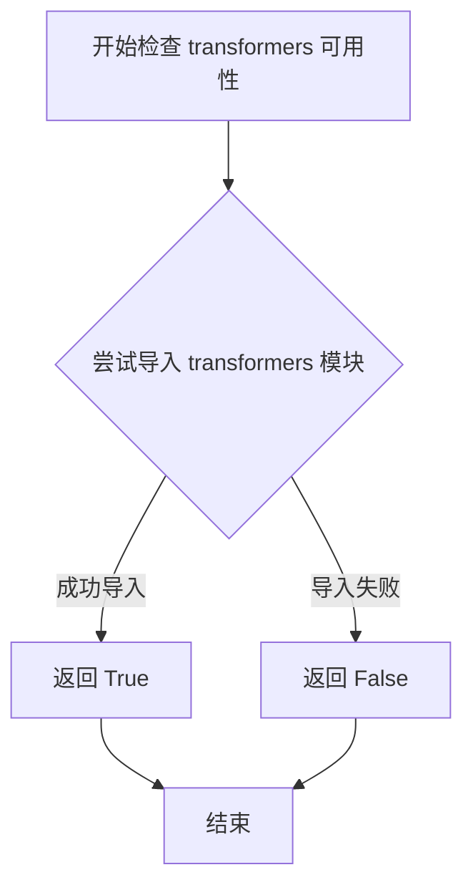
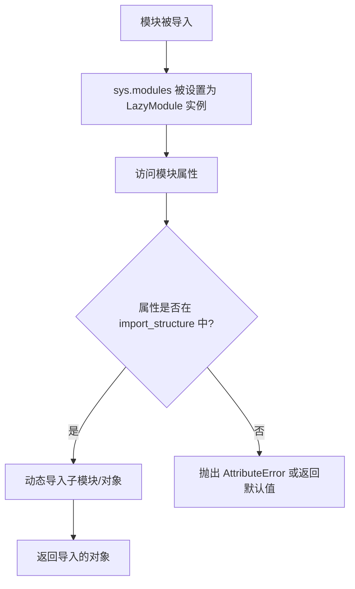

# `diffusers\src\diffusers\pipelines\text_to_video_synthesis\__init__.py` 详细设计文档

这是一个用于文本到视频合成的Diffusers库模块，通过LazyModule机制实现可选依赖（torch和transformers）的延迟加载，并导出多个文本到视频和视频到视频的Pipeline类。

## 整体流程

```mermaid
graph TD
    A[模块加载] --> B{DIFFUSERS_SLOW_IMPORT 或 TYPE_CHECKING?}
    B -- 是 --> C{is_transformers_available() 和 is_torch_available()?}
    C -- 否 --> D[导入虚拟对象模块]
    C -- 是 --> E[导入真实Pipeline类]
    B -- 否 --> F[创建LazyModule]
    F --> G[将_dummy_objects注入sys.modules]
    D --> H[完成初始化]
    E --> H
    G --> H
```

## 类结构

```
Diffusers Library
└── text_to_video_synthesis (包)
    ├── __init__.py (本文件 - 入口)
    ├── pipeline_output.py
    │   └── TextToVideoSDPipelineOutput
    ├── pipeline_text_to_video_synth.py
    │   └── TextToVideoSDPipeline
    ├── pipeline_text_to_video_synth_img2img.py
    │   └── VideoToVideoSDPipeline
    ├── pipeline_text_to_video_zero.py
    │   └── TextToVideoZeroPipeline
    └── pipeline_text_to_video_zero_sdxl.py
        └── TextToVideoZeroSDXLPipeline
```

## 全局变量及字段


### `_dummy_objects`
    
存储虚拟对象，用于可选依赖不可用时的替代

类型：`dict`
    


### `_import_structure`
    
定义模块的导入结构，映射导出名称到实际类

类型：`dict`
    


### `DIFFUSERS_SLOW_IMPORT`
    
标志位，控制是否启用慢速导入模式

类型：`bool`
    


### `TYPE_CHECKING`
    
类型检查标志，用于类型注解时的延迟导入

类型：`bool`
    


    

## 全局函数及方法


### `get_objects_from_module`

该函数是 Diffusers 库中的一个工具函数，用于从指定的模块中动态提取所有公共对象（类、函数等），通常用于懒加载模块时获取可导出对象的映射。

参数：

- `module`：`module`，要从中获取对象的模块对象（示例中传入的是 `dummy_torch_and_transformers_objects`）

返回值：`dict`，返回模块中所有非下划线开头的公共对象字典，键为对象名称，值为对象本身

#### 流程图



#### 带注释源码

```python
def get_objects_from_module(module):
    """
    从给定模块中提取所有公共对象（非下划线开头）
    
    参数:
        module: 要从中提取对象的模块对象
        
    返回值:
        dict: 对象名称到对象本身的映射字典
    """
    # 初始化结果字典
    result = {}
    
    # 遍历模块的所有属性
    for attr_name in dir(module):
        # 过滤掉以下划线开头的私有/内部属性
        if not attr_name.startswith("_"):
            # 获取属性值并添加到结果字典
            attr_value = getattr(module, attr_name)
            result[attr_name] = attr_value
            
    return result
```

#### 使用示例

在给定代码中的实际调用方式：

```python
# 从 dummy_torch_and_transformers_objects 模块获取所有对象
_dummy_objects = {}
_dummy_objects.update(get_objects_from_module(dummy_torch_and_transformers_objects))
```

这行代码的作用是将 `dummy_torch_and_transformers_objects` 模块中的所有公共对象提取出来，并添加到 `_dummy_objects` 字典中，用于后续的懒加载机制中作为空对象占位符。


# 详细设计文档

## 1. 代码概述

这段代码是一个**动态模块导入与延迟加载系统**，用于根据运行时环境检查Torch和Transformers库的可用性，并动态导入相应的文本到视频扩散管道类。该模块采用惰性导入模式，在导入时检查依赖项是否可用，如果不可用则使用虚拟对象（dummy objects）进行占位，从而避免在缺少可选依赖时导致整个模块导入失败。

## 2. 文件整体运行流程

```
┌─────────────────────────────────────────────────────────────┐
│                        模块加载开始                          │
└─────────────────────────────────────────────────────────────┘
                              │
                              ▼
┌─────────────────────────────────────────────────────────────┐
│              检查是否为 TYPE_CHECKING 或                     │
│              DIFFUSERS_SLOW_IMPORT 模式                      │
└─────────────────────────────────────────────────────────────┘
                    │                      │
                   是                      否
                    │                      │
                    ▼                      ▼
┌──────────────────────────┐  ┌────────────────────────────────┐
│    TYPE_CHECKING 分支    │  │    运行时动态导入分支           │
│  (仅类型检查时执行)       │  │  (普通导入时执行)               │
└──────────────────────────┘  └────────────────────────────────┘
         │                                 │
         ▼                                 ▼
┌──────────────────────────────────────────────────────────────┐
│   检查 is_transformers_available() && is_torch_available()  │
└──────────────────────────────────────────────────────────────┘
                    │                      │
                   是                      否
                    │                      │
                    ▼                      ▼
┌────────────────────────┐    ┌─────────────────────────────────┐
│ 导入真实管道类：       │    │ 导入虚拟对象(dummy)并注册到       │
│ - TextToVideoSDPipeline│    │ _dummy_objects 和 sys.modules   │
│ - VideoToVideoSDPipeline│   │                                 │
│ - TextToVideoZeroPipeline│  │                                 │
│ - TextToVideoZeroSDXLPipeline│                                 │
└────────────────────────┘    └─────────────────────────────────┘
```

## 3. 全局变量和导入结构详情

### 3.1 全局变量

| 变量名称 | 类型 | 描述 |
|---------|------|------|
| `_dummy_objects` | `dict` | 存储虚拟对象的字典，当可选依赖不可用时用于占位 |
| `_import_structure` | `dict` | 定义模块的导入结构，映射字符串到可导入对象名称列表 |

### 3.2 导入的函数

| 函数名称 | 源模块 | 描述 |
|---------|--------|------|
| `TYPE_CHECKING` | `typing` | 类型检查标志，运行时为False |
| `OptionalDependencyNotAvailable` | `...utils` | 可选依赖不可用异常类 |
| `_LazyModule` | `...utils` | 惰性加载模块类 |
| `get_objects_from_module` | `...utils` | 从模块获取对象的工具函数 |
| `is_torch_available` | `...utils` | 检查Torch是否可用的函数 |
| `is_transformers_available` | `...utils` | 检查Transformers是否可用的函数 |
| `DIFFUSERS_SLOW_IMPORT` | `...utils` | 慢速导入模式标志 |

---

## 4. 函数详细信息

### `is_torch_available`

检查当前Python环境中PyTorch库是否可用。

#### 参数

该函数**无显式参数**（但可能包含内部隐式检查逻辑）。

#### 返回值

- **返回值类型**：`bool`
- **返回值描述**：返回`True`如果PyTorch库已安装且可导入，否则返回`False`

#### 流程图



#### 带注释源码

```python
# 注意：以下是推测的实现方式，实际实现在 ...utils 模块中
# 这是基于diffusers库常见的实现模式

def is_torch_available() -> bool:
    """
    检查PyTorch是否可用于当前环境。
    
    Returns:
        bool: 如果torch可导入返回True，否则返回False
    """
    try:
        import torch  # noqa F401
        return True
    except ImportError:
        return False
```

---

## 5. 代码中的关键组件信息

| 组件名称 | 类型 | 描述 |
|---------|------|------|
| `_LazyModule` | 类 | 惰性加载模块实现，延迟导入实际对象直到真正需要时 |
| `OptionalDependencyNotAvailable` | 异常类 | 当可选依赖项不可用时抛出的异常 |
| `get_objects_from_module` | 函数 | 工具函数，从指定模块中提取所有可导入对象 |
| `dummy_torch_and_transformers_objects` | 模块 | 虚拟对象模块，在依赖不可用时提供替代品 |

---

## 6. 潜在的技术债务与优化空间

### 6.1 技术债务

1. **重复的依赖检查逻辑**：代码在两个地方（普通导入分支和TYPE_CHECKING分支）重复了相同的依赖检查代码，可以提取为单独的辅助方法。

2. **硬编码的依赖组合**：当前代码强制要求`is_transformers_available() and is_torch_available()`同时为True，如果只需要其中一个库的功能，将无法导入。

3. **裸的异常捕获**：使用`except OptionalDependencyNotAvailable`捕获特定异常，但异常处理逻辑较为简单。

### 6.2 优化空间

1. **模块化依赖检查**：可以将依赖检查逻辑抽象为装饰器或上下文管理器，提高代码可维护性。

2. **配置化导入结构**：`_import_structure`可以被外部配置驱动，增加灵活性。

3. **更精细的错误处理**：可以为不同的可选依赖提供独立的处理逻辑，而不是捆绑检查。

---

## 7. 其它项目

### 7.1 设计目标与约束

- **目标**：实现可选依赖的动态加载，在依赖不可用时保持模块仍可导入（使用虚拟对象）
- **约束**：
  - 必须同时满足`is_transformers_available()`和`is_torch_available()`才导入真实类
  - 使用`_LazyModule`实现惰性加载以优化启动性能

### 7.2 错误处理与异常设计

- **主异常**：`OptionalDependencyNotAvailable` - 当检测到torch或transformers不可用时主动抛出
- **处理方式**：捕获异常后从`dummy_torch_and_transformers_objects`模块导入虚拟对象进行替换
- **导入保护**：`try-except`块确保即使依赖不可用，整个模块也不会导入失败

### 7.3 数据流与状态机

```
初始状态 → 检查环境 → 依赖可用? → 是 → 加载真实类到sys.modules
                   ↓ 否
              加载虚拟对象 → 设置到sys.modules → 完成
```

### 7.4 外部依赖与接口契约

- **外部依赖**：
  - `torch` - PyTorch深度学习框架
  - `transformers` - Hugging Face Transformers库
  - `diffusers` - 相关的diffusers工具模块

- **接口契约**：
  - `is_torch_available()`: () -> bool
  - `is_transformers_available()`: () -> bool
  - `_LazyModule.__init__`: (name, filename, import_structure, module_spec) -> None
  - `get_objects_from_module`: (module) -> dict


### `is_transformers_available`

该函数用于检查 Python 环境中是否已安装并可用 `transformers` 库，通常与 `is_torch_available()` 配合使用，以决定是否加载需要这两个库的功能模块或对象。

参数： 无

返回值： `bool`，返回 `True` 表示 `transformers` 库可用，返回 `False` 表示不可用。

#### 流程图



#### 带注释源码

```python
# is_transformers_available 函数定义在 ...utils 模块中
# 此处展示的是其在当前文件中的调用方式

from ...utils import is_transformers_available

# 函数调用示例（在 try-except 块中）
try:
    # 检查 transformers 和 torch 是否都可用
    if not (is_transformers_available() and is_torch_available()):
        # 如果任一库不可用，抛出可选依赖不可用异常
        raise OptionalDependencyNotAvailable()
except OptionalDependencyNotAvailable:
    # 捕获异常，加载虚拟对象作为占位符
    from ...utils import dummy_torch_and_transformers_objects
    _dummy_objects.update(get_objects_from_module(dummy_torch_and_transformers_objects))
else:
    # 如果两个库都可用，定义实际的导入结构
    _import_structure["pipeline_output"] = ["TextToVideoSDPipelineOutput"]
    # ... 其他模块定义
```


### `_LazyModule`

`_LazyModule` 是从 `utils` 导入的延迟加载模块封装类，用于实现模块的惰性导入。该类通过拦截属性访问来实现子模块的动态加载，从而避免在模块初始化时一次性加载所有子模块，提升导入速度并减少内存占用。

参数：

- `name`：`str`，模块的名称，通常为 `__name__`
- `file_path`：`str`，模块文件的路径，通常为 `globals()["__file__"]`
- `import_structure`：`dict`，描述模块导入结构的字典，键为属性名，值为对应的导入路径列表
- `module_spec`：`ModuleSpec`，模块的规范对象，通常为 `__spec__`

返回值：`_LazyModule` 实例（一个模块代理对象，支持属性访问时触发实际加载）

#### 流程图



#### 带注释源码

```python
# 从 utils 导入 _LazyModule 类
from ...utils import _LazyModule

# 定义导入结构字典，键为导出的属性名，值为对应的类名列表
_import_structure = {
    "pipeline_output": ["TextToVideoSDPipelineOutput"],
    "pipeline_text_to_video_synth": ["TextToVideoSDPipeline"],
    "pipeline_text_to_video_synth_img2img": ["VideoToVideoSDPipeline"],
    "pipeline_text_to_video_zero": ["TextToVideoZeroPipeline"],
    "pipeline_text_to_video_zero_sdxl": ["TextToVideoZeroSDXLPipeline"],
}

# 如果不是类型检查模式或不需要快速导入，则使用 _LazyModule 进行延迟加载
else:
    import sys

    # 将当前模块替换为 LazyModule 实例
    # 参数1: 模块名 __name__
    # 参数2: 模块文件路径 globals()["__file__"]
    # 参数3: 导入结构 _import_structure
    # 参数4: 模块规范 __spec__
    sys.modules[__name__] = _LazyModule(
        __name__,
        globals()["__file__"],
        _import_structure,
        module_spec=__spec__,
    )
    
    # 将虚拟对象设置到模块中，用于可选依赖不可用时的兼容
    for name, value in _dummy_objects.items():
        setattr(sys.modules[__name__], name, value)
```

## 关键组件


### 延迟加载模块（Lazy Loading）

使用`_LazyModule`实现模块的延迟加载，通过`sys.modules[__name__] = _LazyModule(...)`将模块替换为延迟加载版本，延迟导入管道类，减少启动时间和内存占用。

### 可选依赖处理（Optional Dependency Handling）

通过`is_torch_available()`和`is_transformers_available()`检查torch和transformers是否可用，使用`OptionalDependencyNotAvailable`异常和`try-except`机制优雅处理依赖不可用的情况，确保代码在缺少可选依赖时仍能导入。

### 虚拟对象机制（Dummy Objects）

当可选依赖不可用时，从`dummy_torch_and_transformers_objects`模块导入虚拟对象，通过`_dummy_objects`字典和`setattr`将其添加到模块中，保持API兼容性并避免导入错误。

### 导入结构字典（Import Structure）

`_import_structure`字典定义了模块的公共API，包含"pipeline_output"、"pipeline_text_to_video_synth"等键及其对应的导出类列表，用于延迟加载和模块规范定义。

### 类型检查支持（Type Checking Support）

通过`TYPE_CHECKING`条件导入，在类型检查时导入实际类而非延迟加载版本，支持IDE和静态类型检查工具的代码补全和类型推断。

### 文本到视频SD管道（TextToVideoSDPipeline）

核心视频生成管道，实现从文本描述生成视频的功能，是Diffusers库中Text-to-Video SD模型的管道类。

### 视频到视频SD管道（VideoToVideoSDPipeline）

视频到视频转换管道，实现视频风格迁移或视频编辑功能，基于SD模型的图像到图像管道扩展。

### 零样本文本到视频管道（TextToVideoZeroPipeline）

零样本视频生成管道，支持无需显式训练的视频生成，可能利用跨模态迁移技术实现。

### SDXL零样本文本到视频管道（TextToVideoZeroSDXLPipeline）

基于SDXL架构的零样本视频生成管道，提供更高质量的视频生成能力，利用SDXL模型的改进架构。

### 管道输出类（TextToVideoSDPipelineOutput）

定义视频生成管道的输出数据结构，包含生成的视频数据和相关元信息的封装类。


## 问题及建议


### 已知问题

-   **重复的条件判断逻辑**：可选依赖检查（`is_transformers_available() and is_torch_available()`）在两处重复出现（dummy objects 分支和 TYPE_CHECKING 分支），违反 DRY 原则，增加维护成本
-   **缺少导入失败处理**：在 `TYPE_CHECKING or DIFFUSERS_SLOW_IMPORT` 分支中，直接进行实际导入而没有 try-except 保护，如果依赖项缺失会直接抛出异常而非使用 dummy objects 回退
-   **魔法字符串风险**：`_import_structure` 字典的键（如 `"pipeline_output"`）与实际导入名称（如 `TextToVideoSDPipelineOutput`）分开定义，容易出现键名不匹配或遗漏的错误
-   **wildcard 导入的脆弱性**：使用 `from ...utils.dummy_torch_and_transformers_objects import *` 并依赖 side effect 获取对象，这种方式不够显式且容易因重构而失效
-   **LazyModule 注册后的属性设置问题**：在将模块注册为 `_LazyModule` 后，再通过 `setattr` 设置 `_dummy_objects` 可能导致状态不一致，因为 LazyModule 可能会拦截属性访问

### 优化建议

-   **提取公共逻辑**：将可选依赖检查封装为独立函数，如 `check_optional_dependencies()`，避免代码重复
-   **统一错误处理**：在 TYPE_CHECKING 分支中添加 try-except，当依赖不可用时回退到 dummy objects，保持与普通导入路径的一致性
-   **使用类型提示或常量定义映射**：考虑使用数据类或配置方式定义 `_import_structure`，确保键名与导入名称的一致性
-   **显式导入代替 wildcard**：直接导入需要的 dummy 对象而不是使用 `import *`
-   **优化模块初始化顺序**：考虑在 LazyModule 创建之前合并 dummy objects，或者在创建后使用更安全的方式注册


## 其它


### 设计目标与约束

该模块是diffusers库的Text-to-Video相关Pipeline的导出模块，采用延迟加载(Lazy Loading)机制，主要目标是支持可选依赖(torch和transformers)的动态导入，在依赖不可用时提供虚拟对象以保持API兼容性。设计约束包括：仅在torch和transformers同时可用时导入真实Pipeline类，否则使用dummy objects；支持TYPE_CHECKING模式下的提前导入；遵循diffusers库的模块导入规范。

### 错误处理与异常设计

依赖检查采用try-except捕获OptionalDependencyNotAvailable异常，当torch或transformers任一不可用时触发该异常，并从dummy_torch_and_transformers_objects模块获取替代对象。_LazyModule的module_spec参数确保在动态导入失败时能提供有意义的错误信息。

### 数据流与状态机

模块初始化时首先执行_import_structure字典的构建，根据依赖可用性决定导出真实类还是虚拟对象。延迟加载机制通过_LazyModule实现，实际类在首次访问时才从子模块导入。数据流为：入口检查依赖→构建导入结构→注册LazyModule→按需加载具体Pipeline类。

### 外部依赖与接口契约

外部依赖包括：torch、transformers、diffusers.utils中的辅助模块(_LazyModule、OptionalDependencyNotAvailable、get_objects_from_module等)。接口契约遵循diffusers库的_pipeline命名规范，导出类包括TextToVideoSDPipeline、VideoToVideoSDPipeline、TextToVideoZeroPipeline、TextToVideoZeroSDXLPipeline及其输出类TextToVideoSDPipelineOutput。

### 模块初始化顺序

1. 导入类型检查标志和工具函数
2. 初始化_dummy_objects和_import_structure字典
3. 执行依赖可用性检查(try-except块)
4. 根据检查结果填充_import_structure或_dummy_objects
5. 判断是否进入TYPE_CHECKING或DIFFUSERS_SLOW_IMPORT模式
6. 真实导入或注册LazyModule

### 版本兼容性考虑

该模块依赖is_torch_available()和is_transformers_available()进行版本兼容性检查，未来需关注diffusers库对torch和transformers的最低版本要求变化。dummy objects机制确保了在不同版本环境下的向后兼容性。

### 可测试性设计

由于采用依赖注入和虚拟对象模式，该模块具有较好的可测试性，可通过模拟is_torch_available和is_transformers_available的返回值来测试不同依赖场景下的模块行为。

### 配置与环境要求

需要环境变量DIFFUSERS_SLOW_IMPORT控制是否启用慢速导入模式(立即导入所有模块而非延迟加载)。在CI/CD环境中需确保torch和transformers同时安装以运行完整测试。

    