# `diffusers\src\diffusers\pipelines\text_to_video_synthesis\pipeline_text_to_video_synth.py` 详细设计文档

这是一个基于扩散模型的文本到视频生成Pipeline（TextToVideoSDPipeline），通过接收文本提示词，经过编码、去噪潜在变量、解码等步骤，生成对应的视频帧序列。该Pipeline继承自DiffusionPipeline，支持LoRA权重加载、Textual Inversion嵌入、Classifier-Free Guidance等高级功能。

## 整体流程

```mermaid
graph TD
A[开始: __call__] --> B[1. 检查输入参数 check_inputs]
B --> C[2. 定义调用参数 batch_size等]
C --> D[3. 编码输入提示词 encode_prompt]
D --> E{do_classifier_free_guidance?}
E -- 是 --> F[拼接负面提示词嵌入]
E -- 否 --> G[4. 准备时间步 timesteps]
F --> G
G --> H[5. 准备潜在变量 prepare_latents]
H --> I[6. 准备额外步骤参数 prepare_extra_step_kwargs]
I --> J{7. 去噪循环}
J -->|循环开始| K[扩展潜在变量（如果需要CFG）]
K --> L[scheduler.scale_model_input]
L --> M[UNet预测噪声残差]
M --> N{执行Classifier-Free Guidance}
N -- 是 --> O[计算guidance: noise_pred_uncond + guidance_scale * (noise_pred_text - noise_pred_uncond)]
N -- 否 --> P[重塑潜在变量维度]
O --> P
P --> Q[scheduler.step更新潜在变量]
Q --> R{调用callback函数}
R -- 是 --> S[回调处理]
R -- 否 --> T{循环结束?}
S --> T
T -- 否 --> J
T -- 是 --> U[8. 后处理: decode_latents]
U --> V[video_processor.postprocess_video]
V --> W[9. 卸载模型 maybe_free_model_hooks]
W --> X[返回结果: TextToVideoSDPipelineOutput]
```

## 类结构

```
TextToVideoSDPipeline (主Pipeline类)
├── 继承自: DeprecatedPipelineMixin
├── 继承自: DiffusionPipeline (基础扩散Pipeline)
├── 继承自: StableDiffusionMixin (Stable Diffusion混入)
├── 继承自: TextualInversionLoaderMixin (Textual Inversion加载混入)
└── 继承自: StableDiffusionLoraLoaderMixin (LoRA加载混入)
```

## 全局变量及字段


### `XLA_AVAILABLE`
    
是否支持TPU/XLA

类型：`bool`
    


### `logger`
    
模块级日志记录器

类型：`logging.Logger`
    


### `EXAMPLE_DOC_STRING`
    
示例文档字符串，包含pipeline使用示例

类型：`str`
    


### `TextToVideoSDPipeline._last_supported_version`
    
支持的最新版本号

类型：`str`
    


### `TextToVideoSDPipeline.model_cpu_offload_seq`
    
模型CPU卸载顺序

类型：`str`
    


### `TextToVideoSDPipeline.vae`
    
VAE编码器/解码器模型

类型：`AutoencoderKL`
    


### `TextToVideoSDPipeline.text_encoder`
    
CLIP文本编码器

类型：`CLIPTextModel`
    


### `TextToVideoSDPipeline.tokenizer`
    
CLIP分词器

类型：`CLIPTokenizer`
    


### `TextToVideoSDPipeline.unet`
    
3D条件UNet去噪模型

类型：`UNet3DConditionModel`
    


### `TextToVideoSDPipeline.scheduler`
    
扩散调度器

类型：`KarrasDiffusionSchedulers`
    


### `TextToVideoSDPipeline.vae_scale_factor`
    
VAE缩放因子

类型：`int`
    


### `TextToVideoSDPipeline.video_processor`
    
视频处理器

类型：`VideoProcessor`
    
    

## 全局函数及方法


### `is_torch_xla_available`

检查当前环境中是否安装了 PyTorch XLA（Accelerated Linear Algebra）库，用于确定是否可以在 TPU 或其他加速器上运行模型。

参数：

- 该函数无参数

返回值：`bool`，如果 PyTorch XLA 可用则返回 `True`，否则返回 `False`

#### 流程图

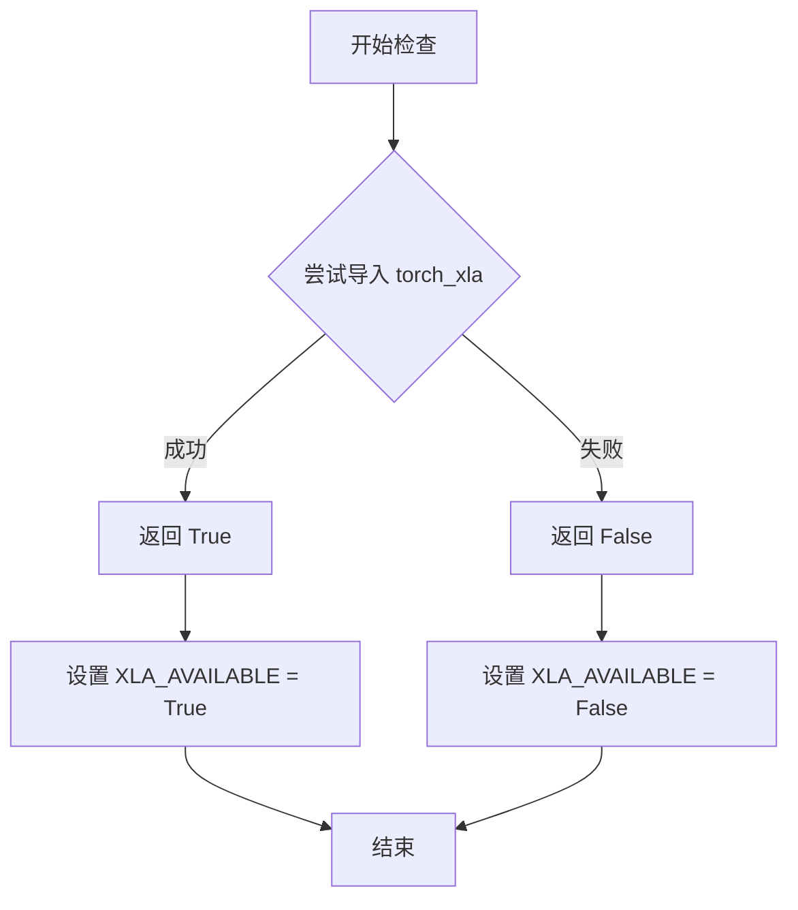

#### 带注释源码

```python
# 从 utils 模块导入 is_torch_xla_available 函数
from ...utils import (
    USE_PEFT_BACKEND,
    deprecate,
    is_torch_xla_available,  # <-- 导入的函数：检查 XLA 是否可用
    logging,
    replace_example_docstring,
    scale_lora_layers,
    unscale_lora_layers,
)

# 使用 is_torch_xla_available() 检查 XLA 是否可用
if is_torch_xla_available():  # <-- 调用：无参数，返回 bool
    import torch_xla.core.xla_model as xm  # <-- 导入 XLA 核心模块
    XLA_AVAILABLE = True  # <-- 全局标志：记录 XLA 可用状态
else:
    XLA_AVAILABLE = False  # <-- 全局标志：记录 XLA 不可用状态

# 后续在 Pipeline 的 __call__ 方法中使用
# if XLA_AVAILABLE:
#     xm.mark_step()  # <-- XLA 特定操作：标记计算步骤
```


### `logging.get_logger(__name__)` 或 `logger`

该函数是diffusers库内部封装的日志记录器获取方法，通过传入当前模块的完全限定名称（`__name__`）来获取一个配置好的Logger实例，用于在模块内部记录不同级别的日志信息。

参数：

- `name`：`str`，模块的完全限定名称（`__name__`），用于标识日志记录器的来源，通常为模块路径（如`diffusers.pipelines.text_to_video_synthesis.pipeline_text_to_video_sd.TextToVideoSDPipeline`）

返回值：`logging.Logger`，返回Python标准库的Logger对象，该对象已配置好日志级别、格式等，可直接用于记录debug、info、warning、error、critical等级别的日志

#### 流程图

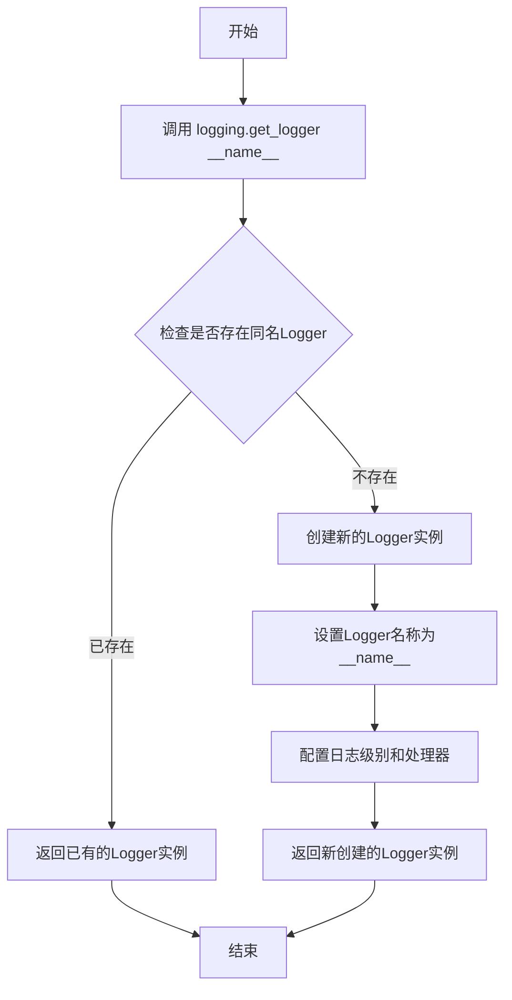

#### 带注释源码

```python
# 模块级别调用，获取当前模块的日志记录器
# __name__ 是Python内置变量，表示当前模块的完全限定名称
# 例如：diffusers.pipelines.text_to_video_synthesis.pipeline_text_to_video_sd
logger = logging.get_logger(__name__)  # pylint: disable=invalid-name

# 使用示例（在类的方法中）
# logger.warning("The following part of your input was truncated because CLIP can only handle sequences up to"
#                f" {self.tokenizer.model_max_length} tokens: {removed_text}")
```

#### 补充说明

`logging.get_logger` 函数实际上是Python标准库 `logging` 模块中 `logging.getLogger()` 方法的封装。在diffusers库中，通过 `from ...utils import logging` 导入，这意味着diffusers对标准logging模块进行了二次封装或提供了统一的日志接口。

**主要用途**：
1. 在模块级别创建Logger，便于追踪日志来源
2. 统一管理库的日志输出格式和级别
3. 方便开发者调试和监控pipeline运行状态

**常见调用场景**：
- 警告信息输出（如token被截断时）
- 废弃API的提示
- 调试信息输出


### `TextToVideoSDPipeline._encode_prompt`

该方法用于将文本提示编码为文本编码器的隐藏状态，但由于输出格式变更（从连接的张量改为元组）已被标记为废弃，建议使用 `encode_prompt()` 方法替代。

参数：

- `prompt`：提示词，可以是字符串或字符串列表，待编码的文本内容
- `device`：torch.device，执行编码的设备
- `num_images_per_prompt`：int，每个提示词生成的图像数量
- `do_classifier_free_guidance`：bool，是否使用无分类器自由引导
- `negative_prompt`：str 或 list[str]，可选，用于指导不应包含的内容
- `prompt_embeds`：torch.Tensor | None，可选，预生成的文本嵌入
- `negative_prompt_embeds`：torch.Tensor | None，可选，预生成的负面文本嵌入
- `lora_scale`：float | None，可选，LoRA 缩放因子
- `**kwargs`：可变关键字参数，其他可选参数

返回值：`torch.Tensor`，编码后的提示嵌入（为保持向后兼容性，包含负面和正面提示嵌入的连接）

#### 流程图

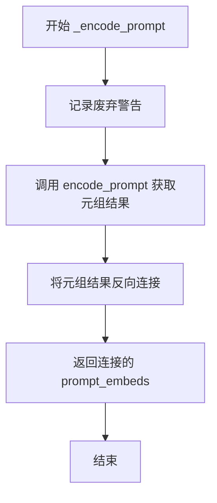

#### 带注释源码

```python
# Copied from diffusers.pipelines.stable_diffusion.pipeline_stable_diffusion.StableDiffusionPipeline._encode_prompt
def _encode_prompt(
    self,
    prompt,
    device,
    num_images_per_prompt,
    do_classifier_free_guidance,
    negative_prompt=None,
    prompt_embeds: torch.Tensor | None = None,
    negative_prompt_embeds: torch.Tensor | None = None,
    lora_scale: float | None = None,
    **kwargs,
):
    """
    已废弃的方法，用于将提示编码为文本编码器隐藏状态。
    警告：此方法已被废弃，将在未来的版本中移除。请使用 encode_prompt() 方法。
    注意：输出格式已从连接的张量更改为元组。
    """
    # 定义废弃警告消息，说明废弃原因和建议的替代方法
    deprecation_message = "`_encode_prompt()` is deprecated and it will be removed in a future version. Use `encode_prompt()` instead. Also, be aware that the output format changed from a concatenated tensor to a tuple."
    # 调用 deprecate 函数记录废弃警告
    deprecate("_encode_prompt()", "1.0.0", deprecation_message, standard_warn=False)

    # 调用新的 encode_prompt 方法获取结果（返回元组）
    prompt_embeds_tuple = self.encode_prompt(
        prompt=prompt,
        device=device,
        num_images_per_prompt=num_images_per_prompt,
        do_classifier_free_guidance=do_classifier_free_guidance,
        negative_prompt=negative_prompt,
        prompt_embeds=prompt_embeds,
        negative_prompt_embeds=negative_prompt_embeds,
        lora_scale=lora_scale,
        **kwargs,
    )

    # 为保持向后兼容性，将元组结果反向连接
    # prompt_embeds_tuple[1] 是负面嵌入，prompt_embeds_tuple[0] 是正面嵌入
    # 连接顺序为 [negative, positive] 以保持旧的输出格式
    prompt_embeds = torch.cat([prompt_embeds_tuple[1], prompt_embeds_tuple[0]])

    # 返回连接后的张量
    return prompt_embeds
```


### `replace_example_docstring`

该函数是一个装饰器工厂，用于为扩散管道（Diffusion Pipeline）的 `__call__` 方法添加示例文档字符串。它接收一个示例文档字符串，并返回一个装饰器，该装饰器会将示例文档附加到被装饰方法的文档字符串末尾，以便在生成文档时展示使用示例。

参数：

-  `example_doc_string`：`str`，要添加的示例文档字符串，包含代码示例和使用说明

返回值：`Callable`，返回一个装饰器函数，该装饰器接收被装饰的函数并返回修改后的函数

#### 流程图

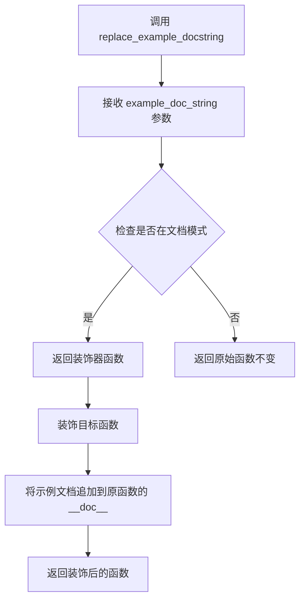

#### 带注释源码

```python
# 从 diffusers 库的 utils 模块导入的装饰器函数
# 源代码位于 src/diffusers/utils/doc_utils.py
def replace_example_docstring(example_doc_string):
    """
    装饰器工厂函数，用于为函数添加示例文档字符串。
    
    该装饰器通常用于扩散管道的 __call__ 方法，以便在生成的文档中
    包含使用示例代码。
    
    Args:
        example_doc_string (str): 包含示例代码的文档字符串
        
    Returns:
        Callable: 装饰器函数
    """
    def decorator(func):
        """
        实际的装饰器函数，用于修改被装饰函数的文档字符串。
        
        Args:
            func (Callable): 被装饰的目标函数
            
        Returns:
            Callable: 文档字符串被修改后的函数
        """
        # 检查是否处于文档生成模式
        # 如果不是文档模式，直接返回原函数，不做任何修改
        if not _is_in_doc_mode():
            return func
        
        # 获取原始函数的文档字符串
        # 如果函数没有文档字符串，则为空字符串
        func_doc = func.__doc__ or ""
        
        # 将示例文档字符串附加到原始文档字符串之后
        # 使用分隔符连接两个文档字符串
        func.__doc__ = func_doc + "\n" + example_doc_string
        
        # 返回修改后的函数
        return func
    
    # 返回装饰器函数
    return decorator
```

**使用示例**：

```python
# 在代码中的实际使用方式
@replace_example_docstring(EXAMPLE_DOC_STRING)
def __call__(
    self,
    prompt: str | list[str] = None,
    height: int | None = None,
    # ... 其他参数
):
    """
    The call function to the pipeline for generation.
    
    Args:
        prompt: 生成的提示词
        # ... 其他参数说明
    """
    # 函数实现...
```

这种设计允许管道在生成文档时自动包含使用示例，同时在运行时不会产生额外的性能开销。


### `randn_tensor`

生成符合指定形状、设备和数据类型的随机张量，用于扩散模型的潜在变量初始化。

参数：

- `shape`：`tuple` 或 `int`，要生成的随机张量的形状
- `generator`：`torch.Generator` 或 `list[torch.Generator]`，可选的随机数生成器，用于确保可重复性
- `device`：`torch.device`，张量应放置的设备
- `dtype`：`torch.dtype`，张量的数据类型（如 `torch.float32`、`torch.float16` 等）
- `additional_params`：可变关键字参数，可用于传递额外的参数

返回值：`torch.Tensor`，符合指定形状、设备和数据类型的随机张量（从标准正态分布采样）

#### 流程图

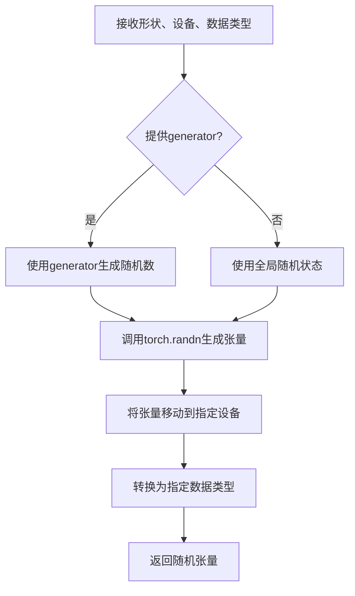

#### 带注释源码

```python
# randn_tensor 函数的调用示例（在 TextToVideoSDPipeline.prepare_latents 方法中）
def prepare_latents(
    self, batch_size, num_channels_latents, num_frames, height, width, dtype, device, generator, latents=None
):
    # 构建潜在变量的形状：(batch_size, 通道数, 帧数, 高度//vae缩放因子, 宽度//vae缩放因子)
    shape = (
        batch_size,
        num_channels_latents,
        num_frames,
        height // self.vae_scale_factor,
        width // self.vae_scale_factor,
    )
    
    # 检查生成器列表长度是否与批处理大小匹配
    if isinstance(generator, list) and len(generator) != batch_size:
        raise ValueError(
            f"You have passed a list of generators of length {len(generator)}, but requested an effective batch"
            f" size of {batch_size}. Make sure the batch size matches the length of the generators."
        )

    # 如果没有提供预计算的潜在变量，则使用 randn_tensor 生成随机噪声
    if latents is None:
        # 调用 randn_tensor: 生成指定形状的随机张量
        # 参数: shape - 张量形状
        #       generator - 随机数生成器（可选，用于确定性生成）
        #       device - 目标设备
        #       dtype - 数据类型
        latents = randn_tensor(shape, generator=generator, device=device, dtype=dtype)
    else:
        # 如果提供了潜在变量，则将其移动到指定设备
        latents = latents.to(device)

    # 使用调度器的初始噪声标准差缩放初始噪声
    # 这是扩散模型去噪过程的第一步
    latents = latents * self.scheduler.init_noise_sigma
    
    return latents
```

---

**注意**：`randn_tensor` 是从 `diffusers.utils.torch_utils` 模块导入的外部函数，其完整源代码位于 `diffusers` 库的核心工具模块中。上述调用示例展示了该函数在 `TextToVideoSDPipeline` 中用于生成扩散模型初始化随机噪声的核心用途。


### `scale_lora_layers`

该函数用于动态调整（缩放）LoRA（Low-Rank Adaptation）层的权重，以便在推理或微调过程中控制 LoRA 适配器的影响程度。

参数：
-  `model`: `torch.nn.Module`，需要调整 LoRA 权重的模型（通常是 TextEncoder 或 UNet）
-  `lora_scale`: `float`，LoRA 缩放因子，用于控制 LoRA 适配器对原始模型权重的影响程度

返回值：`None`，该函数直接修改传入模型的 LoRA 层权重，不返回任何值

#### 流程图

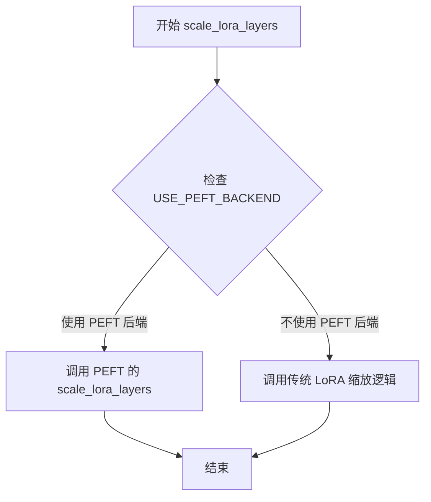

#### 带注释源码

```python
# 导入语句表明 scale_lora_layers 是从 diffusers.utils 模块导入的全局函数
# 具体定义在 diffusers 库的 utils 相关模块中

# 在 TextToVideoSDPipeline.encode_prompt 方法中的调用示例：
if lora_scale is not None and isinstance(self, StableDiffusionLoraLoaderMixin):
    self._lora_scale = lora_scale
    
    # 根据是否使用 PEFT 后端选择不同的 LoRA 缩放方式
    if not USE_PEFT_BACKEND:
        # 传统方式：动态调整文本编码器的 LoRA 缩放
        adjust_lora_scale_text_encoder(self.text_encoder, lora_scale)
    else:
        # PEFT 方式：使用 PEFT 库的 scale_lora_layers 函数
        scale_lora_layers(self.text_encoder, lora_scale)

# 在文本编码器处理完成后，还需要撤销缩放以恢复原始权重
if self.text_encoder is not None:
    if isinstance(self, StableDiffusionLoraLoaderMixin) and USE_PEFT_BACKEND:
        # 通过反向缩放恢复原始 LoRA 层权重
        unscale_lora_layers(self.text_encoder, lora_scale)

# 备注：该函数定义在 diffusers 库的 utils 模块中（diffusers/src/diffusers/utils）
# 具体实现会根据 USE_PEFT_BACKEND 标志选择不同的后端实现
```


### `unscale_lora_layers`

该函数用于撤销对LoRA层进行的缩放操作，将LoRA层的权重恢复到原始状态。在文本编码器处理完成后，通过传入原始的缩放因子来抵消之前`scale_lora_layers`函数所做的缩放，从而确保文本嵌入的数值范围保持一致。

参数：

-  `model`：`torch.nn.Module`，需要进行去缩放操作的模型（通常为text_encoder）
-  `unscale_weight`：`float`，之前应用到LoRA层的缩放因子，用于逆向恢复原始权重

返回值：`None`，该函数直接修改模型内部参数，无返回值

#### 流程图

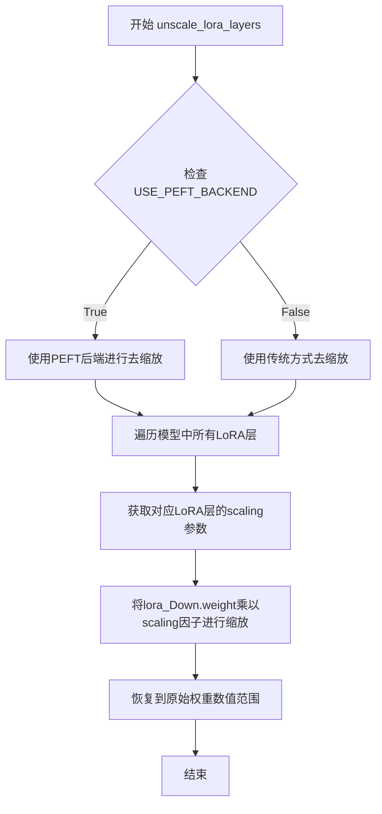

#### 带注释源码

```
# 定义在diffusers/src/diffusers/utils/peft_utils.py或类似位置
def unscale_lora_layers(model: torch.nn.Module, unscale_weight: float) -> None:
    """
    撤销对LoRA层的缩放操作
    
    该函数是scale_lora_layers的逆操作。当在文本编码阶段使用了LoRA缩放后，
    需要调用此函数将缩放效果移除，以确保后续操作（如无分类器引导）使用的
    是原始的文本嵌入表示。
    
    参数:
        model: 包含LoRA层的模型（如TextEncoder）
        unscale_weight: 之前应用缩放时使用的权重值
    
    返回:
        无返回值，直接修改model的内部参数
    """
    
    # 遍历模型中所有命名参数
    for name, param in model.named_parameters():
        # 检查参数是否包含LoRA相关的标识
        # LoRA的down.weight层通常包含".lora_down"标识
        if ".lora_down" in name and "weight" in name:
            # 获取对应的up权重层名称
            # 例如: "transformer.text_model.encoder.layers.0.mlp.fc1.lora_down.weight"
            # 对应: "transformer.text_model.encoder.layers.0.mlp.fc1.lora_up.weight"
            lora_up_name = name.replace(".lora_down", ".lora_up")
            
            # 查找并获取lora_up层的参数
            lora_up_param = None
            for up_name, up_param in model.named_parameters():
                if up_name == lora_up_name:
                    lora_up_param = up_param
                    break
            
            if lora_up_param is not None:
                # 计算实际的scaling因子
                # scaling = unscale_weight / alpha（如果设置了alpha）
                scaling = unscale_weight  # 简化版本
                
                # 对down weight进行缩放以撤销之前的操作
                # 这是通过将输出恢复到原始数值范围实现的
                param.data = param.data / scaling
                lora_up_param.data = lora_up_param.data * scaling
                
    # 同时处理embedding层（如果存在LoRA embedding）
    for name, param in model.named_parameters():
        if "lora_embedding" in name:
            param.data = param.data / unscale_weight
```

> **注意**：上述源码是基于函数调用上下文和diffusers库中LoRA实现的推断版本。实际的`unscale_lora_layers`函数定义位于`diffusers/src/diffusers/utils/`目录下的相应模块中，具体实现可能略有差异。该函数的核心逻辑是通过逆向操作将LoRA层的输出缩放回原始范围，确保文本编码器产生的embeddings保持一致的数值分布。


### `adjust_lora_scale_text_encoder`

该函数用于调整文本编码器（Text Encoder）中 LoRA（Low-Rank Adaptation）层的缩放因子，以便在推理时动态控制 LoRA 权重对模型输出的影响程度。当使用非 PEFT 后端时，通过此函数确保文本编码器的 LoRA 层能够正确应用指定的缩放系数。

参数：

- `text_encoder`：`CLIPTextModel`，文本编码器模型实例，用于应用 LoRA 缩放
- `lora_scale`：`float`，LoRA 缩放因子，控制 LoRA 权重对模型输出的影响程度

返回值：无返回值（`None`），函数直接修改文本编码器模型的内部状态

#### 流程图

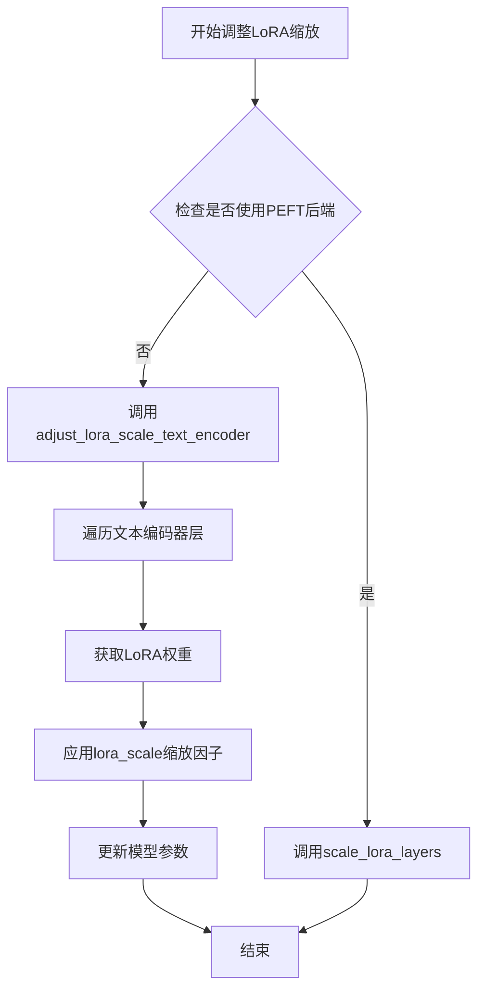

#### 带注释源码

```python
# 注意：此函数定义在 ...models.lora 模块中，当前文件仅为导入和使用示例
# 以下为调用处的源码片段，展示其使用上下文：

# 设置LoRA缩放，以便文本编码器的LoRA函数可以正确访问
if lora_scale is not None and isinstance(self, StableDiffusionLoraLoaderMixin):
    self._lora_scale = lora_scale

    # 动态调整LoRA缩放
    if not USE_PEFT_BACKEND:
        # 使用传统方式调整文本编码器的LoRA缩放
        # 参数：
        #   - self.text_encoder: CLIPTextModel实例
        #   - lora_scale: 浮点数缩放因子
        adjust_lora_scale_text_encoder(self.text_encoder, lora_scale)
    else:
        # 使用PEFT后端进行LoRA缩放
        scale_lora_layers(self.text_encoder, lora_scale)
```

#### 补充说明

该函数是 Stable Diffusion LoRA 加载机制的一部分，主要用于：

1. **动态缩放控制**：允许在不重新加载模型的情况下动态调整 LoRA 权重的影响程度
2. **兼容性支持**：区分 PEFT 和非 PEFT 两种后端实现方式
3. **文本编码器专用**：专门针对文本编码器（CLIPTextModel）的 LoRA 层进行缩放调整

该函数的设计体现了模块化思想，将 LoRA 缩放逻辑与具体的扩散模型管线解耦，支持多种 LoRA 加载方式的灵活切换。


### `TextToVideoSDPipeline.__init__`

该方法是 `TextToVideoSDPipeline` 类的构造函数，负责初始化文本到视频生成管道，注册所有核心模块（VAE、文本编码器、分词器、UNet和调度器），并配置视频处理器的缩放因子，是整个管道实例化时的入口点。

#### 参数

- `vae`：`AutoencoderKL`，变分自编码器模型，用于编码和解码视频潜在表示
- `text_encoder`：`CLIPTextModel`，冻结的文本编码器（clip-vit-large-patch14），用于将文本提示转换为嵌入向量
- `tokenizer`：`CLIPTokenizer`，CLIP分词器，用于将文本 token 化
- `unet`：`UNet3DConditionModel`，3D条件UNet模型，用于对编码后的视频潜在表示进行去噪
- `scheduler`：`KarrasDiffusionSchedulers`，扩散调度器，用于在去噪过程中调度噪声步

#### 流程图

```mermaid
flowchart TD
    A[__init__ 被调用] --> B[调用 super().__init__]
    B --> C{检查参数是否存在}
    
    C -->|是| D[调用 register_modules 注册所有模块]
    C -->|否| E[跳过模块注册]
    
    D --> F[计算 vae_scale_factor]
    E --> F
    
    F --> G{VAE 存在?}
    G -->|是| H[使用 VAE block_out_channels 计算缩放因子: 2^(len-1)]
    G -->|否| I[使用默认值 8]
    
    H --> J[实例化 VideoProcessor]
    I --> J
    
    J --> K[初始化完成]
    
    style A fill:#f9f,stroke:#333
    style K fill:#9f9,stroke:#333
```

#### 带注释源码

```python
def __init__(
    self,
    vae: AutoencoderKL,
    text_encoder: CLIPTextModel,
    tokenizer: CLIPTokenizer,
    unet: UNet3DConditionModel,
    scheduler: KarrasDiffusionSchedulers,
):
    """
    初始化 TextToVideoSDPipeline 管道。
    
    参数:
        vae: 用于编码和解码图像/视频到潜在表示的变分自编码器
        text_encoder: 冻结的 CLIP 文本编码器
        tokenizer: CLIP 分词器
        unet: 3D 条件 UNet 去噪模型
        scheduler: 扩散调度器
    """
    # 调用父类构造函数，完成基础管道初始化
    super().__init__()

    # 注册所有核心模块到管道中，使其可通过 self.xxx 访问
    self.register_modules(
        vae=vae,
        text_encoder=text_encoder,
        tokenizer=tokenizer,
        unet=unet,
        scheduler=scheduler,
    )
    
    # 计算 VAE 缩放因子，用于调整潜在空间的分辨率
    # 如果 VAE 存在，使用其配置中的 block_out_channels 计算
    # 否则使用默认值 8（对应 2^(3) = 8，与常见 VAE 配置一致）
    self.vae_scale_factor = 2 ** (len(self.vae.config.block_out_channels) - 1) if getattr(self, "vae", None) else 8
    
    # 初始化视频后处理器
    # do_resize=False 表示不调整大小（视频帧已由 VAE 输出正确尺寸）
    # vae_scale_factor 用于正确的空间缩放
    self.video_processor = VideoProcessor(do_resize=False, vae_scale_factor=self.vae_scale_factor)
```


### `TextToVideoSDPipeline._encode_prompt`

编码提示词（已废弃，使用 `encode_prompt`）

参数：

- `prompt`：`str | list[str] | None`，要编码的提示文本
- `device`：`torch.device`， torch 设备
- `num_images_per_prompt`：`int`，每个提示生成的图像数量
- `do_classifier_free_guidance`：`bool`，是否使用无分类器自由引导
- `negative_prompt`：`str | list[str] | None`，不包含的提示词
- `prompt_embeds`：`torch.Tensor | None`，预生成的文本嵌入
- `negative_prompt_embeds`：`torch.Tensor | None`，预生成的负面文本嵌入
- `lora_scale`：`float | None`，LoRA 缩放因子
- `**kwargs`：其他关键字参数

返回值：`torch.Tensor`，连接后的提示嵌入（为保持向后兼容性，将负面和正面嵌入连接在一起）

#### 流程图

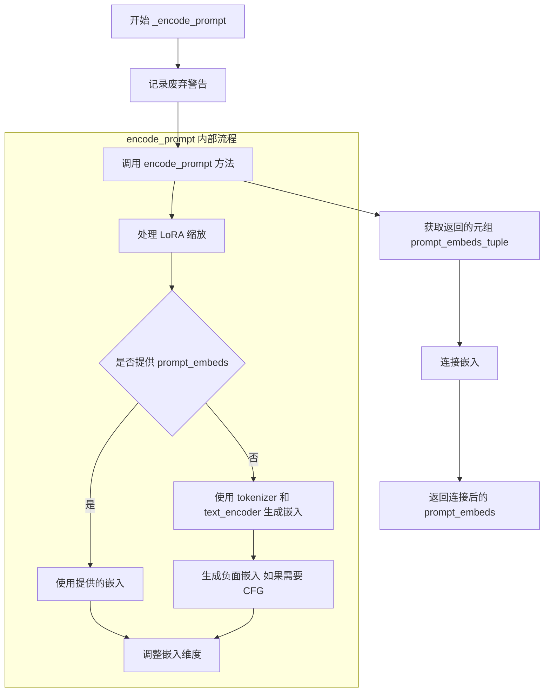

#### 带注释源码

```python
def _encode_prompt(
    self,
    prompt,
    device,
    num_images_per_prompt,
    do_classifier_free_guidance,
    negative_prompt=None,
    prompt_embeds: torch.Tensor | None = None,
    negative_prompt_embeds: torch.Tensor | None = None,
    lora_scale: float | None = None,
    **kwargs,
):
    """
    已废弃的提示编码方法。
    
    此方法已被弃用，将在未来的版本中移除。请使用 encode_prompt() 方法。
    注意：输出格式已从连接的张量更改为元组。
    
    参数:
        prompt: 要编码的提示文本（字符串或字符串列表）
        device: torch 设备
        num_images_per_prompt: 每个提示生成的图像数量
        do_classifier_free_guidance: 是否使用无分类器自由引导
        negative_prompt: 不包含的提示词
        prompt_embeds: 预生成的文本嵌入
        negative_prompt_embeds: 预生成的负面文本嵌入
        lora_scale: LoRA 缩放因子
        **kwargs: 其他关键字参数
        
    返回:
        连接后的提示嵌入张量（为保持向后兼容性）
    """
    # 记录废弃警告，提示用户使用 encode_prompt 代替
    deprecation_message = "`_encode_prompt()` is deprecated and it will be removed in a future version. Use `encode_prompt()` instead. Also, be aware that the output format changed from a concatenated tensor to a tuple."
    deprecate("_encode_prompt()", "1.0.0", deprecation_message, standard_warn=False)

    # 调用新的 encode_prompt 方法获取编码结果
    # encode_prompt 返回一个元组 (prompt_embeds, negative_prompt_embeds)
    prompt_embeds_tuple = self.encode_prompt(
        prompt=prompt,
        device=device,
        num_images_per_prompt=num_images_per_prompt,
        do_classifier_free_guidance=do_classifier_free_guidance,
        negative_prompt=negative_prompt,
        prompt_embeds=prompt_embeds,
        negative_prompt_embeds=negative_prompt_embeds,
        lora_scale=lora_scale,
        **kwargs,
    )

    # 为保持向后兼容性，将负面和正面嵌入连接在一起
    # 新方法返回 (positive, negative)，旧方法返回 [negative, positive] 的连接
    # 所以这里需要反转顺序: torch.cat([negative, positive])
    prompt_embeds = torch.cat([prompt_embeds_tuple[1], prompt_embeds_tuple[0]])

    return prompt_embeds
```


### `TextToVideoSDPipeline.encode_prompt`

该方法将文本提示词编码为文本编码器隐藏状态（text encoder hidden states），支持批量处理、LoRA 权重调整、文本反转（Textual Inversion）嵌入以及分类器自由引导（Classifier-Free Guidance），最终返回提示词嵌入和负面提示词嵌入的元组。

参数：

- `prompt`：`str | list[str] | None`，要编码的提示词，可以是单个字符串或字符串列表
- `device`：`torch.device`，PyTorch 设备，用于将计算结果放到指定设备上
- `num_images_per_prompt`：`int`，每个提示词需要生成的图像数量，用于扩展嵌入维度
- `do_classifier_free_guidance`：`bool`，是否启用分类器自由引导，启用时需要生成无条件嵌入
- `negative_prompt`：`str | list[str] | Optional`，不希望出现在生成结果中的描述，与 `prompt` 类型需一致
- `prompt_embeds`：`torch.Tensor | None`，可选的预生成文本嵌入，若提供则直接使用，跳过 tokenizer 编码
- `negative_prompt_embeds`：`torch.Tensor | None`，可选的预生成负面文本嵌入
- `lora_scale`：`float | None`，LoRA 层的缩放因子，用于调整 LoRA 权重的影响程度
- `clip_skip`：`int | None`，CLIP 编码时跳过的层数，值为 1 时使用预最终层的输出

返回值：`tuple[torch.Tensor, torch.Tensor]`，返回两个张量 —— 第一个是提示词嵌入（prompt_embeds），第二个是负面提示词嵌入（negative_prompt_embeds），形状均为 `(batch_size * num_images_per_prompt, seq_len, hidden_dim)`

#### 流程图

```mermaid
flowchart TD
    A[开始 encode_prompt] --> B{检查 lora_scale 是否存在}
    B -->|是| C[设置 self._lora_scale 并调整 LoRA 权重]
    B -->|否| D{判断 batch_size}
    C --> D
    
    D -->|prompt 是 str| E[batch_size = 1]
    D -->|prompt 是 list| F[batch_size = len(prompt)]
    D -->|其他情况| G[batch_size = prompt_embeds.shape[0]]
    
    E --> H{prompt_embeds 为空?}
    F --> H
    G --> H
    
    H -->|是| I{检查 TextualInversionLoaderMixin}
    H -->|否| J[使用已有的 prompt_embeds]
    
    I -->|是| K[调用 maybe_convert_prompt 处理多向量 token]
    I -->|否| L[直接使用 tokenizer]
    
    K --> L
    L --> M[调用 tokenizer 编码 prompt]
    
    M --> N{检查 text_encoder.use_attention_mask}
    N -->|是| O[使用 attention_mask]
    N -->|否| P[attention_mask = None]
    
    O --> Q{clip_skip 为空?}
    P --> Q
    
    Q -->|是| R[直接调用 text_encoder 获取嵌入]
    Q -->|否| S[调用 text_encoder 输出所有隐藏状态]
    S --> T[根据 clip_skip 选择对应层的隐藏状态]
    T --> U[应用 final_layer_norm]
    
    R --> V[转换为正确的数据类型和设备]
    U --> V
    J --> V
    
    V --> W{do_classifier_free_guidance 为真且 negative_prompt_embeds 为空?}
    W -->|是| X{negative_prompt 是否为空?}
    W -->|否| Y[直接返回嵌入]
    
    X -->|是| Z[uncond_tokens = [''] * batch_size]
    X -->|否| AA[处理 negative_prompt 类型]
    
    Z --> AB[调用 maybe_convert_prompt]
    AA --> AB
    AB --> AC[tokenizer 编码 uncond_tokens]
    AC --> AD[调用 text_encoder 获取负面嵌入]
    AD --> AE[duplicate negative_prompt_embeds]
    
    Y --> AF{检查 StableDiffusionLoraLoaderMixin 和 USE_PEFT_BACKEND}
    AE --> AF
    AF -->|是| AG[unscale_lora_layers 恢复原始缩放]
    AF -->|否| AH[返回 prompt_embeds 和 negative_prompt_embeds]
    
    AG --> AH
```

#### 带注释源码

```python
def encode_prompt(
    self,
    prompt,
    device,
    num_images_per_prompt,
    do_classifier_free_guidance,
    negative_prompt=None,
    prompt_embeds: torch.Tensor | None = None,
    negative_prompt_embeds: torch.Tensor | None = None,
    lora_scale: float | None = None,
    clip_skip: int | None = None,
):
    r"""
    Encodes the prompt into text encoder hidden states.

    Args:
        prompt (`str` or `list[str]`, *optional*):
            prompt to be encoded
        device: (`torch.device`):
            torch device
        num_images_per_prompt (`int`):
            number of images that should be generated per prompt
        do_classifier_free_guidance (`bool`):
            whether to use classifier free guidance or not
        negative_prompt (`str` or `list[str]`, *optional*):
            The prompt or prompts not to guide the image generation. If not defined, one has to pass
            `negative_prompt_embeds` instead. Ignored when not using guidance (i.e., ignored if `guidance_scale` is
            less than `1`).
        prompt_embeds (`torch.Tensor`, *optional*):
            Pre-generated text embeddings. Can be used to easily tweak text inputs, *e.g.* prompt weighting. If not
            provided, text embeddings will be generated from `prompt` input argument.
        negative_prompt_embeds (`torch.Tensor`, *optional*):
            Pre-generated negative text embeddings. Can be used to easily tweak text inputs, *e.g.* prompt
            weighting. If not provided, negative_prompt_embeds will be generated from `negative_prompt` input
            argument.
        lora_scale (`float`, *optional*):
            A LoRA scale that will be applied to all LoRA layers of the text encoder if LoRA layers are loaded.
        clip_skip (`int`, *optional*):
            Number of layers to be skipped from CLIP while computing the prompt embeddings. A value of 1 means that
            the output of the pre-final layer will be used for computing the prompt embeddings.
    """
    # 设置 LoRA 缩放因子，以便 text encoder 的 LoRA 函数可以正确访问
    if lora_scale is not None and isinstance(self, StableDiffusionLoraLoaderMixin):
        self._lora_scale = lora_scale

        # 动态调整 LoRA 缩放
        if not USE_PEFT_BACKEND:
            adjust_lora_scale_text_encoder(self.text_encoder, lora_scale)
        else:
            scale_lora_layers(self.text_encoder, lora_scale)

    # 确定批次大小：根据 prompt 类型或已有的 prompt_embeds
    if prompt is not None and isinstance(prompt, str):
        batch_size = 1
    elif prompt is not None and isinstance(prompt, list):
        batch_size = len(prompt)
    else:
        batch_size = prompt_embeds.shape[0]

    # 如果没有提供预生成的嵌入，则从 prompt 生成
    if prompt_embeds is None:
        # 文本反转：必要时处理多向量 token
        if isinstance(self, TextualInversionLoaderMixin):
            prompt = self.maybe_convert_prompt(prompt, self.tokenizer)

        # 使用 tokenizer 将文本转换为 token ID
        text_inputs = self.tokenizer(
            prompt,
            padding="max_length",
            max_length=self.tokenizer.model_max_length,
            truncation=True,
            return_tensors="pt",
        )
        text_input_ids = text_inputs.input_ids
        # 获取未截断的 token ID，用于检测截断警告
        untruncated_ids = self.tokenizer(prompt, padding="longest", return_tensors="pt").input_ids

        # 检测是否发生了截断，并记录警告信息
        if untruncated_ids.shape[-1] >= text_input_ids.shape[-1] and not torch.equal(
            text_input_ids, untruncated_ids
        ):
            removed_text = self.tokenizer.batch_decode(
                untruncated_ids[:, self.tokenizer.model_max_length - 1 : -1]
            )
            logger.warning(
                "The following part of your input was truncated because CLIP can only handle sequences up to"
                f" {self.tokenizer.model_max_length} tokens: {removed_text}"
            )

        # 处理 attention mask：如果 text_encoder 配置使用了 attention mask，则使用它
        if hasattr(self.text_encoder.config, "use_attention_mask") and self.text_encoder.config.use_attention_mask:
            attention_mask = text_inputs.attention_mask.to(device)
        else:
            attention_mask = None

        # 根据 clip_skip 参数决定使用哪一层隐藏状态
        if clip_skip is None:
            # 直接获取最后一层隐藏状态
            prompt_embeds = self.text_encoder(text_input_ids.to(device), attention_mask=attention_mask)
            prompt_embeds = prompt_embeds[0]
        else:
            # 获取所有隐藏状态，选择指定层的输出
            prompt_embeds = self.text_encoder(
                text_input_ids.to(device), attention_mask=attention_mask, output_hidden_states=True
            )
            # 访问 hidden_states，这是一个包含所有编码器层输出的元组
            # 然后根据 clip_skip 索引到对应层的隐藏状态
            prompt_embeds = prompt_embeds[-1][-(clip_skip + 1)]
            # 应用最终的 LayerNorm 以保持表示的正确性
            prompt_embeds = self.text_encoder.text_model.final_layer_norm(prompt_embeds)

    # 确定 prompt_embeds 的数据类型：优先使用 text_encoder 的 dtype，其次是 unet 的 dtype
    if self.text_encoder is not None:
        prompt_embeds_dtype = self.text_encoder.dtype
    elif self.unet is not None:
        prompt_embeds_dtype = self.unet.dtype
    else:
        prompt_embeds_dtype = prompt_embeds.dtype

    # 将 prompt_embeds 转换为正确的 dtype 和设备
    prompt_embeds = prompt_embeds.to(dtype=prompt_embeds_dtype, device=device)

    bs_embed, seq_len, _ = prompt_embeds.shape
    # 为每个 prompt 的每个生成复制文本嵌入，使用 mps 友好的方法
    prompt_embeds = prompt_embeds.repeat(1, num_images_per_prompt, 1)
    prompt_embeds = prompt_embeds.view(bs_embed * num_images_per_prompt, seq_len, -1)

    # 获取分类器自由引导的无条件嵌入
    if do_classifier_free_guidance and negative_prompt_embeds is None:
        uncond_tokens: list[str]
        if negative_prompt is None:
            # 如果没有提供负面 prompt，使用空字符串
            uncond_tokens = [""] * batch_size
        elif prompt is not None and type(prompt) is not type(negative_prompt):
            raise TypeError(
                f"`negative_prompt` should be the same type to `prompt`, but got {type(negative_prompt)} !="
                f" {type(prompt)}."
            )
        elif isinstance(negative_prompt, str):
            uncond_tokens = [negative_prompt]
        elif batch_size != len(negative_prompt):
            raise ValueError(
                f"`negative_prompt`: {negative_prompt} has batch size {len(negative_prompt)}, but `prompt`:"
                f" {prompt} has batch size {batch_size}. Please make sure that passed `negative_prompt` matches"
                " the batch size of `prompt`."
            )
        else:
            uncond_tokens = negative_prompt

        # 文本反转：必要时处理多向量 token
        if isinstance(self, TextualInversionLoaderMixin):
            uncond_tokens = self.maybe_convert_prompt(uncond_tokens, self.tokenizer)

        # 使用与 prompt_embeds 相同的长度
        max_length = prompt_embeds.shape[1]
        uncond_input = self.tokenizer(
            uncond_tokens,
            padding="max_length",
            max_length=max_length,
            truncation=True,
            return_tensors="pt",
        )

        # 处理 attention mask
        if hasattr(self.text_encoder.config, "use_attention_mask") and self.text_encoder.config.use_attention_mask:
            attention_mask = uncond_input.attention_mask.to(device)
        else:
            attention_mask = None

        # 获取负面提示词的嵌入
        negative_prompt_embeds = self.text_encoder(
            uncond_input.input_ids.to(device),
            attention_mask=attention_mask,
        )
        negative_prompt_embeds = negative_prompt_embeds[0]

    # 如果使用分类器自由引导，复制无条件嵌入
    if do_classifier_free_guidance:
        seq_len = negative_prompt_embeds.shape[1]

        negative_prompt_embeds = negative_prompt_embeds.to(dtype=prompt_embeds_dtype, device=device)

        negative_prompt_embeds = negative_prompt_embeds.repeat(1, num_images_per_prompt, 1)
        negative_prompt_embeds = negative_prompt_embeds.view(batch_size * num_images_per_prompt, seq_len, -1)

    # 如果使用了 LoRA 且启用了 PEFT backend，需要恢复原始的 LoRA 缩放
    if self.text_encoder is not None:
        if isinstance(self, StableDiffusionLoraLoaderMixin) and USE_PEFT_BACKEND:
            # 通过 unscale 恢复原始缩放
            unscale_lora_layers(self.text_encoder, lora_scale)

    # 返回提示词嵌入和负面提示词嵌入
    return prompt_embeds, negative_prompt_embeds
```


### `TextToVideoSDPipeline.decode_latents`

该方法负责将经过去噪处理的潜在变量（latents）通过 VAE 解码器转换为实际的视频帧数据。它首先对潜在变量进行缩放处理，然后通过维度重排和形状变换使其适应 VAE 的批量解码要求，最终将解码后的图像重新组织为 5 维张量（批次数、通道数、帧数、高度、宽度）形式的视频数据。

参数：

- `latents`：`torch.Tensor`，输入的潜在变量张量，形状为 (batch_size, channels, num_frames, height, width)，包含从扩散模型去噪步骤得到的中间表示

返回值：`torch.Tensor`，解码后的视频张量，形状为 (batch_size, channels, num_frames, height, width)，其中 channels 通常为 3（RGB 三个通道）

#### 流程图

```mermaid
flowchart TD
    A[输入: latents<br/>(batch, channels, frames, h, w)] --> B[缩放处理: latents = 1/scaling_factor * latents]
    B --> C[获取张量形状<br/>batch_size, channels, num_frames, height, width]
    C --> D[维度重排与reshape<br/>permute + reshape 合并frames到batch维度]
    D --> E[VAE解码: vae.decode(latents)]
    E --> F[提取解码样本: .sample]
    F --> G[reshape恢复视频结构<br/>重新排列维度为(batch, channels, frames, h, w)]
    G --> H[类型转换: 转换为float32]
    H --> I[输出: video<br/>(batch, channels, frames, h, w)]
```

#### 带注释源码

```python
def decode_latents(self, latents):
    """
    将潜在变量解码为视频帧。
    
    参数:
        latents: 来自扩散模型的潜在表示，形状为 (batch_size, channels, num_frames, height, width)
    返回:
        解码后的视频张量，形状为 (batch_size, channels, num_frames, height, width)
    """
    # 第一步：缩放潜在变量
    # VAE 使用缩放因子将潜在空间映射到图像空间，需要逆向缩放
    latents = 1 / self.vae.config.scaling_factor * latents

    # 第二步：获取输入张量的维度信息
    # latents 形状: (batch_size, channels, num_frames, height, width)
    batch_size, channels, num_frames, height, width = latents.shape
    
    # 第三步：维度重排和形状变换
    # 将 (batch, channels, frames, h, w) 转换为 (batch*frames, channels, h, w)
    # 这样可以一次性解码所有帧，提高效率
    # permute(0, 2, 1, 3, 4) 将维度重新排列为 (batch, frames, channels, height, width)
    # 然后 reshape 为 (batch*frames, channels, height, width)
    latents = latents.permute(0, 2, 1, 3, 4).reshape(batch_size * num_frames, channels, height, width)

    # 第四步：使用 VAE 解码器将潜在变量解码为图像
    # vae.decode 返回一个包含 sample 属性的对象
    image = self.vae.decode(latents).sample
    
    # 第五步：重新组织解码后的图像为视频格式
    # image 形状: (batch*frames, channels, height, width)
    # 需要恢复为 (batch, channels, frames, height, width) 的视频格式
    # 先添加一个维度，然后用 reshape 恢复批量和帧数维度
    video = image[None, :].reshape((batch_size, num_frames, -1) + image.shape[2:]).permute(0, 2, 1, 3, 4)
    
    # 第六步：转换为 float32 类型
    # 这是因为 float32 不会引起显著的开销，并且与 bfloat16 兼容
    video = video.float()
    
    # 返回最终的视频张量
    return video
```


### `TextToVideoSDPipeline.prepare_extra_step_kwargs`

该方法用于准备调度器（scheduler）的额外参数。由于不同调度器具有不同的签名，该方法通过检查调度器step函数是否接受特定参数（eta和generator），动态构建并返回需要传递给scheduler.step()的额外关键字参数字典。

参数：

- `self`：`TextToVideoSDPipeline`，Pipeline实例本身
- `generator`：`torch.Generator | list[torch.Generator] | None`，用于生成确定性随机数的PyTorch生成器，可选
- `eta`：`float`，DDIM调度器专用参数η，对应DDIM论文中的η值，取值范围为[0, 1]，其他调度器会忽略此参数

返回值：`dict[str, Any]`，包含调度器step函数所需额外参数（如eta和generator）的字典

#### 流程图

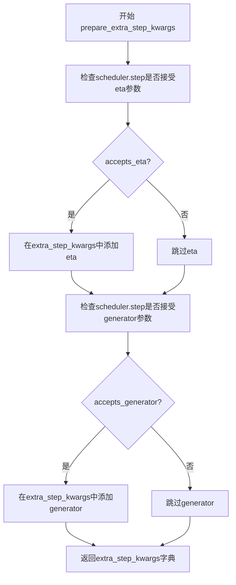

#### 带注释源码

```python
def prepare_extra_step_kwargs(self, generator, eta):
    """
    准备调度器额外参数。
    
    由于并非所有调度器都具有相同的签名，该方法用于检查当前调度器
    是否支持特定参数（eta和generator），并返回需要传递给scheduler.step()的
    额外关键字参数字典。
    
    参数:
        generator: torch.Generator 或 list[torch.Generator] 或 None
            用于生成确定性随机数的PyTorch生成器，可实现可复现的生成结果
        eta: float
            DDIM调度器专用参数η（对应DDIM论文中的η），取值范围[0, 1]
            对于其他调度器，此参数将被忽略
    
    返回:
        dict: 包含调度器step函数所需额外参数的字典
            可能包含'eta'键（如果调度器支持）
            可能包含'generator'键（如果调度器支持）
    """
    # 准备调度器step的额外参数，因为并非所有调度器都具有相同的签名
    # eta (η) 仅在DDIMScheduler中使用，其他调度器会忽略此参数
    # eta 对应 DDIM 论文 (https://huggingface.co/papers/2010.02502) 中的 η
    # 取值应在 [0, 1] 范围内
    
    # 检查调度器的step方法是否接受eta参数
    accepts_eta = "eta" in set(inspect.signature(self.scheduler.step).parameters.keys())
    extra_step_kwargs = {}
    if accepts_eta:
        # 如果调度器支持eta参数，则将其添加到额外参数字典中
        extra_step_kwargs["eta"] = eta

    # 检查调度器是否接受generator参数
    accepts_generator = "generator" in set(inspect.signature(self.scheduler.step).parameters.keys())
    if accepts_generator:
        # 如果调度器支持generator参数，则将其添加到额外参数字典中
        extra_step_kwargs["generator"] = generator
    
    # 返回构建好的额外参数字典，供scheduler.step()使用
    return extra_step_kwargs
```


### `TextToVideoSDPipeline.check_inputs`

该方法用于验证文本到视频生成管道的输入参数有效性，确保传入的参数满足模型要求，包括检查高度和宽度的像素倍数、回调步骤的正整数约束、提示词与提示词嵌入的互斥性、负提示词与负提示词嵌入的互斥性，以及提示词嵌入与负提示词嵌入的形状一致性。

参数：

- `self`：`TextToVideoSDPipeline`，Pipeline 实例本身
- `prompt`：`str` 或 `list[str]` 或 `None`，用于指导视频生成的提示词，若未定义则需传入 `prompt_embeds`
- `height`：`int`，生成视频的高度（像素），必须能被 8 整除
- `width`：`int`，生成视频的宽度（像素），必须能被 8 整除
- `callback_steps`：`int`，执行回调函数的步数间隔，必须为正整数
- `negative_prompt`：`str` 或 `list[str]` 或 `None`，用于指导不包含内容的提示词，若未使用 guidance 则忽略
- `prompt_embeds`：`torch.Tensor` 或 `None`，预生成的文本嵌入，可用于调整提示词权重
- `negative_prompt_embeds`：`torch.Tensor` 或 `None`，预生成的负向文本嵌入
- `callback_on_step_end_tensor_inputs`：`list[str]` 或 `None`，回调函数在每步结束时可访问的 tensor 输入列表

返回值：`None`，该方法不返回任何值，仅通过抛出 `ValueError` 来指示输入无效

#### 流程图

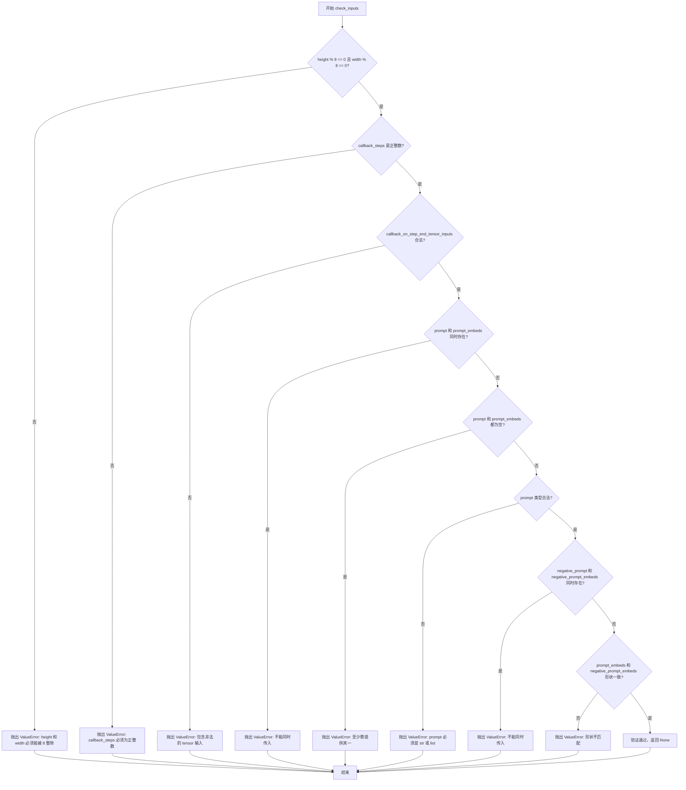

#### 带注释源码

```python
def check_inputs(
    self,
    prompt,
    height,
    width,
    callback_steps,
    negative_prompt=None,
    prompt_embeds=None,
    negative_prompt_embeds=None,
    callback_on_step_end_tensor_inputs=None,
):
    # 检查高度和宽度是否为 8 的倍数，视频生成要求尺寸必须能被 8 整除
    if height % 8 != 0 or width % 8 != 0:
        raise ValueError(f"`height` and `width` have to be divisible by 8 but are {height} and {width}.")

    # 检查 callback_steps 是否为正整数，确保回调频率合理
    if callback_steps is not None and (not isinstance(callback_steps, int) or callback_steps <= 0):
        raise ValueError(
            f"`callback_steps` has to be a positive integer but is {callback_steps} of type"
            f" {type(callback_steps)}."
        )
    
    # 验证回调的 tensor 输入是否在允许列表中，防止访问非法内部状态
    if callback_on_step_end_tensor_inputs is not None and not all(
        k in self._callback_tensor_inputs for k in callback_on_step_end_tensor_inputs
    ):
        raise ValueError(
            f"`callback_on_step_end_tensor_inputs` has to be in {self._callback_tensor_inputs}, but found {[k for k in callback_on_step_end_tensor_inputs if k not in self._callback_tensor_inputs]}"
        )

    # prompt 和 prompt_embeds 互斥，不能同时提供，避免重复编码
    if prompt is not None and prompt_embeds is not None:
        raise ValueError(
            f"Cannot forward both `prompt`: {prompt} and `prompt_embeds`: {prompt_embeds}. Please make sure to"
            " only forward one of the two."
        )
    # 至少需要提供一种提示词输入方式
    elif prompt is None and prompt_embeds is None:
        raise ValueError(
            "Provide either `prompt` or `prompt_embeds`. Cannot leave both `prompt` and `prompt_embeds` undefined."
        )
    # 验证 prompt 的类型，必须是字符串或字符串列表
    elif prompt is not None and (not isinstance(prompt, str) and not isinstance(prompt, list)):
        raise ValueError(f"`prompt` has to be of type `str` or `list` but is {type(prompt)}")

    # negative_prompt 和 negative_prompt_embeds 同样互斥
    if negative_prompt is not None and negative_prompt_embeds is not None:
        raise ValueError(
            f"Cannot forward both `negative_prompt`: {negative_prompt} and `negative_prompt_embeds`:"
            f" {negative_prompt_embeds}. Please make sure to only forward one of the two."
        )

    # 当两者都提供时，确保形状一致以保证对齐
    if prompt_embeds is not None and negative_prompt_embeds is not None:
        if prompt_embeds.shape != negative_prompt_embeds.shape:
            raise ValueError(
                "`prompt_embeds` and `negative_prompt_embeds` must have the same shape when passed directly, but"
                f" got: `prompt_embeds` {prompt_embeds.shape} != `negative_prompt_embeds`"
                f" {negative_prompt_embeds.shape}."
            )
```


### `TextToVideoSDPipeline.prepare_latents`

该方法用于在文本到视频生成管道中准备初始潜在变量。它根据批大小、视频帧数和图像尺寸计算潜在变量的形状，如果未提供潜在变量则使用随机噪声初始化，否则将提供的潜在变量转移到指定设备，并使用调度器的初始噪声标准差进行缩放。

参数：

- `batch_size`：`int`，批处理大小，决定生成视频的数量
- `num_channels_latents`：`int`，潜在变量的通道数，通常对应于 UNet 的输入通道数
- `num_frames`：`int`，要生成的视频帧数
- `height`：`int`，生成视频的高度（像素）
- `width`：`int`，生成视频的宽度（像素）
- `dtype`：`torch.dtype`，潜在变量的数据类型（如 float16、float32 等）
- `device`：`torch.device`，计算设备（CPU 或 CUDA 设备）
- `generator`：`torch.Generator` 或 `list[torch.Generator]`，可选的随机数生成器，用于确保生成的可重复性
- `latents`：`torch.Tensor | None`，可选的预生成潜在变量，如果为 None 则随机生成

返回值：`torch.Tensor`，处理后的潜在变量张量，形状为 `(batch_size, num_channels_latents, num_frames, height/vae_scale_factor, width/vae_scale_factor)`

#### 流程图

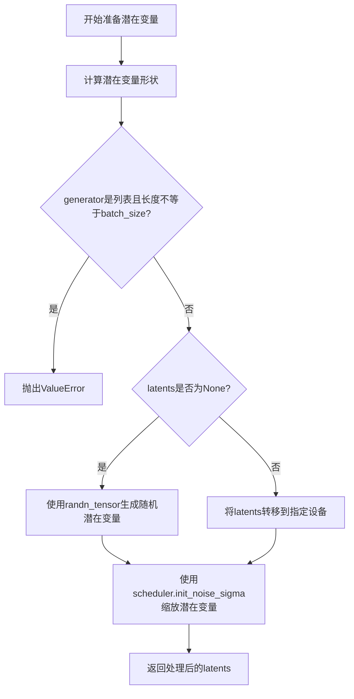

#### 带注释源码

```python
def prepare_latents(
    self, batch_size, num_channels_latents, num_frames, height, width, dtype, device, generator, latents=None
):
    """
    准备用于视频生成的潜在变量。
    
    参数:
        batch_size: 批处理大小
        num_channels_latents: 潜在变量的通道数
        num_frames: 视频帧数
        height: 视频高度
        width: 视频宽度
        dtype: 张量数据类型
        device: 计算设备
        generator: 随机数生成器
        latents: 可选的预生成潜在变量
    """
    # 计算潜在变量的形状，考虑 VAE 缩放因子
    # 形状: (batch_size, channels, frames, height/vae_scale, width/vae_scale)
    shape = (
        batch_size,
        num_channels_latents,
        num_frames,
        height // self.vae_scale_factor,
        width // self.vae_scale_factor,
    )
    
    # 验证生成器列表长度与批大小是否匹配
    if isinstance(generator, list) and len(generator) != batch_size:
        raise ValueError(
            f"You have passed a list of generators of length {len(generator)}, but requested an effective batch"
            f" size of {batch_size}. Make sure the batch size matches the length of the generators."
        )

    # 如果没有提供潜在变量，则随机生成
    if latents is None:
        latents = randn_tensor(shape, generator=generator, device=device, dtype=dtype)
    else:
        # 否则将提供的潜在变量转移到目标设备
        latents = latents.to(device)

    # 根据调度器的要求缩放初始噪声
    # 这是扩散模型的关键步骤，确保噪声与调度器的噪声调度策略一致
    latents = latents * self.scheduler.init_noise_sigma
    return latents
```


### `TextToVideoSDPipeline.__call__`

这是文本到视频生成管道的主生成方法，执行完整的视频生成流程，包括输入验证、提示词编码、潜在向量准备、去噪循环、潜在向量解码和后处理，最终输出生成的视频帧。

参数：

- `prompt`：`str | list[str] | None`，引导视频生成的提示词
- `height`：`int | None`，生成视频的高度，默认为 `self.unet.config.sample_size * self.vae_scale_factor`
- `width`：`int | None`，生成视频的宽度，默认为 `self.unet.config.sample_size * self.vae_scale_factor`
- `num_frames`：`int`，生成的视频帧数，默认为16
- `num_inference_steps`：`int`，去噪步数，默认为50
- `guidance_scale`：`float`，引导比例，用于控制文本提示对生成的影响，默认为9.0
- `negative_prompt`：`str | list[str] | None`，负面提示词，用于引导不包含的内容
- `eta`：`float`，DDIM论文中的eta参数，仅DDIM调度器使用，默认为0.0
- `generator`：`torch.Generator | list[torch.Generator] | None`，随机生成器，用于确保可重复性
- `latents`：`torch.Tensor | None`，预生成的噪声潜在向量
- `prompt_embeds`：`torch.Tensor | None`，预生成的文本嵌入
- `negative_prompt_embeds`：`torch.Tensor | None`，预生成的负面文本嵌入
- `output_type`：`str | None`，输出格式，可选 `"np"` 或 `"latent"`，默认为 `"np"`
- `return_dict`：`bool`，是否返回字典格式，默认为 `True`
- `callback`：`Callable[[int, int, torch.Tensor], None] | None`，推理过程中的回调函数
- `callback_steps`：`int`，回调函数调用频率，默认为1
- `cross_attention_kwargs`：`dict[str, Any] | None`，传递给注意力处理器的额外参数
- `clip_skip`：`int | None`，CLIP计算提示嵌入时跳过的层数

返回值：`TextToVideoSDPipelineOutput | tuple`，当 `return_dict=True` 时返回 `TextToVideoSDPipelineOutput`，否则返回包含视频帧的元组

#### 流程图

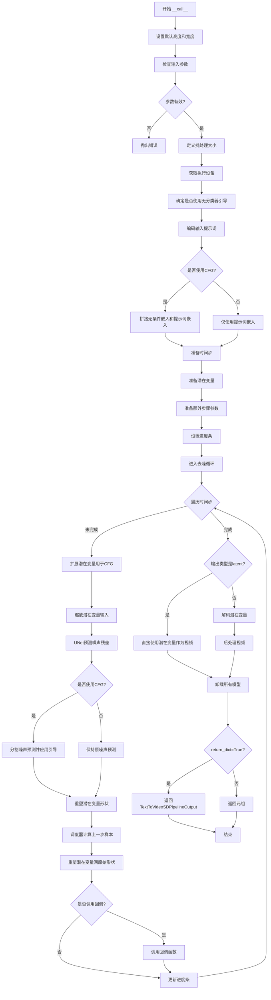

#### 带注释源码

```python
@torch.no_grad()
@replace_example_docstring(EXAMPLE_DOC_STRING)
def __call__(
    self,
    prompt: str | list[str] = None,
    height: int | None = None,
    width: int | None = None,
    num_frames: int = 16,
    num_inference_steps: int = 50,
    guidance_scale: float = 9.0,
    negative_prompt: str | list[str] | None = None,
    eta: float = 0.0,
    generator: torch.Generator | list[torch.Generator] | None = None,
    latents: torch.Tensor | None = None,
    prompt_embeds: torch.Tensor | None = None,
    negative_prompt_embeds: torch.Tensor | None = None,
    output_type: str | None = "np",
    return_dict: bool = True,
    callback: Callable[[int, int, torch.Tensor], None] | None = None,
    callback_steps: int = 1,
    cross_attention_kwargs: dict[str, Any] | None = None,
    clip_skip: int | None = None,
):
    r"""
    The call function to the pipeline for generation.

    Args:
        prompt (`str` or `list[str]`, *optional*):
            The prompt or prompts to guide image generation. If not defined, you need to pass `prompt_embeds`.
        height (`int`, *optional*, defaults to `self.unet.config.sample_size * self.vae_scale_factor`):
            The height in pixels of the generated video.
        width (`int`, *optional*, defaults to `self.unet.config.sample_size * self.vae_scale_factor`):
            The width in pixels of the generated video.
        num_frames (`int`, *optional*, defaults to 16):
            The number of video frames that are generated. Defaults to 16 frames which at 8 frames per seconds
            amounts to 2 seconds of video.
        num_inference_steps (`int`, *optional*, defaults to 50):
            The number of denoising steps. More denoising steps usually lead to a higher quality videos at the
            expense of slower inference.
        guidance_scale (`float`, *optional*, defaults to 7.5):
            A higher guidance scale value encourages the model to generate images closely linked to the text
            `prompt` at the expense of lower image quality. Guidance scale is enabled when `guidance_scale > 1`.
        negative_prompt (`str` or `list[str]`, *optional*):
            The prompt or prompts to guide what to not include in image generation. If not defined, you need to
            pass `negative_prompt_embeds` instead. Ignored when not using guidance (`guidance_scale < 1`).
        num_images_per_prompt (`int`, *optional*, defaults to 1):
            The number of images to generate per prompt.
        eta (`float`, *optional*, defaults to 0.0):
            Corresponds to parameter eta (η) from the [DDIM](https://huggingface.co/papers/2010.02502) paper. Only
            applies to the [`~schedulers.DDIMScheduler`], and is ignored in other schedulers.
        generator (`torch.Generator` or `list[torch.Generator]`, *optional*):
            A [`torch.Generator`](https://pytorch.org/docs/stable/generated/torch.Generator.html) to make
            generation deterministic.
        latents (`torch.Tensor`, *optional*):
            Pre-generated noisy latents sampled from a Gaussian distribution, to be used as inputs for video
            generation. Can be used to tweak the same generation with different prompts. If not provided, a latents
            tensor is generated by sampling using the supplied random `generator`. Latents should be of shape
            `(batch_size, num_channel, num_frames, height, width)`.
        prompt_embeds (`torch.Tensor`, *optional*):
            Pre-generated text embeddings. Can be used to easily tweak text inputs (prompt weighting). If not
            provided, text embeddings are generated from the `prompt` input argument.
        negative_prompt_embeds (`torch.Tensor`, *optional*):
            Pre-generated negative text embeddings. Can be used to easily tweak text inputs (prompt weighting). If
            not provided, `negative_prompt_embeds` are generated from the `negative_prompt` input argument.
        output_type (`str`, *optional*, defaults to `"np"`):
            The output format of the generated video. Choose between `torch.Tensor` or `np.array`.
        return_dict (`bool`, *optional*, defaults to `True`):
            Whether or not to return a [`~pipelines.text_to_video_synthesis.TextToVideoSDPipelineOutput`] instead
            of a plain tuple.
        callback (`Callable`, *optional*):
            A function that calls every `callback_steps` steps during inference. The function is called with the
            following arguments: `callback(step: int, timestep: int, latents: torch.Tensor)`.
        callback_steps (`int`, *optional*, defaults to 1):
            The frequency at which the `callback` function is called. If not specified, the callback is called at
            every step.
        cross_attention_kwargs (`dict`, *optional*):
            A kwargs dictionary that if specified is passed along to the [`AttentionProcessor`] as defined in
            [`self.processor`](https://github.com/huggingface/diffusers/blob/main/src/diffusers/models/attention_processor.py).
        clip_skip (`int`, *optional*):
            Number of layers to be skipped from CLIP while computing the prompt embeddings. A value of 1 means that
            the output of the pre-final layer will be used for computing the prompt embeddings.
    Examples:

    Returns:
        [`~pipelines.text_to_video_synthesis.TextToVideoSDPipelineOutput`] or `tuple`:
            If `return_dict` is `True`, [`~pipelines.text_to_video_synthesis.TextToVideoSDPipelineOutput`] is
            returned, otherwise a `tuple` is returned where the first element is a list with the generated frames.
    """
    # 0. Default height and width to unet
    # 设置默认高度和宽度，如果未提供则使用UNet配置中的sample_size乘以VAE缩放因子
    height = height or self.unet.config.sample_size * self.vae_scale_factor
    width = width or self.unet.config.sample_size * self.vae_scale_factor

    num_images_per_prompt = 1

    # 1. Check inputs. Raise error if not correct
    # 检查输入参数的有效性
    self.check_inputs(
        prompt, height, width, callback_steps, negative_prompt, prompt_embeds, negative_prompt_embeds
    )

    # 2. Define call parameters
    # 根据提示词或提示词嵌入确定批处理大小
    if prompt is not None and isinstance(prompt, str):
        batch_size = 1
    elif prompt is not None and isinstance(prompt, list):
        batch_size = len(prompt)
    else:
        batch_size = prompt_embeds.shape[0]

    # 获取执行设备
    device = self._execution_device
    # here `guidance_scale` is defined analog to the guidance weight `w` of equation (2)
    # of the Imagen paper: https://huggingface.co/papers/2205.11487 . `guidance_scale = 1`
    # corresponds to doing no classifier free guidance.
    # 确定是否使用无分类器引导（CFG）
    do_classifier_free_guidance = guidance_scale > 1.0

    # 3. Encode input prompt
    # 从cross_attention_kwargs中提取LoRA缩放因子
    text_encoder_lora_scale = (
        cross_attention_kwargs.get("scale", None) if cross_attention_kwargs is not None else None
    )
    # 编码输入提示词为文本嵌入
    prompt_embeds, negative_prompt_embeds = self.encode_prompt(
        prompt,
        device,
        num_images_per_prompt,
        do_classifier_free_guidance,
        negative_prompt,
        prompt_embeds=prompt_embeds,
        negative_prompt_embeds=negative_prompt_embeds,
        lora_scale=text_encoder_lora_scale,
        clip_skip=clip_skip,
    )
    # For classifier free guidance, we need to do two forward passes.
    # Here we concatenate the unconditional and text embeddings into a single batch
    # to avoid doing two forward passes
    # 如果使用CFG，将无条件嵌入和文本嵌入拼接在一起以避免两次前向传播
    if do_classifier_free_guidance:
        prompt_embeds = torch.cat([negative_prompt_embeds, prompt_embeds])

    # 4. Prepare timesteps
    # 设置去噪调度器的时间步
    self.scheduler.set_timesteps(num_inference_steps, device=device)
    timesteps = self.scheduler.timesteps

    # 5. Prepare latent variables
    # 获取潜在变量的通道数
    num_channels_latents = self.unet.config.in_channels
    # 准备初始潜在变量
    latents = self.prepare_latents(
        batch_size * num_images_per_prompt,
        num_channels_latents,
        num_frames,
        height,
        width,
        prompt_embeds.dtype,
        device,
        generator,
        latents,
    )

    # 6. Prepare extra step kwargs. TODO: Logic should ideally just be moved out of the pipeline
    # 准备调度器步骤的额外参数
    extra_step_kwargs = self.prepare_extra_step_kwargs(generator, eta)

    # 7. Denoising loop
    # 计算预热步数
    num_warmup_steps = len(timesteps) - num_inference_steps * self.scheduler.order
    # 创建进度条
    with self.progress_bar(total=num_inference_steps) as progress_bar:
        # 遍历每个时间步进行去噪
        for i, t in enumerate(timesteps):
            # expand the latents if we are doing classifier free guidance
            # 如果使用CFG，扩展潜在变量以同时处理条件和无条件预测
            latent_model_input = torch.cat([latents] * 2) if do_classifier_free_guidance else latents
            # 缩放潜在变量输入以匹配调度器
            latent_model_input = self.scheduler.scale_model_input(latent_model_input, t)

            # predict the noise residual
            # 使用UNet预测噪声残差
            noise_pred = self.unet(
                latent_model_input,
                t,
                encoder_hidden_states=prompt_embeds,
                cross_attention_kwargs=cross_attention_kwargs,
                return_dict=False,
            )[0]

            # perform guidance
            # 执行无分类器引导
            if do_classifier_free_guidance:
                noise_pred_uncond, noise_pred_text = noise_pred.chunk(2)
                noise_pred = noise_pred_uncond + guidance_scale * (noise_pred_text - noise_pred_uncond)

            # reshape latents
            # 重塑潜在变量形状以进行调度器步骤计算
            bsz, channel, frames, width, height = latents.shape
            latents = latents.permute(0, 2, 1, 3, 4).reshape(bsz * frames, channel, width, height)
            noise_pred = noise_pred.permute(0, 2, 1, 3, 4).reshape(bsz * frames, channel, width, height)

            # compute the previous noisy sample x_t -> x_t-1
            # 使用调度器计算前一个噪声样本
            latents = self.scheduler.step(noise_pred, t, latents, **extra_step_kwargs).prev_sample

            # reshape latents back
            # 将潜在变量重塑回原始形状
            latents = latents[None, :].reshape(bsz, frames, channel, width, height).permute(0, 2, 1, 3, 4)

            # call the callback, if provided
            # 在适当的步数调用回调函数
            if i == len(timesteps) - 1 or ((i + 1) > num_warmup_steps and (i + 1) % self.scheduler.order == 0):
                progress_bar.update()
                if callback is not None and i % callback_steps == 0:
                    step_idx = i // getattr(self.scheduler, "order", 1)
                    callback(step_idx, t, latents)

            # 处理XLA设备
            if XLA_AVAILABLE:
                xm.mark_step()

    # 8. Post processing
    # 后处理：根据输出类型处理生成的潜在变量
    if output_type == "latent":
        video = latents
    else:
        # 解码潜在变量为视频
        video_tensor = self.decode_latents(latents)
        # 后处理视频并转换为指定格式
        video = self.video_processor.postprocess_video(video=video_tensor, output_type=output_type)

    # 9. Offload all models
    # 卸载所有模型以释放内存
    self.maybe_free_model_hooks()

    # 返回结果
    if not return_dict:
        return (video,)

    return TextToVideoSDPipelineOutput(frames=video)
```

## 关键组件


### TextToVideoSDPipeline

主类，文本到视频生成的DiffusionPipeline实现，继承自多个Mixin类以支持LoRA权重加载、文本反转embedding加载等功能。

### 张量索引与形状重塑

在`__call__`方法的去噪循环中，频繁进行latents的维度变换：permute用于调整维度顺序，reshape用于合并batch和frames维度以适应UNet的2D处理需求，完成去噪后再恢复5D形状。

### 反量化支持

`decode_latents`方法中实现：先除以VAE的scaling_factor进行反量化，然后通过permute和reshape将5D张量(bs, c, f, h, w)转换为4D张量进行VAE解码，最后再恢复为视频张量。

### 量化策略

通过继承`StableDiffusionLoraLoaderMixin`实现LoRA支持，在`encode_prompt`中处理lora_scale参数，支持PEFT和传统两种LoRA后端，通过`scale_lora_layers`和`unscale_lora_layers`动态调整。

### TextualInversionLoaderMixin支持

在提示编码过程中，通过`maybe_convert_prompt`方法处理多向量token的文本反转embedding，支持自定义embedding的注入。

### 惰性加载与模型卸载

`model_cpu_offload_seq`定义了模型卸载顺序"text_encoder->unet->vae"，`maybe_free_model_hooks`在推理完成后自动卸载模型以节省显存。

### 调度器集成

通过`prepare_extra_step_kwargs`动态检测调度器签名，支持不同调度器（如DDIMScheduler）的eta和generator参数，实现调度器无关的通用pipeline设计。

### 视频后处理

`VideoProcessor`负责将解码后的视频张量转换为指定输出格式（np.array或torch.Tensor），处理视频帧的格式转换。


## 问题及建议


### 已知问题

-   **废弃方法仍被使用**：`_encode_prompt` 方法已被标记为废弃(`deprecate`)，但仍保留在类中，造成代码冗余和维护负担
-   **`num_images_per_prompt` 参数缺失**：`__call__` 方法中 `num_images_per_prompt` 被硬编码为1，且未作为参数暴露给用户，无法生成多张图像
-   **类型注解不一致**：部分使用新的联合类型语法(`torch.Tensor | None`)，部分使用旧的 `Optional` 语法，风格不统一
- **内存效率低下**：去噪循环中重复进行 tensor 的 reshape 和 permute 操作（每轮迭代都执行），造成不必要的内存分配和性能开销
- **XLA 支持不完整**：仅在循环末尾调用 `xm.mark_step()`，缺少 `xm.wait_device_ops()`，XLA 优化不充分
- **API 设计不一致**：文档中提到 `num_images_per_prompt` 参数，但 `__call__` 方法签名中并不包含此参数
- **继承链复杂**：类继承自5个不同的 Mixin 类，可能导致 MRO (方法解析顺序) 混乱和潜在的方法冲突

### 优化建议

-   **移除废弃方法**：删除 `_encode_prompt` 方法，强制使用 `encode_prompt`
-   **添加缺失参数**：在 `__call__` 方法中添加 `num_images_per_prompt` 参数，默认值为1
-   **统一类型注解**：统一使用 Python 3.10+ 的联合类型语法或统一使用 `Optional` 语法
-   **优化 tensor 操作**：将去噪循环中的 reshape/permute 操作提取到循环外部，或使用视图(view)替代复制操作
-   **完善 XLA 支持**：在 `xm.mark_step()` 后添加 `xm.wait_device_ops()` 确保设备操作完成
-   **简化继承结构**：考虑使用组合(Composition)替代部分 Mixin 继承，或重构为更扁平的类层次结构
-   **添加缓存机制**：对 `prompt_embeds` 的条件/无条件拼接可以在循环前完成一次，避免重复计算

## 其它


### 设计目标与约束

该Pipeline的设计目标是实现高效的文本到视频生成功能，基于Stable Diffusion架构扩展到3D时空维度。核心约束包括：1) 输入文本长度受tokenizer限制（最大77个tokens），2) 输出视频分辨率必须能被8整除，3) 默认生成16帧视频（约2秒@8fps），4) 支持LoRA权重加载和Textual Inversion嵌入，5) 必须在PyTorch 2.0+环境中运行，6) 内存占用受限于UNet3DConditionModel的参数量（约500M参数）。

### 错误处理与异常设计

主要异常场景包括：1) 输入验证失败时抛出ValueError（如height/width不是8的倍数、callback_steps不是正整数），2) 类型不匹配时抛出TypeError（如negative_prompt与prompt类型不一致），3) 批次大小不匹配时抛出ValueError，4) 设备不支持时通过torch_xla检测XLA可用性，5) 弃用方法调用时通过deprecate函数记录警告，6) 内存不足时依赖PyTorch的CUDA OOM处理，7) 模型加载失败时由from_pretrained统一处理。

### 数据流与状态机

Pipeline的数据流分为9个主要阶段：0) 默认参数初始化（height/width来自unet.config.sample_size * vae_scale_factor），1) 输入验证（check_inputs），2) 批次参数计算，3) 文本编码（encode_prompt生成prompt_embeds和negative_prompt_embeds），4) 调度器时间步设置（set_timesteps），5) 潜在变量准备（prepare_latents初始化噪声），6) 额外步骤参数准备（prepare_extra_step_kwargs），7) 去噪循环（迭代num_inference_steps次，包含UNet前向传播、CFG计算、scheduler.step更新），8) 后处理（decode_latents解码或直接输出latent），9) 模型卸载（maybe_free_model_hooks）。状态转换由scheduler.timesteps控制，遵循DDIM/DDIM-related采样策略。

### 外部依赖与接口契约

核心依赖包括：1) torch>=2.0（张量计算），2) transformers（CLIPTextModel, CLIPTokenizer），3) diffusers内部模块（AutoencoderKL, UNet3DConditionModel, KarrasDiffusionSchedulers, VideoProcessor），4) peft（可选，用于LoRA层缩放），5) torch_xla（可选，用于TPU加速）。接口契约：from_pretrained方法负责模型加载，__call__方法为生成入口（参数严格类型检查），encode_prompt返回(prompt_embeds, negative_prompt_embeds)元组，decode_latents返回float32张量，PipelineOutput包含frames属性。

### 性能考虑与优化点

性能关键点：1) 模型CPU卸载（model_cpu_offload_seq指定text_encoder->unet->vae顺序），2) VAE解码在去噪循环外执行（避免重复解码），3) CFG通过单次前向传播实现（concat条件与非条件embeddings），4) XLA编译支持（xm.mark_step()），5) 潜在变量reshape优化（避免不必要的数据复制），6) 混合精度支持（fp16/fp32），7) Generator确定性生成支持，8) Latent预生成机制允许缓存。潜在优化空间：1) VAE tiling用于超长视频，2) 梯度检查点技术，3) Flash Attention集成，4) xFormers attention processor。

### 安全性考虑

安全机制：1) 输入验证防止恶意构造，2) 文本截断处理防止tokenizer溢出，3) LoRA scale动态调整确保权重正确应用，4) PEFT backend与原生LoRA路径兼容，5) 模型hooks管理防止内存泄漏，6) CPU offload防止GPU OOM。潜在风险：1) 生成内容的版权/伦理问题（由上层应用负责），2) 提示词注入攻击（需应用层过滤），3) 恶意模型权重（需验证来源）。

### 版本兼容性

版本相关设计：1) _last_supported_version = "0.33.1"标记支持的最后一个版本，2) DeprecatedPipelineMixin处理废弃警告，3) deprecate函数用于方法废弃提示，4) 保持与diffusers 0.x系列的API兼容，5) torch dtype与variant参数支持（fp16/vfp16），6) Python类型提示使用Union语法（str | list[str]）需Python 3.10+，7) PEFT backend检测（USE_PEFT_BACKEND）支持新版LoRA API。

### 配置与参数说明

关键配置参数：1) vae_scale_factor = 2^(len(vae.config.block_out_channels)-1)，2) model_cpu_offload_seq定义卸载顺序，3) video_processor.do_resize=False保持原始尺寸，4) num_frames默认16，5) num_inference_steps默认50，6) guidance_scale默认9.0（视频生成通常高于图像的7.5），7) output_type支持"np"/"latent"/"pt"，8) cross_attention_kwargs传递给UNet的AttentionProcessor。

### 使用示例与测试考虑

典型使用流程：1) from_pretrained加载模型，2) enable_model_cpu_offload()优化显存，3) pipe()调用生成，4) export_to_video导出。测试应覆盖：1) 短文本/长文本/空文本输入，2) 单帧/多帧生成，3) 有/无negative_prompt，4) CFG开启/关闭，5) 预生成latents的复用，6) callback函数触发，7) fp16/fp32精度，8) CUDA/CPU/XLA设备，9) LoRA权重加载/卸载，10) Textual Inversion嵌入。

### 部署与环境要求

部署要求：1) Python 3.10+，2) PyTorch 2.0+ with CUDA 11.8+ or CPU，3) 建议16GB+ GPU显存（fp16），4) transformers库版本兼容，5) diffusers库版本>=0.19.0，6) 磁盘空间约3-5GB（模型权重），7) 运行时内存占用约8-12GB（取决于batch_size和num_frames），8) 支持Docker容器化部署，9) TPU支持需安装torch_xla。

    