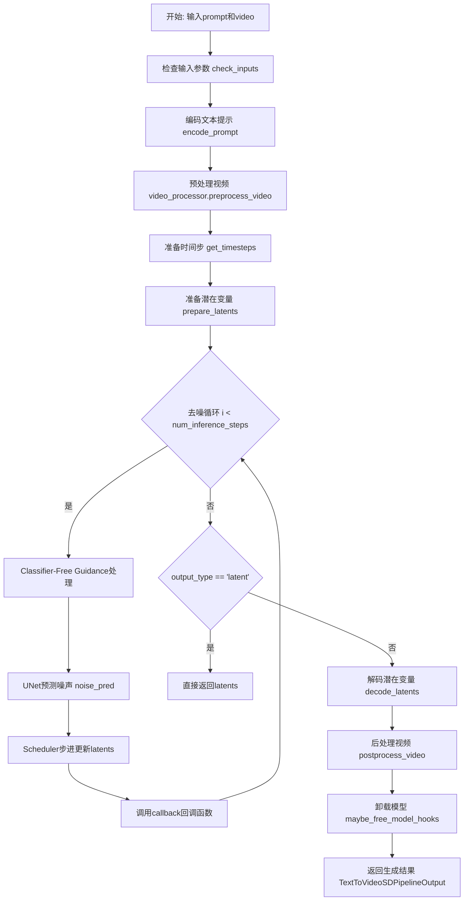
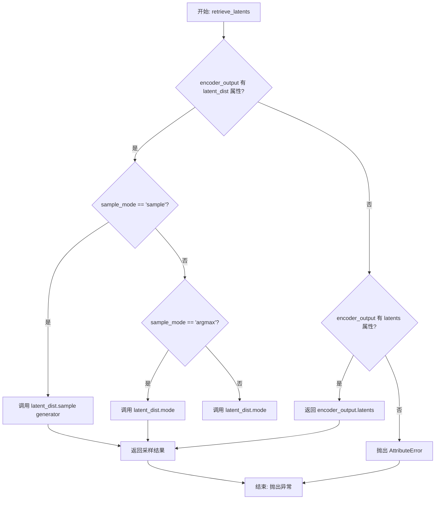
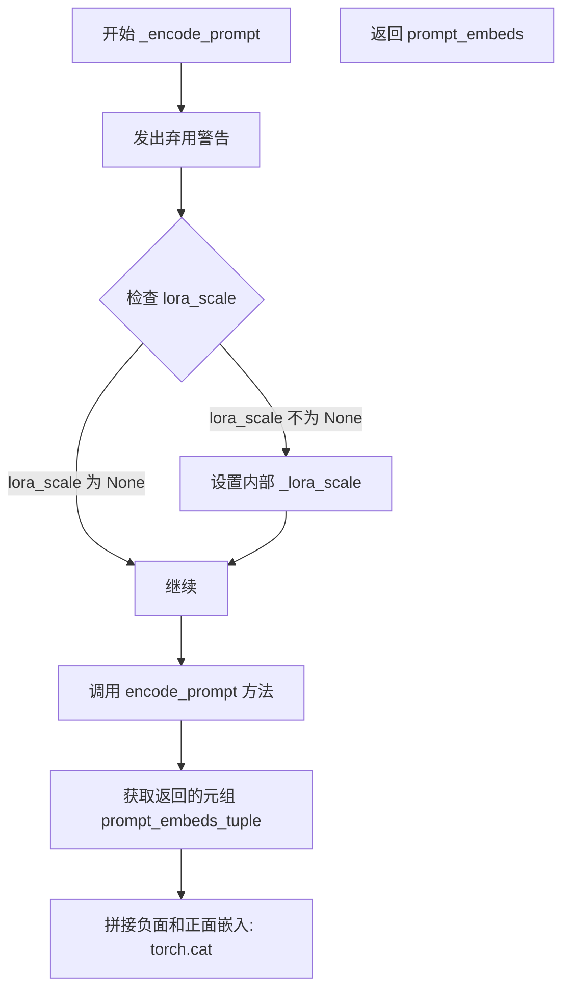
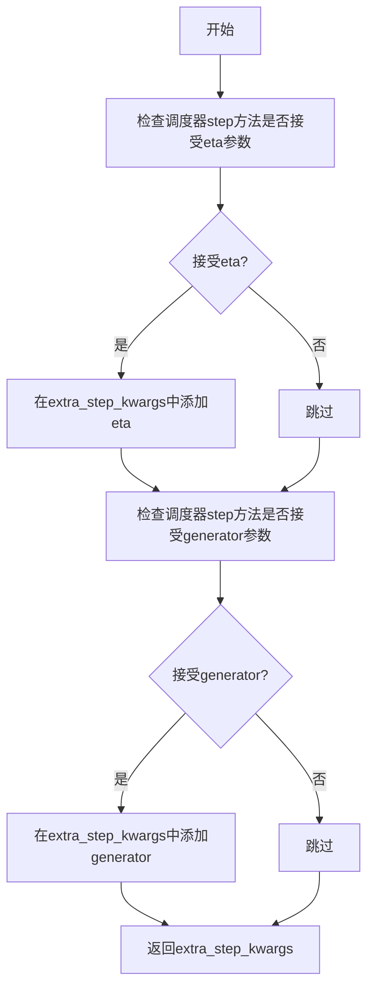
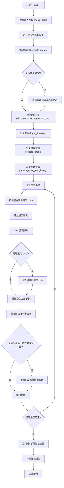

# `diffusers\src\diffusers\pipelines\text_to_video_synthesis\pipeline_text_to_video_synth_img2img.py` 详细设计文档

这是一个用于文本引导的视频到视频（Video-to-Video）生成的Diffusion Pipeline，继承自Stable Diffusion系列，通过对输入视频进行去噪处理来实现视频风格转换或内容修改，支持LoRA、Textual Inversion等加载功能。

## 整体流程



## 类结构

```
DiffusionPipeline (基类)
├── DeprecatedPipelineMixin
├── StableDiffusionMixin
├── TextualInversionLoaderMixin
├── StableDiffusionLoraLoaderMixin
└── VideoToVideoSDPipeline (本类)
```

## 全局变量及字段


### `XLA_AVAILABLE`
    
Boolean flag indicating whether PyTorch XLA is available for TPU acceleration

类型：`bool`
    


### `logger`
    
Logger instance for the module to track runtime information and warnings

类型：`logging.Logger`
    


### `EXAMPLE_DOC_STRING`
    
Documentation string containing usage examples for the pipeline

类型：`str`
    


### `VideoToVideoSDPipeline._last_supported_version`
    
String indicating the last supported version of the pipeline (0.33.1)

类型：`str`
    


### `VideoToVideoSDPipeline.model_cpu_offload_seq`
    
String defining the sequence for CPU offloading of models (text_encoder->unet->vae)

类型：`str`
    


### `VideoToVideoSDPipeline.vae`
    
Variational Auto-Encoder model for encoding and decoding videos to and from latent representations

类型：`AutoencoderKL`
    


### `VideoToVideoSDPipeline.text_encoder`
    
Frozen text-encoder model for converting text prompts into embeddings

类型：`CLIPTextModel`
    


### `VideoToVideoSDPipeline.tokenizer`
    
CLIP tokenizer for converting text into token IDs

类型：`CLIPTokenizer`
    


### `VideoToVideoSDPipeline.unet`
    
3D UNet model for denoising encoded video latents

类型：`UNet3DConditionModel`
    


### `VideoToVideoSDPipeline.scheduler`
    
Diffusion scheduler for controlling the denoising process

类型：`KarrasDiffusionSchedulers`
    


### `VideoToVideoSDPipeline.vae_scale_factor`
    
Scaling factor for the VAE, derived from the number of VAE block output channels

类型：`int`
    


### `VideoToVideoSDPipeline.video_processor`
    
Processor for handling video preprocessing and postprocessing operations

类型：`VideoProcessor`
    
    

## 全局函数及方法


### `retrieve_latents`

该函数用于从编码器输出中提取潜在表示（latents），支持多种采样模式（sample 或 argmax），并处理不同的编码器输出格式。

参数：

- `encoder_output`：`torch.Tensor`，编码器模型的输出结果，可能是 VAE 编码后的输出对象
- `generator`：`torch.Generator | None`，可选的随机数生成器，用于采样时的随机性控制
- `sample_mode`：`str`，采样模式，默认为 "sample"，可选值为 "sample"（随机采样）或 "argmax"（取概率最大的值）

返回值：`torch.Tensor`，从编码器输出中提取的潜在表示张量

#### 流程图



#### 带注释源码

```python
# Copied from diffusers.pipelines.stable_diffusion.pipeline_stable_diffusion_img2img.retrieve_latents
def retrieve_latents(
    encoder_output: torch.Tensor, generator: torch.Generator | None = None, sample_mode: str = "sample"
):
    """
    从编码器输出中提取潜在表示。
    
    支持三种提取方式：
    1. 当 encoder_output 包含 latent_dist 属性且 sample_mode 为 'sample' 时，从分布中采样
    2. 当 encoder_output 包含 latent_dist 属性且 sample_mode 为 'argmax' 时，取分布的众数
    3. 当 encoder_output 包含 latents 属性时，直接返回 latents 属性
    """
    # 检查编码器输出是否有 latent_dist 属性并且采样模式为 "sample"
    if hasattr(encoder_output, "latent_dist") and sample_mode == "sample":
        # 从潜在分布中采样，传入随机生成器以控制采样随机性
        return encoder_output.latent_dist.sample(generator)
    # 检查编码器输出是否有 latent_dist 属性并且采样模式为 "argmax"
    elif hasattr(encoder_output, "latent_dist") and sample_mode == "argmax":
        # 返回潜在分布的众数（概率最大的值）
        return encoder_output.latent_dist.mode()
    # 检查编码器输出是否有直接的 latents 属性
    elif hasattr(encoder_output, "latents"):
        # 直接返回预计算的 latents
        return encoder_output.latents
    else:
        # 如果无法从编码器输出中提取潜在值，抛出属性错误
        raise AttributeError("Could not access latents of provided encoder_output")
```


### `VideoToVideoSDPipeline.__init__`

这是 `VideoToVideoSDPipeline` 类的构造函数，用于初始化视频到视频扩散管道。它接受 VAE、文本编码器、分词器、UNet 和调度器等核心组件，并注册这些模块以及初始化视频处理器。

参数：

-  `vae`：`AutoencoderKL`，变分自编码器模型，用于对视频进行编码和解码到潜在表示
-  `text_encoder`：`CLIPTextModel`，冻结的文本编码器 (clip-vit-large-patch14)，用于将文本提示编码为嵌入向量
-  `tokenizer`：`CLIPTokenizer`，CLIP 分词器，用于将文本 token 化
-  `unet`：`UNet3DConditionModel`，3D 条件 UNet 模型，用于对编码后的视频潜在表示进行去噪
-  `scheduler`：`KarrasDiffusionSchedulers`，扩散调度器，用于在去噪过程中逐步减少噪声

返回值：`None`，构造函数无返回值

#### 流程图

```mermaid
flowchart TD
    A[开始 __init__] --> B[调用 super().__init__]
    B --> C[register_modules: 注册 vae, text_encoder, tokenizer, unet, scheduler]
    C --> D[计算 vae_scale_factor: 2^(len(vae.config.block_out_channels) - 1)]
    D --> E[创建 VideoProcessor: do_resize=False, vae_scale_factor=self.vae_scale_factor]
    E --> F[结束 __init__]
```

#### 带注释源码

```python
def __init__(
    self,
    vae: AutoencoderKL,                    # 变分自编码器，用于视频编解码
    text_encoder: CLIPTextModel,           # CLIP文本编码器
    tokenizer: CLIPTokenizer,              # CLIP分词器
    unet: UNet3DConditionModel,            # 3D条件UNet去噪模型
    scheduler: KarrasDiffusionSchedulers, # 扩散调度器
):
    # 调用父类 DiffusionPipeline 的初始化方法
    # 设置管道的基本属性和配置
    super().__init__()

    # 注册所有模块，使管道能够访问和管理这些组件
    self.register_modules(
        vae=vae,
        text_encoder=text_encoder,
        tokenizer=tokenizer,
        unet=unet,
        scheduler=scheduler,
    )
    
    # 计算 VAE 的缩放因子，基于块输出通道数
    # 用于调整潜在空间的缩放比例
    # 默认值为8，如果VAE不可用则使用8
    self.vae_scale_factor = 2 ** (len(self.vae.config.block_out_channels) - 1) if getattr(self, "vae", None) else 8
    
    # 创建视频处理器，用于视频的预处理和后处理
    # do_resize=False 表示不调整输入视频的大小
    # vae_scale_factor 用于VAE潜在空间的缩放
    self.video_processor = VideoProcessor(do_resize=False, vae_scale_factor=self.vae_scale_factor)
```


### `VideoToVideoSDPipeline._encode_prompt`

该方法用于将文本提示编码为文本嵌入向量，是 `encode_prompt` 方法的封装版本，主要用于保持向后兼容性。它会调用 `encode_prompt` 方法并将结果进行拼接处理。

参数：

- `prompt`：`str` 或 `list[str]`，待编码的提示词
- `device`：`torch.device`，torch 设备
- `num_images_per_prompt`：`int`，每个提示词生成的图像数量
- `do_classifier_free_guidance`：`bool`，是否使用无分类器自由引导
- `negative_prompt`：`str` 或 `list[str]` 或 `None`，负面提示词
- `prompt_embeds`：`torch.Tensor` 或 `None`，预生成的文本嵌入
- `negative_prompt_embeds`：`torch.Tensor` 或 `None`，预生成的负面文本嵌入
- `lora_scale`：`float` 或 `None`，LoRA 缩放因子
- `**kwargs`：其他关键字参数

返回值：`torch.Tensor`，拼接后的文本嵌入向量（包含负面和正面嵌入）

#### 流程图



#### 带注释源码

```python
def _encode_prompt(
    self,
    prompt,                         # 待编码的提示词 (str 或 list[str])
    device,                        # torch 设备对象
    num_images_per_prompt,         # 每个提示生成的图像数量 (int)
    do_classifier_free_guidance,   # 是否使用无分类器自由引导 (bool)
    negative_prompt=None,          # 负面提示词 (str 或 list[str] 或 None)
    prompt_embeds: torch.Tensor | None = None,   # 预生成的正向文本嵌入
    negative_prompt_embeds: torch.Tensor | None = None,  # 预生成的负向文本嵌入
    lora_scale: float | None = None,   # LoRA 缩放因子
    **kwargs,                      # 其他关键字参数
):
    # 发出弃用警告，提示用户使用 encode_prompt 方法
    deprecation_message = "`_encode_prompt()` is deprecated and it will be removed in a future version. Use `encode_prompt()` instead. Also, be aware that the output format changed from a concatenated tensor to a tuple."
    deprecate("_encode_prompt()", "1.0.0", deprecation_message, standard_warn=False)

    # 调用 encode_prompt 方法获取文本嵌入元组
    prompt_embeds_tuple = self.encode_prompt(
        prompt=prompt,
        device=device,
        num_images_per_prompt=num_images_per_prompt,
        do_classifier_free_guidance=do_classifier_free_guidance,
        negative_prompt=negative_prompt,
        prompt_embeds=prompt_embeds,
        negative_prompt_embeds=negative_prompt_embeds,
        lora_scale=lora_scale,
        **kwargs,
    )

    # 为了保持向后兼容性，将负面和正面嵌入拼接起来
    # 拼接顺序: [negative_prompt_embeds, prompt_embeds]
    prompt_embeds = torch.cat([prompt_embeds_tuple[1], prompt_embeds_tuple[0]])

    return prompt_embeds
```


### `VideoToVideoSDPipeline.encode_prompt`

该方法将文本提示编码为文本模型的隐藏状态，是视频到视频扩散管道的关键组成部分，用于生成指导视频生成的正向和负向文本嵌入。

参数：

- `prompt`：`str | list[str]`，可选，要编码的提示文本
- `device`：`torch.device`，PyTorch 设备
- `num_images_per_prompt`：`int`，每个提示生成的图像数量
- `do_classifier_free_guidance`：`bool`，是否使用无分类器引导
- `negative_prompt`：`str | list[str] | None`，可选，用于引导图像生成的反向提示
- `prompt_embeds`：`torch.Tensor | None`，可选，预生成的文本嵌入
- `negative_prompt_embeds`：`torch.Tensor | None`，可选，预生成的反向文本嵌入
- `lora_scale`：`float | None`，可选，要应用于文本编码器所有 LoRA 层的 LoRA 比例
- `clip_skip`：`int | None`，可选，计算提示嵌入时从 CLIP 跳过的层数

返回值：`tuple[torch.Tensor, torch.Tensor]`，返回包含正向提示嵌入和反向提示嵌入的元组

#### 流程图

```mermaid
flowchart TD
    A[开始 encode_prompt] --> B{检查 lora_scale}
    B -->|非 None| C[设置 LoRA 比例]
    B -->|None| D{检查 prompt 类型}
    C --> D
    D -->|str| E[batch_size = 1]
    D -->|list| F[batch_size = len&#40;prompt&#41;]
    D -->|其他| G[使用 prompt_embeds.shape[0]]
    E --> H{prompt_embeds is None?}
    F --> H
    G --> H
    H -->|是| I[处理文本反转]
    H -->|否| J[使用已有的 prompt_embeds]
    I --> K[调用 tokenizer]
    K --> L[检查 CLIP 是否使用 attention_mask]
    L -->|是| M[获取 attention_mask]
    L -->|否| N[attention_mask = None]
    M --> O{clip_skip is None?}
    N --> O
    O -->|是| P[调用 text_encoder 获取嵌入]
    O -->|否| Q[获取隐藏状态并跳过层]
    Q --> R[应用 final_layer_norm]
    P --> S[转换为正确的数据类型和设备]
    J --> S
    S --> T{需要 CFG?}
    T -->|是| U{prompt_embeds 为空?}
    T -->|否| V[返回结果]
    U -->|是| W[处理 uncond_tokens]
    W --> X[调用 tokenizer 处理 uncond]
    X --> Y[获取 negative_prompt_embeds]
    U -->|否| Z[使用提供的 negative_prompt_embeds]
    Y --> AA[重复 embeddings]
    Z --> AA
    AA --> AB[处理 LoRA 缩放]
    AB --> V
    V[返回 prompt_embeds, negative_prompt_embeds] --> AC[结束]
```

#### 带注释源码

```python
def encode_prompt(
    self,
    prompt,
    device,
    num_images_per_prompt,
    do_classifier_free_guidance,
    negative_prompt=None,
    prompt_embeds: torch.Tensor | None = None,
    negative_prompt_embeds: torch.Tensor | None = None,
    lora_scale: float | None = None,
    clip_skip: int | None = None,
):
    r"""
    Encodes the prompt into text encoder hidden states.

    Args:
        prompt (`str` or `list[str]`, *optional*):
            prompt to be encoded
        device: (`torch.device`):
            torch device
        num_images_per_prompt (`int`):
            number of images that should be generated per prompt
        do_classifier_free_guidance (`bool`):
            whether to use classifier free guidance or not
        negative_prompt (`str` or `list[str]`, *optional*):
            The prompt or prompts not to guide the image generation. If not defined, one has to pass
            `negative_prompt_embeds` instead. Ignored when not using guidance (i.e., ignored if `guidance_scale` is
            less than `1`).
        prompt_embeds (`torch.Tensor`, *optional*):
            Pre-generated text embeddings. Can be used to easily tweak text inputs, *e.g.* prompt weighting. If not
            provided, text embeddings will be generated from `prompt` input argument.
        negative_prompt_embeds (`torch.Tensor`, *optional*):
            Pre-generated negative text embeddings. Can be used to easily tweak text inputs, *e.g.* prompt
            weighting. If not provided, negative_prompt_embeds will be generated from `negative_prompt` input
            argument.
        lora_scale (`float`, *optional*):
            A LoRA scale that will be applied to all LoRA layers of the text encoder if LoRA layers are loaded.
        clip_skip (`int`, *optional*):
            Number of layers to be skipped from CLIP while computing the prompt embeddings. A value of 1 means that
            the output of the pre-final layer will be used for computing the prompt embeddings.
    """
    # 设置 LoRA 比例以便文本编码器的 LoRA 函数可以正确访问
    if lora_scale is not None and isinstance(self, StableDiffusionLoraLoaderMixin):
        self._lora_scale = lora_scale

        # 动态调整 LoRA 比例
        if not USE_PEFT_BACKEND:
            adjust_lora_scale_text_encoder(self.text_encoder, lora_scale)
        else:
            scale_lora_layers(self.text_encoder, lora_scale)

    # 确定批处理大小
    if prompt is not None and isinstance(prompt, str):
        batch_size = 1
    elif prompt is not None and isinstance(prompt, list):
        batch_size = len(prompt)
    else:
        batch_size = prompt_embeds.shape[0]

    # 如果没有提供 prompt_embeds，则从 prompt 生成
    if prompt_embeds is None:
        # 文本反转：如需要处理多向量标记
        if isinstance(self, TextualInversionLoaderMixin):
            prompt = self.maybe_convert_prompt(prompt, self.tokenizer)

        # 使用 tokenizer 将文本转换为标记
        text_inputs = self.tokenizer(
            prompt,
            padding="max_length",
            max_length=self.tokenizer.model_max_length,
            truncation=True,
            return_tensors="pt",
        )
        text_input_ids = text_inputs.input_ids
        # 获取未截断的标记用于检查
        untruncated_ids = self.tokenizer(prompt, padding="longest", return_tensors="pt").input_ids

        # 检查是否发生了截断
        if untruncated_ids.shape[-1] >= text_input_ids.shape[-1] and not torch.equal(
            text_input_ids, untruncated_ids
        ):
            removed_text = self.tokenizer.batch_decode(
                untruncated_ids[:, self.tokenizer.model_max_length - 1 : -1]
            )
            logger.warning(
                "The following part of your input was truncated because CLIP can only handle sequences up to"
                f" {self.tokenizer.model_max_length} tokens: {removed_text}"
            )

        # 处理 attention_mask
        if hasattr(self.text_encoder.config, "use_attention_mask") and self.text_encoder.config.use_attention_mask:
            attention_mask = text_inputs.attention_mask.to(device)
        else:
            attention_mask = None

        # 根据 clip_skip 参数决定如何获取嵌入
        if clip_skip is None:
            prompt_embeds = self.text_encoder(text_input_ids.to(device), attention_mask=attention_mask)
            prompt_embeds = prompt_embeds[0]
        else:
            # 获取所有隐藏状态
            prompt_embeds = self.text_encoder(
                text_input_ids.to(device), attention_mask=attention_mask, output_hidden_states=True
            )
            # 访问所需层的隐藏状态
            prompt_embeds = prompt_embeds[-1][-(clip_skip + 1)]
            # 应用最终的 LayerNorm
            prompt_embeds = self.text_encoder.text_model.final_layer_norm(prompt_embeds)

    # 确定正确的 dtype
    if self.text_encoder is not None:
        prompt_embeds_dtype = self.text_encoder.dtype
    elif self.unet is not None:
        prompt_embeds_dtype = self.unet.dtype
    else:
        prompt_embeds_dtype = prompt_embeds.dtype

    # 转换为正确的 dtype 和设备
    prompt_embeds = prompt_embeds.to(dtype=prompt_embeds_dtype, device=device)

    # 为每个提示复制文本嵌入
    bs_embed, seq_len, _ = prompt_embeds.shape
    prompt_embeds = prompt_embeds.repeat(1, num_images_per_prompt, 1)
    prompt_embeds = prompt_embeds.view(bs_embed * num_images_per_prompt, seq_len, -1)

    # 为无分类器引导获取无条件嵌入
    if do_classifier_free_guidance and negative_prompt_embeds is None:
        uncond_tokens: list[str]
        if negative_prompt is None:
            uncond_tokens = [""] * batch_size
        elif prompt is not None and type(prompt) is not type(negative_prompt):
            raise TypeError(
                f"`negative_prompt` should be the same type to `prompt`, but got {type(negative_prompt)} !="
                f" {type(prompt)}."
            )
        elif isinstance(negative_prompt, str):
            uncond_tokens = [negative_prompt]
        elif batch_size != len(negative_prompt):
            raise ValueError(
                f"`negative_prompt`: {negative_prompt} has batch size {len(negative_prompt)}, but `prompt`:"
                f" {prompt} has batch size {batch_size}. Please make sure that passed `negative_prompt` matches"
                " the batch size of `prompt`."
            )
        else:
            uncond_tokens = negative_prompt

        # 文本反转：如需要处理多向量标记
        if isinstance(self, TextualInversionLoaderMixin):
            uncond_tokens = self.maybe_convert_prompt(uncond_tokens, self.tokenizer)

        max_length = prompt_embeds.shape[1]
        uncond_input = self.tokenizer(
            uncond_tokens,
            padding="max_length",
            max_length=max_length,
            truncation=True,
            return_tensors="pt",
        )

        # 处理 attention_mask
        if hasattr(self.text_encoder.config, "use_attention_mask") and self.text_encoder.config.use_attention_mask:
            attention_mask = uncond_input.attention_mask.to(device)
        else:
            attention_mask = None

        # 获取负向提示嵌入
        negative_prompt_embeds = self.text_encoder(
            uncond_input.input_ids.to(device),
            attention_mask=attention_mask,
        )
        negative_prompt_embeds = negative_prompt_embeds[0]

    # 为无分类器引导复制无条件嵌入
    if do_classifier_free_guidance:
        seq_len = negative_prompt_embeds.shape[1]

        negative_prompt_embeds = negative_prompt_embeds.to(dtype=prompt_embeds_dtype, device=device)

        negative_prompt_embeds = negative_prompt_embeds.repeat(1, num_images_per_prompt, 1)
        negative_prompt_embeds = negative_prompt_embeds.view(batch_size * num_images_per_prompt, seq_len, -1)

    # 如果使用 PEFT 后端，恢复 LoRA 层的原始比例
    if self.text_encoder is not None:
        if isinstance(self, StableDiffusionLoraLoaderMixin) and USE_PEFT_BACKEND:
            unscale_lora_layers(self.text_encoder, lora_scale)

    return prompt_embeds, negative_prompt_embeds
```


### `VideoToVideoSDPipeline.decode_latents`

该方法用于将潜在表示（latents）解码为视频张量。它首先对输入的latents进行缩放以恢复到原始尺度，然后重塑latents的维度以适配VAE解码器，接着通过VAE解码器将latents转换为图像，最后将图像重塑为视频格式并转换为float32类型返回。

参数：

- `latents`：`torch.Tensor`，输入的潜在表示，形状为 (batch_size, channels, num_frames, height, width)，需要通过VAE解码器解码为视频

返回值：`torch.Tensor`，解码后的视频张量，形状为 (batch_size, channels, num_frames, height, width)

#### 流程图

```mermaid
flowchart TD
    A[开始 decode_latents] --> B[对 latents 进行缩放: latents = 1/scaling_factor * latents]
    B --> C[获取 latents 形状: batch_size, channels, num_frames, height, width]
    C --> D[重塑 latents: 从 (b, c, f, h, w) 转换为 (b*f, c, h, w)]
    D --> E[通过 VAE 解码: self.vae.decode(latents).sample]
    E --> F[重塑为视频格式: image -> video]
    F --> G[转换为 float32 类型]
    G --> H[返回 video 张量]
```

#### 带注释源码

```python
def decode_latents(self, latents):
    # 1. 对 latents 进行反缩放操作，将其从潜在空间缩放到原始尺度
    #    这是因为在编码时，latents 会被 scaling_factor 缩放
    latents = 1 / self.vae.config.scaling_factor * latents

    # 2. 获取输入 latents 的形状维度信息
    #    batch_size: 批次大小
    #    channels: 通道数（通常为4，对应潜在表示的维度）
    #    num_frames: 视频帧数
    #    height: 潜在表示的高度
    #    width: 潜在表示的宽度
    batch_size, channels, num_frames, height, width = latents.shape

    # 3. 对 latents 进行维度重排和 reshape
    #    原形状: (batch_size, channels, num_frames, height, width)
    #    permute(0, 2, 1, 3, 4): (batch_size, num_frames, channels, height, width)
    #    reshape: (batch_size * num_frames, channels, height, width)
    #    这样可以将多个帧平铺在一起，方便批量送入 VAE 解码器
    latents = latents.permute(0, 2, 1, 3, 4).reshape(batch_size * num_frames, channels, height, width)

    # 4. 使用 VAE 解码器将潜在表示解码为图像
    #    VAE.decode() 返回一个 DiagonalGaussianDistribution，
    #    通过 .sample() 方法采样得到图像
    image = self.vae.decode(latents).sample

    # 5. 将解码后的图像重塑为视频格式
    #    image 形状: (batch_size * num_frames, channels, height, width)
    #    image[None, :] 添加一个维度: (1, batch_size*num_frames, channels, height, width)
    #    reshape 到 (batch_size, num_frames, -1, height, width)
    #    最后 permute(0, 2, 1, 3, 4) 转换为 (batch_size, channels, num_frames, height, width)
    video = image[None, :].reshape((batch_size, num_frames, -1) + image.shape[2:]).permute(0, 2, 1, 3, 4)

    # 6. 将视频张量转换为 float32 类型
    #    这是因为 float32 不会引起显著的性能开销，同时与 bfloat16 兼容
    video = video.float()

    # 7. 返回解码后的视频张量
    return video
```


### `VideoToVideoSDPipeline.prepare_extra_step_kwargs`

该方法用于为调度器的 `step` 方法准备额外的关键字参数。由于不同的调度器（如 DDIMScheduler、PNDMScheduler 等）具有不同的签名，该方法通过检查调度器的 `step` 方法参数来动态确定需要传递哪些额外参数。

参数：

- `self`：隐式参数，`VideoToVideoSDPipeline` 实例本身
- `generator`：`torch.Generator | list[torch.Generator] | None`，用于生成确定性随机数的 PyTorch 生成器
- `eta`：`float`，DDIM 调度器的噪声因子 (η)，对应 DDIM 论文中的参数，取值范围应为 [0, 1]

返回值：`dict`，包含调度器 `step` 方法所需的可选参数（如 `eta` 和/或 `generator`）

#### 流程图



#### 带注释源码

```python
def prepare_extra_step_kwargs(self, generator, eta):
    # 准备调度器步骤的额外参数，因为并非所有调度器都具有相同的签名
    # eta (η) 仅在 DDIMScheduler 中使用，在其他调度器中会被忽略
    # eta 对应 DDIM 论文 (https://huggingface.co/papers/2010.02502) 中的 η
    # 取值应在 [0, 1] 范围内

    # 通过检查调度器 step 方法的签名参数来判断是否接受 eta
    accepts_eta = "eta" in set(inspect.signature(self.scheduler.step).parameters.keys())
    # 初始化额外的参数字典
    extra_step_kwargs = {}
    # 如果调度器接受 eta 参数，则将其添加到 extra_step_kwargs
    if accepts_eta:
        extra_step_kwargs["eta"] = eta

    # 检查调度器是否接受 generator 参数
    accepts_generator = "generator" in set(inspect.signature(self.scheduler.step).parameters.keys())
    # 如果调度器接受 generator，则将其添加到 extra_step_kwargs
    if accepts_generator:
        extra_step_kwargs["generator"] = generator
    
    # 返回包含调度器所需额外参数的字典
    return extra_step_kwargs
```


### `VideoToVideoSDPipeline.check_inputs`

该方法用于验证视频到视频生成管道的输入参数是否合法，确保 `prompt` 与 `prompt_embeds` 不能同时提供，`negative_prompt` 与 `negative_prompt_embeds` 不能同时提供，且 `prompt_embeds` 与 `negative_prompt_embeds` 的形状必须一致，同时校验 `strength` 和 `callback_steps` 的取值范围，以及 `callback_on_step_end_tensor_inputs` 是否在允许的回调张量输入列表中。

参数：

- `self`：`VideoToVideoSDPipeline` 实例，管道对象本身
- `prompt`：`str | list[str] | None`，用于引导视频生成的文本提示，如果未定义则需提供 `prompt_embeds`
- `strength`：`float`，表示对参考视频的变换程度，值必须在 [0.0, 1.0] 范围内
- `callback_steps`：`int | None`，执行回调函数的频率，必须为正整数
- `negative_prompt`：`str | list[str] | None`，用于引导不希望出现在视频中的内容，如果未定义则需提供 `negative_prompt_embeds`
- `prompt_embeds`：`torch.Tensor | None`，预生成的文本嵌入，用于方便地调整文本输入
- `negative_prompt_embeds`：`torch.Tensor | None`，预生成的负面文本嵌入
- `callback_on_step_end_tensor_inputs`：`list[str] | None`，在步骤结束时需要回调的张量输入列表

返回值：`None`，该方法仅进行参数校验，不返回任何值，若校验失败则抛出 `ValueError`

#### 流程图

```mermaid
flowchart TD
    A[开始 check_inputs] --> B{strength 是否在 [0, 1] 范围}
    B -->|否| C[抛出 ValueError: strength 值无效]
    B -->|是| D{callback_steps 是否为正整数}
    D -->|否| E[抛出 ValueError: callback_steps 无效]
    D -->|是| F{callback_on_step_end_tensor_inputs 是否合法}
    F -->|否| G[抛出 ValueError: 无效的回调张量输入]
    F -->|是| H{prompt 和 prompt_embeds 是否同时存在}
    H -->|是| I[抛出 ValueError: 不能同时提供]
    H -->|否| J{prompt 和 prompt_embeds 是否都未提供}
    J -->|是| K[抛出 ValueError: 至少提供一个]
    J -->|否| L{prompt 是否为 str 或 list}
    L -->|否| M[抛出 ValueError: prompt 类型错误]
    L -->|是| N{negative_prompt 和 negative_prompt_embeds 是否同时存在}
    N -->|是| O[抛出 ValueError: 不能同时提供]
    N -->|否| P{prompt_embeds 和 negative_prompt_embeds 是否都提供}
    P -->|是| Q{两者形状是否相同}
    Q -->|否| R[抛出 ValueError: 形状不匹配]
    Q -->|是| S[校验通过]
    P -->|否| S
    I --> S
    C --> S
    E --> S
    G --> S
    K --> S
    M --> S
    O --> S
```

#### 带注释源码

```python
def check_inputs(
    self,
    prompt,
    strength,
    callback_steps,
    negative_prompt=None,
    prompt_embeds=None,
    negative_prompt_embeds=None,
    callback_on_step_end_tensor_inputs=None,
):
    # 校验 strength 参数必须在 [0.0, 1.0] 范围内
    if strength < 0 or strength > 1:
        raise ValueError(f"The value of strength should in [0.0, 1.0] but is {strength}")

    # 校验 callback_steps 必须为正整数
    if callback_steps is not None and (not isinstance(callback_steps, int) or callback_steps <= 0):
        raise ValueError(
            f"`callback_steps` has to be a positive integer but is {callback_steps} of type"
            f" {type(callback_steps)}."
        )

    # 校验 callback_on_step_end_tensor_inputs 中的每个元素都必须在允许的回调张量输入列表中
    if callback_on_step_end_tensor_inputs is not None and not all(
        k in self._callback_tensor_inputs for k in callback_on_step_end_tensor_inputs
    ):
        raise ValueError(
            f"`callback_on_step_end_tensor_inputs` has to be in {self._callback_tensor_inputs}, but found {[k for k in callback_on_step_end_tensor_inputs if k not in self._callback_tensor_inputs]}"
        )
    
    # 校验 prompt 和 prompt_embeds 不能同时提供
    if prompt is not None and prompt_embeds is not None:
        raise ValueError(
            f"Cannot forward both `prompt`: {prompt} and `prompt_embeds`: {prompt_embeds}. Please make sure to"
            " only forward one of the two."
        )
    # 校验 prompt 和 prompt_embeds 至少提供一个
    elif prompt is None and prompt_embeds is None:
        raise ValueError(
            "Provide either `prompt` or `prompt_embeds`. Cannot leave both `prompt` and `prompt_embeds` undefined."
        )
    # 校验 prompt 的类型必须是 str 或 list
    elif prompt is not None and (not isinstance(prompt, str) and not isinstance(prompt, list)):
        raise ValueError(f"`prompt` has to be of type `str` or `list` but is {type(prompt)}")

    # 校验 negative_prompt 和 negative_prompt_embeds 不能同时提供
    if negative_prompt is not None and negative_prompt_embeds is not None:
        raise ValueError(
            f"Cannot forward both `negative_prompt`: {negative_prompt} and `negative_prompt_embeds`:"
            f" {negative_prompt_embeds}. Please make sure to only forward one of the two."
        )

    # 校验 prompt_embeds 和 negative_prompt_embeds 的形状必须一致（当两者都提供时）
    if prompt_embeds is not None and negative_prompt_embeds is not None:
        if prompt_embeds.shape != negative_prompt_embeds.shape:
            raise ValueError(
                "`prompt_embeds` and `negative_prompt_embeds` must have the same shape when passed directly, but"
                f" got: `prompt_embeds` {prompt_embeds.shape} != `negative_prompt_embeds`"
                f" {negative_prompt_embeds.shape}."
            )
```


### `VideoToVideoSDPipeline.get_timesteps`

该方法用于根据推理步数和强度（strength）参数计算视频到视频转换过程中的时间步（timesteps），以控制去噪过程的起始点和步数，从而实现对原始视频的噪声添加程度控制。

参数：

- `num_inference_steps`：`int`，推理步数，即去噪过程的总迭代次数
- `strength`：`float`，强度参数，范围在 0 到 1 之间，用于控制对原始视频的改变程度，值越大表示添加的噪声越多
- `device`：`torch.device`，计算设备（如 CPU 或 CUDA 设备）

返回值：`tuple[torch.Tensor, int]`，返回两个元素：第一个是 `torch.Tensor` 类型的时间步序列，第二个是 `int` 类型的剩余推理步数

#### 流程图

```mermaid
flowchart TD
    A[开始 get_timesteps] --> B[计算 init_timestep = min(num_inference_steps * strength, num_inference_steps)]
    B --> C[计算 t_start = max(num_inference_steps - init_timestep, 0)]
    C --> D[从 scheduler.timesteps 中切片获取时间步: timesteps[t_start * order:]
    D --> E{检查 scheduler 是否有 set_begin_index 方法}
    E -->|是| F[调用 scheduler.set_begin_index(t_start * order)]
    E -->|否| G[跳过设置起始索引]
    F --> H[返回 timesteps 和 num_inference_steps - t_start]
    G --> H
```

#### 带注释源码

```python
def get_timesteps(self, num_inference_steps, strength, device):
    """
    根据推理步数和强度计算时间步。
    
    该方法用于视频到视频转换管线中，根据用户指定的推理步数和强度（strength）参数，
    计算出用于去噪过程的时间步序列。strength 参数控制原始视频被噪声化的程度，
    从而决定去噪过程从哪个时间点开始。
    
    参数:
        num_inference_steps: int, 推理步数，表示去噪过程的总迭代次数
        strength: float, 强度参数，取值范围 [0, 1]，值越大原始视频被噪声化程度越高
        device: torch.device, 计算设备
    
    返回:
        tuple: (timesteps, num_inference_steps - t_start)
            - timesteps: torch.Tensor, 时间步序列
            - num_inference_steps - t_start: int, 实际用于去噪的步数
    """
    # 根据 strength 计算初始时间步数，限制在 [0, num_inference_steps] 范围内
    init_timestep = min(int(num_inference_steps * strength), num_inference_steps)

    # 计算起始索引，确保不为负数
    t_start = max(num_inference_steps - init_timestep, 0)
    
    # 从调度器中获取时间步序列，乘以 order 是因为调度器可能使用多步方法
    timesteps = self.scheduler.timesteps[t_start * self.scheduler.order :]
    
    # 如果调度器支持设置起始索引，则进行设置以优化计算
    if hasattr(self.scheduler, "set_begin_index"):
        self.scheduler.set_begin_index(t_start * self.scheduler.order)

    # 返回时间步序列和实际去噪步数
    return timesteps, num_inference_steps - t_start
```


### `VideoToVideoSDPipeline.prepare_latents`

该方法负责将输入视频帧编码为潜在表示（latents），并添加噪声以用于视频到视频的扩散过程。它处理视频张量的形状变换、VAE 编码、批次大小验证以及噪声添加等关键步骤。

参数：

- `video`：`torch.Tensor`，输入视频张量，形状为 (batch_size, channels, frames, height, width)
- `timestep`：`torch.Tensor`，当前扩散时间步，用于添加噪声
- `batch_size`：`int`，批处理大小
- `dtype`：`torch.dtype`，目标数据类型（如 torch.float16）
- `device`：`torch.device`，目标设备（如 cuda 或 cpu）
- `generator`：`torch.Generator | list[torch.Generator] | None`，可选的随机数生成器，用于确保可重复性

返回值：`torch.Tensor`，处理后的潜在表示，形状为 (batch_size, channels, frames, height, width)

#### 流程图

```mermaid
flowchart TD
    A[开始: prepare_latents] --> B[将视频移动到指定设备和数据类型]
    B --> C[变换视频形状: 从 b,c,f,h,w 变为 b*f,c,w,h]
    C --> D{视频通道数 == 4?}
    D -->|是| E[直接作为初始潜在变量]
    D -->|否| F{generator 是列表且长度 != batch_size?}
    F -->|是| G[抛出 ValueError: 生成器列表长度不匹配]
    F -->|否| H{generator 是列表?}
    H -->|是| I[对每个生成器分别编码视频并拼接]
    H -->|否| J[使用单个生成器编码视频]
    I --> K[应用 VAE 缩放因子]
    J --> K
    E --> L{batch_size > init_latents.shape[0] 且不能整除?}
    K --> L
    L -->|是| M[抛出 ValueError: 无法复制视频到指定批次]
    L -->|否| N[拼接初始潜在变量]
    N --> O[生成随机噪声]
    O --> P[使用 scheduler.add_noise 添加噪声]
    P --> Q[重塑潜在变量形状为标准格式]
    Q --> R[返回最终 latents]
```

#### 带注释源码

```python
def prepare_latents(self, video, timestep, batch_size, dtype, device, generator=None):
    """
    准备视频的潜在表示，用于视频到视频的扩散过程。
    
    Args:
        video: 输入视频张量，形状 (batch_size, channels, frames, height, width)
        timestep: 当前扩散时间步
        batch_size: 批处理大小
        dtype: 目标数据类型
        device: 目标设备
        generator: 可选的随机生成器
    """
    # Step 1: 将视频张量移动到目标设备和数据类型
    video = video.to(device=device, dtype=dtype)

    # Step 2: 变换视频形状
    # 从 (b, c, f, h, w) -> (b * f, c, w, h)
    # 这是为了方便 VAE 编码，因为 VAE 通常处理单帧图像
    bsz, channel, frames, width, height = video.shape
    video = video.permute(0, 2, 1, 3, 4).reshape(bsz * frames, channel, width, height)

    # Step 3: 检查是否已经是潜在空间（4通道）
    if video.shape[1] == 4:
        # 如果视频已经是 4 通道潜在表示，直接使用
        init_latents = video
    else:
        # Step 4: 使用 VAE 编码视频到潜在空间
        if isinstance(generator, list) and len(generator) != batch_size:
            raise ValueError(
                f"You have passed a list of generators of length {len(generator)}, but requested an effective batch"
                f" size of {batch_size}. Make sure the batch size matches the length of the generators."
            )
        elif isinstance(generator, list):
            # 如果有多个生成器，分别对每个样本进行编码
            init_latents = [
                retrieve_latents(self.vae.encode(video[i : i + 1]), generator=generator[i])
                for i in range(batch_size)
            ]
            init_latents = torch.cat(init_latents, dim=0)
        else:
            # 单个生成器，直接编码整个视频
            init_latents = retrieve_latents(self.vae.encode(video), generator=generator)

        # Step 5: 应用 VAE 缩放因子
        init_latents = self.vae.config.scaling_factor * init_latents

    # Step 6: 处理批次大小不匹配的情况
    if batch_size > init_latents.shape[0] and batch_size % init_latents.shape[0] != 0:
        raise ValueError(
            f"Cannot duplicate `video` of batch size {init_latents.shape[0]} to {batch_size} text prompts."
        )
    else:
        init_latents = torch.cat([init_latents], dim=0)

    # Step 7: 生成随机噪声
    shape = init_latents.shape
    noise = randn_tensor(shape, generator=generator, device=device, dtype=dtype)

    # Step 8: 在初始潜在变量上添加噪声
    # 这是扩散模型的关键步骤，将噪声添加到潜在表示
    init_latents = self.scheduler.add_noise(init_latents, noise, timestep)
    latents = init_latents

    # Step 9: 重塑潜在变量回到标准格式
    # 从 (b*f, c, w, h) -> (b, c, f, w, h) -> (b, c, f, h, w)
    latents = latents[None, :].reshape((bsz, frames, latents.shape[1]) + latents.shape[2:]).permute(0, 2, 1, 3, 4)

    return latents
```


### VideoToVideoSDPipeline.__call__

该方法是 `VideoToVideoSDPipeline` 类的核心调用函数，用于执行视频到视频的生成任务。它接收一个初始视频和文本提示，通过扩散模型对视频进行去噪处理，生成与文本提示相关的新视频。支持分类器自由引导（CFG）、LoRA 权重、文本反转嵌入等多种功能，并允许用户自定义去噪步数、引导强度、输出格式等参数。

参数：

- `prompt`：`str | list[str] | None`，用于指导视频生成的文本提示。可以是单个字符串或字符串列表。如果未提供，则需要直接传递 `prompt_embeds`。
- `video`：`list[np.ndarray] | torch.Tensor`，用作生成起点的视频帧或张量。也可以直接传入视频的潜在表示，如果传入潜在变量则不会再次编码。
- `strength`：`float`，默认值 0.6，表示对原始视频的变换程度。取值范围 [0, 1]，值越大添加的噪声越多，生成的视频与原视频差异越大。
- `num_inference_steps`：`int`，默认值 50，去噪过程的迭代次数。步数越多通常质量越高，但推理速度越慢。
- `guidance_scale`：`float`，默认值 15.0，引导比例，控制文本提示对生成结果的影响程度。值越大越忠实于提示，但可能降低质量。值小于等于 1 时禁用分类器自由引导。
- `negative_prompt`：`str | list[str] | None`，用于指导生成过程中刻意避免的内容的提示。仅在启用引导时生效。
- `eta`：`float`，默认值 0.0，DDIM 调度器的 eta 参数，仅对 DDIMScheduler 有效，其他调度器忽略此参数。
- `generator`：`torch.Generator | list[torch.Generator] | None`，随机数生成器，用于控制生成过程的确定性。
- `latents`：`torch.Tensor | None`，预先生成的噪声潜在变量，可用于复现或调整相同的生成结果。形状为 `(batch_size, num_channel, num_frames, height, width)`。
- `prompt_embeds`：`torch.Tensor | None`，预生成的文本嵌入，可用于提示加权等高级技巧。
- `negative_prompt_embeds`：`torch.Tensor | None`，预生成的负面文本嵌入。
- `output_type`：`str | None`，默认值 "np"，输出视频的格式，可选 "np"（numpy 数组）或 "pt"（PyTorch 张量）。
- `return_dict`：`bool`，默认值 True，是否返回 `TextToVideoSDPipelineOutput` 对象而非元组。
- `callback`：`Callable[[int, int, torch.Tensor], None] | None`，每一步推理后调用的回调函数，参数为 (step, timestep, latents)。
- `callback_steps`：`int`，默认值 1，调用回调函数的频率。
- `cross_attention_kwargs`：`dict[str, Any] | None`，传递给注意力处理器的额外关键字参数。
- `clip_skip`：`int | None`，CLIP 模型跳过的层数，用于调整文本嵌入的质量。

返回值：`TextToVideoSDPipelineOutput | tuple`，当 `return_dict` 为 True 时返回 `TextToVideoSDPipelineOutput` 对象，包含生成的视频帧；否则返回元组，第一个元素为帧列表。

#### 流程图



#### 带注释源码

```python
@torch.no_grad()
@replace_example_docstring(EXAMPLE_DOC_STRING)
def __call__(
    self,
    prompt: str | list[str] = None,
    video: list[np.ndarray] | torch.Tensor = None,
    strength: float = 0.6,
    num_inference_steps: int = 50,
    guidance_scale: float = 15.0,
    negative_prompt: str | list[str] | None = None,
    eta: float = 0.0,
    generator: torch.Generator | list[torch.Generator] | None = None,
    latents: torch.Tensor | None = None,
    prompt_embeds: torch.Tensor | None = None,
    negative_prompt_embeds: torch.Tensor | None = None,
    output_type: str | None = "np",
    return_dict: bool = True,
    callback: Callable[[int, int, torch.Tensor], None] | None = None,
    callback_steps: int = 1,
    cross_attention_kwargs: dict[str, Any] | None = None,
    clip_skip: int | None = None,
):
    # 0. 默认设置，每个提示生成的图像数量为 1
    num_images_per_prompt = 1

    # 1. 检查输入参数的合法性
    self.check_inputs(prompt, strength, callback_steps, negative_prompt, prompt_embeds, negative_prompt_embeds)

    # 2. 根据提示或嵌入确定批次大小
    if prompt is not None and isinstance(prompt, str):
        batch_size = 1
    elif prompt is not None and isinstance(prompt, list):
        batch_size = len(prompt)
    else:
        batch_size = prompt_embeds.shape[0]

    # 获取执行设备
    device = self._execution_device
    
    # 判断是否启用分类器自由引导 (CFG)
    # guidance_scale > 1.0 时启用，类似 Imagen 论文中的引导权重 w
    do_classifier_free_guidance = guidance_scale > 1.0

    # 3. 编码输入提示词
    # 获取 LoRA 缩放因子
    text_encoder_lora_scale = (
        cross_attention_kwargs.get("scale", None) if cross_attention_kwargs is not None else None
    )
    # 调用 encode_prompt 生成文本嵌入
    prompt_embeds, negative_prompt_embeds = self.encode_prompt(
        prompt,
        device,
        num_images_per_prompt,
        do_classifier_free_guidance,
        negative_prompt,
        prompt_embeds=prompt_embeds,
        negative_prompt_embeds=negative_prompt_embeds,
        lora_scale=text_encoder_lora_scale,
        clip_skip=clip_skip,
    )
    
    # 如果启用 CFG，将无条件嵌入和文本嵌入拼接以避免两次前向传播
    if do_classifier_free_guidance:
        prompt_embeds = torch.cat([negative_prompt_embeds, prompt_embeds])

    # 4. 预处理视频，将输入视频转换为张量
    video = self.video_processor.preprocess_video(video)

    # 5. 准备时间步
    self.scheduler.set_timesteps(num_inference_steps, device=device)
    timesteps, num_inference_steps = self.get_timesteps(num_inference_steps, strength, device)
    # 重复初始时间步以匹配批次大小
    latent_timestep = timesteps[:1].repeat(batch_size * num_images_per_prompt)

    # 6. 准备潜在变量
    latents = self.prepare_latents(video, latent_timestep, batch_size, prompt_embeds.dtype, device, generator)

    # 7. 准备调度器的额外参数
    extra_step_kwargs = self.prepare_extra_step_kwargs(generator, eta)

    # 8. 去噪循环
    # 计算预热步数
    num_warmup_steps = len(timesteps) - num_inference_steps * self.scheduler.order
    with self.progress_bar(total=num_inference_steps) as progress_bar:
        for i, t in enumerate(timesteps):
            # 如果启用 CFG，扩展潜在变量
            latent_model_input = torch.cat([latents] * 2) if do_classifier_free_guidance else latents
            # 缩放输入以适应当前时间步
            latent_model_input = self.scheduler.scale_model_input(latent_model_input, t)

            # 使用 UNet 预测噪声残差
            noise_pred = self.unet(
                latent_model_input,
                t,
                encoder_hidden_states=prompt_embeds,
                cross_attention_kwargs=cross_attention_kwargs,
                return_dict=False,
            )[0]

            # 执行分类器自由引导
            if do_classifier_free_guidance:
                noise_pred_uncond, noise_pred_text = noise_pred.chunk(2)
                noise_pred = noise_pred_uncond + guidance_scale * (noise_pred_text - noise_pred_uncond)

            # 重塑潜在变量以适配调度器
            bsz, channel, frames, width, height = latents.shape
            latents = latents.permute(0, 2, 1, 3, 4).reshape(bsz * frames, channel, width, height)
            noise_pred = noise_pred.permute(0, 2, 1, 3, 4).reshape(bsz * frames, channel, width, height)

            # 计算上一步的去噪结果 x_t -> x_t-1
            latents = self.scheduler.step(noise_pred, t, latents, **extra_step_kwargs).prev_sample

            # 将潜在变量重塑回原始形状 (b, c, f, h, w)
            latents = latents[None, :].reshape(bsz, frames, channel, width, height).permute(0, 2, 1, 3, 4)

            # 调用回调函数（如果提供）
            if i == len(timesteps) - 1 or ((i + 1) > num_warmup_steps and (i + 1) % self.scheduler.order == 0):
                progress_bar.update()
                if callback is not None and i % callback_steps == 0:
                    step_idx = i // getattr(self.scheduler, "order", 1)
                    callback(step_idx, t, latents)

            # 如果使用 PyTorch XLA，进行标记步骤
            if XLA_AVAILABLE:
                xm.mark_step()

    # 9. 手动释放内存以节省显存
    if hasattr(self, "final_offload_hook") and self.final_offload_hook is not None:
        self.unet.to("cpu")

    # 10. 后处理
    if output_type == "latent":
        video = latents
    else:
        # 解码潜在变量为视频
        video_tensor = self.decode_latents(latents)
        # 后处理视频，转换为指定输出格式
        video = self.video_processor.postprocess_video(video=video_tensor, output_type=output_type)

    # 11. 卸载所有模型
    self.maybe_free_model_hooks()

    # 返回结果
    if not return_dict:
        return (video,)

    return TextToVideoSDPipelineOutput(frames=video)
```

## 关键组件


### VideoToVideoSDPipeline

主扩散管道类，继承自 DeprecatedPipelineMixin、DiffusionPipeline、StableDiffusionMixin、TextualInversionLoaderMixin 和 StableDiffusionLoraLoaderMixin，用于实现基于文本引导的视频到视频（Video-to-Video）生成任务。

### 张量索引与形状变换

在 decode_latents 和 prepare_latents 方法中实现了复杂的张量形状变换，将视频从 (b, c, f, h, w) 格式转换为 (b*f, c, h, w) 以便 VAE 处理，再转换回 (b, c, f, h, w) 格式。

### 反量化支持

decode_latents 方法通过 1/self.vae.config.scaling_factor 对潜在变量进行反量化，并将解码结果从 bfloat16/float16 转换为 float32 以保证兼容性。

### 量化策略

在 encode_prompt 和 __call__ 方法中实现了 dtype 处理逻辑，根据 text_encoder 或 unet 的 dtype 动态确定 prompt_embeds 的类型，支持 float16、bfloat16 等混合精度推理。

### retrieve_latents 函数

辅助函数，用于从 VAE 编码器输出中提取潜在变量，支持 latent_dist.sample()、latent_dist.mode() 和直接访问 latents 三种模式。

### 分类器自由引导（CFG）

在 __call__ 方法的 denoising loop 中实现，通过 torch.cat([negative_prompt_embeds, prompt_embeds]) 拼接无条件和文本 embeddings，并使用 guidance_scale 加权计算最终噪声预测。

### LoRA 支持

通过 StableDiffusionLoraLoaderMixin 和 TextualInversionLoaderMixin 集成，支持在 encode_prompt 中动态调整 LoRA scale，并支持文本反转（textual inversion）嵌入。

### 潜在变量准备

prepare_latents 方法处理输入视频的编码或直接使用预编码的潜在变量，并根据 strength 参数添加噪声，支持批量生成器和确定性生成。

### 视频预处理与后处理

使用 VideoProcessor 对输入视频进行预处理（preprocess_video）和后处理（postprocess_video），支持 np.ndarray 和 torch.Tensor 格式。

### 模型卸载与内存优化

支持模型 CPU 卸载（model_cpu_offload_seq = "text_encoder->unet->vae"）、VAE slicing、最终 offload hook 以及 XLA 设备优化（xm.mark_step()）。

### 调度器集成

通过 get_timesteps 和 prepare_extra_step_kwargs 方法与 KarrasDiffusionSchedulers 调度器集成，支持自定义推理步骤数和 eta 参数。


## 问题及建议


### 已知问题

- **版本号过时**: `_last_supported_version = "0.33.1"` 标注为 0.33.1，但代码版权声明是 2025 年，可能需要更新版本号以匹配最新的 API 变更
- **继承关系混乱**: 类名是 `VideoToVideoSDPipeline` 但输出类型使用 `TextToVideoSDPipelineOutput`，命名不一致可能导致用户误解
- **重复代码**: 多个方法标记为 "Copied from..."，表明代码复用机制不理想，如 `_encode_prompt`、`encode_prompt`、`decode_latents`、`prepare_extra_step_kwargs`、`check_inputs`、`get_timesteps` 等
- **硬编码默认值**: `VideoProcessor(do_resize=False, ...)` 的 `do_resize=False` 可能是硬编码，未考虑不同使用场景的需求
- **张量重塑开销**: 在去噪循环中多次进行 `permute` 和 `reshape` 操作（Latents 形状变换），这在每步迭代中都会产生不必要的内存拷贝和计算开销
- **LoRA 逻辑分散**: LoRA 相关的 scale 调整逻辑分散在多个位置（`_encode_prompt` 和 `encode_prompt`），增加了代码维护难度
- **弃用方法仍保留**: `_encode_prompt` 已被弃用但仍保留在代码中，增加了代码复杂度
- **缺少 torch.compile 优化**: 未使用 PyTorch 2.0 的 `torch.compile` 进行图优化
- **XLA 支持不完整**: 虽然检查了 `XLA_AVAILABLE`，但仅在循环结束时调用 `xm.mark_step()`，未在每步迭代中同步，可能影响 TPU 性能
- **回调机制有限**: 回调仅在特定条件下调用（`i == len(timesteps) - 1` 或满足特定步数条件），且回调参数中未包含 `negative_prompt_embeds`

### 优化建议

- **统一输出类型**: 创建专门的 `VideoToVideoSDPipelineOutput` 类或重构使用正确的输出类型，避免命名混淆
- **提取共享基类**: 将复制的方法提取到共享的基类或 mixin 中，减少代码重复
- **动态配置**: 将 `do_resize` 等参数暴露为可配置选项，而非硬编码
- **优化张量操作**: 考虑在去噪循环外预计算或缓存形状变换，或使用视图（view）替代拷贝
- **简化 LoRA 逻辑**: 统一 LoRA scale 管理到一个专门的方法中
- **移除弃用代码**: 在适当版本中移除 `_encode_prompt` 等已弃用的方法
- **增强 TPU 支持**: 完善 XLA 集成，在每步迭代中同步执行
- **添加编译支持**: 考虑添加 `torch.compile` 选项供用户启用
- **扩展回调信息**: 在回调中提供更多上下文信息，如 negative_prompt_embeds
- **文档完善**: 为复杂方法添加更详细的文档字符串，说明边界情况和性能注意事项

## 其它


### 设计目标与约束

本Pipeline的设计目标是实现高质量的视频转视频（Video-to-Video）生成任务，通过文本提示（prompt）引导对输入视频进行风格转换、内容修改或质量提升。核心约束包括：1）输入视频必须与模型支持的分辨率和帧数兼容；2）strength参数控制在0-1之间，决定了对原视频的保留程度；3）guidance_scale必须大于1才能启用无分类器指导（CFG）；4）受限于GPU显存，建议在显存不足时启用模型CPU卸载（model_cpu_offload）和VAE切片（vae.enable_slicing）功能；5）仅支持PyTorch深度学习框架。

### 错误处理与异常设计

代码中实现了多层次的错误检查与异常处理机制。在check_inputs方法中，系统会验证：strength参数必须在[0,1]范围内；callback_steps必须为正整数；prompt和prompt_embeds不能同时提供；negative_prompt和negative_prompt_embeds不能同时提供；prompt_embeds和negative_prompt_embeds的形状必须匹配。retrieve_latents函数在无法从encoder_output获取latents时会抛出AttributeError。此外，对于文本截断（CLIP token长度限制）、LoRA scale调整、模型设备迁移等潜在问题，系统通过警告日志（logger.warning）和条件判断进行妥善处理，确保pipeline的健壮性运行。

### 数据流与状态机

Pipeline的执行流程遵循严格的状态转换逻辑。整体数据流如下：1）预处理阶段：接收原始视频和文本提示，通过video_processor.preprocess_video()将视频转换为标准化张量；2）编码阶段：使用CLIPTextModel和encode_prompt()将文本提示编码为embedding向量，同时处理negative_prompt生成无条件embedding；3）潜在空间准备：通过prepare_latents()将视频编码为latent表示，并添加噪声；4）去噪循环：多步迭代执行UNet3D去噪预测，每步通过scheduler.step()更新latents；5）解码阶段：decode_latents()将latent空间转换回视频帧；6）后处理：通过video_processor.postprocess_video()输出最终视频。状态机由scheduler的timesteps驱动，每个timestep代表一个去噪步骤，循环结束后进入最终输出状态。

### 外部依赖与接口契约

本Pipeline依赖以下核心外部组件：1）transformers库提供CLIPTextModel和CLIPTokenizer，用于文本编码；2）diffusers自身提供AutoencoderKL（VAE）、UNet3DConditionModel（3D条件去噪网络）、KarrasDiffusionSchedulers（噪声调度器）；3）VideoProcessor处理视频格式转换；4）loaders模块提供StableDiffusionLoraLoaderMixin和TextualInversionLoaderMixin，支持LoRA权重和Textual Inversion嵌入的加载。接口契约要求：输入video可以是list[np.ndarray]或torch.Tensor；prompt支持str或list[str]类型；输出通过TextToVideoSDPipelineOutput封装frames属性或返回tuple；所有模型组件需预先实例化并注册（register_modules）。

### 配置与参数说明

关键配置参数包括：vae_scale_factor由VAE的block_out_channels计算得出，用于潜在空间的缩放；model_cpu_offload_seq定义模型卸载顺序为"text_encoder->unet->vae"；vae.config.scaling_factor用于latent空间的缩放和解缩放。运行时参数中：strength控制噪声添加程度（值越大变换越强）；num_inference_steps决定去噪迭代次数；guidance_scale控制文本提示的影响力；clip_skip指定从CLIP第几层获取embedding；cross_attention_kwargs传递给注意力机制processor。scheduler配置通过DPMSolverMultistepScheduler等具体调度器类进行配置。

### 性能考虑与优化建议

代码中集成了多项性能优化机制：1）通过torch.no_grad()装饰器禁用梯度计算；2）支持XLA加速（当is_torch_xla_available()为True时使用xm.mark_step()）；3）提供model_cpu_offload_seq支持顺序模型卸载以节省显存；4）vae.enable_slicing()可进一步降低VAE内存占用；5）对于多生成器场景，使用list comprehension并行处理视频帧编码。潜在优化方向包括：1）实现CUDA图（CUDA Graphs）加速去噪循环；2）引入xFormers等高效注意力实现；3）支持推理过程中的动态批处理；4）对超分辨率阶段可考虑使用diffusers的潜在Upscaler。

### 安全性考虑

代码遵循Apache 2.0开源许可证。安全相关设计包括：1）LoRA权重加载支持PEFT后端和传统后端两种模式；2）文本编码时对attention_mask进行设备迁移确保计算正确性；3）dtype转换过程中保持精度一致性（统一转换为float32以兼容bfloat16）；4）对于输入验证通过check_inputs()防止非法参数组合；5）deprecated方法通过deprecate()函数发出警告。需注意模型输出可能受训练数据偏见影响，建议在实际应用中根据使用场景添加适当的内容过滤机制。

### 版本兼容性

_last_supported_version = "0.33.1"标记了当前Pipeline兼容的diffusers版本。代码中多处使用版本兼容性检查：1）通过is_torch_xla_available()条件导入XLA支持；2）通过inspect.signature()动态检查scheduler.step()接受的参数（eta和generator）；3）通过hasattr()检查模型配置属性（use_attention_mask）；4）通过set()检查scheduler.order属性存在性。encode_prompt方法已标记为deprecated，将在未来版本中移除，建议使用替代实现。

### 使用示例与注意事项

代码在EXAMPLE_DOC_STRING中提供了完整的使用示例，展示了两个阶段的工作流程：1）低分辨率视频生成（576w）；2）高分辨率视频上采样（1024w）。关键注意事项包括：1）首次运行需下载模型权重（cerspense/zeroscope_v2_576w和cerspense/zeroscope_v2_XL）；2）VideoToVideo任务中video参数可接受视频帧列表或预计算的latent；3）strength参数建议在0.4-0.8范围以平衡保真度和创造性；4）启用enable_model_cpu_offload()可有效管理显存；5）上采样阶段建议启用vae.enable_slicing()避免OOM。

    