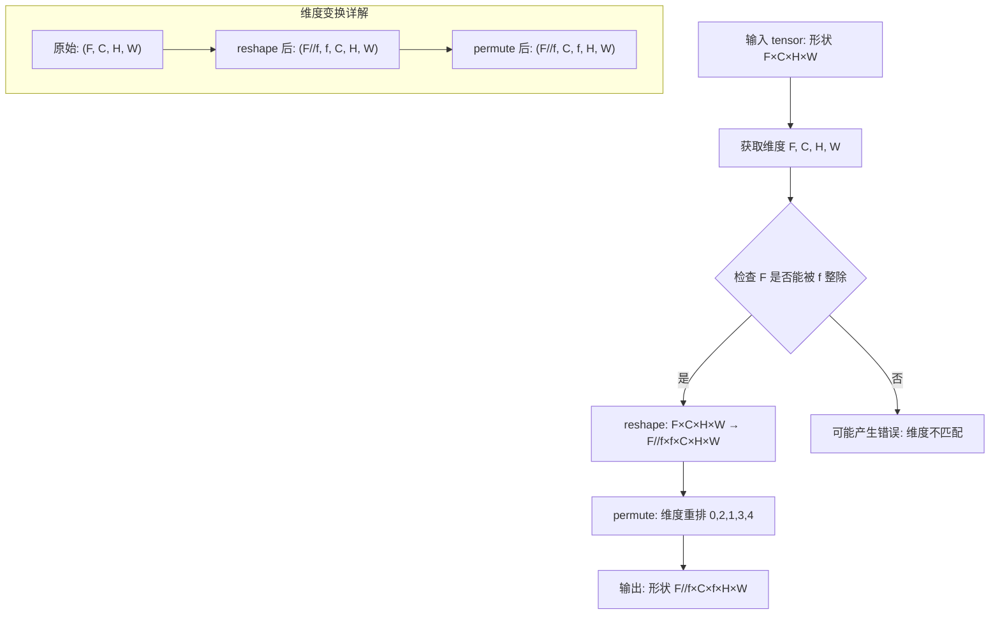
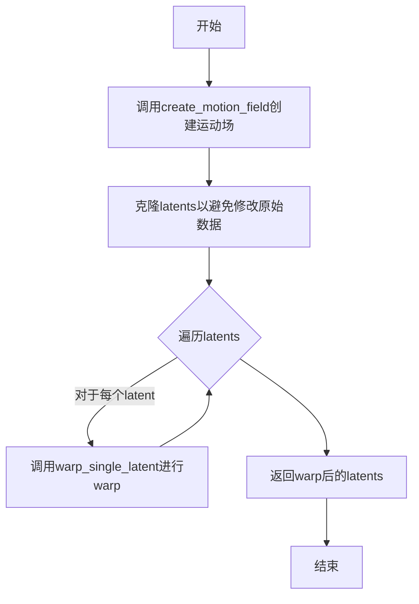
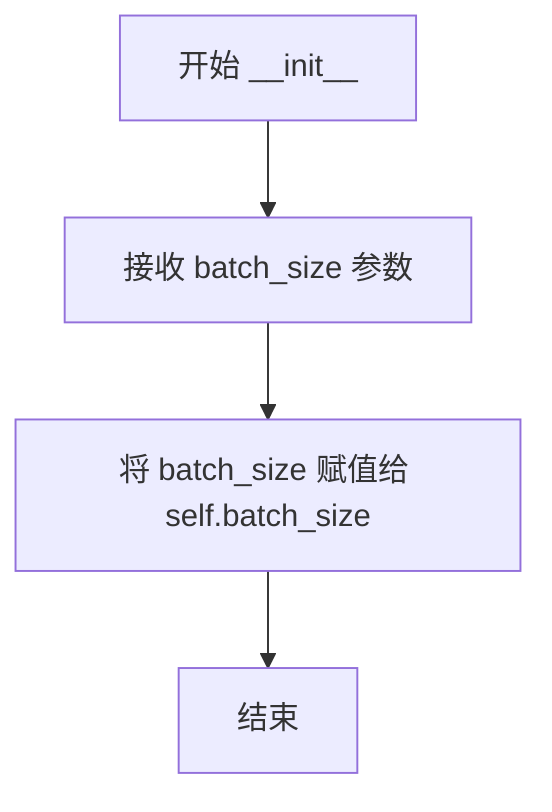
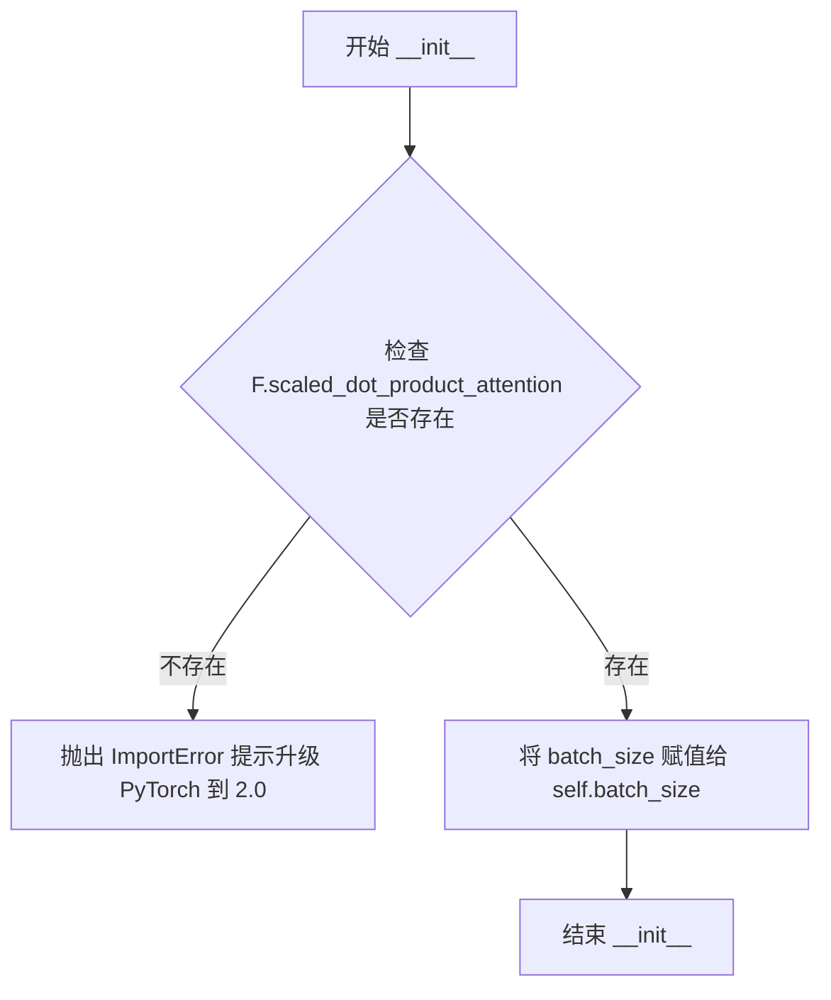
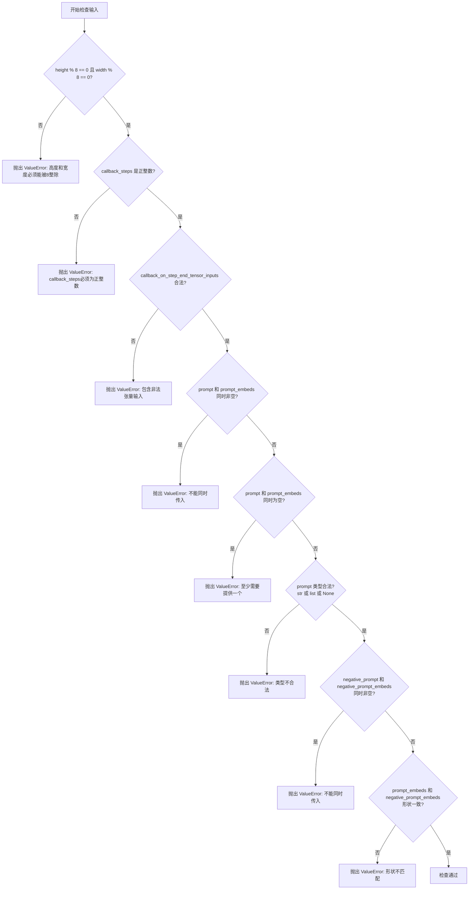
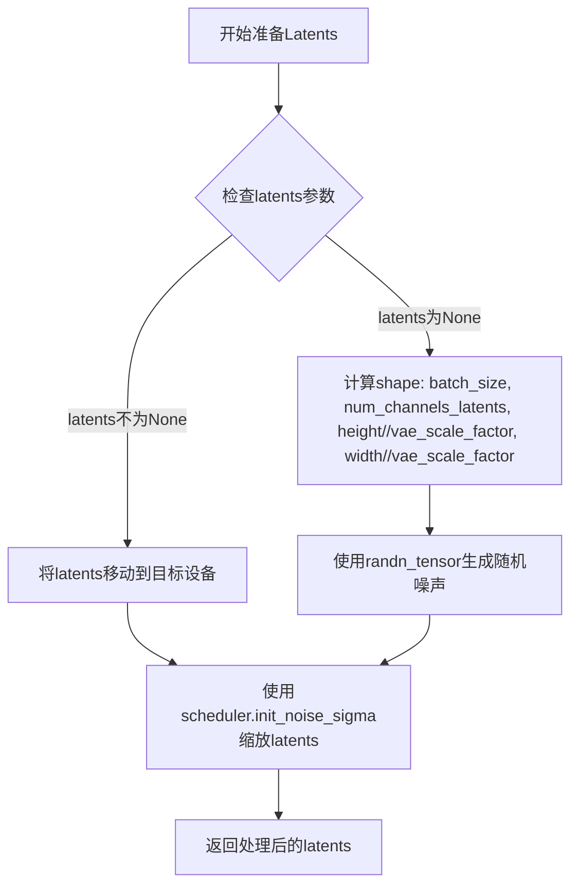
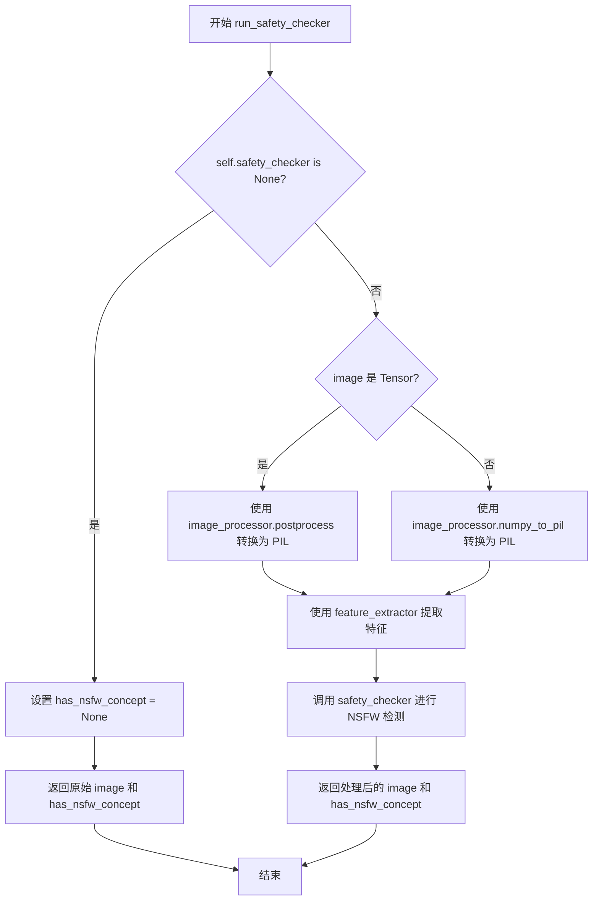

```mermaid
flowchart TD
    A[开始__call__] --> B[验证video_length > 0和num_videos_per_prompt == 1]
    B --> C[设置跨帧注意力处理器CrossFrameAttnProcessor]
    C --> D[标准化prompt和negative_prompt为列表]
    D --> E[设置默认height和width]
    E --> F[调用check_inputs验证输入参数]
    F --> G[确定batch_size和device]
    G --> H[判断是否启用分类器自由引导do_classifier_free_guidance]
    H --> I[调用encode_prompt编码输入提示词]
    I --> J[连接prompt_embeds和negative_prompt_embeds]
    J --> K[设置调度器时间步]
    K --> L[准备latent变量prepare_latents]
    L --> M[准备额外步骤参数prepare_extra_step_kwargs]
    M --> N[计算预热步数num_warmup_steps]
    N --> O{第一阶段反向扩散}
    O --> O1[调用backward_loop从timesteps到t1]
    O1 --> P[深拷贝调度器scheduler_copy]
    P --> Q{第二阶段反向扩散}
    Q --> Q1[调用backward_loop从t1到t0]
    Q1 --> R[将第一帧latent重复到所有帧x_2k_t0]
    R --> S[使用运动场扭曲latent create_motion_field_and_warp_latents]
    S --> T{前向扩散}
    T --> T1[调用forward_loop从t0到t1]
    T1 --> U[连接x_1_t1和x_2k_t1为x_1k_t1]
    U --> V[扩展prompt_embeds到视频长度]
    V --> W[恢复原始调度器]
    W --> X{第三阶段反向扩散}
    X --> X1[调用backward_loop从t1到0]
    X1 --> Y{输出处理}
    Y --> Z{判断output_type}
    Z -->|latent| AA[直接使用latents作为image]
    Z -->|其他| AB[调用decode_latents解码]
    AA --> AC[运行安全检查器run_safety_checker]
    AB --> AC
    AC --> AD[卸载模型钩子]
    AD --> AE[恢复原始注意力处理器]
    AE --> AF{return_dict判断}
    AF -->|True| AG[返回TextToVideoPipelineOutput]
    AF -->|False| AH[返回元组]
```

# `diffusers\src\diffusers\pipelines\text_to_video_synthesis\pipeline_text_to_video_zero.py` 详细设计文档

这是一个零样本文本到视频生成管道（Zero-shot Text-to-Video Pipeline），基于Stable Diffusion架构，通过跨帧注意力机制（Cross Frame Attention）和运动场（Motion Field）技术实现从文本提示生成视频帧序列的核心功能。

## 整体流程

```mermaid
graph TD
A[开始: 用户调用__call__] --> B[检查输入参数]
B --> C[设置跨帧注意力处理器]
C --> D[编码文本提示: encode_prompt]
D --> E[准备时间步: scheduler.set_timesteps]
E --> F[准备初始latents: prepare_latents]
F --> G{执行第一阶段反向去噪}
G --> H[从timesteps[0]到t1执行backward_loop]
H --> I{执行第二阶段反向去噪}
I --> J[从t1到t0执行backward_loop]
J --> K[复制第一帧latents到所有帧]
K --> L[创建运动场并warping latents]
L --> M[执行前向过程: forward_loop]
M --> N[执行最终反向去噪到t0]
N --> O{output_type检查}
O -- latent --> P[直接返回latents]
O -- np --> Q[解码latents: decode_latents]
Q --> R[运行安全检查: run_safety_checker]
R --> S[返回TextToVideoPipelineOutput]
S --> T[清理: 恢复原始注意力处理器]
```

## 类结构

```
DiffusionPipeline (抽象基类)
├── StableDiffusionMixin
├── DeprecatedPipelineMixin
├── TextualInversionLoaderMixin
├── StableDiffusionLoraLoaderMixin
├── FromSingleFileMixin
└── TextToVideoZeroPipeline (主类)
    ├── CrossFrameAttnProcessor
    └── CrossFrameAttnProcessor2_0
TextToVideoPipelineOutput (数据类)
```

## 全局变量及字段


### `logger`
    
模块级日志记录器，用于输出调试和运行信息

类型：`logging.Logger`
    


### `XLA_AVAILABLE`
    
PyTorch XLA是否可用标志，标识是否可以使用TPU加速

类型：`bool`
    


### `rearrange_0`
    
张量维度重排函数，将(F,C,H,W)转换为(F//f,f,C,H,W)再重排为(F//f,C,f,H,W)

类型：`Callable[[torch.Tensor, int], torch.Tensor]`
    


### `rearrange_1`
    
张量维度重排函数，将(B,C,F,H,W)重排为(B*F,C,H,W)

类型：`Callable[[torch.Tensor], torch.Tensor]`
    


### `rearrange_3`
    
张量维度重排函数，将(F,D,C)重排为(F//f,f,D,C)

类型：`Callable[[torch.Tensor, int], torch.Tensor]`
    


### `rearrange_4`
    
张量维度重排函数，将(B,F,D,C)重排为(B*F,D,C)

类型：`Callable[[torch.Tensor], torch.Tensor]`
    


### `coords_grid`
    
生成坐标网格，用于光流warping操作

类型：`Callable[[int, int, int, torch.device], torch.Tensor]`
    


### `warp_single_latent`
    
使用光流对单帧latent进行warping变换

类型：`Callable[[torch.Tensor, torch.Tensor], torch.Tensor]`
    


### `create_motion_field`
    
创建平移运动场，用于生成连续帧间的运动效果

类型：`Callable[[float, float, list[int], torch.device, torch.dtype], torch.Tensor]`
    


### `create_motion_field_and_warp_latents`
    
创建运动场并对所有latent帧进行warping变换

类型：`Callable[[float, float, list[int], torch.Tensor], torch.Tensor]`
    


### `CrossFrameAttnProcessor.batch_size`
    
实际批量大小（不含帧数），用于分类器自由引导计算

类型：`int`
    


### `CrossFrameAttnProcessor2_0.batch_size`
    
实际批量大小，用于PyTorch 2.0的scaled_dot_product_attention

类型：`int`
    


### `TextToVideoPipelineOutput.images`
    
生成的视频帧列表或NumPy数组

类型：`list[PIL.Image.Image] | np.ndarray`
    


### `TextToVideoPipelineOutput.nsfw_content_detected`
    
NSFW内容检测结果列表

类型：`list[bool] | None`
    


### `TextToVideoZeroPipeline.vae`
    
VAE编码器/解码器模型，用于图像与latent空间的相互转换

类型：`AutoencoderKL`
    


### `TextToVideoZeroPipeline.text_encoder`
    
文本编码器，将文本提示转换为embedding向量

类型：`CLIPTextModel`
    


### `TextToVideoZeroPipeline.tokenizer`
    
文本分词器，将文本字符串转换为token ids

类型：`CLIPTokenizer`
    


### `TextToVideoZeroPipeline.unet`
    
去噪UNet模型，在latent空间进行噪声预测

类型：`UNet2DConditionModel`
    


### `TextToVideoZeroPipeline.scheduler`
    
扩散调度器，控制去噪过程的噪声调度

类型：`KarrasDiffusionSchedulers`
    


### `TextToVideoZeroPipeline.safety_checker`
    
安全检查器，检测生成内容是否包含不当内容

类型：`StableDiffusionSafetyChecker`
    


### `TextToVideoZeroPipeline.feature_extractor`
    
特征提取器，从图像中提取CLIP特征用于安全检查

类型：`CLIPImageProcessor`
    


### `TextToVideoZeroPipeline.vae_scale_factor`
    
VAE缩放因子，用于计算latent空间的实际尺寸

类型：`int`
    


### `TextToVideoZeroPipeline.image_processor`
    
图像处理器，负责图像的预处理和后处理

类型：`VaeImageProcessor`
    


### `TextToVideoZeroPipeline._last_supported_version`
    
最后支持的管道版本号

类型：`str`
    
    

## 全局函数及方法


### rearrange_0

该函数用于重排张量维度，将原始的 (F, C, H, W) 形状的张量转换为 (F//f, C, f, H, W) 形状，以便于在批处理多帧图像时进行跨帧注意力计算。

参数：

- `tensor`：`torch.Tensor`，输入张量，形状为 (F, C, H, W)，其中 F 是总帧数，C 是通道数，H 是高度，W 是宽度
- `f`：`int`，每个批次项包含的帧数，用于将 F 维分割为批次维度和帧维度

返回值：`torch.Tensor`，重排后的张量，形状为 (F//f, C, f, H, W)，其中 F//f 是新的批次大小，f 是每批次的帧数

#### 流程图



#### 带注释源码

```python
def rearrange_0(tensor, f):
    """
    重排张量维度用于批处理多帧
    
    该函数主要用于跨帧注意力机制中，将连续的多帧张量重新排列，
    以便每个批次项包含多帧，便于后续的注意力计算。
    
    Args:
        tensor: 输入张量，形状为 (F, C, H, W)
            - F: 总帧数 (可以是 batch_size * frames_per_sample)
            - C: 通道数
            - H: 高度
            - W: 宽度
        f: 每个批次项包含的帧数
    
    Returns:
        重排后的张量，形状为 (F//f, C, f, H, W)
            - F//f: 新的批次大小
            - C: 通道数（保持不变）
            - f: 每批次的帧数
            - H: 高度（保持不变）
            - W: 宽度（保持不变）
    """
    # 获取输入张量的各个维度大小
    # F: 总帧数, C: 通道数, H: 高度, W: 宽度
    F, C, H, W = tensor.size()
    
    # 第一步：reshape
    # 将原始形状 (F, C, H, W) 转换为 (F//f, f, C, H, W)
    # 这样就把原来的 F 维度分割成了两个维度：
    #   - F//f: 批次维度（每个批次项）
    #   - f: 每个批次项包含的帧数
    tensor = torch.permute(torch.reshape(tensor, (F // f, f, C, H, W)), (0, 2, 1, 3, 4))
    
    # 第二步：permute 维度重排
    # 将维度从 (0, 2, 1, 3, 4) 的排列方式进行重排
    # 原始: (batch, frames, channels, height, width) -> (F//f, f, C, H, W)
    # 目标: (batch, channels, frames, height, width) -> (F//f, C, f, H, W)
    # 这样排列有利于后续的跨帧注意力计算，其中通道维度和帧维度被明确分开
    
    return tensor
```

#### 使用场景说明

该函数在 `CrossFrameAttnProcessor` 和 `CrossFrameAttnProcessor2_0` 类中被调用，用于跨帧注意力机制。具体用途如下：

1. **Key/Value 重排**：在计算跨帧注意力时，将 key 和 value 张量从 (batch*frames, channels, height, width) 的形状重排为 (batch, channels, frames, height, width)
2. **提取第一帧**：重排后，可以通过索引 `key[:, first_frame_index]` 提取所有帧的第一帧，使得所有帧都attend到第一帧
3. **恢复形状**：使用 `rearrange_4` 函数将张量恢复回原始形状继续后续计算


### `rearrange_1`

恢复重排后的张量形状，将五维张量(B, C, F, H, W)重排为四维张量(B*F, C, H, W)，其中B为批次大小，C为通道数，F为帧数，H为高度，W为宽度。

参数：

- `tensor`：`torch.Tensor`，输入的五维张量，形状为(B, C, F, H, W)，其中B是批次大小，C是通道数，F是帧数，H是高度，W是宽度

返回值：`torch.Tensor`，重排后的四维张量，形状为(B * F, C, H, W)，将帧维度合并到批次维度

#### 流程图

```mermaid
flowchart TD
    A[输入 tensor: (B, C, F, H, W)] --> B[获取张量尺寸: B, C, F, H, W]
    B --> C[permute 维度重排: tensor → (0, 2, 1, 3, 4)]
    C --> D[得到中间张量: (B, F, C, H, W)]
    D --> E[reshape 变形: (B*F, C, H, W)]
    E --> F[输出: (B*F, C, H, W)]
```

#### 带注释源码

```python
def rearrange_1(tensor):
    """
    将五维张量重排为四维张量，将帧维度合并到批次维度
    
    参数:
        tensor: 输入张量，形状为 (B, C, F, H, W)
            B - batch size 批次大小
            C - channels 通道数
            F - frames 帧数
            H - height 高度
            W - width 宽度
            
    返回:
        重排后的张量，形状为 (B * F, C, H, W)
    """
    # 获取输入张量的各维度大小
    # B: batch size 批次大小
    # C: channels 通道数  
    # F: frames 帧数
    # H: height 高度
    # W: width 宽度
    B, C, F, H, W = tensor.size()
    
    # 步骤1: 使用 permute 进行维度重排
    # 将 (B, C, F, H, W) -> (B, F, C, H, W)
    # 将通道维度C与帧维度F交换位置
    permuted_tensor = torch.permute(tensor, (0, 2, 1, 3, 4))
    
    # 步骤2: 使用 reshape 合并批次和帧维度
    # 将 (B, F, C, H, W) -> (B*F, C, H, W)
    # 将B和F维度展平合并为一个批次维度
    return torch.reshape(permuted_tensor, (B * F, C, H, W))
```


### rearrange_3

该函数用于在跨帧注意力机制中重排 key/value 张量，将原始张量从 (F, D, C) 形状重新排列为 (F//f, f, D, C) 形状，其中 F 是帧数，f 是每组的帧数，D 是特征维度，C 是通道数。这种重排使得每个帧组可以共享相同的 key 和 value，从而实现跨帧注意力的计算。

参数：

- `tensor`：`torch.Tensor`，输入的三维张量，形状为 (F, D, C)，其中 F 是帧数，D 是特征维度，C 是通道数
- `f`：`int`，分组数，用于将 F 帧分成 F//f 组

返回值：`torch.Tensor`，重塑后的四维张量，形状为 (F//f, f, D, C)，便于后续在帧维度上进行跨帧注意力操作

#### 流程图

```mermaid
flowchart TD
    A[开始: 输入 tensor 和 f] --> B[获取 tensor 形状: F, D, C = tensor.size]
    B --> C[计算分组: F_div_f = F // f]
    C --> D[重塑张量: torch.reshape to (F_div_f, f, D, C)]
    D --> E[返回重塑后的张量]
```

#### 带注释源码

```python
def rearrange_3(tensor, f):
    """
    重排 key/value 张量用于跨帧注意力。

    该函数将输入的三维张量 (F, D, C) 重塑为四维张量 (F//f, f, D, C)。
    在跨帧注意力机制中，需要将多帧的 key/value 按批次和帧维度重新排列，
    以便后续可以选择第一帧的 key/value 作为参考，实现所有帧共享第一帧的注意力信息。

    Args:
        tensor: 输入张量，形状为 (F, D, C)，F 是帧数，D 是特征维度，C 是通道数
        f: 分组数，将 F 帧分成 F//f 组

    Returns:
        重塑后的张量，形状为 (F//f, f, D, C)
    """
    # 获取输入张量的三个维度: F=帧数, D=特征维度, C=通道数
    F, D, C = tensor.size()
    
    # 使用 torch.reshape 将张量从 (F, D, C) 重塑为 (F//f, f, D, C)
    # 这样每 f 帧被组织在一起，形成 (批次, 帧组, 特征, 通道) 的结构
    return torch.reshape(tensor, (F // f, f, D, C))
```


### `rearrange_4`

该函数是跨帧注意力机制中的张量形状恢复工具，用于将经过维度重新排列的 key/value 张量从带帧维度的形状 (B, F, D, C) 恢复为标准的 2D 注意力计算形状 (B*F, D, C)，即将批次维度和时间帧维度合并，以便后续的头部划分和注意力分数计算。

参数：

- `tensor`：`torch.Tensor`，输入的张量，形状为 (B, F, D, C)，其中 B 是批次大小，F 是帧数，D 是特征维度，C 是通道数

返回值：`torch.Tensor`，重塑后的张量，形状为 (B*F, D, C)，批次维度和帧维度已合并

#### 流程图

```mermaid
flowchart TD
    A[输入 tensor: 形状 (B, F, D, C)] --> B[获取维度信息: B, F, D, C]
    B --> C{检查维度有效性}
    C -->|有效| D[torch.reshape 合并 B 和 F 维度]
    C -->|无效| E[抛出异常或返回原tensor]
    D --> F[输出 tensor: 形状 (B*F, D, C)]
```

#### 带注释源码

```python
def rearrange_4(tensor):
    """
    恢复 key/value 形状，将带帧维度的张量合并回批次维度
    
    该函数是跨帧注意力处理流程中的逆向操作，
    将 (B, F, D, C) 形状的张量转换为 (B*F, D, C) 形状，
    以便与 query 进行注意力计算
    
    参数:
        tensor: 输入张量，形状必须为 (B, F, D, C)
            B - batch size (批次大小)
            F - frames (视频帧数)
            D - dimension (特征维度)
            C - channels (通道数)
    
    返回:
        重塑后的张量，形状为 (B*F, D, C)
    """
    # 获取输入张量的四个维度
    B, F, D, C = tensor.size()
    
    # 使用 torch.reshape 将张量从 (B, F, D, C) 合并为 (B*F, D, C)
    # 这实际上是将批次维度和帧维度展平合并
    # 常用于 Cross Frame Attention 中恢复 key/value 的形状
    return torch.reshape(tensor, (B * F, D, C))
```


### `coords_grid`

生成坐标网格用于warp操作，输出标准的归一化坐标网格（normalized coordinate grid），常用于图像/潜空间变形的采样操作。

参数：

- `batch`：`int`，批次大小，表示需要生成的坐标网格数量
- `ht`：`int`，目标高度，对应图像或特征图的行数（Y轴方向）
- `wd`：`int`，目标宽度，对应图像或特征图的列数（X轴方向）
- `device`：`torch.device`，计算设备，用于指定张量存储的硬件位置

返回值：`torch.Tensor`，形状为 `(batch, 2, ht, wd)` 的浮点型坐标张量，其中第一维为X坐标，第二维为Y坐标

#### 流程图

```mermaid
graph TD
    A[开始 coords_grid] --> B[创建垂直坐标: torch.arange ht]
    B --> C[创建水平坐标: torch.arange wd]
    C --> D[torch.meshgrid 生成网格]
    D --> E[coords[::-1] 翻转维度顺序: YX -> XY]
    E --> F[torch.stack 堆叠为 [2, ht, wd]]
    F --> G[.float 转为浮点类型]
    G --> H[coords[None] 添加批次维度]
    H --> I[.repeat batch 次复制]
    I --> J[返回坐标网格 Tensor]
```

#### 带注释源码

```python
def coords_grid(batch, ht, wd, device):
    # Adapted from https://github.com/princeton-vl/RAFT/blob/master/core/utils/utils.py
    
    # Step 1: 创建一维坐标向量
    # torch.arange(ht, device=device) 生成 [0, 1, 2, ..., ht-1] 的垂直坐标
    # torch.arange(wd, device=device) 生成 [0, 1, 2, ..., wd-1] 的水平坐标
    coords = torch.meshgrid(torch.arange(ht, device=device), torch.arange(wd, device=device))
    
    # Step 2: 坐标重排与堆叠
    # coords[::-1] 将 (Y_grid, X_grid) 翻转为 (X_grid, Y_grid)
    # torch.stack(coords[::-1], dim=0) 在维度0堆叠，得到 [2, ht, wd] 张量
    # 维度0: X坐标, 维度1: Y坐标
    coords = torch.stack(coords[::-1], dim=0).float()
    
    # Step 3: 扩展批次维度
    # coords[None] 将 [2, ht, wd] 变为 [1, 2, ht, wd]
    # .repeat(batch, 1, 1, 1) 在批次维度复制batch次，最终形状 [batch, 2, ht, wd]
    return coords[None].repeat(batch, 1, 1, 1)
    
    # 输出说明:
    # 返回的张量形状为 (batch, 2, ht, wd)
    # 其中 coords[:, 0, :, :] 包含X坐标 [0, wd-1]
    #       coords[:, 1, :, :] 包含Y坐标 [0, ht-1]
    # 该网格通常在 warp 操作前会被归一化到 [-1, 1] 范围
```


### `warp_single_latent`

该函数使用光流（optical flow）对单个帧的latent表示进行空间变换（warp），通过计算光流驱动的坐标偏移并使用双线性插值对latent进行重采样，实现帧间的特征对齐。

参数：

- `latent`：`torch.Tensor`，单帧的latent code，形状为 (B, C, h, w)，其中 B 是批次大小，C 是通道数，h 和 w 是latent的空间维度
- `reference_flow`：`torch.Tensor`，光流场，形状为 (B, 2, H, W)，其中 2 表示 x 和 y 方向的位移，H 和 W 是光流的分辨率

返回值：`torch.Tensor`，warp 后的 latent，形状为 (B, C, h, w)，与输入 latent 具有相同的形状

#### 流程图

```mermaid
flowchart TD
    A[开始: warp_single_latent] --> B[获取光流尺寸 H, W]
    --> C[获取latent尺寸 h, w]
    --> D[生成基础坐标网格 coords0]
    --> E[计算目标坐标: coords_t0 = coords0 + reference_flow]
    --> F[坐标归一化: x方向除以W, y方向除以H]
    --> G[坐标映射到 [-1, 1] 范围]
    --> H[插值到latent对应尺寸 h, w]
    --> I[调整维度顺序为 [B, H, W, 2]]
    --> J[使用 grid_sample 进行warp操作]
    --> K[返回 warp 后的 latent]
```

#### 带注释源码

```python
def warp_single_latent(latent, reference_flow):
    """
    Warp latent of a single frame with given flow

    Args:
        latent: latent code of a single frame
        reference_flow: flow which to warp the latent with

    Returns:
        warped: warped latent
    """
    # 获取光流的空间维度 H x W
    _, _, H, W = reference_flow.size()
    # 获取latent的空间维度 h x w
    _, _, h, w = latent.size()
    
    # 生成基础坐标网格，形状为 (1, 2, H, W)
    # coords_grid 是辅助函数，返回标准的网格坐标
    coords0 = coords_grid(1, H, W, device=latent.device).to(latent.dtype)

    # 将光流加到基础坐标上，得到目标位置坐标
    coords_t0 = coords0 + reference_flow
    
    # 坐标归一化：将像素坐标转换为 [0, 1] 范围的坐标
    # x 方向除以宽度 W，y 方向除以高度 H
    coords_t0[:, 0] /= W
    coords_t0[:, 1] /= H

    # 将坐标从 [0, 1] 范围映射到 [-1, 1] 范围
    # 这是 grid_sample 函数要求的坐标格式
    # 其中 (-1, -1) 表示左上角，(1, 1) 表示右下角
    coords_t0 = coords_t0 * 2.0 - 1.0
    
    # 使用双线性插值将坐标调整到与latent相同的分辨率
    # 从 H x W 调整到 h x w
    coords_t0 = F.interpolate(coords_t0, size=(h, w), mode="bilinear")
    
    # 调整维度顺序：从 (B, 2, H, W) 调整为 (B, H, W, 2)
    # 这是 grid_sample 函数要求的输入格式
    coords_t0 = torch.permute(coords_t0, (0, 2, 3, 1))

    # 使用 grid_sample 对 latent 进行warp操作
    # mode="nearest" 表示使用最近邻插值（但实际用于特征采样）
    # padding_mode="reflection" 表示使用反射填充处理边界
    warped = grid_sample(latent, coords_t0, mode="nearest", padding_mode="reflection")
    
    return warped
```

#### 依赖的辅助函数

```python
def coords_grid(batch, ht, wd, device):
    # Adapted from https://github.com/princeton-vl/RAFT/blob/master/core/utils/utils.py
    # 生成标准的网格坐标，用于图像warp操作
    coords = torch.meshgrid(torch.arange(ht, device=device), torch.arange(wd, device=device))
    coords = torch.stack(coords[::-1], dim=0).float()
    return coords[None].repeat(batch, 1, 1, 1)
```

#### 关键实现细节

| 步骤 | 操作 | 说明 |
|------|------|------|
| 1 | 坐标生成 | 使用 `coords_grid` 生成基础网格坐标，形状为 (batch, 2, H, W) |
| 2 | 光流应用 | 将光流位移加到基础坐标上：`coords_t = coords_0 + flow` |
| 3 | 归一化处理 | 将像素坐标归一化到 [0,1]，再映射到 [-1,1]（grid_sample 要求） |
| 4 | 分辨率匹配 | 使用 `F.interpolate` 将坐标调整到与目标latent相同分辨率 |
| 5 | 坐标重排 | 将坐标维度从 (B,2,H,W) 转换为 (B,H,W,2)（grid_sample 要求） |
| 6 | 采样warp | 使用 `grid_sample` 进行双线性采样，得到warp后的latent |

#### 技术特点

1. **坐标系统转换**：将光流定义的像素位移转换为 grid_sample 所需的归一化坐标（[-1, 1]）
2. **分辨率适配**：通过插值处理光流分辨率与latent分辨率不一致的情况
3. **反射填充**：使用 `padding_mode="reflection"` 避免边界效应
4. **原位操作**：不修改原始latent，返回新的warp结果


### `create_motion_field`

该函数用于根据给定的运动强度参数和帧索引创建平移运动场（motion field），返回一个形状为 (seq_length, 2, 512, 512) 的三维张量，其中每个帧对应一个二维光流（x 和 y 方向）。

参数：

- `motion_field_strength_x`：`float`，沿 x 轴的运动强度系数
- `motion_field_strength_y`：`float`，沿 y 轴的运动强度系数
- `frame_ids`：`list[int]`，正在处理的帧索引列表，用于分块推理时标识帧的顺序
- `device`：`torch.device`，计算设备
- `dtype`：`torch.dtype`，张量的数据类型

返回值：`torch.Tensor`，形状为 (seq_length, 2, 512, 512) 的运动场张量，其中第一维为帧数，第二维的 0 通道表示 x 方向位移，1 通道表示 y 方向位移

#### 流程图

```mermaid
flowchart TD
    A[开始] --> B[获取帧序列长度 seq_length]
    B --> C[创建零张量 reference_flow, shape: (seq_length, 2, 512, 512)]
    C --> D{遍历帧索引: fr_idx = 0 to seq_length-1}
    D --> E[设置 x 方向流: reference_flow[fr_idx, 0, :, :] = motion_field_strength_x * frame_ids[fr_idx]]
    D --> F[设置 y 方向流: reference_flow[fr_idx, 1, :, :] = motion_field_strength_y * frame_ids[fr_idx]]
    E --> G{是否还有帧未处理?}
    F --> G
    G -->|是| D
    G -->|否| H[返回 reference_flow]
    H --> I[结束]
```

#### 带注释源码

```python
def create_motion_field(motion_field_strength_x, motion_field_strength_y, frame_ids, device, dtype):
    """
    Create translation motion field

    Args:
        motion_field_strength_x: motion strength along x-axis
        motion_field_strength_y: motion strength along y-axis
        frame_ids: indexes of the frames the latents of which are being processed.
            This is needed when we perform chunk-by-chunk inference
        device: device
        dtype: dtype

    Returns:
        reference_flow: 形状为 (seq_length, 2, 512, 512) 的运动场张量

    """
    # 获取要处理的帧数量
    seq_length = len(frame_ids)
    
    # 创建一个形状为 (seq_length, 2, 512, 512) 的全零张量
    # 维度含义: [帧索引, 通道(0=x方向, 1=y方向), 高度, 宽度]
    reference_flow = torch.zeros((seq_length, 2, 512, 512), device=device, dtype=dtype)
    
    # 遍历每一帧，根据帧索引计算光流
    for fr_idx in range(seq_length):
        # x 方向的光流 = x 方向运动强度 * 帧索引
        # 帧索引越大，表示该帧离第一帧越远，位移越大
        reference_flow[fr_idx, 0, :, :] = motion_field_strength_x * (frame_ids[fr_idx])
        
        # y 方向的光流 = y 方向运动强度 * 帧索引
        reference_flow[fr_idx, 1, :, :] = motion_field_strength_y * (frame_ids[fr_idx])
    
    # 返回生成的光流场
    return reference_flow
```


### `create_motion_field_and_warp_latents`

该函数是TextToVideoZeroPipeline中的核心工具函数，用于创建翻译运动场并对所有帧的latent进行warp处理。它通过调用`create_motion_field`生成运动场，然后遍历每个latent使用`warp_single_latent`进行warp操作，最终返回warp后的latents序列。

参数：
- `motion_field_strength_x`：`float`，沿x轴的运动强度
- `motion_field_strength_y`：`float`，沿y轴的运动强度
- `frame_ids`：`list[int]`，正在处理的帧索引列表，用于分块推理
- `latents`：`torch.Tensor`，帧的latent代码

返回值：`torch.Tensor`，warp后的latents

#### 流程图



#### 带注释源码

```python
def create_motion_field_and_warp_latents(motion_field_strength_x, motion_field_strength_y, frame_ids, latents):
    """
    Creates translation motion and warps the latents accordingly
    
    该函数实现文本到视频零样本生成中的运动场创建和latent warp功能。
    它基于给定的运动强度参数创建线性运动场，然后对每个帧的latent进行相应的空间变换。

    Args:
        motion_field_strength_x: float, 沿x轴的运动强度，决定水平方向位移的大小
        motion_field_strength_y: float, 沿y轴的运动强度，决定垂直方向位移的大小
        frame_ids: list[int], 帧索引列表，每个索引对应latents中的特定帧，用于分块推理场景
        latents: torch.Tensor, 四维张量 [batch, channels, height, width]，包含多个帧的latent表示

    Returns:
        warped_latents: torch.Tensor, 与输入latents形状相同的warp后的latent张量
    """
    # 第一步：创建运动场
    # 根据运动强度和帧索引生成每个帧对应的光流场
    # 光流场是一个四维张量 [frames, 2, 512, 512]，其中2代表x和y方向的位移
    motion_field = create_motion_field(
        motion_field_strength_x=motion_field_strength_x,
        motion_field_strength_y=motion_field_strength_y,
        frame_ids=frame_ids,
        device=latents.device,  # 确保运动场在相同的设备上
        dtype=latents.dtype,    # 确保使用相同的数据类型
    )
    
    # 第二步：初始化输出张量
    # 使用clone和detach创建原始latents的副本，避免修改输入数据
    warped_latents = latents.clone().detach()
    
    # 第三步：对每个帧进行warp操作
    # 遍历每个帧的latent，使用对应的运动场进行空间变换
    for i in range(len(warped_latents)):
        # 对于每个帧，提取单个帧的latent和对应的运动场
        # latent[i][None]将形状从[C, H, W]扩展为[1, C, H, W]
        # motion_field[i][None]将形状从[2, H, W]扩展为[1, 2, H, W]
        warped_latents[i] = warp_single_latent(latents[i][None], motion_field[i][None])
    
    return warped_latents
```


### `CrossFrameAttnProcessor.__init__`

该方法是 `CrossFrameAttnProcessor` 类的构造函数，用于初始化跨帧注意力处理器的批量大小属性。该处理器实现了让每一帧都关注第一帧的注意力机制，常用于零样本视频生成任务中保持时间一致性。

参数：

- `batch_size`：`int`，表示实际批量大小（不包括帧数）。例如，当使用单个提示词且 `num_images_per_prompt=1` 时，由于需要处理分类器自由引导（classifier-free guidance），`batch_size` 应设为 2。默认为 2。

返回值：`None`，构造函数不返回值，仅初始化实例属性。

#### 流程图



#### 带注释源码

```python
def __init__(self, batch_size=2):
    """
    初始化 CrossFrameAttnProcessor 实例。

    Args:
        batch_size: 表示实际批量大小的数字，不包括帧数。
            例如，调用 unet 时使用单个提示词且 num_images_per_prompt=1，
            由于分类器自由引导，batch_size 应等于 2。
    """
    # 将传入的 batch_size 参数存储为实例属性
    # 该属性在后续 __call__ 方法中用于计算视频帧数量
    self.batch_size = batch_size
```


### CrossFrameAttnProcessor.__call__

执行跨帧注意力计算，使每个帧都attend到第一帧，以实现视频生成中的时间一致性。

参数：

- `attn`：`CrossFrameAttnProcessor`，注意力处理器实例本身
- `hidden_states`：`torch.Tensor`，隐藏状态张量，形状为 (batch_size, sequence_length, hidden_dim)
- `encoder_hidden_states`：`torch.Tensor | None`，编码器隐藏状态，用于cross-attention，若为None则使用hidden_states
- `attention_mask`：`torch.Tensor | None`，注意力掩码，用于遮蔽无效位置

返回值：`torch.Tensor`，经过注意力计算后的隐藏状态张量

#### 流程图

```mermaid
flowchart TD
    A[开始 __call__] --> B[获取 batch_size, sequence_length]
    B --> C[prepare_attention_mask 准备注意力掩码]
    C --> D[attn.to_q 计算 query]
    D --> E{encoder_hidden_states is not None?}
    E -->|Yes| F[标记为 cross-attention]
    E -->|No| G[encoder_hidden_states = hidden_states]
    G --> H{attn.norm_cross?}
    H -->|Yes| I[attn.norm_encoder_hidden_states 归一化]
    H -->|No| J[继续]
    I --> J
    F --> J
    J --> K[attn.to_k 计算 key]
    K --> L[attn.to_v 计算 value]
    L --> M{不是 cross-attention?}
    M -->|Yes| N[计算 video_length]
    N --> O[创建 first_frame_index]
    O --> P[rearrange_3 重排 key]
    P --> Q[key = key[:, first_frame_index]]
    Q --> R[rearrange_3 重排 value]
    R --> S[value = value[:, first_frame_index]]
    S --> T[rearrange_4 恢复形状]
    T --> U
    M -->|No| U
    U --> V[head_to_batch_dim 转换维度]
    V --> W[get_attention_scores 计算注意力分数]
    W --> X[torch.bmm 注意力加权]
    X --> Y[batch_to_head_dim 恢复维度]
    Y --> Z[to_out[0] 线性投影]
    Z --> AA[to_out[1] Dropout]
    AA --> BB[返回 hidden_states]
```

#### 带注释源码

```python
def __call__(self, attn, hidden_states, encoder_hidden_states=None, attention_mask=None):
    # 获取批量大小和序列长度
    batch_size, sequence_length, _ = hidden_states.shape
    
    # 准备注意力掩码，处理不同形状的掩码
    attention_mask = attn.prepare_attention_mask(attention_mask, sequence_length, batch_size)
    
    # 使用注意力模块的 to_q 方法将 hidden_states 投影为 query
    query = attn.to_q(hidden_states)

    # 判断是否为 cross-attention（是否有外部编码器隐藏状态）
    is_cross_attention = encoder_hidden_states is not None
    
    # 如果没有提供 encoder_hidden_states，则使用 hidden_states 本身
    if encoder_hidden_states is None:
        encoder_hidden_states = hidden_states
    # 如果需要归一化，则对 encoder_hidden_states 进行归一化处理
    elif attn.norm_cross:
        encoder_hidden_states = attn.norm_encoder_hidden_states(encoder_hidden_states)

    # 使用 to_k 和 to_v 将 encoder_hidden_states 投影为 key 和 value
    key = attn.to_k(encoder_hidden_states)
    value = attn.to_v(encoder_hidden_states)

    # === 跨帧注意力机制 ===
    # 仅在 self-attention 模式下执行跨帧处理
    if not is_cross_attention:
        # 计算视频帧数：key 的第一维大小除以批量大小
        video_length = key.size()[0] // self.batch_size
        
        # 创建指向第一帧的索引列表，用于让所有帧都attend到第一帧
        first_frame_index = [0] * video_length

        # rearrange keys: 将 (batch*frames, dim) 重排为 (batch, frames, dim)
        # 以便能够按帧索引选择
        key = rearrange_3(key, video_length)
        # 选择第一帧的 key，使所有帧都使用第一帧的键
        key = key[:, first_frame_index]
        
        # rearrange values: 同样重排 value
        value = rearrange_3(value, video_length)
        # 选择第一帧的 value，使所有帧都使用第一帧的值
        value = value[:, first_frame_index]

        # rearrange back: 恢复原始形状 (batch*frames, dim)
        key = rearrange_4(key)
        value = rearrange_4(value)

    # 将 query, key, value 从 (batch, seq, dim) 转换为 (batch, heads, seq, head_dim)
    query = attn.head_to_batch_dim(query)
    key = attn.head_to_batch_dim(key)
    value = attn.head_to_batch_dim(value)

    # 计算注意力分数并应用注意力
    attention_probs = attn.get_attention_scores(query, key, attention_mask)
    hidden_states = torch.bmm(attention_probs, value)
    hidden_states = attn.batch_to_head_dim(hidden_states)

    # 线性投影
    hidden_states = attn.to_out[0](hidden_states)
    # Dropout
    hidden_states = attn.to_out[1](hidden_states)

    return hidden_states
```


### CrossFrameAttnProcessor2_0.__init__

初始化CrossFrameAttnProcessor2_0处理器，检查PyTorch 2.0的scaled_dot_product_attention支持，并设置batch_size属性。

参数：

- `self`：CrossFrameAttnProcessor2_0，隐式参数，表示当前实例对象
- `batch_size`：`int`，可选参数，默认值为2。实际batch大小（不包括帧数），例如使用单个prompt且num_images_per_prompt=1时，由于classifier-free guidance，batch_size应设为2

返回值：`None`，该方法为构造函数，不返回任何值，仅初始化实例属性

#### 流程图



#### 带注释源码

```python
def __init__(self, batch_size=2):
    # 检查 PyTorch 是否支持 scaled_dot_product_attention
    # 这是 PyTorch 2.0 引入的新功能
    if not hasattr(F, "scaled_dot_product_attention"):
        # 如果不支持，抛出 ImportError 提示用户升级 PyTorch
        raise ImportError("AttnProcessor2_0 requires PyTorch 2.0, to use it, please upgrade PyTorch to 2.0.")
    
    # 将传入的 batch_size 参数保存为实例属性
    # batch_size 表示实际的 batch 大小，不包括帧数维度
    # 默认值为 2，适用于 classifier-free guidance 场景
    self.batch_size = batch_size
```


### `CrossFrameAttnProcessor2_0.__call__`

使用 PyTorch 2.0 的 `scaled_dot_product_attention` 实现跨帧注意力机制。该方法在自注意力模式下，将每一帧的键（key）和值（value）替换为第一帧的键值，从而使所有帧都Attend到第一帧，实现时间维度的信息复用。

参数：

- `attn`：`torch.nn.Module`，注意力模块（Attention），包含 `to_q`、`to_k`、`to_v`、`head_to_batch_dim`、`batch_to_head_dim`、`get_attention_scores`、`prepare_attention_mask` 等方法以及 `to_out`、`heads`、`norm_cross` 等属性
- `hidden_states`：`torch.Tensor`，输入的隐藏状态，形状为 `(batch_size, sequence_length, hidden_dim)`
- `encoder_hidden_states`：`torch.Tensor | None`，编码器隐藏状态，用于跨注意力；若为 `None` 则使用 `hidden_states` 本身
- `attention_mask`：`torch.Tensor | None`，注意力掩码，用于遮盖无效位置

返回值：`torch.Tensor`，经过跨帧注意力处理后的隐藏状态，形状与输入 `hidden_states` 相同

#### 流程图

```mermaid
flowchart TD
    A[开始 __call__] --> B[获取 batch_size 和 sequence_length]
    B --> C{encoder_hidden_states 为 None?}
    C -->|是| D[使用 hidden_states.shape]
    C -->|否| E[使用 encoder_hidden_states.shape]
    D --> F[获取 inner_dim]
    E --> F
    F --> G{attention_mask 不为 None?}
    G -->|是| H[准备注意力掩码并调整形状为 batch, heads, source, target]
    G -->|否| I[跳过掩码处理]
    H --> J[计算 query]
    I --> J
    J --> K{is_cross_attention?}
    K -->|是| L[使用原始 key 和 value]
    K -->|否| M[跨帧处理: 计算 video_length]
    M --> N[创建 first_frame_index 列表]
    N --> O[使用 rearrange_3 重排 key 并取第一帧]
    O --> P[使用 rearrange_4 恢复形状]
    P --> Q[对 value 进行相同处理]
    Q --> R[计算 head_dim]
    R --> S[将 query, key, value 视图转换为 batch, heads, seq, head_dim]
    S --> T[调用 F.scaled_dot_product_attention]
    T --> U[转换输出形状回 batch, seq, hidden_dim]
    U --> V[线性投影 to_out[0]]
    V --> W[Dropout to_out[1]]
    W --> X[返回 hidden_states]
```

#### 带注释源码

```python
def __call__(self, attn, hidden_states, encoder_hidden_states=None, attention_mask=None):
    """
    使用 PyTorch 2.0 的 scaled_dot_product_attention 执行跨帧注意力
    
    参数:
        attn: Attention 模块
        hidden_states: 输入隐藏状态
        encoder_hidden_states: 编码器隐藏状态（可选）
        attention_mask: 注意力掩码（可选）
    
    返回:
        处理后的隐藏状态
    """
    # 根据是否有 encoder_hidden_states 来确定 batch_size 和 sequence_length
    # 如果是跨注意力，使用 encoder_hidden_states 的形状；否则使用 hidden_states
    batch_size, sequence_length, _ = (
        hidden_states.shape if encoder_hidden_states is None else encoder_hidden_states.shape
    )
    # 获取隐藏维度
    inner_dim = hidden_states.shape[-1]

    # 如果提供了注意力掩码，准备并调整其形状
    # scaled_dot_product_attention 期望掩码形状为 (batch, heads, source_length, target_length)
    if attention_mask is not None:
        attention_mask = attn.prepare_attention_mask(attention_mask, sequence_length, batch_size)
        # 调整掩码形状以适应 scaled_dot_product_attention
        attention_mask = attention_mask.view(batch_size, attn.heads, -1, attention_mask.shape[-1])

    # 使用 to_q 将 hidden_states 投影为 query
    query = attn.to_q(hidden_states)

    # 判断是否为跨注意力机制
    is_cross_attention = encoder_hidden_states is not None
    
    # 如果没有提供 encoder_hidden_states，则使用 hidden_states 本身
    if encoder_hidden_states is None:
        encoder_hidden_states = hidden_states
    # 如果需要归一化编码器隐藏状态
    elif attn.norm_cross:
        encoder_hidden_states = attn.norm_encoder_hidden_states(encoder_hidden_states)

    # 将 encoder_hidden_states 投影为 key 和 value
    key = attn.to_k(encoder_hidden_states)
    value = attn.to_v(encoder_hidden_states)

    # ===== 跨帧注意力处理 =====
    # 仅在自注意力模式下（非跨注意力）执行跨帧处理
    if not is_cross_attention:
        # 计算视频帧数：通过 key 的第一维大小除以 batch_size
        video_length = max(1, key.size()[0] // self.batch_size)
        # 创建指向第一帧的索引列表
        first_frame_index = [0] * video_length

        # 使用 rearrange_3 重排 key，将 (F, D, C) -> (F//f, f, D, C)
        # 然后选择第一帧的键
        key = rearrange_3(key, video_length)
        key = key[:, first_frame_index]
        # 对 value 进行相同的处理
        value = rearrange_3(value, video_length)
        value = value[:, first_frame_index]

        # 使用 rearrange_4 恢复原始形状 (B*F, D, C)
        key = rearrange_4(key)
        value = rearrange_4(value)

    # ===== 准备多头注意力的输入格式 =====
    head_dim = inner_dim // attn.heads
    # 将 query, key, value 视图转换为 (batch, heads, seq_len, head_dim) 并转置
    query = query.view(batch_size, -1, attn.heads, head_dim).transpose(1, 2)
    key = key.view(batch_size, -1, attn.heads, head_dim).transpose(1, 2)
    value = value.view(batch_size, -1, attn.heads, head_dim).transpose(1, 2)

    # ===== 执行缩放点积注意力 =====
    # 输出形状: (batch, num_heads, seq_len, head_dim)
    # 注意: 当前版本不支持 attn.scale，当升级到 Torch 2.1 时可添加支持
    hidden_states = F.scaled_dot_product_attention(
        query, key, value, 
        attn_mask=attention_mask,   # 注意力掩码
        dropout_p=0.0,              # Dropout 概率
        is_causal=False             # 不使用因果掩码
    )

    # ===== 恢复输出形状 =====
    # 将输出从 (batch, heads, seq, head_dim) 转换回 (batch, seq, heads*head_dim)
    hidden_states = hidden_states.transpose(1, 2).reshape(batch_size, -1, attn.heads * head_dim)
    # 转换数据类型以匹配 query 的数据类型
    hidden_states = hidden_states.to(query.dtype)

    # ===== 最终处理 =====
    # 线性投影
    hidden_states = attn.to_out[0](hidden_states)
    # Dropout
    hidden_states = attn.to_out[1](hidden_states)
    
    return hidden_states
```


### TextToVideoZeroPipeline.__init__

该方法是 TextToVideoZeroPipeline 类的构造函数，负责初始化零样本文本到视频生成管道的所有核心组件，包括 VAE、文本编码器、分词器、UNet、调度器、安全检查器和特征提取器，并配置图像处理参数。

参数：

- `vae`：`AutoencoderKL`，变分自动编码器模型，用于将图像编码和解码为潜在表示
- `text_encoder`：`CLIPTextModel`，冻结的文本编码器（clip-vit-large-patch14）
- `tokenizer`：`CLIPTokenizer`，用于对文本进行分词的 CLIPTokenizer
- `unet`：`UNet2DConditionModel`，用于对编码的视频潜在表示进行去噪的 UNet3DConditionModel
- `scheduler`：`KarrasDiffusionSchedulers`，与 unet 结合使用以对编码的图像潜在表示进行去噪的调度器
- `safety_checker`：`StableDiffusionSafetyChecker`，分类模块，用于评估生成的图像是否被认为具有攻击性或有害
- `feature_extractor`：`CLIPImageProcessor`，用于从生成的图像中提取特征的 CLIPImageProcessor
- `requires_safety_checker`：`bool`，是否需要安全检查器，默认为 True

返回值：无（`None`），构造函数不返回任何值，仅初始化对象状态

#### 流程图

```mermaid
flowchart TD
    A[开始 __init__] --> B[调用 super().__init__]
    B --> C[调用 register_modules 注册所有模块]
    C --> D{安全检查器为 None<br/>且 requires_safety_checker 为 True?}
    D -->|是| E[记录警告日志：禁用安全检查器]
    D -->|否| F[跳过警告]
    E --> G[计算 vae_scale_factor]
    F --> G
    G --> H[创建 VaeImageProcessor 实例]
    H --> I[结束 __init__]
```

#### 带注释源码

```python
def __init__(
    self,
    vae: AutoencoderKL,
    text_encoder: CLIPTextModel,
    tokenizer: CLIPTokenizer,
    unet: UNet2DConditionModel,
    scheduler: KarrasDiffusionSchedulers,
    safety_checker: StableDiffusionSafetyChecker,
    feature_extractor: CLIPImageProcessor,
    requires_safety_checker: bool = True,
):
    # 调用父类构造函数，初始化基础管道功能
    super().__init__()
    
    # 注册所有神经网络组件模块到管道中
    self.register_modules(
        vae=vae,
        text_encoder=text_encoder,
        tokenizer=tokenizer,
        unet=unet,
        scheduler=scheduler,
        safety_checker=safety_checker,
        feature_extractor=feature_extractor,
    )
    
    # 如果安全检查器为 None 但要求启用安全检查，则发出警告
    if safety_checker is None and requires_safety_checker:
        logger.warning(
            f"You have disabled the safety checker for {self.__class__} by passing `safety_checker=None`. Ensure"
            " that you abide to the conditions of the Stable Diffusion license and do not expose unfiltered"
            " results in services or applications open to the public. Both the diffusers team and Hugging Face"
            " strongly recommend to keep the safety filter enabled in all public facing circumstances, disabling"
            " it only for use-cases that involve analyzing network behavior or auditing its results. For more"
            " information, please have a look at https://github.com/huggingface/diffusers/pull/254 ."
        )
    
    # 计算 VAE 缩放因子，基于 VAE 块输出通道数的幂
    # 默认为 8（当没有 VAE 时）
    self.vae_scale_factor = 2 ** (len(self.vae.config.block_out_channels) - 1) if getattr(self, "vae", None) else 8
    
    # 创建 VAE 图像处理器，用于图像的后处理
    self.image_processor = VaeImageProcessor(vae_scale_factor=self.vae_scale_factor)
```


### `TextToVideoZeroPipeline.forward_loop`

执行DDPM前向过程（添加噪声），将潜在代码从时间步t0演化为时间步t1，根据DDPM公式计算中间状态。

参数：

- `self`：`TextToVideoZeroPipeline` 类实例，pipeline 本身
- `x_t0`：`torch.Tensor`，时间步 t0 时的潜在代码（latent code）
- `t0`：`int`，DDPM 过程中的起始时间步
- `t1`：`int`，DDPM 过程中的结束时间步
- `generator`：`torch.Generator` 或 `list[torch.Generator]` 或 `None`，可选的随机数生成器，用于确保噪声的可重复性

返回值：`torch.Tensor`，从时间步 t0 前向传播到时间步 t1 后的潜在代码 x_t1

#### 流程图

```mermaid
flowchart TD
    A[开始 forward_loop] --> B[生成随机噪声 eps]
    B --> C[计算 alpha_vec = prod(scheduler.alphas[t0:t1])]
    C --> D[计算 x_t1 = sqrt(alpha_vec) * x_t0 + sqrt(1 - alpha_vec) * eps]
    D --> E[返回 x_t1]
```

#### 带注释源码

```python
def forward_loop(self, x_t0, t0, t1, generator):
    """
    Perform DDPM forward process from time t0 to t1. This is the same as adding noise with corresponding variance.

    Args:
        x_t0:
            Latent code at time t0.
        t0:
            Timestep at t0.
        t1:
            Timestamp at t1.
        generator (`torch.Generator` or `list[torch.Generator]`, *optional*):
            A [`torch.Generator`](https://pytorch.org/docs/stable/generated/torch.Generator.html) to make
            generation deterministic.

    Returns:
        x_t1:
            Forward process applied to x_t0 from time t0 to t1.
    """
    # 使用 randn_tensor 生成与 x_t0 相同形状的随机噪声
    # generator 参数确保噪声的可重复性（如果提供）
    eps = randn_tensor(x_t0.size(), generator=generator, dtype=x_t0.dtype, device=x_t0.device)
    
    # 计算时间步 t0 到 t1 之间的 alpha 累积值
    # torch.prod 计算 scheduler.alphas 数组在区间 [t0, t1) 内的乘积
    alpha_vec = torch.prod(self.scheduler.alphas[t0:t1])
    
    # DDPM 前向过程公式：x_t = sqrt(alpha_bar) * x_0 + sqrt(1 - alpha_bar) * eps
    # 其中 alpha_bar = prod(alphas[t0:t1])
    # sqrt(alpha_vec) * x_t0: 保留原始信号的部分
    # sqrt(1 - alpha_vec) * eps: 添加与噪声强度对应的噪声
    x_t1 = torch.sqrt(alpha_vec) * x_t0 + torch.sqrt(1 - alpha_vec) * eps
    
    # 返回前向过程后的潜在代码
    return x_t1
```


### `TextToVideoZeroPipeline.backward_loop`

执行反向去噪过程（反向扩散过程），该方法接收噪声潜伏向量和时间步列表，通过 UNet 预测噪声残差并使用调度器逐步去噪，最终返回最终去噪后的潜伏向量。

参数：

- `latents`：`torch.Tensor`，时间步 timesteps[0] 处的潜伏向量
- `timesteps`：`torch.Tensor`，执行反向过程的时间步序列
- `prompt_embeds`：`torch.Tensor`，预生成的文本嵌入
- `guidance_scale`：`float`，引导比例，用于控制文本引导强度（大于 1 时启用）
- `callback`：`Callable | None`，每 callback_steps 步调用的回调函数
- `callback_steps`：`int | None`，回调函数调用频率
- `num_warmup_steps`：`int`，预热步数
- `extra_step_kwargs`：`dict`，调度器的额外参数
- `cross_attention_kwargs`：`dict | None`，传递给注意力处理器的额外关键字参数

返回值：`torch.Tensor`，反向过程在时间步 timesteps[-1] 处的潜伏向量

#### 流程图

```mermaid
flowchart TD
    A[开始 backward_loop] --> B{guidance_scale > 1.0?}
    B -->|是| C[设置 do_classifier_free_guidance = True]
    B -->|否| D[设置 do_classifier_free_guidance = False]
    C --> E[计算去噪步数 num_steps]
    D --> E
    E --> F[创建进度条]
    F --> G[遍历 timesteps]
    G --> H{do_classifier_free_guidance?}
    H -->|是| I[latent_model_input = torch.cat([latents] * 2)]
    H -->|否| J[latent_model_input = latents]
    I --> K[使用 scheduler 缩放模型输入]
    J --> K
    K --> L[调用 UNet 预测噪声残差]
    L --> M{do_classifier_free_guidance?}
    M -->|是| N[将噪声预测分为无条件和有条件两部分]
    M -->|否| O[noise_pred = 噪声预测]
    N --> P[应用引导: noise_pred = noise_pred_uncond + guidance_scale * (noise_pred_text - noise_pred_uncond)]
    P --> Q
    O --> Q[使用 scheduler.step 计算前一时刻的潜伏向量]
    Q --> R{最后一个时间步或满足回调条件?}
    R -->|是| S[更新进度条]
    R -->|否| T[跳过更新]
    S --> U{callback 存在且满足调用条件?}
    T --> U
    U -->|是| V[调用 callback 函数]
    U -->|否| W{XLA 可用?}
    V --> W
    W -->|是| X[xm.mark_step]
    W -->|否| G
    X --> Y[检查是否还有更多时间步]
    Y -->|是| G
    Y -->|否| Z[返回克隆后的 latents]
```

#### 带注释源码

```python
def backward_loop(
    self,
    latents,
    timesteps,
    prompt_embeds,
    guidance_scale,
    callback,
    callback_steps,
    num_warmup_steps,
    extra_step_kwargs,
    cross_attention_kwargs=None,
):
    """
    Perform backward process given list of time steps.

    Args:
        latents:
            Latents at time timesteps[0].
        timesteps:
            Time steps along which to perform backward process.
        prompt_embeds:
            Pre-generated text embeddings.
        guidance_scale:
            A higher guidance scale value encourages the model to generate images closely linked to the text
            `prompt` at the expense of lower image quality. Guidance scale is enabled when `guidance_scale > 1`.
        callback (`Callable`, *optional*):
            A function that calls every `callback_steps` steps during inference. The function is called with the
            following arguments: `callback(step: int, timestep: int, latents: torch.Tensor)`.
        callback_steps (`int`, *optional*, defaults to 1):
            The frequency at which the `callback` function is called. If not specified, the callback is called at
            every step.
        extra_step_kwargs:
            Extra_step_kwargs.
        cross_attention_kwargs:
            A kwargs dictionary that if specified is passed along to the [`AttentionProcessor`] as defined in
            [`self.processor`](https://github.com/huggingface/diffusers/blob/main/src/diffusers/models/attention_processor.py).
        num_warmup_steps:
            number of warmup steps.

    Returns:
        latents:
            Latents of backward process output at time timesteps[-1].
    """
    # 判断是否使用无分类器自由引导（Classifier-Free Guidance）
    # 当 guidance_scale > 1.0 时启用 CFG
    do_classifier_free_guidance = guidance_scale > 1.0
    
    # 计算实际去噪步数，考虑预热步数和调度器阶数
    num_steps = (len(timesteps) - num_warmup_steps) // self.scheduler.order
    
    # 创建进度条用于显示去噪进度
    with self.progress_bar(total=num_steps) as progress_bar:
        # 遍历每个时间步进行反向去噪
        for i, t in enumerate(timesteps):
            # 如果使用 CFG，则扩展 latent 以同时处理无条件和有条件预测
            # 扩展方式：将 latents 复制两份（[latents, latents]）
            latent_model_input = torch.cat([latents] * 2) if do_classifier_free_guidance else latents
            
            # 使用调度器缩放模型输入（根据当前时间步调整噪声水平）
            latent_model_input = self.scheduler.scale_model_input(latent_model_input, t)

            # 使用 UNet 预测噪声残差
            # 这是一个条件去噪过程，需要文本嵌入作为条件
            noise_pred = self.unet(
                latent_model_input,
                t,
                encoder_hidden_states=prompt_embeds,
                cross_attention_kwargs=cross_attention_kwargs,
            ).sample

            # 执行引导操作
            if do_classifier_free_guidance:
                # 将预测分为无条件预测和条件预测两部分
                noise_pred_uncond, noise_pred_text = noise_pred.chunk(2)
                # 应用 CFG 公式: prediction = unconditional + scale * (conditional - unconditional)
                noise_pred = noise_pred_uncond + guidance_scale * (noise_pred_text - noise_pred_uncond)

            # 计算前一个时间步的噪声样本：x_t -> x_t-1
            # 使用调度器的 step 方法进行去噪
            latents = self.scheduler.step(noise_pred, t, latents, **extra_step_kwargs).prev_sample

            # 调用回调函数（如果提供）
            # 在最后一个时间步或满足预热条件且是调度器阶数的整数倍时调用
            if i == len(timesteps) - 1 or ((i + 1) > num_warmup_steps and (i + 1) % self.scheduler.order == 0):
                progress_bar.update()  # 更新进度条
                if callback is not None and i % callback_steps == 0:
                    # 计算步数索引（考虑调度器阶数）
                    step_idx = i // getattr(self.scheduler, "order", 1)
                    callback(step_idx, t, latents)  # 调用回调函数

            # 如果使用 PyTorch XLA（加速设备），标记计算步骤
            if XLA_AVAILABLE:
                xm.mark_step()

    # 返回去噪后的潜伏向量（克隆以避免后续修改）
    return latents.clone().detach()
```


### `TextToVideoZeroPipeline.check_inputs`

验证文本到视频生成管道的输入参数有效性，确保 `height`、`width` 能被 8 整除，`callback_steps` 为正整数，且 `prompt` 与 `prompt_embeds` 等互斥参数不会同时传入。

#### 参数

- `self`：`TextToVideoZeroPipeline` 实例，管道对象本身
- `prompt`：`str | list[str] | None`，用户输入的文本提示，可为字符串或字符串列表，若传 `prompt_embeds` 则该参数必须为 `None`
- `height`：`int`，生成图像的高度（像素），必须能被 8 整除
- `width`：`int`，生成图像的宽度（像素），必须能被 8 整除
- `callback_steps`：`int | None`，回调函数被调用的频率步数，必须为正整数（若不为 `None`）
- `negative_prompt`：`str | list[str] | None`，负面提示词，用于指导模型避免生成相关内容
- `prompt_embeds`：`torch.Tensor | None`，预计算的文本嵌入向量，若传 `prompt` 则该参数必须为 `None`
- `negative_prompt_embeds`：`torch.Tensor | None`，预计算的负面文本嵌入向量
- `callback_on_step_end_tensor_inputs`：`list[str] | None`，在每步结束后需要传递给回调函数的张量输入名称列表

#### 返回值

- `None`，该方法无返回值，仅通过抛出 `ValueError` 来报告无效输入

#### 流程图



#### 带注释源码

```python
def check_inputs(
    self,
    prompt,                      # 用户文本提示，str、list[str] 或 None
    height,                      # 生成图像高度，必须能被8整除
    width,                       # 生成图像宽度，必须能被8整除
    callback_steps,              # 回调步数，正整数
    negative_prompt=None,        # 负面提示词
    prompt_embeds=None,         # 预计算的提示词嵌入
    negative_prompt_embeds=None,# 预计算的负面提示词嵌入
    callback_on_step_end_tensor_inputs=None, # 回调张量输入列表
):
    # 1. 检查图像尺寸是否满足 VAE 的 8 倍下采样要求
    if height % 8 != 0 or width % 8 != 0:
        raise ValueError(
            f"`height` and `width` have to be divisible by 8 but are {height} and {width}."
        )

    # 2. 检查回调步数是否为正整数（如果提供）
    if callback_steps is not None and (not isinstance(callback_steps, int) or callback_steps <= 0):
        raise ValueError(
            f"`callback_steps` has to be a positive integer but is {callback_steps} of type"
            f" {type(callback_steps)}."
        )

    # 3. 检查回调张量输入是否在允许列表中
    # 从管道配置中获取允许的回调张量输入（如 'latents', 'timestep' 等）
    if callback_on_step_end_tensor_inputs is not None and not all(
        k in self._callback_tensor_inputs for k in callback_on_step_end_tensor_inputs
    ):
        raise ValueError(
            f"`callback_on_step_end_tensor_inputs` has to be in {self._callback_tensor_inputs}, but found "
            f"{[k for k in callback_on_step_end_tensor_inputs if k not in self._callback_tensor_inputs]}"
        )

    # 4. 检查 prompt 和 prompt_embeds 互斥，不能同时传入
    if prompt is not None and prompt_embeds is not None:
        raise ValueError(
            f"Cannot forward both `prompt`: {prompt} and `prompt_embeds`: {prompt_embeds}. "
            "Please make sure to only forward one of the two."
        )

    # 5. 至少需要提供 prompt 或 prompt_embeds 之一
    elif prompt is None and prompt_embeds is None:
        raise ValueError(
            "Provide either `prompt` or `prompt_embeds`. Cannot leave both `prompt` and `prompt_embeds` undefined."
        )

    # 6. 检查 prompt 的类型是否为 str 或 list
    elif prompt is not None and (not isinstance(prompt, str) and not isinstance(prompt, list)):
        raise ValueError(f"`prompt` has to be of type `str` or `list` but is {type(prompt)}")

    # 7. 检查 negative_prompt 和 negative_prompt_embeds 互斥
    if negative_prompt is not None and negative_prompt_embeds is not None:
        raise ValueError(
            f"Cannot forward both `negative_prompt`: {negative_prompt} and `negative_prompt_embeds`: "
            f"{negative_prompt_embeds}. Please make sure to only forward one of the two."
        )

    # 8. 如果同时提供了 prompt_embeds 和 negative_prompt_embeds，检查形状是否一致
    if prompt_embeds is not None and negative_prompt_embeds is not None:
        if prompt_embeds.shape != negative_prompt_embeds.shape:
            raise ValueError(
                "`prompt_embeds` and `negative_prompt_embeds` must have the same shape when passed directly, but "
                f"got: `prompt_embeds` {prompt_embeds.shape} != `negative_prompt_embeds` {negative_prompt_embeds.shape}."
            )
```


### `TextToVideoZeroPipeline.prepare_latents`

准备初始 latent 张量，用于视频生成管道。该方法根据指定的批大小、通道数、高度和宽度创建或接收 latent 张量，并应用调度器的初始噪声标准差进行缩放。

参数：

- `batch_size`：`int`，批处理大小，即生成视频的数量
- `num_channels_latents`：`int`，latent 空间的通道数，通常对应于 UNet 的输入通道数
- `height`：`int`，生成图像的高度（像素）
- `width`：`int`，生成图像的宽度（像素）
- `dtype`：`torch.dtype`，latent 张量的目标数据类型
- `device`：`torch.device`，latent 张量的目标设备
- `generator`：`torch.Generator` 或 `list[torch.Generator]`，可选的随机数生成器，用于确保生成的可重复性
- `latents`：`torch.Tensor`，可选的预生成 latent 张量。如果为 None，则随机生成；否则使用提供的 latent

返回值：`torch.Tensor`，处理后的 latent 张量，已根据调度器的初始噪声标准差进行缩放

#### 流程图



#### 带注释源码

```python
def prepare_latents(self, batch_size, num_channels_latents, height, width, dtype, device, generator, latents=None):
    """
    准备用于去噪过程的初始latent张量
    
    Args:
        batch_size: 批处理大小
        num_channels_latents: latent通道数
        height: 图像高度
        width: 图像宽度
        dtype: 张量数据类型
        device: 张量设备
        generator: 随机生成器
        latents: 可选的预生成latent张量
    """
    # 计算latent的形状，考虑VAE的下采样因子
    # VAE通常将图像下采样8倍（vae_scale_factor），所以latent空间大小是像素空间的1/8
    shape = (
        batch_size,
        num_channels_latents,
        int(height) // self.vae_scale_factor,
        int(width) // self.vae_scale_factor,
    )
    
    # 验证：如果传入生成器列表，其长度必须匹配批大小
    if isinstance(generator, list) and len(generator) != batch_size:
        raise ValueError(
            f"You have passed a list of generators of length {len(generator)}, but requested an effective batch"
            f" size of {batch_size}. Make sure the batch size matches the length of the generators."
        )

    # 根据是否有预提供的latent张量来决定生成方式
    if latents is None:
        # 使用randn_tensor生成标准正态分布的随机噪声
        # 这是Stable Diffusion中初始latent的标准做法
        latents = randn_tensor(shape, generator=generator, device=device, dtype=dtype)
    else:
        # 如果提供了latent，确保它在正确的设备上
        latents = latents.to(device)

    # 根据调度器的初始噪声标准差缩放latent
    # 不同的调度器（如DDIM、PNDM等）可能有不同的初始噪声缩放要求
    # 这确保了latent的初始分布与调度器的噪声计划兼容
    latents = latents * self.scheduler.init_noise_sigma
    
    return latents
```


### `TextToVideoZeroPipeline.__call__`

这是TextToVideoZeroPipeline的主生成方法，执行完整的零样本文本到视频生成流程。该方法通过两阶段反向扩散过程（先到t1再到t0），然后使用运动场（motion field）传播第一帧的latent到其他帧，再进行前向扩散过程最后再次反向到初始时刻，最终解码为视频帧。

参数：

- `prompt`：`str | list[str]`，指导视频生成的提示词或提示词列表，若未定义则需传递`prompt_embeds`
- `video_length`：`int | None`，生成视频的帧数，默认为8
- `height`：`int | None`，生成图像的高度（像素），默认为`self.unet.config.sample_size * self.vae_scale_factor`
- `width`：`int | None`，生成图像的宽度（像素），默认为`self.unet.config.sample_size * self.vae_scale_factor`
- `num_inference_steps`：`int`，去噪步数，默认为50，步数越多通常图像质量越高但推理越慢
- `guidance_scale`：`float`，引导比例，默认为7.5，当大于1时启用分类器自由引导，鼓励生成与文本更相关的图像
- `negative_prompt`：`str | list[str] | None`，指导视频生成时不包含的内容的提示词
- `num_videos_per_prompt`：`int | None`，每个提示词生成的视频数量，默认为1
- `eta`：`float`，DDIM论文中的参数η，默认为0.0，仅适用于DDIMScheduler
- `generator`：`torch.Generator | list[torch.Generator] | None`，用于使生成具有确定性的随机生成器
- `latents`：`torch.Tensor | None`，预生成的噪声latent，可用于通过不同提示词微调相同生成
- `motion_field_strength_x`：`float`，生成视频沿x轴的运动强度，默认为12
- `motion_field_strength_y`：`float`，生成视频沿y轴的运动强度，默认为12
- `output_type`：`str | None`，生成视频的输出格式，可选"latent"或"np"，默认为"tensor"
- `return_dict`：`bool`，是否返回TextToVideoPipelineOutput而不是元组，默认为True
- `callback`：`Callable[[int, int, torch.Tensor], None] | None`，每callback_steps步调用的回调函数
- `callback_steps`：`int | None`，回调函数被调用的频率，默认为1
- `t0`：`int`，时间步t0，默认为44，应在[0, num_inference_steps - 1]范围内
- `t1`：`int`，时间步t1，默认为47，应在[t0 + 1, num_inference_steps - 1]范围内
- `frame_ids`：`list[int] | None`，正在生成的帧的索引，用于分块生成较长视频

返回值：`TextToVideoPipelineOutput`，包含生成的视频（当output_type != "latent"时为ndarray，否则为视频的latent代码）和表示相应生成视频是否包含"不适宜工作"（nsfw）内容的布尔值列表

#### 流程图



#### 带注释源码

```python
@torch.no_grad()
def __call__(
    self,
    prompt: str | list[str],  # 文本提示词或提示词列表
    video_length: int | None = 8,  # 生成视频的帧数
    height: int | None = None,  # 输出图像高度
    width: int | None = None,  # 输出图像宽度
    num_inference_steps: int = 50,  # 去噪扩散步数
    guidance_scale: float = 7.5,  # CFG引导强度
    negative_prompt: str | list[str] | None = None,  # 负面提示词
    num_videos_per_prompt: int | None = 1,  # 每个提示生成的视频数
    eta: float = 0.0,  # DDIM eta参数
    generator: torch.Generator | list[torch.Generator] | None = None,  # 随机生成器
    latents: torch.Tensor | None = None,  # 预提供的高斯噪声latent
    motion_field_strength_x: float = 12,  # x轴运动强度
    motion_field_strength_y: float = 12,  # y轴运动强度
    output_type: str | None = "tensor",  # 输出格式
    return_dict: bool = True,  # 是否返回字典格式
    callback: Callable[[int, int, torch.Tensor], None] | None = None,  # 推理回调函数
    callback_steps: int | None = 1,  # 回调频率
    t0: int = 44,  # 第一个关键时间步
    t1: int = 47,  # 第二个关键时间步
    frame_ids: list[int] | None = None,  # 帧索引列表
):
    # ============ 步骤1: 基本验证 ============
    assert video_length > 0  # 确保视频长度大于0
    if frame_ids is None:
        frame_ids = list(range(video_length))  # 默认帧索引为0到video_length-1
    assert len(frame_ids) == video_length  # 确保帧索引数量与视频长度匹配

    assert num_videos_per_prompt == 1  # 当前只支持每个提示生成一个视频

    # ============ 步骤2: 设置跨帧注意力处理器 ============
    # 保存原始注意力处理器以便后续恢复
    original_attn_proc = self.unet.attn_processors
    # 根据PyTorch版本选择CrossFrameAttnProcessor实现
    processor = (
        CrossFrameAttnProcessor2_0(batch_size=2)
        if hasattr(F, "scaled_dot_product_attention")
        else CrossFrameAttnProcessor(batch_size=2)
    )
    self.unet.set_attn_processor(processor)  # 设置UNet的注意力处理器

    # ============ 步骤3: 标准化输入格式 ============
    if isinstance(prompt, str):
        prompt = [prompt]  # 转换为列表
    if isinstance(negative_prompt, str):
        negative_prompt = [negative_prompt]

    # ============ 步骤4: 设置默认尺寸 ============
    # 使用UNet配置中的sample_size和VAE缩放因子计算默认高度和宽度
    height = height or self.unet.config.sample_size * self.vae_scale_factor
    width = width or self.unet.config.sample_size * self.vae_scale_factor

    # ============ 步骤5: 输入验证 ============
    self.check_inputs(prompt, height, width, callback_steps)

    # ============ 步骤6: 确定执行参数 ============
    batch_size = 1 if isinstance(prompt, str) else len(prompt)  # 批处理大小
    device = self._execution_device  # 执行设备
    do_classifier_free_guidance = guidance_scale > 1.0  # 是否启用CFG

    # ============ 步骤7: 编码提示词 ============
    prompt_embeds_tuple = self.encode_prompt(
        prompt, device, num_videos_per_prompt, do_classifier_free_guidance, negative_prompt
    )
    # 连接条件和无条件embeddings [uncond, cond]
    prompt_embeds = torch.cat([prompt_embeds_tuple[1], prompt_embeds_tuple[0]])

    # ============ 步骤8: 准备扩散调度器 ============
    self.scheduler.set_timesteps(num_inference_steps, device=device)
    timesteps = self.scheduler.timesteps  # 获取时间步序列

    # ============ 步骤9: 准备初始latent ============
    num_channels_latents = self.unet.config.in_channels  # UNet输入通道数
    latents = self.prepare_latents(
        batch_size * num_videos_per_prompt,
        num_channels_latents,
        height,
        width,
        prompt_embeds.dtype,
        device,
        generator,
        latents,
    )

    # ============ 步骤10: 准备额外参数 ============
    extra_step_kwargs = self.prepare_extra_step_kwargs(generator, eta)
    num_warmup_steps = len(timesteps) - num_inference_steps * self.scheduler.order

    # ============ 步骤11: 第一阶段反向扩散 (到t1) ============
    # 从完整时间步序列反向到t1时刻
    x_1_t1 = self.backward_loop(
        timesteps=timesteps[: -t1 - 1],
        prompt_embeds=prompt_embeds,
        latents=latents,
        guidance_scale=guidance_scale,
        callback=callback,
        callback_steps=callback_steps,
        extra_step_kwargs=extra_step_kwargs,
        num_warmup_steps=num_warmup_steps,
    )
    scheduler_copy = copy.deepcopy(self.scheduler)  # 保存调度器状态

    # ============ 步骤12: 第二阶段反向扩散 (到t0) ============
    # 从t1反向到t0时刻
    x_1_t0 = self.backward_loop(
        timesteps=timesteps[-t1 - 1 : -t0 - 1],
        prompt_embeds=prompt_embeds,
        latents=x_1_t1,
        guidance_scale=guidance_scale,
        callback=callback,
        callback_steps=callback_steps,
        extra_step_kwargs=extra_step_kwargs,
        num_warmup_steps=0,  # 无预热
    )

    # ============ 步骤13: 运动场传播第一帧 ============
    # 将第一帧在t0时刻的latent复制到其余帧
    x_2k_t0 = x_1_t0.repeat(video_length - 1, 1, 1, 1)

    # 应用运动场并扭曲latent
    x_2k_t0 = create_motion_field_and_warp_latents(
        motion_field_strength_x=motion_field_strength_x,
        motion_field_strength_y=motion_field_strength_y,
        latents=x_2k_t0,
        frame_ids=frame_ids[1:],  # 排除第一帧
    )

    # ============ 步骤14: 前向扩散 (从t0到t1) ============
    # 执行DDPM前向过程，添加噪声
    x_2k_t1 = self.forward_loop(
        x_t0=x_2k_t0,
        t0=timesteps[-t0 - 1].item(),
        t1=timesteps[-t1 - 1].item(),
        generator=generator,
    )

    # ============ 步骤15: 合并并反向到初始时刻 ============
    # 合并第一帧和其余帧的latent
    x_1k_t1 = torch.cat([x_1_t1, x_2k_t1])
    
    # 扩展prompt_embeds以匹配视频长度
    b, l, d = prompt_embeds.size()
    prompt_embeds = prompt_embeds[:, None].repeat(1, video_length, 1, 1).reshape(b * video_length, l, d)

    # 恢复调度器并执行最终反向扩散
    self.scheduler = scheduler_copy
    x_1k_0 = self.backward_loop(
        timesteps=timesteps[-t1 - 1 :],  # 从t1到0
        prompt_embeds=prompt_embeds,
        latents=x_1k_t1,
        guidance_scale=guidance_scale,
        callback=callback,
        callback_steps=callback_steps,
        extra_step_kwargs=extra_step_kwargs,
        num_warmup_steps=0,
    )
    latents = x_1k_0

    # ============ 步骤16: 内存管理和输出处理 ============
    # 如果有最终卸载钩子，则将UNet移到CPU
    if hasattr(self, "final_offload_hook") and self.final_offload_hook is not None:
        self.unet.to("cpu")
    empty_device_cache()  # 清空设备缓存

    # ============ 步骤17: 解码和安全检查 ============
    if output_type == "latent":
        image = latents  # 直接输出latent
        has_nsfw_concept = None
    else:
        image = self.decode_latents(latents)  # 使用VAE解码
        # 运行安全检查器
        image, has_nsfw_concept = self.run_safety_checker(image, device, prompt_embeds.dtype)

    # ============ 步骤18: 清理资源 ============
    self.maybe_free_model_hooks()  # 卸载所有模型钩子
    self.unet.set_attn_processor(original_attn_proc)  # 恢复原始注意力处理器

    # ============ 步骤19: 返回结果 ============
    if not return_dict:
        return (image, has_nsfw_concept)

    return TextToVideoPipelineOutput(images=image, nsfw_content_detected=has_nsfw_concept)
```


### `TextToVideoZeroPipeline.run_safety_checker`

运行 NSFW（Not Safe For Work）内容检查器，检测生成的图像是否包含不适宜的内容，并根据需要返回处理后的图像和 NSFW 检测结果。

参数：

- `image`：`torch.Tensor | numpy.ndarray`，待检查的图像数据，可以是 PyTorch 张量或 NumPy 数组
- `device`：`torch.device`，用于运行安全检查器的计算设备
- `dtype`：`torch.dtype`，图像数据的精度类型（如 float32、float16 等）

返回值：元组 `(image, has_nsfw_concept)`，其中：
- `image`：处理后的图像数据，类型与输入相同
- `has_nsfw_concept`：`list[bool] | None`，指示每个图像是否包含 NSFW 内容的布尔列表，若未启用安全检查器则为 None

#### 流程图



#### 带注释源码

```
def run_safety_checker(self, image, device, dtype):
    """
    运行安全检查器，检测 NSFW 内容
    
    Args:
        image: 输入图像，torch.Tensor 或 numpy.ndarray 格式
        device: torch 设备
        dtype: 数据类型
    
    Returns:
        tuple: (处理后的图像, NSFW检测结果)
    """
    # 如果安全检查器未初始化，直接返回 None
    if self.safety_checker is None:
        has_nsfw_concept = None
    else:
        # 根据输入类型进行预处理
        if torch.is_tensor(image):
            # 如果是 PyTorch 张量，使用后处理器转换为 PIL 图像
            feature_extractor_input = self.image_processor.postprocess(image, output_type="pil")
        else:
            # 如果是 NumPy 数组，直接转换为 PIL 图像
            feature_extractor_input = self.image_processor.numpy_to_pil(image)
        
        # 使用特征提取器提取图像特征
        safety_checker_input = self.feature_extractor(feature_extractor_input, return_tensors="pt").to(device)
        
        # 调用安全检查器进行 NSFW 检测
        # 传入图像和 CLIP 特征作为输入
        image, has_nsfw_concept = self.safety_checker(
            images=image, 
            clip_input=safety_checker_input.pixel_values.to(dtype)
        )
    
    # 返回处理后的图像和 NSFW 检测结果
    return image, has_nsfw_concept
```


### `TextToVideoZeroPipeline.prepare_extra_step_kwargs`

准备调度器额外参数。该方法通过检查调度器的 step 方法签名，动态生成需要传递给调度器的额外关键字参数（如 eta 和 generator），以适配不同类型的调度器。

参数：

- `self`：`TextToVideoZeroPipeline` 实例，Pipeline 对象本身
- `generator`：`torch.Generator | list[torch.Generator] | None`，随机数生成器，用于确保生成过程的可重复性
- `eta`：`float`，DDIM 调度器的 eta 参数（η），取值范围 [0,1]，仅 DDIMScheduler 使用，其他调度器会忽略

返回值：`dict`，包含调度器 step 方法所需额外参数（如 `eta` 和 `generator`）的字典

#### 流程图

```mermaid
flowchart TD
    A[开始 prepare_extra_step_kwargs] --> B[检查调度器 step 方法是否接受 eta 参数]
    B --> C{accepts_eta}
    C -->|是| D[将 eta 添加到 extra_step_kwargs]
    C -->|否| E[跳过 eta]
    D --> F[检查调度器 step 方法是否接受 generator 参数]
    E --> F
    F --> G{accepts_generator}
    G -->|是| H[将 generator 添加到 extra_step_kwargs]
    G -->|否| I[跳过 generator]
    H --> J[返回 extra_step_kwargs 字典]
    I --> J
```

#### 带注释源码

```python
def prepare_extra_step_kwargs(self, generator, eta):
    # 准备调度器 step 的额外参数，因为并非所有调度器都有相同的签名
    # eta (η) 仅在 DDIMScheduler 中使用，其他调度器会忽略此参数
    # eta 对应 DDIM 论文中的 η: https://huggingface.co/papers/2010.02502
    # 取值应在 [0, 1] 范围内

    # 通过检查调度器 step 方法的签名参数，判断是否接受 eta 参数
    accepts_eta = "eta" in set(inspect.signature(self.scheduler.step).parameters.keys())
    # 初始化空字典用于存储额外参数
    extra_step_kwargs = {}
    # 如果调度器接受 eta 参数，则将其添加到 extra_step_kwargs
    if accepts_eta:
        extra_step_kwargs["eta"] = eta

    # 检查调度器是否接受 generator 参数
    accepts_generator = "generator" in set(inspect.signature(self.scheduler.step).parameters.keys())
    # 如果调度器接受 generator 参数，则将其添加到 extra_step_kwargs
    if accepts_generator:
        extra_step_kwargs["generator"] = generator
    
    # 返回包含额外参数的字典，供调度器 step 方法使用
    return extra_step_kwargs
```


### `TextToVideoZeroPipeline.encode_prompt`

该方法将文本提示（prompt）编码为文本编码器的隐藏状态（embeddings），支持正向提示和负向提示的编码，并处理LoRA缩放、CLIP跳过层等高级功能。

参数：

- `prompt`：`str | list[str]`，要编码的文本提示，可以是单个字符串或字符串列表
- `device`：`torch.device`，PyTorch 设备，用于将数据移动到指定设备
- `num_images_per_prompt`：`int`，每个提示要生成的图像数量，用于复制 embeddings
- `do_classifier_free_guidance`：`bool`，是否使用无分类器自由引导（Classifier-Free Guidance）
- `negative_prompt`：`str | list[str] | None`，负向提示，用于引导不包含在生成中的内容
- `prompt_embeds`：`torch.Tensor | None`，可选的预生成文本 embeddings，若提供则直接使用
- `negative_prompt_embeds`：`torch.Tensor | None`，可选的预生成负向文本 embeddings
- `lora_scale`：`float | None`，LoRA 缩放因子，用于调整 LoRA 层的影响
- `clip_skip`：`int | None`，CLIP 模型中要跳过的层数，用于获取不同层的表示

返回值：`tuple[torch.Tensor, torch.Tensor]`，返回一个元组，包含编码后的正向 prompt embeddings 和负向 prompt embeddings

#### 流程图

```mermaid
flowchart TD
    A[开始 encode_prompt] --> B{传入 lora_scale?}
    B -->|是| C[设置 _lora_scale 并调整 LoRA 层]
    B -->|否| D{传入 prompt?}
    D -->|str| E[batch_size = 1]
    D -->|list| F[batch_size = len prompt]
    D -->|有 prompt_embeds| G[batch_size = prompt_embeds.shape[0]]
    E --> H{prompt_embeds 为空?}
    F --> H
    G --> L[返回 embeddings]
    H -->|是| I[进行 Textual Inversion 处理]
    I --> J[调用 tokenizer 编码]
    J --> K{有 attention_mask?}
    K -->|是| M[使用配置的 attention_mask]
    K -->|否| N[attention_mask = None]
    M --> O{clip_skip 为空?}
    N --> O
    O -->|是| P[text_encoder 输出原始 hidden_states]
    O -->|否| Q[输出所有 hidden_states 并取指定层]
    P --> R[获取 prompt_embeds]
    Q --> R
    R --> S{需要 negative_prompt_embeds?}
    S -->|是且 do_classifier_free_guidance| T[处理 negative_prompt]
    T --> U[生成 negative_prompt_embeds]
    S -->|否| V[返回最终 embeddings]
    U --> V
    V --> W[结束]
    
    style C fill:#f9f,stroke:#333
    style T fill:#ff9,stroke:#333
    style V fill:#9f9,stroke:#333
```

#### 带注释源码

```python
def encode_prompt(
    self,
    prompt,                         # str | list[str]: 要编码的提示
    device,                         # torch.device: torch 设备
    num_images_per_prompt,          # int: 每个提示生成的图像数量
    do_classifier_free_guidance,    # bool: 是否使用 CFG
    negative_prompt=None,           # str | list[str] | None: 负向提示
    prompt_embeds: torch.Tensor | None = None,   # 预生成的 prompt embeddings
    negative_prompt_embeds: torch.Tensor | None = None,  # 预生成的负向 embeddings
    lora_scale: float | None = None,  # LoRA 缩放因子
    clip_skip: int | None = None,    # CLIP 跳过层数
):
    r"""
    Encodes the prompt into text encoder hidden states.

    Args:
        prompt: prompt to be encoded
        device: torch device
        num_images_per_prompt: number of images that should be generated per prompt
        do_classifier_free_guidance: whether to use classifier free guidance or not
        negative_prompt: The prompt or prompts not to guide the image generation.
        prompt_embeds: Pre-generated text embeddings.
        negative_prompt_embeds: Pre-generated negative text embeddings.
        lora_scale: A LoRA scale that will be applied to all LoRA layers.
        clip_skip: Number of layers to be skipped from CLIP.
    """
    # 设置 LoRA 缩放，以便 text encoder 的 monkey patched LoRA 函数可以正确访问
    if lora_scale is not None and isinstance(self, StableDiffusionLoraLoaderMixin):
        self._lora_scale = lora_scale

        # 动态调整 LoRA 缩放
        if not USE_PEFT_BACKEND:
            adjust_lora_scale_text_encoder(self.text_encoder, lora_scale)
        else:
            scale_lora_layers(self.text_encoder, lora_scale)

    # 确定批次大小
    if prompt is not None and isinstance(prompt, str):
        batch_size = 1
    elif prompt is not None and isinstance(prompt, list):
        batch_size = len(prompt)
    else:
        batch_size = prompt_embeds.shape[0]

    # 如果没有提供 prompt_embeds，则从 prompt 生成
    if prompt_embeds is None:
        # textual inversion: 如果需要，处理多向量 tokens
        if isinstance(self, TextualInversionLoaderMixin):
            prompt = self.maybe_convert_prompt(prompt, self.tokenizer)

        # 使用 tokenizer 将文本转换为 token IDs
        text_inputs = self.tokenizer(
            prompt,
            padding="max_length",
            max_length=self.tokenizer.model_max_length,
            truncation=True,
            return_tensors="pt",
        )
        text_input_ids = text_inputs.input_ids
        
        # 获取未截断的 token IDs 用于检查是否被截断
        untruncated_ids = self.tokenizer(prompt, padding="longest", return_tensors="pt").input_ids

        # 检查是否发生截断
        if untruncated_ids.shape[-1] >= text_input_ids.shape[-1] and not torch.equal(
            text_input_ids, untruncated_ids
        ):
            removed_text = self.tokenizer.batch_decode(
                untruncated_ids[:, self.tokenizer.model_max_length - 1 : -1]
            )
            logger.warning(
                "The following part of your input was truncated because CLIP can only handle sequences up to"
                f" {self.tokenizer.model_max_length} tokens: {removed_text}"
            )

        # 处理 attention mask
        if hasattr(self.text_encoder.config, "use_attention_mask") and self.text_encoder.config.use_attention_mask:
            attention_mask = text_inputs.attention_mask.to(device)
        else:
            attention_mask = None

        # 根据 clip_skip 参数决定使用哪一层的 hidden states
        if clip_skip is None:
            # 直接使用 text_encoder 的输出
            prompt_embeds = self.text_encoder(text_input_ids.to(device), attention_mask=attention_mask)
            prompt_embeds = prompt_embeds[0]
        else:
            # 获取所有 hidden states 并跳到指定层
            prompt_embeds = self.text_encoder(
                text_input_ids.to(device), attention_mask=attention_mask, output_hidden_states=True
            )
            # 访问 hidden_states 元组，取最后一层的第 clip_skip+1 个
            prompt_embeds = prompt_embeds[-1][-(clip_skip + 1)]
            # 应用 final_layer_norm 以保持表示的一致性
            prompt_embeds = self.text_encoder.text_model.final_layer_norm(prompt_embeds)

    # 确定 prompt_embeds 的数据类型
    if self.text_encoder is not None:
        prompt_embeds_dtype = self.text_encoder.dtype
    elif self.unet is not None:
        prompt_embeds_dtype = self.unet.dtype
    else:
        prompt_embeds_dtype = prompt_embeds.dtype

    # 将 prompt_embeds 转换到正确的设备和数据类型
    prompt_embeds = prompt_embeds.to(dtype=prompt_embeds_dtype, device=device)

    # 为每个提示的每个生成复制 embeddings
    bs_embed, seq_len, _ = prompt_embeds.shape
    prompt_embeds = prompt_embeds.repeat(1, num_images_per_prompt, 1)
    prompt_embeds = prompt_embeds.view(bs_embed * num_images_per_prompt, seq_len, -1)

    # 为 classifier-free guidance 生成无条件 embeddings
    if do_classifier_free_guidance and negative_prompt_embeds is None:
        uncond_tokens: list[str]
        if negative_prompt is None:
            uncond_tokens = [""] * batch_size
        elif prompt is not None and type(prompt) is not type(negative_prompt):
            raise TypeError(
                f"`negative_prompt` should be the same type to `prompt`, but got {type(negative_prompt)} !="
                f" {type(prompt)}."
            )
        elif isinstance(negative_prompt, str):
            uncond_tokens = [negative_prompt]
        elif batch_size != len(negative_prompt):
            raise ValueError(
                f"`negative_prompt`: {negative_prompt} has batch size {len(negative_prompt)}, but `prompt`:"
                f" {prompt} has batch size {batch_size}. Please make sure that passed `negative_prompt` matches"
                " the batch size of `prompt`."
            )
        else:
            uncond_tokens = negative_prompt

        # textual inversion: 处理多向量 tokens
        if isinstance(self, TextualInversionLoaderMixin):
            uncond_tokens = self.maybe_convert_prompt(uncond_tokens, self.tokenizer)

        # 对负向提示进行 tokenize
        max_length = prompt_embeds.shape[1]
        uncond_input = self.tokenizer(
            uncond_tokens,
            padding="max_length",
            max_length=max_length,
            truncation=True,
            return_tensors="pt",
        )

        # 处理 attention mask
        if hasattr(self.text_encoder.config, "use_attention_mask") and self.text_encoder.config.use_attention_mask:
            attention_mask = uncond_input.attention_mask.to(device)
        else:
            attention_mask = None

        # 生成负向 prompt embeddings
        negative_prompt_embeds = self.text_encoder(
            uncond_input.input_ids.to(device),
            attention_mask=attention_mask,
        )
        negative_prompt_embeds = negative_prompt_embeds[0]

    # 如果使用 CFG，复制无条件 embeddings
    if do_classifier_free_guidance:
        seq_len = negative_prompt_embeds.shape[1]

        negative_prompt_embeds = negative_prompt_embeds.to(dtype=prompt_embeds_dtype, device=device)

        negative_prompt_embeds = negative_prompt_embeds.repeat(1, num_images_per_prompt, 1)
        negative_prompt_embeds = negative_prompt_embeds.view(batch_size * num_images_per_prompt, seq_len, -1)

    # 如果使用了 PEFT backend，恢复 LoRA 层的原始缩放
    if self.text_encoder is not None:
        if isinstance(self, StableDiffusionLoraLoaderMixin) and USE_PEFT_BACKEND:
            unscale_lora_layers(self.text_encoder, lora_scale)

    return prompt_embeds, negative_prompt_embeds
```


### `TextToVideoZeroPipeline.decode_latents`

该方法负责将 VAE（变分自编码器）的潜在表示（latents）解码为实际的图像数组。这是文本到视频生成管道的最后阶段之一，将潜在空间中的表示转换回像素空间。

参数：

- `latents`：`torch.Tensor`，需要解码的潜在表示，通常来自去噪过程的输出

返回值：`numpy.ndarray`，解码后的图像，形状为 `(batch, height, width, channels)`，像素值范围为 [0, 1]

#### 流程图

```mermaid
flowchart TD
    A[输入: latents<br/>torch.Tensor] --> B[缩放latents<br/>latents = 1/scaling_factor * latents]
    B --> C[VAE解码<br/>image = vae.decode(latents)]
    C --> D[归一化图像<br/>image = (image/2 + 0.5).clamp(0, 1)]
    D --> E[转换为numpy数组<br/>image.cpu().permute(0,2,3,1).float().numpy()]
    E --> F[输出: image<br/>numpy.ndarray]
```

#### 带注释源码

```python
def decode_latents(self, latents):
    """
    将 VAE 的潜在表示解码为图像数组

    Args:
        latents: 需要解码的潜在表示张量

    Returns:
        解码后的图像，类型为 numpy.ndarray，像素值范围 [0, 1]
    """
    # 第一步：缩放 latents
    # VAE 在编码时会将 latents 乘以 scaling_factor，解码时需要除以它来还原
    latents = 1 / self.vae.config.scaling_factor * latents

    # 第二步：使用 VAE 解码器将 latents 解码为图像
    # return_dict=False 返回元组，取第一个元素即图像张量
    image = self.vae.decode(latents, return_dict=False)[0]

    # 第三步：归一化图像到 [0, 1] 范围
    # VAE 输出通常在 [-1, 1] 范围，通过 (x/2 + 0.5) 转换到 [0, 1]
    # clamp 操作确保值不会超出有效范围
    image = (image / 2 + 0.5).clamp(0, 1)

    # 第四步：转换为 NumPy 数组
    # 1. .cpu() 将张量从 GPU 移到 CPU
    # 2. .permute(0, 2, 3, 1) 将通道维度从 (B, C, H, W) 变为 (B, H, W, C)
    # 3. .float() 转换为 float32，因为 float32 不会导致显著开销且与 bfloat16 兼容
    # 4. .numpy() 转换为 NumPy 数组
    image = image.cpu().permute(0, 2, 3, 1).float().numpy()

    return image
```

## 关键组件


### CrossFrameAttnProcessor

跨帧注意力处理器（旧版本），通过使每一帧都关注第一帧来实现视频帧间的时间一致性，适用于批量处理包含 classifier-free guidance 的场景。

### CrossFrameAttnProcessor2_0

跨帧注意力处理器（PyTorch 2.0版本），使用 scaled_dot_product_attention 实现注意力计算，提供更高效的注意力机制，同样实现让每帧关注第一帧的功能。

### rearrange_0 / rearrange_1 / rearrange_3 / rearrange_4

张量重排函数集合，用于在视频帧的批量维度与时间维度之间进行灵活转换，支持将 (B, C, F, H, W) 格式转换为 (B*F, C, H, W) 等多种形式，以适配不同处理阶段的数据格式需求。

### coords_grid

坐标网格生成函数，用于创建光流估计和图像 warp 所需的坐标网格，返回 shape 为 (batch, 2, ht, wd) 的坐标张量。

### warp_single_latent

单帧潜在空间 warp 函数，利用给定的光流场对潜在表示进行空间变换，使用 grid_sample 进行双线性插值采样，实现帧间的潜在空间对齐。

### create_motion_field

运动场创建函数，根据运动强度参数和帧索引生成平移运动场，返回 shape 为 (seq_length, 2, 512, 512) 的光流张量，用于模拟视频中的相机或物体运动。

### create_motion_field_and_warp_latents

运动场生成与潜在空间 warp 组合函数，将运动场应用于所有帧的潜在表示，生成具有运动效果的 warped latents。

### TextToVideoZeroPipeline

核心文本到视频生成管道类，继承自多个 Mixin 类实现零样本视频生成。该类整合了 VAE、文本编码器、UNet 和调度器等组件，通过跨帧注意力和运动场机制实现基于文本提示的视频生成。

### forward_loop

DDPM 前向过程方法，在给定时间步 t0 到 t1 之间执行前向扩散，向潜在表示添加噪声，实现从干净图像到噪声图像的转换。

### backward_loop

去噪反向过程方法，在给定时间步序列上执行 UNet 去噪，包含 classifier-free guidance 指导和回调机制，返回最终去噪后的潜在表示。

### check_inputs

输入验证方法，检查 prompt、height、width、callback_steps 等参数的有效性，确保管道调用的参数合法性。

### prepare_latents

潜在变量准备方法，根据批量大小、通道数、高度和宽度生成或处理潜在表示，并按照调度器的初始噪声标准差进行缩放。

### __call__

管道主调用方法，执行完整的文本到视频生成流程，包含：设置跨帧注意力处理器、编码文本提示、准备时间步和潜在变量、分别执行两次反向过程（t0 和 t1）、添加运动场并 warp、最终从 t1 到 0 的完整去噪，以及可选的安全检查和潜在空间解码。

### encode_prompt

文本提示编码方法，将文本输入转换为文本编码器的隐藏状态，支持 classifier-free guidance、LoRA 权重调整、clip skip 等高级功能。

### decode_latents

潜在空间解码方法，将去噪后的潜在表示转换为最终图像，使用 VAE 解码器并经过归一化处理转换为 numpy 数组格式。

### TextToVideoPipelineOutput

管道输出数据类，包含生成的图像列表和 NSFW 内容检测标志，用于结构化返回管道生成结果。

### VaeImageProcessor

VAE 图像处理器，用于图像的后处理和预处理，辅助安全检查器进行图像格式转换。

### Cross-frame Attention Mechanism

跨帧注意力机制是本管道的核心创新点，通过让所有视频帧在注意力计算时都关注第一帧，确保生成视频的时间一致性并避免帧间闪烁。

### Motion Field Synthesis

运动场合成机制，通过可配置的 motion_field_strength_x 和 motion_field_strength_y 参数，在潜在空间中对帧进行平移变换，生成具有一致运动效果的视频内容。

### Temporal Interpolation Strategy

时间插值策略，通过 t0 和 t1 两个关键时间步的设置，在不同噪声水平间进行前向和反向过程，实现视频帧的时序建模。


## 问题及建议


### 已知问题

- **使用assert进行运行时验证**：代码中多处使用`assert`语句验证输入参数（如`assert video_length > 0`、`assert len(frame_ids) == video_length`、`assert num_videos_per_prompt == 1`），这些断言在Python中可以使用`-O`标志禁用，不应用于生产环境的输入验证，应改用明确的`raise ValueError`。
- **硬编码的batch_size**：在`CrossFrameAttnProcessor`和`CrossFrameAttnProcessor2_0`类中，`batch_size`被硬编码为2，这限制了管道的灵活性，无法适应不同的批量大小需求。
- **内存复制开销**：在`create_motion_field_and_warp_latents`函数中使用`warped_latents = latents.clone().detach()`以及`backward_loop`结尾的`return latents.clone().detach()`，这些操作在视频长度较大时会造成显著的内存开销。
- **重复的张量排列操作**：`rearrange_0`、`rearrange_1`、`rearrange_3`、`rearrange_4`函数在多处被重复调用，逻辑相似但未抽象成通用函数，导致代码重复。
- **长函数和方法**：`encode_prompt`方法超过200行，包含大量重复的条件分支逻辑，可读性和可维护性较差。
- **类型检查不一致**：部分地方使用`isinstance(prompt, str)`检查类型，但后续处理中未严格遵循类型注解，存在类型转换隐患。
- **调度器直接修改**：`self.scheduler = scheduler_copy`使用`copy.deepcopy`复制整个调度器对象，这在每次推理时都会发生，性能开销较大。
- **缺少对motion_field_strength的边界检查**：虽然`motion_field_strength_x`和`motion_field_strength_y`默认值均为12，但未验证这些值是否在合理范围内。

### 优化建议

- **移除assert语句**：将所有用于输入验证的`assert`语句替换为明确的`if...raise ValueError`结构。
- **参数化batch_size**：从外部传入`batch_size`参数，而非硬编码，增强管道的通用性。
- **优化内存操作**：考虑使用`torch.clone()`的原地操作或`torch.gradient`等向量化操作替代循环中的逐帧处理。
- **提取公共函数**：将重复的张量排列逻辑抽象为通用的reshape/permute辅助函数，减少代码冗余。
- **重构长方法**：将`encode_prompt`拆分为更小的私有方法，如`encode_prompt_textual_inversion`、`encode_uncond_prompt`等。
- **添加类型注解严格检查**：使用`typing.get_type_hints()`或`pydantic`进行更严格的运行时类型验证。
- **优化调度器复制**：考虑使用`copy.copy()`或仅复制必要属性，而非深拷贝整个调度器对象。
- **添加参数范围验证**：为`motion_field_strength_x/y`、`t0`、`t1`等关键参数添加合理的范围检查。

## 其它


### 设计目标与约束

本代码实现了一个零样本文本到视频生成管道（Text-to-Video Zero Pipeline），基于Stable Diffusion模型，通过跨帧注意力机制和运动场扭曲技术实现视频生成。设计目标包括：支持从文本提示生成视频帧序列，实现零样本视频生成能力，支持运动场强度控制，支持DDIM调度器的噪声调度策略，支持分类器自由引导（CFG）以提升生成质量。约束条件包括：视频长度必须大于0，当前仅支持num_videos_per_prompt=1，height和width必须能被8整除，t0和t1参数必须在[0, num_inference_steps-1]范围内且t1>t0。

### 错误处理与异常设计

代码实现了多层次的错误处理机制。在check_inputs方法中验证：height和width必须能被8整除；callback_steps必须为正整数；prompt和prompt_embeds不能同时传递；negative_prompt和negative_prompt_embeds不能同时传递；prompt_embeds和negative_prompt_embeds形状必须一致。在prepare_latents方法中验证generator列表长度与batch_size匹配。在encode_prompt方法中验证negative_prompt类型与prompt类型一致，以及batch_size匹配。此外，CrossFrameAttnProcessor2_0在初始化时检查PyTorch 2.0的可用性，不满足则抛出ImportError。

### 数据流与状态机

管道的数据流分为以下几个主要阶段：第一阶段执行从完整时间步到t1的逆向扩散过程，生成x_1_t1；第二阶段继续逆向扩散到t0，生成x_1_t0；第三阶段将第一帧的潜在表示传播到所有帧并应用运动场扭曲；第四阶段执行从t0到t1的前向扩散过程；第五阶段执行从t1到0的完整逆向扩散过程。状态转换通过scheduler的timesteps控制，每个阶段使用不同的latents状态进行传递。运动场创建和潜在表示扭曲形成独立的状态转换路径。

### 外部依赖与接口契约

主要依赖包括：AutoencoderKL用于VAE编解码；CLIPTextModel和CLIPTokenizer用于文本编码；UNet2DConditionModel用于噪声预测；KarrasDiffusionSchedulers用于调度器；StableDiffusionSafetyChecker用于安全检查；VaeImageProcessor用于图像处理。跨帧注意力处理器依赖PyTorch 2.0的F.scaled_dot_product_attention（可选）。所有模型组件通过register_modules方法注册，支持LoRA和Textual Inversion加载。管道继承自DiffusionPipeline、StableDiffusionMixin等基类，遵循统一的save/load/from_pretrained接口契约。

### 配置与参数说明

关键配置参数包括：motion_field_strength_x/motion_field_strength_y控制运动场强度，默认值12；t0和t1控制噪声调度时间点，默认分别为44和47；video_length控制生成帧数，默认8；guidance_scale控制分类器自由引导强度，默认7.5；num_inference_steps控制去噪步数，默认50；eta参数控制DDIM调度器的随机性。vae_scale_factor根据VAE的block_out_channels自动计算。batch_size在CFG模式下自动翻倍。

### 性能考虑与优化

代码包含多项性能优化措施：使用torch.no_grad()装饰器禁用梯度计算；通过empty_device_cache()手动释放GPU缓存；支持XLA设备加速（is_torch_xla_available）；使用torch.cuda.empty_cache()管理显存；通过final_offload_hook实现模型卸载。注意力处理器支持批量维度重排以优化内存访问模式。decode_latents中将图像转换到CPU并使用float32类型以兼容bfloat16。管道结束时调用maybe_free_model_hooks()释放模型钩子。

### 安全性与伦理考虑

代码集成了StableDiffusionSafetyChecker用于检测NSFW内容，通过run_safety_checker方法对生成的图像进行安全检查。当safety_checker为None时记录警告信息，建议保持启用安全过滤器。feature_extractor用于提取图像特征供安全检查器使用。管道输出包含nsfw_content_detected标志，指示是否检测到不当内容。

### 版本兼容性与平台支持

代码支持PyTorch 2.0+的scaled_dot_product_attention优化，对于旧版本使用CrossFrameAttnProcessor作为回退方案。支持XLA加速以提升TPU设备上的性能。支持的输出类型包括"tensor"和"latent"。管道版本跟踪通过_last_supported_version属性维护，当前为"0.33.1"。

    