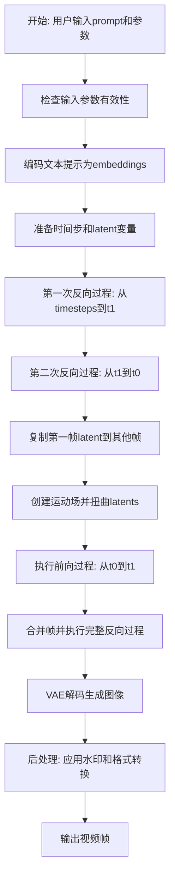
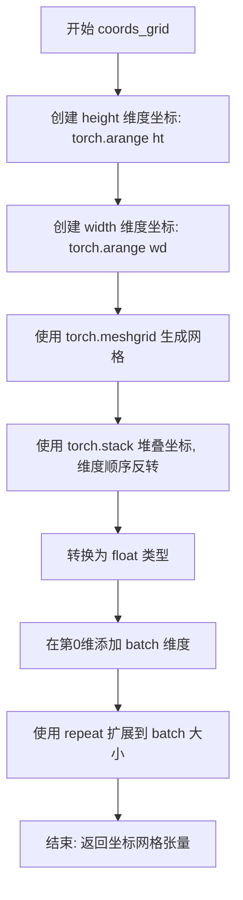
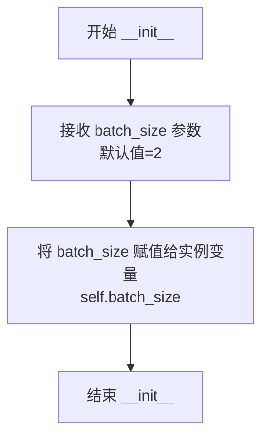
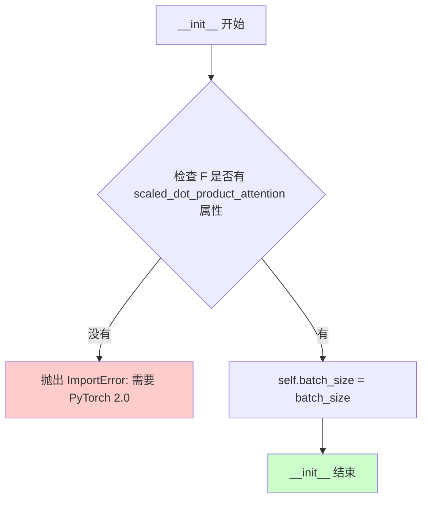
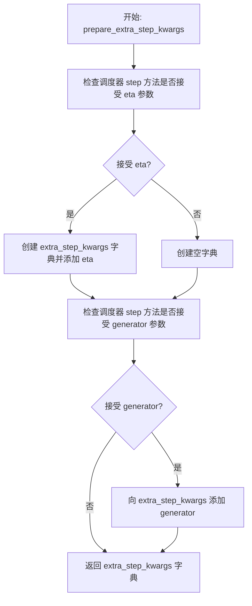
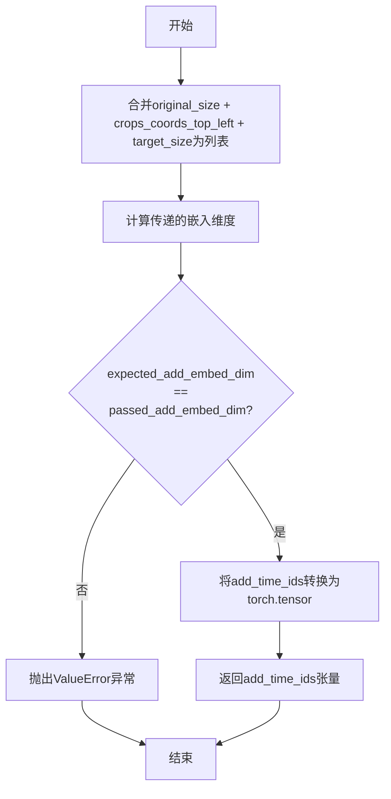
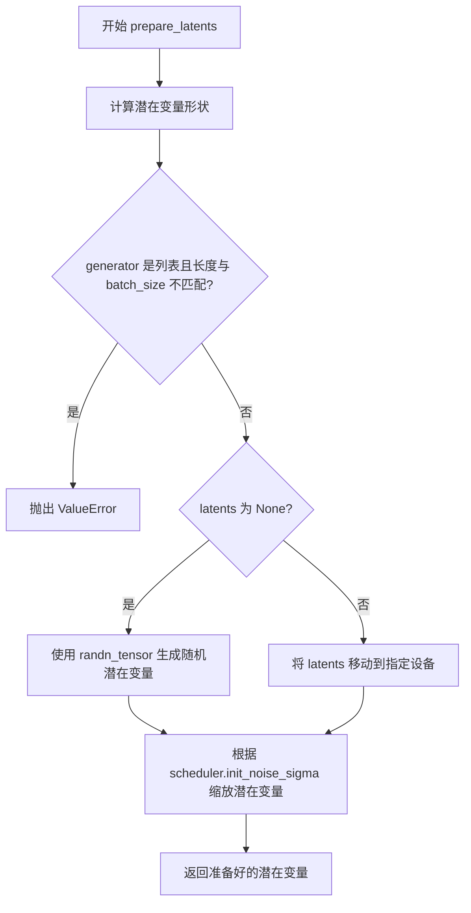
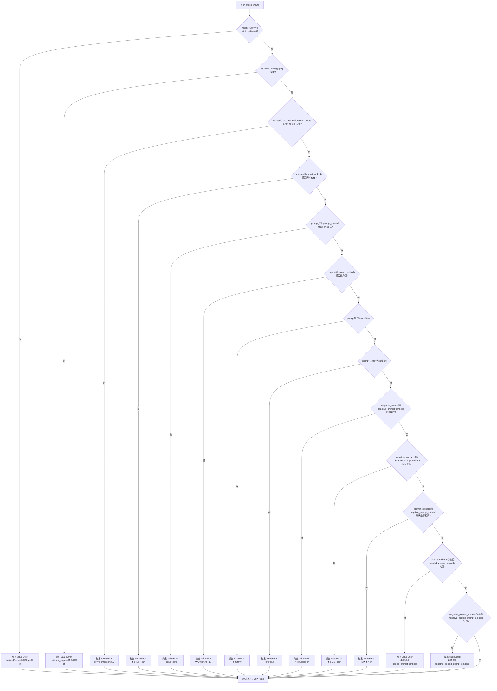

# `diffusers\src\diffusers\pipelines\text_to_video_synthesis\pipeline_text_to_video_zero_sdxl.py` 详细设计文档

这是一个基于Stable Diffusion XL的零样本文本到视频生成管道，通过跨帧注意力机制和运动场传播实现视频生成。该管道利用扩散模型的双向处理（向前和向后过程），结合时间步长调度和运动场扭曲技术，从文本提示生成连续的视频帧。

## 整体流程



## 类结构

```
TextToVideoZeroSDXLPipeline (主管道类)
├── DeprecatedPipelineMixin (弃用混入)
├── DiffusionPipeline (扩散管道基类)
├── StableDiffusionMixin (SD混入)
├── StableDiffusionXLLoraLoaderMixin (SDXL LoRA加载混入)
├── TextualInversionLoaderMixin (文本反转加载混入)
│
├── CrossFrameAttnProcessor (跨帧注意力处理器)
├── CrossFrameAttnProcessor2_0 (跨帧注意力处理器2.0)
│
└── TextToVideoSDXLPipelineOutput (输出数据类)
```

## 全局变量及字段


### `XLA_AVAILABLE`
    
XLA是否可用

类型：`bool`
    


### `logger`
    
日志记录器

类型：`logging.Logger`
    


### `_last_supported_version`
    
最后支持的版本

类型：`str`
    


### `CrossFrameAttnProcessor.batch_size`
    
批处理大小

类型：`int`
    


### `CrossFrameAttnProcessor2_0.batch_size`
    
批处理大小

类型：`int`
    


### `TextToVideoSDXLPipelineOutput.images`
    
生成的图像列表

类型：`list[PIL.Image.Image] | np.ndarray`
    


### `TextToVideoZeroSDXLPipeline.vae`
    
VAE模型

类型：`AutoencoderKL`
    


### `TextToVideoZeroSDXLPipeline.text_encoder`
    
文本编码器

类型：`CLIPTextModel`
    


### `TextToVideoZeroSDXLPipeline.text_encoder_2`
    
第二个文本编码器

类型：`CLIPTextModelWithProjection`
    


### `TextToVideoZeroSDXLPipeline.tokenizer`
    
分词器

类型：`CLIPTokenizer`
    


### `TextToVideoZeroSDXLPipeline.tokenizer_2`
    
第二个分词器

类型：`CLIPTokenizer`
    


### `TextToVideoZeroSDXLPipeline.unet`
    
条件UNet

类型：`UNet2DConditionModel`
    


### `TextToVideoZeroSDXLPipeline.scheduler`
    
扩散调度器

类型：`KarrasDiffusionSchedulers`
    


### `TextToVideoZeroSDXLPipeline.image_encoder`
    
图像编码器

类型：`CLIPVisionModelWithProjection`
    


### `TextToVideoZeroSDXLPipeline.feature_extractor`
    
特征提取器

类型：`CLIPImageProcessor`
    


### `TextToVideoZeroSDXLPipeline.vae_scale_factor`
    
VAE缩放因子

类型：`int`
    


### `TextToVideoZeroSDXLPipeline.image_processor`
    
图像处理器

类型：`VaeImageProcessor`
    


### `TextToVideoZeroSDXLPipeline.default_sample_size`
    
默认采样尺寸

类型：`int`
    


### `TextToVideoZeroSDXLPipeline.watermark`
    
水印处理器

类型：`StableDiffusionXLWatermarker`
    
    

## 全局函数及方法


### rearrange_0

该函数是一个全局工具函数，用于将输入的5维张量重新排列维度，将帧维度分割以便进行跨帧注意力处理。具体来说，它将形状为 (F, C, H, W) 的张量转换为 (F//f, C, f, H, W) 的形式，其中 f 是帧分割数。

参数：

- `tensor`：`torch.Tensor`，输入的张量，形状为 (F, C, H, W)，其中 F 是帧数，C 是通道数，H 是高度，W 是宽度
- `f`：`int`，帧分割数，用于将 F 分割成多个组

返回值：`torch.Tensor`，重新排列后的张量，形状为 (F//f, C, f, H, W)

#### 流程图

```mermaid
flowchart TD
    A[输入张量 tensor] --> B[获取维度 F, C, H, W]
    B --> C{检查 F 是否能被 f 整除}
    C -->|是| D[reshape 为 (F//f, f, C, H, W)]
    C -->|否| E[抛出错误或返回异常]
    D --> F[permute 维度为 (0, 2, 1, 3, 4)]
    F --> G[输出张量 (F//f, C, f, H, W)]
```

#### 带注释源码

```python
# Copied from diffusers.pipelines.text_to_video_synthesis.pipeline_text_to_video_zero.rearrange_0
def rearrange_0(tensor, f):
    """
    重新排列张量维度，用于跨帧注意力处理
    
    Args:
        tensor: 输入张量，形状为 (F, C, H, W)
        f: 帧分割数，将 F 分割成 f 个组
    
    Returns:
        重新排列后的张量，形状为 (F//f, C, f, H, W)
    """
    # 获取输入张量的各维度大小
    # F: 帧数, C: 通道数, H: 高度, W: 宽度
    F, C, H, W = tensor.size()
    
    # 使用 torch.reshape 将张量从 (F, C, H, W) 变形为 (F//f, f, C, H, W)
    # 这将 F 维度分割成 F//f 个组，每组 f 帧
    # 然后使用 torch.permute 重新排列维度顺序
    # 从 (F//f, f, C, H, W) 变为 (F//f, C, f, H, W)
    tensor = torch.permute(torch.reshape(tensor, (F // f, f, C, H, W)), (0, 2, 1, 3, 4))
    
    return tensor
```


### `rearrange_1`

该函数用于将五维张量（批次、通道、帧、高度、宽度）的维度重新排列，将帧维度合并到批次维度中，以便于后续的视频帧处理和注意力计算。

参数：

-  `tensor`：`torch.Tensor`，输入的五维张量，形状为 (B, C, F, H, W)，其中 B 是批次大小，C 是通道数，F 是帧数，H 是高度，W 是宽度

返回值：`torch.Tensor`，重塑后的四维张量，形状为 (B * F, C, H, W)，其中帧维度被合并到批次维度中

#### 流程图

```mermaid
flowchart TD
    A[输入 tensor: 形状 (B, C, F, H, W)] --> B[获取维度 B, C, F, H, W]
    B --> C[torch.permute tensor 从 (0, 1, 2, 3, 4) 到 (0, 2, 1, 3, 4)]
    C --> D[结果形状变为 (B, F, C, H, W)]
    D --> E[torch.reshape 到 (B * F, C, H, W)]
    E --> F[输出 tensor: 形状 (B * F, C, H, W)]
```

#### 带注释源码

```
def rearrange_1(tensor):
    """
    Rearrange tensor by moving frame dimension to batch dimension.
    
    This function transforms a 5D tensor (B, C, F, H, W) into a 4D tensor (B*F, C, H, W)
    by transposing and reshaping. This is typically used in video processing to flatten
    the frame dimension into the batch dimension for attention computation.
    
    Args:
        tensor: Input tensor of shape (B, C, F, H, W)
        
    Returns:
        Reshaped tensor of shape (B * F, C, H, W)
    """
    # 解包获取各个维度的值
    # B: batch size, C: channels, F: frames, H: height, W: width
    B, C, F, H, W = tensor.size()
    
    # 首先对张量进行维度重排，将帧维度F移动到批次维度之后
    # 原始: (B, C, F, H, W) -> 变换后: (B, F, C, H, W)
    # permute(0, 2, 1, 3, 4) 表示:
    #   - 0: 保持原来的 batch 维度在第一位
    #   - 2: 将原来的 frame 维度移到第二位
    #   - 1: 将原来的 channel 维度移到第三位
    #   - 3: 保持原来的 height 维度在第四位
    #   - 4: 保持原来的 width 维度在第五位
    permuted_tensor = torch.permute(tensor, (0, 2, 1, 3, 4))
    
    # 将重排后的张量 reshape 为 4D 张量
    # 从 (B, F, C, H, W) 变形为 (B*F, C, H, W)
    # 这样每一帧都被视为批次中的一个独立样本
    # 常用于 Cross Frame Attention 中以便并行处理所有帧
    return torch.reshape(permuted_tensor, (B * F, C, H, W))
```


### `rearrange_3`

该函数用于将张量从形状 (F, D, C) 重塑为 (F // f, f, D, C)，以便在跨帧注意力机制中对帧进行索引操作。通过将帧维度分割成批次维度和帧维度，使得可以方便地从每个批次中选取第一帧作为参考。

参数：

-  `tensor`：`torch.Tensor`，输入张量，形状为 (F, D, C)，其中 F 是帧数，D 是特征维度，C 是通道数
-  `f`：`int`，分割因子，通常等于视频帧数，用于将 F 维度分割为 (F // f, f)

返回值：`torch.Tensor`，重塑后的张量，形状为 (F // f, f, D, C)

#### 流程图

```mermaid
flowchart TD
    A[输入 tensor 形状: (F, D, C)] --> B[获取 tensor.size]
    B --> C[解包得到 F, D, C]
    C --> D[调用 torch.reshape]
    D --> E[输出 tensor 形状: (F // f, f, D, C)]
    
    style A fill:#e1f5fe
    style E fill:#e8f5e8
```

#### 带注释源码

```python
def rearrange_3(tensor, f):
    """
    将输入张量从形状 (F, D, C) 重塑为 (F // f, f, D, C)。
    用于跨帧注意力处理中，将帧维度分割为批次维度和帧维度。

    Args:
        tensor: 输入张量，形状为 (F, D, C)
        f: 分割因子，通常为视频帧数

    Returns:
        重塑后的张量，形状为 (F // f, f, D, C)
    """
    # 获取张量的三个维度：F=帧数, D=特征维度, C=通道数
    F, D, C = tensor.size()
    
    # 使用 torch.reshape 重塑张量
    # 从 (F, D, C) -> (F // f, f, D, C)
    # 这样可以将帧维度分割成两部分，便于后续按帧索引
    return torch.reshape(tensor, (F // f, f, D, C))
```


### rearrange_4

该函数是一个张量重排工具函数，用于将形状为 (B, F, D, C) 的4维张量重新整形为 (B*F, D, C) 的3维张量，常用于视频帧处理中，将批次和帧维度合并以便于后续的交叉帧注意力计算。

参数：

- `tensor`：`torch.Tensor`，输入的4维张量，形状为 (B, F, D, C)，其中 B 表示批次大小，F 表示帧数，D 表示特征维度，C 表示通道数

返回值：`torch.Tensor`，重新整形后的3维张量，形状为 (B * F, D, C)

#### 流程图

```mermaid
flowchart TD
    A[开始: 输入 tensor] --> B[获取 tensor 的形状]
    B --> C{解析形状}
    C --> D[提取 B = 批次大小]
    C --> E[提取 F = 帧数]
    C --> F[提取 D = 特征维度]
    C --> G[提取 C = 通道数]
    D --> H[计算新形状: (B * F, D, C)]
    E --> H
    F --> H
    G --> H
    H --> I[调用 torch.reshape 重新整形]
    I --> J[返回重塑后的张量]
```

#### 带注释源码

```python
def rearrange_4(tensor):
    """
    将形状为 (B, F, D, C) 的4维张量重新整形为 (B*F, D, C) 的3维张量。
    该函数通常与 rearrange_3 配合使用，用于交叉帧注意力机制中，
    在提取第一帧的键/值后恢复原始形状。
    
    参数:
        tensor: 输入张量，形状为 (B, F, D, C)
            - B: 批次大小
            - F: 帧数
            - D: 特征维度
            - C: 通道数
    
    返回:
        重新整形后的张量，形状为 (B*F, D, C)
    """
    # 获取输入张量的形状并解包为四个维度
    B, F, D, C = tensor.size()
    
    # 使用 torch.reshape 将张量从 (B, F, D, C) 重新整形为 (B*F, D, C)
    # 这相当于将批次维度和帧维度合并，所有帧平铺在一起
    return torch.reshape(tensor, (B * F, D, C))
```


### `coords_grid`

生成用于图像坐标映射的网格张量，常用于光流 warp 操作和图像变换场景。

参数：

- `batch`：`int`，表示批次大小（batch size）
- `ht`：`int`，表示图像高度（height）
- `wd`：`int`，表示图像宽度（width）
- `device`：`torch.device`，表示张量存放的设备

返回值：`torch.Tensor`，返回形状为 `[batch, 2, ht, wd]` 的坐标网格张量，包含高度和宽度的坐标值（未归一化）。

#### 流程图



#### 带注释源码

```python
# Copied from diffusers.pipelines.text_to_video_synthesis.pipeline_text_to_video_zero.coords_grid
def coords_grid(batch, ht, wd, device):
    """
    生成坐标网格张量，用于图像坐标映射
    
    参数:
        batch: 批次大小
        ht: 图像高度
        wd: 图像宽度
        device: 计算设备
    
    返回:
        形状为 [batch, 2, ht, wd] 的坐标张量
    """
    # Adapted from https://github.com/princeton-vl/RAFT/blob/master/core/utils/utils.py
    
    # 使用 torch.meshgrid 生成二维坐标网格
    # torch.arange(ht) 生成 [0, 1, 2, ..., ht-1]
    # torch.arange(wd) 生成 [0, 1, 2, ..., wd-1]
    # meshgrid 会生成两个矩阵：一个包含所有行的列索引，一个包含所有列的行索引
    coords = torch.meshgrid(torch.arange(ht, device=device), torch.arange(wd, device=device))
    
    # coords[::-1] 逆转列表顺序，将 [行坐标, 列坐标] 变为 [列坐标, 行坐标]
    # torch.stack 在新维度 dim=0 堆叠，形成 [2, ht, wd] 形状
    # 这样 coords[0] 是宽度方向坐标(X), coords[1] 是高度方向坐标(Y)
    coords = torch.stack(coords[::-1], dim=0).float()
    
    # coords[None] 在第0维添加一个维度，从 [2, ht, wd] 变为 [1, 2, ht, wd]
    # .repeat(batch, 1, 1, 1) 在第0维重复 batch 次，形成 [batch, 2, ht, wd]
    # 这样每个 batch 都有相同的坐标网格
    return coords[None].repeat(batch, 1, 1, 1)
```


### `warp_single_latent`

该函数通过给定的光流场（reference_flow）对单个帧的潜在表示（latent）进行空间变形（warping），生成变形后的潜在表示。它首先创建坐标网格，将光流加到坐标上，归一化到 [-1, 1] 区间，然后使用 `grid_sample` 函数根据变形后的坐标从原始潜在表示中采样，生成新的潜在表示。

参数：

- `latent`：`torch.Tensor`，单帧的潜在表示（latent code），通常由 VAE 编码得到。
- `reference_flow`：`torch.Tensor`，光流场，表示每个像素的位移量，形状为 `(1, 2, H, W)`。

返回值：`torch.Tensor`，变形后的潜在表示。

#### 流程图

```mermaid
graph TD
    A[Start warp_single_latent] --> B[Get dimensions H, W from reference_flow]
    B --> C[Get dimensions h, w from latent]
    C --> D[Create coordinate grid: coords0]
    D --> E[Add reference_flow to coords0: coords_t0 = coords0 + reference_flow]
    E --> F[Normalize coordinates: divide by W and H]
    F --> G[Scale coordinates to [-1, 1]: coords_t0 = coords_t0 * 2.0 - 1.0]
    G --> H[Interpolate coords to size (h, w)]
    H --> I[Permute coords to (batch, height, width, channels)]
    I --> J[Grid Sample: warped = grid_sample(latent, coords_t0)]
    J --> K[Return warped latent]
```

#### 带注释源码

```python
def warp_single_latent(latent, reference_flow):
    """
    Warp latent of a single frame with given flow

    Args:
        latent: latent code of a single frame
        reference_flow: flow which to warp the latent with

    Returns:
        warped: warped latent
    """
    # 获取光流场的空间维度 H, W
    _, _, H, W = reference_flow.size()
    # 获取潜在表示的空间维度 h, w
    _, _, h, w = latent.size()
    
    # 创建一个归一化的坐标网格，范围在 [0, 1] 之间
    # coords_grid 生成的坐标原点在左上角，x 轴向右，y 轴向下
    coords0 = coords_grid(1, H, W, device=latent.device).to(latent.dtype)

    # 将光流场加到坐标上，得到变形后的坐标
    coords_t0 = coords0 + reference_flow
    
    # 归一化坐标，将其缩放到 [0, 1] 范围
    # x 坐标除以宽度 W，y 坐标除以高度 H
    coords_t0[:, 0] /= W
    coords_t0[:, 1] /= H

    # 将坐标变换到 [-1, 1] 范围，以符合 grid_sample 的输入要求
    coords_t0 = coords_t0 * 2.0 - 1.0
    
    # 使用双线性插值将坐标网格调整到与潜在表示相同的大小 (h, w)
    coords_t0 = F.interpolate(coords_t0, size=(h, w), mode="bilinear")
    
    # 调整坐标张量的维度顺序，从 (batch, channel, height, width) 变为 (batch, height, width, channel)
    # 以符合 grid_sample 函数对坐标格式的要求
    coords_t0 = torch.permute(coords_t0, (0, 2, 3, 1))

    # 使用 grid_sample 函数根据变形后的坐标网格从潜在表示中采样
    # mode="nearest" 使用最近邻插值（虽然函数名是 nearest，但这里实际用于双线性插值的坐标查找）
    # padding_mode="reflection" 使用反射填充边界
    warped = grid_sample(latent, coords_t0, mode="nearest", padding_mode="reflection")
    return warped
```


### `create_motion_field`

该函数用于根据给定的运动强度和帧索引创建平移运动场（translation motion field），返回一个形状为 `(seq_length, 2, 512, 512)` 的张量，表示每帧在 X 和 Y 轴上的光流偏移量。

参数：

- `motion_field_strength_x`：`float`，沿 X 轴的运动强度
- `motion_field_strength_y`：`float`，沿 Y 轴的运动强度
- `frame_ids`：`list[int]`，正在处理的帧的索引列表，用于分块推理时标识帧序号
- `device`：`torch.device`，计算设备
- `dtype`：`torch.dtype`，数据类型

返回值：`torch.Tensor`，形状为 `(seq_length, 2, 512, 512)` 的参考光流张量，第一维为帧数，第二维的 0 通道表示 X 轴偏移，1 通道表示 Y 轴偏移

#### 流程图

```mermaid
flowchart TD
    A[开始] --> B[获取frame_ids长度作为seq_length]
    B --> C[创建形状为seq_length×2×512×512的零张量]
    C --> D{遍历帧索引: fr_idx in range(seq_length)}
    D -->|第fr_idx帧| E[设置reference_flow[fr_idx, 0, :, :] = motion_field_strength_x × frame_ids[fr_idx]]
    E --> F[设置reference_flow[fr_idx, 1, :, :] = motion_field_strength_y × frame_ids[fr_idx]]
    F --> D
    D -->|循环结束| G[返回reference_flow张量]
    G --> H[结束]
```

#### 带注释源码

```python
def create_motion_field(motion_field_strength_x, motion_field_strength_y, frame_ids, device, dtype):
    """
    Create translation motion field

    Args:
        motion_field_strength_x: motion strength along x-axis
        motion_field_strength_y: motion strength along y-axis
        frame_ids: indexes of the frames the latents of which are being processed.
            This is needed when we perform chunk-by-chunk inference
        device: device
        dtype: dtype

    Returns:
        reference_flow: translation motion field tensor of shape (seq_length, 2, 512, 512)
    """
    # 获取帧序列长度
    seq_length = len(frame_ids)
    
    # 初始化形状为 (帧数, 2, 512, 512) 的零张量
    # 维度2分别代表X轴和Y轴的光流分量，512×512为空间分辨率
    reference_flow = torch.zeros((seq_length, 2, 512, 512), device=device, dtype=dtype)
    
    # 遍历每个帧索引，根据帧序号和运动强度计算光流偏移量
    for fr_idx in range(seq_length):
        # X轴方向偏移：运动强度 × 当前帧的索引值
        reference_flow[fr_idx, 0, :, :] = motion_field_strength_x * (frame_ids[fr_idx])
        # Y轴方向偏移：运动强度 × 当前帧的索引值
        reference_flow[fr_idx, 1, :, :] = motion_field_strength_y * (frame_ids[fr_idx])
    
    # 返回计算得到的参考光流场
    return reference_flow
```


### `create_motion_field_and_warp_latents`

该函数用于创建翻译运动场（translation motion field），并根据运动场对输入的潜在表示（latents）进行变形处理，生成具有运动效果的扭曲潜在表示。

参数：

- `motion_field_strength_x`：`float`，沿 x 轴的运动强度
- `motion_field_strength_y`：`float`，沿 y 轴的运动强度
- `frame_ids`：`list[int]`，正在处理的帧索引列表，用于分块推理时的帧索引
- `latents`：`torch.Tensor`，帧的潜在编码张量

返回值：`torch.Tensor`，变形后的潜在表示

#### 流程图

```mermaid
flowchart TD
    A[开始] --> B[调用 create_motion_field 创建运动场]
    B --> C[获取 latents 设备和张量类型]
    B --> D[创建运动场: shape (seq_length, 2, 512, 512)]
    D --> E[克隆并detach latents]
    E --> F{遍历帧 i < len(latents)}
    F -->|是| G[调用 warp_single_latent 对单帧进行变形]
    G --> H[将变形结果存回 warped_latents[i]]
    H --> F
    F -->|否| I[返回 warped_latents]
    I --> J[结束]
```

#### 带注释源码

```python
# Copied from diffusers.pipelines.text_to_video_synthesis.pipeline_text_to_video_zero.create_motion_field_and_warp_latents
def create_motion_field_and_warp_latents(motion_field_strength_x, motion_field_strength_y, frame_ids, latents):
    """
    Creates translation motion and warps the latents accordingly

    Args:
        motion_field_strength_x: motion strength along x-axis
        motion_field_strength_y: motion strength along y-axis
        frame_ids: indexes of the frames the latents of which are being processed.
            This is needed when we perform chunk-by-chunk inference
        latents: latent codes of frames

    Returns:
        warped_latents: warped latents
    """
    # 调用 create_motion_field 函数，根据运动强度和帧ID生成运动场
    motion_field = create_motion_field(
        motion_field_strength_x=motion_field_strength_x,
        motion_field_strength_y=motion_field_strength_y,
        frame_ids=frame_ids,
        device=latents.device,  # 使用 latents 的设备
        dtype=latents.dtype,    # 使用 latents 的数据类型
    )
    
    # 克隆 latents 并分离计算图，避免修改原始数据
    warped_latents = latents.clone().detach()
    
    # 遍历每个帧，对每个帧单独进行变形处理
    for i in range(len(warped_latents)):
        # 使用 warp_single_latent 函数对单个帧进行变形
        # latents[i][None] 和 motion_field[i][None] 用于添加批次维度
        warped_latents[i] = warp_single_latent(latents[i][None], motion_field[i][None])
    
    # 返回变形后的所有帧的潜在表示
    return warped_latents
```


### `rescale_noise_cfg`

该函数用于根据 guidance_rescale 参数重新缩放噪声预测张量，以提高图像质量并修复过度曝光问题。基于 Common Diffusion Noise Schedules and Sample Steps are Flawed 论文第 3.4 节的理论，通过计算噪声预测的标准差进行缩放，并与原始预测进行混合。

参数：

- `noise_cfg`：`torch.Tensor`，引导扩散过程预测的噪声张量
- `noise_pred_text`：`torch.Tensor`，文本引导扩散过程预测的噪声张量
- `guidance_rescale`：`float`，可选，默认为 0.0，应用于噪声预测的重新缩放因子

返回值：`torch.Tensor`，重新缩放后的噪声预测张量

#### 流程图

```mermaid
flowchart TD
    A[开始] --> B[计算 noise_pred_text 的标准差 std_text]
    B --> C[计算 noise_cfg 的标准差 std_cfg]
    C --> D[计算缩放后的噪声预测 noise_pred_rescaled = noise_cfg * std_text / std_cfg]
    D --> E[混合原始和缩放后的预测 noise_cfg = guidance_rescale * noise_pred_rescaled + (1 - guidance_rescale) * noise_cfg]
    E --> F[返回重新缩放的 noise_cfg]
```

#### 带注释源码

```python
def rescale_noise_cfg(noise_cfg, noise_pred_text, guidance_rescale=0.0):
    r"""
    Rescales `noise_cfg` tensor based on `guidance_rescale` to improve image quality and fix overexposure. Based on
    Section 3.4 from [Common Diffusion Noise Schedules and Sample Steps are
    Flawed](https://huggingface.co/papers/2305.08891).

    Args:
        noise_cfg (`torch.Tensor`):
            The predicted noise tensor for the guided diffusion process.
        noise_pred_text (`torch.Tensor`):
            The predicted noise tensor for the text-guided diffusion process.
        guidance_rescale (`float`, *optional*, defaults to 0.0):
            A rescale factor applied to the noise predictions.

    Returns:
        noise_cfg (`torch.Tensor`): The rescaled noise prediction tensor.
    """
    # 计算文本引导噪声预测的标准差（保留维度用于后续广播）
    std_text = noise_pred_text.std(dim=list(range(1, noise_pred_text.ndim)), keepdim=True)
    # 计算引导噪声预测的标准差（保留维度用于后续广播）
    std_cfg = noise_cfg.std(dim=list(range(1, noise_cfg.ndim)), keepdim=True)
    
    # 重新缩放引导结果以修复过度曝光问题
    # 公式：noise_pred_rescaled = noise_cfg * (std_text / std_cfg)
    noise_pred_rescaled = noise_cfg * (std_text / std_cfg)
    
    # 通过 guidance_rescale 因子混合原始引导结果，避免图像看起来"平淡"
    # 当 guidance_rescale=0 时，返回原始 noise_cfg
    # 当 guidance_rescale=1 时，返回完全缩放的 noise_pred_rescaled
    noise_cfg = guidance_rescale * noise_pred_rescaled + (1 - guidance_rescale) * noise_cfg
    
    return noise_cfg
```


### `CrossFrameAttnProcessor.__init__`

CrossFrameAttnProcessor 类的初始化方法，用于设置跨帧注意力处理器的批次大小参数。

参数：

- `batch_size`：`int`，表示实际的批次大小（不包括帧数）。例如，当使用单个提示词和 `num_images_per_prompt=1` 调用 unet 时，`batch_size` 应该等于 2，因为有分类器-free 引导。默认值为 2。

返回值：`None`，无返回值（构造函数）。

#### 流程图



#### 带注释源码

```python
def __init__(self, batch_size=2):
    """
    初始化 CrossFrameAttnProcessor。

    Args:
        batch_size: The number that represents actual batch size, other than the frames.
            For example, calling unet with a single prompt and num_images_per_prompt=1, batch_size should be equal to
            2, due to classifier-free guidance.
    """
    # 将传入的 batch_size 参数存储为实例变量，供后续 __call__ 方法中使用
    # 这个值用于计算视频帧数：video_length = key.size()[0] // self.batch_size
    self.batch_size = batch_size
```


### `CrossFrameAttnProcessor.__call__`

实现跨帧注意力机制，使每个帧都关注第一帧，从而在视频生成过程中保持时间一致性。

参数：

-  `self`：`CrossFrameAttnProcessor` 实例，隐式参数，表示注意力处理器自身
-  `attn`：`torch.nn.Module`，注意力模块（Attention），用于执行查询、键、值的线性变换以及注意力分数计算
-  `hidden_states`：`torch.Tensor`，隐藏状态张量，形状为 `(batch_size, sequence_length, hidden_dim)`，是需要计算注意力的输入
-  `encoder_hidden_states`：`torch.Tensor` 或 `None`，编码器隐藏状态，用于跨注意力计算；如果为 `None`，则执行自注意力
-  `attention_mask`：`torch.Tensor` 或 `None`，注意力掩码，用于掩盖无效的注意力位置

返回值：`torch.Tensor`，经过跨帧注意力处理后的隐藏状态，形状与输入 `hidden_states` 相同

#### 流程图

```mermaid
flowchart TD
    A[开始 __call__] --> B[获取 batch_size 和 sequence_length]
    B --> C[调用 attn.prepare_attention_mask 准备注意力掩码]
    C --> D[使用 attn.to_q 将 hidden_states 转换为查询向量 query]
    D --> E{encoder_hidden_states 是否为 None?}
    E -->|是| F[将 hidden_states 赋值给 encoder_hidden_states]
    E -->|否| G{attn.norm_cross 是否存在?}
    G -->|是| H[调用 attn.norm_encoder_hidden_states 归一化 encoder_hidden_states]
    G -->|否| I[保持 encoder_hidden_states 不变]
    F --> J[使用 attn.to_k 和 attn.to_v 获取 key 和 value]
    H --> J
    I --> J
    J --> K{是否为跨注意力?}
    K -->|是| L[直接使用原始 key 和 value]
    K -->|否| M[执行跨帧注意力处理]
    M --> N[计算 video_length = key.size(0) // batch_size]
    N --> O[创建 first_frame_index 列表, 所有元素为 0]
    O --> P[使用 rearrange_3 重新排列 key, 按帧分组]
    P --> Q[key = key[:, first_frame_index] 选取第一帧]
    Q --> R[使用 rearrange_3 重新排列 value, 按帧分组]
    R --> S[value = value[:, first_frame_index] 选取第一帧]
    S --> T[使用 rearrange_4 恢复原始形状]
    T --> L
    L --> U[将 query, key, value 转换到 batch 维度]
    U --> V[调用 attn.get_attention_scores 计算注意力概率]
    V --> W[使用 torch.bmm 计算注意力输出]
    W --> X[调用 attn.batch_to_head_dim 恢复维度]
    X --> Y[应用 attn.to_out[0] 线性投影]
    Y --> Z[应用 attn.to_out[1] Dropout]
    Z --> AA[返回处理后的 hidden_states]
```

#### 带注释源码

```python
def __call__(self, attn, hidden_states, encoder_hidden_states=None, attention_mask=None):
    """
    Cross frame attention processor. Each frame attends the first frame.
    
    Args:
        attn: Attention module
        hidden_states: Hidden states to compute attention on
        encoder_hidden_states: Optional encoder hidden states for cross attention
        attention_mask: Optional attention mask
    
    Returns:
        Processed hidden states after cross frame attention
    """
    # 获取隐藏状态的批量大小和序列长度
    batch_size, sequence_length, _ = hidden_states.shape
    
    # 准备注意力掩码，处理批量维度和注意力掩码的兼容性
    attention_mask = attn.prepare_attention_mask(attention_mask, sequence_length, batch_size)
    
    # 使用注意力模块的 to_q 层将 hidden_states 转换为查询向量 query
    query = attn.to_q(hidden_states)

    # 判断是否为跨注意力模式
    is_cross_attention = encoder_hidden_states is not None
    
    # 如果没有提供 encoder_hidden_states，则使用 hidden_states 本身（自注意力）
    if encoder_hidden_states is None:
        encoder_hidden_states = hidden_states
    # 如果存在归一化层，则对 encoder_hidden_states 进行归一化处理
    elif attn.norm_cross:
        encoder_hidden_states = attn.norm_encoder_hidden_states(encoder_hidden_states)

    # 使用注意力模块的 to_k 和 to_v 层分别计算键和值
    key = attn.to_k(encoder_hidden_states)
    value = attn.to_v(encoder_hidden_states)

    # Cross Frame Attention: 如果不是跨注意力（即自注意力），则执行跨帧处理
    if not is_cross_attention:
        # 计算视频帧数量：key 的第一维大小除以批量大小
        video_length = key.size()[0] // self.batch_size
        
        # 创建第一帧索引列表，所有索引都指向第一帧（索引为0）
        first_frame_index = [0] * video_length

        # rearrange keys to have batch and frames in the 1st and 2nd dims respectively
        # 使用 rearrange_3 将 key 重新排列，使批量和帧维度分离
        key = rearrange_3(key, video_length)
        # 选取所有帧的第一帧键值
        key = key[:, first_frame_index]
        
        # rearrange values to have batch and frames in the 1st and 2nd dims respectively
        # 使用 rearrange_3 将 value 重新排列，使批量和帧维度分离
        value = rearrange_3(value, video_length)
        # 选取所有帧的第一帧值
        value = value[:, first_frame_index]

        # rearrange back to original shape
        # 使用 rearrange_4 将 key 和 value 恢复原始形状
        key = rearrange_4(key)
        value = rearrange_4(value)

    # 将查询、键、值从隐藏维度转换到批量维度（多头注意力格式）
    query = attn.head_to_batch_dim(query)
    key = attn.head_to_batch_dim(key)
    value = attn.head_to_batch_dim(value)

    # 计算注意力分数并获取注意力概率
    attention_probs = attn.get_attention_scores(query, key, attention_mask)
    
    # 使用批量矩阵乘法计算注意力输出：将注意力概率与值相乘
    hidden_states = torch.bmm(attention_probs, value)
    
    # 将输出从批量维度转换回隐藏维度
    hidden_states = attn.batch_to_head_dim(hidden_states)

    # linear proj: 应用输出线性投影层
    hidden_states = attn.to_out[0](hidden_states)
    
    # dropout: 应用 Dropout 层
    hidden_states = attn.to_out[1](hidden_states)

    return hidden_states
```


### `CrossFrameAttnProcessor2_0.__init__`

初始化 CrossFrameAttnProcessor2_0 类的实例，用于处理跨帧注意力，依赖于 PyTorch 2.0 的 scaled_dot_product_attention 功能。该处理器用于文本到视频生成任务中，让每一帧都关注第一帧的信息。

参数：

- `self`：隐式参数，表示类的实例本身
- `batch_size`：`int`，默认值 2，表示实际批大小（不包括帧数）。例如，使用单个提示词且 num_images_per_prompt=1 时，由于无分类器自由引导，batch_size 应设为 2

返回值：`None`，构造函数不返回任何值

#### 流程图



#### 带注释源码

```python
def __init__(self, batch_size=2):
    # 检查当前 PyTorch 版本是否支持 scaled_dot_product_attention
    # 这是 PyTorch 2.0 引入的高效注意力机制
    if not hasattr(F, "scaled_dot_product_attention"):
        # 如果不支持，抛出导入错误，提示用户升级 PyTorch
        raise ImportError("AttnProcessor2_0 requires PyTorch 2.0, to use it, please upgrade PyTorch to 2.0.")
    
    # 设置实例变量 batch_size，用于后续跨帧注意力计算
    # 该值表示实际的批大小，不包括帧维度
    # 在 classifier-free guidance 场景下，默认值为 2（条件和非条件各一个）
    self.batch_size = batch_size
```


### CrossFrameAttnProcessor2_0.__call__

该方法是 CrossFrameAttnProcessor2_0 类的调用接口，实现了基于 PyTorch 2.0 的 Scaled Dot-Product Attention 的跨帧注意力处理器。其核心功能是让视频或序列中的每一帧都attend到第一帧，从而在时序建模中保持与首帧的一致性。

参数：

- `self`：`CrossFrameAttnProcessor2_0` 实例本身，包含 `batch_size` 属性用于区分实际批次大小（考虑 CFG）。
- `attn`：`torch.nn.Module`，注意力机制对象，通常是 `Attention` 类实例，提供 `to_q`、`to_k`、`to_v`、`head_to_batch_dim`、`batch_to_head_dim`、`get_attention_scores`、`prepare_attention_mask` 等方法，以及 `to_out`（包含线性投影和 Dropout 层）、`heads`、`norm_cross`、`norm_encoder_hidden_states` 等属性。
- `hidden_states`：`torch.Tensor`，形状为 `(batch_size, sequence_length, hidden_dim)` 的隐藏状态，是注意力计算的查询（Query）来源。
- `encoder_hidden_states`：`torch.Tensor` 或 `None`，编码器隐藏状态。如果为 `None`，则使用 `hidden_states` 本身作为键（Key）和值（Value）的来源（即自注意力）。如果不为 `None`，则执行交叉注意力。
- `attention_mask`：`torch.Tensor` 或 `None`，注意力掩码，用于屏蔽某些位置的联系。

返回值：`torch.Tensor`，经过注意力计算和输出投影后的隐藏状态，形状与输入 `hidden_states` 相同 `（batch_size, sequence_length, hidden_dim）`。

#### 流程图

```mermaid
flowchart TD
    A[开始 __call__] --> B[获取 batch_size 和 sequence_length]
    B --> C{attention_mask 是否为 None?}
    C -->|否| D[准备注意力掩码并重塑形状]
    C -->|是| E[跳过掩码处理]
    D --> E
    E --> F[计算 Query: attn.to_q(hidden_states)]
    F --> G{encoder_hidden_states 是否为 None?}
    G -->|是| H[encoder_hidden_states = hidden_states]
    G -->|否| I{attn.norm_cross 是否为 True?}
    I -->|是| J[归一化 encoder_hidden_states]
    I -->|否| K[保持原样]
    H --> L
    J --> L
    K --> L
    L[计算 Key 和 Value: attn.to_k, attn.to_v]
    L --> M{是否为跨帧注意力? is_cross_attention}
    M -->|否| N[计算 video_length]
    M -->|是| R[跳过跨帧处理]
    N --> O[构建 first_frame_index]
    O --> P[重排 Key 和 Value 以分离批次和帧]
    P --> Q[只取第一帧的 Key 和 Value]
    Q --> S[重排回原始形状]
    S --> R
    R --> T[将 Query, Key, Value 转为多头格式]
    T --> U[调用 F.scaled_dot_product_attention]
    U --> V[重塑隐藏状态并转为查询 dtype]
    V --> W[线性投影: attn.to_out[0]]
    W --> X[Dropout: attn.to_out[1]]
    X --> Y[返回隐藏状态]
```

#### 带注释源码

```python
def __call__(self, attn, hidden_states, encoder_hidden_states=None, attention_mask=None):
    """
    处理跨帧注意力计算。

    参数:
        attn: Attention模块实例
        hidden_states: 输入的隐藏状态张量
        encoder_hidden_states: 编码器隐藏状态（用于cross-attention），可选
        attention_mask: 注意力掩码，可选

    返回:
        经过注意力处理后的隐藏状态
    """
    # 1. 确定批次大小和序列长度
    # 如果有encoder_hidden_states，使用其形状；否则使用hidden_states的形状
    batch_size, sequence_length, _ = (
        hidden_states.shape if encoder_hidden_states is None else encoder_hidden_states.shape
    )
    # 获取隐藏维度
    inner_dim = hidden_states.shape[-1]

    # 2. 处理注意力掩码（如果存在）
    if attention_mask is not None:
        # 准备注意力掩码以适配attention机制
        attention_mask = attn.prepare_attention_mask(attention_mask, sequence_length, batch_size)
        # scaled_dot_product_attention 期望的掩码形状为
        # (batch, heads, source_length, target_length)
        attention_mask = attention_mask.view(batch_size, attn.heads, -1, attention_mask.shape[-1])

    # 3. 计算Query
    query = attn.to_q(hidden_states)

    # 4. 判断是否为交叉注意力，并准备Key和Value
    is_cross_attention = encoder_hidden_states is not None
    if encoder_hidden_states is None:
        # 自注意力：使用hidden_states作为encoder_hidden_states
        encoder_hidden_states = hidden_states
    elif attn.norm_cross:
        # 如果需要，对encoder_hidden_states进行归一化处理
        encoder_hidden_states = attn.norm_encoder_hidden_states(encoder_hidden_states)

    # 5. 计算Key和Value
    key = attn.to_k(encoder_hidden_states)
    value = attn.to_v(encoder_hidden_states)

    # 6. 跨帧注意力处理（仅在自注意力模式下）
    # 如果不是交叉注意力，则执行跨帧处理，让所有帧都attend第一帧
    if not is_cross_attention:
        # 计算视频长度（帧数），使用max(1, ...)防止除零
        video_length = max(1, key.size()[0] // self.batch_size)
        # 创建第一帧索引列表，全部设为0
        first_frame_index = [0] * video_length

        # 重排keys以将批次和帧维度分离（第1和第2维度）
        key = rearrange_3(key, video_length)
        # 只保留第一帧的key
        key = key[:, first_frame_index]
        
        # 重排values以将批次和帧维度分离
        value = rearrange_3(value, video_length)
        # 只保留第一帧的value
        value = value[:, first_frame_index]

        # 重新排列回原始形状
        key = rearrange_4(key)
        value = rearrange_4(value)

    # 7. 将Query、Key、Value转换为多头注意力格式
    # 形状从 (batch, seq, dim) 变为 (batch, heads, seq, head_dim)
    head_dim = inner_dim // attn.heads
    query = query.view(batch_size, -1, attn.heads, head_dim).transpose(1, 2)
    key = key.view(batch_size, -1, attn.heads, head_dim).transpose(1, 2)
    value = value.view(batch_size, -1, attn.heads, head_dim).transpose(1, 2)

    # 8. 执行Scaled Dot-Product Attention
    # 输出形状为 (batch, num_heads, seq_len, head_dim)
    # 注意：当前版本PyTorch不支持attn.scale参数
    hidden_states = F.scaled_dot_product_attention(
        query, key, value, 
        attn_mask=attention_mask,  # 传入处理后的注意力掩码
        dropout_p=0.0,              # 注意力dropout概率
        is_causal=False             # 不使用因果掩码
    )

    # 9. 将输出从多头格式转回原始格式
    # 形状从 (batch, heads, seq, head_dim) 变为 (batch, seq, dim)
    hidden_states = hidden_states.transpose(1, 2).reshape(batch_size, -1, attn.heads * head_dim)
    # 转换为与query相同的数据类型
    hidden_states = hidden_states.to(query.dtype)

    # 10. 线性投影
    hidden_states = attn.to_out[0](hidden_states)
    # 11. Dropout
    hidden_states = attn.to_out[1](hidden_states)
    
    return hidden_states
```


### `TextToVideoZeroSDXLPipeline.__init__`

该方法是 `TextToVideoZeroSDXLPipeline` 类的构造函数，用于初始化零样本文本到视频生成管道。它接收所有必需的模型组件（如 VAE、文本编码器、UNet 等）以及可选参数，通过注册模块、配置参数、初始化图像处理器和水印处理器来设置管道的完整运行环境。

参数：

- `vae`：`AutoencoderKL`，Variational Auto-Encoder (VAE) 模型，用于在潜在表示和图像之间进行编码和解码
- `text_encoder`：`CLIPTextModel`，冻结的文本编码器，Stable Diffusion XL 使用 CLIP 的文本部分
- `text_encoder_2`：`CLIPTextModelWithProjection`，第二个冻结的文本编码器，使用 CLIP 的文本和池化部分
- `tokenizer`：`CLIPTokenizer`，第一个分词器，用于将文本转换为 token
- `tokenizer_2`：`CLIPTokenizer`，第二个分词器
- `unet`：`UNet2DConditionModel`，条件 U-Net 架构，用于对编码后的图像潜在表示进行去噪
- `scheduler`：`KarrasDiffusionSchedulers`，与 unet 结合使用的调度器，用于对编码后的图像潜在表示进行去噪
- `image_encoder`：`CLIPVisionModelWithProjection`（可选），CLIP 视觉编码器，用于编码图像
- `feature_extractor`：`CLIPImageProcessor`（可选），CLIP 图像处理器
- `force_zeros_for_empty_prompt`：`bool`（可选，默认为 True），当提示为空时是否强制为零
- `add_watermarker`：`bool | None`（可选），是否添加不可见水印

返回值：无（`None`），构造函数不返回任何值，仅初始化实例状态

#### 流程图

```mermaid
flowchart TD
    A[开始 __init__] --> B[调用 super().__init__ 初始化基类]
    B --> C[register_modules: 注册 vae, text_encoder, text_encoder_2, tokenizer, tokenizer_2, unet, scheduler, image_encoder, feature_extractor]
    C --> D[register_to_config: 注册 force_zeros_for_empty_prompt 配置]
    D --> E[计算 vae_scale_factor: 基于 VAE 块通道数的缩放因子]
    E --> F[初始化 VaeImageProcessor: 创建图像预/后处理器]
    F --> G[计算 default_sample_size: 从 UNet 配置获取或默认为 128]
    G --> H{add_watermarker 是否为 None?}
    H -->|是| I[检查 is_invisible_watermark_available]
    H -->|否| J[使用传入的 add_watermarker 值]
    I --> J
    J --> K{add_watermarker 为 True?}
    K -->|是| L[初始化 StableDiffusionXLWatermarker 水印处理器]
    K -->|否| M[设置 self.watermark = None]
    L --> N[结束 __init__]
    M --> N
```

#### 带注释源码

```python
def __init__(
    self,
    vae: AutoencoderKL,                          # VAE 模型，用于图像编解码
    text_encoder: CLIPTextModel,                  # 第一个文本编码器 (CLIP)
    text_encoder_2: CLIPTextModelWithProjection,  # 第二个文本编码器 (带投影)
    tokenizer: CLIPTokenizer,                     # 第一个分词器
    tokenizer_2: CLIPTokenizer,                   # 第二个分词器
    unet: UNet2DConditionModel,                  # 条件 U-Net 去噪模型
    scheduler: KarrasDiffusionSchedulers,        # 扩散调度器
    image_encoder: CLIPVisionModelWithProjection = None,  # 可选：图像编码器
    feature_extractor: CLIPImageProcessor = None,        # 可选：特征提取器
    force_zeros_for_empty_prompt: bool = True,           # 空提示时强制为零
    add_watermarker: bool | None = None,                 # 是否添加水印
):
    # 调用父类初始化方法
    super().__init__()
    
    # 注册所有模型组件到管道中，使其可通过 self.xxx 访问
    self.register_modules(
        vae=vae,
        text_encoder=text_encoder,
        text_encoder_2=text_encoder_2,
        tokenizer=tokenizer,
        tokenizer_2=tokenizer_2,
        unet=unet,
        scheduler=scheduler,
        image_encoder=image_encoder,
        feature_extractor=feature_extractor,
    )
    
    # 将 force_zeros_for_empty_prompt 注册到配置中
    self.register_to_config(force_zeros_for_empty_prompt=force_zeros_for_empty_prompt)
    
    # 计算 VAE 缩放因子：基于 VAE 块输出通道数的深度计算
    # 默认为 2^(len(block_out_channels)-1)，如 [320, 640, 1280] -> 2^2 = 4*2 = 8
    self.vae_scale_factor = 2 ** (len(self.vae.config.block_out_channels) - 1) if getattr(self, "vae", None) else 8
    
    # 初始化 VAE 图像处理器，用于图像的预处理和后处理
    self.image_processor = VaeImageProcessor(vae_scale_factor=self.vae_scale_factor)

    # 确定默认采样尺寸：优先使用 UNet 配置中的 sample_size，否则默认为 128
    self.default_sample_size = (
        self.unet.config.sample_size
        if hasattr(self, "unet") and self.unet is not None and hasattr(self.unet.config, "sample_size")
        else 128
    )

    # 如果 add_watermarker 为 None，则根据是否可用水印功能来决定
    add_watermarker = add_watermarker if add_watermarker is not None else is_invisible_watermark_available()

    # 根据配置初始化水印处理器
    if add_watermarker:
        self.watermark = StableDiffusionXLWatermarker()  # 创建水印处理器实例
    else:
        self.watermark = None  # 不使用水印
```


### `TextToVideoZeroSDXLPipeline.prepare_extra_step_kwargs`

该方法用于为调度器（scheduler）的步骤准备额外的关键字参数。由于并非所有调度器都具有相同的函数签名，该方法通过检查调度器的 `step` 方法是否接受 `eta` 和 `generator` 参数来动态构建额外的参数字典，确保与不同类型的调度器（如 DDIMScheduler、LMSDiscreteScheduler 等）兼容运行。

参数：

- `self`：`TextToVideoZeroSDXLPipeline` 实例本身，无需显式传递
- `generator`：`torch.Generator | list[torch.Generator] | None`，用于控制随机数生成的确定性，可选参数
- `eta`：`float`，DDIM 论文中的参数 η，仅在使用 DDIMScheduler 时生效，其他调度器会忽略该参数，取值范围应在 [0, 1] 之间

返回值：`dict`，返回包含调度器额外参数的字典，可能包含 `eta`（如果调度器接受）和 `generator`（如果调度器接受）键值对

#### 流程图



#### 带注释源码

```python
# Copied from diffusers.pipelines.stable_diffusion.pipeline_stable_diffusion.StableDiffusionPipeline.prepare_extra_step_kwargs
def prepare_extra_step_kwargs(self, generator, eta):
    # 准备调度器步骤的额外参数，因为并非所有调度器都具有相同的函数签名
    # eta (η) 仅与 DDIMScheduler 一起使用，其他调度器将忽略它
    # eta 对应 DDIM 论文中的 η：https://huggingface.co/papers/2010.02502
    # 取值应在 [0, 1] 之间

    # 使用 inspect 模块检查调度器的 step 方法签名，判断是否接受 eta 参数
    accepts_eta = "eta" in set(inspect.signature(self.scheduler.step).parameters.keys())
    # 初始化空字典用于存储额外参数
    extra_step_kwargs = {}
    # 如果调度器接受 eta 参数，则将其添加到参数字典中
    if accepts_eta:
        extra_step_kwargs["eta"] = eta

    # 检查调度器是否接受 generator 参数
    accepts_generator = "generator" in set(inspect.signature(self.scheduler.step).parameters.keys())
    # 如果调度器接受 generator 参数，则将其添加到参数字典中
    if accepts_generator:
        extra_step_kwargs["generator"] = generator
    
    # 返回构建好的参数字典，供调度器 step 方法使用
    return extra_step_kwargs
```


### `TextToVideoZeroSDXLPipeline.upcast_vae`

将VAE模型的数据类型转换为float32，已被弃用，建议直接使用`pipe.vae.to(torch.float32)`替代。

参数：
- 无参数（仅包含`self`）

返回值：`None`，该方法直接修改VAE模型的状态，不返回任何值。

#### 流程图

```mermaid
flowchart TD
    A[开始 upcast_vae] --> B[调用 deprecate 发出弃用警告]
    B --> C{检查VAE模型数据类型}
    C --> D[执行 self.vae.to(dtype=torch.float32)]
    D --> E[结束]
    
    style B fill:#ffcccc
    style D fill:#ccffcc
```

#### 带注释源码

```python
def upcast_vae(self):
    """
    将VAE模型的数据类型上转换为float32。
    
    注意：此方法已被弃用，建议直接使用 pipe.vae.to(torch.float32) 替代。
    详情参考: https://github.com/huggingface/diffusers/pull/12619#issue-3606633695
    """
    # 发出弃用警告，提示用户在1.0.0版本后该方法将被移除
    deprecate(
        "upcast_vae",  # 方法名
        "1.0.0",       # 弃用版本
        # 弃用说明，包含替代方案和参考链接
        "`upcast_vae` is deprecated. Please use `pipe.vae.to(torch.float32)`. For more details, please refer to: https://github.com/huggingface/diffusers/pull/12619#issue-3606633695.",
    )
    # 将VAE模型转换为float32数据类型
    # 原因：VAE在float16运行时可能导致溢出问题，需要使用float32进行计算
    self.vae.to(dtype=torch.float32)
```

---

#### 技术债务与优化空间

| 项目 | 说明 |
|------|------|
| **弃用方法仍保留** | 该方法已被标记弃用但仍在管线中被调用（`__call__`方法第1217行），建议完全移除以减少代码冗余 |
| **重复逻辑** | `__call__`方法中已有`needs_upcasting`逻辑判断，与此方法功能部分重叠，可统一管理 |
| **文档缺失** | 未提供详细的技术说明解释为何需要上转换为float32，建议补充在float16下溢出的具体场景 |

#### 外部依赖与接口契约

- **依赖函数**：`deprecate`（来自`...utils`模块），用于输出标准化的弃用警告
- **调用者**：`__call__`方法在需要进行VAE类型转换时被调用
- **被调用者**：调用`self.vae.to()`方法执行实际的数据类型转换


### `TextToVideoZeroSDXLPipeline._get_add_time_ids`

该方法用于生成Stable Diffusion XL模型所需的附加时间嵌入ID（additional time IDs），用于条件扩散过程。它将原始尺寸、裁剪坐标和目标尺寸合并为一个时间嵌入向量，并验证其维度是否与UNet模型的期望维度匹配。

参数：

- `self`：隐藏参数，Pipeline实例本身
- `original_size`：`tuple[int, int]`，原始图像尺寸，用于微条件编码
- `crops_coords_top_left`：`tuple[int, int]`，裁剪区域的左上角坐标，用于微条件编码
- `target_size`：`tuple[int, int]`，目标图像尺寸，用于微条件编码
- `dtype`：`torch.dtype`，输出张量的数据类型
- `text_encoder_projection_dim`：`int | None`，文本编码器的投影维度，用于计算附加嵌入的维度

返回值：`torch.Tensor`，包含合并后的时间ID的二维张量，形状为(1, num_time_ids)

#### 流程图



#### 带注释源码

```python
def _get_add_time_ids(
    self, original_size, crops_coords_top_left, target_size, dtype, text_encoder_projection_dim=None
):
    """
    生成Stable Diffusion XL所需的附加时间嵌入ID
    
    参数:
        original_size: 原始图像尺寸 (height, width)
        crops_coords_top_left: 裁剪左上角坐标 (y, x)
        target_size: 目标图像尺寸 (height, width)
        dtype: 输出张量的数据类型
        text_encoder_projection_dim: 文本编码器投影维度，可选
    
    返回:
        包含时间ID的torch.Tensor，形状为(1, num_time_ids)
    """
    
    # Step 1: 将三个尺寸元组拼接成一个列表
    # original_size + crops_coords_top_left + target_size 会得到一个包含6个元素的元组
    # 然后转换为列表
    add_time_ids = list(original_size + crops_coords_top_left + target_size)
    
    # Step 2: 计算实际传递的附加嵌入维度
    # 公式: addition_time_embed_dim * len(add_time_ids) + text_encoder_projection_dim
    passed_add_embed_dim = (
        self.unet.config.addition_time_embed_dim * len(add_time_ids) + text_encoder_projection_dim
    )
    
    # Step 3: 获取UNet模型期望的附加嵌入维度
    expected_add_embed_dim = self.unet.add_embedding.linear_1.in_features
    
    # Step 4: 验证维度是否匹配，如果不匹配则抛出详细错误信息
    if expected_add_embed_dim != passed_add_embed_dim:
        raise ValueError(
            f"Model expects an added time embedding vector of length {expected_add_embed_dim}, but a vector of {passed_add_embed_dim} was created. The model has an incorrect config. Please check `unet.config.time_embedding_type` and `text_encoder_2.config.projection_dim`."
        )
    
    # Step 5: 将列表转换为PyTorch张量，形状为(1, len(add_time_ids))
    add_time_ids = torch.tensor([add_time_ids], dtype=dtype)
    
    # Step 6: 返回生成的时间ID张量
    return add_time_ids
```


### `TextToVideoZeroSDXLPipeline.prepare_latents`

该方法用于为 Stable Diffusion XL 零样本文本到视频管道准备初始潜在变量。它根据指定的批量大小、图像尺寸和数据类型生成随机潜在张量，或将传入的潜在张量移动到指定设备，并根据调度器的初始噪声标准差进行缩放。

参数：

- `batch_size`：`int`，批量大小，决定生成潜在变量的数量
- `num_channels_latents`：`int`，潜在变量的通道数，对应于 UNet 的输入通道数
- `height`：`int`，生成图像的高度（像素）
- `width`：`int`，生成图像的宽度（像素）
- `dtype`：`torch.dtype`，潜在变量的数据类型
- `device`：`torch.device`，潜在变量所在的设备
- `generator`：`torch.Generator` 或 `list[torch.Generator]`，可选的随机数生成器，用于确保可重复性
- `latents`：`torch.Tensor`，可选的预生成潜在变量，如果为 None 则生成随机潜在变量

返回值：`torch.Tensor`，准备好的潜在变量张量，已根据调度器的初始噪声标准差进行缩放

#### 流程图



#### 带注释源码

```
def prepare_latents(self, batch_size, num_channels_latents, height, width, dtype, device, generator, latents=None):
    # 计算潜在变量的形状：批量大小、通道数、缩放后的高度和宽度
    # 其中高度和宽度需要除以 vae_scale_factor 以匹配 VAE 的潜在空间
    shape = (
        batch_size,
        num_channels_latents,
        int(height) // self.vae_scale_factor,
        int(width) // self.vae_scale_factor,
    )
    
    # 验证：如果传入生成器列表，其长度必须与批量大小匹配
    if isinstance(generator, list) and len(generator) != batch_size:
        raise ValueError(
            f"You have passed a list of generators of length {len(generator)}, but requested an effective batch"
            f" size of {batch_size}. Make sure the batch size matches the length of the generators."
        )

    # 如果未提供潜在变量，则使用随机张量初始化
    if latents is None:
        latents = randn_tensor(shape, generator=generator, device=device, dtype=dtype)
    else:
        # 否则将已存在的潜在变量移动到目标设备
        latents = latents.to(device)

    # 根据调度器的初始噪声标准差缩放初始噪声
    # 这是扩散模型采样的关键步骤，确保噪声水平与调度器一致
    latents = latents * self.scheduler.init_noise_sigma
    return latents
```


### `TextToVideoZeroSDXLPipeline.check_inputs`

该方法用于验证文本到视频生成管道的输入参数是否合法，确保用户提供的提示词、嵌入向量、尺寸等参数符合模型要求，避免在后续处理过程中出现运行时错误。

参数：

- `prompt`：`str | list[str] | None`，主提示词，用于指导视频生成
- `prompt_2`：`str | list[str] | None`，第二提示词，用于第二文本编码器
- `height`：`int`，生成图像的高度（像素）
- `width`：`int`，生成图像的宽度（像素）
- `callback_steps`：`int`，回调函数调用频率
- `negative_prompt`：`str | list[str] | None`，负向提示词
- `negative_prompt_2`：`str | list[str] | None`，第二负向提示词
- `prompt_embeds`：`torch.Tensor | None`，预生成的文本嵌入向量
- `negative_prompt_embeds`：`torch.Tensor | None`，预生成的负向文本嵌入向量
- `pooled_prompt_embeds`：`torch.Tensor | None`，预生成的池化文本嵌入向量
- `negative_pooled_prompt_embeds`：`torch.Tensor | None`，预生成的负向池化文本嵌入向量
- `callback_on_step_end_tensor_inputs`：`list[str] | None`，回调函数可用的张量输入列表

返回值：`None`，该方法不返回值，通过抛出 `ValueError` 来表示验证失败

#### 流程图



#### 带注释源码

```python
def check_inputs(
    self,
    prompt,                     # 主提示词，str或list类型，用于指导视频生成内容
    prompt_2,                   # 第二提示词，可选，用于SDXL的第二文本编码器
    height,                     # 输出图像高度，必须能被8整除
    width,                      # 输出图像宽度，必须能被8整除
    callback_steps,             # 回调函数调用频率，必须为正整数
    negative_prompt=None,       # 负向提示词，用于引导生成相反内容
    negative_prompt_2=None,     # 第二负向提示词
    prompt_embeds=None,         # 预计算的文本嵌入，可替代prompt使用
    negative_prompt_embeds=None,# 预计算的负向文本嵌入
    pooled_prompt_embeds=None,  # 池化后的文本嵌入，与prompt_embeds配套使用
    negative_pooled_prompt_embeds=None,  # 负向池化嵌入
    callback_on_step_end_tensor_inputs=None,  # 回调可访问的张量参数列表
):
    # 验证1: 检查输出尺寸是否合法（VAE的8倍下采样要求）
    if height % 8 != 0 or width % 8 != 0:
        raise ValueError(f"`height` and `width` have to be divisible by 8 but are {height} and {width}.")

    # 验证2: 检查callback_steps是否为正整数
    if callback_steps is not None and (not isinstance(callback_steps, int) or callback_steps <= 0):
        raise ValueError(
            f"`callback_steps` has to be a positive integer but is {callback_steps} of type"
            f" {type(callback_steps)}."
        )

    # 验证3: 检查回调张量输入是否在允许的列表中
    if callback_on_step_end_tensor_inputs is not None and not all(
        k in self._callback_tensor_inputs for k in callback_on_step_end_tensor_inputs
    ):
        raise ValueError(
            f"`callback_on_step_end_tensor_inputs` has to be in {self._callback_tensor_inputs}, but found {[k for k in callback_on_step_end_tensor_inputs if k not in self._callback_tensor_inputs]}"
        )

    # 验证4: prompt和prompt_embeds互斥检查
    if prompt is not None and prompt_embeds is not None:
        raise ValueError(
            f"Cannot forward both `prompt`: {prompt} and `prompt_embeds`: {prompt_embeds}. Please make sure to"
            " only forward one of the two."
        )
    # 验证5: prompt_2和prompt_embeds互斥检查
    elif prompt_2 is not None and prompt_embeds is not None:
        raise ValueError(
            f"Cannot forward both `prompt_2`: {prompt_2} and `prompt_embeds`: {prompt_embeds}. Please make sure to"
            " only forward one of the two."
        )
    # 验证6: 必须至少提供一种提示输入方式
    elif prompt is None and prompt_embeds is None:
        raise ValueError(
            "Provide either `prompt` or `prompt_embeds`. Cannot leave both `prompt` and `prompt_embeds` undefined."
        )
    # 验证7: prompt类型检查
    elif prompt is not None and (not isinstance(prompt, str) and not isinstance(prompt, list)):
        raise ValueError(f"`prompt` has to be of type `str` or `list` but is {type(prompt)}")
    # 验证8: prompt_2类型检查
    elif prompt_2 is not None and (not isinstance(prompt_2, str) and not isinstance(prompt_2, list)):
        raise ValueError(f"`prompt_2` has to be of type `str` or `list` but is {type(prompt_2)}")

    # 验证9: negative_prompt和negative_prompt_embeds互斥检查
    if negative_prompt is not None and negative_prompt_embeds is not None:
        raise ValueError(
            f"Cannot forward both `negative_prompt`: {negative_prompt} and `negative_prompt_embeds`:"
            f" {negative_prompt_embeds}. Please make sure to only forward one of the two."
        )
    # 验证10: negative_prompt_2和negative_prompt_embeds互斥检查
    elif negative_prompt_2 is not None and negative_prompt_embeds is not None:
        raise ValueError(
            f"Cannot forward both `negative_prompt_2`: {negative_prompt_2} and `negative_prompt_embeds`:"
            f" {negative_prompt_embeds}. Please make sure to only forward one of the two."
        )

    # 验证11: prompt_embeds和negative_prompt_embeds形状一致性检查
    if prompt_embeds is not None and negative_prompt_embeds is not None:
        if prompt_embeds.shape != negative_prompt_embeds.shape:
            raise ValueError(
                "`prompt_embeds` and `negative_prompt_embeds` must have the same shape when passed directly, but"
                f" got: `prompt_embeds` {prompt_embeds.shape} != `negative_prompt_embeds`"
                f" {negative_prompt_embeds.shape}."
            )

    # 验证12: 如果提供了prompt_embeds，必须同时提供pooled_prompt_embeds
    if prompt_embeds is not None and pooled_prompt_embeds is None:
        raise ValueError(
            "If `prompt_embeds` are provided, `pooled_prompt_embeds` also have to be passed. Make sure to generate `pooled_prompt_embeds` from the same text encoder that was used to generate `prompt_embeds`."
        )

    # 验证13: 如果提供了negative_prompt_embeds，必须同时提供negative_pooled_prompt_embeds
    if negative_prompt_embeds is not None and negative_pooled_prompt_embeds is None:
        raise ValueError(
            "If `negative_prompt_embeds` are provided, `negative_pooled_prompt_embeds` also have to be passed. Make sure to generate `negative_pooled_prompt_embeds` from the same text encoder that was used to generate `negative_prompt_embeds`."
        )
```


### `TextToVideoZeroSDXLPipeline.encode_prompt`

该方法负责将文本提示词编码为文本编码器的隐藏状态，支持 Stable Diffusion XL 的双文本编码器架构，并处理 LoRA 缩放、分类器自由引导（CFG）和文本反转等功能。

参数：

- `prompt`：`str | list[str]`，要编码的主提示词
- `prompt_2`：`str | list[str] | None = None`，发送给第二个 tokenizer 和 text_encoder_2 的提示词，若不定义则使用 prompt
- `device`：`torch.device | None = None`，torch 设备，若为 None 则使用执行设备
- `num_images_per_prompt`：`int = 1`，每个提示词生成的图像/视频数量
- `do_classifier_free_guidance`：`bool = True`，是否使用分类器自由引导
- `negative_prompt`：`str | list[str] | None = None`，负面提示词，用于引导不生成的内容
- `negative_prompt_2`：`str | list[str] | None = None`，发送给第二个 tokenizer 和 text_encoder_2 的负面提示词
- `prompt_embeds`：`torch.Tensor | None = None`，预生成的文本嵌入，可用于微调文本输入
- `negative_prompt_embeds`：`torch.Tensor | None = None`，预生成的负面文本嵌入
- `pooled_prompt_embeds`：`torch.Tensor | None = None`，预生成的池化文本嵌入
- `negative_pooled_prompt_embeds`：`torch.Tensor | None = None`，预生成的负面池化文本嵌入
- `lora_scale`：`float | None = None`，LoRA 缩放因子，用于调整 LoRA 层的影响
- `clip_skip`：`int | None = None`，CLIP 计算嵌入时跳过的层数

返回值：`tuple[torch.Tensor, torch.Tensor, torch.Tensor, torch.Tensor]`，返回四个张量：
- `prompt_embeds`：编码后的提示词嵌入
- `negative_prompt_embeds`：编码后的负面提示词嵌入
- `pooled_prompt_embeds`：池化后的提示词嵌入
- `negative_pooled_prompt_embeds`：池化后的负面提示词嵌入

#### 流程图

```mermaid
flowchart TD
    A[开始 encode_prompt] --> B{检查 lora_scale}
    B -->|非 None| C[设置 LoRA 缩放]
    B -->|None| D[跳过 LoRA 设置]
    C --> D
    D --> E{检查 prompt_embeds}
    E -->|None| F[准备 tokenizers 和 text_encoders]
    E -->|已提供| G[直接使用提供的 embeds]
    F --> H[遍历两个 prompt 和 encoder]
    H --> I[调用 maybe_convert_prompt 处理 textual inversion]
    I --> J[tokenizer 处理文本]
    J --> K[text_encoder 编码]
    L{检查 clip_skip}
    L -->|None| M[使用倒数第二层隐藏状态]
    L -->|有值| N[根据 clip_skip 选择隐藏层]
    M --> O[收集所有 prompt_embeds]
    N --> O
    O --> P[拼接 prompt_embeds_list]
    P --> Q{检查 negative_prompt_embeds}
    Q -->|需要生成| R[处理 zero_out_negative_prompt]
    R --> S[生成负向嵌入]
    Q -->|已提供| T[使用提供的负向嵌入]
    S --> U{执行 CFG}
    T --> U
    U -->|是| V[重复 embeddings]
    U -->|否| W[不重复]
    V --> X[调整形状]
    W --> X
    X --> Y[返回所有 embeddings]
    G --> Y
```

#### 带注释源码

```python
def encode_prompt(
    self,
    prompt: str,
    prompt_2: str | None = None,
    device: torch.device | None = None,
    num_images_per_prompt: int = 1,
    do_classifier_free_guidance: bool = True,
    negative_prompt: str | None = None,
    negative_prompt_2: str | None = None,
    prompt_embeds: torch.Tensor | None = None,
    negative_prompt_embeds: torch.Tensor | None = None,
    pooled_prompt_embeds: torch.Tensor | None = None,
    negative_pooled_prompt_embeds: torch.Tensor | None = None,
    lora_scale: float | None = None,
    clip_skip: int | None = None,
):
    r"""
    Encodes the prompt into text encoder hidden states.

    Args:
        prompt (`str` or `list[str]`, *optional*):
            prompt to be encoded
        prompt_2 (`str` or `list[str]`, *optional*):
            The prompt or prompts to be sent to the `tokenizer_2` and `text_encoder_2`. If not defined, `prompt` is
            used in both text-encoders
        device: (`torch.device`):
            torch device
        num_images_per_prompt (`int`):
            number of images that should be generated per prompt
        do_classifier_free_guidance (`bool`):
            whether to use classifier free guidance or not
        negative_prompt (`str` or `list[str]`, *optional*):
            The prompt or prompts not to guide the image generation. If not defined, one has to pass
            `negative_prompt_embeds` instead. Ignored when not using guidance (i.e., ignored if `guidance_scale` is
            less than `1`).
        negative_prompt_2 (`str` or `list[str]`, *optional*):
            The prompt or prompts not to guide the image generation to be sent to `tokenizer_2` and
            `text_encoder_2`. If not defined, `negative_prompt` is used in both text-encoders
        prompt_embeds (`torch.Tensor`, *optional*):
            Pre-generated text embeddings. Can be used to easily tweak text inputs, *e.g.* prompt weighting. If not
            provided, text embeddings will be generated from `prompt` input argument.
        negative_prompt_embeds (`torch.Tensor`, *optional*):
            Pre-generated negative text embeddings. Can be used to easily tweak text inputs, *e.g.* prompt
            weighting. If not provided, negative_prompt_embeds will be generated from `negative_prompt` input
            argument.
        pooled_prompt_embeds (`torch.Tensor`, *optional*):
            Pre-generated pooled text embeddings. Can be used to easily tweak text inputs, *e.g.* prompt weighting.
            If not provided, pooled text embeddings will be generated from `prompt` input argument.
        negative_pooled_prompt_embeds (`torch.Tensor`, *optional*):
            Pre-generated negative pooled text embeddings. Can be used to easily tweak text inputs, *e.g.* prompt
            weighting. If not provided, pooled negative_prompt_embeds will be generated from `negative_prompt`
            input argument.
        lora_scale (`float`, *optional*):
            A lora scale that will be applied to all LoRA layers of the text encoder if LoRA layers are loaded.
        clip_skip (`int`, *optional*):
            Number of layers to be skipped from CLIP while computing the prompt embeddings. A value of 1 means that
            the output of the pre-final layer will be used for computing the prompt embeddings.
    """
    # 确定设备，默认为执行设备
    device = device or self._execution_device

    # 设置 LoRA 缩放，以便 text encoder 的 LoRA 函数可以正确访问
    if lora_scale is not None and isinstance(self, StableDiffusionXLLoraLoaderMixin):
        self._lora_scale = lora_scale

        # 动态调整 LoRA 缩放
        if self.text_encoder is not None:
            if not USE_PEFT_BACKEND:
                adjust_lora_scale_text_encoder(self.text_encoder, lora_scale)
            else:
                scale_lora_layers(self.text_encoder, lora_scale)

        if self.text_encoder_2 is not None:
            if not USE_PEFT_BACKEND:
                adjust_lora_scale_text_encoder(self.text_encoder_2, lora_scale)
            else:
                scale_lora_layers(self.text_encoder_2, lora_scale)

    # 将 prompt 转换为列表
    prompt = [prompt] if isinstance(prompt, str) else prompt

    # 确定批处理大小
    if prompt is not None:
        batch_size = len(prompt)
    else:
        batch_size = prompt_embeds.shape[0]

    # 定义 tokenizers 和 text encoders
    tokenizers = [self.tokenizer, self.tokenizer_2] if self.tokenizer is not None else [self.tokenizer_2]
    text_encoders = (
        [self.text_encoder, self.text_encoder_2] if self.text_encoder is not None else [self.text_encoder_2]
    )

    # 如果未提供 prompt_embeds，则从 prompt 生成
    if prompt_embeds is None:
        # prompt_2 默认为 prompt
        prompt_2 = prompt_2 or prompt
        prompt_2 = [prompt_2] if isinstance(prompt_2, str) else prompt_2

        # textual inversion: 如果需要，处理多向量 token
        prompt_embeds_list = []
        prompts = [prompt, prompt_2]
        for prompt, tokenizer, text_encoder in zip(prompts, tokenizers, text_encoders):
            # 如果支持 textual inversion，转换 prompt
            if isinstance(self, TextualInversionLoaderMixin):
                prompt = self.maybe_convert_prompt(prompt, tokenizer)

            # tokenizer 处理
            text_inputs = tokenizer(
                prompt,
                padding="max_length",
                max_length=tokenizer.model_max_length,
                truncation=True,
                return_tensors="pt",
            )

            text_input_ids = text_inputs.input_ids
            # 获取未截断的 token 以检查是否被截断
            untruncated_ids = tokenizer(prompt, padding="longest", return_tensors="pt").input_ids

            # 检查是否发生截断并警告
            if untruncated_ids.shape[-1] >= text_input_ids.shape[-1] and not torch.equal(
                text_input_ids, untruncated_ids
            ):
                removed_text = tokenizer.batch_decode(untruncated_ids[:, tokenizer.model_max_length - 1 : -1])
                logger.warning(
                    "The following part of your input was truncated because CLIP can only handle sequences up to"
                    f" {tokenizer.model_max_length} tokens: {removed_text}"
                )

            # text_encoder 编码
            prompt_embeds = text_encoder(text_input_ids.to(device), output_hidden_states=True)

            # 获取池化输出（始终使用最后一个 text encoder 的池化输出）
            if pooled_prompt_embeds is None and prompt_embeds[0].ndim == 2:
                pooled_prompt_embeds = prompt_embeds[0]

            # 根据 clip_skip 选择隐藏层
            if clip_skip is None:
                prompt_embeds = prompt_embeds.hidden_states[-2]
            else:
                # "2" 因为 SDXL 总是从倒数第二层索引
                prompt_embeds = prompt_embeds.hidden_states[-(clip_skip + 2)]

            prompt_embeds_list.append(prompt_embeds)

        # 拼接两个 text encoder 的嵌入
        prompt_embeds = torch.concat(prompt_embeds_list, dim=-1)

    # 获取无分类器引导的无条件嵌入
    zero_out_negative_prompt = negative_prompt is None and self.config.force_zeros_for_empty_prompt
    
    # 处理负面提示词嵌入
    if do_classifier_free_guidance and negative_prompt_embeds is None and zero_out_negative_prompt:
        # 如果没有负面提示词且配置要求为零，则创建零张量
        negative_prompt_embeds = torch.zeros_like(prompt_embeds)
        negative_pooled_prompt_embeds = torch.zeros_like(pooled_prompt_embeds)
    elif do_classifier_free_guidance and negative_prompt_embeds is None:
        # 需要生成负面提示词嵌入
        negative_prompt = negative_prompt or ""
        negative_prompt_2 = negative_prompt_2 or negative_prompt

        # 标准化为列表
        negative_prompt = batch_size * [negative_prompt] if isinstance(negative_prompt, str) else negative_prompt
        negative_prompt_2 = (
            batch_size * [negative_prompt_2] if isinstance(negative_prompt_2, str) else negative_prompt_2
        )

        uncond_tokens: list[str]
        # 类型检查
        if prompt is not None and type(prompt) is not type(negative_prompt):
            raise TypeError(
                f"`negative_prompt` should be the same type to `prompt`, but got {type(negative_prompt)} !="
                f" {type(prompt)}."
            )
        elif batch_size != len(negative_prompt):
            raise ValueError(
                f"`negative_prompt`: {negative_prompt} has batch size {len(negative_prompt)}, but `prompt`:"
                f" {prompt} has batch size {batch_size}. Please make sure that passed `negative_prompt` matches"
                " the batch size of `prompt`."
            )
        else:
            uncond_tokens = [negative_prompt, negative_prompt_2]

        negative_prompt_embeds_list = []
        for negative_prompt, tokenizer, text_encoder in zip(uncond_tokens, tokenizers, text_encoders):
            # textual inversion 处理
            if isinstance(self, TextualInversionLoaderMixin):
                negative_prompt = self.maybe_convert_prompt(negative_prompt, tokenizer)

            max_length = prompt_embeds.shape[1]
            uncond_input = tokenizer(
                negative_prompt,
                padding="max_length",
                max_length=max_length,
                truncation=True,
                return_tensors="pt",
            )

            # 编码负面提示词
            negative_prompt_embeds = text_encoder(
                uncond_input.input_ids.to(device),
                output_hidden_states=True,
            )

            # 获取池化输出
            if negative_pooled_prompt_embeds is None and negative_prompt_embeds[0].ndim == 2:
                negative_pooled_prompt_embeds = negative_prompt_embeds[0]
            negative_prompt_embeds = negative_prompt_embeds.hidden_states[-2]

            negative_prompt_embeds_list.append(negative_prompt_embeds)

        # 拼接负面嵌入
        negative_prompt_embeds = torch.concat(negative_prompt_embeds_list, dim=-1)

    # 转换 dtype 和 device
    if self.text_encoder_2 is not None:
        prompt_embeds = prompt_embeds.to(dtype=self.text_encoder_2.dtype, device=device)
    else:
        prompt_embeds = prompt_embeds.to(dtype=self.unet.dtype, device=device)

    bs_embed, seq_len, _ = prompt_embeds.shape
    
    # 为每个提示词复制文本嵌入（mps 友好的方法）
    prompt_embeds = prompt_embeds.repeat(1, num_images_per_prompt, 1)
    prompt_embeds = prompt_embeds.view(bs_embed * num_images_per_prompt, seq_len, -1)

    # 如果使用分类器自由引导，处理无条件嵌入
    if do_classifier_free_guidance:
        seq_len = negative_prompt_embeds.shape[1]

        if self.text_encoder_2 is not None:
            negative_prompt_embeds = negative_prompt_embeds.to(dtype=self.text_encoder_2.dtype, device=device)
        else:
            negative_prompt_embeds = negative_prompt_embeds.to(dtype=self.unet.dtype, device=device)

        negative_prompt_embeds = negative_prompt_embeds.repeat(1, num_images_per_prompt, 1)
        negative_prompt_embeds = negative_prompt_embeds.view(batch_size * num_images_per_prompt, seq_len, -1)

    # 处理池化嵌入
    pooled_prompt_embeds = pooled_prompt_embeds.repeat(1, num_images_per_prompt).view(
        bs_embed * num_images_per_prompt, -1
    )
    if do_classifier_free_guidance:
        negative_pooled_prompt_embeds = negative_pooled_prompt_embeds.repeat(1, num_images_per_prompt).view(
            bs_embed * num_images_per_prompt, -1
        )

    # 如果使用了 LoRA，恢复原始缩放
    if self.text_encoder is not None:
        if isinstance(self, StableDiffusionXLLoraLoaderMixin) and USE_PEFT_BACKEND:
            # 通过取消 LoRA 层缩放来恢复原始缩放
            unscale_lora_layers(self.text_encoder, lora_scale)

    if self.text_encoder_2 is not None:
        if isinstance(self, StableDiffusionXLLoraLoaderMixin) and USE_PEFT_BACKEND:
            # 通过取消 LoRA 层缩放来恢复原始缩放
            unscale_lora_layers(self.text_encoder_2, lora_scale)

    # 返回所有嵌入
    return prompt_embeds, negative_prompt_embeds, pooled_prompt_embeds, negative_pooled_prompt_embeds
```


### `TextToVideoZeroSDXLPipeline.forward_loop`

执行DDPM前向过程，从时间t0到t1添加相应方差的噪声，实现从潜在码x_t0到x_t1的转换。

参数：

- `self`：`TextToVideoZeroSDXLPipeline`， Pipeline实例本身
- `x_t0`：`torch.Tensor`， 时间t0处的潜在码（latent code）
- `t0`：`int`， 起始时间步
- `t1`：`int`， 结束时间步
- `generator`：`torch.Generator` 或 `list[torch.Generator]` 或 `None`， 可选的随机数生成器，用于确保生成的可确定性

返回值：`torch.Tensor`， 从时间t0到t1应用前向过程后的潜在码x_t1

#### 流程图

```mermaid
flowchart TD
    A[开始 forward_loop] --> B[生成随机噪声 eps]
    B --> C[计算时间步范围内的累积alpha值 alpha_vec]
    C --> D[计算 x_t1 = sqrt(alpha_vec) * x_t0 + sqrt(1 - alpha_vec) * eps]
    D --> E[返回 x_t1]
```

#### 带注释源码

```python
def forward_loop(self, x_t0, t0, t1, generator):
    """
    Perform DDPM forward process from time t0 to t1. This is the same as adding noise with corresponding variance.

    Args:
        x_t0:
            Latent code at time t0.
        t0:
            Timestep at t0.
        t1:
            Timestamp at t1.
        generator (`torch.Generator` or `list[torch.Generator]`, *optional*):
            A [`torch.Generator`](https://pytorch.org/docs/stable/generated/torch.Generator.html) to make
            generation deterministic.

    Returns:
        x_t1:
            Forward process applied to x_t0 from time t0 to t1.
    """
    # 使用randn_tensor生成与x_t0相同大小的随机噪声
    # 通过generator参数确保噪声生成的可确定性（用于可复现的生成结果）
    eps = randn_tensor(x_t0.size(), generator=generator, dtype=x_t0.dtype, device=x_t0.device)
    
    # 计算从t0到t1时间步范围内的累积alpha值
    # 使用torch.prod对alphas切片进行连乘，得到alpha_vec
    alpha_vec = torch.prod(self.scheduler.alphas[t0:t1])
    
    # DDPM前向过程公式：x_t = sqrt(alpha_vec) * x_0 + sqrt(1 - alpha_vec) * epsilon
    # 其中epsilon是添加的噪声，alpha_vec控制噪声的方差比例
    x_t1 = torch.sqrt(alpha_vec) * x_t0 + torch.sqrt(1 - alpha_vec) * eps
    
    # 返回经过前向过程处理后的潜在码
    return x_t1
```


### `TextToVideoZeroSDXLPipeline.backward_loop`

该方法执行扩散模型的反向过程（去噪过程），沿着给定的时间步序列对潜在表示进行迭代去噪，支持分类器自由引导（Classifier-Free Guidance）以提高生成质量，并根据需要调用回调函数进行进度监控。

参数：

- `self`：`TextToVideoZeroSDXLPipeline`，Pipeline 实例本身
- `latents`：`torch.Tensor`，初始潜在表示，维度为 (batch_size, channels, height, width)，对应于时间步 timesteps[0]
- `timesteps`：`list[int]` 或 `torch.Tensor`，反向过程沿着的目标时间步序列
- `prompt_embeds`：`torch.Tensor`，预生成的文本嵌入，维度为 (batch_size, seq_len, hidden_size)
- `guidance_scale`：`float`，引导比例，当值大于 1.0 时启用分类器自由引导，值越高生成的图像与文本提示越相关但质量可能降低
- `callback`：`Callable[[int, int, torch.Tensor], None] | None`，可选的回调函数，每隔 callback_steps 步调用一次，参数为 (步数, 时间步, 潜在表示)
- `callback_steps`：`int`，回调函数被调用的频率，默认为 1
- `num_warmup_steps`：`int`，预热步数，用于进度条显示的起始偏移
- `extra_step_kwargs`：`dict`，调度器 step 方法的额外关键字参数（如 generator、eta 等）
- `add_text_embeds`：`torch.Tensor`，附加的池化文本嵌入，用于 SDXL 模型的额外条件
- `add_time_ids`：`torch.Tensor`，附加的时间标识，用于 SDXL 模型的微条件
- `cross_attention_kwargs`：`dict[str, Any] | None`，可选的交叉注意力关键字参数，会传递给注意力处理器
- `guidance_rescale`：`float`，引导重缩放因子，用于修复过度曝光问题，默认为 0.0

返回值：`torch.Tensor`，返回克隆并分离后的潜在表示，对应于时间步序列 timesteps 结束时的状态（即 timesteps[-1] 时刻的去噪结果）

#### 流程图

```mermaid
flowchart TD
    A[开始 backward_loop] --> B{guidance_scale > 1.0?}
    B -->|Yes| C[设置 do_classifier_free_guidance = True]
    B -->|No| D[设置 do_classifier_free_guidance = False]
    C --> E[计算去噪步数 num_steps]
    D --> E
    E --> F[初始化进度条]
    G[遍历 timesteps] --> H{当前索引 i < len(timesteps)?}
    H -->|Yes| I[是否使用分类器自由引导?]
    H -->|No| O[返回 latents.clone().detach]
    I -->|Yes| J[latent_model_input = torch.cat([latents] * 2)]
    I -->|No| K[latent_model_input = latents]
    J --> L[scale_model_input]
    K --> L
    L --> M[构建 added_cond_kwargs]
    M --> N[调用 UNet 预测噪声]
    N --> P{do_classifier_free_guidance?}
    P -->|Yes| Q[分离噪声预测: uncond 和 text]
    P -->|No| R[执行 scheduler.step]
    Q --> S[计算引导后的噪声: noise_pred_uncond + guidance_scale * (noise_pred_text - noise_pred_uncond)]
    S --> T{guidance_rescale > 0.0?}
    T -->|Yes| U[重缩放噪声配置]
    T -->|No| R
    U --> R
    R --> V[计算上一步的潜在表示]
    V --> W{是否是最后一个时间步或满足回调条件?}
    W -->|Yes| X[更新进度条]
    W -->|No| Y
    X --> Y{callback 不是 None 且 i % callback_steps == 0?}
    Y --> Z[XLA mark_step]
    Z --> G
    W -->|No| G
    Y -->|Yes| AA[调用 callback(i, t, latents)]
    AA --> Z
```

#### 带注释源码

```python
def backward_loop(
    self,
    latents,  # torch.Tensor: 输入的潜在表示，初始噪声或上一步的输出
    timesteps,  # list[int] 或 torch.Tensor: 要反向遍历的时间步序列
    prompt_embeds,  # torch.Tensor: 文本嵌入，用于条件生成
    guidance_scale,  # float: 分类器自由引导的权重
    callback,  # Callable | None: 进度回调函数
    callback_steps,  # int: 回调函数调用频率
    num_warmup_steps,  # int: 预热步数
    extra_step_kwargs,  # dict: 调度器的额外参数
    add_text_embeds,  # torch.Tensor: SDXL 附加文本嵌入
    add_time_ids,  # torch.Tensor: SDXL 附加时间标识
    cross_attention_kwargs=None,  # dict | None: 交叉注意力参数
    guidance_rescale: float = 0.0,  # float: 引导重缩放因子
):
    """
    Perform backward process given list of time steps
    执行给定时间步列表的反向（去噪）过程

    Args:
        latents: Latents at time timesteps[0]. 时间步列表起始时的潜在表示
        timesteps: Time steps along which to perform backward process. 执行反向过程的时间步
        prompt_embeds: Pre-generated text embeddings. 预生成的文本嵌入
        guidance_scale: A higher guidance scale value encourages the model to generate 
                        images closely linked to the text `prompt` at the expense of lower 
                        image quality. 引导比例
        callback: A function that calls every `callback_steps` steps during inference. 
                  推理过程中每 callback_steps 步调用的函数
        callback_steps: The frequency at which the `callback` function is called. 回调频率
        extra_step_kwargs: Extra_step_kwargs. 额外步进参数
        cross_attention_kwargs: A kwargs dictionary passed to AttentionProcessor. 
                                传递给注意力处理器的参数字典
        num_warmup_steps: number of warmup steps. 预热步数

    Returns:
        latents: latents of backward process output at time timesteps[-1] 
                 反向过程输出，对应于最后一个时间步
    """

    # 确定是否启用分类器自由引导（CFG）
    do_classifier_free_guidance = guidance_scale > 1.0
    
    # 计算实际去噪步数：总步数减去预热步数，再除以调度器阶数
    num_steps = (len(timesteps) - num_warmup_steps) // self.scheduler.order

    # 创建进度条用于显示去噪进度
    with self.progress_bar(total=num_steps) as progress_bar:
        # 遍历每个时间步
        for i, t in enumerate(timesteps):
            # 如果启用 CFG，需要将 latents 复制两份（一份条件，一份无条件）
            latent_model_input = torch.cat([latents] * 2) if do_classifier_free_guidance else latents
            
            # 根据当前时间步调整输入（调度器特定的处理）
            latent_model_input = self.scheduler.scale_model_input(latent_model_input, t)

            # 构建额外条件参数（SDXL 需要 text_embeds 和 time_ids）
            added_cond_kwargs = {"text_embeds": add_text_embeds, "time_ids": add_time_ids}
            
            # 使用 UNet 预测噪声残差
            noise_pred = self.unet(
                latent_model_input,  # 去噪输入
                t,  # 当前时间步
                encoder_hidden_states=prompt_embeds,  # 文本条件
                cross_attention_kwargs=cross_attention_kwargs,  # 交叉注意力参数
                added_cond_kwargs=added_cond_kwargs,  # 额外条件
                return_dict=False,  # 返回元组而非字典
            )[0]  # 取第一个元素（噪声预测）

            # 执行分类器自由引导
            if do_classifier_free_guidance:
                # 将噪声预测分离为无条件预测和条件预测
                noise_pred_uncond, noise_pred_text = noise_pred.chunk(2)
                # 应用引导：noise_pred = noise_pred_uncond + scale * (noise_pred_text - noise_pred_uncond)
                noise_pred = noise_pred_uncond + guidance_scale * (noise_pred_text - noise_pred_uncond)

            # 如果设置了引导重缩放，应用重缩放以修复过度曝光
            if do_classifier_free_guidance and guidance_rescale > 0.0:
                # 基于论文 Common Diffusion Noise Schedules and Sample Steps are Flawed
                noise_pred = rescale_noise_cfg(noise_pred, noise_pred_text, guidance_rescale=guidance_rescale)

            # 执行调度器步骤，计算前一个时间步的潜在表示 x_t -> x_{t-1}
            latents = self.scheduler.step(noise_pred, t, latents, **extra_step_kwargs).prev_sample

            # 进度更新和回调处理
            # 当达到最后一步或满足特定条件时更新进度条
            if i == len(timesteps) - 1 or ((i + 1) > num_warmup_steps and (i + 1) % self.scheduler.order == 0):
                progress_bar.update()  # 更新进度条
                # 如果提供了回调函数且满足调用条件
                if callback is not None and i % callback_steps == 0:
                    callback(i, t, latents)  # 调用回调函数

            # 如果使用 PyTorch XLA（加速设备），标记计算步骤
            if XLA_AVAILABLE:
                xm.mark_step()

    # 返回最终的去噪潜在表示（克隆并分离以避免梯度跟踪）
    return latents.clone().detach()
```


### `TextToVideoZeroSDXLPipeline.__call__`

该方法是TextToVideoZeroSDXLPipeline的核心调用函数，用于实现零样本（zero-shot）文本到视频生成。它基于Stable Diffusion XL模型，通过两阶段反向扩散过程（t0到t1，然后t1到0）和运动场扭曲（motion field warping）技术，结合跨帧注意力机制（Cross Frame Attention）来生成时间一致的视频帧序列。

参数：

- `prompt`：`str | list[str]`，用于指导图像/视频生成的主提示词。如果未定义，则必须提供`prompt_embeds`
- `prompt_2`：`str | list[str] | None`，发送给第二个tokenizer和text_encoder_2的提示词，未定义时使用`prompt`
- `video_length`：`int | None`，生成视频的帧数，默认为8
- `height`：`int | None`，生成图像的高度（像素），默认值为`self.unet.config.sample_size * self.vae_scale_factor`
- `width`：`int | None`，生成图像的宽度（像素），默认值为`self.unet.config.sample_size * self.vae_scale_factor`
- `num_inference_steps`：`int`，去噪步数，默认为50，步数越多通常质量越高但推理越慢
- `denoising_end`：`float | None`，当指定时，表示在总去噪过程完成比例（0.0到1.0）时提前终止
- `guidance_scale`：`float`，无分类器自由引导（Classifier-Free Guidance）权重，定义为Imagen论文中的w，数值越大越忠于提示词，默认为7.5
- `negative_prompt`：`str | list[str] | None`，不参与引导图像生成的提示词，未定义时需提供`negative_prompt_embeds`
- `negative_prompt_2`：`str | list[str] | None`，发送给tokenizer_2和text_encoder_2的负面提示词
- `num_videos_per_prompt`：`int | None`，每个提示词生成的视频数量，默认为1
- `eta`：`float`，DDIM论文中的参数η，仅适用于DDIMScheduler，其他调度器忽略，默认为0.0
- `generator`：`torch.Generator | list[torch.Generator] | None`，用于生成确定性结果的随机数生成器
- `frame_ids`：`list[int] | None`，正在生成的帧索引，用于分块生成长视频时使用
- `prompt_embeds`：`torch.Tensor | None`，预生成的文本嵌入，可用于调整提示词权重
- `negative_prompt_embeds`：`torch.Tensor | None`，预生成的负面文本嵌入
- `pooled_prompt_embeds`：`torch.Tensor | None`，预生成的池化文本嵌入
- `negative_pooled_prompt_embeds`：`torch.Tensor | None`，预生成的负面池化文本嵌入
- `latents`：`torch.Tensor | None`，预生成的噪声潜在向量，用于图像生成，可用于通过不同提示词微调生成结果
- `motion_field_strength_x`：`float`，生成视频沿x轴的运动强度，默认为12，参考论文第3.3.1节
- `motion_field_strength_y`：`float`，生成视频沿y轴的运动强度，默认为12，参考论文第3.3.1节
- `output_type`：`str | None`，生成图像的输出格式，可选"PIL"或"np.array"，默认为"pil"
- `return_dict`：`bool`，是否返回`TextToVideoSDXLPipelineOutput`，默认为True
- `callback`：`Callable[[int, int, torch.Tensor], None] | None`，推理过程中每`callback_steps`步调用的回调函数
- `callback_steps`：`int`，回调函数被调用的频率，默认为1
- `cross_attention_kwargs`：`dict[str, Any] | None`，传递给AttentionProcessor的参数字典
- `guidance_rescale`：`float`，根据Common Diffusion Noise Schedules and Sample Steps are Flawed论文提出的引导重缩放因子，用于修复过度曝光，默认为0.0
- `original_size`：`tuple[int, int] | None`，原始图像尺寸，默认为(1024, 1024)，用于SDXL微条件
- `crops_coords_top_left`：`tuple[int, int]`，裁剪坐标左上角，用于生成"裁剪"效果，默认为(0, 0)
- `target_size`：`tuple[int, int] | None`，目标图像尺寸，默认为(1024, 1024)
- `t0`：`int`，时间步t0，应在[0, num_inference_steps - 1]范围内，默认为44
- `t1`：`int`，时间步t1，应在[t0 + 1, num_inference_steps - 1]范围内，默认为47

返回值：`TextToVideoSDXLPipelineOutput | tuple`，当`return_dict`为True时返回`TextToVideoSDXLPipelineOutput`，否则返回元组，第一个元素是生成的图像列表

#### 流程图

```mermaid
flowchart TD
    A[开始 __call__] --> B[验证 video_length 和 frame_ids]
    B --> C[设置 CrossFrameAttnProcessor]
    C --> D[处理 prompt 和 negative_prompt 列表]
    D --> E[设置默认 height 和 width]
    E --> F[调用 check_inputs 验证输入]
    F --> G[定义批处理大小和设备]
    G --> H[调用 encode_prompt 编码提示词]
    H --> I[设置去噪时间步]
    I --> J[准备潜在向量 latents]
    J --> K[准备额外步参数 extra_step_kwargs]
    K --> L[准备添加的时间ID和嵌入]
    L --> M{guidance_scale > 1?}
    M -->|Yes| N[拼接负面和正面提示词嵌入]
    M -->|No| O[继续]
    N --> O
    O --> P[第一阶段反向扩散: timesteps[: -t1 - 1] 到 T1]
    P --> Q[复制调度器 scheduler_copy]
    Q --> R[第二阶段反向扩散: timesteps[-t1-1 : -t0-1] 到 T0]
    R --> S[将第一帧潜在向量重复到其他帧]
    S --> T[创建运动场并扭曲潜在向量]
    T --> U[前向扩散: forward_loop 从 T0 到 T1]
    U --> V[拼接 x_1_t1 和 x_2k_t1]
    V --> W[重置调度器]
    W --> X[调整提示词嵌入维度以适配视频长度]
    X --> Y[第三阶段反向扩散: timesteps 从 T1 到 0]
    Y --> Z{output_type == 'latent'?}
    Z -->|Yes| AA[直接返回潜在向量]
    Z -->|No| AB[上采样VAE如果需要]
    AB --> AC[使用VAE解码潜在向量到图像]
    AC --> AD[应用水印如果可用]
    AD --> AE[后处理图像]
    AE --> AF[恢复原始注意力处理器]
    AF --> AG{return_dict?}
    AG -->|Yes| AH[返回 TextToVideoSDXLPipelineOutput]
    AG -->|No| AI[返回元组]
    AA --> AG
    AH --> AJ[结束]
    AI --> AJ
```

#### 带注释源码

```python
@torch.no_grad()
def __call__(
    self,
    prompt: str | list[str],
    prompt_2: str | list[str] | None = None,
    video_length: int | None = 8,
    height: int | None = None,
    width: int | None = None,
    num_inference_steps: int = 50,
    denoising_end: float | None = None,
    guidance_scale: float = 7.5,
    negative_prompt: str | list[str] | None = None,
    negative_prompt_2: str | list[str] | None = None,
    num_videos_per_prompt: int | None = 1,
    eta: float = 0.0,
    generator: torch.Generator | list[torch.Generator] | None = None,
    frame_ids: list[int] | None = None,
    prompt_embeds: torch.Tensor | None = None,
    negative_prompt_embeds: torch.Tensor | None = None,
    pooled_prompt_embeds: torch.Tensor | None = None,
    negative_pooled_prompt_embeds: torch.Tensor | None = None,
    latents: torch.Tensor | None = None,
    motion_field_strength_x: float = 12,
    motion_field_strength_y: float = 12,
    output_type: str | None = "tensor",
    return_dict: bool = True,
    callback: Callable[[int, int, torch.Tensor], None] | None = None,
    callback_steps: int = 1,
    cross_attention_kwargs: dict[str, Any] | None = None,
    guidance_rescale: float = 0.0,
    original_size: tuple[int, int] | None = None,
    crops_coords_top_left: tuple[int, int] = (0, 0),
    target_size: tuple[int, int] | None = None,
    t0: int = 44,
    t1: int = 47,
):
    """
    管道调用的主函数，用于生成视频
    """
    # 断言 video_length 必须大于0
    assert video_length > 0
    # 如果未提供 frame_ids，默认使用从0开始的连续整数
    if frame_ids is None:
        frame_ids = list(range(video_length))
    # 断言 frame_ids 长度必须等于 video_length
    assert len(frame_ids) == video_length

    # 断言每个提示词只能生成一个视频
    assert num_videos_per_prompt == 1

    # 设置跨帧注意力处理器，用于时间一致性
    # 根据是否支持 scaled_dot_product_attention 选择处理器版本
    original_attn_proc = self.unet.attn_processors
    processor = (
        CrossFrameAttnProcessor2_0(batch_size=2)
        if hasattr(F, "scaled_dot_product_attention")
        else CrossFrameAttnProcessor(batch_size=2)
    )
    self.unet.set_attn_processor(processor)

    # 将字符串 prompt 和 negative_prompt 转换为列表
    if isinstance(prompt, str):
        prompt = [prompt]
    if isinstance(negative_prompt, str):
        negative_prompt = [negative_prompt]

    # 设置默认高度和宽度（基于 UNet 配置和 VAE 缩放因子）
    height = height or self.default_sample_size * self.vae_scale_factor
    width = width or self.default_sample_size * self.vae_scale_factor

    # 设置默认原始尺寸和目标尺寸
    original_size = original_size or (height, width)
    target_size = target_size or (height, width)

    # 检查输入参数是否有效
    self.check_inputs(
        prompt,
        prompt_2,
        height,
        width,
        callback_steps,
        negative_prompt,
        negative_prompt_2,
        prompt_embeds,
        negative_prompt_embeds,
        pooled_prompt_embeds,
        negative_pooled_prompt_embeds,
    )

    # 定义调用参数：批处理大小和设备
    batch_size = (
        1 if isinstance(prompt, str) else len(prompt) if isinstance(prompt, list) else prompt_embeds.shape[0]
    )
    device = self._execution_device
    # 判断是否使用无分类器自由引导
    do_classifier_free_guidance = guidance_scale > 1.0

    # 从交叉注意力kwargs中提取lora_scale
    text_encoder_lora_scale = (
        cross_attention_kwargs.get("scale", None) if cross_attention_kwargs is not None else None
    )
    # 编码输入提示词，获取文本嵌入
    (
        prompt_embeds,
        negative_prompt_embeds,
        pooled_prompt_embeds,
        negative_pooled_prompt_embeds,
    ) = self.encode_prompt(
        prompt=prompt,
        prompt_2=prompt_2,
        device=device,
        num_images_per_prompt=num_videos_per_prompt,
        do_classifier_free_guidance=do_classifier_free_guidance,
        negative_prompt=negative_prompt,
        negative_prompt_2=negative_prompt_2,
        prompt_embeds=prompt_embeds,
        negative_prompt_embeds=negative_prompt_embeds,
        pooled_prompt_embeds=pooled_prompt_embeds,
        negative_pooled_prompt_embeds=negative_pooled_prompt_embeds,
        lora_scale=text_encoder_lora_scale,
    )

    # 准备时间步
    self.scheduler.set_timesteps(num_inference_steps, device=device)
    timesteps = self.scheduler.timesteps

    # 准备潜在变量
    num_channels_latents = self.unet.config.in_channels

    latents = self.prepare_latents(
        batch_size * num_videos_per_prompt,
        num_channels_latents,
        height,
        width,
        prompt_embeds.dtype,
        device,
        generator,
        latents,
    )

    # 准备额外的调度器参数
    extra_step_kwargs = self.prepare_extra_step_kwargs(generator, eta)

    # 准备添加的时间ID和嵌入
    add_text_embeds = pooled_prompt_embeds
    if self.text_encoder_2 is None:
        text_encoder_projection_dim = int(pooled_prompt_embeds.shape[-1])
    else:
        text_encoder_projection_dim = self.text_encoder_2.config.projection_dim

    add_time_ids = self._get_add_time_ids(
        original_size,
        crops_coords_top_left,
        target_size,
        dtype=prompt_embeds.dtype,
        text_encoder_projection_dim=text_encoder_projection_dim,
    )

    # 如果使用引导，将负面和正面提示词拼接
    if do_classifier_free_guidance:
        prompt_embeds = torch.cat([negative_prompt_embeds, prompt_embeds], dim=0)
        add_text_embeds = torch.cat([negative_pooled_prompt_embeds, add_text_embeds], dim=0)
        add_time_ids = torch.cat([add_time_ids, add_time_ids], dim=0)

    # 将张量移到设备上
    prompt_embeds = prompt_embeds.to(device)
    add_text_embeds = add_text_embeds.to(device)
    add_time_ids = add_time_ids.to(device).repeat(batch_size * num_videos_per_prompt, 1)

    # 计算预热步数
    num_warmup_steps = len(timesteps) - num_inference_steps * self.scheduler.order

    # ====== 第一阶段：反向扩散到时间步 T1 ======
    x_1_t1 = self.backward_loop(
        timesteps=timesteps[: -t1 - 1],
        prompt_embeds=prompt_embeds,
        latents=latents,
        guidance_scale=guidance_scale,
        callback=callback,
        callback_steps=callback_steps,
        extra_step_kwargs=extra_step_kwargs,
        num_warmup_steps=num_warmup_steps,
        add_text_embeds=add_text_embeds,
        add_time_ids=add_time_ids,
    )

    # 保存调度器副本，用于后续恢复
    scheduler_copy = copy.deepcopy(self.scheduler)

    # ====== 第二阶段：反向扩散到时间步 T0 ======
    x_1_t0 = self.backward_loop(
        timesteps=timesteps[-t1 - 1 : -t0 - 1],
        prompt_embeds=prompt_embeds,
        latents=x_1_t1,
        guidance_scale=guidance_scale,
        callback=callback,
        callback_steps=callback_steps,
        extra_step_kwargs=extra_step_kwargs,
        num_warmup_steps=0,
        add_text_embeds=add_text_embeds,
        add_time_ids=add_time_ids,
    )

    # 将第一帧的潜在向量传播到其他帧（扩展视频长度）
    x_2k_t0 = x_1_t0.repeat(video_length - 1, 1, 1, 1)

    # 添加运动场并扭曲潜在向量（创建帧间运动）
    x_2k_t0 = create_motion_field_and_warp_latents(
        motion_field_strength_x=motion_field_strength_x,
        motion_field_strength_y=motion_field_strength_y,
        latents=x_2k_t0,
        frame_ids=frame_ids[1:],
    )

    # ====== 前向扩散过程：从 T0 到 T1 ======
    x_2k_t1 = self.forward_loop(
        x_t0=x_2k_t0,
        t0=timesteps[-t0 - 1].to(torch.long),
        t1=timesteps[-t1 - 1].to(torch.long),
        generator=generator,
    )

    # 拼接第一帧和其他帧的潜在向量
    latents = torch.cat([x_1_t1, x_2k_t1])

    # 恢复调度器并调整时间步
    self.scheduler = scheduler_copy
    timesteps = timesteps[-t1 - 1 :]

    # 调整提示词嵌入维度以适配视频长度（扩展到每帧）
    b, l, d = prompt_embeds.size()
    prompt_embeds = prompt_embeds[:, None].repeat(1, video_length, 1, 1).reshape(b * video_length, l, d)

    b, k = add_text_embeds.size()
    add_text_embeds = add_text_embeds[:, None].repeat(1, video_length, 1).reshape(b * video_length, k)

    b, k = add_time_ids.size()
    add_time_ids = add_time_ids[:, None].repeat(1, video_length, 1).reshape(b * video_length, k)

    # 应用 denoising_end 参数（如果指定）
    if denoising_end is not None and isinstance(denoising_end, float) and denoising_end > 0 and denoising_end < 1:
        discrete_timestep_cutoff = int(
            round(
                self.scheduler.config.num_train_timesteps
                - (denoising_end * self.scheduler.config.num_train_timesteps)
            )
        )
        num_inference_steps = len(list(filter(lambda ts: ts >= discrete_timestep_cutoff, timesteps)))
        timesteps = timesteps[:num_inference_steps]

    # ====== 第三阶段：从 T1 到 0 的完整反向扩散 ======
    x_1k_0 = self.backward_loop(
        timesteps=timesteps,
        prompt_embeds=prompt_embeds,
        latents=latents,
        guidance_scale=guidance_scale,
        callback=callback,
        callback_steps=callback_steps,
        extra_step_kwargs=extra_step_kwargs,
        num_warmup_steps=0,
        add_text_embeds=add_text_embeds,
        add_time_ids=add_time_ids,
    )

    latents = x_1k_0

    # 如果不需要潜在向量输出，则解码为图像
    if not output_type == "latent":
        # 确保VAE在float32模式，避免溢出
        needs_upcasting = self.vae.dtype == torch.float16 and self.vae.config.force_upcast

        if needs_upcasting:
            self.upcast_vae()
            latents = latents.to(next(iter(self.vae.post_quant_conv.parameters())).dtype)

        # 使用VAE解码潜在向量
        image = self.vae.decode(latents / self.vae.config.scaling_factor, return_dict=False)[0]

        # 如果之前上采样，现在恢复为fp16
        if needs_upcasting:
            self.vae.to(dtype=torch.float16)
    else:
        # 直接返回潜在向量
        image = latents
        return TextToVideoSDXLPipelineOutput(images=image)

    # 应用水印（如果可用）
    if self.watermark is not None:
        image = self.watermark.apply_watermark(image)

    # 后处理图像
    image = self.image_processor.postprocess(image, output_type=output_type)

    # 释放模型钩子
    self.maybe_free_model_hooks()
    # 恢复原始注意力处理器
    self.unet.set_attn_processor(original_attn_proc)

    # 返回结果
    if not return_dict:
        return (image,)

    return TextToVideoSDXLPipelineOutput(images=image)
```

## 关键组件


### CrossFrameAttnProcessor

跨帧注意力处理器，用于实现视频帧之间的交叉注意力机制，使每帧都能关注第一帧的内容，从而保持视频的时间一致性。

### CrossFrameAttnProcessor2_0

基于PyTorch 2.0的scaled_dot_product_attention实现的跨帧注意力处理器，提供更高效的注意力计算，适用于支持PyTorch 2.0的环境。

### rearrange_0 / rearrange_1 / rearrange_3 / rearrange_4

张量重排函数集合，用于在视频生成过程中对多帧张量进行维度变换和重组，实现批次维度与时间维度的相互转换，以支持跨帧操作。

### coords_grid

坐标网格生成函数，用于创建用于图像变形操作的2D坐标网格，是光流变形的基础组件。

### warp_single_latent

单帧latent变形函数，利用参考光流对单个视频帧的latent表示进行空间变换，实现帧间的运动传播。

### create_motion_field

运动场创建函数，根据给定的运动强度参数（x和y方向）为视频的各帧生成平移运动场，用于模拟相机或物体的运动效果。

### create_motion_field_and_warp_latents

运动场与latent变形整合函数，将运动场创建和latent变形两个操作封装在一起，方便在pipeline中直接调用进行运动传播。

### rescale_noise_cfg

噪声配置重缩放函数，根据guidance_rescale参数对噪声预测进行重新缩放，解决过度曝光问题，提高生成图像的质量。

### TextToVideoZeroSDXLPipeline

零样本文本到视频生成的主pipeline类，整合了Stable Diffusion XL模型、跨帧注意力机制、运动场生成等核心功能，支持通过文本提示生成视频内容。

### forward_loop

DDPM前向过程函数，在指定的时间步区间内对latent进行前向扩散，模拟添加噪声的过程，用于实现视频帧之间的时间一致性。

### backward_loop

DDPM反向（去噪）过程函数，执行U-Net去噪操作，支持classifier-free guidance guidance和噪声配置重缩放，是生成过程的核心去噪循环。

### TextToVideoSDXLPipelineOutput

输出数据类，定义了pipeline返回结果的格式，包含生成的图像或视频帧列表。

## 问题及建议


### 已知问题

-   **硬编码的batch_size**: `CrossFrameAttnProcessor` 和 `CrossFrameAttnProcessor2_0` 中直接硬编码 `batch_size=2`，缺乏灵活性，无法适应不同的CFG设置。
-   **使用assert进行输入验证**: 代码中多处使用 `assert` 语句进行参数验证（如 `assert video_length > 0`, `assert num_videos_per_prompt == 1`），这不适合生产环境，assert可能被Python优化选项禁用。
-   **魔法数字和硬编码值**: `video_length` 默认8、`motion_field_strength_x/y` 默认12、`t0=44`、`t1=47` 等关键参数缺乏解释和配置化。
-   **直接修改scheduler状态**: 代码中通过 `scheduler_copy = copy.deepcopy(self.scheduler)` 然后修改 `self.scheduler` 的方式不够稳健，容易导致状态管理混乱。
-   **重复代码**: `rearrange_0` 到 `rearrange_4` 函数从其他管道复制过来，存在代码重复问题。
-   **缺失的资源管理**: 没有明确的GPU内存管理和模型卸载机制，尽管DiffusionPipeline提供了hooks但未充分利用。
-   **类型注解不完整**: 部分参数使用了过于宽泛的类型注解，如 `callback` 的类型定义不够精确。
-   **encode_prompt方法过长**: 该方法有数百行代码，包含大量嵌套逻辑，可读性和可维护性较差。

### 优化建议

-   **配置化设计**: 创建一个配置类或 dataclass 来管理所有魔法数字和关键参数（如t0、t1、motion_field_strength等），提高可配置性。
-   **输入验证规范化**: 将所有 `assert` 语句替换为正式的 `if...raise ValueError` 验证逻辑，确保在生产环境中始终生效。
-   **提取公共函数**: 将 `rearrange_*` 函数提取到独立模块或工具类中，避免代码复制。
-   **方法拆分**: 将过长的 `encode_prompt` 方法拆分为多个私有方法，如 `_encode_prompt_single`、`_prepare_negative_prompt` 等，提高可读性。
-   **改进状态管理**: 使用上下文管理器或显式的状态保存/恢复机制，避免直接修改共享的scheduler对象。
-   **添加类型提示完善**: 为所有函数参数添加更精确的类型注解，使用 `typing.Protocol` 或 `typing.TypeVar` 提高类型安全性。
-   **错误处理增强**: 为关键操作添加异常处理和fallback机制，特别是网络操作和模型加载部分。
-   **文档注释补充**: 为关键算法（如cross-frame attention、motion field生成）添加详细的文档字符串和参考文献链接。

## 其它


### 设计目标与约束

本Pipeline的设计目标是实现零样本（zero-shot）文本到视频生成，通过扩展Stable Diffusion XL（SDXL）模型的能力，仅使用单张图像或文本提示即可生成连贯的视频序列。核心约束包括：1）必须保持与SDXL模型的兼容性，继承其双文本编码器架构；2）视频生成过程采用两阶段扩散策略，通过t0和t1两个关键时间步控制运动连贯性；3）运动场强度参数（motion_field_strength_x/y）限制了生成的运动范围，确保物理合理性；4）跨帧注意力机制要求batch_size配置为2以支持无分类器引导；5）必须支持XLA加速以提升TPU设备上的推理性能。

### 错误处理与异常设计

Pipeline实现了多层次错误处理机制。在输入验证阶段，check_inputs方法检查height/width必须能被8整除、callback_steps必须为正整数、prompt与prompt_embeds不能同时提供等基本约束。encode_prompt方法处理了文本截断警告，当CLIP tokenizer处理超出模型最大长度限制的序列时会记录警告并自动截断。对于PyTorch版本兼容性，CrossFrameAttnProcessor2_0在初始化时检测F.scaled_dot_product_attention函数是否可用，不可用时抛出ImportError提示升级PyTorch。LoRA相关操作使用try-except包装，PEFT后端和非PEFT后端的处理逻辑分离，确保不同LoRA加载方式的兼容性。资源清理通过maybe_free_model_hooks和恢复原始注意力处理器确保GPU显存正确释放。

### 数据流与状态机

Pipeline的数据流分为五个主要阶段。第一阶段为初始化与配置阶段，接收模型组件（VAE、文本编码器、UNet、调度器）并注册到Pipeline中，同时初始化水印处理器和图像处理器。第二阶段为提示编码阶段，将文本prompt通过双tokenizer和文本编码器转换为prompt_embeds和pooled_prompt_embeds，处理negative_prompt以实现分类器自由引导。第三阶段为双阶段扩散去噪过程：首先执行backward_loop到t1时刻获取x_1_t1，然后继续backward到t0时刻获取x_1_t0，接着通过运动场扭曲传播第一帧到其他帧得到x_2k_t0，再通过forward_loop到t1时刻，最后再次backward_loop到0时刻完成全部去噪。第四阶段为潜在解码阶段，将最终潜在表示通过VAE解码为图像。状态机关键状态包括：准备潜在变量、设置注意力处理器、执行双阶段去噪、恢复调度器、潜在解码、后处理输出。

### 外部依赖与接口契约

本Pipeline依赖以下外部组件和接口。transformers库提供CLIPTextModel、CLIPTextModelWithProjection、CLIPTokenizer、CLIPVisionModelWithProjection和CLIPImageProcessor，用于文本和图像编码。diffusers库提供AutoencoderKL、UNet2DConditionModel、DiffusionPipeline、KarrasDiffusionSchedulers、VaeImageProcessor等核心组件，以及StableDiffusionXLLoraLoaderMixin和TextualInversionLoaderMixin用于LoRA和文本反转加载。torch库提供张量操作和神经网络功能，PIL库处理图像输出，numpy处理数组转换。条件接口契约要求：vae必须实现decode方法返回latent解码结果；unet必须支持set_attn_processor方法用于注册跨帧注意力处理器；scheduler必须实现step方法且支持eta和generator参数；文本编码器必须支持output_hidden_states=True返回隐藏状态。可选组件包括tokenizer_2和text_encoder_2用于双文本编码，image_encoder和feature_extractor用于图像条件生成。

### 性能考虑与资源管理

性能优化主要体现在以下几个方面。注意力处理器采用跨帧注意力机制，通过rearrange_3和rearrange_4函数实现关键帧（第一帧）向其他帧的信息传递，避免完整的时间维度注意力计算。运动场扭曲使用grid_sample实现高效的图像变换操作。XLA支持通过is_torch_xla_available检测并在可用时使用xm.mark_step()标记计算图以加速TPU执行。模型卸载采用CPU offload序列text_encoder→text_encoder_2→unet→vae管理显存。VAE启用float32模式避免float16溢出，通过needs_upcasting动态检测并切换精度。批量处理时prompt_embeds和add_text_embeds通过repeat操作复制到视频长度维度，使用view reshape操作保持内存连续性。调度器通过copy.deepcopy保存和恢复状态，支持在两阶段去噪间切换不同的噪声调度配置。

### 安全性考虑

Pipeline在以下方面涉及安全性设计。水印处理通过StableDiffusionXLWatermarker为生成的图像添加不可见水印，用于内容溯源和防伪。模型_dtype管理确保文本编码器和UNet的参数类型正确匹配，避免因类型不匹配导致的数值问题。prompt_embeds在复制到设备前进行dtype转换，确保与目标模型设备一致。分类器自由引导实现中，negative_prompt_embeds和positive_prompt_embeds正确配对，防止条件信息泄露。LoRA_scale的动态调整和恢复机制确保文本编码器状态在使用后正确还原，避免对后续推理造成影响。外部输入通过check_inputs方法进行充分验证，防止无效输入导致运行时错误。

### 兼容性说明

本Pipeline兼容以下版本和环境。PyTorch版本要求2.0及以上以支持scaled_dot_product_attention，如使用2.0以下版本会自动回退到CrossFrameAttnProcessor。Diffusers库版本需支持DeprecatedPipelineMixin、StableDiffusionMixin等混入类以及StableDiffusionXLLoraLoaderMixin和TextualInversionLoaderMixin特性。SDXL模型要求使用clip-vit-large-patch14和laion/CLIP-ViT-bigG-14-laion2B-39B-b160k变体。调度器支持KarrasDiffusionSchedulers中定义的所有调度器类型，包括DDIMScheduler、LMSDiscreteScheduler、PNDMScheduler等。视频长度默认8帧，可通过video_length参数调整。输出格式支持PIL.Image.Image和np.array两种类型，通过output_type参数控制。回调机制兼容标准的step-timestep-latents签名函数，便于集成到自定义训练循环或监控系统中。

### 使用示例与API调用样例

基本调用方式：pipeline = TextToVideoZeroSDXLPipeline.from_pretrained("model_id", torch_dtype=torch.float16)；video = pipeline("a cat running in the field", video_length=8).images。带运动控制的调用：video = pipeline("a person walking", motion_field_strength_x=15, motion_field_strength_y=15, t0=44, t1=47).images。批量生成：video = pipeline(["a dog", "a cat"], num_videos_per_prompt=2, video_length=16).images。自定义时间步：video = pipeline("prompt", num_inference_steps=100, t0=40, t1=45).images。使用negative_prompt：video = pipeline("beautiful landscape", negative_prompt="blurry, low quality").images。回调监控：def callback_fn(step, timestep, latents): print(f"Step {step}/{total_steps}")；pipeline("prompt", callback=callback_fn, callback_steps=10)。使用预计算embeddings：prompt_embeds, negative_prompt_embeds, pooled_prompt_embeds, negative_pooled_prompt_embeds = pipeline.encode_prompt(prompt)；video = pipeline("", prompt_embeds=prompt_embeds, pooled_prompt_embeds=pooled_prompt_embeds)。

### 测试策略建议

建议补充的测试内容包括：单元测试验证rearrange_0/1/3/4函数的维度变换正确性；单元测试验证coords_grid生成的坐标网格范围在[-1, 1]；集成测试验证完整pipeline输出的视频帧数与video_length参数一致；性能测试对比CrossFrameAttnProcessor和CrossFrameAttnProcessor2_0的推理速度；边界条件测试验证不同video_length、motion_field_strength、t0、t1组合下的行为；内存测试验证大批量生成时的显存占用和释放；兼容性测试验证在不同版本的diffusers和transformers库下的运行；回归测试确保水印功能在启用和禁用时都能正常工作；数值测试验证去噪结果的稳定性和可重复性（固定随机种子）。

### 部署与运维注意事项

部署时需考虑以下运维要点。模型下载需确保网络畅通以从HuggingFace Hub获取SDXL权重和CLIP模型。GPU显存需求较高，建议使用至少16GB显存的GPU或启用模型offload。调度器类型影响生成效果和速度，Karras调度器通常提供更好的图像质量。video_length增加会线性增加显存需求，建议分批处理长视频。motion_field_strength参数需根据实际效果调整，过大会导致画面失真。XLA环境下需配置TPU并安装torch_xla包。生产环境建议设置max_workers限制并发请求数。监控指标应包括推理耗时、显存占用、生成的视频帧质量评分等。日志记录应包含模型版本、参数配置、异常堆栈等信息便于问题排查。


    