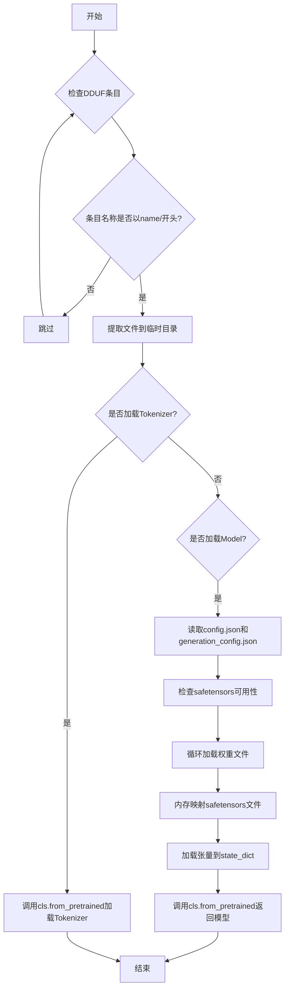
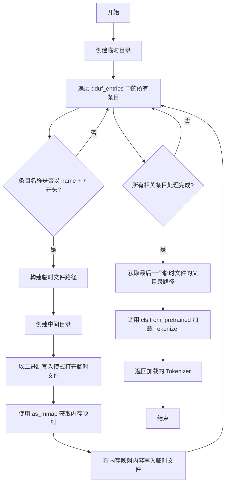

# `diffusers\src\diffusers\pipelines\transformers_loading_utils.py` 详细设计文档

该代码实现了从DDUF（Direct Download Update Format）档案中加载HuggingFace的tokenizer和transformers模型的功能，通过临时文件提取和内存映射技术解决transformers库原生不支持DDUF格式的问题，使模型能够正常加载并保持高性能。

## 整体流程



## 类结构

```
Module: dduf_utils
├── _load_tokenizer_from_dduf (全局函数)
└── _load_transformers_model_from_dduf (全局函数)
```

## 全局变量及字段


    

## 全局函数及方法


### `_load_tokenizer_from_dduf`

从DDUF归档文件中加载Tokenizer。由于Transformers库本身不提供直接从DDUF归档加载Tokenizer的功能，该函数作为一个变通方案，通过将DDUF归档中的Tokenizer文件提取到临时目录，然后从提取的文件中加载Tokenizer。

参数：

- `cls`：`"PreTrainedTokenizer"`，Tokenizer类对象，用于调用from_pretrained方法
- `name`：`str`，Tokenizer的名称/路径，用于匹配DDUF归档中的文件
- `dduf_entries`：`dict[str, DDUFEntry]`，DDUF归档中的条目字典，键为文件路径，值为DDUFEntry对象
- `**kwargs`：可变关键字参数，会被传递给`cls.from_pretrained`方法

返回值：`"PreTrainedTokenizer"`，从DDUF归档中加载的Tokenizer实例

#### 流程图



#### 带注释源码

```python
def _load_tokenizer_from_dduf(
    cls: "PreTrainedTokenizer", name: str, dduf_entries: dict[str, DDUFEntry], **kwargs
) -> "PreTrainedTokenizer":
    """
    Load a tokenizer from a DDUF archive.

    In practice, `transformers` do not provide a way to load a tokenizer from a DDUF archive. This function is a
    workaround by extracting the tokenizer files from the DDUF archive and loading the tokenizer from the extracted
    files. There is an extra cost of extracting the files, but of limited impact as the tokenizer files are usually
    small-ish.
    """
    # 使用上下文管理器创建临时目录，函数结束时自动清理
    with tempfile.TemporaryDirectory() as tmp_dir:
        # 遍历DDUF归档中的所有条目
        for entry_name, entry in dduf_entries.items():
            # 检查条目名称是否以指定的name开头（例如 "tokenizer/"）
            if entry_name.startswith(name + "/"):
                # 构建临时目录中的文件路径
                # 例如: "tokenizer/tokenizer.json" -> "tmp_dir/tokenizer/tokenizer.json"
                tmp_entry_path = os.path.join(tmp_dir, *entry_name.split("/"))
                
                # 创建中间目录（如果不存在）
                # 例如: 确保 "tmp_dir/tokenizer/" 目录存在
                os.makedirs(os.path.dirname(tmp_entry_path), exist_ok=True)
                
                # 以二进制写入模式打开临时文件
                with open(tmp_entry_path, "wb") as f:
                    # 使用内存映射访问DDUF条目，避免将整个文件加载到内存
                    with entry.as_mmap() as mm:
                        # 将内存映射的内容写入临时文件
                        f.write(mm)
        
        # 获取临时文件路径的父目录（Tokenizer文件所在的目录）
        # 例如: "tmp_dir/tokenizer/tokenizer.json" -> "tmp_dir/tokenizer"
        # 使用dirname获取目录路径，然后调用from_pretrained加载
        return cls.from_pretrained(os.path.dirname(tmp_entry_path), **kwargs)
```


### `_load_transformers_model_from_dduf`

该函数用于从 DDUF（Distributed Data Unification Format）存档文件中加载 Transformers 模型。由于 Transformers 库本身不直接支持从 DDUF 格式加载模型，该函数通过提取配置文件、实例化模型配置对象，然后直接内存映射加载 safetensors 权重文件并传递给模型构造函数来实现这一功能。

参数：

- `cls`：`"PreTrainedModel"`，要加载的模型类（通常是 PreTrainedModel 或其子类）
- `name`：`str`，要加载的模型组件名称，用于构建配置和权重文件的键路径
- `dduf_entries`：`dict[str, DDUFEntry]`，DDUF 存档中的条目字典，键为文件路径，值为 DDUFEntry 对象
- `**kwargs`：可变关键字参数，将传递给 `cls.from_pretrained()` 的额外参数

返回值：`"PreTrainedModel"`，从 DDUF 文件加载并实例化后的预训练模型对象

#### 流程图

```mermaid
flowchart TD
    A[开始] --> B[获取 config.json 文件]
    B --> C{config.json 是否存在?}
    C -->|否| D[抛出 EnvironmentError]
    C -->|是| E[获取 generation_config.json]
    E --> F[获取所有 .safetensors 权重文件]
    F --> G{权重文件是否存在?}
    G -->|否| H[抛出 EnvironmentError]
    G -->|是| I{检查 safetensors 是否可用}
    I -->|否| J[抛出 EnvironmentError]
    I -->|是| K{检查 transformers 版本 >= 4.47.0}
    K -->|否| L[抛出 ImportError]
    K -->|是| M[创建临时目录]
    M --> N[写入 config.json 到临时目录]
    N --> O[使用 AutoConfig.from_pretrained 加载配置]
    O --> P{generation_config 存在?}
    P -->|是| Q[写入 generation_config.json 到临时目录]
    P -->|否| R[generation_config = None]
    Q --> S[使用 GenerationConfig.from_pretrained 加载配置]
    R --> T[初始化空 state_dict]
    S --> T
    T --> U{遍历权重文件]
    U -->|每个权重文件| V[内存映射 safetensors 文件]
    V --> W[使用 safetensors.torch.load 加载张量]
    W --> X[更新 state_dict]
    X --> U
    U -->|完成| Y[调用 cls.from_pretrained]
    Y --> Z[返回模型实例]
    D --> Z
    H --> Z
    J --> Z
    L --> Z
```

#### 带注释源码

```python
def _load_transformers_model_from_dduf(
    cls: "PreTrainedModel", name: str, dduf_entries: dict[str, DDUFEntry], **kwargs
) -> "PreTrainedModel":
    """
    Load a transformers model from a DDUF archive.

    In practice, `transformers` do not provide a way to load a model from a DDUF archive. This function is a workaround
    by instantiating a model from the config file and loading the weights from the DDUF archive directly.
    """
    # -----------------------------
    # 步骤1: 获取模型配置文件
    # -----------------------------
    config_file = dduf_entries.get(f"{name}/config.json")
    if config_file is None:
        # 配置文件不存在，抛出环境错误
        raise EnvironmentError(
            f"Could not find a config.json file for component {name} in DDUF file (contains {dduf_entries.keys()})."
        )
    
    # -----------------------------
    # 步骤2: 获取生成配置文件（可选）
    # -----------------------------
    generation_config = dduf_entries.get(f"{name}/generation_config.json", None)

    # -----------------------------
    # 步骤3: 获取权重文件列表
    # -----------------------------
    weight_files = [
        entry
        for entry_name, entry in dduf_entries.items()
        if entry_name.startswith(f"{name}/") and entry_name.endswith(".safetensors")
    ]
    if not weight_files:
        # 没有找到权重文件，抛出环境错误
        raise EnvironmentError(
            f"Could not find any weight file for component {name} in DDUF file (contains {dduf_entries.keys()})."
        )
    
    # -----------------------------
    # 步骤4: 检查依赖可用性
    # -----------------------------
    if not is_safetensors_available():
        raise EnvironmentError(
            "Safetensors is not available, cannot load model from DDUF. Please `pip install safetensors`."
        )
    if is_transformers_version("<", "4.47.0"):
        raise ImportError(
            "You need to install `transformers>4.47.0` in order to load a transformers model from a DDUF file. "
            "You can install it with: `pip install --upgrade transformers`"
        )

    # -----------------------------
    # 步骤5: 创建临时目录并加载配置
    # -----------------------------
    with tempfile.TemporaryDirectory() as tmp_dir:
        from transformers import AutoConfig, GenerationConfig

        # 将 config.json 写入临时目录
        tmp_config_file = os.path.join(tmp_dir, "config.json")
        with open(tmp_config_file, "w") as f:
            f.write(config_file.read_text())
        
        # 使用 AutoConfig 加载配置对象
        config = AutoConfig.from_pretrained(tmp_config_file)
        
        # 如果存在 generation_config，也写入临时目录并加载
        if generation_config is not None:
            tmp_generation_config_file = os.path.join(tmp_dir, "generation_config.json")
            with open(tmp_generation_config_file, "w") as f:
                f.write(generation_config.read_text())
            generation_config = GenerationConfig.from_pretrained(tmp_generation_config_file)
        
        # -----------------------------
        # 步骤6: 加载模型权重到 state_dict
        # -----------------------------
        state_dict = {}
        with contextlib.ExitStack() as stack:
            # 遍历所有 safetensors 权重文件
            for entry in tqdm(weight_files, desc="Loading state_dict"):
                # 内存映射 safetensors 文件（避免一次性加载到内存）
                mmap = stack.enter_context(entry.as_mmap())
                # 从内存映射的文件中加载张量
                tensors = safetensors.torch.load(mmap)
                # 将加载的张量更新到 state_dict
                state_dict.update(tensors)
        
        # -----------------------------
        # 步骤7: 实例化并返回模型
        # -----------------------------
        return cls.from_pretrained(
            pretrained_model_name_or_path=None,  # 使用 config 和 state_dict 而非预训练路径
            config=config,
            generation_config=generation_config,
            state_dict=state_dict,
            **kwargs,
        )
```


## 关键组件


### 张量索引与惰性加载

使用memory-mapped文件（mmap）实现张量的惰性加载，避免一次性将所有权重加载到内存中，通过`entry.as_mmap()`和`safetensors.torch.load(mmap)`按需加载张量数据。

### 反量化支持

通过`safetensors.torch.load()`函数直接加载safetensors格式的张量，该库原生支持从量化格式（如int8、int4）反量化为float32，确保模型权重正确加载。

### 量化策略

通过版本检查`is_transformers_version("<", "4.47.0")`确保使用支持量化模型加载的transformers版本，配合`cls.from_pretrained()`的`state_dict`参数实现量化权重的加载。

### 临时文件管理

使用`tempfile.TemporaryDirectory()`创建临时目录存储提取的tokenizer文件和配置文件，在函数结束后自动清理，避免磁盘空间泄漏。

### 状态字典构建

通过`tqdm`进度条遍历所有safetensors权重文件，使用`contextlib.ExitStack`管理多个memory-mapped上下文，逐个加载并合并到`state_dict`中。

### 配置加载与验证

从DDUF存档中提取`config.json`和`generation_config.json`，使用`AutoConfig`和`GenerationConfig`解析，确保模型配置完整性。

### 错误处理机制

针对缺少必要文件（config.json、权重文件）抛出`EnvironmentError`，针对缺少依赖（safetensors、transformers版本）抛出`ImportError`，提供明确的错误信息和解决建议。


## 问题及建议


### 已知问题

-   **临时目录路径计算错误**：在 `_load_tokenizer_from_dduf` 中使用 `os.path.dirname(tmp_entry_path)` 只取最后一个文件的目录，可能导致目录结构不完整或路径错误
-   **缺少输入验证**：两个函数都没有验证 `name` 参数是否存在于 `dduf_entries` 中，可能导致提取失败或错误的文件被加载
-   **异常类型不一致**：`EnvironmentError` 用于表示配置文件缺失，但在 Python 中更推荐使用 `FileNotFoundError`
-   **版本检查时机不当**：`is_transformers_version("<", "4.47.0")` 检查在函数内部执行，而非模块加载时，可能导致运行时错误
-   **内部导入**：在函数内部导入 `AutoConfig` 和 `GenerationConfig` 增加了运行时的导入开销
-   **进度条不一致**：模型加载使用了 tqdm 进度条，但 tokenizer 加载没有，缺乏统一的用户体验
-   **资源清理风险**：虽然使用了 `ExitStack`，但内存映射和文件句柄的清理依赖于上下文管理器的正确实现
-   **类型提示不完整**：函数参数 `dduf_entries: dict[str, DDUFEntry]` 在 Python 3.9 以下可能不兼容

### 优化建议

-   **提取公共逻辑**：将临时目录创建和文件提取逻辑抽取为单独的辅助函数，避免代码重复
-   **添加输入验证**：在函数开始时验证 `name` 参数是否在 `dduf_entries` 中存在，提供更友好的错误信息
-   **统一异常类型**：使用 `FileNotFoundError` 替代 `EnvironmentError` 表示文件缺失
-   **前置版本检查**：将 transformers 版本检查移至模块加载时或函数入口处，提前暴露问题
-   **优化导入策略**：将必要的导入移至文件顶部或使用延迟导入策略
-   **添加进度条**：为 tokenizer 加载过程也添加 tqdm 进度条，提升用户体验
-   **增强类型提示**：使用 `typing.Dict` 和 `typing.Optional` 以兼容旧版 Python，或明确声明支持的 Python 版本
-   **文档完善**：为两个核心函数添加更详细的使用说明和示例
-   **缓存机制**：考虑对已加载的 tokenizer 和模型进行缓存，避免重复加载


## 其它


### 设计目标与约束

本代码模块的设计目标是从DDUF（Distributed Dataset Uniform Format）归档文件中加载HuggingFace Transformers的tokenizer和模型权重。核心约束包括：1）需要transformers>=4.47.0版本支持；2）依赖safetensors库进行权重加载；3）通过临时目录和内存映射技术平衡性能与资源使用；4）仅支持safetensors格式的权重文件。

### 错误处理与异常设计

代码采用多层次异常处理机制：1）`EnvironmentError`用于配置文件缺失或依赖库不可用的情况，明确提示用户需要安装相应依赖；2）`ImportError`用于版本不兼容场景，提供升级指导；3）所有文件操作使用上下文管理器确保资源正确释放；4）权重文件加载失败时通过异常传播机制向上传递错误。

### 数据流与状态机

数据流分为两条路径：Tokenizer加载流程为DDUF归档→临时目录提取→transformers.from_pretrained加载；Model加载流程为DDUF归档→解析config.json→解析generation_config.json→内存映射safetensors权重→构建state_dict→from_pretrained实例化模型。状态机包含：归档解析状态、配置文件加载状态、权重加载状态、模型实例化状态。

### 外部依赖与接口契约

主要依赖包括：huggingface_hub（DDUFEntry类）、transformers（PreTrainedModel、PreTrainedTokenizer、AutoConfig、GenerationConfig）、safetensors.torch、tqdm（进度条）、tempfile（临时目录管理）。接口契约规定：输入为DDUF entries字典和组件名称，输出为对应的PreTrainedTokenizer或PreTrainedModel实例，kwargs参数透传至transformers加载器。

### 性能考虑与优化空间

性能优化措施：1）使用内存映射（mmap）加载safetensors权重避免全量内存加载；2）使用ExitStack管理多个文件句柄；3）tqdm提供加载进度反馈。潜在优化空间：1）可添加缓存机制避免重复提取相同文件；2）可支持流式加载大模型；3）可并行加载多个权重文件。

### 安全性考虑

代码在临时目录中操作，存在临时文件残留风险（虽然使用TemporaryDirectory）；内存映射文件需要确保访问权限控制；配置文件读取使用read_text()方法需注意编码处理。

### 版本兼容性策略

通过`is_transformers_version`函数检测版本，要求>=4.47.0；通过`is_safetensors_available`检测safetensors可用性；版本检查在权重加载前执行，避免运行时失败。

### 资源管理与生命周期

使用contextlib.ExitStack确保所有内存映射文件正确关闭；tempfile.TemporaryDirectory在上下文退出时自动清理；weight_files循环中使用生成器表达式减少内存占用。

### 配置传递机制

kwargs参数透传机制允许调用者传递额外配置（如device_map、torch_dtype等）；config.json和generation_config.json通过临时文件中转实现加载；支持通过kwargs覆盖默认配置。
    