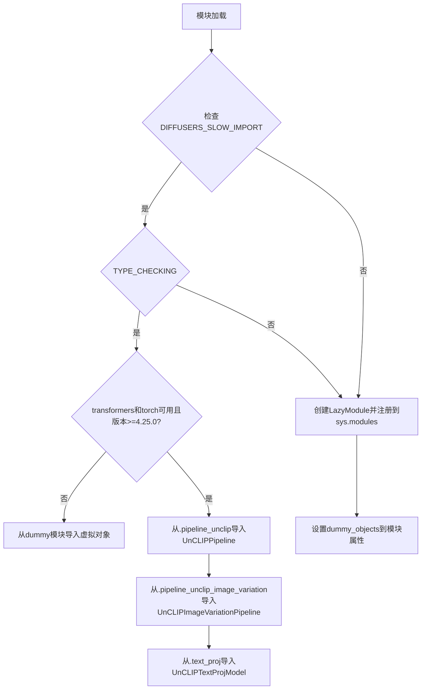

# `diffusers\src\diffusers\pipelines\unclip\__init__.py` 详细设计文档

这是一个Diffusers库中UnCLIP pipeline的延迟加载模块，通过条件判断实现可选依赖（torch和transformers）的动态导入，并在依赖不可用时提供虚拟对象以保证模块结构完整性。

## 整体流程



## 类结构

```
diffusers.pipelines.unclip (包)
├── UnCLIPPipeline (主pipeline类)
├── UnCLIPImageVariationPipeline (图像变体pipeline类)
└── UnCLIPTextProjModel (文本投影模型类)
```

## 全局变量及字段


### `_dummy_objects`
    
存储可选依赖不可用时的替代 dummy 对象

类型：`dict`
    


### `_import_structure`
    
定义模块的延迟导入结构，映射子模块名称到导出对象列表

类型：`dict`
    


### `DIFFUSERS_SLOW_IMPORT`
    
标志位，控制是否使用慢速导入模式进行类型检查

类型：`bool`
    


### `OptionalDependencyNotAvailable`
    
自定义异常类，表示可选依赖不可用时抛出的异常

类型：`Exception class`
    


### `_LazyModule`
    
延迟模块类，用于实现模块的懒加载机制

类型：`class`
    


### `is_torch_available`
    
检查 torch 库是否可用的函数

类型：`function`
    


### `is_transformers_available`
    
检查 transformers 库是否可用的函数

类型：`function`
    


### `is_transformers_version`
    
检查 transformers 库版本是否满足要求的函数

类型：`function`
    


    

## 全局函数及方法


## 关键组件


### UnCLIPPipeline 和 UnCLIPImageVariationPipeline

这两个是UnCLIP图像生成管道类，分别用于根据文本描述生成图像和图像变体生成。当transformers和torch依赖可用时，通过_import_structure字典进行导入，否则使用虚拟对象。

### UnCLIPTextProjModel

UnCLIP文本投影模型类，用于将文本嵌入投影到潜在空间中，是UnCLIP管道中的文本编码组件。

### _LazyModule 延迟加载机制

实现模块的惰性加载，只有在实际使用（非TYPE_CHECKING模式）时才导入真实的模块代码，提高导入速度和内存利用率。

### 可选依赖检查逻辑

通过try-except捕获OptionalDependencyNotAvailable异常，检查transformers(>=4.25.0)、torch是否同时可用，以决定导入真实对象还是虚拟对象。

### _import_structure 导入结构字典

定义模块的导入结构和可导出的类名映射，包含pipeline_unclip、pipeline_unclip_image_variation和text_proj三个键。

### _dummy_objects 虚拟对象字典

当可选依赖不可用时，存储指向dummy对象的引用，确保模块在缺少依赖时仍可被导入而不报错。

### TYPE_CHECKING 类型检查模式

在类型检查模式下，直接导入真实模块用于类型注解；否则使用延迟加载机制，优化运行时的导入性能。


## 问题及建议


### 已知问题

-   **重复的依赖检查逻辑**：代码中在第14-17行和第26-29行分别进行了一次完全相同的可选依赖检查（`is_transformers_available() and is_torch_available() and is_transformers_version(">=", "4.25.0")`），违反了DRY原则，增加了维护成本
-   **使用通配符导入**：`from ...utils.dummy_torch_and_transformers_objects import *  # noqa F403` 使用了`import *`，这是不良实践，会导入所有公开成员，可能导致命名空间污染和潜在的命名冲突
-   **硬编码版本号**：transformers版本要求"4.25.0"被硬编码在多个地方，如果版本要求变更需要修改多处
-   **重复的导入结构声明**：在`try`块和`else`块中分别定义了`_import_structure`的键值对，虽然内容不同但结构重复
-   **缺少错误处理**：LazyModule初始化和`setattr`操作没有错误处理机制，如果模块加载失败可能导致难以追踪的问题
-   **未使用的变量**：代码定义了`_dummy_objects`但在TYPE_CHECKING分支中并未使用

### 优化建议

-   **提取公共函数**：将可选依赖检查逻辑封装为一个辅助函数（如`_check_dependencies()`），在两处调用，减少代码重复
-   **明确导入**：将`import *`替换为明确的导入列表，只导入需要的类，提高代码可读性和可维护性
-   **常量定义**：在模块顶部定义版本要求常量（如`MIN_TRANSFORMERS_VERSION = "4.25.0"`），便于后续统一修改
-   **简化结构**：使用字典推导式或合并逻辑来简化`_import_structure`的构建过程
-   **添加错误处理**：为LazyModule初始化添加try-except块，捕获并记录潜在的初始化错误
-   **清理未使用代码**：移除或利用`_dummy_objects`，或确认其在TYPE_CHECKING模式下的正确使用

## 其它


### 设计目标与约束

本模块的设计目标是实现Diffusers库中UnCLIPPipeline和UnCLIPImageVariationPipeline的延迟加载机制，支持可选依赖（torch和transformers）的动态导入，在依赖不可用时提供虚拟对象以保证模块导入不崩溃，同时支持类型检查时的完整导入。约束条件包括：必须依赖transformers>=4.25.0和torch库，必须使用_LazyModule进行延迟加载，必须遵循Diffusers库的模块导入规范。

### 错误处理与异常设计

本模块主要通过OptionalDependencyNotAvailable异常处理可选依赖不可用的情况。当检测到torch或transformers不可用或transformers版本低于4.25.0时，抛出OptionalDependencyNotAvailable异常，捕获该异常后从dummy模块导入虚拟对象，确保模块结构完整但功能受限。TYPE_CHECKING和DIFFUSERS_SLOW_IMPORT标志用于控制类型检查时的完整导入行为。

### 数据流与状态机

模块加载流程如下：首先定义_import_structure字典和_dummy_objects字典用于存储可导入对象；然后检查transformers和torch的可用性及版本要求；若依赖不可用则填充_dummy_objects，否则填充_import_structure；在TYPE_CHECKING或DIFFUSERS_SLOW_IMPORT模式下执行完整导入，否则使用_LazyModule进行延迟加载；最后将_dummy_objects中的虚拟对象设置到模块属性中。

### 外部依赖与接口契约

外部依赖包括：torch库（is_torch_available检查）、transformers库（is_transformers_available和is_transformers_version检查，版本要求>=4.25.0）、diffusers.utils中的_LazyModule、OptionalDependencyNotAvailable、_LazyModule等工具函数和类。导出的公开接口包括：UnCLIPPipeline、UnCLIPImageVariationPipeline和UnCLIPTextProjModel三个类。

### 性能考虑

本模块采用延迟加载策略，非类型检查时不会立即导入实际的pipeline和model类，只有在实际使用时才进行导入，可以显著减少模块初始化时间。_LazyModule的实现会缓存已导入的模块，避免重复导入开销。

### 版本兼容性

本模块要求transformers版本>=4.25.0，这是因为UnCLIP功能需要特定版本的transformers支持。代码通过is_transformers_version(">=", "4.25.0")进行版本检查，不满足版本要求时会使用虚拟对象替代。

### 测试策略

测试应覆盖以下场景：完整依赖环境下的正常导入、缺失torch或transformers时的优雅降级、版本不满足要求时的处理、TYPE_CHECKING模式下的完整导入、延迟加载的实际使用触发导入、_dummy_objects属性设置正确性验证。

### 配置管理

DIFFUSERS_SLOW_IMPORT是一个全局配置标志，控制是否使用延迟加载模式。当设置为True时，即使不在类型检查模式下也会执行完整导入。_import_structure字典定义了模块的导入结构，_dummy_objects字典定义了降级时使用的虚拟对象。

### 安全性考虑

本模块主要涉及动态导入和模块属性设置，不涉及用户输入处理或网络请求，安全性风险较低。但需要注意从dummy模块导入时使用通配符导入（# noqa F403），可能导入未知符号，建议改为显式导入具体类。

### 潜在改进空间

1. 当前使用通配符导入dummy对象（from ...utils.dummy_torch_and_transformers_objects import *），建议改为显式导入以提高代码可读性和可维护性
2. _import_structure和_dummy_objects的构建逻辑有重复，可以提取为独立函数减少代码冗余
3. 考虑添加版本兼容性日志输出，帮助开发者诊断依赖问题
4. 可以添加类型注解提高代码的类型安全性

    