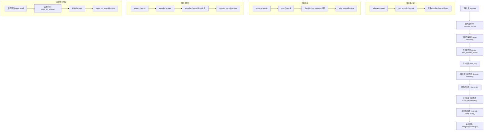
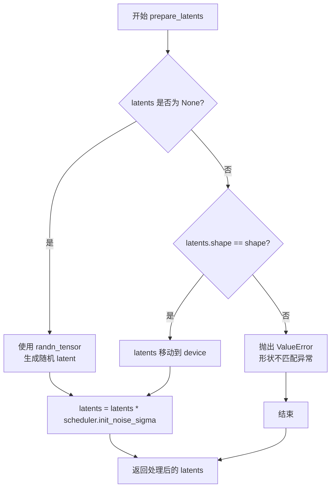

# `diffusers\src\diffusers\pipelines\unclip\pipeline_unclip.py` 详细设计文档

UnCLIPPipeline是基于unCLIP架构的文本到图像生成pipeline，通过先验模型(PriorTransformer)将文本嵌入转换为图像嵌入，然后使用条件解码器(UNet2DConditionModel)生成初始图像，最后通过超分辨率模型(UNet2DModel)提升图像分辨率，生成高质量的图像。

## 整体流程



## 类结构

```
DiffusionPipeline (基类)
├── DeprecatedPipelineMixin (混入类)
└── UnCLIPPipeline (主类)
    ├── 组件模型
    │   ├── PriorTransformer (先验模型)
    │   ├── UNet2DConditionModel (解码器)
    │   ├── UNet2DModel (超分辨率x2)
    │   ├── CLIPTextModelWithProjection (文本编码器)
    │   └── UnCLIPTextProjModel (文本投影)
    └── 调度器
        ├── UnCLIPScheduler (先验)
        ├── UnCLIPScheduler (解码器)
        └── UnCLIPScheduler (超分辨率)
```

## 全局变量及字段


### `logger`
    
Logger instance for the module to track runtime information and warnings

类型：`logging.Logger`
    


### `XLA_AVAILABLE`
    
Boolean flag indicating whether PyTorch XLA is available for TPU acceleration

类型：`bool`
    


### `UnCLIPPipeline._last_supported_version`
    
String defining the last supported version of the pipeline for compatibility checks

类型：`str`
    


### `UnCLIPPipeline._exclude_from_cpu_offload`
    
List of component names excluded from CPU offload optimization

类型：`list[str]`
    


### `UnCLIPPipeline.prior`
    
The canonical unCLIP prior transformer that approximates image embeddings from text embeddings

类型：`PriorTransformer`
    


### `UnCLIPPipeline.decoder`
    
The decoder UNet that inverts image embeddings into actual images using conditional inputs

类型：`UNet2DConditionModel`
    


### `UnCLIPPipeline.text_proj`
    
Utility class that prepares and combines text and image embeddings before passing to the decoder

类型：`UnCLIPTextProjModel`
    


### `UnCLIPPipeline.text_encoder`
    
Frozen CLIP text encoder that converts tokenized text into embedding representations

类型：`CLIPTextModelWithProjection`
    


### `UnCLIPPipeline.tokenizer`
    
CLIP tokenizer that converts input text into token IDs for the text encoder

类型：`CLIPTokenizer`
    


### `UnCLIPPipeline.super_res_first`
    
First super-resolution UNet used in all but the last step of the upsampling process

类型：`UNet2DModel`
    


### `UnCLIPPipeline.super_res_last`
    
Final super-resolution UNet used in the last step of the upsampling process

类型：`UNet2DModel`
    


### `UnCLIPPipeline.prior_scheduler`
    
Denoising scheduler for the prior model controlling noise addition and removal steps

类型：`UnCLIPScheduler`
    


### `UnCLIPPipeline.decoder_scheduler`
    
Denoising scheduler for the decoder model controlling the diffusion process

类型：`UnCLIPScheduler`
    


### `UnCLIPPipeline.super_res_scheduler`
    
Denoising scheduler for super-resolution models controlling image upsampling steps

类型：`UnCLIPScheduler`
    


### `UnCLIPPipeline.model_cpu_offload_seq`
    
String defining the sequence of models for CPU offload optimization

类型：`str`
    
    

## 全局函数及方法


### `UnCLIPPipeline.__init__`

这是 UnCLIPPipeline 类的构造函数，负责初始化文本到图像生成管道的所有核心组件，包括 prior 模型、decoder 模型、文本编码器、分词器、文本投影模型、超分辨率模型以及各个调度器。

参数：

- `prior`：`PriorTransformer`，用于从文本嵌入近似图像嵌入的 unCLIP 先验模型
- `decoder`：`UNet2DConditionModel`，将图像嵌入反转为图像的解码器
- `text_encoder`：`CLIPTextModelWithProjection`，冻结的文本编码器
- `tokenizer`：`CLIPTokenizer`，用于对文本进行分词的 CLIP 分词器
- `text_proj`：`UnCLIPTextProjModel`，用于准备和组合嵌入的实用类
- `super_res_first`：`UNet2DModel`，用于超分辨率扩散过程除最后一步外的 UNet
- `super_res_last`：`UNet2DModel`，用于超分辨率扩散过程最后一步的 UNet
- `prior_scheduler`：`UnCLIPScheduler`，先验去噪过程中使用的调度器
- `decoder_scheduler`：`UnCLIPScheduler`，解码器去噪过程中使用的调度器
- `super_res_scheduler`：`UnCLIPScheduler`，超分辨率去噪过程中使用的调度器

返回值：`None`，无返回值，该方法仅初始化对象状态

#### 流程图

```mermaid
flowchart TD
    A[开始 __init__] --> B[调用父类构造函数 super().__init__]
    B --> C[调用 self.register_modules 注册所有模块]
    C --> D[注册 prior: PriorTransformer]
    C --> E[注册 decoder: UNet2DConditionModel]
    C --> F[注册 text_encoder: CLIPTextModelWithProjection]
    C --> G[注册 tokenizer: CLIPTokenizer]
    C --> H[注册 text_proj: UnCLIPTextProjModel]
    C --> I[注册 super_res_first: UNet2DModel]
    C --> J[注册 super_res_last: UNet2DModel]
    C --> K[注册 prior_scheduler: UnCLIPScheduler]
    C --> L[注册 decoder_scheduler: UnCLIPScheduler]
    C --> M[注册 super_res_scheduler: UnCLIPScheduler]
    D --> N[结束 __init__]
    E --> N
    F --> N
    G --> N
    H --> N
    I --> N
    J --> N
    K --> N
    L --> N
    M --> N
```

#### 带注释源码

```python
def __init__(
    self,
    prior: PriorTransformer,                          # unCLIP 先验模型，用于从文本嵌入预测图像嵌入
    decoder: UNet2DConditionModel,                    # 条件 UNet 解码器，从图像嵌入生成图像
    text_encoder: CLIPTextModelWithProjection,        # CLIP 文本编码器，生成文本嵌入
    tokenizer: CLIPTokenizer,                          # CLIP 分词器，解析文本输入
    text_proj: UnCLIPTextProjModel,                    # 文本投影模型，组合文本和图像嵌入
    super_res_first: UNet2DModel,                     # 超分辨率 UNet（除最后一步外使用）
    super_res_last: UNet2DModel,                       # 超分辨率 UNet（最后一步使用）
    prior_scheduler: UnCLIPScheduler,                 # 先验去噪调度器
    decoder_scheduler: UnCLIPScheduler,                # 解码器去噪调度器
    super_res_scheduler: UnCLIPScheduler,             # 超分辨率去噪调度器
):
    # 调用父类 DeprecatedPipelineMixin 和 DiffusionPipeline 的初始化方法
    # 完成基础管道功能的初始化
    super().__init__()

    # 注册所有子模块，使管道能够正确保存/加载模型权重
    # 同时让这些组件可以通过 self.xxx 访问（如 self.prior, self.decoder 等）
    self.register_modules(
        prior=prior,
        decoder=decoder,
        text_encoder=text_encoder,
        tokenizer=tokenizer,
        text_proj=text_proj,
        super_res_first=super_res_first,
        super_res_last=super_res_last,
        prior_scheduler=prior_scheduler,
        decoder_scheduler=decoder_scheduler,
        super_res_scheduler=super_res_scheduler,
    )
```


### `UnCLIPPipeline.prepare_latents`

该方法负责为去噪过程准备潜在向量（latents）。如果未提供预生成的潜在向量，则使用随机张量生成；否则对提供的潜在向量进行形状验证和设备转换，最后根据调度器的初始噪声 sigma 进行缩放以适配去噪流程的起始状态。

参数：

- `shape`：`tuple` 或 `int`，期望输出潜在向量的形状，用于确定生成 latent 的维度
- `dtype`：`torch.dtype`，生成 latent 所使用的数据类型，通常与文本嵌入类型保持一致
- `device`：`torch.device`，生成 latent 所放置的设备（CPU/CUDA）
- `generator`：`torch.Generator` 或 `None`，用于确保生成过程可复现的随机数生成器
- `latents`：`torch.Tensor` 或 `None`，可选的预生成潜在向量，若为 None 则随机生成
- `scheduler`：`UnCLIPScheduler`，去噪调度器，用于获取初始噪声 sigma 值来缩放 latent

返回值：`torch.Tensor`，经过噪声 sigma 缩放处理后的潜在向量，可直接用于后续的去噪推理步骤

#### 流程图



#### 带注释源码

```python
def prepare_latents(self, shape, dtype, device, generator, latents, scheduler):
    """
    准备用于去噪过程的潜在向量（latents）
    
    参数:
        shape: 期望的潜在向量形状
        dtype: 潜在向量的数据类型
        device: 潜在向量应放置的设备
        generator: 可选的随机数生成器用于可复现性
        latents: 可选的预生成潜在向量，如果为None则随机生成
        scheduler: 去噪调度器，用于获取初始噪声sigma
    
    返回:
        经过scheduler.init_noise_sigma缩放后的潜在向量
    """
    # 如果未提供latents，则使用randn_tensor生成随机潜在向量
    # 使用generator确保可复现性（如果提供）
    if latents is None:
        latents = randn_tensor(shape, generator=generator, device=device, dtype=dtype)
    else:
        # 验证提供的latents形状是否与期望形状匹配
        if latents.shape != shape:
            raise ValueError(f"Unexpected latents shape, got {latents.shape}, expected {shape}")
        # 将latents移动到指定设备
        latents = latents.to(device)

    # 根据调度器的初始噪声sigma缩放latents
    # 这是扩散模型去噪过程的标准初始化步骤
    latents = latents * scheduler.init_noise_sigma
    return latents
```


### `UnCLIPPipeline._encode_prompt`

该方法负责将文本提示编码为向量表示，处理分类器自由引导（Classifier-Free Guidance）所需的正向和负向嵌入，并为后续的图像生成管道准备文本嵌入、隐藏状态和注意力掩码。

参数：

- `prompt`：`str | list[str]`，需要编码的文本提示，可以是单个字符串或字符串列表
- `device`：`torch.device`，执行计算的设备（如 CPU 或 CUDA）
- `num_images_per_prompt`：`int`，每个提示需要生成的图像数量，用于批量扩展嵌入
- `do_classifier_free_guidance`：`bool`，是否启用分类器自由引导，若为 `True` 则生成无条件嵌入用于对比
- `text_model_output`：`CLIPTextModelOutput | tuple | None`，可选的预计算文本模型输出，若为 `None` 则实时计算
- `text_attention_mask`：`torch.Tensor | None`，可选的预计算文本注意力掩码

返回值：`tuple[torch.Tensor, torch.Tensor, torch.Tensor]`，返回一个包含三个元素的元组：
- `prompt_embeds`：文本提示的嵌入向量，形状为 `(batch_size * num_images_per_prompt, embedding_dim)`
- `text_enc_hid_states`：文本编码器的最后隐藏状态，形状为 `(batch_size * num_images_per_prompt, seq_len, hidden_dim)`
- `text_mask`：文本注意力掩码的布尔张量，形状为 `(batch_size * num_images_per_prompt, seq_len)`

#### 流程图

```mermaid
flowchart TD
    A[开始 _encode_prompt] --> B{text_model_output 是否为 None?}
    B -->|是| C[计算 batch_size]
    B -->|否| D[从 text_model_output 提取 batch_size]
    
    C --> E[使用 tokenizer 对 prompt 分词]
    E --> F[获取 input_ids 和 attention_mask]
    F --> G{untruncated_ids 长度 >= input_ids 长度?}
    G -->|是| H[截断过长的输入并记录警告]
    G -->|否| I[跳过截断]
    H --> J[调用 text_encoder 编码]
    I --> J
    J --> K[提取 text_embeds 和 last_hidden_state]
    
    D --> L[提取 prompt_embeds 和 text_enc_hid_states]
    L --> M[设置 text_mask = text_attention_mask]
    
    K --> N[repeat_interleave 扩展 prompt_embeds]
    M --> O[repeat_interleave 扩展 text_enc_hid_states 和 text_mask]
    N --> P{do_classifier_free_guidance?}
    
    O --> P
    
    P -->|是| Q[创建空字符串 uncond_tokens]
    Q --> R[tokenizer 处理 uncond_tokens]
    R --> S[编码得到 negative_prompt_embeds]
    S --> T[repeat 扩展 negative embeddings]
    T --> U[concat 正负嵌入: [neg, pos]]
    U --> V[concat 隐藏状态和掩码]
    V --> W[返回 embeds, hidden_states, mask]
    
    P -->|否| X[直接返回扩展后的嵌入和掩码]
    X --> W
```

#### 带注释源码

```python
def _encode_prompt(
    self,
    prompt,                              # 输入的文本提示，str 或 list[str]
    device,                             # 计算设备 torch.device
    num_images_per_prompt,              # 每个提示生成的图像数量 int
    do_classifier_free_guidance,       # 是否启用分类器自由引导 bool
    text_model_output: CLIPTextModelOutput | tuple | None = None,  # 预计算的文本模型输出
    text_attention_mask: torch.Tensor | None = None,              # 预计算的注意力掩码
):
    # 如果没有提供预计算输出，则需要实时计算文本嵌入
    if text_model_output is None:
        # 确定批量大小：列表取长度，否则默认为 1
        batch_size = len(prompt) if isinstance(prompt, list) else 1
        
        # 使用 tokenizer 将文本转换为 token IDs
        text_inputs = self.tokenizer(
            prompt,
            padding="max_length",                 # 填充到最大长度
            max_length=self.tokenizer.model_max_length,  # CLIP 模型最大长度
            truncation=True,                       # 截断超长文本
            return_tensors="pt",                  # 返回 PyTorch 张量
        )
        text_input_ids = text_inputs.input_ids     # token ID 序列
        text_mask = text_inputs.attention_mask.bool().to(device)  # 注意力掩码

        # 处理未截断的序列，用于检测是否发生了截断
        untruncated_ids = self.tokenizer(prompt, padding="longest", return_tensors="pt").input_ids

        # 检测输入是否被截断，并记录警告
        if untruncated_ids.shape[-1] >= text_input_ids.shape[-1] and not torch.equal(
            text_input_ids, untruncated_ids
        ):
            # 解码被截断的部分用于日志
            removed_text = self.tokenizer.batch_decode(
                untruncated_ids[:, self.tokenizer.model_max_length - 1 : -1]
            )
            logger.warning(
                "The following part of your input was truncated because CLIP can only handle sequences up to"
                f" {self.tokenizer.model_max_length} tokens: {removed_text}"
            )
            # 截断到最大长度
            text_input_ids = text_input_ids[:, : self.tokenizer.model_max_length]

        # 调用 CLIP 文本编码器获取输出
        text_encoder_output = self.text_encoder(text_input_ids.to(device))

        # 提取文本嵌入（用于prior的条件）和最后隐藏状态（用于decoder的条件）
        prompt_embeds = text_encoder_output.text_embeds
        text_enc_hid_states = text_encoder_output.last_hidden_state

    else:
        # 使用预计算的文本模型输出
        batch_size = text_model_output[0].shape[0]
        prompt_embeds, text_enc_hid_states = text_model_output[0], text_model_output[1]
        text_mask = text_attention_mask

    # 为每个提示生成的多个图像复制嵌入向量
    prompt_embeds = prompt_embeds.repeat_interleave(num_images_per_prompt, dim=0)
    text_enc_hid_states = text_enc_hid_states.repeat_interleave(num_images_per_prompt, dim=0)
    text_mask = text_mask.repeat_interleave(num_images_per_prompt, dim=0)

    # 分类器自由引导：需要同时生成条件和无条件嵌入
    if do_classifier_free_guidance:
        # 创建空字符串作为无条件输入
        uncond_tokens = [""] * batch_size

        # 对无条件输入进行 tokenize
        uncond_input = self.tokenizer(
            uncond_tokens,
            padding="max_length",
            max_length=self.tokenizer.model_max_length,
            truncation=True,
            return_tensors="pt",
        )
        uncond_text_mask = uncond_input.attention_mask.bool().to(device)
        
        # 编码无条件输入
        negative_prompt_embeds_text_encoder_output = self.text_encoder(uncond_input.input_ids.to(device))

        # 提取无条件嵌入和隐藏状态
        negative_prompt_embeds = negative_prompt_embeds_text_encoder_output.text_embeds
        uncond_text_enc_hid_states = negative_prompt_embeds_text_encoder_output.last_hidden_state

        # 复制无条件嵌入以匹配每个提示的生成数量（使用 MPS 友好的方法）
        seq_len = negative_prompt_embeds.shape[1]
        negative_prompt_embeds = negative_prompt_embeds.repeat(1, num_images_per_prompt)
        negative_prompt_embeds = negative_prompt_embeds.view(batch_size * num_images_per_prompt, seq_len)

        # 复制无条件隐藏状态
        seq_len = uncond_text_enc_hid_states.shape[1]
        uncond_text_enc_hid_states = uncond_text_enc_hid_states.repeat(1, num_images_per_prompt, 1)
        uncond_text_enc_hid_states = uncond_text_enc_hid_states.view(
            batch_size * num_images_per_prompt, seq_len, -1
        )
        uncond_text_mask = uncond_text_mask.repeat_interleave(num_images_per_prompt, dim=0)

        # 拼接无条件嵌入和条件嵌入（无条件在前，条件在后）
        # 这样可以在一次前向传播中同时计算条件和无条件输出
        prompt_embeds = torch.cat([negative_prompt_embeds, prompt_embeds])
        text_enc_hid_states = torch.cat([uncond_text_enc_hid_states, text_enc_hid_states])
        text_mask = torch.cat([uncond_text_mask, text_mask])

    # 返回处理后的嵌入向量、隐藏状态和注意力掩码
    return prompt_embeds, text_enc_hid_states, text_mask
```


### `UnCLIPPipeline.__call__`

该方法是UnCLIPPipeline的核心调用函数，负责执行完整的文本到图像生成流程。流程包括三个主要阶段：1）使用PriorTransformer根据文本embedding生成图像embedding；2）使用UNet2DConditionModel解码器将图像embedding转换为小尺寸图像；3）使用超分辨率UNet模型将小图像上采样为高分辨率图像。整个过程支持分类器自由引导（Classifier-Free Guidance）以提升生成质量。

参数：

- `prompt`：`str | list[str] | None`，用于引导图像生成的文本提示。只有当`text_model_output`和`text_attention_mask`同时传递时才可以为空。
- `num_images_per_prompt`：`int`，可选，默认值为1，每个提示生成的图像数量。
- `prior_num_inference_steps`：`int`，可选，默认值为25，先验模型的去噪步数。更多去噪步数通常能提高图像质量，但会降低推理速度。
- `decoder_num_inference_steps`：`int`，可选，默认值为25，解码器的去噪步数。更多去噪步数通常能提高图像质量，但会降低推理速度。
- `super_res_num_inference_steps`：`int`，可选，默认值为7，超分辨率的去噪步数。更多去噪步数通常能提高图像质量，但会降低推理速度。
- `generator`：`torch.Generator | list[torch.Generator] | None`，可选，用于确保生成过程确定性的PyTorch随机数生成器。
- `prior_latents`：`torch.Tensor | None`，可选，形状为(batch_size, embedding_dim)的先验模型输入噪声潜在向量。
- `decoder_latents`：`torch.Tensor | None`，可选，形状为(batch_size, channels, height, width)的解码器输入噪声潜在向量。
- `super_res_latents`：`torch.Tensor | None`，可选，形状为(batch_size, channels, super_res_height, super_res_width)的超分辨率输入噪声潜在向量。
- `text_model_output`：`CLIPTextModelOutput | tuple | None`，可选，预定义的CLIP文本编码器输出，可用于文本嵌入插值等任务。此时prompt可以为空，但必须同时传递`text_attention_mask`。
- `text_attention_mask`：`torch.Tensor | None`，可选，预定义的CLIP文本注意力掩码，当传递`text_model_output`时需要同时传递此参数。
- `prior_guidance_scale`：`float`，可选，默认值为4.0，先验模型的分类器自由引导比例。值越大生成的图像与文本提示相关性越高，但可能降低图像质量。
- `decoder_guidance_scale`：`float`，可选，默认值为8.0，解码器的分类器自由引导比例。值越大生成的图像与文本提示相关性越高，但可能降低图像质量。
- `output_type`：`str | None`，可选，默认值为"pil"，生成图像的输出格式，可选"PIL.Image"或"np.array"。
- `return_dict`：`bool`，可选，默认值为True，是否返回`ImagePipelineOutput`而不是普通元组。

返回值：`ImagePipelineOutput | tuple`，当`return_dict`为True时返回`ImagePipelineOutput`，否则返回包含生成图像列表的元组。

#### 流程图

```mermaid
flowchart TD
    A[开始 __call__] --> B{检查 prompt}
    B -->|有 prompt| C[确定 batch_size]
    B -->|无 prompt| D[从 text_model_output 获取 batch_size]
    C --> E[_encode_prompt 编码文本]
    D --> E
    E --> F[准备 prior_latents]
    F --> G[Prior 去噪循环]
    G --> H[post_process_latents 处理先验输出]
    H --> I[text_proj 处理 embeddings]
    I --> J[准备 decoder_latents]
    J --> K[Decoder 去噪循环]
    K --> L[clamp 解码器输出]
    L --> M[上采样小图像]
    M --> N[Super Res 去噪循环]
    N --> O[后处理: 归一化到 0-1]
    O --> P{output_type == "pil"}
    P -->|是| Q[转换为 PIL Image]
    P -->|否| R[保持 numpy 数组]
    Q --> S{return_dict}
    R --> S
    S -->|是| T[返回 ImagePipelineOutput]
    S -->|否| U[返回 tuple]
```

#### 带注释源码

```python
@torch.no_grad()
def __call__(
    self,
    prompt: str | list[str] | None = None,
    num_images_per_prompt: int = 1,
    prior_num_inference_steps: int = 25,
    decoder_num_inference_steps: int = 25,
    super_res_num_inference_steps: int = 7,
    generator: torch.Generator | list[torch.Generator] | None = None,
    prior_latents: torch.Tensor | None = None,
    decoder_latents: torch.Tensor | None = None,
    super_res_latents: torch.Tensor | None = None,
    text_model_output: CLIPTextModelOutput | tuple | None = None,
    text_attention_mask: torch.Tensor | None = None,
    prior_guidance_scale: float = 4.0,
    decoder_guidance_scale: float = 8.0,
    output_type: str | None = "pil",
    return_dict: bool = True,
):
    """
    The call function to the pipeline for generation.

    Args:
        prompt (`str` or `list[str]`):
            The prompt or prompts to guide image generation. This can only be left undefined if `text_model_output`
            and `text_attention_mask` is passed.
        num_images_per_prompt (`int`, *optional*, defaults to 1):
            The number of images to generate per prompt.
        prior_num_inference_steps (`int`, *optional*, defaults to 25):
            The number of denoising steps for the prior. More denoising steps usually lead to a higher quality
            image at the expense of slower inference.
        decoder_num_inference_steps (`int`, *optional*, defaults to 25):
            The number of denoising steps for the decoder. More denoising steps usually lead to a higher quality
            image at the expense of slower inference.
        super_res_num_inference_steps (`int`, *optional*, defaults to 7):
            The number of denoising steps for super resolution. More denoising steps usually lead to a higher
            quality image at the expense of slower inference.
        generator (`torch.Generator` or `list[torch.Generator]`, *optional*):
            A [`torch.Generator`](https://pytorch.org/docs/stable/generated/torch.Generator.html) to make
            generation deterministic.
        prior_latents (`torch.Tensor` of shape (batch size, embeddings dimension), *optional*):
            Pre-generated noisy latents to be used as inputs for the prior.
        decoder_latents (`torch.Tensor` of shape (batch size, channels, height, width), *optional*):
            Pre-generated noisy latents to be used as inputs for the decoder.
        super_res_latents (`torch.Tensor` of shape (batch size, channels, super res height, super res width), *optional*):
            Pre-generated noisy latents to be used as inputs for the decoder.
        prior_guidance_scale (`float`, *optional*, defaults to 4.0):
            A higher guidance scale value encourages the model to generate images closely linked to the text
            `prompt` at the expense of lower image quality. Guidance scale is enabled when `guidance_scale > 1`.
        decoder_guidance_scale (`float`, *optional*, defaults to 4.0):
            A higher guidance scale value encourages the model to generate images closely linked to the text
            `prompt` at the expense of lower image quality. Guidance scale is enabled when `guidance_scale > 1`.
        text_model_output (`CLIPTextModelOutput`, *optional*):
            Pre-defined [`CLIPTextModel`] outputs that can be derived from the text encoder. Pre-defined text
            outputs can be passed for tasks like text embedding interpolations. Make sure to also pass
            `text_attention_mask` in this case. `prompt` can the be left `None`.
        text_attention_mask (`torch.Tensor`, *optional*):
            Pre-defined CLIP text attention mask that can be derived from the tokenizer. Pre-defined text attention
            masks are necessary when passing `text_model_output`.
        output_type (`str`, *optional*, defaults to `"pil"`):
            The output format of the generated image. Choose between `PIL.Image` or `np.array`.
        return_dict (`bool`, *optional*, defaults to `True`):
            Whether or not to return a [`~pipelines.ImagePipelineOutput`] instead of a plain tuple.

    Returns:
        [`~pipelines.ImagePipelineOutput`] or `tuple`:
            If `return_dict` is `True`, [`~pipelines.ImagePipelineOutput`] is returned, otherwise a `tuple` is
            returned where the first element is a list with the generated images.
    """
    # ==================== 步骤1: 确定batch_size ====================
    if prompt is not None:
        if isinstance(prompt, str):
            batch_size = 1
        elif isinstance(prompt, list):
            batch_size = len(prompt)
        else:
            raise ValueError(f"`prompt` has to be of type `str` or `list` but is {type(prompt)}")
    else:
        # 当没有prompt时，从预定义的text_model_output获取batch_size
        batch_size = text_model_output[0].shape[0]

    # 获取执行设备
    device = self._execution_device

    # 调整batch_size以考虑每个prompt生成的图像数量
    batch_size = batch_size * num_images_per_prompt

    # 确定是否使用分类器自由引导（guidance scale > 1时启用）
    do_classifier_free_guidance = prior_guidance_scale > 1.0 or decoder_guidance_scale > 1.0

    # ==================== 步骤2: 编码文本提示 ====================
    prompt_embeds, text_enc_hid_states, text_mask = self._encode_prompt(
        prompt, device, num_images_per_prompt, do_classifier_free_guidance, text_model_output, text_attention_mask
    )

    # ==================== 步骤3: Prior（先验）去噪过程 ====================
    # 设置先验调度器的去噪步骤
    self.prior_scheduler.set_timesteps(prior_num_inference_steps, device=device)
    prior_timesteps_tensor = self.prior_scheduler.timesteps

    # 获取先验模型的embedding维度
    embedding_dim = self.prior.config.embedding_dim

    # 准备先验潜在向量
    prior_latents = self.prepare_latents(
        (batch_size, embedding_dim),
        prompt_embeds.dtype,
        device,
        generator,
        prior_latents,
        self.prior_scheduler,
    )

    # 先验去噪循环
    for i, t in enumerate(self.progress_bar(prior_timesteps_tensor)):
        # 如果使用分类器自由引导，则扩展潜在向量（复制为两份：条件和无条件）
        latent_model_input = torch.cat([prior_latents] * 2) if do_classifier_free_guidance else prior_latents

        # 先前模型预测图像embedding
        predicted_image_embedding = self.prior(
            latent_model_input,
            timestep=t,
            proj_embedding=prompt_embeds,
            encoder_hidden_states=text_enc_hid_states,
            attention_mask=text_mask,
        ).predicted_image_embedding

        # 应用分类器自由引导
        if do_classifier_free_guidance:
            predicted_image_embedding_uncond, predicted_image_embedding_text = predicted_image_embedding.chunk(2)
            predicted_image_embedding = predicted_image_embedding_uncond + prior_guidance_scale * (
                predicted_image_embedding_text - predicted_image_embedding_uncond
            )

        # 确定前一个时间步
        if i + 1 == prior_timesteps_tensor.shape[0]:
            prev_timestep = None
        else:
            prev_timestep = prior_timesteps_tensor[i + 1]

        # 调度器步进，计算前一个潜在向量
        prior_latents = self.prior_scheduler.step(
            predicted_image_embedding,
            timestep=t,
            sample=prior_latents,
            generator=generator,
            prev_timestep=prev_timestep,
        ).prev_sample

    # 后处理先验潜在向量
    prior_latents = self.prior_scheduler.post_process_latents(prior_latents)

    # 获取最终的图像embedding
    image_embeddings = prior_latents

    # ==================== 步骤4: Decoder（解码器）处理 ====================
    # 使用text_proj处理embeddings，生成解码器需要的条件embedding
    text_enc_hid_states, additive_clip_time_embeddings = self.text_proj(
        image_embeddings=image_embeddings,
        prompt_embeds=prompt_embeds,
        text_encoder_hidden_states=text_enc_hid_states,
        do_classifier_free_guidance=do_classifier_free_guidance,
    )

    # 处理MPS设备的特殊padding问题
    if device.type == "mps":
        # MPS: 对bool张量padding会导致panic，所以转换为int再转回bool
        text_mask = text_mask.type(torch.int)
        decoder_text_mask = F.pad(text_mask, (self.text_proj.clip_extra_context_tokens, 0), value=1)
        decoder_text_mask = decoder_text_mask.type(torch.bool)
    else:
        decoder_text_mask = F.pad(text_mask, (self.text_proj.clip_extra_context_tokens, 0), value=True)

    # 设置解码器调度器的去噪步骤
    self.decoder_scheduler.set_timesteps(decoder_num_inference_steps, device=device)
    decoder_timesteps_tensor = self.decoder_scheduler.timesteps

    # 获取解码器的通道数和样本尺寸
    num_channels_latents = self.decoder.config.in_channels
    height = self.decoder.config.sample_size
    width = self.decoder.config.sample_size

    # 准备解码器潜在向量
    decoder_latents = self.prepare_latents(
        (batch_size, num_channels_latents, height, width),
        text_enc_hid_states.dtype,
        device,
        generator,
        decoder_latents,
        self.decoder_scheduler,
    )

    # 解码器去噪循环
    for i, t in enumerate(self.progress_bar(decoder_timesteps_tensor)):
        # 如果使用分类器自由引导，则扩展潜在向量
        latent_model_input = torch.cat([decoder_latents] * 2) if do_classifier_free_guidance else decoder_latents

        # 解码器预测噪声
        noise_pred = self.decoder(
            sample=latent_model_input,
            timestep=t,
            encoder_hidden_states=text_enc_hid_states,
            class_labels=additive_clip_time_embeddings,
            attention_mask=decoder_text_mask,
        ).sample

        # 应用分类器自由引导
        if do_classifier_free_guidance:
            noise_pred_uncond, noise_pred_text = noise_pred.chunk(2)
            # 分离潜在向量和预测方差
            noise_pred_uncond, _ = noise_pred_uncond.split(latent_model_input.shape[1], dim=1)
            noise_pred_text, predicted_variance = noise_pred_text.split(latent_model_input.shape[1], dim=1)
            # 应用guidance scale
            noise_pred = noise_pred_uncond + decoder_guidance_scale * (noise_pred_text - noise_pred_uncond)
            # 将预测方差concatenate回去
            noise_pred = torch.cat([noise_pred, predicted_variance], dim=1)

        # 确定前一个时间步
        if i + 1 == decoder_timesteps_tensor.shape[0]:
            prev_timestep = None
        else:
            prev_timestep = decoder_timesteps_tensor[i + 1]

        # 计算前一个噪声样本 x_t -> x_t-1
        decoder_latents = self.decoder_scheduler.step(
            noise_pred, t, decoder_latents, prev_timestep=prev_timestep, generator=generator
        ).prev_sample

    # 将解码器输出clamp到[-1, 1]范围
    decoder_latents = decoder_latents.clamp(-1, 1)

    # 获取小尺寸图像
    image_small = decoder_latents

    # ==================== 步骤5: Super Res（超分辨率）处理 ====================
    # 设置超分辨率调度器的去噪步骤
    self.super_res_scheduler.set_timesteps(super_res_num_inference_steps, device=device)
    super_res_timesteps_tensor = self.super_res_scheduler.timesteps

    # 获取超分辨率模型的输入通道数和样本尺寸
    channels = self.super_res_first.config.in_channels // 2
    height = self.super_res_first.config.sample_size
    width = self.super_res_first.config.sample_size

    # 准备超分辨率潜在向量
    super_res_latents = self.prepare_latents(
        (batch_size, channels, height, width),
        image_small.dtype,
        device,
        generator,
        super_res_latents,
        self.super_res_scheduler,
    )

    # 上采样小图像到目标分辨率
    if device.type == "mps":
        # MPS不支持多种插值方法
        image_upscaled = F.interpolate(image_small, size=[height, width])
    else:
        interpolate_antialias = {}
        if "antialias" in inspect.signature(F.interpolate).parameters:
            interpolate_antialias["antialias"] = True

        image_upscaled = F.interpolate(
            image_small, size=[height, width], mode="bicubic", align_corners=False, **interitive_antialias
        )

    # 超分辨率去噪循环
    for i, t in enumerate(self.progress_bar(super_res_timesteps_tensor)):
        # 没有分类器自由引导

        # 选择使用哪个UNet模型（最后一个步骤使用super_res_last，其他使用super_res_first）
        if i == super_res_timesteps_tensor.shape[0] - 1:
            unet = self.super_res_last
        else:
            unet = self.super_res_first

        # 拼接超分辨率潜在向量和上采样图像
        latent_model_input = torch.cat([super_res_latents, image_upscaled], dim=1)

        # UNet预测噪声
        noise_pred = unet(
            sample=latent_model_input,
            timestep=t,
        ).sample

        # 确定前一个时间步
        if i + 1 == super_res_timesteps_tensor.shape[0]:
            prev_timestep = None
        else:
            prev_timestep = super_res_timesteps_tensor[i + 1]

        # 计算前一个噪声样本 x_t -> x_t-1
        super_res_latents = self.super_res_scheduler.step(
            noise_pred, t, super_res_latents, prev_timestep=prev_timestep, generator=generator
        ).prev_sample

        # XLA设备特殊处理
        if XLA_AVAILABLE:
            xm.mark_step()

    # 获取最终的高分辨率图像
    image = super_res_latents

    # 释放模型hooks
    self.maybe_free_model_hooks()

    # ==================== 步骤6: 后处理 ====================
    # 将图像从[-1,1]转换到[0,1]范围
    image = image * 0.5 + 0.5
    # Clamp到[0,1]范围
    image = image.clamp(0, 1)
    # 转换为numpy数组并调整维度顺序 (N, C, H, W) -> (N, H, W, C)
    image = image.cpu().permute(0, 2, 3, 1).float().numpy()

    # 如果输出类型是PIL，转换为PIL图像
    if output_type == "pil":
        image = self.numpy_to_pil(image)

    # 根据return_dict决定返回格式
    if not return_dict:
        return (image,)

    # 返回ImagePipelineOutput对象
    return ImagePipelineOutput(images=image)
```

## 关键组件


### UnCLIPPipeline

主pipeline类，继承自DiffusionPipeline，用于实现unCLIP文本到图像生成。该类协调先验模型、解码器和超分辨率模型完成完整的生成流程。

### PriorTransformer (prior)

unCLIP先验模型，用于将文本embedding近似预测为图像embedding。它接收文本特征和时间步，输出预测的图像嵌入。

### UNet2DConditionModel (decoder)

条件UNet解码器，将图像embedding逆向扩散为低分辨率图像。接收噪声潜在变量、文本隐藏状态和时间步作为输入。

### UNet2DModel (super_res_first/super_res_last)

超分辨率UNet模型，用于提升图像分辨率。super_res_first用于除最后一步外的所有步骤，super_res_last用于最后一步以获得更高质量的输出。

### CLIPTextModelWithProjection (text_encoder)

冻结的CLIP文本编码器，将文本输入转换为文本embedding和最后隐藏状态，用于后续的先验和解码器处理。

### CLIPTokenizer (tokenizer)

CLIP分词器，用于将文本prompt token化并生成attention mask。

### UnCLIPTextProjModel (text_proj)

文本投影模型，准备和组合文本embedding与图像embedding，生成解码器所需的添加性CLIP时间embedding。

### UnCLIPScheduler (prior_scheduler/decoder_scheduler/super_res_scheduler)

修改后的DDPMScheduler调度器，用于控制先验、解码器和超分辨率的去噪过程。

### prepare_latents方法

准备潜在变量的方法，根据是否提供预生成latents来初始化或验证latents，并乘以调度器的初始噪声sigma。

### _encode_prompt方法

编码提示词的核心方法，处理文本输入、生成embedding、处理分类器无关引导(Classifier-Free Guidance)的条件和非条件embeddings。

### __call__方法

pipeline的主生成方法，按顺序执行：文本编码→先验去噪→文本投影→解码器去噪→超分辨率去噪→后处理，最终输出图像。

### 张量索引与惰性加载

通过XLA_AVAILABLE标志检测TPU环境，使用条件分支处理不同设备的兼容性，支持MPS设备的特殊bool张量处理。

### 反量化支持

decoder输出后进行clamp(-1, 1)操作，最终图像进行*0.5 + 0.5和clamp(0, 1)的反量化处理，将[-1,1]范围映射到[0,1]。

### 量化策略

通过torch.no_grad()装饰器禁用梯度计算以减少内存占用，使用model_cpu_offload_seq定义CPU卸载顺序优化显存。


## 问题及建议


### 已知问题

-   **硬编码的超参数和默认值**：`prior_num_inference_steps=25`、`decoder_num_inference_steps=25`、`super_res_num_inference_steps=7`、`prior_guidance_scale=4.0`、`decoder_guidance_scale=8.0` 等关键参数被硬编码在 `__call__` 方法中，缺乏可配置性。
-   **重复的噪声预测逻辑**：在 prior、decoder 和 super_res 三个去噪循环中，CFG (Classifier Free Guidance) 的处理逻辑高度相似（chunk、计算 uncond 和 text 的差异、scale），存在代码重复。
-   **MPS 平台特定的黑客代码**：代码中包含多处针对 MPS (Metal Performance Shaders) 设备的特殊处理（如 bool tensor 的 int 转换、interpolate 的 antialias 参数检查），这些平台特定代码混杂在业务逻辑中，破坏了代码的可读性和可维护性。
-   **参数数量过多**：`__call__` 方法接受超过 15 个参数，导致函数签名臃肿，调用时不方便且容易出错。
-   **缺乏完整的输入验证**：未对 `scheduler` 是否正确配置、模型是否正确加载等情况进行充分验证，仅依赖隐式的 AttributeError。
-   **内存效率问题**：CFG 处理中使用 `.chunk(2)` 分割张量后再进行操作，会产生额外的内存分配，可以考虑使用更高效的切片或索引方式。
-   **硬编码的版本号**：`model_cpu_offload_seq` 和 `_last_supported_version` 使用硬编码字符串，缺乏动态获取或配置机制。

### 优化建议

-   **重构为配置对象**：将大量可选参数封装为 `GenerationConfig` 数据类或 `dataclass`，减少 `__call__` 方法的签名长度，提高 API 的可扩展性。
-   **抽取公共方法**：将三个去噪循环中的通用逻辑（如 CFG 处理、scheduler step 调用、进度条显示）抽取为私有辅助方法，减少代码重复。
-   **抽象平台特定代码**：将 MPS 相关的特殊处理封装为独立的设备适配层或工具函数，保持主业务逻辑的纯净。
-   **增强输入验证**：在方法开始时添加显式的参数校验逻辑，对关键参数（如 scheduler、latents shape、guidance scale 范围）进行提前检查，提供更友好的错误信息。
-   **优化内存使用**：对于 CFG 处理，考虑使用 torch 的切片索引替代 chunk 操作，避免不必要的张量拷贝。
-   **动态配置化**：将硬编码的模型卸载顺序、超参数默认值等迁移至配置文件或构造函数参数，提高灵活性。
-   **添加类型提示完整性**：为所有方法和属性补充完整的类型注解，提高静态检查能力和代码可读性。

## 其它


### 设计目标与约束

**设计目标**：实现基于unCLIP架构的文本到图像生成管道，支持从文本描述生成高质量图像，包含prior（先验）、decoder（解码器）和super resolution（超分辨率）三个阶段的级联扩散模型处理。

**约束条件**：
- 输入prompt支持字符串或字符串列表
- 输出格式仅支持PIL.Image或numpy数组
- 依赖PyTorch和transformers库
- 支持GPU和MPS设备加速
- 支持CPU offload以节省显存

### 错误处理与异常设计

**参数校验错误**：
- prompt类型必须是str或list，类型错误时抛出ValueError
- latents形状不匹配时抛出ValueError
- output_type仅支持"pil"和"numpy"（隐式）

**设备兼容性处理**：
- MPS设备对bool张量padding有特殊处理，需转换为int类型
- XLA设备使用xm.mark_step()进行异步执行

**警告处理**：
- 输入文本超出tokenizer最大长度时记录warning并截断

### 数据流与状态机

**主处理流程**：
1. 文本编码阶段：_encode_prompt → 生成prompt_embeds和text_enc_hid_states
2. Prior去噪阶段：循环25步，生成image_embeddings
3. 文本投影阶段：text_proj处理image_embeddings和prompt_embeds
4. Decoder去噪阶段：循环25步，生成image_small
5. 超分辨率阶段：先插值上采样，再循环7步去噪
6. 后处理阶段：归一化、clamp、转换为输出格式

### 外部依赖与接口契约

**核心依赖**：
- torch: 张量计算
- transformers: CLIPTextModelWithProjection、CLIPTokenizer
- diffusers.models: PriorTransformer、UNet2DConditionModel、UNet2DModel
- diffusers.schedulers: UnCLIPScheduler
- diffusers.utils: DiffusionPipeline、ImagePipelineOutput

**模块间接口**：
- Prior输出predicted_image_embedding → Decoder输入
- Decoder输出 → Super Resolution输入
- 三个阶段使用各自的scheduler进行噪声调度

### 性能考虑

**内存优化**：
- 支持model_cpu_offload_seq进行模型卸载
- 使用model_cpu_offload_seq = "text_encoder->text_proj->decoder->super_res_first->super_res_last"定义卸载顺序

**推理速度优化**：
- prior_num_inference_steps默认25步
- decoder_num_inference_steps默认25步
- super_res_num_inference_steps默认7步

### 并发与异步处理

- XLA设备支持：通过xm.mark_step()标记异步执行步骤
- 使用torch.no_grad()禁用梯度计算以提升推理性能
- 支持批量生成（num_images_per_prompt参数）

### 版本兼容性

- _last_supported_version = "0.33.1"：记录最后支持的版本
- DeprecatedPipelineMixin：标记为已废弃的管道

### 资源管理

- maybe_free_model_hooks()：处理完成后释放模型钩子
- self._execution_device：获取执行设备

### 缓存与优化策略

- 支持预计算的text_model_output和text_attention_mask传入，避免重复编码
- 支持预生成的prior_latents、decoder_latents、super_res_latents传入

### 安全性考虑

- 依赖Apache License 2.0开源许可
- 无用户输入持久化风险
- 生成过程在本地设备执行

    