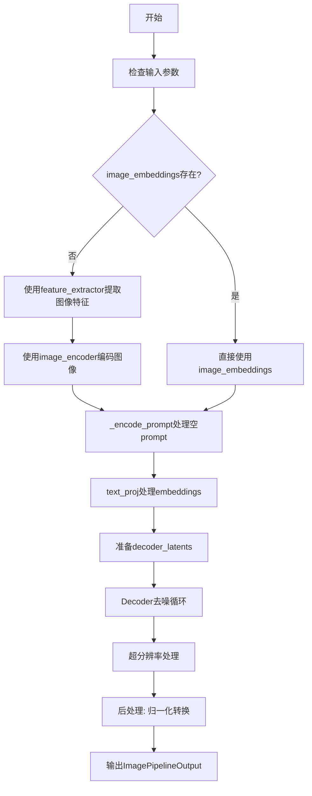
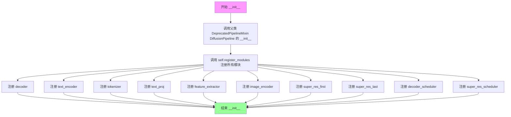
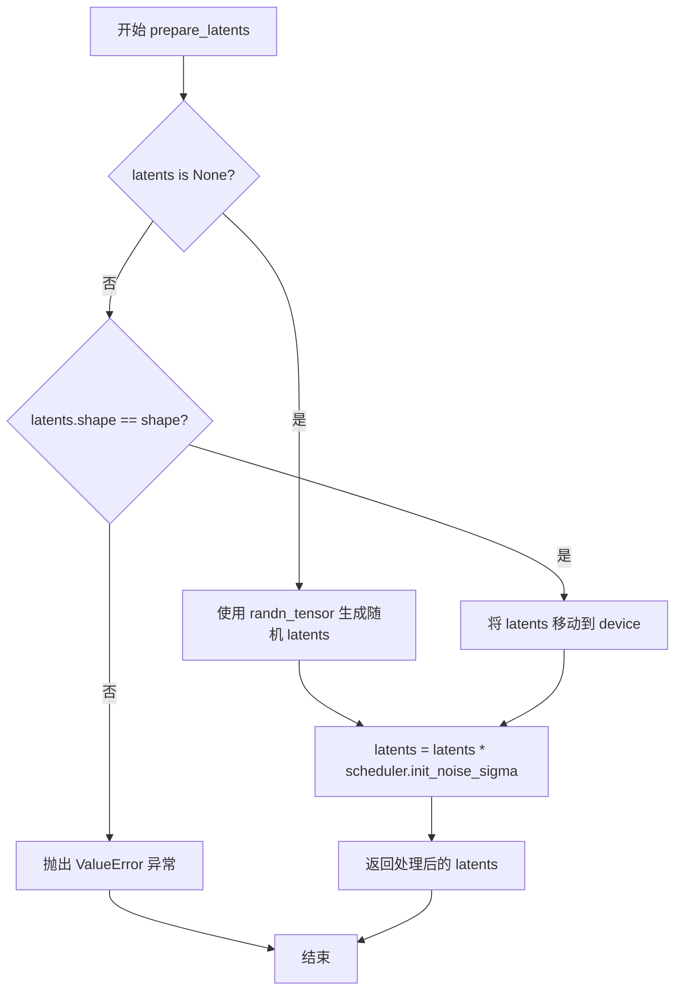
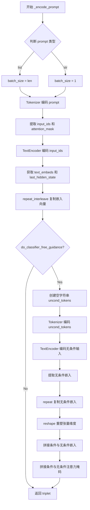
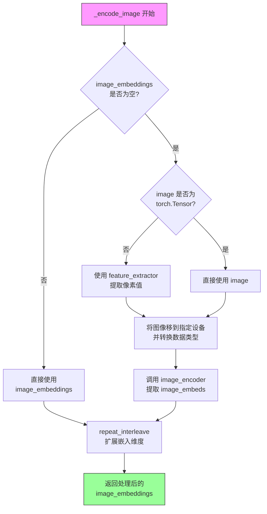
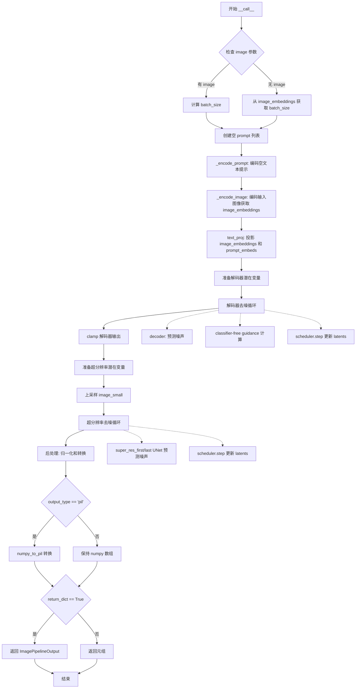

# `diffusers\src\diffusers\pipelines\unclip\pipeline_unclip_image_variation.py` 详细设计文档

UnCLIPImageVariationPipeline是用于根据输入图像生成图像变体的扩散管道。该管道结合了CLIP图像编码器和条件扩散模型，通过两阶段过程生成高质量图像：首先使用解码器UNet从图像embedding生成低分辨率图像，然后通过超分辨率UNet进行图像放大。

## 整体流程



## 类结构

```
DiffusionPipeline (基类)
├── DeprecatedPipelineMixin
│   └── UnCLIPImageVariationPipeline
│       ├── Components:
│       │   ├── decoder: UNet2DConditionModel
│       │   ├── text_proj: UnCLIPTextProjModel
│       │   ├── text_encoder: CLIPTextModelWithProjection
│       │   ├── tokenizer: CLIPTokenizer
│       │   ├── feature_extractor: CLIPImageProcessor
│       │   ├── image_encoder: CLIPVisionModelWithProjection
│       │   ├── super_res_first: UNet2DModel
│       │   ├── super_res_last: UNet2DModel
│       │   ├── decoder_scheduler: UnCLIPScheduler
│       │   └── super_res_scheduler: UnCLIPScheduler
```

## 全局变量及字段


### `logger`
    
Logger instance for the module, used for tracking runtime information and warnings.

类型：`logging.Logger`
    


### `XLA_AVAILABLE`
    
Boolean flag indicating whether PyTorch XLA is available for accelerated computation on TPU devices.

类型：`bool`
    


### `UnCLIPImageVariationPipeline._last_supported_version`
    
String representing the last supported version of the pipeline for compatibility checks.

类型：`str`
    


### `UnCLIPImageVariationPipeline.decoder`
    
The decoder UNet model used to invert image embeddings into images during the denoising process.

类型：`UNet2DConditionModel`
    


### `UnCLIPImageVariationPipeline.text_proj`
    
Utility class that prepares and combines text and image embeddings before passing to the decoder.

类型：`UnCLIPTextProjModel`
    


### `UnCLIPImageVariationPipeline.text_encoder`
    
Frozen CLIP text encoder used to generate text embeddings from input prompts.

类型：`CLIPTextModelWithProjection`
    


### `UnCLIPImageVariationPipeline.tokenizer`
    
CLIP tokenizer used to convert text prompts into token IDs for the text encoder.

类型：`CLIPTokenizer`
    


### `UnCLIPImageVariationPipeline.feature_extractor`
    
Model that extracts features from input images to be used by the image encoder.

类型：`CLIPImageProcessor`
    


### `UnCLIPImageVariationPipeline.image_encoder`
    
Frozen CLIP vision encoder that extracts image embeddings from input images.

类型：`CLIPVisionModelWithProjection`
    


### `UnCLIPImageVariationPipeline.super_res_first`
    
Super resolution UNet used in all but the last step of the super resolution diffusion process.

类型：`UNet2DModel`
    


### `UnCLIPImageVariationPipeline.super_res_last`
    
Super resolution UNet used in the final step of the super resolution diffusion process.

类型：`UNet2DModel`
    


### `UnCLIPImageVariationPipeline.decoder_scheduler`
    
Scheduler used in the decoder denoising process for managing noise addition and removal.

类型：`UnCLIPScheduler`
    


### `UnCLIPImageVariationPipeline.super_res_scheduler`
    
Scheduler used in the super resolution denoising process for managing noise addition and removal.

类型：`UnCLIPScheduler`
    


### `UnCLIPImageVariationPipeline.model_cpu_offload_seq`
    
String defining the sequence of models for CPU offloading to manage memory efficiently.

类型：`str`
    
    

## 全局函数及方法


### `UnCLIPImageVariationPipeline.__init__`

初始化 UnCLIP 图像变体管道，设置所有必需的模型组件（包括文本编码器、图像编码器、文本投影模型、解码器、超分辨率 UNet 模型）以及调度器，并将其注册到管道中。

参数：

- `decoder`：`UNet2DConditionModel`，解码器模型，用于将图像嵌入反转回图像
- `text_encoder`：`CLIPTextModelWithProjection`，冻结的文本编码器
- `tokenizer`：`CLIPTokenizer`，用于对文本进行分词的 CLIPTokenizer
- `text_proj`：`UnCLIPTextProjModel`，实用类，用于在传递给解码器之前准备和组合嵌入
- `feature_extractor`：`CLIPImageProcessor`，从生成的图像中提取特征以作为 image_encoder 输入的模型
- `image_encoder`：`CLIPVisionModelWithProjection`，冻结的 CLIP 图像编码器
- `super_res_first`：`UNet2DModel`，超分辨率 UNet，用于超分辨率扩散过程的所有步骤（除最后一步外）
- `super_res_last`：`UNet2DModel`，超分辨率 UNet，用于超分辨率扩散过程的最后一步
- `decoder_scheduler`：`UnCLIPScheduler`，解码器去噪过程中使用的调度器（修改后的 DDPMScheduler）
- `super_res_scheduler`：`UnCLIPScheduler`，超分辨率去噪过程中使用的调度器（修改后的 DDPMScheduler）

返回值：`None`，无返回值（构造函数）

#### 流程图



#### 带注释源码

```python
def __init__(
    self,
    decoder: UNet2DConditionModel,
    text_encoder: CLIPTextModelWithProjection,
    tokenizer: CLIPTokenizer,
    text_proj: UnCLIPTextProjModel,
    feature_extractor: CLIPImageProcessor,
    image_encoder: CLIPVisionModelWithProjection,
    super_res_first: UNet2DModel,
    super_res_last: UNet2DModel,
    decoder_scheduler: UnCLIPScheduler,
    super_res_scheduler: UnCLIPScheduler,
):
    """
    初始化 UnCLIPImageVariationPipeline 管道

    参数:
        decoder: UNet2DConditionModel，解码器模型
        text_encoder: CLIPTextModelWithProjection，文本编码器
        tokenizer: CLIPTokenizer，分词器
        text_proj: UnCLIPTextProjModel，文本投影模型
        feature_extractor: CLIPImageProcessor，特征提取器
        image_encoder: CLIPVisionModelWithProjection，图像编码器
        super_res_first: UNet2DModel，第一个超分辨率模型
        super_res_last: UNet2DModel，最后一个超分辨率模型
        decoder_scheduler: UnCLIPScheduler，解码器调度器
        super_res_scheduler: UnCLIPScheduler，超分辨率调度器
    """
    # 调用父类的初始化方法
    # DeprecatedPipelineMixin 提供了一些弃用相关的功能
    # DiffusionPipeline 是所有扩散管道的基础类
    super().__init__()

    # 使用 register_modules 方法注册所有模型组件和调度器
    # 这个方法会设置这些组件为管道的属性，并支持模型卸载等功能
    self.register_modules(
        decoder=decoder,
        text_encoder=text_encoder,
        tokenizer=tokenizer,
        text_proj=text_proj,
        feature_extractor=feature_extractor,
        image_encoder=image_encoder,
        super_res_first=super_res_first,
        super_res_last=super_res_last,
        decoder_scheduler=decoder_scheduler,
        super_res_scheduler=super_res_scheduler,
    )
```


### `UnCLIPImageVariationPipeline.prepare_latents`

该方法用于准备扩散模型的初始潜变量（latents）。如果调用者未提供 latents，则使用随机张量生成；否则验证提供的 latents 形状是否符合预期，并将其移动到目标设备。最后，根据调度器的初始噪声标准差对 latents 进行缩放，为去噪过程准备初始输入。

参数：

- `shape`：`tuple` 或 `torch.Size`，期望的 latents 张量形状
- `dtype`：`torch.dtype`，latents 的数据类型
- `device`：`torch.device`，运行设备
- `generator`：`torch.Generator` 或 `None`，用于生成随机数的生成器，以确保可复现性
- `latents`：`torch.Tensor` 或 `None`，预提供的 latents 张量，如果为 `None` 则随机生成
- `scheduler`：`UnCLIPScheduler`，调度器实例，用于获取初始噪声标准差

返回值：`torch.Tensor`，处理后的 latents 张量，已根据调度器的 `init_noise_sigma` 进行缩放

#### 流程图



#### 带注释源码

```python
def prepare_latents(self, shape, dtype, device, generator, latents, scheduler):
    """
    准备扩散模型的初始潜变量（latents）
    
    参数:
        shape: 期望的latents张量形状
        dtype: latents的数据类型
        device: 运行设备
        generator: 随机数生成器
        latents: 预提供的latents张量，如果为None则随机生成
        scheduler: 调度器实例，用于获取初始噪声标准差
    
    返回:
        处理后的latents张量
    """
    # 检查是否需要生成随机latents
    if latents is None:
        # 使用randn_tensor生成指定形状的随机正态分布张量
        latents = randn_tensor(shape, generator=generator, device=device, dtype=dtype)
    else:
        # 如果提供了latents，验证其形状是否符合预期
        if latents.shape != shape:
            raise ValueError(f"Unexpected latents shape, got {latents.shape}, expected {shape}")
        # 将latents移动到目标设备
        latents = latents.to(device)

    # 根据调度器的初始噪声标准差对latents进行缩放
    # 这是扩散模型去噪过程的关键步骤
    latents = latents * scheduler.init_noise_sigma
    return latents
```


### `UnCLIPImageVariationPipeline._encode_prompt`

该方法负责将文本提示（prompt）编码为文本嵌入向量（text embeddings）和文本编码器的隐藏状态（hidden states），并根据是否启用无分类器自由引导（Classifier-Free Guidance，CFG）生成条件和无条件嵌入，以便后续用于图像生成任务。

参数：

- `prompt`：`str` 或 `list[str]`，要编码的文本提示，可以是单个字符串或字符串列表
- `device`：`torch.device`，执行运算的目标设备（如 CPU 或 CUDA 设备）
- `num_images_per_prompt`：`int`，每个提示要生成的图像数量，用于复制嵌入向量以匹配批量大小
- `do_classifier_free_guidance`：`bool`，是否启用无分类器自由引导，若为 `True` 则会生成无条件嵌入用于引导

返回值：元组 `(prompt_embeds, text_encoder_hidden_states, text_mask)`，其中 `prompt_embeds` 为 `torch.Tensor`（文本嵌入向量）、`text_encoder_hidden_states` 为 `torch.Tensor`（文本编码器的最后隐藏状态）、`text_mask` 为 `torch.Tensor`（注意力掩码）

#### 流程图



#### 带注释源码

```python
def _encode_prompt(self, prompt, device, num_images_per_prompt, do_classifier_free_guidance):
    # 确定批量大小：若 prompt 为列表则取其长度，否则为 1
    batch_size = len(prompt) if isinstance(prompt, list) else 1

    # ===== 第一部分：编码条件 prompt（条件嵌入）=====
    # 使用 tokenizer 将文本 prompt 转换为 token IDs 和注意力掩码
    text_inputs = self.tokenizer(
        prompt,
        padding="max_length",
        max_length=self.tokenizer.model_max_length,
        return_tensors="pt",
    )
    # 提取 input_ids 和 attention_mask，并将掩码转换为布尔值后移至指定设备
    text_input_ids = text_inputs.input_ids
    text_mask = text_inputs.attention_mask.bool().to(device)
    
    # 使用 text_encoder 将 token IDs 编码为文本嵌入
    text_encoder_output = self.text_encoder(text_input_ids.to(device))

    # 提取文本嵌入和最后隐藏状态
    prompt_embeds = text_encoder_output.text_embeds
    text_encoder_hidden_states = text_encoder_output.last_hidden_state

    # 根据 num_images_per_prompt 复制嵌入向量，以支持每 prompt 生成多张图像
    # repeat_interleave 在指定维度上重复张量
    prompt_embeds = prompt_embeds.repeat_interleave(num_images_per_prompt, dim=0)
    text_encoder_hidden_states = text_encoder_hidden_states.repeat_interleave(num_images_per_prompt, dim=0)
    text_mask = text_mask.repeat_interleave(num_images_per_prompt, dim=0)

    # ===== 第二部分：若启用 CFG，生成无条件嵌入（unconditional embeddings）=====
    if do_classifier_free_guidance:
        # 创建空字符串列表作为无条件 prompt（对应无文本输入的情况）
        uncond_tokens = [""] * batch_size

        # 获取条件输入的最大长度，用于tokenizer
        max_length = text_input_ids.shape[-1]
        # 对无条件 prompt 进行 tokenize（支持截断）
        uncond_input = self.tokenizer(
            uncond_tokens,
            padding="max_length",
            max_length=max_length,
            truncation=True,
            return_tensors="pt",
        )
        # 处理无条件输入的注意力掩码
        uncond_text_mask = uncond_input.attention_mask.bool().to(device)
        # 编码无条件输入
        negative_prompt_embeds_text_encoder_output = self.text_encoder(uncond_input.input_ids.to(device))

        # 提取无条件嵌入和隐藏状态
        negative_prompt_embeds = negative_prompt_embeds_text_encoder_output.text_embeds
        uncond_text_encoder_hidden_states = negative_prompt_embeds_text_encoder_output.last_hidden_state

        # ===== 复制无条件嵌入以匹配批量大小 =====
        # 使用 repeat 方法而非 repeat_interleave，以兼容 MPS 设备
        seq_len = negative_prompt_embeds.shape[1]
        negative_prompt_embeds = negative_prompt_embeds.repeat(1, num_images_per_prompt)
        # 重塑为 (batch_size * num_images_per_prompt, seq_len) 的形状
        negative_prompt_embeds = negative_prompt_embeds.view(batch_size * num_images_per_prompt, seq_len)

        # 同样处理无条件隐藏状态
        seq_len = uncond_text_encoder_hidden_states.shape[1]
        uncond_text_encoder_hidden_states = uncond_text_encoder_hidden_states.repeat(1, num_images_per_prompt, 1)
        uncond_text_encoder_hidden_states = uncond_text_encoder_hidden_states.view(
            batch_size * num_images_per_prompt, seq_len, -1
        )
        # 复制注意力掩码
        uncond_text_mask = uncond_text_mask.repeat_interleave(num_images_per_prompt, dim=0)

        # ===== 第三部分：拼接条件与无条件嵌入 =====
        # 在 batch 维度上拼接：前半部分为无条件，后半部分为条件
        # 这样做是为了在单次前向传播中同时计算条件和无条件的噪声预测
        prompt_embeds = torch.cat([negative_prompt_embeds, prompt_embeds])
        text_encoder_hidden_states = torch.cat([uncond_text_encoder_hidden_states, text_encoder_hidden_states])
        text_mask = torch.cat([uncond_text_mask, text_mask])

    # 返回编码后的 prompt 嵌入、隐藏状态和注意力掩码
    return prompt_embeds, text_encoder_hidden_states, text_mask
```


### `UnCLIPImageVariationPipeline._encode_image`

该方法用于将输入图像编码为图像嵌入向量（image embeddings），供后续的解码器在生成图像变体时使用。如果未提供预计算的图像嵌入，则使用 CLIP 图像编码器（`image_encoder`）从输入图像中提取特征。

参数：

- `image`：`PIL.Image.Image | list[PIL.Image.Image] | torch.Tensor`，要编码的输入图像，支持单张图像、图像列表或张量形式。若提供 `image_embeddings` 则可设为 `None`
- `device`：`torch.device`，执行运算的目标设备（如 CUDA、CPU）
- `num_images_per_prompt`：`int`，每个提示词生成的图像数量，用于决定嵌入向量的复制次数
- `image_embeddings`：`torch.Tensor | None`，可选的预计算图像嵌入。若为 `None`，则根据 `image` 参数自动计算

返回值：`torch.Tensor`，编码后的图像嵌入向量，形状为 `(batch_size * num_images_per_prompt, embedding_dim)`

#### 流程图



#### 带注释源码

```python
def _encode_image(self, image, device, num_images_per_prompt, image_embeddings: torch.Tensor | None = None):
    """
    Encode image to image embeddings using CLIP image encoder.
    
    Args:
        image: Input image(s) to encode
        device: Target device for computation
        num_images_per_prompt: Number of images to generate per prompt
        image_embeddings: Optional pre-computed image embeddings
    
    Returns:
        Encoded image embeddings repeated for num_images_per_prompt
    """
    # 获取图像编码器的参数数据类型，用于后续计算
    dtype = next(self.image_encoder.parameters()).dtype

    # 如果没有预计算的图像嵌入，则需要从输入图像计算
    if image_embeddings is None:
        # 如果输入不是 PyTorch 张量，则使用特征提取器处理
        if not isinstance(image, torch.Tensor):
            # 使用 CLIP 特征提取器将 PIL 图像转换为像素值张量
            image = self.feature_extractor(images=image, return_tensors="pt").pixel_values

        # 将图像移动到目标设备并转换为正确的dtype
        image = image.to(device=device, dtype=dtype)
        
        # 通过 CLIP 图像编码器获取图像嵌入
        # image_embeds 是从 vision transformer 提取的全局图像表示
        image_embeddings = self.image_encoder(image).image_embeds

    # 根据 num_images_per_prompt 复制图像嵌入，以支持批量生成
    # 例如：如果 batch_size=1, num_images_per_prompt=3
    # 则 image_embeddings 会从 (1, 768) 扩展为 (3, 768)
    image_embeddings = image_embeddings.repeat_interleave(num_images_per_prompt, dim=0)

    return image_embeddings
```


### `UnCLIPImageVariationPipeline.__call__`

该方法是 UnCLIP 图像变体管道的核心调用函数，负责从输入图像生成图像变体。流程包括：首先对输入图像进行 CLIP 编码得到图像嵌入，然后通过文本投影器结合文本提示嵌入，接着使用解码器 UNet 进行去噪扩散生成较小图像，最后通过超分辨率 UNet 进行两步上采样生成最终的高质量图像。

参数：

- `image`：`PIL.Image.Image | list[PIL.Image.Image] | torch.Tensor | None`，用作生成起点的输入图像或图像批次。如果提供 `image_embeddings`，则可以为空
- `num_images_per_prompt`：`int`，每个提示生成的图像数量，默认为 1
- `decoder_num_inference_steps`：`int`，解码器的去噪步骤数，默认为 25
- `super_res_num_inference_steps`：`int`，超分辨率的去噪步骤数，默认为 7
- `generator`：`torch.Generator | None`，用于使生成具有确定性的随机数生成器
- `decoder_latents`：`torch.Tensor | None`，解码器使用的预生成噪声潜在变量
- `super_res_latents`：`torch.Tensor | None`，超分辨率使用的预生成噪声潜在变量
- `image_embeddings`：`torch.Tensor | None`，预定义的图像嵌入，可用于图像插值等任务
- `decoder_guidance_scale`：`float`，解码器的引导尺度，值越高生成的图像与文本提示越相关，默认为 8.0
- `output_type`：`str | None`，生成图像的输出格式，可选 "pil" 或 "np.array"，默认为 "pil"
- `return_dict`：`bool`，是否返回 `ImagePipelineOutput` 而不是元组，默认为 True

返回值：`ImagePipelineOutput | tuple`，如果 `return_dict` 为 True，返回 `ImagePipelineOutput` 对象，包含生成的图像列表；否则返回元组，第一个元素是生成的图像列表

#### 流程图



#### 带注释源码

```python
@torch.no_grad()
def __call__(
    self,
    image: PIL.Image.Image | list[PIL.Image.Image] | torch.Tensor | None = None,
    num_images_per_prompt: int = 1,
    decoder_num_inference_steps: int = 25,
    super_res_num_inference_steps: int = 7,
    generator: torch.Generator | None = None,
    decoder_latents: torch.Tensor | None = None,
    super_res_latents: torch.Tensor | None = None,
    image_embeddings: torch.Tensor | None = None,
    decoder_guidance_scale: float = 8.0,
    output_type: str | None = "pil",
    return_dict: bool = True,
):
    """
    The call function to the pipeline for generation.

    Args:
        image: Image or tensor representing an image batch to be used as the starting point.
            Can be left as None only when image_embeddings are passed.
        num_images_per_prompt: The number of images to generate per prompt.
        decoder_num_inference_steps: The number of denoising steps for the decoder.
        super_res_num_inference_steps: The number of denoising steps for super resolution.
        generator: A torch.Generator to make generation deterministic.
        decoder_latents: Pre-generated noisy latents for the decoder.
        super_res_latents: Pre-generated noisy latents for super resolution.
        decoder_guidance_scale: A higher guidance scale value encourages the model to generate 
            images closely linked to the text prompt at the expense of lower image quality.
        image_embeddings: Pre-defined image embeddings derived from the image encoder.
        output_type: The output format of the generated image. Choose between PIL.Image or np.array.
        return_dict: Whether or not to return a ImagePipelineOutput instead of a plain tuple.

    Returns:
        ImagePipelineOutput or tuple: Generated images.
    """
    # Step 1: 确定批次大小
    if image is not None:
        if isinstance(image, PIL.Image.Image):
            batch_size = 1
        elif isinstance(image, list):
            batch_size = len(image)
        else:
            batch_size = image.shape[0]
    else:
        # 如果没有提供图像，则必须提供 image_embeddings
        batch_size = image_embeddings.shape[0]

    # Step 2: 创建空文本提示（因为这是图像变体任务，不需要文本提示）
    prompt = [""] * batch_size

    # 获取执行设备
    device = self._execution_device

    # 根据 num_images_per_prompt 扩展批次大小
    batch_size = batch_size * num_images_per_prompt

    # 确定是否使用 classifier-free guidance
    do_classifier_free_guidance = decoder_guidance_scale > 1.0

    # Step 3: 编码文本提示（实际上是空提示）
    prompt_embeds, text_encoder_hidden_states, text_mask = self._encode_prompt(
        prompt, device, num_images_per_prompt, do_classifier_free_guidance
    )

    # Step 4: 编码输入图像获取图像嵌入
    image_embeddings = self._encode_image(image, device, num_images_per_prompt, image_embeddings)

    # Step 5: 使用文本投影器处理嵌入
    text_encoder_hidden_states, additive_clip_time_embeddings = self.text_proj(
        image_embeddings=image_embeddings,
        prompt_embeds=prompt_embeds,
        text_encoder_hidden_states=text_encoder_hidden_states,
        do_classifier_free_guidance=do_classifier_free_guidance,
    )

    # Step 6: 准备解码器的文本注意力掩码
    if device.type == "mps":
        # MPS 特殊处理：MPS 对 bool 张量 padding 会 panic
        text_mask = text_mask.type(torch.int)
        decoder_text_mask = F.pad(text_mask, (self.text_proj.clip_extra_context_tokens, 0), value=1)
        decoder_text_mask = decoder_text_mask.type(torch.bool)
    else:
        decoder_text_mask = F.pad(text_mask, (self.text_proj.clip_extra_context_tokens, 0), value=True)

    # Step 7: 解码器去噪过程
    self.decoder_scheduler.set_timesteps(decoder_num_inference_steps, device=device)
    decoder_timesteps_tensor = self.decoder_scheduler.timesteps

    num_channels_latents = self.decoder.config.in_channels
    height = self.decoder.config.sample_size
    width = self.decoder.config.sample_size

    # 准备解码器潜在变量
    if decoder_latents is None:
        decoder_latents = self.prepare_latents(
            (batch_size, num_channels_latents, height, width),
            text_encoder_hidden_states.dtype,
            device,
            generator,
            decoder_latents,
            self.decoder_scheduler,
        )

    # 解码器去噪循环
    for i, t in enumerate(self.progress_bar(decoder_timesteps_tensor)):
        # 如果使用 classifier-free guidance，扩展潜在变量
        latent_model_input = torch.cat([decoder_latents] * 2) if do_classifier_free_guidance else decoder_latents

        # 预测噪声
        noise_pred = self.decoder(
            sample=latent_model_input,
            timestep=t,
            encoder_hidden_states=text_encoder_hidden_states,
            class_labels=additive_clip_time_embeddings,
            attention_mask=decoder_text_mask,
        ).sample

        # Classifier-free guidance 处理
        if do_classifier_free_guidance:
            noise_pred_uncond, noise_pred_text = noise_pred.chunk(2)
            noise_pred_uncond, _ = noise_pred_uncond.split(latent_model_input.shape[1], dim=1)
            noise_pred_text, predicted_variance = noise_pred_text.split(latent_model_input.shape[1], dim=1)
            noise_pred = noise_pred_uncond + decoder_guidance_scale * (noise_pred_text - noise_pred_uncond)
            noise_pred = torch.cat([noise_pred, predicted_variance], dim=1)

        # 计算上一步的 timestep
        if i + 1 == decoder_timesteps_tensor.shape[0]:
            prev_timestep = None
        else:
            prev_timestep = decoder_timesteps_tensor[i + 1]

        # 通过 scheduler 计算上一步的去噪结果
        decoder_latents = self.decoder_scheduler.step(
            noise_pred, t, decoder_latents, prev_timestep=prev_timestep, generator=generator
        ).prev_sample

    # 解码器输出 clamp 到有效范围
    decoder_latents = decoder_latents.clamp(-1, 1)

    # 获取小尺寸图像
    image_small = decoder_latents

    # Step 8: 超分辨率处理
    self.super_res_scheduler.set_timesteps(super_res_num_inference_steps, device=device)
    super_res_timesteps_tensor = self.super_res_scheduler.timesteps

    channels = self.super_res_first.config.in_channels // 2
    height = self.super_res_first.config.sample_size
    width = self.super_res_first.config.sample_size

    # 准备超分辨率潜在变量
    if super_res_latents is None:
        super_res_latents = self.prepare_latents(
            (batch_size, channels, height, width),
            image_small.dtype,
            device,
            generator,
            super_res_latents,
            self.super_res_scheduler,
        )

    # 上采样小图像到目标分辨率
    if device.type == "mps":
        # MPS 不支持许多插值方法
        image_upscaled = F.interpolate(image_small, size=[height, width])
    else:
        interpolate_antialias = {}
        if "antialias" in inspect.signature(F.interpolate).parameters:
            interpolate_antialias["antialias"] = True

        image_upscaled = F.interpolate(
            image_small, size=[height, width], mode="bicubic", align_corners=False, **interpolate_antialias
        )

    # 超分辨率去噪循环
    for i, t in enumerate(self.progress_bar(super_res_timesteps_tensor)):
        # 选择使用哪个超分辨率 UNet（最后一个 step 使用 super_res_last）
        if i == super_res_timesteps_tensor.shape[0] - 1:
            unet = self.super_res_last
        else:
            unet = self.super_res_first

        # 拼接潜在变量和上采样图像
        latent_model_input = torch.cat([super_res_latents, image_upscaled], dim=1)

        # 预测噪声（超分辨率不使用 classifier-free guidance）
        noise_pred = unet(
            sample=latent_model_input,
            timestep=t,
        ).sample

        # 计算上一步的 timestep
        if i + 1 == super_res_timesteps_tensor.shape[0]:
            prev_timestep = None
        else:
            prev_timestep = super_res_timesteps_tensor[i + 1]

        # 通过 scheduler 计算上一步的去噪结果
        super_res_latents = self.super_res_scheduler.step(
            noise_pred, t, super_res_latents, prev_timestep=prev_timestep, generator=generator
        ).prev_sample

        # XLA 设备特殊处理
        if XLA_AVAILABLE:
            xm.mark_step()

    # 获取最终图像
    image = super_res_latents

    # 释放模型钩子
    self.maybe_free_model_hooks()

    # Step 9: 后处理
    # 将图像从 [-1, 1] 范围转换到 [0, 1] 范围
    image = image * 0.5 + 0.5
    image = image.clamp(0, 1)
    # 转换为 numpy 数组并调整维度顺序 (B, C, H, W) -> (B, H, W, C)
    image = image.cpu().permute(0, 2, 3, 1).float().numpy()

    # 根据 output_type 转换格式
    if output_type == "pil":
        image = self.numpy_to_pil(image)

    # 返回结果
    if not return_dict:
        return (image,)

    return ImagePipelineOutput(images=image)
```

## 关键组件


### UnCLIPImageVariationPipeline

核心管道类，继承自DiffusionPipeline，用于根据输入图像生成图像变体。集成了CLIP文本/图像编码器、UNet解码器和超分辨率模型的两阶段扩散过程。

### prepare_latents

准备解码器潜在变量的方法。根据形状、设备和数据类型生成随机张量或使用提供的latents，并乘以调度器的初始噪声sigma进行缩放。

### _encode_prompt

编码文本提示的方法。将文本token化后通过CLIPTextModelWithProjection获取文本嵌入，支持classifier-free guidance，会生成无条件嵌入并与条件嵌入拼接。

### _encode_image

编码输入图像的方法。支持直接传入image_embeddings或从PIL图像/张量提取特征，通过CLIPVisionModelWithProjection生成图像嵌入。

### __call__

主管道调用方法，执行完整的图像变体生成流程。包含decoder和super-res两个去噪阶段，支持分类器自由引导、潜在变量预填充、推理步骤数和Guidance Scale配置。

### text_proj (UnCLIPTextProjModel)

文本投影模型组件，用于准备和组合图像嵌入与文本嵌入，生成解码器所需的条件嵌入和额外的CLIP时间嵌入。

### decoder (UNet2DConditionModel)

主解码器UNet模型，将图像嵌入反转重建为图像，执行主要的去噪扩散过程。

### super_res_first / super_res_last (UNet2DModel)

超分辨率UNet模型对。first用于除最后一步外所有步骤，最后一步使用last进行最终高清化处理。

### text_encoder (CLIPTextModelWithProjection)

冻结的CLIP文本编码器，从tokenized文本生成文本嵌入和隐藏状态，用于条件生成。

### image_encoder (CLIPVisionModelWithProjection)

冻结的CLIP图像编码器，从输入图像生成图像嵌入，作为图像变体生成的核心条件。

### tokenizer (CLIPTokenizer)

CLIP分词器，将文本提示转换为token IDs供文本编码器使用。

### feature_extractor (CLIPImageProcessor)

特征提取器，将PIL图像转换为像素值张量供图像编码器使用。

### decoder_scheduler / super_res_scheduler (UnCLIPScheduler)

去噪调度器，管理扩散过程中的时间步和噪声预测到样本的反向推演。

### 张量索引与惰性加载

通过image_embeddings可选参数支持预计算图像嵌入的复用，避免重复编码；decoder_latents和super_res_latents支持外部传入实现状态复用。

### 反量化支持

在decoder完成后执行clamp(-1, 1)限制范围，post-processing阶段通过image * 0.5 + 0.5和clamp(0, 1)将输出归一化到[0,1]。

### model_cpu_offload_seq

定义模型卸载顺序：text_encoder->image_encoder->text_proj->decoder->super_res_first->super_res_last，优化内存使用。

### MPS设备特殊处理

对MPS设备进行特殊处理：bool张量padding问题使用int中转；interpolate使用F.interpolate而非支持antialias参数的版本。


## 问题及建议


### 已知问题

- **文档与代码不一致**：`__call__`方法中`decoder_guidance_scale`参数的实际默认值是`8.0`，但docstring中描述为`defaults to 4.0`，会导致用户困惑。
- **MPS设备特殊处理缺乏抽象**：`device.type == "mps"`的判断逻辑散落在代码中（文本mask处理和插值操作），增加了代码复杂度和维护成本。
- **XLA优化不充分**：`xm.mark_step()`仅在super-res循环结束后调用一次，无法充分发挥XLA的即时编译优化能力。
- **输入验证不足**：未对`image`和`image_embeddings`同时为`None`的情况进行严格校验，可能导致后续执行出现不清晰的错误。
- **类型注解不兼容旧版Python**：使用了Python 3.10+的联合类型语法`PIL.Image.Image | list[PIL.Image.Image]`，降低了代码对旧环境的兼容性。
- **重复的embedding处理逻辑**：在`_encode_prompt`中处理`repeat_interleave`和`repeat`操作时存在重复的维度操作代码，可以抽取为通用函数。
- **潜在的版本兼容性问题**：`_last_supported_version`被硬编码为`0.33.1`，但该值从未在实际代码逻辑中被使用，形同虚设。

### 优化建议

- 修正`decoder_guidance_scale`的docstring描述，或将默认值改为4.0以保持一致。
- 将MPS相关的特殊处理封装到工具函数或`torch_utils`模块中，提高代码可读性。
- 考虑在super-res循环的每个迭代中都调用`xm.mark_step()`（或在循环外批量处理），以更好地利用XLA性能。
- 在`__call__`方法开头增加输入校验逻辑，确保`image`和`image_embeddings`至少有一个非`None`。
- 将联合类型注解改为`Optional`或`Union`形式以兼容Python 3.9以下版本。
- 抽取`_encode_prompt`中重复的embedding处理逻辑为私有辅助方法。
- 移除未使用的`_last_supported_version`类属性，或实现实际的版本检查逻辑。

## 其它


### 设计目标与约束

本pipeline的设计目标是根据输入图像生成图像变体（image variations）。该功能基于UnCLIP（UnCLIP是DALL-E 2的变体）架构，通过图像编码器提取输入图像的embedding，然后利用diffusion model进行去噪生成，最终通过超分辨率模型提升图像质量。设计约束包括：1）输入图像需要与CLIP图像处理器兼容；2）生成的图像质量与去噪步数正相关；3）decoder_guidance_scale参数需大于1才能启用分类器自由引导；4）需要足够的GPU显存来处理多阶段的diffusion过程。

### 错误处理与异常设计

代码中的错误处理主要包括：1）ValueError异常：当latents形状与预期形状不匹配时抛出；2）设备兼容性处理：MPS设备需要对bool类型tensor进行特殊处理（转换为int类型进行pad操作后再转回bool）；3）XLA支持：通过is_torch_xla_available检查启用torch_xla的mark_step优化；4）图像类型检查：支持PIL.Image、list[PIL.Image]和torch.Tensor三种输入格式；5）空值处理：当image为None时必须提供image_embeddings参数。

### 数据流与状态机

数据流经过以下主要阶段：1）初始化阶段：注册所有必要模块（decoder、text_encoder、tokenizer、text_proj、feature_extractor、image_encoder、super_res_first、super_res_last、scheduler等）；2）编码阶段：_encode_prompt处理文本embedding（虽然本pipeline使用空prompt），_encode_image处理输入图像提取image_embeddings；3）文本投影阶段：text_proj将image_embeddings与prompt_embeds结合生成条件embedding；4）主扩散阶段（decoder）：通过UNet2DConditionModel进行多步去噪生成小尺寸图像；5）超分辨率阶段（super resolution）：两阶段超分（super_res_first和super_res_last）将图像放大至最终尺寸；6）后处理阶段：图像归一化、格式转换（PIL或numpy数组）。

### 外部依赖与接口契约

主要外部依赖包括：1）transformers库：CLIPTextModelWithProjection、CLIPTokenizer、CLIPImageProcessor、CLIPVisionModelWithProjection；2）diffusers内部模块：UNet2DConditionModel、UNet2DModel、UnCLIPScheduler、DiffusionPipeline；3）辅助工具：PIL.Image、torch、torch.nn.functional F、inspect模块；4）可选依赖：torch_xla（用于XLA设备加速）。接口契约方面：输入image支持PIL.Image、list[PIL.Image]或torch.Tensor；image_embeddings为可选预计算embedding；generator用于确定性生成；decoder_latents和super_res_latents允许用户自定义初始噪声；output_type支持"pil"或numpy数组；return_dict控制返回值格式。

### 安全性与权限

代码遵循Apache License 2.0开源协议。模型权重加载需要注意：1）text_encoder和image_encoder为冻结状态（frozen），不参与训练；2）pipeline提供了model_cpu_offload_seq指定模型卸载顺序以节省显存；3）maybe_free_model_hooks()用于在生成完成后释放模型内存。安全考量包括：输入图像的合法性检查、防止通过恶意构造的prompt进行不当生成（虽然本pipeline主要基于图像而非文本）。

### 性能考虑

性能优化点包括：1）模型卸载：支持CPU offload和sequential CPU offload（通过model_cpu_offload_seq配置）；2）XLA加速：对于TPU设备使用torch_xla的mark_step进行编译优化；3）内存效率：使用torch.no_grad()装饰器禁用梯度计算；4）MPS兼容性处理：针对Apple Silicon的MPS设备特殊处理bool tensor的pad操作；5）去噪步数控制：decoder_num_inference_steps和super_res_num_inference_steps允许用户权衡质量与速度；6）批处理优化：num_images_per_prompt参数支持单次生成多张图像。

### 版本兼容性

_last_supported_version = "0.33.1" 指定了最后一个支持的版本号。该pipeline继承自DeprecatedPipelineMixin，表明已标记为弃用，未来版本可能移除。代码从diffusers.pipelines.unclip.pipeline_unclip.UnCLIPPipeline的prepare_latents方法复制而来，确保了API一致性。兼容性检查包括：1）torch版本要求；2）Python版本（通常要求Python 3.8+）；3）CUDA版本要求（对于GPU加速）。

### 配置与参数

主要配置参数包括：1）decoder_num_inference_steps：默认25步主扩散去噪；2）super_res_num_inference_steps：默认7步超分辨率去噪；3）decoder_guidance_scale：默认8.0的分类器自由引导强度；4）num_images_per_prompt：默认1，每次prompt生成图像数量；5）output_type：默认"pil"，输出格式；6）return_dict：默认True返回ImagePipelineOutput对象。Scheduler配置通过decoder_scheduler和super_res_scheduler注册，支持自定义调度器。

### 测试考虑

测试应覆盖：1）不同输入类型（PIL.Image、list、tensor）的兼容性；2）image_embeddings预计算传递；3）自定义latents的传入；4）不同output_type的输出验证；5）MPS和XLA设备的特殊路径测试；6）guidance_scale不同值的生成质量对比；7）多图像批处理；8）显存使用和模型卸载功能。

### 使用示例

基础用法：
```python
from diffusers import UnCLIPImageVariationPipeline
import PIL.Image

pipe = UnCLIPImageVariationPipeline.from_pretrained("kakao-test/variation-unclip-l")
image = PIL.Image.open("input_image.jpg")
output = pipe(image)
variation_image = output.images[0]
```

高级用法（自定义参数）：
```python
output = pipe(
    image=image,
    num_images_per_prompt=4,
    decoder_num_inference_steps=50,
    super_res_num_inference_steps=15,
    decoder_guidance_scale=10.0,
    generator=torch.Generator().manual_seed(42)
)
```


    