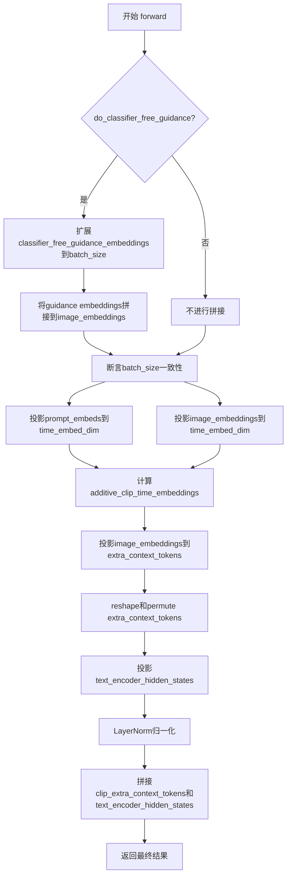
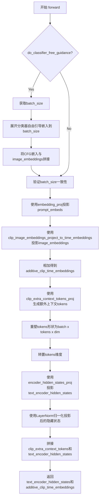
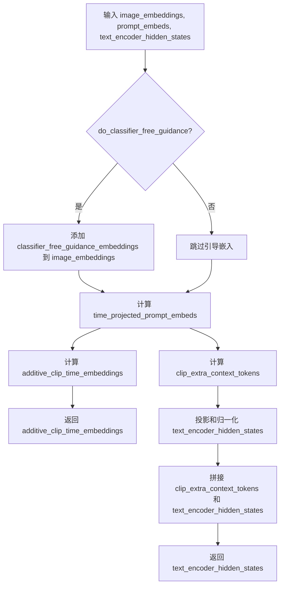

# `diffusers\src\diffusers\pipelines\unclip\text_proj.py` 详细设计文档

这是一个用于UnCLIP模型的文本投影模块，负责将CLIP图像和文本embeddings进行投影、融合以及添加时间步嵌入，生成可供decoder使用的上下文tokens和增强的时间embeddings，支持classifier-free guidance技术。

## 整体流程



## 类结构

```
ModelMixin (基类)
├── ConfigMixin (基类)
└── UnCLIPTextProjModel (具体实现类)
```

## 全局变量及字段


### `UnCLIPTextProjModel.learned_classifier_free_guidance_embeddings`
    
用于classifier-free guidance的可学习embeddings

类型：`nn.Parameter`
    


### `UnCLIPTextProjModel.embedding_proj`
    
将prompt embeddings投影到time embedding维度

类型：`nn.Linear`
    


### `UnCLIPTextProjModel.clip_image_embeddings_project_to_time_embeddings`
    
将图像embeddings投影到time embedding维度

类型：`nn.Linear`
    


### `UnCLIPTextProjModel.clip_extra_context_tokens`
    
额外的CLIP上下文token数量

类型：`int`
    


### `UnCLIPTextProjModel.clip_extra_context_tokens_proj`
    
将图像embeddings投影为额外context tokens

类型：`nn.Linear`
    


### `UnCLIPTextProjModel.encoder_hidden_states_proj`
    
将文本encoder的hidden states投影到cross_attention维度

类型：`nn.Linear`
    


### `UnCLIPTextProjModel.text_encoder_hidden_states_norm`
    
对投影后的hidden states进行层归一化

类型：`nn.LayerNorm`
    
    

## 全局函数及方法


### `UnCLIPTextProjModel.__init__`

初始化 UnCLIPTextProjModel 模型结构和可学习参数，包括 CLIP 嵌入投影层、上下文 token 投影层、编码器隐藏状态投影层以及层归一化模块，用于将图像和文本嵌入组合成decoder可用的格式。

参数：

- `clip_extra_context_tokens`：`int`，额外的 CLIP 上下文 token 数量，默认为 4
- `clip_embeddings_dim`：`int`，CLIP 嵌入维度，默认为 768
- `time_embed_dim`：`int`，时间嵌入维度（必填参数，无默认值）
- `cross_attention_dim`：`int`，跨注意力维度（必填参数，无默认值）

返回值：`None`，构造函数无返回值

#### 流程图

```mermaid
flowchart TD
    A[开始 __init__] --> B[调用 super().__init__ 初始化父类]
    B --> C[创建 learned_classifier_free_guidance_embeddings 参数]
    C --> D[创建 embedding_proj 线性层: clip_embeddings_dim → time_embed_dim]
    D --> E[创建 clip_image_embeddings_project_to_time_embeddings 线性层]
    E --> F[保存 clip_extra_context_tokens 值]
    F --> G[创建 clip_extra_context_tokens_proj 线性层]
    G --> H[创建 encoder_hidden_states_proj 线性层]
    H --> I[创建 text_encoder_hidden_states_norm 层归一化]
    I --> J[结束 __init__]
```

#### 带注释源码

```python
@register_to_config
def __init__(
    self,
    *,
    clip_extra_context_tokens: int = 4,
    clip_embeddings_dim: int = 768,
    time_embed_dim: int,
    cross_attention_dim,
):
    """
    初始化 UnCLIPTextProjModel 模型结构
    
    参数:
        clip_extra_context_tokens: 额外的 CLIP 上下文 token 数量，默认为 4
        clip_embeddings_dim: CLIP 嵌入维度，默认为 768
        time_embed_dim: 时间嵌入维度（必填）
        cross_attention_dim: 跨注意力维度（必填）
    """
    
    # 调用父类 ModelMixin 和 ConfigMixin 的初始化方法
    super().__init__()
    
    # 创建可学习的无分类器引导嵌入参数，形状为 (clip_embeddings_dim,)
    # 用于在 classifier-free guidance 时与图像嵌入拼接
    self.learned_classifier_free_guidance_embeddings = nn.Parameter(torch.zeros(clip_embeddings_dim))
    
    # ========== 用于处理时间嵌入的投影层 ==========
    
    # 将 prompt 嵌入投影到时间嵌入空间
    self.embedding_proj = nn.Linear(clip_embeddings_dim, time_embed_dim)
    
    # 将 CLIP 图像嵌入投影到时间嵌入空间
    self.clip_image_embeddings_project_to_time_embeddings = nn.Linear(clip_embeddings_dim, time_embed_dim)
    
    # ========== 用于处理编码器隐藏状态的投影层 ==========
    
    # 保存额外的 CLIP 上下文 token 数量
    self.clip_extra_context_tokens = clip_extra_context_tokens
    
    # 将图像嵌入投影为额外的上下文 tokens
    # 输出维度: clip_extra_context_tokens * cross_attention_dim
    self.clip_extra_context_tokens_proj = nn.Linear(
        clip_embeddings_dim, self.clip_extra_context_tokens * cross_attention_dim
    )
    
    # 将文本编码器的隐藏状态投影到跨注意力维度
    self.encoder_hidden_states_proj = nn.Linear(clip_embeddings_dim, cross_attention_dim)
    
    # 对投影后的文本编码器隐藏状态进行层归一化
    self.text_encoder_hidden_states_norm = nn.LayerNorm(cross_attention_dim)
```


### `UnCLIPTextProjModel.forward`

该方法执行UnCLIP文本投影模型的前向传播，负责将CLIP图像嵌入和文本嵌入进行投影、拼接和融合处理，输出可用于解码器的文本编码器隐藏状态和加性CLIP时间嵌入。

参数：

- `image_embeddings`：`torch.Tensor`，CLIP模型生成的图像嵌入向量
- `prompt_embeds`：`torch.Tensor`，文本提示的嵌入向量
- `text_encoder_hidden_states`：`torch.Tensor`，文本编码器的隐藏状态序列
- `do_classifier_free_guidance`：`bool`，是否启用分类器自由引导（CFG）技术

返回值：`Tuple[torch.Tensor, torch.Tensor]`，返回元组包含：
- `text_encoder_hidden_states`：处理并拼接后的文本编码器隐藏状态，包含额外的上下文tokens
- `additive_clip_time_embeddings`：融合后的CLIP时间嵌入，用于增强时间步表示

#### 流程图



#### 带注释源码

```python
def forward(self, *, image_embeddings, prompt_embeds, text_encoder_hidden_states, do_classifier_free_guidance):
    # 如果启用分类器自由引导（CFG），则将学习到的CFG嵌入拼接到图像嵌入
    if do_classifier_free_guidance:
        # 获取图像嵌入的batch大小
        image_embeddings_batch_size = image_embeddings.shape[0]
        # 获取学习到的CFG嵌入参数，并unsqueeze添加batch维度
        classifier_free_guidance_embeddings = self.learned_classifier_free_guidance_embeddings.unsqueeze(0)
        # 扩展CFG嵌入以匹配batch_size
        classifier_free_guidance_embeddings = classifier_free_guidance_embeddings.expand(
            image_embeddings_batch_size, -1
        )
        # 将CFG嵌入拼接到图像嵌入（CFG嵌入在前，原始图像嵌入在后）
        image_embeddings = torch.cat([classifier_free_guidance_embeddings, image_embeddings], dim=0)

    # 验证图像嵌入batch大小与prompt嵌入batch大小一致
    # The image embeddings batch size and the text embeddings batch size are equal
    assert image_embeddings.shape[0] == prompt_embeds.shape[0]

    # 获取batch大小
    batch_size = prompt_embeds.shape[0]

    # 步骤1: 投影并添加CLIP嵌入到现有时间步嵌入
    # "Specifically, we modify the architecture described in Nichol et al. (2021) by projecting and
    # adding CLIP embeddings to the existing timestep embedding, ...
    # 将prompt嵌入投影到时间嵌入维度
    time_projected_prompt_embeds = self.embedding_proj(prompt_embeds)
    # 将图像嵌入投影到时间嵌入维度
    time_projected_image_embeddings = self.clip_image_embeddings_project_to_time_embeddings(image_embeddings)
    # 相加得到加性CLIP时间嵌入
    additive_clip_time_embeddings = time_projected_image_embeddings + time_projected_prompt_embeds

    # 步骤2: 投影CLIP嵌入为四个额外上下文tokens，拼接到GLIDE文本编码器输出
    # ... and by projecting CLIP embeddings into four
    # extra tokens of context that are concatenated to the sequence of outputs from the GLIDE text encoder"
    # 生成额外上下文tokens
    clip_extra_context_tokens = self.clip_extra_context_tokens_proj(image_embeddings)
    # 重塑为 [batch, num_tokens * cross_attention_dim] -> [batch, num_tokens, cross_attention_dim]
    clip_extra_context_tokens = clip_extra_context_tokens.reshape(batch_size, -1, self.clip_extra_context_tokens)
    # 调整维度顺序 [batch, num_tokens, cross_attention_dim] -> [batch, cross_attention_dim, num_tokens]
    # 注: 原文代码permute(0, 2, 1)将维度从[batch, num_tokens, dim]转为[batch, dim, num_tokens]
    clip_extra_context_tokens = clip_extra_context_tokens.permute(0, 2, 1)

    # 投影并归一化文本编码器隐藏状态
    text_encoder_hidden_states = self.encoder_hidden_states_proj(text_encoder_hidden_states)
    text_encoder_hidden_states = self.text_encoder_hidden_states_norm(text_encoder_hidden_states)
    # 拼接额外上下文tokens和文本编码器隐藏状态
    text_encoder_hidden_states = torch.cat([clip_extra_context_tokens, text_encoder_hidden_states], dim=1)

    # 返回处理后的文本编码器隐藏状态和加性CLIP时间嵌入
    return text_encoder_hidden_states, additive_clip_time_embeddings
```

## 关键组件


### UnCLIPTextProjModel 类

UnCLIPTextProjModel 是一个用于处理 CLIP 嵌入的工具类，负责将图像和文本嵌入组合成解码器可用的格式，源自 Kakao Brain 的 UnCLIP 实现（对应论文 section 2.1）。

### 类字段

#### learned_classifier_free_guidance_embeddings
- **类型**: nn.Parameter
- **描述**: 可学习的无分类器自由引导嵌入参数，用于在推理时增强条件生成

#### embedding_proj
- **类型**: nn.Linear
- **描述**: 将提示嵌入（prompt_embeds）投影到时间嵌入维度

#### clip_image_embeddings_project_to_time_embeddings
- **类型**: nn.Linear
- **描述**: 将 CLIP 图像嵌入投影到时间嵌入维度

#### clip_extra_context_tokens_proj
- **类型**: nn.Linear
- **描述**: 将 CLIP 图像嵌入投影为额外的上下文 tokens 序列

#### encoder_hidden_states_proj
- **类型**: nn.Linear
- **描述**: 将文本编码器的隐藏状态投影到跨注意力维度

#### text_encoder_hidden_states_norm
- **类型**: nn.LayerNorm
- **描述**: 对投影后的文本编码器隐藏状态进行层归一化

#### clip_extra_context_tokens
- **类型**: int
- **描述**: 额外的 CLIP 上下文 tokens 数量，默认为 4

### forward 方法

#### 参数
- **image_embeddings**: CLIP 图像嵌入张量
- **prompt_embeds**: 提示嵌入张量
- **text_encoder_hidden_states**: 文本编码器的隐藏状态
- **do_classifier_free_guidance**: 是否执行无分类器自由引导

#### 返回值
- **text_encoder_hidden_states**: 包含额外上下文 tokens 和原始文本编码器隐藏状态的级联结果
- **additive_clip_time_embeddings**: 可加的 CLIP 时间嵌入，用于注入到时间条件中

#### mermaid 流程图


### 关键设计特点

#### 张量索引与拼接
- 使用 `torch.cat` 在批次维度拼接无分类器引导嵌入
- 使用 `permute` 调整 extra context tokens 的维度顺序
- 使用 `reshape` 重塑额外的上下文 tokens 形状

#### 惰性加载
- 参数通过 `@register_to_config` 装饰器注册到配置中，支持配置驱动初始化

#### 投影与归一化
- 双重投影机制：图像嵌入既用于时间嵌入投影，也用于生成额外的上下文 tokens
- 使用 LayerNorm 归一化文本编码器隐藏状态，确保数值稳定性

### 潜在技术债务与优化空间

1. **硬编码维度假设**: 代码中假设图像嵌入和提示嵌入的批次大小相同，缺少显式验证
2. **重复计算**: `image_embeddings` 在引导和非引导模式下被重复使用，可以考虑缓存中间结果
3. **缺乏错误处理**: 缺少对输入张量形状不匹配时的详细错误信息
4. **可配置性不足**: `clip_extra_context_tokens` 是编译时常量，无法在运行时动态调整

### 外部依赖与接口契约

- **依赖**: torch, nn, ConfigMixin, ModelMixin, register_to_config
- **输入**: CLIP 图像嵌入、提示嵌入、文本编码器隐藏状态、引导标志
- **输出**: 处理后的文本编码器隐藏状态、附加的时间嵌入


## 问题及建议


### 已知问题

-   **assertion 作为运行时检查**：使用 `assert image_embeddings.shape[0] == prompt_embeds.shape[0]` 进行 batch size 检查，在 Python 优化模式（`python -O`）下会被跳过，导致潜在的数据不一致问题
-   **内存效率问题**：在 `do_classifier_free_guidance=True` 时使用 `expand()` 和 `torch.cat()` 创建 classifier-free guidance embeddings，这会复制数据而不是共享内存，可能导致不必要的内存开销
-   **缺乏类型注解**：方法参数和返回值没有类型注解，降低了代码的可读性和 IDE 支持
-   **浮点精度未管理**：没有指定 `torch.float32` 或 `torch.float16` 等精度，可能导致在不同硬件上的不一致行为
-   **缺少 `load_weights` 和 `save_weights` 显式支持**：虽然继承自 `ModelMixin`，但没有看到对预训练权重加载的显式配置支持
-   **投影层缺少偏置**：所有线性层（`nn.Linear`）都没有启用偏置（`bias=False`），这可能影响模型表达能力，尽管在某些架构设计中是有意为之
-   **重复计算风险**：在循环调用场景下，每次前向传播都会重复计算 `classifier_free_guidance_embeddings.expand()`，没有缓存机制

### 优化建议

-   将 `assert` 检查替换为显式的 `raise ValueError` 错误处理，提供更友好的错误信息
-   考虑使用 `torch.no_grad()` 上下文或预先计算 guidance embeddings 以减少内存复制；对于固定 batch size 的场景，可以使用视图操作代替 `expand` + `cat`
-   为所有方法参数和返回值添加类型注解（`typing` 模块），提升代码可维护性
-   在 `__init__` 中明确指定 `dtype` 参数（如 `torch.float32`），或在 `forward` 中根据配置进行精度转换
-   考虑添加 `@torch.jit.script` 装饰器或使用 TorchScript 优化关键计算路径
-   为类添加 `__repr__` 方法以便于调试，同时考虑添加文档字符串说明各层的设计意图（如为何使用 `bias=False`）
-   如果模型用于生产环境，考虑添加梯度禁用检查和输入验证逻辑


## 其它


### 设计目标与约束

本类(UnCLIPTextProjModel)的设计目标是将CLIP的图像嵌入(image_embeddings)和文本嵌入(prompt_embeds)组合成解码器可用的格式，遵循论文https://huggingface.co/papers/2204.06125 section 2.1的实现规范。设计约束包括：必须支持classifier-free guidance机制、输入的image_embeddings和prompt_embeds batch size必须一致、输出格式需适配下游解码器。

### 错误处理与异常设计

代码中的显式断言检查`assert image_embeddings.shape[0] == prompt_embeds.shape[0]`用于确保batch size一致性。潜在的异常情况包括：维度不匹配导致矩阵运算失败、输入张量类型不兼容、配置参数不合理(如clip_extra_context_tokens为0或负数)。建议增加更详细的参数验证和友好的错误提示。

### 数据流与状态机

数据流如下：1)接收image_embeddings、prompt_embeds、text_encoder_hidden_states和do_classifier_free_guidance标志；2)若启用classifier-free guidance，则将learned_classifier_free_guidance_embeddings拼接到image_embeddings；3)分别投影prompt_embeds和image_embeddings到time_embed_dim维度并相加得到additive_clip_time_embeddings；4)将image_embeddings投影为clip_extra_context_tokens并reshape；5)将text_encoder_hidden_states投影并归一化后与clip_extra_context_tokens拼接；6)返回(text_encoder_hidden_states, additive_clip_time_embeddings)。无复杂状态机，仅根据do_classifier_free_guidance标志进行条件分支。

### 外部依赖与接口契约

主要依赖：torch、nn模块、configuration_utils.ConfigMixin、configuration_utils.register_to_config装饰器、models.ModelMixin。输入契约：image_embeddings形状为(batch_size, clip_embeddings_dim)的float32张量；prompt_embeds形状为(batch_size, seq_len, clip_embeddings_dim)的张量；text_encoder_hidden_states形状为任意(seq_len2, batch_size, clip_embeddings_dim)但实际使用中应为(batch_size, seq_len2, clip_embeddings_dim)；do_classifier_free_guidance为bool类型。输出契约：返回tuple(text_encoder_hidden_states, additive_clip_time_embeddings)，其中text_encoder_hidden_states形状为(batch_size, clip_extra_context_tokens + seq_len2, cross_attention_dim)，additive_clip_time_embeddings形状为(batch_size, time_embed_dim)。

### 性能考虑

当前实现使用多个线性层和LayerNorm，可能成为推理瓶颈。潜在优化点：可使用torch.jit.script编译、融合部分投影操作以减少中间张量创建、使用in-place操作(需注意梯度计算)、考虑混合精度推理。classifier-free guidance时使用expand操作会创建新张量，可考虑torch.no_grad()下的优化。

### 配置说明

本类使用@register_to_config装饰器注册配置，配置参数包括：clip_extra_context_tokens(默认4)表示额外的CLIP上下文token数量、clip_embeddings_dim(默认768)表示CLIP嵌入维度、time_embed_dim表示时间嵌入维度、cross_attention_dim表示交叉注意力维度。配置通过ConfigMixin的save_config和from_pretrained方法进行序列化和反序列化。

### 使用示例与集成

本类通常与UnCLIPPipeline配合使用，接收文本编码器输出的embeddings和图像编码器的image_embeddings，输出处理后的hidden states和time embeddings供解码器使用。典型调用场景：text2image生成流程中，在获取文本和图像embeddings后、进入解码器之前调用此模块进行嵌入融合和投影。

    