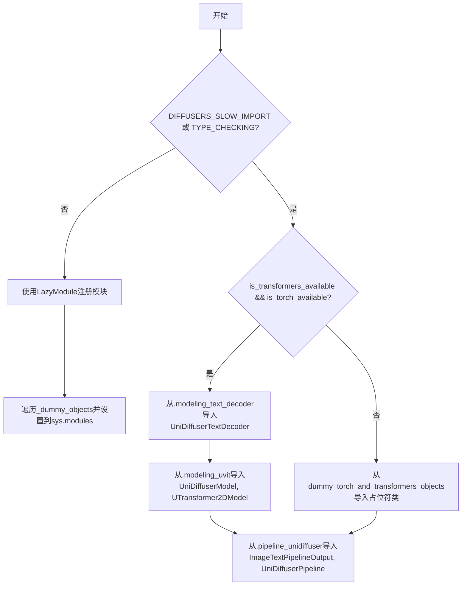
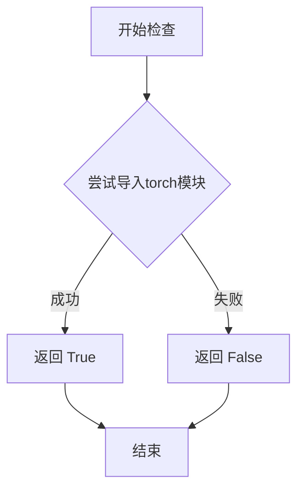
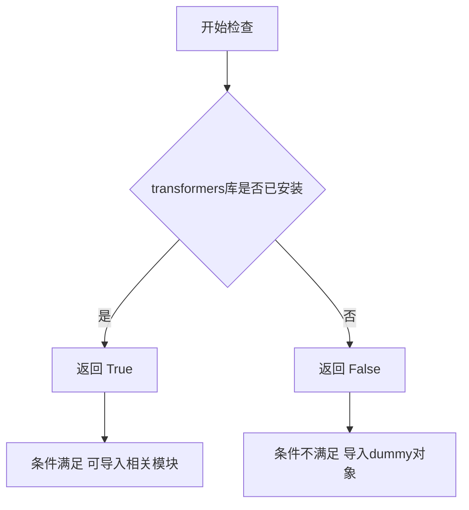

# `diffusers\src\diffusers\pipelines\unidiffuser\__init__.py` 详细设计文档

这是一个UniDiffuser模块的延迟加载初始化文件，通过条件检查torch和transformers的可用性，动态导入UniDiffuserTextDecoder、UniDiffuserModel、UTransformer2DModel等模型类以及ImageTextPipelineOutput和UniDiffuserPipeline管道类，实现依赖无关的懒加载机制。

## 整体流程



## 类结构

```
无显式类定义 (纯模块导入文件)
├── _LazyModule (来自utils的延迟加载机制)
└── 动态导入的类:
    ├── UniDiffuserTextDecoder (modeling_text_decoder)
    ├── UniDiffuserModel (modeling_uvit)
    ├── UTransformer2DModel (modeling_uvit)
    ├── ImageTextPipelineOutput (pipeline_unidiffuser)
    └── UniDiffuserPipeline (pipeline_unidiffuser)
```

## 全局变量及字段


### `_dummy_objects`
    
存储不可用时的占位符类

类型：`dict`
    


### `_import_structure`
    
定义模块的导入结构映射

类型：`dict`
    


    

## 全局函数及方法


### `is_torch_available`

该函数用于检查当前环境中 PyTorch 库是否已安装且可用，通过尝试动态导入 `torch` 模块来判断其是否可用，返回布尔值。

参数：无需参数

返回值：`bool`，如果 PyTorch 可用则返回 `True`，否则返回 `False`

#### 流程图



#### 带注释源码

```python
def is_torch_available():
    """
    检查 torch 库是否在当前环境中可用。
    
    该函数尝试导入 torch 模块，如果成功则表示 PyTorch 已安装，
    否则表示未安装或不可用。
    
    Returns:
        bool: 如果 PyTorch 可用返回 True，否则返回 False
    """
    # 尝试导入 torch 模块
    try:
        import torch
        # 导入成功，说明 torch 可用
        return True
    except ImportError:
        # 导入失败，说明 torch 不可用
        return False
```

#### 备注

该函数是扩散库中的常用工具函数，用于条件导入和可选依赖检查。在给定的代码中，它与 `is_transformers_available()` 组合使用，用于判断是否加载 UniDiffuserPipeline 相关的模块。当两者都可用时，才会导入实际的模型和管道类；否则使用虚拟的 dummy 对象。


### `is_transformers_available`

检查当前环境中是否安装了 `transformers` 库，用于条件导入和可选依赖处理。

参数：

- （无参数）

返回值：`bool`，返回 `True` 表示 `transformers` 库可用，返回 `False` 表示不可用。

#### 流程图



#### 带注释源码

```python
# 该函数在 ...utils 中定义，此处为引用使用示例
# 从上层包的 utils 模块导入 is_transformers_available 函数
from ...utils import is_transformers_available

# 使用场景：在本文件中进行可选依赖检查
# 检查 transformers 和 torch 是否同时可用
if not (is_transformers_available() and is_torch_available()):
    # 如果任一库不可用，抛出可选依赖不可用异常
    raise OptionalDependencyNotAvailable()
```

---

**备注**：该函数定义在 `diffusers` 包的 `src/diffusers/utils/__init__.py` 中，是一个标准的可选依赖检查工具函数，用于在运行时动态检测第三方库的可用性，避免在库未安装时导致导入错误。


### `setattr`

动态为当前模块设置属性，将虚拟对象（如 `ImageTextPipelineOutput`、`UniDiffuserPipeline`）注册到模块命名空间中，以便在导入时能够通过 `from ... import ...` 访问。

参数：

- `sys.modules[__name__]`：`module`，目标模块对象，即当前包模块
- `name`：`str`，要设置的属性名称，来自 `_dummy_objects` 字典的键（如 `"ImageTextPipelineOutput"`）
- `value`：`object`，要设置的属性值，来自 `_dummy_objects` 字典的值（如 `ImageTextPipelineOutput` 类）

返回值：`None`，Python 内置函数 `setattr` 不返回值（返回 `None`）

#### 流程图

```mermaid
flowchart TD
    A[开始] --> B[遍历 _dummy_objects.items]
    B --> C{是否还有未处理的 name-value 对?}
    C -->|是| D[取出当前 name]
    D --> E[取出当前 value]
    E --> F[调用 setattr sys.modules[__name__], name, value]
    F --> G[将属性绑定到模块对象上]
    G --> C
    C -->|否| H[结束]
    
    style F fill:#f9f,stroke:#333,stroke-width:2px
    style G fill:#bbf,stroke:#333,stroke-width:2px
```

#### 带注释源码

```python
# 遍历 _dummy_objects 字典中的所有键值对
# _dummy_objects 包含当可选依赖不可用时的虚拟对象占位符
for name, value in _dummy_objects.items():
    # 使用 setattr 动态设置模块属性
    # 参数1: sys.modules[__name__] - 当前模块的引用
    # 参数2: name - 要设置的属性名（如 "ImageTextPipelineOutput"）
    # 参数3: value - 要绑定的对象（如 ImageTextPipelineOutput 类）
    # 作用: 使得 from unidiffuser import ImageTextPipelineOutput 能够工作
    setattr(sys.modules[__name__], name, value)
```

## 关键组件


### 延迟加载模块系统 (_LazyModule)

通过 `_LazyModule` 实现模块的延迟加载，只有在实际使用时才导入真实模块，节省启动时间并支持可选依赖。

### 可选依赖检查机制

检查 `transformers` 和 `torch` 是否同时可用，若不可用则抛出 `OptionalDependencyNotAvailable` 异常，触发虚拟对象替换。

### 虚拟对象占位符 (_dummy_objects)

当可选依赖不可用时，提供 `ImageTextPipelineOutput` 和 `UniDiffuserPipeline` 的虚拟对象，避免导入错误。

### 导入结构定义 (_import_structure)

定义模块的公开接口，包括 `modeling_text_decoder`、`modeling_uvit` 和 `pipeline_unidiffuser` 三个子模块的导出列表。

### TYPE_CHECKING 类型检查支持

在类型检查模式下直接导入真实模块，用于IDE静态分析和类型提示，不触发延迟加载机制。

### 模块动态注册机制

通过 `sys.modules[__name__]` 动态替换当前模块为延迟加载模块，并手动设置虚拟对象到模块属性。


## 问题及建议


### 已知问题

-   **代码重复**：在try块（第10-20行）和TYPE_CHECKING分支（第23-34行）中存在完全相同的依赖检查和导入逻辑，违反了DRY原则，维护时需要同步修改两处。
-   **硬编码模块路径**：使用`...utils.dummy_torch_and_transformers_objects`这样的硬编码路径字符串，缺乏统一管理，后续重构或移动文件时容易遗漏。
-   **LazyModule设置方式不够优雅**：在第43-46行通过手动setattr设置dummy对象到sys.modules，这种操作方式不够规范，增加了模块初始化逻辑的复杂性。
-   **缺乏文档说明**：整个文件没有任何模块级文档字符串或注释，难以理解其设计意图和使用方式。
-   **导入结构的隐式依赖**：_import_structure中的模块路径与实际导入路径隐式耦合，没有显式声明这些契约关系。
-   **异常处理粒度较粗**：统一捕获OptionalDependencyNotAvailable异常，无法区分具体是哪个依赖缺失导致的问题。

### 优化建议

-   将重复的依赖检查逻辑抽取为独立的工具函数或使用装饰器模式，避免在多处重复相同的try-except逻辑。
-   将dummy对象路径、导入结构等配置抽取为常量或配置文件，统一管理模块路径映射关系。
-   考虑使用更规范的LazyModule API或自定义导入钩子来实现延迟加载，减少手动操作sys.modules的代码。
-   添加模块级文档字符串，说明该文件的作用、依赖要求以及导出内容。
-   建议在_import_structure中明确注释各模块的导出内容及其依赖关系，提高代码可读性和可维护性。
-   可以考虑为OptionalDependencyNotAvailable添加更细粒度的子类，以区分不同可选依赖的缺失情况。


## 其它


### 设计目标与约束

本模块采用延迟导入（Lazy Import）模式和可选依赖处理机制，实现UniDiffuser模型的安全导入和动态加载。核心约束包括：1）仅在torch和transformers都可用时加载实际模型；2）使用_LazyModule实现模块的延迟加载以优化启动性能；3）通过Dummy对象模式保证模块结构在依赖不可用时仍保持一致性。

### 错误处理与异常设计

本模块主要处理OptionalDependencyNotAvailable异常。当torch或transformers任一依赖不可用时，抛出OptionalDependencyNotAvailable异常，并从dummy模块导入替代对象（ImageTextPipelineOutput、UniDiffuserPipeline），确保模块导入不中断。异常处理采用try-except结构，在条件检查和类型检查两个代码块中分别实现。

### 数据流与状态机

模块初始化数据流如下：1）首先检查torch和transformers可用性；2）若依赖不可用，设置_import_structure为空字典，并从dummy对象导入替代类；3）若依赖可用，将实际模块路径添加到_import_structure；4）根据DIFFUSERS_SLOW_IMPORT标志或TYPE_CHECKING模式决定立即导入或延迟加载；5）延迟加载时创建_LazyModule并注册到sys.modules，同时将dummy对象设置为模块属性。

### 外部依赖与接口契约

外部依赖包括：1）torch库（is_torch_available()检查）；2）transformers库（is_transformers_available()检查）；3）diffusers.utils模块（_LazyModule、OptionalDependencyNotAvailable等）；4）dummy对象模块（dummy_torch_and_transformers_objects）。接口契约定义在_import_structure字典中，导出的公共API包括：UniDiffuserTextDecoder、UniDiffuserModel、UTransformer2DModel、ImageTextPipelineOutput、UniDiffuserPipeline。

### 模块初始化流程

模块初始化遵循以下流程：1）定义_import_structure字典和_dummy_objects字典；2）尝试检查torch和transformers可用性；3）根据依赖可用性填充_import_structure或_dummy_objects；4）判断执行路径（TYPE_CHECKING/DIFFUSUSERS_SLOW_IMPORT或普通导入）；5）若是普通导入，创建_LazyModule并替换sys.modules[__name__]；6）将dummy对象设置为模块属性以保持API一致性。

### 延迟加载机制

_LazyModule是延迟加载的核心机制，它接受模块名称、文件路径、导入结构和模块规格作为参数。在普通导入（非TYPE_CHECKING且非DIFFUSERS_SLOW_IMPORT）时，模块内容不会立即加载到内存，只有在实际访问模块属性时才触发加载。这种机制显著减少了包导入时间，特别是对于包含大型深度学习模型的模块。

### 关键设计模式

本模块采用了多个设计模式：1）延迟初始化模式（Lazy Initialization）- 通过_LazyModule实现；2）空对象模式（Null Object Pattern）- 通过dummy对象替代不可用的类；3）条件导入模式（Conditional Import）- 根据依赖可用性选择导入路径；4）模块注册模式 - 通过sys.modules全局注册实现模块发现。

### 版本兼容性考虑

代码考虑了Python模块导入的多种场景：1）类型检查时的导入（TYPE_CHECKING分支）；2）开发调试时的完整导入（DIFFUSUSERS_SLOW_IMPORT）；3）生产环境的延迟导入（else分支）。这种分层设计确保了代码在不同使用场景下的兼容性和性能最优化。

    