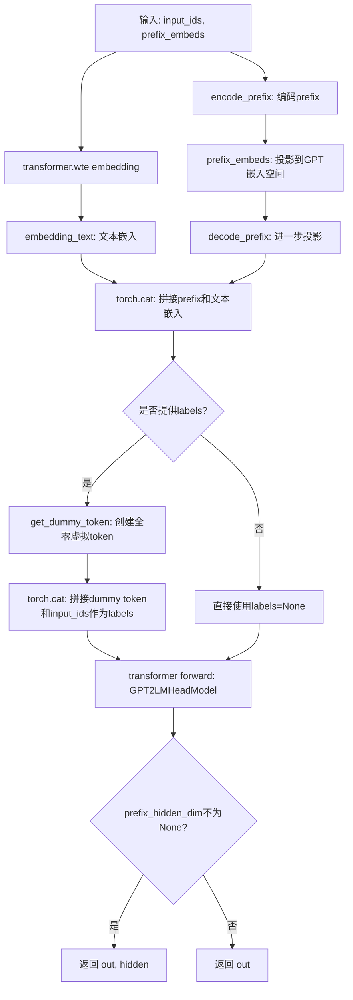
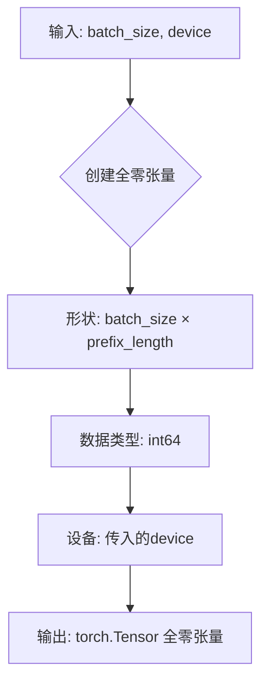
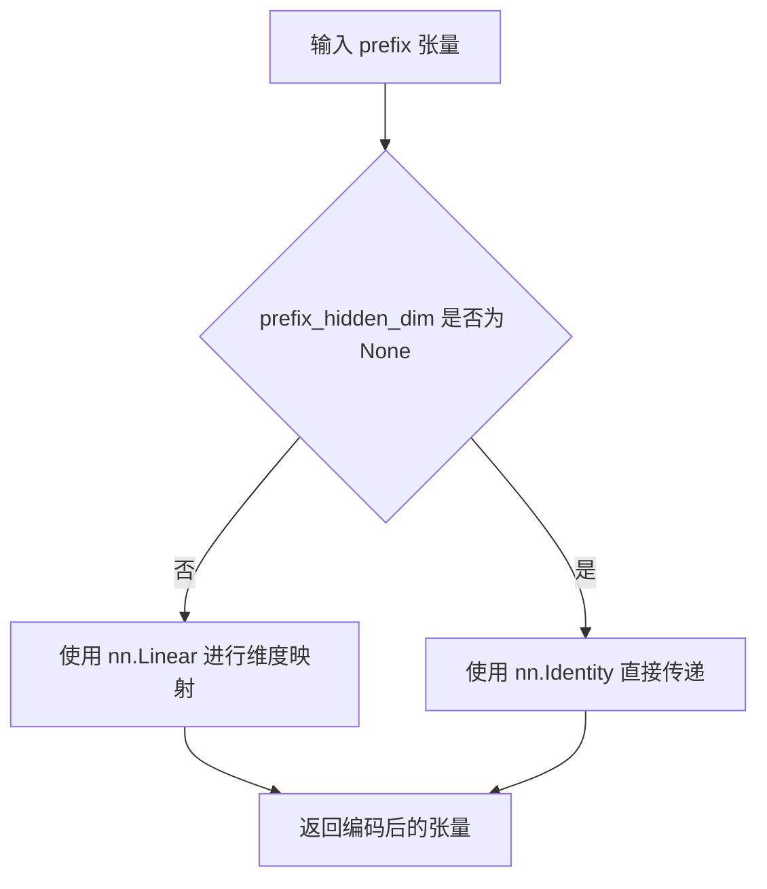
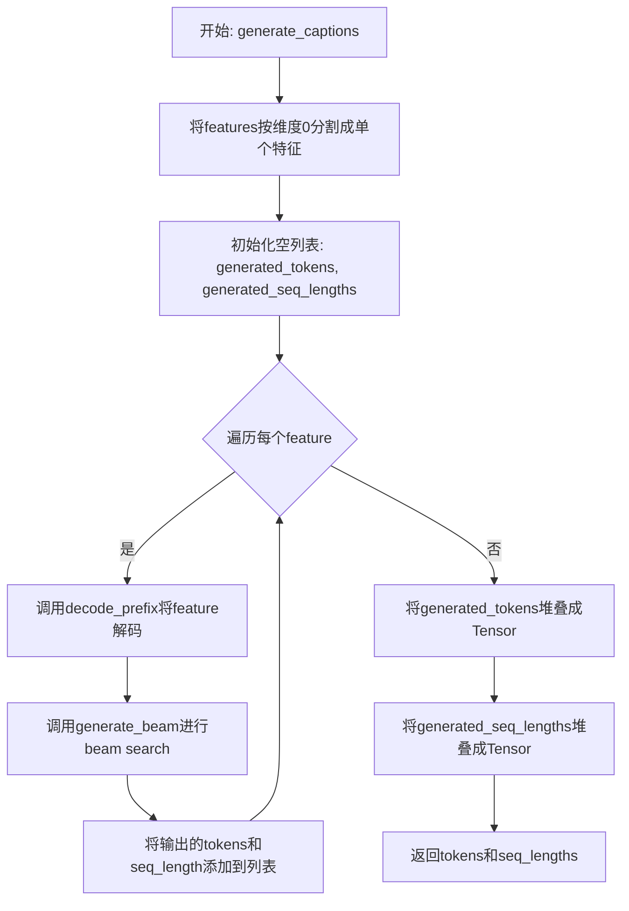

# `diffusers\src\diffusers\pipelines\unidiffuser\modeling_text_decoder.py` 详细设计文档

UniDiffuserTextDecoder是一个基于GPT2的文本解码模型，用于从UniDiffuser的图像-文本嵌入生成文本描述。它通过前缀编码器处理CLIP文本编码器的输出，并使用beam search算法生成高质量的文本描述。

## 整体流程

```mermaid
graph TD
A[开始] --> B[初始化模型]
B --> C[forward: 接收input_ids和prefix_embeds]
C --> D[编码前缀: encode_prefix(prefix_embeds)]
D --> E[解码前缀: decode_prefix(hidden)]
E --> F[拼接嵌入: torch.cat((prefix_embeds, embedding_text))]
F --> G[GPT2前向传播]
G --> H{是否有labels?}
H -- 是 --> I[添加虚拟token到labels]
H -- 否 --> J[返回输出]
I --> J
J --> K{是否需要beam search?}
K -- 是 --> L[generate_beam: 执行beam search生成文本]
K -- 否 --> M[结束]
L --> N[generate_captions: 生成多个描述]
N --> M
```

## 类结构

```
nn.Module (PyTorch基类)
├── ModelMixin (自定义基类)
├── ConfigMixin (自定义基类)
└── ModuleUtilsMixin (HuggingFace工具类)
    └── UniDiffuserTextDecoder (文本解码器)
```

## 全局变量及字段


### `UniDiffuserTextDecoder.prefix_length`
    
前缀token的最大数量

类型：`int`
    


### `UniDiffuserTextDecoder.prefix_inner_dim`
    
传入前缀嵌入的隐藏维度

类型：`int`
    


### `UniDiffuserTextDecoder.prefix_hidden_dim`
    
MLP的隐藏维度(用于编码前缀)

类型：`int | None`
    


### `UniDiffuserTextDecoder.encode_prefix`
    
前缀编码器

类型：`nn.Linear | nn.Identity`
    


### `UniDiffuserTextDecoder.decode_prefix`
    
前缀解码器

类型：`nn.Linear | nn.Identity`
    


### `UniDiffuserTextDecoder.transformer`
    
GPT2语言模型头

类型：`GPT2LMHeadModel`
    
    

## 全局函数及方法


### `UniDiffuserTextDecoder.__init__`

构造函数，初始化UniDiffuserTextDecoder模型参数和GPT2配置，设置前缀嵌入的编码器和解码器，并构建GPT2语言模型头。

参数：

- `prefix_length`：`int`，前缀标记的最大数量，将提供给模型
- `prefix_inner_dim`：`int`，输入前缀嵌入的隐藏维度，对于UniDiffuser来说是CLIP文本编码器的隐藏维度
- `prefix_hidden_dim`：`int | None`，MLP的隐藏维度，用于编码前缀，默认为None
- `vocab_size`：`int`，GPT-2模型的词汇表大小，定义了在调用GPT2Model时可以表示的不同标记数量，默认为50257
- `n_positions`：`int`，该模型可能使用的最大序列长度，通常设置较大的值以防万一，默认为1024
- `n_embd`：`int`，嵌入和隐藏状态的维度，默认为768
- `n_layer`：`int`，Transformer编码器中隐藏层的数量，默认为12
- `n_head`：`int`，每个注意力层中注意力头的数量，默认为12
- `n_inner`：`int | None`，前馈层内部的维度，默认为None（将设置为n_embd的4倍）
- `activation_function`：`str`，激活函数，可选值为["relu", "silu", "gelu", "tanh", "gelu_new"]，默认为"gelu_new"
- `resid_pdrop`：`float`，嵌入、编码器和池器中所有全连接层的dropout概率，默认为0.1
- `embd_pdrop`：`float`，嵌入层的dropout比率，默认为0.1
- `attn_pdrop`：`float`，注意力层的dropout比率，默认为0.1
- `layer_norm_epsilon`：`float`，层归一化层中使用的epsilon值，默认为1e-5
- `initializer_range`：`float`，用于初始化所有权重矩阵的截断正态分布初始化器的标准差，默认为0.02
- `scale_attn_weights`：`bool`，是否通过除以sqrt(hidden_size)来缩放注意力权重，默认为True
- `use_cache`：`bool`，是否返回最后一个key/value注意力（并非所有模型都使用），默认为True
- `scale_attn_by_inverse_layer_idx`：`bool`，是否额外按1/layer_idx + 1缩放注意力权重，默认为False
- `reorder_and_upcast_attn`：`bool`，是否在计算注意力（点积）之前缩放键（K）并在训练混合精度时将注意力点积/softmax提升为float()，默认为False

返回值：`None`，构造函数没有返回值

#### 流程图

```mermaid
flowchart TD
    A[开始 __init__] --> B[调用 super().__init__]
    B --> C[设置 self.prefix_length = prefix_length]
    C --> D{prefix_inner_dim != n_embd 且 prefix_hidden_dim is None}
    D -->|是| E[抛出 ValueError 异常]
    D -->|否| F[设置 self.prefix_inner_dim 和 self.prefix_hidden_dim]
    F --> G{prefix_hidden_dim is not None}
    G -->|是| H[创建 nn.Linear(prefix_inner_dim, prefix_hidden_dim) 作为 encode_prefix]
    G -->|否| I[创建 nn.Identity() 作为 encode_prefix]
    H --> J{prefix_hidden_dim is not None}
    J -->|是| K[创建 nn.Linear(prefix_hidden_dim, n_embd) 作为 decode_prefix]
    J -->|否| L[创建 nn.Identity() 作为 decode_prefix]
    I --> K
    L --> M[创建 GPT2Config 对象]
    M --> N[使用 GPT2Config 创建 GPT2LMHeadModel 作为 self.transformer]
    N --> O[结束 __init__]
    
    E --> P[异常: prefix_hidden_dim 不能为 None 当 prefix_inner_dim 和 n_embd 不相等时]
```

#### 带注释源码

```python
@register_to_config
def __init__(
    self,
    prefix_length: int,  # 前缀标记的最大数量
    prefix_inner_dim: int,  # 输入前缀嵌入的隐藏维度
    prefix_hidden_dim: int | None = None,  # MLP的隐藏维度，用于编码前缀
    vocab_size: int = 50257,  # GPT-2模型的词汇表大小
    n_positions: int = 1024,  # 最大序列长度
    n_embd: int = 768,  # 嵌入和隐藏状态的维度
    n_layer: int = 12,  # Transformer隐藏层数量
    n_head: int = 12,  # 注意力头数量
    n_inner: int | None = None,  # 前馈层内部维度
    activation_function: str = "gelu_new",  # 激活函数
    resid_pdrop: float = 0.1,  # 全连接层dropout概率
    embd_pdrop: float = 0.1,  # 嵌入层dropout比率
    attn_pdrop: float = 0.1,  # 注意力层dropout比率
    layer_norm_epsilon: float = 1e-5,  # 层归一化epsilon
    initializer_range: float = 0.02,  # 权重初始化范围
    scale_attn_weights: bool = True,  # 是否缩放注意力权重
    use_cache: bool = True,  # 是否使用缓存
    scale_attn_by_inverse_layer_idx: bool = False,  # 是否按层索引缩放
    reorder_and_upcast_attn: bool = False,  # 是否重新排序和提升注意力
):
    # 调用父类初始化方法
    super().__init__()

    # 存储前缀长度
    self.prefix_length = prefix_length

    # 验证参数一致性：如果prefix_inner_dim与n_embd不同，则必须提供prefix_hidden_dim
    if prefix_inner_dim != n_embd and prefix_hidden_dim is None:
        raise ValueError(
            f"`prefix_hidden_dim` cannot be `None` when `prefix_inner_dim`: {prefix_hidden_dim} and"
            f" `n_embd`: {n_embd} are not equal."
        )

    # 存储前缀维度信息
    self.prefix_inner_dim = prefix_inner_dim
    self.prefix_hidden_dim = prefix_hidden_dim

    # 创建前缀编码器：根据prefix_hidden_dim是否提供来决定使用线性层或恒等映射
    self.encode_prefix = (
        nn.Linear(self.prefix_inner_dim, self.prefix_hidden_dim)
        if self.prefix_hidden_dim is not None
        else nn.Identity()
    )
    
    # 创建前缀解码器：将编码后的前缀维度转换为GPT2的嵌入维度
    self.decode_prefix = (
        nn.Linear(self.prefix_hidden_dim, n_embd) if self.prefix_hidden_dim is not None else nn.Identity()
    )

    # 创建GPT2模型配置
    gpt_config = GPT2Config(
        vocab_size=vocab_size,
        n_positions=n_positions,
        n_embd=n_embd,
        n_layer=n_layer,
        n_head=n_head,
        n_inner=n_inner,
        activation_function=activation_function,
        resid_pdrop=resid_pdrop,
        embd_pdrop=embd_pdrop,
        attn_pdrop=attn_pdrop,
        layer_norm_epsilon=layer_norm_epsilon,
        initializer_range=initializer_range,
        scale_attn_weights=scale_attn_weights,
        use_cache=use_cache,
        scale_attn_by_inverse_layer_idx=scale_attn_by_inverse_layer_idx,
        reorder_and_upcast_attn=reorder_and_upcast_attn,
    )
    
    # 使用配置初始化GPT2语言模型头
    self.transformer = GPT2LMHeadModel(gpt_config)
```


### `UniDiffuserTextDecoder.forward`

该方法是UniDiffuserTextDecoder类的前向传播函数，负责将输入的文本token和前缀嵌入进行编码、拼接，并传递给GPT-2语言模型进行推理或训练，最终返回模型输出及可选的隐藏状态。

参数：

- `self`：类的实例本身，包含模型的编码器、解码器（MLP层）和GPT-2 transformer。
- `input_ids`：`torch.Tensor`，形状为`(N, max_seq_len)`，用于推理的文本token序列。
- `prefix_embeds`：`torch.Tensor`，形状为`(N, prefix_length, 768)`，来自CLIP文本编码器的prefix嵌入，要预先添加到embedded tokens之前。
- `attention_mask`：`torch.Tensor | None`，形状为`(N, prefix_length + max_seq_len)`，用于指定哪些token应该被关注，哪些应该被忽略（padding位置）。
- `labels`：`torch.Tensor | None`，用于语言建模的标签，若提供则计算loss，标签会在前面添加dummy token用于预测prefix部分。

返回值：若`prefix_hidden_dim`不为None，返回`(out, hidden)`的元组，其中`out`是GPT2LMHeadModel的输出（包含loss和logits），`hidden`是编码后的prefix嵌入；否则仅返回`out`。

#### 流程图



#### 带注释源码

```python
def forward(
    self,
    input_ids: torch.Tensor,
    prefix_embeds: torch.Tensor,
    attention_mask: torch.Tensor | None = None,
    labels: torch.Tensor | None = None,
):
    """
    前向传播：处理输入token和prefix嵌入，输出语言建模结果。
    
    Args:
        input_ids: 文本token ID张量，形状 (N, max_seq_len)
        prefix_embeds: 前缀嵌入张量，形状 (N, prefix_length, 768)
        attention_mask: 注意力掩码张量，可选
        labels: 语言建模标签张量，可选
    
    Returns:
        若 prefix_hidden_dim 不为 None: 返回 (模型输出, 编码后的prefix)
        否则: 返回模型输出
    """
    # Step 1: 将输入token IDs转换为嵌入向量
    # 使用GPT-2的word token embedding层进行转换
    embedding_text = self.transformer.transformer.wte(input_ids)
    
    # Step 2: 对prefix嵌入进行编码（投影到更高维空间）
    # 如果 prefix_hidden_dim 不为 None，则通过线性层；否则保持不变
    hidden = self.encode_prefix(prefix_embeds)
    
    # Step 3: 对编码后的prefix进行解码（投影到GPT嵌入空间）
    # 如果 prefix_hidden_dim 不为 None，则投影到 n_embd 维度；否则保持不变
    prefix_embeds = self.decode_prefix(hidden)
    
    # Step 4: 沿序列维度拼接prefix嵌入和文本嵌入
    # 拼接后的形状: (N, prefix_length + max_seq_len, n_embd)
    embedding_cat = torch.cat((prefix_embeds, embedding_text), dim=1)
    
    # Step 5: 若提供了labels，则在前面添加dummy token（用于预测prefix部分）
    # dummy token全为0，在GPT-2的vocab中通常对应<|endoftext|>或其他保留token
    if labels is not None:
        # 创建与batch_size和prefix_length对应的dummy token
        dummy_token = self.get_dummy_token(input_ids.shape[0], input_ids.device)
        # 拼接dummy token和原始input_ids作为完整标签序列
        labels = torch.cat((dummy_token, input_ids), dim=1)
    
    # Step 6: 调用GPT-2语言模型进行前向计算
    # 返回的out包含loss（若labels不为None）、logits等
    out = self.transformer(
        inputs_embeds=embedding_cat,
        labels=labels,
        attention_mask=attention_mask
    )
    
    # Step 7: 根据模型配置返回结果
    # 如果使用了MLP编码/解码prefix（即prefix_hidden_dim不为None），
    # 则同时返回模型输出和编码后的hidden state（供外部使用）
    if self.prefix_hidden_dim is not None:
        return out, hidden
    else:
        return out
```


### `UniDiffuserTextDecoder.get_dummy_token`

生成虚拟token用于占位，通常在训练时与真实标签拼接形成完整的标签序列。

参数：

- `batch_size`：`int`，批次大小，指定生成多少个样本的虚拟 token
- `device`：`torch.device`，计算设备，指定张量创建在该设备上

返回值：`torch.Tensor`，形状为 `(batch_size, prefix_length)` 的全零张量，作为虚拟 token 序列

#### 流程图



#### 带注释源码

```python
def get_dummy_token(self, batch_size: int, device: torch.device) -> torch.Tensor:
    """
    生成虚拟token用于占位，通常在训练时与真实标签拼接形成完整的标签序列。
    
    在forward方法中，虚拟token被用于填充prefix部分的位置，
    使得标签序列与输入序列长度对齐，用于语言建模训练。
    
    Args:
        batch_size: 批次大小
        device: 计算设备
    
    Returns:
        形状为 (batch_size, prefix_length) 的全零张量
    """
    return torch.zeros(batch_size, self.prefix_length, dtype=torch.int64, device=device)
```


### UniDiffuserTextDecoder.encode

该方法是文本解码器的编码前缀嵌入方法，负责将输入的前缀张量从 `prefix_inner_dim` 维度映射到 `prefix_hidden_dim` 维度，为后续解码过程准备条件嵌入。

参数：

- `prefix`：`torch.Tensor`，输入的前缀嵌入张量，通常来自 CLIP 文本编码器的输出

返回值：`torch.Tensor`，编码后的前缀嵌入张量，维度已从 `prefix_inner_dim` 转换为 `prefix_hidden_dim`（如果 `prefix_hidden_dim` 不为 None）

#### 流程图



#### 带注释源码

```python
def encode(self, prefix):
    """
    编码前缀嵌入
    
    该方法将输入的前缀张量通过预定义的线性变换层进行维度转换。
    如果在初始化时指定了 prefix_hidden_dim，则使用线性层将维度从
    prefix_inner_dim 映射到 prefix_hidden_dim；否则保持原维度不变。
    
    Args:
        prefix (torch.Tensor): 输入的前缀嵌入张量，形状为 (batch_size, prefix_length, prefix_inner_dim)
    
    Returns:
        torch.Tensor: 编码后的前缀嵌入张量，形状为 (batch_size, prefix_length, prefix_hidden_dim)
                     如果 prefix_hidden_dim 为 None，则形状不变
    """
    return self.encode_prefix(prefix)
```

#### 关键组件信息

| 名称 | 描述 |
|------|------|
| `encode_prefix` | 负责将前缀嵌入从 `prefix_inner_dim` 维度映射到 `prefix_hidden_dim` 维度的线性变换层 |
| `prefix_inner_dim` | 输入前缀嵌入的内部维度，通常对应 CLIP 文本编码器的隐藏层大小 |
| `prefix_hidden_dim` | 编码后前缀嵌入的目标隐藏维度，用于控制映射后的特征空间大小 |

#### 潜在的技术债务或优化空间

1. **方法过于简化**：当前 `encode` 方法直接调用 `encode_prefix`，缺乏灵活性。建议考虑添加缓存机制或更复杂的预处理步骤。
2. **缺少输入验证**：方法未对输入 `prefix` 的形状和类型进行验证，可能导致运行时错误。
3. **文档不完整**：虽然有代码注释，但缺少对返回值的维度变换详细说明，特别是当 `prefix_hidden_dim` 为 `None` 时的行为。

#### 其它项目

**设计目标与约束**：
- 该方法是 UniDiffuser 图像-文本嵌入生成文本流程中的关键组件
- 主要约束是输入维度必须与 `prefix_inner_dim` 匹配

**错误处理与异常设计**：
- 当前未实现显式的错误处理，建议添加形状不匹配时的错误提示
- 建议在方法入口添加参数类型检查

**数据流与状态机**：
- 该方法在 `forward` 方法中被调用，用于预处理前缀嵌入
- 数据流：`prefix_embeds` → `encode_prefix` → `decode_prefix` → 与文本嵌入拼接

**外部依赖与接口契约**：
- 依赖 `torch.nn.Linear` 或 `torch.nn.Identity`
- 输入期望为 PyTorch 张量，输出为相同设备的张量


### `UniDiffuserTextDecoder.generate_captions`

该方法使用beam search算法为给定的文本嵌入特征生成多个描述（captions）。它遍历输入的每个特征，通过调用`generate_beam`方法执行beam search解码，最终返回所有生成的token序列及其对应的序列长度。

参数：

- `features`：`torch.Tensor`，形状为`(B, L, D)`，用于生成描述的文本嵌入特征
- `eos_token_id`：`int`，文本解码器模型的EOS（句子结束）令牌的token ID
- `device`：`torch.device`，执行文本生成的设备

返回值：`tuple[torch.Tensor, torch.Tensor]`，第一个元素是生成的token序列（按得分降序排列），第二个元素是对应的序列长度

#### 流程图



#### 带注释源码

```python
@torch.no_grad()
def generate_captions(self, features, eos_token_id, device):
    """
    Generate captions given text embedding features. Returns list[L].

    Args:
        features (`torch.Tensor` of shape `(B, L, D)`):
            Text embedding features to generate captions from.
        eos_token_id (`int`):
            The token ID of the EOS token for the text decoder model.
        device:
            Device to perform text generation on.

    Returns:
        `list[str]`: A list of strings generated from the decoder model.
    """

    # 将features按batch维度分割成单个样本的feature
    # 分割后每个feature shape: (1, L, D)
    features = torch.split(features, 1, dim=0)
    
    # 初始化存储生成结果的列表
    generated_tokens = []
    generated_seq_lengths = []
    
    # 遍历每个样本的feature
    for feature in features:
        # 将feature移动到指定device，并使用decode_prefix解码
        # 这里将特征解码回CLIP特征空间
        feature = self.decode_prefix(feature.to(device))  # back to the clip feature
        
        # Only support beam search for now
        # 调用beam search生成方法，传入嵌入、device和eos_token_id
        output_tokens, seq_lengths = self.generate_beam(
            input_embeds=feature, device=device, eos_token_id=eos_token_id
        )
        
        # 获取第一个（最高分）结果并添加到列表
        generated_tokens.append(output_tokens[0])
        generated_seq_lengths.append(seq_lengths[0])
    
    # 将所有生成的tokens堆叠成batch维度的tensor
    generated_tokens = torch.stack(generated_tokens)
    
    # 将所有序列长度堆叠成tensor
    generated_seq_lengths = torch.stack(generated_seq_lengths)
    
    # 返回生成的tokens和对应的序列长度
    return generated_tokens, generated_seq_lengths
```


### `UniDiffuserTextDecoder.generate_beam`

使用 Beam Search 算法基于输入的 token ID 或嵌入向量生成文本序列，支持可配置的 Beam 大小、生成长度、温度参数和 EOS 停止符处理，返回按分数降序排列的生成 token 序列及其对应长度。

参数：

- `input_ids`：`torch.LongTensor`，形状为 `(batch_size, input_ids_length)`，可选。输入序列 token 在词表中的索引，需提供 `input_ids` 或 `input_embeds` 之一
- `input_embeds`：`torch.Tensor`，形状为 `(batch_size, seq_len, hidden_size)`，可选。直接传入 transformer 的嵌入表示作为 Beam Search 的前缀，需提供 `input_ids` 或 `input_embeds` 之一
- `device`：`torch.device`，执行 Beam Search 的设备
- `beam_size`：`int`，默认为 5。Beam Search 过程中保留的最佳状态数量
- `entry_length`：`int`，默认为 67。Beam Search 的迭代次数上限
- `temperature`：`float`，默认为 1.0。解码时对 logits 进行 softmax 的温度参数，值为 0 时忽略
- `eos_token_id`：`int`，可选。文本解码器模型的 EOS token ID，用于停止生成

返回值：`tuple(torch.Tensor, torch.Tensor)`，第一个元素是按分数降序排列的生成 token 序列张量，第二个元素是对应的序列长度张量

#### 流程图

```mermaid
flowchart TD
    A[开始 Beam Search] --> B[初始化 stop_token_index, tokens, scores, seq_lengths, is_stopped]
    B --> C{input_embeds 是否存在?}
    C -->|是| D[使用 input_embeds 作为 generated]
    C -->|否| E[使用 transformer.wte 将 input_ids 转换为嵌入]
    D --> F
    E --> F
    F[进入主循环 for i in range(entry_length)] --> G[调用 transformer 获取 logits]
    G --> H[对 logits 应用温度缩放并取 log_softmax]
    H --> I{scores 是否为 None?}
    I -->|是| J[首次迭代: logits.topk 获取 beam_size 个最佳 next_tokens]
    J --> K[扩展 generated 以匹配 beam_size]
    J --> L[初始化 tokens 或扩展已有 tokens]
    I -->|否| M[非首次迭代: 将已停止的 beam 的 logits 设为 -inf]
    M --> N[计算累加分数 scores_sum = scores + logits]
    N --> O[平均化分数 scores_sum_average = scores_sum / seq_lengths]
    O --> P[从展平的 scores_sum_average 中获取 topk]
    P --> Q[恢复 beam 索引和 token 索引]
    Q --> R[更新 tokens, generated, scores, seq_lengths, is_stopped]
    L --> S
    R --> S
    S[获取 next_tokens 的嵌入并拼接到 generated]
    S --> T[检查是否遇到停止符: is_stopped = is_stopped or next_tokens.eq(stop_token_index)]
    T --> U{所有 beam 都已停止?}
    U -->|是| V[跳出循环]
    U -->|否| F
    V --> W[归一化分数: scores = scores / seq_lengths]
    W --> X[按分数降序排序: order = scores.argsort]
    X --> Y[重新排列 tokens 和 seq_lengths]
    Y --> Z[返回 output_texts, seq_lengths]
```

#### 带注释源码

```python
@torch.no_grad()
def generate_beam(
    self,
    input_ids=None,
    input_embeds=None,
    device=None,
    beam_size: int = 5,
    entry_length: int = 67,
    temperature: float = 1.0,
    eos_token_id: int | None = None,
):
    """
    使用 Beam Search 根据给定的分词器 和文本提示或 token 嵌入生成文本。
    此实现基于原始 UniDiffuser 代码的 beam search 实现。
    
    参数:
        eos_token_id: 文本解码器模型的 EOS token ID
        input_ids: 输入序列 token 的分词器索引,形状为 (batch_size, input_ids_length)
        input_embeds: 直接传入 transformer 作为前缀的嵌入表示,形状为 (batch_size, seq_len, hidden_size)
        device: 执行 beam search 的设备
        beam_size: beam search 期间存储的最佳状态数量,默认为 5
        entry_length: 运行 beam search 的迭代次数,默认为 67
        temperature: 解码时对 logits 执行 softmax 的温度,默认为 1.0
    
    返回:
        tuple(torch.Tensor, torch.Tensor): 
            - 第一个元素: 按分数降序排列的生成 token 序列
            - 第二个元素: 对应序列的长度
    """
    # 设置停止 token 的索引
    stop_token_index = eos_token_id
    # 初始化 token 序列和分数
    tokens = None
    scores = None
    # 初始化序列长度张量,每个 beam 初始长度为 1
    seq_lengths = torch.ones(beam_size, device=device, dtype=torch.int)
    # 初始化停止标志张量
    is_stopped = torch.zeros(beam_size, device=device, dtype=torch.bool)

    # 根据输入类型确定生成的嵌入向量
    if input_embeds is not None:
        generated = input_embeds
    else:
        # 将 input_ids 转换为 token 嵌入
        generated = self.transformer.transformer.wte(input_ids)

    # 主循环:迭代生成文本直到达到 entry_length 或所有 beam 都停止
    for i in range(entry_length):
        # 将当前嵌入传入 transformer 获取输出
        outputs = self.transformer(inputs_embeds=generated)
        # 获取最后一个位置的 logits
        logits = outputs.logits
        logits = logits[:, -1, :] / (temperature if temperature > 0 else 1.0)
        # 应用 log_softmax 获取对数概率
        logits = logits.softmax(-1).log()

        # 首次迭代:初始化 beam
        if scores is None:
            # 获取 top-k 最可能的下一个 token
            scores, next_tokens = logits.topk(beam_size, -1)
            # 扩展生成序列以匹配 beam_size
            generated = generated.expand(beam_size, *generated.shape[1:])
            # 调整维度顺序
            next_tokens, scores = next_tokens.permute(1, 0), scores.squeeze(0)
            if tokens is None:
                tokens = next_tokens
            else:
                # 扩展已有 tokens 并拼接新的 next_tokens
                tokens = tokens.expand(beam_size, *tokens.shape[1:])
                tokens = torch.cat((tokens, next_tokens), dim=1)
        else:
            # 非首次迭代:扩展已有 beam
            # 将已停止的 beam 的 logits 设为负无穷,确保不会继续选择
            logits[is_stopped] = -float(np.inf)
            # 允许已停止的 beam 选择 EOS token (logit=0)
            logits[is_stopped, 0] = 0
            # 累加分数:分数 + 当前 token 的对数概率
            scores_sum = scores[:, None] + logits
            # 更新序列长度(非停止的 beam 长度+1)
            seq_lengths[~is_stopped] += 1
            # 平均化分数以考虑序列长度(长度归一化)
            scores_sum_average = scores_sum / seq_lengths[:, None]
            # 从展平的分数中获取 top-k
            scores_sum_average, next_tokens = scores_sum_average.view(-1).topk(beam_size, -1)
            # 计算 token 来源的 beam 索引
            next_tokens_source = next_tokens // scores_sum.shape[1]
            # 从展平索引恢复原始序列长度和 token 索引
            seq_lengths = seq_lengths[next_tokens_source]
            next_tokens = next_tokens % scores_sum.shape[1]
            next_tokens = next_tokens.unsqueeze(1)
            # 重新索引并拼接 tokens
            tokens = tokens[next_tokens_source]
            tokens = torch.cat((tokens, next_tokens), dim=1)
            # 重新索引 generated 和 scores
            generated = generated[next_tokens_source]
            scores = scores_sum_average * seq_lengths
            is_stopped = is_stopped[next_tokens_source]

        # 获取下一个 token 的嵌入并拼接到已生成的序列
        next_token_embed = self.transformer.transformer.wte(next_tokens.squeeze()).view(generated.shape[0], 1, -1)
        generated = torch.cat((generated, next_token_embed), dim=1)
        # 检查是否遇到停止符,更新停止标志
        is_stopped = is_stopped + next_tokens.eq(stop_token_index).squeeze()
        # 如果所有 beam 都已停止,则提前结束
        if is_stopped.all():
            break

    # 归一化分数:除以序列长度得到平均对数概率
    scores = scores / seq_lengths
    # 按分数降序排序
    order = scores.argsort(descending=True)
    # 根据排序重新排列 tokens 和 seq_lengths
    output_texts = [tokens[i] for i in order]
    output_texts = torch.stack(output_texts, dim=0)
    seq_lengths = torch.tensor([seq_lengths[i] for i in order], dtype=seq_lengths.dtype)
    return output_texts, seq_lengths
```

## 关键组件


### 张量索引与惰性加载

在`generate_captions`方法中，使用`torch.split(features, 1, dim=0)`将特征按批次维度拆分为单个样本，实现逐个样本的惰性处理，避免一次性加载全部特征到内存。

### 反量化支持

代码中`forward`方法通过`torch.cat((prefix_embeds, embedding_text), dim=1)`将编码后的prefix嵌入与文本嵌入拼接，实现从潜在空间到语义空间的映射，间接支持从量化表示恢复到连续嵌入。

### Prefix编码与解码模块

`encode_prefix`（线性层或Identity）和`decode_prefix`（线性层或Identity）构成的双层MLP结构，用于将输入的prefix嵌入维度转换为GPT2的嵌入维度，支持灵活的维度匹配。

### Beam Search生成器

`generate_beam`方法实现了基于beam search的文本生成，包含token展开、分数累积、序列长度归一化、停止条件判断等核心逻辑，支持多候选序列并行生成。

### GPT2语言模型核心

通过`GPT2Config`配置并实例化的`GPT2LMHeadModel`（`self.transformer`），作为文本生成的主干网络，提供词嵌入（wte）和前向推理能力。

### 配置注册与混入机制

继承`ModelMixin`和`ConfigMixin`，配合`@register_to_config`装饰器实现配置的序列化与反序列化，以及`ModuleUtilsMixin`提供模型工具方法。


## 问题及建议


### 已知问题

- **类型注解不一致**：`forward`方法中`attention_mask`参数描述的形状为`(N, prefix_length + max_seq_len, 768)`，但attention mask应该是2D张量，形状应为`(N, prefix_length + max_seq_len)`。
- **参数默认值与文档不符**：`activation_function`参数在代码中默认值为`"gelu_new"`，但文档字符串中声明的默认值是`"gelu"`。
- **generate_captions批处理效率低下**：使用`torch.split`逐个处理特征，每个样本单独执行beam search，无法利用GPU并行计算能力，严重影响推理性能。
- **generate_beam方法存在冗余计算**：在循环内部每次迭代都执行`tokens.expand(beam_size, ...)`和`generated.expand(beam_size, ...)`，这些操作应在初始化阶段完成，避免重复计算。
- **输入验证不足**：`generate_beam`方法未检查`input_ids`和`input_embeds`同时为`None`的不合法情况，会导致后续执行出错。
- **继承顺序可能存在MRO问题**：同时继承`ModelMixin`和`ConfigMixin`时，可能存在方法解析顺序冲突的风险。
- **类型注解缺失**：部分方法如`encode`和`generate_captions`缺少返回类型注解，降低了代码的可读性和类型安全。
- **设备管理不规范**：`generate_captions`和`generate_beam`方法中`device`参数未使用`torch.device`类型注解，而是使用裸参数。
- **配置参数冗余传递**：大量GPT2相关参数直接传递给构造函数然后再传给GPT2Config，代码冗长且难以维护。

### 优化建议

- **修复类型注解和文档**：更正`attention_mask`和`prefix_embeds`的类型描述，确保与实际张量维度一致。
- **统一参数默认值**：将`activation_function`的默认值改为`"gelu_new"`以匹配代码实现，或更新文档字符串。
- **优化批处理逻辑**：重构`generate_captions`方法，支持批量beam search而非逐个样本处理，可显著提升推理速度。
- **前置扩展操作**：将`tokens.expand`和`generated.expand`移至beam search循环之前执行，减少重复计算。
- **添加输入验证**：在`generate_beam`开头添加对`input_ids`和`input_embeds`的合法性检查，提供清晰的错误信息。
- **补充类型注解**：为所有公共方法添加完整的类型注解，包括参数类型和返回类型。
- **使用枚举或配置类**：考虑将大量GPT2配置参数封装为配置类，简化构造函数签名。
- **规范化device参数**：统一使用`torch.device`类型注解，或考虑从输入张量中自动推断设备。

## 其它


### 设计目标与约束

该模块旨在实现UniDiffuser模型的文本解码器功能，能够将CLIP文本编码器生成的嵌入向量转换为自然语言文本。设计目标包括：支持可变长度的前缀嵌入、支持束搜索生成、保持与GPT-2模型架构的兼容性。约束条件包括：前缀长度固定、依赖transformers库的实现、仅支持beam search而非greedy或nucleus sampling。

### 错误处理与异常设计

代码中已实现部分错误检查：在__init__中检查prefix_inner_dim与n_embd不匹配且prefix_hidden_dim为None的情况，抛出ValueError。潜在改进：应在generate_beam和generate_captions中添加输入张量维度验证、设备兼容性检查、以及eos_token_id为None时的处理。当前generate方法未对input_ids和input_embeds同时为None的情况进行校验。

### 数据流与状态机

数据流路径：prefix_embeds → encode_prefix → decode_prefix → 与text embedding拼接 → GPT2LMHeadModel处理。状态机方面：模型初始化状态（权重未加载）、推理状态（torch.no_grad()）、生成状态（逐token生成）。generate_beam方法内部维护beam_size个候选序列的状态，包括scores、tokens、seq_lengths和is_stopped标志。

### 外部依赖与接口契约

核心依赖：numpy、torch、transformers库（GPT2Config、GPT2LMHeadModel、ModuleUtilsMixin）、本地配置工具（configuration_utils的ConfigMixin和register_to_config、models的ModelMixin）。接口契约：prefix_embeds期望shape为(N, prefix_length, prefix_inner_dim)，input_ids期望shape为(N, max_seq_len)，generate方法返回token序列和长度张量。

### 性能考虑与优化空间

当前实现的主要性能瓶颈：generate_beam中逐token生成效率较低，可考虑批量beam search；decode_prefix在generate_captions中被逐样本调用多次，应考虑批量处理；束搜索中频繁的tensor扩展操作带来内存开销。优化方向：实现动态batch大小的束搜索、缓存中间计算结果、使用torch.compile加速。

### 安全性考虑

当前代码无明显安全风险。潜在问题：generate_beam中temperature=0时未做特殊处理可能导致数值问题；束搜索中-log(inf)的使用需确保浮点数精度足够。模型输出应考虑添加长度限制以防止过度生成。

### 测试策略建议

应覆盖的测试场景：prefix_inner_dim与n_embd不匹配时的异常抛出、forward方法不同输入组合的行为、generate_beam的束搜索正确性、generate_captions的批量处理能力、模型权重加载与保存、梯度计算与反向传播。建议使用pytest框架编写单元测试，并添加集成测试验证端到端生成流程。

### 配置文件参数说明

vocab_size默认50257对应GPT-2词汇表大小，n_positions默认1024限制最大序列长度，n_embd默认768为GPT-2 small标准维度，n_layer默认12对应12层Transformer，n_head默认12为多头注意力头数。activation_function默认gelu_new与原版UniDiffuser一致。所有GPT2Config参数均可通过__init__灵活配置。

### 版本兼容性与依赖管理

代码依赖transformers库版本需支持GPT2Config的完整参数列表、ModuleUtilsMixin mixin。PyTorch版本应支持torch.no_grad()装饰器和tensor的bool类型索引操作。NumPy版本无特殊限制。建议在requirements.txt中明确transformers>=4.30.0, torch>=2.0.0, numpy>=1.20.0。

### 使用示例与调用流程

典型使用流程：1) 通过ConfigMixin注册配置创建实例；2) 准备prefix_embeds（CLIP文本编码器输出）和input_ids；3) 调用forward()进行训练或推理；4) 调用generate_captions()进行文本生成。生成时需提供eos_token_id（GPT-2为50256）和device信息。示例代码应展示从图像嵌入到文本生成的完整pipeline。

### 参考文献与 Attribution

代码注释明确标注基于UniDiffuser项目(https://github.com/thu-ml/unidiffuser)的ClipCaptionModel修改而来，相关论文为https://huggingface.co/papers/2303.06555。GPT-2模型源自OpenAI的Language Models are Unsupervised Multitask Learners论文。设计文档应保留上述引用信息。

    