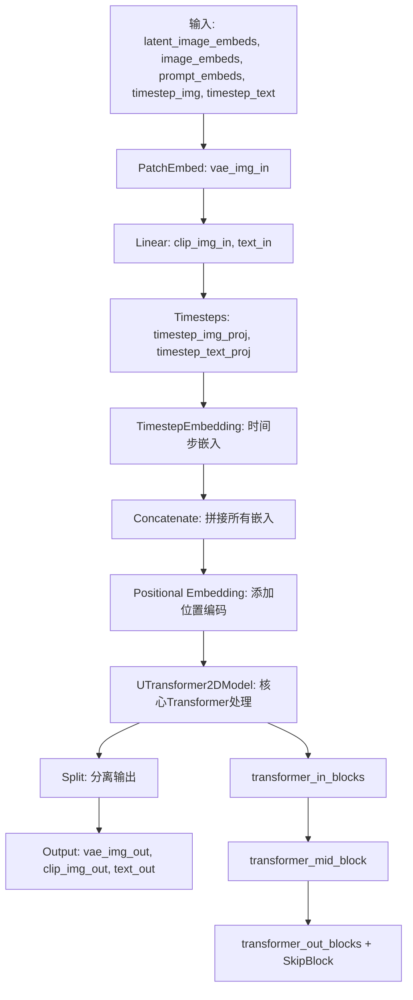
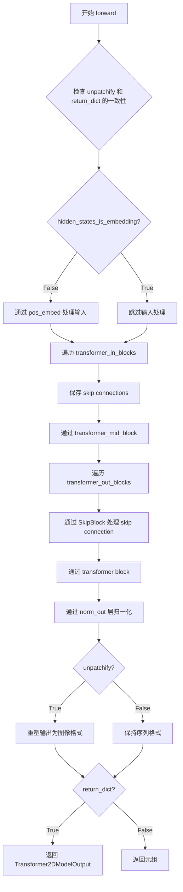
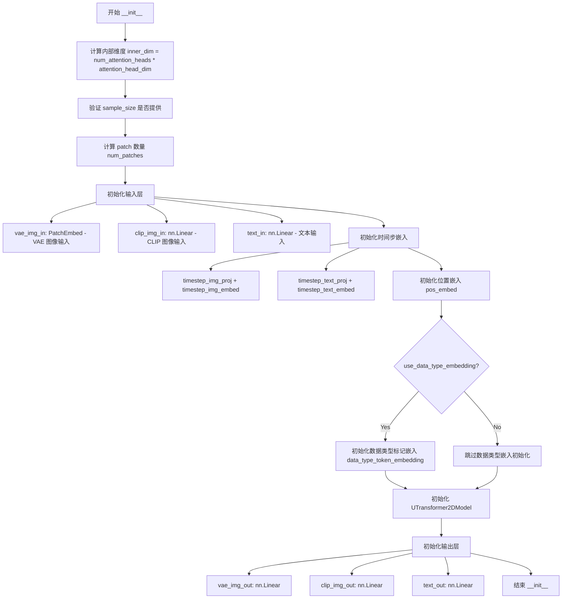
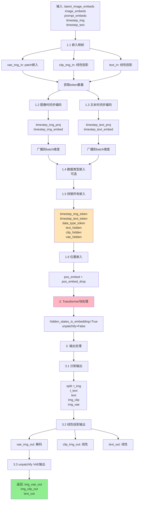

# `diffusers\src\diffusers\pipelines\unidiffuser\modeling_uvit.py` 详细设计文档

这是一个基于U-ViT架构的Transformer模型实现，用于图像和文本的联合生成（UniDiffuser）。代码实现了U-Net风格的Transformer结构，包含PatchEmbed、SkipBlock、UTransformerBlock、UniDiffuserBlock等核心组件，支持pre-LayerNorm和post-LayerNorm配置，能够处理VAE latent图像、CLIP图像嵌入和文本嵌入的联合输入输出。

## 整体流程



## 类结构

```
nn.Module (基类)
├── PatchEmbed
├── SkipBlock
├── UTransformerBlock
├── UniDiffuserBlock
├── UTransformerBlock (ModelMixin, ConfigMixin)
│   ├── transformer_in_blocks (nn.ModuleList)
│   ├── transformer_mid_block
│   ├── transformer_out_blocks (nn.ModuleList[nn.ModuleDict])
│   └── norm_out
└── UniDiffuserModel (ModelMixin, ConfigMixin)
    ├── vae_img_in (PatchEmbed)
    ├── clip_img_in (nn.Linear)
    ├── text_in (nn.Linear)
    ├── timestep_img_proj (Timesteps)
    ├── timestep_img_embed (TimestepEmbedding/nn.Identity)
    ├── timestep_text_proj (Timesteps)
    ├── timestep_text_embed (TimestepEmbedding/nn.Identity)
    ├── pos_embed (nn.Parameter)
    ├── data_type_token_embedding (nn.Embedding, 可选)
    ├── transformer (UTransformer2DModel)
    ├── vae_img_out (nn.Linear)
    ├── clip_img_out (nn.Linear)
    └── text_out (nn.Linear)
```

## 全局变量及字段


### `logger`
    
模块级日志记录器，用于输出警告和信息

类型：`logging.Logger`
    


### `PatchEmbed.flatten`
    
是否将输出的空间维度flatten为序列维度

类型：`bool`
    


### `PatchEmbed.layer_norm`
    
是否在投影后应用LayerNorm归一化

类型：`bool`
    


### `PatchEmbed.proj`
    
将图像转换为补丁嵌入的卷积层

类型：`nn.Conv2d`
    


### `PatchEmbed.norm`
    
可选的LayerNorm层，用于归一化补丁嵌入

类型：`nn.LayerNorm|None`
    


### `PatchEmbed.use_pos_embed`
    
是否使用2D正弦余弦位置嵌入

类型：`bool`
    


### `PatchEmbed.pos_embed`
    
预计算的位置嵌入缓冲区，可选字段

类型：`nn.Buffer`
    


### `SkipBlock.skip_linear`
    
用于合并跳跃连接输入的线性层

类型：`nn.Linear`
    


### `SkipBlock.norm`
    
跳跃连接后的LayerNorm归一化层

类型：`nn.LayerNorm`
    


### `UTransformerBlock.only_cross_attention`
    
是否仅使用cross-attention而不用self-attention

类型：`bool`
    


### `UTransformerBlock.use_ada_layer_norm`
    
是否使用AdaLayerNorm进行自适应归一化

类型：`bool`
    


### `UTransformerBlock.pre_layer_norm`
    
是否为pre-LayerNorm模式（在attention/feedforward之前归一化）

类型：`bool`
    


### `UTransformerBlock.attn1`
    
第一个注意力层，通常为self-attention

类型：`Attention`
    


### `UTransformerBlock.attn2`
    
第二个注意力层，用于cross-attention，可选

类型：`Attention|None`
    


### `UTransformerBlock.norm1`
    
第一个归一化层，用于self-attention前后的归一化

类型：`AdaLayerNorm|nn.LayerNorm`
    


### `UTransformerBlock.norm2`
    
第二个归一化层，用于cross-attention，可选

类型：`AdaLayerNorm|nn.LayerNorm|None`
    


### `UTransformerBlock.norm3`
    
第三个归一化层，用于feedforward前后的归一化

类型：`nn.LayerNorm`
    


### `UTransformerBlock.ff`
    
前馈神经网络层

类型：`FeedForward`
    


### `UniDiffuserBlock.only_cross_attention`
    
是否仅使用cross-attention而不用self-attention

类型：`bool`
    


### `UniDiffuserBlock.use_ada_layer_norm`
    
是否使用AdaLayerNorm进行自适应归一化

类型：`bool`
    


### `UniDiffuserBlock.pre_layer_norm`
    
是否为pre-LayerNorm模式（在attention/feedforward之前归一化）

类型：`bool`
    


### `UniDiffuserBlock.attn1`
    
第一个注意力层，通常为self-attention

类型：`Attention`
    


### `UniDiffuserBlock.attn2`
    
第二个注意力层，用于cross-attention，可选

类型：`Attention|None`
    


### `UniDiffuserBlock.norm1`
    
第一个归一化层（在残差主干部）

类型：`AdaLayerNorm|nn.LayerNorm`
    


### `UniDiffuserBlock.norm2`
    
第二个归一化层（在残差主干部），可选

类型：`AdaLayerNorm|nn.LayerNorm|None`
    


### `UniDiffuserBlock.norm3`
    
第三个归一化层（在残差主干部）

类型：`nn.LayerNorm`
    


### `UniDiffuserBlock.ff`
    
前馈神经网络层

类型：`FeedForward`
    


### `UTransformer2DModel.use_linear_projection`
    
是否使用线性投影（当前未实际使用）

类型：`bool`
    


### `UTransformer2DModel.num_attention_heads`
    
多头注意力机制的头数

类型：`int`
    


### `UTransformer2DModel.attention_head_dim`
    
每个注意力头的维度

类型：`int`
    


### `UTransformer2DModel.height`
    
输入图像的高度（以像素为单位）

类型：`int`
    


### `UTransformer2DModel.width`
    
输入图像的宽度（以像素为单位）

类型：`int`
    


### `UTransformer2DModel.patch_size`
    
每个补丁的像素大小

类型：`int`
    


### `UTransformer2DModel.pos_embed`
    
补丁嵌入层，包含投影和可选的位置编码

类型：`PatchEmbed`
    


### `UTransformer2DModel.transformer_in_blocks`
    
U-Net风格的下采样Transformer块列表

类型：`nn.ModuleList`
    


### `UTransformer2DModel.transformer_mid_block`
    
U-Net中间的Transformer块

类型：`UTransformerBlock|UniDiffuserBlock`
    


### `UTransformer2DModel.transformer_out_blocks`
    
U-Net风格的上采样Transformer块列表（含跳跃连接）

类型：`nn.ModuleList`
    


### `UTransformer2DModel.out_channels`
    
输出通道数

类型：`int`
    


### `UTransformer2DModel.norm_out`
    
输出层的LayerNorm归一化

类型：`nn.LayerNorm`
    


### `UniDiffuserModel.inner_dim`
    
内部隐藏维度，等于num_attention_heads * attention_head_dim

类型：`int`
    


### `UniDiffuserModel.sample_size`
    
输入样本的空间大小

类型：`int`
    


### `UniDiffuserModel.in_channels`
    
VAE latent图像的输入通道数

类型：`int`
    


### `UniDiffuserModel.out_channels`
    
输出通道数

类型：`int`
    


### `UniDiffuserModel.patch_size`
    
图像补丁化的大小

类型：`int`
    


### `UniDiffuserModel.num_patches`
    
图像被划分的补丁总数

类型：`int`
    


### `UniDiffuserModel.vae_img_in`
    
VAE latent图像的补丁嵌入层

类型：`PatchEmbed`
    


### `UniDiffuserModel.clip_img_in`
    
CLIP图像嵌入到inner_dim的线性投影层

类型：`nn.Linear`
    


### `UniDiffuserModel.text_in`
    
文本嵌入到inner_dim的线性投影层

类型：`nn.Linear`
    


### `UniDiffuserModel.timestep_img_proj`
    
图像时间步的Timesteps投影层

类型：`Timesteps`
    


### `UniDiffuserModel.timestep_img_embed`
    
图像时间步的嵌入层或恒等映射

类型：`TimestepEmbedding|nn.Identity`
    


### `UniDiffuserModel.timestep_text_proj`
    
文本时间步的Timesteps投影层

类型：`Timesteps`
    


### `UniDiffuserModel.timestep_text_embed`
    
文本时间步的嵌入层或恒等映射

类型：`TimestepEmbedding|nn.Identity`
    


### `UniDiffuserModel.num_text_tokens`
    
文本token的最大数量

类型：`int`
    


### `UniDiffuserModel.num_tokens`
    
总token数量（时间步+文本+图像）

类型：`int`
    


### `UniDiffuserModel.pos_embed`
    
可学习的总位置嵌入参数

类型：`nn.Parameter`
    


### `UniDiffuserModel.pos_embed_drop`
    
位置嵌入的dropout层

类型：`nn.Dropout`
    


### `UniDiffuserModel.use_data_type_embedding`
    
是否使用数据类型嵌入（用于UniDiffuser-v1）

类型：`bool`
    


### `UniDiffuserModel.data_type_token_embedding`
    
数据类型token的嵌入层，可选字段

类型：`nn.Embedding`
    


### `UniDiffuserModel.data_type_pos_embed_token`
    
数据类型位置嵌入token，可选字段

类型：`nn.Parameter`
    


### `UniDiffuserModel.transformer`
    
核心的U-Shape Transformer模型

类型：`UTransformer2DModel`
    


### `UniDiffuserModel.vae_img_out`
    
将inner_dim投影回VAE latent空间的线性层

类型：`nn.Linear`
    


### `UniDiffuserModel.clip_img_out`
    
将inner_dim投影回CLIP图像维度的线性层

类型：`nn.Linear`
    


### `UniDiffuserModel.text_out`
    
将inner_dim投影回文本维度的线性层

类型：`nn.Linear`
    
    

## 全局函数及方法


### `_no_grad_trunc_normal_`

该函数是一个截断正态分布初始化器，用于在不计算梯度的情况下将张量填充为截断正态分布的值。该方法基于截断正态分布的逆CDF变换生成随机数，确保生成的值落在指定的 [a, b] 范围内。

参数：

- `tensor`：`torch.Tensor`，要填充的输入张量
- `mean`：`float`，截断正态分布的均值
- `std`：`float`，截断正态分布的标准差
- `a`：`float`，截断区间的下界
- `b`：`float`，截断区间的上界

返回值：`torch.Tensor`，填充后的张量（修改后的输入tensor）

#### 流程图

```mermaid
flowchart TD
    A[开始] --> B[检查mean是否超出范围]
    B --> C{mean是否在 [a-2*std, b+2*std] 范围外?}
    C -->|是| D[记录警告日志]
    C -->|否| E[进入 torch.no_grad 上下文]
    D --> E
    
    E --> F[计算 norm_cdf]
    F --> G[l = norm_cdf((a - mean) / std)]
    G --> H[u = norm_cdf((b - mean) / std)]
    H --> I[使用均匀分布填充张量: tensor.uniform_(2*l - 1, 2*u - 1)]
    I --> J[应用逆误差函数: tensor.erfinv_()]
    J --> K[变换到目标均值和标准差: tensor.mul_(std * sqrt(2.0)).add_(mean)]
    K --> L[裁剪到指定范围: tensor.clamp_(min=a, max=b)]
    L --> M[返回 tensor]
    
    style F fill:#f9f,color:#333
    style G fill:#ff9,color:#333
    style H fill:#ff9,color:#333
    style I fill:#9f9,color:#333
    style J fill:#9f9,color:#333
    style K fill:#9f9,color:#333
    style L fill:#9f9,color:#333
```

#### 带注释源码

```python
def _no_grad_trunc_normal_(tensor, mean, std, a, b):
    """
    在不计算梯度的情况下，将输入tensor填充为截断正态分布的值。
    该实现复制自PyTorch官方代码，直到官方发布正式版本。
    
    方法基于: https://people.sc.fsu.edu/~jburkardt/presentations/truncated_normal.pdf
    
    Args:
        tensor: 要填充的n维torch.Tensor
        mean: 截断正态分布的均值
        std: 截断正态分布的标准差
        a: 截断区间的下界
        b: 截断区间的上界
    
    Returns:
        填充后的tensor（原地修改）
    """
    # 定义标准正态分布的累积分布函数(CDF)
    def norm_cdf(x):
        # 计算标准正态CDF: Φ(x) = (1 + erf(x/√2)) / 2
        return (1.0 + math.erf(x / math.sqrt(2.0))) / 2.0

    # 检查均值是否在合理范围内，避免生成无意义的分布
    if (mean < a - 2 * std) or (mean > b + 2 * std):
        logger.warning(
            "mean is more than 2 std from [a, b] in nn.init.trunc_normal_. "
            "The distribution of values may be incorrect."
        )

    # 使用no_grad上下文，避免记录梯度操作
    with torch.no_grad():
        # 值生成过程:
        # 1. 使用截断均匀分布
        # 2. 使用逆CDF变换到正态分布
        
        # 计算截断区间对应的CDF值
        l = norm_cdf((a - mean) / std)
        u = norm_cdf((b - mean) / std)

        # 从[l, u]的均匀分布填充，然后转换到[2l-1, 2u-1]
        # 这一步是为了让后续的erfinv_变换能够产生截断标准正态分布
        tensor.uniform_(2 * l - 1, 2 * u - 1)

        # 使用逆CDF变换获得截断标准正态分布
        # erfinv_是误差函数的逆函数，原地计算
        tensor.erfinv_()

        # 变换到目标均值和标准差
        # 先乘以 std * √2，再加 mean
        tensor.mul_(std * math.sqrt(2.0))
        tensor.add_(mean)

        # 裁剪确保值在指定范围内，处理可能的数值精度问题
        tensor.clamp_(min=a, max=b)
        
        return tensor
```


### `trunc_normal_`

使用截断正态分布填充输入张量。该函数通过截断正态分布生成随机值，并确保生成的值在指定范围内 [a, b]，超出范围的值会被重新绘制。

参数：

- `tensor`：`torch.Tensor`，要填充的 n 维张量
- `mean`：`float`，正态分布的均值，默认为 0.0
- `std`：`float`，正态分布的标准差，默认为 1.0
- `a`：`float`，截断下限，默认为 -2.0
- `b`：`float`，截断上限，默认为 2.0

返回值：`torch.Tensor`，填充后的张量

#### 流程图

```mermaid
flowchart TD
    A[开始] --> B[调用 _no_grad_trunc_normal_]
    B --> C{均值是否在 [a-2*std, b+2*std] 外?}
    C -->|是| D[输出警告信息]
    C -->|否| E[继续]
    D --> E
    E --> F[计算截断下限 l = norm_cdf((a-mean)/std)]
    F --> G[计算截断上限 u = norm_cdf((b-mean)/std)]
    G --> H[从 [2*l-1, 2*u-1] 均匀填充张量]
    H --> I[使用逆 CDF 变换得到截断标准正态分布]
    I --> J[变换到目标均值和标准差]
    J --> K[clamp 限制到 [a, b] 范围内]
    K --> L[返回填充后的张量]
```

#### 带注释源码

```python
def trunc_normal_(tensor, mean=0.0, std=1.0, a=-2.0, b=2.0):
    # type: (torch.Tensor, float, float, float, float) -> torch.Tensor
    r"""Fills the input Tensor with values drawn from a truncated
    normal distribution. The values are effectively drawn from the normal distribution :math:`\mathcal{N}(\text{mean},
    \text{std}^2)` with values outside :math:`[a, b]` redrawn until they are within the bounds. The method used for
    generating the random values works best when :math:`a \leq \text{mean} \leq b`.

    Args:
        tensor: an n-dimensional `torch.Tensor`
        mean: the mean of the normal distribution
        std: the standard deviation of the normal distribution
        a: the minimum cutoff value
        b: the maximum cutoff value
    Examples:
        >>> w = torch.empty(3, 5) >>> nn.init.trunc_normal_(w)
    """
    # 调用内部的无梯度版本函数执行实际的截断正态分布填充
    return _no_grad_trunc_normal_(tensor, mean, std, a, b)
```


### `PatchEmbed.__init__`

该方法是 `PatchEmbed` 类的构造函数，负责初始化2D图像到Patch嵌入的转换模块。它设置了卷积投影层、可选的位置编码嵌入和LayerNorm归一化层，将输入图像转换为可供Transformer处理的Patch序列。

参数：

- `height`：`int`，输入图像的高度，默认为224
- `width`：`int`，输入图像的宽度，默认为224
- `patch_size`：`int`，每个Patch的尺寸，默认为16
- `in_channels`：`int`，输入图像的通道数，默认为3（RGB图像）
- `embed_dim`：`int`，嵌入向量的维度，默认为768
- `layer_norm`：`bool`，是否在Patch嵌入后应用LayerNorm，默认为False
- `flatten`：`bool`，是否将输出的Patch序列展平，默认为True
- `bias`：`bool`，卷积层是否使用偏置，默认为True
- `use_pos_embed`：`bool`，是否使用2D正弦余弦位置编码，默认为True

返回值：`None`，构造函数不返回值，仅初始化对象状态

#### 流程图

```mermaid
flowchart TD
    A[开始 __init__] --> B[计算 num_patches = (height // patch_size) * (width // patch_size)]
    B --> C[保存 self.flatten 和 self.layer_norm]
    C --> D[创建 nn.Conv2d 投影层: in_channels → embed_dim]
    D --> E{layer_norm?}
    E -->|True| F[创建 nn.LayerNorm]
    E -->|False| G[设置 self.norm = None]
    F --> H{use_pos_embed?}
    G --> H
    H -->|True| I[调用 get_2d_sincos_pos_embed 生成位置编码]
    I --> J[注册 pos_embed 为 buffer]
    H -->|False| K[结束 __init__]
    J --> K
```

#### 带注释源码

```python
def __init__(
    self,
    height=224,          # 输入图像的高度
    width=224,           # 输入图像的宽度
    patch_size=16,       # 每个patch的边长（正方形）
    in_channels=3,       # 输入通道数（RGB为3）
    embed_dim=768,       # 嵌入向量维度
    layer_norm=False,    # 是否使用LayerNorm后处理
    flatten=True,        # 是否展平输出张量
    bias=True,           # 卷积层是否使用偏置
    use_pos_embed=True,  # 是否使用位置编码
):
    # 调用父类nn.Module的初始化
    super().__init__()

    # 计算Patch总数：(height // patch_size) * (width // patch_size)
    # 例如：224//16 * 224//16 = 14*14 = 196个patches
    num_patches = (height // patch_size) * (width // patch_size)
    
    # 保存配置参数到实例属性，供forward方法使用
    self.flatten = flatten          # 控制是否将BCHW展平为BNC
    self.layer_norm = layer_norm    # 控制是否应用LayerNorm

    # 创建卷积投影层：将图像转换为Patch嵌入
    # kernel_size=patch_size, stride=patch_size 实现非重叠的patch划分
    self.proj = nn.Conv2d(
        in_channels, 
        embed_dim, 
        kernel_size=(patch_size, patch_size), 
        stride=patch_size, 
        bias=bias
    )
    
    # 可选：添加LayerNorm层对patch embeddings进行归一化
    if layer_norm:
        # 使用LayerNorm，elementwise_affine=False表示不学习缩放和平移参数
        # eps=1e-6防止除零
        self.norm = nn.LayerNorm(embed_dim, elementwise_affine=False, eps=1e-6)
    else:
        self.norm = None

    # 可选：添加2D正弦余弦位置编码
    self.use_pos_embed = use_pos_embed
    if self.use_pos_embed:
        # 生成2D正弦余弦位置编码嵌入
        # 参数：embed_dim, grid_size=int(num_patches**0.5), output_type="pt"
        pos_embed = get_2d_sincos_pos_embed(embed_dim, int(num_patches**0.5), output_type="pt")
        
        # 注册为buffer（非参数，不参与梯度更新）
        # unsqueeze(0) 添加batch维度，persistent=False表示不被保存到state_dict
        self.register_buffer("pos_embed", pos_embed.float().unsqueeze(0), persistent=False)
```


### `PatchEmbed.forward`

该方法实现2D图像到补丁嵌入的转换，通过卷积层将输入图像划分为补丁，必要时对补丁进行展平和归一化处理，最后可选地添加位置嵌入以保留空间位置信息。

参数：

- `latent`：`torch.Tensor`，形状为 `(batch_size, in_channels, height, width)` 的输入图像张量

返回值：`torch.Tensor`，当 `use_pos_embed=True` 时返回添加位置嵌入后的张量，形状为 `(batch_size, num_patches, embed_dim)`；否则返回形状为 `(batch_size, num_patches, embed_dim)` 的张量（若 `flatten=True`）或形状为 `(batch_size, embed_dim, height//patch_size, width//patch_size)` 的张量（若 `flatten=False`）

#### 流程图

```mermaid
flowchart TD
    A[输入 latent: (B, C, H, W)] --> B[卷积投影: self.proj]
    B --> C{flatten 是否为 True?}
    C -->|Yes| D[展平并转置: flatten(2).transpose(1, 2)<br/>BCHW → BNC]
    C -->|No| E[保持形状: (B, embed_dim, H/p, W/p)]
    D --> F{layer_norm 是否为 True?}
    E --> F
    F -->|Yes| G[应用 LayerNorm: self.norm]
    F -->|No| H{use_pos_embed 是否为 True?}
    G --> H
    H -->|Yes| I[添加位置嵌入: latent + self.pos_embed]
    H -->|No| J[返回 latent]
    I --> K[返回结果]
    J --> K
```

#### 带注释源码

```python
def forward(self, latent):
    # 第一步：使用卷积层将图像划分为补丁并投影到嵌入空间
    # 输入: (batch_size, in_channels, height, width)
    # 输出: (batch_size, embed_dim, height//patch_size, width//patch_size)
    latent = self.proj(latent)
    
    # 第二步：根据 flatten 参数决定是否展平补丁维度
    if self.flatten:
        # 将 (B, C, H, W) 转换为 (B, N, C)
        # 其中 N = H * W 是补丁数量
        latent = latent.flatten(2).transpose(1, 2)  # BCHW -> BNC
    
    # 第三步：可选的 LayerNorm 归一化
    if self.layer_norm:
        latent = self.norm(latent)
    
    # 第四步：可选的位置嵌入添加
    if self.use_pos_embed:
        return latent + self.pos_embed
    else:
        return latent
```


### SkipBlock.__init__

初始化 SkipBlock 模块，用于在 U-ViT 架构中处理跳跃连接。该模块包含一个线性层用于合并两个输入特征，以及一个 LayerNorm 层用于归一化处理。

参数：

- `dim`：`int`，特征维度，定义输入输出的通道数

返回值：`None`，无返回值（构造函数）

#### 流程图

```mermaid
graph TD
    A[开始 SkipBlock.__init__] --> B[调用 super().__init__]
    B --> C[创建 self.skip_linear = nn.Linear<br/>2 * dim → dim]
    C --> D[创建 self.norm = nn.LayerNorm<br/>dim]
    D --> E[结束]
```

#### 带注释源码

```python
class SkipBlock(nn.Module):
    def __init__(self, dim: int):
        """
        初始化 SkipBlock 模块
        
        参数:
            dim: 特征维度，用于定义跳跃连接的输入输出维度
        """
        # 调用父类 nn.Module 的初始化方法
        super().__init__()

        # 定义跳跃连接线性层
        # 将 2*dim 维度的拼接输入映射到 dim 维度
        # 用于合并主路径特征和跳跃连接特征
        self.skip_linear = nn.Linear(2 * dim, dim)

        # 使用 torch.nn.LayerNorm 进行层归一化
        # 遵循原始代码实现，对 dim 维度进行归一化
        self.norm = nn.LayerNorm(dim)
```


### `SkipBlock.forward`

该方法实现跳跃连接块的前向传播，将主干特征与跳跃连接特征拼接后通过线性层和归一化层处理，输出融合后的特征。

参数：

- `x`：`torch.Tensor`，主干特征，通常来自前一层 Transformer 块的输出
- `skip`：`torch.Tensor`，跳跃连接特征，来自对应位置的 in_block 输出

返回值：`torch.Tensor`，经过拼接、线性变换和 LayerNorm 归一化后的特征

#### 流程图

```mermaid
flowchart TD
    A[输入 x 和 skip] --> B{拼接}
    B --> C[torch.cat([x, skip], dim=-1)]
    C --> D[skip_linear 线性层]
    D --> E[LayerNorm 归一化]
    E --> F[返回输出]
```

#### 带注释源码

```
class SkipBlock(nn.Module):
    """用于处理 U-Net 结构中跳跃连接的模块"""

    def __init__(self, dim: int):
        super().__init__()
        # 定义线性层：将拼接后的 2*dim 维度映射回 dim 维度
        self.skip_linear = nn.Linear(2 * dim, dim)
        # 定义 LayerNorm 层，用于特征归一化
        self.norm = nn.LayerNorm(dim)

    def forward(self, x, skip):
        """
        前向传播方法

        参数:
            x: 主干特征，形状为 (batch_size, seq_len, dim)
            skip: 跳跃连接特征，形状为 (batch_size, seq_len, dim)

        返回值:
            处理后的特征，形状为 (batch_size, seq_len, dim)
        """
        # 1. 在最后一个维度（特征维度）上拼接主干特征和跳跃连接特征
        # 拼接后维度从 (batch_size, seq_len, dim) 变为 (batch_size, seq_len, 2*dim)
        x = self.skip_linear(torch.cat([x, skip], dim=-1))
        
        # 2. 应用 LayerNorm 归一化，使特征分布更加稳定
        x = self.norm(x)

        # 3. 返回融合后的特征
        return x
```


### `UTransformerBlock.__init__`

该方法是 `UTransformerBlock` 类的构造函数，用于初始化一个支持 pre-LayerNorm 和 post-LayerNorm 配置的 Transformer 块。该类是基于 `BasicTransformerBlock` 的修改版本，支持自适应层归一化（AdaLayerNorm）和多种注意力配置（自注意力、交叉注意力）。

参数：

- `dim`：`int`，输入和输出通道数
- `num_attention_heads`：`int`，多头注意力使用的头数
- `attention_head_dim`：`int`，每个头的通道数
- `dropout`：`float`，默认为 0.0，Dropout 概率
- `cross_attention_dim`：`int | None`，默认为 None，交叉注意力的编码器隐藏状态向量维度
- `activation_fn`：`str`，默认为 "geglu"，前馈网络激活函数
- `num_embeds_ada_norm`：`int | None`，默认为 None，扩散步数，用于 AdaLayerNorm
- `attention_bias`：`bool`，默认为 False，注意力层是否包含偏置参数
- `only_cross_attention`：`bool`，默认为 False，是否仅使用交叉注意力层
- `double_self_attention`：`bool`，默认为 False，是否使用两个自注意力层
- `upcast_attention`：`bool`，默认为 False，是否在注意力计算时将查询和键向上转换为 float32
- `norm_elementwise_affine`：`bool`，默认为 True，层归一化是否使用可学习的每元素仿射参数
- `norm_type`：`str`，默认为 "layer_norm"，层归一化实现类型
- `pre_layer_norm`：`bool`，默认为 True，是否在注意力前馈操作之前执行层归一化（pre-LayerNorm）
- `final_dropout`：`bool`，默认为 False，是否在前馈网络后使用 Dropout 层

返回值：无（`None`），构造函数用于初始化对象状态

#### 流程图

```mermaid
flowchart TD
    A[开始 __init__] --> B[调用 super().__init__]
    B --> C[设置 self.only_cross_attention]
    C --> D[计算 self.use_ada_layer_norm]
    D --> E[设置 self.pre_layer_norm]
    E --> F{检查 norm_type 和 num_embeds_ada_norm}
    F -->|不符合| G[抛出 ValueError]
    F -->|符合| H[创建 self.attn1 自注意力层]
    H --> I{检查 cross_attention_dim 或 double_self_attention}
    I -->|是| J[创建 self.attn2 注意力层]
    I -->|否| K[设置 self.attn2 = None]
    J --> L{检查 use_ada_layer_norm}
    K --> L
    L -->|是| M[创建 AdaLayerNorm self.norm1]
    L -->|否| N[创建 nn.LayerNorm self.norm1]
    M --> O{检查 cross_attention_dim 或 double_self_attention}
    N --> O
    O -->|是| P[创建 self.norm2]
    O -->|否| Q[设置 self.norm2 = None]
    P --> R[创建 self.norm3]
    Q --> R
    R --> S[创建 FeedForward self.ff]
    S --> T[结束 __init__]
    G --> T
```

#### 带注释源码

```python
def __init__(
    self,
    dim: int,                           # 输入输出的通道数
    num_attention_heads: int,           # 多头注意力的头数
    attention_head_dim: int,           # 每个头的维度
    dropout=0.0,                        # Dropout 概率
    cross_attention_dim: int | None = None,  # 交叉注意力维度
    activation_fn: str = "geglu",       # 激活函数
    num_embeds_ada_norm: int | None = None, # AdaLayerNorm 步数
    attention_bias: bool = False,       # 注意力偏置
    only_cross_attention: bool = False, # 仅交叉注意力
    double_self_attention: bool = False, # 双自注意力
    upcast_attention: bool = False,    # 上转注意力
    norm_elementwise_affine: bool = True, # 层归一化仿射
    norm_type: str = "layer_norm",      # 归一化类型
    pre_layer_norm: bool = True,        # Pre-LayerNorm 开关
    final_dropout: bool = False,        # 最终 Dropout
):
    super().__init__()  # 调用父类 nn.Module 初始化
    
    # 存储是否仅使用交叉注意力的配置
    self.only_cross_attention = only_cross_attention

    # 判断是否使用 AdaLayerNorm（需要同时满足 num_embeds_ada_norm 不为 None 且 norm_type 为 "ada_norm"）
    self.use_ada_layer_norm = (num_embeds_ada_norm is not None) and norm_type == "ada_norm"

    # 存储 Pre-LayerNorm 配置
    self.pre_layer_norm = pre_layer_norm

    # 检查 norm_type 配置的一致性
    if norm_type in ("ada_norm", "ada_norm_zero") and num_embeds_ada_norm is None:
        raise ValueError(
            f"`norm_type` is set to {norm_type}, but `num_embeds_ada_norm` is not defined. Please make sure to"
            f" define `num_embeds_ada_norm` if setting `norm_type` to {norm_type}."
        )

    # 1. 创建自注意力层 (Self-Attn)
    self.attn1 = Attention(
        query_dim=dim,
        heads=num_attention_heads,
        dim_head=attention_head_dim,
        dropout=dropout,
        bias=attention_bias,
        cross_attention_dim=cross_attention_dim if only_cross_attention else None,
        upcast_attention=upcast_attention,
    )

    # 2. 创建交叉注意力层 (Cross-Attn)
    # 只有当提供了 cross_attention_dim 或启用 double_self_attention 时才创建
    if cross_attention_dim is not None or double_self_attention:
        self.attn2 = Attention(
            query_dim=dim,
            cross_attention_dim=cross_attention_dim if not double_self_attention else None,
            heads=num_attention_heads,
            dim_head=attention_head_dim,
            dropout=dropout,
            bias=attention_bias,
            upcast_attention=upcast_attention,
        )  # 如果 encoder_hidden_states 为 None，则为自注意力
    else:
        self.attn2 = None

    # 3. 创建归一化层
    # norm1: 第一个归一化层（用于自注意力之后）
    if self.use_ada_layer_norm:
        self.norm1 = AdaLayerNorm(dim, num_embeds_ada_norm)
    else:
        self.norm1 = nn.LayerNorm(dim, elementwise_affine=norm_elementwise_affine)

    # norm2: 第二个归一化层（用于交叉注意力之后）
    if cross_attention_dim is not None or double_self_attention:
        # 注意：目前仅在自注意力中使用 AdaLayerNormZero
        self.norm2 = (
            AdaLayerNorm(dim, num_embeds_ada_norm)
            if self.use_ada_layer_norm
            else nn.LayerNorm(dim, elementwise_affine=norm_elementwise_affine)
        )
    else:
        self.norm2 = None

    # 4. 创建前馈网络 (Feed-forward)
    self.norm3 = nn.LayerNorm(dim, elementwise_affine=norm_elementwise_affine)
    self.ff = FeedForward(dim, dropout=dropout, activation_fn=activation_fn, final_dropout=final_dropout)
```


### `UTransformerBlock.forward`

该方法实现了修改版的Transformer块，支持pre-LayerNorm和post-LayerNorm配置，执行自注意力、交叉注意力和前馈网络操作，处理条件嵌入（如timestep和class_labels），并通过残差连接返回增强后的隐藏状态。

参数：

- `hidden_states`：`torch.Tensor`，输入的隐藏状态张量
- `attention_mask`：`torch.Tensor | None`，自注意力掩码，用于控制哪些位置可以看到哪些位置（可选）
- `encoder_hidden_states`：`torch.Tensor | None`，编码器的隐藏状态，用于交叉注意力（可选）
- `encoder_attention_mask`：`torch.Tensor | None`，交叉注意力掩码（可选）
- `timestep`：`torch.Tensor | None`，时间步，用于AdaLayerNorm条件嵌入（可选）
- `cross_attention_kwargs`：`dict | None`，传递给交叉注意力层的额外关键字参数（可选）
- `class_labels`：`torch.Tensor | None`，类别标签，用于AdaLayerZeroNorm条件嵌入（可选）

返回值：`torch.Tensor`，经过Transformer块处理后的隐藏状态张量

#### 流程图

```mermaid
graph TD
    A[开始: hidden_states] --> B{pre_layer_norm?}
    B -->|Yes| C{use_ada_layer_norm?}
    C -->|Yes| D[norm1(hidden_states, timestep)]
    C -->|No| E[norm1(hidden_states)]
    B -->|No| F[norm_hidden_states = hidden_states]
    D --> G[attn1自注意力]
    E --> G
    F --> G
    G --> H{cross_attention_kwargs<br/>为空?}
    H -->|No| I[使用现有kwargs]
    H -->|Yes| J[使用空dict]
    J --> K[attn1输出]
    I --> K
    K --> L{not pre_layer_norm?}
    L -->|Yes| M{use_ada_layer_norm?}
    L -->|No| N[hidden_states = attn_output + hidden_states]
    M -->|Yes| O[norm1(attn_output, timestep)]
    M -->|No| P[norm1(attn_output)]
    O --> N
    P --> N
    N --> Q{attn2存在?}
    Q -->|No| R[跳过交叉注意力]
    Q -->|Yes| S{pre_layer_norm?}
    S -->|Yes| T{use_ada_layer_norm?}
    T -->|Yes| U[norm2(hidden_states, timestep)]
    T -->|No| V[norm2(hidden_states)]
    S -->|No| W[norm_hidden_states = hidden_states]
    U --> X[attn2交叉注意力]
    V --> X
    W --> X
    X --> Y{not pre_layer_norm?}
    Y -->|Yes| Z{use_ada_layer_norm?}
    Y -->|No| AA[hidden_states = attn_output + hidden_states]
    Z -->|Yes| AB[norm2(attn_output, timestep)]
    Z -->|No| AC[norm2(attn_output)]
    AB --> AA
    AC --> AA
    AA --> AD{pre_layer_norm?}
    AD -->|Yes| AE[norm3(hidden_states)]
    AD -->|No| AF[norm_hidden_states = hidden_states]
    AE --> AG[ff前馈网络]
    AF --> AG
    AG --> AH{not pre_layer_norm?}
    AH -->|Yes| AI[norm3(ff_output)]
    AH -->|No| AJ[hidden_states = ff_output + hidden_states]
    AI --> AJ
    AJ --> AK[返回hidden_states]
    R --> AD
```

#### 带注释源码

```python
def forward(
    self,
    hidden_states,
    attention_mask=None,
    encoder_hidden_states=None,
    encoder_attention_mask=None,
    timestep=None,
    cross_attention_kwargs=None,
    class_labels=None,
):
    # Pre-LayerNorm: 如果启用pre_layer_norm，在注意力之前进行归一化
    if self.pre_layer_norm:
        # 根据是否使用AdaLayerNorm选择不同的归一化方式
        if self.use_ada_layer_norm:
            # AdaLayerNorm需要timestep参数进行条件归一化
            norm_hidden_states = self.norm1(hidden_states, timestep)
        else:
            # 标准LayerNorm
            norm_hidden_states = self.norm1(hidden_states)
    else:
        # 如果不使用pre_layer_norm，则跳过第一次归一化
        norm_hidden_states = hidden_states

    # 1. Self-Attention: 自注意力层
    # 处理cross_attention_kwargs为空的情况
    cross_attention_kwargs = cross_attention_kwargs if cross_attention_kwargs is not None else {}
    
    # 根据only_cross_attention决定是否使用encoder_hidden_states
    attn_output = self.attn1(
        norm_hidden_states,
        encoder_hidden_states=encoder_hidden_states if self.only_cross_attention else None,
        attention_mask=attention_mask,
        **cross_attention_kwargs,
    )

    # Post-LayerNorm: 如果不使用pre_layer_norm，在注意力之后进行归一化
    if not self.pre_layer_norm:
        if self.use_ada_layer_norm:
            attn_output = self.norm1(attn_output, timestep)
        else:
            attn_output = self.norm1(attn_output)

    # 残差连接: 将注意力输出加到原始隐藏状态
    hidden_states = attn_output + hidden_states

    # 2. Cross-Attention: 如果存在attn2，则执行交叉注意力
    if self.attn2 is not None:
        # Pre-LayerNorm
        if self.pre_layer_norm:
            # 根据是否使用AdaLayerNorm选择归一化方式
            norm_hidden_states = (
                self.norm2(hidden_states, timestep) if self.use_ada_layer_norm else self.norm2(hidden_states)
            )
        else:
            norm_hidden_states = hidden_states
        
        # TODO (Birch-San): 正确准备encoder_attention_mask
        # prepare attention mask here

        # 2. Cross-Attention: 交叉注意力层
        attn_output = self.attn2(
            norm_hidden_states,
            encoder_hidden_states=encoder_hidden_states,
            attention_mask=encoder_attention_mask,
            **cross_attention_kwargs,
        )

        # Post-LayerNorm
        if not self.pre_layer_norm:
            attn_output = self.norm2(attn_output, timestep) if self.use_ada_layer_norm else self.norm2(attn_output)

        # 残差连接
        hidden_states = attn_output + hidden_states

    # 3. Feed-forward: 前馈网络层
    # Pre-LayerNorm
    if self.pre_layer_norm:
        norm_hidden_states = self.norm3(hidden_states)
    else:
        norm_hidden_states = hidden_states

    # 执行前馈网络
    ff_output = self.ff(norm_hidden_states)

    # Post-LayerNorm
    if not self.pre_layer_norm:
        ff_output = self.norm3(ff_output)

    # 残差连接: 将前馈输出加到隐藏状态
    hidden_states = ff_output + hidden_states

    return hidden_states
```


### `UniDiffuserBlock.__init__`

该方法是 `UniDiffuserBlock` 类的构造函数，用于初始化一个支持 pre-LayerNorm 和 post-LayerNorm 配置的 Transformer 块，并将 LayerNorm 放置在残差连接的主干（residual backbone）上，这与原始 UniDiffuser 实现一致。该块包含自注意力、交叉注意力（可选）和前馈网络。

参数：

- `dim`：`int`，输入和输出通道数。
- `num_attention_heads`：`int`，多头注意力使用的注意力头数量。
- `attention_head_dim`：`int`，每个头的通道数。
- `dropout`：`float`，可选，默认为 0.0，注意力模块和前馈网络的 dropout 概率。
- `cross_attention_dim`：`int | None`，可选，默认为 None，交叉注意力中 encoder_hidden_states 向量的维度。
- `activation_fn`：`str`，可选，默认为 `"geglu"`，前馈网络中使用的激活函数。
- `num_embeds_ada_norm`：`int | None`，可选，默认为 None，训练时使用的扩散步数，用于 AdaLayerNorm。
- `attention_bias`：`bool`，可选，默认为 False，注意力层是否包含偏置参数。
- `only_cross_attention`：`bool`，可选，默认为 False，是否仅使用交叉注意力层。
- `double_self_attention`：`bool`，可选，默认为 False，是否使用两个自注意力层。
- `upcast_attention`：`bool`，可选，默认为 False，在执行注意力计算时是否将 query 和 key 向上转换为 float32。
- `norm_elementwise_affine`：`bool`，可选，默认为 True，是否在层归一化中使用可学习的逐元素仿射参数。
- `norm_type`：`str`，可选，默认为 `"layer_norm"`，使用的层归一化实现类型。
- `pre_layer_norm`：`bool`，可选，默认为 False，是否在注意力/前馈操作之前执行层归一化（pre-LayerNorm），否则为之后（post-LayerNorm）。
- `final_dropout`：`bool`，可选，默认为 True，是否在前馈网络之后使用最终的 Dropout 层。

返回值：`None`，构造函数无返回值。

#### 流程图

```mermaid
flowchart TD
    A[开始 __init__] --> B[调用 super().__init__]
    B --> C[设置 self.only_cross_attention]
    C --> D[计算 self.use_ada_layer_norm]
    D --> E[设置 self.pre_layer_norm]
    E --> F{norm_type in ('ada_norm', 'ada_norm_zero')
    and num_embeds_ada_norm is None?}
    F -->|是| G[抛出 ValueError]
    F -->|否| H[创建 self.attn1: Attention]
    H --> I{cross_attention_dim is not None
    or double_self_attention?}
    I -->|是| J[创建 self.attn2: Attention]
    I -->|否| K[设置 self.attn2 = None]
    J --> L{self.use_ada_layer_norm?}
    K --> L
    L -->|是| M[创建 self.norm1 = AdaLayerNorm]
    L -->|否| N[创建 self.norm1 = nn.LayerNorm]
    M --> O{cross_attention_dim is not None
    or double_self_attention?}
    N --> O
    O -->|是| P[创建 self.norm2]
    O -->|否| Q[设置 self.norm2 = None]
    P --> R[创建 self.norm3 = nn.LayerNorm]
    Q --> R
    R --> S[创建 self.ff: FeedForward]
    S --> T[结束 __init__]
    G --> T
```

#### 带注释源码

```python
def __init__(
    self,
    dim: int,
    num_attention_heads: int,
    attention_head_dim: int,
    dropout=0.0,
    cross_attention_dim: int | None = None,
    activation_fn: str = "geglu",
    num_embeds_ada_norm: int | None = None,
    attention_bias: bool = False,
    only_cross_attention: bool = False,
    double_self_attention: bool = False,
    upcast_attention: bool = False,
    norm_elementwise_affine: bool = True,
    norm_type: str = "layer_norm",
    pre_layer_norm: bool = False,
    final_dropout: bool = True,
):
    """初始化 UniDiffuserBlock 模块。"""
    # 调用父类 nn.Module 的初始化方法
    super().__init__()
    
    # 存储是否仅使用交叉注意力的标志
    self.only_cross_attention = only_cross_attention

    # 判断是否使用 AdaLayerNorm：
    # 只有当 num_embeds_ada_norm 不为 None 且 norm_type 为 "ada_norm" 时才使用
    self.use_ada_layer_norm = (num_embeds_ada_norm is not None) and norm_type == "ada_norm"

    # 存储是否使用 pre-LayerNorm 的配置
    self.pre_layer_norm = pre_layer_norm

    # 如果使用 ada_norm 或 ada_norm_zero 类型，但未定义 num_embeds_ada_norm，则抛出错误
    if norm_type in ("ada_norm", "ada_norm_zero") and num_embeds_ada_norm is None:
        raise ValueError(
            f"`norm_type` is set to {norm_type}, but `num_embeds_ada_norm` is not defined. Please make sure to"
            f" define `num_embeds_ada_norm` if setting `norm_type` to {norm_type}."
        )

    # 1. 自注意力层 (Self-Attention)
    # 创建第一个注意力模块 attn1
    self.attn1 = Attention(
        query_dim=dim,
        heads=num_attention_heads,
        dim_head=attention_head_dim,
        dropout=dropout,
        bias=attention_bias,
        # 如果 only_cross_attention 为真，则使用 cross_attention_dim，否则为 None（自注意力）
        cross_attention_dim=cross_attention_dim if only_cross_attention else None,
        upcast_attention=upcast_attention,
    )

    # 2. 交叉注意力层 (Cross-Attention)
    # 如果提供了 cross_attention_dim 或启用 double_self_attention，则创建第二个注意力模块
    if cross_attention_dim is not None or double_self_attention:
        self.attn2 = Attention(
            query_dim=dim,
            # 如果不是 double_self_attention，则使用 cross_attention_dim；否则为 None（自注意力）
            cross_attention_dim=cross_attention_dim if not double_self_attention else None,
            heads=num_attention_heads,
            dim_head=attention_head_dim,
            dropout=dropout,
            bias=attention_bias,
            upcast_attention=upcast_attention,
        )  # 如果 encoder_hidden_states 为 None，则是自注意力
    else:
        self.attn2 = None

    # 归一化层 1：用于自注意力后的残差连接
    if self.use_ada_layer_norm:
        self.norm1 = AdaLayerNorm(dim, num_embeds_ada_norm)
    else:
        self.norm1 = nn.LayerNorm(dim, elementwise_affine=norm_elementwise_affine)

    # 归一化层 2：用于交叉注意力后的残差连接（如果存在交叉注意力）
    if cross_attention_dim is not None or double_self_attention:
        # 当前仅在自注意力中使用 AdaLayerNormZero，因为返回的调制块数量在交叉注意力块中无意义
        self.norm2 = (
            AdaLayerNorm(dim, num_embeds_ada_norm)
            if self.use_ada_layer_norm
            else nn.LayerNorm(dim, elementwise_affine=norm_elementwise_affine)
        )
    else:
        self.norm2 = None

    # 3. 前馈网络 (Feed-forward)
    # 归一化层 3：用于前馈网络后的残差连接
    self.norm3 = nn.LayerNorm(dim, elementwise_affine=norm_elementwise_affine)
    # 创建前馈网络模块，使用指定的激活函数和 dropout
    self.ff = FeedForward(dim, dropout=dropout, activation_fn=activation_fn, final_dropout=final_dropout)
```


### UniDiffuserBlock.forward

这是 UniDiffuserBlock 类的前向传播方法，实现了修改版的 Transformer 块，支持 pre-LayerNorm 和 post-LayerNorm 配置，并将 LayerNorm 放在残差连接的主干上（与原始 UniDiffuser 实现一致）。

参数：

- `hidden_states`：`torch.Tensor`，输入的隐藏状态张量
- `attention_mask`：`torch.Tensor | None`，注意力掩码，用于控制注意力计算
- `encoder_hidden_states`：`torch.Tensor | None`，编码器隐藏状态，用于跨注意力机制
- `encoder_attention_mask`：`torch.Tensor | None`，编码器注意力掩码
- `timestep`：`torch.Tensor | None`，时间步，用于 AdaLayerNorm 条件化
- `cross_attention_kwargs`：`dict | None`，跨注意力层的额外关键字参数
- `class_labels`：`torch.Tensor | None`，类别标签，用于 AdaLayerZeroNorm 条件化

返回值：`torch.Tensor`，处理后的隐藏状态张量

#### 流程图

```mermaid
flowchart TD
    A[开始 forward] --> B{pre_layer_norm 是否启用}
    B -->|是| C{使用 AdaLayerNorm}
    B -->|否| D[跳过 Pre-LayerNorm]
    C -->|是| E[norm1(hidden_states, timestep)]
    C -->|否| F[norm1(hidden_states)]
    E --> G[Self-Attention: attn1]
    F --> G
    D --> G
    G --> H[hidden_states = attn_output + hidden_states]
    H --> I{pre_layer_norm 未启用}
    I -->|是| J{使用 AdaLayerNorm}
    I -->|否| K{attn2 存在}
    J -->|是| L[norm1(hidden_states, timestep)]
    J -->|否| M[norm1(hidden_states)]
    L --> K
    M --> K
    K -->|是| N{pre_layer_norm 启用}
    N -->|是| O{使用 AdaLayerNorm}
    N -->|否| P[Cross-Attention: attn2]
    O -->|是| Q[norm2(hidden_states, timestep)]
    O -->|否| R[norm2(hidden_states)]
    Q --> P
    R --> P
    P --> S[hidden_states = attn_output + hidden_states]
    S --> T{pre_layer_norm 未启用}
    T -->|是| U{使用 AdaLayerNorm}
    T -->|否| V{pre_layer_norm 启用}
    U -->|是| W[norm2(hidden_states, timestep)]
    U -->|否| X[norm2(hidden_states)]
    W --> V
    X --> V
    V -->|是| Y[norm3(hidden_states)]
    V -->|否| Z[执行 Feed-Forward]
    Y --> Z
    Z --> AA[hidden_states = ff_output + hidden_states]
    AA --> BB{pre_layer_norm 未启用}
    BB -->|是| CC[norm3(hidden_states)]
    BB -->|否| DD[返回 hidden_states]
    CC --> DD
    K -->|否| V
```

#### 带注释源码

```python
def forward(
    self,
    hidden_states,
    attention_mask=None,
    encoder_hidden_states=None,
    encoder_attention_mask=None,
    timestep=None,
    cross_attention_kwargs=None,
    class_labels=None,
):
    # Following the diffusers transformer block implementation, put the LayerNorm on the
    # residual backbone
    # Pre-LayerNorm: 在残差连接之前应用 LayerNorm
    if self.pre_layer_norm:
        if self.use_ada_layer_norm:
            # 使用自适应层归一化，根据 timestep 进行条件化
            hidden_states = self.norm1(hidden_states, timestep)
        else:
            # 使用标准层归一化
            hidden_states = self.norm1(hidden_states)

    # 1. Self-Attention: 自注意力层
    # 准备交叉注意力关键字参数
    cross_attention_kwargs = cross_attention_kwargs if cross_attention_kwargs is not None else {}
    # 执行自注意力计算
    attn_output = self.attn1(
        hidden_states,
        # 如果只使用交叉注意力，则不传递 encoder_hidden_states
        encoder_hidden_states=encoder_hidden_states if self.only_cross_attention else None,
        attention_mask=attention_mask,
        **cross_attention_kwargs,
    )

    # 残差连接
    hidden_states = attn_output + hidden_states

    # Post-LayerNorm: 在残差连接之后应用 LayerNorm（与 pre_layer_norm 互补）
    if not self.pre_layer_norm:
        if self.use_ada_layer_norm:
            hidden_states = self.norm1(hidden_states, timestep)
        else:
            hidden_states = self.norm1(hidden_states)

    # 如果存在第二个注意力层（跨注意力）
    if self.attn2 is not None:
        # Pre-LayerNorm
        if self.pre_layer_norm:
            hidden_states = (
                self.norm2(hidden_states, timestep) if self.use_ada_layer_norm else self.norm2(hidden_states)
            )
        # TODO (Birch-San): Here we should prepare the encoder_attention mask correctly
        # prepare attention mask here

        # 2. Cross-Attention: 跨注意力层，允许模型关注条件输入
        attn_output = self.attn2(
            hidden_states,
            encoder_hidden_states=encoder_hidden_states,
            attention_mask=encoder_attention_mask,
            **cross_attention_kwargs,
        )

        # 残差连接
        hidden_states = attn_output + hidden_states

        # Post-LayerNorm
        if not self.pre_layer_norm:
            hidden_states = (
                self.norm2(hidden_states, timestep) if self.use_ada_layer_norm else self.norm2(hidden_states)
            )

    # 3. Feed-forward: 前馈神经网络层
    # Pre-LayerNorm
    if self.pre_layer_norm:
        hidden_states = self.norm3(hidden_states)

    # 执行前馈网络
    ff_output = self.ff(hidden_states)

    # 残差连接
    hidden_states = ff_output + hidden_states

    # Post-LayerNorm
    if not self.pre_layer_norm:
        hidden_states = self.norm3(hidden_states)

    return hidden_states
```


### `UTransformer2DModel.__init__`

该方法是 `UTransformer2DModel` 类的构造函数，用于初始化一个基于 U-ViT 架构的 2D Transformer 模型。该模型支持 patch 方式的输入输出，包含类似 U-Net 的 skip 连接结构，可用于图像相关的扩散模型。

参数：

- `num_attention_heads`：`int`，默认为 16，多头注意力机制中使用的注意力头数量
- `attention_head_dim`：`int`，默认为 88，每个注意力头的通道维度
- `in_channels`：`int | None`，输入通道数，当使用 patch 输入时必须提供
- `out_channels`：`int | None`，输出通道数，默认为 `in_channels`
- `num_layers`：`int`，默认为 1，Transformer 块的数量（会按 U-Net 风格分为输入块、中间块和输出块）
- `dropout`：`float`，默认为 0.0，dropout 概率
- `norm_num_groups`：`int`，默认为 32，执行 Group Normalization 时的分组数量
- `cross_attention_dim`：`int | None`，交叉注意力层的编码器隐藏状态维度
- `attention_bias`：`bool`，默认为 False，注意力层是否包含偏置参数
- `sample_size`：`int | None`，输入样本的尺寸（高度和宽度），patch 输入时必须提供
- `num_vector_embeds`：`int | None`，离散输入时向量嵌入的类别数量
- `patch_size`：`int | None`，默认为 2，patch 嵌入层使用的 patch 大小
- `activation_fn`：`str`，默认为 "geglu"，前馈网络使用的激活函数
- `num_embeds_ada_norm`：`int | None`，AdaLayerNorm 使用的扩散步数嵌入数量
- `use_linear_projection`：`bool`，默认为 False，是否使用线性投影（TODO：当前未使用）
- `only_cross_attention`：`bool`，默认为 False，是否仅使用交叉注意力层
- `upcast_attention`：`bool`，默认为 False，是否在注意力计算时将 query 和 key 上转为 float32
- `norm_type`：`str`，默认为 "layer_norm"，Layer Normalization 的实现类型
- `block_type`：`str`，默认为 "unidiffuser"，transformer 块的实现类型
- `pre_layer_norm`：`bool`，默认为 False，是否在注意力/前馈操作前执行层归一化（pre-LayerNorm）
- `norm_elementwise_affine`：`bool`，默认为 True，层归一化是否使用可学习的逐元素仿射参数
- `use_patch_pos_embed`：`bool`，默认为 False，是否在 patch 嵌入层中使用位置嵌入
- `ff_final_dropout`：`bool`，默认为 False，是否在前馈网络后使用最终的 Dropout 层

返回值：`None`，无返回值（构造函数）

#### 流程图

```mermaid
flowchart TD
    A[开始 __init__] --> B[调用 super().__init__]
    B --> C[保存配置参数: use_linear_projection, num_attention_heads, attention_head_dim]
    C --> D[计算 inner_dim = num_attention_heads * attention_head_dim]
    D --> E[断言检查: in_channels 和 patch_size 必须提供]
    E --> F[断言检查: sample_size 必须提供]
    F --> G[保存 sample_size 到 self.height 和 self.width]
    G --> H[保存 patch_size]
    H --> I[创建 PatchEmbed 层: self.pos_embed]
    I --> J{根据 block_type 选择 block_cls}
    J -->|unidiffuser| K[block_cls = UniDiffuserBlock]
    J -->|其他| L[block_cls = UTransformerBlock]
    K --> M[创建 transformer_in_blocks: nn.ModuleList]
    M --> N[创建 transformer_mid_block: 单个 block_cls]
    N --> O[创建 transformer_out_blocks: nn.ModuleList]
    O --> P[每个 out_block 包含 skip 和 block]
    P --> Q[计算输出通道数: self.out_channels]
    Q --> R[创建 LayerNorm 输出层: self.norm_out]
    R --> S[结束 __init__]
```

#### 带注释源码

```python
@register_to_config
def __init__(
    self,
    num_attention_heads: int = 16,
    attention_head_dim: int = 88,
    in_channels: int | None = None,
    out_channels: int | None = None,
    num_layers: int = 1,
    dropout: float = 0.0,
    norm_num_groups: int = 32,
    cross_attention_dim: int | None = None,
    attention_bias: bool = False,
    sample_size: int | None = None,
    num_vector_embeds: int | None = None,
    patch_size: int | None = 2,
    activation_fn: str = "geglu",
    num_embeds_ada_norm: int | None = None,
    use_linear_projection: bool = False,
    only_cross_attention: bool = False,
    upcast_attention: bool = False,
    norm_type: str = "layer_norm",
    block_type: str = "unidiffuser",
    pre_layer_norm: bool = False,
    norm_elementwise_affine: bool = True,
    use_patch_pos_embed=False,
    ff_final_dropout: bool = False,
):
    # 调用父类初始化方法，注册配置
    super().__init__()
    
    # 保存配置参数
    self.use_linear_projection = use_linear_projection
    self.num_attention_heads = num_attention_heads
    self.attention_head_dim = attention_head_dim
    
    # 计算内部维度：多头数量 × 每头维度
    inner_dim = num_attention_heads * attention_head_dim

    # 1. 输入处理
    # 仅支持形状为 (batch_size, num_channels, height, width) 的 patch 输入
    assert in_channels is not None and patch_size is not None, "Patch input requires in_channels and patch_size."

    assert sample_size is not None, "UTransformer2DModel over patched input must provide sample_size"

    # 2. 定义输入层
    # 保存样本尺寸
    self.height = sample_size
    self.width = sample_size

    self.patch_size = patch_size
    # 创建 PatchEmbed 层用于将图像转换为 patch 序列
    self.pos_embed = PatchEmbed(
        height=sample_size,
        width=sample_size,
        patch_size=patch_size,
        in_channels=in_channels,
        embed_dim=inner_dim,
        use_pos_embed=use_patch_pos_embed,
    )

    # 3. 定义 Transformer 块
    # 修改为包含 in_blocks（"下采样"块）、mid_block 和 out_blocks（"上采样"块）
    # 类似于 U-Net，in_blocks 到 out_blocks 之间有 skip 连接，形成 "U" 形结构
    # 快速实现使 transformer 块类型可配置
    if block_type == "unidiffuser":
        block_cls = UniDiffuserBlock
    else:
        block_cls = UTransformerBlock
    
    # 创建输入 Transformer 块列表（num_layers // 2 个）
    self.transformer_in_blocks = nn.ModuleList(
        [
            block_cls(
                inner_dim,
                num_attention_heads,
                attention_head_dim,
                dropout=dropout,
                cross_attention_dim=cross_attention_dim,
                activation_fn=activation_fn,
                num_embeds_ada_norm=num_embeds_ada_norm,
                attention_bias=attention_bias,
                only_cross_attention=only_cross_attention,
                upcast_attention=upcast_attention,
                norm_type=norm_type,
                pre_layer_norm=pre_layer_norm,
                norm_elementwise_affine=norm_elementwise_affine,
                final_dropout=ff_final_dropout,
            )
            for d in range(num_layers // 2)
        ]
    )

    # 创建中间 Transformer 块
    self.transformer_mid_block = block_cls(
        inner_dim,
        num_attention_heads,
        attention_head_dim,
        dropout=dropout,
        cross_attention_dim=cross_attention_dim,
        activation_fn=activation_fn,
        num_embeds_ada_norm=num_embeds_ada_norm,
        attention_bias=attention_bias,
        only_cross_attention=only_cross_attention,
        upcast_attention=upcast_attention,
        norm_type=norm_type,
        pre_layer_norm=pre_layer_norm,
        norm_elementwise_affine=norm_elementwise_affine,
        final_dropout=ff_final_dropout,
    )

    # 对于每个 skip 连接，使用 SkipBlock（拼接 + Linear + LayerNorm）处理输入
    # 然后传递给每个 transformer out_block
    self.transformer_out_blocks = nn.ModuleList(
        [
            nn.ModuleDict(
                {
                    "skip": SkipBlock(
                        inner_dim,
                    ),
                    "block": block_cls(
                        inner_dim,
                        num_attention_heads,
                        attention_head_dim,
                        dropout=dropout,
                        cross_attention_dim=cross_attention_dim,
                        activation_fn=activation_fn,
                        num_embeds_ada_norm=num_embeds_ada_norm,
                        attention_bias=attention_bias,
                        only_cross_attention=only_cross_attention,
                        upcast_attention=upcast_attention,
                        norm_type=norm_type,
                        pre_layer_norm=pre_layer_norm,
                        norm_elementwise_affine=norm_elementwise_affine,
                        final_dropout=ff_final_dropout,
                    ),
                }
            )
            for d in range(num_layers // 2)
        ]
    )

    # 4. 定义输出层
    self.out_channels = in_channels if out_channels is None else out_channels

    # 按照 UniDiffuser U-ViT 实现，使用 LayerNorm 处理 transformer 输出
    # 带有逐元素仿射参数
    self.norm_out = nn.LayerNorm(inner_dim)
```


### UTransformer2DModel.forward

该方法是 UTransformer2DModel 的前向传播方法，实现了基于 U-ViT 架构的 Transformer 模型，能够处理图像 latent 并通过 U 形结构的 Transformer 块进行去噪处理，最后将输出 unpatchify 为图像格式。

参数：

- `hidden_states`：`torch.Tensor`，输入的隐藏状态，离散时为 `torch.LongTensor` 形状 `(batch size, num latent pixels)`，连续时为 `torch.Tensor` 形状 `(batch size, channel, height, width)`
- `encoder_hidden_states`：`torch.Tensor`，可选，交叉注意力层的条件嵌入，如果不提供则默认为自注意力
- `timestep`：`torch.long`，可选，作为 AdaLayerNorm 嵌入的时间步，用于指示去噪步骤
- `class_labels`：`torch.LongTensor`，可选，用于 AdaLayerZeroNorm 类别标签嵌入
- `cross_attention_kwargs`：`dict`，可选，用于交叉注意力层的额外关键字参数
- `return_dict`：`bool`，可选，默认为 `True`，是否返回 `Transformer2DModelOutput` 而不是元组
- `hidden_states_is_embedding`：`bool`，可选，默认为 `False`，hidden_states 是否是可直接用于 transformer 的嵌入
- `unpatchify`：`bool`，可选，默认为 `True`，是否将 transformer 输出进行 unpatchify

返回值：`Transformer2DModelOutput` 或 `tuple`，当 `return_dict` 为 `True` 时返回 `Transformer2DModelOutput`，否则返回元组，第一个元素是样本张量

#### 流程图



#### 带注释源码

```python
def forward(
    self,
    hidden_states,
    encoder_hidden_states=None,
    timestep=None,
    class_labels=None,
    cross_attention_kwargs=None,
    return_dict: bool = True,
    hidden_states_is_embedding: bool = False,
    unpatchify: bool = True,
):
    """
    Args:
        hidden_states ( When discrete, `torch.LongTensor` of shape `(batch size, num latent pixels)`.
            When continuous, `torch.Tensor` of shape `(batch size, channel, height, width)`): Input hidden_states
        encoder_hidden_states ( `torch.LongTensor` of shape `(batch size, encoder_hidden_states dim)`, *optional*):
            Conditional embeddings for cross attention layer. If not given, cross-attention defaults to
            self-attention.
        timestep ( `torch.long`, *optional*):
            Optional timestep to be applied as an AdaLayerNorm's. Used to indicate denoising step.
        class_labels ( `torch.LongTensor` of shape `(batch size, num classes)`, *optional*):
            Optional class labels to be applied as an embedding in AdaLayerZeroNorm. Used to indicate class labels
            conditioning.
        cross_attention_kwargs (*optional*):
            Keyword arguments to supply to the cross attention layers, if used.
        return_dict (`bool`, *optional*, defaults to `True`):
            Whether or not to return a [`models.unets.unet_2d_condition.UNet2DConditionOutput`] instead of a plain
            tuple.
        hidden_states_is_embedding (`bool`, *optional*, defaults to `False`):
            Whether or not hidden_states is an embedding directly usable by the transformer. In this case we will
            ignore input handling (e.g. continuous, vectorized, etc.) and directly feed hidden_states into the
            transformer blocks.
        unpatchify (`bool`, *optional*, defaults to `True`):
            Whether to unpatchify the transformer output.

    Returns:
        [`~models.transformer_2d.Transformer2DModelOutput`] or `tuple`:
        [`~models.transformer_2d.Transformer2DModelOutput`] if `return_dict` is True, otherwise a `tuple`. When
        returning a tuple, the first element is the sample tensor.
    """
    # 0. Check inputs
    # 检查 unpatchify 和 return_dict 的一致性，如果 unpatchify 为 False 且 return_dict 为 True 则抛出错误
    if not unpatchify and return_dict:
        raise ValueError(
            f"Cannot both define `unpatchify`: {unpatchify} and `return_dict`: {return_dict} since when"
            f" `unpatchify` is {unpatchify} the returned output is of shape (batch_size, seq_len, hidden_dim)"
            " rather than (batch_size, num_channels, height, width)."
        )

    # 1. Input
    # 如果 hidden_states 不是嵌入，则通过 pos_embed 进行处理
    if not hidden_states_is_embedding:
        hidden_states = self.pos_embed(hidden_states)

    # 2. Blocks

    # In ("downsample") blocks
    # 遍历输入块，收集 skip connections 用于 U-Net 风格的连接
    skips = []
    for in_block in self.transformer_in_blocks:
        hidden_states = in_block(
            hidden_states,
            encoder_hidden_states=encoder_hidden_states,
            timestep=timestep,
            cross_attention_kwargs=cross_attention_kwargs,
            class_labels=class_labels,
        )
        skips.append(hidden_states)

    # Mid block
    # 通过中间块处理
    hidden_states = self.transformer_mid_block(hidden_states)

    # Out ("upsample") blocks
    # 遍历输出块，使用 SkipBlock 处理 skip connections 并通过 transformer 块
    for out_block in self.transformer_out_blocks:
        hidden_states = out_block["skip"](hidden_states, skips.pop())
        hidden_states = out_block["block"](
            hidden_states,
            encoder_hidden_states=encoder_hidden_states,
            timestep=timestep,
            cross_attention_kwargs=cross_attention_kwargs,
            class_labels=class_labels,
        )

    # 3. Output
    # 对输出进行 LayerNorm，不支持 AdaLayerNorm 的条件/缩放/偏移逻辑
    hidden_states = self.norm_out(hidden_states)
    # hidden_states = self.proj_out(hidden_states)

    if unpatchify:
        # unpatchify
        # 计算高度和宽度，将序列形式的输出重塑为图像形式
        height = width = int(hidden_states.shape[1] ** 0.5)
        hidden_states = hidden_states.reshape(
            shape=(-1, height, width, self.patch_size, self.patch_size, self.out_channels)
        )
        # 使用爱因斯坦求和重新排列维度
        hidden_states = torch.einsum("nhwpqc->nchpwq", hidden_states)
        output = hidden_states.reshape(
            shape=(-1, self.out_channels, height * self.patch_size, width * self.patch_size)
        )
    else:
        output = hidden_states

    if not return_dict:
        return (output,)

    return Transformer2DModelOutput(sample=output)
```


### `UniDiffuserModel.__init__`

该方法是 `UniDiffuserModel` 类的构造函数，负责初始化 UniDiffuser 模型的所有组件，包括维度配置、输入输出层、Transformer 块以及各种嵌入层。

参数：

- `text_dim`：`int`，默认值 768，CLIP 文本模型用于嵌入文本的隐藏维度
- `clip_img_dim`：`int`，默认值 512，CLIP 视觉模型用于嵌入图像的隐藏维度
- `num_text_tokens`：`int`，默认值 77，文本 token 的数量
- `num_attention_heads`：`int`，默认值 16，多头注意力机制的头数
- `attention_head_dim`：`int`，默认值 88，每个注意力头的通道数
- `in_channels`：`int | None`，输入通道数（对于 VAE 潜像输入）
- `out_channels`：`int | None`，输出通道数，默认为 `in_channels`
- `num_layers`：`int`，默认值 1，Transformer 块的数量
- `dropout`：`float`，默认值 0.0，Dropout 概率
- `norm_num_groups`：`int`，默认值 32，执行 Group Normalization 时的组数
- `cross_attention_dim`：`int | None`，交叉注意力层的维度
- `attention_bias`：`bool`，默认值 False，注意力层是否包含偏置参数
- `sample_size`：`int | None`，潜像图像的宽度（训练时固定）
- `num_vector_embeds`：`int | None`，离散输入时潜像素的向量嵌入类别数
- `patch_size`：`int | None`，默认值 None，补丁嵌入使用的补丁大小
- `activation_fn`：`str`，默认值 "geglu"，前馈网络使用的激活函数
- `num_embeds_ada_norm`：`int | None`，AdaLayerNorm 使用的扩散步数
- `use_linear_projection`：`bool`，默认值 False，是否使用线性投影
- `only_cross_attention`：`bool`，默认值 False，是否仅使用交叉注意力层
- `upcast_attention`：`bool`，默认值 False，是否在注意力计算时将 query 和 key 向上转换为 float32
- `norm_type`：`str`，默认值 "layer_norm"，Layer Normalization 实现类型
- `block_type`：`str`，默认值 "unidiffuser"，Transformer 块实现类型
- `pre_layer_norm`：`bool`，默认值 False，是否执行 pre-LayerNorm
- `use_timestep_embedding`：`bool`，默认值 False，是否使用时间步嵌入
- `norm_elementwise_affine`：`bool`，默认值 True，是否在层归一化中使用可学习的逐元素仿射参数
- `use_patch_pos_embed`：`bool`，默认值 False，是否在补丁嵌入层中使用位置嵌入
- `ff_final_dropout`：`bool`，默认值 True，是否在前馈网络后使用 Dropout 层
- `use_data_type_embedding`：`bool`，默认值 False，是否使用数据类型嵌入（仅用于 UniDiffuser-v1 风格模型）

返回值：`None`，构造函数不返回值，仅初始化模型结构

#### 流程图



#### 带注释源码

```python
@register_to_config
def __init__(
    self,
    text_dim: int = 768,
    clip_img_dim: int = 512,
    num_text_tokens: int = 77,
    num_attention_heads: int = 16,
    attention_head_dim: int = 88,
    in_channels: int | None = None,
    out_channels: int | None = None,
    num_layers: int = 1,
    dropout: float = 0.0,
    norm_num_groups: int = 32,
    cross_attention_dim: int | None = None,
    attention_bias: bool = False,
    sample_size: int | None = None,
    num_vector_embeds: int | None = None,
    patch_size: int | None = None,
    activation_fn: str = "geglu",
    num_embeds_ada_norm: int | None = None,
    use_linear_projection: bool = False,
    only_cross_attention: bool = False,
    upcast_attention: bool = False,
    norm_type: str = "layer_norm",
    block_type: str = "unidiffuser",
    pre_layer_norm: bool = False,
    use_timestep_embedding=False,
    norm_elementwise_affine: bool = True,
    use_patch_pos_embed=False,
    ff_final_dropout: bool = True,
    use_data_type_embedding: bool = False,
):
    super().__init__()

    # 0. 处理维度
    self.inner_dim = num_attention_heads * attention_head_dim  # 计算内部维度

    # 验证 sample_size 必须提供
    assert sample_size is not None, "UniDiffuserModel over patched input must provide sample_size"
    self.sample_size = sample_size
    self.in_channels = in_channels
    self.out_channels = in_channels if out_channels is None else out_channels

    self.patch_size = patch_size
    # 假设图像是方形的...
    self.num_patches = (self.sample_size // patch_size) * (self.sample_size // patch_size)  # 计算补丁数量

    # 1. 定义输入层
    # 1.1 文本和图像输入的输入层
    # 目前仅支持 VAE 潜像图像输入的补丁输入
    self.vae_img_in = PatchEmbed(
        height=sample_size,
        width=sample_size,
        patch_size=patch_size,
        in_channels=in_channels,
        embed_dim=self.inner_dim,
        use_pos_embed=use_patch_pos_embed,
    )
    self.clip_img_in = nn.Linear(clip_img_dim, self.inner_dim)  # CLIP 图像嵌入投影
    self.text_in = nn.Linear(text_dim, self.inner_dim)  # 文本嵌入投影

    # 1.2. t_img, t_text 的时间步嵌入
    self.timestep_img_proj = Timesteps(
        self.inner_dim,
        flip_sin_to_cos=True,
        downscale_freq_shift=0,
    )
    self.timestep_img_embed = (
        TimestepEmbedding(
            self.inner_dim,
            4 * self.inner_dim,
            out_dim=self.inner_dim,
        )
        if use_timestep_embedding
        else nn.Identity()
    )

    self.timestep_text_proj = Timesteps(
        self.inner_dim,
        flip_sin_to_cos=True,
        downscale_freq_shift=0,
    )
    self.timestep_text_embed = (
        TimestepEmbedding(
            self.inner_dim,
            4 * self.inner_dim,
            out_dim=self.inner_dim,
        )
        if use_timestep_embedding
        else nn.Identity()
    )

    # 1.3. 位置嵌入
    self.num_text_tokens = num_text_tokens
    self.num_tokens = 1 + 1 + num_text_tokens + 1 + self.num_patches  # 时间步图像 + 时间步文本 + 文本 + CLIP 图像 + VAE 图像
    self.pos_embed = nn.Parameter(torch.zeros(1, self.num_tokens, self.inner_dim))
    self.pos_embed_drop = nn.Dropout(p=dropout)
    trunc_normal_(self.pos_embed, std=0.02)  # 使用截断正态分布初始化位置嵌入

    # 1.4. 处理 UniDiffuser-V1 的数据类型标记嵌入（如需要）
    self.use_data_type_embedding = use_data_type_embedding
    if self.use_data_type_embedding:
        self.data_type_token_embedding = nn.Embedding(2, self.inner_dim)
        self.data_type_pos_embed_token = nn.Parameter(torch.zeros(1, 1, self.inner_dim))

    # 2. 定义 Transformer 块
    self.transformer = UTransformer2DModel(
        num_attention_heads=num_attention_heads,
        attention_head_dim=attention_head_dim,
        in_channels=in_channels,
        out_channels=out_channels,
        num_layers=num_layers,
        dropout=dropout,
        norm_num_groups=norm_num_groups,
        cross_attention_dim=cross_attention_dim,
        attention_bias=attention_bias,
        sample_size=sample_size,
        num_vector_embeds=num_vector_embeds,
        patch_size=patch_size,
        activation_fn=activation_fn,
        num_embeds_ada_norm=num_embeds_ada_norm,
        use_linear_projection=use_linear_projection,
        only_cross_attention=only_cross_attention,
        upcast_attention=upcast_attention,
        norm_type=norm_type,
        block_type=block_type,
        pre_layer_norm=pre_layer_norm,
        norm_elementwise_affine=norm_elementwise_affine,
        use_patch_pos_embed=use_patch_pos_embed,
        ff_final_dropout=ff_final_dropout,
    )

    # 3. 定义输出层
    patch_dim = (patch_size**2) * out_channels
    self.vae_img_out = nn.Linear(self.inner_dim, patch_dim)  # VAE 图像输出投影
    self.clip_img_out = nn.Linear(self.inner_dim, clip_img_dim)  # CLIP 图像输出投影
    self.text_out = nn.Linear(self.inner_dim, text_dim)  # 文本输出投影
```


### `UniDiffuserModel.no_weight_decay`

该方法用于指定在模型训练过程中不需要应用权重衰减（weight decay）的参数。通常用于保护位置嵌入等敏感参数，避免过大的正则化影响模型性能。

参数： （无额外参数，仅包含隐式参数 `self`）

-  `self`：`UniDiffuserModel`，模型实例本身

返回值：`Set[str]`，返回一个包含参数名的集合，用于 `optimizer` 的 `param_groups` 中排除权重衰减

#### 流程图

```mermaid
flowchart TD
    A[开始] --> B[返回集合 {"pos_embed"}]
    B --> C[结束]
    
    style A fill:#f9f,stroke:#333
    style B fill:#ff9,stroke:#333
    style C fill:#f9f,stroke:#333
```

#### 带注释源码

```python
@torch.jit.ignore
def no_weight_decay(self):
    """
    指定不需要进行权重衰减的参数集合。
    
    位置嵌入（pos_embed）通常需要保持较小的权重变化，
    以避免破坏预训练学习到的位置信息，因此将其排除在权重衰减之外。
    
    Returns:
        Set[str]: 包含不需要权重衰减的参数名的集合
    """
    return {"pos_embed"}
```


### UniDiffuserModel.forward

该方法是UniDiffuserModel类的核心前向传播方法，负责将VAE潜在图像嵌入、CLIP图像嵌入和文本提示嵌入进行统一处理，通过时间步编码、位置嵌入和Transformer块处理，输出预测的噪声表示（VAE图像嵌入、CLIP图像嵌入和CLIP文本嵌入），实现图像-文本统一扩散。

参数：

- `latent_image_embeds`：`torch.Tensor`，形状为`(batch size, latent channels, height, width)`，来自VAE编码器的潜在图像表示
- `image_embeds`：`torch.Tensor`，形状为`(batch size, 1, clip_img_dim)`，CLIP嵌入的图像表示（第一维unsqueeze）
- `prompt_embeds`：`torch.Tensor`，形状为`(batch size, seq_len, text_dim)`，CLIP嵌入的文本表示
- `timestep_img`：`torch.Tensor | float | int`，图像的当前去噪步骤
- `timestep_text`：`torch.Tensor | float | int`，文本的当前去噪步骤
- `data_type`：`torch.Tensor | float | int | None`，默认为1，仅用于UniDiffuser-v1风格模型，指定使用非公开数据训练的权重(1)或其它(0)
- `encoder_hidden_states`：`torch.Tensor`，可选，交叉注意力层的条件嵌入，未提供时默认为自注意力
- `cross_attention_kwargs`：可选关键字参数，用于传递给交叉注意力层

返回值：`tuple`，包含三个`torch.Tensor`元组：第一个是VAE图像嵌入，第二个是CLIP图像嵌入，第三个是CLIP文本嵌入

#### 流程图



#### 带注释源码

```python
def forward(
    self,
    latent_image_embeds: torch.Tensor,
    image_embeds: torch.Tensor,
    prompt_embeds: torch.Tensor,
    timestep_img: torch.Tensor | float | int,
    timestep_text: torch.Tensor | float | int,
    data_type: torch.Tensor | float | int | None = 1,
    encoder_hidden_states=None,
    cross_attention_kwargs=None,
):
    """
    UniDiffuserModel的前向传播方法，将VAE潜在图像、CLIP图像和文本嵌入
    通过统一处理后输出预测的噪声表示
    
    Args:
        latent_image_embeds: VAE编码器的潜在图像表示，形状 (B, C, H, W)
        image_embeds: CLIP嵌入的图像，形状 (B, 1, clip_img_dim)
        prompt_embeds: CLIP嵌入的文本，形状 (B, seq_len, text_dim)
        timestep_img: 图像去噪时间步
        timestep_text: 文本去噪时间步
        data_type: 数据类型标记，用于UniDiffuser-v1
        encoder_hidden_states: 交叉注意力条件嵌入
        cross_attention_kwargs: 交叉注意力层额外参数
    Returns:
        tuple: (img_vae_out, img_clip_out, text_out)
    """
    batch_size = latent_image_embeds.shape[0]

    # ========== 1. 输入处理 ==========
    # 1.1 将输入映射到 (B, N, inner_dim) 形状
    # VAE图像：使用PatchEmbed进行patch嵌入
    vae_hidden_states = self.vae_img_in(latent_image_embeds)
    # CLIP图像：线性投影到inner_dim维度
    clip_hidden_states = self.clip_img_in(image_embeds)
    # 文本：线性投影到inner_dim维度
    text_hidden_states = self.text_in(prompt_embeds)

    # 获取文本token和图像token的数量
    num_text_tokens, num_img_tokens = text_hidden_states.size(1), vae_hidden_states.size(1)

    # 1.2 编码图像时间步为单个token (B, 1, inner_dim)
    if not torch.is_tensor(timestep_img):
        # 如果不是tensor，转换为long类型tensor
        timestep_img = torch.tensor([timestep_img], dtype=torch.long, device=vae_hidden_states.device)

    # 广播到batch维度，兼容ONNX/Core ML
    timestep_img = timestep_img * torch.ones(batch_size, dtype=timestep_img.dtype, device=timestep_img.device)

    # 投影时间步
    timestep_img_token = self.timestep_img_proj(timestep_img)
    # time_embedding可能返回f32，但模型可能是fp16，需要类型转换
    timestep_img_token = timestep_img_token.to(dtype=self.dtype)
    # 嵌入层处理
    timestep_img_token = self.timestep_img_embed(timestep_img_token)
    # 扩展维度 (B, 1, inner_dim)
    timestep_img_token = timestep_img_token.unsqueeze(dim=1)

    # 1.3 编码文本时间步为单个token (B, 1, inner_dim)
    if not torch.is_tensor(timestep_text):
        timestep_text = torch.tensor([timestep_text], dtype=torch.long, device=vae_hidden_states.device)

    # 广播到batch维度
    timestep_text = timestep_text * torch.ones(batch_size, dtype=timestep_text.dtype, device=timestep_text.device)

    timestep_text_token = self.timestep_text_proj(timestep_text)
    timestep_text_token = timestep_text_token.to(dtype=self.dtype)
    timestep_text_token = self.timestep_text_embed(timestep_text_token)
    timestep_text_token = timestep_text_token.unsqueeze(dim=1)

    # 1.4 拼接所有嵌入
    if self.use_data_type_embedding:
        # 断言data_type必须提供
        assert data_type is not None, "data_type must be supplied if the model uses a data type embedding"
        if not torch.is_tensor(data_type):
            data_type = torch.tensor([data_type], dtype=torch.int, device=vae_hidden_states.device)

        # 广播到batch维度
        data_type = data_type * torch.ones(batch_size, dtype=data_type.dtype, device=data_type.device)

        # 数据类型token嵌入
        data_type_token = self.data_type_token_embedding(data_type).unsqueeze(dim=1)
        
        # 拼接顺序: [t_img, t_text, data_type, text, clip_img, vae_img]
        hidden_states = torch.cat(
            [
                timestep_img_token,
                timestep_text_token,
                data_type_token,
                text_hidden_states,
                clip_hidden_states,
                vae_hidden_states,
            ],
            dim=1,
        )
    else:
        # 拼接顺序: [t_img, t_text, text, clip_img, vae_img]
        hidden_states = torch.cat(
            [timestep_img_token, timestep_text_token, text_hidden_states, clip_hidden_states, vae_hidden_states],
            dim=1,
        )

    # 1.5 准备位置嵌入并添加到hidden states
    # 注意：img_vae应该总是有正确的形状，不需要插值位置嵌入
    if self.use_data_type_embedding:
        # 插入data_type的位置嵌入
        pos_embed = torch.cat(
            [self.pos_embed[:, : 1 + 1, :], self.data_type_pos_embed_token, self.pos_embed[:, 1 + 1 :, :]], dim=1
        )
    else:
        pos_embed = self.pos_embed
    
    # 添加位置嵌入并应用dropout
    hidden_states = hidden_states + pos_embed
    hidden_states = self.pos_embed_drop(hidden_states)

    # ========== 2. Transformer块处理 ==========
    # hidden_states_is_embedding=True表示输入已经是embedding，直接送入transformer
    # unpatchify=False表示输出保持序列形式
    hidden_states = self.transformer(
        hidden_states,
        encoder_hidden_states=encoder_hidden_states,
        timestep=None,
        class_labels=None,
        cross_attention_kwargs=cross_attention_kwargs,
        return_dict=False,
        hidden_states_is_embedding=True,
        unpatchify=False,
    )[0]

    # ========== 3. 输出处理 ==========
    # 3.1 分割预测的噪声表示
    if self.use_data_type_embedding:
        # 分割: [t_img, t_text, data_type, text, clip_img, vae_img]
        (
            t_img_token_out,
            t_text_token_out,
            data_type_token_out,
            text_out,
            img_clip_out,
            img_vae_out,
        ) = hidden_states.split((1, 1, 1, num_text_tokens, 1, num_img_tokens), dim=1)
    else:
        # 分割: [t_img, t_text, text, clip_img, vae_img]
        t_img_token_out, t_text_token_out, text_out, img_clip_out, img_vae_out = hidden_states.split(
            (1, 1, num_text_tokens, 1, num_img_tokens), dim=1
        )

    # 3.2 VAE图像输出：线性投影 + unpatchify
    img_vae_out = self.vae_img_out(img_vae_out)

    # unpatchify: 将patch序列转回图像形式
    height = width = int(img_vae_out.shape[1] ** 0.5)
    img_vae_out = img_vae_out.reshape(
        shape=(-1, height, width, self.patch_size, self.patch_size, self.out_channels)
    )
    # 爱因斯坦求和重新排列维度: (B, H, W, P, P, C) -> (B, C, H, P, W, P)
    img_vae_out = torch.einsum("nhwpqc->nchpwq", img_vae_out)
    img_vae_out = img_vae_out.reshape(
        shape=(-1, self.out_channels, height * self.patch_size, width * self.patch_size)
    )

    # 3.3 CLIP图像输出：线性投影
    img_clip_out = self.clip_img_out(img_clip_out)

    # 3.4 文本输出：线性投影
    text_out = self.text_out(text_out)

    # 返回: (VAE图像嵌入, CLIP图像嵌入, CLIP文本嵌入)
    return img_vae_out, img_clip_out, text_out
```

## 关键组件


### PatchEmbed

将2D图像转换为Patch嵌入的模块，支持可选的位置编码和LayerNorm，用于将输入图像分割成固定大小的patches并投影到嵌入空间。

### SkipBlock

U-Net风格的跳跃连接处理模块，通过线性层和LayerNorm对编码器和解码器之间的特征进行融合。

### UTransformerBlock

修改自BasicTransformerBlock的Transformer块，支持pre-LayerNorm和post-LayerNorm两种配置模式，可选集成AdaLayerNorm进行自适应归一化。

### UniDiffuserBlock

UniDiffuser特定的Transformer块实现，LayerNorm位于残差连接的主干上，遵循原始UniDiffuser论文中的架构设计。

### UTransformer2DModel

基于U-ViT架构的2D Transformer模型，支持编码器-解码器跳跃连接结构，仅接受连续输入（embedding），通过PatchEmbed层进行嵌入并reshape为(b, t, d)格式。

### UniDiffuserModel

完整的UniDiffuser多模态Transformer模型，支持VAE latent图像、CLIP图像embedding和CLIP文本embedding的联合处理，包含数据模态token、时间步embedding和位置编码。

### trunc_normal_

截断正态分布初始化函数，用于模型权重的初始化，采用截断正态分布生成权重，避免极端值。

### TimestepEmbedding & Timesteps

时间步embedding模块，用于将离散的时间步转换为连续的embedding表示，支持图像和时间文本的双路径处理。


## 问题及建议


### 已知问题

- **使用assert进行参数验证**：代码中多处使用`assert`来验证输入参数（如`assert in_channels is not None and patch_size is not None`），这些应该在生产代码中用显式的参数验证替代，因为`python -O`会禁用断言。
- **TODO和Hack注释**：存在多个TODO标记（如`use_linear_projection: TODO: Not used`）和"Quick hack"注释，表明有未完成的功能或临时解决方案。
- **未使用的参数**：`use_linear_projection`参数被传入但从未实际使用，在`UTransformer2DModel`中仅为保存值。
- **代码重复**：`UTransformerBlock`和`UniDiffuserBlock`类存在大量重复代码，只有forward方法中的归一化位置略有不同，可通过继承或组合模式重构。
- **命名不一致**：参数命名存在不一致，如`ff_final_dropout`（在`UTransformer2DModel`中）和`final_dropout`（在`UTransformerBlock`中）。
- **未实现的Attention Mask处理**：代码中存在`# TODO (Birch-San): Here we should prepare the encoder_attention mask correctly`注释，cross-attention的mask处理未完整实现。
- **潜在维度问题**：`SkipBlock.forward`中使用`torch.cat([x, skip], dim=-1)`进行拼接，当`x`和`skip`维度不匹配时会导致运行时错误，缺乏显式维度验证。
- **变量覆盖风险**：在`UniDiffuserModel.forward`中`data_type`变量被重复赋值（先检查是否为tensor，再可能重新赋值），增加了代码复杂性。

### 优化建议

- 将所有`assert`语句替换为`ValueError`异常，确保在所有Python执行模式下都能进行参数验证。
- 实现或删除`use_linear_projection`功能，或至少在文档中明确说明该参数已被弃用。
- 通过创建基类或使用组合模式重构`UTransformerBlock`和`UniDiffuserBlock`，减少代码重复。
- 统一参数命名约定（如统一使用`final_dropout`）。
- 在`SkipBlock`中添加显式的维度检查和错误处理，确保skip连接维度兼容。
- 实现完整的attention mask处理逻辑，或在文档中明确说明当前的行为限制。
- 清理TODO和Hack注释，将临时解决方案标记为明确的"TODO"或"DEPRECATED"，并规划实际实现。
- 考虑将`UniDiffuserModel.forward`中的条件张量创建逻辑提取为辅助方法，提高可读性。

## 其它


### 设计目标与约束

本代码实现了基于U-ViT（Unified Vision Transformer）架构的Transformer模型，用于图像生成任务。核心目标是构建一个支持跳跃连接（Skip Connections）的U-Net风格Transformer，能够处理图像 latent 表示并进行去噪扩散。设计约束包括：仅支持patch形式的输入（batch_size, channels, height, width）；不支持AdaLayerNormZero；使用torch.nn.LayerNorm而非GroupNorm；位置嵌入仅支持2D正弦余弦形式。

### 错误处理与异常设计

代码中的错误处理主要体现在：1）在`UTransformerBlock`和`UniDiffuserBlock`初始化时，当`norm_type`为"ada_norm"或"ada_norm_zero"但`num_embeds_ada_norm`未定义时抛出ValueError；2）在`forward`方法中，当`unpatchify=False`且`return_dict=True`时抛出ValueError，因为此时返回形状为(batch_size, seq_len, hidden_dim)而非(batch_size, num_channels, height, width)；3）使用logger.warning提示截断正态分布初始化时均值超出范围的情况。潜在改进：可增加输入形状兼容性检查、参数范围校验、梯度检查等。

### 数据流与状态机

数据流主要分为三阶段：输入阶段（PatchEmbed将图像转为token序列）、处理阶段（in_blocks→mid_block→out_blocks的U-Net风格处理，包含跳跃连接）、输出阶段（unpatchify将token序列还原为图像）。状态机方面，模型支持pre_layer_norm和post_layer_norm两种归一化模式，通过`pre_layer_norm`参数切换。在UniDiffuserModel中，额外处理图像和文本两种timestep，形成双分支条件输入。

### 外部依赖与接口契约

代码依赖以下外部模块：1）`...configuration_utils.ConfigMixin, register_to_config` - 配置Mixin机制；2）`...models.ModelMixin` - 模型Mixin基类；3）`...models.attention.FeedForward` - 前馈网络；4）`...models.attention_processor.Attention` - 注意力机制；5）`...models.embeddings.TimestepEmbedding, Timesteps, get_2d_sincos_pos_embed` - 嵌入层；6）`...models.normalization.AdaLayerNorm` - 自适应层归一化；7）`...models.transformer_2d.Transformer2DModelOutput` - 输出结构。接口契约：UTransformer2DModel接受hidden_states、encoder_hidden_states、timestep、class_labels、cross_attention_kwargs等参数，返回Transformer2DModelOutput或tuple；UniDiffuserModel接受latent_image_embeds、image_embeds、prompt_embeds、timestep_img、timestep_text等参数，返回(img_vae_out, img_clip_out, text_out)元组。

### 版本兼容性说明

代码基于diffusers库实现，测试兼容版本需确认：1）ConfigMixin和register_to_config的API稳定性；2）Attention、FeedForward、AdaLayerNorm等模块的接口一致性；3）Transformer2DModelOutput结构保持兼容。Python版本建议3.8+，PyTorch版本建议1.10+以支持所有张量操作。

### 使用示例与最佳实践

1）初始化UTransformer2DModel时需提供sample_size用于计算patch数量；2）block_type参数决定使用UniDiffuserBlock（LN在残差主干）还是UTransformerBlock（LN在注意力/FFN分支）；3）pre_layer_norm=False对应原始UniDiffuser实现；4）use_patch_pos_embed=False时可禁用patch位置嵌入以节省内存。典型调用流程：创建模型实例→传入latent图像→执行forward得到去噪后的表示→通过unpatchify还原为图像。

### 安全性与局限性

当前实现的安全检查有限，建议：1）对输入张量shape进行显式验证；2）对cross_attention_kwargs参数进行类型检查；3）防止NaN/Inf梯度传播。局限性包括：不支持动态patch_size、不支持1D序列输入、不支持分组归一化、AdaLayerNormZero未完全支持、encoder_attention_mask预处理存在TODO标记。


    