# `diffusers\src\diffusers\pipelines\unidiffuser\pipeline_unidiffuser.py` 详细设计文档

UniDiffuserPipeline是一个支持双模态图像-文本生成的扩散管道，支持无条件文本/图像生成、文本条件图像生成、图像条件文本生成以及联合图像-文本生成。该管道集成了VAE、CLIP文本编码器、CLIP视觉编码器、U-ViT UNet和文本解码器等多个组件，通过模式推断和多模态潜在表示的联合处理实现灵活的生成任务。

## 整体流程

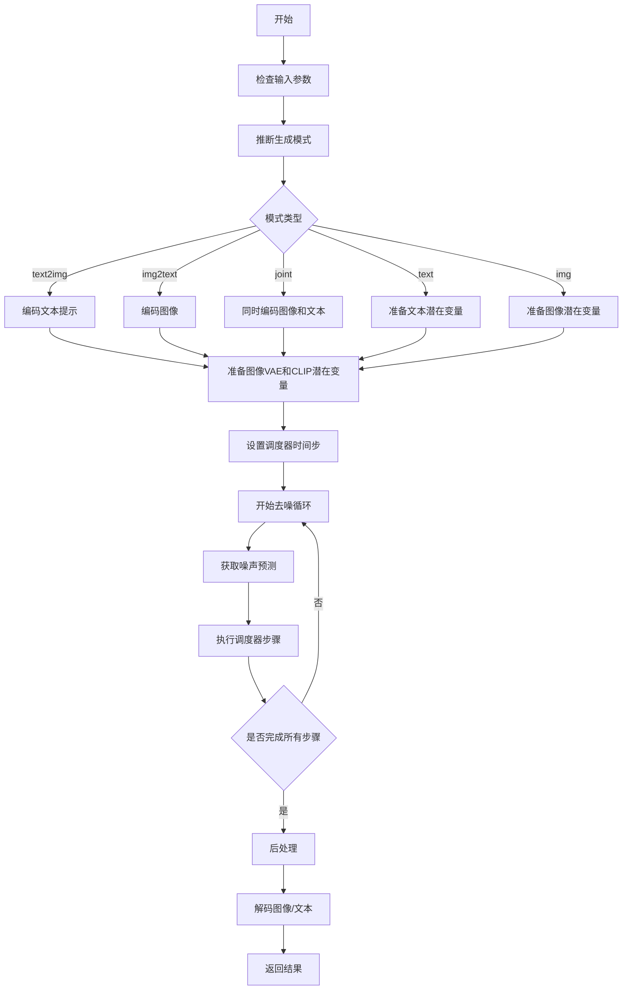

## 类结构

```
BaseOutput (抽象基类)
└── ImageTextPipelineOutput (数据类)
DeprecatedPipelineMixin
└── DiffusionPipeline
    └── UniDiffuserPipeline
        (依赖外部模块)
        ├── UniDiffuserModel (U-ViT)
        ├── UniDiffuserTextDecoder
        ├── AutoencoderKL (VAE)
        ├── CLIPTextModel
        ├── CLIPVisionModelWithProjection
        └── VaeImageProcessor
```

## 全局变量及字段


### `XLA_AVAILABLE`
    
是否支持XLA/TPU

类型：`bool`
    


### `logger`
    
模块日志记录器

类型：`logging.Logger`
    


### `ImageTextPipelineOutput.images`
    
生成图像列表

类型：`list[PIL.Image.Image] | np.ndarray | None`
    


### `ImageTextPipelineOutput.text`
    
生成文本列表

类型：`list[str] | list[list[str]] | None`
    


### `UniDiffuserPipeline.vae`
    
VAE模型，用于图像编码/解码

类型：`AutoencoderKL`
    


### `UniDiffuserPipeline.text_encoder`
    
冻结的CLIP文本编码器

类型：`CLIPTextModel`
    


### `UniDiffuserPipeline.image_encoder`
    
CLIP视觉编码器

类型：`CLIPVisionModelWithProjection`
    


### `UniDiffuserPipeline.clip_image_processor`
    
图像预处理

类型：`CLIPImageProcessor`
    


### `UniDiffuserPipeline.clip_tokenizer`
    
文本tokenizer

类型：`CLIPTokenizer`
    


### `UniDiffuserPipeline.text_decoder`
    
GPT风格文本解码器

类型：`UniDiffuserTextDecoder`
    


### `UniDiffuserPipeline.text_tokenizer`
    
文本生成tokenizer

类型：`GPT2Tokenizer`
    


### `UniDiffuserPipeline.unet`
    
U-ViT去噪模型

类型：`UniDiffuserModel`
    


### `UniDiffuserPipeline.scheduler`
    
扩散调度器

类型：`KarrasDiffusionSchedulers`
    


### `UniDiffuserPipeline.vae_scale_factor`
    
VAE缩放因子

类型：`int`
    


### `UniDiffuserPipeline.image_processor`
    
图像后处理器

类型：`VaeImageProcessor`
    


### `UniDiffuserPipeline.num_channels_latents`
    
潜在通道数

类型：`int`
    


### `UniDiffuserPipeline.text_encoder_seq_len`
    
文本编码器最大位置嵌入

类型：`int`
    


### `UniDiffuserPipeline.text_encoder_hidden_size`
    
文本编码器隐藏层大小

类型：`int`
    


### `UniDiffuserPipeline.image_encoder_projection_dim`
    
图像编码器投影维度

类型：`int`
    


### `UniDiffuserPipeline.unet_resolution`
    
UNet分辨率

类型：`int`
    


### `UniDiffuserPipeline.text_intermediate_dim`
    
文本中间维度

类型：`int`
    


### `UniDiffuserPipeline.mode`
    
当前生成模式

类型：`str | None`
    


### `UniDiffuserPipeline.safety_checker`
    
安全检查器(未实现)

类型：`None`
    


### `UniDiffuserPipeline._last_supported_version`
    
最后支持版本

类型：`str`
    


### `UniDiffuserPipeline.model_cpu_offload_seq`
    
CPU卸载顺序

类型：`str`
    
    

## 全局函数及方法


### UniDiffuserPipeline.__init__

该方法是 `UniDiffuserPipeline` 类的构造函数，负责初始化双模态（图像-文本）生成管道的所有核心组件，包括 VAE、文本编码器、图像编码器、文本解码器、U-Net 模型和调度器，并进行基础配置和验证。

参数：

- `vae`：`AutoencoderKL`，变分自编码器模型，用于将图像编码和解码到潜在表示
- `text_encoder`：`CLIPTextModel`，冻结的文本编码器（clip-vit-large-patch14）
- `image_encoder`：`CLIPVisionModelWithProjection`，CLIP 视觉编码器，用于将图像编码为图像表示的一部分
- `clip_image_processor`：`CLIPImageProcessor`，CLIP 图像预处理器
- `clip_tokenizer`：`CLIPTokenizer`，CLIP 分词器，用于对提示词进行分词
- `text_decoder`：`UniDiffuserTextDecoder`，冻结的文本解码器，GPT 风格模型，用于从 UniDiffuser 嵌入生成文本
- `text_tokenizer`：`GPT2Tokenizer`，GPT2 分词器，用于文本生成的解码
- `unet`：`UniDiffuserModel`，U-ViT 模型，带有 UNet 风格的跳跃连接，用于对编码后的图像潜在进行去噪
- `scheduler`：`KarrasDiffusionSchedulers`，调度器，用于与 unet 结合对图像和/或文本潜在进行去噪

返回值：`None`，构造函数不返回任何值，仅初始化对象状态

#### 流程图

```mermaid
flowchart TD
    A[开始 __init__] --> B[调用 super().__init__]
    B --> C{验证 text_encoder.hidden_size<br/>== text_decoder.prefix_inner_dim}
    C -->|不匹配| D[抛出 ValueError]
    C -->|匹配| E[调用 self.register_modules<br/>注册所有模块]
    E --> F[计算 vae_scale_factor<br/>基于 VAE block_out_channels]
    F --> G[创建 VaeImageProcessor]
    G --> H[设置 num_channels_latents<br/>text_encoder_seq_len<br/>text_encoder_hidden_size<br/>image_encoder_projection_dim<br/>unet_resolution]
    H --> I[计算 text_intermediate_dim]
    I --> J[设置 self.mode = None]
    J --> K[设置 self.safety_checker = None]
    K --> L[结束 __init__]
```

#### 带注释源码

```python
def __init__(
    self,
    vae: AutoencoderKL,
    text_encoder: CLIPTextModel,
    image_encoder: CLIPVisionModelWithProjection,
    clip_image_processor: CLIPImageProcessor,
    clip_tokenizer: CLIPTokenizer,
    text_decoder: UniDiffuserTextDecoder,
    text_tokenizer: GPT2Tokenizer,
    unet: UniDiffuserModel,
    scheduler: KarrasDiffusionSchedulers,
):
    """
    初始化 UniDiffuserPipeline 双模态生成管道
    
    参数:
        vae: VAE 模型，用于图像的潜在表示编码和解码
        text_encoder: CLIP 文本编码器
        image_encoder: CLIP 视觉编码器（含投影层）
        clip_image_processor: CLIP 图像预处理器
        clip_tokenizer: CLIP 分词器
        text_decoder: UniDiffuser 文本解码器（GPT 风格）
        text_tokenizer: GPT2 分词器
        unet: U-ViT 去噪模型
        scheduler: 扩散调度器
    """
    # 调用父类构造函数，初始化基础管道设施
    super().__init__()

    # 验证文本编码器隐藏维度与文本解码器前缀内部维度是否匹配
    # 这是确保两个模型能够正确协作的前置条件
    if text_encoder.config.hidden_size != text_decoder.prefix_inner_dim:
        raise ValueError(
            f"The text encoder hidden size and text decoder prefix inner dim must be the same, but"
            f" `text_encoder.config.hidden_size`: {text_encoder.config.hidden_size} and `text_decoder.prefix_inner_dim`: {text_decoder.prefix_inner_dim}"
        )

    # 注册所有子模块，使它们可以通过管道统一访问和保存/加载
    self.register_modules(
        vae=vae,
        text_encoder=text_encoder,
        image_encoder=image_encoder,
        clip_image_processor=clip_image_processor,
        clip_tokenizer=clip_tokenizer,
        text_decoder=text_decoder,
        text_tokenizer=text_tokenizer,
        unet=unet,
        scheduler=scheduler,
    )

    # 计算 VAE 缩放因子，基于 VAE 的块输出通道数
    # 通常为 2^(len(block_out_channels)-1)，默认为 8
    self.vae_scale_factor = 2 ** (len(self.vae.config.block_out_channels) - 1) if getattr(self, "vae", None) else 8
    
    # 创建 VAE 图像处理器，用于图像的预处理和后处理
    self.image_processor = VaeImageProcessor(vae_scale_factor=self.vae_scale_factor)

    # 存储各组件的关键配置维度信息
    self.num_channels_latents = vae.config.latent_channels  # VAE 潜在通道数
    self.text_encoder_seq_len = text_encoder.config.max_position_embeddings  # 文本最大位置嵌入数
    self.text_encoder_hidden_size = text_encoder.config.hidden_size  # 文本编码器隐藏大小
    self.image_encoder_projection_dim = image_encoder.config.projection_dim  # 图像编码器投影维度
    self.unet_resolution = unet.config.sample_size  # UNet 采样分辨率

    # 计算文本中间维度，用于文本解码器的嵌入处理
    self.text_intermediate_dim = self.text_encoder_hidden_size
    if self.text_decoder.prefix_hidden_dim is not None:
        self.text_intermediate_dim = self.text_decoder.prefix_hidden_dim

    # 初始化生成模式为 None（将从输入推断）
    self.mode = None

    # TODO: 处理安全检查器（当前未实现）
    self.safety_checker = None
```


### `UniDiffuserPipeline.prepare_extra_step_kwargs`

该方法用于准备调度器（scheduler）的额外参数。由于不同的调度器具有不同的签名，该方法通过检查调度器的 `step` 方法是否接受 `eta` 和 `generator` 参数来动态构建需要传递给调度器的参数字典。这确保了代码对不同调度器（如 DDIMScheduler、DPMMultistepScheduler 等）的兼容性。

参数：

- `generator`：`torch.Generator | list[torch.Generator] | None`，用于控制随机数生成以实现可重复性
- `eta`：`float`，DDIM 调度器的参数 η，对应 DDIM 论文中的 η，值应在 [0, 1] 范围内

返回值：`dict`，包含需要传递给调度器 `step` 方法的额外关键字参数字典，可能包含 `eta`（如果调度器支持）和/或 `generator`（如果调度器支持）

#### 流程图

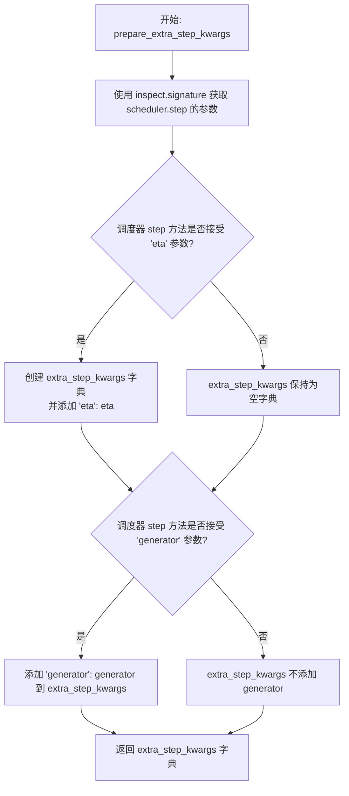

#### 带注释源码

```python
def prepare_extra_step_kwargs(self, generator, eta):
    # 使用 inspect 模块获取调度器 step 方法的函数签名
    # 通过检查调度器实际接受的参数来处理不同调度器之间的签名差异
    # 因为不是所有调度器都接受相同的参数（例如 DDIMScheduler 使用 eta，而其他调度器可能忽略它）
    
    # 检查调度器的 step 方法是否接受 'eta' 参数
    # eta (η) 仅在 DDIMScheduler 中使用，其他调度器会忽略此参数
    # eta 对应 DDIM 论文 https://huggingface.co/papers/2010.02502 中的 η，值应介于 [0, 1] 之间
    accepts_eta = "eta" in set(inspect.signature(self.scheduler.step).parameters.keys())
    
    # 初始化空字典用于存储需要传递给调度器的额外参数
    extra_step_kwargs = {}
    
    # 如果调度器接受 eta 参数，则将其添加到 extra_step_kwargs 中
    if accepts_eta:
        extra_step_kwargs["eta"] = eta

    # 检查调度器的 step 方法是否接受 'generator' 参数
    # generator 用于控制随机数生成，以实现可重复的扩散采样过程
    accepts_generator = "generator" in set(inspect.signature(self.scheduler.step).parameters.keys())
    
    # 如果调度器接受 generator 参数，则将其添加到 extra_step_kwargs 中
    if accepts_generator:
        extra_step_kwargs["generator"] = generator
    
    # 返回构建好的参数字典，供 pipeline 的去噪循环中调用 scheduler.step 时使用
    return extra_step_kwargs
```


### UniDiffuserPipeline._infer_mode

该方法负责根据输入参数推断生成任务模式（mode），支持文本到图像（text2img）、图像到文本（img2text）、仅文本（text）、仅图像（img）以及联合生成（joint）五种模式。如果用户已手动设置模式，则优先使用手动设置的模式。

参数：

- `prompt`：`str | list[str] | None`，用户提供的文本提示
- `prompt_embeds`：`torch.Tensor | None`，预计算的文本嵌入向量
- `image`：`torch.Tensor | PIL.Image.Image | None`，输入图像
- `latents`：`torch.Tensor | None`，完整的潜在变量（包含VAE、CLIP和文本的潜在表示）
- `prompt_latents`：`torch.Tensor | None`，文本潜在变量
- `vae_latents`：`torch.Tensor | None`，VAE图像潜在变量
- `clip_latents`：`torch.Tensor | None`，CLIP图像潜在变量

返回值：`str`，推断出的生成模式，可选值为 "text2img"、"img2text"、"text"、"img"、"joint"

#### 流程图

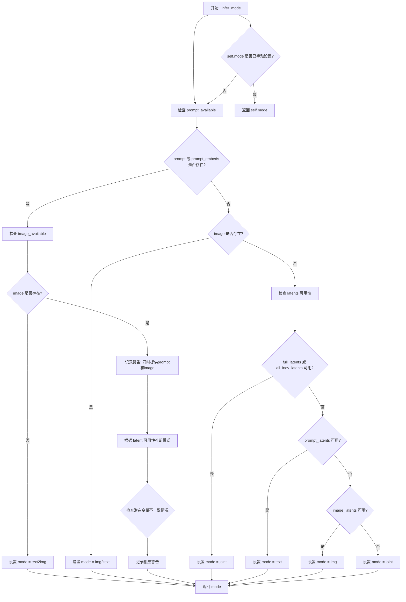

#### 带注释源码

```python
def _infer_mode(self, prompt, prompt_embeds, image, latents, prompt_latents, vae_latents, clip_latents):
    r"""
    Infer the generation task ('mode') from the inputs to `__call__`. If the mode has been manually set, the set
    mode will be used.
    
    该方法根据传入的输入参数推断生成模式。UniDiffuser支持多种生成模式:
    - text2img: 文本条件图像生成
    - img2text: 图像条件文本生成
    - text: 无条件(边际)文本生成
    - img: 无条件(边际)图像生成
    - joint: 联合图像-文本生成
    
    模式推断优先级:
    1. 如果用户已手动设置模式(self.mode),优先使用
    2. 如果有文本提示,选择text2img模式
    3. 如果有输入图像,选择img2text模式
    4. 根据潜在变量的可用性推断其他模式
    """
    # 检查文本输入是否可用
    prompt_available = (prompt is not None) or (prompt_embeds is not None)
    # 检查图像输入是否可用
    image_available = image is not None
    # 检查是否有任何输入
    input_available = prompt_available or image_available

    # 检查各类型潜在变量的可用性
    prompt_latents_available = prompt_latents is not None
    vae_latents_available = vae_latents is not None
    clip_latents_available = clip_latents is not None
    # 完整潜在变量包含所有三种类型的潜在表示
    full_latents_available = latents is not None
    # 图像潜在变量需要同时有VAE和CLIP潜在变量
    image_latents_available = vae_latents_available and clip_latents_available
    # 所有独立潜在变量都可用
    all_indv_latents_available = prompt_latents_available and image_latents_available

    # 优先级1: 如果用户已手动设置模式,优先使用
    if self.mode is not None:
        # Preferentially use the mode set by the user
        mode = self.mode
    # 优先级2: 根据输入类型推断模式
    elif prompt_available:
        mode = "text2img"
    elif image_available:
        mode = "img2text"
    else:
        # Neither prompt nor image supplied, infer based on availability of latents
        # 根据潜在变量的可用性进行推断
        if full_latents_available or all_indv_latents_available:
            mode = "joint"
        elif prompt_latents_available:
            mode = "text"
        elif image_latents_available:
            mode = "img"
        else:
            # No inputs or latents available
            # 默认使用joint模式
            mode = "joint"

    # 对于模糊情况发出警告
    # 警告1: 同时提供了prompt和image但未手动设置模式
    if self.mode is None and prompt_available and image_available:
        logger.warning(
            f"You have supplied both a text prompt and image to the pipeline and mode has not been set manually,"
            f" defaulting to mode '{mode}'."
        )

    # 警告2: 没有提供任何输入但未手动设置模式
    if self.mode is None and not input_available:
        # 检查VAE和CLIP潜在变量是否一致(应该同时提供或都不提供)
        if vae_latents_available != clip_latents_available:
            # Exactly one of vae_latents and clip_latents is supplied
            logger.warning(
                f"You have supplied exactly one of `vae_latents` and `clip_latents`, whereas either both or none"
                f" are expected to be supplied. Defaulting to mode '{mode}'."
            )
        elif not prompt_latents_available and not vae_latents_available and not clip_latents_available:
            # No inputs or latents supplied
            logger.warning(
                f"No inputs or latents have been supplied, and mode has not been manually set,"
                f" defaulting to mode '{mode}'."
            )

    return mode
```


### `UniDiffuserPipeline.enable_vae_slicing`

启用 VAE 切片解码功能。当启用此选项时，VAE 会将输入张量分割成多个切片进行分步解码计算，以节省内存并支持更大的批量大小。

参数：

- 无

返回值：无（`None`），该方法直接修改对象状态，不返回任何值。

#### 流程图

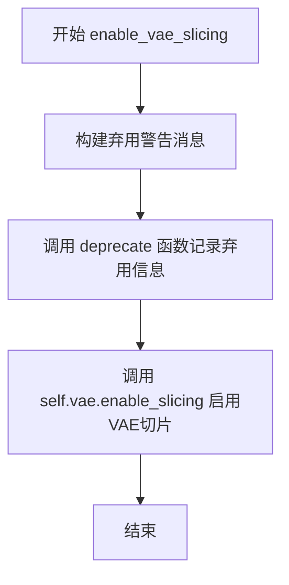

#### 带注释源码

```python
def enable_vae_slicing(self):
    r"""
    Enable sliced VAE decoding. When this option is enabled, the VAE will split the input tensor in slices to
    compute decoding in several steps. This is useful to save some memory and allow larger batch sizes.
    """
    # 构建弃用警告消息，提示用户该方法将在未来版本中移除
    # 并建议使用新的 API：pipe.vae.enable_slicing()
    depr_message = f"Calling `enable_vae_slicing()` on a `{self.__class__.__name__}` is deprecated and this method will be removed in a future version. Please use `pipe.vae.enable_slicing()`."
    
    # 调用 deprecate 函数记录弃用信息
    # 参数依次为：方法名、弃用版本号、弃用消息
    deprecate(
        "enable_vae_slicing",
        "0.40.0",
        depr_message,
    )
    
    # 调用 VAE 模型的 enable_slicing 方法启用切片解码
    # 这是实际执行切片功能的调用
    self.vae.enable_slicing()
```


### `UniDiffuserPipeline.disable_vae_slicing`

该方法用于禁用 VAE（变分自编码器）的分片解码功能。如果之前启用了 `enable_vae_slicing`，调用此方法后将恢复到单步解码模式。该方法已被标记为弃用，并将在一段时间后移除。

参数： 无

返回值：`None`，无返回值

#### 流程图

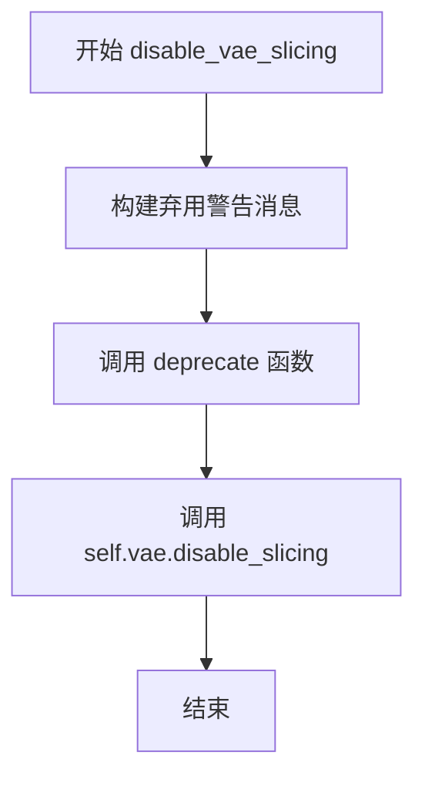

#### 带注释源码

```
def disable_vae_slicing(self):
    r"""
    Disable sliced VAE decoding. If `enable_vae_slicing` was previously enabled, this method will go back to
    computing decoding in one step.
    """
    # 构建弃用警告消息，提示用户该方法将在未来版本中移除
    # 并建议使用新的 API: pipe.vae.disable_slicing()
    depr_message = f"Calling `disable_vae_slicing()` on a `{self.__class__.__name__}` is deprecated and this method will be removed in a future version. Please use `pipe.vae.disable_slicing()`."
    
    # 调用 deprecate 函数记录弃用信息
    deprecate(
        "disable_vae_slicing",  # 被弃用的方法名
        "0.40.0",               # 弃用版本号
        depr_message,           # 弃用警告消息
    )
    
    # 实际调用 VAE 模型的 disable_slicing 方法来禁用分片解码
    self.vae.disable_slicing()
```


### UniDiffuserPipeline.enable_vae_tiling

该方法用于启用瓦片式VAE解码/编码。当启用此选项时，VAE会将输入张量分割成多个瓦片进行分步计算解码和编码过程。这种方法对于节省大量内存并允许处理更大尺寸的图像非常有用。

参数：
- 无

返回值：`None`，无返回值，仅执行启用VAE瓦片化的操作

#### 流程图

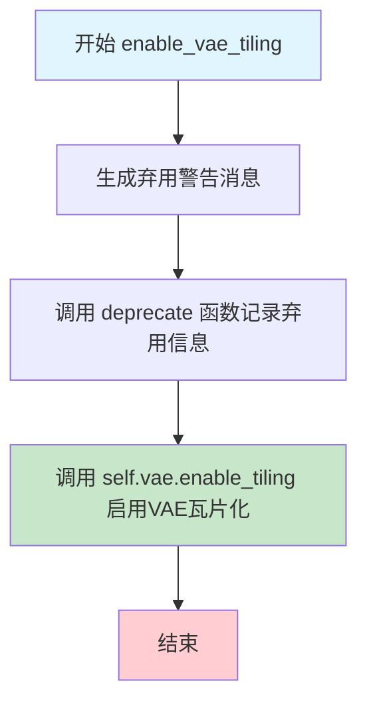

#### 带注释源码

```python
# Copied from diffusers.pipelines.pipeline_utils.StableDiffusionMixin.enable_vae_tiling
def enable_vae_tiling(self):
    r"""
    Enable tiled VAE decoding. When this option is enabled, the VAE will split the input tensor into tiles to
    compute decoding and encoding in several steps. This is useful for saving a large amount of memory and to allow
    processing larger images.
    """
    # 构建弃用警告消息，告知用户该方法将在未来版本中移除
    # 并建议使用新的API: pipe.vae.enable_tiling()
    depr_message = f"Calling `enable_vae_tiling()` on a `{self.__class__.__name__}` is deprecated and this method will be removed in a future version. Please use `pipe.vae.enable_tiling()`."
    
    # 调用deprecate函数记录弃用信息
    # 参数: 方法名, 弃用版本号, 警告消息
    deprecate(
        "enable_vae_tiling",
        "0.40.0",
        depr_message,
    )
    
    # 调用VAE模型的enable_tiling方法实际启用瓦片化功能
    # 这会修改VAE模型的内部状态，使其在decode/encode时使用分块处理
    self.vae.enable_tiling()
```


### `UniDiffuserPipeline.disable_vae_tiling`

该方法用于禁用VAE的分块解码功能。如果之前启用了分块解码（tiling），调用此方法后将恢复到单步解码模式。该方法已被标记为废弃，建议用户直接使用 `pipe.vae.disable_tiling()`。

参数：  
无

返回值：`None`，无返回值

#### 流程图

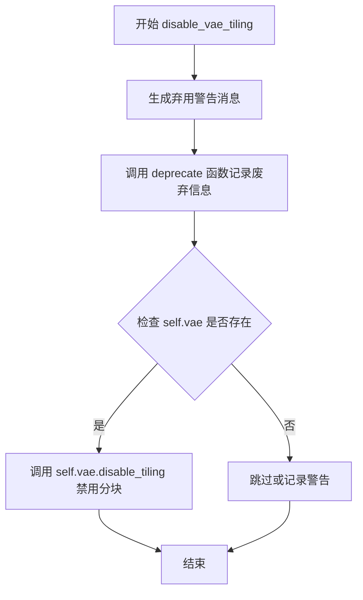

#### 带注释源码

```python
# Copied from diffusers.pipelines.pipeline_utils.StableDiffusionMixin.disable_vae_tiling
def disable_vae_tiling(self):
    r"""
    Disable tiled VAE decoding. If `enable_vae_tiling` was previously enabled, this method will go back to
    computing decoding in one step.
    """
    # 构建弃用警告消息，包含当前类名，提示用户在未来版本中该方法将被移除
    # 并建议使用新的 API: pipe.vae.disable_tiling()
    depr_message = f"Calling `disable_vae_tiling()` on a `{self.__class__.__name__}` is deprecated and this method will be removed in a future version. Please use `pipe.vae.disable_tiling()`."
    
    # 调用 deprecate 函数记录废弃信息，指定废弃的功能名、版本号和警告消息
    deprecate(
        "disable_vae_tiling",
        "0.40.0",
        depr_message,
    )
    
    # 调用 VAE 模型的 disable_tiling 方法，禁用分块解码功能
    # 这将使得 VAE 恢复到单步解码模式，一次性处理整个输入
    self.vae.disable_tiling()
```


### `UniDiffuserPipeline.set_text_mode`

设置管道的生成模式为无条件（"边缘"）文本生成模式。

参数：
- 该方法没有参数

返回值：`None`，无返回值，仅修改实例属性 `self.mode`

#### 流程图

```mermaid
flowchart TD
    A[开始] --> B[设置 self.mode = "text"]
    B --> C[结束]
```

#### 带注释源码

```python
def set_text_mode(self):
    r"""Manually set the generation mode to unconditional ("marginal") text generation."""
    self.mode = "text"
```

---

#### 补充说明

1. **方法功能**：此方法用于手动将 UniDiffuserPipeline 的生成模式设置为 `"text"`（无条件文本生成模式）。在此模式下，管道将执行边缘（marginal）文本生成，即不基于任何图像或文本条件，仅根据模型自身的先验生成文本。

2. **使用场景**：
   - 用户需要单独生成文本而不需要图像条件时调用
   - 与其他模式设置方法配合使用（如 `set_text_to_image_mode()`、`set_image_mode()` 等）

3. **与其他方法的关系**：
   - `set_text_mode()`：设置为文本生成模式
   - `set_image_mode()`：设置为图像生成模式
   - `set_text_to_image_mode()`：设置为文本到图像模式
   - `set_image_to_text_mode()`：设置为图像到文本模式
   - `set_joint_mode()`：设置为联合图像-文本生成模式
   - `reset_mode()`：重置模式，使其从输入自动推断

4. **模式推断机制**：当未手动设置模式时，`_infer_mode()` 方法会根据 `__call__` 的输入参数自动推断生成模式。

5. **技术债务/优化空间**：
   - 该方法目前只是简单地设置字符串值，没有任何验证机制
   - 建议添加参数验证，确保传入的模式值是有效选项之一
   - 可以考虑使用枚举类型替代字符串字面量，提高类型安全性和代码可维护性


### `UniDiffuserPipeline.set_image_mode`

该方法用于手动将生成模式设置为无条件（边缘）图像生成模式。调用此方法后，Pipeline 将以 "img" 模式运行，执行无条件的图像生成任务。

参数：

- 该方法无参数（仅包含 self）

返回值：`None`，无返回值（该方法直接修改实例属性 `self.mode`）

#### 流程图

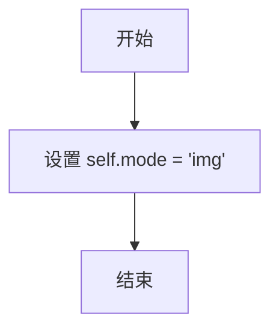

#### 带注释源码

```python
def set_image_mode(self):
    r"""
    Manually set the generation mode to unconditional ("marginal") image generation.
    
    该方法用于手动设置管道的生成模式为 'img'（无条件图像生成模式）。
    在该模式下，模型将执行边缘（marginal）图像生成，即不依赖于任何文本提示的图像生成任务。
    此设置会覆盖自动模式推断逻辑，强制管道以指定的模式运行。
    
    Returns:
        None: 直接修改实例属性，不返回任何值
    """
    self.mode = "img"
```


### `UniDiffuserPipeline.set_text_to_image_mode`

该方法用于手动将 UniDiffuserPipeline 的生成模式设置为"文本到图像"（text2img）模式，以便执行文本条件图像生成任务。

参数：无需参数

返回值：`None`，该方法不返回任何值，仅修改实例属性

#### 流程图

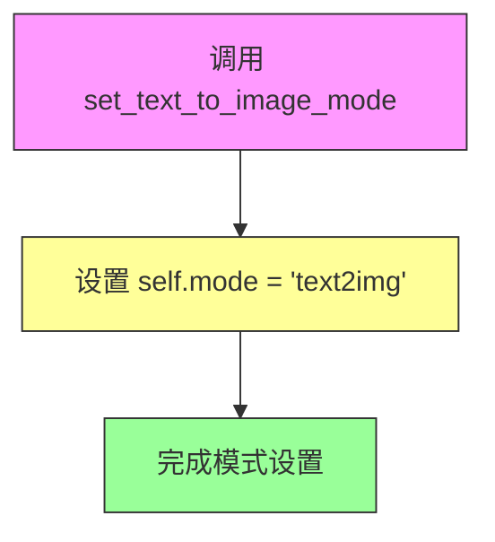

#### 带注释源码

```python
def set_text_to_image_mode(self):
    r"""Manually set the generation mode to text-conditioned image generation."""
    # 将实例的 mode 属性设置为 "text2img" 字符串
    # 该模式用于文本到图像的生成任务
    self.mode = "text2img"
```

---

### 补充信息

#### 1. 类概述

`UniDiffuserPipeline` 是一个支持双模态（图像-文本）生成的扩散管道，支持无条件文本和图像生成、文本条件图像生成、图像条件文本生成以及联合图像-文本生成。该类继承自 `DeprecatedPipelineMixin` 和 `DiffusionPipeline`。

#### 2. 关键组件信息

| 组件名称 | 一句话描述 |
|---------|-----------|
| `self.mode` | 控制管道生成模式的实例变量，支持 "text"、"img"、"text2img"、"img2text"、"joint" 等模式 |
| `set_text_mode()` | 设置为无条件文本生成模式 |
| `set_image_mode()` | 设置为无条件图像生成模式 |
| `set_image_to_text_mode()` | 设置为图像到文本生成模式 |
| `set_joint_mode()` | 设置为联合图像-文本生成模式 |
| `reset_mode()` | 重置模式，由管道根据输入自动推断模式 |

#### 3. 潜在的技术债务或优化空间

- **模式管理方式**：当前使用字符串硬编码方式管理模式，容易出现拼写错误，建议使用枚举类（Enum）来管理模式
- **文档字符串格式**：虽然使用了 `r"""` 原始字符串，但描述较为简洁，可增加更多使用示例
- **缺少验证**：设置模式时未验证模式值的合法性

#### 4. 其它项目

**设计目标与约束**：
- 该方法是便捷方法，允许用户手动指定生成模式，而无需依赖自动推断
- 与 `_infer_mode()` 方法配合使用，自动推断优先级低于手动设置

**错误处理与异常设计**：
- 当前方法未包含任何错误处理机制
- 模式值的验证由后续调用（如 `_infer_batch_size`、`check_inputs` 等）完成

**数据流与状态机**：
- 该方法属于状态设置操作，直接修改 `self.mode` 属性
- 设置后的模式会影响后续 `__call__` 方法中的批次大小推断、输入验证和去噪逻辑

**外部依赖与接口契约**：
- 无外部依赖，仅修改内部状态
- 作为管道公共接口的一部分供用户调用


### `UniDiffuserPipeline.set_image_to_text_mode`

设置管道的生成模式为图像到文本（image-conditioned text generation）模式。

参数：无（除 self 外）

返回值：`None`，无返回值（该方法直接修改实例属性 `self.mode`）

#### 流程图

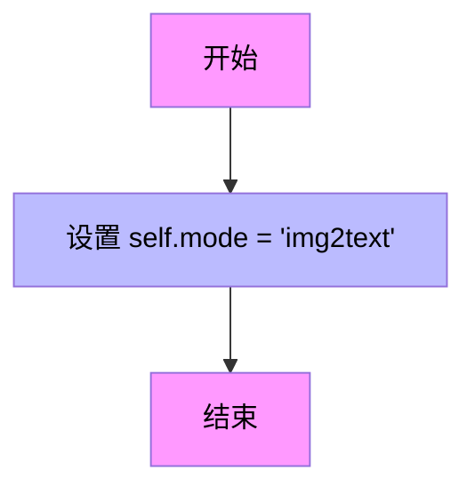

#### 带注释源码

```python
def set_image_to_text_mode(self):
    r"""Manually set the generation mode to image-conditioned text generation."""
    self.mode = "img2text"
```

**代码说明：**
- 该方法属于 `UniDiffuserPipeline` 类，用于手动将管道的生成模式设置为 "img2text"（图像到文本）模式
- 当设置此模式后，管道将执行基于输入图像生成对应文本的任务
- 这是 UniDiffuser 双模态图像文本模型支持的几种生成模式之一（其他模式包括：text2img 文本到图像、img 图像生成、text 文本生成、joint 联合生成）
- 该方法直接修改实例属性 `self.mode`，后续在 `__call__` 方法中会通过 `_infer_mode` 检查此属性来确定生成任务类型


### `UniDiffuserPipeline.set_joint_mode`

设置管道的生成模式为联合图像-文本生成模式（joint mode），即无条件地同时生成图像和文本。

参数：无

返回值：`None`，无返回值，该方法直接修改实例属性 `self.mode`

#### 流程图

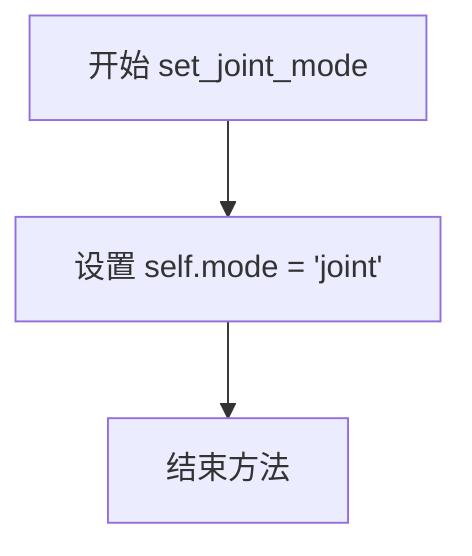

#### 带注释源码

```python
def set_joint_mode(self):
    r"""Manually set the generation mode to unconditional joint image-text generation."""
    # 将实例属性 mode 设置为字符串 "joint"
    # 该模式表示 pipeline 将执行联合图像-文本生成任务
    # 在该模式下，pipeline 会同时生成图像和文本内容
    self.mode = "joint"
```


### `UniDiffuserPipeline.reset_mode`

重置手动设置的生成模式，使 Pipeline 能够根据输入参数自动推断生成模式。

参数：

- 此方法无参数（除隐式 `self`）

返回值：`None`，无返回值描述（该方法直接修改实例属性）

#### 流程图

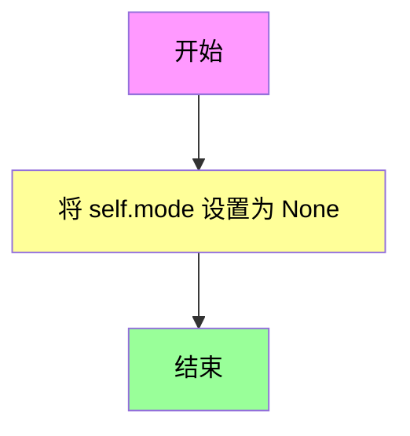

#### 带注释源码

```python
def reset_mode(self):
    r"""Removes a manually set mode; after calling this, the pipeline will infer the mode from inputs."""
    self.mode = None
```

---

**方法说明**：

- **功能概述**：此方法用于撤销之前通过 `set_text_mode()`、`set_image_mode()`、`set_text_to_image_mode()`、`set_image_to_text_mode()` 或 `set_joint_mode()` 手动设置的生成模式。调用后，`_infer_mode()` 方法将在后续调用 `__call__` 时根据提供的输入（prompt、image、latents 等）自动推断合适的生成模式。

- **使用场景**：当用户想要动态切换不同的生成任务（如从文本生成图像切换到图像生成文本）时，可以先调用 `reset_mode()` 清除之前的固定模式设置，让 Pipeline 自动适应新的输入。


### `UniDiffuserPipeline._infer_batch_size`

该方法根据传入的生成模式（mode）和相关参数（prompt、image、latents等）推断批处理大小（batch_size）和乘数（multiplier），以支持UniDiffuser的多模态生成能力。

参数：

- `self`：隐式参数，UniDiffuserPipeline实例本身
- `mode`：`str`，生成模式，可选值为"text2img"（文生图）、"img2text"（图生文）、"img"（无条件图像生成）、"text"（无条件文本生成）、"joint"（联合图像-文本生成）
- `prompt`：`str | list[str] | None`，输入的文本提示，支持单字符串或字符串列表
- `prompt_embeds`：`torch.Tensor | None`，预生成的文本嵌入向量
- `image`：`PIL.Image.Image | torch.Tensor | None`，输入图像，用于图生文或图像条件生成
- `num_images_per_prompt`：`int | None`，每个提示生成的图像数量，用于text2img和img模式
- `num_prompts_per_image`：`int | None`，每个图像生成的提示数量，用于img2text和text模式
- `latents`：`torch.Tensor | None`，预生成的联合潜在变量，包含VAE、CLIP和文本 latent
- `prompt_latents`：`torch.Tensor | None`，预生成的文本 latent
- `vae_latents`：`torch.Tensor | None`，预生成的VAE图像 latent
- `clip_latents`：`torch.Tensor | None`，预生成的CLIP图像 latent

返回值：`tuple[int, int]`，返回元组`(batch_size, multiplier)`，其中batch_size是推理批次大小，multiplier是每个输入对应的生成数量

#### 流程图

```mermaid
flowchart TD
    A[开始 _infer_batch_size] --> B{num_images_per_prompt is None?}
    B -->|Yes| C[num_images_per_prompt = 1]
    B -->|No| D
    C --> D{num_prompts_per_image is None?}
    D -->|Yes| E[num_prompts_per_image = 1]
    D -->|No| F{检查 mode}
    
    F --> G{mode == 'text2img'}
    G -->|Yes| H{prompt类型检查}
    H -->|str| I[batch_size = 1]
    H -->|list| J[batch_size = len(prompt)]
    H -->|else| K[batch_size = prompt_embeds.shape[0]]
    I --> L[multiplier = num_images_per_prompt]
    J --> L
    K --> L
    
    G -->|No| M{mode == 'img2text'}
    M -->|Yes| N{image类型检查}
    N -->|PIL.Image| O[batch_size = 1]
    N -->|else| P[batch_size = image.shape[0]]
    O --> Q[multiplier = num_prompts_per_image]
    P --> Q
    
    M -->|No| R{mode == 'img'}
    R -->|Yes| S{检查latents可用性}
    S -->|vae_latents| T[batch_size = vae_latents.shape[0]]
    S -->|clip_latents| U[batch_size = clip_latents.shape[0]]
    S -->|else| V[batch_size = 1]
    T --> W[multiplier = num_images_per_prompt]
    U --> W
    V --> W
    
    R -->|No| X{mode == 'text'}
    X -->|Yes| Y{prompt_latents可用?}
    Y -->|Yes| Z[batch_size = prompt_latents.shape[0]]
    Y -->|No| AA[batch_size = 1]
    Z --> AB[multiplier = num_prompts_per_image]
    AA --> AB
    
    X -->|No| AC{mode == 'joint'}
    AC -->|Yes| AD{检查latents优先级}
    AD -->|latents| AE[batch_size = latents.shape[0]]
    AD -->|prompt_latents| AF[batch_size = prompt_latents.shape[0]]
    AD -->|vae_latents| AG[batch_size = vae_latents.shape[0]]
    AD -->|clip_latents| AH[batch_size = clip_latents.shape[0]]
    AD -->|else| AI[batch_size = 1]
    AE --> AJ{num_images_per_prompt == num_prompts_per_image?}
    AF --> AJ
    AG --> AJ
    AH --> AJ
    AI --> AJ
    AJ -->|Yes| AK[multiplier = num_images_per_prompt]
    AJ -->|No| AL[multiplier = min<br/>num_images_per_prompt<br/>num_prompts_per_image<br/>并发出警告]
    AK --> AM[返回 batch_size, multiplier]
    AL --> AM
    
    AC -->|No| AM
```

#### 带注释源码

```python
def _infer_batch_size(
    self,
    mode,
    prompt,
    prompt_embeds,
    image,
    num_images_per_prompt,
    num_prompts_per_image,
    latents,
    prompt_latents,
    vae_latents,
    clip_latents,
):
    r"""Infers the batch size and multiplier depending on mode and supplied arguments to `__call__`.
    
    根据__call__方法的模式和提供的参数推断批处理大小和乘数。
    批处理大小决定同时处理多少个样本，乘数决定每个输入生成多少个输出。
    """
    # 参数默认值处理：如果未指定，则默认为1
    if num_images_per_prompt is None:
        num_images_per_prompt = 1
    if num_prompts_per_image is None:
        num_prompts_per_image = 1

    # 参数有效性检查：确保为正整数
    assert num_images_per_prompt > 0, "num_images_per_prompt must be a positive integer"
    assert num_prompts_per_image > 0, "num_prompts_per_image must be a positive integer"

    # 根据不同模式计算batch_size和multiplier
    if mode in ["text2img"]:
        # 文生图模式：从prompt或prompt_embeds推断batch_size
        if prompt is not None and isinstance(prompt, str):
            batch_size = 1  # 单个字符串提示
        elif prompt is not None and isinstance(prompt, list):
            batch_size = len(prompt)  # 提示列表长度
        else:
            # prompt_embeds必须存在（前面已检查）
            batch_size = prompt_embeds.shape[0]
        multiplier = num_images_per_prompt  # 每个提示生成的图像数
    elif mode in ["img2text"]:
        # 图生文模式：从image推断batch_size
        if isinstance(image, PIL.Image.Image):
            batch_size = 1  # 单张PIL图像
        else:
            # 假设是torch.Tensor，batch维度为0
            batch_size = image.shape[0]
        multiplier = num_prompts_per_image  # 每张图像生成的文本数
    elif mode in ["img"]:
        # 无条件图像生成模式：从vae_latents或clip_latents推断
        if vae_latents is not None:
            batch_size = vae_latents.shape[0]
        elif clip_latents is not None:
            batch_size = clip_latents.shape[0]
        else:
            batch_size = 1  # 默认单个样本
        multiplier = num_images_per_prompt
    elif mode in ["text"]:
        # 无条件文本生成模式：从prompt_latents推断
        if prompt_latents is not None:
            batch_size = prompt_latents.shape[0]
        else:
            batch_size = 1
        multiplier = num_prompts_per_image
    elif mode in ["joint"]:
        # 联合生成模式：优先使用latents，否则依次检查各类型latents
        if latents is not None:
            batch_size = latents.shape[0]
        elif prompt_latents is not None:
            batch_size = prompt_latents.shape[0]
        elif vae_latents is not None:
            batch_size = vae_latents.shape[0]
        elif clip_latents is not None:
            batch_size = clip_latents.shape[0]
        else:
            batch_size = 1

        # joint模式下multiplier的处理逻辑
        if num_images_per_prompt == num_prompts_per_image:
            multiplier = num_images_per_prompt
        else:
            # 不相等时取较小值并发出警告
            multiplier = min(num_images_per_prompt, num_prompts_per_image)
            logger.warning(
                f"You are using mode `{mode}` and `num_images_per_prompt`: {num_images_per_prompt} and"
                f" num_prompts_per_image: {num_prompts_per_image} are not equal. Using batch size equal to"
                f" `min(num_images_per_prompt, num_prompts_per_image) = {batch_size}."
            )
    
    # 返回推断出的batch_size和multiplier
    return batch_size, multiplier
```


### `UniDiffuserPipeline._encode_prompt`

该函数是一个已弃用的提示编码方法，用于将文本提示编码为文本编码器的隐藏状态。它通过调用新的`encode_prompt`方法来实现功能，并为了向后兼容性，将返回的元组重新拼接为单一的tensor。

参数：

- `self`：类实例本身，包含pipeline的所有组件
- `prompt`：`str` 或 `list[str]` 或 `None`，要编码的文本提示
- `device`：`torch.device`，torch设备
- `num_images_per_prompt`：`int`，每个提示要生成的图像数量
- `do_classifier_free_guidance`：`bool`，是否使用无分类器自由引导
- `negative_prompt`：`str` 或 `list[str]` 或 `None`，用于引导不包含内容的负向提示
- `prompt_embeds`：`torch.Tensor` 或 `None`，预生成的文本嵌入，可用于微调文本输入
- `negative_prompt_embeds`：`torch.Tensor` 或 `None`，预生成的负向文本嵌入
- `lora_scale`：`float` 或 `None`，LoRA缩放因子，用于调整LoRA层的影响
- `**kwargs`：可变关键字参数，传递给`encode_prompt`的额外参数

返回值：`torch.Tensor`，拼接后的文本嵌入tensor（为了向后兼容性，将negative和positive embeddings拼接在一起）

#### 流程图

```mermaid
flowchart TD
    A[开始 _encode_prompt] --> B[记录弃用警告]
    B --> C[调用 self.encode_prompt]
    C --> D[获取返回的元组 prompt_embeds_tuple]
    D --> E{检查 do_classifier_free_guidance}
    E -->|True| F[获取负面和正面embeddings]
    E -->|False| G[仅获取正面embeddings]
    F --> H[拼接: torch.cat[negative, positive]]
    G --> H
    H --> I[返回拼接后的 prompt_embeds]
```

#### 带注释源码

```python
def _encode_prompt(
    self,
    prompt,                          # str | list[str] | None: 要编码的文本提示
    device,                          # torch.device: torch设备
    num_images_per_prompt,           # int: 每个提示生成的图像数量
    do_classifier_free_guidance,     # bool: 是否使用classifier-free guidance
    negative_prompt=None,            # str | list[str] | None: 负向提示
    prompt_embeds: torch.Tensor | None = None,    # 预生成的文本嵌入
    negative_prompt_embeds: torch.Tensor | None = None,  # 预生成的负向嵌入
    lora_scale: float | None = None,  # LoRA缩放因子
    **kwargs,                        # 传递给encode_prompt的额外参数
):
    """
    已弃用的提示编码方法，为了向后兼容而保留。
    实际编码工作由encode_prompt方法完成。
    """
    
    # 记录弃用警告，提示用户使用encode_prompt替代
    deprecation_message = "`_encode_prompt()` is deprecated and it will be removed in a future version. Use `encode_prompt()` instead. Also, be aware that the output format changed from a concatenated tensor to a tuple."
    deprecate("_encode_prompt()", "1.0.0", deprecation_message, standard_warn=False)

    # 调用新的encode_prompt方法获取编码结果
    # 返回值是tuple: (prompt_embeds, negative_prompt_embeds)
    prompt_embeds_tuple = self.encode_prompt(
        prompt=prompt,
        device=device,
        num_images_per_prompt=num_images_per_prompt,
        do_classifier_free_guidance=do_classifier_free_guidance,
        negative_prompt=negative_prompt,
        prompt_embeds=prompt_embeds,
        negative_prompt_embeds=negative_prompt_embeds,
        lora_scale=lora_scale,
        **kwargs,
    )

    # 为了向后兼容性，将元组中的embeddings拼接回来
    # 旧版本返回的是 [negative_prompt_embeds, prompt_embeds] 拼接的结果
    # 新版本返回的是 (prompt_embeds, negative_prompt_embeds) 元组
    # 所以这里取 [1]是negative, [0]是positive
    prompt_embeds = torch.cat([prompt_embeds_tuple[1], prompt_embeds_tuple[0]])

    return prompt_embeds
```


### UniDiffuserPipeline.encode_prompt

该方法将文本提示（prompt）编码为文本编码器的隐藏状态（hidden states），支持LoRA权重调整、文本反转（textual inversion）、分类器无关引导（classifier-free guidance）等功能，是UniDiffuserPipeline处理文本输入的核心方法。

参数：

- `prompt`：`str` | `list[str]` | None，要编码的文本提示
- `device`：`torch.device`，PyTorch设备对象
- `num_images_per_prompt`：`int`，每个提示生成的图像数量
- `do_classifier_free_guidance`：`bool`，是否使用分类器无关引导
- `negative_prompt`：`str` | `list[str]` | None，用于引导不生成内容的负面提示
- `prompt_embeds`：`torch.Tensor | None`，预生成的文本嵌入向量
- `negative_prompt_embeds`：`torch.Tensor | None`，预生成的负面文本嵌入向量
- `lora_scale`：`float | None`，LoRA层的缩放因子
- `clip_skip`：`int | None`，CLIP编码时跳过的层数

返回值：`tuple[torch.Tensor, torch.Tensor]`，返回编码后的提示嵌入和负面提示嵌入元组

#### 流程图

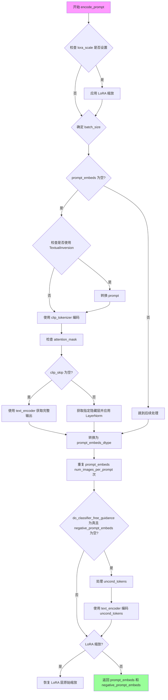

#### 带注释源码

```python
def encode_prompt(
    self,
    prompt,
    device,
    num_images_per_prompt,
    do_classifier_free_guidance,
    negative_prompt=None,
    prompt_embeds: torch.Tensor | None = None,
    negative_prompt_embeds: torch.Tensor | None = None,
    lora_scale: float | None = None,
    clip_skip: int | None = None,
):
    r"""
    Encodes the prompt into text encoder hidden states.

    Args:
        prompt (`str` or `list[str]`, *optional*):
            prompt to be encoded
        device: (`torch.device`):
            torch device
        num_images_per_prompt (`int`):
            number of images that should be generated per prompt
        do_classifier_free_guidance (`bool`):
            whether to use classifier free guidance or not
        negative_prompt (`str` or `list[str]`, *optional*):
            The prompt or prompts not to guide the image generation. If not defined, one has to pass
            `negative_prompt_embeds` instead. Ignored when not using guidance (i.e., ignored if `guidance_scale` is
            less than `1`).
        prompt_embeds (`torch.Tensor`, *optional*):
            Pre-generated text embeddings. Can be used to easily tweak text inputs, *e.g.* prompt weighting. If not
            provided, text embeddings will be generated from `prompt` input argument.
        negative_prompt_embeds (`torch.Tensor`, *optional*):
            Pre-generated negative text embeddings. Can be used to easily tweak text inputs, *e.g.* prompt
            weighting. If not provided, negative_prompt_embeds will be generated from `negative_prompt` input
            argument.
        lora_scale (`float`, *optional*):
            A LoRA scale that will be applied to all LoRA layers of the text encoder if LoRA layers are loaded.
        clip_skip (`int`, *optional*):
            Number of layers to be skipped from CLIP while computing the prompt embeddings. A value of 1 means that
            the output of the pre-final layer will be used for computing the prompt embeddings.
    """
    # 设置LoRA缩放值，以便文本编码器的LoRA函数可以正确访问
    if lora_scale is not None and isinstance(self, StableDiffusionLoraLoaderMixin):
        self._lora_scale = lora_scale

        # 动态调整LoRA缩放
        if not USE_PEFT_BACKEND:
            adjust_lora_scale_text_encoder(self.text_encoder, lora_scale)
        else:
            scale_lora_layers(self.text_encoder, lora_scale)

    # 确定批量大小：检查prompt类型或使用已提供的prompt_embeds的形状
    if prompt is not None and isinstance(prompt, str):
        batch_size = 1
    elif prompt is not None and isinstance(prompt, list):
        batch_size = len(prompt)
    else:
        batch_size = prompt_embeds.shape[0]

    # 如果未提供prompt_embeds，则从prompt生成
    if prompt_embeds is None:
        # 文本反转：如果需要，处理多向量token
        if isinstance(self, TextualInversionLoaderMixin):
            prompt = self.maybe_convert_prompt(prompt, self.clip_tokenizer)

        # 使用CLIP tokenizer将prompt token化
        text_inputs = self.clip_tokenizer(
            prompt,
            padding="max_length",
            max_length=self.clip_tokenizer.model_max_length,
            truncation=True,
            return_tensors="pt",
        )
        text_input_ids = text_inputs.input_ids
        untruncated_ids = self.clip_tokenizer(prompt, padding="longest", return_tensors="pt").input_ids

        # 检查是否发生了截断，并警告用户
        if untruncated_ids.shape[-1] >= text_input_ids.shape[-1] and not torch.equal(
            text_input_ids, untruncated_ids
        ):
            removed_text = self.clip_tokenizer.batch_decode(
                untruncated_ids[:, self.clip_tokenizer.model_max_length - 1 : -1]
            )
            logger.warning(
                "The following part of your input was truncated because CLIP can only handle sequences up to"
                f" {self.clip_tokenizer.model_max_length} tokens: {removed_text}"
            )

        # 检查文本编码器是否使用attention mask
        if hasattr(self.text_encoder.config, "use_attention_mask") and self.text_encoder.config.use_attention_mask:
            attention_mask = text_inputs.attention_mask.to(device)
        else:
            attention_mask = None

        # 根据clip_skip参数决定使用哪一层的隐藏状态
        if clip_skip is None:
            # 直接获取最后一层的输出
            prompt_embeds = self.text_encoder(text_input_ids.to(device), attention_mask=attention_mask)
            prompt_embeds = prompt_embeds[0]
        else:
            # 获取所有隐藏状态，然后选择指定层
            prompt_embeds = self.text_encoder(
                text_input_ids.to(device), attention_mask=attention_mask, output_hidden_states=True
            )
            # 访问hidden_states，这是一个包含所有编码器层输出的元组
            # 然后索引到 desired layer
            prompt_embeds = prompt_embeds[-1][-(clip_skip + 1)]
            # 我们还需要在此处应用最终的LayerNorm，以免破坏表示
            prompt_embeds = self.text_encoder.text_model.final_layer_norm(prompt_embeds)

    # 确定prompt_embeds的数据类型，优先使用text_encoder的dtype
    if self.text_encoder is not None:
        prompt_embeds_dtype = self.text_encoder.dtype
    elif self.unet is not None:
        prompt_embeds_dtype = self.unet.dtype
    else:
        prompt_embeds_dtype = prompt_embeds.dtype

    # 将prompt_embeds转换为适当的dtype和设备
    prompt_embeds = prompt_embeds.to(dtype=prompt_embeds_dtype, device=device)

    bs_embed, seq_len, _ = prompt_embeds.shape
    # 为每个提示的每次生成复制文本嵌入，使用mps友好的方法
    prompt_embeds = prompt_embeds.repeat(1, num_images_per_prompt, 1)
    prompt_embeds = prompt_embeds.view(bs_embed * num_images_per_prompt, seq_len, -1)

    # 获取分类器无关引导的无条件嵌入
    if do_classifier_free_guidance and negative_prompt_embeds is None:
        uncond_tokens: list[str]
        if negative_prompt is None:
            uncond_tokens = [""] * batch_size
        elif prompt is not None and type(prompt) is not type(negative_prompt):
            raise TypeError(
                f"`negative_prompt` should be the same type to `prompt`, but got {type(negative_prompt)} !="
                f" {type(prompt)}."
            )
        elif isinstance(negative_prompt, str):
            uncond_tokens = [negative_prompt]
        elif batch_size != len(negative_prompt):
            raise ValueError(
                f"`negative_prompt`: {negative_prompt} has batch size {len(negative_prompt)}, but `prompt`:"
                f" {prompt} has batch size {batch_size}. Please make sure that passed `negative_prompt` matches"
                " the batch size of `prompt`."
            )
        else:
            uncond_tokens = negative_prompt

        # 文本反转：如果需要，处理多向量token
        if isinstance(self, TextualInversionLoaderMixin):
            uncond_tokens = self.maybe_convert_prompt(uncond_tokens, self.clip_tokenizer)

        max_length = prompt_embeds.shape[1]
        uncond_input = self.clip_tokenizer(
            uncond_tokens,
            padding="max_length",
            max_length=max_length,
            truncation=True,
            return_tensors="pt",
        )

        # 处理attention mask
        if hasattr(self.text_encoder.config, "use_attention_mask") and self.text_encoder.config.use_attention_mask:
            attention_mask = uncond_input.attention_mask.to(device)
        else:
            attention_mask = None

        # 编码无条件输入
        negative_prompt_embeds = self.text_encoder(
            uncond_input.input_ids.to(device),
            attention_mask=attention_mask,
        )
        negative_prompt_embeds = negative_prompt_embeds[0]

    # 如果使用分类器无关引导，处理negative_prompt_embeds
    if do_classifier_free_guidance:
        # 为每个提示的每次生成复制无条件嵌入
        seq_len = negative_prompt_embeds.shape[1]

        negative_prompt_embeds = negative_prompt_embeds.to(dtype=prompt_embeds_dtype, device=device)

        negative_prompt_embeds = negative_prompt_embeds.repeat(1, num_images_per_prompt, 1)
        negative_prompt_embeds = negative_prompt_embeds.view(batch_size * num_images_per_prompt, seq_len, -1)

    # 如果使用了LoRA且使用PEFT后端，恢复原始缩放
    if self.text_encoder is not None:
        if isinstance(self, StableDiffusionLoraLoaderMixin) and USE_PEFT_BACKEND:
            # 通过反向缩放LoRA层恢复原始缩放
            unscale_lora_layers(self.text_encoder, lora_scale)

    return prompt_embeds, negative_prompt_embeds
```


### `UniDiffuserPipeline.encode_image_vae_latents`

该方法负责将输入图像编码为VAE latent表示，是UniDiffuserPipeline中图像处理流程的关键环节。它接受原始图像并将其转换为潜在空间表示，支持批量处理、分类器自由引导（CFG）和随机生成器控制。

参数：

- `self`：隐式参数，UniDiffuserPipeline实例本身
- `image`：`torch.Tensor | PIL.Image.Image | list`，要编码的输入图像，支持PyTorch张量、PIL图像或图像列表
- `batch_size`：`int`，批处理大小，用于确定生成的latent数量
- `num_prompts_per_image`：`int`，每个图像对应的提示词数量，用于扩展batch维度
- `dtype`：`torch.dtype`，目标数据类型，用于指定latent的张量数据类型
- `device`：`torch.device`，目标设备，用于指定计算设备（CPU/CUDA）
- `do_classifier_free_guidance`：`bool`，是否启用分类器自由引导，若为true则生成条件和无条件latent
- `generator`：`torch.Generator | list[torch.Generator] | None`，可选的随机生成器，用于确保生成的可重复性

返回值：`torch.Tensor`，编码后的图像latent张量，形状为(batch_size, num_channels, latent_height, latent_width)，若启用CFG则形状为(3*batch_size, ...)

#### 流程图

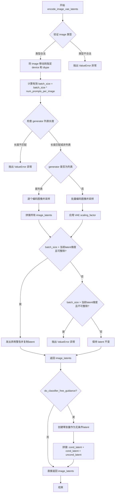

#### 带注释源码

```python
def encode_image_vae_latents(
    self,
    image,
    batch_size,
    num_prompts_per_image,
    dtype,
    device,
    do_classifier_free_guidance,
    generator=None,
):
    """
    Encode image to VAE latent space.
    
    Args:
        image: Input image tensor, PIL Image, or list of images
        batch_size: Number of samples in a batch
        num_prompts_per_image: Number of prompts to generate per image
        dtype: Target dtype for the latent tensor
        device: Target device for computation
        do_classifier_free_guidance: Whether to enable classifier-free guidance
        generator: Optional random generator for reproducibility
    
    Returns:
        Encoded image latents from VAE
    """
    # 参数类型检查：确保image是支持的类型之一
    if not isinstance(image, (torch.Tensor, PIL.Image.Image, list)):
        raise ValueError(
            f"`image` has to be of type `torch.Tensor`, `PIL.Image.Image` or list but is {type(image)}"
        )

    # 将图像数据传输到目标设备和数据类型
    image = image.to(device=device, dtype=dtype)

    # 计算有效批处理大小：基础batch_size * 每个图像的提示数
    batch_size = batch_size * num_prompts_per_image
    
    # 验证生成器列表长度与批处理大小是否匹配
    if isinstance(generator, list) and len(generator) != batch_size:
        raise ValueError(
            f"You have passed a list of generators of length {len(generator)}, but requested an effective batch"
            f" size of {batch_size}. Make sure the batch size matches the length of the generators."
        )

    # 根据是否有多个生成器选择不同的编码策略
    if isinstance(generator, list):
        # 逐个处理图像：为每个图像独立编码和采样
        image_latents = [
            # 从VAE的latent分布中采样，并应用scaling_factor
            self.vae.encode(image[i : i + 1]).latent_dist.sample(generator=generator[i])
            * self.vae.config.scaling_factor
            for i in range(batch_size)
        ]
        # 沿batch维度拼接所有latent
        image_latents = torch.cat(image_latents, dim=0)
    else:
        # 批量处理：一次性编码整个图像批次
        image_latents = self.vae.encode(image).latent_dist.sample(generator=generator)
        # 使用VAE的scaling_factor对latent进行缩放（这是VAE期望的标准化操作）
        image_latents = image_latents * self.vae.config.scaling_factor

    # 处理batch_size与实际latent维度不匹配的情况（图像复制逻辑）
    if batch_size > image_latents.shape[0] and batch_size % image_latents.shape[0] == 0:
        # 当请求的batch_size大于实际latent维度且可以整除时，复制latent
        deprecation_message = (
            f"You have passed {batch_size} text prompts (`prompt`), but only {image_latents.shape[0]} initial"
            " images (`image`). Initial images are now duplicating to match the number of text prompts. Note"
            " that this behavior is deprecated and will be removed in a version 1.0.0. Please make sure to update"
            " your script to pass as many initial images as text prompts to suppress this warning."
        )
        deprecate("len(prompt) != len(image)", "1.0.0", deprecation_message, standard_warn=False)
        # 计算需要复制多少次
        additional_image_per_prompt = batch_size // image_latents.shape[0]
        image_latents = torch.cat([image_latents] * additional_image_per_prompt, dim=0)
    elif batch_size > image_latents.shape[0] and batch_size % image_latents.shape[0] != 0:
        # 当不可整除时抛出错误（无法均匀复制）
        raise ValueError(
            f"Cannot duplicate `image` of batch size {image_latents.shape[0]} to {batch_size} text prompts."
        )
    else:
        # 正常情况：确保latent是张量格式
        image_latents = torch.cat([image_latents], dim=0)

    # 分类器自由引导（CFG）处理
    if do_classifier_free_guidance:
        # 创建与image_latents形状相同的零张量作为无条件latent
        uncond_image_latents = torch.zeros_like(image_latents)
        # 拼接顺序：[条件latent, 条件latent, 无条件latent]
        # 这种排列顺序是为了与后续的guidance计算保持一致
        image_latents = torch.cat([image_latents, image_latents, uncond_image_latents], dim=0)

    return image_latents
```


### `UniDiffuserPipeline.encode_image_clip_latents`

该方法用于将输入图像编码为 CLIP 图像嵌入（latents）。它首先对图像进行预处理，然后使用 CLIP 图像编码器（image_encoder）生成图像嵌入，并根据批次大小和每个图像的提示数进行相应的处理。

参数：

- `image`：`torch.Tensor | PIL.Image.Image | list`，要编码的输入图像，支持 PyTorch 张量、PIL 图像或图像列表
- `batch_size`：`int`，基础批次大小
- `num_prompts_per_image`：`int`，每个图像生成的文本提示数量
- `dtype`：`torch.dtype`，输出张量的数据类型
- `device`：`torch.device`，输出张量所在的设备
- `generator`：`torch.Generator | list[torch.Generator] | None`，可选的随机数生成器，用于生成确定性输出

返回值：`torch.Tensor`，CLIP 图像嵌入张量，形状为 `(batch_size * num_prompts_per_image, 1, clip_img_dim)`

#### 流程图

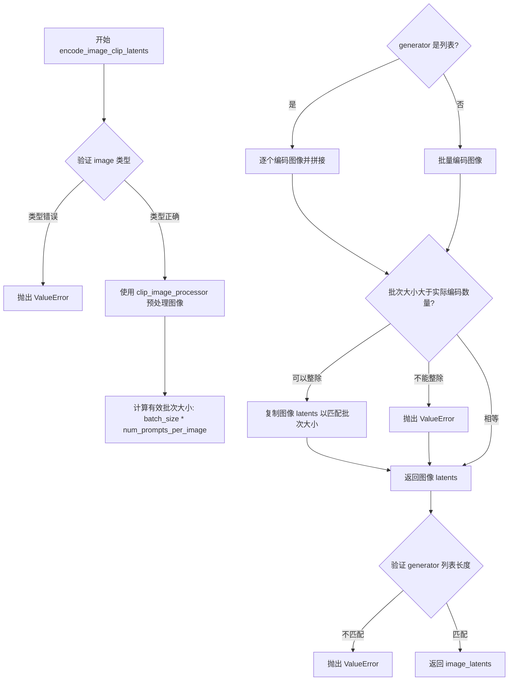

#### 带注释源码

```python
def encode_image_clip_latents(
    self,
    image,
    batch_size,
    num_prompts_per_image,
    dtype,
    device,
    generator=None,
):
    # Map image to CLIP embedding.
    # 验证输入图像类型是否合法
    if not isinstance(image, (torch.Tensor, PIL.Image.Image, list)):
        raise ValueError(
            f"`image` has to be of type `torch.Tensor`, `PIL.Image.Image` or list but is {type(image)}"
        )

    # 使用 CLIP 图像处理器预处理图像，转换为 PyTorch 张量
    preprocessed_image = self.clip_image_processor.preprocess(
        image,
        return_tensors="pt",
    )
    # 将预处理后的图像移动到指定设备和数据类型
    preprocessed_image = preprocessed_image.to(device=device, dtype=dtype)

    # 计算有效批次大小（基础批次 × 每图像提示数）
    batch_size = batch_size * num_prompts_per_image
    
    # 根据 generator 类型决定编码方式
    if isinstance(generator, list):
        # 如果提供了生成器列表，逐个编码图像并拼接结果
        image_latents = [
            self.image_encoder(**preprocessed_image[i : i + 1]).image_embeds for i in range(batch_size)
        ]
        image_latents = torch.cat(image_latents, dim=0)
    else:
        # 批量编码所有图像
        image_latents = self.image_encoder(**preprocessed_image).image_embeds

    # 处理批次大小扩展情况
    if batch_size > image_latents.shape[0] and batch_size % image_latents.shape[0] == 0:
        # 当请求的批次大小大于实际编码的图像数量时，复制图像 latents
        deprecation_message = (
            f"You have passed {batch_size} text prompts (`prompt`), but only {image_latents.shape[0]} initial"
            " images (`image`). Initial images are now duplicating to match the number of text prompts. Note"
            " that this behavior is deprecated and will be removed in a version 1.0.0. Please make sure to update"
            " your script to pass as many initial images as text prompts to suppress this warning."
        )
        deprecate("len(prompt) != len(image)", "1.0.0", deprecation_message, standard_warn=False)
        additional_image_per_prompt = batch_size // image_latents.shape[0]
        image_latents = torch.cat([image_latents] * additional_image_per_prompt, dim=0)
    elif batch_size > image_latents.shape[0] and batch_size % image_latents.shape[0] != 0:
        # 无法整除时抛出错误
        raise ValueError(
            f"Cannot duplicate `image` of batch size {image_latents.shape[0]} to {batch_size} text prompts."
        )
    else:
        # 正常情况下确保返回的是拼接后的张量
        image_latents = torch.cat([image_latents], dim=0)

    # 验证 generator 列表长度与批次大小是否匹配
    if isinstance(generator, list) and len(generator) != batch_size:
        raise ValueError(
            f"You have passed a list of generators of length {len(generator)}, but requested an effective batch"
            f" size of {batch_size}. Make sure the batch size matches the length of the generators."
        )

    # 返回 CLIP 图像嵌入
    return image_latents
```


### `UniDiffuserPipeline.prepare_text_latents`

该方法用于准备CLIP嵌入提示词的潜在向量（latents），支持随机生成或基于已有潜在向量进行扩展，并依据调度器的初始噪声标准差进行缩放。

参数：

- `self`：`UniDiffuserPipeline`，管道实例自身
- `batch_size`：`int`，批量大小，决定生成的核心样本数量
- `num_images_per_prompt`：`int`，每个提示词生成的图像数量，用于扩展批量维度
- `seq_len`：`int`，文本序列长度，决定潜在向量的时间步维度
- `hidden_size`：`int`，隐藏层维度，决定潜在向量的特征维度
- `dtype`：`torch.dtype`，目标数据类型（如torch.float32）
- `device`：`torch.device`，目标设备（CPU或CUDA）
- `generator`：`torch.Generator | list[torch.Generator] | None`，随机数生成器，用于确保可重复性
- `latents`：`torch.Tensor | None`，可选的预生成潜在向量，若提供则基于其扩展，否则随机生成

返回值：`torch.Tensor`，处理后的文本潜在向量，形状为`(batch_size * num_images_per_prompt, seq_len, hidden_size)`

#### 流程图

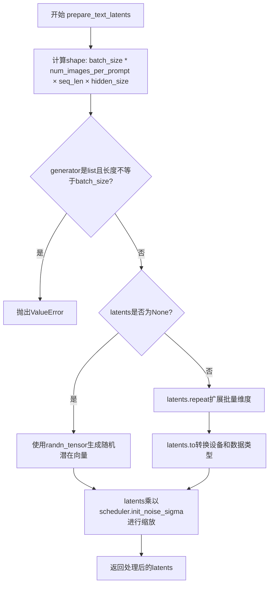

#### 带注释源码

```python
def prepare_text_latents(
    self, batch_size, num_images_per_prompt, seq_len, hidden_size, dtype, device, generator, latents=None
):
    # Prepare latents for the CLIP embedded prompt.
    # 计算潜在向量的目标形状：(批量大小 × 每提示词图像数, 序列长度, 隐藏维度)
    shape = (batch_size * num_images_per_prompt, seq_len, hidden_size)
    
    # 校验生成器列表长度是否与批量大小匹配
    if isinstance(generator, list) and len(generator) != batch_size:
        raise ValueError(
            f"You have passed a list of generators of length {len(generator)}, but requested an effective batch"
            f" size of {batch_size}. Make sure the batch size matches the length of the generators."
        )

    if latents is None:
        # 未提供潜在向量时，使用随机张量生成初始噪声
        # generator确保可重复性，device和dtype指定张量属性
        latents = randn_tensor(shape, generator=generator, device=device, dtype=dtype)
    else:
        # latents is assumed to have shace (B, L, D)
        # 已提供潜在向量时，按num_images_per_prompt扩展批量维度
        latents = latents.repeat(num_images_per_prompt, 1, 1)
        # 转换到指定设备和数据类型
        latents = latents.to(device=device, dtype=dtype)

    # scale the initial noise by the standard deviation required by the scheduler
    # 根据调度器的初始噪声标准差缩放潜在向量，这是扩散模型的标准处理流程
    latents = latents * self.scheduler.init_noise_sigma
    return latents
```


### UniDiffuserPipeline.prepare_image_vae_latents

该方法用于为图像生成准备VAE（变分自编码器）潜向量（latents）。它根据批次大小、图像尺寸等参数生成或处理随机噪声张量，并按照调度器的初始噪声标准差进行缩放，以用于扩散模型的去噪过程。

参数：

- `batch_size`：`int`，基础批次大小，表示输入的图像或提示数量
- `num_prompts_per_image`：`int`，每个图像生成的提示数量，用于扩增批次
- `num_channels_latents`：`int`，潜向量的通道数，对应VAE的潜在空间维度
- `height`：`int`，生成图像的高度（像素单位）
- `width`：`int`，生成图像的宽度（像素单位）
- `dtype`：`torch.dtype`，生成潜向量使用的数据类型（如float32、float16等）
- `device`：`torch.device`，生成潜向量所在的设备（CPU或CUDA）
- `generator`：`torch.Generator` 或 `list[torch.Generator]` 或 `None`，用于生成确定性随机数的PyTorch生成器
- `latents`：`torch.Tensor` 或 `None`，可选的预生成潜向量，如果提供则直接使用，否则生成新的随机潜向量

返回值：`torch.Tensor`，处理后的图像VAE潜向量张量，形状为 (batch_size * num_prompts_per_image, num_channels_latents, height // vae_scale_factor, width // vae_scale_factor)

#### 流程图

```mermaid
flowchart TD
    A[开始 prepare_image_vae_latents] --> B[计算潜向量形状 shape]
    B --> C{generator 是列表且长度 != batch_size?}
    C -->|是| D[抛出 ValueError 异常]
    C -->|否| E{latents 为 None?}
    E -->|是| F[使用 randn_tensor 生成随机潜向量]
    E -->|否| G[重复 latents num_prompts_per_image 次]
    G --> H[将 latents 移动到指定 device 和 dtype]
    F --> I[使用 scheduler.init_noise_sigma 缩放潜向量]
    I --> J[返回处理后的 latents]
    
    D --> K[异常处理: 批次大小不匹配]
    K --> J
```

#### 带注释源码

```python
def prepare_image_vae_latents(
    self,
    batch_size,
    num_prompts_per_image,
    num_channels_latents,
    height,
    width,
    dtype,
    device,
    generator,
    latents=None,
):
    # 计算潜向量张量的形状
    # 批次维度 = batch_size * num_prompts_per_image
    # 通道维度 = num_channels_latents
    # 空间维度 = height/width 除以 VAE 缩放因子（下采样因子）
    shape = (
        batch_size * num_prompts_per_image,
        num_channels_latents,
        height // self.vae_scale_factor,
        width // self.vae_scale_factor,
    )
    
    # 验证 generator 列表长度与批次大小是否匹配
    if isinstance(generator, list) and len(generator) != batch_size:
        raise ValueError(
            f"You have passed a list of generators of length {len(generator)}, but requested an effective batch"
            f" size of {batch_size}. Make sure the batch size matches the length of the generators."
        )

    # 如果未提供预生成的 latents，则从头生成随机噪声张量
    if latents is None:
        # 使用 randn_tensor 生成符合标准正态分布的随机张量
        latents = randn_tensor(shape, generator=generator, device=device, dtype=dtype)
    else:
        # 已有 latents 时，假设形状为 (B, C, H, W)
        # 按 num_prompts_per_image 沿批次维度重复，以匹配目标批次大小
        latents = latents.repeat(num_prompts_per_image, 1, 1, 1)
        # 将张量移动到指定设备和转换数据类型
        latents = latents.to(device=device, dtype=dtype)

    # 使用调度器的初始噪声标准差缩放潜向量
    # 这确保了初始噪声水平与调度器的去噪计划相匹配
    latents = latents * self.scheduler.init_noise_sigma
    return latents
```


### UniDiffuserPipeline.prepare_image_clip_latents

该方法用于准备CLIP图像嵌入的潜在向量（latents），根据批大小、每图像提示数和CLIP图像维度构建张量形状，并使用随机张量或重复扩展已有潜在向量，最后根据调度器的初始噪声标准差进行缩放。

参数：

- `batch_size`：`int`，批大小，决定生成的数量
- `num_prompts_per_image`：`int`，每个图像生成的提示词数量
- `clip_img_dim`：`int`，CLIP图像嵌入的维度
- `dtype`：`torch.dtype`，潜在向量的数据类型
- `device`：`torch.device`，计算设备
- `generator`：`torch.Generator` 或 `list[torch.Generator]`，可选，用于确保生成可重现的随机数生成器
- `latents`：`torch.Tensor` 或 `None`，可选，预生成的潜在向量

返回值：`torch.Tensor`，准备好的CLIP图像潜在向量

#### 流程图

```mermaid
flowchart TD
    A[开始] --> B{检查generator列表长度}
    B -->|长度不匹配| C[抛出ValueError]
    B -->|长度匹配| D{latents是否为None}
    D -->|是| E[使用randn_tensor生成随机张量]
    D -->|否| F[重复latents num_prompts_per_image次]
    F --> G[将latents移到指定设备和数据类型]
    E --> H[使用scheduler.init_noise_sigma缩放latents]
    G --> H
    H --> I[返回处理后的latents]
```

#### 带注释源码

```python
def prepare_image_clip_latents(
    self, batch_size, num_prompts_per_image, clip_img_dim, dtype, device, generator, latents=None
):
    """
    准备CLIP图像嵌入的潜在向量。
    
    参数:
        batch_size: 批大小
        num_prompts_per_image: 每个图像的提示词数量
        clip_img_dim: CLIP图像嵌入维度
        dtype: 数据类型
        device: 计算设备
        generator: 随机数生成器
        latents: 预提供的潜在向量（可选）
    """
    # 计算目标形状：(批大小 * 每图像提示数, 1, CLIP图像维度)
    shape = (batch_size * num_prompts_per_image, 1, clip_img_dim)
    
    # 验证生成器列表长度与批大小是否匹配
    if isinstance(generator, list) and len(generator) != batch_size:
        raise ValueError(
            f"You have passed a list of generators of length {len(generator)}, but requested an effective batch"
            f" size of {batch_size}. Make sure the batch size matches the length of the generators."
        )

    # 如果未提供latents，则使用randn_tensor生成随机潜在向量
    if latents is None:
        latents = randn_tensor(shape, generator=generator, device=device, dtype=dtype)
    else:
        # 假设latents形状为 (B, L, D)，按num_prompts_per_image重复扩展
        latents = latents.repeat(num_prompts_per_image, 1, 1)
        # 将latents移到指定设备和数据类型
        latents = latents.to(device=device, dtype=dtype)

    # 根据调度器的初始噪声标准差缩放初始噪声
    latents = latents * self.scheduler.init_noise_sigma
    return latents
```


### `UniDiffuserPipeline.decode_text_latents`

该方法将文本潜在表示（text latents）解码为实际的文本字符串。它首先调用文本解码器（text_decoder）根据文本潜在表示生成token序列，然后使用文本分词器（text_tokenizer）将token序列解码为可读的自然语言文本。

参数：

- `text_latents`：`torch.Tensor`，文本潜在表示张量，包含了需要解码的文本特征信息
- `device`：`torch.device`，指定运行设备，用于将计算放到正确的设备上（如CPU或GPU）

返回值：`list[str]`，生成的文本字符串列表，每个元素对应一个样本的解码结果

#### 流程图

```mermaid
flowchart TD
    A[开始 decode_text_latents] --> B[调用 text_decoder.generate_captions]
    B --> C[输入: text_latents, eos_token_id, device]
    C --> D[输出: output_token_list, seq_lengths]
    D --> E[将 output_token_list 转移到 CPU 并转为 NumPy]
    E --> F[遍历 token 列表和序列长度]
    F --> G[调用 text_tokenizer.decode 解码每个 token 序列]
    G --> H[skip_special_tokens=True 跳过特殊 token]
    H --> I[生成 generated_text 列表]
    I --> J[返回 generated_text]
```

#### 带注释源码

```python
def decode_text_latents(self, text_latents, device):
    """
    将文本潜在表示解码为文本字符串。
    
    参数:
        text_latents: 文本潜在表示张量
        device: 运行设备
    返回:
        生成的文本列表
    """
    # Step 1: 使用文本解码器根据文本潜在表示生成token序列
    # generate_captions 方法返回生成的token和对应的序列长度
    output_token_list, seq_lengths = self.text_decoder.generate_captions(
        text_latents,              # 输入的文本潜在表示
        self.text_tokenizer.eos_token_id,  # 序列结束标记
        device=device              # 指定设备
    )
    
    # Step 2: 将生成的token张量从GPU转移到CPU，并转换为NumPy数组
    # 这是为了后续使用tokenizer进行解码
    output_list = output_token_list.cpu().numpy()
    
    # Step 3: 遍历每个生成的序列，使用tokenizer解码为文本
    # 根据 seq_lengths 确定每个序列的有效长度，避免解码-padding部分
    generated_text = [
        self.text_tokenizer.decode(
            output[: int(length)],    # 只取有效长度的token
            skip_special_tokens=True  # 跳过特殊token（如padding、EOS等）
        )
        for output, length in zip(output_list, seq_lengths)  # 配对处理每个样本
    ]
    
    # Step 4: 返回解码后的文本列表
    return generated_text
```


### UniDiffuserPipeline._split

将形状为 (B, C * H * W + clip_img_dim) 的扁平化嵌入 x 拆分为两个形状分别为 (B, C, H, W) 和 (B, 1, clip_img_dim) 的张量，用于分离 VAE 图像潜在表示和 CLIP 图像潜在表示。

参数：

- `self`：隐式参数，UniDiffuserPipeline 实例
- `x`：`torch.Tensor`，输入的扁平化嵌入，形状为 (B, C * H * W + clip_img_dim)，其中 B 是批量大小，C 是通道数，H 和 W 是高度与宽度，clip_img_dim 是 CLIP 图像投影维度
- `height`：`int`，原始图像的高度（像素单位）
- `width`：`int`，原始图像的宽度（像素单位）

返回值：`tuple[torch.Tensor, torch.Tensor]`，返回两个张量的元组：
  - `img_vae`：形状为 (B, C, H, W) 的 VAE 图像潜在表示
  - `img_clip`：形状为 (B, 1, clip_img_dim) 的 CLIP 图像潜在表示

#### 流程图

```mermaid
flowchart TD
    A[开始: 输入 x, height, width] --> B[获取批量大小 batch_size = x.shape[0]]
    B --> C[计算潜在空间高度 latent_height = height // self.vae_scale_factor]
    C --> D[计算潜在空间宽度 latent_width = width // self.vae_scale_factor]
    D --> E[计算 VAE 图像维度 img_vae_dim = num_channels_latents * latent_height * latent_width]
    E --> F[使用 split 将 x 拆分为 img_vae 和 img_clip 两部分]
    F --> G[重塑 img_vae 为 (batch_size, num_channels_latents, latent_height, latent_width)]
    G --> H[重塑 img_clip 为 (batch_size, 1, image_encoder_projection_dim)]
    H --> I[返回元组 (img_vae, img_clip)]
```

#### 带注释源码

```python
def _split(self, x, height, width):
    r"""
    Splits a flattened embedding x of shape (B, C * H * W + clip_img_dim) into two tensors of shape (B, C, H, W)
    and (B, 1, clip_img_dim)
    """
    # 获取输入张量的批量大小
    batch_size = x.shape[0]
    
    # 根据 VAE 缩放因子将像素空间高度转换为潜在空间高度
    latent_height = height // self.vae_scale_factor
    # 根据 VAE 缩放因子将像素空间宽度转换为潜在空间宽度
    latent_width = width // self.vae_scale_factor
    
    # 计算 VAE 图像潜在表示的总维度：通道数 × 潜在高度 × 潜在宽度
    img_vae_dim = self.num_channels_latents * latent_height * latent_width

    # 使用 split 方法沿维度 1（特征维度）将扁平化嵌入 x 拆分为两部分
    # 第一部分：VAE 图像潜在表示，维度为 img_vae_dim
    # 第二部分：CLIP 图像潜在表示，维度为 image_encoder_projection_dim
    img_vae, img_clip = x.split([img_vae_dim, self.image_encoder_projection_dim], dim=1)

    # 将 VAE 潜在表示重塑为 4D 张量 (B, C, H, W)
    # 其中 C = num_channels_latents, H = latent_height, W = latent_width
    img_vae = torch.reshape(img_vae, (batch_size, self.num_channels_latents, latent_height, latent_width))
    
    # 将 CLIP 潜在表示重塑为 3D 张量 (B, 1, clip_img_dim)
    img_clip = torch.reshape(img_clip, (batch_size, 1, self.image_encoder_projection_dim))
    
    # 返回分离后的 VAE 图像潜在表示和 CLIP 图像潜在表示
    return img_vae, img_clip
```


### `UniDiffuserPipeline._combine`

该方法用于将VAE编码的潜在图像表示与CLIP编码的图像嵌入表示合并成一个统一的联合潜在向量，以便于后续在U-Net中进行处理。

参数：

- `self`：`UniDiffuserPipeline` 类实例，隐式参数
- `img_vae`：`torch.Tensor`，形状为 (B, C, H, W) 的VAE潜在图像张量，其中B为批次大小，C为通道数，H和W为潜在空间的高度和宽度
- `img_clip`：`torch.Tensor`，形状为 (B, 1, clip_img_dim) 的CLIP编码图像嵌入张量，其中 clip_img_dim 为CLIP投影维度

返回值：`torch.Tensor`，形状为 (B, C * H * W + clip_img_dim) 的组合潜在向量，将VAE潜在表示和CLIP嵌入沿最后一个维度拼接

#### 流程图

```mermaid
flowchart TD
    A[输入: img_vae (B, C, H, W)] --> B[Reshape img_vae to (B, -1)]
    C[输入: img_clip (B, 1, clip_img_dim)] --> D[Reshape img_clip to (B, -1)]
    B --> E[Concat along dim=-1]
    D --> E
    E --> F[输出: Combined tensor (B, C*H*W + clip_img_dim)]
```

#### 带注释源码

```python
def _combine(self, img_vae, img_clip):
    r"""
    将形状为 (B, C, H, W) 的潜在图像 img_vae 和形状为 (B, 1, clip_img_dim) 的 CLIP 嵌入图像 img_clip
    合并为形状为 (B, C * H * W + clip_img_dim) 的单个张量。
    
    这两种表示在送入 U-Net 进行去噪之前需要被连接起来：
    - img_vae: VAE 的潜在空间表示，包含图像的像素空间潜在信息
    - img_clip: CLIP 视觉编码器的输出，包含语义级别的图像特征
    """
    # 将 4D 张量 (B, C, H, W) 重塑为 2D 张量 (B, C*H*W)
    # -1 表示自动计算该维度的大小
    img_vae = torch.reshape(img_vae, (img_vae.shape[0], -1))
    
    # 将 3D 张量 (B, 1, clip_img_dim) 重塑为 2D 张量 (B, clip_img_dim)
    img_clip = torch.reshape(img_clip, (img_clip.shape[0], -1))
    
    # 沿最后一个维度（特征维度）拼接两个张量
    # 结果形状: (B, C*H*W + clip_img_dim)
    return torch.concat([img_vae, img_clip], dim=-1)
```


### UniDiffuserPipeline._split_joint

该方法用于在联合（joint）图像-文本生成模式下，将一个扁平化的联合嵌入向量分割成三个独立的组件：VAE图像潜在表示、CLIP图像嵌入和文本嵌入。

参数：

- `self`：`UniDiffuserPipeline` 类实例，隐式参数
- `x`：`torch.Tensor`，形状为 (B, C * H * W + clip_img_dim + text_seq_len * text_dim) 的扁平化嵌入向量，其中 B 是批量大小，C 是通道数，H 和 W 是高度和宽度
- `height`：`int`，输出图像的高度（像素单位）
- `width`：`int`，输出图像的宽度（像素单位）

返回值：`tuple[torch.Tensor, torch.Tensor, torch.Tensor]`，包含三个张量的元组：
- `img_vae`：形状为 (B, C, H, W) 的 VAE 图像潜在表示
- `img_clip`：形状为 (B, 1, clip_img_dim) 的 CLIP 图像嵌入
- `text`：形状为 (B, text_seq_len, text_dim) 的文本嵌入

#### 流程图

```mermaid
flowchart TD
    A[输入: 扁平化嵌入 x 和 尺寸信息] --> B[计算 latent_height = height // vae_scale_factor]
    B --> C[计算 latent_width = width // vae_scale_factor]
    C --> D[计算 img_vae_dim = num_channels_latents * latent_height * latent_width]
    D --> E[计算 text_dim = text_encoder_seq_len * text_intermediate_dim]
    E --> F[使用 split 按维度分割 x]
    F --> G[img_vae: 分割得到 VAE 部分]
    G --> H[img_clip: 分割得到 CLIP 图像部分]
    H --> I[text: 分割得到文本部分]
    I --> J[reshape img_vae 为 B×C×H×W]
    J --> K[reshape img_clip 为 B×1×clip_img_dim]
    K --> L[reshape text 为 B×text_seq_len×text_intermediate_dim]
    L --> M[返回元组 img_vae, img_clip, text]
```

#### 带注释源码

```python
def _split_joint(self, x, height, width):
    r"""
    Splits a flattened embedding x of shape (B, C * H * W + clip_img_dim + text_seq_len * text_dim] into (img_vae,
    img_clip, text) where img_vae is of shape (B, C, H, W), img_clip is of shape (B, 1, clip_img_dim), and text is
    of shape (B, text_seq_len, text_dim).
    """
    # 获取批量大小
    batch_size = x.shape[0]
    
    # 计算潜在空间的高度和宽度（考虑 VAE 缩放因子）
    latent_height = height // self.vae_scale_factor
    latent_width = width // self.vae_scale_factor
    
    # 计算 VAE 图像潜在表示的总维度数
    img_vae_dim = self.num_channels_latents * latent_height * latent_width
    
    # 计算文本嵌入的总维度数
    text_dim = self.text_encoder_seq_len * self.text_intermediate_dim

    # 使用 split 将扁平化嵌入按预设维度分割成三部分
    img_vae, img_clip, text = x.split([img_vae_dim, self.image_encoder_projection_dim, text_dim], dim=1)

    # 将分割后的 VAE 部分 reshape 为 (B, C, H, W) 形式
    img_vae = torch.reshape(img_vae, (batch_size, self.num_channels_latents, latent_height, latent_width))
    
    # 将分割后的 CLIP 图像部分 reshape 为 (B, 1, clip_img_dim) 形式
    img_clip = torch.reshape(img_clip, (batch_size, 1, self.image_encoder_projection_dim))
    
    # 将分割后的文本部分 reshape 为 (B, text_seq_len, text_dim) 形式
    text = torch.reshape(text, (batch_size, self.text_encoder_seq_len, self.text_intermediate_dim))
    
    # 返回三个分离后的组件
    return img_vae, img_clip, text
```


### `UniDiffuserPipeline._combine_joint`

该方法用于将图像的VAE潜在表示、CLIP图像嵌入和文本嵌入三个模态的张量在批次维度上拼接成一个统一的联合潜在向量，是UniDiffuser双模态（图像-文本）生成Pipeline中实现跨模态特征融合的核心操作。

参数：

- `self`：类的实例引用，包含所需的配置属性（如`vae_scale_factor`、`num_channels_latents`、`text_encoder_seq_len`、`text_intermediate_dim`、`image_encoder_projection_dim`等）。
- `img_vae`：`torch.Tensor`，形状为 `(B, C, H, W)`，其中 B 是批次大小，C 是通道数，H 和 W 是潜在空间的高度和宽度。表示从VAE编码器得到的图像潜在表示。
- `img_clip`：`torch.Tensor`，形状为 `(B, L_img, clip_img_dim)`，其中 L_img 是图像序列长度（通常为1），clip_img_dim 是CLIP图像嵌入的维度。表示经过CLIP视觉编码器处理后的图像特征嵌入。
- `text`：`torch.Tensor`，形状为 `(B, L_text, text_dim)`，其中 L_text 是文本序列长度，text_dim 是文本中间嵌入维度。表示文本嵌入向量。

返回值：`torch.Tensor`，形状为 `(B, C * H * W + L_img * clip_img_dim + L_text * text_dim)`。返回一个拼接后的一维张量，其中包含了三个模态的展平特征，可作为U-Net（UniDiffuserModel）联合去噪的输入。

#### 流程图

```mermaid
graph TD
    A[输入: img_vae (B, C, H, W)] --> D1[torch.reshape 展平为 (B, -1)]
    B[输入: img_clip (B, L_img, clip_img_dim)] --> D2[torch.reshape 展平为 (B, -1)]
    C[输入: text (B, L_text, text_dim)] --> D3[torch.reshape 展平为 (B, -1)]
    D1 --> E[torch.concat 沿 dim=-1 拼接]
    D2 --> E
    D3 --> E
    E --> F[输出: 联合嵌入 (B, total_dim)]
```

#### 带注释源码

```python
def _combine_joint(self, img_vae, img_clip, text):
    r"""
    Combines a latent image img_vae of shape (B, C, H, W), a CLIP-embedded image img_clip of shape (B, L_img,
    clip_img_dim), and a text embedding text of shape (B, L_text, text_dim) into a single embedding x of shape (B,
    C * H * W + L_img * clip_img_dim + L_text * text_dim).
    
    该方法实现了UniDiffuser联合生成模式下的多模态嵌入融合。它将三个不同来源的特征张量（VAE图像潜在空间、CLIP视觉编码、文本嵌入）
    统一展平为批次维度不变、特征维度串联的向量，以满足U-ViT（UniDiffuserModel）联合去噪网络的输入格式要求。
    """
    # 将4D图像潜在表示 (B, C, H, W) 展平为2D张量 (B, C*H*W)
    # 使用 view 操作而非 clone()，因为后续不再需要原始形状的梯度
    img_vae = torch.reshape(img_vae, (img_vae.shape[0], -1))
    
    # 将3D CLIP图像嵌入 (B, L_img, clip_img_dim) 展平为2D张量 (B, L_img*clip_img_dim)
    img_clip = torch.reshape(img_clip, (img_clip.shape[0], -1))
    
    # 将3D文本嵌入 (B, L_text, text_dim) 展平为2D张量 (B, L_text*text_dim)
    text = torch.reshape(text, (text.shape[0], -1))
    
    # 沿最后一个维度（特征维度）拼接三个展平后的张量
    # 结果形状: (B, C*H*W + L_img*clip_img_dim + L_text*text_dim)
    return torch.concat([img_vae, img_clip, text], dim=-1)
```


### `UniDiffuserPipeline._get_noise_pred`

该方法根据指定的工作模式（joint、text2img、img2text、text、img）执行噪声预测。它调用UNet模型来预测噪声，并根据guidance_scale参数决定是否应用无分类器引导（Classifier-Free Guidance）。方法内部会根据mode对联合latent进行分割或组合处理，以适配不同模态的生成任务。

参数：

-  `mode`：`str`，生成模式，可选值为"joint"（联合图像文本生成）、"text2img"（文本条件图像生成）、"img2text"（图像条件文本生成）、"text"（无条件文本生成）、"img"（无条件图像生成）
-  `latents`：`torch.Tensor`，当前的潜在变量张量
-  `t`：`int`，当前的扩散时间步
-  `prompt_embeds`：`torch.Tensor`，文本编码器生成的文本嵌入
-  `img_vae`：`torch.Tensor`，图像的VAE潜在表示
-  `img_clip`：`torch.Tensor`，图像的CLIP潜在表示
-  `max_timestep`：`int`，最大时间步值，用于无分类器引导
-  `data_type`：`int`，数据类型标识符，用于模型输入
-  `guidance_scale`：`float`，引导比例，用于控制无分类器引导的强度
-  `generator`：`torch.Generator`，随机数生成器，用于生成确定性随机数
-  `device`：`torch.device`，计算设备
-  `height`：`int`，生成图像的高度
-  `width`：`int`，生成图像的宽度

返回值：`torch.Tensor`，预测的噪声张量，用于去噪过程

#### 流程图

```mermaid
flowchart TD
    A[开始 _get_noise_pred] --> B{mode == 'joint'?}
    B -->|Yes| C[分割联合latents为img_vae, img_clip, text]
    C --> D[调用UNet预测噪声]
    D --> E{guidance_scale <= 1.0?}
    E -->|Yes| F[直接返回x_out]
    E -->|No| G[生成随机噪声T]
    G --> H[调用UNet预测条件噪声]
    H --> I[计算无分类器引导结果]
    I --> J[返回引导后的噪声]
    
    B -->|No| K{mode == 'text2img'?}
    K -->|Yes| L[分割latents为img_vae, img_clip]
    L --> M[调用UNet with prompt_embeds]
    M --> N{guidance_scale <= 1.0?}
    N -->|Yes| O[返回img_out]
    N -->|No| P[生成随机text_T]
    P --> Q[调用UNet预测非条件噪声]
    Q --> R[计算text2img引导结果]
    R --> S[返回引导后的img_out]
    
    K -->|No| T{mode == 'img2text'?}
    T -->|Yes| U[直接调用UNet with img_vae, img_clip, latents]
    U --> V{guidance_scale <= 1.0?}
    V -->|Yes| W[返回text_out]
    V -->|No| X[生成随机img_vae_T, img_clip_T]
    X --> Y[调用UNet预测非条件噪声]
    Y --> Z[计算img2text引导结果]
    Z --> AA[返回引导后的text_out]
    
    T -->|No| AB{mode == 'text'?}
    AB -->|Yes| AC[调用UNet生成无条件text]
    AC --> AD[返回text_out]
    
    AB -->|No| AE{mode == 'img'?}
    AE -->|Yes| AF[分割latents为img_vae, img_clip]
    AF --> AG[调用UNet with prompt_embeds]
    AG --> AH[合并img_vae_out, img_clip_out]
    AH --> AI[返回img_out]
```

#### 带注释源码

```python
def _get_noise_pred(
    self,
    mode,                      # 生成模式: joint, text2img, img2text, text, img
    latents,                   # 当前噪声潜在表示
    t,                         # 当前扩散时间步
    prompt_embeds,             # 文本嵌入
    img_vae,                   # 图像VAE潜在表示
    img_clip,                  # 图像CLIP潜在表示
    max_timestep,              # 最大时间步（用于CFG）
    data_type,                 # 数据类型标识
    guidance_scale,            # 引导比例（CFG强度）
    generator,                 # 随机数生成器
    device,                    # 计算设备
    height,                    # 图像高度
    width,                     # 图像宽度
):
    r"""
    Gets the noise prediction using the `unet` and performs classifier-free guidance, if necessary.
    """
    # ===== 联合生成模式 (Joint text-image generation) =====
    if mode == "joint":
        # 将联合latent分割为VAE、CLIP和文本部分
        img_vae_latents, img_clip_latents, text_latents = self._split_joint(latents, height, width)

        # 使用UNet进行联合预测，图像和文本时间步相同
        img_vae_out, img_clip_out, text_out = self.unet(
            img_vae_latents, img_clip_latents, text_latents, 
            timestep_img=t, timestep_text=t, data_type=data_type
        )

        # 合并预测结果
        x_out = self._combine_joint(img_vae_out, img_clip_out, text_out)

        # 如果引导比例<=1，不应用CFG，直接返回
        if guidance_scale <= 1.0:
            return x_out

        # ===== 应用无分类器引导 (Classifier-Free Guidance) =====
        # 生成随机噪声用于非条件预测
        img_vae_T = randn_tensor(img_vae.shape, generator=generator, device=device, dtype=img_vae.dtype)
        img_clip_T = randn_tensor(img_clip.shape, generator=generator, device=device, dtype=img_clip.dtype)
        text_T = randn_tensor(prompt_embeds.shape, generator=generator, device=device, dtype=prompt_embeds.dtype)

        # 文本非条件 + 图像条件预测
        _, _, text_out_uncond = self.unet(
            img_vae_T, img_clip_T, text_latents, 
            timestep_img=max_timestep, timestep_text=t, data_type=data_type
        )

        # 文本条件 + 图像非条件预测
        img_vae_out_uncond, img_clip_out_uncond, _ = self.unet(
            img_vae_latents, img_clip_latents, text_T,
            timestep_img=t, timestep_text=max_timestep,
            data_type=data_type
        )

        # 合并非条件预测结果
        x_out_uncond = self._combine_joint(img_vae_out_uncond, img_clip_out_uncond, text_out_uncond)

        # 应用CFG公式: guided = scale * cond + (1 - scale) * uncond
        return guidance_scale * x_out + (1.0 - guidance_scale) * x_out_uncond
    
    # ===== 文本到图像模式 (Text-conditioned image generation) =====
    elif mode == "text2img":
        # 分割latents为VAE和CLIP部分
        img_vae_latents, img_clip_latents = self._split(latents, height, width)

        # 使用文本嵌入作为条件进行预测
        img_vae_out, img_clip_out, text_out = self.unet(
            img_vae_latents, img_clip_latents, prompt_embeds, 
            timestep_img=t, timestep_text=0, data_type=data_type
        )

        # 合并图像VAE和CLIP输出
        img_out = self._combine(img_vae_out, img_clip_out)

        if guidance_scale <= 1.0:
            return img_out

        # 生成随机文本噪声用于非条件生成
        text_T = randn_tensor(prompt_embeds.shape, generator=generator, device=device, dtype=prompt_embeds.dtype)

        # 非条件预测（文本部分使用随机噪声）
        img_vae_out_uncond, img_clip_out_uncond, text_out_uncond = self.unet(
            img_vae_latents, img_clip_latents, text_T,
            timestep_img=t, timestep_text=max_timestep,
            data_type=data_type
        )

        # 合并非条件图像输出
        img_out_uncond = self._combine(img_vae_out_uncond, img_clip_out_uncond)

        return guidance_scale * img_out + (1.0 - guidance_scale) * img_out_uncond
    
    # ===== 图像到文本模式 (Image-conditioned text generation) =====
    elif mode == "img2text":
        # 图像作为条件，latents作为文本目标
        img_vae_out, img_clip_out, text_out = self.unet(
            img_vae, img_clip, latents, 
            timestep_img=0, timestep_text=t, data_type=data_type
        )

        if guidance_scale <= 1.0:
            return text_out

        # 生成随机图像噪声用于非条件生成
        img_vae_T = randn_tensor(img_vae.shape, generator=generator, device=device, dtype=img_vae.dtype)
        img_clip_T = randn_tensor(img_clip.shape, generator=generator, device=device, dtype=img_clip.dtype)

        # 非条件预测（图像部分使用随机噪声）
        img_vae_out_uncond, img_clip_out_uncond, text_out_uncond = self.unet(
            img_vae_T, img_clip_T, latents, 
            timestep_img=max_timestep, timestep_text=t, data_type=data_type
        )

        return guidance_scale * text_out + (1.0 - guidance_scale) * text_out_uncond
    
    # ===== 无条件文本生成模式 (Marginal text generation, no CFG) =====
    elif mode == "text":
        # 无条件文本生成，不应用CFG
        img_vae_out, img_clip_out, text_out = self.unet(
            img_vae, img_clip, latents, 
            timestep_img=max_timestep, timestep_text=t, data_type=data_type
        )

        return text_out
    
    # ===== 无条件图像生成模式 (Marginal image generation, no CFG) =====
    elif mode == "img":
        # 分割latents
        img_vae_latents, img_clip_latents = self._split(latents, height, width)

        # 无条件图像生成，使用prompt_embeds作为额外条件
        img_vae_out, img_clip_out, text_out = self.unet(
            img_vae_latents, img_clip_latents, prompt_embeds,
            timestep_img=t, timestep_text=max_timestep,
            data_type=data_type
        )

        # 合并输出并返回
        img_out = self._combine(img_vae_out, img_clip_out)
        return img_out
```


### UniDiffuserPipeline.check_latents_shape

验证输入的 latents 张量形状是否符合预期，用于在管道执行前进行输入验证。

参数：

- `self`：UniDiffuserPipeline 实例本身
- `latents_name`：`str`，latents 的名称，用于错误信息中标识是哪个参数
- `latents`：`torch.Tensor`，需要检查形状的 latents 张量
- `expected_shape`：`tuple`，期望的形状（不包括 batch 维度），例如 `(channels, height, width)`

返回值：`None`，该方法不返回任何值，通过抛出 ValueError 来表示验证失败

#### 流程图

```mermaid
flowchart TD
    A[开始检查 latents 形状] --> B[获取 latents 实际形状]
    B --> C[计算期望维度数: len(expected_shape) + 1]
    C --> D{实际维度数是否等于期望维度数?}
    D -- 否 --> E[抛出 ValueError: 维度数不匹配]
    D -- 是 --> F{检查每个非batch维度}
    F --> G{当前维度是否匹配期望维度}
    G -- 否 --> H[抛出 ValueError: 具体维度不匹配]
    G -- 是 --> I[验证通过, 方法结束]
    E --> J[结束 - 抛出异常]
    H --> J
    I --> J
```

#### 带注释源码

```python
def check_latents_shape(self, latents_name, latents, expected_shape):
    """
    检查 latents 张量的形状是否符合预期。
    
    该方法验证输入的 latents 张量具有正确的维度数量和每个维度的大小。
    期望的形状不包括 batch 维度，方法会自动在前面添加一个 batch 维度进行验证。
    
    参数:
        latents_name: str - latents 的名称，用于错误信息中标识是哪个参数
        latents: torch.Tensor - 需要检查形状的 latents 张量
        expected_shape: tuple - 期望的形状（不包括 batch 维度）
    """
    # 获取 latents 的实际形状
    latents_shape = latents.shape
    
    # 计算期望的维度数量：expected_shape 的长度 + 1（batch 维度）
    expected_num_dims = len(expected_shape) + 1  # expected dimensions plus the batch dimension
    
    # 将期望形状转换为字符串，用于错误信息
    expected_shape_str = ", ".join(str(dim) for dim in expected_shape)
    
    # 首先检查维度数量是否正确
    if len(latents_shape) != expected_num_dims:
        raise ValueError(
            f"`{latents_name}` should have shape (batch_size, {expected_shape_str}), but the current shape"
            f" {latents_shape} has {len(latents_shape)} dimensions."
        )
    
    # 检查每个非batch维度的具体大小
    for i in range(1, expected_num_dims):
        if latents_shape[i] != expected_shape[i - 1]:
            raise ValueError(
                f"`{latents_name}` should have shape (batch_size, {expected_shape_str}), but the current shape"
                f" {latents_shape} has {latents_shape[i]} != {expected_shape[i - 1]} at dimension {i}."
            )
```


### `UniDiffuserPipeline.check_inputs`

该方法用于在执行生成过程之前验证输入参数的有效性，包括检查图像尺寸、可视化步骤、生成模式、提示词和潜在变量的形状等。

参数：

- `mode`：`str`，生成模式，支持 "text2img"（文本到图像）、"img2text"（图像到文本）、"joint"（联合生成）、"text"（纯文本生成）、"img"（纯图像生成）
- `prompt`：`str | list[str] | None`，文本提示词，用于指导图像生成
- `image`：`torch.Tensor | PIL.Image.Image | None`，输入图像，用于图像到文本生成模式
- `height`：`int`，生成图像的高度（像素）
- `width`：`int`，生成图像的宽度（像素）
- `callback_steps`：`int`，回调函数调用频率，必须为正整数
- `negative_prompt`：`str | list[str] | None`，负面提示词，用于指导不希望出现的内容
- `prompt_embeds`：`torch.Tensor | None`，预生成的文本嵌入向量
- `negative_prompt_embeds`：`torch.Tensor | None`，预生成的负面文本嵌入向量
- `latents`：`torch.Tensor | None`，完整的联合潜在变量（包含VAE、CLIP和文本 latent）
- `prompt_latents`：`torch.Tensor | None`，文本潜在变量
- `vae_latents`：`torch.Tensor | None`，VAE编码后的图像潜在变量
- `clip_latents`：`torch.Tensor | None`，CLIP编码后的图像潜在变量

返回值：`None`，该方法不返回任何值，仅通过抛出 `ValueError` 来表示验证失败

#### 流程图

```mermaid
flowchart TD
    A[开始 check_inputs] --> B{检查 height 和 width 是否可被 vae_scale_factor 整除}
    B -->|否| B1[抛出 ValueError]
    B -->|是| C{检查 callback_steps 是否为正整数}
    C -->|否| C1[抛出 ValueError]
    C -->|是| D{mode == 'text2img'}
    D -->|是| E{检查 prompt 和 prompt_embeds 不同时存在}
    D -->|否| F{mode == 'img2text'}
    E -->|冲突| E1[抛出 ValueError]
    E -->|正常| G{检查 prompt 和 prompt_embeds 至少有一个}
    G -->|都没有| G1[抛出 ValueError]
    G -->|有| H{检查 prompt 类型}
    H -->|类型错误| H1[抛出 ValueError]
    H -->|正常| I{检查 negative_prompt 和 negative_prompt_embeds}
    I -->|冲突| I1[抛出 ValueError]
    I -->|正常| J{检查 prompt_embeds 和 negative_prompt_embeds 形状一致性}
    J -->|不一致| J1[抛出 ValueError]
    J -->|一致| K[计算 latent 尺寸]
    F -->|是| L{检查 image 是否提供}
    F -->|否| K
    L -->|未提供| L1[抛出 ValueError]
    L -->|已提供| K
    K --> M{检查 full latents 形状}
    M -->|形状错误| M1[抛出 ValueError]
    M -->|正常| N{检查 prompt_latents 形状}
    N -->|形状错误| N1[抛出 ValueError]
    N -->|正常| O{检查 vae_latents 形状}
    O -->|形状错误| O1[抛出 ValueError]
    O -->|正常| P{检查 clip_latents 形状}
    P -->|形状错误| P1[抛出 ValueError]
    P -->|正常| Q{mode 为 text2img 或 img 且 vae_latents 和 clip_latents 同时存在}
    Q -->|是| R{检查 vae_latents 和 clip_latents 批次维度相等}
    Q -->|否| S{mode 为 joint 且三个 latent 都存在}
    R -->|不相等| R1[抛出 ValueError]
    R -->|相等| S
    S -->|是| T{检查三个 latent 批次维度相等}
    S -->|否| U[结束 - 验证通过]
    T -->|不相等| T1[抛出 ValueError]
    T -->|相等| U
```

#### 带注释源码

```python
def check_inputs(
    self,
    mode,
    prompt,
    image,
    height,
    width,
    callback_steps,
    negative_prompt=None,
    prompt_embeds=None,
    negative_prompt_embeds=None,
    latents=None,
    prompt_latents=None,
    vae_latents=None,
    clip_latents=None,
):
    """
    检查输入参数的有效性，在运行生成过程之前执行验证。
    """
    # 步骤1: 检查图像尺寸是否可以被 VAE 缩放因子整除
    if height % self.vae_scale_factor != 0 or width % self.vae_scale_factor != 0:
        raise ValueError(
            f"`height` and `width` have to be divisible by {self.vae_scale_factor} but are {height} and {width}."
        )

    # 步骤2: 检查 callback_steps 是否为正整数
    if (callback_steps is None) or (
        callback_steps is not None and (not isinstance(callback_steps, int) or callback_steps <= 0)
    ):
        raise ValueError(
            f"`callback_steps` has to be a positive integer but is {callback_steps} of type"
            f" {type(callback_steps)}."
        )

    # 步骤3: 针对 text2img 模式进行提示词验证
    if mode == "text2img":
        # 不能同时提供 prompt 和 prompt_embeds
        if prompt is not None and prompt_embeds is not None:
            raise ValueError(
                f"Cannot forward both `prompt`: {prompt} and `prompt_embeds`: {prompt_embeds}. Please make sure to"
                " only forward one of the two."
            )
        # prompt 和 prompt_embeds 至少提供一个
        elif prompt is None and prompt_embeds is None:
            raise ValueError(
                "Provide either `prompt` or `prompt_embeds`. Cannot leave both `prompt` and `prompt_embeds` undefined."
            )
        # prompt 类型检查
        elif prompt is not None and (not isinstance(prompt, str) and not isinstance(prompt, list)):
            raise ValueError(f"`prompt` has to be of type `str` or `list` but is {type(prompt)}")

        # 不能同时提供 negative_prompt 和 negative_prompt_embeds
        if negative_prompt is not None and negative_prompt_embeds is not None:
            raise ValueError(
                f"Cannot forward both `negative_prompt`: {negative_prompt} and `negative_prompt_embeds`:"
                f" {negative_prompt_embeds}. Please make sure to only forward one of the two."
            )

        # prompt_embeds 和 negative_prompt_embeds 形状必须一致
        if prompt_embeds is not None and negative_prompt_embeds is not None:
            if prompt_embeds.shape != negative_prompt_embeds.shape:
                raise ValueError(
                    "`prompt_embeds` and `negative_prompt_embeds` must have the same shape when passed directly, but"
                    f" got: `prompt_embeds` {prompt_embeds.shape} != `negative_prompt_embeds`"
                    f" {negative_prompt_embeds.shape}."
                )

    # 步骤4: 针对 img2text 模式检查图像输入
    if mode == "img2text":
        if image is None:
            raise ValueError("`img2text` mode requires an image to be provided.")

    # 步骤5: 计算潜在变量的空间维度
    latent_height = height // self.vae_scale_factor
    latent_width = width // self.vae_scale_factor
    
    # 检查哪些 latent 被提供
    full_latents_available = latents is not None
    prompt_latents_available = prompt_latents is not None
    vae_latents_available = vae_latents is not None
    clip_latents_available = clip_latents is not None

    # 步骤6: 检查完整的联合 latents 形状
    if full_latents_available:
        # 警告: 如果同时提供了 latents 和单独的 latent，将使用 latents 的值
        individual_latents_available = (
            prompt_latents is not None or vae_latents is not None or clip_latents is not None
        )
        if individual_latents_available:
            logger.warning(
                "You have supplied both `latents` and at least one of `prompt_latents`, `vae_latents`, and"
                " `clip_latents`. The value of `latents` will override the value of any individually supplied latents."
            )
        
        # 计算完整 latents 的期望维度: VAE + CLIP + 文本
        img_vae_dim = self.num_channels_latents * latent_height * latent_width
        text_dim = self.text_encoder_seq_len * self.text_encoder_hidden_size
        latents_dim = img_vae_dim + self.image_encoder_projection_dim + text_dim
        latents_expected_shape = (latents_dim,)
        self.check_latents_shape("latents", latents, latents_expected_shape)

    # 步骤7: 检查各个单独 latent 的形状
    if prompt_latents_available:
        prompt_latents_expected_shape = (self.text_encoder_seq_len, self.text_encoder_hidden_size)
        self.check_latents_shape("prompt_latents", prompt_latents, prompt_latents_expected_shape)

    if vae_latents_available:
        vae_latents_expected_shape = (self.num_channels_latents, latent_height, latent_width)
        self.check_latents_shape("vae_latents", vae_latents, vae_latents_expected_shape)

    if clip_latents_available:
        clip_latents_expected_shape = (1, self.image_encoder_projection_dim)
        self.check_latents_shape("clip_latents", clip_latents, clip_latents_expected_shape)

    # 步骤8: 检查 VAE latents 和 CLIP latents 的批次维度一致性
    if mode in ["text2img", "img"] and vae_latents_available and clip_latents_available:
        if vae_latents.shape[0] != clip_latents.shape[0]:
            raise ValueError(
                f"Both `vae_latents` and `clip_latents` are supplied, but their batch dimensions are not equal:"
                f" {vae_latents.shape[0]} != {clip_latents.shape[0]}."
            )

    # 步骤9: 检查联合模式下三个 latent 的批次维度一致性
    if mode == "joint" and prompt_latents_available and vae_latents_available and clip_latents_available:
        if prompt_latents.shape[0] != vae_latents.shape[0] or prompt_latents.shape[0] != clip_latents.shape[0]:
            raise ValueError(
                f"All of `prompt_latents`, `vae_latents`, and `clip_latents` are supplied, but their batch"
                f" dimensions are not equal: {prompt_latents.shape[0]} != {vae_latents.shape[0]}"
                f" != {clip_latents.shape[0]}."
            )
```


### UniDiffuserPipeline.__call__

这是 UniDiffuserPipeline 的核心调用方法，实现了双模态图像-文本生成功能。该方法支持多种生成模式：文本到图像（text2img）、图像到文本（img2text）、联合生成（joint）以及无条件的文本（text）和图像（img）生成。方法通过推断输入参数来确定生成模式，编码提示词或准备潜在变量，执行去噪循环，最后通过 VAE 解码图像和通过文本解码器生成文本。

参数：

- `prompt`：`str | list[str] | None`，用于引导图像生成的文本提示。如果未定义，需要传递 `prompt_embeds`。在 text2img 模式下必填。
- `image`：`torch.Tensor | PIL.Image.Image | None`，表示图像批次或张量。在 img2text 模式下必填。
- `height`：`int | None`，生成图像的高度（像素），默认为 `self.unet.config.sample_size * self.vae_scale_factor`。
- `width`：`int | None`，生成图像的宽度（像素），默认为 `self.unet.config.sample_size * self.vae_scale_factor`。
- `data_type`：`int | None`，数据类型（0 或 1），仅在加载支持数据类型嵌入的检查点时使用，用于与 UniDiffuser-v1 检查点的兼容性。
- `num_inference_steps`：`int`，去噪步骤数，默认值为 50。更多去噪步骤通常会导致更高质量的图像，但推理速度较慢。
- `guidance_scale`：`float`，引导比例，默认值为 8.0。较高的引导比例值鼓励模型生成与文本提示更紧密相关的图像，但会牺牲图像质量。
- `negative_prompt`：`str | list[str] | None`，用于引导图像生成中不包括的内容的提示。如果未定义，需要传递 `negative_prompt_embeds`。
- `num_images_per_prompt`：`int | None`，每个提示生成的图像数量，默认值为 1。用于 text2img 和 img 模式。
- `num_prompts_per_image`：`int | None`，每个图像生成的提示数量，默认值为 1。用于 img2text 和 text 模式。
- `eta`：`float`，对应 DDIM 论文中的参数 eta (η)，默认值为 0.0。仅适用于 DDIMScheduler。
- `generator`：`torch.Generator | list[torch.Generator] | None`，用于使生成确定性的随机数生成器。
- `latents`：`torch.Tensor | None`，预生成的噪声潜在变量，用于联合图像-文本生成。如果提供，会覆盖 `prompt_latents`、`vae_latents` 和 `clip_latents`。
- `prompt_latents`：`torch.Tensor | None`，用于文本生成的预生成噪声潜在变量。
- `vae_latents`：`torch.Tensor | None`，用于图像生成的 VAE 预生成噪声潜在变量。
- `clip_latents`：`torch.Tensor | None`，用于图像生成的 CLIP 预生成噪声潜在变量。
- `prompt_embeds`：`torch.Tensor | None`，预生成的文本嵌入，用于轻松调整文本输入。
- `negative_prompt_embeds`：`torch.Tensor | None`，预生成的负面文本嵌入。
- `output_type`：`str | None`，生成图像的输出格式，默认为 "pil"，可选 "np.array"。
- `return_dict`：`bool`，是否返回 `ImageTextPipelineOutput`，默认值为 True。
- `callback`：`Callable | None`，每 `callback_steps` 步调用的回调函数。
- `callback_steps`：`int | None`，回调函数被调用的频率，默认值为 1。

返回值：`ImageTextPipelineOutput | tuple`，如果 `return_dict` 为 True，返回 `ImageTextPipelineOutput`，否则返回包含生成图像和生成文本的元组。

#### 流程图

```mermaid
flowchart TD
    A[开始 __call__] --> B[设置默认 height 和 width]
    B --> C[推断生成模式 mode]
    C --> D[检查输入有效性 check_inputs]
    D --> E[推断批次大小和倍数 _infer_batch_size]
    E --> F{latents 是否提供?}
    F -->|是| G[拆分 joint latents]
    F -->|否| H{mode == text2img?}
    G --> H
    H -->|是| I[编码文本提示 encode_prompt]
    H -->|否| J[准备文本潜在变量 prepare_text_latents]
    I --> K{reduce_text_emb_dim?}
    J --> K
    K -->|是| L[编码文本到低维 encode]
    K -->|否| M{mode == img2text?}
    L --> M
    M -->|是| N[预处理图像]
    M -->|否| O[准备图像 VAE latents]
    N --> P[编码图像到 VAE latents]
    P --> Q[编码图像到 CLIP latents]
    O --> R[准备图像 VAE latents]
    R --> S[准备图像 CLIP latents]
    Q --> T[设置时间步]
    S --> T
    T --> U[准备最终 latents]
    U --> V[准备额外步骤参数 prepare_extra_step_kwargs]
    V --> W[进入去噪循环]
    W --> X{预测噪声 _get_noise_pred]
    X --> Y[scheduler.step 计算上一步]
    Y --> Z{是否需要回调?}
    Z -->|是| AA[调用 callback]
    Z -->|否| AB{是否最后一步或预热步?}
    AA --> AB
    AB -->|是| AC[更新进度条]
    AB -->|否| AD{还有更多时间步?}
    AC --> AD
    AD -->|是| W
    AD -->|否| AE[后处理]
    AE --> AF{mode == joint?}
    AF -->|是| AG[拆分联合 latents]
    AF -->|否| AH{mode in text2img or img?}
    AG --> AI[VAE 解码图像]
    AH -->|是| AJ[拆分图像 latents]
    AH -->|否| AK[直接解码文本]
    AJ --> AI
    AK --> AL[decode_text_latents 解码文本]
    AI --> AM[后处理图像]
    AL --> AN[返回结果]
    AM --> AN
```

#### 带注释源码

```python
@torch.no_grad()
def __call__(
    self,
    prompt: str | list[str] | None = None,
    image: torch.Tensor | PIL.Image.Image | None = None,
    height: int | None = None,
    width: int | None = None,
    data_type: int | None = 1,
    num_inference_steps: int = 50,
    guidance_scale: float = 8.0,
    negative_prompt: str | list[str] | None = None,
    num_images_per_prompt: int | None = 1,
    num_prompts_per_image: int | None = 1,
    eta: float = 0.0,
    generator: torch.Generator | list[torch.Generator] | None = None,
    latents: torch.Tensor | None = None,
    prompt_latents: torch.Tensor | None = None,
    vae_latents: torch.Tensor | None = None,
    clip_latents: torch.Tensor | None = None,
    prompt_embeds: torch.Tensor | None = None,
    negative_prompt_embeds: torch.Tensor | None = None,
    output_type: str | None = "pil",
    return_dict: bool = True,
    callback: Callable[[int, int, torch.Tensor], None] | None = None,
    callback_steps: int = 1,
):
    r"""
    The call function to the pipeline for generation.

    Args:
        prompt (`str` or `list[str]`, *optional*):
            The prompt or prompts to guide image generation. If not defined, you need to pass `prompt_embeds`.
            Required for text-conditioned image generation (`text2img`) mode.
        image (`torch.Tensor` or `PIL.Image.Image`, *optional*):
            `Image` or tensor representing an image batch. Required for image-conditioned text generation
            (`img2text`) mode.
        height (`int`, *optional*, defaults to `self.unet.config.sample_size * self.vae_scale_factor`):
            The height in pixels of the generated image.
        width (`int`, *optional*, defaults to `self.unet.config.sample_size * self.vae_scale_factor`):
            The width in pixels of the generated image.
        data_type (`int`, *optional*, defaults to 1):
            The data type (either 0 or 1). Only used if you are loading a checkpoint which supports a data type
            embedding; this is added for compatibility with the
            [UniDiffuser-v1](https://huggingface.co/thu-ml/unidiffuser-v1) checkpoint.
        num_inference_steps (`int`, *optional*, defaults to 50):
            The number of denoising steps. More denoising steps usually lead to a higher quality image at the
            expense of slower inference.
        guidance_scale (`float`, *optional*, defaults to 8.0):
            A higher guidance scale value encourages the model to generate images closely linked to the text
            `prompt` at the expense of lower image quality. Guidance scale is enabled when `guidance_scale > 1`.
        negative_prompt (`str` or `list[str]`, *optional*):
            The prompt or prompts to guide what to not include in image generation. If not defined, you need to
            pass `negative_prompt_embeds` instead. Ignored when not using guidance (`guidance_scale < 1`). Used in
            text-conditioned image generation (`text2img`) mode.
        num_images_per_prompt (`int`, *optional*, defaults to 1):
            The number of images to generate per prompt. Used in `text2img` (text-conditioned image generation) and
            `img` mode. If the mode is joint and both `num_images_per_prompt` and `num_prompts_per_image` are
            supplied, `min(num_images_per_prompt, num_prompts_per_image)` samples are generated.
        num_prompts_per_image (`int`, *optional*, defaults to 1):
            The number of prompts to generate per image. Used in `img2text` (image-conditioned text generation) and
            `text` mode. If the mode is joint and both `num_images_per_prompt` and `num_prompts_per_image` are
            supplied, `min(num_images_per_prompt, num_prompts_per_image)` samples are generated.
        eta (`float`, *optional*, defaults to 0.0):
            Corresponds to parameter eta (η) from the [DDIM](https://huggingface.co/papers/2010.02502) paper. Only
            applies to the [`~schedulers.DDIMScheduler`], and is ignored in other schedulers.
        generator (`torch.Generator` or `list[torch.Generator]`, *optional*):
            A [`torch.Generator`](https://pytorch.org/docs/stable/generated/torch.Generator.html) to make
            generation deterministic.
        latents (`torch.Tensor`, *optional*):
            Pre-generated noisy latents sampled from a Gaussian distribution, to be used as inputs for joint
            image-text generation. Can be used to tweak the same generation with different prompts. If not
            provided, a latents tensor is generated by sampling using the supplied random `generator`. This assumes
            a full set of VAE, CLIP, and text latents, if supplied, overrides the value of `prompt_latents`,
            `vae_latents`, and `clip_latents`.
        prompt_latents (`torch.Tensor`, *optional*):
            Pre-generated noisy latents sampled from a Gaussian distribution, to be used as inputs for text
            generation. Can be used to tweak the same generation with different prompts. If not provided, a latents
            tensor is generated by sampling using the supplied random `generator`.
        vae_latents (`torch.Tensor`, *optional*):
            Pre-generated noisy latents sampled from a Gaussian distribution, to be used as inputs for image
            generation. Can be used to tweak the same generation with different prompts. If not provided, a latents
            tensor is generated by sampling using the supplied random `generator`.
        clip_latents (`torch.Tensor`, *optional*):
            Pre-generated noisy latents sampled from a Gaussian distribution, to be used as inputs for image
            generation. Can be used to tweak the same generation with different prompts. If not provided, a latents
            tensor is generated by sampling using the supplied random `generator`.
        prompt_embeds (`torch.Tensor`, *optional*):
            Pre-generated text embeddings. Can be used to easily tweak text inputs (prompt weighting). If not
            provided, text embeddings are generated from the `prompt` input argument. Used in text-conditioned
            image generation (`text2img`) mode.
        negative_prompt_embeds (`torch.Tensor`, *optional*):
            Pre-generated negative text embeddings. Can be used to easily tweak text inputs (prompt weighting). If
            not provided, `negative_prompt_embeds` are be generated from the `negative_prompt` input argument. Used
            in text-conditioned image generation (`text2img`) mode.
        output_type (`str`, *optional*, defaults to `"pil"`):
            The output format of the generated image. Choose between `PIL.Image` or `np.array`.
        return_dict (`bool`, *optional*, defaults to `True`):
            Whether or not to return a [`~pipelines.ImageTextPipelineOutput`] instead of a plain tuple.
        callback (`Callable`, *optional*):
            A function that calls every `callback_steps` steps during inference. The function is called with the
            following arguments: `callback(step: int, timestep: int, latents: torch.Tensor)`.
        callback_steps (`int`, *optional*, defaults to 1):
            The frequency at which the `callback` function is called. If not specified, the callback is called at
            every step.

    Returns:
        [`~pipelines.unidiffuser.ImageTextPipelineOutput`] or `tuple`:
            If `return_dict` is `True`, [`~pipelines.unidiffuser.ImageTextPipelineOutput`] is returned, otherwise a
            `tuple` is returned where the first element is a list with the generated images and the second element
            is a list of generated texts.
    """

    # 0. Default height and width to unet
    # 如果未提供 height 和 width，则使用 unet 的默认分辨率乘以 VAE 缩放因子
    height = height or self.unet_resolution * self.vae_scale_factor
    width = width or self.unet_resolution * self.vae_scale_factor

    # 1. Check inputs
    # 每次调用管道时重新计算模式，根据输入参数推断生成模式（text2img、img2text、joint、text、img）
    mode = self._infer_mode(prompt, prompt_embeds, image, latents, prompt_latents, vae_latents, clip_latents)
    # 验证输入参数的有效性
    self.check_inputs(
        mode,
        prompt,
        image,
        height,
        width,
        callback_steps,
        negative_prompt,
        prompt_embeds,
        negative_prompt_embeds,
        latents,
        prompt_latents,
        vae_latents,
        clip_latents,
    )

    # 2. Define call parameters
    # 根据模式和提供的参数推断批次大小和倍数
    batch_size, multiplier = self._infer_batch_size(
        mode,
        prompt,
        prompt_embeds,
        image,
        num_images_per_prompt,
        num_prompts_per_image,
        latents,
        prompt_latents,
        vae_latents,
        clip_latents,
    )
    # 获取执行设备
    device = self._execution_device
    # 判断是否需要减少文本嵌入维度
    reduce_text_emb_dim = self.text_intermediate_dim < self.text_encoder_hidden_size or self.mode != "text2img"

    # 这里 `guidance_scale` 的定义类似于 Imagen 论文中等式 (2) 的引导权重 `w`
    # `guidance_scale = 1` 对应于不使用无分类器自由引导
    # 注意这与 UniDiffuser 论文中的公式不同！
    do_classifier_free_guidance = guidance_scale > 1.0

    # 3. Encode input prompt, if available; otherwise prepare text latents
    # 如果提供了完整的联合 latents，则拆分为单独的 latents
    if latents is not None:
        # Overwrite individual latents
        vae_latents, clip_latents, prompt_latents = self._split_joint(latents, height, width)

    if mode in ["text2img"]:
        # 3.1. Encode input prompt, if available
        # 编码输入的文本提示
        assert prompt is not None or prompt_embeds is not None
        prompt_embeds, negative_prompt_embeds = self.encode_prompt(
            prompt=prompt,
            device=device,
            num_images_per_prompt=multiplier,
            do_classifier_free_guidance=do_classifier_free_guidance,
            negative_prompt=negative_prompt,
            prompt_embeds=prompt_embeds,
            negative_prompt_embeds=negative_prompt_embeds,
        )
    else:
        # 3.2. Prepare text latent variables, if input not available
        # 如果没有提供提示，则准备文本潜在变量
        prompt_embeds = self.prepare_text_latents(
            batch_size=batch_size,
            num_images_per_prompt=multiplier,
            seq_len=self.text_encoder_seq_len,
            hidden_size=self.text_encoder_hidden_size,
            dtype=self.text_encoder.dtype,  # Should work with both full precision and mixed precision
            device=device,
            generator=generator,
            latents=prompt_latents,
        )

    # 如果需要减少文本嵌入维度，则使用文本解码器编码
    if reduce_text_emb_dim:
        prompt_embeds = self.text_decoder.encode(prompt_embeds)

    # 4. Encode image, if available; otherwise prepare image latents
    if mode in ["img2text"]:
        # 4.1. Encode images, if available
        # 编码输入图像用于 img2text 模式
        assert image is not None, "`img2text` requires a conditioning image"
        # 使用 VAE 预处理图像
        image_vae = self.image_processor.preprocess(image)
        height, width = image_vae.shape[-2:]
        # 使用 VAE 编码图像到潜在空间
        image_vae_latents = self.encode_image_vae_latents(
            image=image_vae,
            batch_size=batch_size,
            num_prompts_per_image=multiplier,
            dtype=prompt_embeds.dtype,
            device=device,
            do_classifier_free_guidance=False,  # Copied from InstructPix2Pix, don't use their version of CFG
            generator=generator,
        )

        # 使用 CLIP 编码图像
        image_clip_latents = self.encode_image_clip_latents(
            image=image,
            batch_size=batch_size,
            num_prompts_per_image=multiplier,
            dtype=prompt_embeds.dtype,
            device=device,
            generator=generator,
        )
        # (batch_size, clip_hidden_size) => (batch_size, 1, clip_hidden_size)
        image_clip_latents = image_clip_latents.unsqueeze(1)
    else:
        # 4.2. Prepare image latent variables, if input not available
        # 准备图像 VAE 潜在变量
        image_vae_latents = self.prepare_image_vae_latents(
            batch_size=batch_size,
            num_prompts_per_image=multiplier,
            num_channels_latents=self.num_channels_latents,
            height=height,
            width=width,
            dtype=prompt_embeds.dtype,
            device=device,
            generator=generator,
            latents=vae_latents,
        )

        # 准备图像 CLIP 潜在变量
        image_clip_latents = self.prepare_image_clip_latents(
            batch_size=batch_size,
            num_prompts_per_image=multiplier,
            clip_img_dim=self.image_encoder_projection_dim,
            dtype=prompt_embeds.dtype,
            device=device,
            generator=generator,
            latents=clip_latents,
        )

    # 5. Set timesteps
    # 设置去噪调度器的时间步
    self.scheduler.set_timesteps(num_inference_steps, device=device)
    timesteps = self.scheduler.timesteps
    # max_timestep = timesteps[0]
    max_timestep = self.scheduler.config.num_train_timesteps

    # 6. Prepare latent variables
    # 根据模式准备最终的潜在变量
    if mode == "joint":
        # 联合模式：组合图像 VAE、CLIP 和文本潜在变量
        latents = self._combine_joint(image_vae_latents, image_clip_latents, prompt_embeds)
    elif mode in ["text2img", "img"]:
        # 文本到图像或无条件图像：组合图像 VAE 和 CLIP 潜在变量
        latents = self._combine(image_vae_latents, image_clip_latents)
    elif mode in ["img2text", "text"]:
        # 图像到文本或无条件文本：使用文本嵌入作为潜在变量
        latents = prompt_embeds

    # 7. Prepare extra step kwargs. TODO: Logic should ideally just be moved out of the pipeline
    # 准备调度器步骤的额外参数
    extra_step_kwargs = self.prepare_extra_step_kwargs(generator, eta)

    logger.debug(f"Scheduler extra step kwargs: {extra_step_kwargs}")

    # 8. Denoising loop
    # 去噪循环
    num_warmup_steps = len(timesteps) - num_inference_steps * self.scheduler.order
    with self.progress_bar(total=num_inference_steps) as progress_bar:
        for i, t in enumerate(timesteps):
            # predict the noise residual
            # 使用 UNet 预测噪声残差，同时也应用 UniDiffuser 论文中描述的无分类器自由引导
            noise_pred = self._get_noise_pred(
                mode,
                latents,
                t,
                prompt_embeds,
                image_vae_latents,
                image_clip_latents,
                max_timestep,
                data_type,
                guidance_scale,
                generator,
                device,
                height,
                width,
            )

            # compute the previous noisy sample x_t -> x_t-1
            # 使用调度器步骤计算去噪后的样本
            latents = self.scheduler.step(noise_pred, t, latents, **extra_step_kwargs).prev_sample

            # call the callback, if provided
            # 如果需要，调用回调函数
            if i == len(timesteps) - 1 or ((i + 1) > num_warmup_steps and (i + 1) % self.scheduler.order == 0):
                progress_bar.update()
                if callback is not None and i % callback_steps == 0:
                    step_idx = i // getattr(self.scheduler, "order", 1)
                    callback(step_idx, t, latents)

            if XLA_AVAILABLE:
                xm.mark_step()

    # 9. Post-processing
    # 后处理：根据模式拆分和解码潜在变量
    image = None
    text = None
    if mode == "joint":
        # 联合模式：拆分联合潜在变量为图像 VAE、CLIP 和文本
        image_vae_latents, image_clip_latents, text_latents = self._split_joint(latents, height, width)

        if not output_type == "latent":
            # 将 VAE 潜在变量映射回像素空间
            image = self.vae.decode(image_vae_latents / self.vae.config.scaling_factor, return_dict=False)[0]
        else:
            image = image_vae_latents

        # 解码文本潜在变量为文本
        text = self.decode_text_latents(text_latents, device)
    elif mode in ["text2img", "img"]:
        # 文本到图像或无条件图像模式
        image_vae_latents, image_clip_latents = self._split(latents, height, width)

        if not output_type == "latent":
            # 将 VAE 潜在变量映射回像素空间
            image = self.vae.decode(image_vae_latents / self.vae.config.scaling_factor, return_dict=False)[0]
        else:
            image = image_vae_latents
    elif mode in ["img2text", "text"]:
        # 图像到文本或无条件文本模式
        text_latents = latents
        text = self.decode_text_latents(text_latents, device)

    # 释放模型钩子
    self.maybe_free_model_hooks()

    # 10. Postprocess the image, if necessary
    # 必要时后处理图像
    if image is not None:
        do_denormalize = [True] * image.shape[0]
        image = self.image_processor.postprocess(image, output_type=output_type, do_denormalize=do_denormalize)

    # Offload last model to CPU
    # 如果有最终卸载钩子，则将最后一个模型卸载到 CPU
    if hasattr(self, "final_offload_hook") and self.final_offload_hook is not None:
        self.final_offload_hook.offload()

    if not return_dict:
        return (image, text)

    # 返回 ImageTextPipelineOutput 对象
    return ImageTextPipelineOutput(images=image, text=text)
```

## 关键组件


### 张量索引与惰性加载

UniDiffuserPipeline 通过 `_infer_mode` 方法动态推断生成模式，并在 `__call__` 方法中根据不同模式（text2img、img2text、joint、text、img）延迟初始化相应的 latents。latents 的准备采用惰性加载模式，仅在需要时才调用 `prepare_text_latents`、`prepare_image_vae_latents`、`prepare_image_clip_latents` 等方法生成或加载张量。

### 反量化支持

Pipeline 包含完整的 VAE 解码流程以支持从 latent 空间到像素空间的反量化。在 `__call__` 方法的后处理阶段，通过 `self.vae.decode(image_vae_latents / self.vae.config.scaling_factor)` 将反量化的 VAE latents 转换为图像像素值，并使用 `VaeImageProcessor` 进行后处理。

### 量化策略

Pipeline 集成了多种 VAE 优化策略以支持不同的量化/解码场景，包括 `enable_vae_slicing()`（切片 VAE 解码以节省内存）、`enable_vae_tiling()`（瓦片 VAE 解码以处理大图像）、以及通过 `prepare_image_vae_latents` 和 `encode_image_vae_latents` 进行的 latent 采样和缩放管理。

### 联合图像-文本生成模式

Pipeline 支持五种核心生成模式：text2img（文本条件图像生成）、img2text（图像条件文本生成）、joint（联合图像-文本生成）、text（无条件文本生成）、img（无条件图像生成）。模式通过 `_infer_batch_size` 方法根据输入动态推断批次大小和乘数。

### 多模态 Latent 融合与分割

`_split` 和 `_combine` 方法负责将 VAE latent 和 CLIP image latent 融合为统一的图像表示；`_split_joint` 和 `_combine_joint` 方法则处理联合模式下的三重重叠（VAE latent、CLIP latent、文本 latent），支持文本和图像 embedding 的动态组合与分离。

### 分类器自由引导实现

`_get_noise_pred` 方法实现了分类器自由引导（CFG）逻辑，根据不同模式对条件和非条件噪声进行预测，并通过 `guidance_scale` 加权合并。在 joint 模式下分别对图像和文本部分执行 CFG，在 text2img 和 img2text 模式下对相应模态执行 CFG。

### 文本生成与解码

`decode_text_latents` 方法使用 `text_decoder.generate_captions` 从文本 latent 生成 token 序列，并通过 `text_tokenizer` 解码为自然文本，实现了从 latent 空间到文本空间的转换。

### 图像编码与预处理 Pipeline

`encode_image_vae_latents` 和 `encode_image_clip_latents` 分别使用 VAE 和 CLIP vision encoder 对输入图像进行编码，生成两种不同用途的 image latent。`encode_prompt` 方法处理文本 prompt 的编码，支持 LoRA 权重调整和多模态注意力掩码。


## 问题及建议


### 已知问题

-   **代码重复与冗余**：`encode_image_vae_latents` 和 `encode_image_clip_latents` 中存在重复的批处理和图像复制逻辑；`prepare_text_latents`、`prepare_image_vae_latents`、`prepare_image_clip_latents` 三个方法结构高度相似，可抽象为通用方法。
-   **废弃方法混乱**：保留了大量已废弃的方法（如 `_encode_prompt`、`enable_vae_slicing` 等），增加了代码维护负担且容易造成混淆。
-   **参数过多且依赖复杂**：`__call__` 方法拥有超过20个参数，参数间存在隐式依赖关系，模式推断逻辑（`_infer_mode`）复杂且容易出错。
-   **硬编码值缺乏解释**：`data_type` 默认为1、`_last_supported_version = "0.33.1"`、以及 `model_cpu_offload_seq` 等硬编码值缺少注释说明其用途。
-   **类型提示不一致**：混合使用 `|` 操作符和 `Union` 类型（如 `torch.Tensor | None` vs 旧写法），部分参数缺少类型提示。
-   **安全检查未实现**：`safety_checker = None` 被设置但从未使用，代码中存在多处 TODO 注释表示待实现安全检查功能。
- **未使用的变量和注释掉的代码**：存在未使用的变量（如 `scheduler_is_in_sigma_space` 被注释掉）以及大量 TODO 注释，影响代码可读性。
-   **条件分支复杂**：`check_inputs` 方法中针对不同模式的 latents 校验逻辑嵌套层级过深，容易遗漏边界情况。

### 优化建议

-   **提取公共逻辑**：将图像编码和 latent 准备方法中的公共逻辑抽取为工具函数，减少代码重复。
-   **简化参数设计**：考虑使用配置对象（dataclass 或 Pydantic 模型）封装 `__call__` 的参数，或拆分为多个专用方法（如 `text2img()`、`img2text()` 等）。
-   **移除废弃代码**：按版本计划逐步移除已废弃的方法，并在文档中明确说明迁移路径。
-   **增加类型提示和文档**：为所有硬编码值添加注释，补充缺失的参数类型提示，统一类型写法。
-   **实现安全检查功能**：完成 `safety_checker` 的集成或明确说明该功能的废弃原因。
-   **优化条件判断**：使用策略模式或字典映射替代 `_get_noise_pred` 中的大量 if-elif 分支，提高可维护性。
-   **清理注释代码**：移除所有被注释掉的死代码，保持代码库整洁。

## 其它


### 设计目标与约束

本Pipeline旨在实现一个统一的多模态图像文本生成框架，支持五种生成模式：文本到图像（text2img）、图像到文本（img2text）、无条件文本生成（text）、无条件图像生成（img）以及联合图像文本生成（joint）。核心设计约束包括：1）VAE编码器隐藏层维度必须与Text Decoder前缀内部维度匹配；2）输入图像和文本的尺寸必须能被VAE尺度因子（默认为8）整除；3）支持分类器自由引导（CFG）来提升生成质量；4）通过模式推断机制自动识别用户意图，但建议用户明确指定生成模式以避免歧义。

### 错误处理与异常设计

Pipeline采用分层错误处理策略。在初始化阶段，`__init__`方法会验证text_encoder和text_decoder的维度兼容性，不匹配时抛出`ValueError`。在`check_inputs`方法中进行多维度校验：图像尺寸验证、回调步长验证、提示词与嵌入的互斥性检查、各类latents形状一致性验证。对于batch size不匹配、类型错误、维度错误等情况均会抛出具有明确错误信息的`ValueError`。潜在警告场景包括：同时提供prompt和image时的模式歧义、只提供部分latents时的隐式行为、num_images_per_prompt与num_prompts_per_image不匹配时的batch size计算。日志记录使用`logger.warning`和`logger.debug`来提示用户注意潜在问题。

### 数据流与状态机

Pipeline的核心状态转换由`_infer_mode`方法驱动，根据输入参数（prompt、prompt_embeds、image、latents等）的可用性自动推断生成模式。状态流转路径如下：1）若设置了手动模式（self.mode），则优先使用手动模式；2）否则根据prompt和image的可用性判断基础模式（text2img或img2text）；3）当两者都缺失时，检查latents的完整性来推断联合或边际生成模式。主生成流程`__call__`遵循以下数据流：输入验证→模式推断→batch size计算→文本编码/准备→图像编码/准备→时间步设置→Latent变量组合→去噪循环→后处理→输出格式化。Latent变量在处理过程中会经历组合（_combine/_combine_joint）和分离（_split/_split_joint）的转换，以适配不同模块的输入输出格式。

### 外部依赖与接口契约

Pipeline依赖以下核心外部组件：1）Transformer模型：CLIPTextModel（文本编码）、CLIPVisionModelWithProjection（图像编码）、UniDiffuserModel（U-ViT去噪）、UniDiffuserTextDecoder（文本生成）、GPT2Tokenizer（文本解码）；2）VAE模型：AutoencoderKL用于图像的潜在空间表示；3）调度器：KarrasDiffusionSchedulers系列，支持多种扩散调度策略；4）图像处理：CLIPImageProcessor和VaeImageProcessor；5）工具函数：randn_tensor（随机噪声生成）、scale_lora_layers/unscale_lora_layers（LoRA权重调整）。接口契约方面：encode_prompt返回元组(prompt_embeds, negative_prompt_embeds)；scheduler.step返回包含prev_sample的对象；vae.decode返回元组(image,)；所有编码器/解码器方法需支持dtype和device参数。

### 性能考虑与优化建议

当前实现存在以下性能优化空间：1）模型CPU卸载顺序已定义（model_cpu_offload_seq）但TODO注释表明尚未实现子模块移动支持；2）VAE切片（slicing）和平铺（tiling）功能已废弃，建议直接调用vae.enable_slicing()等方法；3）去噪循环中每次迭代都进行latent分离和组合操作，可在循环外预计算静态部分；4）图像编码时逐个处理batch元素（list comprehension），可考虑向量化处理；5）文本解码使用generate_captions方法逐个生成 caption，效率可进一步提升。建议：对于大batch生成场景，考虑实现latent缓存机制；添加GPU内存监控以动态调整batch size；支持xformers等高效注意力实现。

### 安全性与隐私考虑

Pipeline当前未实现safety_checker（代码中TODO注释标记），存在生成潜在有害内容的风险。文本生成依赖GPT2Tokenizer解码，可能继承语言模型固有偏见。图像生成过程中VAE解码过程不包含内容过滤。建议：1）集成Content Safety Checker进行输出后处理；2）对用户输入prompt进行敏感词过滤；3）在文本解码阶段添加长度限制以防止过长输出；4）记录生成日志用于审计追踪。

### 兼容性说明

Pipeline继承自DeprecatedPipelineMixin和DiffusionPipeline，兼容HuggingFace Diffusers框架标准接口。版本标记_last_supported_version = "0.33.1"表明与特定Diffusers版本兼容。部分方法（如enable_vae_slicing）已标记为废弃，将在0.40.0版本移除，建议使用底层VAE对象的直接方法调用。数据类型（data_type）参数仅用于兼容性支持UniDiffuser-v1检查点，新版本可忽略此参数。

    