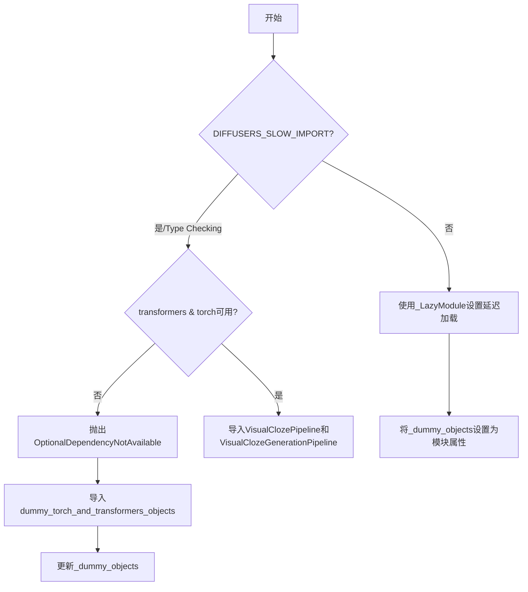
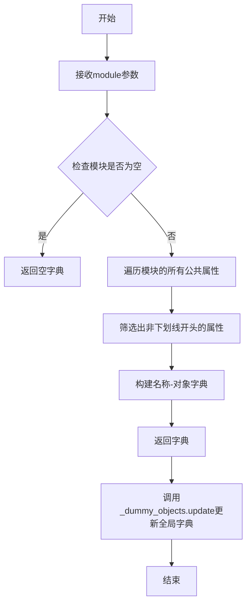

# `diffusers\src\diffusers\pipelines\visualcloze\__init__.py` 详细设计文档

这是一个Diffusers库的延迟加载初始化模块，用于导入视觉完形填空(Visual Cloze)相关的Pipeline类。它通过_LazyModule实现延迟加载，并处理torch和transformers可选依赖的逻辑，当依赖不可用时使用虚拟对象替代。

## 整体流程



## 类结构

```
Diffusers Package
└── pipelines/visual_cloze/
    ├── __init__.py (当前文件 - 延迟加载入口)
    ├── pipeline_visualcloze_combined.py
    │   └── VisualClozePipeline
    └── pipeline_visualcloze_generation.py
        └── VisualClozeGenerationPipeline
```

## 全局变量及字段


### `_dummy_objects`
    
Stores dummy objects for optional dependencies that are not available

类型：`dict`
    


### `_import_structure`
    
Stores the module import structure for lazy loading of pipelines

类型：`dict`
    


### `DIFFUSERS_SLOW_IMPORT`
    
Flag indicating whether to use slow import mode for diffusers modules

类型：`bool`
    


### `OptionalDependencyNotAvailable`
    
Exception class raised when an optional dependency is not available

类型：`class`
    


### `is_torch_available`
    
Function that checks if PyTorch is installed and available

类型：`function`
    


### `is_transformers_available`
    
Function that checks if Transformers library is installed and available

类型：`function`
    


    

## 全局函数及方法


### `_LazyModule`

这是对 `diffusers` 库中 `_LazyModule` 类的调用，用于实现延迟加载（Lazy Loading）机制。该类通过延迟导入模块来优化库的初始化性能，只有在实际使用某个类时才会将其加载到内存中。

参数：

- `__name__`：`str`，当前模块的完整名称（通常为 `__name__`）
- `__file__`：`str`，当前模块的文件路径（通过 `globals()["__file__"]` 获取）
- `import_structure`：`dict`，模块的导入结构字典，定义了该模块导出的所有对象
- `module_spec`：`ModuleSpec`，模块的规格对象（通过 `__spec__` 获取）

返回值：`Module`，返回一个延迟加载的模块对象，替换 `sys.modules` 中的当前模块

#### 流程图

```mermaid
flowchart TD
    A[开始] --> B{检查 TYPE_CHECKING<br/>或 DIFFUSERS_SLOW_IMPORT}
    B -->|是| C[直接导入具体类]
    C --> D[从 pipeline_visualcloze_combined<br/>导入 VisualClozePipeline]
    C --> E[从 pipeline_visualcloze_generation<br/>导入 VisualClozeGenerationPipeline]
    B -->|否| F[创建 _LazyModule 实例]
    F --> G[替换 sys.modules[__name__]<br/>为 _LazyModule 对象]
    G --> H[遍历 _dummy_objects]
    H --> I[为每个虚拟对象设置属性]
    I --> J[结束]
    
    style F fill:#f9f,stroke:#333
    style G fill:#f9f,stroke:#333
```

#### 带注释源码

```python
from typing import TYPE_CHECKING

# 从 utils 模块导入延迟加载相关的工具类
from ...utils import (
    DIFFUSERS_SLOW_IMPORT,              # 控制是否启用慢速导入的标志
    OptionalDependencyNotAvailable,    # 可选依赖不可用异常
    _LazyModule,                        # 延迟加载模块类（核心类）
    get_objects_from_module,            # 从模块获取对象的工具函数
    is_torch_available,                 # 检查 PyTorch 是否可用
    is_transformers_available,          # 检查 Transformers 是否可用
)

# 初始化虚拟对象字典和导入结构字典
_dummy_objects = {}                      # 存储虚拟对象（当依赖不可用时使用）
_import_structure = {}                   # 定义模块的导入结构

# 尝试检查必需的依赖（torch 和 transformers）
try:
    if not (is_transformers_available() and is_torch_available()):
        raise OptionalDependencyNotAvailable()
except OptionalDependencyNotAvailable:
    # 依赖不可用时，导入虚拟对象并添加到 _dummy_objects
    from ...utils import dummy_torch_and_transformers_objects  # noqa F403
    _dummy_objects.update(get_objects_from_module(dummy_torch_and_transformers_objects))
else:
    # 依赖可用时，定义导入结构
    _import_structure["pipeline_visualcloze_combined"] = ["VisualClozePipeline"]
    _import_structure["pipeline_visualcloze_generation"] = ["VisualClozeGenerationPipeline"]

# 类型检查阶段或慢速导入模式下的处理
if TYPE_CHECKING or DIFFUSERS_SLOW_IMPORT:
    try:
        if not (is_transformers_available() and is_torch_available()):
            raise OptionalDependencyNotAvailable()
    except OptionalDependencyNotAvailable:
        # 导入虚拟对象的类型定义
        from ...utils.dummy_torch_and_transformers_objects import *
    else:
        # 直接导入实际的 Pipeline 类
        from .pipeline_visualcloze_combined import VisualClozePipeline
        from .pipeline_visualcloze_generation import VisualClozeGenerationPipeline
else:
    # 非类型检查模式：使用 _LazyModule 实现延迟加载
    import sys
    
    # 创建延迟加载模块对象，替换当前模块
    sys.modules[__name__] = _LazyModule(
        __name__,                        # 模块名称
        globals()["__file__"],           # 模块文件路径
        _import_structure,              # 导入结构定义
        module_spec=__spec__,            # 模块规格
    )
    
    # 将虚拟对象设置为模块属性
    for name, value in _dummy_objects.items():
        setattr(sys.modules[__name__], name, value)
```


### `get_objects_from_module`

该函数是diffusers库中的一个工具函数，用于从指定模块中动态获取所有公共对象（通常为类或变量），并将其转换为字典格式，以便于后续的延迟导入和模块初始化处理。

参数：

- `module`：`Module`，传入的模块对象，在此代码中为`dummy_torch_and_transformers_objects`模块

返回值：`dict`，返回模块中的所有公共对象，以字典形式返回，键为对象名称，值为对象本身

#### 流程图



#### 带注释源码

基于代码上下文推断的实现逻辑：

```python
def get_objects_from_module(module):
    """
    从给定模块中获取所有公共对象并返回为字典
    
    参数:
        module: Python模块对象
        
    返回值:
        dict: 模块中所有公共对象的字典，键为对象名称，值为对象本身
    """
    # 初始化空字典存储结果
    objects = {}
    
    # 检查模块是否存在
    if module is None:
        return objects
    
    # 遍历模块的所有属性
    for attr_name in dir(module):
        # 过滤掉私有属性（以下划线开头的属性）
        if not attr_name.startswith('_'):
            try:
                # 获取属性值
                attr_value = getattr(module, attr_name)
                # 将名称-对象对添加到字典
                objects[attr_name] = attr_value
            except AttributeError:
                # 忽略无法获取的属性
                pass
    
    return objects
```

#### 在当前代码中的使用

```python
# 从utils导入该函数
from ...utils import get_objects_from_module

# 初始化空字典存储虚拟对象
_dummy_objects = {}

try:
    # 检查torch和transformers是否可用
    if not (is_transformers_available() and is_torch_available()):
        raise OptionalDependencyNotAvailable()
except OptionalDependencyNotAvailable:
    # 如果依赖不可用，导入虚拟对象模块
    from ...utils import dummy_torch_and_transformers_objects
    
    # 使用get_objects_from_module获取虚拟对象并更新_dummy_objects
    # 这些虚拟对象用于在没有安装可选依赖时提供替代实现
    _dummy_objects.update(get_objects_from_module(dummy_torch_and_transformers_objects))
```

**说明**：该函数在diffusers库中主要用于处理可选依赖的场景。当某些依赖（如torch和transformers）未安装时，库会使用虚拟对象来保持模块结构的完整性，避免导入错误，同时通过`get_objects_from_module`将这些虚拟对象批量注册到模块中。


### `setattr`

该函数是 Python 内置函数，在此代码中用于将 `_dummy_objects` 字典中的每个虚拟对象动态设置为当前模块的属性，使得在可选依赖不可用时，这些虚拟对象可以被正确导入和使用。

参数：

- `sys.modules[__name__]`：`module`，目标模块对象，即当前 lazy 模块
- `name`：`str`，要设置的属性名称，从 `_dummy_objects` 字典的键中获取
- `value`：任意类型，属性值，从 `_dummy_objects` 字典的值中获取

返回值：`None`，setattr 不返回值，仅执行属性设置操作

#### 流程图

```mermaid
flowchart TD
    A[开始遍历 _dummy_objects] --> B{是否还有未处理的项?}
    B -->|是| C[获取 name 和 value]
    C --> D[调用 setattr 设置属性]
    D --> E[sys.modules[__name__].name = value]
    E --> B
    B -->|否| F[结束]
```

#### 带注释源码

```python
# 遍历 _dummy_objects 字典中的所有虚拟对象
for name, value in _dummy_objects.items():
    # 使用 setattr 将每个虚拟对象动态设置为当前模块的属性
    # 参数1: sys.modules[__name__] - 当前模块对象
    # 参数2: name - 属性名（虚拟对象的名称）
    # 参数3: value - 属性值（虚拟对象本身）
    setattr(sys.modules[__name__], name, value)
```

## 关键组件


### 可选依赖检查与虚拟对象机制

该模块实现了Diffusers库的可选依赖处理机制，通过is_torch_available()和is_transformers_available()检查torch和transformers是否可用，当依赖不可用时使用dummy_torch_and_transformers_objects中的虚拟对象来保持API一致性，避免运行时导入错误。

### 惰性加载模块（Lazy Loading）

利用_LazyModule实现模块的惰性加载机制，仅在实际使用时才导入管道类（VisualClozePipeline和VisualClozeGenerationPipeline），减少启动时的内存占用和导入时间，提升大规模项目初始化性能。

### 条件导入结构（Conditional Import Structure）

通过_import_structure字典定义模块的导入映射关系，支持TYPE_CHECKING和DIFFUSERS_SLOW_IMPORT两种导入模式，在类型检查时直接导入真实类，在运行时通过LazyModule延迟导入，实现灵活的资源加载策略。

### VisualClozePipeline 组合管道

从pipeline_visualcloze_combined模块导入的视觉填空组合管道，提供视觉理解和填空任务的综合处理能力，属于Diffusers库的图像生成管道组件。

### VisualClozeGenerationPipeline 生成管道

从pipeline_visualcloze_generation模块导入的视觉填空生成管道，负责基于视觉信息的生成式任务处理，是VisualCloze功能的生成模型实现。

### 动态模块注册机制

通过sys.modules[__name__]和setattr动态将虚拟对象或LazyModule注入到当前模块，使导入方能够以相同的方式访问真实管道或虚拟对象，确保API在依赖缺失时仍可正常导入不报错。


## 问题及建议


### 已知问题

-   **重复的条件判断逻辑**：代码在两处（普通import分支和TYPE_CHECKING分支）重复执行了 `is_transformers_available() and is_torch_available()` 的检查，导致相同的条件逻辑被复制粘贴，违反DRY原则
-   **异常处理与导入逻辑分离**：使用空的 `try-except` 块来控制导入流程的方式不够直观，异常被捕获后立即导入dummy对象，逻辑跳转较多，可读性较差
-   **类型检查分支缺少else分支**：在 `if TYPE_CHECKING or DIFFUSERS_SLOW_IMPORT:` 块中没有处理可选依赖不可用时的else情况，虽然通过except捕获处理了，但逻辑不完整
-   **模块级全局状态修改**：直接在模块级别对 `sys.modules` 进行修改和动态设置属性，可能与其他导入机制产生冲突
-   **魔法字符串缺乏常量定义**：`"pipeline_visualcloze_combined"` 等字符串直接硬编码，建议提取为常量以提高可维护性
-   **缺少文档注释**：整个模块没有任何文档字符串（docstring），无法快速了解模块用途

### 优化建议

-   **提取公共条件函数**：将依赖检查逻辑封装为一个函数，例如 `def _check_dependencies()`，避免重复代码
-   **重构条件分支逻辑**：考虑使用显式的条件判断而非异常捕获来控制导入流程，或者将dummy对象的导入逻辑统一到一个地方
-   **添加模块文档**：在文件开头添加模块级别的docstring，说明这是VisualCloze管道的延迟加载模块
-   **提取字符串常量**：定义模块级别的常量来存储导入结构键名，如 `PIPELINE_COMBINED = "pipeline_visualcloze_combined"`
-   **简化lazy module配置**：考虑将dummy对象的处理集成到_LazyModule的初始化逻辑中，减少模块级别的副作用操作


## 其它


### 设计目标与约束

该模块作为VisualCloze项目的入口模块，采用延迟加载机制处理可选依赖（torch和transformers），支持在未安装这些依赖时提供虚拟对象，确保项目结构的完整性和模块导入的平滑降级。

### 错误处理与异常设计

使用`OptionalDependencyNotAvailable`异常处理可选依赖不可用的情况，当检测到torch或transformers任一不可用时，触发异常并回退到虚拟对象。异常传播机制采用静默处理，通过`_dummy_objects`提供空实现，避免导入时崩溃。

### 模块接口契约

- **公开接口**: `VisualClozePipeline`, `VisualClozeGenerationPipeline`
- **导入结构**: 通过`_import_structure`字典定义模块可导出对象，采用字典键值对形式存储类名列表
- **模块规范**: 使用`__spec__`保持模块元数据一致性，支持Python的import系统正确识别

### 动态模块加载机制

_LazyModule实现惰性加载，延迟到首次访问时才加载实际模块代码，通过`sys.modules[__name__]`动态替换模块对象，结合`setattr`将虚拟对象注入到模块命名空间，实现透明的对象替换。

### 类型标注与静态检查

通过`TYPE_CHECKING`标志支持静态类型检查器的类型推导，在类型检查阶段导入实际类而非虚拟对象，确保IDE和类型检查器能正确识别类型信息，同时运行时不导入实际依赖。

### 模块初始化流程

1. 定义空的导入结构字典和虚拟对象字典
2. 检查torch和transformers可用性
3. 不可用时加载虚拟对象模块，可用时填充真实导入结构
4. 根据导入模式（类型检查/延迟导入）决定直接导入或设置LazyModule
5. 将虚拟对象绑定到模块命名空间完成初始化

### 依赖关系图

该模块依赖以下组件：
- `diffusers.utils._LazyModule`: 延迟模块加载实现
- `diffusers.utils.get_objects_from_module`: 从模块获取对象列表
- `diffusers.utils.dummy_torch_and_transformers_objects`: 虚拟对象定义
- `OptionalDependencyNotAvailable`: 可选依赖异常类

### 加载标志说明

- `TYPE_CHECKING`: Python typing模块标志，表示类型检查阶段的特殊处理
- `DIFFUSERS_SLOW_IMPORT`: 控制是否启用延迟导入的全局标志，允许在某些场景下跳过LazyModule直接加载


    