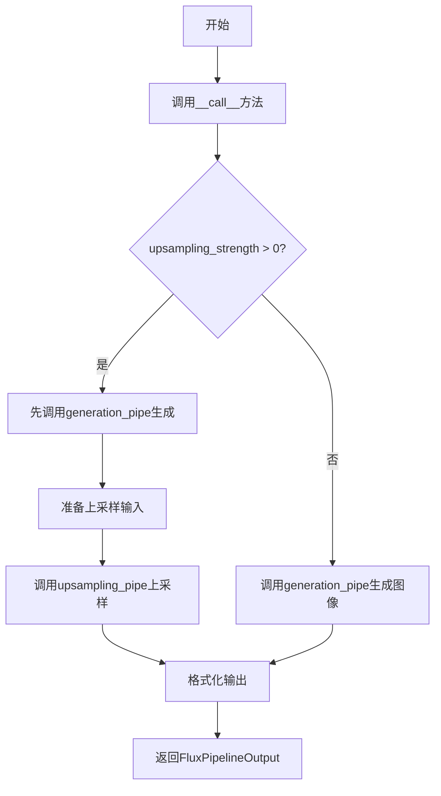
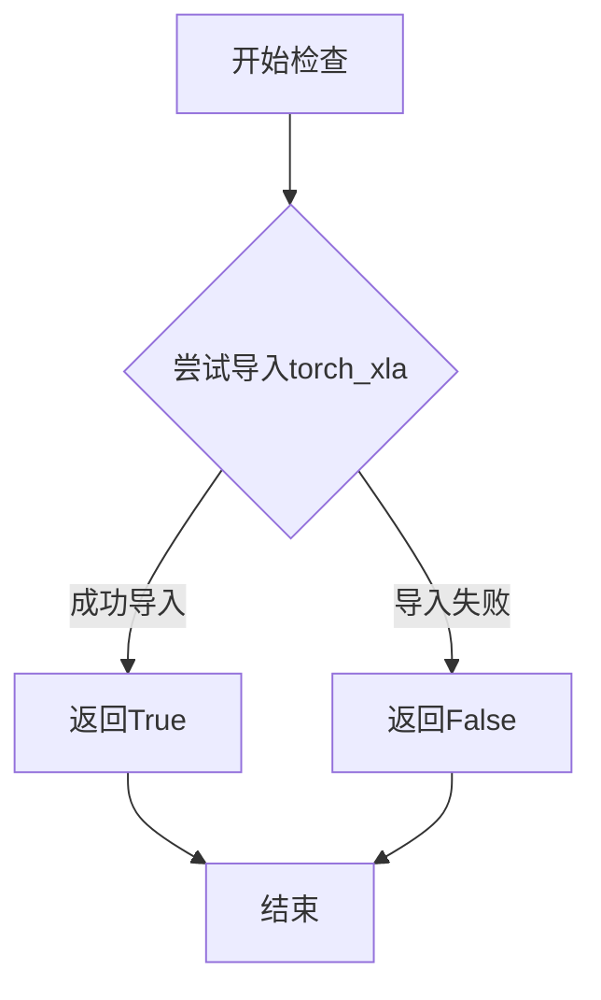
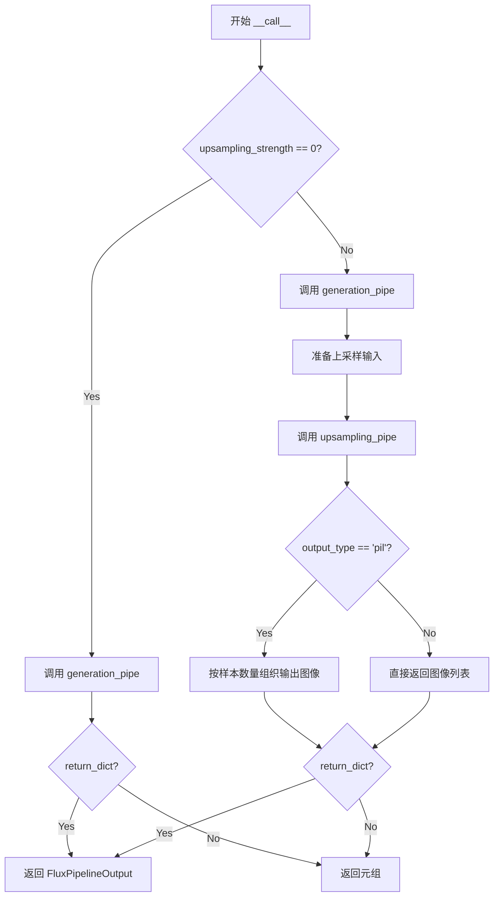

# `diffusers\src\diffusers\pipelines\visualcloze\pipeline_visualcloze_combined.py` 详细设计文档

VisualClozePipeline是一个用于图像生成的扩散管道，通过视觉上下文示例（in-context examples）来指导图像生成任务，支持从低分辨率生成到高分辨率上采样的两阶段处理流程。

## 整体流程



## 类结构

```
DiffusionPipeline (基类)
├── FluxLoraLoaderMixin
├── FromSingleFileMixin
└── TextualInversionLoaderMixin
    └── VisualClozePipeline (主类)
        ├── VisualClozeGenerationPipeline (内部实例)
        └── VisualClozeUpsamplingPipeline (内部实例)
```

## 全局变量及字段


### `XLA_AVAILABLE`
    
是否支持XLA加速，用于判断是否可以使用TPU/XLA设备

类型：`bool`
    


### `logger`
    
模块级日志记录器，用于输出调试和信息日志

类型：`logging.Logger`
    


### `EXAMPLE_DOC_STRING`
    
示例文档字符串，包含VisualClozePipeline的使用示例代码

类型：`str`
    


### `VisualClozePipeline.model_cpu_offload_seq`
    
CPU卸载顺序配置，指定模型各组件在CPU和GPU间移动的顺序

类型：`str`
    


### `VisualClozePipeline._optional_components`
    
可选组件列表，定义管道中非必需的组件

类型：`list`
    


### `VisualClozePipeline._callback_tensor_inputs`
    
回调张量输入列表，指定哪些张量可在步骤结束时被回调

类型：`list`
    


### `VisualClozePipeline.vae`
    
VAE模型，用于图像的编码和解码

类型：`AutoencoderKL`
    


### `VisualClozePipeline.text_encoder`
    
CLIP文本编码器，用于将文本编码为向量表示

类型：`CLIPTextModel`
    


### `VisualClozePipeline.text_encoder_2`
    
T5文本编码器，用于生成更长的文本嵌入

类型：`T5EncoderModel`
    


### `VisualClozePipeline.tokenizer`
    
CLIP分词器，用于对文本进行tokenize

类型：`CLIPTokenizer`
    


### `VisualClozePipeline.tokenizer_2`
    
T5快速分词器，用于对文本进行tokenize

类型：`T5TokenizerFast`
    


### `VisualClozePipeline.transformer`
    
Flux变换器模型，用于去噪图像潜在表示

类型：`FluxTransformer2DModel`
    


### `VisualClozePipeline.scheduler`
    
调度器，用于控制去噪过程中的噪声调度

类型：`FlowMatchEulerDiscreteScheduler`
    


### `VisualClozePipeline.generation_pipe`
    
生成管道实例，负责主要的图像生成逻辑

类型：`VisualClozeGenerationPipeline`
    


### `VisualClozePipeline.upsampling_pipe`
    
上采样管道实例，负责图像的高分辨率上采样

类型：`VisualClozeUpsamplingPipeline`
    
    

## 全局函数及方法


### `is_torch_xla_available`

该函数用于检查当前环境中 PyTorch XLA（Accelerated Linear Algebra）是否可用，返回布尔值以指示 XLA 支持状态。

参数： 无

返回值：`bool`，如果 PyTorch XLA 可用则返回 `True`，否则返回 `False`

#### 流程图



#### 带注释源码

```python
# 该函数定义在实际使用文件的 ...utils 模块中
# 当前文件中通过以下方式使用：

# 从 diffusers.utils 导入该函数
from ...utils import is_torch_xla_available, logging, replace_example_docstring

# 在模块级别调用，设置全局标志
if is_torch_xla_available():
    XLA_AVAILABLE = True  # XLA 可用时设置为 True
else:
    XLA_AVAILABLE = False  # XLA 不可用时设置为 False
```

> **注意**：该函数的实际定义位于 `diffusers.utils` 模块中，在当前提供的代码文件中仅包含导入和调用逻辑。该函数通常通过尝试导入 `torch_xla` 包来检测 PyTorch XLA 的可用性。


### `VisualClozePipeline.__init__`

初始化VisualClozePipeline管道实例，注册所有必要的模块（VAE、文本编码器、Transformer、调度器等），并创建生成管道和上采样管道两个子管道实例。

参数：

- `scheduler`：`FlowMatchEulerDiscreteScheduler`，用于去噪过程的调度器
- `vae`：`AutoencoderKL`，变分自编码器，用于编码和解码图像到潜在表示
- `text_encoder`：`CLIPTextModel`，CLIP文本编码器，用于编码任务提示
- `tokenizer`：`CLIPTokenizer`，CLIP分词器，用于对任务提示进行分词
- `text_encoder_2`：`T5EncoderModel`，T5文本编码器，用于编码内容提示
- `tokenizer_2`：`T5TokenizerFast`，T5快速分词器，用于对内容提示进行分词
- `transformer`：`FluxTransformer2DModel`，条件Transformer（MMDiT）架构，用于去噪编码后的图像潜在向量
- `resolution`：`int`，可选，默认为384，拼接查询图像和上下文示例时每个图像的分辨率

返回值：`None`，__init__方法不返回值，它初始化实例属性

#### 流程图

```mermaid
flowchart TD
    A[开始 __init__] --> B[调用 super().__init__]
    B --> C[调用 self.register_modules 注册所有模块]
    C --> D{创建子管道}
    D --> E[创建 VisualClozeGenerationPipeline]
    D --> F[创建 VisualClozeUpsamplingPipeline]
    E --> G[结束 __init__]
    F --> G
    
    C -->|注册模块| C1[vae]
    C -->|注册模块| C2[text_encoder]
    C -->|注册模块| C3[text_encoder_2]
    C -->|注册模块| C4[tokenizer]
    C -->|注册模块| C5[tokenizer_2]
    C -->|注册模块| C6[transformer]
    C -->|注册模块| C7[scheduler]
```

#### 带注释源码

```python
def __init__(
    self,
    scheduler: FlowMatchEulerDiscreteScheduler,  # 去噪调度器
    vae: AutoencoderKL,  # 变分自编码器模型
    text_encoder: CLIPTextModel,  # CLIP文本编码器
    tokenizer: CLIPTokenizer,  # CLIP分词器
    text_encoder_2: T5EncoderModel,  # T5文本编码器
    tokenizer_2: T5TokenizerFast,  # T5快速分词器
    transformer: FluxTransformer2DModel,  # 条件Transformer模型
    resolution: int = 384,  # 默认图像分辨率
):
    """
    初始化VisualClozePipeline管道实例。
    
    该方法执行以下主要操作：
    1. 调用父类DiffusionPipeline的初始化方法
    2. 注册所有模型组件到管道中
    3. 创建生成子管道和上采样子管道
    """
    # 调用父类的初始化方法，建立基本的管道结构
    super().__init__()

    # 注册所有模块，使管道能够管理这些组件的生命周期和设备移动
    self.register_modules(
        vae=vae,
        text_encoder=text_encoder,
        text_encoder_2=text_encoder_2,
        tokenizer=tokenizer,
        tokenizer_2=tokenizer_2,
        transformer=transformer,
        scheduler=scheduler,
    )

    # 创建生成管道用于初始图像生成
    # 继承VisualClozeGenerationPipeline的功能来处理上下文示例和查询
    self.generation_pipe = VisualClozeGenerationPipeline(
        vae=vae,
        text_encoder=text_encoder,
        text_encoder_2=text_encoder_2,
        tokenizer=tokenizer,
        tokenizer_2=tokenizer_2,
        transformer=transformer,
        scheduler=scheduler,
        resolution=resolution,  # 传递分辨率参数用于控制输出图像大小
    )
    
    # 创建上采样管道用于提高生成图像的分辨率
    # 使用FluxFillPipeline实现高质量的图像上采样
    self.upsampling_pipe = VisualClozeUpsamplingPipeline(
        vae=vae,
        text_encoder=text_encoder,
        text_encoder_2=text_encoder_2,
        tokenizer=tokenizer,
        tokenizer_2=tokenizer_2,
        transformer=transformer,
        scheduler=scheduler,
    )
```


### VisualClozePipeline.check_inputs

该方法负责验证 VisualClozePipeline 推理管道的输入参数有效性，确保所有必填参数存在、类型正确、取值范围合理，以及提示词与嵌入向量之间的逻辑一致性，防止因参数错误导致后续生成过程出现异常。

参数：

- `image`：`Any`，输入的图像数据，用于验证图像批次的结构是否满足2D列表格式要求
- `task_prompt`：`str | list[str] | None`，任务提示词，定义生成任务的具体意图
- `content_prompt`：`str | list[str] | None`，内容提示词，定义目标图像的内容描述
- `upsampling_height`：`int | None`，上采样后的图像高度，需满足可被 VAE 缩放因子×2 整除
- `upsampling_width`：`int | None`，上采样后的图像宽度，需满足可被 VAE 缩放因子×2 整除
- `strength`：`float`，强度参数，控制图像变换程度，必须在 [0.0, 1.0] 范围内
- `prompt_embeds`：`torch.FloatTensor | None`，预计算的提示词嵌入向量
- `pooled_prompt_embeds`：`torch.FloatTensor | None`，预计算的池化提示词嵌入向量
- `callback_on_step_end_tensor_inputs`：`list[str] | None`，回调函数在每步结束时可访问的张量输入列表
- `max_sequence_length`：`int | None`，最大序列长度，不能超过 512

返回值：`None`，该方法不返回任何值，仅进行参数验证和异常抛出

#### 流程图

```mermaid
flowchart TD
    A[开始 check_inputs] --> B{strength 在 [0, 1] 范围?}
    B -->|否| C[抛出 ValueError]
    B -->|是| D{upsampling_height 可被 vae_scale_factor×2 整除?}
    D -->|否| D1[记录警告日志]
    D -->|是| D2{upsampling_width 可被 vae_scale_factor×2 整除?}
    D1 --> D2
    D2 -->|否| D3[记录警告日志]
    D2 -->|是| E{callback_on_step_end_tensor_inputs 有效?}
    E -->|否| F[抛出 ValueError]
    E -->|是| G{不能同时提供 task_prompt/content_prompt 和 prompt_embeds}
    G -->|是| H[抛出 ValueError]
    G -->|否| I{task_prompt 和 content_prompt 都为空 且 prompt_embeds 为空?}
    I -->|是| J[抛出 ValueError]
    I -->|否| K{task_prompt 是否存在?}
    K -->|否| L[抛出 ValueError]
    K -->|是| M{task_prompt 是 str 或 list?}
    M -->|否| N[抛出 ValueError]
    M -->|是| O{content_prompt 是 str 或 list 或 None?}
    O -->|否| P[抛出 ValueError]
    O -->|是| Q{task_prompt 或 content_prompt 是 list?}
    Q -->|是| R{task_prompt 和 content_prompt 都是 list?}
    R -->|否| S[抛出 ValueError]
    R -->|是| T{task_prompt 和 content_prompt 长度相同?]
    T -->|否| U[抛出 ValueError]
    T -->|是| V{image 样本结构验证}
    V --> V1[每个样本是2D列表?]
    V1 -->|否| W[抛出 ValueError]
    V1 -->|是| V2[每行图像数量一致?]
    V2 -->|否| X[抛出 ValueError]
    V2 -->|是| V3[查询行最后元素为 None?]
    V3 -->|否| Y[抛出 ValueError]
    V3 -->|是| V4[上下文示例行无 None?]
    V4 -->|否| Z[抛出 ValueError]
    V4 -->|是| AA{prompt_embeds 存在但 pooled_prompt_embeds 为空?}
    AA -->|是| AB[抛出 ValueError]
    AA -->|否| AC{max_sequence_length 超过 512?]
    AC -->|是| AD[抛出 ValueError]
    AC -->|否| AE[验证通过]
    Q -->|否| AF[验证 prompt_embeds 和 pooled_prompt_embeds]
    AF --> AC
```

#### 带注释源码

```python
def check_inputs(
    self,
    image,
    task_prompt,
    content_prompt,
    upsampling_height,
    upsampling_width,
    strength,
    prompt_embeds=None,
    pooled_prompt_embeds=None,
    callback_on_step_end_tensor_inputs=None,
    max_sequence_length=None,
):
    # 验证 strength 参数必须在 [0.0, 1.0] 范围内
    if strength < 0 or strength > 1:
        raise ValueError(f"The value of strength should in [0.0, 1.0] but is {strength}")

    # 验证上采样高度是否为 VAE 缩放因子×2 的倍数，否则记录警告
    if upsampling_height is not None and upsampling_height % (self.vae_scale_factor * 2) != 0:
        logger.warning(
            f"`upsampling_height`has to be divisible by {self.vae_scale_factor * 2} but are {upsampling_height}. Dimensions will be resized accordingly"
        )
    # 验证上采样宽度是否为 VAE 缩放因子×2 的倍数，否则记录警告
    if upsampling_width is not None and upsampling_width % (self.vae_scale_factor * 2) != 0:
        logger.warning(
            f"`upsampling_width` have to be divisible by {self.vae_scale_factor * 2} but are {upsampling_width}. Dimensions will be resized accordingly"
        )

    # 验证回调张量输入是否在允许的列表中
    if callback_on_step_end_tensor_inputs is not None and not all(
        k in self._callback_tensor_inputs for k in callback_on_step_end_tensor_inputs
    ):
        raise ValueError(
            f"`callback_on_step_end_tensor_inputs` has to be in {self._callback_tensor_inputs}, but found {[k for k in callback_on_step_end_tensor_inputs if k not in self._callback_tensor_inputs]}"
        )

    # 验证提示词输入：不能同时提供 text prompt 和预计算的嵌入
    if (task_prompt is not None or content_prompt is not None) and prompt_embeds is not None:
        raise ValueError("Cannot provide both text `task_prompt` + `content_prompt` and `prompt_embeds`. ")

    # 验证至少提供一种输入方式：文本提示或预计算嵌入
    if task_prompt is None and content_prompt is None and prompt_embeds is None:
        raise ValueError("Must provide either `task_prompt` + `content_prompt` or pre-computed `prompt_embeds`. ")

    # 验证 task_prompt 不能为空
    if task_prompt is None:
        raise ValueError("`task_prompt` is missing.")

    # 验证 task_prompt 类型必须为 str 或 list
    if task_prompt is not None and not isinstance(task_prompt, (str, list)):
        raise ValueError(f"`task_prompt` must be str or list, got {type(task_prompt)}")

    # 验证 content_prompt 类型必须为 str 或 list 或 None
    if content_prompt is not None and not isinstance(content_prompt, (str, list)):
        raise ValueError(f"`content_prompt` must be str or list, got {type(content_prompt)}")

    # 当 task_prompt 或 content_prompt 为列表时的验证逻辑
    if isinstance(task_prompt, list) or isinstance(content_prompt, list):
        # 两者必须同时为列表或同时为字符串/None
        if not isinstance(task_prompt, list) or not isinstance(content_prompt, list):
            raise ValueError(
                f"`task_prompt` and `content_prompt` must both be lists, or both be of type str or None, "
                f"got {type(task_prompt)} and {type(content_prompt)}"
            )
        # 列表长度必须一致
        if len(content_prompt) != len(task_prompt):
            raise ValueError("`task_prompt` and `content_prompt` must have the same length whe they are lists.")

        # 验证图像批次结构：每个样本必须是2D图像列表
        for sample in image:
            if not isinstance(sample, list) or not isinstance(sample[0], list):
                raise ValueError("Each sample in the batch must have a 2D list of images.")
            # 每行（每个上下文示例或查询）的图像数量必须一致
            if len({len(row) for row in sample}) != 1:
                raise ValueError("Each in-context example and query should contain the same number of images.")
            # 查询行（最后一个元素）的目标图像必须为 None
            if not any(img is None for img in sample[-1]):
                raise ValueError("There are no targets in the query, which should be represented as None.")
            # 上下文示例行不能有 None 图像
            for row in sample[:-1]:
                if any(img is None for img in row):
                    raise ValueError("Images are missing in in-context examples.")

    # 验证嵌入向量一致性：若提供 prompt_embeds 必须同时提供 pooled_prompt_embeds
    if prompt_embeds is not None and pooled_prompt_embeds is None:
        raise ValueError(
            "If `prompt_embeds` are provided, `pooled_prompt_embeds` also have to be passed. Make sure to generate `pooled_prompt_embeds` from the same text encoder that was used to generate `prompt_embeds`."
        )

    # 验证最大序列长度不能超过 512
    if max_sequence_length is not None and max_sequence_length > 512:
        raise ValueError(f"max_sequence_length cannot exceed 512, got {max_sequence_length}")
```


### VisualClozePipeline.__call__

视觉填空管道的主推理方法，负责协调图像生成和上采样两个阶段，根据`upsampling_strength`参数决定是否执行上采样，输出最终生成的图像。

参数：

- `task_prompt`：`str | list[str]`，定义任务意图的提示词
- `content_prompt`：`str | list[str]`，定义目标图像内容或描述的提示词
- `image`：`torch.FloatTensor | PIL.Image.Image | np.ndarray | list`，用作起点的图像批次，支持张量、 PIL图像、numpy数组或其列表
- `upsampling_height`：`int | None`，上采样后生成图像的高度（像素）
- `upsampling_width`：`int | None`，上采样后生成图像的宽度（像素）
- `num_inference_steps`：`int`，去噪步数，默认为50
- `sigmas`：`list[float] | None`，自定义去噪过程的sigma值
- `guidance_scale`：`float`，分类器自由扩散引导比例，默认为30.0
- `num_images_per_prompt`：`int | None`，每个提示生成的图像数量
- `generator`：`torch.Generator | list[torch.Generator] | None`，随机生成器，用于确保可重复性
- `latents`：`torch.FloatTensor | None`，预生成的噪声潜在向量
- `prompt_embeds`：`torch.FloatTensor | None`，预生成的文本嵌入
- `pooled_prompt_embeds`：`torch.FloatTensor | None`，预生成的池化文本嵌入
- `output_type`：`str | None`，输出格式，默认为"pil"
- `return_dict`：`bool`，是否返回`FluxPipelineOutput`，默认为True
- `joint_attention_kwargs`：`dict[str, Any] | None`，传递给注意力处理器的 kwargs
- `callback_on_step_end`：`Callable | None`，每步结束时调用的回调函数
- `callback_on_step_end_tensor_inputs`：`list[str]`，回调函数张量输入列表，默认为["latents"]
- `max_sequence_length`：`int`，最大序列长度，默认为512
- `upsampling_strength`：`float`，上采样强度，默认为1.0，范围[0,1]

返回值：`FluxPipelineOutput | tuple`，返回生成的图像列表或包含图像的元组

#### 流程图



#### 带注释源码

```python
@torch.no_grad()
@replace_example_docstring(EXAMPLE_DOC_STRING)
def __call__(
    self,
    task_prompt: str | list[str] = None,
    content_prompt: str | list[str] = None,
    image: torch.FloatTensor | None = None,
    upsampling_height: int | None = None,
    upsampling_width: int | None = None,
    num_inference_steps: int = 50,
    sigmas: list[float] | None = None,
    guidance_scale: float = 30.0,
    num_images_per_prompt: int | None = 1,
    generator: torch.Generator | list[torch.Generator] | None = None,
    latents: torch.FloatTensor | None = None,
    prompt_embeds: torch.FloatTensor | None = None,
    pooled_prompt_embeds: torch.FloatTensor | None = None,
    output_type: str | None = "pil",
    return_dict: bool = True,
    joint_attention_kwargs: dict[str, Any] | None = None,
    callback_on_step_end: Callable[[int, int], None] | None = None,
    callback_on_step_end_tensor_inputs: list[str] = ["latents"],
    max_sequence_length: int = 512,
    upsampling_strength: float = 1.0,
):
    # 第一阶段：调用生成管道进行图像生成
    # 如果 upsampling_strength 为 0，则跳过后续上采样步骤
    generation_output = self.generation_pipe(
        task_prompt=task_prompt,
        content_prompt=content_prompt,
        image=image,
        num_inference_steps=num_inference_steps,
        sigmas=sigmas,
        guidance_scale=guidance_scale,
        num_images_per_prompt=num_images_per_prompt,
        generator=generator,
        latents=latents,
        prompt_embeds=prompt_embeds,
        pooled_prompt_embeds=pooled_prompt_embeds,
        joint_attention_kwargs=joint_attention_kwargs,
        callback_on_step_end=callback_on_step_end,
        callback_on_step_end_tensor_inputs=callback_on_step_end_tensor_inputs,
        max_sequence_length=max_sequence_length,
        # 如果不进行上采样，使用原始 output_type；否则强制转换为 pil
        output_type=output_type if upsampling_strength == 0 else "pil",
    )
    
    # 如果 upsampling_strength == 0，直接返回生成结果
    if upsampling_strength == 0:
        if not return_dict:
            return (generation_output,)
        return FluxPipelineOutput(images=generation_output)

    # 第二阶段：上采样处理
    # 1. 准备上采样输入数据
    if not isinstance(content_prompt, (list)):
        content_prompt = [content_prompt]
    n_target_per_sample = []  # 记录每个样本的目标数量
    upsampling_image = []
    upsampling_mask = []
    upsampling_prompt = []
    # 处理生成器，确保是列表格式
    upsampling_generator = generator if isinstance(generator, (torch.Generator,)) else []
    
    # 遍历生成的所有图像，准备上采样输入
    for i in range(len(generation_output.images)):
        n_target_per_sample.append(len(generation_output.images[i]))
        for image in generation_output.images[i]:
            upsampling_image.append(image)
            # 创建白色掩码（255,255,255）用于上采样
            upsampling_mask.append(Image.new("RGB", image.size, (255, 255, 255)))
            # 循环使用 content_prompt
            upsampling_prompt.append(
                content_prompt[i % len(content_prompt)] if content_prompt[i % len(content_prompt)] else ""
            )
            # 处理非单个生成器的情况
            if not isinstance(generator, (torch.Generator,)):
                upsampling_generator.append(generator[i % len(content_prompt)])

    # 2. 调用上采样管道进行高质量图像上采样
    upsampling_output = self.upsampling_pipe(
        prompt=upsampling_prompt,
        image=upsampling_image,
        mask_image=upsampling_mask,
        height=upsampling_height,
        width=upsampling_width,
        strength=upsampling_strength,
        num_inference_steps=num_inference_steps,
        sigmas=sigmas,
        guidance_scale=guidance_scale,
        generator=upsampling_generator,
        output_type=output_type,
        joint_attention_kwargs=joint_attention_kwargs,
        callback_on_step_end=callback_on_step_end,
        callback_on_step_end_tensor_inputs=callback_on_step_end_tensor_inputs,
        max_sequence_length=max_sequence_length,
    )
    image = upsampling_output.images

    # 3. 整理输出格式
    output = []
    if output_type == "pil":
        # PIL 图像无法直接拼接，按样本分组返回
        output = []
        start = 0
        for n in n_target_per_sample:
            output.append(image[start : start + n])
            start += n
    else:
        output = image

    if not return_dict:
        return (output,)

    return FluxPipelineOutput(images=output)
```

## 关键组件


### VisualClozePipeline

VisualClozePipeline是一个基于视觉上下文示例的图像生成管道，通过两阶段过程实现高质量图像生成：第一阶段使用VisualClozeGenerationPipeline进行基础图像生成，第二阶段通过FluxFillPipeline进行上采样增强。

### DiffusionPipeline基类继承

继承自DiffusionPipeline基类，获取标准扩散管道框架能力，包括模型加载、内存管理、回调机制等核心功能。

### FluxLoraLoaderMixin

提供LoRA（Low-Rank Adaptation）权重加载能力，允许动态注入和调整模型权重以适配特定任务或风格。

### FromSingleFileMixin

支持从单个模型文件加载预训练权重，简化单文件模型的导入流程。

### TextualInversionLoaderMixin

支持文本反转（Textual Inversion）嵌入加载，允许通过自定义词向量实现特定概念的图像生成。

### 生成管道 (generation_pipe)

VisualClozeGenerationPipeline实例，负责基于视觉上下文示例和文本提示生成基础图像，处理图像编码、潜在向量采样、去噪等核心生成逻辑。

### 上采样管道 (upsampling_pipe)

VisualClozeUpsamplingPipeline实例（基于FluxFillPipeline），负责对生成的图像进行上采样处理，支持SDEdit风格的图像编辑和分辨率提升。

### 文本编码器 (text_encoder, text_encoder_2)

CLIPTextModel和T5EncoderModel双文本编码器架构，分别负责生成CLIP文本嵌入和T5文本嵌入，为图像生成提供多模态条件信息。

### 分词器 (tokenizer, tokenizer_2)

CLIPTokenizer和T5TokenizerFast双分词器，将文本提示转换为模型可处理的token序列，支持长序列处理（max_sequence_length=512）。

### VAE模型 (vae)

AutoencoderKL变分自编码器，负责图像与潜在表示之间的编码和解码转换，是扩散模型图像生成的关键组件。

### Transformer模型 (transformer)

FluxTransformer2DModel条件变换器架构，实现去噪过程的核心神经网络，负责根据文本嵌入和噪声潜在向量预测干净图像。

### 调度器 (scheduler)

FlowMatchEulerDiscreteScheduler，基于Flow Match的欧拉离散调度器，控制去噪过程中的时间步长和噪声调度策略。

### check_inputs 方法

输入参数验证方法，负责检查task_prompt、content_prompt、image张量形状、upsampling尺寸对齐、prompt_embeds一致性等关键输入的有效性，防止运行时错误。

### __call__ 方法

主推理方法，实现完整的两阶段图像生成流程：首先调用generation_pipe生成基础图像，然后根据upsampling_strength决定是否进行上采样，支持灵活的生成参数配置。

### 模型卸载序列 (model_cpu_offload_seq)

定义模型组件的CPU卸载顺序为"text_encoder->text_encoder_2->transformer->vae"，优化推理过程中的显存使用。

### 回调张量输入 (_callback_tensor_inputs)

定义支持回调的 tensors 列表["latents", "prompt_embeds"]，允许用户在去噪过程中访问和修改中间状态。

### 分辨率参数 (resolution)

默认384像素，定义图像拼接和处理的基准分辨率，影响上下文示例和查询图像的尺寸规范化。

### 上采样强度 (upsampling_strength)

控制参考图像在SDEdit上采样过程中的噪声添加程度，值为0时跳过上采样，值为1时添加最大噪声进行完整去噪迭代。

### 图像批处理与目标识别

支持批处理多组视觉上下文示例，通过检查最后一行是否存在None来识别目标图像位置，实现灵活的in-context learning。


## 问题及建议


### 已知问题

-   **参数验证不完整**：在 `check_inputs` 方法中，`upsampling_strength` 参数（范围应为0-1）未进行验证，而 `__call__` 方法中直接使用了该参数进行比较判断。类似地，`num_inference_steps`、`guidance_scale` 等关键参数也缺少正数验证。
-   **输出类型处理逻辑不一致**：当 `upsampling_strength == 0` 时，代码强制将 `output_type` 转换为 "pil" 并传递给了 generation_pipe，但这与注释中描述的"跳过upsampling步骤"的语义不完全一致，可能导致输出格式与用户预期不符。
-   **类型检查代码冗余**：在 `check_inputs` 方法中存在重复的 `isinstance` 检查，例如先检查 `task_prompt` 是否为字符串或列表，又在后续的列表判断中重复检查是否为 list 类型。
-   **Generator 参数处理不够健壮**：对于 `generator` 参数是列表的情况，代码中使用取模运算 `generator[i % len(content_prompt)]` 来获取 generator，但未验证列表长度是否与实际需要的数量匹配，可能导致索引越界或未预期行为。
-   **硬编码的配置值**：`resolution` 默认值为384、`max_sequence_length` 限制为512等值被硬编码在代码中，降低了配置的灵活性。
-   **image 参数验证不足**：`check_inputs` 方法中仅验证了 image 的外层结构（是否为二维列表），但未验证内层图像对象的具体类型、PIL图像的有效性，或 numpy array/tensor 的形状和数值范围。

### 优化建议

-   **完善参数验证**：在 `check_inputs` 方法中添加对 `upsampling_strength`（0-1范围）、`num_inference_steps`（正整数）、`guidance_scale`（正数）、`max_sequence_length`（正整数且>0）等参数的验证逻辑。
-   **简化条件分支**：将 `upsampling_strength == 0` 的特殊处理逻辑提取为独立的早期返回路径，使代码意图更清晰，并确保在此情况下完全跳过 upsampling 相关的处理。
-   **重构类型检查**：合并重复的 isinstance 检查逻辑，使用更简洁的条件表达式或提取辅助验证函数。
-   **增强 generator 参数处理**：当 generator 为列表时，应验证其长度与 batch size 匹配，并在不匹配时抛出明确的错误信息。
-   **添加图像验证辅助方法**：在 `check_inputs` 中增加对输入图像的深度验证，包括类型检查、尺寸一致性检查、数值范围检查等。
-   **考虑将硬编码值提取为配置常量**：将分辨率、序列长度限制等值定义为类属性或配置常量，便于维护和调整。

## 其它


### 设计目标与约束

本Pipeline的设计目标是实现基于视觉上下文（Visual Context）的图像生成任务，通过In-Context Learning机制，利用示例图像（in-context examples）来指导目标图像的生成。核心约束包括：1）仅支持Flux系列模型架构；2）分辨率需为384的倍数以满足VAE的缩放因子要求；3）max_sequence_length限制为512；4）upsampling_strength需在[0,1]范围内；5）任务采用两阶段流水线：先进行基础分辨率（384x384）生成，再进行上采样至目标分辨率。

### 错误处理与异常设计

Pipeline在check_inputs方法中实现了全面的输入验证：1）strength参数必须在[0,1]范围内，否则抛出ValueError；2）upsampling_height和upsampling_width必须能被vae_scale_factor*2整除，否则仅发出warning并自动调整；3）callback_on_step_end_tensor_inputs必须为_callback_tensor_inputs的子集；4）task_prompt和content_prompt与prompt_embeds互斥，不能同时提供；5）当使用列表形式的prompt时，task_prompt和content_prompt长度必须一致；6）prompt_embeds提供时必须同时提供pooled_prompt_embeds；7）max_sequence_length不能超过512；8）批次中每个样本必须为2D图像列表且包含None作为目标标记。

### 数据流与状态机

数据流分为两条路径：1）generation_pipe路径：接收task_prompt、content_prompt和image列表，经过文本编码、图像编码、Transformer去噪、VAE解码，输出基础分辨率图像；2）upsampling_pipe路径：当upsampling_strength>0时，将generation输出作为输入，结合content_prompt进行SDEdit风格的上采样，输出目标分辨率图像。状态转换由upsampling_strength控制：0表示跳过上采样直接输出；0-1之间执行线性插值噪声调度；1表示完全重噪声化后去噪。

### 外部依赖与接口契约

核心依赖包括：1）transformers库提供CLIPTextModel、CLIPTokenizer、T5EncoderModel、T5TokenizerFast；2）diffusers库提供AutoencoderKL、FluxTransformer2DModel、FlowMatchEulerDiscreteScheduler、DiffusionPipeline基类及各类LoaderMixin；3）PIL库用于创建上采样掩码；4）torch库用于张量操作。接口契约方面：输入图像支持torch.FloatTensor、PIL.Image.Image、np.ndarray及其列表形式；输出默认返回PIL.Image.Image或np.ndarray，由output_type参数控制；generator参数支持单个或列表形式的torch.Generator以实现批次级别确定性。

### 性能考虑与优化空间

性能关键点：1）两阶段pipeline导致推理时间约为单阶段的2倍；2）文本编码（CLIP+T5）和图像编码可并行执行但当前实现为串行；3）VAE编码/解码为推理瓶颈之一。优化空间：1）可引入模型并行或流水线并行加速多阶段处理；2）可实现prompt_embeds缓存机制避免重复编码；3）可添加基于动态分辨率的早期退出策略；4）可实现memory-efficient attention替代标准attention；5）可添加基于Torch.compile的图优化。

### 可扩展性与模块化设计

Pipeline采用Mixin组合设计：FluxLoraLoaderMixin、FromSingleFileMixin、TextualInversionLoaderMixin提供了LoRA加载、单文件加载、Textual Inversion扩展能力。内部委托给VisualClozeGenerationPipeline和VisualClozeUpsamplingPipeline两个子pipeline，实现了生成逻辑与上采样逻辑的解耦。注册模块机制（register_modules）支持运行时模块替换。扩展方向：1）可继承本类并重写__call__方法实现自定义多阶段pipeline；2）可通过替换scheduler实现不同采样策略；3）可通过joint_attention_kwargs注入自定义AttentionProcessor。

### 配置管理与默认值

关键配置参数及默认值：resolution=384（基础生成分辨率）；num_inference_steps=50；guidance_scale=30.0；upsampling_strength=1.0；max_sequence_length=512；output_type="pil"；return_dict=True；callback_on_step_end_tensor_inputs=["latents"]。model_cpu_offload_seq定义了推荐的CPU offload顺序：text_encoder->text_encoder_2->transformer->vae。_optional_components为空数组表示所有组件均为必需；_callback_tensor_inputs定义了支持回调的tensor输入列表。

    