# `diffusers\src\diffusers\pipelines\visualcloze\pipeline_visualcloze_generation.py` 详细设计文档

VisualClozeGenerationPipeline是一个基于Flux架构的视觉上下文图像生成管道，通过接收任务提示词、内容提示词和包含上下文示例及查询的图像批次，利用T5和CLIP文本编码器、VAE变分自编码器和FluxTransformer2DModel变换器进行去噪处理，最终生成与视觉示例和文本提示相匹配的目标图像。

## 整体流程

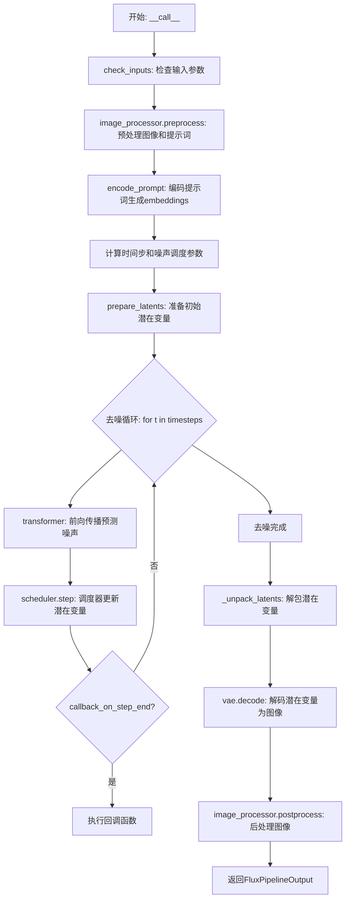

## 类结构

```
VisualClozeGenerationPipeline (主类)
├── DiffusionPipeline (基类)
├── FluxLoraLoaderMixin (LoRA加载混合)
├── FromSingleFileMixin (单文件加载混合)
└── TextualInversionLoaderMixin (文本反转混合)
```

## 全局变量及字段


### `logger`
    
模块级日志记录器

类型：`logging.Logger`
    


### `EXAMPLE_DOC_STRING`
    
示例文档字符串，包含使用说明和代码示例

类型：`str`
    


### `XLA_AVAILABLE`
    
标识PyTorch XLA是否可用的布尔值

类型：`bool`
    


### `model_cpu_offload_seq`
    
模型CPU卸载顺序，指定text_encoder->text_encoder_2->transformer->vae

类型：`str`
    


### `_optional_components`
    
可选组件列表，用于管线配置

类型：`list`
    


### `_callback_tensor_inputs`
    
回调函数可接收的tensor输入列表，包含latents和prompt_embeds

类型：`list`
    


### `VisualClozeGenerationPipeline.vae`
    
变分自编码器模型，用于图像编码和解码

类型：`AutoencoderKL`
    


### `VisualClozeGenerationPipeline.text_encoder`
    
CLIP文本编码器，处理文本提示

类型：`CLIPTextModel`
    


### `VisualClozeGenerationPipeline.text_encoder_2`
    
T5文本编码器，处理长文本序列

类型：`T5EncoderModel`
    


### `VisualClozeGenerationPipeline.tokenizer`
    
CLIP分词器，用于文本分词

类型：`CLIPTokenizer`
    


### `VisualClozeGenerationPipeline.tokenizer_2`
    
T5快速分词器，用于文本分词

类型：`T5TokenizerFast`
    


### `VisualClozeGenerationPipeline.transformer`
    
Flux变换器模型，用于去噪潜在表示

类型：`FluxTransformer2DModel`
    


### `VisualClozeGenerationPipeline.scheduler`
    
Flow Match欧拉离散调度器，控制去噪过程

类型：`FlowMatchEulerDiscreteScheduler`
    


### `VisualClozeGenerationPipeline.resolution`
    
图像分辨率，默认384

类型：`int`
    


### `VisualClozeGenerationPipeline.vae_scale_factor`
    
VAE缩放因子，用于潜在空间计算

类型：`int`
    


### `VisualClozeGenerationPipeline.latent_channels`
    
潜在空间通道数

类型：`int`
    


### `VisualClozeGenerationPipeline.image_processor`
    
图像预处理器，处理输入图像和掩码

类型：`VisualClozeProcessor`
    


### `VisualClozeGenerationPipeline.tokenizer_max_length`
    
分词器最大长度，默认77

类型：`int`
    


### `VisualClozeGenerationPipeline.default_sample_size`
    
默认采样大小，用于生成

类型：`int`
    


### `VisualClozeGenerationPipeline.model_cpu_offload_seq`
    
CPU卸载顺序字符串

类型：`str`
    


### `VisualClozeGenerationPipeline._optional_components`
    
可选组件列表

类型：`list`
    


### `VisualClozeGenerationPipeline._callback_tensor_inputs`
    
回调张量输入列表

类型：`list`
    


### `VisualClozeGenerationPipeline._guidance_scale`
    
引导缩放因子，控制文本引导强度

类型：`float`
    


### `VisualClozeGenerationPipeline._joint_attention_kwargs`
    
联合注意力参数字典

类型：`dict`
    


### `VisualClozeGenerationPipeline._num_timesteps`
    
推理时间步数

类型：`int`
    


### `VisualClozeGenerationPipeline._interrupt`
    
中断标志，用于停止生成

类型：`bool`
    
    

## 全局函数及方法


### `VisualClozeGenerationPipeline._get_t5_prompt_embeds`

该方法使用 T5 文本编码器（`text_encoder_2`）将文本提示编码为高维嵌入向量，用于后续的图像生成过程。它处理单个或多个提示，进行标记化、截断检查、嵌入计算，并支持批量生成时的嵌入复制。

参数：

- `prompt`：`str | list[str]]`，输入的文本提示，可以是单个字符串或字符串列表
- `num_images_per_prompt`：`int`，默认为 1，每个提示生成的图像数量，用于复制嵌入
- `max_sequence_length`：`int`，默认为 512，T5 编码器的最大序列长度
- `device`：`torch.device | None`，计算设备，默认为执行设备
- `dtype`：`torch.dtype | None`，输出数据类型，默认为 text_encoder 的数据类型

返回值：`torch.Tensor`，形状为 `(batch_size * num_images_per_prompt, seq_len, hidden_dim)` 的 T5 提示嵌入张量

#### 流程图

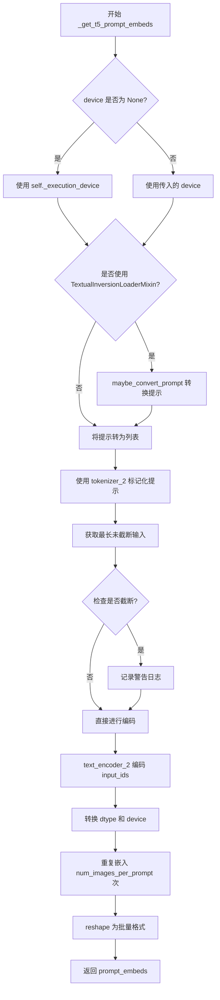

#### 带注释源码

```python
def _get_t5_prompt_embeds(
    self,
    prompt: str | list[str] = None,
    num_images_per_prompt: int = 1,
    max_sequence_length: int = 512,
    device: torch.device | None = None,
    dtype: torch.dtype | None = None,
):
    """
    使用 T5 文本编码器获取提示嵌入

    参数:
        prompt: 输入文本提示，单个字符串或字符串列表
        num_images_per_prompt: 每个提示生成的图像数量
        max_sequence_length: T5 最大序列长度
        device: 计算设备
        dtype: 输出数据类型
    """
    # 确定设备：优先使用传入的 device，否则使用执行设备
    device = device or self._execution_device
    # 确定数据类型：优先使用传入的 dtype，否则使用 text_encoder 的 dtype
    dtype = dtype or self.text_encoder.dtype

    # 将提示统一转为列表格式，便于批量处理
    prompt = [prompt] if isinstance(prompt, str) else prompt
    # 计算批量大小
    batch_size = len(prompt)

    # 如果是 TextualInversionLoaderMixin，进行提示转换（支持文本反转）
    if isinstance(self, TextualInversionLoaderMixin):
        prompt = self.maybe_convert_prompt(prompt, self.tokenizer_2)

    # 使用 T5 tokenizer 对提示进行标记化
    # padding="max_length": 填充到最大长度
    # truncation=True: 截断超过最大长度的序列
    text_inputs = self.tokenizer_2(
        prompt,
        padding="max_length",
        max_length=max_sequence_length,
        truncation=True,
        return_length=False,
        return_overflowing_tokens=False,
        return_tensors="pt",
    )
    # 获取标记化后的 input_ids
    text_input_ids = text_inputs.input_ids
    
    # 获取未截断的标记化结果用于检查
    untruncated_ids = self.tokenizer_2(prompt, padding="longest", return_tensors="pt").input_ids

    # 检查是否发生了截断，如果是则记录警告
    if untruncated_ids.shape[-1] >= text_input_ids.shape[-1] and not torch.equal(text_input_ids, untruncated_ids):
        # 解码被截断的部分并记录警告
        removed_text = self.tokenizer_2.batch_decode(untruncated_ids[:, self.tokenizer_max_length - 1 : -1])
        logger.warning(
            "The following part of your input was truncated because `max_sequence_length` is set to "
            f" {max_sequence_length} tokens: {removed_text}"
        )

    # 使用 T5 编码器获取文本嵌入
    # output_hidden_states=False: 只返回最后的隐藏状态
    prompt_embeds = self.text_encoder_2(text_input_ids.to(device), output_hidden_states=False)[0]

    # 获取编码器的 dtype 并转换嵌入到指定的数据类型和设备
    dtype = self.text_encoder_2.dtype
    prompt_embeds = prompt_embeds.to(dtype=dtype, device=device)

    # 获取序列长度
    _, seq_len, _ = prompt_embeds.shape

    # 为每个提示的每个生成复制文本嵌入和注意力掩码
    # 使用 mps 友好的方法（repeat 而不是 repeat_interleave）
    prompt_embeds = prompt_embeds.repeat(1, num_images_per_prompt, 1)
    # 重塑为批量格式: (batch_size * num_images_per_prompt, seq_len, hidden_dim)
    prompt_embeds = prompt_embeds.view(batch_size * num_images_per_prompt, seq_len, -1)

    return prompt_embeds
```


### `VisualClozeGenerationPipeline._get_clip_prompt_embeds`

该方法用于将文本提示（prompt）转换为 CLIP 文本编码器的嵌入向量（embeddings），支持批量处理和每提示多图生成。通过调用 CLIPTokenizer 对文本进行分词和编码，然后使用 CLIPTextModel 生成文本特征表示，最后返回池化后的提示嵌入供后续图像生成流程使用。

参数：

- `prompt`：`str | list[str]`，要编码的文本提示，可以是单个字符串或字符串列表
- `num_images_per_prompt`：`int = 1`，每个提示要生成的图像数量，用于复制嵌入向量
- `device`：`torch.device | None = None`，指定计算设备，默认为执行设备

返回值：`torch.FloatTensor`，返回形状为 `(batch_size * num_images_per_prompt, hidden_size)` 的文本嵌入张量，其中 `hidden_size` 是 CLIP 文本编码器的隐藏层维度

#### 流程图

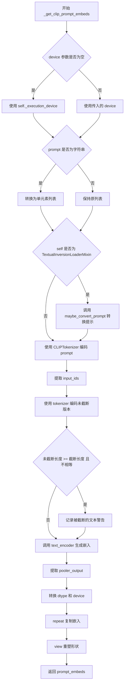

#### 带注释源码

```python
def _get_clip_prompt_embeds(
    self,
    prompt: str | list[str],
    num_images_per_prompt: int = 1,
    device: torch.device | None = None,
):
    # 确定设备：如果未提供 device，则使用管道的执行设备
    device = device or self._execution_device

    # 统一输入格式：将字符串转换为单元素列表，保持列表形式不变
    prompt = [prompt] if isinstance(prompt, str) else prompt
    # 获取批处理大小
    batch_size = len(prompt)

    # 如果混合了 TextualInversionLoaderMixin，应用文本反转提示转换
    # 这允许使用文本反转嵌入自定义文本编码器
    if isinstance(self, TextualInversionLoaderMixin):
        prompt = self.maybe_convert_prompt(prompt, self.tokenizer)

    # 使用 CLIPTokenizer 对提示进行分词和编码
    # padding="max_length": 填充到最大长度
    # max_length: 使用 tokenizer_max_length（通常为77）
    # truncation=True: 截断超过最大长度的序列
    text_inputs = self.tokenizer(
        prompt,
        padding="max_length",
        max_length=self.tokenizer_max_length,
        truncation=True,
        return_overflowing_tokens=False,
        return_length=False,
        return_tensors="pt",
    )

    # 提取编码后的文本输入 IDs
    text_input_ids = text_inputs.input_ids
    
    # 同时使用最长填充编码，用于检测是否发生了截断
    untruncated_ids = self.tokenizer(prompt, padding="longest", return_tensors="pt").input_ids
    
    # 检测截断情况：如果未截断的序列更长且与截断后的不同
    if untruncated_ids.shape[-1] >= text_input_ids.shape[-1] and not torch.equal(text_input_ids, untruncated_ids):
        # 解码被截断的部分用于日志记录
        removed_text = self.tokenizer.batch_decode(untruncated_ids[:, self.tokenizer_max_length - 1 : -1])
        logger.warning(
            "The following part of your input was truncated because CLIP can only handle sequences up to"
            f" {self.tokenizer_max_length} tokens: {removed_text}"
        )
    
    # 调用 CLIP 文本编码器生成文本嵌入
    # output_hidden_states=False: 仅返回最后一层的输出
    prompt_embeds = self.text_encoder(text_input_ids.to(device), output_hidden_states=False)

    # 使用 CLIPTextModel 的池化输出（pooler_output）
    # 这是 [CLS] 标记的输出，常用于分类任务
    prompt_embeds = prompt_embeds.pooler_output
    
    # 转换为与文本编码器相同的 dtype 和设备
    prompt_embeds = prompt_embeds.to(dtype=self.text_encoder.dtype, device=device)

    # 复制文本嵌入以匹配每个提示要生成的图像数量
    # 例如：如果 batch_size=2, num_images_per_prompt=3，则复制3次
    prompt_embeds = prompt_embeds.repeat(1, num_images_per_prompt)
    # 重塑为 (batch_size * num_images_per_prompt, hidden_size)
    prompt_embeds = prompt_embeds.view(batch_size * num_images_per_prompt, -1)

    return prompt_embeds
```


### `VisualClozeGenerationPipeline.encode_prompt`

该方法负责将布局提示（layout_prompt）、任务提示（task_prompt）和内容提示（content_prompt）编码为文本嵌入向量（prompt_embeds 和 pooled_prompt_embeds），供后续的图像生成 Transformer 模型使用。它通过调用 CLIP 和 T5 文本编码器将三种不同类型的提示合并处理，并支持 LoRA 权重调整。

参数：

- `layout_prompt`：`str | list[str]`，定义上下文示例数量和任务涉及图像数量的提示
- `task_prompt`：`str | list[str]`，定义任务意图的提示
- `content_prompt`：`str | list[str]`，定义要生成目标图像的内容或描述的提示
- `device`：`torch.device | None`，torch 设备，默认为执行设备
- `num_images_per_prompt`：`int`，每个提示生成的图像数量，默认为 1
- `prompt_embeds`：`torch.FloatTensor | None`，预生成的文本嵌入，可用于轻松调整文本输入
- `pooled_prompt_embeds`：`torch.FloatTensor | None`，预生成的池化文本嵌入
- `max_sequence_length`：`int`，最大序列长度，默认为 512
- `lora_scale`：`float | None`，要应用于文本编码器所有 LoRA 层的 LoRA 缩放因子

返回值：`tuple[torch.FloatTensor, torch.FloatTensor, torch.FloatTensor]`，返回 (prompt_embeds, pooled_prompt_embeds, text_ids) 元组，分别表示 T5 编码的提示嵌入、CLIP 池化的提示嵌入、以及用于文本的位置嵌入（形状为 [seq_len, 3]）

#### 流程图

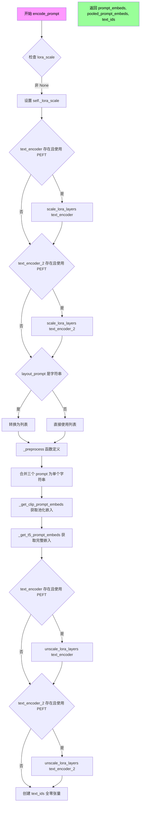

#### 带注释源码

```python
def encode_prompt(
    self,
    layout_prompt: str | list[str],
    task_prompt: str | list[str],
    content_prompt: str | list[str],
    device: torch.device | None = None,
    num_images_per_prompt: int = 1,
    prompt_embeds: torch.FloatTensor | None = None,
    pooled_prompt_embeds: torch.FloatTensor | None = None,
    max_sequence_length: int = 512,
    lora_scale: float | None = None,
):
    r"""
    编码提示函数，将三种不同类型的提示合并并编码为文本嵌入向量
    
    参数:
        layout_prompt: 定义上下文示例数量和图像数量的提示
        task_prompt: 定义任务意图的提示  
        content_prompt: 定义目标图像内容的提示
        device: torch 设备
        num_images_per_prompt: 每个提示生成的图像数量
        prompt_embeds: 预计算的文本嵌入（可选）
        pooled_prompt_embeds: 预计算的池化文本嵌入（可选）
        max_sequence_length: T5 编码器的最大序列长度
        lora_scale: LoRA 权重缩放因子（可选）
    """
    # 获取执行设备（如果未指定）
    device = device or self._execution_device

    # 设置 LoRA 缩放因子，以便 text encoder 的 monkey patched LoRA 函数可以正确访问
    if lora_scale is not None and isinstance(self, FluxLoraLoaderMixin):
        self._lora_scale = lora_scale

        # 动态调整 LoRA 缩放因子
        if self.text_encoder is not None and USE_PEFT_BACKEND:
            scale_lora_layers(self.text_encoder, lora_scale)
        if self.text_encoder_2 is not None and USE_PEFT_BACKEND:
            scale_lora_layers(self.text_encoder_2, lora_scale)

    # 如果是单个字符串，转换为列表以便批量处理
    if isinstance(layout_prompt, str):
        layout_prompt = [layout_prompt]
        task_prompt = [task_prompt]
        content_prompt = [content_prompt]

    def _preprocess(prompt, content=False):
        """预处理单个提示：如果是内容提示，添加特定前缀"""
        if prompt is not None:
            # 内容提示需要特殊前缀来标识最后一张图像
            return f"The last image of the last row depicts: {prompt}" if content else prompt
        else:
            return ""

    # 将三个提示合并为一个统一的提示字符串
    # 格式: "layout_prompt task_prompt content_prompt"
    prompt = [
        f"{_preprocess(layout_prompt[i])} {_preprocess(task_prompt[i])} {_preprocess(content_prompt[i], content=True)}".strip()
        for i in range(len(layout_prompt))
    ]
    
    # 获取 CLIP 池化嵌入（用于控制生成图像的整体风格）
    pooled_prompt_embeds = self._get_clip_prompt_embeds(
        prompt=prompt,
        device=device,
        num_images_per_prompt=num_images_per_prompt,
    )
    
    # 获取 T5 完整序列嵌入（用于细粒度的文本控制）
    prompt_embeds = self._get_t5_prompt_embeds(
        prompt=prompt,
        num_images_per_prompt=num_images_per_prompt,
        max_sequence_length=max_sequence_length,
        device=device,
    )

    # 如果使用了 LoRA，在处理完成后恢复原始权重
    if self.text_encoder is not None:
        if isinstance(self, FluxLoraLoaderMixin) and USE_PEFT_BACKEND:
            # 通过 unscale 恢复原始 LoRA 权重
            unscale_lora_layers(self.text_encoder, lora_scale)

    if self.text_encoder_2 is not None:
        if isinstance(self, FluxLoraLoaderMixin) and USE_PEFT_BACKEND:
            unscale_lora_layers(self.text_encoder_2, lora_scale)

    # 确定使用的数据类型（优先使用 text_encoder 的类型，否则使用 transformer 的类型）
    dtype = self.text_encoder.dtype if self.text_encoder is not None else self.transformer.dtype
    
    # 创建文本位置 ID 张量，用于 Transformer 中的位置编码
    # 形状: [seq_len, 3]，其中 3 代表 [batch_id, row, col] 位置信息
    text_ids = torch.zeros(prompt_embeds.shape[1], 3).to(device=device, dtype=dtype)

    # 返回: (T5 提示嵌入, CLIP 池化嵌入, 文本位置 ID)
    return prompt_embeds, pooled_prompt_embeds, text_ids
```


### `VisualClozeGenerationPipeline._encode_vae_image`

该方法负责将输入图像通过 VAE（变分自编码器）编码为潜在空间表示，并应用配置的缩放因子和偏移量进行归一化处理。

参数：

- `image`：`torch.Tensor`，待编码的输入图像张量
- `generator`：`torch.Generator`，用于生成随机数的 PyTorch 生成器，以确保编码过程的可重复性

返回值：`torch.Tensor`，编码并归一化后的图像潜在表示

#### 流程图

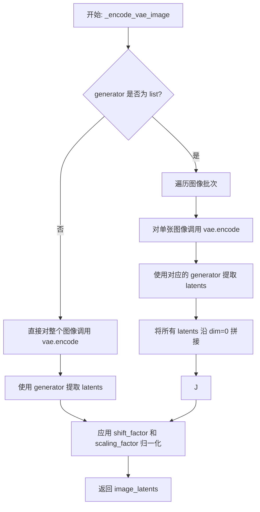

#### 带注释源码

```
def _encode_vae_image(self, image: torch.Tensor, generator: torch.Generator):
    # 判断 generator 是否为列表形式（对应多个生成器场景）
    if isinstance(generator, list):
        # 遍历图像批次中的每张图像
        image_latents = [
            # 对单张图像进行 VAE 编码，并使用对应的 generator 提取潜在表示
            retrieve_latents(self.vae.encode(image[i : i + 1]), generator=generator[i])
            for i in range(image.shape[0])
        ]
        # 将所有潜在表示沿批次维度拼接
        image_latents = torch.cat(image_latents, dim=0)
    else:
        # 单生成器场景：直接对整个图像进行编码和潜在表示提取
        image_latents = retrieve_latents(self.vae.encode(image), generator=generator)

    # 应用 VAE 配置中的移位因子和缩放因子进行归一化
    # 公式: (latents - shift_factor) * scaling_factor
    image_latents = (image_latents - self.vae.config.shift_factor) * self.vae.config.scaling_factor

    return image_latents
```


### `VisualClozeGenerationPipeline.get_timesteps`

该函数用于根据推理步骤数和强度（strength）参数计算并返回调度器的时间步数组，同时计算实际用于去噪的推理步骤数。它通过跳过初始的时间步来实现图像修复任务中的噪声调度控制。

参数：

- `num_inference_steps`：`int`，总推理步数，表示去噪过程总共需要多少个时间步
- `strength`：`float`，强度参数，用于控制图像修复中保留原始图像信息的比例，值在0到1之间
- `device`：`torch.device`，计算设备，用于指定张量存放的设备

返回值：`tuple[torch.Tensor, int]`，返回一个元组，包含调整后的时间步数组和实际用于去噪的推理步数

#### 流程图

```mermaid
flowchart TD
    A[开始 get_timesteps] --> B[计算 init_timestep = min(num_inference_steps * strength, num_inference_steps)]
    B --> C[计算 t_start = max(num_inference_steps - init_timestep, 0)]
    C --> D[从 scheduler.timesteps 中切片获取 timesteps = scheduler.timesteps[t_start * scheduler.order:]]
    D --> E{scheduler 是否有 set_begin_index 方法?}
    E -->|是| F[调用 scheduler.set_begin_index(t_start * scheduler.order) 设置起始索引]
    E -->|否| G[跳过此步骤]
    F --> H[返回 timesteps 和 num_inference_steps - t_start]
    G --> H
```

#### 带注释源码

```python
def get_timesteps(self, num_inference_steps, strength, device):
    """
    根据推理步数和强度参数计算时间步。
    
    该方法用于图像修复/图像到图像任务中，根据strength参数确定
    从原始时间步数组的哪个位置开始采样，以实现对原始图像信息的保留程度控制。
    
    参数:
        num_inference_steps: 总推理步数
        strength: 强度参数，值在0-1之间，越大表示保留的原始信息越少
        device: 计算设备
    
    返回:
        timesteps: 调整后的时间步数组
        actual_inference_steps: 实际用于去噪的步数
    """
    # 计算初始时间步数，基于推理步数和强度参数
    # 如果strength=1.0，则使用全部推理步数；如果strength较小，则使用较少的步数
    init_timestep = min(num_inference_steps * strength, num_inference_steps)

    # 计算起始索引，用于从调度器时间步数组中跳过前面的步数
    # 这样可以实现从中间时间步开始去噪，从而保留更多原始图像信息
    t_start = int(max(num_inference_steps - init_timestep, 0))
    
    # 从调度器的时间步数组中获取切片
    # 乘以scheduler.order是为了处理多步调度器的情况
    timesteps = self.scheduler.timesteps[t_start * self.scheduler.order :]
    
    # 如果调度器支持设置起始索引，则设置它
    # 这对于某些调度器的内部状态管理是必要的
    if hasattr(self.scheduler, "set_begin_index"):
        self.scheduler.set_begin_index(t_start * self.scheduler.order)

    # 返回调整后的时间步数组和实际推理步数
    # num_inference_steps - t_start 表示实际用于去噪的步数
    return timesteps, num_inference_steps - t_start
```


### `VisualClozeGenerationPipeline.check_inputs`

该方法用于验证 VisualClozeGenerationPipeline 的输入参数有效性，确保 task_prompt、content_prompt、prompt_embeds 等参数类型正确且一致，并检查 callback_on_step_end_tensor_inputs 和 max_sequence_length 等可选参数是否符合要求。如果验证失败，会抛出详细的 ValueError 异常。

参数：

- `self`：`VisualClozeGenerationPipeline`，VisualCloze 管道实例
- `image`：`Any`，输入的图像数据，用于验证图像样本结构
- `task_prompt`：`str | list[str] | None`，任务提示，定义任务意图
- `content_prompt`：`str | list[str] | None`，内容提示，定义生成图像的内容或标题
- `prompt_embeds`：`torch.FloatTensor | None`，预生成的文本嵌入，用于自定义文本输入
- `pooled_prompt_embeds`：`torch.FloatTensor | None`，预生成的池化文本嵌入
- `callback_on_step_end_tensor_inputs`：`list[str] | None`，每步结束时回调的张量输入列表
- `max_sequence_length`：`int | None`，最大序列长度，默认为 512

返回值：`None`，该方法仅执行验证逻辑，验证通过则隐式返回 None，验证失败则抛出 ValueError 异常

#### 流程图

```mermaid
flowchart TD
    A[开始 check_inputs] --> B{检查 callback_on_step_end_tensor_inputs}
    B -->|无效| C[抛出 ValueError: 无效的 tensor inputs]
    B -->|有效| D{检查 task_prompt + content_prompt 与 prompt_embeds}
    D -->|同时提供| E[抛出 ValueError: 不能同时提供]
    D -->|都不是| F[抛出 ValueError: 至少提供一个]
    
    F --> G{检查 task_prompt 是否为 None}
    G -->|是| H[抛出 ValueError: task_prompt 缺失]
    G -->|否| I{检查 task_prompt 类型}
    I -->|不是 str/list| J[抛出 ValueError: task_prompt 类型错误]
    I -->|是| K{检查 content_prompt 类型}
    
    K -->|不是 str/list| L[抛出 ValueError: content_prompt 类型错误]
    K -->|是| M{检查是否同时为 list}
    
    M -->|否| N{检查 content_prompt 不为 None}
    N -->|不为 None| O[抛出 ValueError: 类型不一致]
    N -->|为 None| P[结束验证]
    
    M -->|是| Q{检查长度是否相等}
    Q -->|不等| R[抛出 ValueError: 长度不一致]
    Q -->|相等| S[检查 image 样本结构]
    
    S --> T{样本是 2D 列表}
    T -->|否| U[抛出 ValueError: 样本结构错误]
    T -->|是| V{检查每行图像数量一致}
    V -->|不一致| W[抛出 ValueError: 图像数量不一致]
    V -->|一致| X{检查 query 是否有 target]
    
    X -->|没有 None| Y[抛出 ValueError: query 缺少 target]
    X -->|有 None| Z[检查 in-context 是否有缺失图像]
    
    Z -->|有缺失| AA[抛出 ValueError: in-context 缺失图像]
    Z -->|无缺失| AB{检查 prompt_embeds 与 pooled_prompt_embeds}
    
    AB -->|只提供前者| AC[抛出 ValueError: 需要同时提供]
    AB -->|都提供或都不提供| AD{检查 max_sequence_length]
    
    AD -->|超过 512| AE[抛出 ValueError: 超过最大长度]
    AD -->|未超过| P
```

#### 带注释源码

```python
def check_inputs(
    self,
    image,
    task_prompt,
    content_prompt,
    prompt_embeds=None,
    pooled_prompt_embeds=None,
    callback_on_step_end_tensor_inputs=None,
    max_sequence_length=None,
):
    # 验证 callback_on_step_end_tensor_inputs 是否为有效的张量输入列表
    if callback_on_step_end_tensor_inputs is not None and not all(
        k in self._callback_tensor_inputs for k in callback_on_step_end_tensor_inputs
    ):
        raise ValueError(
            f"`callback_on_step_end_tensor_inputs` has to be in {self._callback_tensor_inputs}, but found {[k for k in callback_on_step_end_tensor_inputs if k not in self._callback_tensor_inputs]}"
        )

    # 验证 prompt 输入：不能同时提供 task_prompt + content_prompt 和 prompt_embeds
    if (task_prompt is not None or content_prompt is not None) and prompt_embeds is not None:
        raise ValueError("Cannot provide both text `task_prompt` + `content_prompt` and `prompt_embeds`. ")

    # 验证必须至少提供 task_prompt + content_prompt 或预计算的 prompt_embeds 之一
    if task_prompt is None and content_prompt is None and prompt_embeds is None:
        raise ValueError("Must provide either `task_prompt` + `content_prompt` or pre-computed `prompt_embeds`. ")

    # 验证 task_prompt 不能为 None
    if task_prompt is None:
        raise ValueError("`task_prompt` is missing.")

    # 验证 task_prompt 的类型必须是 str 或 list
    if task_prompt is not None and not isinstance(task_prompt, (str, list)):
        raise ValueError(f"`task_prompt` must be str or list, got {type(task_prompt)}")

    # 验证 content_prompt 的类型必须是 str 或 list
    if content_prompt is not None and not isinstance(content_prompt, (str, list)):
        raise ValueError(f"`content_prompt` must be str or list, got {type(content_prompt)}")

    # 如果 task_prompt 或 content_prompt 是 list，则两者都必须是 list 且长度相同
    if isinstance(task_prompt, list) or isinstance(content_prompt, list):
        # 两者必须同时为 list 或同时为 str/None
        if not isinstance(task_prompt, list) or not isinstance(content_prompt, list):
            raise ValueError(
                f"`task_prompt` and `content_prompt` must both be lists, or both be of type str or None, "
                f"got {type(task_prompt)} and {type(content_prompt)}"
            )
        # 长度必须相等
        if len(content_prompt) != len(task_prompt):
            raise ValueError("`task_prompt` and `content_prompt` must have the same length whe they are lists.")

        # 验证图像样本结构：每个样本必须是 2D 图像列表
        for sample in image:
            if not isinstance(sample, list) or not isinstance(sample[0], list):
                raise ValueError("Each sample in the batch must have a 2D list of images.")
            # 每行图像数量必须一致
            if len({len(row) for row in sample}) != 1:
                raise ValueError("Each in-context example and query should contain the same number of images.")
            # query 的最后一行必须有 None（表示没有 target）
            if not any(img is None for img in sample[-1]):
                raise ValueError("There are no targets in the query, which should be represented as None.")
            # in-context 示例中不能有缺失图像
            for row in sample[:-1]:
                if any(img is None for img in row):
                    raise ValueError("Images are missing in in-context examples.")

    # 验证嵌入：如果提供 prompt_embeds，必须也提供 pooled_prompt_embeds
    if prompt_embeds is not None and pooled_prompt_embeds is None:
        raise ValueError(
            "If `prompt_embeds` are provided, `pooled_prompt_embeds` also have to be passed. Make sure to generate `pooled_prompt_embeds` from the same text encoder that was used to generate `prompt_embeds`."
        )

    # 验证序列长度不能超过 512
    if max_sequence_length is not None and max_sequence_length > 512:
        raise ValueError(f"max_sequence_length cannot exceed 512, got {max_sequence_length}")
```


### `VisualClozeGenerationPipeline._prepare_latent_image_ids`

为 Visual Cloze 图像生成管道准备潜在图像 ID，用于标识图像中每个补丁块的位置信息和批次索引。该方法将输入图像分割成补丁快，并为每个补丁生成唯一的标识符（包含图像索引和二维位置坐标），以便在 Transformer 模型中进行自注意力计算时能够区分不同位置的补丁。

参数：

- `image`：`list[torch.Tensor]`，输入图像列表，每个元素为包含单张图像的 4D 张量（1 x C x H x W）
- `vae_scale_factor`：`int`，VAE 的缩放因子，用于计算每个方向的补丁数量
- `device`：`torch.device`，张量存放的设备
- `dtype`：`torch.dtype`，张量的数据类型

返回值：`torch.Tensor`，形状为 (总补丁数, 3) 的张量，每行包含 [图像索引, 垂直补丁索引, 水平补丁索引]

#### 流程图

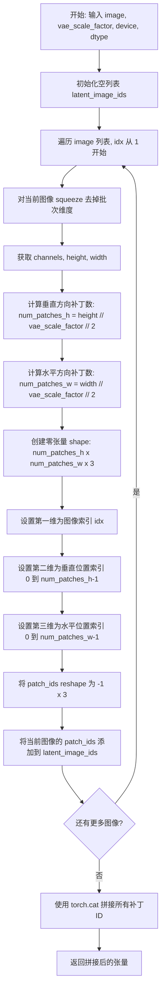

#### 带注释源码

```
@staticmethod
def _prepare_latent_image_ids(image, vae_scale_factor, device, dtype):
    """
    为图像生成潜在补丁ID，用于标识每个补丁在图像中的位置。
    
    Args:
        image: 输入图像列表，每个元素为 (1, C, H, W) 形状的张量
        vae_scale_factor: VAE 缩放因子，用于计算补丁数量
        device: 计算设备
        dtype: 数据类型
    
    Returns:
        形状为 (总补丁数, 3) 的张量，每行 [图像索引, y坐标, x坐标]
    """
    # 用于存储所有图像的补丁ID
    latent_image_ids = []
    
    # 遍历每张图像，idx 从 1 开始编号
    for idx, img in enumerate(image, start=1):
        # 移除批次维度，从 (1, C, H, W) 变为 (C, H, W)
        img = img.squeeze(0)
        
        # 获取图像的通道数、高度和宽度
        channels, height, width = img.shape
        
        # 计算垂直和水平方向的补丁数量
        # 每个补丁大小为 vae_scale_factor * 2
        num_patches_h = height // vae_scale_factor // 2
        num_patches_w = width // vae_scale_factor // 2
        
        # 创建补丁ID张量，形状: (num_patches_h, num_patches_w, 3)
        # 第三维存储: [图像索引, 垂直位置, 水平位置]
        patch_ids = torch.zeros(num_patches_h, num_patches_w, 3, device=device, dtype=dtype)
        
        # 第一维：当前图像的索引（从1开始）
        patch_ids[..., 0] = idx
        
        # 第二维：垂直方向的补丁位置索引
        # torch.arange 创建 [0, 1, 2, ...] 向量，[:, None] 转为列向量
        patch_ids[..., 1] = torch.arange(num_patches_h, device=device, dtype=dtype)[:, None]
        
        # 第三维：水平方向的补丁位置索引
        # [None, :] 转为行向量
        patch_ids[..., 2] = torch.arange(num_patches_w, device=device, dtype=dtype)[None, :]
        
        # 将二维补丁网格展平为一维，每个补丁一行
        patch_ids = patch_ids.reshape(-1, 3)
        
        # 将当前图像的所有补丁ID添加到列表
        latent_image_ids.append(patch_ids)
    
    # 在第零维（行）拼接所有图像的补丁ID
    return torch.cat(latent_image_ids, dim=0)
```


### `VisualClozeGenerationPipeline._pack_latents`

该函数是一个静态方法，用于将VAE编码后的潜在表示张量进行"打包"（packing）操作。它将潜在张量重新整形为2x2的patch形式，以便于FluxTransformer2DModel进行处理。这是Flux pipeline中的标准操作，通过将每个2x2区域视为一个token来提高计算效率。

参数：

- `latents`：`torch.Tensor`，输入的VAE潜在表示张量，形状为 `(batch_size, num_channels_latents, height, width)`
- `batch_size`：`int`，批次大小，用于维持批量维度
- `num_channels_latents`：`int`，潜在表示的通道数
- `height`：`int`，潜在表示的空间高度（以像素为单位）
- `width`：`int`，潜在表示的空间宽度（以像素为单位）

返回值：`torch.Tensor`，打包后的潜在表示张量，形状为 `(batch_size, (height // 2) * (width // 2), num_channels_latents * 4)`。每个2x2的patch被打包为一个token，通道数扩展为原来的4倍。

#### 流程图

```mermaid
flowchart TD
    A[输入 latents 张量<br/>shape: (batch, channels, H, W)] --> B[view 重塑<br/>shape: (batch, channels, H//2, 2, W//2, 2)]
    B --> C[permute 维度重排<br/>shape: (batch, H//2, W//2, channels, 2, 2)]
    C --> D[reshape 打包<br/>shape: (batch, H//2 * W//2, channels * 4)]
    D --> E[返回打包后的 latents]
```

#### 带注释源码

```python
@staticmethod
# Copied from diffusers.pipelines.flux.pipeline_flux.FluxPipeline._pack_latents
def _pack_latents(latents, batch_size, num_channels_latents, height, width):
    """
    将VAE潜在表示打包为2x2 patches格式，以便于Transformer处理。
    
    Flux架构将潜在空间划分为2x2的patches，每个patch被视为一个token。
    这种处理方式类似于Vision Transformer (ViT)中的图像patches，
    允许模型以序列方式处理空间信息。
    
    参数:
        latents: 输入的潜在表示张量，形状为 (batch_size, num_channels_latents, height, width)
        batch_size: 批次大小
        num_channels_latents: 潜在通道数
        height: 潜在高度
        width: 潜在宽度
    
    返回:
        打包后的张量，形状为 (batch_size, (height//2)*(width//2), num_channels_latents*4)
    """
    # 第一步：将张量重塑为 (batch, channels, H//2, 2, W//2, 2)
    # 这里将height和width维度各划分为2个patch，每个patch大小为2x2
    latents = latents.view(batch_size, num_channels_latents, height // 2, 2, width // 2, 2)
    
    # 第二步：permute 维度重排
    # 将形状从 (batch, channels, H//2, 2, W//2, 2) 
    # 变为 (batch, H//2, W//2, channels, 2, 2)
    # 这样可以让空间维度(H//2, W//2)移到前面，便于后续flatten
    latents = latents.permute(0, 2, 4, 1, 3, 5)
    
    # 第三步：reshape 打包
    # 将 2x2 的patch展平为单个token
    # 最终形状: (batch, H//2*W//2, channels*4)
    # 其中每个token包含原2x2区域的所有通道信息 (2*2=4)
    latents = latents.reshape(batch_size, (height // 2) * (width // 2), num_channels_latents * 4)

    return latents
```


### `VisualClozeGenerationPipeline._unpack_latents`

该函数是一个静态方法，用于将已打包（packed）的latent张量解包（unpack）回原始的图像 latent 表示。它是 `_pack_latents` 的逆操作，通过遍历每个样本的尺寸信息，从压缩的latent序列中重建每个图像的完整latent张量。

参数：

- `latents`：`torch.Tensor`，打包后的latent张量，形状为 (batch_size, num_patches, channels)，其中 num_patches 是所有图像patch数量的总和
- `sizes`：列表，每个元素代表一个样本的尺寸信息，结构为 `[[(height, width), ...], ...]`，用于指定每个图像的尺寸
- `vae_scale_factor`：`int`，VAE的缩放因子，用于将像素尺寸转换为latent尺寸

返回值：`list[torch.Tensor]`，解包后的latent张量列表，每个元素对应一个图像的latent，形状为 (batch_size, channels // 4, height, width)

#### 流程图

```mermaid
flowchart TD
    A[开始] --> B[获取 latents 形状: batch_size, num_patches, channels]
    B --> C[初始化 start = 0, unpacked_latents = []]
    C --> D{遍历 sizes 中的每个样本 i}
    D -->|for each i| E[获取当前样本尺寸 cur_size = sizes[i]]
    E --> F[计算 height = cur_size[0][0] // vae_scale_factor]
    F --> G[计算 width = sum[size[1] for size in cur_size] // vae_scale_factor]
    G --> H[计算 end = start + (height * width) // 4]
    H --> I[提取当前图像的latents: cur_latents = latents[:, start:end]]
    I --> J[reshape: view(batch_size, height//2, width//2, channels//4, 2, 2)]
    J --> K[permute: (0, 3, 1, 4, 2, 5) 重新排列维度]
    K --> L[reshape: 恢复为 (batch_size, channels//4, height, width)]
    L --> M[将 cur_latents 添加到 unpacked_latents 列表]
    M --> N[start = end]
    N --> D
    D -->|遍历完成| O[返回 unpacked_latents 列表]
    O --> P[结束]
```

#### 带注释源码

```python
@staticmethod
def _unpack_latents(latents, sizes, vae_scale_factor):
    """
    将打包的latent张量解包为原始图像latent表示。
    
    这是 _pack_latents 的逆操作，将压缩的序列形式的latent
    恢复为每个图像独立的latent张量。
    
    参数:
        latents: 打包后的latent张量，形状 (batch_size, num_patches, channels)
        sizes: 图像尺寸列表，用于确定每个图像的patch数量
        vae_scale_factor: VAE缩放因子，用于尺寸转换
    
    返回:
        解包后的latent张量列表
    """
    # 获取输入latents的基本维度信息
    batch_size, num_patches, channels = latents.shape

    # 初始化索引指针和解包结果列表
    start = 0
    unpacked_latents = []
    
    # 遍历每个样本的尺寸信息
    for i in range(len(sizes)):
        cur_size = sizes[i]  # 当前样本的尺寸信息
        
        # 计算当前图像在latent空间的高度和宽度
        # height 取第一个尺寸的高度，除以 vae_scale_factor
        height = cur_size[0][0] // vae_scale_factor
        # width 是所有尺寸宽度的总和，除以 vae_scale_factor
        width = sum([size[1] for size in cur_size]) // vae_scale_factor

        # 计算当前图像在序列中的结束位置
        # 每个图像的patch数量 = (height * width) // 4 (因为2x2的patch)
        end = start + (height * width) // 4

        # 从打包的latents中提取当前图像的部分
        cur_latents = latents[:, start:end]
        
        # 执行 _pack_latents 的逆操作：
        # 1. 将序列reshape回 2x2 patch 排列的形式
        # 从 (batch, patches, channels) -> (batch, h//2, w//2, c//4, 2, 2)
        cur_latents = cur_latents.view(batch_size, height // 2, width // 2, channels // 4, 2, 2)
        
        # 2. 置换维度以恢复正确的空间排列
        # (batch, h//2, w//2, c//4, 2, 2) -> (batch, c//4, h//2, 2, w//2, 2)
        cur_latents = cur_latents.permute(0, 3, 1, 4, 2, 5)
        
        # 3. 最终reshape为标准图像latent格式 (batch, c//4, h, w)
        cur_latents = cur_latents.reshape(batch_size, channels // (2 * 2), height, width)

        # 将当前图像的latent添加到结果列表
        unpacked_latents.append(cur_latents)

        # 更新起始索引，为下一个图像做准备
        start = end

    return unpacked_latents
```


### `VisualClozeGenerationPipeline.enable_vae_slicing`

该方法用于启用VAE切片解码功能。当启用此选项时，VAE会将输入张量分割成多个切片分步计算解码，从而节省内存并支持更大的批处理大小。需要注意的是，此方法已被弃用，将在0.40.0版本中移除，建议直接使用`pipe.vae.enable_slicing()`。

参数：

- `self`：`VisualClozeGenerationPipeline` 实例本身，隐含参数，无需显式传递

返回值：`None`，无返回值（该方法直接修改对象状态）

#### 流程图

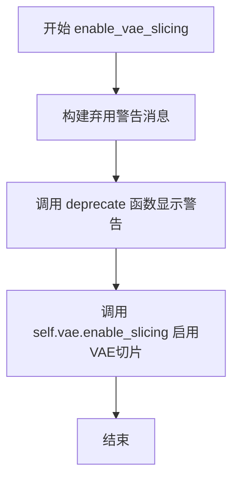

#### 带注释源码

```python
def enable_vae_slicing(self):
    r"""
    Enable sliced VAE decoding. When this option is enabled, the VAE will split the input tensor in slices to
    compute decoding in several steps. This is useful to save some memory and allow larger batch sizes.
    """
    # 构建弃用警告消息，包含类名以提供上下文信息
    depr_message = f"Calling `enable_vae_slicing()` on a `{self.__class__.__name__}` is deprecated and this method will be removed in a future version. Please use `pipe.vae.enable_slicing()`."
    
    # 调用 deprecate 函数记录弃用信息，版本号为 0.40.0
    deprecate(
        "enable_vae_slicing",
        "0.40.0",
        depr_message,
    )
    
    # 调用 VAE 模型的 enable_slicing 方法，启用切片解码功能
    # 这允许 VAE 分块处理输入，从而减少峰值内存使用
    self.vae.enable_slicing()
```


### `VisualClozeGenerationPipeline.disable_vae_slicing`

禁用 VAE 分片解码。如果之前启用了 `enable_vae_slicing`，则此方法将使解码回到单步计算。

参数：无（仅包含隐式参数 `self`）

返回值：`None`，无返回值（方法执行副作用）

#### 流程图

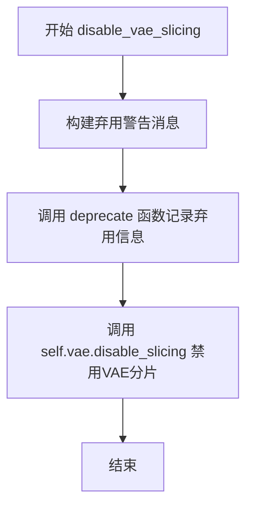

#### 带注释源码

```python
def disable_vae_slicing(self):
    r"""
    Disable sliced VAE decoding. If `enable_vae_slicing` was previously enabled, this method will go back to
    computing decoding in one step.
    """
    # 构建弃用警告消息，提示用户该方法将在未来版本中移除
    # 建议使用 pipe.vae.disable_slicing() 代替
    depr_message = f"Calling `disable_vae_slicing()` on a `{self.__class__.__name__}` is deprecated and this method will be removed in a future version. Please use `pipe.vae.disable_slicing()`."
    
    # 调用 deprecate 函数记录弃用信息
    # 参数: 函数名, 弃用版本号, 弃用消息
    deprecate(
        "disable_vae_slicing",
        "0.40.0",
        depr_message,
    )
    
    # 调用 VAE 对象的 disable_slicing 方法
    # 实际执行禁用 VAE 分片解码的操作
    self.vae.disable_slicing()
```


### `VisualClozeGenerationPipeline.enable_vae_tiling`

启用瓦片式VAE解码，当启用此选项时，VAE会将输入张量分割成瓦片来分步计算解码和编码，以节省大量内存并允许处理更大的图像。

参数：
- 无

返回值：`None`，无返回值描述

#### 流程图

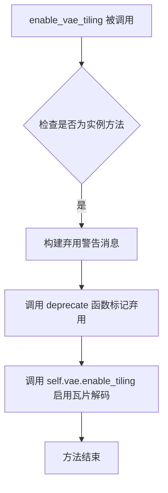

#### 带注释源码

```python
def enable_vae_tiling(self):
    r"""
    Enable tiled VAE decoding. When this option is enabled, the VAE will split the input tensor into tiles to
    compute decoding and encoding in several steps. This is useful for saving a large amount of memory and to allow
    processing larger images.
    """
    # 构建弃用警告消息，提示用户该方法将在未来版本中被移除
    depr_message = f"Calling `enable_vae_tiling()` on a `{self.__class__.__name__}` is deprecated and this method will be removed in a future version. Please use `pipe.vae.enable_tiling()`."
    
    # 调用 deprecate 函数记录弃用信息，包括方法名、弃用版本和警告消息
    deprecate(
        "enable_vae_tiling",
        "0.40.0",
        depr_message,
    )
    
    # 委托给 VAE 模型的 enable_tiling 方法来实际启用瓦片解码功能
    self.vae.enable_tiling()
```


### `VisualClozeGenerationPipeline.disable_vae_tiling`

禁用瓦片 VAE 解码。如果之前启用了 `enable_vae_tiling`，此方法将返回到单步计算解码。

参数：

- 无（仅包含 `self` 隐式参数）

返回值：`None`，无返回值（该方法直接操作 VAE 对象的内部状态）

#### 流程图

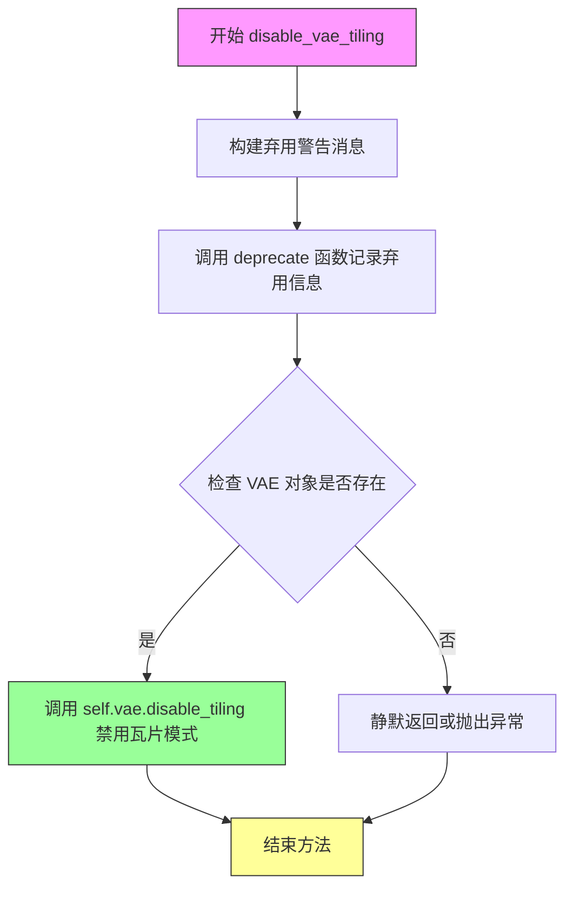

#### 带注释源码

```python
def disable_vae_tiling(self):
    r"""
    Disable tiled VAE decoding. If `enable_vae_tiling` was previously enabled, this method will go back to
    computing decoding in one step.
    """
    # 构建弃用警告消息，提示用户该方法已弃用，应使用 pipe.vae.disable_tiling() 代替
    depr_message = f"Calling `disable_vae_tiling()` on a `{self.__class__.__name__}` is deprecated and this method will be removed in a future version. Please use `pipe.vae.disable_tiling()`."
    
    # 调用 deprecate 函数记录弃用信息，在未来版本中将移除此方法
    deprecate(
        "disable_vae_tiling",      # 被弃用的方法名称
        "0.40.0",                   # 弃用版本号
        depr_message,               # 弃用警告消息
    )
    
    # 委托给 VAE 对象本身禁用瓦片解码功能
    # 这是实际的业务逻辑，禁用 VAE 的瓦片模式
    self.vae.disable_tiling()
```


### `VisualClozeGenerationPipeline._prepare_latents`

准备用于单批次图像的潜在表示，将图像和掩码编码为潜在空间，并进行分块处理以适配 Flux Transformer 的输入格式。

参数：

- `self`：`VisualClozeGenerationPipeline` 实例本身
- `image`：`List[torch.Tensor]`，待处理的图像列表，每张图像为预处理后的张量
- `mask`：`List[torch.Tensor]`，与图像对应的掩码列表
- `gen`：`torch.Generator`，用于潜在编码的随机数生成器
- `vae_scale_factor`：`int`，VAE 的缩放因子，用于计算潜在空间的尺寸
- `device`：`torch.device`，目标计算设备
- `dtype`：`torch.dtype`，目标数据类型

返回值：`Tuple[torch.Tensor, torch.Tensor, torch.Tensor, torch.Tensor]`，返回一个包含四个元素的元组：
- `image_latent`：`torch.Tensor`，编码后的图像潜在表示（已分块打包）
- `masked_image_latent`：`torch.Tensor`，掩码图像的潜在表示（已分块打包）
- `mask`：`torch.Tensor`，处理后的掩码张量（已分块打包）
- `latent_image_ids`：`torch.Tensor`，潜在空间的图像 ID，用于标识不同图像块

#### 流程图

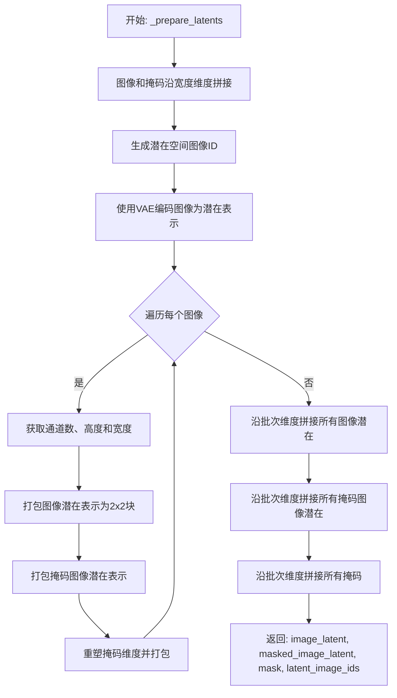

#### 带注释源码

```python
@staticmethod
def _prepare_latents(self, image, mask, gen, vae_scale_factor, device, dtype):
    """Helper function to prepare latents for a single batch."""
    # 步骤1: 沿宽度维度拼接图像和掩码列表中的元素
    # 这将多个图像/掩码沿宽度方向合并为一个连续张量
    image = [torch.cat(img, dim=3).to(device=device, dtype=dtype) for img in image]
    mask = [torch.cat(m, dim=3).to(device=device, dtype=dtype) for m in mask]

    # 步骤2: 生成潜在空间图像ID
    # 这些ID用于在后续处理中标识不同的图像块
    latent_image_ids = self._prepare_latent_image_ids(image, vae_scale_factor, device, dtype)

    # 步骤3: 使用VAE编码器将图像编码为潜在表示
    # 这是将原始像素空间转换为潜在空间的关键步骤
    image_latent = [self._encode_vae_image(img, gen) for img in image]
    # 复制一份作为掩码图像的潜在表示（初始为原始图像的编码）
    masked_image_latent = [img.clone() for img in image_latent]

    # 步骤4: 遍历每个图像/掩码对，进行分块处理
    for i in range(len(image_latent)):
        # 4.1 获取当前图像潜在表示的形状信息
        num_channels_latents, height, width = image_latent[i].shape[1:]
        
        # 4.2 使用_pack_latents将潜在表示打包为2x2的块结构
        # 这符合Flux Transformer的输入格式要求
        image_latent[i] = self._pack_latents(image_latent[i], 1, num_channels_latents, height, width)
        masked_image_latent[i] = self._pack_latents(masked_image_latent[i], 1, num_channels_latents, height, width)

        # 4.3 处理掩码张量：重塑维度以适配分块结构
        num_channels_latents, height, width = mask[i].shape[1:]
        # 调整掩码张量的形状以进行分块处理
        mask[i] = mask[i].view(
            1,
            num_channels_latents,
            height // vae_scale_factor,
            vae_scale_factor,
            width // vae_scale_factor,
            vae_scale_factor,
        )
        # 重新排列维度顺序以正确对齐块
        mask[i] = mask[i].permute(0, 1, 3, 5, 2, 4)
        # 展平以匹配打包后的格式
        mask[i] = mask[i].reshape(
            1,
            num_channels_latents * (vae_scale_factor**2),
            height // vae_scale_factor,
            width // vae_scale_factor,
        )
        # 打包处理后的掩码
        mask[i] = self._pack_latents(
            mask[i],
            1,
            num_channels_latents * (vae_scale_factor**2),
            height // vae_scale_factor,
            width // vae_scale_factor,
        )

    # 步骤5: 沿批次维度（dim=1）拼接所有处理后的结果
    # 将多个样本的潜在表示合并为一个批次
    image_latent = torch.cat(image_latent, dim=1)
    masked_image_latent = torch.cat(masked_image_latent, dim=1)
    mask = torch.cat(mask, dim=1)

    # 返回: 图像潜在、掩码图像潜在、掩码和潜在图像ID
    return image_latent, masked_image_latent, mask, latent_image_ids
```


### `VisualClozeGenerationPipeline.prepare_latents`

该方法负责为视觉填充任务准备latent变量，包括编码输入图像、处理掩码、生成噪声、扩展批次以及组合掩码latents，最终返回用于去噪过程的latent变量、掩码图像latents和位置ID。

参数：

- `input_image`：`list`，输入图像列表，每个元素对应一个批次样本
- `input_mask`：`list`，输入掩码列表，每个元素对应一个批次样本
- `timestep`：`torch.Tensor`，去噪过程的时间步，用于噪声调度
- `batch_size`：`int`，期望的批次大小，用于批次扩展
- `dtype`：`torch.dtype`，指定latents的数据类型
- `device`：`torch.device`，指定计算设备
- `generator`：`torch.Generator` 或 `list[torch.Generator]`，随机数生成器，用于生成确定性噪声
- `vae_scale_factor`：`int`，VAE的缩放因子，用于调整latent空间尺寸

返回值：`tuple`，包含三个元素 - (latents, masked_image_latents, latent_image_ids[0])，分别为添加噪声后的latent变量、包含掩码信息的latent变量、以及图像块的位置编码ID

#### 流程图

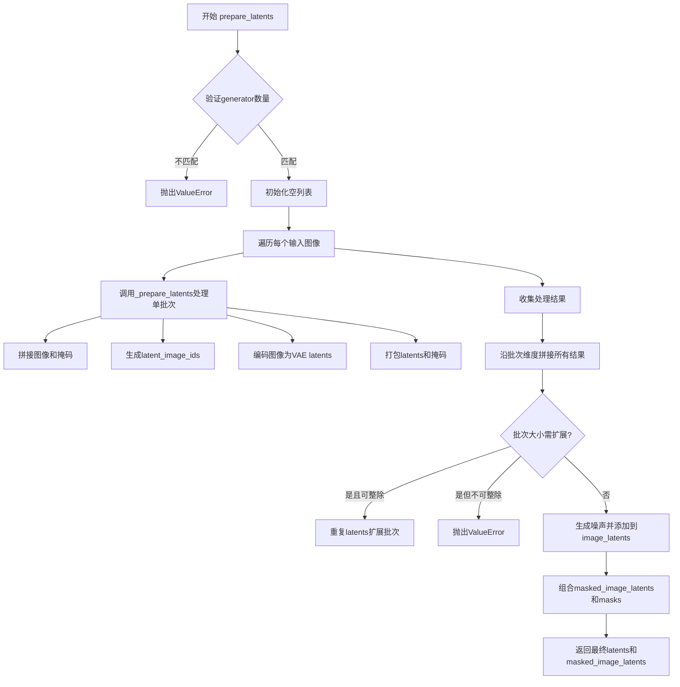

#### 带注释源码

```python
def prepare_latents(
    self,
    input_image,
    input_mask,
    timestep,
    batch_size,
    dtype,
    device,
    generator,
    vae_scale_factor,
):
    # 检查当传入多个generator时，其数量是否与批次大小匹配
    if isinstance(generator, list) and len(generator) != batch_size:
        raise ValueError(
            f"You have passed a list of generators of length {len(generator)}, but requested an effective batch"
            f" size of {batch_size}. Make sure the batch size matches the length of the generators."
        )

    # 初始化用于存储各批次处理结果的列表
    masked_image_latents = []
    image_latents = []
    masks = []
    latent_image_ids = []

    # 遍历每个输入图像样本
    for i in range(len(input_image)):
        # 调用内部方法_prepare_latents处理单个样本
        # 根据generator类型选择合适的generator（单个或列表中的第i个）
        _image_latent, _masked_image_latent, _mask, _latent_image_ids = self._prepare_latents(
            input_image[i],
            input_mask[i],
            generator if isinstance(generator, torch.Generator) else generator[i],
            vae_scale_factor,
            device,
            dtype,
        )
        # 将处理结果添加到对应列表中
        masked_image_latents.append(_masked_image_latent)
        image_latents.append(_image_latent)
        masks.append(_mask)
        latent_image_ids.append(_latent_image_ids)

    # 将所有批次的latent沿批次维度（dim=0）拼接
    masked_image_latents = torch.cat(masked_image_latents, dim=0)
    image_latents = torch.cat(image_latents, dim=0)
    masks = torch.cat(masks, dim=0)

    # 处理批次大小扩展情况
    if batch_size > masked_image_latents.shape[0]:
        if batch_size % masked_image_latents.shape[0] == 0:
            # 计算需要重复的倍数并扩展
            additional_image_per_prompt = batch_size // masked_image_latents.shape[0]
            masked_image_latents = torch.cat([masked_image_latents] * additional_image_per_prompt, dim=0)
            image_latents = torch.cat([image_latents] * additional_image_per_prompt, dim=0)
            masks = torch.cat([masks] * additional_image_per_prompt, dim=0)
        else:
            raise ValueError(
                f"Cannot expand batch size from {masked_image_latents.shape[0]} to {batch_size}. "
                "Batch sizes must be multiples of each other."
            )

    # 使用randn_tensor生成与图像latents形状相同的随机噪声
    noises = randn_tensor(image_latents.shape, generator=generator, device=device, dtype=dtype)
    # 根据scheduler的噪声缩放方法处理噪声，并转换为目标dtype
    latents = self.scheduler.scale_noise(image_latents, timestep, noises).to(dtype=dtype)

    # 将masked_image_latents与masks在最后一维拼接，形成条件输入
    masked_image_latents = torch.cat((masked_image_latents, masks), dim=-1).to(dtype=dtype)

    # 返回：加噪后的latents、拼接了mask的latents、以及第一个样本的图像块ID
    return latents, masked_image_latents, latent_image_ids[0]
```


### VisualClozeGenerationPipeline.__call__

该方法是 VisualCloze 管道的主入口，用于基于视觉上下文示例生成图像。它接收任务提示、内容提示和图像输入，经过提示编码、潜在变量准备、去噪循环和后处理等步骤，最终生成目标图像。

参数：

- `task_prompt`：`str | list[str] | None`，定义任务意图的提示
- `content_prompt`：`str | list[str] | None`，定义生成图像内容或标题的提示
- `image`：`torch.FloatTensor | None`，用作起点的图像批次，可以是张量、PIL图像、numpy数组或列表
- `num_inference_steps`：`int`，默认值50，去噪步骤数
- `sigmas`：`list[float] | None`，自定义sigma值用于支持该参数的调度器
- `guidance_scale`：`float`，默认值30.0，分类器自由扩散引导的引导比例
- `num_images_per_prompt`：`int | None`，默认值1，每个提示生成的图像数量
- `generator`：`torch.Generator | list[torch.Generator] | None`，随机生成器用于保证可重复性
- `latents`：`torch.FloatTensor | None`，预生成的噪声潜在变量
- `prompt_embeds`：`torch.FloatTensor | None`，预生成的文本嵌入
- `pooled_prompt_embeds`：`torch.FloatTensor | None`，预生成的池化文本嵌入
- `output_type`：`str | None`，默认值"pil"，输出格式可为"pil"、"latent"等
- `return_dict`：`bool`，默认值True，是否返回字典格式结果
- `joint_attention_kwargs`：`dict[str, Any] | None`，传递给注意力处理器的关键字参数
- `callback_on_step_end`：`Callable[[int, int], None] | None`，每步推理结束时调用的回调函数
- `callback_on_step_end_tensor_inputs`：`list[str]`，默认值["latents"]，回调函数需要的张量输入列表
- `max_sequence_length`：`int`，默认值512，最大序列长度

返回值：`FluxPipelineOutput | tuple`，当 return_dict 为 True 时返回 FluxPipelineOutput 对象，包含生成的图像列表；否则返回元组

#### 流程图

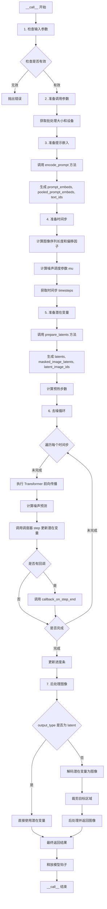

#### 带注释源码

```python
@torch.no_grad()
@replace_example_docstring(EXAMPLE_DOC_STRING)
def __call__(
    self,
    task_prompt: str | list[str] = None,
    content_prompt: str | list[str] = None,
    image: torch.FloatTensor | None = None,
    num_inference_steps: int = 50,
    sigmas: list[float] | None = None,
    guidance_scale: float = 30.0,
    num_images_per_prompt: int | None = 1,
    generator: torch.Generator | list[torch.Generator] | None = None,
    latents: torch.FloatTensor | None = None,
    prompt_embeds: torch.FloatTensor | None = None,
    pooled_prompt_embeds: torch.FloatTensor | None = None,
    output_type: str | None = "pil",
    return_dict: bool = True,
    joint_attention_kwargs: dict[str, Any] | None = None,
    callback_on_step_end: Callable[[int, int], None] | None = None,
    callback_on_step_end_tensor_inputs: list[str] = ["latents"],
    max_sequence_length: int = 512,
):
    r"""
    Function invoked when calling the VisualCloze pipeline for generation.

    Args:
        task_prompt: The prompt or prompts to define the task intention.
        content_prompt: The prompt or prompts to define the content or caption of the target image to be generated.
        image: Image, numpy array or tensor representing an image batch to be used as the starting point.
        num_inference_steps: The number of denoising steps. More denoising steps usually lead to a higher quality image.
        sigmas: Custom sigmas to use for the denoising process with schedulers which support a `sigmas` argument.
        guidance_scale: Guidance scale as defined in Classifier-Free Diffusion Guidance.
        num_images_per_prompt: The number of images to generate per prompt.
        generator: One or a list of torch generator(s) to make generation deterministic.
        latents: Pre-generated noisy latents, sampled from a Gaussian distribution.
        prompt_embeds: Pre-generated text embeddings.
        pooled_prompt_embeds: Pre-generated pooled text embeddings.
        output_type: The output format of the generate image. Choose between PIL or np.array.
        return_dict: Whether or not to return a FluxPipelineOutput instead of a plain tuple.
        joint_attention_kwargs: A kwargs dictionary that is passed along to the AttentionProcessor.
        callback_on_step_end: A function that calls at the end of each denoising steps during the inference.
        callback_on_step_end_tensor_inputs: The list of tensor inputs for the callback_on_step_end function.
        max_sequence_length: Maximum sequence length to use with the prompt.

    Returns:
        FluxPipelineOutput or tuple: Generated images.
    """

    # 1. Check inputs. Raise error if not correct
    # 验证所有输入参数的有效性，包括提示词、嵌入向量、回调张量输入等
    self.check_inputs(
        image,
        task_prompt,
        content_prompt,
        prompt_embeds=prompt_embeds,
        pooled_prompt_embeds=pooled_prompt_embeds,
        callback_on_step_end_tensor_inputs=callback_on_step_end_tensor_inputs,
        max_sequence_length=max_sequence_length,
    )

    # 保存引导比例和联合注意力参数到实例变量，用于后续去噪循环中访问
    self._guidance_scale = guidance_scale
    self._joint_attention_kwargs = joint_attention_kwargs
    self._interrupt = False

    # 预处理输入图像：解析任务提示、内容提示和图像，提取布局、大小、遮罩等信息
    processor_output = self.image_processor.preprocess(
        task_prompt, content_prompt, image, vae_scale_factor=self.vae_scale_factor
    )

    # 2. Define call parameters
    # 根据任务提示的类型确定批处理大小
    if processor_output["task_prompt"] is not None and isinstance(processor_output["task_prompt"], str):
        batch_size = 1
    elif processor_output["task_prompt"] is not None and isinstance(processor_output["task_prompt"], list):
        batch_size = len(processor_output["task_prompt"])

    # 获取执行设备
    device = self._execution_device

    # 3. Prepare prompt embeddings
    # 从联合注意力参数中提取 LoRA 比例（如果存在）
    lora_scale = (
        self.joint_attention_kwargs.get("scale", None) if self.joint_attention_kwargs is not None else None
    )
    # 编码提示词：处理布局提示、任务提示和内容提示，生成文本嵌入向量
    prompt_embeds, pooled_prompt_embeds, text_ids = self.encode_prompt(
        layout_prompt=processor_output["layout_prompt"],
        task_prompt=processor_output["task_prompt"],
        content_prompt=processor_output["content_prompt"],
        prompt_embeds=prompt_embeds,
        pooled_prompt_embeds=pooled_prompt_embeds,
        device=device,
        num_images_per_prompt=num_images_per_prompt,
        max_sequence_length=max_sequence_length,
        lora_scale=lora_scale,
    )

    # 4. Prepare timesteps
    # 计算图像序列长度：遍历所有样本和尺寸，计算潜在空间中的序列长度
    image_seq_len = sum(
        (size[0] // self.vae_scale_factor // 2) * (size[1] // self.vae_scale_factor // 2)
        for sample in processor_output["image_size"][0]
        for size in sample
    )

    # 计算噪声调度参数偏移量 mu，用于调整去噪过程中的噪声水平
    mu = calculate_shift(
        image_seq_len,
        self.scheduler.config.get("base_image_seq_len", 256),
        self.scheduler.config.get("max_image_seq_len", 4096),
        self.scheduler.config.get("base_shift", 0.5),
        self.scheduler.config.get("max_shift", 1.15),
    )

    # 获取时间步：如果未提供 sigmas，则从1.0到1/num_inference_steps生成线性间隔
    sigmas = np.linspace(1.0, 1 / num_inference_steps, num_inference_steps) if sigmas is None else sigmas
    timesteps, num_inference_steps = retrieve_timesteps(
        self.scheduler,
        num_inference_steps,
        device,
        sigmas=sigmas,
        mu=mu,
    )
    # 获取最终的时间步，调整推理步数以考虑强度参数
    timesteps, num_inference_steps = self.get_timesteps(num_inference_steps, 1.0, device)

    # 5. Prepare latent variables
    # 复制初始时间步以匹配批处理大小和每提示图像数量
    latent_timestep = timesteps[:1].repeat(batch_size * num_images_per_prompt)
    # 准备潜在变量：编码图像、添加噪声、准备遮罩等
    latents, masked_image_latents, latent_image_ids = self.prepare_latents(
        processor_output["init_image"],
        processor_output["mask"],
        latent_timestep,
        batch_size * num_images_per_prompt,
        prompt_embeds.dtype,
        device,
        generator,
        vae_scale_factor=self.vae_scale_factor,
    )

    # 计算预热步数：用于显示进度条
    num_warmup_steps = max(len(timesteps) - num_inference_steps * self.scheduler.order, 0)
    self._num_timesteps = len(timesteps)

    # 准备引导：如果 Transformer 支持引导嵌入，则创建引导张量
    if self.transformer.config.guidance_embeds:
        guidance = torch.full([1], guidance_scale, device=device, dtype=torch.float32)
        guidance = guidance.expand(latents.shape[0])
    else:
        guidance = None

    # 6. Denoising loop
    # 遍历每个时间步进行去噪
    with self.progress_bar(total=num_inference_steps) as progress_bar:
        for i, t in enumerate(timesteps):
            # 检查中断标志
            if self.interrupt:
                continue

            # 广播到批处理维度以兼容 ONNX/Core ML
            timestep = t.expand(latents.shape[0]).to(latents.dtype)
            # 将潜在变量和遮罩潜在变量连接在一起
            latent_model_input = torch.cat((latents, masked_image_latents), dim=2)

            # 执行 Transformer 前向传播以预测噪声
            noise_pred = self.transformer(
                hidden_states=latent_model_input,
                timestep=timestep / 1000,
                guidance=guidance,
                pooled_projections=pooled_prompt_embeds,
                encoder_hidden_states=prompt_embeds,
                txt_ids=text_ids,
                img_ids=latent_image_ids,
                joint_attention_kwargs=self.joint_attention_kwargs,
                return_dict=False,
            )[0]

            # 计算前一个噪声样本 x_t -> x_t-1
            latents_dtype = latents.dtype
            # 使用调度器步骤更新潜在变量
            latents = self.scheduler.step(noise_pred, t, latents, return_dict=False)[0]

            # 处理数据类型转换，特别是对于 MPS 设备
            if latents.dtype != latents_dtype:
                if torch.backends.mps.is_available():
                    latents = latents.to(latents_dtype)

            # 如果提供了每步结束回调，则调用它
            if callback_on_step_end is not None:
                callback_kwargs = {}
                for k in callback_on_step_end_tensor_inputs:
                    callback_kwargs[k] = locals()[k]
                callback_outputs = callback_on_step_end(self, i, t, callback_kwargs)

                # 更新回调返回的潜在变量和提示嵌入
                latents = callback_outputs.pop("latents", latents)
                prompt_embeds = callback_outputs.pop("prompt_embeds", prompt_embeds)

            # 在最后一步或预热步数之后按调度器顺序更新进度条
            if i == len(timesteps) - 1 or ((i + 1) > num_warmup_steps and (i + 1) % self.scheduler.order == 0):
                progress_bar.update()

            # XLA 优化：标记执行步骤
            if XLA_AVAILABLE:
                xm.mark_step()

    # 7. Post-process the image
    # 裁剪目标图像
    # 由于生成的图像是条件区域和目标区域的拼接，需要根据位置提取目标区域
    image = []
    if output_type == "latent":
        # 如果输出类型为潜在变量，直接使用潜在变量
        image = latents
    else:
        # 遍历每个批次
        for b in range(len(latents)):
            # 获取当前图像尺寸和目标位置
            cur_image_size = processor_output["image_size"][b % batch_size]
            cur_target_position = processor_output["target_position"][b % batch_size]
            # 解包潜在变量
            cur_latent = self._unpack_latents(latents[b].unsqueeze(0), cur_image_size, self.vae_scale_factor)[-1]
            # 反量化潜在变量
            cur_latent = (cur_latent / self.vae.config.scaling_factor) + self.vae.config.shift_factor
            # 使用 VAE 解码潜在变量
            cur_image = self.vae.decode(cur_latent, return_dict=False)[0]
            # 后处理图像
            cur_image = self.image_processor.postprocess(cur_image, output_type=output_type)[0]

            # 裁剪目标区域
            start = 0
            cropped = []
            for i, size in enumerate(cur_image_size[-1]):
                if cur_target_position[i]:
                    if output_type == "pil":
                        # 使用 PIL 裁剪
                        cropped.append(cur_image.crop((start, 0, start + size[1], size[0])))
                    else:
                        # 使用数组切片裁剪
                        cropped.append(cur_image[0 : size[0], start : start + size[1]])
                start += size[1]
            image.append(cropped)
        
        # 如果不是 PIL 格式，连接所有裁剪后的图像
        if output_type != "pil":
            image = np.concatenate([arr[None] for sub_image in image for arr in sub_image], axis=0)

    # 释放所有模型的钩子
    self.maybe_free_model_hooks()

    # 根据返回字典标志返回结果
    if not return_dict:
        return (image,)

    return FluxPipelineOutput(images=image)
```


### `VisualClozeGenerationPipeline.__init__`

该方法是 VisualClozeGenerationPipeline 类的构造函数，用于初始化图像生成管道的基本组件，包括调度器、VAE模型、文本编码器、分词器和变换器等，并配置图像处理相关的参数。

参数：

- `scheduler`：`FlowMatchEulerDiscreteScheduler`，用于去噪图像潜在表示的调度器
- `vae`：`AutoencoderKL`，用于将图像编码和解码到潜在表示的变分自编码器模型
- `text_encoder`：`CLIPTextModel`，用于编码文本提示的CLIP文本编码器
- `tokenizer`：`CLIPTokenizer`，用于将文本分词为token的CLIP分词器
- `text_encoder_2`：`T5EncoderModel`，用于编码文本提示的T5文本编码器
- `tokenizer_2`：`T5TokenizerFast`，用于将文本分词为token的T5快速分词器
- `transformer`：`FluxTransformer2DModel`，用于对编码的图像潜在表示进行去噪的条件变换器（MMDiT）架构
- `resolution`：`int`，可选参数，默认值为384，表示连接查询和上下文示例时每个图像的分辨率

返回值：无（`None`），该方法为构造函数，用于初始化对象状态，不返回任何值

#### 流程图

```mermaid
flowchart TD
    A[开始 __init__] --> B[调用 super().__init__]
    B --> C[register_modules 注册所有模块]
    C --> D[设置 self.resolution]
    D --> E[计算 self.vae_scale_factor]
    E --> F[设置 self.latent_channels]
    F --> G[创建 VisualClozeProcessor]
    G --> H[设置 self.tokenizer_max_length]
    H --> I[设置 self.default_sample_size]
    I --> J[结束 __init__]
```

#### 带注释源码

```python
def __init__(
    self,
    scheduler: FlowMatchEulerDiscreteScheduler,
    vae: AutoencoderKL,
    text_encoder: CLIPTextModel,
    tokenizer: CLIPTokenizer,
    text_encoder_2: T5EncoderModel,
    tokenizer_2: T5TokenizerFast,
    transformer: FluxTransformer2DModel,
    resolution: int = 384,
):
    """
    初始化 VisualClozeGenerationPipeline
    
    参数:
        scheduler: FlowMatchEulerDiscreteScheduler调度器，用于去噪过程
        vae: AutoencoderKL模型，用于图像编码/解码
        text_encoder: CLIPTextModel，CLIP文本编码器
        tokenizer: CLIPTokenizer，CLIP分词器
        text_encoder_2: T5EncoderModel，T5文本编码器
        tokenizer_2: T5TokenizerFast，T5快速分词器
        transformer: FluxTransformer2DModel，变换器模型
        resolution: 图像分辨率，默认384
    """
    # 调用父类DiffusionPipeline的初始化方法
    super().__init__()

    # 注册所有模块到管道中
    self.register_modules(
        vae=vae,
        text_encoder=text_encoder,
        text_encoder_2=text_encoder_2,
        tokenizer=tokenizer,
        tokenizer_2=tokenizer_2,
        transformer=transformer,
        scheduler=scheduler,
    )
    
    # 设置图像分辨率
    self.resolution = resolution
    
    # 计算VAE缩放因子，基于VAE的block_out_channels
    # Flux潜在变量被转换为2x2补丁并打包，因此潜在宽度和高度必须能被补丁大小整除
    self.vae_scale_factor = 2 ** (len(self.vae.config.block_out_channels) - 1) if getattr(self, "vae", None) else 8
    
    # 设置潜在通道数
    self.latent_channels = self.vae.config.latent_channels if getattr(self, "vae", None) else 16
    
    # 创建VisualClozeProcessor，用于图像预处理
    self.image_processor = VisualClozeProcessor(
        vae_scale_factor=self.vae_scale_factor * 2,  # 乘以2以考虑补丁打包
        vae_latent_channels=self.latent_channels,
        resolution=resolution
    )
    
    # 设置分词器最大长度
    self.tokenizer_max_length = (
        self.tokenizer.model_max_length if hasattr(self, "tokenizer") and self.tokenizer is not None else 77
    )
    
    # 设置默认采样大小
    self.default_sample_size = 128
```


### `VisualClozeGenerationPipeline._get_t5_prompt_embeds`

该方法用于使用 T5 文本编码器将文本提示转换为文本嵌入（embeddings），支持批量处理和多图生成。它是 Flux Pipeline 的 T5 提示嵌入提取方法在 VisualCloze 管道中的副本。

参数：

-  `prompt`：`str | list[str]`，要编码的文本提示，可以是单个字符串或字符串列表
-  `num_images_per_prompt`：`int`，每个提示生成的图像数量，默认为 1
-  `max_sequence_length`：`int`，最大序列长度，默认为 512
-  `device`：`torch.device | None`，计算设备，默认为执行设备
-  `dtype`：`torch.dtype | None`，数据类型，默认为 text_encoder 的数据类型

返回值：`torch.Tensor`，形状为 `(batch_size * num_images_per_prompt, seq_len, hidden_size)` 的文本嵌入张量

#### 流程图

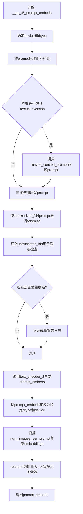

#### 带注释源码

```python
# Copied from diffusers.pipelines.flux.pipeline_flux.FluxPipeline._get_t5_prompt_embeds
def _get_t5_prompt_embeds(
    self,
    prompt: str | list[str] = None,
    num_images_per_prompt: int = 1,
    max_sequence_length: int = 512,
    device: torch.device | None = None,
    dtype: torch.dtype | None = None,
):
    """
    使用 T5 文本编码器将文本提示转换为文本嵌入。
    
    参数:
        prompt: 要编码的文本提示，字符串或字符串列表
        num_images_per_prompt: 每个提示生成的图像数量
        max_sequence_length: 最大序列长度
        device: 计算设备
        dtype: 数据类型
    
    返回:
        形状为 (batch_size * num_images_per_prompt, seq_len, hidden_size) 的文本嵌入张量
    """
    # 如果未指定device，则使用执行设备
    device = device or self._execution_device
    # 如果未指定dtype，则使用text_encoder的数据类型
    dtype = dtype or self.text_encoder.dtype

    # 将单个字符串转换为列表，统一处理方式
    prompt = [prompt] if isinstance(prompt, str) else prompt
    # 获取批处理大小
    batch_size = len(prompt)

    # 如果支持TextualInversion，则进行提示转换
    if isinstance(self, TextualInversionLoaderMixin):
        prompt = self.maybe_convert_prompt(prompt, self.tokenizer_2)

    # 使用T5 tokenizer进行tokenize
    text_inputs = self.tokenizer_2(
        prompt,
        padding="max_length",           # 填充到最大长度
        max_length=max_sequence_length, # 最大序列长度
        truncation=True,                # 启用截断
        return_length=False,            # 不返回长度
        return_overflowing_tokens=False,# 不返回溢出token
        return_tensors="pt",            # 返回PyTorch张量
    )
    text_input_ids = text_inputs.input_ids
    
    # 获取未截断的token ids用于比较
    untruncated_ids = self.tokenizer_2(prompt, padding="longest", return_tensors="pt").input_ids

    # 检查是否发生了截断，如果是则记录警告
    if untruncated_ids.shape[-1] >= text_input_ids.shape[-1] and not torch.equal(text_input_ids, untruncated_ids):
        removed_text = self.tokenizer_2.batch_decode(untruncated_ids[:, self.tokenizer_max_length - 1 : -1])
        logger.warning(
            "The following part of your input was truncated because `max_sequence_length` is set to "
            f" {max_sequence_length} tokens: {removed_text}"
        )

    # 使用T5文本编码器生成文本嵌入
    # output_hidden_states=False 只返回最后的隐藏状态
    prompt_embeds = self.text_encoder_2(text_input_ids.to(device), output_hidden_states=False)[0]

    # 更新dtype为text_encoder_2的实际数据类型
    dtype = self.text_encoder_2.dtype
    # 将嵌入转换到指定设备和数据类型
    prompt_embeds = prompt_embeds.to(dtype=dtype, device=device)

    # 获取序列长度
    _, seq_len, _ = prompt_embeds.shape

    # 为每个提示的每个生成复制文本嵌入
    # 使用mps友好的方法（repeat而非expand）
    prompt_embeds = prompt_embeds.repeat(1, num_images_per_prompt, 1)
    # reshape为 (batch_size * num_images_per_prompt, seq_len, hidden_size)
    prompt_embeds = prompt_embeds.view(batch_size * num_images_per_prompt, seq_len, -1)

    return prompt_embeds
```


### `VisualClozeGenerationPipeline._get_clip_prompt_embeds`

该方法用于从CLIP文本编码器获取文本嵌入（embeddings），将输入的文本提示转换为模型可处理的向量表示，以便在视觉生成pipeline中作为条件输入使用。

参数：

- `self`：隐式参数，指向`VisualClozeGenerationPipeline`实例
- `prompt`：`str | list[str]`，输入的文本提示，可以是单个字符串或字符串列表
- `num_images_per_prompt`：`int`，默认值1，每个提示生成的图像数量，用于复制embeddings
- `device`：`torch.device | None`，可选参数，指定计算设备，默认为执行设备

返回值：`torch.FloatTensor`，返回CLIP文本模型的池化输出嵌入，形状为`(batch_size * num_images_per_prompt, embedding_dim)`

#### 流程图

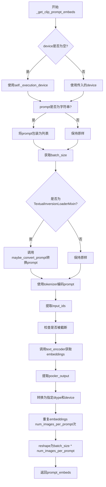

#### 带注释源码

```python
def _get_clip_prompt_embeds(
    self,
    prompt: str | list[str],
    num_images_per_prompt: int = 1,
    device: torch.device | None = None,
):
    """
    从CLIP文本编码器获取文本嵌入
    
    参数:
        prompt: 输入的文本提示，字符串或字符串列表
        num_images_per_prompt: 每个提示生成的图像数量
        device: 可选的计算设备
        
    返回:
        CLIP文本模型的池化输出嵌入
    """
    # 确定设备：如果未指定则使用pipeline的默认执行设备
    device = device or self._execution_device

    # 统一prompt格式：将字符串转换为列表，便于批处理
    prompt = [prompt] if isinstance(prompt, str) else prompt
    batch_size = len(prompt)

    # 如果是TextualInversionLoaderMixin实例，转换prompt以处理文本反转
    if isinstance(self, TextualInversionLoaderMixin):
        prompt = self.maybe_convert_prompt(prompt, self.tokenizer)

    # 使用CLIP tokenizer对prompt进行编码
    # padding="max_length"：填充到最大长度
    # max_length：使用实例的tokenizer_max_length
    # truncation=True：截断超过长度的序列
    text_inputs = self.tokenizer(
        prompt,
        padding="max_length",
        max_length=self.tokenizer_max_length,
        truncation=True,
        return_overflowing_tokens=False,
        return_length=False,
        return_tensors="pt",
    )

    # 提取编码后的input_ids
    text_input_ids = text_inputs.input_ids
    
    # 使用最长填充获取未截断的input_ids用于比较
    untruncated_ids = self.tokenizer(prompt, padding="longest", return_tensors="pt").input_ids
    
    # 检查是否发生了截断，如果是则记录警告
    if untruncated_ids.shape[-1] >= text_input_ids.shape[-1] and not torch.equal(text_input_ids, untruncated_ids):
        removed_text = self.tokenizer.batch_decode(untruncated_ids[:, self.tokenizer_max_length - 1 : -1])
        logger.warning(
            "The following part of your input was truncated because CLIP can only handle sequences up to"
            f" {self.tokenizer_max_length} tokens: {removed_text}"
        )
    
    # 通过CLIP text_encoder获取文本嵌入
    # output_hidden_states=False：只获取最后的隐藏状态
    prompt_embeds = self.text_encoder(text_input_ids.to(device), output_hidden_states=False)

    # 使用pooled output（池化输出）作为最终嵌入
    # CLIPTextModel的pooler_output是[CLS]token的输出
    prompt_embeds = prompt_embeds.pooler_output
    
    # 转换为指定的dtype和device
    prompt_embeds = prompt_embeds.to(dtype=self.text_encoder.dtype, device=device)

    # 复制文本嵌入以匹配每个提示生成的图像数量
    # 使用mps友好的方法（repeat + view）
    prompt_embeds = prompt_embeds.repeat(1, num_images_per_prompt)
    prompt_embeds = prompt_embeds.view(batch_size * num_images_per_prompt, -1)

    return prompt_embeds
```


### `VisualClozeGenerationPipeline.encode_prompt`

该方法负责将布局提示、任务提示和内容提示编码为文本嵌入向量，供后续的图像生成模型使用。它整合了 CLIP 和 T5 两种文本编码器，并处理 LoRA 缩放逻辑。

参数：

-  `layout_prompt`：`str | list[str]`，定义上下文示例数量和任务中涉及的图像数量的提示
-  `task_prompt`：`str | list[str]`，定义任务意图的提示
-  `content_prompt`：`str | list[str]`，定义要生成的图像内容或标题的提示
-  `device`：`torch.device | None`，torch 设备，默认为执行设备
-  `num_images_per_prompt`：`int`，每个提示要生成的图像数量
-  `prompt_embeds`：`torch.FloatTensor | None`，预生成的 T5 文本嵌入，可用于微调文本输入
-  `pooled_prompt_embeds`：`torch.FloatTensor | None`，预生成的 CLIP 池化文本嵌入，可用于微调文本输入
-  `max_sequence_length`：`int`，最大序列长度，默认为 512
-  `lora_scale`：`float | None`，LoRA 缩放因子，用于调整 LoRA 层的权重

返回值：`tuple[torch.FloatTensor, torch.FloatTensor, torch.FloatTensor]`，返回包含三个元素的元组：
- 第一个元素：T5 编码器生成的 `prompt_embeds`
- 第二个元素：CLIP 编码器生成的 `pooled_prompt_embeds`
- 第三个元素：用于文本的位置编码 `text_ids`

#### 流程图

```mermaid
flowchart TD
    A[开始 encode_prompt] --> B{检查 lora_scale}
    B -->|lora_scale 不为 None| C[设置 self._lora_scale]
    C --> D[动态调整 LoRA 缩放]
    B -->|lora_scale 为 None| E{判断 layout_prompt 类型}
    E -->|str| F[转换为列表]
    E -->|list| G[直接使用]
    F --> H[预处理提示字符串]
    G --> H
    H --> I[调用 _get_clip_prompt_embeds]
    I --> J[调用 _get_t5_prompt_embeds]
    J --> K{检查 text_encoder 是否存在}
    K -->|是| L{使用 PEFT backend}
    K -->|否| M{检查 text_encoder_2 是否存在}
    L -->|是| N[恢复 LoRA 缩放]
    L -->|否| M
    M --> O[创建 text_ids 零张量]
    O --> P[返回 prompt_embeds, pooled_prompt_embeds, text_ids]
    N --> O
    
    subgraph 预处理函数 _preprocess
    Q{content 参数}
    Q -->|True| R[添加前缀 'The last image of the last row depicts: ']
    Q -->|False| S[直接返回原提示]
    end
```

#### 带注释源码

```python
def encode_prompt(
    self,
    layout_prompt: str | list[str],
    task_prompt: str | list[str],
    content_prompt: str | list[str],
    device: torch.device | None = None,
    num_images_per_prompt: int = 1,
    prompt_embeds: torch.FloatTensor | None = None,
    pooled_prompt_embeds: torch.FloatTensor | None = None,
    max_sequence_length: int = 512,
    lora_scale: float | None = None,
):
    # 确定设备，默认为当前执行设备
    device = device or self._execution_device

    # 设置 LoRA 缩放因子，以便文本编码器的 LoRA 函数可以正确访问
    if lora_scale is not None and isinstance(self, FluxLoraLoaderMixin):
        self._lora_scale = lora_scale

        # 动态调整 LoRA 缩放
        if self.text_encoder is not None and USE_PEFT_BACKEND:
            scale_lora_layers(self.text_encoder, lora_scale)
        if self.text_encoder_2 is not None and USE_PEFT_BACKEND:
            scale_lora_layers(self.text_encoder_2, lora_scale)

    # 如果是单个字符串，转换为列表以便批量处理
    if isinstance(layout_prompt, str):
        layout_prompt = [layout_prompt]
        task_prompt = [task_prompt]
        content_prompt = [content_prompt]

    # 定义预处理函数，用于格式化提示字符串
    def _preprocess(prompt, content=False):
        if prompt is not None:
            # 如果是内容提示，添加特定前缀
            return f"The last image of the last row depicts: {prompt}" if content else prompt
        else:
            return ""

    # 合并三个提示为一个完整的提示
    prompt = [
        f"{_preprocess(layout_prompt[i])} {_preprocess(task_prompt[i])} {_preprocess(content_prompt[i], content=True)}".strip()
        for i in range(len(layout_prompt))
    ]
    
    # 使用 CLIP 编码器生成池化的提示嵌入
    pooled_prompt_embeds = self._get_clip_prompt_embeds(
        prompt=prompt,
        device=device,
        num_images_per_prompt=num_images_per_prompt,
    )
    
    # 使用 T5 编码器生成提示嵌入
    prompt_embeds = self._get_t5_prompt_embeds(
        prompt=prompt,
        num_images_per_prompt=num_images_per_prompt,
        max_sequence_length=max_sequence_length,
        device=device,
    )

    # 如果使用了 LoRA，恢復原始缩放
    if self.text_encoder is not None:
        if isinstance(self, FluxLoraLoaderMixin) and USE_PEFT_BACKEND:
            # 通过缩放回 LoRA 层来获取原始缩放
            unscale_lora_layers(self.text_encoder, lora_scale)

    if self.text_encoder_2 is not None:
        if isinstance(self, FluxLoraLoaderMixin) and USE_PEFT_BACKEND:
            # 通过缩放回 LoRA 层来获取原始缩放
            unscale_lora_layers(self.text_encoder_2, lora_scale)

    # 确定数据类型（优先使用 text_encoder 的类型，否则使用 transformer 的类型）
    dtype = self.text_encoder.dtype if self.text_encoder is not None else self.transformer.dtype
    
    # 创建文本位置编码张量，形状为 [seq_len, 3]，全部为零
    text_ids = torch.zeros(prompt_embeds.shape[1], 3).to(device=device, dtype=dtype)

    # 返回提示嵌入、池化提示嵌入和文本位置编码
    return prompt_embeds, pooled_prompt_embeds, text_ids
```


### `VisualClozeGenerationPipeline._encode_vae_image`

该函数负责将输入的图像张量编码为VAE latent空间表示。它首先使用VAE模型对图像进行编码，然后通过`retrieve_latents`函数提取latent表示，最后根据VAE的配置参数（shift_factor和scaling_factor）对latent进行归一化处理，以适配扩散模型的潜空间。

参数：

- `self`：VisualClozeGenerationPipeline实例本身
- `image`：`torch.Tensor`，输入的需要编码的图像张量，形状为(B, C, H, W)，其中B是批次大小，C是通道数，H和W是图像的高和宽
- `generator`：`torch.Generator` 或 `list[torch.Generator]`，用于生成随机数的PyTorch生成器，用于确保编码过程的可重复性。如果是列表，则表示多个生成器，用于批次中不同图像的独立随机采样

返回值：`torch.Tensor`，编码后的图像latent表示，形状为(B, latent_channels, latent_height, latent_width)，已根据VAE的shift_factor和scaling_factor进行归一化处理

#### 流程图

```mermaid
flowchart TD
    A[开始: _encode_vae_image] --> B{generator是否为list?}
    B -- 是 --> C[遍历图像批次]
    C --> D[使用vae.encode编码单张图像]
    D --> E[使用retrieve_latents提取latent]
    E --> F[保存到image_latents列表]
    F --> G{是否遍历完所有图像?}
    G -- 否 --> C
    G -- 是 --> H[torch.cat合并所有latent]
    B -- 否 --> I[直接使用vae.encode编码整个图像]
    I --> J[使用retrieve_latents提取latent]
    H --> K[应用归一化: (latents - shift_factor) * scaling_factor]
    J --> K
    K --> L[返回image_latents]
```

#### 带注释源码

```python
def _encode_vae_image(self, image: torch.Tensor, generator: torch.Generator):
    """
    将输入图像编码为VAE latent表示
    
    参数:
        image: 输入图像张量，形状为(B, C, H, W)
        generator: PyTorch随机生成器，用于确保可重复性
    
    返回:
        编码后的图像latent张量
    """
    # 检查generator是否为列表形式
    if isinstance(generator, list):
        # 如果是生成器列表，则对批次中的每个图像分别进行编码
        # 这样可以为批次中的每个图像使用不同的随机种子
        image_latents = [
            # 对每个图像切片进行VAE编码
            retrieve_latents(self.vae.encode(image[i : i + 1]), generator=generator[i])
            for i in range(image.shape[0])
        ]
        # 将各个图像的latent沿批次维度拼接
        image_latents = torch.cat(image_latents, dim=0)
    else:
        # 如果是单个生成器，直接对整个图像批次进行编码
        image_latents = retrieve_latents(self.vae.encode(image), generator=generator)

    # 对latent进行归一化处理：
    # 1. 减去shift_factor：将latent从VAE的潜在空间中心偏移
    # 2. 乘以scaling_factor：缩放到扩散模型期望的潜在空间范围
    image_latents = (image_latents - self.vae.config.shift_factor) * self.vae.config.scaling_factor

    # 返回处理后的latent表示
    return image_latents
```


### VisualClozeGenerationPipeline.get_timesteps

该方法用于根据推理步数和强度（strength）参数计算并返回调整后的去噪时间步序列。在图像生成/修复任务中，strength 参数控制从原始图像到噪声图像的混合程度，从而影响最终生成结果与原始图像的相似度。

参数：

- `num_inference_steps`：`int`，推理过程中使用的去噪步数
- `strength`：`float`，图像重建强度，值范围通常为 0 到 1 之间，用于控制噪声添加的比例
- `device`：`torch.device`，计算设备（CPU 或 CUDA）

返回值：`(torch.Tensor, int)`，返回一个元组，包含：
- `timesteps`：调整后的时间步序列（torch.Tensor）
- `num_inference_steps - t_start`：调整后的实际推理步数（int）

#### 流程图

```mermaid
flowchart TD
    A[开始] --> B[计算 init_timestep = min(num_inference_steps * strength, num_inference_steps)]
    B --> C[计算 t_start = max(num_inference_steps - init_timestep, 0)]
    C --> D[从 scheduler.timesteps 中切片获取时间步: timesteps = scheduler.timesteps[t_start * order:]
    D --> E{scheduler 是否有 set_begin_index 方法?}
    E -->|是| F[调用 scheduler.set_begin_index(t_start * order)]
    E -->|否| G[跳过设置]
    F --> H[返回 timesteps 和 num_inference_steps - t_start]
    G --> H
```

#### 带注释源码

```python
def get_timesteps(self, num_inference_steps, strength, device):
    # 根据强度参数计算初始时间步数
    # strength 越接近 1.0，init_timestep 越大，保留的原始图像信息越多
    # 例如：num_inference_steps=30, strength=0.8 -> init_timestep = min(30*0.8, 30) = 24
    init_timestep = min(num_inference_steps * strength, num_inference_steps)

    # 计算起始索引，决定从时间步序列的哪个位置开始
    # 这个计算实现了跳过前面的时间步，从中间开始去噪
    # 例如：num_inference_steps=30, init_timestep=24 -> t_start = 30-24 = 6
    t_start = int(max(num_inference_steps - init_timestep, 0))

    # 从调度器的时间步序列中获取从 t_start 开始的所有时间步
    # scheduler.order 是调度器的阶数，用于多步去噪方法
    timesteps = self.scheduler.timesteps[t_start * self.scheduler.order :]

    # 如果调度器支持设置起始索引，则配置调度器从指定位置开始
    # 这确保了调度器内部状态与返回的时间步序列一致
    if hasattr(self.scheduler, "set_begin_index"):
        self.scheduler.set_begin_index(t_start * self.scheduler.order)

    # 返回调整后的时间步序列和实际的推理步数
    # 第二个返回值用于告诉调用者实际会执行多少步去噪
    return timesteps, num_inference_steps - t_start
```


### `VisualClozeGenerationPipeline.check_inputs`

该方法用于验证 VisualCloze 生成流水线的输入参数是否符合要求。它会检查任务提示词、内容提示词、预计算的文本嵌入、图像批次结构以及序列长度限制等，确保所有输入参数的一致性和有效性。如果任何验证失败，该方法将抛出 `ValueError` 异常。

参数：

- `image`：`Any`，输入的图像数据，用于验证图像样本结构
- `task_prompt`：`str | list[str] | None`，定义任务意图的提示词
- `content_prompt`：`str | list[str] | None`，定义目标图像内容或描述的提示词
- `prompt_embeds`：`torch.FloatTensor | None`，预生成的文本嵌入向量
- `pooled_prompt_embeds`：`torch.FloatTensor | None`，预生成的池化文本嵌入向量
- `callback_on_step_end_tensor_inputs`：`list[str] | None`，在每个推理步骤结束时回调的张量输入列表
- `max_sequence_length`：`int | None`，文本序列的最大长度

返回值：`None`，该方法不返回值，仅通过抛出 `ValueError` 来指示验证失败

#### 流程图

```mermaid
flowchart TD
    A[开始 check_inputs] --> B{callback_on_step_end_tensor_inputs 是否存在且有效?}
    B -->|否| C[抛出 ValueError: 无效的 callback_on_step_end_tensor_inputs]
    B -->|是| D{同时提供了 task_prompt/content_prompt 和 prompt_embeds?}
    D -->|是| C
    D -->|否| E{提供了 task_prompt + content_prompt 或 prompt_embeds?}
    E -->|否| F[抛出 ValueError: 必须提供 task_prompt + content_prompt 或 prompt_embeds]
    E -->|是| G{task_prompt 是否为 None?}
    G -->|是| H[抛出 ValueError: task_prompt 缺失]
    G -->|否| I{task_prompt 类型是否为 str 或 list?}
    I -->|否| J[抛出 ValueError: task_prompt 类型错误]
    I -->|是| K{content_prompt 类型是否为 str 或 list?}
    K -->|否| L[抛出 ValueError: content_prompt 类型错误]
    K -->|是| M{task_prompt 或 content_prompt 是 list?}
    M -->|是| N{两者是否都是 list?}
    M -->|否| O{task_prompt 和 content_prompt 长度是否相同?}
    N -->|否| P[抛出 ValueError: task_prompt 和 content_prompt 必须同为 list 或同为 str]
    N -->|是| O
    O -->|否| Q[抛出 ValueError: task_prompt 和 content_prompt 长度不一致]
    O -->|是| R{验证每个图像样本结构}
    R --> S{每个样本是否为 2D 列表?}
    S -->|否| T[抛出 ValueError: 样本必须是 2D 列表]
    S -->|是| U{每行图像数量是否相同?}
    U -->|否| V[抛出 ValueError: 每行图像数量必须相同]
    U -->|是| W{查询目标是否为 None?}
    W -->|否| X[抛出 ValueError: 查询目标应表示为 None]
    W -->|是| Y{上下文示例中是否有缺失图像?}
    Y -->|是| Z[抛出 ValueError: 上下文示例中缺少图像]
    Y -->|否| AA{prompt_embeds 存在但 pooled_prompt_embeds 不存在?}
    AA -->|是| AB[抛出 ValueError: 必须同时提供两者]
    AA -->|否| AC{max_sequence_length 是否超过 512?}
    AC -->|是| AD[抛出 ValueError: max_sequence_length 不能超过 512]
    AC -->|否| AE[验证通过]
    AE --> AF[结束]
    
    style C fill:#ffcccc
    style F fill:#ffcccc
    style H fill:#ffcccc
    style J fill:#ffcccc
    style L fill:#ffcccc
    style P fill:#ffcccc
    style Q fill:#ffcccc
    style T fill:#ffcccc
    style V fill:#ffcccc
    style X fill:#ffcccc
    style Z fill:#ffcccc
    style AB fill:#ffcccc
    style AD fill:#ffcccc
    style AE fill:#ccffcc
```

#### 带注释源码

```python
def check_inputs(
    self,
    image,
    task_prompt,
    content_prompt,
    prompt_embeds=None,
    pooled_prompt_embeds=None,
    callback_on_step_end_tensor_inputs=None,
    max_sequence_length=None,
):
    """
    验证 VisualClozeGenerationPipeline 的输入参数是否符合要求。
    
    该方法执行以下验证:
    1. callback_on_step_end_tensor_inputs 必须在允许的回调张量输入列表中
    2. 不能同时提供文本提示词(task_prompt + content_prompt)和预计算的 prompt_embeds
    3. 必须提供任务提示词或预计算的嵌入
    4. 验证 task_prompt 和 content_prompt 的类型(str 或 list)
    5. 如果两者都是 list,验证它们长度相同
    6. 验证图像样本的结构(2D列表、每行图像数量一致、目标为None等)
    7. 如果提供了 prompt_embeds,必须也提供 pooled_prompt_embeds
    8. 验证 max_sequence_length 不超过 512
    """
    
    # 验证回调张量输入是否在允许的列表中
    if callback_on_step_end_tensor_inputs is not None and not all(
        k in self._callback_tensor_inputs for k in callback_on_step_end_tensor_inputs
    ):
        raise ValueError(
            f"`callback_on_step_end_tensor_inputs` has to be in {self._callback_tensor_inputs}, but found {[k for k in callback_on_step_end_tensor_inputs if k not in self._callback_tensor_inputs]}"
        )

    # 验证提示词输入:不能同时提供文本提示词和预计算的嵌入
    if (task_prompt is not None or content_prompt is not None) and prompt_embeds is not None:
        raise ValueError("Cannot provide both text `task_prompt` + `content_prompt` and `prompt_embeds`. ")

    # 验证必须提供提示词或嵌入之一
    if task_prompt is None and content_prompt is None and prompt_embeds is None:
        raise ValueError("Must provide either `task_prompt` + `content_prompt` or pre-computed `prompt_embeds`. ")

    # 验证 task_prompt 不能为空
    if task_prompt is None:
        raise ValueError("`task_prompt` is missing.")

    # 验证 task_prompt 类型
    if task_prompt is not None and not isinstance(task_prompt, (str, list)):
        raise ValueError(f"`task_prompt` must be str or list, got {type(task_prompt)}")

    # 验证 content_prompt 类型
    if content_prompt is not None and not isinstance(content_prompt, (str, list)):
        raise ValueError(f"`content_prompt` must be str or list, got {type(content_prompt)}")

    # 验证列表类型一致性:如果任一为list,两者都必须为list
    if isinstance(task_prompt, list) or isinstance(content_prompt, list):
        if not isinstance(task_prompt, list) or not isinstance(content_prompt, list):
            raise ValueError(
                f"`task_prompt` and `content_prompt` must both be lists, or both be of type str or None, "
                f"got {type(task_prompt)} and {type(content_prompt)}"
            )
        # 验证列表长度一致性
        if len(content_prompt) != len(task_prompt):
            raise ValueError("`task_prompt` and `content_prompt` must have the same length whe they are lists.")

        # 验证图像批次结构
        for sample in image:
            # 每个样本必须是2D图像列表
            if not isinstance(sample, list) or not isinstance(sample[0], list):
                raise ValueError("Each sample in the batch must have a 2D list of images.")
            # 每行的图像数量必须相同
            if len({len(row) for row in sample}) != 1:
                raise ValueError("Each in-context example and query should contain the same number of images.")
            # 查询行的最后一个元素应该是None(表示目标图像)
            if not any(img is None for img in sample[-1]):
                raise ValueError("There are no targets in the query, which should be represented as None.")
            # 验证上下文示例中不能有缺失的图像
            for row in sample[:-1]:
                if any(img is None for img in row):
                    raise ValueError("Images are missing in in-context examples.")

    # 验证嵌入的一致性:如果提供了prompt_embeds,必须也提供pooled_prompt_embeds
    if prompt_embeds is not None and pooled_prompt_embeds is None:
        raise ValueError(
            "If `prompt_embeds` are provided, `pooled_prompt_embeds` also have to be passed. Make sure to generate `pooled_prompt_embeds` from the same text encoder that was used to generate `prompt_embeds`."
        )

    # 验证序列长度限制
    if max_sequence_length is not None and max_sequence_length > 512:
        raise ValueError(f"max_sequence_length cannot exceed 512, got {max_sequence_length}")
```


### `VisualClozeGenerationPipeline._prepare_latent_image_ids`

为输入的图像批次生成潜在空间中的图像ID，用于Flux Transformer模型中标识不同图像和位置信息。该方法将每张图像划分为多个patch，并为每个patch生成唯一的标识符，包含图像索引和patch的二维坐标。

参数：

- `image`：`list[torch.Tensor]`，输入的图像张量列表，每张图像的形状为 `(1, C, H, W)`
- `vae_scale_factor`：`int`，VAE的缩放因子，用于计算patch数量
- `device`：`torch.device`，计算设备
- `dtype`：`torch.dtype`，返回张量的数据类型

返回值：`torch.FloatTensor`，形状为 `(total_patches, 3)` 的张量，每行包含 `[image_idx, patch_row, patch_col]`，其中 `image_idx` 是图像索引（从1开始），`patch_row` 和 `patch_col` 分别是patch的行和列坐标

#### 流程图

```mermaid
flowchart TD
    A[输入: image列表, vae_scale_factor, device, dtype] --> B[初始化空列表 latent_image_ids]
    B --> C{遍历 image 列表}
    C -->|idx, img| D[对图像进行squeeze操作去除批次维度]
    D --> E[获取图像形状: channels, height, width]
    E --> F[计算高度方向patch数: num_patches_h = height // vae_scale_factor // 2]
    F --> G[计算宽度方向patch数: num_patches_w = width // vae_scale_factor // 2]
    G --> H[创建零张量 patch_ids 形状: num_patches_h x num_patches_w x 3]
    H --> I[设置第一维: patch_ids[..., 0] = idx 图像索引]
    I --> J[设置第二维: patch_ids[..., 1] = 行坐标]
    J --> K[设置第三维: patch_ids[..., 2] = 列坐标]
    K --> L[重塑patch_ids为二维张量: -1 x 3]
    L --> M[将patch_ids添加到列表]
    M --> C
    C -->|遍历完成| N[沿第零维拼接所有patch_ids]
    N --> O[返回最终张量]
```

#### 带注释源码

```python
@staticmethod
def _prepare_latent_image_ids(image, vae_scale_factor, device, dtype):
    """
    为输入图像批次生成潜在空间中的图像ID。
    
    该方法为Flux Transformer模型生成位置标识信息，每个图像被划分为多个patches，
    每个patch包含3个维度的坐标信息：图像索引、垂直位置索引、水平位置索引。
    
    Args:
        image: 输入的图像张量列表，每张图像形状为 (1, C, H, W)
        vae_scale_factor: VAE缩放因子，用于计算patch数量
        device: torch设备
        dtype: 返回张量的数据类型
    
    Returns:
        torch.FloatTensor: 形状为 (total_patches, 3) 的张量
    """
    # 初始化存储所有patch ID的列表
    latent_image_ids = []

    # 遍历每张图像，idx从1开始计数
    for idx, img in enumerate(image, start=1):
        # 去除批次维度，假设输入形状为 (1, C, H, W)
        img = img.squeeze(0)
        
        # 获取图像的通道数、高度和宽度
        channels, height, width = img.shape

        # 计算高度和宽度方向的patch数量
        # 每个patch大小为 vae_scale_factor * 2
        num_patches_h = height // vae_scale_factor // 2
        num_patches_w = width // vae_scale_factor // 2

        # 创建零张量存储当前图像的所有patch坐标
        # 形状: (num_patches_h, num_patches_w, 3)
        patch_ids = torch.zeros(num_patches_h, num_patches_w, 3, device=device, dtype=dtype)
        
        # 第一维：图像索引（从1开始，用于区分不同图像）
        patch_ids[..., 0] = idx
        
        # 第二维：patch在图像中的垂直位置索引
        # 使用torch.arange生成行坐标，然后通过[:, None]扩展为列向量
        patch_ids[..., 1] = torch.arange(num_patches_h, device=device, dtype=dtype)[:, None]
        
        # 第三维：patch在图像中的水平位置索引
        # 使用torch.arange生成列坐标，然后通过[None, :]扩展为行向量
        patch_ids[..., 2] = torch.arange(num_patches_w, device=device, dtype=dtype)[None, :]

        # 将三维张量重塑为二维张量，每行代表一个patch的坐标
        # 形状: (num_patches_h * num_patches_w, 3)
        patch_ids = patch_ids.reshape(-1, 3)
        
        # 将当前图像的patch IDs添加到列表中
        latent_image_ids.append(patch_ids)

    # 沿第零维（batch维度）拼接所有图像的patch IDs
    return torch.cat(latent_image_ids, dim=0)
```


### `VisualClozeGenerationPipeline._pack_latents`

该函数用于将VAE编码后的latent张量重新打包成适合Transformer处理的特定格式。它通过reshape和permute操作将4D latent张量转换为3D张量，将2x2的patch展平为单个维度，以便于后续的图像生成处理。

参数：

- `latents`：`torch.Tensor`，输入的VAE latent张量，形状为 `(batch_size, num_channels_latents, height, width)`
- `batch_size`：`int`，批次大小，用于控制输出张量的第一维度
- `num_channels_latents`：`int`，latent通道数，对应VAE的潜在空间维度
- `height`：`int`，latent张量的高度（未打包前）
- `width`：`int`，latent张量的宽度（未打包前）

返回值：`torch.Tensor`，打包后的latent张量，形状为 `(batch_size, (height // 2) * (width // 2), num_channels_latents * 4)`

#### 流程图

```mermaid
flowchart TD
    A[开始: 输入latents] --> B[view操作: 将latents reshape为batch_size, num_channels, height//2, 2, width//2, 2]
    B --> C[permute操作: 重新排列维度顺序为0, 2, 4, 1, 3, 5]
    C --> D[reshape操作: 合并patch维度为(batch_size, height//2 * width//2, num_channels * 4)]
    D --> E[返回打包后的latents]
```

#### 带注释源码

```python
@staticmethod
# Copied from diffusers.pipelines.flux.pipeline_flux.FluxPipeline._pack_latents
def _pack_latents(latents, batch_size, num_channels_latents, height, width):
    """
    将latent张量打包成适合Flux Transformer处理的格式
    
    参数:
        latents: 输入的VAE latent张量，形状为 (batch_size, num_channels_latents, height, width)
        batch_size: 批次大小
        num_channels_latents: latent通道数
        height: latent高度
        width: latent宽度
    
    返回:
        打包后的latent张量，形状为 (batch_size, (height//2)*(width//2), num_channels_latents*4)
    """
    # 步骤1: view操作 - 将latents reshape为包含2x2 patch的6D张量
    # 将height和width各除以2，并在每个维度上添加2的patch维度
    latents = latents.view(batch_size, num_channels_latents, height // 2, 2, width // 2, 2)
    
    # 步骤2: permute操作 - 重新排列维度顺序
    # 从 (batch, channels, h, 2, w, 2) -> (batch, h, w, channels, 2, 2)
    # 这样可以将patch维度移到通道维度之后
    latents = latents.permute(0, 2, 4, 1, 3, 5)
    
    # 步骤3: reshape操作 - 将2x2的patch展平为单一维度
    # 最终形状: (batch, height//2 * width//2, channels * 4)
    # 这里将两个2维度的patch和通道维度合并，形成新的通道维度
    latents = latents.reshape(batch_size, (height // 2) * (width // 2), num_channels_latents * 4)

    return latents
```


### `VisualClozeGenerationPipeline._unpack_latents`

该函数是一个静态方法，用于将打包（packed）的潜在表示（latents）解包（unpack）为原始图像尺寸的潜在表示。它是 `_pack_latents` 的逆操作，通过视图重塑（view）和维度置换（permute）将一维打包的 latents 恢复为二维图像形式的 latents。

参数：

- `latents`：`torch.Tensor`，打包后的潜在表示，形状为 (batch_size, num_patches, channels)
- `sizes`：`list`，包含每个图像尺寸信息的列表，用于确定每个样本的宽高
- `vae_scale_factor`：`int`，VAE 的缩放因子，用于将像素空间尺寸转换为潜在空间尺寸

返回值：`list[torch.Tensor]`，解包后的潜在表示列表，每个元素对应一个样本的潜在表示，形状为 (batch_size, channels // (2 * 2), height, width)

#### 流程图

```mermaid
flowchart TD
    A[开始: _unpack_latents] --> B[获取 latents 形状: batch_size, num_patches, channels]
    B --> C[初始化 start = 0 和 unpacked_latents = []]
    C --> D{遍历 sizes 列表}
    D -->|每次迭代| E[获取当前样本尺寸 cur_size]
    E --> F[计算 height = cur_size[0][0] // vae_scale_factor]
    F --> G[计算 width = sum[size[1] for size in cur_size] // vae_scale_factor]
    G --> H[计算 end = start + (height * width) // 4]
    H --> I[提取当前样本 latents: latents[:, start:end]]
    I --> J[视图重塑: view to (batch_size, height//2, width//2, channels//4, 2, 2)]
    J --> K[维度置换: permute to (batch_size, channels//4, height//2, 2, width//2, 2)]
    K --> L[重塑为最终形状: (batch_size, channels//(2*2), height, width)]
    L --> M[添加到 unpacked_latents 列表]
    M --> N[start = end]
    N --> D
    D -->|遍历完成| O[返回 unpacked_latents 列表]
    O --> P[结束]
```

#### 带注释源码

```python
@staticmethod
def _unpack_latents(latents, sizes, vae_scale_factor):
    """
    将打包的 latents 解包为原始图像尺寸的 latents。
    
    此方法是 _pack_latents 的逆操作，将一维打包的 latents 
    恢复为二维图像形式的 latents。
    
    Args:
        latents: 打包后的潜在表示，形状为 (batch_size, num_patches, channels)
        sizes: 包含每个图像尺寸信息的列表
        vae_scale_factor: VAE 的缩放因子
    
    Returns:
        解包后的潜在表示列表，每个元素形状为 (batch_size, channels // (2 * 2), height, width)
    """
    # 获取输入 latents 的形状信息
    batch_size, num_patches, channels = latents.shape

    # 初始化索引指针和结果列表
    start = 0
    unpacked_latents = []
    
    # 遍历每个样本的尺寸信息
    for i in range(len(sizes)):
        cur_size = sizes[i]
        
        # 计算当前样本在潜在空间的高度和宽度
        # height = 原始高度 // vae_scale_factor
        height = cur_size[0][0] // vae_scale_factor
        # width = 所有列宽度的总和 // vae_scale_factor
        width = sum([size[1] for size in cur_size]) // vae_scale_factor

        # 计算当前样本在打包 latents 中的结束位置
        # 每个 2x2 的 patch 被打包成 1 个 token，所以需要除以 4
        end = start + (height * width) // 4

        # 提取当前样本的 latents
        cur_latents = latents[:, start:end]
        
        # 第一步重塑：将一维 latents 转换为 6D 张量
        # 原始: (batch_size, num_patches, channels)
        # 目标: (batch_size, height//2, width//2, channels//4, 2, 2)
        # 这将每个 2x2 patch 展开为独立的维度
        cur_latents = cur_latents.view(batch_size, height // 2, width // 2, channels // 4, 2, 2)
        
        # 第二步置换：调整维度顺序
        # 从 (batch_size, h//2, w//2, c//4, 2, 2) 
        # 转换为 (batch_size, c//4, h//2, 2, w//2, 2)
        # 这样可以将最后的 2x2 patch 维度合并到空间维度
        cur_latents = cur_latents.permute(0, 3, 1, 4, 2, 5)
        
        # 第三步重塑：合并 patch 维度到空间维度
        # 从 (batch_size, c//4, h//2, 2, w//2, 2)
        # 转换为 (batch_size, c//4, h, w)
        cur_latents = cur_latents.reshape(batch_size, channels // (2 * 2), height, width)

        # 将当前样本的 latents 添加到结果列表
        unpacked_latents.append(cur_latents)

        # 更新起始索引为当前结束位置
        start = end

    return unpacked_latents
```


### VisualClozeGenerationPipeline.enable_vae_slicing

该方法用于启用VAE切片解码功能。通过将输入张量分片处理，可以在解码过程中节省内存消耗，从而支持更大的批处理大小。该方法目前已被弃用，建议直接调用 `pipe.vae.enable_slicing()`。

参数：无（仅包含 `self`）

返回值：`None`，无返回值

#### 流程图

```mermaid
flowchart TD
    A[开始 enable_vae_slicing] --> B[构建弃用警告消息]
    B --> C[调用 deprecate 函数记录弃用信息]
    C --> D[调用 self.vae.enable_slicing 启用VAE切片]
    D --> E[结束]
```

#### 带注释源码

```python
def enable_vae_slicing(self):
    r"""
    Enable sliced VAE decoding. When this option is enabled, the VAE will split the input tensor in slices to
    compute decoding in several steps. This is useful to save some memory and allow larger batch sizes.
    """
    # 构建弃用警告消息，包含类名以提供上下文信息
    depr_message = f"Calling `enable_vae_slicing()` on a `{self.__class__.__name__}` is deprecated and this method will be removed in a future version. Please use `pipe.vae.enable_slicing()`."
    
    # 调用 deprecate 函数记录弃用信息，指定版本号为 0.40.0
    deprecate(
        "enable_vae_slicing",  # 被弃用的方法名
        "0.40.0",              # 预计移除版本号
        depr_message,          # 弃用原因说明
    )
    
    # 实际执行：启用 VAE 的切片解码功能
    # 这是真正完成功能的核心调用，将处理委托给 VAE 对象本身
    self.vae.enable_slicing()
```


### `VisualClozeGenerationPipeline.disable_vae_slicing`

禁用 VAE 切片解码功能。如果之前启用了 `enable_vae_slicing`，调用此方法后将恢复到单步计算解码。

参数：

- （无参数）

返回值：`None`，无返回值描述

#### 流程图

```mermaid
flowchart TD
    A[开始 disable_vae_slicing] --> B[构建弃用警告消息]
    B --> C[调用 deprecate 函数记录弃用信息]
    C --> D[调用 self.vae.disable_slicing 禁用VAE切片]
    D --> E[结束]
```

#### 带注释源码

```
def disable_vae_slicing(self):
    r"""
    Disable sliced VAE decoding. If `enable_vae_slicing` was previously enabled, this method will go back to
    computing decoding in one step.
    """
    # 构建弃用警告消息，提示用户该方法将在未来版本中移除，应使用 pipe.vae.disable_slicing() 代替
    depr_message = f"Calling `disable_vae_slicing()` on a `{self.__class__.__name__}` is deprecated and this method will be removed in a future version. Please use `pipe.vae.disable_slicing()`."
    
    # 调用 deprecate 函数记录弃用信息，版本号为 0.40.0
    deprecate(
        "disable_vae_slicing",
        "0.40.0",
        depr_message,
    )
    
    # 调用底层 VAE 模型的 disable_slicing 方法，禁用 VAE 切片解码功能
    self.vae.disable_slicing()
```


### `VisualClozeGenerationPipeline.enable_vae_tiling`

启用瓦片化 VAE 解码。当启用此选项时，VAE 会将输入张量分割成瓦片，以多个步骤计算解码和编码。这对于节省大量内存并允许处理更大的图像非常有用。

参数：

- `self`：`VisualClozeGenerationPipeline` 实例，隐式参数，管道对象本身

返回值：`None`，无返回值（该方法直接在 VAE 对象上启用瓦片化功能）

#### 流程图

```mermaid
flowchart TD
    A[调用 enable_vae_tiling] --> B[构建弃用警告消息]
    B --> C[调用 deprecate 函数记录弃用信息]
    C --> D[调用 self.vae.enable_tiling 启用 VAE 瓦片化]
    D --> E[方法结束]
```

#### 带注释源码

```python
def enable_vae_tiling(self):
    r"""
    Enable tiled VAE decoding. When this option is enabled, the VAE will split the input tensor into tiles to
    compute decoding and encoding in several steps. This is useful for saving a large amount of memory and to allow
    processing larger images.
    """
    # 构建弃用警告消息，提示用户该方法将在未来版本中移除
    # 建议直接使用 pipe.vae.enable_tiling() 代替
    depr_message = f"Calling `enable_vae_tiling()` on a `{self.__class__.__name__}` is deprecated and this method will be removed in a future version. Please use `pipe.vae.enable_tiling()`."
    
    # 调用 deprecate 函数记录弃用信息
    # 参数: 方法名, 弃用版本号, 弃用消息
    deprecate(
        "enable_vae_tiling",
        "0.40.0",
        depr_message,
    )
    
    # 实际启用 VAE 的瓦片化功能
    # 该方法会将大图像分割成较小的瓦片进行分块处理
    # 以减少显存占用并支持处理更大尺寸的图像
    self.vae.enable_tiling()
```


### `VisualClozeGenerationPipeline.disable_vae_tiling`

禁用平铺 VAE 解码。如果之前启用了 `enable_vae_tiling`，则此方法将恢复为一步计算解码。该方法已被弃用，推荐直接调用 `pipe.vae.disable_tiling()`。

参数：

- 无

返回值：`None`，无返回值（该方法为 void 方法）

#### 流程图

```mermaid
flowchart TD
    A[Start disable_vae_tiling] --> B[Create deprecation warning message]
    B --> C[Call deprecate function]
    C --> D[Call self.vae.disable_tiling]
    D --> E[End]
```

#### 带注释源码

```python
def disable_vae_tiling(self):
    r"""
    Disable tiled VAE decoding. If `enable_vae_tiling` was previously enabled, this method will go back to
    computing decoding in one step.
    """
    # 构建弃用警告消息，提示用户应使用 pipe.vae.disable_tiling()
    depr_message = f"Calling `disable_vae_tiling()` on a `{self.__class__.__name__}` is deprecated and this method will be removed in a future version. Please use `pipe.vae.disable_tiling()`."
    
    # 调用 deprecate 函数发出弃用警告
    deprecate(
        "disable_vae_tiling",      # 要弃用的功能名称
        "0.40.0",                   # 弃用版本号
        depr_message,               # 警告消息内容
    )
    
    # 委托给底层 VAE 模型的 disable_tiling 方法执行实际禁用操作
    self.vae.disable_tiling()
```


### `VisualClozeGenerationPipeline._prepare_latents`

该方法是一个私有辅助函数，用于为单个批次准备图像潜在变量（latents）。它负责将输入的图像和掩码进行拼接、编码为VAE latent、重新排列以适应patch处理，并生成相应的latent image IDs。

参数：

- `image`：`List[torch.Tensor]`，待处理的图像列表，每个元素是一个包含图像的列表
- `mask`：`List[torch.Tensor]`，与图像对应的掩码列表
- `gen`：`torch.Generator`，用于生成确定性随机数的PyTorch生成器
- `vae_scale_factor`：`int`，VAE的缩放因子，用于计算patch数量
- `device`：`torch.device`，计算设备
- `dtype`：`torch.dtype`，数据类型

返回值：`Tuple[torch.Tensor, torch.Tensor, torch.Tensor, torch.Tensor]`，返回四个张量——编码后的图像latent、掩码图像latent、掩码以及latent image IDs

#### 流程图

```mermaid
flowchart TD
    A[开始: _prepare_latents] --> B[拼接图像和掩码]
    B --> C[生成latent image IDs]
    C --> D[使用VAE编码图像获取latents]
    D --> E[克隆image_latent作为masked_image_latent]
    E --> F[遍历每个latent]
    F --> G[打包latents为patch格式]
    G --> H[重塑和打包掩码为patch格式]
    H --> I{还有更多latent?}
    I -->|是| F
    I -->|否| J[沿batch维度拼接所有结果]
    J --> K[返回: image_latent, masked_image_latent, mask, latent_image_ids]
```

#### 带注释源码

```python
def _prepare_latents(self, image, mask, gen, vae_scale_factor, device, dtype):
    """Helper function to prepare latents for a single batch."""
    # 1. 沿宽度维度拼接图像和掩码，并移动到指定设备和转换数据类型
    image = [torch.cat(img, dim=3).to(device=device, dtype=dtype) for img in image]
    mask = [torch.cat(m, dim=3).to(device=device, dtype=dtype) for m in mask]

    # 2. 生成潜在图像ID，用于标识每个patch的位置信息
    latent_image_ids = self._prepare_latent_image_ids(image, vae_scale_factor, device, dtype)

    # 3. 使用VAE编码器将图像转换为潜在表示
    image_latent = [self._encode_vae_image(img, gen) for img in image]
    # 4. 克隆一份作为掩码图像的潜在表示（初始时相同）
    masked_image_latent = [img.clone() for img in image_latent]

    # 5. 对每个latent进行处理：重新排列为2x2 patch格式并打包
    for i in range(len(image_latent)):
        # 5.1 重新排列latents以适应patch处理
        num_channels_latents, height, width = image_latent[i].shape[1:]
        # 调用_pack_latents将latent打包成Flux模型需要的格式
        image_latent[i] = self._pack_latents(image_latent[i], 1, num_channels_latents, height, width)
        masked_image_latent[i] = self._pack_latents(masked_image_latent[i], 1, num_channels_latents, height, width)

        # 5.2 重新排列掩码以适应patch处理
        # 将掩码视图分割成更小的patch块
        num_channels_latents, height, width = mask[i].shape[1:]
        mask[i] = mask[i].view(
            1,
            num_channels_latents,
            height // vae_scale_factor,
            vae_scale_factor,
            width // vae_scale_factor,
            vae_scale_factor,
        )
        # 调整维度顺序：(B, C, H, h, W, w) -> (B, C, h, w, H, W)
        mask[i] = mask[i].permute(0, 1, 3, 5, 2, 4)
        # 重新整形为：(B, C*h*w, H/h, W/w)
        mask[i] = mask[i].reshape(
            1,
            num_channels_latents * (vae_scale_factor**2),
            height // vae_scale_factor,
            width // vae_scale_factor,
        )
        # 同样打包掩码
        mask[i] = self._pack_latents(
            mask[i],
            1,
            num_channels_latents * (vae_scale_factor**2),
            height // vae_scale_factor,
            width // vae_scale_factor,
        )

    # 6. 沿batch维度拼接所有处理后的结果
    image_latent = torch.cat(image_latent, dim=1)
    masked_image_latent = torch.cat(masked_image_latent, dim=1)
    mask = torch.cat(mask, dim=1)

    # 7. 返回四个张量：图像latent、掩码图像latent、掩码、latent image IDs
    return image_latent, masked_image_latent, mask, latent_image_ids
```


### VisualClozeGenerationPipeline.prepare_latents

该方法负责为 VisualCloze 图像生成管道准备 latents。它处理输入图像和掩码，编码为 VAE latents，生成噪声，并将掩码与图像 latents 组合，为后续的去噪过程准备输入。

参数：

- `input_image`：`list`，输入图像列表，每个元素是一个图像批次
- `input_mask`：`list`，输入掩码列表，与输入图像对应
- `timestep`：`torch.Tensor`，当前去噪步骤的时间步
- `batch_size`：`int`，期望的批次大小
- `dtype`：`torch.dtype`，latents 的数据类型
- `device`：`torch.device`，计算设备
- `generator`：`torch.Generator` 或 `list[torch.Generator]`，随机数生成器，用于确保可重复性
- `vae_scale_factor`：`int`，VAE 缩放因子，用于将像素空间映射到潜在空间

返回值：`tuple[torch.FloatTensor, torch.FloatTensor, torch.Tensor]`，返回 (噪声 latents, 带掩码的图像 latents, latent 图像 IDs)

#### 流程图

```mermaid
flowchart TD
    A[开始 prepare_latents] --> B{检查 generator 列表长度}
    B -->|长度不匹配| C[抛出 ValueError]
    B -->|长度匹配| D[初始化空列表]
    D --> E[遍历 input_image]
    E --> F[调用 _prepare_latents 处理单个批次]
    F --> G[获取 image_latent, masked_image_latent, mask, latent_image_ids]
    G --> H[将结果添加到对应列表]
    H --> I{还有更多图像?}
    I -->|是| E
    I -->|否| J[拼接所有批次的 latents]
    J --> K{批次大小需要扩展?}
    K -->|是且可整除| L[通过重复扩展批次]
    K -->|否| M[抛出 ValueError]
    K -->|不需要扩展| N[生成随机噪声]
    L --> N
    N --> O[使用 scheduler 缩放噪声为 latents]
    O --> P[拼接 masked_image_latents 和 masks]
    P --> Q[返回 latents, masked_image_latents, latent_image_ids]
```

#### 带注释源码

```python
def prepare_latents(
    self,
    input_image,
    input_mask,
    timestep,
    batch_size,
    dtype,
    device,
    generator,
    vae_scale_factor,
):
    """
    准备用于图像生成的 latents。
    
    参数:
        input_image: 输入图像列表
        input_mask: 输入掩码列表
        timestep: 当前时间步
        batch_size: 期望的批次大小
        dtype: 数据类型
        device: 计算设备
        generator: 随机生成器
        vae_scale_factor: VAE 缩放因子
    """
    # 检查 generator 列表长度是否与 batch_size 匹配
    if isinstance(generator, list) and len(generator) != batch_size:
        raise ValueError(
            f"You have passed a list of generators of length {len(generator)}, but requested an effective batch"
            f" size of {batch_size}. Make sure the batch size matches the length of the generators."
        )

    # 初始化存储每个批次结果的列表
    masked_image_latents = []
    image_latents = []
    masks = []
    latent_image_ids = []

    # 遍历每个输入图像批次
    for i in range(len(input_image)):
        # 调用内部方法 _prepare_latents 处理单个批次
        _image_latent, _masked_image_latent, _mask, _latent_image_ids = self._prepare_latents(
            input_image[i],      # 第 i 个图像批次
            input_mask[i],      # 第 i 个掩码批次
            # 如果 generator 是列表则取对应索引，否则使用同一个 generator
            generator if isinstance(generator, torch.Generator) else generator[i],
            vae_scale_factor,
            device,
            dtype,
        )
        # 将处理结果添加到对应列表
        masked_image_latents.append(_masked_image_latent)
        image_latents.append(_image_latent)
        masks.append(_mask)
        latent_image_ids.append(_latent_image_ids)

    # 沿批次维度拼接所有结果
    masked_image_latents = torch.cat(masked_image_latents, dim=0)
    image_latents = torch.cat(image_latents, dim=0)
    masks = torch.cat(masks, dim=0)

    # 处理批次大小扩展情况
    if batch_size > masked_image_latents.shape[0]:
        if batch_size % masked_image_latents.shape[0] == 0:
            # 通过重复扩展批次
            additional_image_per_prompt = batch_size // masked_image_latents.shape[0]
            masked_image_latents = torch.cat([masked_image_latents] * additional_image_per_prompt, dim=0)
            image_latents = torch.cat([image_latents] * additional_image_per_prompt, dim=0)
            masks = torch.cat([masks] * additional_image_per_prompt, dim=0)
        else:
            raise ValueError(
                f"Cannot expand batch size from {masked_image_latents.shape[0]} to {batch_size}. "
                "Batch sizes must be multiples of each other."
            )

    # 生成随机噪声并使用调度器缩放为 latents
    noises = randn_tensor(image_latents.shape, generator=generator, device=device, dtype=dtype)
    latents = self.scheduler.scale_noise(image_latents, timestep, noises).to(dtype=dtype)

    # 将 masked_image_latents 与 masks 拼接（masks 作为额外维度）
    masked_image_latents = torch.cat((masked_image_latents, masks), dim=-1).to(dtype=dtype)

    # 返回最终的 latents、masked_image_latents 和 latent_image_ids
    return latents, masked_image_latents, latent_image_ids[0]
```


### VisualClozeGenerationPipeline.__call__

该方法是VisualCloze生成管道的主入口函数，负责根据任务提示、内容提示和输入图像（包含上下文示例和查询）生成目标图像。核心流程包括：输入验证、图像预处理、提示词编码、时间步计算、潜在变量准备、去噪循环（迭代调用Transformer进行噪声预测和调度器更新）、最后对潜在变量进行解码并裁剪出目标图像区域。

参数：

- `task_prompt`：`str | list[str]`，定义任务意图的提示词
- `content_prompt`：`str | list[str]`，定义待生成目标图像内容或描述的提示词
- `image`：`torch.FloatTensor | None`，用于作为起点的图像批次，支持张量、PyTorch张量、PIL图像、numpy数组或它们的列表
- `num_inference_steps`：`int`，去噪步数，默认为50
- `sigmas`：`list[float] | None`，自定义sigma值，用于支持sigmas参数的去噪调度器
- `guidance_scale`：`float`，分类器自由扩散引导比例，默认为30.0
- `num_images_per_prompt`：`int | None`，每个提示词生成的图像数量，默认为1
- `generator`：`torch.Generator | list[torch.Generator] | None`，随机生成器，用于确保生成的可重复性
- `latents`：`torch.FloatTensor | None`，预生成的噪声潜在变量
- `prompt_embeds`：`torch.FloatTensor | None`，预生成的文本嵌入
- `pooled_prompt_embeds`：`torch.FloatTensor | None`，预生成的池化文本嵌入
- `output_type`：`str | None`，输出格式，默认为"pil"
- `return_dict`：`bool`，是否返回FluxPipelineOutput，默认为True
- `joint_attention_kwargs`：`dict[str, Any] | None`，传递给注意力处理器的kwargs字典
- `callback_on_step_end`：`Callable[[int, int], None] | None`，每步去噪结束后调用的回调函数
- `callback_on_step_end_tensor_inputs`：`list[str]`，回调函数需要的张量输入列表，默认为["latents"]
- `max_sequence_length`：`int`，最大序列长度，默认为512

返回值：`FluxPipelineOutput`或`tuple`，当return_dict为True时返回FluxPipelineOutput，否则返回包含生成图像列表的元组

#### 流程图

```mermaid
flowchart TD
    A[开始] --> B[1. 检查输入参数<br/>check_inputs]
    B --> C[2. 预处理图像<br/>image_processor.preprocess]
    C --> D[3. 定义批次大小<br/>确定batch_size]
    D --> E[4. 编码提示词<br/>encode_prompt]
    E --> F[5. 计算时间步<br/>calculate_shift & retrieve_timesteps]
    F --> G[6. 准备潜在变量<br/>prepare_latents]
    G --> H[7. 去噪循环]
    H --> I{是否有更多<br/>timesteps}
    I -->|是| J[扩展timestep到批次维度]
    J --> K[拼接latents和masked_image_latents]
    K --> L[调用Transformer<br/>预测噪声]
    L --> M[调度器步进<br/>scheduler.step]
    M --> N[执行回调函数<br/>callback_on_step_end]
    N --> O{是否为最后一步<br/>或warmup已完成}
    O -->|是| P[更新进度条]
    P --> I
    I -->|否| Q[8. 后处理图像]
    Q --> R[解码潜在变量<br/>vae.decode]
    R --> S[裁剪目标区域<br/>提取目标图像]
    S --> T[后处理输出<br/>postprocess]
    T --> U[释放模型钩子<br/>maybe_free_model_hooks]
    U --> V{return_dict?}
    V -->|是| W[返回FluxPipelineOutput]
    V -->|否| X[返回元组]
    W --> Y[结束]
    X --> Y
```

#### 带注释源码

```python
@torch.no_grad()
@replace_example_docstring(EXAMPLE_DOC_STRING)
def __call__(
    self,
    task_prompt: str | list[str] = None,
    content_prompt: str | list[str] = None,
    image: torch.FloatTensor | None = None,
    num_inference_steps: int = 50,
    sigmas: list[float] | None = None,
    guidance_scale: float = 30.0,
    num_images_per_prompt: int | None = 1,
    generator: torch.Generator | list[torch.Generator] | None = None,
    latents: torch.FloatTensor | None = None,
    prompt_embeds: torch.FloatTensor | None = None,
    pooled_prompt_embeds: torch.FloatTensor | None = None,
    output_type: str | None = "pil",
    return_dict: bool = True,
    joint_attention_kwargs: dict[str, Any] | None = None,
    callback_on_step_end: Callable[[int, int], None] | None = None,
    callback_on_step_end_tensor_inputs: list[str] = ["latents"],
    max_sequence_length: int = 512,
):
    r"""
    Function invoked when calling the VisualCloze pipeline for generation.
    用于调用VisualCloze管道进行生成的函数
    """
    # 1. Check inputs. Raise error if not correct
    # 验证输入参数的合法性
    self.check_inputs(
        image,
        task_prompt,
        content_prompt,
        prompt_embeds=prompt_embeds,
        pooled_prompt_embeds=pooled_prompt_embeds,
        callback_on_step_end_tensor_inputs=callback_on_step_end_tensor_inputs,
        max_sequence_length=max_sequence_length,
    )

    # 设置引导比例和联合注意力参数
    self._guidance_scale = guidance_scale
    self._joint_attention_kwargs = joint_attention_kwargs
    self._interrupt = False

    # 预处理图像：解析任务提示、内容提示和输入图像
    # 返回layout_prompt、task_prompt、content_prompt、init_image、mask等
    processor_output = self.image_processor.preprocess(
        task_prompt, content_prompt, image, vae_scale_factor=self.vae_scale_factor
    )

    # 2. Define call parameters
    # 根据处理后的提示词确定批次大小
    if processor_output["task_prompt"] is not None and isinstance(processor_output["task_prompt"], str):
        batch_size = 1
    elif processor_output["task_prompt"] is not None and isinstance(processor_output["task_prompt"], list):
        batch_size = len(processor_output["task_prompt"])

    device = self._execution_device

    # 3. Prepare prompt embeddings
    # 提取LoRA缩放因子（如果使用）
    lora_scale = (
        self.joint_attention_kwargs.get("scale", None) if self.joint_attention_kwargs is not None else None
    )
    # 编码提示词：layout_prompt、task_prompt和content_prompt组合后分别通过CLIP和T5编码
    prompt_embeds, pooled_prompt_embeds, text_ids = self.encode_prompt(
        layout_prompt=processor_output["layout_prompt"],
        task_prompt=processor_output["task_prompt"],
        content_prompt=processor_output["content_prompt"],
        prompt_embeds=prompt_embeds,
        pooled_prompt_embeds=pooled_prompt_embeds,
        device=device,
        num_images_per_prompt=num_images_per_prompt,
        max_sequence_length=max_sequence_length,
        lora_scale=lora_scale,
    )

    # 4. Prepare timesteps
    # 计算图像序列长度，用于计算噪声调度器的shift参数
    image_seq_len = sum(
        (size[0] // self.vae_scale_factor // 2) * (size[1] // self.vae_scale_factor // 2)
        for sample in processor_output["image_size"][0]
        for size in sample
    )

    # 计算噪声调度器的shift因子，平衡生成质量
    mu = calculate_shift(
        image_seq_len,
        self.scheduler.config.get("base_image_seq_len", 256),
        self.scheduler.config.get("max_image_seq_len", 4096),
        self.scheduler.config.get("base_shift", 0.5),
        self.scheduler.config.get("max_shift", 1.15),
    )

    # 获取时间步序列
    sigmas = np.linspace(1.0, 1 / num_inference_steps, num_inference_steps) if sigmas is None else sigmas
    timesteps, num_inference_steps = retrieve_timesteps(
        self.scheduler,
        num_inference_steps,
        device,
        sigmas=sigmas,
        mu=mu,
    )
    timesteps, num_inference_steps = self.get_timesteps(num_inference_steps, 1.0, device)

    # 5. Prepare latent variables
    # 准备初始潜在变量：将图像编码为潜在空间并添加噪声
    latent_timestep = timesteps[:1].repeat(batch_size * num_images_per_prompt)
    latents, masked_image_latents, latent_image_ids = self.prepare_latents(
        processor_output["init_image"],
        processor_output["mask"],
        latent_timestep,
        batch_size * num_images_per_prompt,
        prompt_embeds.dtype,
        device,
        generator,
        vae_scale_factor=self.vae_scale_factor,
    )

    # 计算预热步数，用于进度条显示
    num_warmup_steps = max(len(timesteps) - num_inference_steps * self.scheduler.order, 0)
    self._num_timesteps = len(timesteps)

    # 准备引导：如果Transformer支持引导嵌入
    if self.transformer.config.guidance_embeds:
        guidance = torch.full([1], guidance_scale, device=device, dtype=torch.float32)
        guidance = guidance.expand(latents.shape[0])
    else:
        guidance = None

    # 6. Denoising loop
    # 主去噪循环：迭代调用Transformer预测噪声，调度器逐步去噪
    with self.progress_bar(total=num_inference_steps) as progress_bar:
        for i, t in enumerate(timesteps):
            # 检查是否中断
            if self.interrupt:
                continue

            # 扩展时间步以匹配批次维度
            timestep = t.expand(latents.shape[0]).to(latents.dtype)
            # 拼接潜在变量和masked图像潜在变量作为联合输入
            latent_model_input = torch.cat((latents, masked_image_latents), dim=2)

            # 调用Transformer进行噪声预测
            noise_pred = self.transformer(
                hidden_states=latent_model_input,
                timestep=timestep / 1000,  # 缩放时间步
                guidance=guidance,
                pooled_projections=pooled_prompt_embeds,
                encoder_hidden_states=prompt_embeds,
                txt_ids=text_ids,
                img_ids=latent_image_ids,
                joint_attention_kwargs=self.joint_attention_kwargs,
                return_dict=False,
            )[0]

            # 计算上一步的噪声样本：x_t -> x_t-1
            latents_dtype = latents.dtype
            latents = self.scheduler.step(noise_pred, t, latents, return_dict=False)[0]

            # 处理MPS设备的类型转换问题
            if latents.dtype != latents_dtype:
                if torch.backends.mps.is_available():
                    latents = latents.to(latents_dtype)

            # 执行每步结束时的回调函数
            if callback_on_step_end is not None:
                callback_kwargs = {}
                for k in callback_on_step_end_tensor_inputs:
                    callback_kwargs[k] = locals()[k]
                callback_outputs = callback_on_step_end(self, i, t, callback_kwargs)

                latents = callback_outputs.pop("latents", latents)
                prompt_embeds = callback_outputs.pop("prompt_embeds", prompt_embeds)

            # 更新进度条（仅在最后一步或warmup完成后）
            if i == len(timesteps) - 1 or ((i + 1) > num_warmup_steps and (i + 1) % self.scheduler.order == 0):
                progress_bar.update()

            # XLA优化：标记计算步骤
            if XLA_AVAILABLE:
                xm.mark_step()

    # 7. Post-process the image
    # 后处理：将潜在变量解码为图像并裁剪出目标区域
    image = []
    if output_type == "latent":
        image = latents
    else:
        # 遍历每个批次
        for b in range(len(latents)):
            cur_image_size = processor_output["image_size"][b % batch_size]
            cur_target_position = processor_output["target_position"][b % batch_size]
            # 解包潜在变量
            cur_latent = self._unpack_latents(latents[b].unsqueeze(0), cur_image_size, self.vae_scale_factor)[-1]
            # 反归一化潜在变量
            cur_latent = (cur_latent / self.vae.config.scaling_factor) + self.vae.config.shift_factor
            # 使用VAE解码为图像
            cur_image = self.vae.decode(cur_latent, return_dict=False)[0]
            # 后处理图像（转换为PIL或numpy）
            cur_image = self.image_processor.postprocess(cur_image, output_type=output_type)[0]

            # 根据目标位置裁剪出目标图像
            start = 0
            cropped = []
            for i, size in enumerate(cur_image_size[-1]):
                if cur_target_position[i]:
                    if output_type == "pil":
                        cropped.append(cur_image.crop((start, 0, start + size[1], size[0])))
                    else:
                        cropped.append(cur_image[0 : size[0], start : start + size[1]])
                start += size[1]
            image.append(cropped)
        
        # 合并非PIL格式的图像数组
        if output_type != "pil":
            image = np.concatenate([arr[None] for sub_image in image for arr in sub_image], axis=0)

    # 释放所有模型的钩子
    self.maybe_free_model_hooks()

    # 返回结果
    if not return_dict:
        return (image,)

    return FluxPipelineOutput(images=image)
```

## 关键组件


### 张量索引与惰性加载

在 `VisualClozeGenerationPipeline` 中，张量索引通过 `latent_image_ids` 实现，用于追踪每个图像补丁的位置信息，支持批量处理中的精确索引映射。惰性加载体现在 `_prepare_latent_image_ids` 方法中按需生成索引，以及 `prepare_latents` 中对批量图像的延迟处理。

### 反量化支持

反量化功能主要在 VAE 编解码过程中实现。`_encode_vae_image` 方法使用 `shift_factor` 和 `scaling_factor` 对潜在表示进行缩放和偏移，实现从图像空间到潜在空间的转换。在解码阶段，`__call__` 方法中通过 `(cur_latent / self.vae.config.scaling_factor) + self.vae.config.shift_factor` 进行反量化还原。

### 量化策略

量化策略通过 LoRA (Low-Rank Adaptation) 实现。`encode_prompt` 方法中集成了 LoRA 权重缩放逻辑，使用 `scale_lora_layers` 和 `unscale_lora_layers` 函数动态调整 LoRA 权重。`joint_attention_kwargs` 传递量化缩放因子，支持基于文本引导条件的自适应量化强度。

### VisualClozeProcessor

图像预处理核心组件，负责将输入的图像、掩码和文本提示进行标准化处理，生成符合模型输入要求的潜在表示。

### FluxTransformer2DModel

条件 Transformer 架构，负责基于文本嵌入和噪声潜在表示进行去噪预测，是生成过程的核心推理组件。

### FlowMatchEulerDiscreteScheduler

流匹配欧拉离散调度器，控制去噪过程中的时间步进和噪声调度，实现从噪声到目标图像的渐进式生成。

### AutoencoderKL

变分自编码器模型，负责图像的潜在空间编码和解码，支持基于 KL 散度的压缩表示。

### CLIPTextModel 与 T5EncoderModel

双文本编码器架构，CLIP 用于生成池化提示嵌入，T5 用于生成长序列文本嵌入，两者结合提供丰富的文本条件表示。


## 问题及建议


### 已知问题

-   **重复代码**：`_get_t5_prompt_embeds` 和 `_get_clip_prompt_embeds` 方法中存在大量重复的提示词类型检查、批处理和截断逻辑，可以提取为通用辅助函数。
-   **方法过长**：`__call__` 方法超过200行，耦合了输入验证、提示词编码、时间步计算、潜在变量准备、去噪循环和后处理等多个阶段，缺乏单一职责原则。
-   **Deprecated方法未清理**：`enable_vae_slicing`、`disable_vae_slicing`、`enable_vae_tiling`、`disable_vae_tiling` 等方法已标记为 deprecated (0.40.0)，但仍保留完整实现，应考虑移除或迁移到对应的 VAE 方法。
-   **潜在的内存低效**：在 `_prepare_latents` 中对 `image_latent` 进行了 clone 操作，且多次调用 `_pack_latents`，可以合并相关操作减少中间 tensor 的创建。
-   **XLA 优化位置不当**：`xm.mark_step()` 在去噪循环内部每次迭代都调用，可能产生过多的同步开销，应考虑批量处理或移动到循环外部。
-   **类型注解不够精确**：部分参数使用 `dict[str, Any]` 而非更具体的类型，如 `joint_attention_kwargs`，且 `callback_on_step_end_tensor_inputs` 检查可以更严格。
-   **变量名遮蔽**：在 `__call__` 方法的去噪循环中使用了 `i` 作为循环变量，但在外层后处理阶段也使用了 `i`，可能导致混淆（虽然作用域不同）。
- **硬编码的幻数**：如 `vae_scale_factor * 2`、`resolution=384`、`max_sequence_length=512` 等 magic numbers 散落在各处，缺乏统一的配置常量。

### 优化建议

-   **提取通用方法**：将提示词编码的公共逻辑（类型转换、batch处理、截断警告等）抽取为独立方法，减少代码重复。
-   **拆分 __call__ 方法**：将 `__call__` 中的各阶段（编码、准备时间步、准备潜在变量、去噪、后处理）拆分为私有方法，每个方法负责单一功能，提高可读性和可测试性。
-   **统一配置管理**：创建配置类或使用 dataclass 集中管理分辨率、序列长度、patch 大小等配置参数，避免硬编码。
-   **优化张量操作**：在 `_prepare_latents` 和相关方法中，使用 in-place 操作或融合多个 pack/unpack 步骤，减少内存分配。
-   **改进错误处理**：对 `generator` 类型检查和 batch size 不匹配的情况提供更具体的错误信息和处理策略。
-   **完善类型注解**：使用 Python 3.10+ 的泛型类型注解，精确标注所有方法的参数和返回值类型。
-   **清理废弃代码**：在下一个主要版本中移除已 deprecated 的 VAE slicing/tilting 方法，直接调用 VAE 实例的对应方法。
-   **添加缓存机制**：对于不变的张量（如 `text_ids`）可以在首次计算后缓存，避免重复计算。


## 其它


### 设计目标与约束

本pipeline的设计目标是实现基于视觉上下文示例的图像生成能力，支持通过多张参考图像（in-context examples）来引导生成目标图像。设计约束包括：1) 依赖FLUX架构的Transformer模型进行去噪；2) 使用CLIP和T5双文本编码器处理不同类型的文本提示；3) 最大序列长度限制为512 tokens；4) 图像分辨率默认为384，支持可配置的分辨率；5) 批处理大小必须为倍数关系以支持latent扩展；6) 必须配合FlowMatchEulerDiscreteScheduler使用。

### 错误处理与异常设计

代码中的错误处理主要通过check_inputs方法实现验证逻辑。ValueError异常在以下情况被抛出：1) callback_on_step_end_tensor_inputs包含非法键；2) 同时提供task_prompt/content_prompt和prompt_embeds；3) 未提供任何提示信息；4) task_prompt或content_prompt类型不符合str或list；5) task_prompt和content_prompt长度不匹配；6) 图像样本格式不符合2D列表要求；7) in-context示例中图像数量不一致；8) 查询中缺少目标图像（None）；9) in-context示例中缺少图像；10) 提供了prompt_embeds但未提供pooled_prompt_embeds；11) max_sequence_length超过512；12) generator列表长度与batch_size不匹配；13) batch_size扩展不是原batch_size的倍数。deprecation警告用于提示已弃用的方法如enable_vae_slicing等。

### 数据流与状态机

数据流主要分为以下几个阶段：1) 输入预处理阶段：通过image_processor.preprocess处理task_prompt、content_prompt和image，输出task_prompt、content_prompt、layout_prompt、init_image、mask、image_size、target_position等；2) 文本编码阶段：encode_prompt将三个文本提示合并后分别通过CLIP和T5编码器生成prompt_embeds和pooled_prompt_embeds；3) 时间步计算阶段：calculate_shift计算噪声调度参数，retrieve_timesteps获取去噪时间步；4) Latent准备阶段：prepare_latents对图像进行VAE编码、打包patch、添加噪声；5) 去噪循环阶段：多次迭代调用transformer预测噪声并使用scheduler.step更新latents；6) 后处理阶段：_unpack_latents解包latents，VAE解码，裁剪目标区域，postprocess转换为输出格式。状态机包括：pipeline初始化状态、去噪进行中状态、去噪完成状态、模型卸载状态。

### 外部依赖与接口契约

主要外部依赖包括：1) transformers库：CLIPTextModel、CLIPTokenizer、T5EncoderModel、T5TokenizerFast；2) diffusers库：AutoencoderKL、FluxTransformer2DModel、FlowMatchEulerDiscreteScheduler、DiffusionPipeline；3) torch和numpy；4) 可选的torch_xla用于XLA设备加速。接口契约方面：1) from_pretrained方法接受pretrained_model_name_or_path和resolution参数；2) __call__方法接受task_prompt、content_prompt、image等参数，返回FluxPipelineOutput或tuple；3) 图像输入支持torch.Tensor、PIL.Image、np.ndarray或它们的列表；4) 输出类型支持pil和latent；5) LoRA加载通过FluxLoraLoaderMixin接口；6) 单文件加载通过FromSingleFileMixin接口；7) Textual Inversion通过TextualInversionLoaderMixin接口。

### 配置与参数设计

核心配置参数包括：1) resolution：图像分辨率，默认384；2) vae_scale_factor：根据VAE block_out_channels计算，默认8；3) latent_channels：VAE潜在空间通道数，默认16；4) tokenizer_max_length：文本tokenizer最大长度，默认77；5) default_sample_size：默认采样尺寸，128；6) model_cpu_offload_seq：CPU卸载顺序，text_encoder->text_encoder_2->transformer->vae；7) _optional_components：可选组件列表为空；8) _callback_tensor_inputs：支持回调的tensor输入列表为latents和prompt_embeds。运行时参数在__call__中定义，包括num_inference_steps默认50、guidance_scale默认30.0、num_images_per_prompt默认1、max_sequence_length默认512、output_type默认pil。

### 性能考虑与优化空间

性能优化方面已实现的特性包括：1) VAE切片解码通过enable_vae_slicing；2) VAE平铺解码通过enable_vae_tiling；3) XLA设备优化支持（is_torch_xla_available）；4) CPU模型卸载序列配置；5) progress_bar进度显示；6) @torch.no_grad装饰器减少内存占用。潜在优化空间：1) 当前去噪循环中使用expand进行batch维度广播，可考虑预分配张量；2) callback_on_step_end在每步都执行字典查找，可缓存；3) 图像后处理采用Python循环，可考虑向量化；4) VAE编码和解码可启用cuDNN benchmark；5) 多GPU推理支持可进一步优化；6) 混合精度训练/推理可减少显存占用。

### 安全性考虑

安全相关设计包括：1) 许可证声明：Apache License 2.0；2) 版权声明：VisualCloze team和HuggingFace Team；3) 文本输入截断处理：当max_sequence_length小于输入长度时进行截断并警告；4) 敏感信息处理：模型输出通过pipeline的maybe_free_model_hooks进行卸载；5) 输入验证：通过check_inputs进行多层次验证；6) LoRA scale的动态调整和恢复机制确保文本编码器状态正确。

### 版本兼容性与依赖要求

版本兼容性要求：1) Python版本需支持typing的str|list语法（Python 3.10+）；2) torch版本需支持bfloat16和Generator类；3) transformers库需支持CLIPTextModel、T5EncoderModel及其对应的Tokenizer；4) diffusers库需包含FluxPipeline相关组件；5) numpy版本需支持linspace等基础函数；6) PIL库用于图像处理。向后兼容性：1) enable_vae_slicing等方法标记为deprecated但仍可用；2) return_dict参数控制输出格式兼容旧版本；3) 可选的prompt_embeds和pooled_prompt_embeds支持预计算嵌入。

### 测试策略建议

建议的测试覆盖包括：1) 单元测试：各方法独立功能测试如_get_t5_prompt_embeds、_get_clip_prompt_embeds、encode_prompt、check_inputs、_prepare_latents等；2) 集成测试：完整pipeline调用，验证生成的图像尺寸和格式；3) 错误处理测试：各种非法输入的异常抛出验证；4) 图像后处理测试：验证_unpack_latents和postprocess的正确性；5) 显存测试：大尺寸图像和长序列的内存使用；6) 设备测试：CPU、CUDA、XLA设备的兼容性；7) LoRA加载测试：验证LoRA权重正确应用；8) 随机性测试：固定generator seed确保可复现性。

    