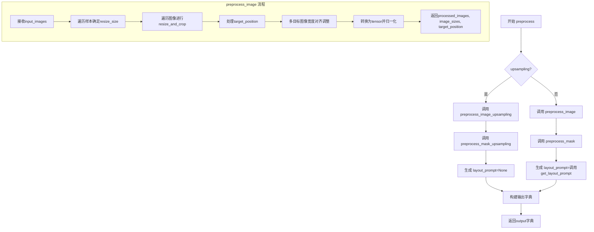
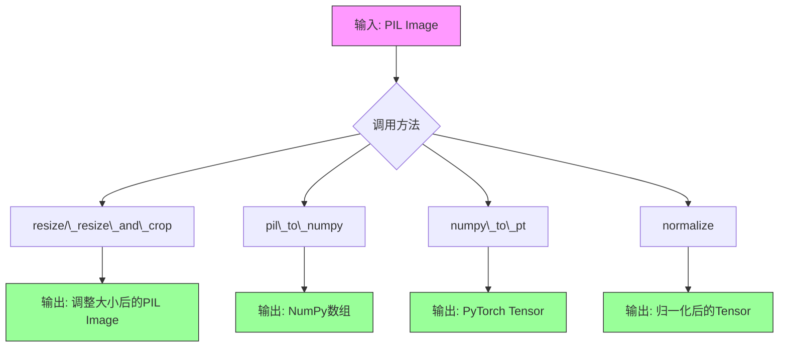
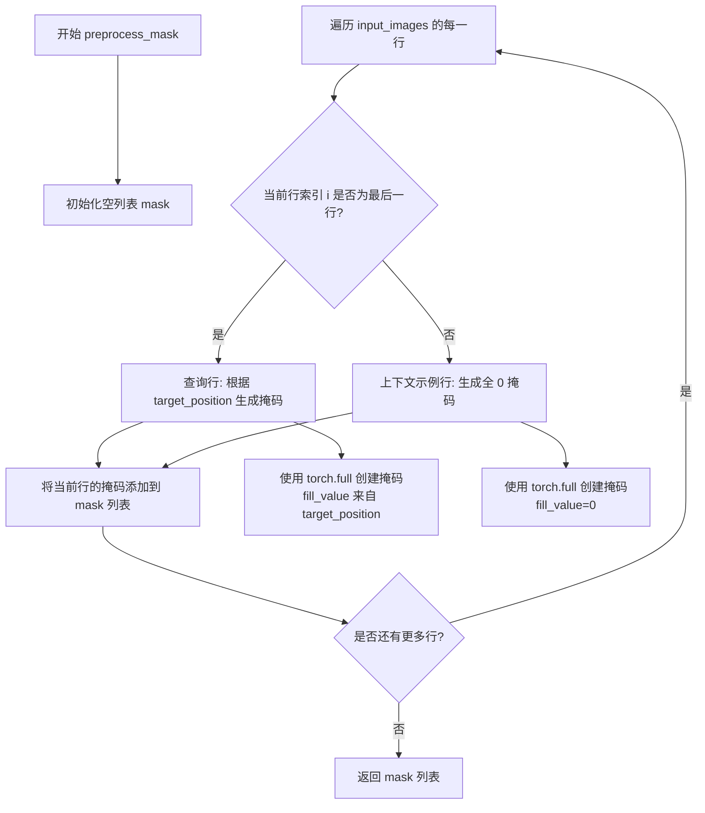
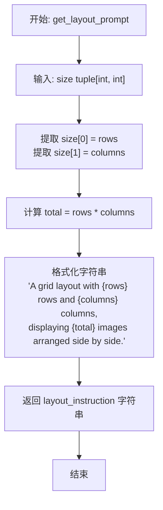
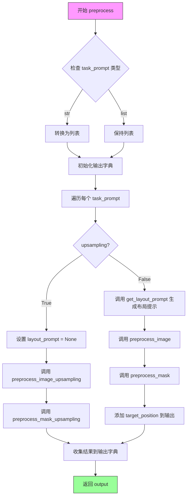

# `diffusers\src\diffusers\pipelines\visualcloze\visualcloze_utils.py` 详细设计文档

VisualClozeProcessor是一个继承自VaeImageProcessor的图像处理器，专门用于视觉完形填空(Visual Cloze)任务。该处理器负责对输入图像进行预处理，包括图像的resize、裁剪、归一化、mask生成以及布局提示词的生成，为视觉语言模型提供符合要求格式的图像输入。

## 整体流程



## 类结构

```
VaeImageProcessor (基类)
└── VisualClozeProcessor (继承类)
```

## 全局变量及字段


### `VisualClozeProcessor.resolution`
    
目标分辨率，用于处理图像的目标尺寸，默认值为384

类型：`int`
    
    

## 全局函数及方法


### `torch` (import)

这是Python代码中的模块导入语句，用于导入PyTorch深度学习框架。`torch`模块是VisualClozeProcessor类中所有张量操作的基础依赖，为图像处理和掩码生成提供Tensor数据结构和相关计算功能。

#### 导入信息

- **模块名称**：`torch`
- **导入方式**：`import torch`
- **来源**：PyTorch深度学习框架（第三方库）

#### 使用场景

在`VisualClozeProcessor`类中，`torch`模块被用于以下操作：

| 使用位置 | 用途 | 具体操作 |
|---------|------|---------|
| `preprocess_image` | 张量转换 | 将PIL图像转换为torch.Tensor |
| `preprocess_mask` | 掩码生成 | 使用`torch.full`创建全值掩码张量 |
| `preprocess_mask_upsampling` | 上采样掩码 | 使用`torch.ones`创建全1掩码张量 |

#### 带注释源码

```python
# Copyright 2025 VisualCloze team and The HuggingFace Team. All rights reserved.
#
# Licensed under the Apache License, Version 2.0 (the "License");
# you may not use this file except in compliance with the License.
# You may obtain a copy of the License at
#
#     http://www.apache.org/licenses/LICENSE-2.0
#
# Unless required by applicable law or agreed to in writing, software
# distributed under the License is distributed on an "AS IS" BASIS,
# WITHOUT WARRANTIES OR CONDITIONS OF ANY KIND, either express or implied.
# See the License for the specific language governing permissions and
# limitations under the License.

# 导入PyTorch深度学习框架
# 用途：提供Tensor数据结构，用于图像处理和掩码生成
import torch

# 导入PIL用于图像处理
from PIL import Image

# 从项目内部导入VAE图像处理器基类
from ...image_processor import VaeImageProcessor


class VisualClozeProcessor(VaeImageProcessor):
    """
    Image processor for the VisualCloze pipeline.
    ...
    """
    
    # 在以下方法中使用了torch:
    
    def preprocess_image(self, input_images, vae_scale_factor):
        """
        返回预处理后的图像，其中图像被转换为torch.Tensor类型
        """
        # ... 处理逻辑 ...
        # torch.Tensor用于存储处理后的图像数据
        
    def preprocess_mask(self, input_images, target_position):
        """
        生成掩码张量
        """
        # 使用torch.full创建指定填充值的张量
        row_masks = [
            torch.full((1, 1, row[0].shape[2], row[0].shape[3]), fill_value=m) 
            for m in target_position
        ]
        
    def preprocess_mask_upsampling(self, input_images):
        """
        生成上采样掩码
        """
        # 使用torch.ones创建全1张量
        return [[torch.ones((1, 1, input_images[0][0].shape[2], input_images[0][0].shape[3]))]]
```

#### 依赖说明

| 依赖项 | 版本要求 | 用途描述 |
|--------|---------|---------|
| torch | ≥1.0.0 | 提供Tensor数据结构和神经网络相关功能 |
| PIL (Pillow) | 最新版本 | 图像读取和处理 |
| VaeImageProcessor | 项目内部 | 图像处理的基类 |

#### 注意事项

1. **torch模块是核心依赖**：该处理器类完全依赖torch进行张量运算
2. **GPU/CPU兼容性**：torch自动处理设备管理（可通过`.to(device)`迁移到GPU）
3. **张量形状**：所有torch操作都基于4D张量 `(batch, channel, height, width)`


### `Image` (from PIL import)

PIL (Python Imaging Library) 的 Image 类，用于处理图像数据。在该代码中主要用于创建空白图像和类型注解。

#### 带注释源码

```python
# 导入语句
from PIL import Image

# 在代码中使用 Image 的地方：

# 1. 类型注解 - 用于标注输入图像的类型
input_images: list[list[Image.Image | None]]

# 2. 类型注解 - 用于标注已处理图像的类型  
input_images: list[list[Image.Image]]

# 3. 创建空白图像（用于目标图像位置）
blank = Image.new("RGB", resize_size[i] or (self.resolution, self.resolution), (0, 0, 0))
# 参数说明：
# - "RGB": 图像模式（红绿蓝三通道）
# - resize_size[i] or (self.resolution, self.resolution): 图像尺寸（宽度, 高度）
# - (0, 0, 0): RGB颜色值（黑色）
```


### `VaeImageProcessor`

这是从 `...image_processor` 模块导入的基类，为图像处理流水线提供核心的图像预处理功能，包括图像缩放、裁剪、格式转换（ PIL → NumPy → PyTorch Tensor）和归一化等操作。

参数：

- 无直接参数（构造函数参数由子类传递）

返回值：此类为基类，不直接返回值，主要通过子类实例方法调用

#### 流程图



#### 带注释源码

```
# VaeImageProcessor 基类接口（从 ...image_processor 导入）
# 以下为根据 VisualClozeProcessor 调用关系推断的基类核心方法签名

class VaeImageProcessor:
    """
    VAE图像处理器基类。
    
    提供图像预处理的基础方法，包括：
    - 图像缩放与裁剪
    - 格式转换（PIL <-> NumPy <-> PyTorch）
    - 像素值归一化
    """
    
    def __init__(self, *args, **kwargs):
        """初始化处理器，可接受可变参数传递给子类"""
        pass
    
    def _resize_and_crop(self, image: Image.Image, target_width: int, target_height: int) -> Image.Image:
        """
        调整图像大小并裁剪到目标尺寸
        
        Args:
            image: 输入的PIL图像
            target_width: 目标宽度
            target_height: 目标高度
            
        Returns:
            调整大小后的PIL图像
        """
        pass
    
    def resize(self, image: Image.Image, height: int, width: int) -> Image.Image:
        """
        调整图像到指定尺寸
        
        Args:
            image: 输入的PIL图像
            height: 目标高度
            width: 目标宽度
            
        Returns:
            调整大小后的PIL图像
        """
        pass
    
    def pil_to_numpy(self, image: Image.Image) -> np.ndarray:
        """
        将PIL图像转换为NumPy数组
        
        Args:
            image: PIL Image对象
            
        Returns:
            NumPy数组，形状为 [H, W, C]
        """
        pass
    
    def numpy_to_pt(self, image: np.ndarray) -> torch.Tensor:
        """
        将NumPy数组转换为PyTorch Tensor
        
        Args:
            image: NumPy数组
            
        Returns:
            PyTorch Tensor，形状为 [C, H, W]
        """
        pass
    
    def normalize(self, image: torch.Tensor) -> torch.Tensor:
        """
        归一化图像像素值
        
        Args:
            image: PyTorch Tensor
            
        Returns:
            归一化后的Tensor
        """
        pass
```

#### 继承关系说明

`VisualClozeProcessor` 继承自 `VaeImageProcessor`，并调用了以下父类方法：

| 方法名 | 调用位置 | 功能描述 |
|--------|----------|----------|
| `_resize_and_crop` | `preprocess_image` | 图像缩放与裁剪 |
| `pil_to_numpy` | `preprocess_image`, `preprocess_image_upsampling` | 格式转换 |
| `numpy_to_pt` | `preprocess_image`, `preprocess_image_upsampling` | 格式转换 |
| `normalize` | `preprocess_image`, `preprocess_image_upsampling` | 像素归一化 |
| `resize` | `preprocess_image_upsampling` | 图像缩放 |


### `VisualClozeProcessor.__init__`

初始化 `VisualClozeProcessor` 类实例，设置图像处理的分辨率参数，并调用父类 `VaeImageProcessor` 的初始化方法。

参数：

- `self`：隐式参数，当前类实例本身
- `*args`：可变位置参数，传递给父类 `VaeImageProcessor` 的额外位置参数
- `resolution`：`int`，目标分辨率，用于处理图像的尺寸，每个图像将在连接前调整为此分辨率以避免内存溢出，默认为 384
- `**kwargs`：可变关键字参数，传递给父类 `VaeImageProcessor` 的额外关键字参数

返回值：`None`，`__init__` 方法不返回值，仅初始化实例属性

#### 流程图

```mermaid
flowchart TD
    A[开始 __init__] --> B{接收参数}
    B --> C[*args 和 **kwargs]
    B --> D[resolution: int = 384]
    
    C --> E[调用父类 VaeImageProcessor.__init__]
    E --> F[super().__init__*args, **kwargs]
    
    D --> G[设置实例属性 self.resolution]
    G --> H[赋值 resolution 值]
    
    F --> H
    H --> I[结束初始化]
```

#### 带注释源码

```python
def __init__(self, *args, resolution: int = 384, **kwargs):
    """
    初始化 VisualClozeProcessor 实例。
    
    该方法继承自 VaeImageProcessor，并添加了 resolution 属性用于指定图像处理的目标分辨率。
    
    Args:
        *args: 可变位置参数，传递给父类 VaeImageProcessor 的额外参数
        resolution (int, optional): 目标分辨率，默认为 384
        **kwargs: 可变关键字参数，传递给父类 VaeImageProcessor 的额外关键字参数
    """
    # 调用父类 VaeImageProcessor 的初始化方法，传递所有接收到的额外参数
    super().__init__(*args, **kwargs)
    
    # 设置实例属性 resolution，用于后续图像处理的尺寸控制
    self.resolution = resolution
```


### `VisualClozeProcessor.preprocess_image`

该方法负责对输入图像进行预处理，包括调整大小、裁剪、转换为张量、归一化，并跟踪目标图像的位置信息。

**参数：**

- `input_images`：`list[list[Image.Image | None]]`，嵌套的PIL图像列表，其中外层列表代表不同样本（包括上下文示例和查询），内层列表包含任务图像，最后一行的条件图像正常提供，目标图像设为None
- `vae_scale_factor`：`int`，VAE用于调整图像大小的缩放因子

**返回值：** `tuple[list[list[torch.Tensor]], list[list[list[int]]], list[int]]`，包含预处理后的图像张量列表、每个处理后图像的尺寸列表、以及目标位置列表

#### 流程图

```mermaid
flowchart TD
    A[开始 preprocess_image] --> B[获取样本数和每样本图像数]
    B --> C[初始化空列表: processed_images, resize_size, target_position]
    C --> D[遍历每个样本 i]
    D --> E{找到第一个非None图像}
    E -->|是| F[计算目标区域和宽高比]
    F --> G[根据分辨率和宽高比计算新尺寸]
    G --> H[确保尺寸可被divisible整除]
    H --> I[保存resize_size[i]]
    E -->|否| J[继续下一个样本]
    I --> K[遍历每张图像 j]
    J --> K
    K --> L{当前图像是否为None}
    L -->|否| M[调用_resize_and_crop处理图像]
    L -->|是| N[创建空白RGB图像]
    M --> O{是否为最后一个样本}
    O -->|是| P[添加target_position=0]
    O -->|否| Q[跳过]
    N --> R{是否为最后一个样本}
    R -->|是| S[添加target_position=1]
    R -->|否| T[跳过]
    P --> U[保存到processed_images]
    S --> U
    Q --> U
    T --> U
    U --> V{还有更多图像需要处理}
    V -->|是| K
    V -->|否| W{目标位置数>1 且 和>1}
    W -->|是| X[统一调整最后样本的宽度]
    W -->|否| Y[转换为张量并归一化]
    X --> Y
    Y --> Z[构建image_sizes列表]
    Z --> AA[结束并返回结果]
```

#### 带注释源码

```python
def preprocess_image(
    self, input_images: list[list[Image.Image | None]], vae_scale_factor: int
) -> tuple[list[list[torch.Tensor]], list[list[list[int]]], list[int]]:
    """
    Preprocesses input images for the VisualCloze pipeline.

    This function handles the preprocessing of input images by:
    1. Resizing and cropping images to maintain consistent dimensions
    2. Converting images to the Tensor format for the VAE
    3. Normalizing pixel values
    4. Tracking image sizes and positions of target images

    Args:
        input_images (list[list[Image.Image | None]]):
            A nested list of PIL Images where:
            - Outer list represents different samples, including in-context examples and the query
            - Inner list contains images for the task
            - In the last row, condition images are provided and the target images are placed as None
        vae_scale_factor (int):
            The scale factor used by the VAE for resizing images

    Returns:
        tuple containing:
        - list[list[torch.Tensor]]: Preprocessed images in tensor format
        - list[list[list[int]]]: Dimensions of each processed image [height, width]
        - list[int]: Target positions indicating which images are to be generated
    """
    # 获取样本数量和每个样本的图像数量
    n_samples, n_task_images = len(input_images), len(input_images[0])
    # 计算可被VAE缩放因子整除的尺寸
    divisible = 2 * vae_scale_factor

    # 初始化处理后的图像列表，每个样本一个子列表
    processed_images: list[list[Image.Image]] = [[] for _ in range(n_samples)]
    # 存储每个样本的调整大小目标尺寸
    resize_size: list[tuple[int, int] | None] = [None for _ in range(n_samples)]
    # 存储目标位置（0=条件图像，1=目标图像）
    target_position: list[int] = []

    # Process each sample: 遍历处理每个样本
    for i in range(n_samples):
        # Determine size from first non-None image: 从第一个非None图像确定目标尺寸
        for j in range(n_task_images):
            if input_images[i][j] is not None:
                # 计算原始图像宽高比
                aspect_ratio = input_images[i][j].width / input_images[i][j].height
                # 根据目标分辨率计算目标区域
                target_area = self.resolution * self.resolution
                new_h = int((target_area / aspect_ratio) ** 0.5)
                new_w = int(new_h * aspect_ratio)

                # Ensure size is divisible by vae_scale_factor: 确保尺寸可被VAE缩放因子整除
                new_w = max(new_w // divisible, 1) * divisible
                new_h = max(new_h // divisible, 1) * divisible
                # 保存该样本的目标尺寸
                resize_size[i] = (new_w, new_h)
                break

        # Process all images in the sample: 处理该样本中的所有图像
        for j in range(n_task_images):
            if input_images[i][j] is not None:
                # 对非None图像进行resize和crop处理
                target = self._resize_and_crop(input_images[i][j], resize_size[i][0], resize_size[i][1])
                processed_images[i].append(target)
                # 如果是最后一个样本（查询行），记录目标位置为0（条件图像）
                if i == n_samples - 1:
                    target_position.append(0)
            else:
                # 对于None图像（目标图像位置），创建空白RGB图像
                blank = Image.new("RGB", resize_size[i] or (self.resolution, self.resolution), (0, 0, 0))
                processed_images[i].append(blank)
                # 如果是最后一个样本，记录目标位置为1（需要生成的图像）
                if i == n_samples - 1:
                    target_position.append(1)

    # Ensure consistent width for multiple target images when there are multiple target images
    # 当有多个目标图像时，确保宽度一致
    if len(target_position) > 1 and sum(target_position) > 1:
        # 获取最后一个样本的宽度作为参考
        new_w = resize_size[n_samples - 1][0] or 384
        # 遍历所有处理后的图像，按比例调整高度并确保尺寸可被16整除
        for i in range(len(processed_images)):
            for j in range(len(processed_images[i])):
                if processed_images[i][j] is not None:
                    # 按比例计算新高度
                    new_h = int(processed_images[i][j].height * (new_w / processed_images[i][j].width))
                    # 确保宽度和高度都是16的倍数
                    new_w = int(new_w / 16) * 16
                    new_h = int(new_h / 16) * 16
                    # 重新resize和crop
                    processed_images[i][j] = self._resize_and_crop(processed_images[i][j], new_h, new_w)

    # Convert to tensors and normalize: 转换为张量并归一化
    image_sizes = []
    for i in range(len(processed_images)):
        # 记录每张图像的尺寸 [height, width]
        image_sizes.append([[img.height, img.width] for img in processed_images[i]])
        for j, image in enumerate(processed_images[i]):
            # PIL图像转numpy数组
            image = self.pil_to_numpy(image)
            # numpy数组转PyTorch张量
            image = self.numpy_to_pt(image)
            # 归一化像素值
            image = self.normalize(image)
            processed_images[i][j] = image

    # 返回预处理结果：处理后的图像、图像尺寸、目标位置
    return processed_images, image_sizes, target_position
```


### `VisualClozeProcessor.preprocess_mask`

该方法用于为 VisualCloze 流水线生成掩码。通过遍历输入图像的每一行，根据当前行是否为查询行（在最后一行）来生成对应的掩码张量：对于查询行，根据 target_position 中指定的位置标记目标图像（值为 1）或条件图像（值为 0）；对于上下文示例行，所有位置都标记为 0（不生成目标）。

参数：

- `input_images`：`list[list[Image.Image]]`，从 preprocess_image 方法返回的处理后的图像列表
- `target_position`：`list[int]`，二进制列表，标记目标图像的位置（1 表示目标，0 表示条件）

返回值：`list[list[torch.Tensor]]`，嵌套的掩码张量列表，其中 1 表示目标位置，0 表示条件图像

#### 流程图



#### 带注释源码

```python
def preprocess_mask(
    self, input_images: list[list[Image.Image]], target_position: list[int]
) -> list[list[torch.Tensor]]:
    """
    Generate masks for the VisualCloze pipeline.

    Args:
        input_images (list[list[Image.Image]]):
            Processed images from preprocess_image
        target_position (list[int]):
            Binary list marking the positions of target images (1 for target, 0 for condition)

    Returns:
        list[list[torch.Tensor]]:
            A nested list of mask tensors (1 for target positions, 0 for condition images)
    """
    # 初始化用于存储所有掩码的列表
    mask = []
    
    # 遍历输入图像的每一行（每个样本）
    for i, row in enumerate(input_images):
        # 判断当前行是否为查询行（最后一行）
        if i == len(input_images) - 1:  # Query row
            # 对于查询行，根据 target_position 生成对应的掩码
            # target_position 中的 1 表示该位置需要生成目标图像
            # target_position 中的 0 表示该位置已经是条件图像
            row_masks = [
                # 使用 torch.full 创建与图像尺寸相同的掩码张量
                # 掩码维度: (1, 1, height, width) - 与图像张量形状匹配
                torch.full((1, 1, row[0].shape[2], row[0].shape[3]), fill_value=m) 
                for m in target_position
            ]
        else:  # In-context examples
            # 对于上下文示例行，所有位置都标记为 0
            # 因为这些是已知的示例，不需要生成目标
            row_masks = [
                torch.full((1, 1, row[0].shape[2], row[0].shape[3]), fill_value=0) 
                for _ in target_position
            ]
        
        # 将当前行的掩码添加到总掩码列表中
        mask.append(row_masks)
    
    # 返回生成的掩码列表
    return mask
```


### `VisualClozeProcessor.preprocess_image_upsampling`

处理 VisualCloze pipeline 中 upsampling 阶段的图像，对输入图像进行尺寸调整、格式转换和归一化处理。

参数：

- `input_images`：`list[list[Image.Image]]`，输入的图像列表，外层列表表示样本，内层列表表示该样本中的图像
- `height`：`int`，目标高度，用于调整图像尺寸
- `width`：`int`，目标宽度，用于调整图像尺寸

返回值：`tuple[list[list[Image.Image]], list[list[list[int]]]]`，返回处理后的图像（包含PyTorch张量）和图像尺寸信息

#### 流程图

```mermaid
flowchart TD
    A[开始 preprocess_image_upsampling] --> B[调用 resize 方法调整图像尺寸]
    B --> C[调用 pil_to_numpy 转换为 numpy 数组]
    C --> D[调用 numpy_to_pt 转换为 PyTorch 张量]
    D --> E[调用 normalize 归一化图像]
    E --> F[更新 input_images[0][0] 为处理后的图像张量]
    F --> G[创建 image_sizes = [[[height, width]]]]
    G --> H[返回 tuple: input_images, image_sizes]
```

#### 带注释源码

```python
def preprocess_image_upsampling(
    self,
    input_images: list[list[Image.Image]],
    height: int,
    width: int,
) -> tuple[list[list[Image.Image]], list[list[list[int]]]]:
    """Process images for the upsampling stage in the VisualCloze pipeline.

    Args:
        input_images: Input image to process
        height: Target height
        width: Target width

    Returns:
        tuple of processed image and its size
    """
    # Step 1: 使用 resize 方法将图像调整到目标高度和宽度
    image = self.resize(input_images[0][0], height, width)
    
    # Step 2: 将 PIL 图像转换为 numpy 数组格式
    image = self.pil_to_numpy(image)  # to np
    
    # Step 3: 将 numpy 数组转换为 PyTorch 张量
    image = self.numpy_to_pt(image)  # to pt
    
    # Step 4: 归一化图像像素值
    image = self.normalize(image)

    # Step 5: 将处理后的图像张量存回输入列表的第一位置
    input_images[0][0] = image
    
    # Step 6: 创建图像尺寸列表，格式为 [[[height, width]]]
    image_sizes = [[[height, width]]]
    
    # Step 7: 返回处理后的图像列表和图像尺寸
    return input_images, image_sizes
```


### `VisualClozeProcessor.preprocess_mask_upsampling`

该方法用于在VisualCloze管道的上采样阶段生成掩码张量。它接收预处理后的图像列表，根据第一个图像的形状创建一个全1的掩码张量，表示目标图像区域。

参数：

- `input_images`：`list[list[Image.Image]]`，预处理后的图像列表，用于确定生成掩码的目标图像尺寸

返回值：`list[list[torch.Tensor]]`，返回一个嵌套列表结构的掩码张量，外层列表表示样本，内层列表表示该样本中的掩码，掩码值为1表示目标区域

#### 流程图

```mermaid
graph TD
    A[开始 preprocess_mask_upsampling] --> B[获取 input_images[0][0] 的形状]
    B --> C[创建全1掩码张量 torch.ones]
    C --> D[形状: (1, 1, height, width)]
    D --> E[包装为 [[mask]] 格式]
    E --> F[返回掩码列表]
```

#### 带注释源码

```python
def preprocess_mask_upsampling(self, input_images: list[list[Image.Image]]) -> list[list[torch.Tensor]]:
    """
    在上采样阶段生成掩码。
    
    Args:
        input_images: 预处理后的图像列表，结构为 list[list[Image.Image]]
                      第一个索引代表样本，第二个索引代表图像
    
    Returns:
        list[list[torch.Tensor]]: 掩码张量列表，外层list对应样本，
                                  内层list对应每个图像的掩码，掩码值全为1
    """
    # 提取第一个图像的形状信息（高度和宽度）
    # input_images[0][0] 表示第一个样本的第一张图像
    # shape[2] 对应高度，shape[3] 对应宽度
    height = input_images[0][0].shape[2]
    width = input_images[0][0].shape[3]
    
    # 创建全1掩码张量，形状为 (1, 1, height, width)
    # 值为1表示该区域为目标图像，需要被生成
    mask = torch.ones((1, 1, height, width))
    
    # 将掩码包装为嵌套列表格式返回
    # 外层列表：样本维度
    # 内层列表：图像维度
    return [[mask]]
```


### `VisualClozeProcessor.get_layout_prompt`

该方法用于生成描述图像网格布局的提示文本，根据给定的行数和列数生成自然语言格式的布局指令。

参数：

- `size`：`tuple[int, int]`，包含行数和列数的元组，用于指定图像网格的维度

返回值：`str`，描述网格布局的文本提示，包含行数、列数和图像总数信息

#### 流程图



#### 带注释源码

```python
def get_layout_prompt(self, size: tuple[int, int]) -> str:
    """
    生成描述图像网格布局的提示文本。

    该方法接受一个包含行数和列数的元组，生成自然语言格式的布局描述，
    用于告诉模型图像的排列方式。

    参数:
        size: 包含两个整数的元组
            - size[0]: 网格的行数
            - size[1]: 网格的列数

    返回:
        str: 描述网格布局的字符串，格式为:
            "A grid layout with {rows} rows and {columns} columns, 
             displaying {rows * columns} images arranged side by side."
    """
    # 构建布局指令字符串，使用 f-string 格式化
    # size[0] 表示行数，size[1] 表示列数，size[0] * size[1] 计算总图像数
    layout_instruction = (
        f"A grid layout with {size[0]} rows and {size[1]} columns, displaying {size[0] * size[1]} images arranged side by side.",
    )
    # 返回生成的布局提示文本
    return layout_instruction
```


### `VisualClozeProcessor.preprocess`

该方法是VisualCloze处理器的核心预处理入口，负责协调图像预处理、掩码生成和提示符构建，根据是否处于upsampling阶段选择不同的处理流程，最终返回包含处理后的图像、掩码、提示符和元数据的统一字典。

参数：

- `task_prompt`：`str | list[str]`，任务描述，可以是单个字符串或字符串列表
- `content_prompt`：`str | list[str]`，内容描述，可以是单个字符串或字符串列表
- `input_images`：`list[list[list[str | None]]] | None`，输入图像的三维列表，最内层为图像路径或None（表示目标图像位置）
- `height`：`int | None`，可选参数，upsampling阶段的目标高度
- `width`：`int | None`，可选参数，upsampling阶段的目标宽度
- `upsampling`：`bool`，标志位，指示当前是否处于upsampling处理阶段，默认为False
- `vae_scale_factor`：`int`，VAE模型的缩放因子，用于图像尺寸对齐计算，默认为16

返回值：`dict`，包含以下键值对：
- `init_image`：处理后的图像张量列表
- `mask`：掩码张量列表
- `task_prompt`：任务提示符列表（upsampling时为None列表）
- `content_prompt`：内容提示符列表
- `layout_prompt`：布局提示符列表（upsampling时为None）
- `target_position`：目标位置列表，标记哪些图像是待生成的目标
- `image_size`：处理后的图像尺寸列表

#### 流程图



#### 带注释源码

```python
def preprocess(
    self,
    task_prompt: str | list[str],
    content_prompt: str | list[str],
    input_images: list[list[list[str | None]]] | None = None,
    height: int | None = None,
    width: int | None = None,
    upsampling: bool = False,
    vae_scale_factor: int = 16,
) -> dict:
    """处理视觉完形填空任务的输入数据。
    
    该方法是VisualCloze处理器的核心入口，负责协调图像预处理、掩码生成
    和提示符构建，根据是否处于upsampling阶段选择不同的处理流程。
    
    Args:
        task_prompt: 任务描述，可以是单个字符串或字符串列表
        content_prompt: 内容描述，可以是单个字符串或字符串列表
        input_images: 输入图像的三维列表，最内层为图像路径或None
        height: 可选的目标高度，用于upsampling阶段
        width: 可选的目标宽度，用于upsampling阶段
        upsampling: 标志位，指示当前是否处于upsampling处理阶段
        vae_scale_factor: VAE模型的缩放因子，用于图像尺寸对齐
    
    Returns:
        包含处理后图像、掩码、提示符和元数据的字典
    """
    # 将单个字符串转换为列表，保持处理逻辑的一致性
    if isinstance(task_prompt, str):
        task_prompt = [task_prompt]
        content_prompt = [content_prompt]
        input_images = [input_images]

    # 初始化输出字典结构
    output = {
        "init_image": [],          # 处理后的图像张量
        "mask": [],               # 掩码张量
        # upsampling阶段任务提示符设为None
        "task_prompt": task_prompt if not upsampling else [None for _ in range(len(task_prompt))],
        "content_prompt": content_prompt,
        "layout_prompt": [],      # 布局提示符
        "target_position": [],    # 目标位置标记
        "image_size": [],         # 图像尺寸
    }
    
    # 遍历每个样本进行处理
    for i in range(len(task_prompt)):
        # 根据upsampling标志选择处理路径
        if upsampling:
            # upsampling阶段：布局提示符为None
            layout_prompt = None
            
            # 调用upsampling专用的图像预处理方法
            cur_processed_images, cur_image_size = self.preprocess_image_upsampling(
                input_images[i], height=height, width=width
            )
            # 生成upsampling阶段的掩码（全1掩码）
            cur_mask = self.preprocess_mask_upsampling(cur_processed_images)
        else:
            # 正常阶段：生成布局提示符
            layout_prompt = self.get_layout_prompt((
                len(input_images[i]),           # 行数（样本数）
                len(input_images[i][0])         # 列数（每样本图像数）
            ))
            
            # 调用标准图像预处理方法
            cur_processed_images, cur_image_size, cur_target_position = self.preprocess_image(
                input_images[i], vae_scale_factor=vae_scale_factor
            )
            # 生成标准掩码（根据target_position区分目标和条件图像）
            cur_mask = self.preprocess_mask(cur_processed_images, cur_target_position)
            
            # 记录目标位置信息
            output["target_position"].append(cur_target_position)

        # 将当前样本的处理结果添加到输出字典
        output["image_size"].append(cur_image_size)
        output["init_image"].append(cur_processed_images)
        output["mask"].append(cur_mask)
        output["layout_prompt"].append(layout_prompt)

    return output
```

## 关键组件


### VisualClozeProcessor 类

主处理器类，继承自 VaeImageProcessor，负责视觉填空任务的图像预处理，包括图像调整大小、裁剪、归一化和掩码生成。

### preprocess_image 方法

图像预处理核心方法，处理输入图像的调整大小、裁剪和归一化，追踪图像尺寸和目标位置。

### preprocess_mask 方法

掩码生成方法，根据目标位置生成二进制掩码，标记目标图像（1）和条件图像（0）。

### preprocess_image_upsampling 方法

上采样阶段图像处理方法，处理用于超分辨率的图像输入。

### preprocess_mask_upsampling 方法

上采样阶段掩码生成方法，为上采样图像生成全1掩码。

### get_layout_prompt 方法

布局提示生成方法，根据图像网格行列数生成描述性文本提示。

### preprocess 方法

主预处理入口方法，协调图像、掩码和提示的处理流程，支持普通模式和上采样模式。

### 分辨率与尺寸对齐机制

基于 vae_scale_factor 的图像尺寸对齐逻辑，确保图像尺寸可被 16 整除，避免 VAE 内存溢出错误。

### 多目标图像宽度一致性处理

当存在多个目标图像时，自动调整所有图像宽度以保持一致的网格布局。

## 问题及建议


### 已知问题

- **preprocess_image方法中target_position逻辑错误**：在第74-77行，`target_position.append`的调用逻辑有问题。无论图像是否为None，每次循环都会添加0或1到target_position列表中，而不是根据实际图像的None状态来决定。实际上应该是：当`input_images[i][j]`不为None时添加0（条件图像），为None时添加1（目标图像），但当前代码将这个逻辑放在了循环内部，导致逻辑混乱。

- **类型注解不一致**：在第51行，`processed_images`声明为`list[list[Image.Image]]`，但在第93-96行循环中，却被赋值为`torch.Tensor`，这与声明的类型不符，会造成类型混淆。

- **空图像列表的边界问题**：如果`input_images`中所有图像都是None，`resize_size[i]`将保持为None，导致第82行的`Image.new()`调用使用`(self.resolution, self.resolution)`作为默认值，虽然有fallback处理，但可能导致尺寸计算不准确。

- **preprocess_mask假设所有图像尺寸相同**：在第136行和第144行，代码假设同一行中的所有图像具有相同的尺寸（使用`row[0].shape`），如果图像尺寸不一致会导致mask生成错误。

- **preprocess_image_upsampling修改输入参数**：第155-164行的方法直接修改了输入的`input_images`参数，这是不好的实践，可能导致意外的副作用。

- **缺少输入验证**：所有公共方法都缺乏对输入参数的基本验证（如检查None值、类型检查、空列表检查等），可能导致运行时错误。

- **魔法数字和硬编码值**：代码中多处使用硬编码的数值，如第71行的`384`（虽然resolution有默认值，但fallback逻辑中仍使用硬编码），第135行的`1`等，缺乏可配置性。

### 优化建议

- **修复target_position逻辑**：将target_position的添加逻辑移到正确的位置，确保只有当图像为None时才标记为target（1），条件图像标记为0。

- **统一类型注解**：明确`processed_images`变量的类型声明，或者在处理过程中保持类型一致性，避免类型混淆。

- **添加输入验证**：在每个公共方法开始时添加基本的输入验证，如检查必要参数是否为None、列表是否为空、类型是否正确等。

- **重构图像处理逻辑**：将PIL转numpy转tensor并归一化的公共逻辑提取为私有方法，避免在`preprocess_image`和`preprocess_image_upsampling`中重复代码。

- **修复preprocess_image_upsampling**：不要直接修改输入参数，而是返回新的处理后图像。

- **增强preprocess_mask的鲁棒性**：移除对所有图像尺寸相同的假设，或者在预处理阶段确保尺寸一致性。

- **移除魔法数字**：将所有硬编码的数值提取为类常量或配置参数，提高代码可维护性。

## 其它


### 设计目标与约束

**设计目标**：VisualClozeProcessor 旨在为 VisualCloze 视觉填空任务提供统一的图像预处理能力，支持多图拼接、条件图像与目标图像区分、VAE 兼容的尺寸调整等功能。核心目标是将原始 PIL 图像转换为符合 VAE 输入要求的归一化张量，同时保留图像尺寸信息和目标位置标记供下游 pipeline 使用。

**设计约束**：

- 输入图像尺寸必须能够被 `2 * vae_scale_factor` 整除，以确保 VAE 的水印块（watermark blocks）正常工作
- 所有样本的图像列数（n_task_images）必须一致，以支持批量处理
- 目标图像位置必须在最后一个样本行（query row），且该行所有条件图像位置标记为 0，目标图像位置标记为 1
- 最小图像尺寸限制为 `divisible`（即 2 * vae_scale_factor），确保缩放后不会产生过小的图像

### 错误处理与异常设计

**输入验证**：

- `input_images` 为 None 时：若 `upsampling=False`，在 `preprocess_image` 中会抛出 `IndexError`（因为遍历时无法找到非 None 图像来确定尺寸）
- `resolution` 参数：默认为 384，需确保为正整数，否则 `target_area` 计算异常
- `vae_scale_factor`：需为正整数，若为 0 或负数会导致除零错误

**尺寸不匹配处理**：

- 当 `input_images[i][j]` 为 None 但 `resize_size[i]` 仍为 None 时，会使用默认分辨率 `(self.resolution, self.resolution)` 创建空白图像
- 多目标图像宽度对齐时，若 `resize_size[n_samples - 1][0]` 为 None，则默认使用 384

**异常传播**：

- 底层 PIL 操作（如 `Image.new`、`self.resize`）可能抛出 `IOError` 或 `ValueError`，应在上层 pipeline 中捕获
- 张量转换过程中的设备迁移（CPU/GPU）未在本类中处理，需由调用方确保

### 数据流与状态机

**主状态机**：

```
preprocess()
    │
    ├─── 状态1：输入验证与参数规范化
    │       - 将单个 task_prompt/content_prompt 转换为列表
    │       - 确保 input_images 嵌套结构一致
    │
    ├─── 状态2：分支处理
    │       │
    │       ├─── upsampling=False
    │       │       │
    │       │       ├─── preprocess_image()
    │       │       │       1. 计算目标尺寸（基于首张非空图像的宽高比）
    │       │       │       2. 遍历处理每张图像（resize & crop）
    │       │       │       3. 标记目标位置（None→目标，图像→条件）
    │       │       │       4. 多目标宽度对齐
    │       │       │       5. 转换为张量并归一化
    │       │       │
    │       │       └─── preprocess_mask()
    │       │               - 根据 target_position 生成掩码张量
    │       │               - 查询行：使用 target_position 值
    │       │               - 示例行：全 0
    │       │
    │       └─── upsampling=True
    │               │
    │               ├─── preprocess_image_upsampling()
    │               │       - 直接 resize 到目标 height/width
    │               │       - 转换为张量并归一化
    │               │
    │               └─── preprocess_mask_upsampling()
    │                       - 全 1 掩码（表示整个图像需要生成）
    │
    └─── 状态3：输出组装
            - 收集所有 processed_images、masks、prompts、metadata
            - 返回统一字典格式
```

### 外部依赖与接口契约

**依赖项**：

| 依赖模块 | 版本要求 | 用途 |
|---------|---------|------|
| `torch` | ≥1.0 | 张量操作与掩码生成 |
| `PIL` (Pillow) | 任意兼容版本 | 图像加载、变换、创建空白图像 |
| `VaeImageProcessor` | 兼容版本 | 父类，提供 resize、normalize、格式转换等基础方法 |

**父类接口契约（VaeImageProcessor）**：

- `self.resolution`：图像处理的目标分辨率
- `self._resize_and_crop(image, width, height)`：调整图像尺寸并居中裁剪
- `self.resize(image, width, height)`：调整图像尺寸
- `self.pil_to_numpy(image)`：PIL Image → NumPy 数组
- `self.numpy_to_pt(array)`：NumPy 数组 → PyTorch 张量
- `self.normalize(tensor)`：像素值归一化

**下游依赖（Pipeline 调用约定）**：

- `preprocess()` 返回的字典包含键：`init_image`、`mask`、`task_prompt`、`content_prompt`、`layout_prompt`、`target_position`、`image_size`
- `init_image[i]`：形状为 `(batch, channels, height, width)` 的 4D 张量
- `mask[i]`：形状为 `(1, 1, height, width)` 的 4D 张量，值为 0 或 1
- `target_position[i]`：列表，长度等于 `n_task_images`

### 性能考量与资源消耗

**时间复杂度**：

- `preprocess_image`：O(n_samples × n_task_images × (resize + tensor_conversion))
- `preprocess_mask`：O(n_samples × n_task_images)
- `preprocess`：O(n_prompts × preprocess_image 复杂度)

**空间复杂度**：

- 内存占用主要来自存储所有预处理后的图像张量：O(n_samples × n_task_images × H × W × C)
- 典型场景（384×384，3通道，10张图像）约需 10 × 384 × 384 × 3 × 4 bytes ≈ 17.8 MB

**优化建议**：

- 当前实现中图像按序处理，可考虑并行化多样本处理
- 宽度对齐步骤在多目标场景下可能存在重复计算，可缓存中间结果

### 配置参数与可扩展性

**构造参数**：

| 参数 | 类型 | 默认值 | 说明 |
|-----|------|-------|------|
| `resolution` | int | 384 | 目标分辨率，用于计算基准尺寸 |
| `*args` | 可变位置参数 | - | 传递给父类 VaeImageProcessor |
| `**kwargs` | 可变关键字参数 | - | 传递给父类 VaeImageProcessor |

**方法扩展点**：

- 子类可重写 `get_layout_prompt()` 自定义布局描述生成逻辑
- 可通过重写 `_resize_and_crop` 或 `resize` 方法替换默认的 resize 策略（如使用不同插值算法）
- 可在 `preprocess()` 中添加自定义后处理步骤（如数据增强、格式转换）

### 版本兼容性说明

**兼容性考量**：

- 代码使用 Python 3.9+ 的类型提示语法（`list[list[Image.Image | None]]`），需 Python 3.9+
- 使用 `|` 联合类型语法（Python 3.10+），在 3.9 环境中需使用 `Union` 类型
- 依赖于 HuggingFace Transformers 库的 `VaeImageProcessor` 父类，需确保版本兼容

### 测试用例设计建议

**单元测试覆盖点**：

1. 单样本单图像预处理
2. 多样本多图像（含目标图像）预处理
3. 目标位置标记正确性
4. 多目标宽度对齐逻辑
5. upsampling 模式处理
6. 空输入（None）边界条件
7. 尺寸无法整除时的处理


    