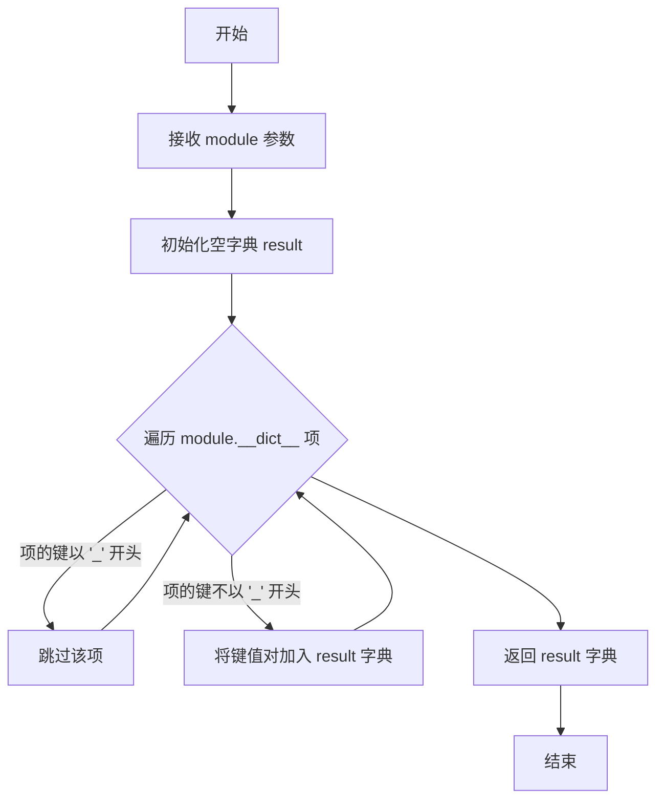
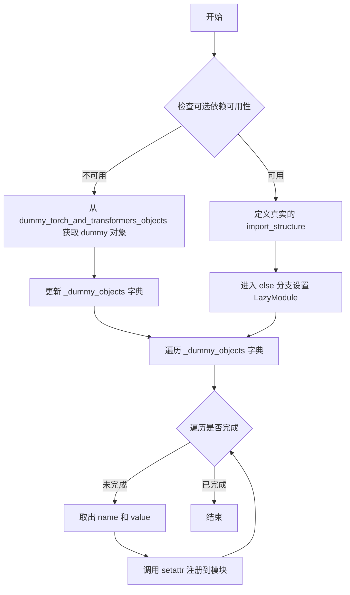

# `diffusers\src\diffusers\pipelines\wan\__init__.py` 详细设计文档

这是一个延迟加载模块初始化文件，用于在Diffusers库中按需导入Wan系列的Pipeline类（包括WanPipeline、WanAnimatePipeline、WanImageToVideoPipeline、WanVACEPipeline、WanVideoToVideoPipeline），通过_LazyModule机制和可选依赖检查实现条件加载，只有当torch和transformers都可用时才加载真实对象，否则使用dummy对象填充。

## 整体流程

```mermaid
graph TD
    A[模块导入] --> B{DIFFUSERS_SLOW_IMPORT 或 TYPE_CHECK}
    B -- 是 --> C{is_transformers_available() && is_torch_available()}
    C -- 否 --> D[导入dummy_torch_and_transformers_objects]
    C -- 是 --> E[从子模块导入真实Pipeline类]
    B -- 否 --> F[创建_LazyModule]
    F --> G[将_dummy_objects注册到sys.modules]
    D --> H[更新_import_structure和_dummy_objects]
    E --> I[更新_import_structure]
    G --> J[完成延迟加载设置]
    H --> J
    I --> J
```

## 类结构

```
此文件为模块入口，无类层次结构
主要使用第三方工具类:
├── _LazyModule (来自diffusers.utils)
├── get_objects_from_module (来自diffusers.utils)
├── OptionalDependencyNotAvailable (来自diffusers.utils)
└── TYPE_CHECKING (来自typing)
```

## 全局变量及字段


### `_dummy_objects`
    
存储可选依赖不可用时的替代对象，用于延迟导入时的回退机制

类型：`dict`
    


### `_import_structure`
    
定义模块的导入结构，键为模块路径，值为可导出的类名列表

类型：`dict`
    


    

## 全局函数及方法


### `get_objects_from_module`

从模块中动态提取所有公共对象（类、函数等）的工具函数，常用于延迟加载和动态导入场景。

参数：

- `module`：`Module`，要从中提取对象的 Python 模块

返回值：`Dict[str, Any]`，返回模块中所有非下划线开头的公共对象的字典，键为对象名称，值为对象本身

#### 流程图



#### 带注释源码

```
def get_objects_from_module(module):
    """
    从给定模块中提取所有公共对象（不包括以下划线开头的属性）
    
    参数:
        module: Python 模块对象，从中提取对象
        
    返回:
        包含模块中所有公共对象（类、函数、变量等）的字典
    """
    # 初始化结果字典
    result = {}
    
    # 遍历模块的所有属性
    for name, obj in module.__dict__.items():
        # 过滤掉以下划线开头的私有/内部对象
        if name.startswith('_'):
            continue
        # 将公共对象添加到结果字典
        result[name] = obj
    
    return result
```

> **注意**：用户提供的代码片段中仅包含 `get_objects_from_module` 的调用位置，未提供该函数的完整实现。上述源码为根据函数命名约定和调用上下文推断的典型实现模式。该函数在扩散器库的延迟加载机制中发挥关键作用，用于从虚拟模块中获取占位对象，以支持可选依赖项的动态导入。


### `setattr(sys.modules[__name__], name, value)`

将 dummy 对象注册到当前模块，使懒加载模块在运行时能够访问这些占位对象。

参数：

- `obj`：`sys.modules[__name__]`，当前模块对象，表示需要设置属性的目标模块
- `name`：`str`，来自 `_dummy_objects` 字典的键，即需要注册的 dummy 对象名称
- `value`：`任意类型`，来自 `_dummy_objects` 字典的值，即需要注册的 dummy 对象本身

返回值：`None`，`setattr` 函数不返回值

#### 流程图



#### 带注释源码

```python
# 遍历所有 dummy 对象
for name, value in _dummy_objects.items():
    # 使用 setattr 将每个 dummy 对象注册到当前模块
    # 参数1: sys.modules[__name__] - 当前模块对象
    # 参数2: name - 要设置的属性名（dummy 对象名称）
    # 参数3: value - 要设置的属性值（dummy 对象本身）
    setattr(sys.modules[__name__], name, value)
```

#### 说明

此代码段是 Diffusers 库中常见的懒加载模式实现。当 `transformers` 和 `torch` 不可用时，`_dummy_objects` 包含预先定义的占位符类（用于避免导入错误）。通过 `setattr` 将这些占位符动态添加到模块中，使得后续代码可以正常执行 `from xxx import WanPipeline` 等语句，而不会因为缺少可选依赖而抛出 `ImportError`。

## 关键组件


### 1. 整体功能概述

该代码是Wan AI Pipeline的模块初始化文件，通过延迟加载机制动态导入多个视频生成Pipeline类（WanPipeline、WanAnimatePipeline、WanImageToVideoPipeline、WanVACEPipeline、WanVideoToVideoPipeline），并在torch和transformers可选依赖不可用时提供虚拟对象以保持API一致性。

### 2. 关键组件

### 延迟加载模块（Lazy Loading）

通过`_LazyModule`实现模块的惰性加载，只有在实际使用Pipeline时才加载相关模块，提高导入速度并优化内存使用。

### 可选依赖处理机制

检查torch和transformers库是否可用，当两者都不可用时抛出`OptionalDependencyNotAvailable`异常，并从dummy模块加载虚拟对象以保持API兼容性。

### 导入结构字典

`_import_structure`字典定义了模块的导入结构，将Pipeline类名映射到导入路径，支持动态模块解析。

### 虚拟对象模式

使用`_dummy_objects`存储虚拟对象，当可选依赖不可用时，通过`setattr`将这些虚拟对象设置到模块中，确保模块在缺少依赖时仍可被导入。

### Pipeline类族

- **WanPipeline**：基础视频生成Pipeline
- **WanAnimatePipeline**：动画生成Pipeline  
- **WanImageToVideoPipeline**：图像到视频转换Pipeline
- **WanVACEPipeline**：视频分析和编辑Pipeline
- **WanVideoToVideoPipeline**：视频到视频转换Pipeline


## 问题及建议


### 已知问题

-   **重复的依赖检查逻辑**：代码中存在两处几乎完全相同的 `try-except` 依赖检查块（第10-19行和第27-35行），违反了DRY（Don't Repeat Yourself）原则，增加了维护成本
-   **魔法字符串硬编码**：pipeline名称（如"pipeline_wan"、"pipeline_wan_animate"等）以字符串形式硬编码多次出现，缺乏统一管理
-   **缺乏文档字符串**：整个文件没有任何模块级或函数级的文档说明，降低了代码可读性和可维护性
-   **全局可变状态**：`_dummy_objects` 和 `_import_structure` 作为全局可变字典，在模块加载时进行修改，可能导致意外的副作用
-   **条件分支重复**：TYPE_CHECKING 和 DIFFUSERS_SLOW_IMPORT 条件下有大量重复的导入逻辑代码
-   **变量初始化分离**：`_import_structure` 和 `_dummy_objects` 的初始化与赋值分散在不同位置，降低了代码的可读性
-   **缺少类型注解**：虽然使用了 TYPE_CHECKING，但没有为模块级变量添加类型注解

### 优化建议

-   **提取依赖检查逻辑**：将重复的依赖检查代码封装为函数，例如 ` _check_dependencies()`，返回布尔值或抛出异常
-   **定义常量管理pipeline名称**：创建常量或配置文件统一管理pipeline名称字符串
-   **添加文档字符串**：为模块和关键逻辑添加文档字符串，说明模块目的、依赖要求和导出内容
-   **重构导入逻辑**：将 TYPE_CHECKING 和 DIFFUSERS_SLOW_IMPORT 的共同逻辑提取出来，减少代码重复
-   **使用类型注解**：为全局变量添加类型注解，提高代码类型安全性和IDE支持
-   **考虑使用 dataclass 或 TypedDict**：对于 `_import_structure` 这样的结构化数据，可以考虑使用 TypedDict 提供更好的类型检查
-   **添加日志或调试信息**：在依赖检查失败时可以添加适当的日志，便于排查问题


## 其它


### 设计目标与约束

本模块的设计目标是实现Wan模型系列管道的延迟加载机制，在保证依赖可用时正常导入，不可用时提供替代方案。约束包括：必须同时满足torch和transformers两个依赖才可导入实际管道类；采用_LazyModule实现惰性加载以优化导入性能；兼容DIFFUSERS_SLOW_IMPORT配置以支持不同加载策略。

### 错误处理与异常设计

代码使用OptionalDependencyNotAvailable异常来处理可选依赖不可用的情况。当检测到torch或transformers任一不可用时，抛出OptionalDependencyNotAvailable异常并从dummy模块导入空对象。TYPE_CHECKING分支采用相同的异常处理逻辑，确保类型检查时不触发实际导入。

### 数据流与状态机

模块初始化时首先检查_import_structure字典是否为空，然后根据is_transformers_available()和is_torch_available()的返回值决定填充_import_structure或更新_dummy_objects。LazyModule在首次访问属性时触发实际导入，通过setattr将dummy对象绑定到模块属性完成降级处理。

### 外部依赖与接口契约

外部依赖包括：is_transformers_available、is_torch_available用于检测可选依赖；get_objects_from_module用于从模块获取对象集合；_LazyModule实现延迟加载协议；OptionalDependencyNotAvailable异常类。接口契约规定导出5个管道类：WanPipeline、WanAnimatePipeline、WanImageToVideoPipeline、WanVACEPipeline、WanVideoToVideoPipeline。

### 性能考虑

采用_LazyModule实现按需加载，避免在模块导入时立即加载所有管道类和底层依赖。_dummy_objects的设置通过setattr批量绑定，减少运行时属性查找开销。DIFFUSERS_SLOW_IMPORT标志支持禁用延迟加载以满足调试需求。

### 安全性考虑

代码使用sys.modules手动管理模块命名空间，通过get_objects_from_module从可信的dummy模块获取对象，不执行任意代码。导入路径使用相对导入（...utils）确保模块解析的确定性。

### 版本兼容性

_import_structure字典采用列表结构存储类名，支持Python 3.8+的dict保持插入顺序特性。TYPE_CHECKING分支的处理确保类型检查工具和运行时使用不同的导入路径，兼容静态分析工具的需求。

### 配置管理

模块通过环境变量和控制标志（DIFFUSERS_SLOW_IMPORT）提供运行时配置能力。_import_structure作为模块级配置字典存储可导出对象的元数据，支持后续模块化扩展。

### 文档和注释规范

代码使用# noqa F403抑制dummy模块的import警告，符合项目代码规范。导入结构通过_import_structure字典显式声明，支持自动化文档生成工具提取导出接口。


    