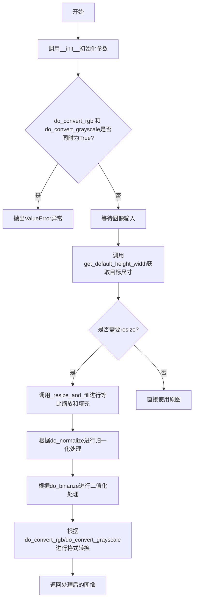
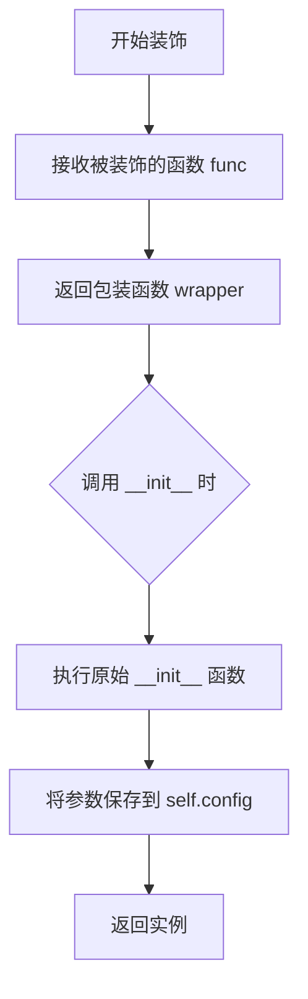
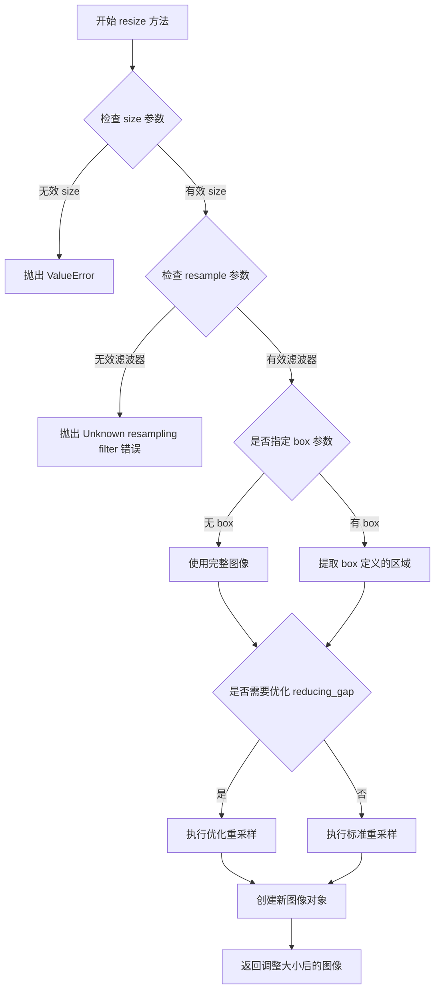
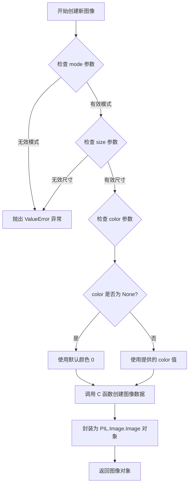
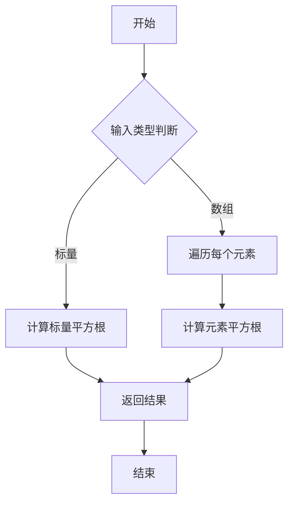
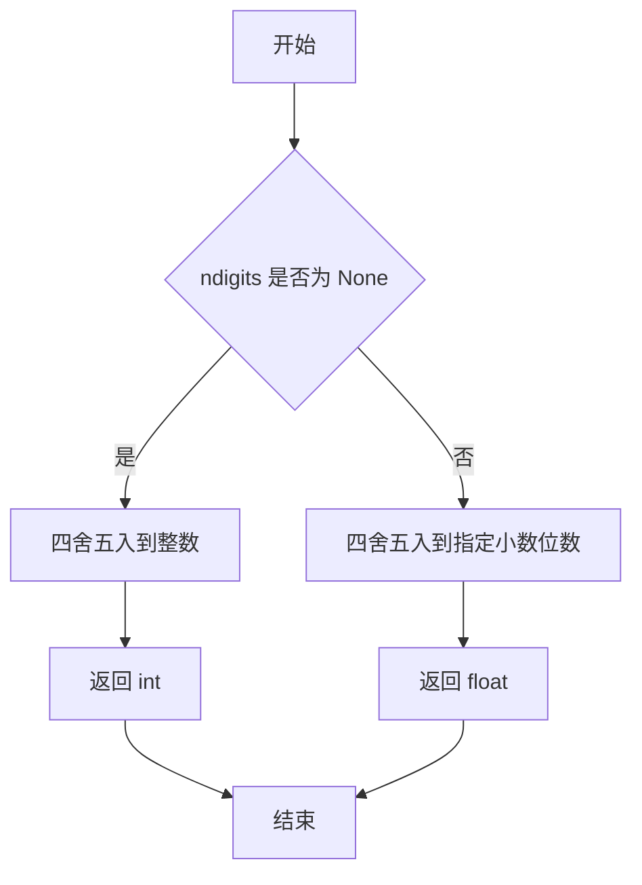
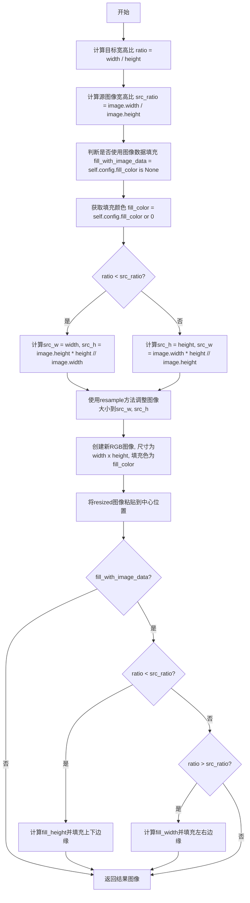

# `diffusers\src\diffusers\pipelines\wan\image_processor.py` 详细设计文档

WanAnimateImageProcessor是一个图像预处理器，用于对Wan Animate模型的参考（角色）图像进行预处理，包括图像缩放、填充、归一化、灰度/RGB转换等功能，并将处理后的图像尺寸调整为vae_scale_factor和spatial_patch_size的整数倍。

## 整体流程



## 类结构

```
VaeImageProcessor (基类)
└── WanAnimateImageProcessor (子类)
```

## 全局变量及字段


### `np`
    
NumPy库，用于数值计算和数组操作

类型：`module`
    


### `torch`
    
PyTorch库，用于深度学习张量操作

类型：`module`
    


### `PIL`
    
Pillow库，用于图像处理操作

类型：`module`
    


### `PIL_INTERPOLATION`
    
PIL图像插值方法的字典映射

类型：`dict`
    


### `WanAnimateImageProcessor.do_resize`
    
是否调整图像尺寸

类型：`bool`
    


### `WanAnimateImageProcessor.vae_scale_factor`
    
VAE空间缩放因子

类型：`int`
    


### `WanAnimateImageProcessor.vae_latent_channels`
    
VAE潜在通道数

类型：`int`
    


### `WanAnimateImageProcessor.spatial_patch_size`
    
扩散变换器的空间补丁大小

类型：`tuple[int, int]`
    


### `WanAnimateImageProcessor.resample`
    
重采样滤波器类型

类型：`str`
    


### `WanAnimateImageProcessor.reducing_gap`
    
缩放间隙参数

类型：`int`
    


### `WanAnimateImageProcessor.do_normalize`
    
是否归一化到[-1,1]

类型：`bool`
    


### `WanAnimateImageProcessor.do_binarize`
    
是否二值化

类型：`bool`
    


### `WanAnimateImageProcessor.do_convert_rgb`
    
是否转换为RGB格式

类型：`bool`
    


### `WanAnimateImageProcessor.do_convert_grayscale`
    
是否转换为灰度格式

类型：`bool`
    


### `WanAnimateImageProcessor.fill_color`
    
填充颜色

类型：`str|float|tuple|None`
    
    

## 全局函数及方法


### `register_to_config`

该装饰器用于自动将 `__init__` 方法的参数注册到类配置中，使得这些参数可以通过 `self.config` 访问，通常用于配置管理框架中。

参数：
-  `func`：被装饰的函数（隐式传入），`Callable`，需要注册到配置中的函数

返回值：`Callable`，返回装饰后的函数，该函数在执行后会将其参数保存到 `self.config` 中

#### 流程图



#### 带注释源码

```python
# 该装饰器定义在 configuration_utils 模块中
# 以下是基于代码上下文的推测实现

def register_to_config(func):
    """
    装饰器：将函数的参数注册到 self.config 中
    
    该装饰器会包装原始的 __init__ 方法，在执行完原始逻辑后，
    将传入的参数自动保存到 self.config 属性中，
    使得配置可以被后续方法访问和管理。
    """
    def wrapper(self, *args, **kwargs):
        # 调用原始的 __init__ 方法
        result = func(self, *args, **kwargs)
        
        # 创建一个配置对象来存储参数
        # 假设 configuration_utils 中有 Config 类
        config = {}
        
        # 获取函数签名
        import inspect
        sig = inspect.signature(func)
        
        # 将位置参数和关键字参数绑定到签名
        bound_args = sig.bind(self, *args, **kwargs)
        bound_args.apply_defaults()
        
        # 排除 self，获取所有配置参数
        for param_name, param_value in bound_args.arguments.items():
            if param_name != 'self':
                config[param_name] = param_value
        
        # 将配置保存到 self.config
        self.config = config
        
        return result
    
    return wrapper


# 在类中的使用方式：
class WanAnimateImageProcessor(VaeImageProcessor):
    
    @register_to_config  # 使用装饰器
    def __init__(
        self,
        do_resize: bool = True,
        vae_scale_factor: int = 8,
        vae_latent_channels: int = 16,
        spatial_patch_size: tuple[int, int] = (2, 2),
        resample: str = "lanczos",
        reducing_gap: int = None,
        do_normalize: bool = True,
        do_binarize: bool = False,
        do_convert_rgb: bool = False,
        do_convert_grayscale: bool = False,
        fill_color: str | float | tuple[float, ...] | None = 0,
    ):
        super().__init__()
        # 初始化逻辑...
        # 装饰器会自动将上述参数保存到 self.config 中
```


### PIL.Image.Image.resize

该方法是 Pillow 库中 `PIL.Image.Image` 类用于调整图像尺寸的核心方法，通过指定的尺寸和重采样滤波器改变图像的宽高像素，是图像预处理流水线中调整图像大小的标准操作。

参数：

- `size`：`(width, height)` 元组，目标图像的宽度和高度（像素值）
- `resample`：可选的重采样滤波器，默认为 `PIL.Image.BILINEAR`，可用的滤波器包括 `PIL.Image.NEAREST`、`PIL.Image.BOX`、`PIL.Image.BILINEAR`、`PIL.Image.HAMMING`、`PIL.Image.BICUBIC`、`PIL.Image.LANCZOS`
- `box`：可选的 4 元组 `(left, top, right, bottom)`，指定要调整大小的源图像区域
- `reducing_gap`：可选的浮点数，用于优化使用 `LANCZOS` 滤波器时的性能

返回值：`PIL.Image.Image`，返回调整大小后的新图像对象，原图像保持不变

#### 流程图



#### 带注释源码

```python
# Pillow 库中 PIL.Image.Image.resize 方法的简化实现原理
def resize(self, size, resample=None, box=None, reducing_gap=None):
    """
    返回调整大小后的图像副本
    
    参数:
        size: 包含宽度和高度的二元组 (width, height)
        resample: 重采样滤波器，默认为 PIL.Image.BILINEAR
        box: 可选的边界框，指定源图像的感兴趣区域
        reducing_gap: 优化参数，用于提高大图像缩放的效率和质量
    
    返回:
        PIL.Image.Image: 调整大小后的新图像对象
    """
    
    # 1. 验证并获取有效的重采样滤波器
    if resample is None:
        resample = PIL.Image.BILINEAR  # 默认使用双线性插值
    
    # 2. 获取目标尺寸
    width, height = size
    
    # 3. 如果指定了 box 参数，提取源图像的对应区域
    #    box 是一个 (left, top, right, bottom) 元组
    if box is not None:
        source_region = self.crop(box)  # 提取 box 定义的区域
    else:
        source_region = self  # 使用完整图像
    
    # 4. 根据 reducing_gap 参数决定重采样策略
    #    reducing_gap > 1.0 时会先进行下采样，再进行最终缩放
    #    这样可以在保持质量的同时提高性能
    if reducing_gap is not None and reducing_gap > 1.0:
        # 计算中间尺寸：先缩小到目标尺寸的某个比例
        intermediate_width = int(width / reducing_gap)
        intermediate_height = int(height / reducing_gap)
        
        # 执行两步缩放：先缩小到中间尺寸，再放大到目标尺寸
        if intermediate_width > 0 and intermediate_height > 0:
            temp_image = source_region.resize(
                (intermediate_width, intermediate_height), 
                resample=resample
            )
            result = temp_image.resize((width, height), resample=resample)
        else:
            result = source_region.resize((width, height), resample=resample)
    else:
        # 5. 直接执行单步重采样缩放
        result = source_region.resize((width, height), resample=resample)
    
    # 6. 返回调整大小后的新图像对象
    return result


# 在 WanAnimateImageProcessor 中的实际调用示例
# 代码位置: _resize_and_fill 方法中
resized = image.resize(
    (src_w, src_h),  # 目标尺寸: 新的宽度和高度
    resample=PIL_INTERPOLATION[self.config.resample]  # 从配置中获取重采样滤波器
)
```


### `PIL.Image.new`

`PIL.Image.new` 是 Pillow 库中的一个核心函数，用于创建一个指定尺寸、模式和填充颜色的全新空白图像对象。该函数接受图像模式（如 "RGB"、"L"、"RGBA" 等）、尺寸元组以及可选的填充颜色参数，返回一个可编辑的 PIL Image 对象，常用于图像处理流水线中的缓冲区分配、图像填充、背景生成等场景。

参数：

- `mode`：`str`，图像模式字符串，定义图像的类型和通道数。常用值包括："L"（灰度）、"RGB"（红绿蓝三通道）、"RGBA"（带透明通道的四通道）、"1"（二值图像）等
- `size`：`tuple[int, int]`，图像尺寸，格式为 `(width, height)`，表示图像的宽度和高度（以像素为单位）
- `color`：`str | float | tuple[float, ...]`，可选参数，用于填充图像的颜色。默认为 `0`（黑色）。可以接受单一灰度值、RGB 元组 `(R, G, B)`、RGBA 元组 `(R, G, B, A)` 或颜色名称字符串（如 "white"、"red"）

返回值：`PIL.Image.Image`，返回一个新建的 PIL Image 对象，该对象是一个可编辑的图像实例，具有指定的尺寸、模式和初始填充颜色

#### 流程图



#### 带注释源码

```python
def new(mode, size, color=0):
    """
    创建一个新的空白图像。
    
    此函数是 PIL/Pillow 库的核心函数之一，用于在内存中分配并初始化
    一个指定规格的图像缓冲区，常用于图像处理流水线中的临时图像创建、
    背景填充、图像拼接等场景。
    
    参数:
        mode: str
            图像模式，定义像素数据的解释方式。常用模式:
            - "1": 1位像素，黑白二值图像
            - "L": 8位像素，灰度图像
            - "P": 8位像素，使用调色板的彩色图像
            - "RGB": 3x8位像素，真彩色图像
            - "RGBA": 4x8位像素，带透明通道的真彩色图像
            - "CMYK": 4x8位像素，印刷色彩模式
            完整的模式列表请参考 Pillow 官方文档。
            
        size: tuple[int, int]
            图像尺寸，格式为 (width, height)，单位为像素。
            width 表示图像水平方向的像素数，height 表示垂直方向的像素数。
            
        color: str | float | tuple[float, ...], 可选
            用于填充图像的颜色值。默认为 0（黑色）。
            - 整数或浮点数: 用于单通道模式（如 "L"、"1"）的灰度值
            - RGB 元组: 如 (255, 0, 0) 表示红色，用于 "RGB" 模式
            - RGBA 元组: 如 (255, 0, 0, 128) 表示半透明红色，用于 "RGBA" 模式
            - 颜色名称字符串: 如 "white"、"red"、"blue" 等 CSS 颜色名称
            - 如果为 None，等同于传递 0（黑色）
            
    返回值:
        PIL.Image.Image
            返回一个新创建的图像对象，该对象:
            - 具有指定的 mode 和 size
            - 所有像素被初始化为 color 指定的颜色
            - 可以进行进一步的图像操作（如 paste、draw、filter 等）
            
    示例:
        # 创建一个 200x100 的黑色 RGB 图像
        img = PIL.Image.new("RGB", (200, 100))
        
        # 创建一个 200x100 的白色 RGB 图像
        img = PIL.Image.new("RGB", (200, 100), "white")
        
        # 创建一个 200x100 的红色 RGB 图像
        img = PIL.Image.new("RGB", (200, 100), (255, 0, 0))
        
        # 创建一个 200x100 的透明 RGBA 图像
        img = PIL.Image.new("RGBA", (200, 100), (0, 0, 0, 0))
        
        # 创建一个 200x100 的灰色图像（灰度值 128）
        img = PIL.Image.new("L", (200, 100), 128)
    """
    # 根据 mode 选择合适的图像类（如 Image8、L mode 等）
    # 并调用其内部的 _new 方法分配内存缓冲区
    im = Image()
    # 调用 Core 模块的 new 方法创建底层图像数据
    # Core 模块是 Pillow 的 C 扩展实现
    im.im = Core.new(mode, size)
    # 设置图像的尺寸属性
    im.mode = mode
    im.size = size
    
    # 处理颜色参数
    if color is None:
        color = 0
    
    # 将颜色值填充到图像的每个像素
    # 对于多通道模式，会将 color 扩展到所有通道
    if mode == "1" or color == 0:
        # 对于二值图像或黑色，直接返回（内存已初始化为0）
        pass
    else:
        # 调用 fill 方法填充指定颜色
        im.im.fill(mode, size, color)
        
    # 返回封装好的 Image 对象
    return im
```


### `np.sqrt`

NumPy 库中的数学函数，用于计算输入数组或标量的平方根，返回非负平方根值。

参数：

- `x`：`float` 或 `array_like`，输入值，可以是标量或数组，待计算平方根的数值
- `out`：`ndarray`，可选，用于存放结果的数组
- `where`：`array_like`，可选，条件码指示位置

返回值：`ndarray`，输入值的平方根，与输入形状相同

#### 流程图



#### 带注释源码

```python
def sqrt(x, out=None, where=None, **kwargs):
    """
    计算数组元素的平方根。
    
    参数:
        x: 输入数组或标量值
        out: 存放结果的数组（可选）
        where: 条件数组，指定哪些位置计算平方根（可选）
    
    返回:
        平方根结果数组
    
    注意:
        - 负数输入会产生 NaN 值
        - 复数输入会产生复数平方根
    """
    # 在代码中的实际使用:
    # height = round(np.sqrt(max_area * aspect_ratio)) // mod_value_h * mod_value_h
    # width = round(np.sqrt(max_area / aspect_ratio)) // mod_value_w * mod_value_w
    #
    # 这里 np.sqrt 用于:
    # 1. 根据图像面积和宽高比计算目标高度和宽度的基础值
    # 2. 确保 resize 后的尺寸是 vae_scale_factor * spatial_patch_size 的整数倍
    # 3. 保持图像的原始宽高比特性
```


### `round` (Python 内置函数)

在给定代码中没有自定义的 `round` 方法，但代码中使用了 Python 内置的 `round()` 函数。该函数用于在 `get_default_height_width` 方法中将计算出的高度和宽度四舍五入到 `vae_scale_factor * spatial_patch_size` 的整数倍。

参数：

-  `number`：`int | float`，要四舍五入的数字
-  `ndigits`：`int | None`，可选，保留的小数位数（默认为 None，即四舍五入到整数）

返回值：`int`（当 ndigits 为 None 时）或 `float`，四舍五入后的值

#### 流程图



#### 带注释源码

```python
# 在 get_default_height_width 方法中使用 round 的上下文：
# 这段代码计算并调整图像的高度和宽度，使其成为 vae_scale_factor * spatial_patch_size 的整数倍
# 这样可以确保图像尺寸与 VAE 和空间补丁的大小兼容

# 计算调整后的高度：先计算理想面积乘以宽高比的平方根，然后除以 mod_value_h，取整后再乘以 mod_value_h
height = round(np.sqrt(max_area * aspect_ratio)) // mod_value_h * mod_value_h

# 计算调整后的宽度：先计算理想面积除以宽高比的平方根，然后除以 mod_value_w，取整后再乘以 mod_value_w
width = round(np.sqrt(max_area / aspect_ratio)) // mod_value_w * mod_value_w
```

---

**注意**：代码中并未定义自定义的 `round` 方法或函数。如果您需要提取的是 `get_default_height_width` 方法的详细设计文档，请告知我。


### WanAnimateImageProcessor.__init__

 WanAnimateImageProcessor类的初始化方法，用于配置Wan动画模型的图像预处理参数，包括图像缩放、归一化、通道转换等选项，并通过`@register_to_config`装饰器将配置注册到配置系统中。

参数：

-  `do_resize`：`bool`，是否将图像的（高度、宽度）尺寸下采样到`vae_scale_factor`的倍数，可接受`preprocess`方法的`height`和`width`参数
-  `vae_scale_factor`：`int`，VAE（空间）缩放因子，如果`do_resize`为`True`，图像会自动调整到此因子的倍数
-  `vae_latent_channels`：`int`，VAE潜在通道数，默认为16
-  `spatial_patch_size`：`tuple[int, int]`，扩散变换器使用的空间补丁大小，对于Wan模型通常为(2, 2)
-  `resample`：`str`，调整图像大小时使用的重采样滤波器，默认为"lanczos"
-  `reducing_gap`：`int`，用于调整大小的可选间隙参数
-  `do_normalize`：`bool`，是否将图像归一化到[-1,1]范围，默认为`True`
-  `do_binarize`：`bool`，是否将图像二值化为0/1，默认为`False`
-  `do_convert_rgb`：`bool`，是否将图像转换为RGB格式，默认为`False`
-  `do_convert_grayscale`：`bool`，是否将图像转换为灰度格式，默认为`False`
-  `fill_color`：`str | float | tuple[float, ...] | None`，当`resize_mode`设置为"fill"时的填充颜色，默认为0

返回值：`None`，无返回值（构造函数）

#### 流程图

```mermaid
flowchart TD
    A[开始 __init__] --> B{检查 do_convert_rgb 和 do_convert_grayscale}
    B -->|两者都为True| C[抛出 ValueError 异常]
    B -->|否则| D[调用 super().__init__]
    D --> E[结束 __init__]
    
    C --> F[错误信息: 不能同时设置为True<br/>RGB和灰度转换互斥]
    F --> E
```

#### 带注释源码

```python
@register_to_config
def __init__(
    self,
    do_resize: bool = True,
    vae_scale_factor: int = 8,
    vae_latent_channels: int = 16,
    spatial_patch_size: tuple[int, int] = (2, 2),
    resample: str = "lanczos",
    reducing_gap: int = None,
    do_normalize: bool = True,
    do_binarize: bool = False,
    do_convert_rgb: bool = False,
    do_convert_grayscale: bool = False,
    fill_color: str | float | tuple[float, ...] | None = 0,
):
    """
    初始化WanAnimateImageProcessor图像处理器
    
    参数:
        do_resize: 是否调整图像大小到vae_scale_factor的倍数
        vae_scale_factor: VAE空间缩放因子
        vae_latent_channels: VAE潜在通道数
        spatial_patch_size: 扩散变换器的空间补丁大小
        resample: 重采样滤波器类型
        reducing_gap: 调整大小时的可选间隙参数
        do_normalize: 是否归一化图像到[-1,1]
        do_binarize: 是否二值化图像
        do_convert_rgb: 是否转换为RGB格式
        do_convert_grayscale: 是否转换为灰度格式
        fill_color: 填充颜色，用于resize模式为fill时
    """
    # 调用父类VaeImageProcessor的初始化方法
    super().__init__()
    
    # 检查RGB和灰度转换选项是否互斥
    if do_convert_rgb and do_convert_grayscale:
        raise ValueError(
            "`do_convert_rgb` and `do_convert_grayscale` can not both be set to `True`,"
            " if you intended to convert the image into RGB format, please set `do_convert_grayscale = False`.",
            " if you intended to convert the image into grayscale format, please set `do_convert_rgb = False`",
        )
    # 注意：配置参数通过@register_to_config装饰器自动注册
    # 无需显式保存，装饰器会自动将参数存储到self.config中
```


### WanAnimateImageProcessor._resize_and_fill

该方法用于将图像调整大小以适应指定的宽度和高度，保持纵横比，然后在维度内居中图像，并通过复制图像边缘数据或指定颜色来填充空白区域。

参数：

- `self`：`WanAnimateImageProcessor`， WanAnimateImageProcessor 类实例
- `image`：`PIL.Image.Image`， 要调整大小和填充的图像
- `width`：`int`， 目标宽度
- `height`：`int`， 目标高度

返回值：`PIL.Image.Image`， 调整大小并填充后的图像

#### 流程图



#### 带注释源码

```python
def _resize_and_fill(
    self,
    image: PIL.Image.Image,
    width: int,
    height: int,
) -> PIL.Image.Image:
    r"""
    Resize the image to fit within the specified width and height, maintaining the aspect ratio, and then center
    the image within the dimensions, filling empty with data from image.

    Args:
        image (`PIL.Image.Image`):
            The image to resize and fill.
        width (`int`):
            The width to resize the image to.
        height (`int`):
            The height to resize the image to.

    Returns:
        `PIL.Image.Image`:
            The resized and filled image.
    """

    # 计算目标宽高比
    ratio = width / height
    # 计算源图像宽高比
    src_ratio = image.width / image.height
    # 判断是否使用图像数据填充（当fill_color为None时使用图像数据填充边缘）
    fill_with_image_data = self.config.fill_color is None
    # 获取填充颜色，如果fill_color为None则默认为0（黑色）
    fill_color = self.config.fill_color or 0

    # 根据宽高比计算调整后的源图像尺寸，保持纵横比
    # 如果目标更宽(比例小)，则高度受限于目标高度，宽度按比例计算
    # 如果目标更高(比例大)，则宽度受限于目标宽度，高度按比例计算
    src_w = width if ratio < src_ratio else image.width * height // image.height
    src_h = height if ratio >= src_ratio else image.height * width // image.width

    # 使用配置的采样方法调整图像大小
    resized = image.resize((src_w, src_h), resample=PIL_INTERPOLATION[self.config.resample])
    # 创建新的RGB图像，使用指定的填充颜色
    res = PIL.Image.new("RGB", (width, height), color=fill_color)
    # 将调整大小后的图像粘贴到新图像的中心位置
    res.paste(resized, box=(width // 2 - src_w // 2, height // 2 - src_h // 2))

    # 如果使用图像数据填充边缘（而不是纯色）
    if fill_with_image_data:
        # 当目标宽高比小于源图像宽高比时，需要填充上下边缘
        if ratio < src_ratio:
            # 计算上下填充区域的高度
            fill_height = height // 2 - src_h // 2
            if fill_height > 0:
                # 调整resized图像顶部区域并粘贴到上方
                res.paste(resized.resize((width, fill_height), box=(0, 0, width, 0)), box=(0, 0))
                # 调整resized图像底部区域并粘贴到下方
                res.paste(
                    resized.resize((width, fill_height), box=(0, resized.height, width, resized.height)),
                    box=(0, fill_height + src_h),
                )
        # 当目标宽高比大于源图像宽高比时，需要填充左右边缘
        elif ratio > src_ratio:
            # 计算左右填充区域的宽度
            fill_width = width // 2 - src_w // 2
            if fill_width > 0:
                # 调整resized图像左侧区域并粘贴到左侧
                res.paste(resized.resize((fill_width, height), box=(0, 0, 0, height)), box=(0, 0))
                # 调整resized图像右侧区域并粘贴到右侧
                res.paste(
                    resized.resize((fill_width, height), box=(resized.width, 0, resized.width, height)),
                    box=(fill_width + src_w, 0),
                )

    return res
```


### `WanAnimateImageProcessor.get_default_height_width`

该方法用于获取图像预处理后的默认高度和宽度，会将输入图像的尺寸调整为 `vae_scale_factor * spatial_patch_size` 的最近整数倍，以适配 Wan Animate 模型的 VAE 和空间补丁处理需求。

参数：

- `image`：`PIL.Image.Image | np.ndarray | torch.Tensor`，输入的图像，可以是 PIL 图像、NumPy 数组或 PyTorch 张量。若为 NumPy 数组，形状应为 `[batch, height, width]` 或 `[batch, height, width, channels]`；若为 PyTorch 张量，形状应为 `[batch, channels, height, width]`。
- `height`：`int | None`，可选，默认为 `None`。预处理图像的高度。如果为 `None`，则使用输入 `image` 的高度。
- `width`：`int | None`，可选，默认为 `None`。预处理图像的宽度。如果为 `None`，则使用输入 `image` 的宽度。

返回值：`tuple[int, int]`，包含高度和宽度的元组，两者都被调整为 `vae_scale_factor * spatial_patch_size` 的最近整数倍。

#### 流程图

```mermaid
flowchart TD
    A[开始] --> B{height is None?}
    B -- 是 --> C{image 类型是?}
    C -->|PIL.Image| D[height = image.height]
    C -->|torch.Tensor| E[height = image.shape[2]]
    C -->|其他| F[height = image.shape[1]]
    D --> G{width is None?}
    E --> G
    F --> G
    B -- 否 --> G
    G -- 是 --> H{image 类型是?}
    H -->|PIL.Image| I[width = image.width]
    H -->|torch.Tensor| J[width = image.shape[3]]
    H -->|其他| K[width = image.shape[2]]
    I --> L[计算 max_area = width * height]
    J --> L
    K --> L
    G -- 否 --> L
    L --> M[计算 aspect_ratio = height / width]
    M --> N[计算 mod_value_h = vae_scale_factor * spatial_patch_size[0]]
    N --> O[计算 mod_value_w = vae_scale_factor * spatial_patch_size[1]]
    O --> P[计算新 height = round(sqrt(max_area * aspect_ratio)) // mod_value_h * mod_value_h]
    P --> Q[计算新 width = round(sqrt(max_area / aspect_ratio)) // mod_value_w * mod_value_w]
    Q --> R[返回 (height, width)]
```

#### 带注释源码

```python
def get_default_height_width(
    self,
    image: PIL.Image.Image | np.ndarray | torch.Tensor,
    height: int | None = None,
    width: int | None = None,
) -> tuple[int, int]:
    r"""
    Returns the height and width of the image, downscaled to the next integer multiple of `vae_scale_factor`.

    Args:
        image (`PIL.Image.Image | np.ndarray | torch.Tensor`):
            The image input, which can be a PIL image, NumPy array, or PyTorch tensor. If it is a NumPy array, it
            should have shape `[batch, height, width]` or `[batch, height, width, channels]`. If it is a PyTorch
            tensor, it should have shape `[batch, channels, height, width]`.
        height (`int | None`, *optional*, defaults to `None`):
            The height of the preprocessed image. If `None`, the height of the `image` input will be used.
        width (`int | None`, *optional*, defaults to `None`):
            The width of the preprocessed image. If `None`, the width of the `image` input will be used.

    Returns:
        `tuple[int, int]`:
            A tuple containing the height and width, both resized to the nearest integer multiple of
            `vae_scale_factor * spatial_patch_size`.
    """

    # 如果未指定高度，则从输入图像中提取高度
    if height is None:
        if isinstance(image, PIL.Image.Image):
            height = image.height
        elif isinstance(image, torch.Tensor):
            height = image.shape[2]
        else:
            # 默认为 NumPy 数组
            height = image.shape[1]

    # 如果未指定宽度，则从输入图像中提取宽度
    if width is None:
        if isinstance(image, PIL.Image.Image):
            width = image.width
        elif isinstance(image, torch.Tensor):
            width = image.shape[3]
        else:
            # 默认为 NumPy 数组
            width = image.shape[2]

    # 计算图像面积和宽高比
    max_area = width * height
    aspect_ratio = height / width
    
    # 计算 VAE 缩放因子与空间补丁大小的乘积，用于尺寸对齐
    mod_value_h = self.config.vae_scale_factor * self.config.spatial_patch_size[0]
    mod_value_w = self.config.vae_scale_factor * self.config.spatial_patch_size[1]

    # 尝试保持宽高比，计算新的高度和宽度，并向下取整到最近的 mod_value 倍数
    # 使用 sqrt(max_area * aspect_ratio) = sqrt(width * height * height / width) = height
    # 使用 sqrt(max_area / aspect_ratio) = sqrt(width * height / (height / width)) = width
    height = round(np.sqrt(max_area * aspect_ratio)) // mod_value_h * mod_value_h
    width = round(np.sqrt(max_area / aspect_ratio)) // mod_value_w * mod_value_w

    return height, width
```

## 关键组件


### WanAnimateImageProcessor 类

 Wan Animate 模型的图像预处理器，负责将参考（角色）图像进行缩放、填充、归一化等预处理操作，以适配 VAE 和扩散变换器的输入要求。

### VaeImageProcessor 继承

 继承自 VaeImageProcessor 基类，复用其基础图像处理能力，并使用 `@register_to_config` 装饰器实现配置注册。

### 配置参数（do_resize）

 控制是否将图像的（高度、宽度）尺寸调整为 `vae_scale_factor` 的倍数，默认为 True。

### 配置参数（vae_scale_factor）

 VAE 空间缩放因子，默认为 8，用于将图像尺寸调整为该因子的整数倍。

### 配置参数（spatial_patch_size）

 扩散变换器使用的空间补丁大小，对于 Wan 模型通常为 (2, 2)，与 VAE 比例因子共同决定最终图像尺寸。

### 配置参数（do_normalize）

 控制是否将图像归一化到 [-1, 1] 范围，默认为 True，支持反量化操作。

### 配置参数（do_binarize）

 控制是否将图像二值化为 0/1，默认为 False，提供量化策略支持。

### 配置参数（do_convert_rgb / do_convert_grayscale）

 控制图像格式转换，支持 RGB 或灰度格式，但两者不能同时为 True。

### _resize_and_fill 方法

 核心图像缩放填充方法，维持纵横比并将图像居中放置在目标尺寸内，支持使用图像数据或指定颜色填充空白区域。

### get_default_height_width 方法

 计算图像的默认高度和宽度，考虑 VAE 比例因子和空间补丁大小，通过纵横比计算保持图像比例的最大适配尺寸。

### 多格式图像支持

 支持 PIL.Image、np.ndarray 和 torch.Tensor 三种图像输入格式，通过类型判断提取高度和宽度信息。


## 问题及建议


### 已知问题

- **父类初始化不完整**：调用`super().__init__()`时未传递任何参数，可能导致父类`VaeImageProcessor`的必要配置未正确初始化
- **未使用的参数**：`reducing_gap`参数在`__init__`中定义但从未在类中任何地方使用
- **未使用的配置属性**：`spatial_patch_size`和`vae_latent_channels`作为配置属性存储，但在类的方法中未被使用，可能表示设计不完整或遗留代码
- **fill_color默认值的文档与实现不一致**：文档说明`fill_color`默认值为`None`，但实际代码中默认值是`0`（整数）
- **类型验证缺失**：`resample`参数接受任意字符串，但如果传入无效的插值方法名称（如"invalid"），只有在实际调用`resize`时才会失败，缺乏早期验证
- **边界情况处理**：`get_default_height_width`方法中当`height`或`width`为0或极小值时，计算可能产生无效结果（如除零或负数）
- **互斥参数检查可被绕过**：如果配置对象在初始化后被修改，`do_convert_rgb`和`do_convert_grayscale`的互斥检查可能被绕过

### 优化建议

- 在调用`super().__init__()`时，根据需要传递父类所需的参数，确保完整的初始化流程
- 移除未使用的`reducing_gap`参数，或实现其预期功能
- 移除或实现`spatial_patch_size`和`vae_latent_channels`的使用，避免代码混淆
- 统一`fill_color`的默认值与文档说明，修正为`None`
- 添加`resample`参数的有效性验证，可通过预定义的插值方法白名单进行校验
- 在`get_default_height_width`方法中添加输入有效性检查，处理`height`或`width`为0或负数的边界情况
- 将互斥参数检查改为属性 setter 或在预处理方法中每次调用时检查，提高健壮性

## 其它


### 设计目标与约束

设计目标：为Wan Animate模型提供图像预处理能力，将输入的参考图像（角色图像）进行缩放、填充、归一化等操作，以满足扩散变换器的输入要求。约束条件包括：图像尺寸必须被vae_scale_factor * spatial_patch_size整除，支持PIL Image、NumPy数组和PyTorch tensor三种输入格式，归一化范围为[-1, 1]。

### 错误处理与异常设计

在__init__方法中检测do_convert_rgb和do_convert_grayscale不能同时为True，抛出ValueError并提供明确的错误信息和修复建议。图像类型检查在get_default_height_width方法中进行，使用isinstance判断输入是PIL.Image.Image、torch.Tensor还是np.ndarray。尺寸计算使用round确保返回整数，mod_value_h和mod_value_w必须大于0以避免除零错误。

### 数据流与状态机

数据输入流程：接受PIL Image/NumPy array/PyTorch tensor三种格式 → 可选RGB/灰度转换 → 可选resize到vae_scale_factor整数倍 → _resize_and_fill进行宽高比保持的缩放和填充 → 可选normalize到[-1,1] → 可选binarize。状态转换由config中的布尔标志控制（do_resize, do_normalize, do_binarize, do_convert_rgb, do_convert_grayscale）。

### 外部依赖与接口契约

依赖库：numpy（数值计算）、PIL.Image（图像处理）、torch（张量处理）、transformers库的configuration_utils、image_processor和utils模块。输入接口：preprocess方法接受image, height, width参数，返回预处理后的图像张量。输出接口：get_default_height_width返回(height, width)元组，均为vae_scale_factor * spatial_patch_size的整数倍。

### 性能考虑

_resize_and_fill方法中多次调用image.resize可能影响性能，建议缓存resize结果。get_default_height_width中使用np.sqrt进行面积计算，对于大批量处理可考虑向量化操作。图像处理使用PIL的lanczos重采样，精度较高但速度相对较慢，可通过config.resample切换到bilinear或nearest以提升性能。

### 安全与权限

fill_color参数接受字符串（如"black"）、浮点数或元组，需验证PIL.Image.new能识别的有效颜色值。do_convert_rgb和do_convert_grayscale的互斥检查防止了不明确的颜色转换行为。代码遵循Apache License 2.0许可协议。

### 配置管理与版本兼容性

使用@register_to_config装饰器将__init__参数注册到config对象，支持配置序列化与反序列化。vae_latent_channels参数在当前代码中未被使用，可能为历史遗留或未来扩展预留。spatial_patch_size默认为(2, 2)，与Wan模型的扩散变换器设计保持一致。

### 测试策略建议

应覆盖的测试场景：1) 三种输入格式（PIL/NumPy/Tensor）的height/width计算准确性；2) 不同宽高比图像的resize_and_fill行为；3) do_convert_rgb和do_convert_grayscale互斥验证；4) fill_color为None和具体颜色值时的填充差异；5) 归一化后像素值范围验证；6) 极端尺寸（如1x1或超大图像）的边界情况处理。

### 潜在扩展点

vae_latent_channels参数已定义但未使用，可考虑在后续版本中添加VAE latent空间相关处理。do_binarize参数已定义但未在当前代码中实现，可用于二值化图像处理。可添加批量处理（batch processing）接口以支持多帧动画输入。get_default_height_width目前返回调整后的尺寸，可考虑添加原尺寸返回方法。

### 关键组件信息

VaeImageProcessor：基类，提供基础图像预处理功能。register_to_config：配置注册装饰器，用于参数序列化。PIL_INTERPOLATION：PIL插值方法映射字典，支持多种重采样算法。WanAnimateImageProcessor：核心处理器，负责参考图像的标准化处理。

### 潜在技术债务与优化空间

1. vae_latent_channels参数在__init__中定义但从未使用，应移除或实现相关功能；2. do_binarize功能在代码中未实现，仅有参数定义；3. _resize_and_fill方法代码复杂，可拆分为更小的单一职责方法；4. 缺少批量图像预处理接口；5. fill_color默认值设为0但注释说明默认为None，存在不一致；6. reducing_gap参数定义但未在任何地方使用。

    