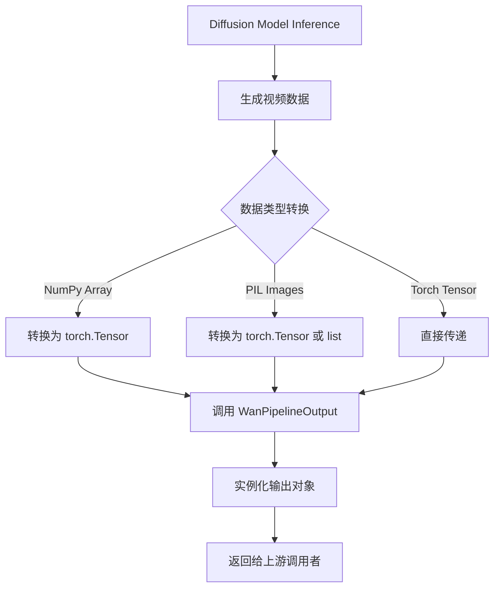
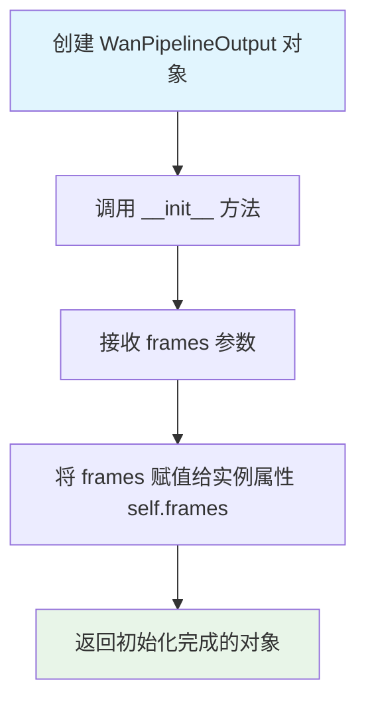
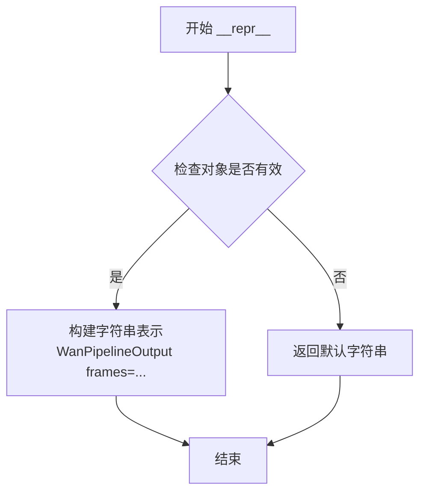

# `diffusers\src\diffusers\pipelines\wan\pipeline_output.py` 详细设计文档

WanPipelineOutput是一个轻量级的数据容器类，继承自Diffusers库的BaseOutput，专门用于封装Wan视频生成Pipeline的输出结果，其中frames属性以统一的Tensor格式存储生成的视频帧序列，支持批量处理和多种数据格式的转换。

## 整体流程



## 类结构

```
BaseOutput (diffusers.utils)
└── WanPipelineOutput (dataclass)
```

## 全局变量及字段


### `WanPipelineOutput.frames`
    
生成的视频帧序列，支持批量维度，形状为 (batch_size, num_frames, channels, height, width)

类型：`torch.Tensor`
    
    

## 全局函数及方法


### WanPipelineOutput.__init__

由 `@dataclass` 自动生成的构造函数，用于初始化输出对象，用于存储 Wan 视频生成管道的输出结果。

参数：

- `frames`：`torch.Tensor`，视频帧数据，可以是 `torch.Tensor`、`np.ndarray` 或 `list[list[PIL.Image.Image]]` 格式，形状为 `(batch_size, num_frames, channels, height, width)`

返回值：`None`，无返回值，直接初始化对象属性

#### 流程图



#### 带注释源码

```python
@dataclass
class WanPipelineOutput(BaseOutput):
    r"""
    Wan 管道输出类，继承自 BaseOutput。
    
    用于存储视频生成管道输出的视频帧数据，支持多种输入格式：
    - torch.Tensor: 形状为 (batch_size, num_frames, channels, height, width)
    - np.ndarray: 同上
    - list[list[PIL.Image.Image]]: 批量的 PIL 图像序列列表
    """
    
    frames: torch.Tensor  # 视频帧数据，类型为 PyTorch 张量
```

#### 补充说明

这是一个由 Python `dataclass` 装饰器自动生成的标准 `__init__` 方法。当使用 `@dataclass` 装饰类时，Python 会自动为所有标记了类型注解的类属性生成 `__init__` 方法。生成的构造函数接受与类属性同名的参数，并将传入的值赋给相应的实例属性。


### WanPipelineOutput.__repr__

由 @dataclass 自动生成，提供友好的对象字符串描述

参数：

- （无参数，继承自 object 的标准方法）

返回值：`str`，对象的字符串表示

#### 流程图



#### 带注释源码

```python
def __repr__(self):
    """
    由 @dataclass 自动生成的方法
    返回对象的字符串表示，用于调试和日志输出
    """
    # dataclass 自动生成，返回格式为：
    # WanPipelineOutput(frames=tensor([[[...]]])
    return repr(self)
```

## 关键组件


### WanPipelineOutput 类

继承自 `BaseOutput` 的数据类，用于封装 Wan 视频生成管道的输出结果。该类定义了一个 `frames` 字段来存储生成的视频帧数据，支持多种格式（torch.Tensor、np.ndarray 或 PIL.Image 列表）。

### frames 字段

类型：`torch.Tensor`

描述：存储视频帧输出的张量，可为嵌套列表（batch_size × num_frames）、NumPy 数组或 PyTorch 张量，形状为 (batch_size, num_frames, channels, height, width)。

### BaseOutput 基类

描述：diffusers 库中的基础输出类，WanPipelineOutput 通过继承该类以遵循 diffusers 框架的输出接口规范，确保与其他 pipeline 的一致性。


## 问题及建议


### 已知问题

-   **类型提示不一致**：`frames` 字段的类型注释仅为 `torch.Tensor`，但文档字符串（docstring）明确说明它可以是 `torch.Tensor`、`np.ndarray` 或 `list[list[PIL.Image.Image]]`，存在类型声明与实际用途的偏差。
-   **缺少运行时类型验证**：由于类型提示不完整且无 `__post_init__` 验证，实例化时无法确保 `frames` 参数的实际类型符合预期。
-   **扩展性有限**：作为输出类，仅包含数据字段，缺少常用工具方法（如转换为 NumPy 数组、PIL 图像，或批处理操作），使用者需要自行实现。
-   **无默认值处理**：未定义默认值或工厂方法，当批量处理不同长度视频时缺乏灵活性。

### 优化建议

-   **修正类型提示**：使用 `Union[torch.Tensor, np.ndarray, list[list[PIL.Image.Image]]]` 或 `TypeVar` 明确 `frames` 的多态类型，提升静态类型检查的准确性。
-   **添加 `__post_init__` 验证**：在初始化后验证 `frames` 的维度、dtype 或形状是否符合视频数据的预期格式（如 5D 张量 `(B, F, C, H, W)`）。
-   **扩展工具方法**：实现 `to_numpy()`、`to_pil()`、`save()` 等方法，提供开箱即用的数据转换和导出能力。
-   **支持懒加载或流式处理**：对于大规模视频生成场景，考虑优化内存占用（如支持分帧加载或引用式传递）。

## 其它


### 设计目标与约束

本代码的设计目标是定义WanPipeline的输出数据结构，统一视频生成管道的输出格式。约束包括：必须继承自BaseOutput以符合diffusers库的接口规范，frames字段必须为torch.Tensor类型以支持深度学习框架的梯度计算和GPU加速。

### 错误处理与异常设计

本代码本身不涉及复杂的错误处理，因为dataclass仅定义数据结构。错误处理由上游管道负责，包括：验证输入frames的维度是否合法（应为5D张量batch_size, num_frames, channels, height, width），检查数据类型是否为torch.Tensor，处理GPU内存不足导致的OOM错误。

### 数据流与状态机

数据流方向：diffusers管道执行推理后生成torch.Tensor，通过WanPipelineOutput封装输出。状态机方面，本类为纯数据容器，不涉及状态管理，frames的生命周期由调用方管理（通常在管道输出后传递给后处理模块或保存到磁盘）。

### 外部依赖与接口契约

主要依赖包括：1) torch库 - 提供Tensor数据类型和计算能力；2) diffusers.utils.BaseOutput - 基类约束，定义标准化输出接口；3) dataclass装饰器 - Python内置的Data Class机制。接口契约：frames字段必须为torch.Tensor，其他模块可通过output.frames访问生成的视频数据。

### 性能考虑

由于仅为数据容器，无直接性能开销。潜在优化点：若批量生成的视频帧数巨大，可考虑使用torch.float16以减少显存占用，但这属于管道层面的决策而非本类的职责。

### 可扩展性设计

可扩展性体现在：1) 可通过继承添加额外字段（如noise_mask、latents等中间结果）；2) 支持list[list[PIL.Image.Image]]、np.ndarray、torch.Tensor多种格式的转换方法；3) 可添加元数据字段（如生成参数配置、seed值等）用于溯源。

### 版本兼容性

本代码兼容Python 3.7+（dataclass支持）和torch 1.0+。与diffusers库的兼容性需要BaseOutput类保持稳定，该类为diffusers的公共接口，通常保持向后兼容。

### 测试策略

建议测试包括：1) 实例化WanPipelineOutput并验证frames字段类型；2) 序列化/反序列化测试（pickle、json）；3) 与BaseOutput的继承关系测试；4) 内存占用基准测试。

### 部署注意事项

部署时需确保torch和diffusers库版本兼容。本类为轻量级数据容器，无特殊部署要求，但需注意：当frames为大型torch.Tensor时，需合理管理GPU显存生命周期，避免显存泄漏。


    