# `diffusers\src\diffusers\pipelines\wan\pipeline_wan.py` 详细设计文档

WanPipeline是一个用于文本到视频（Text-to-Video）生成的Diffusion Pipeline。它使用T5文本编码器对用户输入的文本提示词进行编码，然后通过WanTransformer3DModel条件Transformer对随机噪声潜在表示进行多步去噪，最后使用AutoencoderKLWan变分自编码器将去噪后的潜在表示解码为连续的视频帧序列。该Pipeline支持双阶段去噪（transformer和transformer_2）、分类器自由引导（CFG）、LoRA权重加载等高级功能。

## 整体流程

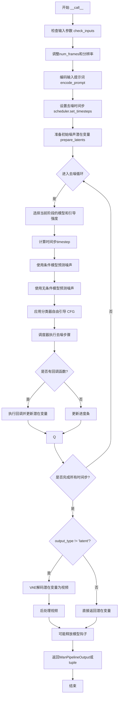

## 类结构

```
DiffusionPipeline (基类)
└── WanPipeline (文本到视频生成Pipeline)
    └── WanLoraLoaderMixin (LoRA加载混入)
```

## 全局变量及字段


### `XLA_AVAILABLE`
    
XLA是否可用标志

类型：`bool`
    


### `logger`
    
日志记录器

类型：`logging.Logger`
    


### `EXAMPLE_DOC_STRING`
    
示例文档字符串

类型：`str`
    


### `WanPipeline.model_cpu_offload_seq`
    
模型CPU卸载顺序

类型：`str`
    


### `WanPipeline._callback_tensor_inputs`
    
回调函数可用的张量输入列表

类型：`list`
    


### `WanPipeline._optional_components`
    
可选组件列表

类型：`list`
    


### `WanPipeline.tokenizer`
    
T5分词器

类型：`AutoTokenizer`
    


### `WanPipeline.text_encoder`
    
T5文本编码器

类型：`UMT5EncoderModel`
    


### `WanPipeline.vae`
    
VAE视频编码器/解码器

类型：`AutoencoderKLWan`
    


### `WanPipeline.scheduler`
    
去噪调度器

类型：`FlowMatchEulerDiscreteScheduler`
    


### `WanPipeline.transformer`
    
高噪声阶段Transformer

类型：`WanTransformer3DModel | None`
    


### `WanPipeline.transformer_2`
    
低噪声阶段Transformer

类型：`WanTransformer3DModel | None`
    


### `WanPipeline.boundary_ratio`
    
双阶段去噪边界比例

类型：`float | None`
    


### `WanPipeline.expand_timesteps`
    
是否扩展时间步(Wan2.2 ti2v)

类型：`bool`
    


### `WanPipeline.vae_scale_factor_temporal`
    
VAE时间维度缩放因子

类型：`int`
    


### `WanPipeline.vae_scale_factor_spatial`
    
VAE空间维度缩放因子

类型：`int`
    


### `WanPipeline.video_processor`
    
视频后处理器

类型：`VideoProcessor`
    


### `WanPipeline._guidance_scale`
    
分类器自由引导强度

类型：`float`
    


### `WanPipeline._guidance_scale_2`
    
第二阶段引导强度

类型：`float | None`
    


### `WanPipeline._attention_kwargs`
    
注意力处理器参数

类型：`dict | None`
    


### `WanPipeline._current_timestep`
    
当前时间步

类型：`int | None`
    


### `WanPipeline._interrupt`
    
中断标志

类型：`bool`
    


### `WanPipeline._num_timesteps`
    
总时间步数

类型：`int`
    
    

## 全局函数及方法


### `basic_clean`

该函数用于对文本进行基本清理，包括修复常见的文本编码问题（如 mojibake）、解码 HTML 实体，并去除首尾空白字符。

参数：

- `text`：`str`，待清理的原始文本输入

返回值：`str`，清理并规范化后的文本

#### 流程图

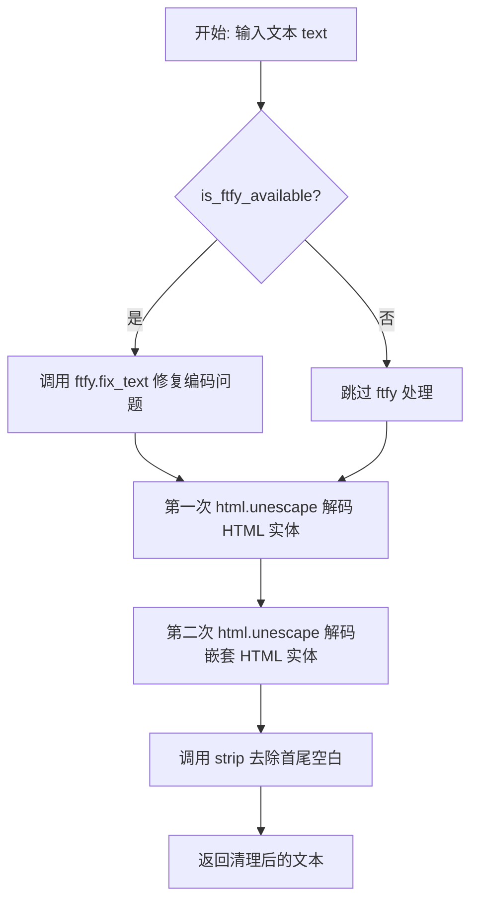

#### 带注释源码

```python
def basic_clean(text):
    """
    对文本进行基本清理：
    1. 使用 ftfy 修复常见的文本编码问题（如 mojibake）
    2. 双重 HTML 实体解码（处理嵌套的 HTML 实体）
    3. 去除首尾空白字符
    
    Args:
        text: 需要清理的原始文本字符串
        
    Returns:
        清理并规范化后的文本字符串
    """
    # 如果 ftfy 库可用，则使用它来自动检测和修复常见的文本编码问题
    # 例如：UTF-8 编码的文本被误读为 Latin-1 导致的乱码
    if is_ftfy_available():
        text = ftfy.fix_text(text)
    
    # 双重 HTML 实体解码：
    # 第一次解码处理外层的 HTML 实体（如 &amp; -> &）
    # 第二次解码处理内层的 HTML 实体（如 & -> 原始字符）
    # 这样可以正确处理嵌套或双重编码的 HTML 实体
    text = html.unescape(html.unescape(text))
    
    # 去除文本首尾的空白字符（包括空格、换行、制表符等）
    return text.strip()
```


### `whitespace_clean`

该函数用于清理文本中的多余空白字符，将连续的空白色字符（如空格、制表符、换行符等）替换为单个空格，并去除字符串首尾的空白字符。

参数：

- `text`：`str`，需要清理的文本

返回值：`str`，清理后的文本

#### 流程图

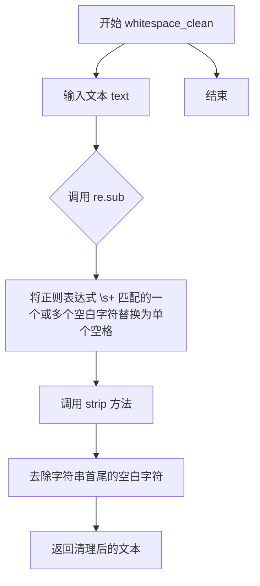

#### 带注释源码

```python
def whitespace_clean(text):
    """
    清理文本中的多余空白字符。
    
    该函数执行以下操作：
    1. 将连续的空白色字符（空格、制表符、换行符等）替换为单个空格
    2. 去除字符串首尾的空白字符
    
    参数:
        text: str, 需要清理的文本
        
    返回:
        str, 清理后的文本
    """
    # 使用正则表达式将一个或多个空白字符替换为单个空格
    # \s+ 匹配一个或多个空白字符（空格、制表符、换行符等）
    # " " 是替换文本，表示用单个空格替换
    text = re.sub(r"\s+", " ", text)
    
    # 去除字符串首尾的空白字符（包括空格、制表符、换行符等）
    text = text.strip()
    
    # 返回清理后的文本
    return text
```

#### 使用示例

```python
# 示例输入
input_text = "This   is a    test\n\nwith    multiple     spaces."

# 调用 whitespace_clean
result = whitespace_clean(input_text)

# 输出结果
# "This is a test with multiple spaces."
```


### `prompt_clean`

对提示词文本进行完整的两步清理操作：先进行基础清理（HTML实体解码和可选的ftfy修复），再进行空白字符规范化。

参数：

- `text`：`str`，需要清理的提示词文本

返回值：`str`，清理后的提示词文本

#### 流程图

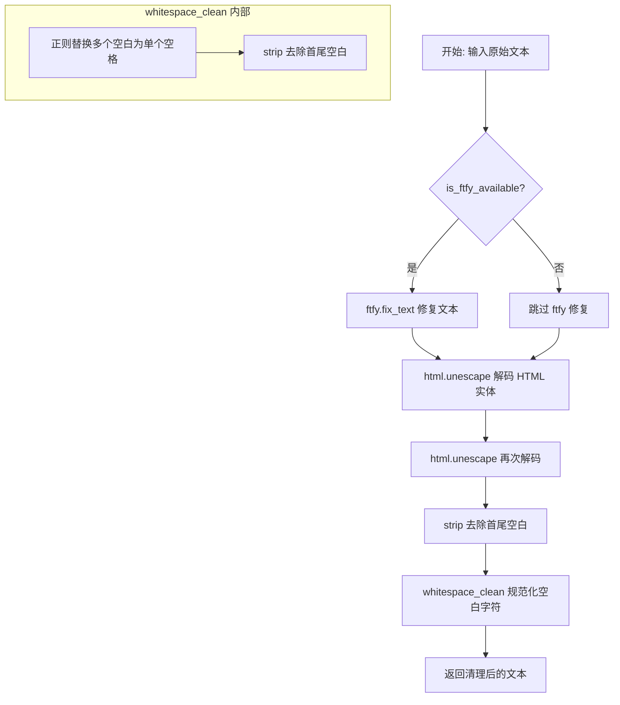

#### 带注释源码

```python
def prompt_clean(text):
    """
    对提示词文本进行完整的两步清理操作。
    
    处理流程：
    1. basic_clean: 处理HTML实体转义和可选的ftfy文本修复
    2. whitespace_clean: 规范化空白字符（将多个连续空格合并为单个）
    
    Args:
        text: 需要清理的提示词文本
        
    Returns:
        清理后的提示词文本
    """
    # 第一步：基础清理
    # - 如果 ftfy 可用，使用 ftfy.fix_text 修复常见的文本编码问题
    # - 使用 html.unescape 双重解码 HTML 实体（如 &amp; -> &, &lt; -> <）
    # - 去除首尾空白字符
    text = whitespace_clean(basic_clean(text))
    
    # 第二步：空白字符规范化
    # - 使用正则表达式将任意多个连续空白字符替换为单个空格
    # - 再次去除首尾空白字符
    
    return text
```


### `WanPipeline.__init__`

这是 `WanPipeline` 类的构造函数，用于初始化文本到视频生成管道。该构造函数接收分词器、文本编码器、VAE模型、调度器、可选的变换器模型等组件，并将它们注册到管道中，同时配置VAE的时空缩放因子和视频处理器。

参数：

- `tokenizer`：`AutoTokenizer`，T5分词器，用于将文本提示转换为token序列
- `text_encoder`：`UMT5EncoderModel`，T5文本编码器，用于将token序列编码为文本嵌入
- `vae`：`AutoencoderKLWan`， variational autoencoder，用于在潜在空间和视频之间进行编码和解码
- `scheduler`：`FlowMatchEulerDiscreteScheduler`，调度器，用于控制去噪过程的 timesteps
- `transformer`：`WanTransformer3DModel | None`，主要的条件变换器，用于对输入潜在表示进行去噪
- `transformer_2`：`WanTransformer3DModel | None`，可选的低噪声阶段变换器，用于两阶段去噪
- `boundary_ratio`：`float | None`，两阶段去明切换的时间步边界比例
- `expand_timesteps`：`bool`，是否扩展时间步（用于 Wan2.2 ti2v）

返回值：无（`None`），构造函数初始化对象状态，不返回值

#### 流程图

```mermaid
flowchart TD
    A[开始 __init__] --> B[调用 super().__init__]
    B --> C[register_modules: 注册 vae, text_encoder, tokenizer, transformer, scheduler, transformer_2]
    C --> D[register_to_config: 注册 boundary_ratio 和 expand_timesteps]
    D --> E[计算 vae_scale_factor_temporal: 从 vae.config 获取或默认 4]
    E --> F[计算 vae_scale_factor_spatial: 从 vae.config 获取或默认 8]
    F --> G[创建 VideoProcessor: 使用 vae_scale_factor_spatial]
    G --> H[结束 __init__]
```

#### 带注释源码

```python
def __init__(
    self,
    tokenizer: AutoTokenizer,
    text_encoder: UMT5EncoderModel,
    vae: AutoencoderKLWan,
    scheduler: FlowMatchEulerDiscreteScheduler,
    transformer: WanTransformer3DModel | None = None,
    transformer_2: WanTransformer3DModel | None = None,
    boundary_ratio: float | None = None,
    expand_timesteps: bool = False,  # Wan2.2 ti2v
):
    """
    初始化 WanPipeline 管道。
    
    参数:
        tokenizer: T5 分词器
        text_encoder: T5 文本编码器
        vae: VAE 模型
        scheduler: 调度器
        transformer: 主变换器（高噪声阶段）
        transformer_2: 辅助变换器（低噪声阶段，可选）
        boundary_ratio: 两阶段去噪的边界比例
        expand_timesteps: 是否扩展时间步
    """
    # 调用父类 DiffusionPipeline 的初始化方法
    super().__init__()

    # 将所有模块注册到管道中，以便进行设备管理和内存卸载
    self.register_modules(
        vae=vae,
        text_encoder=text_encoder,
        tokenizer=tokenizer,
        transformer=transformer,
        scheduler=scheduler,
        transformer_2=transformer_2,
    )
    
    # 将边界比例和扩展时间步配置注册到 config 中
    self.register_to_config(boundary_ratio=boundary_ratio)
    self.register_to_config(expand_timesteps=expand_timesteps)
    
    # 计算 VAE 的时间缩放因子，用于潜在帧数计算
    # 如果 vae 存在则从配置读取，否则使用默认值 4
    self.vae_scale_factor_temporal = self.vae.config.scale_factor_temporal if getattr(self, "vae", None) else 4
    
    # 计算 VAE 的空间缩放因子，用于潜在高宽计算
    # 如果 vae 存在则从配置读取，否则使用默认值 8
    self.vae_scale_factor_spatial = self.vae.config.scale_factor_spatial if getattr(self, "vae", None) else 8
    
    # 创建视频处理器，用于 VAE 解码后的后处理
    self.video_processor = VideoProcessor(vae_scale_factor=self.vae_scale_factor_spatial)
```


### `WanPipeline._get_t5_prompt_embeds`

该方法负责将文本提示词转换为T5模型的嵌入向量（prompt embeds），用于后续的视频生成过程。它首先对提示词进行清洗和标准化处理，然后通过tokenizer将文本转换为token序列，最后利用text_encoder生成高维嵌入表示。

参数：

- `prompt`：`str | list[str]`，输入的文本提示词，可以是单个字符串或字符串列表
- `num_videos_per_prompt`：`int`，每个提示词需要生成的视频数量，默认为1
- `max_sequence_length`：`int`，文本序列的最大长度，默认为226
- `device`：`torch.device | None`，指定计算设备，若为None则使用执行设备
- `dtype`：`torch.dtype | None`，指定数据类型，若为None则使用text_encoder的数据类型

返回值：`torch.Tensor`，返回形状为`(batch_size * num_videos_per_prompt, seq_len, hidden_dim)`的提示词嵌入张量

#### 流程图

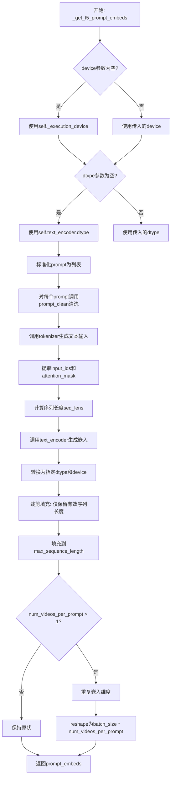

#### 带注释源码

```python
def _get_t5_prompt_embeds(
    self,
    prompt: str | list[str] = None,
    num_videos_per_prompt: int = 1,
    max_sequence_length: int = 226,
    device: torch.device | None = None,
    dtype: torch.dtype | None = None,
):
    """
    获取T5文本编码器生成的提示词嵌入向量。
    
    该方法将文本提示词转换为模型可处理的嵌入表示，主要步骤包括：
    1. 参数标准化与设备分配
    2. 文本清洗与预处理
    3. Tokenization编码
    4. T5编码器前向传播
    5. 嵌入维度调整与批量复制
    """
    # 确定执行设备：优先使用传入的device，否则使用pipeline的默认执行设备
    device = device or self._execution_device
    # 确定数据类型：优先使用传入的dtype，否则使用text_encoder的数据类型
    dtype = dtype or self.text_encoder.dtype

    # 将单个字符串转换为列表，确保统一处理多prompt的情况
    # 例如: "hello" -> ["hello"]
    prompt = [prompt] if isinstance(prompt, str) else prompt
    # 对每个prompt进行清洗：html转义恢复 + 多余空白字符清理
    # 清洗流程: basic_clean -> whitespace_clean
    prompt = [prompt_clean(u) for u in prompt]
    # 获取批处理大小
    batch_size = len(prompt)

    # 使用tokenizer将文本转换为模型输入格式
    # padding="max_length": 填充到最大长度
    # truncation=True: 超过最大长度的文本进行截断
    # add_special_tokens=True: 添加特殊token(如<s>, </s>等)
    # return_attention_mask=True: 返回注意力掩码，用于标识有效token位置
    text_inputs = self.tokenizer(
        prompt,
        padding="max_length",
        max_length=max_sequence_length,
        truncation=True,
        add_special_tokens=True,
        return_attention_mask=True,
        return_tensors="pt",
    )
    # 提取input_ids(词表索引)和attention_mask(有效位置掩码)
    text_input_ids, mask = text_inputs.input_ids, text_inputs.attention_mask
    # 计算每个prompt的实际序列长度(有效token数量)
    # mask.gt(0)找出mask>0的位置，sum(dim=1)按行求和
    seq_lens = mask.gt(0).sum(dim=1).long()

    # 调用T5文本编码器生成隐藏状态
    # 输入: token ids和attention mask
    # 输出: last_hidden_state，形状为(batch_size, seq_len, hidden_dim)
    prompt_embeds = self.text_encoder(text_input_ids.to(device), mask.to(device)).last_hidden_state
    # 将嵌入转换到指定的设备和数据类型
    prompt_embeds = prompt_embeds.to(dtype=dtype, device=device)
    
    # 裁剪填充: 仅保留实际序列长度的嵌入，去除padding部分
    # 使用列表推导式对每个样本进行裁剪
    # u[:v] 表示取前v个token的嵌入
    prompt_embeds = [u[:v] for u, v in zip(prompt_embeds, seq_lens)]
    
    # 重新填充到max_sequence_length长度
    # 对每个裁剪后的嵌入，用零向量填充至max_sequence_length长度
    # u.new_zeros(max_sequence_length - u.size(0), u.size(1)): 创建形状为(缺失长度, 隐藏维度)的零张量
    # torch.cat: 在序列维度上拼接原始嵌入和零填充
    prompt_embeds = torch.stack(
        [torch.cat([u, u.new_zeros(max_sequence_length - u.size(0), u.size(1))]) for u in prompt_embeds], dim=0
    )

    # 为每个prompt生成多个视频时复制嵌入向量
    # 获取当前嵌入形状: (batch_size, seq_len, hidden_dim)
    _, seq_len, _ = prompt_embeds.shape
    # repeat(1, num_videos_per_prompt, 1): 在第1维(序列维度)重复num_videos_per_prompt次
    # 注意：这里实际上是在序列维度重复，而非batch维度
    prompt_embeds = prompt_embeds.repeat(1, num_videos_per_prompt, 1)
    # reshape: (batch_size, seq_len * num_videos_per_prompt, hidden_dim) 
    # -> (batch_size * num_videos_per_prompt, seq_len, hidden_dim)
    prompt_embeds = prompt_embeds.view(batch_size * num_videos_per_prompt, seq_len, -1)

    # 返回处理后的提示词嵌入，形状为(batch_size * num_videos_per_prompt, max_sequence_length, hidden_dim)
    return prompt_embeds
```


### WanPipeline.encode_prompt

该方法负责将文本提示（prompt）和负向提示（negative_prompt）编码为文本编码器的隐藏状态向量，支持直接使用预计算的嵌入或动态生成，并配合Classifier-Free Guidance机制生成用于视频生成的正负向文本特征。

参数：

- `self`：`WanPipeline` 实例本身
- `prompt`：`str | list[str]`，用户提供的文本提示，用于引导视频生成内容
- `negative_prompt`：`str | list[str] | None`，负向提示，用于引导模型避免生成不希望出现的元素，当 guidance_scale < 1 时被忽略
- `do_classifier_free_guidance`：`bool`，是否启用 Classifier-Free Guidance 机制，默认为 True
- `num_videos_per_prompt`：`int`，每个提示需要生成的视频数量，默认为 1
- `prompt_embeds`：`torch.Tensor | None`，预生成的文本嵌入向量，可用于快速调整文本输入（如提示加权）
- `negative_prompt_embeds`：`torch.Tensor | None`，预生成的负向文本嵌入向量，可用于快速调整文本输入
- `max_sequence_length`：`int`，文本编码器的最大序列长度，默认为 226
- `device`：`torch.device | None`，用于放置生成嵌入的 torch 设备，默认为执行设备
- `dtype`：`torch.dtype | None`，生成嵌入的 torch 数据类型

返回值：`tuple[torch.Tensor, torch.Tensor]`，返回包含正负向提示嵌入的元组

#### 流程图

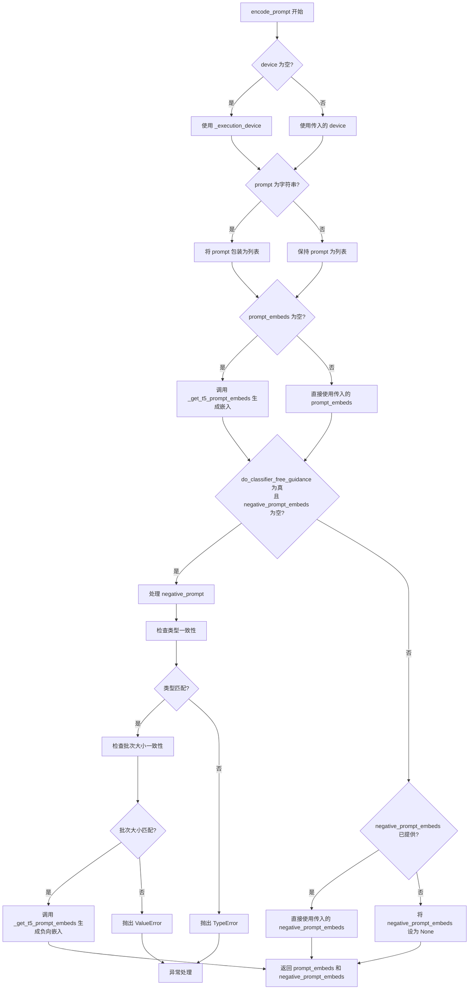

#### 带注释源码

```python
def encode_prompt(
    self,
    prompt: str | list[str],
    negative_prompt: str | list[str] | None = None,
    do_classifier_free_guidance: bool = True,
    num_videos_per_prompt: int = 1,
    prompt_embeds: torch.Tensor | None = None,
    negative_prompt_embeds: torch.Tensor | None = None,
    max_sequence_length: int = 226,
    device: torch.device | None = None,
    dtype: torch.dtype | None = None,
):
    r"""
    Encodes the prompt into text encoder hidden states.

    Args:
        prompt (`str` or `list[str]`, *optional*):
            prompt to be encoded
        negative_prompt (`str` or `list[str]`, *optional*):
            The prompt or prompts not to guide the image generation. If not defined, one has to pass
            `negative_prompt_embeds` instead. Ignored when not using guidance (i.e., ignored if `guidance_scale` is
            less than `1`).
        do_classifier_free_guidance (`bool`, *optional*, defaults to `True`):
            Whether to use classifier free guidance or not.
        num_videos_per_prompt (`int`, *optional*, defaults to 1):
            Number of videos that should be generated per prompt. torch device to place the resulting embeddings on
        prompt_embeds (`torch.Tensor`, *optional*):
            Pre-generated text embeddings. Can be used to easily tweak text inputs, *e.g.* prompt weighting. If not
            provided, text embeddings will be generated from `prompt` input argument.
        negative_prompt_embeds (`torch.Tensor`, *optional*):
            Pre-generated negative text embeddings. Can be used to easily tweak text inputs, *e.g.* prompt
            weighting. If not provided, negative_prompt_embeds will be generated from `negative_prompt` input
            argument.
        device: (`torch.device`, *optional*):
            torch device
        dtype: (`torch.dtype`, *optional*):
            torch dtype
    """
    # 确定执行设备，如果未指定则使用默认执行设备
    device = device or self._execution_device

    # 统一将 prompt 转换为列表格式，以便批量处理
    prompt = [prompt] if isinstance(prompt, str) else prompt
    
    # 根据 prompt 或 prompt_embeds 确定批次大小
    if prompt is not None:
        batch_size = len(prompt)
    else:
        batch_size = prompt_embeds.shape[0]

    # 如果未提供 prompt_embeds，则通过 T5 文本编码器生成
    if prompt_embeds is None:
        prompt_embeds = self._get_t5_prompt_embeds(
            prompt=prompt,
            num_videos_per_prompt=num_videos_per_prompt,
            max_sequence_length=max_sequence_length,
            device=device,
            dtype=dtype,
        )

    # 当启用 Classifier-Free Guidance 且未提供负向嵌入时，处理负向提示
    if do_classifier_free_guidance and negative_prompt_embeds is None:
        # 默认使用空字符串作为负向提示
        negative_prompt = negative_prompt or ""
        
        # 确保负向提示与正向提示类型一致（字符串或列表）
        negative_prompt = batch_size * [negative_prompt] if isinstance(negative_prompt, str) else negative_prompt

        # 类型一致性检查：确保 negative_prompt 与 prompt 类型相同
        if prompt is not None and type(prompt) is not type(negative_prompt):
            raise TypeError(
                f"`negative_prompt` should be the same type to `prompt`, but got {type(negative_prompt)} !="
                f" {type(prompt)}."
            )
        # 批次大小一致性检查
        elif batch_size != len(negative_prompt):
            raise ValueError(
                f"`negative_prompt`: {negative_prompt} has batch size {len(negative_prompt)}, but `prompt`:"
                f" {prompt} has batch size {batch_size}. Please make sure that passed `negative_prompt` matches"
                " the batch size of `prompt`."
            )

        # 通过 T5 文本编码器生成负向提示嵌入
        negative_prompt_embeds = self._get_t5_prompt_embeds(
            prompt=negative_prompt,
            num_videos_per_prompt=num_videos_per_prompt,
            max_sequence_length=max_sequence_length,
            device=device,
            dtype=dtype,
        )

    # 返回正负向提示嵌入元组
    return prompt_embeds, negative_prompt_embeds
```


### WanPipeline.check_inputs

该函数用于验证文本到视频生成管道的输入参数，确保用户提供的参数符合模型要求，包括检查高度和宽度的像素限制、提示词与预计算嵌入的一致性、回调张量的有效性，以及双阶段引导缩放参数的配置合法性。

参数：

- `prompt`：`str | list[str]`，要编码的提示词，可以是字符串或字符串列表
- `negative_prompt`：`str | list[str] | None`，用于引导图像生成的反向提示词，可选
- `height`：`int`，生成视频的高度（像素）
- `width`：`int`，生成视频的宽度（像素）
- `prompt_embeds`：`torch.Tensor | None`，预生成的文本嵌入，可选
- `negative_prompt_embeds`：`torch.Tensor | None`，预生成的反向文本嵌入，可选
- `callback_on_step_end_tensor_inputs`：`list[str] | None`，在每个去噪步骤结束时回调的张量输入列表
- `guidance_scale_2`：`float | None`，低噪声阶段变换器的引导缩放比例，仅在 boundary_ratio 不为 None 时支持

返回值：`None`，该函数通过抛出 ValueError 异常来处理无效输入，不返回任何值

#### 流程图

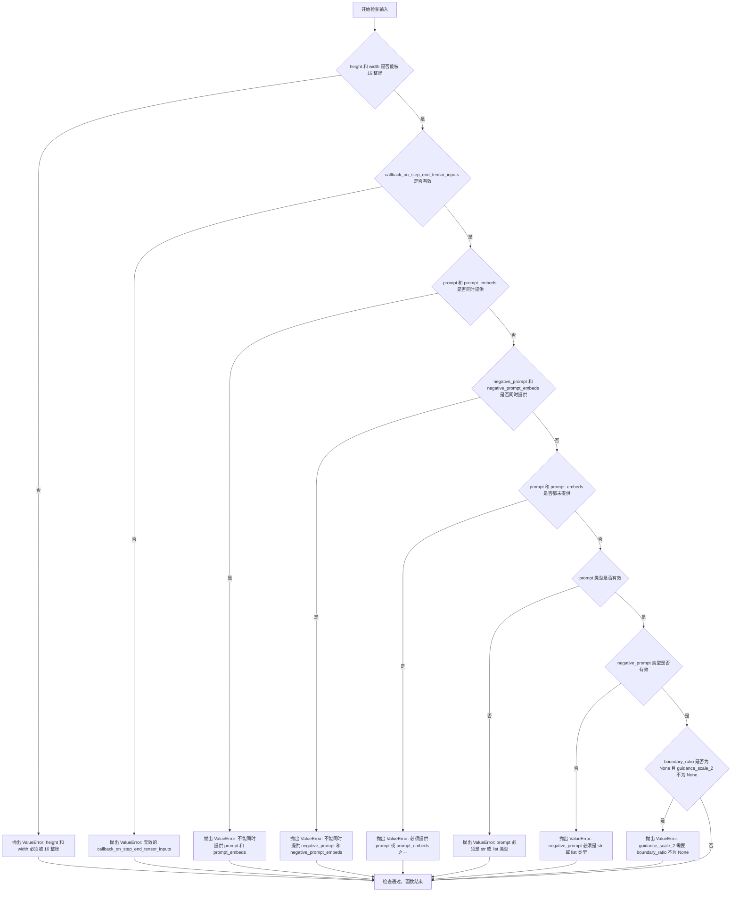

#### 带注释源码

```python
def check_inputs(
    self,
    prompt,
    negative_prompt,
    height,
    width,
    prompt_embeds=None,
    negative_prompt_embeds=None,
    callback_on_step_end_tensor_inputs=None,
    guidance_scale_2=None,
):
    """
    检查输入参数的有效性，确保提供的参数符合管道要求
    
    参数:
        prompt: 用户提供的文本提示词
        negative_prompt: 用户提供的反向文本提示词
        height: 生成视频的高度
        width: 生成视频的宽度
        prompt_embeds: 预计算的提示词嵌入向量
        negative_prompt_embeds: 预计算的反向提示词嵌入向量
        callback_on_step_end_tensor_inputs: 步骤结束回调时传递的张量输入列表
        guidance_scale_2: 第二阶段的引导缩放因子（用于双阶段去噪）
    """
    
    # 检查高度和宽度是否为16的倍数（模型内部处理要求）
    if height % 16 != 0 or width % 16 != 0:
        raise ValueError(f"`height` and `width` have to be divisible by 16 but are {height} and {width}.")

    # 验证回调张量输入是否在允许的列表中
    if callback_on_step_end_tensor_inputs is not None and not all(
        k in self._callback_tensor_inputs for k in callback_on_step_end_tensor_inputs
    ):
        raise ValueError(
            f"`callback_on_step_end_tensor_inputs` has to be in {self._callback_tensor_inputs}, but found {[k for k in callback_on_step_end_tensor_inputs if k not in self._callback_tensor_inputs]}"
        )

    # 确保 prompt 和 prompt_embeds 不同时提供（互斥）
    if prompt is not None and prompt_embeds is not None:
        raise ValueError(
            f"Cannot forward both `prompt`: {prompt} and `prompt_embeds`: {prompt_embeds}. Please make sure to"
            " only forward one of the two."
        )
    # 确保 negative_prompt 和 negative_prompt_embeds 不同时提供（互斥）
    elif negative_prompt is not None and negative_prompt_embeds is not None:
        raise ValueError(
            f"Cannot forward both `negative_prompt`: {negative_prompt} and `negative_prompt_embeds`: {negative_prompt_embeds}. Please make sure to"
            " only forward one of the two."
        )
    # 至少需要提供 prompt 或 prompt_embeds 之一
    elif prompt is None and prompt_embeds is None:
        raise ValueError(
            "Provide either `prompt` or `prompt_embeds`. Cannot leave both `prompt` and `prompt_embeds` undefined."
        )
    # 验证 prompt 的类型（必须是字符串或字符串列表）
    elif prompt is not None and (not isinstance(prompt, str) and not isinstance(prompt, list)):
        raise ValueError(f"`prompt` has to be of type `str` or `list` but is {type(prompt)}")
    # 验证 negative_prompt 的类型（必须是字符串或字符串列表）
    elif negative_prompt is not None and (
        not isinstance(negative_prompt, str) and not isinstance(negative_prompt, list)
    ):
        raise ValueError(f"`negative_prompt` has to be of type `str` or `list` but is {type(negative_prompt)}")

    # 验证 guidance_scale_2 的使用条件（需要 pipeline 配置了 boundary_ratio）
    if self.config.boundary_ratio is None and guidance_scale_2 is not None:
        raise ValueError("`guidance_scale_2` is only supported when the pipeline's `boundary_ratio` is not None.")
```


### `WanPipeline.prepare_latents`

该方法用于在文本到视频生成流程中准备初始的潜在变量（latents）。如果用户已提供潜在变量，则直接将其移动到指定设备；否则，根据批大小、视频高度、宽度和帧数计算潜在空间的形状，并使用随机噪声生成器初始化潜在变量。

参数：

- `batch_size`：`int`，批量大小，即每个提示词生成的视频数量
- `num_channels_latents`：`int`，潜在变量的通道数，默认为 16
- `height`：`int`，生成视频的高度，默认为 480
- `width`：`int`，生成视频的宽度，默认为 832
- `num_frames`：`int`，生成视频的帧数，默认为 81
- `dtype`：`torch.dtype | None`，潜在变量的数据类型，默认为 None
- `device`：`torch.device | None`，潜在变量存放的设备，默认为 None
- `generator`：`torch.Generator | list[torch.Generator] | None`，随机数生成器，用于确保生成的可重复性，默认为 None
- `latents`：`torch.Tensor | None`，用户提供的潜在变量，如果为 None 则自动生成，默认为 None

返回值：`torch.Tensor`，准备好的潜在变量张量

#### 流程图

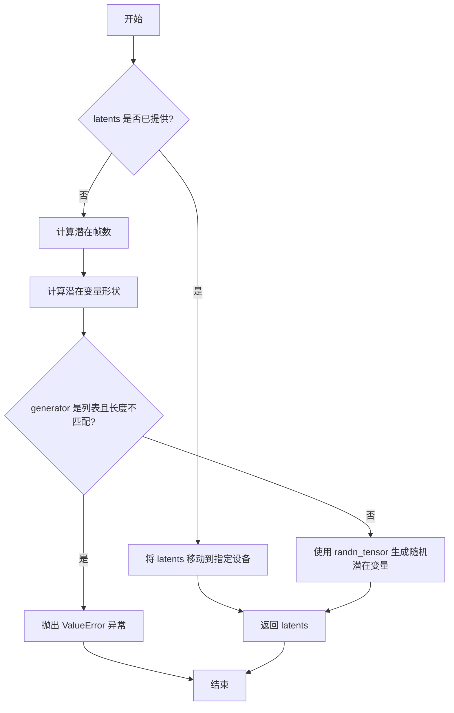

#### 带注释源码

```python
def prepare_latents(
    self,
    batch_size: int,
    num_channels_latents: int = 16,
    height: int = 480,
    width: int = 832,
    num_frames: int = 81,
    dtype: torch.dtype | None = None,
    device: torch.device | None = None,
    generator: torch.Generator | list[torch.Generator] | None = None,
    latents: torch.Tensor | None = None,
) -> torch.Tensor:
    # 如果用户已经提供了潜在变量，直接将其移动到指定的设备和数据类型
    if latents is not None:
        return latents.to(device=device, dtype=dtype)

    # 计算潜在空间中的帧数：根据 VAE 的时间缩放因子将视频帧数转换为潜在帧数
    # 公式: (num_frames - 1) // vae_scale_factor_temporal + 1
    num_latent_frames = (num_frames - 1) // self.vae_scale_factor_temporal + 1

    # 构建潜在变量的形状：[batch_size, channels, latent_frames, height/vae_scale, width/vae_scale]
    shape = (
        batch_size,
        num_channels_latents,
        num_latent_frames,
        int(height) // self.vae_scale_factor_spatial,
        int(width) // self.vae_scale_factor_spatial,
    )

    # 验证生成器列表长度与批大小是否匹配
    if isinstance(generator, list) and len(generator) != batch_size:
        raise ValueError(
            f"You have passed a list of generators of length {len(generator)}, but requested an effective batch"
            f" size of {batch_size}. Make sure the batch size matches the length of the generators."
        )

    # 使用随机张量生成器创建初始噪声潜在变量
    # 从标准正态分布中采样，形状由 shape 指定
    latents = randn_tensor(shape, generator=generator, device=device, dtype=dtype)

    # 返回准备好的潜在变量
    return latents
```


### WanPipeline.__call__

这是Wan视频生成Pipeline的主入口方法，接收文本提示和其他生成参数，通过编码提示、准备潜在变量、执行去噪循环（包括条件和无条件推理）、最后使用VAE解码潜在变量来生成视频。

参数：

- `prompt`：`str | list[str]`，要引导视频生成的提示，如果未定义则传递`prompt_embeds`
- `negative_prompt`：`str | list[str]`，视频生成过程中要避免的提示，如果未定义则传递`negative_prompt_embeds`，仅在不使用引导时忽略
- `height`：`int`，生成视频的高度（像素），默认480
- `width`：`int`，生成视频的宽度（像素），默认832
- `num_frames`：`int`，生成视频的帧数，默认81
- `num_inference_steps`：`int`，去噪步数，更多步骤通常导致更高质量的视频，但推理速度更慢，默认50
- `guidance_scale`：`float`，分类器自由扩散引导中的引导比例，默认5.0
- `guidance_scale_2`：`float | None`，低噪声阶段transformer的引导比例，如果为None且pipeline的boundary_ratio不为None，则使用与guidance_scale相同的值
- `num_videos_per_prompt`：`int`，每个提示生成的视频数量，默认1
- `generator`：`torch.Generator | list[torch.Generator]`，用于使生成确定性的随机生成器
- `latents`：`torch.Tensor | None`，预生成的高斯分布噪声潜在变量，用于视频生成，可用于使用不同提示调整相同生成
- `prompt_embeds`：`torch.Tensor | None`，预生成的文本嵌入，可用于轻松调整文本输入
- `negative_prompt_embeds`：`torch.Tensor | None`，预生成的负面文本嵌入
- `output_type`：`str`，生成视频的输出格式，可选"np"或"latent"，默认"np"
- `return_dict`：`bool`，是否返回WanPipelineOutput，默认True
- `attention_kwargs`：`dict[str, Any] | None`，传递给AttentionProcessor的参数字典
- `callback_on_step_end`：`Callable | PipelineCallback | MultiPipelineCallbacks | None`，每个去噪步骤结束时调用的回调函数
- `callback_on_step_end_tensor_inputs`：`list[str]`，回调函数需要的张量输入列表，默认["latents"]
- `max_sequence_length`：`int`，文本编码器的最大序列长度，默认512

返回值：`WanPipelineOutput | tuple`，如果return_dict为True，返回WanPipelineOutput（包含生成的视频帧列表），否则返回元组

#### 流程图

```mermaid
flowchart TD
    A[开始 __call__] --> B[检查输入参数]
    B --> C{num_frames是否有效}
    C -->|否| D[调整num_frames]
    C -->|是| E[检查height和width是否满足patchification要求]
    D --> E
    E --> F[设置guidance_scale和attention_kwargs]
    F --> G[确定batch_size]
    G --> H[编码输入提示<br/>encode_prompt]
    H --> I[准备时间步<br/>scheduler.set_timesteps]
    I --> J[准备潜在变量<br/>prepare_latents]
    J --> K[初始化mask张量]
    K --> L[进入去噪循环]
    
    L --> M{循环是否结束}
    M -->|否| N{检查boundary_timestep}
    N -->|t >= boundary_timestep| O[使用transformer<br/>高噪声阶段]
    N -->|t < boundary_timestep| P[使用transformer_2<br/>低噪声阶段]
    O --> Q[条件推理<br/>noise_pred = model<br/>hidden_states, timestep, encoder_hidden_states]
    P --> Q
    Q --> R{是否使用CFG}
    R -->|是| S[无条件推理<br/>noise_uncond]
    R -->|否| T[跳过无条件推理]
    S --> U[计算最终噪声预测<br/>noise_pred = noise_uncond + scale * (noise_pred - noise_uncond)]
    T --> V[潜在变量去噪<br/>scheduler.step]
    U --> V
    V --> W{是否有callback_on_step_end}
    W -->|是| X[执行回调<br/>更新latents和prompt_embeds]
    W -->|否| Y[更新进度条]
    X --> Y
    Y --> M
    
    M -->|是| Z{output_type是否为latent}
    Z -->|否| AA[反标准化latents<br/>latents / std + mean]
    Z -->|是| AB[直接返回latents]
    AA --> AC[VAE解码<br/>vae.decode]
    AC --> AD[后处理视频<br/>video_processor.postprocess_video]
    AD --> AB
    
    AB --> AE[卸载所有模型<br/>maybe_free_model_hooks]
    AE --> AF{return_dict为True}
    AF -->|是| AG[返回WanPipelineOutput]
    AF -->|否| AH[(返回tuple video)]
    
    style O fill:#90EE90
    style P fill:#87CEEB
    style Q fill:#FFE4B5
    style S fill:#FFE4B5
    style AC fill:#FFB6C1
    style AG fill:#DDA0DD
```

#### 带注释源码

```python
@torch.no_grad()
@replace_example_docstring(EXAMPLE_DOC_STRING)
def __call__(
    self,
    prompt: str | list[str] = None,
    negative_prompt: str | list[str] = None,
    height: int = 480,
    width: int = 832,
    num_frames: int = 81,
    num_inference_steps: int = 50,
    guidance_scale: float = 5.0,
    guidance_scale_2: float | None = None,
    num_videos_per_prompt: int | None = 1,
    generator: torch.Generator | list[torch.Generator] | None = None,
    latents: torch.Tensor | None = None,
    prompt_embeds: torch.Tensor | None = None,
    negative_prompt_embeds: torch.Tensor | None = None,
    output_type: str | None = "np",
    return_dict: bool = True,
    attention_kwargs: dict[str, Any] | None = None,
    callback_on_step_end: Callable[[int, int], None] | PipelineCallback | MultiPipelineCallbacks | None = None,
    callback_on_step_end_tensor_inputs: list[str] = ["latents"],
    max_sequence_length: int = 512,
):
    """
    Pipeline的主入口方法，用于文本到视频生成。
    
    参数:
        prompt: 引导视频生成的文本提示
        negative_prompt: 避免出现的元素
        height/width: 输出视频分辨率
        num_frames: 视频帧数
        num_inference_steps: 去噪迭代次数
        guidance_scale: CFG引导强度
        guidance_scale_2: 双阶段去噪时第二transformer的引导强度
        num_videos_per_prompt: 每个prompt生成的视频数
        generator: 随机种子控制
        latents: 预定义的噪声潜在变量
        prompt_embeds/negative_prompt_embeds: 预计算的文本嵌入
        output_type: 输出格式 ("np"数组或"latent"潜在变量)
        return_dict: 是否返回PipelineOutput对象
        attention_kwargs: 注意力机制额外参数
        callback_on_step_end: 每步结束时的回调
        callback_on_step_end_tensor_inputs: 回调关注的张量
        max_sequence_length: 文本编码器最大长度
    """
    # 处理回调对象
    if isinstance(callback_on_step_end, (PipelineCallback, MultiPipelineCallbacks)):
        callback_on_step_end_tensor_inputs = callback_on_step_end.tensor_inputs

    # 1. 检查输入参数合法性
    self.check_inputs(
        prompt,
        negative_prompt,
        height,
        width,
        prompt_embeds,
        negative_prompt_embeds,
        callback_on_step_end_tensor_inputs,
        guidance_scale_2,
    )

    # 调整num_frames以满足VAE时间缩放因子要求
    if num_frames % self.vae_scale_factor_temporal != 1:
        logger.warning(
            f"`num_frames - 1` has to be divisible by {self.vae_scale_factor_temporal}. Rounding to the nearest number."
        )
        num_frames = num_frames // self.vae_scale_factor_temporal * self.vae_scale_factor_temporal + 1
    num_frames = max(num_frames, 1)

    # 确定patch_size和计算height/width的倍数要求
    patch_size = (
        self.transformer.config.patch_size
        if self.transformer is not None
        else self.transformer_2.config.patch_size
    )
    h_multiple_of = self.vae_scale_factor_spatial * patch_size[1]
    w_multiple_of = self.vae_scale_factor_spatial * patch_size[2]
    calc_height = height // h_multiple_of * h_multiple_of
    calc_width = width // w_multiple_of * w_multiple_of
    # 调整输入尺寸以满足patchification要求
    if height != calc_height or width != calc_width:
        logger.warning(
            f"`height` and `width` must be multiples of ({h_multiple_of}, {w_multiple_of}) for proper patchification. "
            f"Adjusting ({height}, {width}) -> ({calc_height}, {calc_width})."
        )
        height, width = calc_height, calc_width

    # 设置第二阶段引导比例
    if self.config.boundary_ratio is not None and guidance_scale_2 is None:
        guidance_scale_2 = guidance_scale

    # 初始化内部状态
    self._guidance_scale = guidance_scale
    self._guidance_scale_2 = guidance_scale_2
    self._attention_kwargs = attention_kwargs
    self._current_timestep = None
    self._interrupt = False

    device = self._execution_device

    # 2. 确定batch_size
    if prompt is not None and isinstance(prompt, str):
        batch_size = 1
    elif prompt is not None and isinstance(prompt, list):
        batch_size = len(prompt)
    else:
        batch_size = prompt_embeds.shape[0]

    # 3. 编码输入提示为文本嵌入
    prompt_embeds, negative_prompt_embeds = self.encode_prompt(
        prompt=prompt,
        negative_prompt=negative_prompt,
        do_classifier_free_guidance=self.do_classifier_free_guidance,
        num_videos_per_prompt=num_videos_per_prompt,
        prompt_embeds=prompt_embeds,
        negative_prompt_embeds=negative_prompt_embeds,
        max_sequence_length=max_sequence_length,
        device=device,
    )

    # 转换嵌入数据类型以匹配transformer
    transformer_dtype = self.transformer.dtype if self.transformer is not None else self.transformer_2.dtype
    prompt_embeds = prompt_embeds.to(transformer_dtype)
    if negative_prompt_embeds is not None:
        negative_prompt_embeds = negative_prompt_embeds.to(transformer_dtype)

    # 4. 准备去噪调度器的时间步
    self.scheduler.set_timesteps(num_inference_steps, device=device)
    timesteps = self.scheduler.timesteps

    # 5. 准备潜在变量（噪声）
    num_channels_latents = (
        self.transformer.config.in_channels
        if self.transformer is not None
        else self.transformer_2.config.in_channels
    )
    latents = self.prepare_latents(
        batch_size * num_videos_per_prompt,
        num_channels_latents,
        height,
        width,
        num_frames,
        torch.float32,
        device,
        generator,
        latents,
    )

    # 创建mask用于时间步扩展（Wan2.2 ti2v）
    mask = torch.ones(latents.shape, dtype=torch.float32, device=device)

    # 6. 去噪循环
    num_warmup_steps = len(timesteps) - num_inference_steps * self.scheduler.order
    self._num_timesteps = len(timesteps)

    # 计算双阶段去噪的边界时间步
    if self.config.boundary_ratio is not None:
        boundary_timestep = self.config.boundary_ratio * self.scheduler.config.num_train_timesteps
    else:
        boundary_timestep = None

    with self.progress_bar(total=num_inference_steps) as progress_bar:
        for i, t in enumerate(timesteps):
            # 检查是否中断
            if self.interrupt:
                continue

            self._current_timestep = t

            # 根据时间步选择使用哪个transformer（双阶段去噪）
            if boundary_timestep is None or t >= boundary_timestep:
                # wan2.1 或 wan2.2 高噪声阶段
                current_model = self.transformer
                current_guidance_scale = guidance_scale
            else:
                # wan2.2 低噪声阶段
                current_model = self.transformer_2
                current_guidance_scale = guidance_scale_2

            # 准备模型输入
            latent_model_input = latents.to(transformer_dtype)
            # 扩展时间步（用于ti2v）
            if self.config.expand_timesteps:
                # seq_len: num_latent_frames * latent_height//2 * latent_width//2
                temp_ts = (mask[0][0][:, ::2, ::2] * t).flatten()
                # batch_size, seq_len
                timestep = temp_ts.unsqueeze(0).expand(latents.shape[0], -1)
            else:
                timestep = t.expand(latents.shape[0])

            # 条件推理（使用prompt）
            with current_model.cache_context("cond"):
                noise_pred = current_model(
                    hidden_states=latent_model_input,
                    timestep=timestep,
                    encoder_hidden_states=prompt_embeds,
                    attention_kwargs=attention_kwargs,
                    return_dict=False,
                )[0]

            # 无条件推理（使用negative_prompt）实现CFG
            if self.do_classifier_free_guidance:
                with current_model.cache_context("uncond"):
                    noise_uncond = current_model(
                        hidden_states=latent_model_input,
                        timestep=timestep,
                        encoder_hidden_states=negative_prompt_embeds,
                        attention_kwargs=attention_kwargs,
                        return_dict=False,
                    )[0]
                # 应用引导比例
                noise_pred = noise_uncond + current_guidance_scale * (noise_pred - noise_uncond)

            # 执行去噪步骤：x_t -> x_{t-1}
            latents = self.scheduler.step(noise_pred, t, latents, return_dict=False)[0]

            # 执行回调（如果提供）
            if callback_on_step_end is not None:
                callback_kwargs = {}
                for k in callback_on_step_end_tensor_inputs:
                    callback_kwargs[k] = locals()[k]
                callback_outputs = callback_on_step_end(self, i, t, callback_kwargs)

                # 允许回调修改latents和embeddings
                latents = callback_outputs.pop("latents", latents)
                prompt_embeds = callback_outputs.pop("prompt_embeds", prompt_embeds)
                negative_prompt_embeds = callback_outputs.pop("negative_prompt_embeds", negative_prompt_embeds)

            # 更新进度条
            if i == len(timesteps) - 1 or ((i + 1) > num_warmup_steps and (i + 1) % self.scheduler.order == 0):
                progress_bar.update()

            # XLA设备同步
            if XLA_AVAILABLE:
                xm.mark_step()

    self._current_timestep = None

    # 7. 后处理：解码潜在变量为视频
    if not output_type == "latent":
        # 反标准化潜在变量
        latents = latents.to(self.vae.dtype)
        latents_mean = (
            torch.tensor(self.vae.config.latents_mean)
            .view(1, self.vae.config.z_dim, 1, 1, 1)
            .to(latents.device, latents.dtype)
        )
        latents_std = 1.0 / torch.tensor(self.vae.config.latents_std).view(1, self.vae.config.z_dim, 1, 1, 1).to(
            latents.device, latents.dtype
        )
        latents = latents / latents_std + latents_mean
        # VAE解码
        video = self.vae.decode(latents, return_dict=False)[0]
        # 后处理转换为指定输出格式
        video = self.video_processor.postprocess_video(video, output_type=output_type)
    else:
        video = latents

    # 8. 卸载所有模型
    self.maybe_free_model_hooks()

    # 9. 返回结果
    if not return_dict:
        return (video,)

    return WanPipelineOutput(frames=video)
```


### WanPipeline.guidance_scale

这是一个属性 getter 方法，用于获取分类器自由引导（Classifier-Free Guidance）的缩放因子。该属性返回存储在 `self._guidance_scale` 中的浮点数值，该值在管道调用时由用户通过 `guidance_scale` 参数设置，用于控制生成内容与文本提示的相关程度。

参数： 无

返回值：`float`，返回分类器自由引导的缩放因子。值越大，生成的视频与提示词相关性越高，但可能导致质量下降；值越小（如 1.0），引导效果减弱。

#### 流程图

```mermaid
flowchart TD
    A[调用 guidance_scale 属性] --> B{检查 _guidance_scale 是否存在}
    B -->|是| C[返回 self._guidance_scale]
    B -->|否| D[返回默认值或 AttributeError]
    
    C --> E[用于 do_classifier_free_guidance 判断]
    C --> F[在噪声预测计算中使用]
    
    E --> G[判断是否启用无分类器引导]
    F --> H[noise_pred = noise_uncond + guidance_scale * (noise_pred - noise_uncond)]
```

#### 带注释源码

```python
@property
def guidance_scale(self):
    """
    属性 getter：获取分类器自由引导的缩放因子。
    
    该属性返回在 __call__ 方法中设置的 self._guidance_scale 值。
    guidance_scale 控制文本提示对生成过程的引导强度，值越大表示
    越严格遵循提示词内容。在 do_classifier_free_guidance 属性中
    进一步用于判断是否启用无分类器引导（当 guidance_scale > 1.0 时启用）。
    
    返回:
        float: 分类器自由引导的缩放因子，默认为 5.0
    """
    return self._guidance_scale
```


### `WanPipeline.do_classifier_free_guidance`

该属性方法用于判断当前是否启用了分类器自由引导（Classifier-Free Guidance, CFG）。它通过检查内部属性 `_guidance_scale` 的值是否大于 1.0 来决定返回 True 还是 False。当 guidance_scale > 1.0 时，表示启用 CFG，此时模型会同时考虑正向提示词和负向提示词进行去噪，以提升生成质量。

参数：无（该方法为属性方法，无显式参数，`self` 为隐式参数）

返回值：`bool`，如果 `guidance_scale > 1.0` 则返回 `True`（表示启用分类器自由引导），否则返回 `False`（表示不启用）

#### 流程图

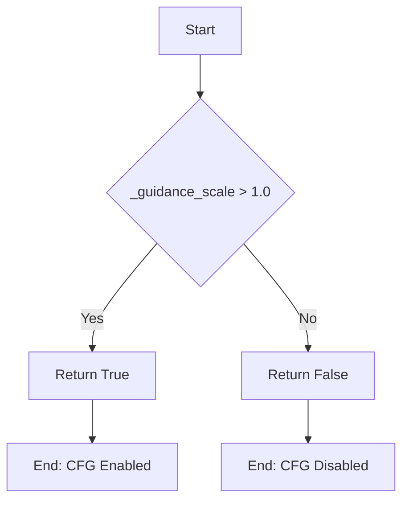

#### 带注释源码

```python
@property
def do_classifier_free_guidance(self):
    """
    属性方法：判断是否启用分类器自由引导（Classifier-Free Guidance, CFG）
    
    该属性检查内部存储的 guidance_scale 值，当 guidance_scale > 1.0 时，
    扩散模型会同时考虑正向提示词和负向提示词进行条件去噪，从而提升生成结果
    与文本提示词的对齐程度。这是扩散模型中常用的技术手段。
    
    返回值:
        bool: 如果 guidance_scale 大于 1.0 返回 True，否则返回 False
    """
    return self._guidance_scale > 1.0
```


### `WanPipeline.num_timesteps`

该属性是一个只读属性，用于返回文本到视频生成pipeline在推理过程中所使用的时间步总数。该值在去噪循环开始前被设置，等于调度器生成的时间步列表的长度，通常等于用户指定的推理步数（`num_inference_steps`）。

参数：无（此属性不接受任何参数）

返回值：`int`，返回推理过程中时间步的总数，即去噪过程的步数。

#### 流程图

```mermaid
flowchart TD
    A[访问 WanPipeline 实例的 num_timesteps 属性] --> B{属性类型检查}
    B -->|Python @property 装饰器| C[调用 getter 方法]
    C --> D[返回 self._num_timesteps]
    D --> E[返回类型: int]
    
    F[设置 _num_timesteps] -->|在 __call__ 中| G[scheduler.set_timesteps]
    G --> H[获取 timesteps 列表]
    H --> I[len(timesteps) 计算长度]
    I --> J[赋值给 self._num_timesteps]
```

#### 带注释源码

```python
@property
def num_timesteps(self):
    """
    返回推理过程中时间步的总数。
    
    该属性在 pipeline 的 __call__ 方法中被设置，具体在去噪循环开始前：
    1. 调用 scheduler.set_timesteps(num_inference_steps) 配置调度器
    2. 获取调度器的时间步列表 scheduler.timesteps
    3. 计算列表长度并存储到 self._num_timesteps
    
    Returns:
        int: 时间步的总数，通常等于 num_inference_steps 参数值。
             如果调度器有特定的 order 设置，可能会略有不同。
    """
    return self._num_timesteps
```

---

**补充说明**：

- **设计目的**：提供对内部状态 `_num_timesteps` 的只读访问，使用户能够查询当前或上一次运行的推理步数。
- **初始化**：`self._num_timesteps` 在 `__call__` 方法的去噪循环之前被设置：
  ```python
  self._num_timesteps = len(timesteps)
  ```
- **潜在技术债务**：该属性直接返回内部变量，没有任何验证或错误处理。如果在 `__call__` 方法被调用之前访问此属性，会抛出 `AttributeError`（因为 `_num_timesteps` 未定义）。可以考虑在 `__init__` 中初始化为 `0` 或添加更好的错误提示。


### `WanPipeline.current_timestep`

该属性是 WanPipeline 类的一个只读属性，用于返回扩散管道在去噪循环中当前处理的时间步（timestep），便于外部监控或记录生成进度。

参数：该属性无需传入参数，属于只读属性。

返回值：`torch.Tensor` 或 `None`，返回当前去噪循环中处理的时间步张量，循环结束后重置为 `None`。

#### 流程图

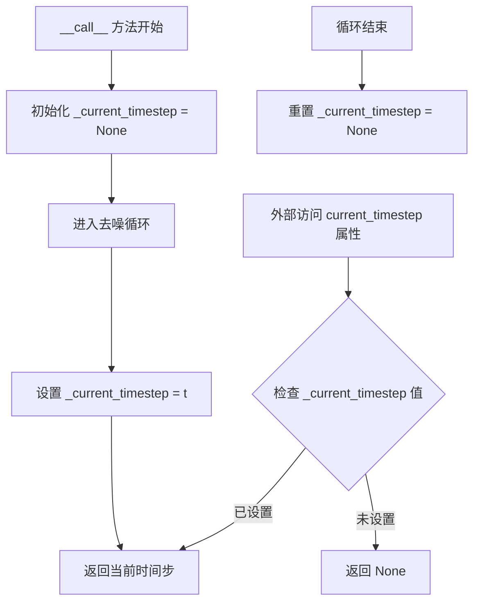

#### 带注释源码

```python
@property
def current_timestep(self):
    """
    返回扩散管道在去噪过程中当前处理的时间步（timestep）。
    
    该属性为只读属性，通过内部变量 _current_timestep 获取当前时间步。
    在 __call__ 方法的去噪循环中，每个迭代步骤都会更新该值，
    循环结束后重置为 None。
    
    返回:
        torch.Tensor 或 None: 当前处理的时间步，循环未开始或已结束时为 None。
    """
    return self._current_timestep
```


### `WanPipeline.interrupt`

这是一个属性（property），用于获取或设置管道的interrupt状态，允许外部代码请求提前终止正在进行的视频生成过程。

参数：

- （无参数，这是一个property getter）

返回值：`bool`，返回管道的中断状态标志

#### 流程图

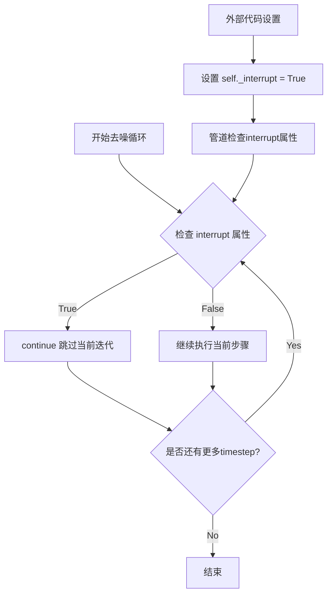

#### 带注释源码

```python
@property
def interrupt(self):
    """中断属性 getter
    
    返回管道的中断状态。当外部代码将此属性设置为 True 时，
    去噪循环中的每次迭代都会检查此属性并跳过当前步骤，
    从而实现优雅地提前终止视频生成过程。
    
    Returns:
        bool: 管道的中断状态标志。True 表示请求中断，False 表示继续运行。
    """
    return self._interrupt
```

**相关上下文源码（使用interrupt属性的去噪循环部分）：**

```python
# 在 __call__ 方法中初始化
self._interrupt = False  # 初始化中断标志

# 在去噪循环中检查
with self.progress_bar(total=num_inference_steps) as progress_bar:
    for i, t in enumerate(timesteps):
        if self.interrupt:  # 检查中断标志
            continue  # 如果请求中断，跳过当前迭代
        
        # ... 继续正常的去噪步骤
```


### `WanPipeline.attention_kwargs`

该属性返回在管道调用期间传递的关注度参数（attention kwargs）字典，用于控制变换器模型中的注意力机制。该属性允许在推理过程中动态调整注意力处理器的行为。

参数： 无

返回值：`dict[str, Any] | None`，返回关注度参数字典，如果未设置则返回 `None`。该字典包含传递给 `AttentionProcessor` 的参数，用于控制自注意力、交叉注意力等机制的行为。

#### 流程图

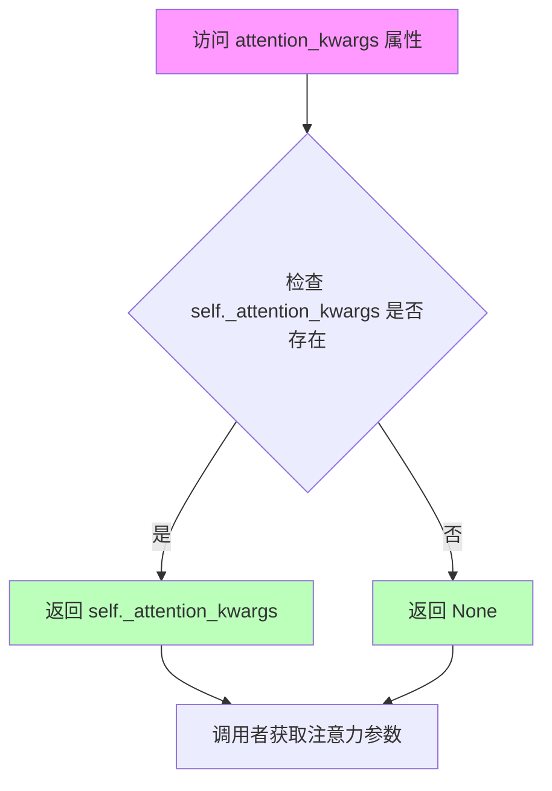

#### 带注释源码

```python
@property
def attention_kwargs(self):
    """
    返回管道的注意力参数字典。
    
    该属性在 __call__ 方法中被设置，用于存储用户传递的注意力关键字参数。
    这些参数随后会被传递给 transformer 模型的 forward 方法，
    以便在去噪过程中控制注意力机制的行为。
    
    Returns:
        dict[str, Any] | None: 注意力参数字典，如果未设置则为 None
    """
    return self._attention_kwargs
```

#### 相关上下文信息

| 项目 | 描述 |
|------|------|
| **所属类** | `WanPipeline` |
| **属性类型** | 只读属性（getter） |
| **存储变量** | `self._attention_kwargs` |
| **设置位置** | `__call__` 方法中 `self._attention_kwargs = attention_kwargs` |
| **使用位置** | 传递给 `current_model()` 调用时的 `attention_kwargs` 参数 |

#### 典型使用场景

1. **外部调用获取当前注意力参数**：用户可以在管道调用后检查使用了哪些注意力参数
2. **调试与日志记录**：用于验证传递给注意力处理器的配置
3. **自定义注意力控制**：通过该属性可以动态获取和修改注意力行为

## 关键组件


### WanPipeline（ Wan 文本到视频生成管道）

主扩散管道类，继承自DiffusionPipeline和WanLoraLoaderMixin，负责协调文本到视频的完整生成流程，包括提示编码、潜在向量准备、去噪循环和VAE解码。

### T5 提示嵌入编码模块（_get_t5_prompt_embeds / encode_prompt）

使用 UMT5EncoderModel 将文本提示转换为高维语义嵌入向量，支持分类器自由引导（CFG），同时处理正向和负向提示嵌入，支持批量生成和序列长度控制。

### 潜在向量准备模块（prepare_latents）

根据指定的批量大小、视频高度、宽度和帧数生成初始高斯噪声潜在向量，支持自定义随机生成器，允许用户通过预生成的latents进行可控生成。

### 双阶段去噪机制（Two-Stage Denoising）

支持两个Transformer模型（transformer和transformer_2）协同工作，通过boundary_ratio参数划分高噪声和低噪声阶段，实现分段去噪以提升生成质量。

### 时间步扩展模块（expand_timesteps）

Wan 2.2版本的时间步扩展功能，通过mask对潜在向量进行空间下采样并扩展时间步，实现文本到图像（Ti2v）任务的特殊处理。

### VAE 视频解码模块

使用AutoencoderKLWan将去噪后的潜在向量解码为实际视频帧，包含潜在向量归一化处理（mean/std调整），并通过VideoProcessor进行后处理输出。

### 输入验证模块（check_inputs）

对管道输入参数进行全面验证，包括高度/宽度16倍数检查、提示与嵌入互斥检查、引导比例合法性检查等，确保生成流程的稳定性。

### 回调与监控模块（callback_on_step_end）

支持在每个去噪步骤结束后执行自定义回调函数，允许用户干预生成过程、修改latents和prompt_embeds，实现高度定制化的生成控制。


## 问题及建议


### 已知问题

-   **`encode_prompt` 方法中的类型检查不够健壮**：使用 `type(prompt) is not type(negative_prompt)` 进行类型比较不是最佳实践，应使用 `isinstance()` 进行多态类型检查。
-   **`mask` 变量定义后未在主循环中使用**：`prepare_latents` 后创建的 `mask = torch.ones(...)` 在去噪循环中没有任何用途，可能是遗留代码。
-   **模型选择逻辑重复**：获取 `transformer` 或 `transformer_2` 的配置信息（如 `dtype`、`in_channels`、`patch_size`）的逻辑在 `__call__` 方法中多次重复出现，缺乏统一封装。
-   **`_callback_tensor_inputs` 使用列表而非集合**：列表的成员检查时间复杂度为 O(n)，对于固定的小集合影响不大，但在语义上应使用集合（set）以提高可读性和查找效率。
-   **条件变量初始化不一致**：在 `__call__` 方法中，`self._guidance_scale`、`self._attention_kwargs` 等属性在设置前可能被读取（虽然通过流程控制避免了问题），但缺少默认值初始化。
-   **`expand_timesteps` 配置使用后缺少文档说明**：该参数在 `__init__` 中注册但使用逻辑复杂，缺少对 `Wan2.2 ti2v` 特定场景的详细解释。
-   **潜在空引用风险**：在访问 `self.vae.config` 属性时使用 `getattr(self, "vae", None)` 进行保护，但在后续直接访问 `self.vae_scale_factor_temporal` 等属性时假设 `vae` 必定存在，若初始化时未传入 `vae` 会导致 AttributeError。

### 优化建议

-   **提取模型选择逻辑**：创建一个辅助方法（如 `_get_current_model_and_config`）来统一处理 `transformer` 和 `transformer_2` 的选择及其相关配置信息的获取。
-   **移除未使用的 `mask` 变量**：如果该变量确实不需要，应从代码中删除以减少混淆；如果计划在未来使用，应添加 TODO 注释说明。
-   **缓存 prompt embeddings**：在 `encode_prompt` 或更上层实现 embedding 缓存机制，避免相同 prompt 的重复编码计算。
-   **统一类型注解风格**：整个文件中混用了 `|` 语法（如 `str | list[str]`）和 `Union` 类型，建议统一使用一种风格以保持一致性。
-   **增强错误处理**：在模型加载、VAE 解码等关键操作中添加更详细的异常信息和回退机制，特别是针对 CUDA OOM 情况的处理。
-   **初始化默认值**：在类级别或 `__init__` 方法中为 `_guidance_scale`、`_attention_kwargs` 等内部状态变量设置合理的默认值，提高代码的健壮性。
-   **改进配置校验**：在 `__init__` 或 `check_inputs` 的早期阶段对 `boundary_ratio` 和 `transformer_2` 的一致性进行校验，提供更清晰的错误信息。

## 其它


### 设计目标与约束

本WanPipeline的设计目标是实现高效的文本到视频生成能力，支持1.3B和14B参数规模的模型，支持单transformer和双transformer两阶段降噪架构。核心约束包括：(1)输入height和width必须能被16整除；(2)num_frames必须满足vae_scale_factor_temporal的约束；(3)支持文本提示或预计算的prompt_embeds输入；(4)支持classifier-free guidance；(5)支持LoRA权重加载；(6)兼容PyTorch和PyTorch XLA设备。

### 错误处理与异常设计

代码中的错误处理主要通过check_inputs方法实现，分为以下几类：(1)参数校验错误：height/width不是16的倍数、prompt和prompt_embeds同时传入、negative_prompt和negative_prompt_embeds同时传入、callback_on_step_end_tensor_inputs包含非法tensor名称；(2)类型错误：prompt或negative_prompt类型不是str或list；(3)批次大小不匹配错误：negative_prompt与prompt的批次大小不一致、generator列表长度与batch_size不匹配；(4)条件约束错误：guidance_scale_2存在但boundary_ratio为None时抛出ValueError。所有错误均抛出明确的ValueError或TypeError，并附带详细的错误信息。

### 数据流与状态机

数据流主要分为以下几个阶段：(1)输入预处理阶段：对prompt进行清洗（basic_clean、whitespace_clean、prompt_clean），并通过T5 tokenizer进行tokenize；(2)文本编码阶段：使用text_encoder将token序列编码为prompt_embeds，negative_prompt同样编码为negative_prompt_embeds；(3)潜在向量初始化阶段：通过prepare_latents生成初始噪声潜在向量；(4)去噪循环阶段：按照scheduler生成的timesteps进行迭代，根据boundary_ratio判断使用transformer还是transformer_2，执行条件和非条件预测，计算noise_pred并通过scheduler.step更新latents；(5)VAE解码阶段：将最终的latents通过VAE解码为视频帧；(6)后处理阶段：通过VideoProcessor将视频转换为指定输出格式（np数组或PIL Image）。状态机管理包括_guidance_scale、_guidance_scale_2、_attention_kwargs、_current_timestep、_interrupt、_num_timesteps等内部状态。

### 外部依赖与接口契约

本pipeline依赖以下外部组件：(1)transformers库：提供AutoTokenizer和UMT5EncoderModel用于文本编码；(2)diffusers自身模块：DiffusionPipeline基类、AutoencoderKLWan、 WanTransformer3DModel、FlowMatchEulerDiscreteScheduler、VideoProcessor、WanLoraLoaderMixin；(3)可选依赖：ftfy（用于文本清洗）、torch_xla（用于XLA设备加速）；(4)第三方库：regex、html、torch。接口契约方面：pipeline的__call__方法接受prompt/negative_prompt或prompt_embeds/negative_prompt_embeds作为输入，输出WanPipelineOutput（包含frames属性）或tuple；支持通过attention_kwargs传递注意力处理器参数；支持通过callback_on_step_end在每个去噪步骤结束时执行回调；支持通过generator控制随机性；支持latents参数实现潜在向量复用。

### 性能优化考虑

当前代码包含以下性能优化点：(1)模型CPU卸载序列定义（model_cpu_offload_seq）支持渐进式模型卸载；(2)支持torch.no_grad()装饰器减少显存占用；(3)通过XLA_AVAILABLE标志支持PyTorch XLA加速；(4)支持模型缓存上下文（cache_context）用于条件和非条件预测；(5)支持batch_size * num_videos_per_prompt的批量生成。潜在优化方向包括：(1)enable_vae_slicing和enable_vae_tiling用于大分辨率视频生成；(2)支持pipieline级别的enable_sequential_cpu_offload；(3)transformer和transformer_2可考虑使用共享权重或蒸馏技术减少内存占用。

### 兼容性设计

本pipeline的兼容性设计包括：(1)_optional_components支持transformer和transformer_2为可选组件；(2)支持T5和UMT5系列文本编码器；(3)支持多种scheduler配置（主要是UniPCMultistepScheduler配合FlowMatchEulerDiscreteScheduler）；(4)支持PyTorch和PyTorch XLA后端；(5)支持FP16/BF16/FP32等多种dtype；(6)通过max_sequence_length参数兼容不同文本编码器的最大序列长度；(7)支持expand_timesteps参数适配Wan2.2的Text-to-Image变体。

    