# `diffusers\src\diffusers\pipelines\wan\pipeline_wan_animate.py` 详细设计文档

WanAnimatePipeline是一个用于角色动画和视频生成的统一扩散管道，支持两种模式：(1) Animation模式：根据输入的角色图像、姿态视频和面部视频生成动画角色视频；(2) Replace模式：在背景视频中替换角色，支持通过mask视频控制生成区域。该管道继承自DiffusionPipeline，集成了T5文本编码器、CLIP图像编码器、Wan VAE和Transformer模型。

## 整体流程

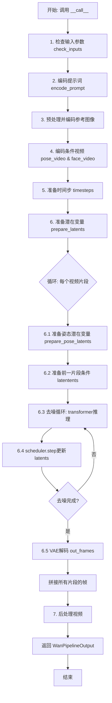

## 类结构

```
DiffusionPipeline (基类)
└── WanAnimatePipeline (主管道类)
    ├── WanLoraLoaderMixin (LoRA加载Mixin)
    ├── VideoProcessor (视频处理器)
    ├── WanAnimateImageProcessor (图像预处理器)
    └── WanPipelineOutput (输出类)
```

## 全局变量及字段


### `XLA_AVAILABLE`
    
Boolean flag indicating whether PyTorch XLA is available for TPU acceleration

类型：`bool`
    


### `logger`
    
Logger instance for the pipeline module

类型：`logging.Logger`
    


### `EXAMPLE_DOC_STRING`
    
Documentation string containing usage examples for the pipeline

类型：`str`
    


### `basic_clean`
    
Cleans text by fixing encoding issues and unescaping HTML entities

类型：`function`
    


### `whitespace_clean`
    
Normalizes whitespace by replacing multiple spaces with single space

类型：`function`
    


### `prompt_clean`
    
Combined text cleaning function for prompt processing

类型：`function`
    


### `retrieve_latents`
    
Extracts latents from encoder output using specified sampling mode

类型：`function`
    


### `WanAnimatePipeline.tokenizer`
    
T5 tokenizer for text encoding

类型：`AutoTokenizer`
    


### `WanAnimatePipeline.text_encoder`
    
T5 encoder model for text embedding generation

类型：`UMT5EncoderModel`
    


### `WanAnimatePipeline.vae`
    
Variational autoencoder for video encoding and decoding

类型：`AutoencoderKLWan`
    


### `WanAnimatePipeline.scheduler`
    
Denoising scheduler for the diffusion process

类型：`UniPCMultistepScheduler`
    


### `WanAnimatePipeline.image_processor`
    
CLIP image processor for preprocessing reference images

类型：`CLIPImageProcessor`
    


### `WanAnimatePipeline.image_encoder`
    
CLIP vision encoder for extracting image features

类型：`CLIPVisionModel`
    


### `WanAnimatePipeline.transformer`
    
3D transformer model for conditional video generation

类型：`WanAnimateTransformer3DModel`
    


### `WanAnimatePipeline.vae_scale_factor_temporal`
    
Temporal scaling factor for VAE latent space

类型：`int`
    


### `WanAnimatePipeline.vae_scale_factor_spatial`
    
Spatial scaling factor for VAE latent space

类型：`int`
    


### `WanAnimatePipeline.video_processor`
    
Video processor for encoding and decoding video data

类型：`VideoProcessor`
    


### `WanAnimatePipeline.video_processor_for_mask`
    
Video processor for mask video with grayscale conversion

类型：`VideoProcessor`
    


### `WanAnimatePipeline.vae_image_processor`
    
Image processor for VAE preprocessing with patch handling

类型：`WanAnimateImageProcessor`
    


### `WanAnimatePipeline.model_cpu_offload_seq`
    
Sequence string for CPU offloading order of models

类型：`str`
    


### `WanAnimatePipeline._callback_tensor_inputs`
    
List of tensor input names for callback functions

类型：`list`
    


### `WanAnimatePipeline._guidance_scale`
    
Classifier-free guidance scale for generation

类型：`float`
    


### `WanAnimatePipeline._attention_kwargs`
    
Keyword arguments for attention processor

类型：`dict`
    


### `WanAnimatePipeline._current_timestep`
    
Current timestep in the denoising process

类型：`int`
    


### `WanAnimatePipeline._interrupt`
    
Flag to interrupt the generation process

类型：`bool`
    


### `WanAnimatePipeline._num_timesteps`
    
Total number of denoising timesteps

类型：`int`
    
    

## 全局函数及方法


### `basic_clean`

该函数用于对文本进行基本的清理处理，通过修复文本编码问题、解码HTML实体以及去除首尾空白字符来标准化输入文本。

参数：

- `text`：`str`，需要清理的原始文本输入

返回值：`str`，清理并标准化后的文本

#### 流程图

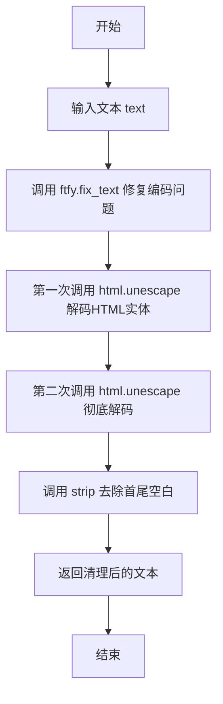

#### 带注释源码

```python
def basic_clean(text):
    """
    对文本进行基本清理处理
    
    处理流程：
    1. 使用ftfy修复文本编码问题（如乱码、错误的编码转换等）
    2. 使用html.unescape两次解码HTML实体（处理嵌套的实体编码）
    3. 去除文本首尾的空白字符
    
    参数:
        text: 需要清理的原始文本字符串
        
    返回:
        清理并标准化后的文本字符串
    """
    # 步骤1: 使用ftfy库修复常见的文本编码问题
    # ftfy可以修复mojibake（乱码）问题，如将错误的UTF-8编码转换还原
    text = ftfy.fix_text(text)
    
    # 步骤2: 两次调用html.unescape以处理嵌套的HTML实体编码
    # 例如: &amp;lt; 会先被解码为 &lt;，再被解码为 <
    # 两次解码确保所有层级的HTML实体都被正确处理
    text = html.unescape(html.unescape(text))
    
    # 步骤3: 去除文本首尾的空白字符（包括空格、制表符、换行符等）
    # 并返回处理后的结果
    return text.strip()
```


### `whitespace_clean`

该函数用于清理文本中的多余空白字符，将连续多个空白字符替换为单个空格，并去除文本首尾的空白字符。

参数：

- `text`：`str`，需要进行空白字符清理的输入文本

返回值：`str`，清理空白字符后的文本

#### 流程图

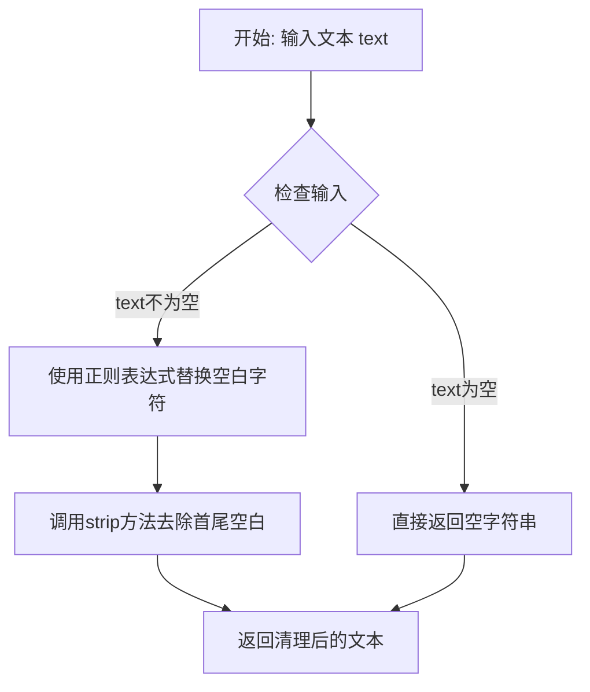

#### 带注释源码

```python
def whitespace_clean(text):
    """
    清理文本中的多余空白字符。
    
    该函数执行两个主要操作：
    1. 将连续多个空白字符（包括空格、制表符、换行符等）替换为单个空格
    2. 去除文本首尾的空白字符
    
    Args:
        text: str, 需要清理的输入文本
        
    Returns:
        str, 清理空白字符后的文本
    """
    # 使用正则表达式将一个或多个空白字符（\s+）替换为单个空格
    # 这会处理空格、制表符、换行符等各种空白字符
    text = re.sub(r"\s+", " ", text)
    
    # 去除文本开头和结尾的空白字符
    text = text.strip()
    
    # 返回清理后的文本
    return text
```


### `prompt_clean`

该函数是一个文本清理工具函数，用于对输入的提示文本进行深度清洗处理。它首先使用`basic_clean`函数修复文本编码问题并解码HTML实体，然后使用`whitespace_clean`函数规范化空白字符，最终返回干净整洁的文本字符串。

参数：

- `text`：`str`，需要清理的原始文本输入

返回值：`str`，清理处理后的文本字符串

#### 流程图

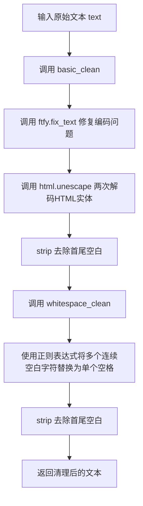

#### 带注释源码

```python
def prompt_clean(text):
    """
    清理输入的提示文本。
    
    该函数是一个文本预处理工具，用于清洗和规范化用户输入的提示文本。
    清洗流程包括两个步骤：首先使用 basic_clean 修复文本编码问题并解码HTML实体，
    然后使用 whitespace_clean 规范化空白字符。
    
    Args:
        text: 需要清理的原始文本字符串
        
    Returns:
        清理处理后的文本字符串
    """
    # 第一步：调用 basic_clean 进行基础清洗
    # - ftfy.fix_text: 修复常见的文本编码错误和乱码问题
    # - html.unescape: 递归解码HTML实体（如 &amp; -> &, &lt; -> <）
    # - strip: 去除处理后文本的首尾空白字符
    text = basic_clean(text)
    
    # 第二步：调用 whitespace_clean 进行空白字符规范化
    # - 正则表达式 \s+: 匹配一个或多个空白字符（空格、制表符、换行等）
    # - 替换为单个空格 " ": 将多个连续空白字符规范化为单个空格
    # - strip: 再次去除首尾空白，确保输出干净整洁
    text = whitespace_clean(text)
    
    # 返回最终清理后的文本
    return text
```


### `retrieve_latents`

从编码器输出中提取潜在变量的通用函数，支持多种采样模式（采样或argmax），并处理不同的编码器输出格式。

参数：

- `encoder_output`：`torch.Tensor`，编码器输出对象，可能包含 `latent_dist` 或 `latents` 属性
- `generator`：`torch.Generator | None`，可选的随机数生成器，用于采样时的随机性控制
- `sample_mode`：`str`，采样模式，默认为 "sample"，可设置为 "argmax" 获取确定性输出

返回值：`torch.Tensor`，从编码器输出中提取的潜在变量张量

#### 流程图

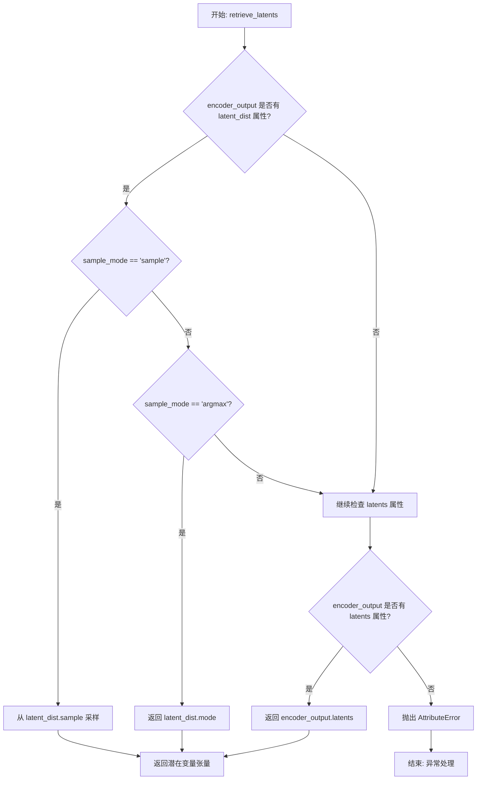

#### 带注释源码

```
# 从编码器输出中检索潜在变量的函数
# Copied from diffusers.pipelines.stable_diffusion.pipeline_stable_diffusion_img2img.retrieve_latents
def retrieve_latents(
    encoder_output: torch.Tensor,  # 编码器输出，通常是 VAE 编码后的结果
    generator: torch.Generator | None = None,  # 可选的随机数生成器，用于采样控制
    sample_mode: str = "sample"  # 采样模式: "sample" (随机采样) 或 "argmax" (确定性模式)
):
    # 情况1: 如果编码器输出有 latent_dist 属性 (VAE 编码的标准输出格式)
    if hasattr(encoder_output, "latent_dist") and sample_mode == "sample":
        # 从潜在分布中采样随机潜在变量
        return encoder_output.latent_dist.sample(generator)
    # 情况2: 如果编码器输出有 latent_dist 属性且使用 argmax 模式
    elif hasattr(encoder_output, "latent_dist") and sample_mode == "argmax":
        # 返回潜在分布的众数（确定性输出）
        return encoder_output.latent_dist.mode()
    # 情况3: 如果编码器输出直接有 latents 属性（某些模型的输出格式）
    elif hasattr(encoder_output, "latents"):
        # 直接返回预计算的潜在变量
        return encoder_output.latents
    # 错误情况: 无法从编码器输出中提取潜在变量
    else:
        raise AttributeError("Could not access latents of provided encoder_output")
```


### WanAnimatePipeline.__init__

该方法是 WanAnimatePipeline 类的构造函数，负责初始化管道所需的所有核心组件，包括分词器、文本编码器、VAE、调度器、图像处理器、图像编码器和变换器模型，并注册这些模块以及配置视频处理器和相关参数。

参数：

- `tokenizer`：`AutoTokenizer`，T5 分词器，用于对文本提示进行编码
- `text_encoder`：`UMT5EncoderModel`，T5 文本编码器模型，将文本转换为嵌入向量
- `vae`：`AutoencoderKLWan`，Wan VAE 模型，用于对图像和视频进行编码和解码
- `scheduler`：`UniPCMultistepScheduler`，UniPC 多步调度器，用于去噪过程
- `image_processor`：`CLIPImageProcessor`，CLIP 图像处理器，用于预处理图像
- `image_encoder`：`CLIPVisionModel`，CLIP 视觉编码器，用于提取图像特征
- `transformer`：`WanAnimateTransformer3DModel`，Wan Animate 条件变换器，用于去噪潜在表示

返回值：无返回值（`None`）

#### 流程图

```mermaid
flowchart TD
    A[开始 __init__] --> B[调用父类 DiffusionPipeline.__init__]
    B --> C[register_modules: 注册 vae, text_encoder, tokenizer, image_encoder, transformer, scheduler, image_processor]
    C --> D[获取 vae_scale_factor_temporal<br/>从 vae.config.scale_factor_temporal<br/>默认值 4]
    D --> E[获取 vae_scale_factor_spatial<br/>从 vae.config.scale_factor_spatial<br/>默认值 8]
    E --> F[创建 video_processor<br/>VideoProcessor<br/>vae_scale_factor=vae_scale_factor_spatial]
    F --> G[创建 video_processor_for_mask<br/>VideoProcessor<br/>do_normalize=False<br/>do_convert_grayscale=True]
    G --> H[获取 spatial_patch_size<br/>从 transformer.config.patch_size[-2:]<br/>默认值 (2, 2)]
    H --> I[创建 vae_image_processor<br/>WanAnimateImageProcessor]
    I --> J[保存 image_processor<br/>self.image_processor = image_processor]
    J --> K[结束 __init__]
```

#### 带注释源码

```python
def __init__(
    self,
    tokenizer: AutoTokenizer,
    text_encoder: UMT5EncoderModel,
    vae: AutoencoderKLWan,
    scheduler: UniPCMultistepScheduler,
    image_processor: CLIPImageProcessor,
    image_encoder: CLIPVisionModel,
    transformer: WanAnimateTransformer3DModel,
):
    # 调用父类 DiffusionPipeline 的初始化方法
    # 设置管道的基本结构和配置
    super().__init__()

    # 注册所有模块，使管道能够访问和管理这些组件
    # 这些模块可以通过管道的 .vae, .text_encoder 等属性访问
    self.register_modules(
        vae=vae,
        text_encoder=text_encoder,
        tokenizer=tokenizer,
        image_encoder=image_encoder,
        transformer=transformer,
        scheduler=scheduler,
        image_processor=image_processor,
    )

    # 从 VAE 配置中获取时间缩放因子，用于处理视频帧的时间维度
    # 如果 vae 不存在，则使用默认值 4
    self.vae_scale_factor_temporal = self.vae.config.scale_factor_temporal if getattr(self, "vae", None) else 4

    # 从 VAE 配置中获取空间缩放因子，用于处理图像的空间维度
    # 如果 vae 不存在，则使用默认值 8
    self.vae_scale_factor_spatial = self.vae.config.scale_factor_spatial if getattr(self, "vae", None) else 8

    # 创建视频处理器，用于预处理和后处理视频数据
    # 使用空间缩放因子进行视频帧的缩放
    self.video_processor = VideoProcessor(vae_scale_factor=self.vae_scale_factor_spatial)

    # 创建用于掩码处理的视频处理器
    # do_normalize=False: 不对掩码进行归一化
    # do_convert_grayscale=True: 转换为灰度图
    self.video_processor_for_mask = VideoProcessor(
        vae_scale_factor=self.vae_scale_factor_spatial, do_normalize=False, do_convert_grayscale=True
    )

    # 获取空间 patch 大小，用于图像预处理
    # 从 transformer 配置中获取 patch_size 的最后两个维度
    # 如果 transformer 不存在（如某些测试场景），使用默认值 (2, 2)
    spatial_patch_size = self.transformer.config.patch_size[-2:] if self.transformer is not None else (2, 2)

    # 创建 VAE 图像处理器，用于预处理参考图像
    # fill_color=0: 使用黑色填充图像
    self.vae_image_processor = WanAnimateImageProcessor(
        vae_scale_factor=self.vae_scale_factor_spatial,
        spatial_patch_size=spatial_patch_size,
        resample="bilinear",
        fill_color=0,
    )

    # 保存传入的图像处理器，用于 CLIP 图像编码
    self.image_processor = image_processor
```


### `WanAnimatePipeline._get_t5_prompt_embeds`

该方法负责将文本提示（prompt）编码为T5文本Encoder的隐藏状态（embeddings），用于后续的视频生成过程。它接受单个字符串或字符串列表形式的提示，通过T5Tokenizer进行tokenize，然后使用text_encoder生成文本嵌入，并处理批量生成和序列长度填充。

参数：

- `self`：`WanAnimatePipeline`，Pipeline实例本身
- `prompt`：`str | list[str] = None`，要编码的文本提示，可以是单个字符串或字符串列表
- `num_videos_per_prompt`：`int = 1`，每个提示生成的视频数量，用于复制文本嵌入
- `max_sequence_length`：`int = 512`，文本序列的最大长度，超过该长度会被截断
- `device`：`torch.device | None = None`，执行设备，默认使用pipeline的执行设备
- `dtype`：`torch.dtype | None = None`，输出张量的数据类型，默认使用text_encoder的数据类型

返回值：`torch.Tensor`，返回编码后的文本嵌入，形状为 `(batch_size * num_videos_per_prompt, max_sequence_length, hidden_size)`

#### 流程图

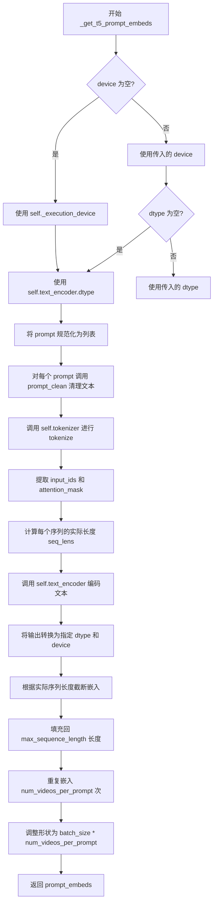

#### 带注释源码

```python
def _get_t5_prompt_embeds(
    self,
    prompt: str | list[str] = None,
    num_videos_per_prompt: int = 1,
    max_sequence_length: int = 512,
    device: torch.device | None = None,
    dtype: torch.dtype | None = None,
):
    # 确定执行设备：如果未指定，则使用pipeline的默认执行设备
    device = device or self._execution_device
    # 确定数据类型：如果未指定，则使用text_encoder的数据类型
    dtype = dtype or self.text_encoder.dtype

    # 将单个字符串转换为列表，保持一致性
    prompt = [prompt] if isinstance(prompt, str) else prompt
    # 对每个prompt进行清理：移除HTML实体、规范化空白等
    prompt = [prompt_clean(u) for u in prompt]
    # 计算批处理大小
    batch_size = len(prompt)

    # 使用T5 Tokenizer对prompt进行编码
    text_inputs = self.tokenizer(
        prompt,
        padding="max_length",           # 填充到最大长度
        max_length=max_sequence_length, # 最大序列长度
        truncation=True,                # 超过最大长度时截断
        add_special_tokens=True,        # 添加特殊 tokens（如EOS）
        return_attention_mask=True,      # 返回注意力掩码
        return_tensors="pt",            # 返回PyTorch张量
    )
    # 提取input_ids和attention_mask
    text_input_ids, mask = text_inputs.input_ids, text_inputs.attention_mask
    # 计算每个序列的实际长度（非padding部分）
    seq_lens = mask.gt(0).sum(dim=1).long()

    # 使用T5 Encoder编码文本，获取最后一层隐藏状态
    prompt_embeds = self.text_encoder(text_input_ids.to(device), mask.to(device)).last_hidden_state
    # 转换数据类型和设备
    prompt_embeds = prompt_embeds.to(dtype=dtype, device=device)
    # 根据实际序列长度截断嵌入（移除padding部分）
    prompt_embeds = [u[:v] for u, v in zip(prompt_embeds, seq_lens)]
    # 重新填充到max_sequence_length长度（使用零填充）
    prompt_embeds = torch.stack(
        [torch.cat([u, u.new_zeros(max_sequence_length - u.size(0), u.size(1))]) for u in prompt_embeds], dim=0
    )

    # 为每个提示生成多个视频而复制文本嵌入（使用MPS兼容的方法）
    _, seq_len, _ = prompt_embeds.shape
    # 在序列维度重复num_videos_per_prompt次
    prompt_embeds = prompt_embeds.repeat(1, num_videos_per_prompt, 1)
    # 调整形状为 (batch_size * num_videos_per_prompt, seq_len, hidden_size)
    prompt_embeds = prompt_embeds.view(batch_size * num_videos_per_prompt, seq_len, -1)

    return prompt_embeds
```


### `WanAnimatePipeline.encode_image`

该方法将输入的参考角色图像编码为 CLIP 图像嵌入，用于条件视频生成。它使用 `image_encoder`（CLIP Vision Model）从图像中提取视觉特征，并返回倒数第二层的隐藏状态作为图像条件嵌入。

参数：

- `image`：`PipelineImageInput`，输入的参考角色图像，可以是 PIL.Image 或 torch.Tensor
- `device`：`torch.device | None`，指定的计算设备，如果为 None 则使用管道的执行设备

返回值：`torch.Tensor`，CLIP 图像编码器的倒数第二层隐藏状态，作为视频生成的条件嵌入

#### 流程图

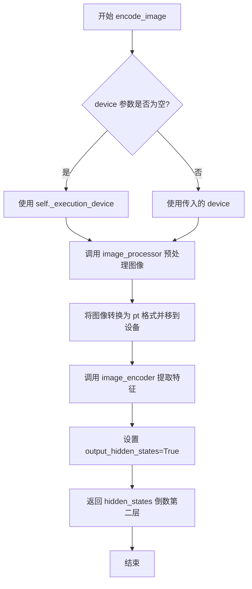

#### 带注释源码

```python
# Copied from diffusers.pipelines.wan.pipeline_wan_i2v.WanImageToVideoPipeline.encode_image
def encode_image(
    self,
    image: PipelineImageInput,
    device: torch.device | None = None,
):
    """
    将输入图像编码为 CLIP 图像嵌入。

    参数:
        image: 输入的参考角色图像 (PIL.Image 或 torch.Tensor)
        device: 计算设备，默认为 None 则使用执行设备

    返回:
        CLIP 图像编码器的倒数第二层隐藏状态
    """
    # 如果未指定设备，则使用管道的执行设备
    device = device or self._execution_device
    
    # 使用 image_processor 预处理图像，转换为 PyTorch 张量并移到指定设备
    image = self.image_processor(images=image, return_tensors="pt").to(device)
    
    # 调用 CLIP 图像编码器提取图像特征，设置 output_hidden_states=True 以获取所有隐藏层
    image_embeds = self.image_encoder(**image, output_hidden_states=True)
    
    # 返回倒数第二层的隐藏状态作为图像条件嵌入
    # 通常选择倒数第二层是因为最后一层可能过于适配任务，而倒数第二层更具泛化性
    return image_embeds.hidden_states[-2]
```


### `WanAnimatePipeline.encode_prompt`

该方法负责将文本提示（prompt）和阴性提示（negative_prompt）编码为文本嵌入（text embeddings），供 WanAnimatePipeline 的去噪过程使用。它处理提示的规范化、批量大小确定，并根据是否启用无分类器自由引导（Classifier-Free Guidance）来生成阳性和阴性嵌入。

参数：

- `self`：类方法隐含参数，指向 `WanAnimatePipeline` 实例。
- `prompt`：`str | list[str]`，要编码的文本提示。可以是单个字符串或字符串列表。
- `negative_prompt`：`str | list[str] | None`，不引导图像生成的文本提示。默认为 `None`。当 `guidance_scale` 小于 1 时会被忽略。
- `do_classifier_free_guidance`：`bool`，是否启用无分类器自由引导。默认为 `True`。设为 `True` 时会生成阴性嵌入以进行引导。
- `num_videos_per_prompt`：`int`，每个提示要生成的视频数量。默认为 1。这会影响嵌入的重复次数。
- `prompt_embeds`：`torch.Tensor | None`，可选的预生成文本嵌入。如果提供，将直接使用而不进行编码。用于例如提示加权等场景。
- `negative_prompt_embeds`：`torch.Tensor | None`，可选的预生成阴性文本嵌入。
- `max_sequence_length`：`int`，文本编码器的最大序列长度。默认为 226。
- `device`：`torch.device | None`，执行编码的设备。如果为 `None`，则使用当前执行设备。
- `dtype`：`torch.dtype | None`，嵌入的数据类型。如果为 `None`，则使用文本编码器的默认数据类型。

返回值：`tuple[torch.Tensor, torch.Tensor]`，返回一个元组，包含：
- `prompt_embeds`：编码后的提示嵌入 (Tensor)。
- `negative_prompt_embeds`：编码后的阴性提示嵌入 (Tensor)。如果未启用 CFG 或未提供 negative_prompt，可能为 `None`。

#### 流程图

```mermaid
graph TD
    A([Start encode_prompt]) --> B{device is None?}
    B -- Yes --> C[device = self._execution_device]
    B -- No --> D[device = provided device]
    C --> E[Normalize prompt to list]
    D --> E
    E --> F{batch_size from prompt?}
    F -- Yes --> G[batch_size = len(prompt)]
    F -- No --> H[batch_size = prompt_embeds.shape[0]]
    G --> I{prompt_embeds is None?}
    H --> I
    I -- Yes --> J[Call _get_t5_prompt_embeds]
    I -- No --> K{do_classifier_free_guidance?}
    J --> K
    K -- No --> L[Return (prompt_embeds, None)]
    K -- Yes --> M{negative_prompt_embeds is None?}
    M -- Yes --> N[negative_prompt = negative_prompt or ""]
    N --> O[Normalize negative_prompt to list]
    O --> P{Type check & Batch size check}
    P -- Fail --> Q([Raise Error])
    P -- Pass --> R[Call _get_t5_prompt_embeds for negative]
    R --> S[Return (prompt_embeds, negative_prompt_embeds)]
    M -- No --> S
```

#### 带注释源码

```python
def encode_prompt(
    self,
    prompt: str | list[str],
    negative_prompt: str | list[str] | None = None,
    do_classifier_free_guidance: bool = True,
    num_videos_per_prompt: int = 1,
    prompt_embeds: torch.Tensor | None = None,
    negative_prompt_embeds: torch.Tensor | None = None,
    max_sequence_length: int = 226,
    device: torch.device | None = None,
    dtype: torch.dtype | None = None,
):
    r"""
    Encodes the prompt into text encoder hidden states.

    Args:
        prompt (`str` or `list[str]`, *optional*):
            prompt to be encoded
        negative_prompt (`str` or `list[str]`, *optional*):
            The prompt or prompts not to guide the image generation. If not defined, one has to pass
            `negative_prompt_embeds` instead. Ignored when not using guidance (i.e., ignored if `guidance_scale` is
            less than `1`).
        do_classifier_free_guidance (`bool`, *optional*, defaults to `True`):
            Whether to use classifier free guidance or not.
        num_videos_per_prompt (`int`, *optional*, defaults to 1):
            Number of videos that should be generated per prompt. torch device to place the resulting embeddings on
        prompt_embeds (`torch.Tensor`, *optional*):
            Pre-generated text embeddings. Can be used to easily tweak text inputs, *e.g.* prompt weighting. If not
            provided, text embeddings will be generated from `prompt` input argument.
        negative_prompt_embeds (`torch.Tensor`, *optional*):
            Pre-generated negative text embeddings. Can be used to easily tweak text inputs, *e.g.* prompt
            weighting. If not provided, negative_prompt_embeds will be generated from `negative_prompt` input
            argument.
        device: (`torch.device`, *optional*):
            torch device
        dtype: (`torch.dtype`, *optional*):
            torch dtype
    """
    # 1. 确定设备：如果未指定，则使用管道当前的执行设备
    device = device or self._execution_device

    # 2. 规范化 prompt 为列表，以便统一处理
    prompt = [prompt] if isinstance(prompt, str) else prompt
    
    # 3. 确定批量大小：
    # 如果提供了 prompt，则根据其长度确定 batch_size
    # 否则（即 prompt 为 None 且必须由 prompt_embeds 提供），从 prompt_embeds 的形状推断
    if prompt is not None:
        batch_size = len(prompt)
    else:
        batch_size = prompt_embeds.shape[0]

    # 4. 处理阳性提示嵌入 (prompt_embeds)
    # 如果调用者未提供，则需要从 prompt 编码生成
    if prompt_embeds is None:
        prompt_embeds = self._get_t5_prompt_embeds(
            prompt=prompt,
            num_videos_per_prompt=num_videos_per_prompt,
            max_sequence_length=max_sequence_length,
            device=device,
            dtype=dtype,
        )

    # 5. 处理阴性提示嵌入 (negative_prompt_embeds)
    # 仅在启用 CFG 且未提供阴性嵌入时处理
    if do_classifier_free_guidance and negative_prompt_embeds is None:
        # 默认阴性提示为空字符串
        negative_prompt = negative_prompt or ""
        # 规范化阴性提示为列表，长度需与 prompt 列表长度一致（用于批量生成）
        negative_prompt = batch_size * [negative_prompt] if isinstance(negative_prompt, str) else negative_prompt

        # 类型检查：确保 prompt 和 negative_prompt 类型一致
        if prompt is not None and type(prompt) is not type(negative_prompt):
            raise TypeError(
                f"`negative_prompt` should be the same type to `prompt`, but got {type(negative_prompt)} !="
                f" {type(prompt)}."
            )
        # 批量大小检查：确保 negative_prompt 的数量与 prompt 匹配
        elif batch_size != len(negative_prompt):
            raise ValueError(
                f"`negative_prompt`: {negative_prompt} has batch size {len(negative_prompt)}, but `prompt`:"
                f" {prompt} has batch size {batch_size}. Please make sure that passed `negative_prompt` matches"
                " the batch size of `prompt`."
            )

        # 编码阴性提示
        negative_prompt_embeds = self._get_t5_prompt_embeds(
            prompt=negative_prompt,
            num_videos_per_prompt=num_videos_per_prompt,
            max_sequence_length=max_sequence_length,
            device=device,
            dtype=dtype,
        )

    # 6. 返回阳性和阴性嵌入
    return prompt_embeds, negative_prompt_embeds
```


### `WanAnimatePipeline.check_inputs`

该方法用于验证 `WanAnimatePipeline` 推理管道的输入参数有效性，确保用户提供的所有输入符合模型要求，包括类型检查、必需字段验证、尺寸约束和模式特定的参数检查。如果任何检查失败，该方法会抛出明确的 `ValueError` 异常，帮助用户快速定位输入问题。

参数：

- `prompt`：`str | list[str]`，用户提供的文本提示词，用于指导视频生成内容
- `negative_prompt`：`str | list[str] | None`，负面提示词，用于指定不希望出现的内容
- `image`：`PipelineImageInput`，参考角色图像，用于条件生成
- `pose_video`：`list[PIL.Image.Image]`，姿态视频，包含动作控制信息
- `face_video`：`list[PIL.Image.Image]`，面部视频，包含面部表情信息
- `background_video`：`list[PIL.Image.Image] | None`，背景视频，仅在 `replace` 模式下使用
- `mask_video`：`list[PIL.Image.Image] | None`，遮罩视频，仅在 `replace` 模式下使用
- `height`：`int`，生成视频的高度
- `width`：`int`，生成视频的宽度
- `prompt_embeds`：`torch.Tensor | None`，预计算的文本嵌入向量
- `negative_prompt_embeds`：`torch.Tensor | None`，预计算的负面文本嵌入向量
- `image_embeds`：`torch.Tensor | None`，预计算的图像嵌入向量
- `callback_on_step_end_tensor_inputs`：`list[str] | None`，回调函数在每个推理步骤结束时需要处理的张量输入列表
- `mode`：`str | None`，运行模式，可选值为 `"animate"`（动画模式）或 `"replace"`（替换模式）
- `prev_segment_conditioning_frames`：`int | None`，从前一个视频片段用于时间连续性的条件帧数量

返回值：`None`，该方法不返回任何值，仅进行参数验证和异常抛出

#### 流程图

```mermaid
flowchart TD
    A[开始 check_inputs] --> B{image 和 image_embeds 是否同时存在?}
    B -->|是| C[抛出 ValueError: 不能同时提供 image 和 image_embeds]
    B -->|否| D{image 和 image_embeds 是否都为 None?}
    D -->|是| E[抛出 ValueError: 必须提供 image 或 image_embeds 之一]
    D -->|否| F{image 类型是否合法?}
    F -->|否| G[抛出 ValueError: image 类型必须是 torch.Tensor 或 PIL.Image.Image]
    F -->|是| H{pose_video 是否为 None?}
    H -->|是| I[抛出 ValueError: 必须提供 pose_video]
    H -->|否| J{face_video 是否为 None?}
    J -->|是| K[抛出 ValueError: 必须提供 face_video]
    J -->|否| L{pose_video 和 face_video 是否为 list?}
    L -->|否| M[抛出 ValueError: pose_video 和 face_video 必须是 list]
    L -->|是| N{pose_video 和 face_video 是否为空 list?}
    N -->|是| O[抛出 ValueError: pose_video 和 face_video 必须至少包含一帧]
    N -->|否| P{mode 是否为 replace?}
    P -->|是| Q{background_video 或 mask_video 是否为 None?}
    Q -->|是| R[抛出 ValueError: replace 模式必须提供 background_video 和 mask_video]
    Q -->|否| S{background_video 和 mask_video 是否为 list?]
    S -->|否| T[抛出 ValueError: replace 模式下 background_video 和 mask_video 必须是 list]
    S -->|是| U{height 和 width 是否能被 16 整除?}
    P -->|否| U
    U -->|否| V[抛出 ValueError: height 和 width 必须能被 16 整除]
    U -->|是| W{callback_on_step_end_tensor_inputs 是否合法?}
    W -->|否| X[抛出 ValueError: callback_on_step_end_tensor_inputs 包含非法键]
    W -->|是| Y{prompt 和 prompt_embeds 是否同时存在?}
    Y -->|是| Z[抛出 ValueError: 不能同时提供 prompt 和 prompt_embeds]
    Y -->|否| AA{negative_prompt 和 negative_prompt_embeds 是否同时存在?}
    AA -->|是| AB[抛出 ValueError: 不能同时提供 negative_prompt 和 negative_prompt_embeds]
    AA -->|否| AC{prompt 和 prompt_embeds 是否都为 None?}
    AC -->|是| AD[抛出 ValueError: 必须提供 prompt 或 prompt_embeds 之一]
    AC -->|否| AE{prompt 类型是否合法?}
    AE -->|否| AF[抛出 ValueError: prompt 类型必须是 str 或 list]
    AE -->|是| AG{negative_prompt 类型是否合法?}
    AG -->|否| AH[抛出 ValueError: negative_prompt 类型必须是 str 或 list]
    AG -->|是| AI{mode 是否合法?}
    AI -->|否| AJ[抛出 ValueError: mode 必须是 'animate' 或 'replace']
    AI -->|是| AK{prev_segment_conditioning_frames 是否合法?}
    AK -->|否| AL[抛出 ValueError: prev_segment_conditioning_frames 必须是 1 或 5]
    AK -->|是| AM[验证通过，返回 None]
```

#### 带注释源码

```python
def check_inputs(
    self,
    prompt,                     # 文本提示词，str 或 list[str] 类型
    negative_prompt,            # 负面提示词，str 或 list[str] 或 None
    image,                      # 参考图像，PipelineImageInput 类型
    pose_video,                 # 姿态视频，list[PIL.Image.Image]
    face_video,                 # 面部视频，list[PIL.Image.Image]
    background_video,           # 背景视频，list[PIL.Image.Image] 或 None（replace 模式必需）
    mask_video,                 # 遮罩视频，list[PIL.Image.Image] 或 None（replace 模式必需）
    height,                     # 输出高度，必须能被 16 整除
    width,                      # 输出宽度，必须能被 16 整除
    prompt_embeds=None,         # 预计算的文本嵌入，torch.Tensor 或 None
    negative_prompt_embeds=None,# 预计算的负面文本嵌入，torch.Tensor 或 None
    image_embeds=None,          # 预计算的图像嵌入，torch.Tensor 或 None
    callback_on_step_end_tensor_inputs=None, # 回调张量输入列表
    mode=None,                  # 运行模式：'animate' 或 'replace'
    prev_segment_conditioning_frames=None,  # 条件帧数量：1 或 5
):
    # 检查 1: image 和 image_embeds 不能同时提供
    if image is not None and image_embeds is not None:
        raise ValueError(
            f"Cannot forward both `image`: {image} and `image_embeds`: {image_embeds}. Please make sure to"
            " only forward one of the two."
        )
    
    # 检查 2: image 和 image_embeds 不能同时为空
    if image is None and image_embeds is None:
        raise ValueError(
            "Provide either `image` or `prompt_embeds`. Cannot leave both `image` and `image_embeds` undefined."
        )
    
    # 检查 3: image 类型必须是 torch.Tensor 或 PIL.Image.Image
    if image is not None and not isinstance(image, torch.Tensor) and not isinstance(image, PIL.Image.Image):
        raise ValueError(f"`image` has to be of type `torch.Tensor` or `PIL.Image.Image` but is {type(image)}")
    
    # 检查 4: pose_video 是必需参数
    if pose_video is None:
        raise ValueError("Provide `pose_video`. Cannot leave `pose_video` undefined.")
    
    # 检查 5: face_video 是必需参数
    if face_video is None:
        raise ValueError("Provide `face_video`. Cannot leave `face_video` undefined.")
    
    # 检查 6: pose_video 和 face_video 必须是 list 类型
    if not isinstance(pose_video, list) or not isinstance(face_video, list):
        raise ValueError("`pose_video` and `face_video` must be lists of PIL images.")
    
    # 检查 7: pose_video 和 face_video 必须非空
    if len(pose_video) == 0 or len(face_video) == 0:
        raise ValueError("`pose_video` and `face_video` must contain at least one frame.")
    
    # 检查 8: replace 模式下必须提供 background_video 和 mask_video
    if mode == "replace" and (background_video is None or mask_video is None):
        raise ValueError(
            "Provide `background_video` and `mask_video`. Cannot leave both `background_video` and `mask_video`"
            " undefined when mode is `replace`."
        )
    
    # 检查 9: replace 模式下 background_video 和 mask_video 必须是 list
    if mode == "replace" and (not isinstance(background_video, list) or not isinstance(mask_video, list)):
        raise ValueError("`background_video` and `mask_video` must be lists of PIL images when mode is `replace`.")

    # 检查 10: height 和 width 必须能被 16 整除
    if height % 16 != 0 or width % 16 != 0:
        raise ValueError(f"`height` and `width` have to be divisible by 16 but are {height} and {width}.")

    # 检查 11: callback_on_step_end_tensor_inputs 必须包含合法的键
    if callback_on_step_end_tensor_inputs is not None and not all(
        k in self._callback_tensor_inputs for k in callback_on_step_end_tensor_inputs
    ):
        raise ValueError(
            f"`callback_on_step_end_tensor_inputs` has to be in {self._callback_tensor_inputs}, but found"
            f" {[k for k in callback_on_step_end_tensor_inputs if k not in self._callback_tensor_inputs]}"
        )

    # 检查 12: prompt 和 prompt_embeds 不能同时提供
    if prompt is not None and prompt_embeds is not None:
        raise ValueError(
            f"Cannot forward both `prompt`: {prompt} and `prompt_embeds`: {prompt_embeds}. Please make sure to"
            " only forward one of the two."
        )
    
    # 检查 13: negative_prompt 和 negative_prompt_embeds 不能同时提供
    elif negative_prompt is not None and negative_prompt_embeds is not None:
        raise ValueError(
            f"Cannot forward both `negative_prompt`: {negative_prompt} and `negative_prompt_embeds`: {negative_prompt_embeds}. Please make sure to"
            " only forward one of the two."
        )
    
    # 检查 14: prompt 和 prompt_embeds 不能同时为空
    elif prompt is None and prompt_embeds is None:
        raise ValueError(
            "Provide either `prompt` or `prompt_embeds`. Cannot leave both `prompt` and `prompt_embeds` undefined."
        )
    
    # 检查 15: prompt 类型必须是 str 或 list
    elif prompt is not None and (not isinstance(prompt, str) and not isinstance(prompt, list)):
        raise ValueError(f"`prompt` has to be of type `str` or `list` but is {type(prompt)}")
    
    # 检查 16: negative_prompt 类型必须是 str 或 list
    elif negative_prompt is not None and (
        not isinstance(negative_prompt, str) and not isinstance(negative_prompt, list)
    ):
        raise ValueError(f"`negative_prompt` has to be of type `str` or `list` but is {type(negative_prompt)}")

    # 检查 17: mode 必须是 'animate' 或 'replace'
    if mode is not None and (not isinstance(mode, str) or mode not in ("animate", "replace")):
        raise ValueError(
            f"`mode` has to be of type `str` and in ('animate', 'replace') but its type is {type(mode)} and value is {mode}"
        )

    # 检查 18: prev_segment_conditioning_frames 必须是 1 或 5
    if prev_segment_conditioning_frames is not None and (
        not isinstance(prev_segment_conditioning_frames, int) or prev_segment_conditioning_frames not in (1, 5)
    ):
        raise ValueError(
            f"`prev_segment_conditioning_frames` has to be of type `int` and 1 or 5 but its type is"
            f" {type(prev_segment_conditioning_frames)} and value is {prev_segment_conditioning_frames}"
        )
```


### WanAnimatePipeline.get_i2v_mask

该方法用于生成图像到视频（I2V）任务的掩码张量，在潜在空间中创建用于条件控制的掩码，特别用于标识需要生成新内容的帧区域。

参数：

- `batch_size`：`int`，批次大小，指定同时处理的视频数量
- `latent_t`：`int`，潜在空间的时间维度大小，表示潜在帧的数量
- `latent_h`：`int`，潜在空间的高度维度大小
- `latent_w`：`int`，潜在空间的宽度维度大小
- `mask_len`：`int = 1`，掩码长度，指定从开始需要掩码的帧数，默认为1
- `mask_pixel_values`：`torch.Tensor | None = None`，可选的预定义掩码张量，形状为[B, C=1, T, latent_h, latent_w]
- `dtype`：`torch.dtype | None = None`，输出张量的数据类型
- `device`：`str | torch.device = "cuda"`，输出张量所在的设备

返回值：`torch.Tensor`，返回处理后的掩码张量，形状为[B, C=4, T_lat, H_lat, W_lat]

#### 流程图

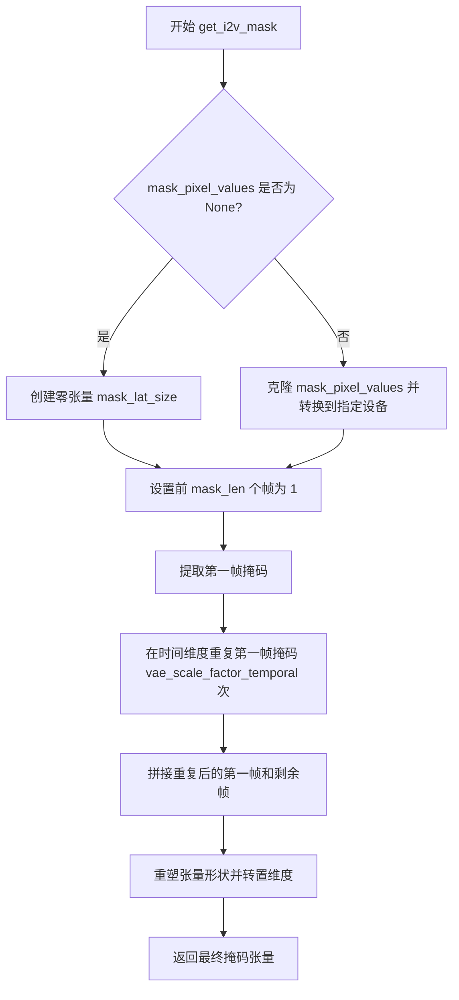

#### 带注释源码

```python
def get_i2v_mask(
    self,
    batch_size: int,
    latent_t: int,
    latent_h: int,
    latent_w: int,
    mask_len: int = 1,
    mask_pixel_values: torch.Tensor | None = None,
    dtype: torch.dtype | None = None,
    device: str | torch.device = "cuda",
) -> torch.Tensor:
    """
    生成图像到视频（I2V）任务的掩码张量。
    
    参数:
        batch_size: 批次大小
        latent_t: 潜在时间维度
        latent_h: 潜在高度维度
        latent_w: 潜在宽度维度
        mask_len: 掩码长度，默认为1
        mask_pixel_values: 可选的预定义掩码，形状为[B, C=1, T, latent_h, latent_w]
        dtype: 输出数据类型
        device: 输出设备
    
    返回:
        形状为[B, C=4, T_lat, H_lat, W_lat]的掩码张量
    """
    # mask_pixel_values shape (if supplied): [B, C = 1, T, latent_h, latent_w]
    
    # 如果没有提供掩码，则创建一个全零张量
    # 形状: [B, 1, (latent_t - 1) * 4 + 1, latent_h, latent_w]
    if mask_pixel_values is None:
        mask_lat_size = torch.zeros(
            batch_size, 1, (latent_t - 1) * 4 + 1, latent_h, latent_w, dtype=dtype, device=device
        )
    else:
        # 否则使用提供的掩码并转换到指定设备和数据类型
        mask_lat_size = mask_pixel_values.clone().to(device=device, dtype=dtype)
    
    # 将前 mask_len 个帧设置为1，表示这些帧需要根据输入图像生成
    mask_lat_size[:, :, :mask_len] = 1
    
    # 提取第一帧掩码，用于后续处理
    first_frame_mask = mask_lat_size[:, :, 0:1]
    
    # 在帧维度重复第一帧掩码 vae_scale_factor_temporal (= 4) 次
    # 这是因为VAE的时间下采样因子为4，需要在多个帧上复制掩码
    first_frame_mask = torch.repeat_interleave(first_frame_mask, dim=2, repeats=self.vae_scale_factor_temporal)
    
    # 将重复后的第一帧和剩余帧拼接起来
    mask_lat_size = torch.concat([first_frame_mask, mask_lat_size[:, :, 1:]], dim=2)
    
    # 重塑张量形状: [B, C = 1, 4 * T_lat, H_lat, W_lat] --> [B, C = 4, T_lat, H_lat, W_lat]
    # 这里将时间维度展开并重新排列通道维度
    mask_lat_size = mask_lat_size.view(
        batch_size, -1, self.vae_scale_factor_temporal, latent_h, latent_w
    ).transpose(1, 2)  # [B, C = 1, 4 * T_lat, H_lat, W_lat] --> [B, C = 4, T_lat, H_lat, W_lat]

    return mask_lat_size
```


### WanAnimatePipeline.prepare_reference_image_latents

该方法用于将参考图像（角色图像）编码为潜在表示（latents），并进行标准化处理和I2V掩码的准备工作，以便后续的视频生成过程使用。

参数：

- `image`：`torch.Tensor`，输入的参考图像张量，形状为 (B, C, H, W) 或 (B, C, T, H, W)
- `batch_size`：`int = 1`，批次大小，用于生成多个视频
- `sample_mode`：`int = "argmax"`，采样模式，指定如何从VAE的潜在分布中采样
- `generator`：`torch.Generator | list[torch.Generator] | None = None`，随机生成器，用于确保生成的可重复性
- `dtype`：`torch.dtype | None = None`，指定计算的数据类型，若为None则使用VAE的默认数据类型
- `device`：`torch.device | None = None`，指定计算设备，若为None则使用执行设备

返回值：`torch.Tensor`，处理后的参考图像潜在表示，包含了I2V掩码信息

#### 流程图

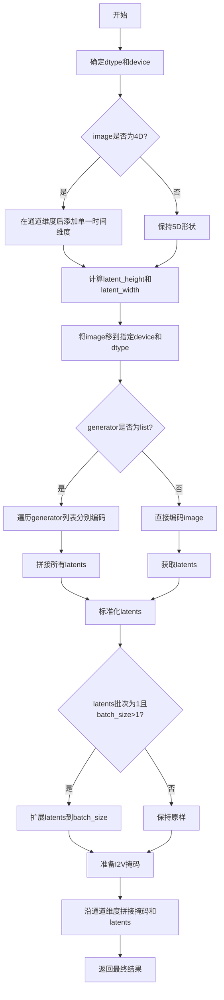

#### 带注释源码

```python
def prepare_reference_image_latents(
    self,
    image: torch.Tensor,
    batch_size: int = 1,
    sample_mode: int = "argmax",
    generator: torch.Generator | list[torch.Generator] | None = None,
    dtype: torch.dtype | None = None,
    device: torch.device | None = None,
) -> torch.Tensor:
    # 确定数据类型，若未指定则使用VAE的数据类型
    dtype = dtype or self.vae.dtype
    
    # 如果图像是4D (B, C, H, W)，在通道维度后添加单一时间维度变成5D (B, C, 1, H, W)
    if image.ndim == 4:
        image = image.unsqueeze(2)

    # 获取图像的空间维度
    _, _, _, height, width = image.shape
    
    # 根据VAE的空间缩放因子计算潜在空间的尺寸
    latent_height = height // self.vae_scale_factor_spatial
    latent_width = width // self.vae_scale_factor_spatial

    # 将图像移到指定设备和数据类型
    image = image.to(device=device, dtype=dtype)
    
    # 根据generator类型分别处理
    if isinstance(generator, list):
        # 如果是生成器列表，假设len(generator) == batch_size
        # 遍历每个生成器分别编码图像
        ref_image_latents = [
            retrieve_latents(self.vae.encode(image), generator=g, sample_mode=sample_mode) for g in generator
        ]
        # 将所有latents在批次维度拼接
        ref_image_latents = torch.cat(ref_image_latents)
    else:
        # 直接使用单个generator或无generator编码
        ref_image_latents = retrieve_latents(self.vae.encode(image), generator, sample_mode)
    
    # 准备标准化参数：获取VAE配置的latents均值和标准差
    latents_mean = (
        torch.tensor(self.vae.config.latents_mean)
        .view(1, self.vae.config.z_dim, 1, 1, 1)
        .to(ref_image_latents.device, ref_image_latents.dtype)
    )
    latents_recip_std = 1.0 / torch.tensor(self.vae.config.latents_std).view(1, self.vae.config.z_dim, 1, 1, 1).to(
        ref_image_latents.device, ref_image_latents.dtype
    )
    
    # 对latents进行标准化：(latents - mean) * (1/std)
    ref_image_latents = (ref_image_latents - latents_mean) * latents_recip_std
    
    # 处理单个图像但需要多个批次的情况（例如每个prompt生成多个视频）
    if ref_image_latents.shape[0] == 1 and batch_size > 1:
        ref_image_latents = ref_image_latents.expand(batch_size, -1, -1, -1, -1)

    # 在潜在空间准备I2V掩码，并沿通道维度 prepend 到参考图像latents
    reference_image_mask = self.get_i2v_mask(batch_size, 1, latent_height, latent_width, 1, None, dtype, device)
    reference_image_latents = torch.cat([reference_image_mask, ref_image_latents], dim=1)

    return reference_image_latents
```


### `WanAnimatePipeline.prepare_prev_segment_cond_latents`

该方法用于准备前一视频片段的条件潜在表示（latents），包括将视频帧编码为VAE潜在空间、处理替换模式下的背景视频和掩码视频、以及准备I2V（Image-to-Video）掩码。

参数：

-  `prev_segment_cond_video`：`torch.Tensor | None`，前一片段的条件视频，形状为 (B, C, T, H, W)，以像素空间表示
-  `background_video`：`torch.Tensor | None`，替换模式下的背景视频，形状同上
-  `mask_video`：`torch.Tensor | None`，替换模式下的掩码视频，形状为 (B, 1, T, H, W)
-  `batch_size`：`int = 1`，批次大小
-  `segment_frame_length`：`int = 77`，每个片段的帧长度
-  `start_frame`：`int = 0`，起始帧索引
-  `height`：`int = 720`，视频高度
-  `width`：`int = 1280`，视频宽度
-  `prev_segment_cond_frames`：`int = 1`，前一片段的条件帧数量
-  `task`：`str = "animate"`，任务模式，可选 "animate" 或 "replace"
-  `interpolation_mode`：`str = "bicubic"`，插值模式，用于调整视频尺寸
-  `sample_mode`：`str = "argmax"`，VAE采样模式
-  `generator`：`torch.Generator | list[torch.Generator] | None`，随机数生成器
-  `dtype`：`torch.dtype | None`，数据类型
-  `device`：`torch.device | None`，计算设备

返回值：`torch.Tensor`，返回带有I2V掩码的前一片段条件潜在表示，沿通道维度拼接

#### 流程图

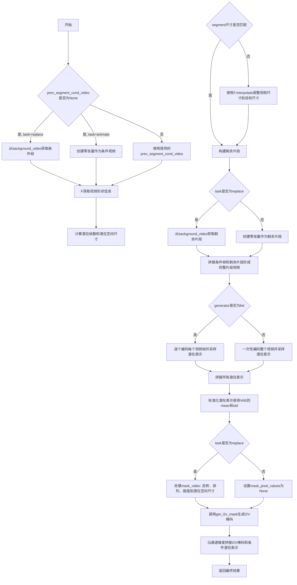

#### 带注释源码

```
def prepare_prev_segment_cond_latents(
    self,
    prev_segment_cond_video: torch.Tensor | None = None,  # 前一片段的条件视频（像素空间）
    background_video: torch.Tensor | None = None,        # 替换模式背景视频
    mask_video: torch.Tensor | None = None,              # 替换模式掩码视频
    batch_size: int = 1,                                 # 批次大小
    segment_frame_length: int = 77,                      # 片段帧长度
    start_frame: int = 0,                                # 起始帧索引
    height: int = 720,                                   # 目标高度
    width: int = 1280,                                  # 目标宽度
    prev_segment_cond_frames: int = 1,                  # 条件帧数量
    task: str = "animate",                              # 任务模式
    interpolation_mode: str = "bicubic",                # 插值模式
    sample_mode: str = "argmax",                        # VAE采样模式
    generator: torch.Generator | list[torch.Generator] | None = None,  # 随机生成器
    dtype: torch.dtype | None = None,                   # 数据类型
    device: torch.device | None = None,                 # 计算设备
) -> torch.Tensor:
    # 如果未提供条件视频，根据任务模式初始化
    # 如果是replace模式，从背景视频取条件帧；否则创建零张量
    if prev_segment_cond_video is None:
        if task == "replace":
            prev_segment_cond_video = background_video[:, :, :prev_segment_cond_frames].to(dtype)
        else:
            cond_frames_shape = (batch_size, 3, prev_segment_cond_frames, height, width)
            prev_segment_cond_video = torch.zeros(cond_frames_shape, dtype=dtype, device=device)

    # 获取输入视频的形状信息
    data_batch_size, channels, _, segment_height, segment_width = prev_segment_cond_video.shape
    
    # 计算潜在空间的参数：帧数、高度、宽度
    # 潜在帧数 = (片段帧数 - 1) / 时间VAE缩放因子 + 1
    num_latent_frames = (segment_frame_length - 1) // self.vae_scale_factor_temporal + 1
    latent_height = height // self.vae_scale_factor_spatial
    latent_width = width // self.vae_scale_factor_spatial
    
    # 如果视频尺寸不匹配目标尺寸，使用双线性插值调整
    if segment_height != height or segment_width != width:
        print(f"Interpolating prev segment cond video from ({segment_width}, {segment_height}) to ({width}, {height})")
        # 转置并flatten以进行4D插值而非5D
        prev_segment_cond_video = prev_segment_cond_video.transpose(1, 2).flatten(0, 1)  # [B * T, C, H, W]
        prev_segment_cond_video = F.interpolate(
            prev_segment_cond_video, size=(height, width), mode=interpolation_mode
        )
        prev_segment_cond_video = prev_segment_cond_video.unflatten(0, (batch_size, -1)).transpose(1, 2)

    # 构建剩余片段：如果是replace模式使用背景视频，否则用零填充
    if task == "replace":
        remaining_segment = background_video[:, :, prev_segment_cond_frames:].to(dtype)
    else:
        remaining_segment_frames = segment_frame_length - prev_segment_cond_frames
        remaining_segment = torch.zeros(
            batch_size, channels, remaining_segment_frames, height, width, dtype=dtype, device=device
        )

    # 拼接条件帧和剩余片段，形成完整的片段视频
    prev_segment_cond_video = prev_segment_cond_video.to(dtype=dtype)
    full_segment_cond_video = torch.cat([prev_segment_cond_video, remaining_segment], dim=2)

    # 使用VAE编码完整片段视频并采样潜在表示
    if isinstance(generator, list):
        if data_batch_size == len(generator):
            # 每个数据样本对应一个生成器
            prev_segment_cond_latents = [
                retrieve_latents(self.vae.encode(full_segment_cond_video[i].unsqueeze(0)), g, sample_mode)
                for i, g in enumerate(generator)
            ]
        elif data_batch_size == 1:
            # 只有一个数据样本，但有多个生成器
            prev_segment_cond_latents = [
                retrieve_latents(self.vae.encode(full_segment_cond_video), g, sample_mode) for g in generator
            ]
        else:
            raise ValueError(f"Batch size should be either {len(generator)} or 1 but is {data_batch_size}")
        prev_segment_cond_latents = torch.cat(prev_segment_cond_latents)
    else:
        prev_segment_cond_latents = retrieve_latents(
            self.vae.encode(full_segment_cond_video), generator, sample_mode
        )

    # 标准化潜在表示：减去均值乘以标准差的倒数
    # 这是Wan VAE特有的预处理步骤
    latents_mean = (
        torch.tensor(self.vae.config.latents_mean)
        .view(1, self.vae.config.z_dim, 1, 1, 1)
        .to(prev_segment_cond_latents.device, prev_segment_cond_latents.dtype)
    )
    latents_recip_std = 1.0 / torch.tensor(self.vae.config.latents_std).view(1, self.vae.config.z_dim, 1, 1, 1).to(
        prev_segment_cond_latents.device, prev_segment_cond_latents.dtype
    )
    prev_segment_cond_latents = (prev_segment_cond_latents - latents_mean) * latents_recip_std

    # 准备I2V掩码（用于图像到视频的条件生成）
    if task == "replace":
        # 反转掩码（白变黑，黑变白）
        mask_video = 1 - mask_video
        # 调整维度顺序并展平以进行插值
        mask_video = mask_video.permute(0, 2, 1, 3, 4)
        mask_video = mask_video.flatten(0, 1)
        # 插值到潜在空间尺寸
        mask_video = F.interpolate(mask_video, size=(latent_height, latent_width), mode="nearest")
        mask_pixel_values = mask_video.unflatten(0, (batch_size, -1))
        mask_pixel_values = mask_pixel_values.permute(0, 2, 1, 3, 4)  # 输出形状: [B, C=1, T, H_lat, W_lat]
    else:
        mask_pixel_values = None
    
    # 生成I2V掩码
    prev_segment_cond_mask = self.get_i2v_mask(
        batch_size,
        num_latent_frames,
        latent_height,
        latent_width,
        mask_len=prev_segment_cond_frames if start_frame > 0 else 0,
        mask_pixel_values=mask_pixel_values,
        dtype=dtype,
        device=device,
    )

    # 沿通道维度拼接I2V掩码和条件潜在表示
    # 掩码作为第一个通道，用于告知模型哪些部分需要条件
    prev_segment_cond_latents = torch.cat([prev_segment_cond_mask, prev_segment_cond_latents], dim=1)
    return prev_segment_cond_latents
```


### WanAnimatePipeline.prepare_pose_latents

该方法负责将输入的姿态视频（pose_video）编码为潜在表示（latents），并进行标准化处理。它使用VAE编码器将视频从像素空间转换到潜在空间，然后根据配置对潜在向量进行标准化（减均值除以标准差），以便适配Wan VAE的编码要求。

参数：

- `self`：`WanAnimatePipeline`，管道实例自身
- `pose_video`：`torch.Tensor`，输入的姿态视频张量，形状为 (B, C, T, H, W)，其中B是批次大小，C是通道数，T是帧数，H和W是高度和宽度
- `batch_size`：`int = 1`，期望的批次大小，用于在潜在表示为单样本但需要批量处理时进行扩展
- `sample_mode`：`int = "argmax"`，采样模式，默认为 "argmax"，可选择 "sample" 或 "argmax"，决定从VAE潜在分布中采样的方式
- `generator`：`torch.Generator | list[torch.Generator] | None = None`，随机数生成器，用于生成确定性输出
- `dtype`：`torch.dtype | None = None`，指定计算的数据类型，默认为None时会使用VAE的数据类型
- `device`：`torch.device | None = None`，计算设备，默认为执行设备

返回值：`torch.Tensor`，处理后的姿态视频潜在表示，形状为 (B, C', T', H', W')，其中C'是潜在空间的通道数，T'是潜在空间的帧数

#### 流程图

```mermaid
flowchart TD
    A[开始: prepare_pose_latents] --> B[将pose_video移动到指定device和dtype]
    B --> C{generator是否为list?}
    C -->|是| D[遍历generator列表]
    C -->|否| E[直接使用单个generator或None]
    D --> F[对每个generator调用retrieve_latents]
    F --> G[拼接所有潜在表示]
    E --> H[调用retrieve_latents获取潜在表示]
    G --> I[计算latents_mean和latents_recip_std]
    H --> I
    I --> J[标准化潜在表示: (latents - mean) * recip_std]
    J --> K{pose_latents.shape[0] == 1 且 batch_size > 1?}
    K -->|是| L[扩展潜在表示到batch_size]
    K -->|否| M[返回标准化后的pose_latents]
    L --> M
```

#### 带注释源码

```python
def prepare_pose_latents(
    self,
    pose_video: torch.Tensor,
    batch_size: int = 1,
    sample_mode: int = "argmax",
    generator: torch.Generator | list[torch.Generator] | None = None,
    dtype: torch.dtype | None = None,
    device: torch.device | None = None,
) -> torch.Tensor:
    # pose_video shape: (B, C, T, H, W)
    # 将姿态视频移动到指定设备，并转换为指定数据类型
    # 如果dtype为None，则使用VAE的数据类型
    pose_video = pose_video.to(device=device, dtype=dtype if dtype is not None else self.vae.dtype)
    
    # 处理生成器为列表的情况，每个生成器对应一个批次样本
    if isinstance(generator, list):
        pose_latents = [
            retrieve_latents(self.vae.encode(pose_video), generator=g, sample_mode=sample_mode) for g in generator
        ]
        # 将多个潜在表示沿批次维度拼接
        pose_latents = torch.cat(pose_latents)
    else:
        # 单个生成器或无生成器的情况
        pose_latents = retrieve_latents(self.vae.encode(pose_video), generator, sample_mode)
    
    # 标准化潜在表示，为Wan VAE编码做准备
    # 从VAE配置中获取潜在表示的均值
    latents_mean = (
        torch.tensor(self.vae.config.latents_mean)
        .view(1, self.vae.config.z_dim, 1, 1, 1)
        .to(pose_latents.device, pose_latents.dtype)
    )
    # 获取潜在表示标准差的倒数
    latents_recip_std = 1.0 / torch.tensor(self.vae.config.latents_std).view(1, self.vae.config.z_dim, 1, 1, 1).to(
        pose_latents.device, pose_latents.dtype
    )
    # 执行标准化: (latents - mean) * recip_std
    pose_latents = (pose_latents - latents_mean) * latents_recip_std
    
    # 处理批次大小扩展：当输入只有一个样本但需要生成多个视频时
    if pose_latents.shape[0] == 1 and batch_size > 1:
        # 将单个潜在表示扩展到batch_size
        pose_latents = pose_latents.expand(batch_size, -1, -1, -1, -1)
    
    return pose_latents
```


### `WanAnimatePipeline.prepare_latents`

该方法用于为 WanAnimatePipeline 准备潜在变量（latents）。它根据指定的批处理大小、图像高度、宽度和帧数计算潜在空间的形状，并初始化随机潜在张量或对已存在的潜在张量进行设备/数据类型转换。这是扩散模型去噪过程的输入初始值。

参数：

- `self`：`WanAnimatePipeline` 实例本身
- `batch_size`：`int`，要生成的视频批次大小
- `num_channels_latents`：`int`，潜在变量的通道数，默认为 16
- `height`：`int`，生成视频的高度，默认为 720
- `width`：`int`，生成视频的宽度，默认为 1280
- `num_frames`：`int`，视频的帧数，默认为 77
- `dtype`：`torch.dtype | None`，潜在张量的数据类型
- `device`：`torch.device | None`，潜在张量所在的设备
- `generator`：`torch.Generator | list[torch.Generator] | None`，用于生成随机数的生成器，用于确保可重复性
- `latents`：`torch.Tensor | None`，可选的预生成潜在张量

返回值：`tuple[torch.Tensor, torch.Tensor, torch.Tensor]`，实际上只返回一个 `torch.Tensor`，即初始化或转换后的潜在张量

#### 流程图

```mermaid
flowchart TD
    A[开始准备潜在变量] --> B[计算潜在帧数<br/>num_latent_frames = (num_frames - 1) // vae_scale_factor_temporal + 1]
    B --> C[计算潜在空间高度和宽度<br/>latent_height = height // vae_scale_factor_spatial<br/>latent_width = width // vae_scale_factor_spatial]
    C --> D[确定潜在张量形状<br/>shape = (batch_size, num_channels_latents, num_latent_frames + 1, latent_height, latent_width)]
    D --> E{generator 是列表且长度与 batch_size 不匹配?}
    E -->|是| F[抛出 ValueError 异常]
    E -->|否| G{latents 参数是否为 None?}
    G -->|是| H[使用 randn_tensor 生成随机潜在张量<br/>latents = randn_tensor(shape, generator, device, dtype)]
    G -->|否| I[将已存在的 latents 转换到指定设备和数据类型<br/>latents = latents.to(device, dtype)]
    H --> J[返回 latents 张量]
    I --> J
    F --> K[结束]
    J --> K
```

#### 带注释源码

```python
def prepare_latents(
    self,
    batch_size: int,
    num_channels_latents: int = 16,
    height: int = 720,
    width: int = 1280,
    num_frames: int = 77,
    dtype: torch.dtype | None = None,
    device: torch.device | None = None,
    generator: torch.Generator | list[torch.Generator] | None = None,
    latents: torch.Tensor | None = None,
) -> tuple[torch.Tensor, torch.Tensor, torch.Tensor]:
    """
    准备用于扩散模型去噪的潜在变量张量。
    
    参数:
        batch_size: 批处理大小
        num_channels_latents: 潜在变量的通道数（通常为 VAE 的 z_dim）
        height: 目标视频高度
        width: 目标视频宽度
        num_frames: 视频帧数
        dtype: 潜在张量的数据类型
        device: 潜在张量应放置的设备
        generator: 随机生成器，用于可重复的噪声生成
        latents: 可选的预生成潜在张量
        
    返回:
        初始化或转换后的潜在张量
    """
    
    # 根据时间缩放因子计算潜在空间中的帧数
    # vae_scale_factor_temporal 通常为 4，所以 77 帧 -> 20 个潜在帧
    num_latent_frames = (num_frames - 1) // self.vae_scale_factor_temporal + 1
    
    # 计算潜在空间中的高度和宽度
    # vae_scale_factor_spatial 通常为 8，所以 720x1280 -> 90x160
    latent_height = height // self.vae_scale_factor_spatial
    latent_width = width // self.vae_scale_factor_spatial

    # 构造潜在张量的形状：[B, C, T, H, W]
    # 注意：这里多 +1 是因为第一帧用于条件编码
    shape = (batch_size, num_channels_latents, num_latent_frames + 1, latent_height, latent_width)
    
    # 检查 generator 列表长度是否与 batch_size 匹配
    if isinstance(generator, list) and len(generator) != batch_size:
        raise ValueError(
            f"You have passed a list of generators of length {len(generator)}, but requested an effective batch"
            f" size of {batch_size}. Make sure the batch size matches the length of the generators."
        )

    # 如果没有提供 latents，则使用随机噪声初始化
    if latents is None:
        latents = randn_tensor(shape, generator=generator, device=device, dtype=dtype)
    else:
        # 否则将已存在的 latents 转换到指定设备和数据类型
        latents = latents.to(device=device, dtype=dtype)

    # 返回准备好的潜在张量
    # 注意：文档声明返回 tuple，但实际上只返回一个 Tensor
    return latents
```


### `WanAnimatePipeline.pad_video_frames`

该函数实现了一种"反射"（reflect）风格的视频帧填充策略，用于将输入的帧列表扩展到目标帧数。它通过在原始帧序列两端来回往返的方式填充新帧，当到达序列边界时自动反转方向，从而实现平滑的帧扩展效果。

参数：

- `self`：`WanAnimatePipeline` 实例，当前管道对象
- `frames`：`list[Any]`，输入的视频帧列表，帧维度被视为第一个维度
- `num_target_frames`：`int`，目标帧数量，填充后的输出帧列表长度

返回值：`list[Any]`，填充后的视频帧列表，长度等于 `num_target_frames`

#### 流程图

```mermaid
flowchart TD
    A[开始 pad_video_frames] --> B[初始化 idx = 0]
    B --> C[初始化 flip = False]
    C --> D[初始化空列表 target_frames]
    D --> E{len(target_frames) < num_target_frames?}
    E -->|是| F[向 target_frames 添加 deepcopy(frames[idx])]
    F --> G{flip 为真?}
    G -->|是| H[idx = idx - 1]
    G -->|否| I[idx = idx + 1]
    H --> J
    I --> J{idx == 0 或 idx == len(frames) - 1?}
    J -->|是| K[flip = not flip]
    J -->|否| E
    K --> E
    E -->|否| L[返回 target_frames]
    L --> M[结束]
```

#### 带注释源码

```python
def pad_video_frames(self, frames: list[Any], num_target_frames: int) -> list[Any]:
    """
    Pads an array-like video `frames` to `num_target_frames` using a "reflect"-like strategy. The frame dimension
    is assumed to be the first dimension. In the 1D case, we can visualize this strategy as follows:

    pad_video_frames([1, 2, 3, 4, 5], 10) -> [1, 2, 3, 4, 5, 4, 3, 2, 1, 2]
    """
    # 当前索引位置，初始指向 frames 的第一个元素
    idx = 0
    # 方向标志，False 表示正向（向右），True 表示反向（向左）
    flip = False
    # 存储填充后的目标帧列表
    target_frames = []
    # 循环直到达到目标帧数
    while len(target_frames) < num_target_frames:
        # 深拷贝当前索引处的帧添加到目标列表，避免引用共享
        target_frames.append(deepcopy(frames[idx]))
        # 根据当前方向更新索引
        if flip:
            idx -= 1  # 反向移动
        else:
            idx += 1  # 正向移动
        # 如果到达边界（首帧或末帧），则反转方向
        if idx == 0 or idx == len(frames) - 1:
            flip = not flip

    return target_frames
```


### `WanAnimatePipeline.guidance_scale`

这是一个属性方法，用于获取分类器自由引导（Classifier-Free Guidance）的缩放因子。该因子在图像/视频生成过程中控制生成内容与文本提示的一致程度。

参数： 无

返回值：`float`，返回当前pipeline的guidance_scale值，即分类器自由引导的缩放因子

#### 流程图

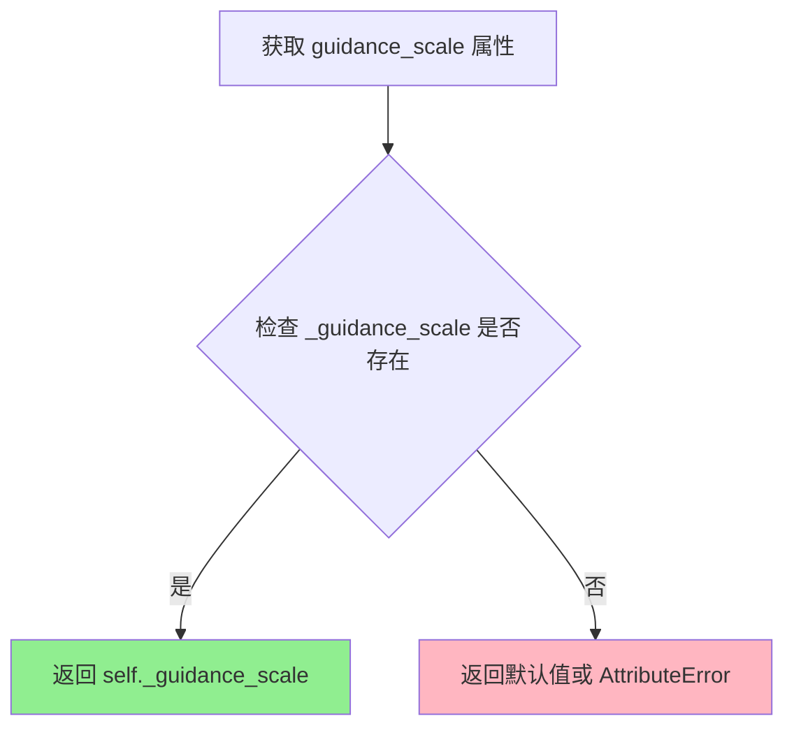

#### 带注释源码

```python
@property
def guidance_scale(self):
    """
    获取分类器自由引导（Classifier-Free Guidance）的缩放因子。
    
    该属性返回在 __call__ 方法中设置的 _guidance_scale 值。
    guidance_scale 控制生成内容与文本提示的一致程度：
    - 当 guidanc_scale > 1 时，启用 CFG
    - 值越高，生成内容越接近文本提示，但可能降低质量
    - Wan Animate 模式下通常设置为 1.0（不使用 CFG）
    
    Returns:
        float: 当前pipeline的guidance_scale值
    """
    return self._guidance_scale
```


### `WanAnimatePipeline.do_classifier_free_guidance`

这是一个属性方法，用于判断当前是否启用无分类器自由引导（Classifier-Free Guidance，CFG）。当 `guidance_scale` 参数大于 1 时，CFG 会被启用，该属性返回 `True`；否则返回 `False`。在 Wan Animate 推理中，默认 `guidance_scale` 为 1.0，即默认不启用 CFG。

参数： 无（这是一个属性方法，不接受任何参数）

返回值：`bool`，返回一个布尔值，指示是否启用无分类器自由引导。当 `self._guidance_scale > 1` 时返回 `True`，否则返回 `False`。

#### 流程图

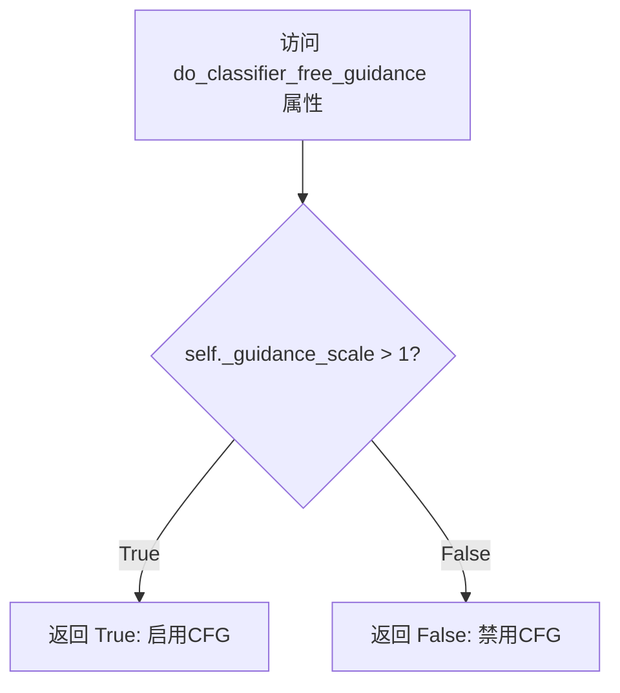

#### 带注释源码

```python
@property
def do_classifier_free_guidance(self) -> bool:
    """
    属性：判断是否启用无分类器自由引导（Classifier-Free Guidance）
    
    无分类器自由引导是一种扩散模型推理技术，通过同时评估条件和无条件预测来改进生成质量。
    当 guidance_scale > 1 时启用，此时模型会同时进行条件生成和无条件生成，
    最终预测 = 无条件预测 + guidance_scale * (条件预测 - 无条件预测)
    
    在 Wan Animate pipeline 中，默认 guidance_scale 为 1.0，因此默认不启用 CFG。
    
    Returns:
        bool: 如果 guidance_scale > 1 则返回 True，表示启用 CFG；否则返回 False
    """
    return self._guidance_scale > 1
```


### `WanAnimatePipeline.num_timesteps`

该属性是一个只读的属性，用于获取扩散模型在推理过程中使用的时间步总数。它返回内部变量 `_num_timesteps`，该变量在去噪循环开始时被设置为调度器时间步列表的长度。

参数：

- （无参数）

返回值：`int`，返回扩散推理过程中使用的时间步总数，即去噪迭代的次数。

#### 流程图

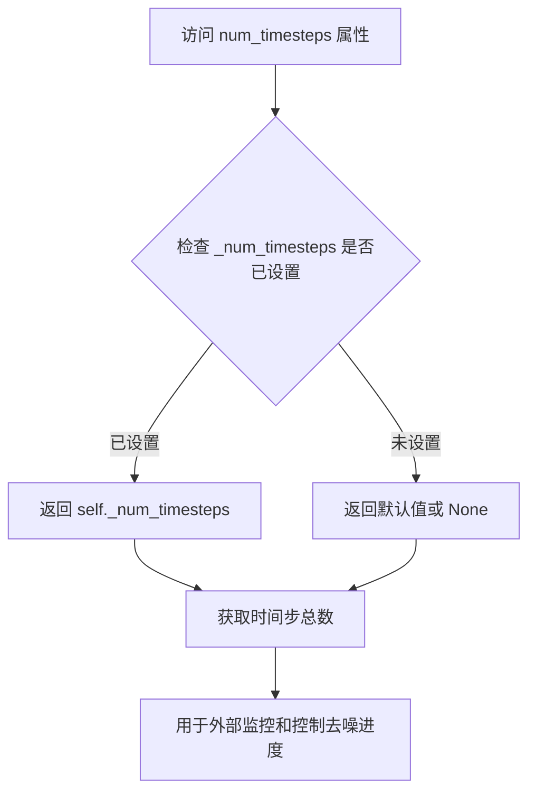

#### 带注释源码

```python
@property
def num_timesteps(self):
    """
    返回扩散管道在推理过程中使用的时间步总数。
    
    该属性在去噪循环开始时由 __call__ 方法设置：
    self._num_timesteps = len(timesteps)
    
    时间步总数取决于 num_inference_steps 和调度器的配置。
    用于外部调用者查询当前管道的推理步数。
    
    Returns:
        int: 时间步的总数，通常等于 num_inference_steps
    """
    return self._num_timesteps
```


### `WanAnimatePipeline.current_timestep`

该属性是 `WanAnimatePipeline` 类的一个只读属性，用于获取当前去噪步骤的时间步（timestep）。在扩散模型的推理过程中，该属性会随着去噪循环的进行而更新，使得外部可以实时监控当前的推理进度。

参数：无（该属性不需要任何参数）

返回值：`int | None`，返回当前去噪循环中的时间步（timestep），如果当前未在进行推理则返回 `None`。

#### 流程图

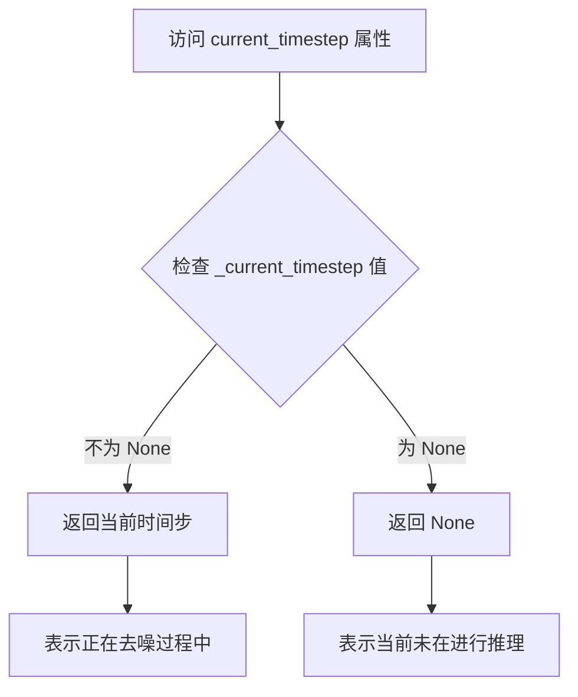

#### 带注释源码

```python
@property
def current_timestep(self):
    """
    当前时间步属性。
    
    该属性返回扩散模型去噪过程中的当前时间步（timestep）。
    在 __call__ 方法的去噪循环中，该值会被实时更新为当前处理的时间步，
    使外部调用者能够追踪推理进度。
    
    返回值:
        int | None: 
            - int: 当前去噪步骤的时间步值
            - None: 当前未在进行推理（如推理开始前或结束后）
    """
    return self._current_timestep
```

#### 内部状态变化说明

| 阶段 | `_current_timestep` 值 | 说明 |
|------|----------------------|------|
| 初始化/推理开始前 | `None` | 在 `__call__` 方法中初始化为 `None` |
| 去噪循环中 | `int` (如 980, 960, ...) | 在每个去噪步骤中被更新为当前的 `t` 值 |
| 推理结束后 | `None` | 在推理完成后被重置为 `None` |

#### 相关属性

该属性与以下属性属于同一类别的监控属性：

- `WanAnimatePipeline.guidance_scale`: 返回引导尺度
- `WanAnimatePipeline.do_classifier_free_guidance`: 返回是否启用无分类器引导
- `WanAnimatePipeline.num_timesteps`: 返回总时间步数
- `WanAnimatePipeline.interrupt`: 返回中断状态


### `WanAnimatePipeline.interrupt`

该属性是 WanAnimatePipeline 类的中断标志 getter 方法，用于在去噪循环中检查是否需要中断当前的视频生成过程。当设置为 `True` 时，去噪循环会跳过当前迭代，实现即时的生成中断。

参数：
- 无（仅包含隐式参数 `self`）

返回值：`bool`，表示是否接收到中断信号。`True` 表示需要中断当前的视频生成过程，`False` 表示继续正常生成。

#### 流程图

```mermaid
flowchart TD
    A[访问 interrupt 属性] --> B{返回 self._interrupt}
    B -->|True| C[去噪循环跳过当前迭代]
    B -->|False| D[继续执行去噪步骤]
```

#### 带注释源码

```python
@property
def interrupt(self):
    """
    中断标志属性 getter。
    
    该属性用于控制管道执行的去噪循环是否需要中断。在 __call__ 方法的
    去噪循环中，会检查此属性：
    
        if self.interrupt:
            continue
    
    当外部调用者将此属性设置为 True 时，当前正在进行的视频生成过程
    会立即停止去噪步骤的执行，但会保留已生成的部分结果。
    
    Returns:
        bool: 中断标志。如果为 True，表示已接收到中断请求，生成过程
              应该中断；如果为 False，表示继续正常生成。
    """
    return self._interrupt
```


### `WanAnimatePipeline.attention_kwargs`

获取传递给 AttentionProcessor 的额外关键字参数。该属性用于在去噪过程中向注意力处理器传递自定义参数，如注意力权重、mask等。

参数：

- （无参数，这是属性访问器）

返回值：`dict[str, Any] | None`，返回传递给 AttentionProcessor 的 kwargs 字典。如果在 pipeline 调用时未提供 `attention_kwargs` 参数，则返回 `None`。

#### 流程图

```mermaid
flowchart TD
    A[访问 attention_kwargs 属性] --> B{self._attention_kwargs 是否已设置?}
    B -->|是| C[返回 self._attention_kwargs]
    B -->|否| D[返回 None]
    
    style A fill:#f9f,stroke:#333
    style C fill:#9f9,stroke:#333
    style D fill:#9f9,stroke:#333
```

#### 带注释源码

```python
@property
def attention_kwargs(self):
    """
    获取传递给 AttentionProcessor 的额外关键字参数。
    
    该属性在 pipeline 的 __call__ 方法中被设置：
    self._attention_kwargs = attention_kwargs
    
    传递给 transformer 的去噪过程，用于自定义注意力机制的行为。
    
    返回:
        dict[str, Any] | None: 传递给 AttentionProcessor 的参数字典，
                              如果未设置则返回 None
    """
    return self._attention_kwargs
```


### WanAnimatePipeline.__call__

WanAnimatePipeline的主入口方法，用于通过扩散模型生成角色动画视频或替换背景中的角色。该方法支持两种模式：animate（动画模式）根据pose_video和face_video驱动角色图像生成动作视频；replace（替换模式）结合背景视频和遮罩视频将角色图像合成到指定背景中。

参数：

- `self`：`WanAnimatePipeline` 实例，管道对象本身
- `image`：`PipelineImageInput`，输入的角色图像，用于条件生成
- `pose_video`：`list[PIL.Image.Image]`（必需），输入的姿态视频帧列表，用于驱动角色动作
- `face_video`：`list[PIL.Image.Image]`（必需），输入的面部视频帧列表，用于驱动面部表情
- `background_video`：`list[PIL.Image.Image] | None`，替换模式下的背景视频（mode="replace"时必需）
- `mask_video`：`list[PIL.Image.Image] | None`，替换模式下的遮罩视频，白色区域生成新内容（mode="replace"时必需）
- `prompt`：`str | list[str] | None`，指导视频生成的文本提示
- `negative_prompt`：`str | list[str] | None`，反向提示，用于引导不想要的元素
- `height`：`int`，生成视频的高度，默认720
- `width`：`int`，生成视频的宽度，默认1280
- `segment_frame_length`：`int`，每个推理片段的帧数，默认77
- `num_inference_steps`：`int`，去噪步骤数，默认20
- `mode`：`str`，生成模式，"animate"或"replace"，默认"animate"
- `prev_segment_conditioning_frames`：`int`，从前一片段使用的条件帧数，默认1
- `motion_encode_batch_size`：`int | None`，面部视频批处理编码的批大小
- `guidance_scale`：`float`，分类器自由引导比例，默认1.0
- `num_videos_per_prompt`：`int | None`，每个提示生成的视频数量，默认1
- `generator`：`torch.Generator | list[torch.Generator] | None`，随机数生成器，用于可重复生成
- `latents`：`torch.Tensor | None`，预生成的噪声潜在向量
- `prompt_embeds`：`torch.Tensor | None`，预生成的文本嵌入
- `negative_prompt_embeds`：`torch.Tensor | None`，预生成的反向文本嵌入
- `image_embeds`：`torch.Tensor | None`，预生成的图像嵌入
- `output_type`：`str | None`，输出格式，"np"或"latent"，默认"np"
- `return_dict`：`bool`，是否返回字典格式结果，默认True
- `attention_kwargs`：`dict[str, Any] | None`，传递给注意力处理器的额外参数
- `callback_on_step_end`：`Callable | PipelineCallback | MultiPipelineCallbacks | None`，每步结束后调用的回调函数
- `callback_on_step_end_tensor_inputs`：`list[str]`，回调函数接收的张量输入列表，默认["latents"]
- `max_sequence_length`：`int`，文本编码器的最大序列长度，默认512

返回值：`WanPipelineOutput` 或 `tuple`，当return_dict为True时返回WanPipelineOutput对象，包含生成的视频帧；否则返回元组，第一个元素是视频帧列表

#### 流程图

```mermaid
flowchart TD
    A[开始 __call__] --> B[检查回调张量输入]
    B --> C{验证输入参数}
    C -->|验证失败| D[抛出 ValueError]
    C -->|验证通过| E[调整 segment_frame_length]
    E --> F[设置引导比例和注意力参数]
    F --> G[确定批处理大小]
    G --> H[计算目标帧数和分段数]
    H --> I[编码提示词 Embeddings]
    I --> J[预处理并编码参考图像]
    J --> K[获取 CLIP 图像特征]
    K --> L[预处理姿态和面部视频]
    L --> M{模式检查}
    M -->|replace| N[预处理背景和遮罩视频]
    M -->|animate| O[准备时间步]
    N --> O
    O --> P[准备参考图像潜在向量]
    P --> Q[循环处理视频分段]
    
    Q --> Q1[采样噪声潜在向量]
    Q1 --> Q2[提取当前分段pose和face视频]
    Q2 --> Q3[准备上一分段条件潜在向量]
    Q3 --> Q4[连接参考图像和条件潜在向量]
    Q4 --> Q5[去噪循环 for each timestep]
    Q5 --> Q6[Transformer前向传播]
    Q6 --> Q7{分类器自由引导?}
    Q7 -->|是| Q8[计算无条件预测]
    Q7 -->|否| Q9[跳过无条件预测]
    Q8 --> Q10[应用引导权重]
    Q9 --> Q10
    Q10 --> Q11[scheduler.step更新潜在向量]
    Q11 --> Q12[执行回调函数]
    Q12 --> Q13{还有更多时间步?}
    Q13 -->|是| Q5
    Q13 -->|否| Q14[VAE解码潜在向量]
    Q14 --> Q15[保存输出帧]
    Q15 --> Q16{还有更多分段?}
    Q16 -->|是| Q1
    Q16 -->|否| Q17[拼接所有分段帧]
    Q17 --> R[后处理视频]
    R --> S[释放模型钩子]
    S --> T{return_dict?}
    T -->|是| U[返回 WanPipelineOutput]
    T -->|否| V[返回元组]
```

#### 带注释源码

```python
@torch.no_grad()
@replace_example_docstring(EXAMPLE_DOC_STRING)
def __call__(
    self,
    image: PipelineImageInput,  # 输入的角色图像
    pose_video: list[PIL.Image.Image],  # 姿态视频帧列表
    face_video: list[PIL.Image.Image],  # 面部视频帧列表
    background_video: list[PIL.Image.Image] | None = None,  # replace模式背景视频
    mask_video: list[PIL.Image.Image] | None = None,  # replace模式遮罩视频
    prompt: str | list[str] = None,  # 文本提示
    negative_prompt: str | list[str] = None,  # 反向提示
    height: int = 720,  # 输出高度
    width: int = 1280,  # 输出宽度
    segment_frame_length: int = 77,  # 每段帧数
    num_inference_steps: int = 20,  # 去噪步数
    mode: str = "animate",  # 生成模式
    prev_segment_conditioning_frames: int = 1,  # 前一段条件帧数
    motion_encode_batch_size: int | None = None,  # 运动编码批大小
    guidance_scale: float = 1.0,  # CFG引导比例
    num_videos_per_prompt: int | None = 1,  # 每提示视频数
    generator: torch.Generator | list[torch.Generator] | None = None,  # 随机生成器
    latents: torch.Tensor | None = None,  # 预生成潜在向量
    prompt_embeds: torch.Tensor | None = None,  # 预生成提示嵌入
    negative_prompt_embeds: torch.Tensor | None = None,  # 预生成反向提示嵌入
    image_embeds: torch.Tensor | None = None,  # 预生成图像嵌入
    output_type: str | None = "np",  # 输出类型
    return_dict: bool = True,  # 是否返回字典
    attention_kwargs: dict[str, Any] | None = None,  # 注意力参数
    callback_on_step_end: Callable | None = None,  # 步骤结束回调
    callback_on_step_end_tensor_inputs: list[str] = ["latents"],  # 回调张量输入
    max_sequence_length: int = 512,  # 最大序列长度
):
    # 处理回调张量输入配置
    if isinstance(callback_on_step_end, (PipelineCallback, MultiPipelineCallbacks)):
        callback_on_step_end_tensor_inputs = callback_on_step_end.tensor_inputs

    # 1. 检查输入参数
    self.check_inputs(...)  # 验证所有输入的合法性

    # 调整segment_frame_length确保符合VAE时间尺度
    if segment_frame_length % self.vae_scale_factor_temporal != 1:
        segment_frame_length = (
            segment_frame_length // self.vae_scale_factor_temporal * self.vae_scale_factor_temporal + 1
        )

    # 2. 设置内部状态
    self._guidance_scale = guidance_scale
    self._attention_kwargs = attention_kwargs
    self._current_timestep = None
    self._interrupt = False
    device = self._execution_device

    # 3. 确定批处理大小
    if prompt is not None and isinstance(prompt, str):
        batch_size = 1
    elif prompt is not None and isinstance(prompt, list):
        batch_size = len(prompt)
    else:
        batch_size = prompt_embeds.shape[0]

    # 4. 计算视频分段参数
    cond_video_frames = len(pose_video)  # 条件视频总帧数
    effective_segment_length = segment_frame_length - prev_segment_conditioning_frames
    # 计算需要的填充帧数
    last_segment_frames = (cond_video_frames - prev_segment_conditioning_frames) % effective_segment_length
    num_padding_frames = 0 if last_segment_frames == 0 else effective_segment_length - last_segment_frames
    num_target_frames = cond_video_frames + num_padding_frames
    num_segments = num_target_frames // effective_segment_length

    # 5. 编码提示词
    prompt_embeds, negative_prompt_embeds = self.encode_prompt(...)

    # 6. 预处理参考图像
    image_pixels = self.vae_image_processor.preprocess(image, height=height, width=width, ...)

    # 获取CLIP图像特征
    if image_embeds is None:
        image_embeds = self.encode_image(image, device)
    image_embeds = image_embeds.repeat(batch_size * num_videos_per_prompt, 1, 1)

    # 7. 预处理条件视频
    pose_video = self.pad_video_frames(pose_video, num_target_frames)
    face_video = self.pa

## 关键组件


### WanAnimatePipeline

统一角色动画与替换的扩散管道，支持两种生成模式：animate模式根据姿态和面部视频动画化角色图像，replace模式在背景视频中替换角色。

### 分段推理机制

通过segment_frame_length和prev_segment_conditioning_frames参数将长视频分割为多个片段进行处理，实现长视频生成而无需一次性加载全部帧到显存。

### 姿态编码与面部编码

prepare_pose_latents方法将姿态视频编码为潜在表示，prepare_reference_image_latents处理参考图像，encode_image使用CLIP图像编码器提取图像特征用于条件控制。

### I2V Mask生成

get_i2v_mask方法在潜在空间生成图像到视频的掩码，用于标识需要从参考图像继承内容的帧区域，支持replace模式下的掩码视频处理。

### 潜在空间标准化/反标准化

retrieve_latents函数从VAE编码器输出中提取潜在分布，prepare_*_latents方法中使用latents_mean和latents_recip_std对潜在向量进行标准化和反标准化处理。

### 视频帧填充

pad_video_frames方法使用反射策略填充视频帧至目标长度，确保片段长度符合4N+1的要求以适配VAE的时间缩放因子。

### 文本编码

_get_t5_prompt_embeds使用T5文本编码器将文本提示转换为嵌入向量，支持最大序列长度512的文本输入。

### 去噪循环

主推理循环在每个片段上执行UNet去噪，通过transformer模型预测噪声，支持分类器自由引导(CFG)，并通过scheduler.step更新潜在变量。

### 潜在变量准备

prepare_latents方法初始化随机潜在向量或使用预提供的潜在向量，支持批处理和随机种子控制。

### 调度器

使用UniPCMultistepScheduler进行多步去噪，支持warmup步骤和进度跟踪。

### 输入验证

check_inputs方法全面验证所有输入参数的有效性，包括图像类型、视频长度、模式选择、分辨率要求等。

### LoRA加载支持

继承WanLoraLoaderMixin，提供LoRA权重加载能力用于模型微调。

### 回调机制

支持callback_on_step_end和callback_on_step_end_tensor_inputs，允许在每个去噪步骤后执行自定义回调函数。

### XLA支持

通过is_torch_xla_available检查并集成PyTorch XLA，实现跨设备加速和mark_step优化。


## 问题及建议


### 已知问题

-   **`__call__` 方法过长**：主生成方法超过500行，包含过多逻辑（输入验证、编码、降噪循环、解码），违反单一职责原则，难以维护和测试。
-   **重复的 Latent 标准化/反标准化代码**：`latents_mean` 和 `latents_recip_std` 的计算逻辑在 `prepare_reference_image_latents`、`prepare_pose_latents`、`prepare_prev_segment_cond_latents` 以及 `__call__` 的解码部分重复出现多次，违反 DRY 原则。
-   **硬编码的 Magic Numbers**：代码中多处使用硬编码数值（如 `4`, `8`, `77`, `226`, `512`, `1.0`），且未在类属性或配置中统一管理，降低了可读性和可配置性。
-   **使用 `print` 而非 Logger**：在 `prepare_prev_segment_cond_latents` 方法中使用 `print` 输出警告信息，应统一使用 `logger.warning` 以保持日志一致性。
-   **类型提示不一致**：部分参数使用 Python 3.10+ 的 `|` 联合类型语法（如 `str | list[str]`），但未添加 `from __future__ import annotations` 导入，且部分返回类型注解缺失（如 `prepare_latents` 返回 tuple 但未标注具体类型）。
-   **潜在的设备/dtype 转换开销**：在 `__call__` 循环内部多次对 tensor 调用 `.to(device, dtype)`，可能在循环外预先处理以提高性能。
-   **条件检查逻辑冗余**：在 `encode_prompt` 中，对 `prompt` 和 `negative_prompt` 的类型检查和批处理逻辑可以进一步简化。
-   **缺失的默认值处理**：在 `check_inputs` 中对 `mode` 的检查逻辑略显冗余，且 `prev_segment_conditioning_frames` 的验证逻辑分散。
-   **外部依赖的隐式假设**：代码对 `self.vae.config` 的多个属性（如 `scale_factor_temporal`, `scale_factor_spatial`, `latents_mean`, `latents_std`, `z_dim`）存在强依赖，如果配置缺失会引发运行时错误。

### 优化建议

-   **拆分 `__call__` 方法**：将主方法拆分为多个私有辅助方法，如 `_encode_inputs`, `_prepare_latents`, `_run_denoising_segment`, `_decode_segments`，提高可读性和可测试性。
-   **提取 Latent 处理工具类或函数**：将标准化/反标准化逻辑封装为工具函数（如 `standardize_latents`, `destandardize_latents`），在需要的地方复用。
-   **统一配置管理**：将常用的 magic numbers 提取为类属性或 `__init__` 参数的默认值，并在文档中说明。
-   **统一日志输出**：将所有 `print` 调用替换为 `logger.warning` 或 `logger.info`。
-   **优化设备转换**：在循环外预先计算或转换需要重复使用的 tensors（如 `pose_latents`, `reference_image_latents`），减少循环内的设备通信开销。
-   **添加完整的类型注解**：为所有方法添加完整的参数和返回类型注解，并添加 `from __future__ import annotations` 以支持旧版 Python 的联合类型语法。
-   **增强错误处理**：对 `vae.config` 的关键属性访问添加防御性检查或默认值，提供更清晰的错误信息。

## 其它


### 设计目标与约束

1. **功能目标**: 支持两种视频生成模式——动画模式(animate)和替换模式(replace)，通过姿态视频和面部视频驱动角色图像生成动画，或将角色替换到背景视频中。
2. **约束条件**: 
   - 分辨率必须能被16整除(height%16==0, width%16==0)
   - 帧长度必须满足4N+1格式(segment_frame_length, prev_segment_conditioning_frames)
   - pose_video和face_video必须为非空PIL图像列表
   - replace模式下必须提供background_video和mask_video
3. **性能目标**: 采用分段处理策略降低内存占用，支持motion_encode_batch_size参数控制运动编码批量大小

### 错误处理与异常设计

1. **输入验证**: check_inputs方法全面检查所有输入参数的合法性，包括类型检查(batch_size一致性)、维度检查(分辨率约束)、模式检查(animate/replace)、以及可选参数的必要性和互斥性检查
2. **异常抛出**: 使用ValueError明确指出错误原因(如"Cannot forward both X and Y"格式)，确保错误信息包含具体数值和类型信息便于调试
3. **兼容性处理**: 对XLA设备支持使用try-except导入，对非整除的segment_frame_length自动调整并发出warning

### 数据流与状态机

1. **分段处理流程**: 视频生成按segment_frame_length分块处理，每段使用prev_segment_conditioning_frames帧进行时序连续性conditioning
2. **Latent空间操作**: 参考图像→VAE encode→standardize→与pose/face latents拼接→transformer去噪→VAE decode→destandardize
3. **条件输入流**: prompt→T5 encoder生成prompt_embeds，image→CLIP encoder生成image_embeds，pose_video/face_video→VAE encoder生成latents
4. **状态管理**: 通过_guidance_scale、_attention_kwargs、_current_timestep、_interrupt等属性维护推理过程状态

### 外部依赖与接口契约

1. **核心依赖**: 
   - transformers: UMT5EncoderModel(tokenizer/text_encoder), CLIPVisionModel(image_encoder)
   - diffusers: DiffusionPipeline基类，UniPCMultistepScheduler调度器，AutoencoderKLWan VAE模型，WanAnimateTransformer3DModel
   - 内部模块: WanLoraLoaderMixin, VideoProcessor, WanAnimateImageProcessor
2. **输入接口契约**: 
   - image支持PipelineImageInput类型(torch.Tensor或PIL.Image)
   - video输入统一为list[PIL.Image.Image]格式
   - prompt/negative_prompt支持str或list[str]
3. **输出接口**: 返回WanPipelineOutput(frames)或tuple(video, nsfw_detected)

### 调度器与去噪流程

1. **Scheduler配置**: 使用UniPCMultistepScheduler进行多步去噪，通过set_timesteps初始化离散时间步
2. **Denoising循环**: 对每个timestep执行transformer前向传播计算noise_pred，若启用CFG则分别计算条件/无条件预测并线性组合
3. **Scheduler.step**: 根据预测噪声更新latents，支持return_dict=False获取中间结果

### 内存管理与优化

1. **模型卸载序列**: model_cpu_offload_seq定义text_encoder→image_encoder→transformer→vae的卸载顺序
2. **分段生成策略**: 仅在首段生成随机latents，后续段落复用前一结果降低随机性
3. **VAE分块处理**: 通过vae_scale_factor_temporal和vae_scale_factor_spatial协调latent空间与像素空间的尺寸转换
4. **可选优化**: motion_encode_batch_size参数允许在推理速度和显存间权衡

### 多模态条件融合

1. **Text条件**: T5编码的prompt_embeds作为encoder_hidden_states输入transformer
2. **Image条件**: CLIP编码的image_embeds作为encoder_hidden_states_image输入
3. **Motion条件**: VAE编码的pose_latents作为pose_hidden_states，face_pixel_values直接作为时空条件
4. **条件拼接策略**: latent_model_input在通道维度拼接当前latents和参考latents，在帧维度拼接参考图像和前一segment条件

    