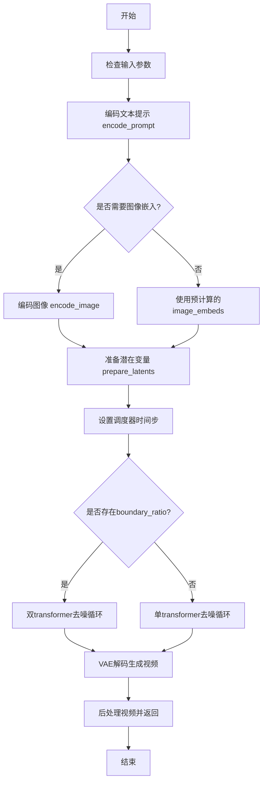
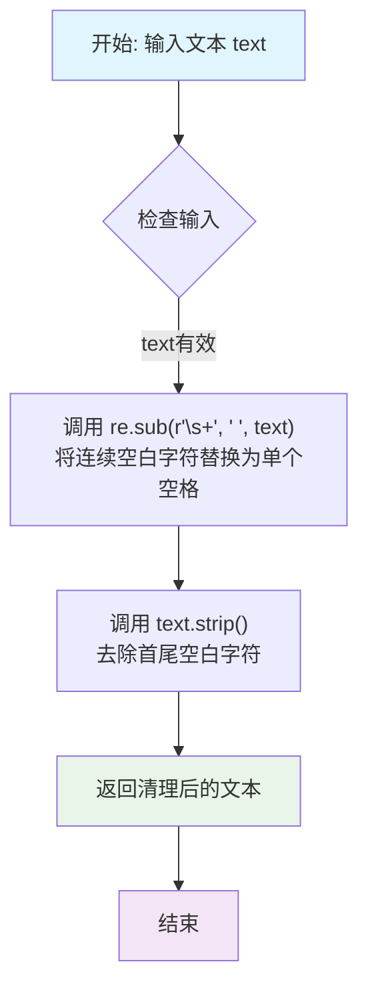
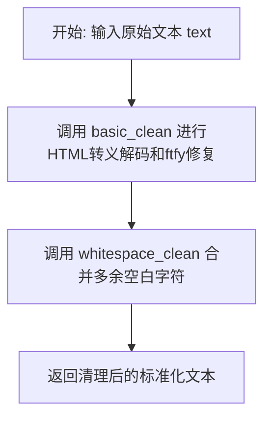
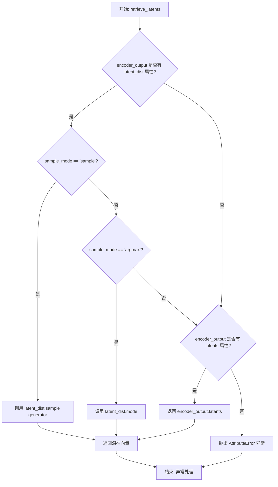
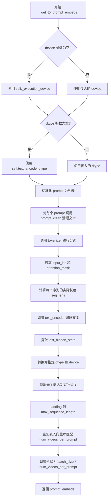
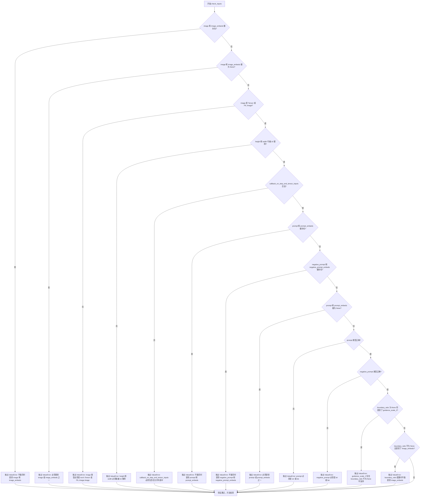
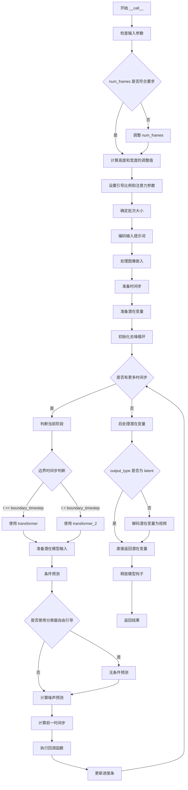

# `diffusers\src\diffusers\pipelines\wan\pipeline_wan_i2v.py` 详细设计文档

WanImageToVideoPipeline是一个用于图像到视频生成的Diffusion Pipeline，接收图像和文本提示，通过T5文本编码器、CLIP图像编码器、WanTransformer3DModel和VAE进行去噪处理，最终生成与文本描述和输入图像一致的视频。

## 整体流程



## 类结构

```
DiffusionPipeline (基类)
└── WanImageToVideoPipeline
    ├── 继承: WanLoraLoaderMixin
    └── 模块组件:
        ├── tokenizer (AutoTokenizer)
        ├── text_encoder (UMT5EncoderModel)
        ├── image_encoder (CLIPVisionModel)
        ├── transformer (WanTransformer3DModel)
        ├── transformer_2 (WanTransformer3DModel, 可选)
        ├── vae (AutoencoderKLWan)
        ├── scheduler (FlowMatchEulerDiscreteScheduler)
        ├── image_processor (CLIPImageProcessor)
        └── video_processor (VideoProcessor)
```

## 全局变量及字段


### `XLA_AVAILABLE`
    
Boolean flag indicating whether PyTorch XLA is available for accelerated computation

类型：`bool`
    


### `logger`
    
Logger instance for the pipeline module to track runtime information and warnings

类型：`logging.Logger`
    


### `EXAMPLE_DOC_STRING`
    
Documentation string containing example usage code for the WanImageToVideoPipeline

类型：`str`
    


### `WanImageToVideoPipeline.model_cpu_offload_seq`
    
String defining the sequence of models for CPU offloading during inference

类型：`str`
    


### `WanImageToVideoPipeline._callback_tensor_inputs`
    
List of tensor input names that can be passed to callback functions during denoising steps

类型：`list`
    


### `WanImageToVideoPipeline._optional_components`
    
List of optional pipeline components that may be None during initialization

类型：`list`
    


### `WanImageToVideoPipeline.vae_scale_factor_temporal`
    
Temporal scaling factor used by VAE to compress/decompress video frames along time dimension

类型：`int`
    


### `WanImageToVideoPipeline.vae_scale_factor_spatial`
    
Spatial scaling factor used by VAE to compress/decompress video frames along height and width dimensions

类型：`int`
    


### `WanImageToVideoPipeline.video_processor`
    
VideoProcessor instance for preprocessing input images and postprocessing generated video frames

类型：`VideoProcessor`
    


### `WanImageToVideoPipeline.image_processor`
    
CLIPImageProcessor instance for preprocessing images before encoding with image_encoder

类型：`CLIPImageProcessor`
    
    

## 全局函数及方法


### `basic_clean`

该函数是一个文本清洗工具函数，用于清理输入文本中的特殊字符和HTML实体。它通过ftfy库修复文本编码问题，然后双重解码HTML实体，最后去除首尾空格，为后续的文本处理提供干净的输入。

参数：

- `text`：`str`，需要清洗的原始文本输入

返回值：`str`，返回清洗处理后的文本

#### 流程图


#### 带注释源码

```
def basic_clean(text):
    """
    清洗输入文本中的特殊字符和HTML实体。
    
    处理流程：
    1. 使用ftfy库修复文本编码问题（如乱码、错误编码的字符）
    2. 双重调用html.unescape确保HTML实体被完全解码
    3. 去除文本首尾的空白字符
    
    Args:
        text: 需要清洗的原始文本
        
    Returns:
        清洗处理后的文本
    """
    # 步骤1: 使用ftfy修复文本编码问题
    # ftfy能够检测并修复常见的文本编码错误，如UTF-8编码错误、mojibake等
    text = ftfy.fix_text(text)
    
    # 步骤2: 双重HTML实体解码
    # 第一次解码处理基本的HTML实体如 &amp; -> &
    # 第二次解码处理嵌套的实体如 &amp;lt; -> &lt; -> <
    # 双重解码确保所有层级的HTML实体都被正确处理
    text = html.unescape(html.unescape(text))
    
    # 步骤3: 去除文本首尾的空白字符
    # 使用strip()方法去除空格、换行符、制表符等空白字符
    return text.strip()
```


### `whitespace_clean`

该函数用于清理文本中的多余空白字符，将连续多个空白字符替换为单个空格，并去除文本首尾的空白字符，是文本预处理流水线中的基础清洗步骤。

参数：

- `text`：`str`，需要进行空白字符清理的输入文本

返回值：`str`，返回清理后的文本，去除了多余的空白字符

#### 流程图



#### 带注释源码

```python
def whitespace_clean(text):
    """
    清理文本中的多余空白字符。
    
    该函数是文本预处理流水线中的一个步骤，主要功能包括：
    1. 将连续出现的多个空白字符（包括空格、制表符、换行符等）替换为单个空格
    2. 去除文本首尾的空白字符
    
    Args:
        text: str, 需要清理的输入文本字符串
        
    Returns:
        str, 清理后的文本字符串
    """
    # 使用正则表达式将一个或多个空白字符（\s+）替换为单个空格
    # \s+ 匹配一个或多个空白字符，包括空格、制表符\t、换行符\n等
    text = re.sub(r"\s+", " ", text)
    
    # 去除文本首尾的空白字符（包括空格、制表符、换行符等）
    text = text.strip()
    
    # 返回清理后的文本
    return text
```


### `prompt_clean`

该函数是 Wan 图像到视频生成管道中的提示词清理工具，通过先调用 `basic_clean` 进行 HTML 实体解码和 ftfy 修复，再调用 `whitespace_clean` 合并多余空白字符，最终返回标准化的文本字符串。

参数：

- `text`：`str`，需要清理的原始提示词文本

返回值：`str`，清理标准化后的提示词文本

#### 流程图



#### 带注释源码

```python
def prompt_clean(text):
    """
    清理提示词文本的标准化处理函数。
    
    处理流程：
    1. basic_clean: 使用ftfy库修复常见的文本编码问题，并进行HTML实体解码
    2. whitespace_clean: 将连续空白字符合并为单个空格，并去除首尾空白
    
    Args:
        text: 原始输入文本
        
    Returns:
        清理并标准化后的文本字符串
    """
    # 第一步：基本清理 - 处理HTML转义和ftfy修复
    # basic_clean 会调用 ftfy.fix_text 修复编码问题
    # 然后进行两层 html.unescape 处理 HTML 实体
    text = whitespace_clean(basic_clean(text))
    return text
```


### `retrieve_latents`

该函数是一个工具函数，用于从变分自编码器（VAE）的输出中提取潜在向量（latents）。它支持多种采样模式，包括从潜在分布中采样（sample）或取模（argmax），也可以直接返回预计算的潜在向量。

参数：

- `encoder_output`：`torch.Tensor`，VAE 编码器的输出对象，包含 `latent_dist` 属性（潜在分布）或 `latents` 属性（预计算潜在向量）
- `generator`：`torch.Generator | None`，可选的 PyTorch 随机数生成器，用于确保采样过程的可重复性
- `sample_mode`：`str`，字符串类型，指定采样模式，可选值为 `"sample"`（从分布中采样）或 `"argmax"`（取分布的众数），默认为 `"sample"`

返回值：`torch.Tensor`，从编码器输出中提取的潜在向量张量

#### 流程图



#### 带注释源码

```python
# Copied from diffusers.pipelines.stable_diffusion.pipeline_stable_diffusion_img2img.retrieve_latents
def retrieve_latents(
    encoder_output: torch.Tensor, generator: torch.Generator | None = None, sample_mode: str = "sample"
):
    """
    从 VAE 编码器输出中提取潜在向量。
    
    该函数支持三种方式获取潜在向量：
    1. 从潜在分布中随机采样（sample 模式）
    2. 从潜在分布中取众数/最大值（argmax 模式）
    3. 直接返回预计算的潜在向量
    
    参数:
        encoder_output: 编码器输出对象，通常包含 latent_dist 或 latents 属性
        generator: 可选的随机数生成器，用于采样时的随机性控制
        sample_mode: 采样模式，'sample' 表示随机采样，'argmax' 表示取众数
    
    返回:
        潜在向量张量
    """
    # 检查编码器输出是否有 latent_dist 属性，并且采样模式为 sample
    if hasattr(encoder_output, "latent_dist") and sample_mode == "sample":
        # 从潜在分布中采样，返回潜在向量
        return encoder_output.latent_dist.sample(generator)
    # 检查编码器输出是否有 latent_dist 属性，并且采样模式为 argmax
    elif hasattr(encoder_output, "latent_dist") and sample_mode == "argmax":
        # 取潜在分布的众数（即最可能的潜在向量）
        return encoder_output.latent_dist.mode()
    # 检查编码器输出是否有预计算的 latents 属性
    elif hasattr(encoder_output, "latents"):
        # 直接返回预计算的潜在向量
        return encoder_output.latents
    # 如果无法从编码器输出中获取潜在信息，抛出异常
    else:
        raise AttributeError("Could not access latents of provided encoder_output")
```


### WanImageToVideoPipeline.__init__

该方法是 WanImageToVideoPipeline 类的构造函数，负责初始化图像转视频生成管道所需的所有核心组件，包括分词器、文本编码器、VAE、调度器、图像编码器、变换器等，并配置时间缩放因子和视频/图像处理器。

参数：

- `tokenizer`：`AutoTokenizer`，T5 分词器，用于将文本提示编码为令牌
- `text_encoder`：`UMT5EncoderModel`，T5 文本编码器模型，用于将文本提示编码为嵌入向量
- `vae`：`AutoencoderKLWan`，Wan VAE 模型，用于编码和解码视频/图像到潜在表示
- `scheduler`：`FlowMatchEulerDiscreteScheduler`，流匹配欧拉离散调度器，用于去噪过程
- `image_processor`：`CLIPImageProcessor`，CLIP 图像预处理器，默认为 None
- `image_encoder`：`CLIPVisionModel`，CLIP 视觉编码器，默认为 None，用于编码图像
- `transformer`：`WanTransformer3DModel`，主条件变换器，用于去噪输入潜在变量，默认为 None
- `transformer_2`：`WanTransformer3DModel`，第二条件变换器，用于低噪声阶段的去噪，默认为 None
- `boundary_ratio`：`float | None`，用于两阶段去明切换的时间步边界比例，默认为 None
- `expand_timesteps`：`bool`，是否扩展时间步，默认为 False

返回值：无（`None`）

#### 流程图

```mermaid
flowchart TD
    A[开始 __init__] --> B[调用 super().__init__]
    B --> C[register_modules: 注册 vae, text_encoder, tokenizer, image_encoder, transformer, scheduler, image_processor, transformer_2]
    C --> D[register_to_config: 注册 boundary_ratio 和 expand_timesteps 到配置]
    D --> E{self.vae 是否存在}
    E -->|是| F[从 vae.config 获取 scale_factor_temporal]
    E -->|否| G[使用默认值 4]
    F --> H[设置 self.vae_scale_factor_temporal]
    H --> I{self.vae 是否存在}
    I -->|是| J[从 vae.config 获取 scale_factor_spatial]
    I -->|否| K[使用默认值 8]
    J --> L[设置 self.vae_scale_factor_spatial]
    K --> L
    L --> M[创建 VideoProcessor: vae_scale_factor=self.vae_scale_factor_spatial]
    M --> N[设置 self.image_processor = image_processor]
    N --> O[结束 __init__]
```

#### 带注释源码

```python
def __init__(
    self,
    tokenizer: AutoTokenizer,
    text_encoder: UMT5EncoderModel,
    vae: AutoencoderKLWan,
    scheduler: FlowMatchEulerDiscreteScheduler,
    image_processor: CLIPImageProcessor = None,
    image_encoder: CLIPVisionModel = None,
    transformer: WanTransformer3DModel = None,
    transformer_2: WanTransformer3DModel = None,
    boundary_ratio: float | None = None,
    expand_timesteps: bool = False,
):
    """
    初始化 WanImageToVideoPipeline 管道。
    
    参数:
        tokenizer: T5 分词器
        text_encoder: T5 文本编码器
        vae: Wan VAE 模型
        scheduler: 流匹配调度器
        image_processor: CLIP 图像处理器
        image_encoder: CLIP 视觉编码器
        transformer: 主变换器
        transformer_2: 第二变换器（可选）
        boundary_ratio: 两阶段去噪边界比例
        expand_timesteps: 是否扩展时间步
    """
    # 调用父类 DiffusionPipeline 的初始化方法
    super().__init__()

    # 注册所有模型组件到管道中
    # 这些组件可以通过 self.component_name 访问
    self.register_modules(
        vae=vae,
        text_encoder=text_encoder,
        tokenizer=tokenizer,
        image_encoder=image_encoder,
        transformer=transformer,
        scheduler=scheduler,
        image_processor=image_processor,
        transformer_2=transformer_2,
    )
    
    # 将配置参数注册到管道的配置中
    # 这些参数可以通过 self.config.param_name 访问
    self.register_to_config(boundary_ratio=boundary_ratio, expand_timesteps=expand_timesteps)

    # 初始化 VAE 时间缩放因子
    # 如果 VAE 存在，从配置中读取；否则使用默认值
    self.vae_scale_factor_temporal = self.vae.config.scale_factor_temporal if getattr(self, "vae", None) else 4
    
    # 初始化 VAE 空间缩放因子
    self.vae_scale_factor_spatial = self.vae.config.scale_factor_spatial if getattr(self, "vae", None) else 8
    
    # 创建视频处理器，用于预处理输入图像和后处理输出视频
    self.video_processor = VideoProcessor(vae_scale_factor=self.vae_scale_factor_spatial)
    
    # 保存图像处理器引用
    self.image_processor = image_processor
```


### `WanImageToVideoPipeline._get_t5_prompt_embeds`

该方法用于将文本提示（prompt）编码为T5文本编码器可以处理的嵌入向量（embeddings），支持批量处理和每个提示生成多个视频的场景。

参数：

- `self`：`WanImageToVideoPipeline` 实例本身
- `prompt`：`str | list[str]`，需要编码的文本提示，可以是单个字符串或字符串列表
- `num_videos_per_prompt`：`int`，每个提示生成的视频数量，默认为1
- `max_sequence_length`：`int`，文本编码器的最大序列长度，默认为512
- `device`：`torch.device | None`，用于运行文本编码器的设备，默认为 `self._execution_device`
- `dtype`：`torch.dtype | None`，文本嵌入的数据类型，默认为 `self.text_encoder.dtype`

返回值：`torch.Tensor`，编码后的文本嵌入向量，形状为 `(batch_size * num_videos_per_prompt, max_sequence_length, hidden_dim)`

#### 流程图



#### 带注释源码

```python
def _get_t5_prompt_embeds(
    self,
    prompt: str | list[str] = None,
    num_videos_per_prompt: int = 1,
    max_sequence_length: int = 512,
    device: torch.device | None = None,
    dtype: torch.dtype | None = None,
):
    """
    将文本提示编码为T5文本编码器的嵌入向量
    
    参数:
        prompt: 输入的文本提示，字符串或字符串列表
        num_videos_per_prompt: 每个提示需要生成的视频数量
        max_sequence_length: 文本编码的最大长度
        device: 运行设备
        dtype: 数据类型
    
    返回:
        编码后的文本嵌入向量
    """
    # 1. 确定运行设备和数据类型
    # 如果未指定device，则使用pipeline的默认执行设备
    device = device or self._execution_device
    # 如果未指定dtype，则使用text_encoder的数据类型
    dtype = dtype or self.text_encoder.dtype

    # 2. 标准化输入格式
    # 将单个字符串转换为列表，统一处理方式
    prompt = [prompt] if isinstance(prompt, str) else prompt
    # 对每个prompt进行清理：修复HTML实体、去除多余空白等
    prompt = [prompt_clean(u) for u in prompt]
    # 获取批次大小
    batch_size = len(prompt)

    # 3. Tokenize处理
    # 使用tokenizer将文本转换为token ids
    text_inputs = self.tokenizer(
        prompt,
        padding="max_length",           # 填充到最大长度
        max_length=max_sequence_length, # 最大序列长度
        truncation=True,                # 超过最大长度时截断
        add_special_tokens=True,        # 添加特殊token（如BOS/EOS）
        return_attention_mask=True,     # 返回attention mask
        return_tensors="pt",            # 返回PyTorch张量
    )
    # 提取input ids和attention mask
    text_input_ids, mask = text_inputs.input_ids, text_inputs.attention_mask
    # 计算每个序列的实际长度（非padding部分）
    seq_lens = mask.gt(0).sum(dim=1).long()

    # 4. 文本编码
    # 将token ids输入T5编码器，获取隐藏状态
    prompt_embeds = self.text_encoder(text_input_ids.to(device), mask.to(device)).last_hidden_state
    # 转换数据类型和设备
    prompt_embeds = prompt_embeds.to(dtype=dtype, device=device)

    # 5. 去除padding并重新padding到固定长度
    # 截断每个嵌入到其实际长度（去除padding）
    prompt_embeds = [u[:v] for u, v in zip(prompt_embeds, seq_lens)]
    # 重新padding到max_sequence_length以保持批次中张量形状一致
    prompt_embeds = torch.stack(
        [torch.cat([u, u.new_zeros(max_sequence_length - u.size(0), u.size(1))]) for u in prompt_embeds], dim=0
    )

    # 6. 处理每个提示生成多个视频的情况
    # 复制文本嵌入以匹配num_videos_per_prompt
    # 使用mps友好的方法（repeat而不是repeat_interleave）
    _, seq_len, _ = prompt_embeds.shape
    # 在序列维度上重复
    prompt_embeds = prompt_embeds.repeat(1, num_videos_per_prompt, 1)
    # 调整形状：(batch_size, num_videos_per_prompt, seq_len, hidden_dim) -> (batch_size * num_videos_per_prompt, seq_len, hidden_dim)
    prompt_embeds = prompt_embeds.view(batch_size * num_videos_per_prompt, seq_len, -1)

    # 7. 返回最终嵌入向量
    return prompt_embeds
```


### `WanImageToVideoPipeline.encode_image`

该方法负责将输入的图像编码为图像嵌入向量（image embeddings），供后续的视频生成过程使用。它使用 CLIP 图像编码器（`image_encoder`）处理输入图像，并返回倒数第二层的隐藏状态作为图像条件特征。

参数：

- `self`：隐式参数，表示 `WanImageToVideoPipeline` 类的实例
- `image`：`PipelineImageInput`，需要编码的输入图像，可以是 PIL.Image、torch.Tensor 或图像列表
- `device`：`torch.device | None`，可选参数，指定执行编码的设备，如果为 None 则使用默认执行设备

返回值：`torch.Tensor`，返回图像编码器输出的倒数第二层隐藏状态（hidden states），作为图像条件嵌入向量用于后续的视频生成过程

#### 流程图

```mermaid
flowchart TD
    A[开始 encode_image] --> B{device 参数是否为 None?}
    B -->|是| C[使用 self._execution_device 作为设备]
    B -->|否| D[使用传入的 device]
    C --> E[调用 image_processor 处理图像]
    D --> E
    E --> F[将图像转换为 PyTorch 张量并移动到指定设备]
    G[调用 image_encoder 编码图像] --> F
    G --> H[output_hidden_states=True 获取所有隐藏状态]
    H --> I[返回倒数第二层隐藏状态 hidden_states[-2]]
    I --> J[结束 encode_image]
```

#### 带注释源码

```python
def encode_image(
    self,
    image: PipelineImageInput,
    device: torch.device | None = None,
):
    """
    Encode an input image into image embeddings using the image encoder.

    Args:
        image: The input image(s) to encode. Can be a PIL Image, torch.Tensor, or list of images.
        device: The torch device to run the encoding on. If None, uses the pipeline's execution device.

    Returns:
        torch.Tensor: The image embeddings from the second-to-last hidden state of the image encoder.
    """
    # 如果未指定设备，则使用管道默认的执行设备
    device = device or self._execution_device
    
    # 使用图像预处理器将输入图像转换为模型所需的格式（PyTorch 张量）并移动到指定设备
    image = self.image_processor(images=image, return_tensors="pt").to(device)
    
    # 调用 CLIP 图像编码器进行编码，设置 output_hidden_states=True 以获取所有隐藏状态层
    image_embeds = self.image_encoder(**image, output_hidden_states=True)
    
    # 返回倒数第二层的隐藏状态（hidden_states[-2]），通常这一层包含最丰富的图像特征信息
    return image_embeds.hidden_states[-2]
```


### `WanImageToVideoPipeline.encode_prompt`

该方法负责将文本提示词（prompt）和负面提示词（negative_prompt）编码为文本编码器的隐藏状态（embeddings），支持无分类器引导（Classifier-Free Guidance），并处理预先生成的嵌入或动态生成嵌入。

参数：

- `prompt`：`str | list[str]`，要编码的提示词
- `negative_prompt`：`str | list[str] | None`，不引导图像生成的提示词，若不定义则需传递 `negative_prompt_embeds`
- `do_classifier_free_guidance`：`bool`，是否使用无分类器引导，默认为 `True`
- `num_videos_per_prompt`：`int`，每个提示词生成的视频数量，默认为 1
- `prompt_embeds`：`torch.Tensor | None`，预生成的文本嵌入，可用于调整文本输入
- `negative_prompt_embeds`：`torch.Tensor | None`，预生成的负面文本嵌入
- `max_sequence_length`：`int`，最大序列长度，默认为 226
- `device`：`torch.device | None`，torch 设备
- `dtype`：`torch.dtype | None`，torch 数据类型

返回值：`tuple[torch.Tensor, torch.Tensor]`，返回 (prompt_embeds, negative_prompt_embeds) 元组

#### 流程图

```mermaid
flowchart TD
    A[开始 encode_prompt] --> B{device 为 None?}
    B -->|Yes| C[使用 self._execution_device]
    B -->|No| D[使用传入的 device]
    C --> E{prompt 为 str?}
    D --> E
    E -->|Yes| F[将 prompt 包装为列表]
    E -->|No| G[保持原样]
    F --> H{prompt_embeds 为 None?}
    G --> H
    H -->|Yes| I[调用 _get_t5_prompt_embeds 生成 prompt_embeds]
    H -->|No| J[使用传入的 prompt_embeds]
    I --> K{do_classifier_free_guidance 且 negative_prompt_embeds 为 None?}
    J --> K
    K -->|Yes| L[处理 negative_prompt]
    K -->|No| M{prompt_embeds 和 negative_prompt_embeds 都已有?}
    L --> N[调用 _get_t5_prompt_embeds 生成 negative_prompt_embeds]
    L --> O{batch_size 与 len(negative_prompt) 不匹配?}
    N --> O
    O -->|Yes| P[抛出 ValueError]
    O -->|No| Q{negative_prompt 类型与 prompt 类型不同?}
    P --> R[返回 tuple]
    Q -->|Yes| S[抛出 TypeError]
    Q -->|No| T[继续]
    M -->|Yes| R
    M -->|No| U{negative_prompt_embeds 为 None?}
    U -->|Yes| L
    U -->|No| R
    S --> R
    J --> R
```

#### 带注释源码

```python
# Copied from diffusers.pipelines.wan.pipeline_wan.WanPipeline.encode_prompt
def encode_prompt(
    self,
    prompt: str | list[str],
    negative_prompt: str | list[str] | None = None,
    do_classifier_free_guidance: bool = True,
    num_videos_per_prompt: int = 1,
    prompt_embeds: torch.Tensor | None = None,
    negative_prompt_embeds: torch.Tensor | None = None,
    max_sequence_length: int = 226,
    device: torch.device | None = None,
    dtype: torch.dtype | None = None,
):
    r"""
    Encodes the prompt into text encoder hidden states.

    Args:
        prompt (`str` or `list[str]`, *optional*):
            prompt to be encoded
        negative_prompt (`str` or `list[str]`, *optional*):
            The prompt or prompts not to guide the image generation. If not defined, one has to pass
            `negative_prompt_embeds` instead. Ignored when not using guidance (i.e., ignored if `guidance_scale` is
            less than `1`).
        do_classifier_free_guidance (`bool`, *optional*, defaults to `True`):
            Whether to use classifier free guidance or not.
        num_videos_per_prompt (`int`, *optional*, defaults to 1):
            Number of videos that should be generated per prompt. torch device to place the resulting embeddings on
        prompt_embeds (`torch.Tensor`, *optional*):
            Pre-generated text embeddings. Can be used to easily tweak text inputs, *e.g.* prompt weighting. If not
            provided, text embeddings will be generated from `prompt` input argument.
        negative_prompt_embeds (`torch.Tensor`, *optional*):
            Pre-generated negative text embeddings. Can be used to easily tweak text inputs, *e.g.* prompt
            weighting. If not provided, negative_prompt_embeds will be generated from `negative_prompt` input
            argument.
        device: (`torch.device`, *optional*):
            torch device
        dtype: (`torch.dtype`, *optional*):
            torch dtype
    """
    # 如果未指定设备，则使用执行设备
    device = device or self._execution_device

    # 将单个字符串 prompt 转换为列表，统一处理
    prompt = [prompt] if isinstance(prompt, str) else prompt
    
    # 如果 prompt 不为 None，获取批处理大小；否则从 prompt_embeds 获取
    if prompt is not None:
        batch_size = len(prompt)
    else:
        batch_size = prompt_embeds.shape[0]

    # 如果未提供 prompt_embeds，则通过 _get_t5_prompt_embeds 生成
    if prompt_embeds is None:
        prompt_embeds = self._get_t5_prompt_embeds(
            prompt=prompt,
            num_videos_per_prompt=num_videos_per_prompt,
            max_sequence_length=max_sequence_length,
            device=device,
            dtype=dtype,
        )

    # 如果启用无分类器引导且未提供 negative_prompt_embeds，则生成负向嵌入
    if do_classifier_free_guidance and negative_prompt_embeds is None:
        # 默认使用空字符串作为负向提示
        negative_prompt = negative_prompt or ""
        # 将负向提示扩展为批处理大小
        negative_prompt = batch_size * [negative_prompt] if isinstance(negative_prompt, str) else negative_prompt

        # 类型检查：negative_prompt 与 prompt 类型必须一致
        if prompt is not None and type(prompt) is not type(negative_prompt):
            raise TypeError(
                f"`negative_prompt` should be the same type to `prompt`, but got {type(negative_prompt)} !="
                f" {type(prompt)}."
            )
        # 批处理大小检查：两者必须一致
        elif batch_size != len(negative_prompt):
            raise ValueError(
                f"`negative_prompt`: {negative_prompt} has batch size {len(negative_prompt)}, but `prompt`:"
                f" {prompt} has batch size {batch_size}. Please make sure that passed `negative_prompt` matches"
                " the batch size of `prompt`."
            )

        # 生成负向提示的嵌入
        negative_prompt_embeds = self._get_t5_prompt_embeds(
            prompt=negative_prompt,
            num_videos_per_prompt=num_videos_per_prompt,
            max_sequence_length=max_sequence_length,
            device=device,
            dtype=dtype,
        )

    # 返回正向和负向提示嵌入
    return prompt_embeds, negative_prompt_embeds
```


### `WanImageToVideoPipeline.check_inputs`

该方法用于验证图像到视频生成管道的输入参数是否合法，包括检查图像、提示词、嵌入向量等参数的一致性和有效性，确保只有图像或图像嵌入之一被提供，且高度和宽度必须能被16整除。

参数：

- `self`：`WanImageToVideoPipeline` 实例，管道对象本身
- `prompt`：`str | list[str]`，要编码的提示词，可以是单个字符串或字符串列表
- `negative_prompt`：`str | list[str] | None`，不参与引导图像生成的负面提示词
- `image`：`PipelineImageInput`，用于条件生成的输入图像，必须是图像、图像列表或 `torch.Tensor`
- `height`：`int`，生成视频的高度
- `width`：`int`，生成视频的宽度
- `prompt_embeds`：`torch.Tensor | None`，预生成的文本嵌入，用于轻松调整文本输入
- `negative_prompt_embeds`：`torch.Tensor | None`，预生成的负面文本嵌入
- `image_embeds`：`torch.Tensor | None`，预生成的图像嵌入，用于轻松调整图像输入
- `callback_on_step_end_tensor_inputs`：`list[str] | None`，回调函数所需的张量输入列表
- `guidance_scale_2`：`float | None`，低噪声阶段transformer的引导尺度

返回值：`None`，该方法不返回任何值，仅通过抛出 `ValueError` 来指示输入错误

#### 流程图



#### 带注释源码

```python
def check_inputs(
    self,
    prompt,
    negative_prompt,
    image,
    height,
    width,
    prompt_embeds=None,
    negative_prompt_embeds=None,
    image_embeds=None,
    callback_on_step_end_tensor_inputs=None,
    guidance_scale_2=None,
):
    # 检查1: 不能同时提供 image 和 image_embeds，只能二选一
    if image is not None and image_embeds is not None:
        raise ValueError(
            f"Cannot forward both `image`: {image} and `image_embeds`: {image_embeds}. Please make sure to"
            " only forward one of the two."
        )
    
    # 检查2: image 和 image_embeds 不能同时为 None，至少提供一个
    if image is None and image_embeds is None:
        raise ValueError(
            "Provide either `image` or `prompt_embeds`. Cannot leave both `image` and `image_embeds` undefined."
        )
    
    # 检查3: image 必须是 torch.Tensor 或 PIL.Image.Image 类型
    if image is not None and not isinstance(image, torch.Tensor) and not isinstance(image, PIL.Image.Image):
        raise ValueError(f"`image` has to be of type `torch.Tensor` or `PIL.Image.Image` but is {type(image)}")
    
    # 检查4: height 和 width 必须能被 16 整除（VAE 和 patch 化的要求）
    if height % 16 != 0 or width % 16 != 0:
        raise ValueError(f"`height` and `width` have to be divisible by 16 but are {height} and {width}.")

    # 检查5: callback_on_step_end_tensor_inputs 必须是允许的回调张量输入
    if callback_on_step_end_tensor_inputs is not None and not all(
        k in self._callback_tensor_inputs for k in callback_on_step_end_tensor_inputs
    ):
        raise ValueError(
            f"`callback_on_step_end_tensor_inputs` has to be in {self._callback_tensor_inputs}, but found {[k for k in callback_on_step_end_tensor_inputs if k not in self._callback_tensor_inputs]}"
        )

    # 检查6: 不能同时提供 prompt 和 prompt_embeds
    if prompt is not None and prompt_embeds is not None:
        raise ValueError(
            f"Cannot forward both `prompt`: {prompt} and `prompt_embeds`: {prompt_embeds}. Please make sure to"
            " only forward one of the two."
        )
    
    # 检查7: 不能同时提供 negative_prompt 和 negative_prompt_embeds
    elif negative_prompt is not None and negative_prompt_embeds is not None:
        raise ValueError(
            f"Cannot forward both `negative_prompt`: {negative_prompt} and `negative_prompt_embeds`: {negative_prompt_embeds}. Please make sure to"
            " only forward one of the two."
        )
    
    # 检查8: prompt 和 prompt_embeds 不能同时为 None
    elif prompt is None and prompt_embeds is None:
        raise ValueError(
            "Provide either `prompt` or `prompt_embeds`. Cannot leave both `prompt` and `prompt_embeds` undefined."
        )
    
    # 检查9: prompt 必须是 str 或 list 类型
    elif prompt is not None and (not isinstance(prompt, str) and not isinstance(prompt, list)):
        raise ValueError(f"`prompt` has to be of type `str` or `list` but is {type(prompt)}")
    
    # 检查10: negative_prompt 必须是 str 或 list 类型
    elif negative_prompt is not None and (
        not isinstance(negative_prompt, str) and not isinstance(negative_prompt, list)
    ):
        raise ValueError(f"`negative_prompt` has to be of type `str` or `list` but is {type(negative_prompt)}")

    # 检查11: guidance_scale_2 仅在 boundary_ratio 不为 None 时可用（两阶段去噪）
    if self.config.boundary_ratio is None and guidance_scale_2 is not None:
        raise ValueError("`guidance_scale_2` is only supported when the pipeline's `boundary_ratio` is not None.")

    # 检查12: boundary_ratio 配置时不能提供 image_embeds
    if self.config.boundary_ratio is not None and image_embeds is not None:
        raise ValueError("Cannot forward `image_embeds` when the pipeline's `boundary_ratio` is not configured.")
```


### WanImageToVideoPipeline.prepare_latents

该方法负责为图像到视频生成准备潜在变量（latents）和条件信息。它计算潜在空间的维度，对输入图像进行预处理和编码，生成用于去噪过程的初始潜在张量以及用于控制视频帧合成的掩码。

参数：

- `self`：隐式参数，WanImageToVideoPipeline 实例本身
- `image`：`PipelineImageInput`，输入图像，用于条件视频生成
- `batch_size`：`int`，批处理大小
- `num_channels_latents`：`int`，潜在通道数，默认为 16
- `height`：`int`，生成视频的高度，默认为 480
- `width`：`int`，生成视频的宽度，默认为 832
- `num_frames`：`int`，生成的视频帧数，默认为 81
- `dtype`：`torch.dtype | None`，潜在张量的数据类型
- `device`：`torch.device | None`，设备（CPU/CUDA）
- `generator`：`torch.Generator | list[torch.Generator] | None`，随机数生成器，用于可重复生成
- `latents`：`torch.Tensor | None`，预生成的噪声潜在张量
- `last_image`：`torch.Tensor | None`，最后一帧图像，用于插帧

返回值：`tuple[torch.Tensor, torch.Tensor]`，返回 (latents, condition) 元组，其中 latents 是初始噪声潜在张量，condition 是由掩码和潜在条件组成的条件张量（当 expand_timesteps 为 True 时还会返回 first_frame_mask）

#### 流程图

```mermaid
flowchart TD
    A[开始 prepare_latents] --> B[计算潜在维度]
    B --> C[计算 num_latent_frames<br/>latent_height = height / vae_scale_factor_spatial<br/>latent_width = width / vae_scale_factor_spatial]
    C --> D[确定形状 shape = (batch_size, num_channels_latents, num_latent_frames, latent_height, latent_width)]
    D --> E{latents 是否为 None?}
    E -->|是| F[使用 randn_tensor 生成随机潜在张量]
    E -->|否| G[将 latents 移动到指定设备和数据类型]
    F --> H[预处理图像]
    G --> H
    H --> I{expand_timesteps 配置?}
    I -->|True| J[使用原始图像作为视频条件]
    I -->|False| K{last_image 是否为 None?}
    K -->|是| L[将图像与零张量拼接<br/>video_condition = [image, zeros]
    K -->|否| M[将图像、零张量和 last_image 拼接<br/>video_condition = [image, zeros, last_image]
    L --> N[编码视频条件获取潜在条件]
    M --> N
    J --> N
    N --> O[计算 latents_mean 和 latents_std]
    O --> P{expand_timesteps 配置?}
    P -->|True| Q[生成 first_frame_mask<br/>返回 (latents, condition, first_frame_mask)]
    P -->|False| R[生成 mask_lat_size 掩码<br/>将掩码与条件拼接<br/>返回 (latents, condition)]
    Q --> S[结束]
    R --> S
```

#### 带注释源码

```python
def prepare_latents(
    self,
    image: PipelineImageInput,                      # 输入图像，用于条件视频生成
    batch_size: int,                                 # 批处理大小
    num_channels_latents: int = 16,                 # 潜在通道数，默认16
    height: int = 480,                               # 生成视频的高度
    width: int = 832,                                # 生成视频的宽度
    num_frames: int = 81,                           # 生成的视频帧数
    dtype: torch.dtype | None = None,               # 潜在张量的数据类型
    device: torch.device | None = None,             # 计算设备
    generator: torch.Generator | list[torch.Generator] | None = None,  # 随机数生成器
    latents: torch.Tensor | None = None,             # 预生成的噪声潜在张量
    last_image: torch.Tensor | None = None,         # 最后一帧图像，用于插帧
) -> tuple[torch.Tensor, torch.Tensor]:
    """
    准备图像到视频生成的潜在变量和条件信息
    
    该方法执行以下步骤：
    1. 计算潜在空间的维度（时间、高度、宽度）
    2. 生成或处理初始噪声潜在张量
    3. 编码输入图像为潜在条件
    4. 生成用于控制首帧的掩码
    5. 返回准备好的潜在张量和条件张量
    """
    
    # 计算潜在空间的维度
    # 将帧数转换为潜在帧数：(总帧数 - 1) / 时间缩放因子 + 1
    num_latent_frames = (num_frames - 1) // self.vae_scale_factor_temporal + 1
    # 计算潜在空间的高度和宽度
    latent_height = height // self.vae_scale_factor_spatial
    latent_width = width // self.vae_scale_factor_spatial

    # 确定潜在张量的形状：(batch_size, channels, temporal_frames, height, width)
    shape = (batch_size, num_channels_latents, num_latent_frames, latent_height, latent_width)
    
    # 验证生成器列表长度与批处理大小是否匹配
    if isinstance(generator, list) and len(generator) != batch_size:
        raise ValueError(
            f"You have passed a list of generators of length {len(generator)}, but requested an effective batch"
            f" size of {batch_size}. Make sure the batch size matches the length of the generators."
        )

    # 处理潜在张量：如果未提供则随机生成，否则使用提供的张量
    if latents is None:
        # 使用 randn_tensor 生成符合标准正态分布的随机潜在张量
        latents = randn_tensor(shape, generator=generator, device=device, dtype=dtype)
    else:
        # 将提供的潜在张量移动到指定设备和数据类型
        latents = latents.to(device=device, dtype=dtype)

    # 对输入图像进行预处理
    # unsqueeze(2) 添加时间维度：(batch_size, channels, 1, height, width)
    image = image.unsqueeze(2)

    # 根据配置构建视频条件（video_condition）
    # video_condition 用于告知模型图像内容以及如何在时间维度上扩展
    if self.config.expand_timesteps:
        # 模式1：扩展时间步模式，直接使用原始图像
        video_condition = image

    elif last_image is None:
        # 模式2：无最后图像，将图像与零张量拼接
        # [image, zeros, zeros, ...] 用于首帧条件
        video_condition = torch.cat(
            [image, image.new_zeros(image.shape[0], image.shape[1], num_frames - 1, height, width)], dim=2
        )
    else:
        # 模式3：有最后图像，拼接图像、零张量和最后图像
        # [image, zeros, ..., last_image] 用于首帧和尾帧条件
        last_image = last_image.unsqueeze(2)
        video_condition = torch.cat(
            [image, image.new_zeros(image.shape[0], image.shape[1], num_frames - 2, height, width), last_image],
            dim=2,
        )
    
    # 将视频条件移动到VAE设备和数据类型
    video_condition = video_condition.to(device=device, dtype=self.vae.dtype)

    # 计算潜在分布的均值和标准差（用于归一化）
    # 从VAE配置中读取并reshape为 (1, z_dim, 1, 1, 1)
    latents_mean = (
        torch.tensor(self.vae.config.latents_mean)
        .view(1, self.vae.config.z_dim, 1, 1, 1)
        .to(latents.device, latents.dtype)
    )
    latents_std = 1.0 / torch.tensor(self.vae.config.latents_std).view(1, self.vae.config.z_dim, 1, 1, 1).to(
        latents.device, latents.dtype
    )

    # 编码视频条件为潜在空间表示
    if isinstance(generator, list):
        # 多个生成器时，逐个编码并拼接结果
        latent_condition = [
            retrieve_latents(self.vae.encode(video_condition), sample_mode="argmax") for _ in generator
        ]
        latent_condition = torch.cat(latent_condition)
    else:
        # 单个生成器，直接编码
        latent_condition = retrieve_latents(self.vae.encode(video_condition), sample_mode="argmax")
        # 复制到所有批处理维度
        latent_condition = latent_condition.repeat(batch_size, 1, 1, 1, 1)

    # 转换数据类型并进行归一化
    latent_condition = latent_condition.to(dtype)
    # 归一化：(condition - mean) * std
    latent_condition = (latent_condition - latents_mean) * latents_std

    # 根据 expand_timesteps 配置返回不同结果
    if self.config.expand_timesteps:
        # 模式1：创建首帧掩码，掩码第一帧之后的所有帧
        # 用于在扩展时间步模式下区分首帧和后续帧
        first_frame_mask = torch.ones(
            1, 1, num_latent_frames, latent_height, latent_width, dtype=dtype, device=device
        )
        first_frame_mask[:, :, 0] = 0  # 首帧设为0（不掩码）
        return latents, latent_condition, first_frame_mask

    # 模式2：创建时间维度的掩码
    # mask_lat_size: (batch_size, 1, num_frames, latent_height, latent_width)
    mask_lat_size = torch.ones(batch_size, 1, num_frames, latent_height, latent_width)

    if last_image is None:
        # 仅保留第一帧，其他帧设为0
        mask_lat_size[:, :, list(range(1, num_frames))] = 0
    else:
        # 保留第一帧和最后一帧
        mask_lat_size[:, :, list(range(1, num_frames - 1))] = 0
    
    # 提取首帧掩码
    first_frame_mask = mask_lat_size[:, :, 0:1]
    # 在时间维度上重复，以匹配潜在帧数
    first_frame_mask = torch.repeat_interleave(first_frame_mask, dim=2, repeats=self.vae_scale_factor_temporal)
    # 拼接首帧掩码和剩余掩码
    mask_lat_size = torch.concat([first_frame_mask, mask_lat_size[:, :, 1:, :]], dim=2)
    # 重塑形状：(batch_size, temporal, channels, height, width) -> (batch_size, channels, temporal, height, width)
    mask_lat_size = mask_lat_size.view(batch_size, -1, self.vae_scale_factor_temporal, latent_height, latent_width)
    mask_lat_size = mask_lat_size.transpose(1, 2)
    # 移动到正确设备
    mask_lat_size = mask_lat_size.to(latent_condition.device)

    # 返回潜在张量和条件（掩码 + 潜在条件）
    return latents, torch.concat([mask_lat_size, latent_condition], dim=1)
```


### `WanImageToVideoPipeline.__call__`

该方法是 Wan 图像到视频生成管道的主入口，接收图像和文本提示，通过 VAE 编码、Transformer 去噪和 VAE 解码流程，生成与文本提示相符的视频序列。

参数：

- `image`：`PipelineImageInput`，用于条件生成视频的输入图像，可以是图像、图像列表或张量
- `prompt`：`str | list[str]`，引导视频生成的文本提示，若未定义则需提供 prompt_embeds
- `negative_prompt`：`str | list[str]`，不引导视频生成的负面提示词，guidance_scale < 1 时忽略
- `height`：`int`，生成视频的高度，默认 480
- `width`：`int`，生成视频的宽度，默认 832
- `num_frames`：`int`，生成视频的帧数，默认 81
- `num_inference_steps`：`int`，去噪步数，默认 50
- `guidance_scale`：`float`，分类器自由引导比例，默认 5.0
- `guidance_scale_2`：`float | None`，低噪声阶段 Transformer 的引导比例，若为 None 且 boundary_ratio 存在则使用 guidance_scale
- `num_videos_per_prompt`：`int | None`，每个提示词生成的视频数量，默认 1
- `generator`：`torch.Generator | list[torch.Generator]`，用于生成确定性结果的随机生成器
- `latents`：`torch.Tensor | None`，预生成的噪声潜在向量，若不提供则使用随机生成器采样
- `prompt_embeds`：`torch.Tensor | None`，预生成的文本嵌入，可用于调整提示词权重
- `negative_prompt_embeds`：`torch.Tensor | None`，预生成的负面文本嵌入
- `image_embeds`：`torch.Tensor | None`，预生成的图像嵌入
- `last_image`：`torch.Tensor | None`，用于视频延续的最后一帧图像
- `output_type`：`str`，生成视频的输出格式，可选 "np" 或 "latent"，默认 "np"
- `return_dict`：`bool`，是否返回 WanPipelineOutput，默认 True
- `attention_kwargs`：`dict[str, Any] | None`，传递给 AttentionProcessor 的参数字典
- `callback_on_step_end`：`Callable | PipelineCallback | MultiPipelineCallbacks | None`，每个去噪步骤结束时调用的回调函数
- `callback_on_step_end_tensor_inputs`：`list[str]`，回调函数接收的张量输入列表，默认 ["latents"]
- `max_sequence_length`：`int`，文本编码器的最大序列长度，默认 512

返回值：`WanPipelineOutput | tuple`，若 return_dict 为 True 返回 WanPipelineOutput，否则返回包含生成视频的元组

#### 流程图



#### 带注释源码

```python
@torch.no_grad()
@replace_example_docstring(EXAMPLE_DOC_STRING)
def __call__(
    self,
    image: PipelineImageInput,
    prompt: str | list[str] = None,
    negative_prompt: str | list[str] = None,
    height: int = 480,
    width: int = 832,
    num_frames: int = 81,
    num_inference_steps: int = 50,
    guidance_scale: float = 5.0,
    guidance_scale_2: float | None = None,
    num_videos_per_prompt: int | None = 1,
    generator: torch.Generator | list[torch.Generator] | None = None,
    latents: torch.Tensor | None = None,
    prompt_embeds: torch.Tensor | None = None,
    negative_prompt_embeds: torch.Tensor | None = None,
    image_embeds: torch.Tensor | None = None,
    last_image: torch.Tensor | None = None,
    output_type: str | None = "np",
    return_dict: bool = True,
    attention_kwargs: dict[str, Any] | None = None,
    callback_on_step_end: Callable[[int, int], None] | PipelineCallback | MultiPipelineCallbacks | None = None,
    callback_on_step_end_tensor_inputs: list[str] = ["latents"],
    max_sequence_length: int = 512,
):
    # 处理回调函数的张量输入列表
    if isinstance(callback_on_step_end, (PipelineCallback, MultiPipelineCallbacks)):
        callback_on_step_end_tensor_inputs = callback_on_step_end.tensor_inputs

    # 1. 检查输入参数，确保有效性
    self.check_inputs(
        prompt,
        negative_prompt,
        image,
        height,
        width,
        prompt_embeds,
        negative_prompt_embeds,
        image_embeds,
        callback_on_step_end_tensor_inputs,
        guidance_scale_2,
    )

    # 调整帧数，确保符合 VAE 时间缩放因子要求
    if num_frames % self.vae_scale_factor_temporal != 1:
        logger.warning(
            f"`num_frames - 1` has to be divisible by {self.vae_scale_factor_temporal}. Rounding to the nearest number."
        )
        num_frames = num_frames // self.vae_scale_factor_temporal * self.vae_scale_factor_temporal + 1
    num_frames = max(num_frames, 1)

    # 计算图像尺寸的调整，确保符合 Transformer 的 patchify 要求
    patch_size = (
        self.transformer.config.patch_size
        if self.transformer is not None
        else self.transformer_2.config.patch_size
    )
    h_multiple_of = self.vae_scale_factor_spatial * patch_size[1]
    w_multiple_of = self.vae_scale_factor_spatial * patch_size[2]
    calc_height = height // h_multiple_of * h_multiple_of
    calc_width = width // w_multiple_of * w_multiple_of
    if height != calc_height or width != calc_width:
        logger.warning(
            f"`height` and `width` must be multiples of ({h_multiple_of}, {w_multiple_of}) for proper patchification. "
            f"Adjusting ({height}, {width}) -> ({calc_height}, {calc_width})."
        )
        height, width = calc_height, calc_width

    # 设置双阶段引导比例
    if self.config.boundary_ratio is not None and guidance_scale_2 is None:
        guidance_scale_2 = guidance_scale

    # 初始化内部状态
    self._guidance_scale = guidance_scale
    self._guidance_scale_2 = guidance_scale_2
    self._attention_kwargs = attention_kwargs
    self._current_timestep = None
    self._interrupt = False

    device = self._execution_device

    # 2. 确定批次大小
    if prompt is not None and isinstance(prompt, str):
        batch_size = 1
    elif prompt is not None and isinstance(prompt, list):
        batch_size = len(prompt)
    else:
        batch_size = prompt_embeds.shape[0]

    # 3. 编码输入提示词
    prompt_embeds, negative_prompt_embeds = self.encode_prompt(
        prompt=prompt,
        negative_prompt=negative_prompt,
        do_classifier_free_guidance=self.do_classifier_free_guidance,
        num_videos_per_prompt=num_videos_per_prompt,
        prompt_embeds=prompt_embeds,
        negative_prompt_embeds=negative_prompt_embeds,
        max_sequence_length=max_sequence_length,
        device=device,
    )

    # 确定 Transformer 的数据类型
    transformer_dtype = self.transformer.dtype if self.transformer is not None else self.transformer_2.dtype
    prompt_embeds = prompt_embeds.to(transformer_dtype)
    if negative_prompt_embeds is not None:
        negative_prompt_embeds = negative_prompt_embeds.to(transformer_dtype)

    # 编码图像嵌入（仅当 Transformer 支持图像条件时）
    if self.transformer is not None and self.transformer.config.image_dim is not None:
        if image_embeds is None:
            if last_image is None:
                image_embeds = self.encode_image(image, device)
            else:
                image_embeds = self.encode_image([image, last_image], device)
        image_embeds = image_embeds.repeat(batch_size, 1, 1)
        image_embeds = image_embeds.to(transformer_dtype)

    # 4. 准备时间步
    self.scheduler.set_timesteps(num_inference_steps, device=device)
    timesteps = self.scheduler.timesteps

    # 5. 准备潜在变量
    num_channels_latents = self.vae.config.z_dim
    # 预处理输入图像
    image = self.video_processor.preprocess(image, height=height, width=width).to(device, dtype=torch.float32)
    if last_image is not None:
        last_image = self.video_processor.preprocess(last_image, height=height, width=width).to(
            device, dtype=torch.float32
        )

    # 准备初始潜在变量和条件
    latents_outputs = self.prepare_latents(
        image,
        batch_size * num_videos_per_prompt,
        num_channels_latents,
        height,
        width,
        num_frames,
        torch.float32,
        device,
        generator,
        latents,
        last_image,
    )
    # 处理双阶段时间步展开
    if self.config.expand_timesteps:
        # wan 2.2 5b i2v 使用 first_frame_mask 来掩码时间步
        latents, condition, first_frame_mask = latents_outputs
    else:
        latents, condition = latents_outputs

    # 6. 去噪循环
    num_warmup_steps = len(timesteps) - num_inference_steps * self.scheduler.order
    self._num_timesteps = len(timesteps)

    # 计算双阶段去噪的边界时间步
    if self.config.boundary_ratio is not None:
        boundary_timestep = self.config.boundary_ratio * self.scheduler.config.num_train_timesteps
    else:
        boundary_timestep = None

    with self.progress_bar(total=num_inference_steps) as progress_bar:
        for i, t in enumerate(timesteps):
            # 检查是否中断
            if self.interrupt:
                continue

            self._current_timestep = t

            # 根据时间步选择对应的 Transformer
            if boundary_timestep is None or t >= boundary_timestep:
                # wan2.1 或 wan2.2 的高噪声阶段
                current_model = self.transformer
                current_guidance_scale = guidance_scale
            else:
                # wan2.2 的低噪声阶段
                current_model = self.transformer_2
                current_guidance_scale = guidance_scale_2

            # 根据配置准备潜在模型输入
            if self.config.expand_timesteps:
                latent_model_input = (1 - first_frame_mask) * condition + first_frame_mask * latents
                latent_model_input = latent_model_input.to(transformer_dtype)

                # 计算序列长度和扩展时间步
                temp_ts = (first_frame_mask[0][0][:, ::2, ::2] * t).flatten()
                timestep = temp_ts.unsqueeze(0).expand(latents.shape[0], -1)
            else:
                latent_model_input = torch.cat([latents, condition], dim=1).to(transformer_dtype)
                timestep = t.expand(latents.shape[0])

            # 条件预测
            with current_model.cache_context("cond"):
                noise_pred = current_model(
                    hidden_states=latent_model_input,
                    timestep=timestep,
                    encoder_hidden_states=prompt_embeds,
                    encoder_hidden_states_image=image_embeds,
                    attention_kwargs=attention_kwargs,
                    return_dict=False,
                )[0]

            # 分类器自由引导
            if self.do_classifier_free_guidance:
                with current_model.cache_context("uncond"):
                    noise_uncond = current_model(
                        hidden_states=latent_model_input,
                        timestep=timestep,
                        encoder_hidden_states=negative_prompt_embeds,
                        encoder_hidden_states_image=image_embeds,
                        attention_kwargs=attention_kwargs,
                        return_dict=False,
                    )[0]
                    # 应用引导
                    noise_pred = noise_uncond + current_guidance_scale * (noise_pred - noise_uncond)

            # 计算前一时间步的噪声样本 x_t -> x_t-1
            latents = self.scheduler.step(noise_pred, t, latents, return_dict=False)[0]

            # 执行回调函数
            if callback_on_step_end is not None:
                callback_kwargs = {}
                for k in callback_on_step_end_tensor_inputs:
                    callback_kwargs[k] = locals()[k]
                callback_outputs = callback_on_step_end(self, i, t, callback_kwargs)

                # 更新回调返回的张量
                latents = callback_outputs.pop("latents", latents)
                prompt_embeds = callback_outputs.pop("prompt_embeds", prompt_embeds)
                negative_prompt_embeds = callback_outputs.pop("negative_prompt_embeds", negative_prompt_embeds)

            # 更新进度条
            if i == len(timesteps) - 1 or ((i + 1) > num_warmup_steps and (i + 1) % self.scheduler.order == 0):
                progress_bar.update()

            # XLA 设备同步
            if XLA_AVAILABLE:
                xm.mark_step()

    self._current_timestep = None

    # 后处理潜在变量
    if self.config.expand_timesteps:
        latents = (1 - first_frame_mask) * condition + first_frame_mask * latents

    # 解码潜在变量为视频
    if not output_type == "latent":
        latents = latents.to(self.vae.dtype)
        # 反标准化潜在变量
        latents_mean = (
            torch.tensor(self.vae.config.latents_mean)
            .view(1, self.vae.config.z_dim, 1, 1, 1)
            .to(latents.device, latents.dtype)
        )
        latents_std = 1.0 / torch.tensor(self.vae.config.latents_std).view(1, self.vae.config.z_dim, 1, 1, 1).to(
            latents.device, latents.dtype
        )
        latents = latents / latents_std + latents_mean
        # 解码视频
        video = self.vae.decode(latents, return_dict=False)[0]
        video = self.video_processor.postprocess_video(video, output_type=output_type)
    else:
        video = latents

    # 释放所有模型
    self.maybe_free_model_hooks()

    # 返回结果
    if not return_dict:
        return (video,)

    return WanPipelineOutput(frames=video)
```

## 关键组件


### WanImageToVideoPipeline

基于Wan模型的条件图像到视频生成管道，接收图像和文本提示，通过双阶段Transformer去噪（支持可选的transformer_2进行低噪声阶段处理）和VAE编解码实现高质量视频生成。

### 文本编码模块

使用T5 (UMT5EncoderModel) 将文本提示编码为高维嵌入向量，支持分类器自由引导(Classifier-Free Guidance)，通过_get_t5_prompt_embeds方法处理变长序列并填充至统一长度。

### 图像编码模块

使用CLIPVisionModel从输入图像提取视觉特征嵌入(image_embeds)，支持单图像或图像对(当前帧+上一帧)编码，用于条件视频生成过程。

### VAE编解码模块

AutoencoderKLWan负责视频潜在表示的编码与解码，包含latents_mean和latents_std的归一化处理，支持视频条件构建(Video Condition)，通过prepare_latents方法生成初始噪声潜在变量。

### 双阶段Transformer去噪

支持可选的transformer_2实现两阶段去噪策略，通过boundary_ratio划分噪声水平边界，高噪声阶段使用transformer，低噪声阶段使用transformer_2，支持不同的guidance_scale参数控制。

### 潜在变量准备

prepare_latents方法构建视频条件潜在表示，生成首帧掩码(first_frame_mask)区分首帧与后续帧，支持expand_timesteps模式处理时间步扩展，构造mask_lat_size用于时空掩码。

### 调度器模块

FlowMatchEulerDiscreteScheduler实现基于流匹配的去噪调度，在去噪循环中通过scheduler.step()计算前一时刻的潜在变量，实现从噪声到目标视频的渐进式生成。

### 分类器自由引导

实现CFG机制，在有条件和无条件(negative_prompt)预测之间进行线性插值，通过guidance_scale控制文本提示对生成结果的影响强度，支持transformer和transformer_2分别配置引导强度。

### 回调机制

支持PipelineCallback和MultiPipelineCallbacks在每个去噪步骤结束后执行自定义逻辑，可通过callback_on_step_end_tensor_inputs指定传递给回调的张量参数，实现中间结果检查或动态干预。

### 参数校验模块

check_inputs方法全面校验输入参数合法性，包括图像与图像嵌入的互斥性、图像类型检查、尺寸对齐约束(16的倍数)、提示词与嵌入的互斥性，以及boundary_ratio与transformer_2的配合约束。

## 问题及建议


### 已知问题

-   **重复的 tensor 创建**：在 `prepare_latents` 和 `__call__` 方法中多次创建 `latents_mean` 和 `latents_std` 的 tensor 对象，应该在初始化时缓存这些值以避免重复计算
-   **使用 `hasattr` 进行动态属性检查**：`retrieve_latents` 函数使用 `hasattr` 检查 `encoder_output` 的属性，这是一种较慢的动态特性，可以考虑使用更类型安全的方式
-   **魔法数字和硬编码值**：代码中存在多个硬编码值（如 `max_sequence_length` 默认值、patch_size 相关计算），缺乏配置化和可维护性
-   **类型检查方式不够优雅**：`encode_prompt` 和 `check_inputs` 方法中使用大量 `isinstance` 和 `type` 检查，代码冗长且不易维护
-   **`locals()` 的使用**：`__call__` 方法中使用 `locals()[k]` 获取回调参数，这种方式不够清晰且容易引入 bug
-   **缺少输入验证**：部分方法缺少对 `device`、`dtype` 参数的有效性验证
-   **可选组件处理不够健壮**：对 `transformer` 和 `transformer_2` 为 `None` 的情况处理分散在多处，缺乏统一管理
-   **潜在的张量内存泄漏**：在循环中创建的张量（如 `temp_ts`）未显式释放

### 优化建议

-   **缓存 VAE 配置参数**：在 `__init__` 方法中预先计算并缓存 `latents_mean`、`latents_std`、patch_size 等配置参数
-   **使用强类型检查**：引入 `typing.Protocol` 或 `dataclass` 替代大量 `isinstance` 检查，提高代码可读性
-   **提取常量**：将魔法数字提取为类常量或配置文件，如 `DEFAULT_MAX_SEQUENCE_LENGTH = 512`
-   **重构回调参数获取**：使用显式的字典推导式替代 `locals()`，提高代码可维护性
-   **统一可选组件管理**：在类级别定义可选组件的默认值和验证逻辑，简化各方法中的空值检查
-   **添加设备/类型验证**：在关键方法中添加 `device` 和 `dtype` 参数的有效性检查
-   **优化张量操作**：对于重复使用的张量操作，考虑使用 `torch.no_grad()` 上下文管理器或显式清理
-   **增加类型提示**：为部分缺少类型注解的内部变量和返回值添加完整的类型注解
-   **考虑使用缓存装饰器**：对于计算结果可复用的方法（如 `encode_prompt`），可考虑添加缓存机制

## 其它


### 设计目标与约束

该pipeline的设计目标是实现高质量的图像到视频（Image-to-Video）生成功能，基于Wan模型架构实现从静态图像生成动态视频内容。核心约束包括：1）输入图像尺寸必须为16的倍数，以确保patchify正确工作；2）num_frames-1必须能被vae_scale_factor_temporal整除；3）当使用transformer_2进行两阶段去噪时，必须配置boundary_ratio参数；4）图像和图像嵌入不能同时提供，需二选一；5）文本提示和预计算的prompt_embeds不能同时提供。

### 错误处理与异常设计

代码采用主动式错误检查机制，主要通过check_inputs方法在pipeline执行前进行全面的参数校验。校验内容包括：图像类型检查（仅支持torch.Tensor或PIL.Image.Image）、尺寸对齐验证（height和width必须能被16整除）、输入互斥性检查（image与image_embeds、prompt与prompt_embeds、negative_prompt与negative_prompt_embeds不能同时提供）、参数类型验证（prompt和negative_prompt必须是str或list类型）、以及batch_size一致性检查。在prepare_latents方法中还包含generator列表长度与batch_size匹配性的校验。所有错误均抛出带有详细信息的ValueError，便于开发者快速定位问题。

### 数据流与状态机

Pipeline的数据流遵循标准的Diffusion Pipeline模式：1）输入预处理阶段：图像经video_processor.preprocess标准化，文本经encode_prompt编码为prompt_embeds；2）潜在变量准备阶段：调用prepare_latents方法，通过VAE编码图像生成条件潜在变量，并初始化随机潜在变量；3）去噪循环阶段：按照scheduler生成的timesteps迭代，对潜在变量进行去噪，根据boundary_ratio决定使用transformer还是transformer_2；4）解码阶段：去噪完成后，通过VAE.decode将潜在变量解码为视频帧；5）后处理阶段：video_processor.postprocess_video将输出转换为目标格式。内部状态通过_guidance_scale、_current_timestep、_interrupt、_attention_kwargs等属性管理，支持pipeline中断和动态参数调整。

### 外部依赖与接口契约

主要依赖的外部模型和组件包括：1）文本编码器：使用UMT5EncoderModel（T5EncoderModel）进行文本嵌入；2）图像编码器：使用CLIPVisionModel提取图像特征；3）去噪模型：WanTransformer3DModel（支持transformer和transformer_2双模型配置）；4）VAE模型：AutoencoderKLWan用于潜在空间的编码和解码；5）调度器：FlowMatchEulerDiscreteScheduler实现扩散过程；6）图像处理：CLIPImageProcessor和VideoProcessor负责图像预处理和视频后处理。所有组件均通过register_modules注册，支持灵活的模型替换和自定义配置。

### 配置与参数设计

Pipeline通过config注册以下配置参数：boundary_ratio（可选的float）用于控制两阶段去噪的切换边界，默认为None表示只使用单一transformer；expand_timesteps（bool）控制是否展开时间步长，用于Wan 2.2版本的特殊处理。运行时参数通过__call__方法传入，包括生成控制参数（guidance_scale、num_inference_steps）、输入参数（image、prompt、negative_prompt）、输出控制（output_type、return_dict）以及高级控制（attention_kwargs、callback_on_step_end）等。VAE的scale_factor通过self.vae_scale_factor_temporal和self.vae_scale_factor_spatial属性暴露供外部使用。

### 性能考虑与优化空间

当前实现已包含多项性能优化：1）模型CPU卸载序列（model_cpu_offload_seq）支持智能模型管理；2）progress_bar进度条监控去噪进度；3）XLA支持（torch_xla）用于TPU加速；4）torch.no_grad()装饰器避免梯度计算；5）cache_context机制减少重复计算。潜在的优化空间包括：1）transformer的cache_context可以进一步优化以减少内存占用；2）可以添加TensorRT或ONNX导出支持；3）批处理优化可以进一步提升多视频生成效率；4）可以加入混合精度训练的进一步优化。

### 安全性考虑

Pipeline集成了多项安全机制：1）通过negative_prompt支持排除不适当内容；2）WanPipelineOutput返回时包含NSFW检测标记（代码中提到）；3）模型加载遵循Apache 2.0许可证；4）输入验证防止无效参数导致异常。开发者可通过调整guidance_scale和negative_prompt来控制生成内容的安全性，建议在实际应用中部署额外的内容过滤层。

### 测试策略与验证方法

测试覆盖应包括：1）单元测试：各独立方法（encode_prompt、encode_image、prepare_latents、check_inputs）的功能验证；2）集成测试：完整pipeline端到端运行验证；3）边界条件测试：最小/最大尺寸、最小帧数、特殊aspect ratio等；4）错误处理测试：各类无效输入的异常抛出验证；5）模型组合测试：不同模型配置（有无transformer_2、不同boundary_ratio）的兼容性。示例代码（EXAMPLE_DOC_STRING）提供了完整的端到端使用示例，可作为集成测试的参考基准。

### 版本兼容性与迁移指南

该pipeline针对Wan 2.1和Wan 2.2系列模型设计，主要版本差异体现在：1）Wan 2.1使用单一transformer，Wan 2.2支持transformer+transformer_2双模型两阶段去噪；2）Wan 2.2新增expand_timesteps配置用于特殊时间步处理；3）图像嵌入的处理方式随版本变化。当从Wan 2.1迁移到Wan 2.2时，需要注意新增的transformer_2和boundary_ratio参数配置，同时确保image_encoder正确加载以支持图像嵌入功能。
    