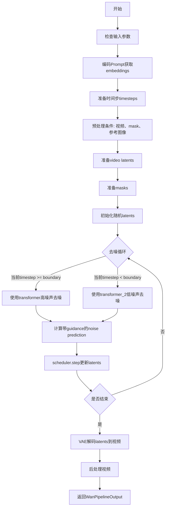
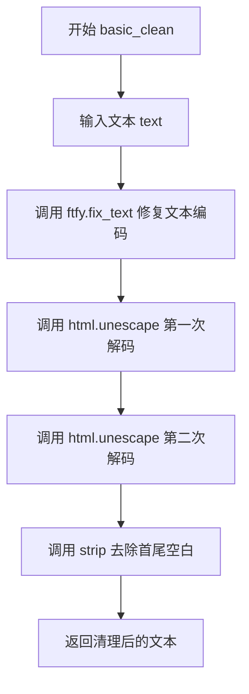
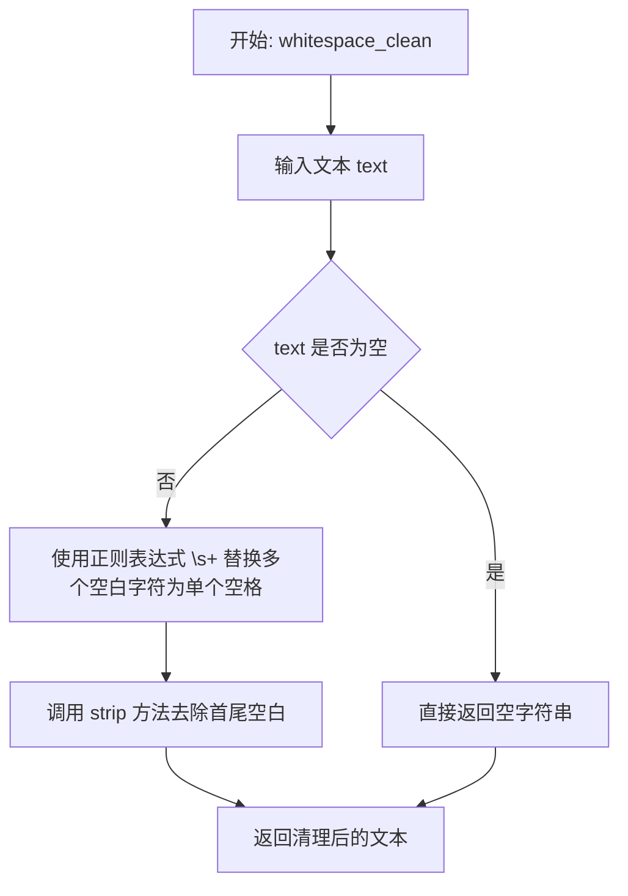
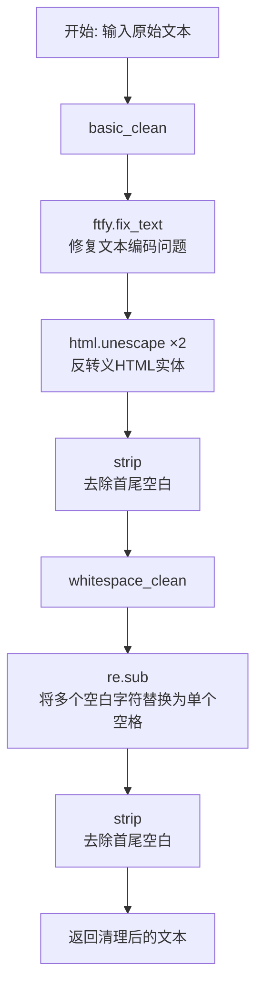
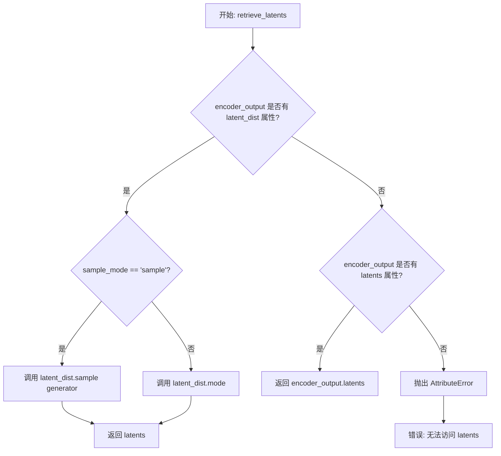
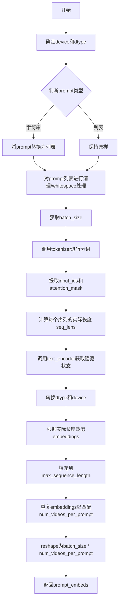
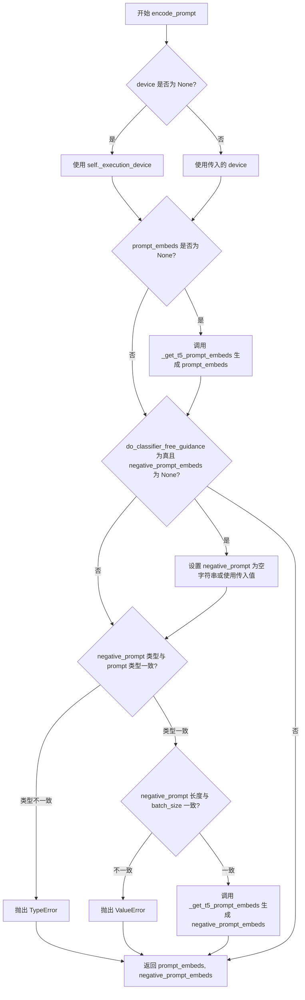
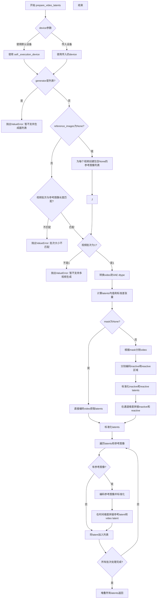
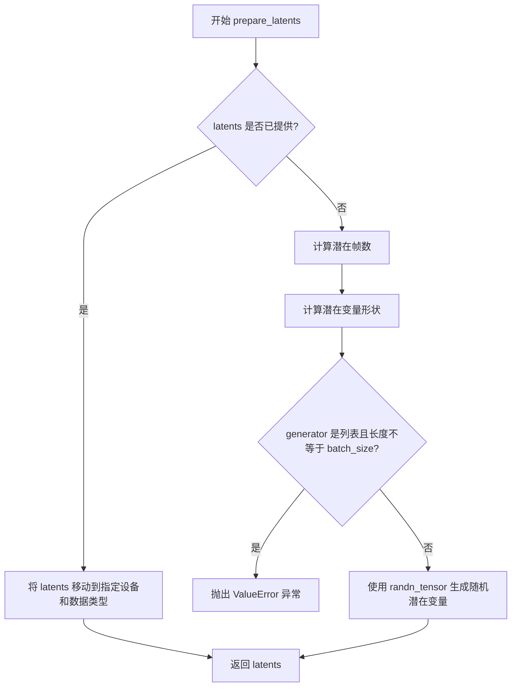

# `diffusers\src\diffusers\pipelines\wan\pipeline_wan_vace.py` 详细设计文档

WanVACEPipeline是一个基于扩散模型的视频生成和编辑Pipeline，支持文本提示引导、视频帧条件输入、mask控制区域生成、参考图像条件，以及双阶段去噪（高噪声和低噪声阶段使用不同的transformer模型）。该Pipeline继承自DiffusionPipeline，实现了视频到视频的生成和编辑功能。

## 整体流程



## 类结构

```
DiffusionPipeline (抽象基类)
└── WanVACEPipeline (视频生成Pipeline)
    └── WanLoraLoaderMixin (LoRA加载Mixin)
```

## 全局变量及字段


### `XLA_AVAILABLE`
    
是否支持XLA加速

类型：`bool`
    


### `logger`
    
日志记录器

类型：`logging.Logger`
    


### `EXAMPLE_DOC_STRING`
    
示例文档字符串

类型：`str`
    


### `WanVACEPipeline.WanVACEPipeline.model_cpu_offload_seq`
    
模型CPU卸载顺序

类型：`str`
    


### `WanVACEPipeline.WanVACEPipeline._callback_tensor_inputs`
    
回调张量输入列表

类型：`list`
    


### `WanVACEPipeline.WanVACEPipeline._optional_components`
    
可选组件列表

类型：`list`
    


### `WanVACEPipeline.WanVACEPipeline.vae_scale_factor_temporal`
    
时间VAE缩放因子

类型：`int`
    


### `WanVACEPipeline.WanVACEPipeline.vae_scale_factor_spatial`
    
空间VAE缩放因子

类型：`int`
    


### `WanVACEPipeline.WanVACEPipeline.video_processor`
    
视频处理器

类型：`VideoProcessor`
    
    

## 全局函数及方法


### `basic_clean`

该函数用于对文本进行基本清理，依次执行ftfy文本编码修复和双重HTML实体解码操作，以修复常见的文本编码问题和HTML实体残留。

参数：

- `text`：`str`，需要清理的原始文本

返回值：`str`，清理后的文本（已去除首尾空白字符）

#### 流程图



#### 带注释源码

```python
def basic_clean(text):
    """
    对文本进行基本清理：
    1. 使用 ftfy 修复文本编码问题（如UTF-8伪影、 Mojibake 等）
    2. 使用 html.unescape 双重解码HTML实体（如 & -> &）
    3. 去除首尾空白字符
    
    Args:
        text: 需要清理的原始文本
        
    Returns:
        清理后的文本
    """
    # 第一步：使用ftfy修复常见的文本编码问题
    # ftfy可以修复如 "é" -> "é" 这类Mojibake问题
    text = ftfy.fix_text(text)
    
    # 第二步：双重HTML解码，处理嵌套的HTML实体
    # 例如：& 经过第一次解码变成 &，第二次解码变成 &
    text = html.unescape(html.unescape(text))
    
    # 第三步：去除文本首尾的空白字符并返回
    return text.strip()
```


### `whitespace_clean`

该函数是一个文本预处理工具函数，用于清理输入文本中的多余空白字符，将连续多个空白字符替换为单个空格，并去除字符串首尾的空白字符，确保文本格式规范整洁。

参数：

- `text`：`str`，需要清理的原始文本字符串

返回值：`str`，返回清理后的文本字符串

#### 流程图



#### 带注释源码

```python
def whitespace_clean(text):
    """
    清理文本中的多余空白字符
    
    该函数执行以下操作:
    1. 将连续多个空白字符（包括空格、制表符、换行符等）替换为单个空格
    2. 去除字符串首尾的空白字符
    
    Args:
        text: 需要清理的原始文本字符串
        
    Returns:
        清理后的文本字符串
    """
    # 使用正则表达式将一个或多个空白字符（\s+）替换为单个空格
    text = re.sub(r"\s+", " ", text)
    # 去除字符串首尾的空白字符
    text = text.strip()
    # 返回清理后的文本
    return text
```

#### 相关上下文

该函数是文本预处理流水线的一部分，被 `prompt_clean` 函数调用：

```python
def prompt_clean(text):
    text = whitespace_clean(basic_clean(text))
    return text
```

整个处理流程为：
1. `basic_clean(text)` - 修复文本编码问题，解码 HTML 实体
2. `whitespace_clean(text)` - 清理多余空白字符

#### 潜在优化空间

1. **性能优化**：如果频繁调用，可以考虑预编译正则表达式 `re.compile(r"\s+")`
2. **功能增强**：可添加参数控制是否保留换行符等特定空白字符
3. **错误处理**：可添加对非字符串输入的类型检查和转换


### `prompt_clean`

组合的prompt清理函数，用于对原始文本进行两阶段清理：首先修复文本编码问题并反转义HTML实体，然后规范化空白字符，最终返回干净的文本。

参数：

- `text`：`str`，需要清理的原始prompt文本

返回值：`str`，清理后的文本

#### 流程图



#### 带注释源码

```python
def prompt_clean(text):
    """
    组合的prompt清理函数。
    
    该函数通过两阶段清理过程处理输入文本：
    1. basic_clean: 修复文本编码问题并反转义HTML实体
    2. whitespace_clean: 规范化空白字符（将多个连续空格合并为一个）
    
    Args:
        text: 需要清理的原始prompt文本
        
    Returns:
        清理后的文本字符串
    """
    # 第一阶段：basic_clean处理
    # - ftfy.fix_text: 修复常见的文本编码问题（如UTF-8编码错误）
    # - html.unescape ×2: 递归反转义HTML实体（如 & -> & -> &）
    # - strip: 去除首尾空白字符
    text = whitespace_clean(basic_clean(text))
    
    # 第二阶段：whitespace_clean处理
    # - re.sub(r"\s+", " ", text): 使用正则表达式将任意多个空白字符替换为单个空格
    # - strip: 再次去除首尾空白，确保输出干净
    return text
```


### `retrieve_latents`

从 VAE encoder 输出中提取 latent 表示。该函数支持从 latent 分布中采样或获取其模式值，也可以直接返回预计算的 latents。

参数：

- `encoder_output`：`torch.Tensor`，VAE encoder 的输出对象，通常包含 `latent_dist` 或 `latents` 属性
- `generator`：`torch.Generator | None`，可选的随机数生成器，用于控制采样随机性
- `sample_mode`：`str`，采样模式，"sample" 表示从分布中采样，"argmax" 表示获取分布的模式值

返回值：`torch.Tensor`，提取的 latent 张量

#### 流程图



#### 带注释源码

```python
# Copied from diffusers.pipelines.stable_diffusion.pipeline_stable_diffusion_img2img.retrieve_latents
def retrieve_latents(
    encoder_output: torch.Tensor, generator: torch.Generator | None = None, sample_mode: str = "sample"
):
    """
    从 VAE encoder 输出中提取 latent 表示。
    
    Args:
        encoder_output: VAE encoder 的输出，包含 latent_dist 或 latents 属性
        generator: 可选的随机数生成器，用于采样
        sample_mode: 采样模式，"sample" 或 "argmax"
    
    Returns:
        torch.Tensor: 提取的 latent 表示
    """
    # 检查 encoder_output 是否有 latent_dist 属性，并且采样模式为 "sample"
    if hasattr(encoder_output, "latent_dist") and sample_mode == "sample":
        # 从 latent 分布中采样，返回 latent 张量
        return encoder_output.latent_dist.sample(generator)
    # 检查 encoder_output 是否有 latent_dist 属性，并且采样模式为 "argmax"
    elif hasattr(encoder_output, "latent_dist") and sample_mode == "argmax":
        # 获取 latent 分布的模式值（均值或最大概率位置）
        return encoder_output.latent_dist.mode()
    # 检查 encoder_output 是否有直接的 latents 属性
    elif hasattr(encoder_output, "latents"):
        # 直接返回预计算的 latents
        return encoder_output.latents
    else:
        # 如果无法访问任何有效的 latent 表示，抛出属性错误
        raise AttributeError("Could not access latents of provided encoder_output")
```


### WanVACEPipeline.__init__

该方法是 WanVACEPipeline 类的构造函数，负责初始化可控生成管道所需的所有核心组件，包括 tokenizer、text_encoder、vae、scheduler、transformer 等，并通过注册模块和计算 VAE 缩放因子来完成管道的初始化设置。

参数：

- `tokenizer`：`AutoTokenizer`，T5 分词器，用于对文本提示进行分词处理
- `text_encoder`：`UMT5EncoderModel`，T5 文本编码器模型，用于将文本提示编码为隐藏状态
- `vae`：`AutoencoderKLWan`，VAE 模型，用于编码和解码视频到潜在表示
- `scheduler`：`FlowMatchEulerDiscreteScheduler`，调度器，用于在去噪过程中控制噪声调度
- `transformer`：`WanVACETransformer3DModel`，可选的变换器模型，用于高噪声阶段的去噪
- `transformer_2`：`WanVACETransformer3DModel`，可选的变换器模型，用于低噪声阶段的去噪
- `boundary_ratio`：`float | None`，可选，两阶段去明切换边界的时间步比率

返回值：`None`，构造函数不返回任何值

#### 流程图

```mermaid
flowchart TD
    A[开始 __init__] --> B[调用 super().__init__]
    B --> C[register_modules: 注册 vae, text_encoder, tokenizer, transformer, transformer_2, scheduler]
    C --> D[register_to_config: 注册 boundary_ratio]
    D --> E{self.vae 是否存在}
    E -->|是| F[计算 vae_scale_factor_temporal = 2 ** sum(vae.temperal_downsample)]
    E -->|否| G[vae_scale_factor_temporal = 4]
    F --> H[计算 vae_scale_factor_spatial = 2 ** len(vae.temperal_downsample)]
    G --> H
    H --> I[创建 VideoProcessor 实例]
    I --> J[结束 __init__]
```

#### 带注释源码

```python
def __init__(
    self,
    tokenizer: AutoTokenizer,
    text_encoder: UMT5EncoderModel,
    vae: AutoencoderKLWan,
    scheduler: FlowMatchEulerDiscreteScheduler,
    transformer: WanVACETransformer3DModel = None,
    transformer_2: WanVACETransformer3DModel = None,
    boundary_ratio: float | None = None,
):
    """
    初始化 WanVACEPipeline 管道实例。
    
    参数:
        tokenizer: T5 分词器，用于文本预处理
        text_encoder: T5 编码器模型，用于生成文本嵌入
        vae: Wan VAE 模型，用于潜在空间编码/解码
        scheduler: 流匹配欧拉离散调度器
        transformer: 主变换器模型（高噪声阶段）
        transformer_2: 第二变换器模型（低噪声阶段，可选）
        boundary_ratio: 两阶段去噪的边界时间步比率
    """
    # 调用父类 DiffusionPipeline 的初始化方法
    # 设置管道的基本属性和执行设备
    super().__init__()

    # 使用 register_modules 注册所有子模块
    # 这些模块将被管道管理，可通过 pipeline.vae, pipeline.text_encoder 等访问
    self.register_modules(
        vae=vae,
        text_encoder=text_encoder,
        tokenizer=tokenizer,
        transformer=transformer,
        transformer_2=transformer_2,
        scheduler=scheduler,
    )
    
    # 将 boundary_ratio 注册到配置中
    # 用于控制两阶段去明的时间步边界
    self.register_to_config(boundary_ratio=boundary_ratio)
    
    # 计算 VAE 的时间缩放因子
    # 用于将视频帧数映射到潜在空间的帧数
    # 如果 vae 存在，使用 vae 的 temperal_downsample 属性计算
    # 否则使用默认值 4
    self.vae_scale_factor_temporal = 2 ** sum(self.vae.temperal_downsample) if getattr(self, "vae", None) else 4
    
    # 计算 VAE 的空间缩放因子
    # 用于将图像高度和宽度映射到潜在空间
    # 使用 temperal_downsample 的长度计算（这里实际上应该是 spatial_downsample）
    self.vae_scale_factor_spatial = 2 ** len(self.vae.temperal_downsample) if getattr(self, "vae", None) else 8
    
    # 创建视频处理器实例
    # 用于视频的预处理和后处理操作
    self.video_processor = VideoProcessor(vae_scale_factor=self.vae_scale_factor_spatial)
```


### `WanVACEPipeline._get_t5_prompt_embeds`

该方法将文本提示词（prompt）编码为T5文本编码器的隐藏状态向量（embedding），用于后续的视频生成过程。

参数：

- `prompt`：`str | list[str]`，要编码的文本提示词，可以是单个字符串或字符串列表
- `num_videos_per_prompt`：`int`，每个提示词要生成的视频数量，默认为1
- `max_sequence_length`：`int`，文本编码器的最大序列长度，默认为226
- `device`：`torch.device | None`，执行设备，默认为None（会自动获取执行设备）
- `dtype`：`torch.dtype | None`，数据类型，默认为None（会使用text_encoder的dtype）

返回值：`torch.Tensor`，返回形状为`(batch_size * num_videos_per_prompt, seq_len, hidden_dim)`的文本嵌入张量

#### 流程图



#### 带注释源码

```python
# 从diffusers.pipelines.wan.pipeline_wan.WanPipeline._get_t5_prompt_embeds复制
def _get_t5_prompt_embeds(
    self,
    prompt: str | list[str] = None,  # 输入的文本提示词
    num_videos_per_prompt: int = 1,  # 每个提示词生成的视频数量
    max_sequence_length: int = 226,  # T5编码器的最大序列长度
    device: torch.device | None = None,  # 计算设备
    dtype: torch.dtype | None = None,  # 数据类型
):
    # 确定设备：如果未指定，则使用执行设备
    device = device or self._execution_device
    # 确定数据类型：如果未指定，则使用text_encoder的数据类型
    dtype = dtype or self.text_encoder.dtype

    # 确保prompt为列表格式（如果是字符串则包装为列表）
    prompt = [prompt] if isinstance(prompt, str) else prompt
    # 对每个prompt进行清理：去除HTML实体、修正ftfy问题、合并多余空白
    prompt = [prompt_clean(u) for u in prompt]
    # 获取批次大小
    batch_size = len(prompt)

    # 使用tokenizer对prompt进行分词
    # padding="max_length": 填充到最大长度
    # truncation=True: 截断超长序列
    # add_special_tokens=True: 添加特殊token（如EOS、BOS等）
    # return_attention_mask=True: 返回注意力掩码
    # return_tensors="pt": 返回PyTorch张量
    text_inputs = self.tokenizer(
        prompt,
        padding="max_length",
        max_length=max_sequence_length,
        truncation=True,
        add_special_tokens=True,
        return_attention_mask=True,
        return_tensors="pt",
    )
    # 提取分词后的input_ids和attention_mask
    text_input_ids, mask = text_inputs.input_ids, text_inputs.attention_mask
    # 计算每个序列的实际长度（非填充token的数量）
    seq_lens = mask.gt(0).sum(dim=1).long()

    # 调用T5文本编码器获取隐藏状态
    # 将input_ids和attention_mask移到指定设备
    prompt_embeds = self.text_encoder(text_input_ids.to(device), mask.to(device)).last_hidden_state
    # 转换embeddings的数据类型和设备
    prompt_embeds = prompt_embeds.to(dtype=dtype, device=device)
    # 根据实际序列长度裁剪embeddings（去除填充部分）
    prompt_embeds = [u[:v] for u, v in zip(prompt_embeds, seq_lens)]
    # 将裁剪后的embeddings填充回max_sequence_length
    # 使用new_zeros创建与原始长度相同长度的零张量进行填充
    prompt_embeds = torch.stack(
        [torch.cat([u, u.new_zeros(max_sequence_length - u.size(0), u.size(1))]) for u in prompt_embeds], dim=0
    )

    # 复制text embeddings以匹配每个prompt生成的视频数量
    # 使用mps友好的方法（repeat而不是逐个复制）
    _, seq_len, _ = prompt_embeds.shape
    # 在序列维度上重复
    prompt_embeds = prompt_embeds.repeat(1, num_videos_per_prompt, 1)
    # 重塑为批次大小 * num_videos_per_prompt
    prompt_embeds = prompt_embeds.view(batch_size * num_videos_per_prompt, seq_len, -1)

    # 返回处理后的prompt embeddings
    return prompt_embeds
```


### `WanVACEPipeline.encode_prompt`

该方法将文本提示词编码为文本编码器的隐藏状态，用于后续的视频生成过程。它支持分类器自由引导（Classifier-Free Guidance），可以同时处理正面提示词和负面提示词，并返回相应的文本嵌入向量。

参数：

- `prompt`：`str | list[str]`，要编码的提示词，可以是单个字符串或字符串列表
- `negative_prompt`：`str | list[str] | None`，不引导图像生成的提示词，用于负面条件，当不使用引导时会被忽略
- `do_classifier_free_guidance`：`bool`，是否使用分类器自由引导，默认为 True
- `num_videos_per_prompt`：`int`，每个提示词生成的视频数量，默认为 1
- `prompt_embeds`：`torch.Tensor | None`，预生成的文本嵌入，可用于轻松调整文本输入
- `negative_prompt_embeds`：`torch.Tensor | None`，预生成的负面文本嵌入，可用于轻松调整文本输入
- `max_sequence_length`：`int`，文本编码器的最大序列长度，默认为 226
- `device`：`torch.device | None`，torch 设备，默认为执行设备
- `dtype`：`torch.dtype | None`，torch 数据类型，默认为文本编码器的数据类型

返回值：`tuple[torch.Tensor, torch.Tensor]`，返回编码后的提示词嵌入和负面提示词嵌入

#### 流程图



#### 带注释源码

```python
def encode_prompt(
    self,
    prompt: str | list[str],
    negative_prompt: str | list[str] | None = None,
    do_classifier_free_guidance: bool = True,
    num_videos_per_prompt: int = 1,
    prompt_embeds: torch.Tensor | None = None,
    negative_prompt_embeds: torch.Tensor | None = None,
    max_sequence_length: int = 226,
    device: torch.device | None = None,
    dtype: torch.dtype | None = None,
):
    r"""
    Encodes the prompt into text encoder hidden states.

    Args:
        prompt (`str` or `list[str]`, *optional*):
            prompt to be encoded
        negative_prompt (`str` or `list[str]`, *optional*):
            The prompt or prompts not to guide the image generation. If not defined, one has to pass
            `negative_prompt_embeds` instead. Ignored when not using guidance (i.e., ignored if `guidance_scale` is
            less than `1`).
        do_classifier_free_guidance (`bool`, *optional*, defaults to `True`):
            Whether to use classifier free guidance or not.
        num_videos_per_prompt (`int`, *optional*, defaults to 1):
            Number of videos that should be generated per prompt. torch device to place the resulting embeddings on
        prompt_embeds (`torch.Tensor`, *optional*):
            Pre-generated text embeddings. Can be used to easily tweak text inputs, *e.g.* prompt weighting. If not
            provided, text embeddings will be generated from `prompt` input argument.
        negative_prompt_embeds (`torch.Tensor`, *optional*):
            Pre-generated negative text embeddings. Can be used to easily tweak text inputs, *e.g.* prompt
            weighting. If not provided, negative_prompt_embeds will be generated from `negative_prompt` input
            argument.
        device: (`torch.device`, *optional*):
            torch device
        dtype: (`torch.dtype`, *optional*):
            torch dtype
    """
    # 确定设备：如果未指定，则使用执行设备
    device = device or self._execution_device

    # 如果 prompt 是字符串，转换为单元素列表；否则保持不变
    prompt = [prompt] if isinstance(prompt, str) else prompt
    
    # 确定批次大小：如果有 prompt 则使用其长度，否则使用 prompt_embeds 的批次大小
    if prompt is not None:
        batch_size = len(prompt)
    else:
        batch_size = prompt_embeds.shape[0]

    # 如果未提供 prompt_embeds，则从 prompt 生成
    if prompt_embeds is None:
        prompt_embeds = self._get_t5_prompt_embeds(
            prompt=prompt,
            num_videos_per_prompt=num_videos_per_prompt,
            max_sequence_length=max_sequence_length,
            device=device,
            dtype=dtype,
        )

    # 如果启用分类器自由引导且未提供负面提示词嵌入，则生成负面提示词嵌入
    if do_classifier_free_guidance and negative_prompt_embeds is None:
        # 如果未提供负面提示词，则使用空字符串
        negative_prompt = negative_prompt or ""
        # 将负面提示词扩展为与批次大小相同
        negative_prompt = batch_size * [negative_prompt] if isinstance(negative_prompt, str) else negative_prompt

        # 类型检查：负面提示词类型必须与提示词类型一致
        if prompt is not None and type(prompt) is not type(negative_prompt):
            raise TypeError(
                f"`negative_prompt` should be the same type to `prompt`, but got {type(negative_prompt)} !="
                f" {type(prompt)}."
            )
        # 批次大小检查：负面提示词数量必须与提示词数量一致
        elif batch_size != len(negative_prompt):
            raise ValueError(
                f"`negative_prompt`: {negative_prompt} has batch size {len(negative_prompt)}, but `prompt`:"
                f" {prompt} has batch size {batch_size}. Please make sure that passed `negative_prompt` matches"
                " the batch size of `prompt`."
            )

        # 从负面提示词生成嵌入
        negative_prompt_embeds = self._get_t5_prompt_embeds(
            prompt=negative_prompt,
            num_videos_per_prompt=num_videos_per_prompt,
            max_sequence_length=max_sequence_length,
            device=device,
            dtype=dtype,
        )

    # 返回提示词嵌入和负面提示词嵌入
    return prompt_embeds, negative_prompt_embeds
```


### `WanVACEPipeline.check_inputs`

该方法是 WanVACEPipeline 类的输入验证方法，用于在管道执行前检查所有输入参数的有效性，包括 transformer 组件存在性、尺寸对齐、回调张量合法性、prompt 与 embeds 互斥性、video/mask/reference_images 的一致性等，确保后续推理过程能够正常运行。

参数：

- `prompt`：`str | list[str] | None`，用户提供的文本提示，用于指导视频生成
- `negative_prompt`：`str | list[str] | None`，用于反向引导的负向提示
- `height`：`int`，生成视频的高度（像素）
- `width`：`int`，生成视频的宽度（像素）
- `prompt_embeds`：`torch.Tensor | None`，预先计算好的文本嵌入，与 prompt 互斥
- `negative_prompt_embeds`：`torch.Tensor | None`，预先计算好的负向文本嵌入，与 negative_prompt 互斥
- `callback_on_step_end_tensor_inputs`：`list[str] | None`，在每个推理步骤结束时需要回调的张量输入列表
- `video`：`list[PipelineImageInput] | None`，输入视频帧列表，用于条件生成
- `mask`：`list[PipelineImageInput] | None`，视频掩码列表，指定需要生成或保留的区域
- `reference_images`：`PIL.Image.Image | list[PIL.Image.Image] | list[list[PIL.Image.Image]] | None`，参考图像列表，用于额外的条件控制
- `guidance_scale_2`：`float | None`，第二阶段 transformer 的引导缩放因子，仅在 boundary_ratio 不为空时有效

返回值：`None`，该方法不返回任何值，仅通过抛出 ValueError 来处理验证失败的情况

#### 流程图

```mermaid
flowchart TD
    A[开始 check_inputs] --> B{transformer 或 transformer_2 是否存在}
    B -- 否 --> C[抛出 ValueError: 必须设置 transformer 或 transformer_2]
    B -- 是 --> D[计算 base = vae_scale_factor_spatial × patch_size]
    D --> E{height % base == 0 且 width % base == 0?}
    E -- 否 --> F[抛出 ValueError: 高度和宽度必须能被 base 整除]
    E -- 是 --> G{callback_on_step_end_tensor_inputs 合法性检查}
    G -- 不合法 --> H[抛出 ValueError: 回调张量输入不在允许列表中]
    G -- 合法 --> I{guidance_scale_2 是否提供且 boundary_ratio 为空?}
    I -- 是 --> J[抛出 ValueError: guidance_scale_2 需要 boundary_ratio 不为空]
    I -- 否 --> K{prompt 和 prompt_embeds 同时提供?}
    K -- 是 --> L[抛出 ValueError: 不能同时提供 prompt 和 prompt_embeds]
    K -- 否 --> M{negative_prompt 和 negative_prompt_embeds 同时提供?}
    M -- 是 --> N[抛出 ValueError: 不能同时提供 negative_prompt 和 negative_prompt_embeds]
    M -- 否 --> O{prompt 和 prompt_embeds 都未提供?}
    O -- 是 --> P[抛出 ValueError: 必须提供 prompt 或 prompt_embeds 之一]
    O -- 否 --> Q{prompt 类型检查]
    Q -- 不是 str 或 list --> R[抛出 ValueError: prompt 必须是 str 或 list]
    Q -- 合法 --> S{negative_prompt 类型检查]
    S -- 不是 str 或 list --> T[抛出 ValueError: negative_prompt 必须是 str 或 list]
    S -- 合法 --> U{video 是否提供?]
    U -- 是 --> V{mask 是否提供?}
    V -- 是 --> W{video 和 mask 长度是否一致?]
    W -- 不一致 --> X[抛出 ValueError: video 和 mask 长度不一致]
    W -- 一致 --> Y{reference_images 是否提供?]
    Y -- 是 --> Z[检查 reference_images 类型合法性]
    Z -- 不合法 --> AA[抛出 ValueError: reference_images 类型不合法]
    Z -- 合法 --> AB{是否为单批次列表嵌套?}
    AB -- 是且长度不为1 --> AC[抛出 ValueError: 只能生成一个视频]
    AB -- 否 --> AD[验证通过，方法结束]
    V -- 否 --> AD
    U -- 否 --> AE{mask 是否单独提供?}
    AE -- 是 --> AF[抛出 ValueError: mask 必须和 video 一起提供]
    AE -- 否 --> AD
    O -- 否 --> AD
```

#### 带注释源码

```python
def check_inputs(
    self,
    prompt,                          # 文本提示
    negative_prompt,                 # 负向提示
    height,                          # 输出高度
    width,                           # 输出宽度
    prompt_embeds=None,              # 预计算的提示嵌入
    negative_prompt_embeds=None,     # 预计算的负向提示嵌入
    callback_on_step_end_tensor_inputs=None,  # 回调张量输入列表
    video=None,                      # 输入视频帧
    mask=None,                        # 视频掩码
    reference_images=None,           # 参考图像
    guidance_scale_2=None,           # 第二阶段引导因子
):
    # 步骤1: 验证 transformer 组件是否已配置
    # 需要至少一个 transformer 才能执行推理
    if self.transformer is not None:
        # 计算基础尺寸: VAE空间缩放因子 × Transformer的patch大小
        base = self.vae_scale_factor_spatial * self.transformer.config.patch_size[1]
    elif self.transformer_2 is not None:
        base = self.vae_scale_factor_spatial * self.transformer_2.config.patch_size[1]
    else:
        raise ValueError(
            "`transformer` or `transformer_2` component must be set in order to run inference with this pipeline"
        )

    # 步骤2: 验证输出尺寸对齐
    # 高度和宽度必须能被基础尺寸整除，以确保patch处理正确
    if height % base != 0 or width % base != 0:
        raise ValueError(f"`height` and `width` have to be divisible by {base} but are {height} and {width}.")

    # 步骤3: 验证回调张量输入的合法性
    # 所有回调张量必须在管道的允许列表中
    if callback_on_step_end_tensor_inputs is not None and not all(
        k in self._callback_tensor_inputs for k in callback_on_step_end_tensor_inputs
    ):
        raise ValueError(
            f"`callback_on_step_end_tensor_inputs` has to be in {self._callback_tensor_inputs}, but found {[k for k in callback_on_step_end_tensor_inputs if k not in self._callback_tensor_inputs]}"
        )
    
    # 步骤4: 验证 guidance_scale_2 的使用条件
    # 该参数仅在配置了双阶段去噪时有效
    if self.config.boundary_ratio is None and guidance_scale_2 is not None:
        raise ValueError("`guidance_scale_2` is only supported when the pipeline's `boundary_ratio` is not None.")

    # 步骤5: 验证 prompt 和 prompt_embeds 的互斥性
    # 两者不能同时提供，只能选择其一
    if prompt is not None and prompt_embeds is not None:
        raise ValueError(
            f"Cannot forward both `prompt`: {prompt} and `prompt_embeds`: {prompt_embeds}. Please make sure to"
            " only forward one of the two."
        )
    
    # 步骤6: 验证 negative_prompt 和 negative_prompt_embeds 的互斥性
    elif negative_prompt is not None and negative_prompt_embeds is not None:
        raise ValueError(
            f"Cannot forward both `negative_prompt`: {negative_prompt} and `negative_prompt_embeds`: {negative_prompt_embeds}. Please make sure to"
            " only forward one of the two."
        )
    
    # 步骤7: 验证至少提供一种文本输入方式
    elif prompt is None and prompt_embeds is None:
        raise ValueError(
            "Provide either `prompt` or `prompt_embeds`. Cannot leave both `prompt` and `prompt_embeds` undefined."
        )
    
    # 步骤8: 验证 prompt 的类型合法性
    elif prompt is not None and (not isinstance(prompt, str) and not isinstance(prompt, list)):
        raise ValueError(f"`prompt` has to be of type `str` or `list` but is {type(prompt)}")
    
    # 步骤9: 验证 negative_prompt 的类型合法性
    elif negative_prompt is not None and (
        not isinstance(negative_prompt, str) and not isinstance(negative_prompt, list)
    ):
        raise ValueError(f"`negative_prompt` has to be of type `str` or `list` but is {type(negative_prompt)}")

    # 步骤10: 验证 video、mask 和 reference_images 的一致性
    if video is not None:
        # 如果提供了 mask，必须与 video 长度一致
        if mask is not None:
            if len(video) != len(mask):
                raise ValueError(
                    f"Length of `video` {len(video)} and `mask` {len(mask)} do not match. Please make sure that"
                    " they have the same length."
                )
        # 验证 reference_images 的类型合法性
        if reference_images is not None:
            is_pil_image = isinstance(reference_images, PIL.Image.Image)
            is_list_of_pil_images = isinstance(reference_images, list) and all(
                isinstance(ref_img, PIL.Image.Image) for ref_img in reference_images
            )
            is_list_of_list_of_pil_images = isinstance(reference_images, list) and all(
                isinstance(ref_img, list) and all(isinstance(ref_img_, PIL.Image.Image) for ref_img_ in ref_img)
                for ref_img in reference_images
            )
            if not (is_pil_image or is_list_of_pil_images or is_list_of_list_of_pil_images):
                raise ValueError(
                    "`reference_images` has to be of type `PIL.Image.Image` or `list` of `PIL.Image.Image`, or "
                    "`list` of `list` of `PIL.Image.Image`, but is {type(reference_images)}"
                )
            # 嵌套列表形式只支持单批次生成
            if is_list_of_list_of_pil_images and len(reference_images) != 1:
                raise ValueError(
                    "The pipeline only supports generating one video at a time at the moment. When passing a list "
                    "of list of reference images, where the outer list corresponds to the batch size and the inner "
                    "list corresponds to list of conditioning images per video, please make sure to only pass "
                    "one inner list of reference images (i.e., `[[<image1>, <image2>, ...]]`"
                )
    # mask 不能单独提供，必须与 video 一起使用
    elif mask is not None:
        raise ValueError("`mask` can only be passed if `video` is passed as well.")
```


### WanVACEPipeline.preprocess_conditions

该方法负责预处理视频条件输入，包括视频帧、掩码和参考图像。它将 PIL 图像转换为 PyTorch 张量，进行必要的尺寸调整和验证，确保输入符合 VAE 和 Transformer 模型的要求，并返回处理后的视频张量、掩码张量和参考图像列表。

参数：

- `video`：`list[PipelineImageInput] | None`，输入视频帧列表，每帧可以是 PIL.Image、numpy 数组或 torch.Tensor
- `mask`：`list[PipelineImageInput] | None`，输入掩码列表，用于指定视频的条件生成区域，黑色表示条件区域，白色表示生成区域
- `reference_images`：`PIL.Image.Image | list[PIL.Image.Image] | list[list[PIL.Image.Image]] | None`，参考图像，用于额外的条件控制，可以是单张图像、图像列表或批量的图像列表
- `batch_size`：`int`，批次大小，默认为 1
- `height`：`int`，目标高度，默认为 480
- `width`：`int`，目标宽度，默认为 832
- `num_frames`：`int`，视频帧数，默认为 81
- `dtype`：`torch.dtype | None`，输出张量的数据类型
- `device`：`torch.device | None`，输出张量的设备

返回值：`(torch.Tensor, torch.Tensor, list[list[torch.Tensor]])`，返回一个元组，包含处理后的视频张量（形状为 [batch_size, 3, num_frames, height, width]）、处理后的掩码张量（形状与视频相同）、以及预处理后的参考图像列表（外层列表对应视频批次，内层列表对应每个视频的参考图像）

#### 流程图

```mermaid
flowchart TD
    A[开始 preprocess_conditions] --> B{video 是否为 None}
    B -->|否| C[计算基础尺寸 base]
    B -->|是| D[创建零张量 video]
    C --> E[获取视频默认宽高]
    E --> F{视频尺寸是否超过目标尺寸}
    F -->|是| G[按比例缩放视频尺寸]
    F -->|否| H[保持原尺寸]
    G --> I{高度和宽度是否能被 base 整除}
    H --> I
    I -->|否| J[调整尺寸使其可整除]
    I -->|是| K[视频预处理]
    D --> L[使用用户提供的尺寸]
    J --> K
    K --> M[设置 image_size]
    L --> M
    M --> N{mask 是否为 None}
    N -->|否| O[预处理 mask 并归一化到 [0,1]]
    N -->|是| P[创建全 1 掩码]
    O --> Q[转换 video 和 mask 到指定设备和数据类型]
    P --> Q
    Q --> R{reference_images 类型检查]
    R --> S[标准化为嵌套列表格式]
    S --> T[验证 video 批次与 reference_images 长度匹配]
    T --> U[验证所有批次的参考图像长度一致]
    U --> V[遍历每个批次的参考图像]
    V --> W{图像是否为 None}
    W -->|是| X[跳过]
    W -->|否| Y[预处理图像]
    Y --> Z[计算缩放比例]
    Z --> AA[调整图像大小]
    AA --> AB[创建画布并居中粘贴]
    AB --> AC[添加到预处理列表]
    X --> AD[处理下一个参考图像]
    AC --> AD
    AD --> AE[所有批次处理完成]
    AE --> AF[返回 video, mask, reference_images_preprocessed]
```

#### 带注释源码

```python
def preprocess_conditions(
    self,
    video: list[PipelineImageInput] | None = None,
    mask: list[PipelineImageInput] | None = None,
    reference_images: PIL.Image.Image | list[PIL.Image.Image] | list[list[PIL.Image.Image]] | None = None,
    batch_size: int = 1,
    height: int = 480,
    width: int = 832,
    num_frames: int = 81,
    dtype: torch.dtype | None = None,
    device: torch.device | None = None,
):
    # 处理视频输入：如果提供了视频，则进行预处理；否则创建零张量
    if video is not None:
        # 计算基础尺寸，用于尺寸对齐检查
        base = self.vae_scale_factor_spatial * (
            self.transformer.config.patch_size[1]
            if self.transformer is not None
            else self.transformer_2.config.patch_size[1]
        )
        # 获取视频的默认高度和宽度
        video_height, video_width = self.video_processor.get_default_height_width(video[0])

        # 如果视频尺寸超过目标尺寸，按比例缩放
        if video_height * video_width > height * width:
            scale = min(width / video_width, height / video_height)
            video_height, video_width = int(video_height * scale), int(video_width * scale)

        # 检查并调整视频尺寸使其能被 base 整除
        if video_height % base != 0 or video_width % base != 0:
            logger.warning(
                f"Video height and width should be divisible by {base}, but got {video_height} and {video_width}. "
            )
            video_height = (video_height // base) * base
            video_width = (video_width // base) * base

        # 确保调整后的尺寸不超过目标尺寸
        assert video_height * video_width <= height * width

        # 使用视频处理器预处理视频
        video = self.video_processor.preprocess_video(video, video_height, video_width)
        # 使用视频的高度/宽度（可能经过缩放）
        image_size = (video_height, video_width)
    else:
        # 如果没有提供视频，创建零张量作为占位符
        video = torch.zeros(batch_size, 3, num_frames, height, width, dtype=dtype, device=device)
        # 使用用户提供的目标高度和宽度
        image_size = (height, width)

    # 处理掩码：如果提供了掩码，则预处理并归一化；否则创建全 1 掩码
    if mask is not None:
        mask = self.video_processor.preprocess_video(mask, image_size[0], image_size[1])
        # 将掩码从 [-1, 1] 归一化到 [0, 1]
        mask = torch.clamp((mask + 1) / 2, min=0, max=1)
    else:
        # 创建与视频形状相同的全 1 掩码
        mask = torch.ones_like(video)

    # 将视频和掩码转换到指定的设备和数据类型
    video = video.to(dtype=dtype, device=device)
    mask = mask.to(dtype=dtype, device=device)

    # 处理参考图像，将其标准化为嵌套列表格式
    # 外层列表对应视频批次大小，内层列表对应每个视频的参考图像列表
    if reference_images is None or isinstance(reference_images, PIL.Image.Image):
        # 单张图像或 None，包装为批量列表
        reference_images = [[reference_images] for _ in range(video.shape[0])]
    elif isinstance(reference_images, (list, tuple)) and isinstance(next(iter(reference_images)), PIL.Image.Image):
        # 图像列表，包装为单批次
        reference_images = [reference_images]
    elif (
        isinstance(reference_images, (list, tuple))
        and isinstance(next(iter(reference_images)), list)
        and isinstance(next(iter(reference_images[0])), PIL.Image.Image)
    ):
        # 已经是嵌套列表格式，保持不变
        reference_images = reference_images
    else:
        raise ValueError(
            "`reference_images` has to be of type `PIL.Image.Image` or `list` of `PIL.Image.Image`, or "
            "`list` of `list` of `PIL.Image.Image`, but is {type(reference_images)}"
        )

    # 验证视频批次与参考图像批次长度匹配
    if video.shape[0] != len(reference_images):
        raise ValueError(
            f"Batch size of `video` {video.shape[0]} and length of `reference_images` {len(reference_images)} does not match."
        )

    # 验证所有批次的参考图像长度一致
    ref_images_lengths = [len(reference_images_batch) for reference_images_batch in reference_images]
    if any(l != ref_images_lengths[0] for l in ref_images_lengths):
        raise ValueError(
            f"All batches of `reference_images` should have the same length, but got {ref_images_lengths}. Support for this "
            "may be added in the future."
        )

    # 预处理每个参考图像
    reference_images_preprocessed = []
    for i, reference_images_batch in enumerate(reference_images):
        preprocessed_images = []
        for j, image in enumerate(reference_images_batch):
            if image is None:
                continue  # 跳过 None 图像
            # 预处理单张图像
            image = self.video_processor.preprocess(image, None, None)
            img_height, img_width = image.shape[-2:]
            # 计算缩放比例，使图像适应目标尺寸
            scale = min(image_size[0] / img_height, image_size[1] / img_width)
            new_height, new_width = int(img_height * scale), int(img_width * scale)
            # 调整图像大小
            resized_image = torch.nn.functional.interpolate(
                image, size=(new_height, new_width), mode="bilinear", align_corners=False
            ).squeeze(0)  # [C, H, W]
            # 计算居中粘贴的位置
            top = (image_size[0] - new_height) // 2
            left = (image_size[1] - new_width) // 2
            # 创建画布并居中粘贴调整大小后的图像
            canvas = torch.ones(3, *image_size, device=device, dtype=dtype)
            canvas[:, top : top + new_height, left : left + new_width] = resized_image
            preprocessed_images.append(canvas)
        reference_images_preprocessed.append(preprocessed_images)

    return video, mask, reference_images_preprocessed
```


### WanVACEPipeline.prepare_video_latents

该方法负责将输入的视频帧、掩码和参考图像编码为潜在向量（latents），为后续的扩散模型去噪过程准备条件潜在向量。该方法支持无掩码直接编码、有掩码的区域感知编码，以及多参考图像的条件编码。

参数：

- `self`：`WanVACEPipeline` 实例本身
- `video`：`torch.Tensor`，输入的视频张量，形状为 `[B, C, F, H, W]`，其中 B 是批次大小，C 是通道数，F 是帧数，H 是高度，W 是宽度
- `mask`：`torch.Tensor`，可选的掩码张量，用于指定需要重新生成（白色）与保持不变（黑色）的区域，形状与 video 相匹配
- `reference_images`：`list[list[torch.Tensor]] | None`，可选的参考图像列表，外层列表对应视频批次，内层列表对应每个视频的多张参考图像
- `generator`：`torch.Generator | list[torch.Generator] | None`，可选的随机数生成器，用于确保生成的可重复性
- `device`：`torch.device | None`，可选的目标设备，默认为执行设备

返回值：`torch.Tensor`，处理后的条件潜在向量，包含视频潜在表示和参考图像潜在表示的拼接结果

#### 流程图



#### 带注释源码

```python
def prepare_video_latents(
    self,
    video: torch.Tensor,
    mask: torch.Tensor,
    reference_images: list[list[torch.Tensor]] | None = None,
    generator: torch.Generator | list[torch.Generator] | None = None,
    device: torch.device | None = None,
) -> torch.Tensor:
    """
    准备视频潜在向量，用于条件扩散生成。
    
    该方法将输入视频帧、掩码和参考图像编码为潜在空间表示，
    支持无掩码直接编码、掩码区域分割编码和多参考图像条件编码。
    
    Args:
        video: 输入视频张量 [B, C, F, H, W]
        mask: 可选掩码，指定需要生成的区域 [B, C, F, H, W]
        reference_images: 可选的参考图像列表，用于额外的条件信息
        generator: 随机数生成器，用于可重复生成
        device: 目标计算设备
    
    Returns:
        处理后的条件潜在向量张量
    """
    # 确定执行设备，优先使用传入的设备，否则使用管道默认执行设备
    device = device or self._execution_device

    # 检查generator类型，如果传入列表则抛出异常（当前不支持）
    if isinstance(generator, list):
        raise ValueError("Passing a list of generators is not yet supported. This may be supported in the future.")

    # 处理参考图像：如果未提供，则为每个视频创建一个包含None的列表
    # 这确保了后续处理的一致性，无论用户是否提供了参考图像
    if reference_images is None:
        reference_images = [[None] for _ in range(video.shape[0])]
    else:
        # 验证视频批次大小与参考图像列表长度是否匹配
        if video.shape[0] != len(reference_images):
            raise ValueError(
                f"Batch size of `video` {video.shape[0]} and length of `reference_images` {len(reference_images)} does not match."
            )

    # 当前仅支持单视频生成，多视频支持待实现
    if video.shape[0] != 1:
        raise ValueError(
            "Generating with more than one video is not yet supported. This may be supported in the future."
        )

    # 获取VAE的数据类型，并将视频转换到该类型
    vae_dtype = self.vae.dtype
    video = video.to(dtype=vae_dtype)

    # 从VAE配置中获取潜在向量的均值和标准差
    # 这些值用于将潜在向量标准化到标准正态空间
    latents_mean = torch.tensor(self.vae.config.latents_mean, device=device, dtype=torch.float32).view(
        1, self.vae.config.z_dim, 1, 1, 1
    )
    latents_std = 1.0 / torch.tensor(self.vae.config.latents_std, device=device, dtype=torch.float32).view(
        1, self.vae.config.z_dim, 1, 1, 1
    )

    # 根据是否有掩码执行不同的编码策略
    if mask is None:
        # 无掩码情况：直接编码整个视频
        # 使用argmax模式从VAE的潜在分布中采样
        latents = retrieve_latents(self.vae.encode(video), generator, sample_mode="argmax").unbind(0)
        # 标准化潜在向量：减去均值乘以标准差
        latents = ((latents.float() - latents_mean) * latents_std).to(vae_dtype)
    else:
        # 有掩码情况：将视频分割为两部分处理
        # 掩码值为1.0表示需要生成的区域(reactive)，0.0表示保持不变的区域(inactive)
        mask = torch.where(mask > 0.5, 1.0, 0.0).to(dtype=vae_dtype)
        
        # inactive区域：保留原始视频内容的位置
        inactive = video * (1 - mask)
        # reactive区域：需要重新生成的位置
        reactive = video * mask
        
        # 分别编码两个区域
        inactive = retrieve_latents(self.vae.encode(inactive), generator, sample_mode="argmax")
        reactive = retrieve_latents(self.vae.encode(reactive), generator, sample_mode="argmax")
        
        # 标准化两个部分的潜在向量
        inactive = ((inactive.float() - latents_mean) * latents_std).to(vae_dtype)
        reactive = ((reactive.float() - latents_mean) * latents_std).to(vae_dtype)
        
        # 在通道维度(dim=1)拼接inactive和reactive潜在向量
        # 这样模型可以区分哪些像素需要保留，哪些需要生成
        latents = torch.cat([inactive, reactive], dim=1)

    # 处理参考图像（如果有）
    latent_list = []
    for latent, reference_images_batch in zip(latents, reference_images):
        # 遍历每个参考图像
        for reference_image in reference_images_batch:
            # 确保参考图像是3D张量 [C, H, W]
            assert reference_image.ndim == 3
            # 转换到VAE数据类型并添加批次和帧维度
            reference_image = reference_image.to(dtype=vae_dtype)
            reference_image = reference_image[None, :, None, :, :]  # [1, C, 1, H, W]
            
            # 编码参考图像获取其潜在表示
            reference_latent = retrieve_latents(self.vae.encode(reference_image), generator, sample_mode="argmax")
            # 标准化参考图像潜在向量
            reference_latent = ((reference_latent.float() - latents_mean) * latents_std).to(vae_dtype)
            # 移除批次维度 [C, 1, H, W]
            reference_latent = reference_latent.squeeze(0)
            # 在通道维度拼接零张量以匹配后续处理格式
            reference_latent = torch.cat([reference_latent, torch.zeros_like(reference_latent)], dim=0)
            
            # 在时间/帧维度拼接参考图像潜在和视频潜在
            latent = torch.cat([reference_latent.squeeze(0), latent], dim=1)
        
        # 将处理后的潜在向量添加到列表
        latent_list.append(latent)
    
    # 将所有潜在向量堆叠成批次张量并返回
    return torch.stack(latent_list)
```


### WanVACEPipeline.prepare_masks

该方法负责将输入的掩码（mask）张量进行预处理和缩放，以适配 VAE 和 Transformer 的空间与时间下采样比例，同时处理参考图像的 padding，最终返回符合模型输入要求的掩码张量。

参数：

- `self`：WanVACEPipeline 实例，pipeline 对象本身
- `mask`：`torch.Tensor`，输入的掩码张量，形状为 [batch, channels, num_frames, height, width]，用于指示视频中哪些区域需要条件生成
- `reference_images`：`list[torch.Tensor] | None`，可选的参考图像列表，用于额外条件，如果为 None 则创建空列表
- `generator`：`torch.Generator | list[torch.Generator] | None`，可选的随机生成器，用于确保可复现的生成过程

返回值：`torch.Tensor`，处理后的掩码张量，形状经过 VAE 和 Transformer 的空间/时间下采样缩放，并添加了参考图像的 padding 维度

#### 流程图

```mermaid
flowchart TD
    A[开始 prepare_masks] --> B{generator 是否为列表}
    B -->|是| C[抛出 ValueError: 暂不支持生成器列表]
    B -->|否| D{reference_images 是否为 None}
    D -->|是| E[为每个 mask batch 创建 [[None], ...]]
    D -->|否| F{检查 mask batch size 与 reference_images 长度是否匹配}
    F -->|不匹配| G[抛出 ValueError]
    F -->|匹配| H{检查 mask batch size 是否为 1}
    H -->|不是 1| I[抛出 ValueError: 暂不支持多视频生成]
    H -->|是 1| J[获取 transformer patch size]
    J --> K[遍历 mask 和对应的 reference_images_batch]
    K --> L[计算新的帧数、宽高]
    L --> M[调整 mask 形状并重排维度]
    M --> N[使用 interpolate 进行下采样]
    N --> O{是否有参考图像}
    O -->|是| P[创建 padding 并与 mask 拼接]
    O -->|否| Q[直接添加到列表]
    P --> R[将处理后的 mask 添加到列表]
    Q --> R
    R --> S[是否还有更多 batch]
    S -->|是| K
    S -->|否| T[stack 所有 mask 并返回]
```

#### 带注释源码

```python
def prepare_masks(
    self,
    mask: torch.Tensor,
    reference_images: list[torch.Tensor] | None = None,
    generator: torch.Generator | list[torch.Generator] | None = None,
) -> torch.Tensor:
    # 暂不支持生成器列表，抛出错误
    if isinstance(generator, list):
        # TODO: support this
        raise ValueError("Passing a list of generators is not yet supported. This may be supported in the future.")

    # 如果没有提供参考图像，为每个 mask batch 创建包含 None 的列表
    # 这样可以统一处理逻辑，每个视频批次都有对应的参考图像槽位
    if reference_images is None:
        # For each batch of video, we set no reference image (as one or more can be passed by user)
        reference_images = [[None] for _ in range(mask.shape[0])]
    else:
        # 检查 mask 的批次大小是否与参考图像列表长度匹配
        if mask.shape[0] != len(reference_images):
            raise ValueError(
                f"Batch size of `mask` {mask.shape[0]} and length of `reference_images` {len(reference_images)} does not match."
            )

    # 目前仅支持单视频生成，多视频生成暂未支持
    if mask.shape[0] != 1:
        # TODO: support this
        raise ValueError(
            "Generating with more than one video is not yet supported. This may be supported in the future."
        )

    # 获取 transformer 的 patch size，用于计算空间下采样后的尺寸
    # 优先使用 transformer，否则使用 transformer_2
    transformer_patch_size = (
        self.transformer.config.patch_size[1]
        if self.transformer is not None
        else self.transformer_2.config.patch_size[1]
    )

    # 初始化掩码列表，用于存储处理后的每个掩码
    mask_list = []
    # 遍历每个掩码及其对应的参考图像批次
    for mask_, reference_images_batch in zip(mask, reference_images):
        # 获取当前掩码的维度信息：[channels, num_frames, height, width]
        num_channels, num_frames, height, width = mask_.shape
        
        # 计算经过时间下采样后的新帧数
        new_num_frames = (num_frames + self.vae_scale_factor_temporal - 1) // self.vae_scale_factor_temporal
        
        # 计算经过空间下采样后的新高度和宽度
        # 需要确保能被 transformer_patch_size 整除
        new_height = height // (self.vae_scale_factor_spatial * transformer_patch_size) * transformer_patch_size
        new_width = width // (self.vae_scale_factor_spatial * transformer_patch_size) * transformer_patch_size
        
        # 提取第一个通道的掩码数据，形状变为 [num_frames, height, width]
        mask_ = mask_[0, :, :, :]
        
        # 调整掩码形状以适应 VAE 的空间下采样
        # 原始形状：[num_frames, new_height, vae_scale_factor_spatial, new_width, vae_scale_factor_spatial]
        mask_ = mask_.view(
            num_frames, new_height, self.vae_scale_factor_spatial, new_width, self.vae_scale_factor_spatial
        )
        
        # 置换维度顺序，将空间维度移到前面
        # 从 [num_frames, new_height, 8, new_width, 8] 变为 [8, 8, num_frames, new_height, new_width]
        mask_ = mask_.permute(2, 4, 0, 1, 3).flatten(0, 1)  # [8x8, num_frames, new_height, new_width]
        
        # 使用最近邻插值将掩码调整到目标尺寸
        # 调整时间维度和空间维度到目标大小
        mask_ = torch.nn.functional.interpolate(
            mask_.unsqueeze(0), size=(new_num_frames, new_height, new_width), mode="nearest-exact"
        ).squeeze(0)
        
        # 获取参考图像数量
        num_ref_images = len(reference_images_batch)
        
        # 如果有参考图像，在时间维度前面添加 padding
        # 这是为了将参考图像的条件信息与主掩码对齐
        if num_ref_images > 0:
            # 创建与掩码相同 dtype 和设备的全零 padding
            mask_padding = torch.zeros_like(mask_[:, :num_ref_images, :, :])
            # 在时间维度（dim=1）上拼接 padding 和原始掩码
            mask_ = torch.cat([mask_padding, mask_], dim=1)
        
        # 将处理后的掩码添加到列表中
        mask_list.append(mask_)
    
    # 将掩码列表堆叠成张量并返回
    return torch.stack(mask_list)
```


### WanVACEPipeline.prepare_latents

该方法用于为视频生成过程准备初始潜在变量（latents）。如果用户已提供 latents，则直接将其移动到指定设备和数据类型；否则，根据批大小、帧数、高度、宽度和潜在通道数创建形状合适的随机潜在变量张量。

参数：

- `self`：`WanVACEPipeline` 实例本身
- `batch_size`：`int`，生成视频的批大小
- `num_channels_latents`：`int`，潜在变量的通道数，默认为 16
- `height`：`int`，生成图像的高度，默认为 480
- `width`：`int`，生成图像的宽度，默认为 832
- `num_frames`：`int`，生成视频的帧数，默认为 81
- `dtype`：`torch.dtype | None`，潜在变量的数据类型
- `device`：`torch.device | None`，潜在变量所在的设备
- `generator`：`torch.Generator | list[torch.Generator] | None`，用于生成确定性随机数的生成器
- `latents`：`torch.Tensor | None`，用户预提供的潜在变量张量，如果为 None 则随机生成

返回值：`torch.Tensor`，准备好的潜在变量张量

#### 流程图



#### 带注释源码

```python
def prepare_latents(
    self,
    batch_size: int,
    num_channels_latents: int = 16,
    height: int = 480,
    width: int = 832,
    num_frames: int = 81,
    dtype: torch.dtype | None = None,
    device: torch.device | None = None,
    generator: torch.Generator | list[torch.Generator] | None = None,
    latents: torch.Tensor | None = None,
) -> torch.Tensor:
    # 如果用户已经提供了 latents，直接返回转换后的张量
    if latents is not None:
        return latents.to(device=device, dtype=dtype)

    # 计算经过 VAE 时间下采样后的潜在帧数
    # 公式: (num_frames - 1) // vae_scale_factor_temporal + 1
    num_latent_frames = (num_frames - 1) // self.vae_scale_factor_temporal + 1

    # 构建潜在变量的形状: [batch_size, channels, frames, height/scale, width/scale]
    shape = (
        batch_size,
        num_channels_latents,
        num_latent_frames,
        int(height) // self.vae_scale_factor_spatial,
        int(width) // self.vae_scale_factor_spatial,
    )

    # 检查 generator 列表长度是否与 batch_size 匹配
    if isinstance(generator, list) and len(generator) != batch_size:
        raise ValueError(
            f"You have passed a list of generators of length {len(generator)}, but requested an effective batch"
            f" size of {batch_size}. Make sure the batch size matches the length of the generators."
        )

    # 使用 randn_tensor 从标准正态分布生成随机潜在变量
    # 支持通过 generator 实现确定性生成
    latents = randn_tensor(shape, generator=generator, device=device, dtype=dtype)
    return latents
```


### WanVACEPipeline.__call__

这是 Wan 视频生成管道的主入口方法，支持基于文本提示、视频帧、掩码和参考图像的条件视频生成。该方法实现了完整的扩散模型推理流程，包括输入验证、提示编码、条件预处理、潜在向量准备、去噪循环和最终的视频解码。

参数：

- `prompt`：`str | list[str]`，要引导图像/视频生成的提示词，若不定义则需传入 `prompt_embeds`
- `negative_prompt`：`str | list[str]`，不引导图像/视频生成的提示词，若不定义则需传入 `negative_prompt_embeds`
- `video`：`list[PipelineImageImage]`，用作生成起点的输入视频/图像列表
- `mask`：`list[PipelineImageInput]`，定义哪些视频区域用于条件生成、哪些区域需要生成的掩码
- `reference_images`：`list[PipelineImageInput]`，用于额外条件生成的参考图像列表
- `conditioning_scale`：`float | list[float] | torch.Tensor`，控制层添加条件潜在向量到去噪潜在向子的缩放因子
- `height`：`int`，生成图像的高度（像素），默认 480
- `width`：`int`，生成图像的宽度（像素），默认 832
- `num_frames`：`int`，生成视频的帧数，默认 81
- `num_inference_steps`：`int`，去噪步数，默认 50
- `guidance_scale`：`float`，无分类器自由引导（CFG）比例，默认 5.0
- `guidance_scale_2`：`float | None`，第二阶段 transformer 的 CFG 比例
- `num_videos_per_prompt`：`int | None`，每个提示词生成的视频数量，默认 1
- `generator`：`torch.Generator | list[torch.Generator]`，用于生成确定性结果的随机数生成器
- `latents`：`torch.Tensor`，预生成的高斯噪声潜在向量
- `prompt_embeds`：`torch.Tensor`，预生成的文本嵌入
- `negative_prompt_embeds`：`torch.Tensor`，预生成的负面文本嵌入
- `output_type`：`str | None`，输出格式，可选 "np" 或 "latent"，默认 "np"
- `return_dict`：`bool`，是否返回 `WanPipelineOutput`，默认 True
- `attention_kwargs`：`dict | None`，传递给注意力处理器的关键字参数
- `callback_on_step_end`：`Callable | PipelineCallback | MultiPipelineCallbacks`，每个去噪步骤结束时调用的回调函数
- `callback_on_step_end_tensor_inputs`：`list[str]`，`callback_on_step_end` 函数接收的张量输入列表
- `max_sequence_length`：`int`，文本编码器的最大序列长度，默认 512

返回值：`WanPipelineOutput | tuple`，当 `return_dict` 为 True 时返回 `WanPipelineOutput`，否则返回包含生成视频和 NSFW 标志的元组

#### 流程图

```mermaid
flowchart TD
    A[开始 __call__] --> B{检查回调张量输入}
    B --> C[验证输入参数]
    C --> D[验证 num_frames 与 vae_scale_factor_temporal 兼容性]
    D --> E[设置 guidance_scale 和 attention_kwargs]
    E --> F[确定批次大小]
    F --> G[获取 vace_layers 和处理 conditioning_scale]
    G --> H[编码输入提示词]
    H --> I[准备时间步]
    I --> J[预处理条件: 视频、掩码、参考图像]
    J --> K[准备视频潜在向量]
    K --> L[准备掩码]
    L --> M[拼接条件潜在向量和掩码]
    M --> N[准备初始潜在向量]
    N --> O[去噪循环开始]
    O --> P{当前时间步是否需要切换 transformer}
    P -->|是| Q[使用 transformer_2]
    P -->|否| R[使用 transformer]
    Q --> S[计算条件噪声预测]
    R --> S
    S --> T{是否启用 CFG}
    T -->|是| U[计算无条件噪声预测并组合]
    T -->|否| V[直接使用噪声预测]
    U --> W[调度器步进更新潜在向量]
    V --> W
    W --> X{是否有回调}
    X -->|是| Y[执行回调并更新潜在向量]
    X -->|否| Z[更新进度条]
    Y --> Z
    Z --> AA{是否完成所有时间步}
    AA -->|否| O
    AA -->|是] AB[解码潜在向量为视频]
    AB --> AC[后处理视频]
    AC --> AD[释放模型钩子]
    AD --> AE{return_dict}
    AE -->|是| AF[返回 WanPipelineOutput]
    AE -->|否| AG[返回元组]
```

#### 带注释源码

```python
@torch.no_grad()
@replace_example_docstring(EXAMPLE_DOC_STRING)
def __call__(
    self,
    prompt: str | list[str] = None,
    negative_prompt: str | list[str] = None,
    video: list[PipelineImageInput] | None = None,
    mask: list[PipelineImageInput] | None = None,
    reference_images: list[PipelineImageInput] | None = None,
    conditioning_scale: float | list[float] | torch.Tensor = 1.0,
    height: int = 480,
    width: int = 832,
    num_frames: int = 81,
    num_inference_steps: int = 50,
    guidance_scale: float = 5.0,
    guidance_scale_2: float | None = None,
    num_videos_per_prompt: int | None = 1,
    generator: torch.Generator | list[torch.Generator] | None = None,
    latents: torch.Tensor | None = None,
    prompt_embeds: torch.Tensor | None = None,
    negative_prompt_embeds: torch.Tensor | None = None,
    output_type: str | None = "np",
    return_dict: bool = True,
    attention_kwargs: dict[str, Any] | None = None,
    callback_on_step_end: Callable[[int, int], None] | PipelineCallback | MultiPipelineCallbacks | None = None,
    callback_on_step_end_tensor_inputs: list[str] = ["latents"],
    max_sequence_length: int = 512,
):
    # 如果传入了 PipelineCallback 或 MultiPipelineCallbacks，更新 tensor_inputs
    if isinstance(callback_on_step_end, (PipelineCallback, MultiPipelineCallbacks)):
        callback_on_step_end_tensor_inputs = callback_on_step_end.tensor_inputs

    # 简化实现：暂不支持提示词列表和多视频生成
    if prompt is not None and not isinstance(prompt, str):
        raise ValueError("Passing a list of prompts is not yet supported.")
    if num_videos_per_prompt != 1:
        raise ValueError("Generating multiple videos per prompt is not yet supported.")

    # 步骤1：检查输入参数
    self.check_inputs(
        prompt, negative_prompt, height, width,
        prompt_embeds, negative_prompt_embeds,
        callback_on_step_end_tensor_inputs,
        video, mask, reference_images, guidance_scale_2,
    )

    # 步骤2：验证并调整 num_frames
    if num_frames % self.vae_scale_factor_temporal != 1:
        logger.warning("Rounding num_frames to be compatible with vae_scale_factor_temporal.")
        num_frames = num_frames // self.vae_scale_factor_temporal * self.vae_scale_factor_temporal + 1
    num_frames = max(num_frames, 1)

    # 步骤3：设置引导比例
    if self.config.boundary_ratio is not None and guidance_scale_2 is None:
        guidance_scale_2 = guidance_scale

    self._guidance_scale = guidance_scale
    self._guidance_scale_2 = guidance_scale_2
    self._attention_kwargs = attention_kwargs
    self._current_timestep = None
    self._interrupt = False

    device = self._execution_device

    # 步骤4：确定批次大小
    if prompt is not None and isinstance(prompt, str):
        batch_size = 1
    elif prompt is not None and isinstance(prompt, list):
        batch_size = len(prompt)
    else:
        batch_size = prompt_embeds.shape[0]

    # 获取模型数据类型
    vae_dtype = self.vae.dtype
    transformer_dtype = self.transformer.dtype if self.transformer is not None else self.transformer_2.dtype

    # 获取 VACE 层配置并验证 conditioning_scale
    vace_layers = (
        self.transformer.config.vace_layers
        if self.transformer is not None
        else self.transformer_2.config.vace_layers
    )
    if isinstance(conditioning_scale, (int, float)):
        conditioning_scale = [conditioning_scale] * len(vace_layers)
    if isinstance(conditioning_scale, list):
        if len(conditioning_scale) != len(vace_layers):
            raise ValueError("Length of conditioning_scale does not match number of layers.")
        conditioning_scale = torch.tensor(conditioning_scale)
    if isinstance(conditioning_scale, torch.Tensor):
        if conditioning_scale.size(0) != len(vace_layers):
            raise ValueError("Length of conditioning_scale does not match number of layers.")
        conditioning_scale = conditioning_scale.to(device=device, dtype=transformer_dtype)

    # 步骤5：编码提示词
    prompt_embeds, negative_prompt_embeds = self.encode_prompt(
        prompt=prompt,
        negative_prompt=negative_prompt,
        do_classifier_free_guidance=self.do_classifier_free_guidance,
        num_videos_per_prompt=num_videos_per_prompt,
        prompt_embeds=prompt_embeds,
        negative_prompt_embeds=negative_prompt_embeds,
        max_sequence_length=max_sequence_length,
        device=device,
    )

    # 转换提示词嵌入到 transformer 数据类型
    prompt_embeds = prompt_embeds.to(transformer_dtype)
    if negative_prompt_embeds is not None:
        negative_prompt_embeds = negative_prompt_embeds.to(transformer_dtype)

    # 步骤6：准备时间步
    self.scheduler.set_timesteps(num_inference_steps, device=device)
    timesteps = self.scheduler.timesteps

    # 步骤7：准备潜在变量
    # 预处理视频、掩码和参考图像条件
    video, mask, reference_images = self.preprocess_conditions(
        video, mask, reference_images,
        batch_size, height, width, num_frames,
        torch.float32, device,
    )
    num_reference_images = len(reference_images[0])

    # 准备条件潜在向量
    conditioning_latents = self.prepare_video_latents(video, mask, reference_images, generator, device)
    mask = self.prepare_masks(mask, reference_images, generator)
    conditioning_latents = torch.cat([conditioning_latents, mask], dim=1)
    conditioning_latents = conditioning_latents.to(transformer_dtype)

    # 确定潜在通道数并准备初始潜在向量
    num_channels_latents = (
        self.transformer.config.in_channels
        if self.transformer is not None
        else self.transformer_2.config.in_channels
    )
    latents = self.prepare_latents(
        batch_size * num_videos_per_prompt,
        num_channels_latents,
        height, width,
        num_frames + num_reference_images * self.vae_scale_factor_temporal,
        torch.float32, device, generator, latents,
    )

    # 警告：如果条件潜在向量的帧数不匹配
    if conditioning_latents.shape[2] != latents.shape[2]:
        logger.warning("Frame count mismatch between conditioning latents and generation.")

    # 步骤8：去噪循环
    num_warmup_steps = len(timesteps) - num_inference_steps * self.scheduler.order
    self._num_timesteps = len(timesteps)

    # 确定边界时间步（用于双阶段去噪）
    if self.config.boundary_ratio is not None:
        boundary_timestep = self.config.boundary_ratio * self.scheduler.config.num_train_timesteps
    else:
        boundary_timestep = None

    # 迭代去噪
    with self.progress_bar(total=num_inference_steps) as progress_bar:
        for i, t in enumerate(timesteps):
            if self.interrupt:
                continue

            self._current_timestep = t

            # 根据当前时间步选择使用哪个 transformer
            if boundary_timestep is None or t >= boundary_timestep:
                # wan2.1 或 wan2.2 的高噪声阶段
                current_model = self.transformer
                current_guidance_scale = guidance_scale
            else:
                # wan2.2 的低噪声阶段
                current_model = self.transformer_2
                current_guidance_scale = guidance_scale_2

            latent_model_input = latents.to(transformer_dtype)
            timestep = t.expand(latents.shape[0])

            # 条件推理
            with current_model.cache_context("cond"):
                noise_pred = current_model(
                    hidden_states=latent_model_input,
                    timestep=timestep,
                    encoder_hidden_states=prompt_embeds,
                    control_hidden_states=conditioning_latents,
                    control_hidden_states_scale=conditioning_scale,
                    attention_kwargs=attention_kwargs,
                    return_dict=False,
                )[0]

            # 无分类器自由引导（CFG）
            if self.do_classifier_free_guidance:
                with current_model.cache_context("uncond"):
                    noise_uncond = current_model(
                        hidden_states=latent_model_input,
                        timestep=timestep,
                        encoder_hidden_states=negative_prompt_embeds,
                        control_hidden_states=conditioning_latents,
                        control_hidden_states_scale=conditioning_scale,
                        attention_kwargs=attention_kwargs,
                        return_dict=False,
                    )[0]
                    # 组合条件和无条件预测
                    noise_pred = noise_uncond + current_guidance_scale * (noise_pred - noise_uncond)

            # 调度器步进：从 x_t 计算 x_{t-1}
            latents = self.scheduler.step(noise_pred, t, latents, return_dict=False)[0]

            # 执行回调（如果提供）
            if callback_on_step_end is not None:
                callback_kwargs = {}
                for k in callback_on_step_end_tensor_inputs:
                    callback_kwargs[k] = locals()[k]
                callback_outputs = callback_on_step_end(self, i, t, callback_kwargs)

                latents = callback_outputs.pop("latents", latents)
                prompt_embeds = callback_outputs.pop("prompt_embeds", prompt_embeds)
                negative_prompt_embeds = callback_outputs.pop("negative_prompt_embeds", negative_prompt_embeds)

            # 更新进度条
            if i == len(timesteps) - 1 or ((i + 1) > num_warmup_steps and (i + 1) % self.scheduler.order == 0):
                progress_bar.update()

            # XLA 优化
            if XLA_AVAILABLE:
                xm.mark_step()

    self._current_timestep = None

    # 步骤9：解码潜在向量为视频
    if not output_type == "latent":
        # 移除参考图像对应的帧
        latents = latents[:, :, num_reference_images:]
        latents = latents.to(vae_dtype)
        
        # 反标准化潜在向量
        latents_mean = (
            torch.tensor(self.vae.config.latents_mean)
            .view(1, self.vae.config.z_dim, 1, 1, 1)
            .to(latents.device, latents.dtype)
        )
        latents_std = 1.0 / torch.tensor(self.vae.config.latents_std).view(1, self.vae.config.z_dim, 1, 1, 1).to(
            latents.device, latents.dtype
        )
        latents = latents / latents_std + latents_mean
        
        # VAE 解码
        video = self.vae.decode(latents, return_dict=False)[0]
        video = self.video_processor.postprocess_video(video, output_type=output_type)
    else:
        video = latents

    # 释放模型钩子
    self.maybe_free_model_hooks()

    # 返回结果
    if not return_dict:
        return (video,)

    return WanPipelineOutput(frames=video)
```

## 关键组件


### WanVACEPipeline 类

Wan VACE Pipeline 是一个用于可控视频生成的条件扩散管道，支持文本到视频生成、视频到视频转换、参考图像条件控制以及双阶段去噪（高噪声/低噪声阶段使用不同transformer）。

### 张量索引与惰性加载

在 `prepare_video_latents` 和 `prepare_masks` 方法中使用动态张量索引和形状变换实现视频和mask的延迟处理，支持批量参考图像的懒加载和形状适配。

### 反量化支持

在 `prepare_video_latents` 方法中使用 `latents_mean` 和 `latents_std` 对VAE编码的潜在表示进行反量化（去标准化）处理，将潜在向量从高斯分布映射回原始潜在空间。

### 量化策略

通过 `vae_dtype` 和 `transformer_dtype` 属性管理不同模块的数据类型转换，确保VAE和Transformer使用适当的精度（如float32、bfloat16）进行编码和解码。

### 条件预处理模块

`preprocess_conditions` 方法负责视频、mask和参考图像的预处理，包括尺寸对齐、归一化、填充和批量格式转换。

### 潜在变量准备

`prepare_video_latents` 方法将输入视频编码为潜在表示，支持mask控制的条件区域和被动区域分离，并融合参考图像的潜在表示。

### Mask准备模块

`prepare_masks` 方法对输入mask进行空间和时间维度变换，与VAE和Transformer的patchify操作对齐，并支持参考图像数量的填充。

### 文本编码模块

`_get_t5_prompt_embeds` 和 `encode_prompt` 方法使用T5文本编码器将文本提示转换为条件嵌入，支持分类器自由引导（CFG）的正负提示编码。

### 双阶段去噪控制

在 `__call__` 方法中通过 `boundary_ratio` 参数在transformer（高噪声阶段）和transformer_2（低噪声阶段）之间切换，实现两阶段去噪策略。

### LoRA加载支持

继承自 `WanLoraLoaderMixin` 提供LoRA权重加载和融合功能，支持通过适配器微调模型行为。

### 调度器集成

使用 `FlowMatchEulerDiscreteScheduler` 进行离散时间步的去噪调度，支持自定义引导尺度。


## 问题及建议


### 已知问题

-   **变量名拼写错误**：`temperal_downsample` 应为 `temporal_downsample`，出现在 `__init__` 方法中两次，可能导致后续维护困难
-   **使用 assert 而非适当异常处理**：在 `prepare_video_latents` 方法中使用 `assert reference_image.ndim == 3`，应使用 `ValueError` 或 `AssertionError` 以提供更清晰的错误信息
-   **硬编码默认值**：多处使用魔法数字，如 `max_sequence_length` 默认值 226 和 512，缺少常量定义
-   **未完成功能未明确限制**：多个 TODO 注释标记的功能（如多视频生成、生成器列表支持）在未实现时仅抛出错误，未在文档中显著说明
-   **重复代码**：`retrieve_latents` 函数和 `encode_prompt` 逻辑可提取为更通用的工具函数，减少复制粘贴
- **类型注解不完整**：部分方法参数缺少类型注解，如 `check_inputs` 中的多个参数

### 优化建议

-   修复 `temperal_downsample` 拼写错误，统一变量命名规范
-   将 `assert` 语句替换为 `raise ValueError()` 以提供友好的错误提示
-   提取魔法数字为类常量或配置参数，提高可维护性
-   在文档和 `__call__` 方法签名中明确标注不支持的功能（如多视频生成、生成器列表），或在支持时移除相关检查
-   考虑将 `prepare_video_latents` 中的循环部分向量化，减少 Python 循环开销
-   补充完整的类型注解，特别是 `check_inputs` 和 `preprocess_conditions` 方法

## 其它


### 设计目标与约束

本pipeline的设计目标是实现基于Wan模型的可控视频生成与编辑能力，支持视频修复（video inpainting）、视频扩展（video extension）等多种VACE任务。核心约束包括：1）仅支持单视频生成（batch_size=1），暂不支持多视频并行生成；2）仅支持单prompt处理，暂不支持prompt列表；3）两阶段去噪（two-stage denoising）需要同时配置transformer和transformer_2，且必须设置boundary_ratio参数。

### 错误处理与异常设计

代码通过check_inputs方法进行全面的输入验证，主要处理以下错误场景：1）transformer和transformer_2均未设置时抛出ValueError；2）height和width必须能被patch_size整除；3）video和mask长度必须匹配；4）prompt与prompt_embeds不能同时传递；5）reference_images类型必须为PIL.Image或 其列表形式。对于不支持的功能（如generator列表、多视频生成），采用抛出详细错误信息的方式提示用户，并在TODO注释中标注未来可能支持的计划。

### 数据流与状态机

Pipeline的核心数据流遵循以下状态转换：1）初始状态：接收原始视频、mask、reference_images和prompt；2）预处理状态：通过preprocess_conditions进行视频/图像预处理、尺寸调整；3）潜在空间编码状态：通过prepare_video_latents将视频编码到VAE潜在空间；4）去噪循环状态：遍历多个timestep进行迭代去噪，根据boundary_timestep判断使用transformer或transformer_2；5）解码状态：通过VAE decode将潜在表示转换回视频帧；6）后处理状态：通过video_processor进行输出格式转换。状态机由scheduler的timesteps驱动，每个step执行一次模型前向传播和scheduler.step()。

### 外部依赖与接口契约

主要依赖包括：1）transformers库提供的AutoTokenizer和UMT5EncoderModel用于文本编码；2）diffusers内部模块包括AutoencoderKLWan（VAE）、WanVACETransformer3DModel（transformer）、FlowMatchEulerDiscreteScheduler（调度器）、VideoProcessor（视频处理）；3）PIL库用于图像处理；4）torch库用于张量运算。接口契约方面：pipeline接受PIL.Image列表形式的video和mask，返回WanPipelineOutput或tuple；所有模型组件通过register_modules注册，支持从pretrained加载；attention_kwargs用于传递注意力机制参数。

### 性能考虑与优化建议

当前实现存在以下性能优化空间：1）prepare_video_latents中encoder.encode()被调用多次（inactive、reactive、reference_image），可考虑批量编码减少调用开销；2）mask预处理（prepare_masks）存在多次view和permute操作，可优化张量操作；3）两阶段去噪时transformer和transformer_2的切换存在条件分支，可考虑合并逻辑；4）未使用compile或torch.compile加速；5）XLA支持已集成但需确保环境配置正确。建议：对于大规模生成任务，可实现latents缓存机制；可添加混合精度（fp16/bf16）自动选择逻辑。

### 安全性考虑

代码包含以下安全机制：1）NSFW检测通过negative_prompt实现，用户需自行配置；2）模型offload通过maybe_free_model_hooks实现，释放显存；3）用户输入通过check_inputs验证后处理，防止恶意输入；4）文本编码使用T5 tokenizer，有最大长度限制（max_sequence_length）。潜在风险：1）用户提供的prompt可能包含恶意内容，建议增加prompt过滤机制；2）reference_images和video输入未进行内容安全检查；3）模型下载自HuggingFace Hub，需验证来源可信度。

### 配置与参数说明

关键配置参数：1）boundary_ratio：控制两阶段去噪的切换边界，默认为None（单阶段）；2）vae_scale_factor_temporal/spatial：VAE的时空下采样系数，分别从vae.temporal_downsample和空间下采样层级计算；3）model_cpu_offload_seq：定义模型卸载顺序；4）vace_layers：由transformer.config.vace_layers定义，控制层数量。运行时参数：guidance_scale控制分类器自由引导强度；guidance_scale_2控制第二阶段transformer的引导强度；conditioning_scale控制条件潜在空间的缩放因子。

### 版本历史与变更记录

当前代码基于Apache License 2.0开源，继承自diffusers库的pipeline设计模式。代码中保留了从stable_diffusion等pipeline复制的方法（如retrieve_latents、encode_prompt等），表明代码复用和演进历史。EXAMPLE_DOC_STRING提供了完整的使用示例，涵盖从模型加载到视频导出的完整流程。


    