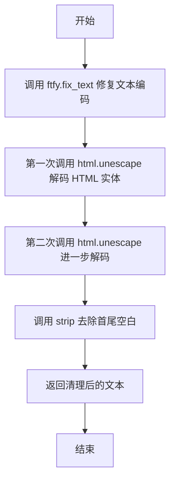
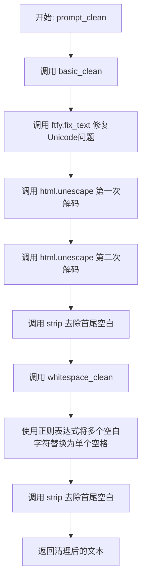
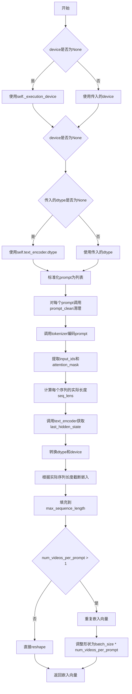
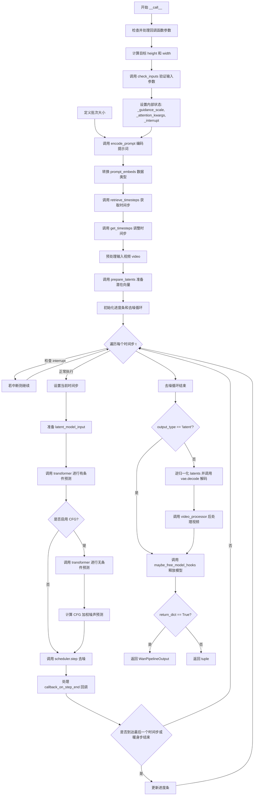

# `diffusers\src\diffusers\pipelines\wan\pipeline_wan_video2video.py` 详细设计文档

WanVideoToVideoPipeline是基于Wan模型的视频到视频生成管道，继承自DiffusionPipeline，实现了对输入视频进行AI生成式转换的核心功能。该管道通过T5文本编码器获取文本嵌入，使用VAE编码输入视频为潜在表示，经由Transformer模型进行去噪处理，最终通过VAE解码生成目标视频。

## 整体流程

```mermaid
graph TD
    A[开始: __call__] --> B[检查输入参数 check_inputs]
B --> C[编码提示词 encode_prompt]
C --> D[准备时间步 retrieve_timesteps & get_timesteps]
D --> E[预处理视频 video_processor.preprocess_video]
E --> F[准备潜在变量 prepare_latents]
F --> G[去噪循环 for each timestep]
G --> H[Transformer前向传播: 有条件噪声预测]
H --> I{guidance_scale > 1?}
I -- 是 --> J[Transformer前向传播: 无条件噪声预测]
I -- 否 --> K[跳过无条件预测]
J --> L[计算CFG组合噪声: noise_uncond + guidance_scale * (noise_pred - noise_uncond)]
K --> L
L --> M[Scheduler步进: scheduler.step]
M --> N{是否最后一个timestep?}
N -- 否 --> G
N -- 是 --> O{output_type == 'latent'?}
O -- 否 --> P[VAE解码: vae.decode]
O -- 是 --> Q[直接返回latents]
P --> R[后处理视频: video_processor.postprocess_video]
Q --> S[返回WanPipelineOutput]
R --> S
```

## 类结构

```
DiffusionPipeline (抽象基类)
└── WanVideoToVideoPipeline (视频到视频生成管道)
    └── WanLoraLoaderMixin (LoRA加载混入)
```

## 全局变量及字段


### `XLA_AVAILABLE`
    
PyTorch XLA是否可用标志，用于判断是否可以使用TPU加速

类型：`bool`
    


### `logger`
    
模块级日志记录器，用于输出调试和运行时信息

类型：`logging.Logger`
    


### `EXAMPLE_DOC_STRING`
    
示例文档字符串，包含pipeline使用示例代码

类型：`str`
    


### `WanVideoToVideoPipeline.vae_scale_factor_temporal`
    
VAE时间维度缩放因子，2的temporal_downsample之和次幂，用于计算视频帧的时间缩放

类型：`int`
    


### `WanVideoToVideoPipeline.vae_scale_factor_spatial`
    
VAE空间维度缩放因子，2的temporal_downsample长度次幂，用于计算视频帧的空间缩放

类型：`int`
    


### `WanVideoToVideoPipeline.video_processor`
    
视频预处理和后处理器，负责视频帧的格式转换和尺寸调整

类型：`VideoProcessor`
    


### `WanVideoToVideoPipeline.model_cpu_offload_seq`
    
CPU卸载顺序字符串，定义了模型组件从GPU卸载到CPU的顺序

类型：`str`
    


### `WanVideoToVideoPipeline._callback_tensor_inputs`
    
回调函数可用的张量输入列表，定义了哪些张量可以在推理步骤结束时被回调函数访问

类型：`list[str]`
    


### `WanVideoToVideoPipeline._guidance_scale`
    
CFG引导_scale值，用于控制分类器自由引导的强度，影响文本prompt对生成结果的影响程度

类型：`float`
    


### `WanVideoToVideoPipeline._attention_kwargs`
    
注意力处理器参数字典，存储传递给注意力处理器的额外参数

类型：`dict[str, Any]`
    


### `WanVideoToVideoPipeline._current_timestep`
    
当前去噪时间步，记录扩散模型当前执行到的时间步索引

类型：`int`
    


### `WanVideoToVideoPipeline._num_timesteps`
    
总时间步数，表示扩散过程的总步数

类型：`int`
    


### `WanVideoToVideoPipeline._interrupt`
    
中断标志位，用于在去噪循环中请求提前终止推理过程

类型：`bool`
    


### `WanVideoToVideoPipeline.tokenizer`
    
T5分词器，用于将文本prompt转换为token序列

类型：`AutoTokenizer`
    


### `WanVideoToVideoPipeline.text_encoder`
    
T5编码器模型，将token序列编码为文本嵌入向量

类型：`UMT5EncoderModel`
    


### `WanVideoToVideoPipeline.transformer`
    
Wan Transformer 3D模型，用于去噪潜在表示的主干网络

类型：`WanTransformer3DModel`
    


### `WanVideoToVideoPipeline.vae`
    
VAE模型，负责视频在像素空间和潜在空间之间的编码与解码

类型：`AutoencoderKLWan`
    


### `WanVideoToVideoPipeline.scheduler`
    
调度器，控制扩散过程中的时间步调度和噪声预测

类型：`FlowMatchEulerDiscreteScheduler`
    
    

## 全局函数及方法


### basic_clean

该函数用于对文本进行基本清理处理，通过 ftfy 修复文本编码问题，双重 HTML 解码处理 HTML 实体，并去除首尾空白字符。

参数：

- `text`：`str`，需要清理的原始文本

返回值：`str`，清理后的文本

#### 流程图



#### 带注释源码

```
def basic_clean(text):
    # 使用 ftfy 库修复文本中的编码问题
    # ftfy 能够自动检测并修复常见的文本编码错误，如 UTF-8 编码错误 Mojibake 等
    text = ftfy.fix_text(text)
    
    # 第一次 html.unescape 解码 HTML 实体
    # 将如 &amp; &lt; &gt; 等 HTML 实体转换为对应字符
    text = html.unescape(html.unescape(text))
    # 第二次 html.unescape 是为了处理嵌套的 HTML 实体编码情况
    # 例如: &amp;lt; 第一次解码后变成 &lt;，第二次变成 <
    
    # 去除文本首尾的空白字符（包括空格、制表符、换行符等）
    return text.strip()
```


### `whitespace_clean`

该函数用于清理文本中的多余空白字符，将连续的白空格（包括空格、制表符、换行符等）替换为单个空格，并去除文本首尾的空白字符。

参数：

- `text`：`str`，需要清理的输入文本

返回值：`str`，清理空白字符后的文本

#### 流程图

```mermaid
flowchart TD
    A[开始: whitespace_clean] --> B[输入文本 text]
    B --> C{text 是否为空?}
    C -->|是| D[返回空字符串 '']
    C -->|否| E[使用正则表达式 \s+ 替换为空格]
    E --> F[去除首尾空白字符 strip()]
    F --> G[返回清理后的文本]
```

#### 带注释源码

```python
def whitespace_clean(text):
    """
    清理文本中的多余空白字符
    
    该函数执行两步清理操作：
    1. 将所有连续的白空格（空格、制表符、换行等）替换为单个空格
    2. 去除文本首尾的空白字符
    
    Args:
        text (str): 需要清理的输入文本
        
    Returns:
        str: 清理空白字符后的文本
    """
    # 使用正则表达式将一个或多个空白字符替换为单个空格
    # \s+ 匹配一个或多个空白字符（包括空格、\t、\n、\r等）
    text = re.sub(r"\s+", " ", text)
    
    # 去除文本首尾的空白字符
    text = text.strip()
    
    # 返回清理后的文本
    return text
```


### `prompt_clean`

该函数是 Wan 视频到视频管道中的文本预处理函数，通过组合调用 `basic_clean` 和 `whitespace_clean` 两个辅助函数，对输入的文本进行 HTML 实体解码、Unicode 修复以及空白字符规范化的综合清理操作。

参数：

-  `text`：`str`，需要清理的原始文本

返回值：`str`，清理并规范化后的文本

#### 流程图



#### 带注释源码

```python
def prompt_clean(text):
    """
    对输入文本进行完整的清理处理。
    
    该函数是文本预处理的入口函数，通过组合调用 basic_clean 和 whitespace_clean 两个辅助函数，
    完成以下处理步骤：
    1. 使用 ftfy 库修复常见的 Unicode 编码错误
    2. 使用 html.unescape 解码 HTML 实体（双重解码确保彻底清理）
    3. 去除首尾空白字符
    4. 将连续多个空白字符规范化为单个空格
    5. 再次去除首尾空白
    
    Args:
        text (str): 需要清理的原始文本输入
        
    Returns:
        str: 经过完整清理和规范化处理的文本
    """
    # 第一步：basic_clean 处理
    # - ftfy.fix_text: 修复常见的 Unicode 文本编码问题，如 mojibake（乱码）
    # - html.unescape: 解码 HTML 实体（如 &amp; -> &, &lt; -> <）
    # - 双重 html.unescape 确保处理嵌套编码的情况
    # - strip(): 去除处理后的首尾空白
    text = whitespace_clean(basic_clean(text))
    
    # 第二步：whitespace_clean 处理
    # - re.sub(r"\s+", " ", text): 将所有连续空白字符（空格、Tab、换行等）替换为单个空格
    # - strip(): 再次去除首尾空白，确保输出文本干净
    
    return text
```


### `retrieve_timesteps`

该函数是视频生成管道中的辅助函数，用于调用调度器的 `set_timesteps` 方法并从中获取时间步调度。它支持自定义时间步和 sigma 值，同时提供错误检查以确保调度器支持这些自定义选项。

参数：

- `scheduler`：`SchedulerMixin`，调度器对象，用于获取时间步
- `num_inference_steps`：`int | None`，扩散过程使用的推理步数，若使用此参数则 `timesteps` 必须为 `None`
- `device`：`str | torch.device | None`，时间步要移动到的设备，传入 `None` 则不移动
- `timesteps`：`list[int] | None`，用于覆盖调度器时间步间隔策略的自定义时间步，若传入此参数则 `num_inference_steps` 和 `sigmas` 必须为 `None`
- `sigmas`：`list[float] | None`，用于覆盖调度器时间步间隔策略的自定义 sigma 值，若传入此参数则 `num_inference_steps` 和 `timesteps` 必须为 `None`
- `**kwargs`：任意关键字参数，将传递给 `scheduler.set_timesteps`

返回值：`tuple[torch.Tensor, int]`，元组中第一个元素是调度器的时间步调度，第二个元素是推理步数

#### 流程图

```mermaid
flowchart TD
    A[开始] --> B{检查 timesteps 和 sigmas 是否同时存在}
    B -->|是| C[抛出 ValueError: 只能传 timesteps 或 sigmas 之一]
    B -->|否| D{检查 timesteps 是否存在}
    D -->|是| E{检查调度器是否支持 timesteps}
    E -->|不支持| F[抛出 ValueError: 调度器不支持自定义 timesteps]
    E -->|支持| G[调用 scheduler.set_timesteps<br/>timesteps=timesteps, device=device]
    G --> H[获取 scheduler.timesteps]
    H --> I[设置 num_inference_steps = len(timesteps)]
    I --> J[返回 timesteps, num_inference_steps]
    
    D -->|否| K{检查 sigmas 是否存在}
    K -->|是| L{检查调度器是否支持 sigmas}
    L -->|不支持| M[抛出 ValueError: 调度器不支持自定义 sigmas]
    L -->|支持| N[调用 scheduler.set_timesteps<br/>sigmas=sigmas, device=device]
    N --> O[获取 scheduler.timesteps]
    O --> P[设置 num_inference_steps = len(timesteps)]
    P --> J
    
    K -->|否| Q[调用 scheduler.set_timesteps<br/>num_inference_steps, device=device]
    Q --> R[获取 scheduler.timesteps]
    R --> J
```

#### 带注释源码

```python
# Copied from diffusers.pipelines.stable_diffusion.pipeline_stable_diffusion.retrieve_timesteps
def retrieve_timesteps(
    scheduler,
    num_inference_steps: int | None = None,
    device: str | torch.device | None = None,
    timesteps: list[int] | None = None,
    sigmas: list[float] | None = None,
    **kwargs,
):
    r"""
    Calls the scheduler's `set_timesteps` method and retrieves timesteps from the scheduler after the call. Handles
    custom timesteps. Any kwargs will be supplied to `scheduler.set_timesteps`.

    Args:
        scheduler (`SchedulerMixin`):
            The scheduler to get timesteps from.
        num_inference_steps (`int`):
            The number of diffusion steps used when generating samples with a pre-trained model. If used, `timesteps`
            must be `None`.
        device (`str` or `torch.device`, *optional*):
            The device to which the timesteps should be moved to. If `None`, the timesteps are not moved.
        timesteps (`list[int]`, *optional*):
            Custom timesteps used to override the timestep spacing strategy of the scheduler. If `timesteps` is passed,
            `num_inference_steps` and `sigmas` must be `None`.
        sigmas (`list[float]`, *optional*):
            Custom sigmas used to override the timestep spacing strategy of the scheduler. If `sigmas` is passed,
            `num_inference_steps` and `timesteps` must be `None`.

    Returns:
        `tuple[torch.Tensor, int]`: A tuple where the first element is the timestep schedule from the scheduler and the
        second element is the number of inference steps.
    """
    # 检查是否同时传入了 timesteps 和 sigmas，两者只能选其一
    if timesteps is not None and sigmas is not None:
        raise ValueError("Only one of `timesteps` or `sigmas` can be passed. Please choose one to set custom values")
    
    # 处理自定义 timesteps 的情况
    if timesteps is not None:
        # 检查调度器的 set_timesteps 方法是否接受 timesteps 参数
        accepts_timesteps = "timesteps" in set(inspect.signature(scheduler.set_timesteps).parameters.keys())
        if not accepts_timesteps:
            raise ValueError(
                f"The current scheduler class {scheduler.__class__}'s `set_timesteps` does not support custom"
                f" timestep schedules. Please check whether you are using the correct scheduler."
            )
        # 调用调度器的 set_timesteps 方法设置自定义时间步
        scheduler.set_timesteps(timesteps=timesteps, device=device, **kwargs)
        # 从调度器获取设置后的时间步
        timesteps = scheduler.timesteps
        # 计算推理步数
        num_inference_steps = len(timesteps)
    # 处理自定义 sigmas 的情况
    elif sigmas is not None:
        # 检查调度器的 set_timesteps 方法是否接受 sigmas 参数
        accept_sigmas = "sigmas" in set(inspect.signature(scheduler.set_timesteps).parameters.keys())
        if not accept_sigmas:
            raise ValueError(
                f"The current scheduler class {scheduler.__class__}'s `set_timesteps` does not support custom"
                f" sigmas schedules. Please check whether you are using the correct scheduler."
            )
        # 调用调度器的 set_timesteps 方法设置自定义 sigma
        scheduler.set_timesteps(sigmas=sigmas, device=device, **kwargs)
        # 从调度器获取设置后的时间步
        timesteps = scheduler.timesteps
        # 计算推理步数
        num_inference_steps = len(timesteps)
    # 使用默认方式设置时间步（根据 num_inference_steps）
    else:
        scheduler.set_timesteps(num_inference_steps, device=device, **kwargs)
        timesteps = scheduler.timesteps
    
    # 返回时间步调度和推理步数
    return timesteps, num_inference_steps
```


### `retrieve_latents`

从编码器输出中检索潜在表示（latents）的工具函数，根据 `sample_mode` 参数选择从潜在分布中采样或取.mode()，也可以直接返回预存的潜在表示。

参数：

- `encoder_output`：`torch.Tensor`，编码器输出对象，包含 `latent_dist` 属性或 `latents` 属性
- `generator`：`torch.Generator | None`，可选的随机数生成器，用于采样时的随机性控制
- `sample_mode`：`str`，采样模式，默认为 `"sample"`（从分布中采样），也可设置为 `"argmax"`（取分布的.mode()）

返回值：`torch.Tensor`，检索到的潜在表示张量

#### 流程图

```mermaid
flowchart TD
    A[开始] --> B{encoder_output 有 latent_dist 属性?}
    B -- 是 --> C{sample_mode == 'sample'?}
    B -- 否 --> D{encoder_output 有 latents 属性?}
    C -- 是 --> E[返回 latent_dist.sample<br/>(generator)]
    C -- 否 --> F{sample_mode == 'argmax'?}
    D -- 是 --> G[返回 encoder_output.latents]
    D -- 否 --> H[抛出 AttributeError]
    F -- 是 --> I[返回 latent_dist.mode<br/>()]
    F -- 否 --> H
    H --> J[结束 with Error]
    E --> J
    G --> J
    I --> J
```

#### 带注释源码

```python
def retrieve_latents(
    encoder_output: torch.Tensor, generator: torch.Generator | None = None, sample_mode: str = "sample"
):
    """
    从编码器输出中检索潜在表示（latents）。
    
    该函数支持三种获取潜在表示的方式：
    1. 从 latent_dist 属性中采样（sample_mode="sample"）
    2. 从 latent_dist 属性中取.mode()（sample_mode="argmax"）
    3. 直接返回预存的 latents 属性
    
    Args:
        encoder_output: 编码器输出，包含 latent_dist 或 latents 属性
        generator: 可选的随机数生成器，用于控制采样随机性
        sample_mode: 采样模式，"sample" 表示采样，"argmax" 表示取分布的 mode
    
    Returns:
        检索到的潜在表示张量
    
    Raises:
        AttributeError: 当 encoder_output 既没有 latent_dist 也没有 latents 属性时
    """
    # 情况1：编码器输出具有 latent_dist 属性且模式为采样
    if hasattr(encoder_output, "latent_dist") and sample_mode == "sample":
        # 从潜在分布中采样，可以指定随机生成器以实现可重现的采样
        return encoder_output.latent_dist.sample(generator)
    
    # 情况2：编码器输出具有 latent_dist 属性且模式为 argmax
    elif hasattr(encoder_output, "latent_dist") and sample_mode == "argmax":
        # 取潜在分布的 mode（最可能的值），用于确定性解码
        return encoder_output.latent_dist.mode()
    
    # 情况3：编码器输出直接具有 latents 属性
    elif hasattr(encoder_output, "latents"):
        # 直接返回预计算的潜在表示
        return encoder_output.latents
    
    # 错误情况：无法获取潜在表示
    else:
        raise AttributeError("Could not access latents of provided encoder_output")
```


### `WanVideoToVideoPipeline.__init__`

该方法是 Wan 视频转视频生成管道的构造函数，负责初始化分词器、文本编码器、变换器、VAE 和调度器等核心组件，并计算 VAE 的时空缩放因子以及初始化视频处理器。

参数：

- `tokenizer`：`AutoTokenizer`，T5 分词器，用于将文本 prompt 转换为 token 序列
- `text_encoder`：`UMT5EncoderModel`，T5 文本编码器模型，用于将 token 序列编码为文本嵌入
- `transformer`：`WanTransformer3DModel`，条件变换器，用于对输入的潜在表示进行去噪
- `vae`：`AutoencoderKLWan`，变分自编码器模型，用于编码和解码视频到潜在表示
- `scheduler`：`FlowMatchEulerDiscreteScheduler`，调度器，用于在去噪过程中生成时间步

返回值：`None`，构造函数无返回值

#### 流程图

```mermaid
flowchart TD
    A[__init__ 开始] --> B[调用 super().__init__ 初始化基础管道]
    B --> C[调用 register_modules 注册所有模块]
    C --> D{检查 vae 属性是否存在}
    D -->|是| E[计算 vae_scale_factor_temporal]
    D -->|否| F[使用默认值 4]
    E --> G[计算 vae_scale_factor_spatial]
    F --> G
    G --> H[初始化 VideoProcessor]
    H --> I[__init__ 结束]
```

#### 带注释源码

```python
def __init__(
    self,
    tokenizer: AutoTokenizer,
    text_encoder: UMT5EncoderModel,
    transformer: WanTransformer3DModel,
    vae: AutoencoderKLWan,
    scheduler: FlowMatchEulerDiscreteScheduler,
):
    """
    初始化 Wan 视频转视频管道
    
    参数:
        tokenizer: T5 分词器
        text_encoder: T5 文本编码器
        transformer: Wan 3D 变换器
        vae: Wan VAE 模型
        scheduler: 流匹配欧拉离散调度器
    """
    # 调用父类 DiffusionPipeline 的初始化方法
    # 设置管道的基本属性和配置
    super().__init__()

    # 将所有模块注册到管道中
    # 这些模块可以通过 self.vae, self.text_encoder 等访问
    self.register_modules(
        vae=vae,
        text_encoder=text_encoder,
        tokenizer=tokenizer,
        transformer=transformer,
        scheduler=scheduler,
    )

    # 计算 VAE 的时间缩放因子
    # 基于 VAE 的时间下采样层数，默认为 4
    self.vae_scale_factor_temporal = 2 ** sum(self.vae.temperal_downsample) if getattr(self, "vae", None) else 4
    
    # 计算 VAE 的空间缩放因子
    # 基于 VAE 的空间下采样层数，默认为 8
    self.vae_scale_factor_spatial = 2 ** len(self.vae.temperal_downsample) if getattr(self, "vae", None) else 8
    
    # 初始化视频处理器
    # 用于视频的预处理和后处理操作
    self.video_processor = VideoProcessor(vae_scale_factor=self.vae_scale_factor_spatial)
```


### WanVideoToVideoPipeline._get_t5_prompt_embeds

该方法用于将文本提示（prompt）编码为T5文本编码器的隐藏状态嵌入向量，支持批量处理和每个提示生成多个视频的文本嵌入扩展。

参数：

- `prompt`：`str | list[str]`，要编码的文本提示，可以是单个字符串或字符串列表，默认为None
- `num_videos_per_prompt`：`int`，每个提示要生成的视频数量，用于扩展文本嵌入维度，默认为1
- `max_sequence_length`：`int`，文本编码的最大序列长度，超过该长度将被截断，默认为226
- `device`：`torch.device | None`，执行设备，若为None则使用执行设备，默认为None
- `dtype`：`torch.dtype | None`，输出张量的数据类型，若为None则使用文本编码器的数据类型，默认为None

返回值：`torch.Tensor`，返回编码后的文本嵌入向量，形状为 `(batch_size * num_videos_per_prompt, seq_len, hidden_dim)`

#### 流程图



#### 带注释源码

```
def _get_t5_prompt_embeds(
    self,
    prompt: str | list[str] = None,
    num_videos_per_prompt: int = 1,
    max_sequence_length: int = 226,
    device: torch.device | None = None,
    dtype: torch.dtype | None = None,
):
    # 确定设备：如果未指定，则使用管道的执行设备
    device = device or self._execution_device
    # 确定数据类型：如果未指定，则使用文本编码器的数据类型
    dtype = dtype or self.text_encoder.dtype

    # 将单个字符串转换为列表，便于批量处理
    prompt = [prompt] if isinstance(prompt, str) else prompt
    # 对每个prompt进行清理：移除HTML实体、规范化空白字符
    prompt = [prompt_clean(u) for u in prompt]
    # 获取批次大小
    batch_size = len(prompt)

    # 使用tokenizer将文本转换为模型输入格式
    text_inputs = self.tokenizer(
        prompt,
        padding="max_length",           # 填充到最大长度
        max_length=max_sequence_length, # 最大序列长度
        truncation=True,                # 超过最大长度时截断
        add_special_tokens=True,        # 添加特殊token（如EOS、BOS等）
        return_attention_mask=True,      # 返回注意力掩码
        return_tensors="pt",             # 返回PyTorch张量
    )
    # 提取input_ids和attention_mask
    text_input_ids, mask = text_inputs.input_ids, text_inputs.attention_mask
    # 计算每个序列的实际长度（非padding部分）
    seq_lens = mask.gt(0).sum(dim=1).long()

    # 使用T5文本编码器编码输入，获取隐藏状态
    prompt_embeds = self.text_encoder(text_input_ids.to(device), mask.to(device)).last_hidden_state
    # 转换到指定的dtype和device
    prompt_embeds = prompt_embeds.to(dtype=dtype, device=device)
    # 根据实际序列长度截断嵌入（移除padding部分）
    prompt_embeds = [u[:v] for u, v in zip(prompt_embeds, seq_lens)]
    # 将变长嵌入填充回max_sequence_length，保持批次维度一致
    prompt_embeds = torch.stack(
        [torch.cat([u, u.new_zeros(max_sequence_length - u.size(0), u.size(1))]) for u in prompt_embeds], dim=0
    )

    # 复制文本嵌入以匹配每个prompt生成的视频数量
    # 这是为了在后续去噪过程中为每个视频提供对应的文本条件
    _, seq_len, _ = prompt_embeds.shape
    prompt_embeds = prompt_embeds.repeat(1, num_videos_per_prompt, 1)
    # 调整形状：[batch_size, num_videos_per_prompt, seq_len, hidden_dim] -> [batch_size * num_videos_per_prompt, seq_len, hidden_dim]
    prompt_embeds = prompt_embeds.view(batch_size * num_videos_per_prompt, seq_len, -1)

    return prompt_embeds
```


### `WanVideoToVideoPipeline.encode_prompt`

该方法用于将文本提示词（prompt）和负面提示词（negative_prompt）编码为文本编码器（text_encoder）的隐藏状态（hidden states），以便后续用于指导视频生成过程。

参数：

- `prompt`：`str | list[str]`，要编码的提示词
- `negative_prompt`：`str | list[str] | None`，不用于指导图像生成的提示词。如果未定义，则必须传递 `negative_prompt_embeds`。当不使用引导时（即 `guidance_scale` 小于 1）将被忽略
- `do_classifier_free_guidance`：`bool`，是否使用无分类器自由引导（Classifier-Free Guidance），默认为 True
- `num_videos_per_prompt`：`int`，每个提示词应生成的视频数量，默认为 1
- `prompt_embeds`：`torch.Tensor | None`，预生成的文本嵌入，可用于轻松调整文本输入（如提示词加权）。如果未提供，则会根据 `prompt` 参数生成
- `negative_prompt_embeds`：`torch.Tensor | None`，预生成的负面文本嵌入，可用于轻松调整文本输入。如果未提供，则会根据 `negative_prompt` 参数生成
- `max_sequence_length`：`int`，文本编码器的最大序列长度，默认为 226
- `device`：`torch.device | None`，用于放置结果嵌入的 torch 设备
- `dtype`：`torch.dtype | None`，torch 数据类型

返回值：`tuple[torch.Tensor, torch.Tensor]`，返回编码后的提示词嵌入和负面提示词嵌入元组

#### 流程图

```mermaid
flowchart TD
    A[开始 encode_prompt] --> B{device 是否为 None?}
    B -->|是| C[使用 self._execution_device]
    B -->|否| D[使用传入的 device]
    C --> E{prompt 是否为 None?}
    D --> E
    E -->|是| F[batch_size = prompt_embeds.shape[0]]
    E -->|否| G{prompt 是否为 str?}
    G -->|是| H[将 prompt 转换为 list]
    G -->|否| I[batch_size = len(prompt)]
    H --> J[batch_size = len(prompt)]
    I --> J
    J --> K{prompt_embeds 是否为 None?}
    K -->|是| L[调用 _get_t5_prompt_embeds 生成嵌入]
    K -->|否| M[使用传入的 prompt_embeds]
    L --> N{do_classifier_free_guidance 为真<br/>且 negative_prompt_embeds 为 None?}
    M --> N
    N -->|否| O[negative_prompt 设置为空字符串]
    N -->|是| P{prompt 与 negative_prompt 类型相同?}
    O --> Q[negative_prompt 扩展为 batch_size 长度]
    P -->|否| R[抛出 TypeError]
    P -->|是| S{batch_size 与 negative_prompt 长度相同?}
    Q --> S
    S -->|否| T[抛出 ValueError]
    S -->|是| U[调用 _get_t5_prompt_embeds 生成 negative_prompt_embeds]
    T --> V[抛出异常]
    U --> W[返回 prompt_embeds 和 negative_prompt_embeds]
    N -->|否| W
    K -->|否| W
```

#### 带注释源码

```python
def encode_prompt(
    self,
    prompt: str | list[str],
    negative_prompt: str | list[str] | None = None,
    do_classifier_free_guidance: bool = True,
    num_videos_per_prompt: int = 1,
    prompt_embeds: torch.Tensor | None = None,
    negative_prompt_embeds: torch.Tensor | None = None,
    max_sequence_length: int = 226,
    device: torch.device | None = None,
    dtype: torch.dtype | None = None,
):
    r"""
    Encodes the prompt into text encoder hidden states.

    Args:
        prompt (`str` or `list[str]`, *optional*):
            prompt to be encoded
        negative_prompt (`str` or `list[str]`, *optional*):
            The prompt or prompts not to guide the image generation. If not defined, one has to pass
            `negative_prompt_embeds` instead. Ignored when not using guidance (i.e., ignored if `guidance_scale` is
            less than `1`).
        do_classifier_free_guidance (`bool`, *optional*, defaults to `True`):
            Whether to use classifier free guidance or not.
        num_videos_per_prompt (`int`, *optional*, defaults to 1):
            Number of videos that should be generated per prompt. torch device to place the resulting embeddings on
        prompt_embeds (`torch.Tensor`, *optional*):
            Pre-generated text embeddings. Can be used to easily tweak text inputs, *e.g.* prompt weighting. If not
            provided, text embeddings will be generated from `prompt` input argument.
        negative_prompt_embeds (`torch.Tensor`, *optional*):
            Pre-generated negative text embeddings. Can be used to easily tweak text inputs, *e.g.* prompt
            weighting. If not provided, negative_prompt_embeds will be generated from `negative_prompt` input
            argument.
        device: (`torch.device`, *optional*):
            torch device
        dtype: (`torch.dtype`, *optional*):
            torch dtype
    """
    # 如果未指定 device，则使用执行设备（通常是 CUDA）
    device = device or self._execution_device

    # 将 prompt 统一转换为列表格式
    prompt = [prompt] if isinstance(prompt, str) else prompt
    
    # 如果 prompt 不为 None，获取其批次大小；否则从 prompt_embeds 获取
    if prompt is not None:
        batch_size = len(prompt)
    else:
        batch_size = prompt_embeds.shape[0]

    # 如果未提供 prompt_embeds，则通过 _get_t5_prompt_embeds 方法生成
    if prompt_embeds is None:
        prompt_embeds = self._get_t5_prompt_embeds(
            prompt=prompt,
            num_videos_per_prompt=num_videos_per_prompt,
            max_sequence_length=max_sequence_length,
            device=device,
            dtype=dtype,
        )

    # 如果启用无分类器自由引导且未提供 negative_prompt_embeds
    if do_classifier_free_guidance and negative_prompt_embeds is None:
        # 如果未提供 negative_prompt，默认使用空字符串
        negative_prompt = negative_prompt or ""
        
        # 将 negative_prompt 扩展为与 prompt 相同批次大小的列表
        negative_prompt = batch_size * [negative_prompt] if isinstance(negative_prompt, str) else negative_prompt

        # 类型检查：negative_prompt 应与 prompt 类型相同
        if prompt is not None and type(prompt) is not type(negative_prompt):
            raise TypeError(
                f"`negative_prompt` should be the same type to `prompt`, but got {type(negative_prompt)} !="
                f" {type(prompt)}."
            )
        # 批次大小检查
        elif batch_size != len(negative_prompt):
            raise ValueError(
                f"`negative_prompt`: {negative_prompt} has batch size {len(negative_prompt)}, but `prompt`:"
                f" {prompt} has batch size {batch_size}. Please make sure that passed `negative_prompt` matches"
                " the batch size of `prompt`."
            )

        # 生成 negative_prompt_embeds
        negative_prompt_embeds = self._get_t5_prompt_embeds(
            prompt=negative_prompt,
            num_videos_per_prompt=num_videos_per_prompt,
            max_sequence_length=max_sequence_length,
            device=device,
            dtype=dtype,
        )

    # 返回编码后的提示词嵌入和负面提示词嵌入
    return prompt_embeds, negative_prompt_embeds
```


### `WanVideoToVideoPipeline.check_inputs`

该方法用于验证视频到视频生成管道的输入参数合法性，确保传入的提示词、图像尺寸、潜在向量等参数符合模型要求，并在参数不符合要求时抛出详细的错误信息。

参数：

- `prompt`：`str | list[str] | None`，需要验证的提示词，可以是字符串或字符串列表
- `negative_prompt`：`str | list[str] | None`，负向提示词，用于指导模型避免生成相关内容
- `height`：`int`，生成视频的高度，必须能被16整除
- `width`：`int`，生成视频的宽度，必须能被16整除
- `video`：`torch.Tensor | list[Image.Image] | None`，输入视频数据，与latents互斥
- `latents`：`torch.Tensor | None`，预生成的潜在向量，与video互斥
- `prompt_embeds`：`torch.Tensor | None`，预生成的提示词嵌入，与prompt互斥
- `negative_prompt_embeds`：`torch.Tensor | None`，预生成的负向提示词嵌入，与negative_prompt互斥
- `callback_on_step_end_tensor_inputs`：`list[str] | None`，每步结束时的回调张量输入列表

返回值：`None`，该方法不返回任何值，仅进行参数验证

#### 流程图

```mermaid
flowchart TD
    A[开始 check_inputs 验证] --> B{height % 16 == 0 && width % 16 == 0?}
    B -->|否| C[抛出ValueError: 高度和宽度必须能被16整除]
    B -->|是| D{callback_on_step_end_tensor_inputs 是否在允许列表中?}
    D -->|否| E[抛出ValueError: 回调张量输入不在允许列表中]
    D -->|是| F{prompt 和 prompt_embeds 是否同时存在?}
    F -->|是| G[抛出ValueError: 不能同时提供prompt和prompt_embeds]
    F -->|否| H{negative_prompt 和 negative_prompt_embeds 是否同时存在?}
    H -->|是| I[抛出ValueError: 不能同时提供negative_prompt和negative_prompt_embeds]
    H -->|否| J{prompt 和 prompt_embeds 是否都为空/None?]
    J -->|是| K[抛出ValueError: 必须提供prompt或prompt_embeds之一]
    J -->|否| L{prompt 类型是否正确?]
    L -->|否| M[抛出ValueError: prompt必须是str或list类型]
    L -->|是| N{negative_prompt 类型是否正确?}
    N -->|否| O[抛出ValueError: negative_prompt必须是str或list类型]
    N -->|是| P{video 和 latents 是否同时存在?}
    P -->|是| Q[抛出ValueError: 只能提供video或latents之一]
    P -->|否| R[验证通过，返回None]
    C --> R
    E --> R
    G --> R
    I --> R
    K --> R
    M --> R
    O --> R
    Q --> R
```

#### 带注释源码

```python
def check_inputs(
    self,
    prompt,                          # 用户输入的文本提示词，字符串或字符串列表
    negative_prompt,                 # 负向提示词，用于避免生成某些内容
    height,                          # 输出视频高度，必须能被16整除
    width,                           # 输出视频宽度，必须能被16整除
    video=None,                      # 输入视频数据，与latents参数互斥
    latents=None,                    # 预生成的潜在向量，与video参数互斥
    prompt_embeds=None,              # 预计算的提示词嵌入，与prompt参数互斥
    negative_prompt_embeds=None,     # 预计算的负向提示词嵌入，与negative_prompt参数互斥
    callback_on_step_end_tensor_inputs=None,  # 回调函数可访问的张量输入列表
):
    # 验证1：检查输出尺寸是否符合模型要求（必须能被16整除）
    if height % 16 != 0 or width % 16 != 0:
        raise ValueError(f"`height` and `width` have to be divisible by 16 but are {height} and {width}.")

    # 验证2：检查回调张量输入是否在允许的列表中
    if callback_on_step_end_tensor_inputs is not None and not all(
        k in self._callback_tensor_inputs for k in callback_on_step_end_tensor_inputs
    ):
        raise ValueError(
            f"`callback_on_step_end_tensor_inputs` has to be in {self._callback_tensor_inputs}, but found {[k for k in callback_on_step_end_tensor_inputs if k not in self._callback_tensor_inputs]}"
        )

    # 验证3：检查prompt和prompt_embeds不能同时提供
    if prompt is not None and prompt_embeds is not None:
        raise ValueError(
            f"Cannot forward both `prompt`: {prompt} and `prompt_embeds`: {prompt_embeds}. Please make sure to"
            " only forward one of the two."
        )
    # 验证4：检查negative_prompt和negative_prompt_embeds不能同时提供
    elif negative_prompt is not None and negative_prompt_embeds is not None:
        raise ValueError(
            f"Cannot forward both `negative_prompt`: {negative_prompt} and `negative_prompt_embeds`: {negative_prompt_embeds}. Please make sure to"
            " only forward one of the two."
        )
    # 验证5：至少需要提供prompt或prompt_embeds之一
    elif prompt is None and prompt_embeds is None:
        raise ValueError(
            "Provide either `prompt` or `prompt_embeds`. Cannot leave both `prompt` and `prompt_embeds` undefined."
        )
    # 验证6：检查prompt的类型是否合法
    elif prompt is not None and (not isinstance(prompt, str) and not isinstance(prompt, list)):
        raise ValueError(f"`prompt` has to be of type `str` or `list` but is {type(prompt)}")
    # 验证7：检查negative_prompt的类型是否合法
    elif negative_prompt is not None and (
        not isinstance(negative_prompt, str) and not isinstance(negative_prompt, list)
    ):
        raise ValueError(f"`negative_prompt` has to be of type `str` or `list` but is {type(negative_prompt)}")

    # 验证8：检查video和latents不能同时提供（只能选择一种方式提供输入）
    if video is not None and latents is not None:
        raise ValueError("Only one of `video` or `latents` should be provided")
```


### `WanVideoToVideoPipeline.prepare_latents`

该方法负责为视频到视频生成准备初始潜在向量（latents）。它通过VAE编码输入视频帧，应用潜在空间的均值和标准差进行归一化化，并根据时间步将噪声添加到初始潜在向量中，或者直接使用提供的潜在向量。

参数：

- `video`：`torch.Tensor | None`，输入视频张量，用于编码生成初始潜在向量
- `batch_size`：`int = 1`，批处理大小
- `num_channels_latents`：`int = 16`，潜在向量的通道数，通常对应于transformer的输入通道数
- `height`：`int = 480`，生成视频的高度（像素）
- `width`：`int = 832`，生成视频的宽度（像素）
- `dtype`：`torch.dtype | None`，潜在向量的数据类型
- `device`：`torch.device | None`，潜在向量所在的设备
- `generator`：`torch.Generator | None`，用于生成确定性噪声的随机数生成器
- `latents`：`torch.Tensor | None`，预生成的潜在向量，如果为None则从视频编码生成
- `timestep`：`torch.Tensor | None`，当前的时间步，用于将噪声添加到初始潜在向量

返回值：`torch.Tensor`，处理后的潜在向量张量

#### 流程图

```mermaid
flowchart TD
    A[开始 prepare_latents] --> B{generator是列表且长度不等于batch_size?}
    B -->|是| C[抛出ValueError]
    B -->|否| D{latents是否为None?}
    D -->|是| E[计算latent帧数<br/>num_latent_frames]
    E --> F[计算shape<br/>batch_size, num_channels_latents,<br/>num_latent_frames, height//vae_scale_factor_spatial, width//vae_scale_factor_spatial]
    F --> G[对每个视频帧调用VAE encode<br/>使用argmax采样获取init_latents]
    G --> H[获取VAE的latents_mean和latents_std<br/>并进行归一化: (init_latents - mean) * std]
    H --> I[使用randn_tensor生成噪声]
    I --> J{scheduler是否有add_noise方法?}
    J -->|是| K[调用scheduler.add_noise<br/>将噪声添加到init_latents]
    J -->|否| L[调用scheduler.scale_noise<br/>缩放噪声并添加到init_latents]
    K --> M[latents = 处理后的latents]
    L --> M
    D -->|否| N[将latents移动到device]
    N --> M
    M --> O[返回 latents]
```

#### 带注释源码

```python
def prepare_latents(
    self,
    video: torch.Tensor | None = None,
    batch_size: int = 1,
    num_channels_latents: int = 16,
    height: int = 480,
    width: int = 832,
    dtype: torch.dtype | None = None,
    device: torch.device | None = None,
    generator: torch.Generator | None = None,
    latents: torch.Tensor | None = None,
    timestep: torch.Tensor | None = None,
):
    """
    准备视频到视频生成的潜在向量。
    
    如果未提供latents，则通过VAE编码输入视频并添加噪声；
    如果提供了latents，则将其移动到指定设备。
    
    参数:
        video: 输入视频张量，形状为 [B, C, F, H, W]，其中F为帧数
        batch_size: 批处理大小
        num_channels_latents: 潜在向量通道数
        height: 视频高度
        width: 视频宽度
        dtype: 潜在向量数据类型
        device: 计算设备
        generator: 随机数生成器，用于可重复的噪声生成
        latents: 预生成的潜在向量
        timestep: 当前时间步，用于噪声调度
    
    返回:
        准备好的潜在向量张量
    """
    # 检查generator列表长度是否与batch_size匹配
    if isinstance(generator, list) and len(generator) != batch_size:
        raise ValueError(
            f"You have passed a list of generators of length {len(generator)}, but requested an effective batch"
            f" size of {batch_size}. Make sure the batch size matches the length of the generators."
        )

    # 计算潜在帧数：如果latents为None，则根据视频帧数和VAE时间下采样因子计算
    num_latent_frames = (
        (video.size(2) - 1) // self.vae_scale_factor_temporal + 1 if latents is None else latents.size(1)
    )
    
    # 确定潜在向量的形状：[batch_size, channels, frames, height/scale, width/scale]
    shape = (
        batch_size,
        num_channels_latents,
        num_latent_frames,
        height // self.vae_scale_factor_spatial,
        width // self.vae_scale_factor_spatial,
    )

    if latents is None:
        # ============ 从视频编码生成初始潜在向量 ============
        
        # 使用VAE编码每个视频帧，使用argmax模式从潜在分布中采样
        # retrieve_latents 函数会从encoder_output中提取潜在向量
        init_latents = [retrieve_latents(self.vae.encode(vid.unsqueeze(0)), sample_mode="argmax") for vid in video]

        # 将所有帧的潜在向量沿batch维度拼接，并转换为指定dtype
        init_latents = torch.cat(init_latents, dim=0).to(dtype)

        # 获取VAE配置的潜在空间均值和标准差，用于归一化
        latents_mean = (
            torch.tensor(self.vae.config.latents_mean).view(1, self.vae.config.z_dim, 1, 1, 1).to(device, dtype)
        )
        latents_std = 1.0 / torch.tensor(self.vae.config.latents_std).view(1, self.vae.config.z_dim, 1, 1, 1).to(
            device, dtype
        )

        # 对初始潜在向量进行归一化：减去均值，乘以标准差
        init_latents = (init_latents - latents_mean) * latents_std

        # 生成与目标shape相同的随机噪声
        noise = randn_tensor(shape, generator=generator, device=device, dtype=dtype)
        
        # 将噪声添加到初始潜在向量中
        # 根据scheduler类型选择add_noise或scale_noise方法
        if hasattr(self.scheduler, "add_noise"):
            latents = self.scheduler.add_noise(init_latents, noise, timestep)
        else:
            latents = self.scheduler.scale_noise(init_latents, timestep, noise)
    else:
        # ============ 直接使用提供的潜在向量 ============
        # 将预生成的latents移动到指定设备
        latents = latents.to(device)

    return latents
```


### `WanVideoToVideoPipeline.get_timesteps`

该方法用于根据 `strength`（强度）参数调整时间步（timesteps），以控制视频到视频转换的程度。通过计算起始时间步索引，截取原始时间步序列的子集，从而决定从哪个时间步开始去噪过程，实现对原始视频的保留程度控制。

参数：

- `num_inference_steps`：`int`，总推理步数，即去噪过程的迭代次数
- `timesteps`：`torch.Tensor`，从调度器获取的完整时间步序列
- `strength`：`float`，转换强度，值越大表示与原始视频差异越大（0.0 到 1.0 之间）
- `device`：`torch.device`，计算设备，用于张量操作

返回值：`tuple[torch.Tensor, int]`，返回一个元组，包含调整后的时间步序列和实际推理步数

#### 流程图

```mermaid
flowchart TD
    A[开始 get_timesteps] --> B[计算 init_timestep = min(num_inference_steps × strength, num_inference_steps)]
    B --> C[计算 t_start = max(num_inference_steps - init_timestep, 0)]
    C --> D[截取时间步: timesteps[t_start × scheduler.order :]]
    D --> E[返回 timesteps 和 num_inference_steps - t_start]
```

#### 带注释源码

```python
def get_timesteps(self, num_inference_steps, timesteps, strength, device):
    # 根据强度参数计算初始时间步数，取推理步数和强度乘积的最小值
    # strength 越大，init_timestep 越大，意味着保留原始视频信息越少
    init_timestep = min(int(num_inference_steps * strength), num_inference_steps)

    # 计算起始索引，决定从时间步序列的哪个位置开始
    # 强度越大，t_start 越小，从更早的时间步开始，保留更多原始视频特征
    t_start = max(num_inference_steps - init_timestep, 0)

    # 根据调度器的阶数（order）调整时间步序列的起始位置
    # 跳过前 t_start × order 个时间步，获取用于去噪的时间步子序列
    timesteps = timesteps[t_start * self.scheduler.order :]

    # 返回调整后的时间步序列和实际执行的推理步数
    # num_inference_steps - t_start 表示实际需要去噪的步数
    return timesteps, num_inference_steps - t_start
```


### `WanVideoToVideoPipeline.__call__`

WanVideoToVideoPipeline 的核心调用方法，负责执行视频到视频（Video-to-Video）的生成流水线。该方法接收原始视频和文本提示，经过提示编码、潜在向量准备、去噪循环和最终解码，输出转换后的视频帧。

参数：

- `video`：`list[Image.Image] | None`，输入视频帧列表，用于作为视频到视频转换的参考输入
- `prompt`：`str | list[str] | None`，引导视频生成的文本提示，若不定义则需传入 prompt_embeds
- `negative_prompt`：`str | list[str] | None`，负向提示，用于指导不生成的内容
- `height`：`int = 480`，生成视频的高度（像素），默认 480
- `width`：`int = 832`，生成视频的宽度（像素），默认 832
- `num_inference_steps`：`int = 50`，去噪迭代步数，默认 50 步
- `timesteps`：`list[int] | None`，自定义时间步，用于覆盖调度器的时间步策略
- `guidance_scale`：`float = 5.0`，无分类器自由引导（CFG）比例，默认 5.0
- `strength`：`float = 0.8`，转换强度，控制原视频与生成视频的差异程度，默认 0.8
- `num_videos_per_prompt`：`int | None = 1`，每个提示生成的视频数量
- `generator`：`torch.Generator | list[torch.Generator] | None`，随机数生成器，用于确保可重复生成
- `latents`：`torch.Tensor | None`，预生成的噪声潜在向量，若不提供则自动采样生成
- `prompt_embeds`：`torch.Tensor | None`，预生成的文本嵌入，可用于调整提示权重
- `negative_prompt_embeds`：`torch.Tensor | None`，预生成的负向文本嵌入
- `output_type`：`str | None = "np"`，输出格式，可选 "np"（numpy 数组）或 "latent"
- `return_dict`：`bool = True`，是否返回 WanPipelineOutput 对象而非元组
- `attention_kwargs`：`dict[str | Any] | None`，传递给注意力处理器的额外关键字参数
- `callback_on_step_end`：`Callable | PipelineCallback | MultiPipelineCallbacks | None`，每步去噪结束后调用的回调函数
- `callback_on_step_end_tensor_inputs`：`list[str] = ["latents"]`，回调函数接收的张量输入列表
- `max_sequence_length`：`int = 512`，文本编码器的最大序列长度

返回值：`WanPipelineOutput | tuple`，若 return_dict 为 True 返回 WanPipelineOutput 对象（包含 frames 列表），否则返回元组

#### 流程图



#### 带注释源码

```python
@torch.no_grad()
@replace_example_docstring(EXAMPLE_DOC_STRING)
def __call__(
    self,
    video: list[Image.Image] = None,
    prompt: str | list[str] = None,
    negative_prompt: str | list[str] = None,
    height: int = 480,
    width: int = 832,
    num_inference_steps: int = 50,
    timesteps: list[int] | None = None,
    guidance_scale: float = 5.0,
    strength: float = 0.8,
    num_videos_per_prompt: int | None = 1,
    generator: torch.Generator | list[torch.Generator] | None = None,
    latents: torch.Tensor | None = None,
    prompt_embeds: torch.Tensor | None = None,
    negative_prompt_embeds: torch.Tensor | None = None,
    output_type: str | None = "np",
    return_dict: bool = True,
    attention_kwargs: dict[str, Any] | None = None,
    callback_on_step_end: Callable[[int, int], None] | PipelineCallback | MultiPipelineCallbacks | None = None,
    callback_on_step_end_tensor_inputs: list[str] = ["latents"],
    max_sequence_length: int = 512,
):
    # 1. 处理回调函数：如果传入的是 PipelineCallback 或 MultiPipelineCallbacks 对象，
    #    自动提取其 tensor_inputs 属性作为回调张量输入列表
    if isinstance(callback_on_step_end, (PipelineCallback, MultiPipelineCallbacks)):
        callback_on_step_end_tensor_inputs = callback_on_step_end.tensor_inputs

    # 2. 计算目标分辨率：若未指定 height/width，则从 transformer 配置中推导
    #    基于 vae_scale_factor 计算实际像素尺寸
    height = height or self.transformer.config.sample_height * self.vae_scale_factor_spatial
    width = width or self.transformer.config.sample_width * self.vae_scale_factor_spatial
    num_videos_per_prompt = 1  # 强制设为 1，忽略输入参数

    # 3. 输入验证：检查所有输入参数的合法性和一致性
    #    - height/width 必须是 16 的倍数
    #    - prompt 和 prompt_embeds 不能同时提供
    #    - negative_prompt 和 negative_prompt_embeds 不能同时提供
    #    - video 和 latents 不能同时提供
    self.check_inputs(
        prompt,
        negative_prompt,
        height,
        width,
        video,
        latents,
        prompt_embeds,
        negative_prompt_embeds,
        callback_on_step_end_tensor_inputs,
    )

    # 4. 设置内部状态变量，用于跟踪生成过程
    self._guidance_scale = guidance_scale
    self._attention_kwargs = attention_kwargs
    self._current_timestep = None
    self._interrupt = False

    # 获取执行设备（CPU/CUDA）
    device = self._execution_device

    # 5. 确定批次大小：根据 prompt 类型或 prompt_embeds 形状确定
    if prompt is not None and isinstance(prompt, str):
        batch_size = 1
    elif prompt is not None and isinstance(prompt, list):
        batch_size = len(prompt)
    else:
        batch_size = prompt_embeds.shape[0]

    # 6. 编码输入提示词：生成正向和负向文本嵌入
    #    - 若未提供 prompt_embeds，则从 prompt 生成
    #    - 若启用 CFG 且未提供 negative_prompt_embeds，则从 negative_prompt 生成
    prompt_embeds, negative_prompt_embeds = self.encode_prompt(
        prompt=prompt,
        negative_prompt=negative_prompt,
        do_classifier_free_guidance=self.do_classifier_free_guidance,
        num_videos_per_prompt=num_videos_per_prompt,
        prompt_embeds=prompt_embeds,
        negative_prompt_embeds=negative_prompt_embeds,
        max_sequence_length=max_sequence_length,
        device=device,
    )

    # 7. 转换嵌入数据类型：将 prompt_embeds 转换为与 transformer 相同的数据类型
    transformer_dtype = self.transformer.dtype
    prompt_embeds = prompt_embeds.to(transformer_dtype)
    if negative_prompt_embeds is not None:
        negative_prompt_embeds = negative_prompt_embeds.to(transformer_dtype)

    # 8. 准备时间步：从调度器获取时间步序列，并根据 strength 参数调整
    #    - 使用 XLA 时，时间步设备设为 cpu
    if XLA_AVAILABLE:
        timestep_device = "cpu"
    else:
        timestep_device = device
    timesteps, num_inference_steps = retrieve_timesteps(
        self.scheduler, num_inference_steps, timestep_device, timesteps
    )
    # 根据 strength 调整时间步，确定实际用于去噪的时间步范围
    timesteps, num_inference_steps = self.get_timesteps(num_inference_steps, timesteps, strength, device)
    # 为每个样本复制起始时间步
    latent_timestep = timesteps[:1].repeat(batch_size * num_videos_per_prompt)
    self._num_timesteps = len(timesteps)

    # 9. 预处理输入视频（若未提供 latents）
    if latents is None:
        # 使用 video_processor 将 PIL 图像列表预处理为张量
        video = self.video_processor.preprocess_video(video, height=height, width=width).to(
            device, dtype=torch.float32
        )

    # 10. 准备潜在变量：编码视频或采样噪声作为去噪起点
    num_channels_latents = self.transformer.config.in_channels
    latents = self.prepare_latents(
        video,
        batch_size * num_videos_per_prompt,
        num_channels_latents,
        height,
        width,
        torch.float32,
        device,
        generator,
        latents,
        latent_timestep,
    )

    # 11. 去噪循环：迭代执行去噪过程
    num_warmup_steps = len(timesteps) - num_inference_steps * self.scheduler.order
    self._num_timesteps = len(timesteps)

    with self.progress_bar(total=num_inference_steps) as progress_bar:
        for i, t in enumerate(timesteps):
            # 检查中断标志，允许外部中断生成过程
            if self.interrupt:
                continue

            self._current_timestep = t
            # 准备模型输入：将 latents 转换为 transformer 所需数据类型
            latent_model_input = latents.to(transformer_dtype)
            timestep = t.expand(latents.shape[0])

            # 有条件预测：基于文本嵌入预测噪声
            noise_pred = self.transformer(
                hidden_states=latent_model_input,
                timestep=timestep,
                encoder_hidden_states=prompt_embeds,
                attention_kwargs=attention_kwargs,
                return_dict=False,
            )[0]

            # 执行 Classifier-Free Guidance (CFG)
            # 通过插值有条件和无条件预测来引导生成
            if self.do_classifier_free_guidance:
                noise_uncond = self.transformer(
                    hidden_states=latent_model_input,
                    timestep=timestep,
                    encoder_hidden_states=negative_prompt_embeds,
                    attention_kwargs=attention_kwargs,
                    return_dict=False,
                )[0]
                # CFG 公式：noise_pred = noise_uncond + guidance_scale * (noise_pred - noise_uncond)
                noise_pred = noise_uncond + guidance_scale * (noise_pred - noise_uncond)

            # 调度器步进：从当前噪声样本计算上一步样本 x_t -> x_t-1
            latents = self.scheduler.step(noise_pred, t, latents, return_dict=False)[0]

            # 处理每步结束时的回调函数
            if callback_on_step_end is not None:
                callback_kwargs = {}
                for k in callback_on_step_end_tensor_inputs:
                    callback_kwargs[k] = locals()[k]
                callback_outputs = callback_on_step_end(self, i, t, callback_kwargs)

                # 允许回调函数修改 latents 和 embeddings
                latents = callback_outputs.pop("latents", latents)
                prompt_embeds = callback_outputs.pop("prompt_embeds", prompt_embeds)
                negative_prompt_embeds = callback_outputs.pop("negative_prompt_embeds", negative_prompt_embeds)

            # 更新进度条：仅在暖身步结束后或最后一步时更新
            if i == len(timesteps) - 1 or ((i + 1) > num_warmup_steps and (i + 1) % self.scheduler.order == 0):
                progress_bar.update()

            # XLA 设备同步：标记计算步骤
            if XLA_AVAILABLE:
                xm.mark_step()

    # 清理当前时间步
    self._current_timestep = None

    # 12. 后处理：潜在向量解码为视频
    if not output_type == "latent":
        # 逆归一化：将 latents 从正态分布转换回原始分布
        latents = latents.to(self.vae.dtype)
        latents_mean = (
            torch.tensor(self.vae.config.latents_mean)
            .view(1, self.vae.config.z_dim, 1, 1, 1)
            .to(latents.device, latents.dtype)
        )
        latents_std = 1.0 / torch.tensor(self.vae.config.latents_std).view(1, self.vae.config.z_dim, 1, 1, 1).to(
            latents.device, latents.dtype
        )
        latents = latents / latents_std + latents_mean
        # VAE 解码：从潜在空间解码为视频帧
        video = self.vae.decode(latents, return_dict=False)[0]
        # 后处理：转换为指定输出格式
        video = self.video_processor.postprocess_video(video, output_type=output_type)
    else:
        # 若 output_type 为 latent，直接返回潜在向量
        video = latents

    # 13. 释放模型资源：执行 CPU offload 等清理工作
    self.maybe_free_model_hooks()

    # 14. 返回结果：根据 return_dict 返回不同格式
    if not return_dict:
        return (video,)

    return WanPipelineOutput(frames=video)
```

## 关键组件


### WanVideoToVideoPipeline
核心视频到视频生成管道，继承自DiffusionPipeline，支持基于Wan模型的视频风格迁移和转换

### retrieve_timesteps
从调度器获取时间步的辅助函数，支持自定义时间步和sigma设置，处理调度器的set_timesteps调用

### retrieve_latents
从编码器输出中检索潜在表示的函数，支持sample和argmax两种模式，实现张量的惰性加载和索引

### prepare_latents
准备潜在变量的方法，通过VAE编码输入视频并添加噪声，支持自定义潜在变量和批量生成

### encode_prompt
使用UMT5文本编码器编码提示词的函数，支持分类器自由引导生成

### check_inputs
验证输入参数的函数，检查提示词、潜在变量、回调张量输入等参数的合法性

### get_timesteps
根据强度参数调整时间步的方法，支持基于strength的时间步跳过策略

### VideoProcessor
视频预处理和后处理器，处理视频的尺寸调整、格式转换和VAE缩放因子应用

### WanLoraLoaderMixin
LoRA权重加载混合类，支持动态加载和融合LoRA权重到管道模型

### Classifier-Free Guidance
无分类器引导实现，通过条件和非条件噪声预测组合实现文本引导的生成控制

### 潜在变量归一化与反归一化
基于latents_mean和latents_std的潜在空间标准化处理，支持VAE潜在表示的压缩和解压

### 回调系统
多管道回调支持，包括步骤结束回调、张量输入回调和进度条更新

### 模型卸载
基于model_cpu_offload_seq的顺序CPU卸载机制，管理文本编码器、变换器和VAE的内存释放

### 混合精度支持
transformer_dtype和vae_dtype的动态类型转换，支持bfloat16和float32混合精度推理

### XLA设备支持
torch_xla可选支持，实现TPU设备上的时间步处理和标记步骤

## 问题及建议


### 已知问题

-   **拼写错误**：代码中存在 `temperal_downsample` 变量名（应为 `temporal_downsample`），出现在 `vae_scale_factor_temporal` 和 `vae_scale_factor_spatial` 的计算中
-   **变量重置问题**：在 `__call__` 方法中，`num_videos_per_prompt` 参数被无条件重置为 1，即使传入了其他值，这导致参数 `num_videos_per_prompt: int | None = 1` 的实际意义被忽略
-   **重复代码**：多个函数/方法标记为 "Copied from"，包括 `retrieve_timesteps`、`retrieve_latents`、`_get_t5_prompt_embeds`、`encode_prompt` 等，存在代码重复问题
-   **硬编码值**：多处硬编码 `max_sequence_length`（226、512），且在 `__call__` 方法中硬编码了 `num_videos_per_prompt = 1`，缺乏灵活性
-   **性能优化缺失**：在 `prepare_latents` 方法中，`latents_mean` 和 `latents_std` 在每次调用时都通过 `torch.tensor` 重新创建并转换为设备张量，未进行缓存预计算
-   **类型注解不一致**：函数参数 `num_inferences_steps` 在某些地方类型为 `int | None`，但使用时直接当作 `int` 处理，缺乏空值检查
-   **视频编码效率**：`prepare_latents` 中使用列表推导式逐帧编码视频然后拼接 (`[retrieve_latents(...) for vid in video]`)，可以改为批量编码提高效率

### 优化建议

-   **修复拼写**：将所有 `temperal_downsample` 改为 `temporal_downsample`
-   **移除重复代码**：将复制的函数提取到共享的基类或工具模块中，使用继承或组合模式
-   **预计算常量**：将 `latents_mean` 和 `latents_std` 在 `__init__` 或 `prepare_latents` 外部预先计算并缓存
-   **移除硬编码**：移除 `__call__` 中 `num_videos_per_prompt = 1` 的强制重置，使用传入的参数值
-   **批量编码优化**：在 `prepare_latents` 中将视频批量传入 VAE 编码而非逐帧处理，减少张量拼接操作
-   **添加空值保护**：在 `num_inference_steps` 等参数使用前添加类型检查和默认值处理
-   **统一常量管理**：将 `max_sequence_length` 等常量提取为类属性或配置常量，避免散落的硬编码值

## 其它


### 设计目标与约束

本 pipeline 的设计目标是实现高质量的视频到视频（Video-to-Video）生成功能，基于 Wan 模型架构，通过扩散模型将输入视频转换为目标风格的输出视频。核心约束包括：1) 输入视频尺寸必须为 16 的倍数（height 和 width）；2) 支持 classifier-free guidance 以提升生成质量；3) 仅支持 `video` 或 `latents` 二选一输入；4) 支持自定义 timesteps 或 sigmas 调度；5) 最大序列长度默认为 512（text encoder）和 226（内部处理）；6) strength 参数控制原视频与生成视频的差异程度，取值范围建议 0-1。

### 错误处理与异常设计

代码中的错误处理主要通过以下方式实现：1) `check_inputs` 方法进行多维度输入校验，包括尺寸验证（height/width 必须能被 16 整除）、callback_on_step_end_tensor_inputs 合法性检查、prompt 与 prompt_embeds 互斥检查、negative_prompt 与 negative_prompt_embeds 互斥检查、类型检查（str 或 list）以及 video 与 latents 互斥检查；2) `retrieve_timesteps` 函数校验 timesteps 和 sigmas 的互斥性以及 scheduler 对自定义调度的支持；3) `retrieve_latents` 函数通过 hasattr 检查 encoder_output 的属性并抛出 AttributeError；4) 数值校验包括 generator 列表长度与 batch_size 匹配检查；5) XLA 可用性检查通过 `is_torch_xla_available()` 实现条件导入。

### 数据流与状态机

整体数据流分为以下阶段：1) 输入预处理阶段：将 PIL Image 列表通过 `video_processor.preprocess_video` 转换为 torch.Tensor；2) 提示词编码阶段：调用 `_get_t5_prompt_embeds` 将文本 prompt 编码为 T5 hidden states，支持 negative_prompt 生成无条件 embeddings；3) 时间步准备阶段：通过 `retrieve_timesteps` 获取调度器的 timesteps，再通过 `get_timesteps` 根据 strength 参数调整起始时间步；4) 潜在变量准备阶段：`prepare_latents` 方法使用 VAE encode 输入视频或直接使用提供的 latents，并添加噪声；5) 去噪循环阶段：遍历 timesteps 进行多步去噪，每次迭代执行 transformer 前向传播、classifier-free guidance 计算、scheduler step 更新 latents，并支持 callback 回调；6) 后处理阶段：将 latents 通过 VAE decode 解码为视频，再通过 `video_processor.postprocess_video` 转换为目标输出格式（np 或 PIL）。

### 外部依赖与接口契约

本 pipeline 的外部依赖包括：1) `transformers` 库：提供 `AutoTokenizer` 和 `UMT5EncoderModel` 用于 T5 文本编码；2) `torch` 及相关库：核心深度学习框架，`torch_xla` 用于 XLA 设备支持；3) `PIL` (Pillow)：图像处理；4) `regex`：正则表达式处理（用于文本清洗）；5) `ftfy`：文本编码修复（可选依赖，通过 `is_ftfy_available()` 检查）；6) `diffusers` 内部模块：包括 `DiffusionPipeline` 基类、`WanLoraLoaderMixin`、各类模型（AutoencoderKLWan、WanTransformer3DModel）、调度器（FlowMatchEulerDiscreteScheduler）、工具函数和 VideoProcessor。接口契约方面：输入接受 PIL Image 列表或 torch.Tensor 格式 video，或直接提供 latents；输出返回 `WanPipelineOutput` 对象（包含 frames 属性）或 tuple；所有模型组件通过 `register_modules` 注册，支持 device 放置和 dtype 转换。

### 并发与性能优化

代码支持多项性能优化特性：1) GPU offload 序列定义：`model_cpu_offload_seq = "text_encoder->transformer->vae"` 指导模型按序卸载到 CPU 以节省显存；2) XLA 兼容性：检测 `torch_xla` 可用性，在 XLA 设备上使用 `xm.mark_step()` 进行计算图优化；3) CPU timesteps：当 XLA 可用时将 timesteps 放置在 CPU 设备以避免设备间数据传输开销；4) 批处理支持：通过 `num_videos_per_prompt` 参数支持单 prompt 生成多个视频；5) 混合精度支持：pipeline 组件可使用不同 dtype（text_encoder 使用 bfloat16，transformer 使用其原生 dtype）；6) progress bar 进度显示：使用 `self.progress_bar` 追踪去噪进度。

### 版本兼容性与扩展性

本 pipeline 设计考虑了多方面的扩展性：1) LoRA 支持：通过继承 `WanLoraLoaderMixin` 支持 LoRA 权重加载；2) callback 机制：支持 `PipelineCallback` 和 `MultiPipelineCallbacks` 实现自定义中间步骤处理；3) 自定义 Attention Processor：通过 `attention_kwargs` 参数传递注意力处理器配置；4) 调度器可替换：支持 UniPCMultistepScheduler 等多种调度器，需配置 flow_shift 参数；5) 输出格式灵活：支持 latent 模式直接输出中间结果，或通过 `output_type` 指定 np array 或 PIL Image；6) 自定义 timesteps/sigmas：允许用户传入自定义时间步序列覆盖默认调度策略。

    