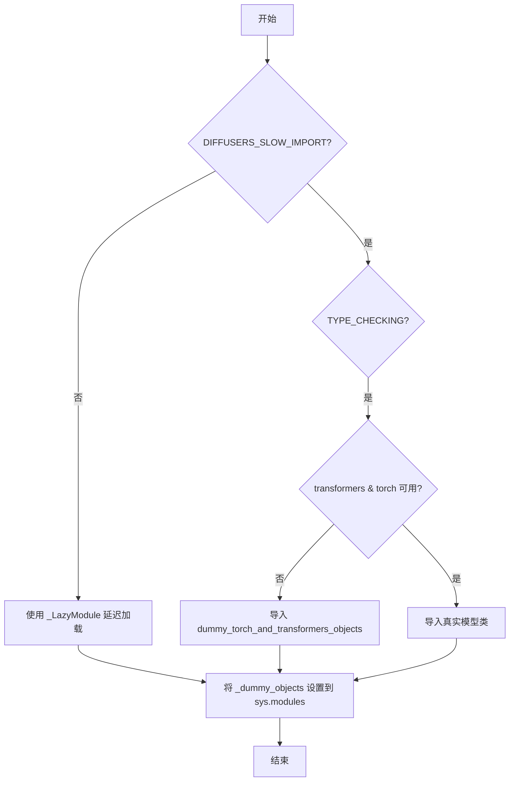
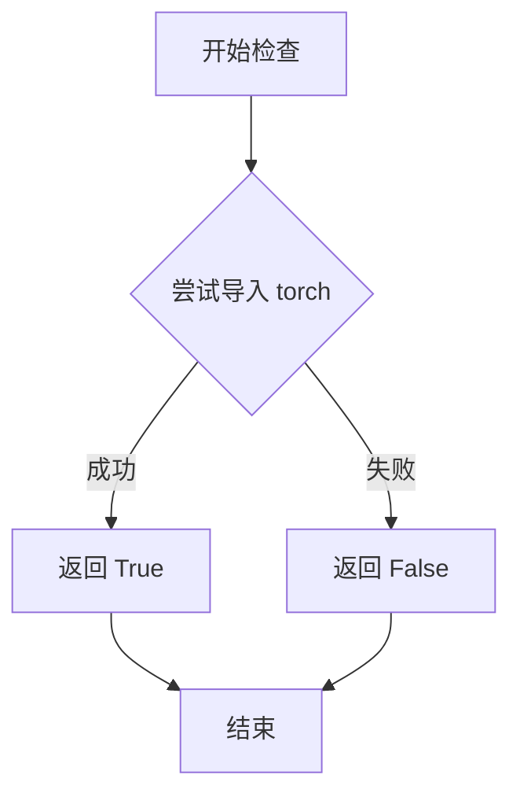
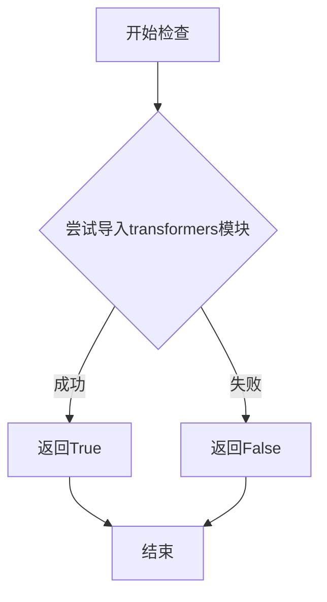
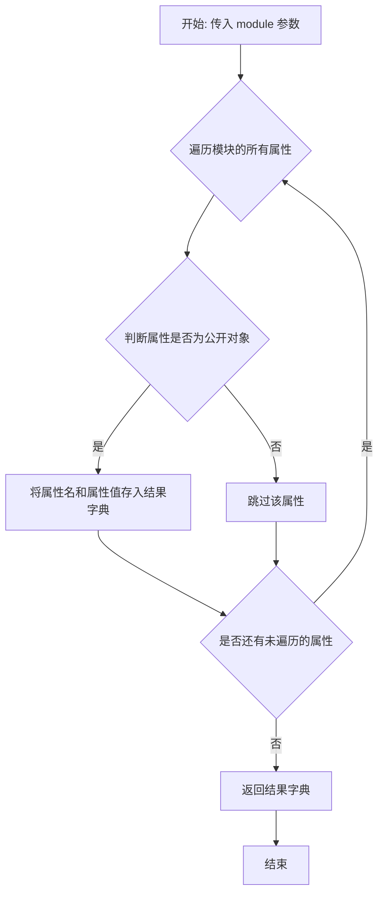
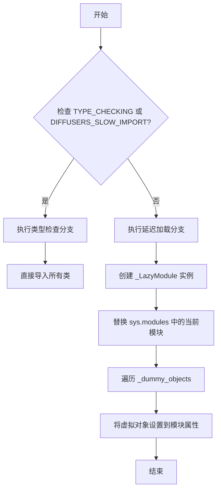

# `diffusers\src\diffusers\pipelines\wuerstchen\__init__.py` 详细设计文档

这是 Diffusers 库中 Wuerstchen 模型系列的模块初始化文件，通过延迟导入机制在运行时动态加载 VQ 模型、DiffNeXt、Prior 模型以及相关的 Pipeline，同时处理 torch 和 transformers 的可选依赖，在依赖不可用时自动回退到虚拟对象。

## 整体流程



## 类结构

```
Wuerstchen 模块 (包初始化)
├── modeling_paella_vq_model
│   └── PaellaVQModel
├── modeling_wuerstchen_diffnext
│   └── WuerstchenDiffNeXt
├── modeling_wuerstchen_prior
│   └── WuerstchenPrior
├── pipeline_wuerstchen
│   └── WuerstchenDecoderPipeline
├── pipeline_wuerstchen_combined
│   └── WuerstchenCombinedPipeline
└── pipeline_wuerstchen_prior
    ├── DEFAULT_STAGE_C_TIMESTEPS
    └── WuerstchenPriorPipeline
```

## 全局变量及字段


### `_dummy_objects`
    
存储虚拟对象的字典，当torch和transformers依赖不可用时使用，用于保持模块导入接口的一致性

类型：`Dict[str, Any]`
    


### `_import_structure`
    
定义模块的导入结构，列出可导入的模型和管道类名

类型：`Dict[str, List[str]]`
    


    

## 全局函数及方法


### `is_torch_available`

该函数用于检查当前环境中是否安装了 PyTorch 并可用。它是一个工具函数，通常在模块初始化时用于条件导入，以确保只有在 PyTorch 可用时才导入相关的模型和管道。

参数：无

返回值：`bool`，返回 `True` 表示 PyTorch 可用，返回 `False` 表示 PyTorch 不可用。

#### 流程图



#### 带注释源码

```python
# 从上级目录的 utils 模块导入 is_torch_available 函数
# 该函数用于检查 PyTorch 是否可用
from ...utils import (
    DIFFUSERS_SLOW_IMPORT,
    OptionalDependencyNotAvailable,
    _LazyModule,
    get_objects_from_module,
    is_torch_available,  # <-- 从 utils 模块导入的函数
    is_transformers_available,
)

# ... (其他代码)

try:
    # 检查条件：transformers 和 torch 都可用时才正常执行
    # 如果任一不可用，则抛出 OptionalDependencyNotAvailable 异常
    if not (is_transformers_available() and is_torch_available()):
        raise OptionalDependencyNotAvailable()
except OptionalDependencyNotAvailable:
    # 异常处理：导入虚拟对象（dummy objects）
    from ...utils import dummy_torch_and_transformers_objects
    _dummy_objects.update(get_objects_from_module(dummy_torch_and_transformers_objects))
else:
    # 正常情况：导入实际的模型和管道类
    _import_structure["modeling_paella_vq_model"] = ["PaellaVQModel"]
    # ... 其他导入
```


### `is_transformers_available`

该函数用于检查当前环境中是否安装了transformers库，通过尝试导入transformers模块来判断其可用性，返回布尔值表示检查结果。

参数：
- 该函数无参数

返回值：`bool`，如果transformers库已安装且可用返回`True`，否则返回`False`

#### 流程图



#### 带注释源码

```python
# 从上层包的utils模块导入is_transformers_available函数
# 该函数用于检测transformers库是否可用
from ...utils import (
    DIFFUSERS_SLOW_IMPORT,
    OptionalDependencyNotAvailable,
    _LazyModule,
    get_objects_from_module,
    is_torch_available,
    is_transformers_available,  # <-- 导入的外部函数，用于检测transformers是否可用
)

# 在代码中使用is_transformers_available进行检查
try:
    # 检查transformers和torch是否都可用
    if not (is_transformers_available() and is_torch_available()):
        # 如果任一库不可用，抛出可选依赖不可用异常
        raise OptionalDependencyNotAvailable()
except OptionalDependencyNotAvailable:
    # 异常处理：导入dummy对象作为替代
    from ...utils import dummy_torch_and_transformers_objects
    _dummy_objects.update(get_objects_from_module(dummy_torch_and_transformers_objects))
else:
    # 如果两个库都可用，则导入实际的模型和管道类
    _import_structure["modeling_paella_vq_model"] = ["PaellaVQModel"]
    _import_structure["modeling_wuerstchen_diffnext"] = ["WuerstchenDiffNeXt"]
    _import_structure["modeling_wuerstchen_prior"] = ["WuerstchenPrior"]
    _import_structure["pipeline_wuerstchen"] = ["WuerstchenDecoderPipeline"]
    _import_structure["pipeline_wuerstchen_combined"] = ["WuerstchenCombinedPipeline"]
    _import_structure["pipeline_wuerstchen_prior"] = ["DEFAULT_STAGE_C_TIMESTEPS", "WuerstchenPriorPipeline"]

# 在TYPE_CHECKING模式下也进行相同的检查
if TYPE_CHECKING or DIFFUSERS_SLOW_IMPORT:
    try:
        if not (is_transformers_available() and is_torch_available()):
            raise OptionalDependencyNotAvailable()
    except OptionalDependencyNotAvailable:
        from ...utils.dummy_torch_and_transformers_objects import *  # noqa F403
    else:
        # 导入实际的模块供类型检查使用
        from .modeling_paella_vq_model import PaellaVQModel
        from .modeling_wuerstchen_diffnext import WuerstchenDiffNeXt
        from .modeling_wuerstchen_prior import WuerstchenPrior
        from .pipeline_wuerstchen import WuerstchenDecoderPipeline
        from .pipeline_wuerstchen_combined import WuerstchenCombinedPipeline
        from .pipeline_wuerstchen_prior import DEFAULT_STAGE_C_TIMESTEPS, WuerstchenPriorPipeline
```

**注意**：由于`is_transformers_available`函数定义在`...utils`模块中（不在当前文件中），上述源码展示了该函数在当前文件中的导入方式和使用场景。实际的函数实现通常位于`...utils`相关文件中，其典型实现方式为：

```python
# is_transformers_available的典型实现（位于...utils模块）
def is_transformers_available() -> bool:
    try:
        import transformers
        return True
    except ImportError:
        return False
```


### `get_objects_from_module`

该函数用于从指定模块中提取所有可导出对象，并将其转换为字典格式返回。通常用于延迟加载（lazy loading）场景下，将虚拟模块（dummy module）中的所有对象收集到 `_dummy_objects` 字典中，以便在真正的依赖不可用时提供替代对象。

参数：

-  `module`：`module`，待提取对象的源模块，通常是一个包含虚拟对象的 dummy 模块（如 `dummy_torch_and_transformers_objects`）

返回值：`dict`，返回键为对象名称、值为对象本身的字典，可直接用于更新其他字典或设置模块属性

#### 流程图



#### 带注释源码

```
# 该函数定义在 ...utils 模块中，此处展示其在当前文件中的调用方式
# 实际实现位于 src/diffusers/utils/__init__.py 或类似位置

# 从 utils 导入该函数
from ...utils import get_objects_from_module

# 使用示例：将 dummy 模块中的所有对象提取到 _dummy_objects 字典
_dummy_objects = {}
_dummy_objects.update(get_objects_from_module(dummy_torch_and_transformers_objects))

# 解释：
# 1. get_objects_from_module 接收一个模块对象作为参数
# 2. 遍历模块中的所有属性，过滤出公开对象（排除私有属性和特殊属性）
# 3. 返回 {属性名: 属性值} 的字典
# 4. 使用 .update() 将返回的字典合并到 _dummy_objects 中
# 5. 后续通过 setattr 将这些对象设置到 lazy module 上，实现延迟导入
```


### `_LazyModule`

`_LazyModule` 是一个从 `...utils` 导入的延迟加载模块类，用于在需要时才导入实际的模块对象，从而优化导入时间和内存占用。在本代码中，它被用于实现可选依赖的延迟加载，当 `transformers` 和 `torch` 都可用时，才真正导入相关的模型和管道类。

参数：

- `__name__`：`str`，当前模块的名称
- `__file__`：`str`，从 `globals()["__file__"]` 获取，当前模块文件的路径
- `_import_structure`：`dict`，定义了可导出对象的字典，键为对象名称，值为对象路径列表
- `module_spec`：`ModuleSpec`，从 `__spec__` 获取，当前模块的规格信息

返回值：`None`，`_LazyModule` 会替换 `sys.modules[__name__]` 中的当前模块

#### 流程图



#### 带注释源码

```python
# 当不是类型检查且不是慢导入模式时，执行延迟加载逻辑
else:
    import sys

    # 使用 _LazyModule 创建延迟加载模块
    # 参数说明：
    # __name__: 当前模块的完全限定名
    # globals()["__file__"]: 当前模块文件的绝对路径
    # _import_structure: 定义了哪些对象可以导出及其来源
    # __spec__: 模块规格信息，包含模块的元数据
    sys.modules[__name__] = _LazyModule(
        __name__,
        globals()["__file__"],
        _import_structure,
        module_spec=__spec__,
    )

    # 遍历所有虚拟对象（当依赖不可用时的替代对象）
    # 将每个虚拟对象设置为延迟加载模块的属性
    # 这样访问这些属性时会触发实际的导入或返回虚拟对象
    for name, value in _dummy_objects.items():
        setattr(sys.modules[__name__], name, value)
```

## 关键组件


### 延迟导入机制

使用`_LazyModule`实现模块的延迟加载，通过`sys.modules[__name__] = _LazyModule(...)`将当前模块替换为延迟加载的代理对象，仅在真正需要时才导入具体的模块，提高导入速度和内存效率

### 可选依赖处理

通过`try-except`捕获`OptionalDependencyNotAvailable`异常，检查`is_transformers_available()`和`is_torch_available()`，在依赖不可用时加载虚拟对象，保证模块在缺少可选依赖时仍能正常导入

### 虚拟对象模式

使用`get_objects_from_module`从`dummy_torch_and_transformers_objects`模块获取虚拟对象，并更新到`_dummy_objects`字典中，通过`setattr`动态添加到模块，替换不可用的实际对象

### 导入结构定义

定义`_import_structure`字典，映射子模块名称到导出的类名列表，包括PaellaVQModel、WuerstchenDiffNeXt、WuerstchenPrior等模型和管道类，实现显式的公共API暴露

### 条件类型检查

使用`TYPE_CHECKING`标志在类型检查时导入实际类型对象，供IDE和类型检查器使用，而不触发实际的模块导入操作，优化开发体验


## 问题及建议


### 已知问题

-   **代码重复**：依赖检查逻辑在两处（运行时try-except块和TYPE_CHECKING分支）完全重复，违反了DRY原则，增加维护成本
-   **使用通配符导入**：在TYPE_CHECKING分支中使用`from ...utils.dummy_torch_and_transformers_objects import *`，不符合Python最佳实践，隐藏了实际导入的符号
-   **缺乏模块文档**：整个文件没有模块级或函数级的docstring，降低了代码可读性和可维护性
-   **魔法字符串与函数调用**：通过函数调用`is_transformers_available()`和`is_torch_available()`进行依赖检查，每次调用都会执行函数，存在轻微性能开销
-   **全局可变状态**：`_dummy_objects`和`_import_structure`作为全局字典，在多处被修改，增加了意外副作用的风险
-   **异常处理冗余**：通过捕获`OptionalDependencyNotAvailable`异常来控制流程，而非使用更直接的条件判断

### 优化建议

-   **提取依赖检查逻辑**：将重复的依赖检查封装为单独的函数或变量，减少代码重复
-   **明确导出列表**：将通配符导入改为显式导入列表，提高代码可读性和静态分析能力
-   **添加文档字符串**：为模块和关键代码块添加文档说明
-   **使用缓存结果**：对依赖检查结果进行缓存，避免重复函数调用
-   **考虑类型提示完善**：在TYPE_CHECKING块中使用显式类型导入而非通配符
-   **简化条件逻辑**：可考虑使用三元运算符或提前返回模式简化异常处理流程


## 其它


### 设计目标与约束

本模块的设计目标是实现Wuerstchen模型库的延迟加载机制，通过可选依赖检查和动态导入来优化导入性能，同时保持API的完整性和一致性。设计约束包括：必须同时满足torch和transformers两个依赖才能导入实际模块，否则使用虚拟对象替代；支持TYPE_CHECKING模式下的类型检查导入；遵循diffusers库的模块组织规范。

### 错误处理与异常设计

本模块主要通过OptionalDependencyNotAvailable异常处理可选依赖缺失的情况。当torch或transformers任一不可用时，抛出OptionalDependencyNotAvailable异常，并从dummy模块加载虚拟对象以保持导入结构完整性。异常处理流程为：先检查依赖可用性，若不可用则捕获异常并更新_dummy_objects；若可用则正常填充_import_structure字典。

### 外部依赖与接口契约

外部依赖包括：torch（is_torch_available）、transformers（is_transformers_available）、diffusers库内部的OptionalDependencyNotAvailable、_LazyModule、get_objects_from_module等工具函数。接口契约方面，本模块对外暴露WuerstchenDiffNeXt、WuerstchenPrior、PaellaVQModel三个模型类，以及WuerstchenDecoderPipeline、WuerstchenCombinedPipeline、WuerstchenPriorPipeline三个管道类，还有一个常量DEFAULT_STAGE_C_TIMESTEPS。所有导入通过LazyModule机制延迟加载。

### 性能考量与优化空间

当前实现在每次导入时都会执行依赖检查，可考虑缓存检查结果以减少重复计算。LazyModule的延迟加载机制已经优化了首次导入性能，但可以通过预加载策略进一步提升冷启动速度。此外，get_objects_from_module遍历整个模块获取对象，在模块较大时可能存在性能瓶颈。

### 模块化与可扩展性设计

模块采用插件式架构，通过_import_structure字典定义导入结构，便于扩展新的模型或管道。添加新组件只需在对应的try-except块中追加导入定义，并在_import_structure中注册。虚拟对象机制确保了即使依赖不可用，模块结构依然完整，提供了良好的向后兼容性。

### 版本兼容性考虑

当前实现假设diffusers库版本支持LazyModule和相关的工具函数。需要确保与不同版本的diffusers库兼容，特别是在get_objects_from_module和OptionalDependencyNotAvailable的实现可能存在差异的情况下。建议在文档中明确标注支持的diffusers版本范围。


    