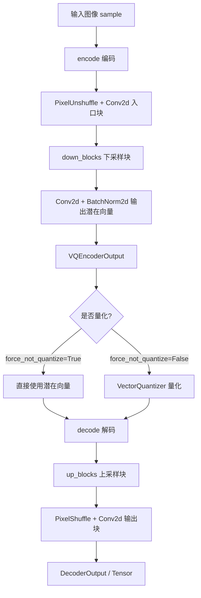
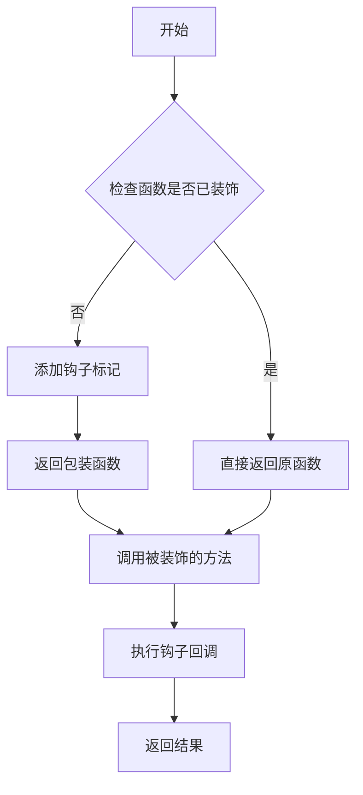
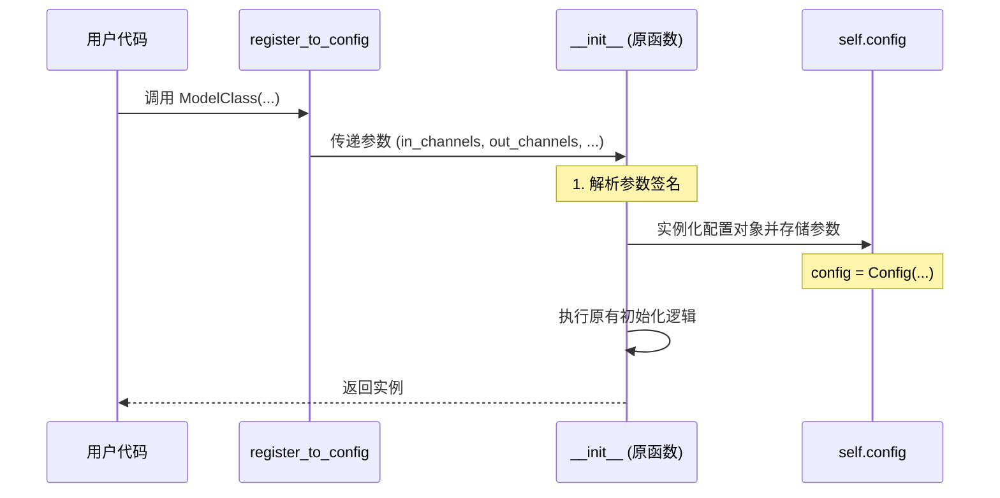
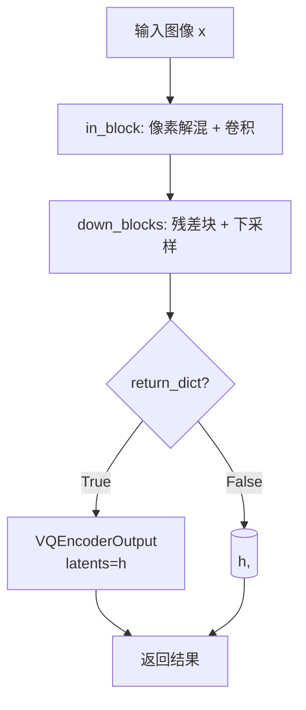
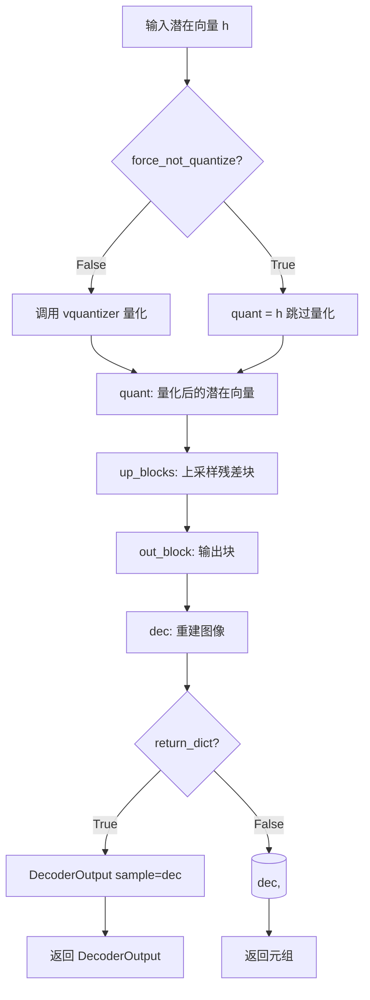
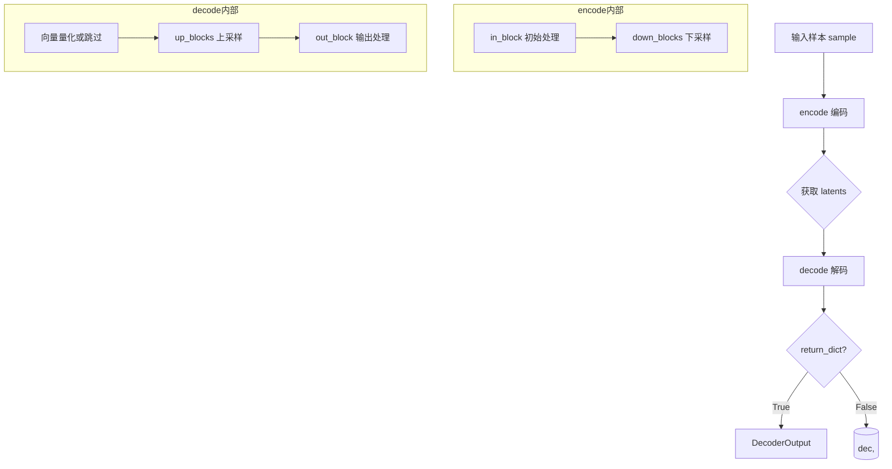

# `diffusers\src\diffusers\pipelines\wuerstchen\modeling_paella_vq_model.py` 详细设计文档

PaellaVQModel是一个基于VQ-VAE（向量量化变分自编码器）的深度学习模型，用于图像的编码和解码。该模型采用混合残差块（MixingResidualBlock）作为核心构建模块，结合向量量化器（VectorQuantizer）实现图像的离散潜在表示学习，支持可配置的通道数、层级数、瓶颈块数量和码本大小等参数。

## 整体流程



## 类结构

```
nn.Module (PyTorch 基类)
├── MixingResidualBlock (残差块)
└── PaellaVQModel (主模型类)
    ├── ModelMixin (HuggingFace 混入类)
    └── ConfigMixin (HuggingFace 配置混入类)
```

## 全局变量及字段


### `c_levels`
    
各层的通道数列表 [embed_dim/(2^0), embed_dim/(2^1), ...]

类型：`list`
    


### `in_channels`
    
输入图像通道数，默认3（RGB）

类型：`int`
    


### `out_channels`
    
输出图像通道数，默认3

类型：`int`
    


### `up_down_scale_factor`
    
上下采样因子，默认2

类型：`int`
    


### `levels`
    
模型层级数，默认2

类型：`int`
    


### `bottleneck_blocks`
    
瓶颈块数量，默认12

类型：`int`
    


### `embed_dim`
    
隐藏通道数，默认384

类型：`int`
    


### `latent_channels`
    
潜在空间通道数，默认4

类型：`int`
    


### `num_vq_embeddings`
    
VQ码本向量数量，默认8192

类型：`int`
    


### `scale_factor`
    
潜在空间缩放因子，默认0.3764

类型：`float`
    


### `MixingResidualBlock.norm1`
    
第一个LayerNorm层，用于深度可分离卷积前

类型：`nn.LayerNorm`
    


### `MixingResidualBlock.depthwise`
    
深度可分离卷积块（ReplicationPad2d + Conv2d）

类型：`nn.Sequential`
    


### `MixingResidualBlock.norm2`
    
第二个LayerNorm层，用于通道方向前

类型：`nn.LayerNorm`
    


### `MixingResidualBlock.channelwise`
    
通道方向全连接块（Linear + GELU + Linear）

类型：`nn.Sequential`
    


### `MixingResidualBlock.gammas`
    
可学习的混合参数，维度为6

类型：`nn.Parameter`
    


### `PaellaVQModel.in_block`
    
入口块（PixelUnshuffle + Conv2d）

类型：`nn.Sequential`
    


### `PaellaVQModel.down_blocks`
    
编码器下采样块

类型：`nn.Sequential`
    


### `PaellaVQModel.vquantizer`
    
向量量化器

类型：`VectorQuantizer`
    


### `PaellaVQModel.up_blocks`
    
解码器上采样块

类型：`nn.Sequential`
    


### `PaellaVQModel.out_block`
    
输出块（Conv2d + PixelShuffle）

类型：`nn.Sequential`
    


### `PaellaVQModel.config`
    
配置对象（继承自装饰器）

类型：`ConfigMixin`
    
    

## 全局函数及方法


### `apply_forward_hook`

该函数是来自 HuggingFace Accelerate 工具库的一个装饰器，用于在模型的 encode/decode 方法上注册前向钩子，实现对模型前向传播过程的拦截和扩展（例如用于分布式训练、梯度检查点等场景）。

参数：

-  `fn`：`Callable`，被装饰的函数或方法（encode 或 decode 方法）

返回值：`Callable`，返回装饰后的函数，添加了钩子支持功能。

#### 流程图



#### 带注释源码

```python
# 这是一个装饰器工厂函数，用于包装模型的方法
# 它来自于 ...utils.accelerate_utils 模块
# 在 PaellaVQModel 中被用于装饰 encode 和 decode 方法

# 使用示例（从代码中提取）:
@apply_forward_hook  # 装饰器应用在 encode 方法上
def encode(self, x: torch.Tensor, return_dict: bool = True) -> VQEncoderOutput:
    h = self.in_block(x)
    h = self.down_blocks(h)
    if not return_dict:
        return (h,)
    return VQEncoderOutput(latents=h)

@apply_forward_hook  # 装饰器应用在 decode 方法上
def decode(
    self, h: torch.Tensor, force_not_quantize: bool = True, return_dict: bool = True
) -> DecoderOutput | torch.Tensor:
    if not force_not_quantize:
        quant, _, _ = self.vquantizer(h)
    else:
        quant = h
    x = self.up_blocks(quant)
    dec = self.out_block(x)
    if not return_dict:
        return (dec,)
    return DecoderOutput(sample=dec)

# 装饰器的作用：
# 1. 标记该方法需要支持钩子功能
# 2. 在方法调用前后执行注册的钩子回调
# 3. 支持 accelerate 库的分布式训练、梯度检查点等高级功能
# 4. 允许用户在不修改模型代码的情况下注入自定义逻辑
```


### `register_to_config`

该函数是 `diffusers` 库中的一个核心装饰器，用于自动将模型类 `__init__` 方法的参数注册并保存到模型的配置（`config`）属性中。这使得模型的实例化参数可以被序列化、存档和复现。

参数：

- `func`：`Callable`，被装饰的函数，通常是模型的 `__init__` 方法。

返回值：`Callable`，返回一个封装后的函数，该函数在执行时会先将参数注册到 `self.config` 中，然后再执行原逻辑。

#### 流程图



#### 带注释源码

由于 `register_to_config` 定义在 `diffusers` 库的 `configuration_utils` 模块中（通过 `from ...configuration_utils import ...` 引入），并非在本文件内部实现。以下为基于 `diffusers` 核心逻辑的典型实现参考：

```python
import inspect
from functools import wraps

def register_to_config(func):
    """
    装饰器：用于将 __init__ 的参数注册到模型的 config 属性中。
    """
    @wraps(func)
    def wrapper(self, *args, **kwargs):
        # 1. 提取 __init__ 方法的签名
        # 获取所有参数名除了 'self'
        sig = inspect.signature(func)
        parameter_names = list(sig.parameters.keys())[1:] 
        
        # 2. 解析传入的参数
        # 将位置参数和关键字参数合并为一个字典
        # 这是一个简化的解析逻辑，真实库中会处理默认值等复杂情况
        bound_args = sig.bind(self, *args, **kwargs)
        bound_args.apply_defaults()
        
        # 3. 分离配置参数
        # 只保留在参数列表中的参数，排除 'kwargs' 等
        config_dict = {
            k: v for k, v in bound_args.arguments.items() 
            if k in parameter_names
        }
        
        # 4. 实例化配置对象 (假设 ConfigMixin 提供了实例化方法)
        # 这里通常调用 self._register_or_config_from_func(...)
        # 实际实现中，ConfigMixin 会维护一个 _config_dict
        if not hasattr(self, 'config') or self.config is None:
             # 假设存在一个配置类，或者使用简单的命名空间/字典
             from dataclasses import dataclass, asdict
             # 创建一个简单的配置对象
             class ModelConfig:
                 pass
             self.config = ModelConfig()
             
        # 5. 将参数注入 config 对象
        for key, value in config_dict.items():
            setattr(self.config, key, value)
            
        # 6. 执行原始的 __init__ 方法
        func(self, *args, **kwargs)
        
    return wrapper
```


### `MixingResidualBlock.__init__`

初始化残差块，设置归一化层、深度可分离卷积、通道级线性层和可学习混合参数，用于Paella VQ-VAE模型中的残差连接和特征混合。

参数：

- `self`：实例本身，MixingResidualBlock，表示当前初始化的是MixingResidualBlock类的实例
- `inp_channels`：`int`，输入通道数，指定输入特征图的通道数量，用于构建LayerNorm和卷积层
- `embed_dim`：`int`，嵌入维度，通道级线性层中间层的维度，用于特征投影和交互

返回值：`None`，无返回值，因为是`__init__`方法，用于初始化对象状态

#### 流程图

```mermaid
graph TD
    A[开始 __init__] --> B[调用父类nn.Module的初始化]
    B --> C[创建norm1: LayerNorm<br/>inp_channels, elementwise_affine=False, eps=1e-6]
    C --> D[创建depthwise分支<br/>ReplicationPad2d(1) + Conv2d<br/>kernel_size=3, groups=inp_channels]
    D --> E[创建norm2: LayerNorm<br/>inp_channels, elementwise_affine=False, eps=1e-6]
    E --> F[创建channelwise分支<br/>Linear -> GELU -> Linear<br/>inp_channels -> embed_dim -> inp_channels]
    F --> G[创建gammas参数<br/>torch.zeros(6), requires_grad=True]
    G --> H[结束初始化]
    
    style A fill:#e1f5fe
    style H fill:#e1f5fe
    style C fill:#fff3e0
    style D fill:#fff3e0
    style E fill:#fff3e0
    style F fill:#fff3e0
    style G fill:#fff3e0
```

#### 带注释源码

```python
def __init__(self, inp_channels, embed_dim):
    """
    初始化MixingResidualBlock残差块
    
    参数:
        inp_channels: 输入通道数
        embed_dim: 嵌入维度，用于通道级线性变换的中间层
    """
    # 调用父类nn.Module的初始化方法，注册所有子模块
    super().__init__()
    
    # ====== 深度可分离分支 (Depthwise Branch) ======
    # 第一个归一化层：对通道维度进行LayerNorm
    # elementwise_affine=False 表示不学习仿射参数，eps=1e-6防止除零
    self.norm1 = nn.LayerNorm(inp_channels, elementwise_affine=False, eps=1e-6)
    
    # 深度可分离卷积：包含填充和分组卷积
    # ReplicationPad2d(1): 复制填充，保持特征图尺寸
    # Conv2d with groups=inp_channels: 深度可分离卷积，每个通道独立卷积
    self.depthwise = nn.Sequential(
        nn.ReplicationPad2d(1), 
        nn.Conv2d(inp_channels, inp_channels, kernel_size=3, groups=inp_channels)
    )

    # ====== 通道级分支 (Channelwise Branch) ======
    # 第二个归一化层：结构同norm1
    self.norm2 = nn.LayerNorm(inp_channels, elementwise_affine=False, eps=1e-6)
    
    # 通道级全连接层：先升维到embed_dim，经过GELU激活，再降维回inp_channels
    # 实现了通道间信息的交互和变换
    self.channelwise = nn.Sequential(
        nn.Linear(inp_channels, embed_dim), 
        nn.GELU(), 
        nn.Linear(embed_dim, inp_channels)
    )

    # ====== 可学习混合参数 ======
    # 6个gamma参数用于控制残差连接的混合权重
    # [0]: norm1的缩放因子, [1]: norm1的偏置
    # [2]: depthwise的缩放因子, [3]: norm2的缩放因子
    # [4]: norm2的偏置, [5]: channelwise的缩放因子
    self.gammas = nn.Parameter(torch.zeros(6), requires_grad=True)
```


### MixingResidualBlock.forward

执行混合残差块的前向传播，通过两个阶段的混合操作（depthwise卷积和channelwise线性变换）对输入特征进行变换，每个阶段包含LayerNorm归一化、可学习的gamma参数控制的缩放与偏移，以及残差连接，最终输出经过混合残差处理后的特征张量。

参数：

- `self`：`MixingResidualBlock`，MixingResidualBlock类的实例，隐式参数
- `x`：`torch.Tensor`，输入张量，形状为 (batch_size, channels, height, width)，表示批量输入的特征图

返回值：`torch.Tensor`，经过混合残差块处理后的输出张量，形状与输入相同 (batch_size, channels, height, width)

#### 流程图

```mermaid
flowchart TD
    A[输入 x: torch.Tensor<br/>形状: (B, C, H, W)] --> B[获取可学习参数 mods = self.gammas<br/>形状: (6,)]
    
    B --> C[第一阶段: Depthwise卷积路径]
    
    C --> D[norm1 归一化<br/>输入permute后形状: (B, H, W, C)<br/>输出permute回: (B, C, H, W)]
    D --> E[乘以 (1 + mods[0]) 并加 mods[1]<br/>进行仿射变换]
    E --> F[depthwise卷积处理<br/>ReplicationPad2d + Conv2d<br/>groups=inp_channels]
    F --> G[乘以 mods[2] 进行缩放]
    G --> H[残差连接: x = x + result]
    
    H --> I[第二阶段: Channelwise线性变换路径]
    
    I --> J[norm2 归一化<br/>输入permute后形状: (B, H, W, C)<br/>输出permute回: (B, C, H, W)]
    J --> K[乘以 (1 + mods[3]) 并加 mods[4]<br/>进行仿射变换]
    K --> L[channelwise线性层<br/>Linear -> GELU -> Linear<br/>维度: inp_channels -> embed_dim -> inp_channels]
    L --> M[乘以 mods[5] 进行缩放]
    M --> N[残差连接: x = x + result]
    
    N --> O[输出 x: torch.Tensor<br/>形状: (B, C, H, W)]
    
    style A fill:#e1f5fe
    style O fill:#e8f5e8
    style B fill:#fff3e0
    style H fill:#fce4ec
    style N fill:#fce4ec
```

#### 带注释源码

```python
def forward(self, x):
    """
    MixingResidualBlock的前向传播方法，执行混合残差连接
    
    该方法包含两个阶段的处理路径：
    1. Depthwise卷积路径：使用depthwise卷积进行空间特征提取
    2. Channelwise线性路径：使用全连接层进行通道特征变换
    
    每个阶段都使用可学习的gamma参数进行混合控制，
    包括缩放因子(1+mods[i])和偏移因子mods[i+1]
    
    参数:
        x: 输入张量，形状为 (batch_size, channels, height, width)
           即 (B, C, H, W) 格式的4D张量
    
    返回:
        经过混合残差块处理后的输出张量，形状与输入相同 (B, C, H, W)
    """
    
    # 获取可学习的混合参数gamma，形状为 (6,)
    # 这6个参数分别控制两个阶段的缩放和偏移:
    # mods[0], mods[1] -> 第一阶段缩放和偏移
    # mods[2] -> 第一阶段卷积输出的缩放
    # mods[3], mods[4] -> 第二阶段缩放和偏移
    # mods[5] -> 第二阶段线性层输出的缩放
    mods = self.gammas
    
    # ==================== 第一阶段: Depthwise卷积路径 ====================
    
    # 步骤1: 归一化 - 将通道维移到最后进行LayerNorm
    # x原始形状: (B, C, H, W) -> permute后: (B, H, W, C)
    # norm1对最后一维(C)进行归一化，然后permute回: (B, C, H, W)
    x_temp = self.norm1(x.permute(0, 2, 3, 1)).permute(0, 3, 1, 2)
    
    # 步骤2: 仿射变换 - 使用gamma参数进行缩放和偏移
    # (1 + mods[0]) 提供一个接近1的初始缩放因子，避免训练初期梯度消失
    # mods[1] 提供可学习的偏移
    x_temp = x_temp * (1 + mods[0]) + mods[1]
    
    # 步骤3: Depthwise卷积 - 使用3x3卷积核，groups=channels
    # ReplicationPad2d(1) 在空间维度周围填充1个像素
    # depthwise卷积对每个通道独立进行卷积操作
    # 输出形状保持 (B, C, H, W)
    x_temp = self.depthwise(x_temp)
    
    # 步骤4: 缩放残差连接
    # 使用mods[2]对卷积结果进行缩放，然后加到原始输入x上
    # 这是一个残差连接，帮助梯度流动和特征复用
    x = x + x_temp * mods[2]
    
    # ==================== 第二阶段: Channelwise线性变换路径 ====================
    
    # 步骤5: 归一化 - 同样将通道维移到最后进行LayerNorm
    x_temp = self.norm2(x.permute(0, 2, 3, 1)).permute(0, 3, 1, 2)
    
    # 步骤6: 仿射变换 - 使用gamma参数进行缩放和偏移
    x_temp = x_temp * (1 + mods[3]) + mods[4]
    
    # 步骤7: Channelwise线性变换
    # 需要先将形状从 (B, C, H, W) 转换为 (B, H*W, C) 进行线性操作
    # Linear: C -> embed_dim (expand维度)
    # GELU: 非线性激活
    # Linear: embed_dim -> C (contract维度)
    # 最后permute回 (B, C, H, W)
    x_temp = self.channelwise(x_temp.permute(0, 2, 3, 1)).permute(0, 3, 1, 2)
    
    # 步骤8: 缩放残差连接
    # 使用mods[5]对线性变换结果进行缩放，然后加到当前x上
    x = x + x_temp * mods[5]
    
    # 返回经过两阶段混合残差处理后的输出
    return x
```


### `PaellaVQModel.__init__`

该方法是PaellaVQModel类的构造函数，负责初始化Paella VQ-VAE（向量量化变分自编码器）模型的所有组件，包括输入处理块、编码器下采样块、向量量化器、解码器上采样块和输出块，并配置模型的各种超参数如通道数、层级数、瓶颈块数、嵌入维度、潜在通道数、码本大小和缩放因子。

参数：

- `in_channels`：`int`，输入图像的通道数，默认为3（RGB图像）
- `out_channels`：`int`，输出图像的通道数，默认为3
- `up_down_scale_factor`：`int`，输入图像的上/下采样因子，默认为2
- `levels`：`int`，模型中的层级数量，默认为2
- `bottleneck_blocks`：`int`，瓶颈区域的残差块数量，默认为12
- `embed_dim`：`int`，模型中的隐藏通道数，默认为384
- `latent_channels`：`int`，VQ-VAE模型中潜在空间的通道数，默认为4
- `num_vq_embeddings`：`int`，VQ-VAE中码本向量的数量，默认为8192
- `scale_factor`：`float`，潜在空间的缩放因子，默认为0.3764

返回值：`None`，该方法为构造函数，不返回任何值

#### 流程图

```mermaid
flowchart TD
    A[开始 __init__] --> B[调用 super().__init__]
    B --> C[计算各层级通道数 c_levels]
    C --> D[创建输入块 in_block]
    D --> E[构建下采样编码器块 down_blocks]
    E --> F[创建向量量化器 vquantizer]
    F --> G[构建上采样解码器块 up_blocks]
    G --> H[创建输出块 out_block]
    H --> I[结束 __init__]
    
    C --> C1[c_levels = [embed_dim // 2^0, embed_dim // 2^1, ...]]
    D --> D1[PixelUnshuffle + Conv2d]
    E --> E1[MixingResidualBlock循环 + 最终Conv2d + BatchNorm2d]
    F --> F1[VectorQuantizer配置]
    G --> G1[Conv2d + MixingResidualBlock循环 + ConvTranspose2d]
    H --> H1[Conv2d + PixelShuffle]
```

#### 带注释源码

```python
@register_to_config
def __init__(
    self,
    in_channels: int = 3,              # 输入图像通道数，默认为3（RGB）
    out_channels: int = 3,             # 输出图像通道数，默认为3
    up_down_scale_factor: int = 2,     # 上下采样因子，控制图像分辨率变化
    levels: int = 2,                   # 模型层级数，决定网络深度
    bottleneck_blocks: int = 12,       # 瓶颈块数量，VQ瓶颈处的残差块数
    embed_dim: int = 384,              # 嵌入维度，主隐藏通道数
    latent_channels: int = 4,          # 潜在通道数，量化后的表示维度
    num_vq_embeddings: int = 8192,     # VQ码本大小，潜在空间的离散token数
    scale_factor: float = 0.3764,      # 缩放因子，用于归一化潜在空间
):
    """
    初始化Paella VQ-VAE模型的所有组件。
    
    该方法构建完整的编码器-解码器架构：
    - 编码器：输入 -> in_block -> down_blocks -> 潜在表示
    - 量化器：将连续潜在表示离散化
    - 解码器：离散表示 -> up_blocks -> out_block -> 输出
    """
    super().__init__()  # 调用基类初始化

    # 计算各层级的通道数
    # 例如：levels=2, embed_dim=384 -> c_levels = [384, 192]
    c_levels = [embed_dim // (2**i) for i in reversed(range(levels))]

    # ==================== 编码器部分 ====================
    # 输入块：执行像素重排以减小分辨率，然后投影到嵌入维度
    self.in_block = nn.Sequential(
        nn.PixelUnpackel(up_down_scale_factor),  # 像素重排：H*2, W*2 -> H, W, 通道*4
        nn.Conv2d(in_channels * up_down_scale_factor**2, c_levels[0], kernel_size=1),
    )

    # 下采样块：逐步降低分辨率，同时提取特征
    down_blocks = []
    for i in range(levels):
        # 除了第一层外，每层之间添加下采样卷积
        if i > 0:
            down_blocks.append(
                nn.Conv2d(c_levels[i - 1], c_levels[i], kernel_size=4, stride=2, padding=1)
            )
        # 添加混合残差块（MixingResidualBlock）
        block = MixingResidualBlock(c_levels[i], c_levels[i] * 4)
        down_blocks.append(block)
    
    # 最终投影到潜在空间，并进行批归一化
    down_blocks.append(
        nn.Sequential(
            nn.Conv2d(c_levels[-1], latent_channels, kernel_size=1, bias=False),
            nn.BatchNorm2d(latent_channels),  # 归一化使潜在向量均值为0，标准差为1
        )
    )
    self.down_blocks = nn.Sequential(*down_blocks)

    # ==================== 向量量化器 ====================
    # 使用VectorQuantizer将连续潜在表示离散化为码本索引
    self.vquantizer = VectorQuantizer(
        num_vq_embeddings,      # 码本大小（离散token数量）
        vq_embed_dim=latent_channels,  # 潜在向量维度
        legacy=False,           # 使用新版本实现
        beta=0.25,              # VQ损失权重
    )

    # ==================== 解码器部分 ====================
    # 上采样块：从潜在空间逐步恢复到原始分辨率
    up_blocks = [nn.Sequential(nn.Conv2d(latent_channels, c_levels[-1], kernel_size=1))]
    
    for i in range(levels):
        # 第一层（i=0）使用bottleneck_blocks个残差块，其他层用1个
        for j in range(bottleneck_blocks if i == 0 else 1):
            block = MixingResidualBlock(c_levels[levels - 1 - i], c_levels[levels - 1 - i] * 4)
            up_blocks.append(block)
        
        # 除了最后一层外，添加上采样转置卷积
        if i < levels - 1:
            up_blocks.append(
                nn.ConvTranspose2d(
                    c_levels[levels - 1 - i],
                    c_levels[levels - 2 - i],
                    kernel_size=4,
                    stride=2,
                    padding=1,
                )
            )
    
    self.up_blocks = nn.Sequential(*up_blocks)

    # 输出块：最终通道变换和像素重排以恢复原始分辨率
    self.out_block = nn.Sequential(
        nn.Conv2d(c_levels[0], out_channels * up_down_scale_factor**2, kernel_size=1),
        nn.PixelShuffle(up_down_scale_factor),  # 像素重排：H, W, 通道*4 -> H*2, W*2
    )
```


### `PaellaVQModel.encode`

该方法接收输入图像张量，通过编码器块进行处理，输出潜在向量表示，支持返回字典格式的 VQEncoderOutput 或元组形式。

参数：

- `self`：`PaellaVQModel`，隐式参数，模型的实例本身
- `x`：`torch.Tensor`，输入图像张量，形状通常为 (batch_size, channels, height, width)
- `return_dict`：`bool`，可选，默认为 `True`，是否返回字典格式的 VQEncoderOutput，若为 False 则返回元组

返回值：`VQEncoderOutput | tuple`，编码后的潜在向量表示。当 `return_dict=True` 时返回 `VQEncoderOutput(latents=h)`，否则返回元组 `(h,)`

#### 流程图



#### 带注释源码

```python
@apply_forward_hook
def encode(self, x: torch.Tensor, return_dict: bool = True) -> VQEncoderOutput:
    """
    编码输入图像为潜在向量表示。
    
    参数:
        x: 输入图像张量，形状为 (batch_size, channels, height, width)
        return_dict: 是否返回字典格式的结果，默认为 True
        
    返回:
        VQEncoderOutput 或元组，取决于 return_dict 参数
    """
    # 第一步：通过输入块处理
    # in_block 包含 PixelUnshuffle（像素解混，将图像分辨率降低）和 1x1 卷积
    h = self.in_block(x)
    
    # 第二步：通过下采样块处理
    # down_blocks 包含多个 MixingResidualBlock 和下采样卷积操作
    h = self.down_blocks(h)

    # 第三步：根据 return_dict 参数决定返回格式
    if not return_dict:
        # 返回元组格式，兼容旧版 API
        return (h,)

    # 返回 VQEncoderOutput 对象，包含编码后的潜在向量
    return VQEncoderOutput(latents=h)
```


### `PaellaVQModel.decode`

该方法是 Paella VQ-VAE 模型的解码器核心实现，负责将编码后的潜在向量（latent vector）转换为重建的图像样本。当 `force_not_quantize` 为 False 时，会先经过向量量化器（VectorQuantizer）进行量化处理，最后通过上采样块和输出块生成最终图像。

#### 参数

- `self`：`PaellaVQModel`，PaellaVQModel 类实例本身
- `h`：`torch.Tensor`，编码后的潜在向量或潜在空间特征，形状为 (batch, latent_channels, height, width)
- `force_not_quantize`：`bool`，是否跳过向量量化步骤。默认为 True，表示直接使用输入的潜在向量而不进行量化
- `return_dict`：`bool`，是否以字典形式返回结果。默认为 True，表示返回 `DecoderOutput` 对象；否则返回元组

#### 返回值

- `DecoderOutput | torch.Tensor`：如果 `return_dict` 为 True，返回包含重建样本的 `DecoderOutput` 对象；否则返回元组 `(dec,)`

#### 流程图



#### 带注释源码

```python
@apply_forward_hook
def decode(
    self, h: torch.Tensor, force_not_quantize: bool = True, return_dict: bool = True
) -> DecoderOutput | torch.Tensor:
    """
    将潜在向量解码为重建图像样本。
    
    参数:
        h: 编码后的潜在向量，形状为 (batch, latent_channels, H, W)
        force_not_quantize: 是否跳过向量量化，默认 True 直接使用潜在向量
        return_dict: 是否返回字典格式，默认 True 返回 DecoderOutput
    
    返回:
        DecoderOutput 或元组，取决于 return_dict 参数
    """
    # 根据 force_not_quantize 决定是否进行向量量化
    if not force_not_quantize:
        # 调用向量量化器进行量化，quant 为量化后的嵌入向量
        quant, _, _ = self.vquantizer(h)
    else:
        # 直接使用输入的潜在向量，不进行量化
        quant = h

    # 通过上采样块（up_blocks）处理量化后的潜在向量
    # up_blocks 包含多个 MixingResidualBlock 和转置卷积
    x = self.up_blocks(quant)
    
    # 通过输出块（out_block）生成最终重建图像
    # 包含卷积和 PixelShuffle 操作，将特征转换为图像
    dec = self.out_block(x)
    
    # 根据 return_dict 决定返回格式
    if not return_dict:
        # 返回元组格式
        return (dec,)

    # 返回 DecoderOutput 对象，包含重建的样本
    return DecoderOutput(sample=dec)
```


### `PaellaVQModel.forward`

完整前向传播方法，整合编码器和解码器完成图像的VQ-VAE处理流程。

参数：

- `self`：`PaellaVQModel` 实例，当前模型对象
- `sample`：`torch.Tensor`，输入图像样本张量
- `return_dict`：`bool`，是否返回 `DecoderOutput` 对象（默认为 `True`）

返回值：`DecoderOutput | torch.Tensor`，当 `return_dict=True` 时返回 `DecoderOutput` 对象，包含重建的图像样本；当 `return_dict=False` 时返回元组 `(dec,)`

#### 流程图



#### 带注释源码

```python
def forward(self, sample: torch.Tensor, return_dict: bool = True) -> DecoderOutput | torch.Tensor:
    r"""
    Args:
        sample (`torch.Tensor`): 输入样本（图像张量）
        return_dict (`bool`, *optional*, defaults to `True`):
            是否返回 [`DecoderOutput`] 而非普通元组
    """
    # 1. 将输入样本赋值给变量 x
    x = sample
    
    # 2. 调用 encode 方法进行编码：
    #    - 通过 in_block 进行初始像素解 shuffle 和通道变换
    #    - 通过 down_blocks 进行下采样和残差块处理
    #    - 返回 VQEncoderOutput，其中包含 latents（潜在表示）
    h = self.encode(x).latents
    
    # 3. 调用 decode 方法进行解码：
    #    - 接收潜在表示 h
    #    - 通过 vquantizer 进行向量量化（或跳过）
    #    - 通过 up_blocks 进行上采样
    #    - 通过 out_block 进行最终处理（像素 shuffle）
    #    - 返回 DecoderOutput，其中包含 sample（重建图像）
    dec = self.decode(h).sample

    # 4. 根据 return_dict 决定返回格式
    if not return_dict:
        # 返回元组格式
        return (dec,)

    # 返回 DecoderOutput 对象格式
    return DecoderOutput(sample=dec)
```

## 关键组件


### MixingResidualBlock

混合残差块，用于 Paella VQ-VAE 模型的核心组件，包含深度可分离卷积和逐通道线性变换，通过可学习的 gamma 参数实现特征混合与残差连接。

### PaellaVQModel

Paella VQ-VAE 模型的完整实现，继承自 ModelMixin 和 ConfigMixin，包含编码器、解码器和向量量化器，支持图像的潜在空间表示与重建。

### Encoder（编码器组件）

由 in_block 和 down_blocks 组成，使用 PixelUnshuffle 进行下采样，通过多个 MixingResidualBlock 进行特征提取，最终输出潜在表示。

### VectorQuantizer（向量量化器）

使用 VectorQuantizer 实现离散潜在空间的量化，将连续潜在向量映射到码本条目，支持 8192 个码本向量（默认配置）。

### Decoder（解码器组件）

由 up_blocks 和 out_block 组成，通过 MixingResidualBlock 进行特征上采样，使用 PixelShuffle 进行上采样重建图像。

### PixelUnshuffle/PixelShuffle

图像空间转换组件，实现 2x2 像素块的重组与逆重组，用于实现高效的空间上/下采样而不引入额外参数。

### Gamma 参数

MixingResidualBlock 中的可学习参数 gammas（维度为 6），用于控制残差路径的缩放和偏置，实现特征混合的动态调节。

### encode/decode 方法

encode 方法将输入图像编码为潜在表示；decode 方法将潜在表示解码为重建图像，支持 force_not_quantize 参数控制是否绕过量化器。

### VQEncoderOutput/DecoderOutput

输出数据结构封装类，用于规范化的模型输出格式，包含 latents 和 sample 属性。

### ConfigMixin 配置系统

通过 @register_to_config 装饰器实现配置参数注册，支持模型的可配置化初始化，包括通道数、层级数、瓶颈块数等超参数。


## 问题及建议


### 已知问题

- **硬编码的超参数**：scale_factor=0.3764和beta=0.25是硬编码的魔法数字，缺乏注释说明其来源和作用，降低了代码可维护性
- **不清晰的变量命名**：c_levels、bottleneck_blocks、embed_dim等变量名缺乏明确的语义说明，c_levels的计算逻辑较难理解
- **force_not_quantize参数语义模糊**：decode方法中的force_not_quantize参数命名不够直观，true表示不量化、false表示量化的逻辑与直觉相反
- **gammas参数缺乏说明**：MixingResidualBlock中的gammas参数初始化为长度为6的零向量，但没有注释说明这6个值的具体作用和意义
- **重复的通道维度计算**：c_levels[i] * 4在多处重复出现，应该提取为常量或辅助方法
- **encode方法缺少force_not_quantize选项**：encode方法不支持强制不量化的选项，导致forward必须走完整流程才能获取中间结果

### 优化建议

- **添加配置常量**：将scale_factor、beta等超参数提取为类级别常量或配置项，并添加详细注释说明其物理意义和调参建议
- **重构通道维度计算**：将embed_dim * 4的计算逻辑封装为方法，如get_expanded_dim(embed_dim)，提高代码可读性
- **改进参数命名**：将force_not_quantize改为更语义化的名称，如enable_quantization（默认false），或添加quantize参数（默认true）使逻辑更直观
- **增强文档注释**：为gammas参数的6个维度添加详细说明，解释每个维度对应哪个归一化或混合操作
- **统一encode/decode接口**：考虑在encode方法中添加quantize参数，保持编码解码接口的一致性
- **提取模型构建逻辑**：将down_blocks和up_blocks的构建逻辑拆分为独立的私有方法，如_build_encoder和_build_decoder，提高代码模块化程度

## 其它


### 设计目标与约束

本代码实现Paella模型的VQ-VAE（向量量化变分自编码器），核心目标是高效的图像压缩与重建。设计约束包括：1）支持可配置的通道数、层级数和瓶颈块数；2）遵循HuggingFace Diffusers库的ModelMixin和ConfigMixin架构规范；3）使用向量量化实现离散潜在空间表示；4）通过残差块和混合机制提升重建质量。

### 错误处理与异常设计

本模块主要依赖HuggingFace基础库的错误处理机制，未实现显式的自定义异常。关键风险点：1）输入张量维度不匹配时，PyTorch自动抛出维度错误；2）num_vq_embeddings过小时可能导致量化失败；3）encode/decode方法中return_dict参数控制返回值格式，需确保调用方正确处理。

### 数据流与状态机

数据流：输入图像 → PixelUnshuffle降采样 → Encoder blocks（含MixingResidualBlock）→ 潜在向量 → VectorQuantizer量化（可选）→ Decoder blocks → PixelShuffle上采样 → 输出图像。状态机主要体现在forward方法中的encode→decode两阶段处理，量化器可选择跳过（force_not_quantize=True）。

### 外部依赖与接口契约

依赖：torch、torch.nn、configuration_utils（ConfigMixin, register_to_config）、models.autoencoders.vae（DecoderOutput, VectorQuantizer）、models.modeling_utils（ModelMixin）、models.vq_model（VQEncoderOutput）、utils.accelerate_utils（apply_forward_hook）。接口契约：encode方法接受(torch.Tensor, bool)返回VQEncoderOutput；decode方法接受(torch.Tensor, bool, bool)返回DecoderOutput；forward方法接受(torch.Tensor, bool)返回DecoderOutput。

### 配置参数详解

config参数包含：in_channels/out_channels（默认3，RGB图像）、up_down_scale_factor（默认2，控制分辨率变化）、levels（默认2，编码器/解码器层级数）、bottleneck_blocks（默认12，首层瓶颈块数）、embed_dim（默认384，隐藏通道基数）、latent_channels（默认4，潜在空间维度）、num_vq_embeddings（默认8192，码本大小）、scale_factor（默认0.3764，潜在空间缩放因子）。

### 潜在优化空间

1）MixingResidualBlock中depthwise和channelwise计算可融合以减少内存拷贝；2）VectorQuantizer的legacy=False模式可进一步优化；3）可添加梯度 checkpointing 以支持更大分辨率图像；4）gammas参数初始化为全零可能导致训练初期梯度消失，建议使用Xavier初始化；5）BatchNorm2d后未使用激活函数，可考虑融合。

### 版本兼容性说明

代码基于HuggingFace Diffusers库设计，兼容版本需包含：ConfigMixin、register_to_config、ModelMixin、VQEncoderOutput、DecoderOutput、VectorQuantizer、apply_forward_hook。PaellaVQModel继承自ModelMixin和ConfigMixin，支持标准的save_pretrained/from_pretrained方法。

    