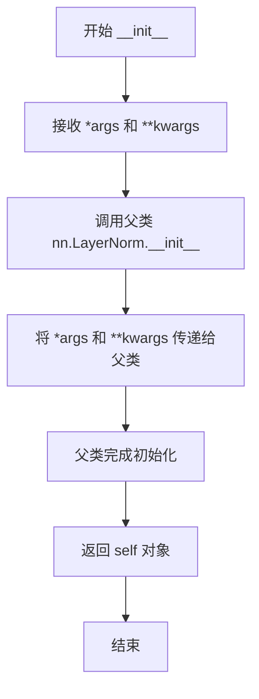
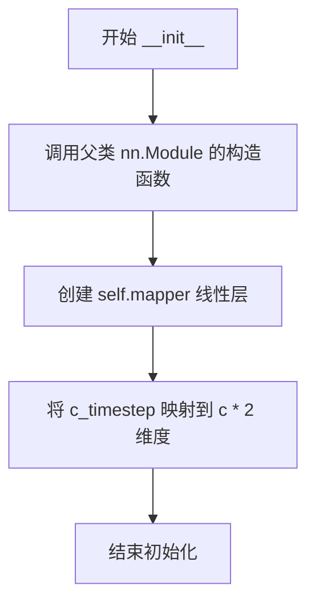
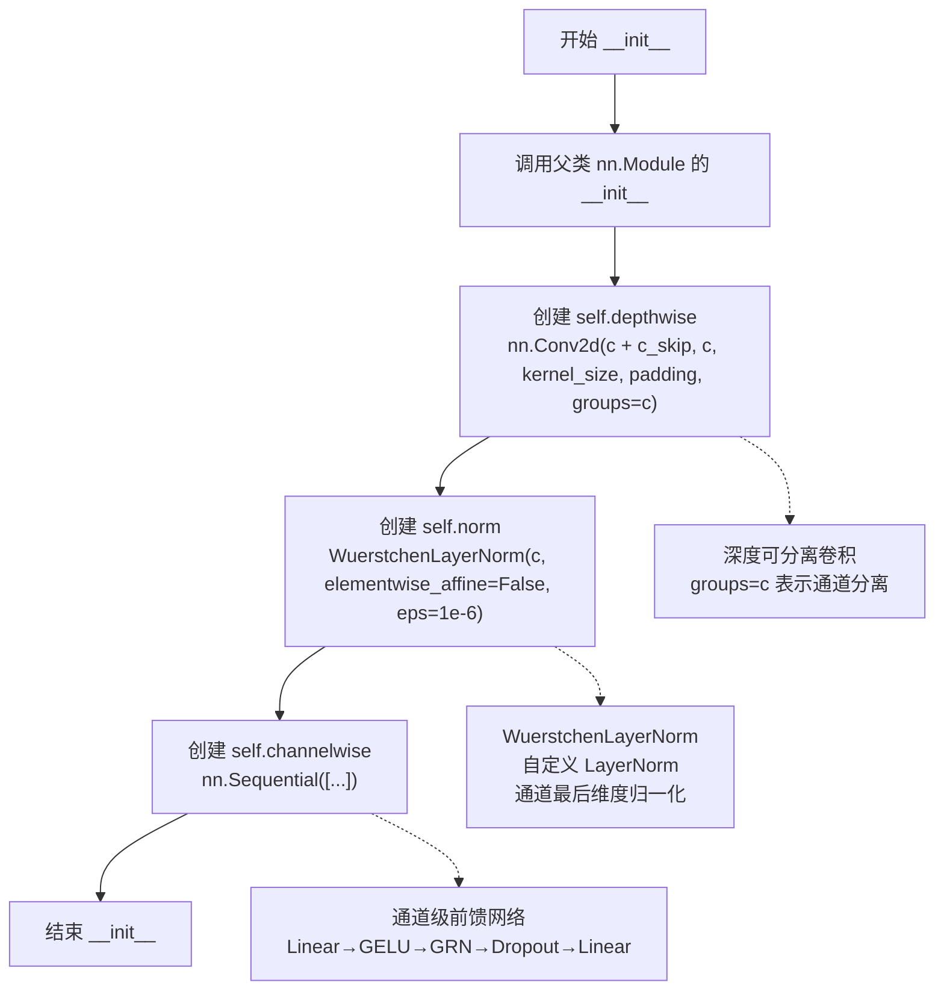
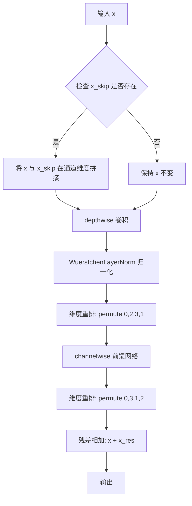
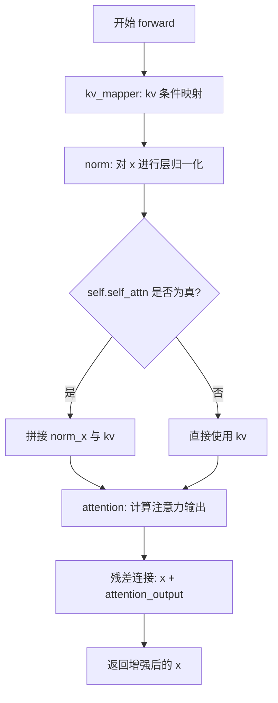

# `diffusers\src\diffusers\pipelines\wuerstchen\modeling_wuerstchen_common.py` 详细设计文档

该代码实现了一个用于Wuerstchen模型（高效扩散模型架构）的神经网络组件库，包含自定义层归一化、时间步映射、残差块、全局响应归一化和注意力块等核心模块，用于构建高性能的文本到图像生成模型。

## 整体流程

```mermaid
graph TD
A[输入张量 x, 时间步 t, 条件 kv] --> B[选择网络层类型]
B --> C{WuerstchenLayerNorm}
B --> D{TimestepBlock}
B --> E{ResBlock}
B --> F{GlobalResponseNorm}
B --> G{AttnBlock}
C --> C1[维度重排: (B,C,H,W) -> (B,H,W,C)]
C1 --> C2[调用父类LayerNorm]
C2 --> C3[维度重排: (B,H,W,C) -> (B,C,H,W)]
D --> D1[线性映射时间步: t -> (a,b)]
D1 --> D2[残差计算: x * (1 + a) + b]
E --> E1[深度可分离卷积]
E1 --> E2[层归一化]
E2 --> E3[通道MLP处理]
E3 --> E4[残差连接输出]
F --> F1[计算L2范数]
F1 --> F2[归一化处理]
F2 --> F3[可学习参数调整]
G --> G1[条件特征映射]
G1 --> G2[自注意力或交叉注意力]
G2 --> G3[残差连接输出]
```

## 类结构

```
nn.Module (PyTorch基类)
├── WuerstchenLayerNorm (自定义层归一化)
├── TimestepBlock (时间步映射块)
├── ResBlock (残差块)
│   ├── nn.Conv2d (深度可分离卷积)
│   ├── WuerstchenLayerNorm
│   └── Channelwise MLP (序列模块)
├── GlobalResponseNorm (全局响应归一化)
│   └── nn.Parameter (gamma, beta)
└── AttnBlock (注意力块)
    ├── WuerstchenLayerNorm
    ├── Attention (注意力处理器)
    └── nn.Sequential (条件映射)
```

## 全局变量及字段


### `TimestepBlock.mapper`
    
线性映射层，将时间步嵌入向量映射到两倍的通道数，用于计算缩放和偏移参数

类型：`nn.Linear`
    


### `ResBlock.depthwise`
    
深度可分离卷积层，用于对输入特征进行空间域的特征提取

类型：`nn.Conv2d`
    


### `ResBlock.norm`
    
层归一化层，对特征进行通道维度的归一化处理

类型：`WuerstchenLayerNorm`
    


### `ResBlock.channelwise`
    
通道级前馈网络，包含线性变换、GELU激活、全局响应归一化和dropout

类型：`nn.Sequential`
    


### `GlobalResponseNorm.gamma`
    
可学习的缩放参数，用于调整归一化后的特征响应强度

类型：`nn.Parameter`
    


### `GlobalResponseNorm.beta`
    
可学习的偏置参数，用于调整归一化后的特征响应基线

类型：`nn.Parameter`
    


### `AttnBlock.self_attn`
    
布尔标志位，指示是否使用自注意力机制

类型：`bool`
    


### `AttnBlock.norm`
    
注意力块的归一化层，用于稳定注意力计算

类型：`WuerstchenLayerNorm`
    


### `AttnBlock.attention`
    
多头注意力模块，负责计算查询与键值对之间的注意力响应

类型：`Attention`
    


### `AttnBlock.kv_mapper`
    
键值映射器，将条件信息通过SiLU激活和线性变换映射到特征空间

类型：`nn.Sequential`
    
    

## 全局函数及方法


### `WuerstchenLayerNorm.__init__`

WuerstchenLayerNorm 类的初始化方法，继承自 PyTorch 的 nn.LayerNorm，通过可变参数将参数转发给父类 LayerNorm 的构造函数，用于创建适用于 Wuerstchen 模型的自定义层归一化层。

参数：

- `self`：隐式参数，指向类的实例对象
- `*args`：可变位置参数（tuple），传递给父类 nn.LayerNorm 的位置参数（如 normalized_shape 等）
- `**kwargs`：可变关键字参数（dict），传递给父类 nn.LayerNorm 的关键字参数（如 elementwise_affine、eps 等）

返回值：`None`，该方法不返回任何值，仅完成对象的初始化

#### 流程图



#### 带注释源码

```
def __init__(self, *args, **kwargs):
    """
    WuerstchenLayerNorm 类的初始化方法
    
    该方法继承自 nn.LayerNorm，通过可变参数机制将参数传递给父类的构造函数。
    允许用户自定义归一化的各种参数，如 normalized_shape、elementwise_affine、eps 等。
    
    参数:
        *args: 可变位置参数，会原样传递给 nn.LayerNorm 的 __init__ 方法
        **kwargs: 可变关键字参数，会原样传递给 nn.LayerNorm 的 __init__ 方法
                 常用参数包括:
                 - normalized_shape: 要归一化的维度，可以是 int、list 或 torch.Size
                 - elementwise_affine: 是否添加可学习的仿射参数，默认为 True
                 - eps: 添加到方差的小常数以保持数值稳定性，默认为 1e-6
    
    返回值:
        None: 该方法不返回任何值，初始化结果保存在对象自身
    """
    # 调用父类 nn.LayerNorm 的初始化方法
    # 使用 *args 和 **kwargs 转发所有参数，允许灵活的参数配置
    super().__init__(*args, **kwargs)
```


### `WuerstchenLayerNorm.forward`

该方法是WuerstchenLayerNorm类的前向传播函数，主要功能是对输入的4D张量（batch, channel, height, width）进行维度重排以适应LayerNorm的计算要求，执行LayerNorm归一化后再将维度重排回原始顺序，从而实现对卷积神经网络特征图的通道维度归一化。

参数：

- `self`：`WuerstchenLayerNorm`，WuerstchenLayerNorm类的实例，继承自nn.LayerNorm
- `x`：`torch.Tensor`，输入张量，形状为(batch, channel, height, width)，通常是卷积层的输出特征图

返回值：`torch.Tensor`，经过LayerNorm归一化后的输出张量，形状为(batch, channel, height, width)，与输入形状相同

#### 流程图

```mermaid
flowchart TD
    A[输入x: (batch, channel, height, width)] --> B[permute维度重排: (0, 2, 3, 1)]
    B --> C[形状变为: (batch, height, width, channel)]
    C --> D[调用父类LayerNorm.forward]
    D --> E[在最后维度进行归一化: (batch, height, width, channel)]
    E --> F[permute维度重排: (0, 3, 1, 2)]
    F --> G[输出: (batch, channel, height, width)]
```

#### 带注释源码

```python
def forward(self, x):
    """
    WuerstchenLayerNorm的前向传播方法
    
    该方法对输入的4D张量进行维度重排，使其适合LayerNorm的归一化操作，
    然后再将维度重排回原始顺序。这样可以在通道维度上进行归一化，
    同时保持4D张量的形状不变，以便与卷积层输出兼容。
    
    参数:
        x: torch.Tensor，形状为(batch, channel, height, width)的输入张量
        
    返回:
        torch.Tensor，经过归一化后的张量，形状仍为(batch, channel, height, width)
    """
    # 第一步：维度重排
    # 将形状从 (batch, channel, height, width) 转换为 (batch, height, width, channel)
    # 这样可以将channel维度移到最后一维，符合LayerNorm的归一化维度要求
    x = x.permute(0, 2, 3, 1)
    
    # 第二步：调用父类的LayerNorm进行归一化
    # 父类nn.LayerNorm会在最后一个维度（即channel维度）上进行归一化
    # 计算均值和方差，然后进行标准化和可选的仿射变换
    x = super().forward(x)
    
    # 第三步：维度重排回原始顺序
    # 将形状从 (batch, height, width, channel) 转换回 (batch, channel, height, width)
    # 以保持与后续卷积层或上采样层的兼容性
    return x.permute(0, 3, 1, 2)
```


### `TimestepBlock.__init__`

这是 `TimestepBlock` 类的构造函数，用于初始化时间步块模块。该模块接收输入通道数 `c` 和时间步通道数 `c_timestep`，并创建一个线性映射层 `mapper`，用于将时间步信息映射到与输入特征相同的维度空间，以便在后续的前向传播中对特征进行时间步条件的调整。

参数：

- `self`：隐式的实例参数，表示当前对象实例，无需显式传递
- `c`：`int`，输入特征图的通道数（channel dimensions），用于确定输出特征的维度
- `c_timestep`：`int`，时间步嵌入的通道数，用于将时间步信息映射到特征空间

返回值：`None`，构造函数不返回任何值，仅初始化对象属性

#### 流程图



#### 带注释源码

```
class TimestepBlock(nn.Module):
    def __init__(self, c, c_timestep):
        """
        TimestepBlock 构造函数
        
        参数:
            c: int - 输入特征图的通道数
            c_timestep: int - 时间步嵌入的通道数
        """
        # 调用父类 nn.Module 的构造函数，完成模块的初始化
        super().__init__()

        # 创建一个线性映射层，将时间步嵌入映射到 c*2 维度
        # 输出维度为 c*2 的原因是后续会将其按维度1（channel维度）分成两部分
        # 一部分作为缩放因子 a，一部分作为偏移因子 b，用于 affine 变换
        # 公式: output = x * (1 + a) + b
        self.mapper = nn.Linear(c_timestep, c * 2)
```

#### 关键组件信息

| 组件名称 | 一句话描述 |
|---------|-----------|
| `self.mapper` | 线性层，将时间步嵌入映射到输入通道数的两倍，用于生成缩放和偏移参数 |

#### 潜在的技术债务或优化空间

1. **参数命名不够直观**：`c` 和 `c_timestep` 的命名较为简洁，可考虑使用更描述性的名称如 `channels` 和 `timestep_channels` 以提高可读性
2. **缺少维度验证**：未对输入参数 `c` 和 `c_timestep` 进行有效性检查（如必须为正整数）
3. **硬编码的 chunk 逻辑**：在 `forward` 方法中使用 `chunk(2, dim=1)` 硬编码了对半分割，如果需要调整分割比例会不够灵活

#### 其它项目

**设计目标与约束**：
- 该类用于在神经网络中引入时间步（timestep）信息，常用于扩散模型等需要逐步去噪的任务
- 设计遵循残差连接（residual connection）模式：`output = x * (1 + a) + b`，其中 `a` 和 `b` 由时间步信息生成

**错误处理与异常设计**：
- 目前没有显式的错误处理，依赖 PyTorch 的自动类型检查
- 建议在参数为负数或零时抛出明确的异常信息

**数据流与状态机**：
- 该类本身不维护状态，仅包含可学习的参数
- 数据流：`输入 x` → `时间步 t` → `mapper(t)` → `chunk 分成 a, b` → `输出 = x * (1 + a) + b`

**外部依赖与接口契约**：
- 依赖 `torch.nn.Module` 基类
- `forward` 方法期望输入 `x` 为 4D 张量 (B, C, H, W)，`t` 为 1D 或 2D 张量
- 该类被设计为可插入到任何支持 (x, t) 接口的神经网络中


### `TimestepBlock.forward`

该方法实现时间步条件下的特征仿射变换，通过将时间步嵌入映射为缩放和平移参数，对输入特征进行自适应调整，使模型能够根据不同的时间步动态调节特征分布。

参数：

- `x`：`torch.Tensor`，输入特征张量，形状为 (batch_size, c, height, width)
- `t`：`torch.Tensor`，时间步嵌入向量，形状为 (batch_size, c_timestep)

返回值：`torch.Tensor`，经过时间步调节后的特征张量，形状与输入x相同 (batch_size, c, height, width)

#### 流程图

```mermaid
flowchart TD
    A[输入 x 和 t] --> B[self.mapper(t)]
    B --> C[[:, :, None, None]]
    C --> D[chunk 2, dim=1]
    D --> E[解包为 a 和 b]
    E --> F[计算: x * (1 + a) + b]
    F --> G[返回输出]
    
    subgraph "维度变化"
        H1["t: (batch, c_timestep)"]
        H2["mapper(t): (batch, c*2)"]
        H3["mapper(t)[:, :, None, None]: (batch, c*2, 1, 1)"]
        H4["a, b: 各 (batch, c, 1, 1)"]
        H5["输出: (batch, c, H, W)"]
    end
```

#### 带注释源码

```python
def forward(self, x, t):
    """
    前向传播：应用时间步条件映射
    
    参数:
        x: 输入特征张量，形状 (batch_size, c, height, width)
        t: 时间步嵌入，形状 (batch_size, c_timestep)
    
    返回:
        经过仿射变换的特征张量，形状 (batch_size, c, height, width)
    """
    # 第一步：使用线性层将时间步嵌入映射到 (batch_size, c*2)
    # mapper: nn.Linear(c_timestep, c * 2)
    mapped = self.mapper(t)  # (batch, c*2)
    
    # 第二步：添加额外的维度以便与输入特征进行广播
    # 从 (batch, c*2) 扩展到 (batch, c*2, 1, 1)
    mapped = mapped[:, :, None, None]  # (batch, c*2, 1, 1)
    
    # 第三步：按通道维度分成两组，每组c个通道
    # chunk(2, dim=1) 在 dim=1 上分成两块
    a, b = mapped.chunk(2, dim=1)  # 各 (batch, c, 1, 1)
    
    # 第四步：应用仿射变换
    # a 作为缩放系数 (scale)，b 作为平移系数 (bias)
    # 公式: output = x * (1 + a) + b
    # 这里的 1+ a 设计允许学习到恒等映射（当 a=0 时）
    return x * (1 + a) + b  # (batch, c, height, width)
```

---

### 补充信息

#### 核心机制

该实现采用了**自适应实例归一化（Adaptive Instance Normalization, AdaIN）**的变体思想：

- **缩放因子 (a)**：学习对特征进行缩放调节
- **平移因子 (b)**：学习对特征进行平移调节
- **1 + a 设计**：允许网络学习恒等映射，提高训练稳定性

#### 维度匹配说明

| 变量 | 形状 | 说明 |
|------|------|------|
| x | (B, C, H, W) | 输入特征 |
| t | (B, C_timestep) | 时间步嵌入 |
| mapper(t) | (B, C*2) | 映射后的向量 |
| a, b | (B, C, 1, 1) | 通过广播机制与x逐元素相乘 |

#### 设计意图

这种设计常见于扩散模型（如 Wuerstchen、Stable Diffusion 等）的时间步调节模块，允许模型根据不同的噪声级别（时间步）动态调整特征表示。


### `ResBlock.__init__`

ResBlock 类的初始化方法，构造残差块的核心组件，包括深度可分离卷积、层归一律和通道级前馈网络，用于处理输入特征并支持跳跃连接。

参数：

- `self`：ResBlock，ResBlock 实例本身（隐式参数）
- `c`：`int`，主通道数，定义输入/输出特征维度
- `c_skip`：`int`，跳跃连接通道数，默认为 0，用于接收额外的输入特征
- `kernel_size`：`int`，深度卷积核大小，默认为 3，控制空间感受野
- `dropout`：`float`，Dropout 概率，默认为 0.0，用于前馈网络中的正则化

返回值：`None`，初始化方法不返回任何值

#### 流程图



#### 带注释源码

```
def __init__(self, c, c_skip=0, kernel_size=3, dropout=0.0):
    """
    初始化 ResBlock 残差块
    
    参数:
        c: int - 主通道数，定义特征维度
        c_skip: int - 跳跃连接通道数，用于接收额外的输入特征（默认0）
        kernel_size: int - 深度卷积的卷积核大小（默认3）
        dropout: float - Dropout 概率，用于前馈网络正则化（默认0.0）
    """
    # 调用父类 nn.Module 的初始化方法，注册所有子模块
    super().__init__()

    # 1. 深度可分离卷积层 (Depthwise Convolution)
    # - 输入通道: c + c_skip（主特征 + 跳跃连接特征）
    # - 输出通道: c（保持通道数一致）
    # - groups=c: 将每个通道作为独立卷积核，实现深度分离卷积
    # - padding=kernel_size//2: 保持空间尺寸不变
    self.depthwise = nn.Conv2d(
        c + c_skip,  # 输入通道数
        c,           # 输出通道数
        kernel_size=kernel_size,
        padding=kernel_size // 2,
        groups=c     # 深度可分离卷积：每个通道独立卷积
    )

    # 2. 自定义层归一化 (WuerstchenLayerNorm)
    # - 对通道维度进行归一化
    # - elementwise_affine=False: 不学习仿射参数（无 gamma/beta）
    # - eps=1e-6: 数值稳定性
    self.norm = WuerstchenLayerNorm(c, elementwise_affine=False, eps=1e-6)

    # 3. 通道级前馈网络 (Channel-wise Feed-forward Network)
    # 扩展-收缩结构: c -> c*4 -> c
    # 包含:
    #   - Linear: 通道扩展 4 倍
    #   - GELU: 高斯误差线性单元激活函数
    #   - GlobalResponseNorm: 全局响应归一化（来自 ConvNeXt-V2）
    #   - Dropout: 正则化
    #   - Linear: 通道收缩回原始维度
    self.channelwise = nn.Sequential(
        nn.Linear(c, c * 4),           # 通道扩展: c -> 4c
        nn.GELU(),                     # 激活函数
        GlobalResponseNorm(c * 4),    # 全局响应归一化
        nn.Dropout(dropout),          # Dropout 正则化
        nn.Linear(c * 4, c)            # 通道收缩: 4c -> c
    )
```


### `ResBlock.forward`

描述：`ResBlock` 是用于图像处理的残差块模块，通过深度可分离卷积、LayerNorm 和通道级前馈网络处理输入特征，并支持跳跃连接以增强特征传递。

参数：

- `x`：`torch.Tensor`，输入特征张量，形状为 (batch, channels, height, width)
- `x_skip`：`Optional[torch.Tensor]`，可选的跳跃连接输入，形状为 (batch, channels_skip, height, width)，默认为 None

返回值：`torch.Tensor`，输出特征张量，形状与输入相同 (batch, channels, height, width)

#### 流程图



#### 带注释源码

```python
def forward(self, x, x_skip=None):
    # 保存输入作为残差连接的基础
    x_res = x
    
    # 如果存在跳跃连接，则在通道维度(dim=1)上拼接
    if x_skip is not None:
        x = torch.cat([x, x_skip], dim=1)
    
    # 1. 深度可分离卷积: 对每个通道独立进行空间卷积
    # 输入: (B, C+C_skip, H, W) 或 (B, C, H, W)
    # 输出: (B, C, H, W)
    x = self.norm(self.depthwise(x)).permute(0, 2, 3, 1)
    
    # 2. 维度重排: (B, C, H, W) -> (B, H, W, C) 以便进行通道级处理
    
    # 3. 通道级前馈网络:
    #    - Linear: 扩展通道维度 C -> C*4
    #    - GELU: 高斯误差线性单元激活函数
    #    - GlobalResponseNorm: 全局响应归一化(来自ConvNeXt-V2)
    #    - Dropout: 随机丢弃部分神经元防止过拟合
    #    - Linear: 压缩通道维度 C*4 -> C
    x = self.channelwise(x).permute(0, 3, 1, 2)
    
    # 4. 维度重排: (B, H, W, C) -> (B, C, H, W)
    
    # 5. 残差连接: 输出 = 输入 + 处理后的特征
    return x + x_res
```


### GlobalResponseNorm.__init__

该方法是GlobalResponseNorm类的构造函数，用于初始化全局响应归一化层的参数。它创建了两个可学习的参数gamma和beta，用于对输入特征进行缩放和偏移，实现类似于层归一化的效果但在空间维度上进行归一化。

参数：

- `dim`：`int`，输入特征的维度，即最后一个维度的大小

返回值：`None`，构造函数不返回任何值

#### 流程图

```mermaid
flowchart TD
    A[开始 __init__] --> B[调用父类 nn.Module 的构造函数]
    --> C[创建 gamma 参数张量]
    --> D[创建 beta 参数张量]
    --> E[结束 __init__]
    
    C --> C1[torch.zeros 形状: (1, 1, 1, dim)]
    D --> D1[torch.zeros 形状: (1, 1, 1, dim)]
```

#### 带注释源码

```
class GlobalResponseNorm(nn.Module):
    def __init__(self, dim):
        """
        初始化全局响应归一化层
        
        参数:
            dim: 输入特征的维度，即最后一个维度的大小
        """
        # 调用父类 nn.Module 的构造函数，完成模块的基本初始化
        super().__init__()
        
        # 创建可学习的缩放参数 gamma，形状为 (1, 1, 1, dim)
        # 初始值为零，在训练过程中会被学习
        # 用于对归一化后的特征进行线性变换的缩放
        self.gamma = nn.Parameter(torch.zeros(1, 1, 1, dim))
        
        # 创建可学习的偏移参数 beta，形状为 (1, 1, 1, dim)
        # 初始值为零，在训练过程中会被学习
        # 用于对归一化后的特征进行线性变换的偏移
        self.beta = nn.Parameter(torch.zeros(1, 1, 1, dim))
```


### `GlobalResponseNorm.forward`

这是一个全局响应归一化层（Global Response Normalization），通过计算输入特征在空间维度(1,2)上的L2范数，进行标准化后，再通过可学习的缩放参数gamma和平移参数beta进行线性变换，最后输出归一化后的特征。该方法源自ConvNeXt-V2模型，用于增强特征的表达能力。

参数：

- `x`：`torch.Tensor`，输入张量，形状为 (batch, height, width, channels)，即 (N, H, W, C) 格式

返回值：`torch.Tensor`，返回经过全局响应归一化处理后的张量，形状与输入相同 (N, H, W, C)

#### 流程图

```mermaid
flowchart TD
    A[输入 x: torch.Tensor] --> B[计算L2范数 agg_norm]
    B --> C[计算均值 stand_div_norm]
    C --> D[应用归一化: x * stand_div_norm]
    D --> E[应用缩放: gamma * (x * stand_div_norm)]
    E --> F[应用平移: + beta]
    F --> G[残差连接: + x]
    G --> H[输出: torch.Tensor]
```

#### 带注释源码

```python
def forward(self, x):
    """
    Global Response Normalization 前向传播
    
    该方法实现了全局响应归一化，源自 ConvNeXt-V2 架构。
    通过对空间维度进行归一化来增强特征表示。
    
    参数:
        x: 输入张量，形状为 (batch, height, width, channels)
           注意：输入应为 (N, H, W, C) 格式
    
    返回:
        经过归一化处理的输出张量，形状与输入相同
    """
    
    # 计算沿维度(1,2)的L2范数（对每个batch和channel计算）
    # 结果形状: (batch, 1, 1, channels)
    agg_norm = torch.norm(x, p=2, dim=(1, 2), keepdim=True)
    
    # 计算归一化因子：使用均值进行标准化，并添加小的常数避免除零
    # agg_norm.mean(dim=-1, keepdim=True) 形状: (batch, 1, 1, 1)
    # 最终 stand_div_norm 形状: (batch, 1, 1, channels)
    stand_div_norm = agg_norm / (agg_norm.mean(dim=-1, keepdim=True) + 1e-6)
    
    # 应用归一化：先缩放输入，然后加上可学习的偏置，最后加上原始输入（残差连接）
    # self.gamma 和 self.beta 形状: (1, 1, 1, channels)，用于逐通道的缩放和平移
    # 返回值形状: (batch, height, width, channels)
    return self.gamma * (x * stand_div_norm) + self.beta + x
```


### `AttnBlock.__init__`

这是注意力块（AttnBlock）类的初始化方法，用于构建一个包含自注意力或交叉注意力机制的神经网络模块。该模块是Wuerstchen模型架构中的关键组件，通过可学习的归一化层和注意力机制来处理输入特征和条件信息。

参数：

- `self`：隐式参数，表示类的实例本身
- `c`：`int`，输入特征的通道数/维度
- `c_cond`：`int`，条件嵌入（condition embedding）的通道数，用于交叉注意力
- `nhead`：`int`，注意力机制中的头数，用于多头注意力计算
- `self_attn`：`bool`，布尔标志，指示是否使用自注意力（True）或仅使用交叉注意力（False），默认为True
- `dropout`：`float`，注意力层和dropout层的丢弃率，用于防止过拟合，默认为0.0

返回值：`None`，`__init__` 方法不返回任何值，仅初始化对象状态

#### 流程图

```mermaid
flowchart TD
    A[开始 __init__] --> B[调用 super().__init__ 初始化 nn.Module]
    --> C[设置 self.self_attn = self_attn]
    --> D[创建 WuerstchenLayerNorm 归一化层]
    --> E[创建 Attention 多头注意力层]
    --> F[创建 kv_mapper 条件映射网络]
    --> G[结束初始化]
    
    style A fill:#e1f5fe
    style G fill:#e8f5e8
```

#### 带注释源码

```python
def __init__(self, c, c_cond, nhead, self_attn=True, dropout=0.0):
    """
    初始化注意力块
    
    参数:
        c: 输入特征的通道数/维度
        c_cond: 条件嵌入的通道数
        nhead: 注意力头的数量
        self_attn: 是否使用自注意力
        dropout: Dropout比率
    """
    # 调用父类 nn.Module 的初始化方法，建立 PyTorch 模型的基本结构
    super().__init__()
    
    # 保存自注意力标志，用于前向传播中决定使用自注意力还是交叉注意力
    self.self_attn = self_attn
    
    # 创建 WuerstchenLayerNorm 层归一化模块
    # elementwise_affine=False 表示不使用可学习的仿射变换参数
    # eps=1e-6 用于数值稳定性，防止除零
    self.norm = WuerstchenLayerNorm(c, elementwise_affine=False, eps=1e-6)
    
    # 创建多头注意力机制模块
    # query_dim=c: 查询维度等于输入通道数
    # heads=nhead: 注意力头数
    # dim_head=c // nhead: 每个头的维度，总维度除以头数
    # dropout=dropout: 注意力 dropout 比率
    # bias=True: 启用偏置项
    self.attention = Attention(
        query_dim=c, 
        heads=nhead, 
        dim_head=c // nhead, 
        dropout=dropout, 
        bias=True
    )
    
    # 创建条件键值映射网络，由 SiLU 激活函数和线性层组成
    # 作用是将条件嵌入 c_cond 映射到与输入特征相同的维度 c
    # 用于交叉注意力中的 key 和 value 生成
    self.kv_mapper = nn.Sequential(
        nn.SiLU(),  # Sigmoid Linear Unit 激活函数
        nn.Linear(c_cond, c)  # 将条件维度映射到特征维度
    )
```


### `AttnBlock.forward`

该方法实现了注意力块的前向传播，通过自注意力或交叉注意力机制对输入特征进行增强。方法首先对输入进行归一化，然后根据配置将输入特征与条件特征（kv）进行融合，最后通过注意力计算产生增强的特征表示，并通过残差连接将结果添加到原始输入。

参数：

- `x`：`torch.Tensor`，输入张量，形状为 (batch_size, channels, height, width)，是需要进行注意力处理的特征图
- `kv`：`torch.Tensor`，条件 key/value 张量，形状为 (batch_size, c_cond, ...) ，用于提供上下文或条件信息

返回值：`torch.Tensor`，返回经过注意力增强后的张量，形状与输入 x 相同

#### 流程图



#### 带注释源码

```python
def forward(self, x, kv):
    # 步骤1: 使用kv映射器对条件输入进行变换
    # kv_mapper 是一个 Sequential 模块，包含 SiLU 激活函数和线性变换
    # 将条件特征 c_cond 映射到 c 维度
    kv = self.kv_mapper(kv)
    
    # 步骤2: 对输入 x 进行层归一化
    # 使用 WuerstchenLayerNorm，对通道维度进行归一化
    norm_x = self.norm(x)
    
    # 步骤3: 判断是否使用自注意力
    if self.self_attn:
        # 获取输入的批次大小和通道数
        batch_size, channel, _, _ = x.shape
        
        # 将 norm_x 从 (B, C, H, W) 形状变换为 (B, H*W, C)
        # 然后转置为 (B, C, H*W) 再转置为 (B, H*W, C)
        # 接着在序列维度上拼接 kv
        # 结果 kv 包含: [自注意力的query, 交叉注意力的key/value]
        kv = torch.cat([norm_x.view(batch_size, channel, -1).transpose(1, 2), kv], dim=1)
    
    # 步骤4: 执行注意力计算
    # attention 模块处理归一化后的特征和条件特征
    # encoder_hidden_states 参数传入拼接后的 kv
    x = x + self.attention(norm_x, encoder_hidden_states=kv)
    
    # 步骤5: 返回增强后的特征
    # 通过残差连接将注意力输出添加到原始输入
    return x
```

## 关键组件


### WuerstchenLayerNorm

自定义的LayerNorm实现，通过维度重排(permute)对4D张量(N,C,H,W)进行归一化处理，适用于卷积网络的特征归一化。

### TimestepBlock

时间步嵌入映射模块，将时间步嵌入通过线性变换映射到特征维度，并生成仿射变换参数用于特征调制。

### ResBlock

残差块模块，包含深度可分离卷积、WuerstchenLayerNorm和通道级MLP，支持跳跃连接，适用于图像生成模型的主干网络。

### GlobalResponseNorm

全局响应归一化层，来自ConvNeXt-V2，通过计算L2范数并进行标准化，实现特征的自适应缩放和平移。

### AttnBlock

注意力块模块，支持自注意力和交叉注意力机制，通过WuerstchenLayerNorm进行特征归一化，适用于条件图像生成。


## 问题及建议


### 已知问题

- **维度置换效率低**：WuerstchenLayerNorm 中进行两次 permute 操作 (0,2,3,1 → 0,3,1,2)，对于高分辨率特征图会引入额外开销，可考虑使用适配 NCHW 格式的原生 LayerNorm 或自定义 CUDA kernel
- **ResBlock 中 x_skip 处理不够高效**：将 x_skip 与 x 通过 torch.cat 拼接后统一卷积，增加了卷积计算量（c + c_skip 通道），而非采用更高效的残差连接策略
- **GlobalResponseNorm 计算冗余**：先计算 L2 norm 再计算 mean，存在两个独立的归约操作，可融合为单次操作或使用 fused kernel
- **AttnBlock 中 kv 构建逻辑复杂**：self_attn=True 时通过 view + transpose + cat 构建 kv，内存占用较高且可读性较差
- **归一化层重复实例化**：ResBlock 和 AttnBlock 均独立创建 WuerstchenLayerNorm 实例，无法共享参数或统一配置
- **超参数灵活性不足**：kernel_size、dropout 等参数在类内硬编码，外部无法动态调整
- **类型注解缺失**：所有类方法和函数均无类型注解，不利于静态分析和 IDE 辅助
- **缺少设备迁移支持**：未实现 .to() 方法的显式处理，对 CPU/GPU 迁移的兼容性依赖 PyTorch 默认行为

## 其它


### 设计目标与约束

本模块作为Wuerstchen扩散模型的核心组件库，主要目标是为图像生成模型提供高效的时间步处理、残差连接和注意力机制实现。设计约束包括：1) 必须与PyTorch深度学习框架兼容；2) 层归一化需适应4D张量输入（batch, channel, height, width）；3) 注意力机制需支持条件输入（kv）映射；4) 所有模块需支持梯度计算以用于训练场景。

### 错误处理与异常设计

输入张量维度检查：各模块的forward方法应验证输入张量维度是否匹配预期（如WuerstchenLayerNorm要求4D输入）。类型检查：确保输入为torch.Tensor类型。数值稳定性：GlobalResponseNorm中的除法操作添加了1e-6的epsilon防止除零；WuerstchenLayerNorm使用eps=1e-6。异常传播：上游模块错误应透明传播，便于调试。

### 数据流与状态机

数据流主要分为三条路径：1) 主路径：输入x依次经过Depthwise卷积→WuerstchenLayerNorm→Channelwise(线性+GELU+GRN+Dropout+线性)→残差连接输出；2) 时间步路径：t经过TimestepBlock的Linear映射，输出a、b参数用于 affine 变换；3) 注意力路径：x经过Norm后与映射后的kv拼接送入Attention模块。无显式状态机，模块为无状态函数式设计。

### 外部依赖与接口契约

核心依赖：torch>=1.9.0, torch.nn。间接依赖：...models.attention_processor.Attention（需外部实现）。接口契约：WuerstchenLayerNorm接受任意4D张量，输出相同shape；TimestepBlock.forward(x, t)要求x为4D，t为1D/2D；ResBlock.forward(x, x_skip=None)支持x_skip为None或与x维度兼容的张量；AttnBlock.forward(x, kv)要求kv可被kvmapper映射到c维度。

### 配置与参数说明

WuerstchenLayerNorm：eps=1e-6（方差epsilon），elementwise_affine=False（禁用仿射变换）。TimestepBlock：c为通道数，c_timestep为时间步嵌入维度，mapper输出维度为c*2用于affine参数。ResBlock：c为通道数，c_skip为跳跃连接通道数，kernel_size=3，dropout=0.0。GlobalResponseNorm：dim为特征维度，学习参数gamma/beta初始化为零。AttnBlock：c为通道数，c_cond为条件嵌入维度，nhead为注意力头数，self_attn控制自注意力开关，dropout=0.0。

### 使用示例

```python
# 初始化
norm = WuerstchenLayerNorm(64, elementwise_affine=False, eps=1e-6)
timestep_block = TimestepBlock(c=64, c_timestep=256)
resblock = ResBlock(c=64, c_skip=0, kernel_size=3, dropout=0.0)
attnblock = AttnBlock(c=64, c_cond=128, nhead=8, self_attn=True)

# 前向传播
x = torch.randn(1, 64, 32, 32)
t = torch.randn(1, 256)
kv = torch.randn(1, 128)

out_norm = norm(x)
out_ts = timestep_block(x, t)
out_res = resblock(x)
out_attn = attnblock(x, kv)
```

### 性能考虑

Depthwise卷积使用groups=c实现分组，理论上计算量为普通卷积的1/c。GlobalResponseNorm使用torch.norm而非手动计算范数，可能存在轻微开销。WuerstchenLayerNorm的双重permute操作（0,2,3,1和0,3,1,2）会产生张量视图复制，建议在高频场景缓存维度顺序。注意力块中kv映射使用了Sequential容器，可考虑融合为单层Linear减少函数调用开销。

### 兼容性说明

本模块设计为PyTorch 1.9+兼容，需配合外部AttentionProcessor模块使用。WuerstchenLayerNorm的维度变换假设输入为NCHW格式（PyTorch标准），若输入为NHWC格式需调整permute逻辑。GlobalResponseNorm的gamma/beta维度为(1,1,1,dim)，适配4D张量广播。

### 测试策略

单元测试应覆盖：1) WuerstchenLayerNorm输出shape与输入一致；2) TimestepBlock的a、b参数维度正确chunk；3) ResBlock残差连接维度匹配；4) GlobalResponseNorm输出数值稳定性；5) AttnBlock自注意力与交叉注意力模式切换。集成测试应验证完整前向传播无维度错误，并检查梯度反向传播正确性。


    