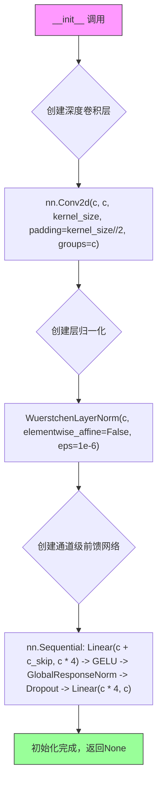

# `diffusers\src\diffusers\pipelines\wuerstchen\modeling_wuerstchen_diffnext.py` 详细设计文档

WuerstchenDiffNeXt是一个基于Diffusion架构的神经网络模型，用于图像生成任务。该模型采用编码器-解码器结构，包含条件注入机制（CLIP和EfficientNet），支持多层级的特征处理和残差块注意力机制，能够根据噪声、时间步嵌入和条件信息预测去噪后的图像。

## 整体流程

```mermaid
graph TD
    A[开始: 输入 x, r, effnet, clip] --> B{是否包含x_cat}
    B -- 是 --> C[拼接 x 和 x_cat]
    B -- 否 --> D[继续]
    C --> D
    D --> E[生成时间步嵌入 r_embed = gen_r_embedding(r)]
    E --> F{clip不为空?}
    F -- 是 --> G[生成条件嵌入 clip = gen_c_embeddings(clip)]
    F -- 否 --> H[继续]
    G --> H
    H --> I[输入嵌入 x = embedding(x)]
    I --> J[下采样编码: level_outputs = _down_encode(x, r_embed, effnet, clip)]
    J --> K[上采样解码: x = _up_decode(level_outputs, r_embed, effnet, clip)]
    K --> L[输出分类: a, b = clf(x).chunk(2, dim=1)]
    L --> M{b为True?}
    M -- 是 --> N[返回 (x_in - a) / b]
    M -- 否 --> O[返回 a, b]
```

## 类结构

```
ModelMixin (HuggingFace基类)
ConfigMixin (HuggingFace基类)
└── WuerstchenDiffNeXt (主模型类)

nn.Module
└── ResBlockStageB (残差块)

外部导入模块:
├── AttnBlock (注意力块)
├── GlobalResponseNorm (全局响应归一化)
├── TimestepBlock (时间步块)
└── WuerstchenLayerNorm (Wuerstchen归一化)
```

## 全局变量及字段


### `WuerstchenDiffNeXt.c_r`
    
时间嵌入的隐藏维度

类型：`int`
    


### `WuerstchenDiffNeXt.c_cond`
    
条件嵌入的隐藏维度

类型：`int`
    


### `WuerstchenDiffNeXt.clip_mapper`
    
CLIP嵌入的线性映射层

类型：`nn.Linear`
    


### `WuerstchenDiffNeXt.effnet_mappers`
    
EfficientNet条件映射层列表

类型：`nn.ModuleList`
    


### `WuerstchenDiffNeXt.seq_norm`
    
序列归一化层

类型：`nn.LayerNorm`
    


### `WuerstchenDiffNeXt.embedding`
    
输入图像的嵌入层

类型：`nn.Sequential`
    


### `WuerstchenDiffNeXt.down_blocks`
    
下采样编码器块列表

类型：`nn.ModuleList`
    


### `WuerstchenDiffNeXt.up_blocks`
    
上采样解码器块列表

类型：`nn.ModuleList`
    


### `WuerstchenDiffNeXt.clf`
    
输出分类头

类型：`nn.Sequential`
    


### `ResBlockStageB.depthwise`
    
深度可分离卷积

类型：`nn.Conv2d`
    


### `ResBlockStageB.norm`
    
归一化层

类型：`WuerstchenLayerNorm`
    


### `ResBlockStageB.channelwise`
    
通道级前馈网络

类型：`nn.Sequential`
    
    

## 全局函数及方法


### `WuerstchenDiffNeXt.__init__`

该方法是WuerstchenDiffNeXt模型的构造函数，负责初始化整个diffusion模型的网络结构，包括条件编码器（CLIP和EfficientNet映射器）、输入嵌入层、编码器（下采样）块、解码器（上采样）块以及输出分类器头，同时完成模型权重的初始化。

参数：

- `self`：隐式参数，模型实例本身
- `c_in`：`int`，输入通道数，默认为4
- `c_out`：`int`，输出通道数，默认为4
- `c_r`：`int`，随机时间步嵌入的维度，默认为64
- `patch_size`：`int`，像素解 shuffle 的 patch 大小，默认为2
- `c_cond`：`int`，条件嵌入的通道维度，默认为1024
- `c_hidden`：`list[int]`，各层隐藏通道数列表，默认为[320, 640, 1280, 1280]
- `nhead`：`list[int]`，各层注意力头数列表，-1表示不使用注意力，默认为[-1, 10, 20, 20]
- `blocks`：`list[int]`，各层的block重复次数，默认为[4, 4, 14, 4]
- `level_config`：`list[str]`，各层的block类型配置，默认为["CT", "CTA", "CTA", "CTA"]
- `inject_effnet`：`list[bool]`，各层是否注入EfficientNet条件，默认为[False, True, True, True]
- `effnet_embd`：`int`，EfficientNet嵌入维度，默认为16
- `clip_embd`：`int`，CLIP嵌入维度，默认为1024
- `kernel_size`：`int`，卷积核大小，默认为3
- `dropout`：`float`或`list[float]`，dropout概率，默认为0.1

返回值：`None`，该方法为构造函数，不返回任何值

#### 流程图

```mermaid
flowchart TD
    A[开始 __init__] --> B[调用父类 super().__init__]
    B --> C[保存基础配置 c_r, c_cond]
    C --> D[标准化 dropout 为列表]
    D --> E[构建条件编码器]
    E --> E1[创建 CLIP 映射器: nn.Linear]
    E --> E2[创建 EfficientNet 映射器列表: nn.ModuleList]
    E --> E3[创建序列归一化: nn.LayerNorm]
    
    E --> F[构建输入嵌入层]
    F --> F1[PixelUnshuffle + Conv2d + LayerNorm]
    
    F --> G[定义 get_block 辅助函数]
    G --> G1[根据 block_type 创建对应模块]
    
    G --> H[构建下采样编码器 down_blocks]
    H --> H1[遍历各层 c_hidden]
    H1 --> H2[添加下采样过渡层（除第一层外）]
    H2 --> H3[添加多个 ResBlock/AttnBlock/TimestepBlock]
    
    H --> I[构建上采样解码器 up_blocks]
    I --> I1[反向遍历各层 c_hidden]
    I1 --> I2[为每个位置添加对应 block]
    I2 --> I3[添加上采样过渡层（除第一层外）]
    
    I --> J[构建输出分类器 clf]
    J --> J1[LayerNorm + Conv2d + PixelShuffle]
    
    J --> K[应用权重初始化 _init_weights]
    K --> L[结束]
```

#### 带注释源码

```python
@register_to_config
def __init__(
    self,
    c_in=4,
    c_out=4,
    c_r=64,
    patch_size=2,
    c_cond=1024,
    c_hidden=[320, 640, 1280, 1280],
    nhead=[-1, 10, 20, 20],
    blocks=[4, 4, 14, 4],
    level_config=["CT", "CTA", "CTA", "CTA"],
    inject_effnet=[False, True, True, True],
    effnet_embd=16,
    clip_embd=1024,
    kernel_size=3,
    dropout=0.1,
):
    # 调用父类(ModelMixin和ConfigMixin)的初始化方法
    # 注册配置以支持从配置字典重新创建模型
    super().__init__()
    
    # 保存条件嵌入维度配置
    self.c_r = c_r
    self.c_cond = c_cond
    
    # 标准化dropout为列表形式，确保每个隐藏层都有独立的dropout值
    if not isinstance(dropout, list):
        dropout = [dropout] * len(c_hidden)

    # ==================== 条件编码器部分 ====================
    # CLIP文本嵌入映射器：将CLIP embedding映射到条件空间
    self.clip_mapper = nn.Linear(clip_embd, c_cond)
    
    # EfficientNet视觉嵌入映射器列表
    # 正向和反向各有一组映射器（用于上采样路径的条件注入）
    self.effnet_mappers = nn.ModuleList(
        [
            nn.Conv2d(effnet_embd, c_cond, kernel_size=1) if inject else None
            for inject in inject_effnet + list(reversed(inject_effnet))
        ]
    )
    
    # 条件序列归一化层
    self.seq_norm = nn.LayerNorm(c_cond, elementwise_affine=False, eps=1e-6)

    # ==================== 输入嵌入部分 ====================
    # 1. PixelUnshuffle: 将图像转换为patch表示
    # 2. 卷积: 将patch特征映射到第一层隐藏维度
    # 3. LayerNorm: 归一化
    self.embedding = nn.Sequential(
        nn.PixelUnshuffle(patch_size),
        nn.Conv2d(c_in * (patch_size**2), c_hidden[0], kernel_size=1),
        WuerstchenLayerNorm(c_hidden[0], elementwise_affine=False, eps=1e-6),
    )

    # ==================== 辅助函数：创建Block ====================
    def get_block(block_type, c_hidden, nhead, c_skip=0, dropout=0):
        """
        根据block_type创建对应的网络模块
        - "C": ResBlockStageB - 残差块，用于特征提取
        - "A": AttnBlock - 注意力块，用于条件注入
        - "T": TimestepBlock - 时间步块，用于时间条件
        """
        if block_type == "C":
            return ResBlockStageB(c_hidden, c_skip, kernel_size=kernel_size, dropout=dropout)
        elif block_type == "A":
            return AttnBlock(c_hidden, c_cond, nhead, self_attn=True, dropout=dropout)
        elif block_type == "T":
            return TimestepBlock(c_hidden, c_r)
        else:
            raise ValueError(f"Block type {block_type} not supported")

    # ==================== 下采样编码器 (Down Blocks) ====================
    self.down_blocks = nn.ModuleList()
    for i in range(len(c_hidden)):
        down_block = nn.ModuleList()
        
        # 添加下采样过渡层（除第一层外）
        if i > 0:
            down_block.append(
                nn.Sequential(
                    WuerstchenLayerNorm(c_hidden[i - 1], elementwise_affine=False, eps=1e-6),
                    nn.Conv2d(c_hidden[i - 1], c_hidden[i], kernel_size=2, stride=2),
                )
            )
        
        # 添加多个block（ResBlock/AttnBlock/TimestepBlock）
        for _ in range(blocks[i]):
            for block_type in level_config[i]:
                # 如果当前层需要注入effnet，则传递条件维度作为skip连接
                c_skip = c_cond if inject_effnet[i] else 0
                down_block.append(get_block(block_type, c_hidden[i], nhead[i], c_skip=c_skip, dropout=dropout[i]))
        
        self.down_blocks.append(down_block)

    # ==================== 上采样解码器 (Up Blocks) ====================
    self.up_blocks = nn.ModuleList()
    for i in reversed(range(len(c_hidden))):  # 反向遍历
        up_block = nn.ModuleList()
        
        for j in range(blocks[i]):
            for k, block_type in enumerate(level_config[i]):
                # 计算skip连接维度：
                # - 如果是第一个block的第一个layer且不是最底层，需要下采样路径的skip
                # - 加上effnet条件维度
                c_skip = c_hidden[i] if i < len(c_hidden) - 1 and j == k == 0 else 0
                c_skip += c_cond if inject_effnet[i] else 0
                up_block.append(get_block(block_type, c_hidden[i], nhead[i], c_skip=c_skip, dropout=dropout[i]))
        
        # 添加上采样过渡层（除第一层外）
        if i > 0:
            up_block.append(
                nn.Sequential(
                    WuerstchenLayerNorm(c_hidden[i], elementwise_affine=False, eps=1e-6),
                    nn.ConvTranspose2d(c_hidden[i], c_hidden[i - 1], kernel_size=2, stride=2),
                )
            )
        
        self.up_blocks.append(up_block)

    # ==================== 输出分类器 ====================
    # 将特征解码为最终的噪声预测和方差预测
    self.clf = nn.Sequential(
        WuerstchenLayerNorm(c_hidden[0], elementwise_affine=False, eps=1e-6),
        nn.Conv2d(c_hidden[0], 2 * c_out * (patch_size**2), kernel_size=1),
        nn.PixelShuffle(patch_size),  # 与embedding的PixelUnshuffle对应
    )

    # ==================== 权重初始化 ====================
    self.apply(self._init_weights)
```


### `WuerstchenDiffNeXt._init_weights`

该方法是 `WuerstchenDiffNeXt` 模型的权重初始化方法，通过 `self.apply(self._init_weights)` 在模型初始化时自动调用，用于对模型中的卷积层、线性层、注意力块、残差块等组件进行统一的权重初始化，包括 Xavier 均匀初始化、正态初始化以及针对特定层（如输出层、时序块）的特殊初始化策略。

参数：

- `m`：`torch.nn.Module`，PyTorch 模块对象，表示需要初始化的神经网络层或模块

返回值：`None`，无返回值，该方法直接在传入的模块上进行原地（in-place）权重初始化操作

#### 流程图

```mermaid
flowchart TD
    A[开始 _init_weights] --> B{判断 m 类型}
    B -->|nn.Conv2d 或 nn.Linear| C[Xavier 均匀初始化权重]
    C --> D{判断是否存在偏置}
    D -->|是| E[将偏置初始化为常量 0]
    D -->|否| F[跳过偏置初始化]
    E --> G[初始化 effnet_mappers]
    F --> G
    G --> H{遍历 effnet_mappers}
    H -->|mapper 不为 None| I[正态初始化权重, std=0.02]
    H -->|mapper 为 None| J[跳过]
    I --> K[初始化 clip_mapper]
    J --> K
    K --> L[正态初始化权重, std=0.02]
    L --> M[初始化 embedding 层]
    M --> N[Xavier 均匀初始化, gain=0.02]
    N --> O[初始化 clf 输出层]
    O --> P[将权重初始化为常量 0]
    P --> Q[遍历 down_blocks 和 up_blocks]
    Q --> R{遍历每个 block}
    R -->|ResBlockStageB| S[调整 channelwise 最终层权重]
    S --> T[权重乘以 sqrt(1/sum(blocks))]
    R -->|TimestepBlock| U[将 mapper 权重初始化为 0]
    R -->|其他| V[跳过]
    T --> W[结束]
    U --> W
    V --> W
```

#### 带注释源码

```python
def _init_weights(self, m):
    """
    权重初始化方法，用于初始化模型中的各种层和模块
    
    参数:
        m: torch.nn.Module，需要初始化的模块对象
    """
    # ===== 通用初始化 =====
    # 对于卷积层和线性层，使用 Xavier 均匀分布初始化
    if isinstance(m, (nn.Conv2d, nn.Linear)):
        nn.init.xavier_uniform_(m.weight)
        # 如果存在偏置，则将其初始化为常量 0
        if m.bias is not None:
            nn.init.constant_(m.bias, 0)

    # ===== 条件映射器初始化 =====
    # 遍历所有 effnet 映射器，使用正态分布初始化（std=0.02）
    for mapper in self.effnet_mappers:
        if mapper is not None:
            nn.init.normal_(mapper.weight, std=0.02)  # conditionings
    
    # 初始化 CLIP 映射器的权重，正态分布（std=0.02）
    nn.init.normal_(self.clip_mapper.weight, std=0.02)  # conditionings
    
    # 初始化嵌入层的卷积权重，Xavier 均匀分布（gain=0.02）
    # embedding[1] 是嵌入层中的 Conv2d
    nn.init.xavier_uniform_(self.embedding[1].weight, 0.02)  # inputs
    
    # 初始化输出分类器的权重为常量 0
    # clf[1] 是输出层中的 Conv2d
    nn.init.constant_(self.clf[1].weight, 0)  # outputs

    # ===== 模块块初始化 =====
    # 遍历所有下采样块和上采样块
    for level_block in self.down_blocks + self.up_blocks:
        for block in level_block:
            # 对于 ResBlockStageB 类型，调整 channelwise 最后线性层的权重
            # 缩放因子为 sqrt(1/sum(blocks))，用于平衡不同层的贡献
            if isinstance(block, ResBlockStageB):
                block.channelwise[-1].weight.data *= np.sqrt(1 / sum(self.config.blocks))
            # 对于 TimestepBlock，将 mapper 权重初始化为 0
            elif isinstance(block, TimestepBlock):
                nn.init.constant_(block.mapper.weight, 0)
```


### `WuerstchenDiffNeXt.gen_r_embedding`

生成时间步的正弦余弦位置编码（Sinusoidal Positional Embedding），用于将离散的时间步映射到连续的高维向量空间，使模型能够感知扩散过程中的时间信息。

参数：

- `self`：类的实例，包含配置属性 `c_r`（时间嵌入的维度）
- `r`：`torch.Tensor`，形状为 `(batch_size,)` 或 `(batch_size, 1)`，时间步输入值，通常在 `[0, 1]` 范围内
- `max_positions`：`int`，最大位置数，用于控制频率的计算，默认值为 `10000`

返回值：`torch.Tensor`，形状为 `(batch_size, c_r)` 的正弦余弦位置编码，类型与输入 `r` 的数据类型一致

#### 流程图

```mermaid
flowchart TD
    A[输入: r, max_positions] --> B[r = r * max_positions]
    B --> C[half_dim = c_r // 2]
    C --> D[计算频率因子<br/>emb = log(max_positions) / (half_dim - 1)]
    D --> E[生成频率向量<br/>torch.arange(half_dim) * (-emb) exp()]
    E --> F[广播乘法<br/>r[:, None] * emb[None, :]]
    F --> G[拼接正弦余弦<br/>torch.cat([sin, cos], dim=1)]
    G --> H{c_r 是否奇数?}
    H -->|是| I[零填充<br/>nn.functional.pad]
    H -->|否| J[直接返回]
    I --> J
    J --> K[转换为输入dtype<br/>return emb.to dtype=r.dtype]
```

#### 带注释源码

```python
def gen_r_embedding(self, r, max_positions=10000):
    """
    生成时间步的正弦余弦位置编码（Sinusoidal Positional Embedding）。
    
    该方法实现了经典的正弦余弦位置编码，用于将时间步映射到高维向量空间。
    编码公式参考 Vaswani et al. "Attention is All You Need"。
    
    参数:
        r: torch.Tensor - 时间步张量，值域通常在 [0, 1]
        max_positions: int - 最大位置数，控制频率的 scale
    
    返回:
        torch.Tensor - 形状为 (batch_size, c_r) 的位置编码
    """
    # 步骤1: 将时间步缩放到 [0, max_positions] 范围
    # 例如: r=0.5, max_positions=10000 -> r=5000
    r = r * max_positions
    
    # 步骤2: 计算嵌入维度的一半
    # c_r 是配置的时间嵌入维度（如 64）
    half_dim = self.c_r // 2  # 例如 half_dim = 32
    
    # 步骤3: 计算频率因子
    # 使用对数函数确保频率在所有维度上均匀分布
    # log(max_positions) / (half_dim - 1) 确保最后一维的频率为 1/max_positions
    emb = math.log(max_positions) / (half_dim - 1)
    
    # 步骤4: 生成频率向量 [exp(0), exp(-emb), exp(-2*emb), ..., exp(-(half_dim-1)*emb)]
    # 这创建了一个从 1 指数衰减到约 1/max_positions 的频率谱
    emb = torch.arange(half_dim, device=r.device).float().mul(-emb).exp()
    # 结果形状: (half_dim,) = (32,)
    
    # 步骤5: 广播乘法 - 将时间步与每个频率进行外积
    # r[:, None] 形状: (batch_size, 1)
    # emb[None, :] 形状: (1, half_dim)
    # 结果形状: (batch_size, half_dim)
    emb = r[:, None] * emb[None, :]
    
    # 步骤6: 拼接正弦和余弦编码
    # emb.sin() 和 emb.cos() 各占 half_dim 维度
    # 总输出维度: half_dim * 2 = c_r
    # 结果形状: (batch_size, half_dim * 2) = (batch_size, c_r)
    emb = torch.cat([emb.sin(), emb.cos()], dim=1)
    
    # 步骤7: 处理奇数维度情况
    # 如果 c_r 是奇数，需要在最后添加一个零填充维度以匹配 c_r
    if self.c_r % 2 == 1:  # zero pad
        emb = nn.functional.pad(emb, (0, 1), mode="constant")
    
    # 步骤8: 确保输出类型与输入类型一致
    # 保持与输入 r 相同的 dtype（如 float32 或 float16）
    return emb.to(dtype=r.dtype)
```


### `WuerstchenDiffNeXt.gen_c_embeddings`

该方法用于生成条件嵌入（condition embeddings），将 CLIP 模型的输出嵌入向量通过线性变换和层归一化处理，转换为模型内部使用的条件表示。

参数：

- `clip`：`torch.Tensor`，CLIP 模型输出的嵌入向量，维度为 `(batch_size, clip_embd)`

返回值：`torch.Tensor`，经过映射和归一化后的条件嵌入，维度为 `(batch_size, c_cond)`

#### 流程图


#### 带注释源码

```python
def gen_c_embeddings(self, clip):
    """
    生成条件嵌入向量。
    
    该方法将 CLIP 模型的输出嵌入通过线性变换和层归一化转换为模型内部使用的条件表示。
    条件嵌入将用于后续的注意力块（AttnBlock）中进行交叉注意力计算。
    
    参数:
        clip: CLIP 模型输出的嵌入向量，形状为 (batch_size, clip_embd)
        
    返回:
        处理后的条件嵌入，形状为 (batch_size, c_cond)
    """
    # 第一步：通过 clip_mapper 线性层将 CLIP 嵌入从 clip_embd 维度映射到 c_cond 维度
    # clip_mapper 是 nn.Linear(clip_embd, c_cond)
    clip = self.clip_mapper(clip)
    
    # 第二步：通过 seq_norm 层归一化进行归一化处理
    # seq_norm 是 nn.LayerNorm(c_cond, elementwise_affine=False, eps=1e-6)
    # 使用不带可学习参数的 LayerNorm 以保持训练稳定性
    clip = self.seq_norm(clip)
    
    # 返回处理后的条件嵌入
    return clip
```


### `WuerstchenDiffNeXt._down_encode`

该函数实现了WuerstchenDiffNeXt模型的下采样编码过程，通过逐层遍历下采样块（down_blocks），依次对输入特征应用ResBlockStageB（带EffNet条件）、AttnBlock（带CLIP条件）和TimestepBlock（带时间步嵌入），并在每层结束后将输出插入到列表最前端，最终返回包含各层级特征的列表（从最深层到最浅层），为后续的上采样解码过程提供多尺度特征。

参数：

- `self`：`WuerstchenDiffNeXt`，类实例本身，包含模型的所有层和配置
- `x`：`torch.Tensor`，输入特征张量，形状为 `[batch_size, channels, height, width]`，来自嵌入层（embedding）的输出
- `r_embed`：`torch.Tensor`，时间步嵌入向量，形状为 `[batch_size, c_r]`，由 `gen_r_embedding` 方法生成，用于TimestepBlock
- `effnet`：`torch.Tensor`，EffNet编码特征，形状为 `[batch_size, effnet_embd, h, w]`，用于生成条件跳过连接
- `clip`：`torch.Tensor | None`，CLIP文本嵌入向量，形状为 `[batch_size, seq_len, clip_embd]`，用于AttnBlock，可选

返回值：`list[torch.Tensor]`，层级输出列表，包含下采样过程中每一层的输出特征，列表第一个元素是最深层级的输出（经过所有down_blocks处理后），最后一个元素是第一层级的输出

#### 流程图

```mermaid
flowchart TD
    A[开始 _down_encode] --> B[初始化 level_outputs = []]
    B --> C[遍历 enumerate(self.down_blocks)]
    C --> D[i=0, 第一个down_block]
    D --> E[初始化 effnet_c = None]
    E --> F[遍历 down_block 中的每个 block]
    F --> G{当前 block 类型}
    G -->|ResBlockStageB| H[检查 effnet_c 是否为 None 且 self.effnet_mappers[i] 不为 None]
    H --> I[是] --> J[对 effnet 进行双三次插值到 x 的空间尺寸]
    J --> K[通过 effnet_mappers[i] 将 effnet 转换为条件向量 effnet_c]
    K --> L[设置 skip = effnet_c 或 None]
    L --> M[调用 block(x, skip) 执行残差块]
    M --> N[更新 x]
    G -->|AttnBlock| O[调用 block(x, clip) 执行注意力块]
    O --> N
    G -->|TimestepBlock| P[调用 block(x, r_embed) 执行时间步块]
    P --> N
    G -->|其他| Q[调用 block(x) 执行普通块]
    Q --> N
    N --> R[当前 down_block 处理完成]
    R --> S[将 x 插入 level_outputs 头部]
    S --> T{是否还有更多 down_blocks}
    T -->|是| U[进入下一个 down_block]
    U --> E
    T -->|否| V[返回 level_outputs]
    V --> Z[结束]
```

#### 带注释源码

```python
def _down_encode(self, x, r_embed, effnet, clip=None):
    """
    下采样编码过程，将输入特征逐层下采样并提取多尺度特征
    
    参数:
        x: 输入特征张量，来自embedding层
        r_embed: 时间步嵌入向量
        effnet: EffNet编码特征，用于条件注入
        clip: CLIP文本嵌入，可选用于注意力机制
    
    返回:
        level_outputs: 包含各层级输出的列表
    """
    # 存储每层的输出，用于后续上采样解码
    level_outputs = []
    
    # 遍历所有的下采样块（从第一层到最后一层）
    for i, down_block in enumerate(self.down_blocks):
        # 初始化当前层的effnet条件为None，每个down_block重新计算
        effnet_c = None
        
        # 遍历当前下采样块中的所有子模块
        for block in down_block:
            # 判断当前块的类型并进行相应的处理
            if isinstance(block, ResBlockStageB):
                # 如果是残差块且需要注入effnet条件
                if effnet_c is None and self.effnet_mappers[i] is not None:
                    # 获取effnet的数据类型
                    dtype = effnet.dtype
                    # 对effnet特征进行双三次插值，使其空间维度与当前x匹配
                    # antialias=True 用于减少锯齿，align_corners=True 保持角点对齐
                    effnet_c = self.effnet_mappers[i](
                        nn.functional.interpolate(
                            effnet.float(),  # 转换为float避免精度问题
                            size=x.shape[-2:],  # 目标空间尺寸
                            mode="bicubic",  # 双三次插值
                            antialias=True,  # 抗锯齿
                            align_corners=True  # 角点对齐
                        ).to(dtype)  # 转换回原始数据类型
                    )
                
                # 确定跳过连接：如果有effnet映射器则使用effnet_c，否则为None
                skip = effnet_c if self.effnet_mappers[i] is not None else None
                # 执行残差块前向传播，包含条件注入
                x = block(x, skip)
                
            elif isinstance(block, AttnBlock):
                # 如果是注意力块，注入CLIP条件
                x = block(x, clip)
                
            elif isinstance(block, TimestepBlock):
                # 如果是时间步块，注入时间步嵌入
                x = block(x, r_embed)
                
            else:
                # 其他类型的块直接执行
                x = block(x)
        
        # 将当前层的输出插入到列表头部（倒序存储：最深层在最前）
        # 这样level_outputs[0]是最终深层特征，level_outputs[-1]是浅层特征
        level_outputs.insert(0, x)
    
    # 返回包含所有层级输出的列表
    return level_outputs
```


### `WuerstchenDiffNeXt._up_decode`

`_up_decode` 方法实现 WuerstchenDiffNeXt 模型的上采样解码过程，它接收编码器输出的多层级特征表示，通过上采样块逐步恢复空间分辨率，并融合条件信息（时间步嵌入、CLIP 条件、EffNet 条件），最终输出解码后的特征张量。

参数：

- `level_outputs`：`List[torch.Tensor]`，编码器下采样阶段各层的输出列表，索引 0 对应最低分辨率的特征
- `r_embed`：`torch.Tensor`，时间步（r）通过正弦位置编码生成的嵌入向量，用于 TimestepBlock 的条件注入
- `effnet`：`torch.Tensor`，来自 EfficientNet 的条件特征图，用于通过 effnet_mappers 映射后作为跳跃连接的补充信息
- `clip`：`torch.Tensor | None`，可选的 CLIP 文本嵌入向量，用于 AttnBlock 的自注意力条件

返回值：`torch.Tensor`，经过上采样解码后的最终特征张量，形状为 `(B, C, H, W)`

#### 流程图

```mermaid
flowchart TD
    A[开始: _up_decode] --> B[取出 level_outputs[0] 作为初始 x]
    B --> C[遍历 up_blocks 列表]
    C --> D[初始化 effnet_c 为 None]
    D --> E[遍历当前 up_block 中的每个 block]
    E --> F{判断 block 类型}
    
    F -->|ResBlockStageB| G[检查是否需要计算 effnet_c]
    G --> H{effnet_c 为空且存在对应的 effnet_mapper?}
    H -->|是| I[对 effnet 进行双三次插值到当前 x 的空间尺寸]
    I --> J[通过 effnet_mapper 映射到条件空间]
    H -->|否| K[跳过计算]
    
    J --> L[计算 skip 连接: level_outputs[i] 当 j==0 且 i>0]
    L --> M{是否有 effnet_c?}
    M -->|是| N[将 skip 与 effnet_c 沿通道维度拼接]
    M -->|否| O[skip 保持原值]
    N --> P[调用 ResBlockStageB.forward(x, skip)]
    K --> P
    O --> P
    
    F -->|AttnBlock| Q[调用 AttnBlock.forward(x, clip)]
    F -->|TimestepBlock| R[调用 TimestepBlock.forward(x, r_embed)]
    F -->|其他| S[直接调用 block.forward(x)]
    
    P --> T[更新 x]
    Q --> T
    R --> T
    S --> T
    
    T --> E
    E --> C
    
    C --> U[返回最终的 x]
```

#### 带注释源码

```python
def _up_decode(self, level_outputs, r_embed, effnet, clip=None):
    """
    上采样解码过程：将编码器输出的多层级特征逐步上采样并融合条件信息
    
    参数:
        level_outputs: 编码器下采样各层的输出列表，按从低到高分辨率排列
        r_embed: 时间步的旋转位置编码嵌入
        effnet: EfficientNet 提取的条件特征
        clip: CLIP 文本嵌入，用于注意力条件（可选）
    """
    # 1. 初始化：从最低分辨率的特征开始（level_outputs[0] 对应最深层/最小尺寸）
    x = level_outputs[0]
    
    # 2. 遍历上采样块（从最深层向最浅层遍历）
    for i, up_block in enumerate(self.up_blocks):
        # 每次迭代初始化 effnet 条件为 None（延迟计算，只在需要时计算一次）
        effnet_c = None
        
        # 3. 遍历当前上采样块中的所有子模块
        for j, block in enumerate(up_block):
            if isinstance(block, ResBlockStageB):
                # === 处理残差块 ===
                
                # 首次遇到 ResBlockStageB 时，计算一次 effnet 条件映射
                if effnet_c is None and self.effnet_mappers[len(self.down_blocks) + i] is not None:
                    dtype = effnet.dtype
                    # 将 effnet 特征插值到当前特征图的空间尺寸（双三次插值）
                    effnet_c = self.effnet_mappers[len(self.down_blocks) + i](
                        nn.functional.interpolate(
                            effnet.float(), 
                            size=x.shape[-2:],  # 目标尺寸为当前 x 的 H, W
                            mode="bicubic", 
                            antialias=True, 
                            align_corners=True
                        ).to(dtype)
                    )
                
                # 计算跳跃连接（skip connection）
                # 当不是第一个块的第一个子模块（j==0）且不是第一层（i>0）时，从编码器对应层获取特征
                skip = level_outputs[i] if j == 0 and i > 0 else None
                
                # 融合 effnet 条件到跳跃连接
                if effnet_c is not None:
                    if skip is not None:
                        # 沿通道维度拼接 skip 和 effnet_c
                        skip = torch.cat([skip, effnet_c], dim=1)
                    else:
                        # 如果没有 skip 特征，直接使用 effnet_c 作为 skip
                        skip = effnet_c
                
                # 执行残差块前向传播
                x = block(x, skip)
                
            elif isinstance(block, AttnBlock):
                # === 处理注意力块 ===
                # 将 CLIP 条件注入注意力机制
                x = block(x, clip)
                
            elif isinstance(block, TimestepBlock):
                # === 处理时间步块 ===
                # 将时间步嵌入注入特征
                x = block(x, r_embed)
                
            else:
                # === 处理其他块（如上采样卷积、归一化等）===
                x = block(x)
    
    # 4. 返回解码后的特征
    return x
```


### `WuerstchenDiffNeXt.forward`

该方法是 WuerstchenDiffNeXt 模型的核心前向传播函数，接收带噪图像、时间步、EffNet 特征和 CLIP 条件信息，执行嵌入处理、下采样编码、上采样解码，输出噪声预测或预测的均值与方差。

参数：

-  `x`：`torch.Tensor`，输入的带噪图像张量，形状为 (batch, channels, height, width)
-  `r`：`torch.Tensor`，时间步嵌入向量，用于表示扩散过程的时间步信息
-  `effnet`：`torch.Tensor`，EfficientNet 提取的特征图，提供视觉上下文信息
-  `clip`：`torch.Tensor | None`，CLIP 模型提取的文本/图像嵌入向量，用于条件生成（可选）
-  `x_cat`：`torch.Tensor | None`，额外的输入张量，可与 x 拼接进行增强（可选）
-  `eps`：`float`，默认值 1e-3，用于控制 sigmoid 输出的范围，防止数值极端
-  `return_noise`：`bool`，默认值 True，决定返回噪声预测还是均值/方差对

返回值：`torch.Tensor | tuple[torch.Tensor, torch.Tensor]`，当 return_noise 为 True 时返回预测的噪声张量；否则返回预测的均值 a 和方差 b 组成的元组。

#### 流程图

```mermaid
flowchart TD
    A[开始 forward] --> B{检查 x_cat 是否存在}
    B -->|是| C[将 x 与 x_cat 拼接]
    B -->|否| D[继续使用 x]
    C --> E[生成时间步嵌入 r_embed]
    D --> E
    E --> F{检查 clip 是否存在}
    F -->|是| G[生成 CLIP 条件嵌入 clip]
    F -->|否| H[保持 clip 为 None]
    G --> I[输入 embedding 处理]
    H --> I
    I --> J[_down_encode: 下采样编码]
    J --> K[_up_decode: 上采样解码]
    K --> L[clf 分类器输出]
    L --> M[chunk 分割为 a, b]
    M --> N[b = b.sigmoid * (1 - eps*2) + eps]
    N --> O{return_noise 为 True?}
    O -->|是| P[返回 (x_in - a) / b]
    O -->|否| Q[返回元组 (a, b)]
```

#### 带注释源码

```python
def forward(self, x, r, effnet, clip=None, x_cat=None, eps=1e-3, return_noise=True):
    """
    WuerstchenDiffNeXt 模型的前向传播函数
    
    参数:
        x: 输入的带噪图像张量
        r: 时间步嵌入向量
        effnet: EfficientNet 特征图
        clip: CLIP 条件嵌入（可选）
        x_cat: 额外的拼接输入（可选）
        eps: 数值稳定参数，默认 1e-3
        return_noise: 是否返回噪声预测，默认 True
    
    返回:
        噪声预测或 (均值, 方差) 元组
    """
    # 如果存在额外的输入 x_cat，则沿通道维度拼接
    if x_cat is not None:
        x = torch.cat([x, x_cat], dim=1)
    
    # 处理条件 embeddings
    # 生成时间步的旋转位置嵌入
    r_embed = self.gen_r_embedding(r)
    
    # 如果提供了 CLIP 条件，则生成 CLIP 条件嵌入
    if clip is not None:
        clip = self.gen_c_embeddings(clip)

    # 保存原始输入用于后续噪声计算
    x_in = x
    
    # 步骤1: 对输入图像进行下采样和通道转换的 embedding 处理
    # PixelUnshuffle 将图像进行空间下采样，Conv2d 调整通道维度，LayerNorm 归一化
    x = self.embedding(x)
    
    # 步骤2: 下采样编码阶段
    # 通过多层下采样块提取多尺度特征，每层输出保存到 level_outputs
    level_outputs = self._down_encode(x, r_embed, effnet, clip)
    
    # 步骤3: 上采样解码阶段
    # 利用下采样阶段的多尺度特征进行上采样重建
    x = self._up_decode(level_outputs, r_embed, effnet, clip)
    
    # 步骤4: 通过分类头生成预测的均值和方差
    # clf 将特征空间映射到输出空间，chunk 将输出分成 a (均值) 和 b (方差)
    a, b = self.clf(x).chunk(2, dim=1)
    
    # 对方差 b 进行 sigmoid 激活并调整范围，防止数值极端
    # b 范围被限制在 [eps, 1-eps] 之间
    b = b.sigmoid() * (1 - eps * 2) + eps
    
    # 步骤5: 根据 return_noise 决定输出格式
    if return_noise:
        # 返回预测的噪声: (原始输入 - 预测均值) / 预测方差
        return (x_in - a) / b
    else:
        # 返回预测的均值和方差，用于损失计算等下游任务
        return a, b
```


### `ResBlockStageB.__init__`

初始化一个用于Wuerstchen DiffNeXt模型的残差块（ResBlockStageB），该残差块包含深度卷积层、层归一化以及带有激活函数和Dropout的通道级前馈网络，支持通过skip连接注入额外条件信息。

参数：

- `self`：类实例本身，ResBlockStageB，隐含参数，无需显式传递
- `c`：`int`，输入特征的通道数（channel count），定义该块的输入输出通道维度
- `c_skip`：`int`（默认值：0），跳跃连接的额外通道数，用于接收来自其他分支的特征拼接
- `kernel_size`：`int`（默认值：3），深度卷积的核大小，决定空间感受野
- `dropout`：`float`（默认值：0.0），Dropout层的丢弃率，用于正则化防止过拟合

返回值：`None`，该方法为初始化方法，不返回任何值，仅完成对象属性的初始化设置

#### 流程图



#### 带注释源码

```python
class ResBlockStageB(nn.Module):
    """
    残差块Stage B实现，用于Wuerstchen DiffNeXt模型
    
    该残差块包含三个主要组件：
    1. depthwise: 深度卷积层，用于提取空间特征
    2. norm: 层归一化，用于稳定训练
    3. channelwise: 通道级前馈网络，包含激活和Dropout
    """
    
    def __init__(self, c, c_skip=0, kernel_size=3, dropout=0.0):
        """
        初始化残差块结构
        
        参数:
            c: int, 输入通道数，也是输出通道数
            c_skip: int, 跳跃连接的额外通道数，用于特征拼接
            kernel_size: int, 深度卷积的核大小
            dropout: float, Dropout概率
        """
        super().__init__()
        
        # 深度卷积层：groups=c 表示每个通道独立卷积，减少参数量
        # 保持通道数不变: c -> c
        self.depthwise = nn.Conv2d(
            c,                          # 输入通道数
            c,                          # 输出通道数
            kernel_size=kernel_size,    # 卷积核大小
            padding=kernel_size // 2,   # 保持空间尺寸不变
            groups=c                    # 深度卷积：每个通道独立处理
        )
        
        # Wuerstchen风格的LayerNorm，elementwise_affine=False表示无仿射变换
        # 仅做归一化，不学习缩放和平移参数
        self.norm = WuerstchenLayerNorm(
            c, 
            elementwise_affine=False, 
            eps=1e-6
        )
        
        # 通道级前馈网络：
        # 1. 第一次线性变换: c + c_skip -> c*4 (扩展维度)
        # 2. GELU激活函数
        # 3. GlobalResponseNorm: 全局响应归一化
        # 4. Dropout: 正则化
        # 5. 第二次线性变换: c*4 -> c (压缩回原始维度)
        self.channelwise = nn.Sequential(
            nn.Linear(c + c_skip, c * 4),           # 通道维度扩展4倍
            nn.GELU(),                               # Gaussian Error Linear Unit激活
            GlobalResponseNorm(c * 4),               # 全局响应归一化
            nn.Dropout(dropout),                     # Dropout正则化
            nn.Linear(c * 4, c),                     # 通道维度还原
        )
```

#### 类完整信息

**类名：** `ResBlockStageB`

**继承自：** `nn.Module`

**类描述：** Wuerstchen DiffNeXt模型中的残差块实现，采用深度卷积与通道级前馈网络的组合结构，支持通过skip连接注入外部条件特征。

**类字段：**

| 字段名 | 类型 | 描述 |
|--------|------|------|
| `depthwise` | `nn.Conv2d` | 深度卷积层，用于空间特征提取 |
| `norm` | `WuerstchenLayerNorm` | 层归一化，用于特征标准化 |
| `channelwise` | `nn.Sequential` | 通道级前馈网络，包含线性层、激活、归一化和Dropout |

**类方法：**

| 方法名 | 描述 |
|--------|------|
| `__init__` | 初始化残差块结构 |
| `forward` | 前向传播逻辑，执行残差连接 |


### `ResBlockStageB.forward`

该方法实现了残差块的前向传播，通过深度可分离卷积、层归一化、带有全局响应归一化的前馈网络以及残差连接，对输入特征进行细粒度的通道级特征提取与融合。

参数：

- `x`：`torch.Tensor`，输入特征张量，形状为 (batch_size, channels, height, width)，代表当前层的特征图
- `x_skip`：`Optional[torch.Tensor]`，可选的跳跃连接张量，形状为 (batch_size, c_skip, height, width)，用于特征融合，若为 None 则跳过拼接步骤

返回值：`torch.Tensor`，输出特征张量，形状与输入 x 相同 (batch_size, channels, height, width)，为残差计算后的结果

#### 流程图

```mermaid
flowchart TD
    A[输入 x] --> B[保存残差: x_res = x]
    B --> C[深度可分离卷积: self.depthwise(x)]
    C --> D[层归一化: self.norm]
    D --> E{判断 x_skip 是否存在?}
    E -->|是| F[拼接: torch.cat([x, x_skip], dim=1)]
    E -->|否| G[保持不变]
    F --> H[通道级前馈网络: channelwise]
    G --> H
    H --> I[维度变换: permute 调整维度顺序]
    I --> J[残差相加: x + x_res]
    J --> K[输出特征张量]
    
    subgraph channelwise
        H1[Linear: c + c_skip -> c*4]
        H2[GELU 激活]
        H3[GlobalResponseNorm]
        H4[Dropout]
        H5[Linear: c*4 -> c]
        H1 --> H2 --> H3 --> H4 --> H5
    end
```

#### 带注释源码

```python
def forward(self, x, x_skip=None):
    """
    残差块前向传播
    
    Args:
        x: 输入特征张量，形状 (B, C, H, W)
        x_skip: 可选的跳跃连接，形状 (B, C_skip, H, W)
    
    Returns:
        输出特征张量，形状 (B, C, H, W)
    """
    # 步骤1: 保存输入作为残差项，后续用于残差连接
    x_res = x
    
    # 步骤2: 深度可分离卷积 - 逐通道卷积，提取空间特征
    x = self.depthwise(x)
    
    # 步骤3: 层归一化 - 稳定训练，加速收敛
    x = self.norm(x)
    
    # 步骤4: 如果存在跳跃连接，则在通道维度拼接
    # 这允许模型学习到来自不同层级的特征融合
    if x_skip is not None:
        x = torch.cat([x, x_skip], dim=1)
    
    # 步骤5: 通道级前馈网络处理
    # - 第一次线性变换: 扩展通道维度 (C + C_skip) -> C*4
    # - GELU 激活: 引入非线性
    # - 全局响应归一化: 跨通道的归一化，有助于稳定训练
    # - Dropout: 防止过拟合
    # - 第二次线性变换: 压缩通道维度 C*4 -> C
    # permute 用于调整维度顺序: (B, H, W, C) -> (B, C, H, W) 以适配线性层
    x = self.channelwise(x.permute(0, 2, 3, 1)).permute(0, 3, 1, 2)
    
    # 步骤6: 残差连接 - 将原始输入与处理后的特征相加
    # 这是残差网络的核心设计，帮助梯度回传，支持更深的网络结构
    return x + x_res
```

## 关键组件


### WuerstchenDiffNeXt

WuerstchenDiffNeXt是Wuerstchen Diffusion模型的核心神经网络架构，采用编码器-解码器结构实现图像到图像的Diffusion过程，支持CLIP文本条件和EfficientNet视觉条件注入，通过多级残差块和注意力块处理特征传播。

### ResBlockStageB

ResBlockStageB是模型的基础残差块，使用深度可分离卷积进行空间特征提取，结合WuerstchenLayerNorm和GlobalResponseNorm进行归一化，通过残差连接保持梯度流动，支持skip连接进行特征融合。

### Conditioning处理模块

Conditioning处理模块包含clip_mapper、effnet_mappers和seq_norm，负责将CLIP文本嵌入和EfficientNet视觉特征映射到统一的条件空间，并进行LayerNorm归一化，为模型提供条件引导信息。

### 下采样编码器 (_down_encode)

下采样编码器采用多级结构，每级包含下采样层和多个处理块(ResBlock/AttnBlock/TimestepBlock)，逐级降低空间分辨率并提取多尺度特征，输出各级特征用于解码器。

### 上采样解码器 (_up_decode)

上采样解码器采用多级结构，每级包含上采样层和多个处理块，通过skip连接接收编码器特征，实现特征融合和空间分辨率恢复，最终输出预测结果。

### 时间步嵌入 (gen_r_embedding)

时间步嵌入生成函数，使用正弦位置编码方案将离散的时间步转换为连续嵌入向量，支持任意时间步范围，通过max_positions参数控制频率分布。

### CLIP嵌入 (gen_c_embeddings)

CLIP嵌入生成函数，将CLIP输出的文本嵌入通过线性层映射到条件空间，并进行LayerNorm归一化，为注意力块提供文本条件特征。

### 嵌入层 (embedding)

嵌入层由PixelUnshuffle、Conv2d和WuerstchenLayerNorm组成，负责将输入图像进行像素重排以降低分辨率，然后通过卷积提取初始特征并进行归一化预处理。

### 输出层 (clf)

输出层负责最终预测，包含LayerNorm、卷积和PixelShuffle操作，将深层特征转换为图像残差预测，并通过sigmoid函数控制输出范围实现噪声预测。

### 前向传播 (forward)

前向传播方法整合所有模块，首先处理条件嵌入，然后通过编码器提取多级特征，再通过解码器恢复分辨率，最后输出预测的噪声或均值和方差参数。


## 问题及建议


### 已知问题

- **类型注解完全缺失**：整个代码库中没有任何类型注解（type hints），无法静态分析参数和返回值类型，降低了代码可维护性和IDE支持
- **Magic Numbers 硬编码**：`gen_r_embedding` 中的 `max_positions=10000`、`forward` 中的 `eps=1e-3` 等数值散落在代码各处，缺乏配置化
- **`get_block` 函数定义位置不当**：在 `__init__` 方法内部定义工厂函数，违反函数单一职责原则，降低了代码可测试性
- **代码重复**：`_down_encode` 和 `_up_decode` 中对 effnet 的处理逻辑高度相似（interpolate + mapper调用），应提取为公共方法
- **API 设计缺陷**：`forward` 方法的 `return_noise` 参数导致返回类型不一致（有时返回tuple，有时返回tensor），违反了API稳定性原则
- **配置参数耦合深**：`level_config`、`blocks`、`nhead` 等配置数组长度必须保持同步，缺乏运行时验证
- **权重初始化逻辑分散**：`_init_weights` 方法中包含大量特定层的初始化逻辑，扩展性差，新增模块类型需要修改此处
- **效率问题**：在循环中每次都对 effnet 进行 `nn.functional.interpolate`，且使用 `float()` 转换，可能导致不必要的内存开销
- **无效参数未处理**：`forward` 方法的 `x_cat` 参数虽然存在但处理逻辑简单（仅做concat），缺乏更灵活的条件注入机制

### 优化建议

- **引入类型注解**：为所有类方法、全局函数添加输入输出类型注解，使用 Python `typing` 模块
- **提取配置常量**：将 magic numbers 提取为类属性或配置文件，支持参数化配置
- **重构工厂函数**：将 `get_block` 提升为模块级函数或单独的 BlockFactory 类
- **消除重复代码**：提取 `_down_encode` 和 `_up_decode` 中的公共 effnet 处理逻辑为独立方法如 `_process_effnet_conditioning`
- **统一返回类型**：将 `forward` 方法拆分或使用 dataclass/DTO 封装返回值，避免条件返回
- **添加配置验证**：在 `__init__` 或专门的 `validate_config` 方法中验证配置数组长度一致性
- **优化权重初始化**：采用更现代的初始化策略（如 Snippet Init），或使用配置驱动的方式注册初始化规则
- **缓存中间计算**：考虑对 effnet 的插值结果进行缓存或预计算，减少重复计算开销
- **增强错误处理**：添加输入形状验证、dtype 检查等防御性编程实践


## 其它


### 设计目标与约束

该代码实现WuerstchenDiffNeXt模型，是一种用于图像生成的扩散模型主干网络。设计目标包括：(1) 支持多层级条件注入，包括CLIP和EfficientNet特征；(2) 实现高效的编解码架构，支持跨层级特征传递；(3) 遵循HuggingFace的ModelMixin和ConfigMixin规范，便于集成到diffusers库中。约束条件包括：输入通道数c_in和输出通道数c_out默认为4（对应VAE latent空间），patch_size为2，条件嵌入维度c_cond为1024。

### 错误处理与异常设计

代码中的错误处理主要体现在：(1) block_type验证：在get_block函数中，如果传入不支持的block_type，会抛出ValueError并提示"Block type {block_type} not supported"；(2) 配置参数校验：通过@register_to_config装饰器自动进行配置验证；(3) 模型构建时的类型检查：在forward方法中通过isinstance判断block类型。潜在改进：可增加输入张量形状校验、effnet和clip条件参数的类型检查、以及运行时内存溢出防护。

### 数据流与状态机

模型的数据流分为三个主要阶段：(1) 嵌入阶段：将输入x通过PixelUnshuffle和卷积层嵌入到特征空间；(2) 编码阶段：_down_encode方法通过下采样块处理特征，每层输出存入level_outputs列表；(3) 解码阶段：_up_decode方法从最深层开始，逐步上采样并融合下采样阶段的特征。状态机方面，模型在forward中维护隐式状态：level_outputs存储各层特征用于跳跃连接，r_embed和clip embedding在处理过程中动态生成。

### 外部依赖与接口契约

主要依赖包括：(1) torch和torch.nn：深度学习框架和神经网络基础组件；(2) numpy：数值计算；(3) math：数学运算特别是对数运算用于位置编码；(4) ...configuration_utils.ConfigMixin, register_to_config：HuggingFace配置混入机制；(5) ...models.modeling_utils.ModelMixin：HuggingFace模型基类；(6) .modeling_wuerstchen_common模块：AttnBlock、GlobalResponseNorm、TimestepBlock、WuerstchenLayerNorm等自定义模块。接口契约：forward方法接受x（输入张量）、r（时间步嵌入）、effnet（EfficientNet条件）、clip（CLIP条件可选）、x_cat（额外输入可选）、eps和return_noise参数，返回噪声预测或(a,b)参数对。

### 配置与超参数

核心超参数包括：c_in/c_out（输入输出通道数，默认4）、c_r（时间步嵌入维度，默认64）、patch_size（像素解洗牌因子，默认2）、c_cond（条件嵌入维度，默认1024）、c_hidden（各层通道数列表[320, 640, 1280, 1280]）、nhead（注意力头数[-1, 10, 20, 20]）、blocks（各层块数量[4, 4, 14, 4]）、level_config（层级配置["CT", "CTA", "CTA", "CTA"]）、inject_effnet（是否注入EfficientNet条件）、effnet_embd（EfficientNet嵌入维度16）、clip_embd（CLIP嵌入维度1024）、kernel_size（卷积核大小3）、dropout（dropout概率0.1）。

### 性能考量与优化建议

当前实现的主要性能考量：(1) 参数量大：c_hidden为[320, 640, 1280, 1280]的四层架构，参数量预计数亿；(2) 内存占用：level_outputs保存所有层级特征，内存消耗显著；(3) 计算密集：AttnBlock使用多头注意力，TimestepBlock包含全连接层。优化建议：(1) 可考虑使用xFormers的MemoryEfficientAttention替代标准注意力；(2) 可使用gradient checkpointing减少内存占用；(3) 可探索将部分静态计算（如gen_r_embedding）缓存以减少重复计算；(4) 可将WuerstchenLayerNorm替换为FlashAttention兼容的归一化实现。

### 安全性与隐私考虑

代码本身不直接涉及用户数据处理，作为模型架构文件其安全性主要体现在：(1) 依赖第三方开源库（PyTorch、HuggingFace），需关注供应链安全；(2) 模型权重初始化使用标准Xavier和正态分布，无硬编码的恶意权重；(3) 无内置的数据日志或远程通信功能。部署时应确保使用可信来源的预训练权重，并验证模型完整性（SHA256校验）。

### 使用示例与典型用例

典型用例为Stable Diffusion类扩散模型的UNet主干网络：
```python
# 初始化模型
model = WuerstchenDiffNeXt(
    c_in=4, c_out=4, c_r=64, patch_size=2,
    c_cond=1024, c_hidden=[320, 640, 1280, 1280],
    nhead=[-1, 10, 20, 20], blocks=[4, 4, 14, 4]
)

# 前向传播
x = torch.randn(1, 4, 32, 32)  # VAE latent
r = torch.tensor([500])  # timesteps
effnet = torch.randn(1, 16, 32, 32)  # EfficientNet特征
clip = torch.randn(1, 77, 1024)  # CLIP文本嵌入
noise = model(x, r, effnet, clip=clip)
```
模型输出预测噪声，可用于DDPM/DDIM采样流程。

### 版本历史与变更记录

代码头部声明两处版权：(1) 2023 Dominic Rampas MIT License - 原始Wuerstchen模型；(2) 2025 The HuggingFace Team - HuggingFace集成版本。主要变更多为集成性修改：添加ConfigMixin和ModelMixin继承、实现register_to_config装饰器支持、调整模块导入路径以适配HuggingFace diffusers库结构。

    