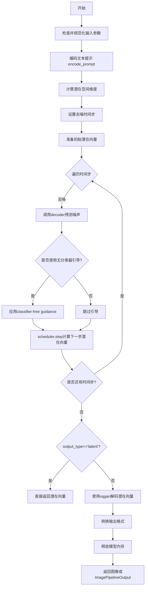
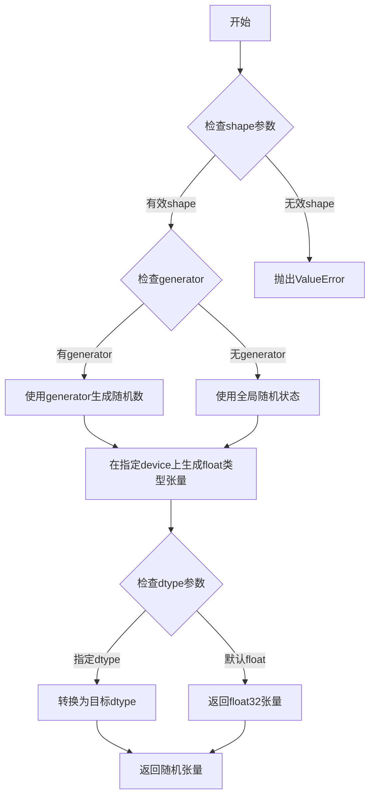
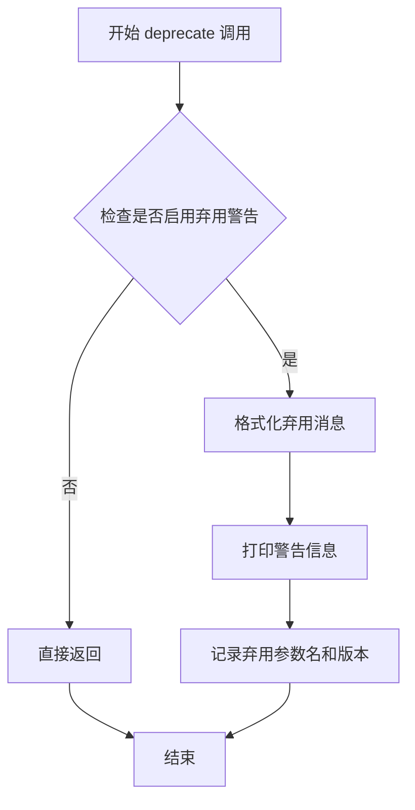
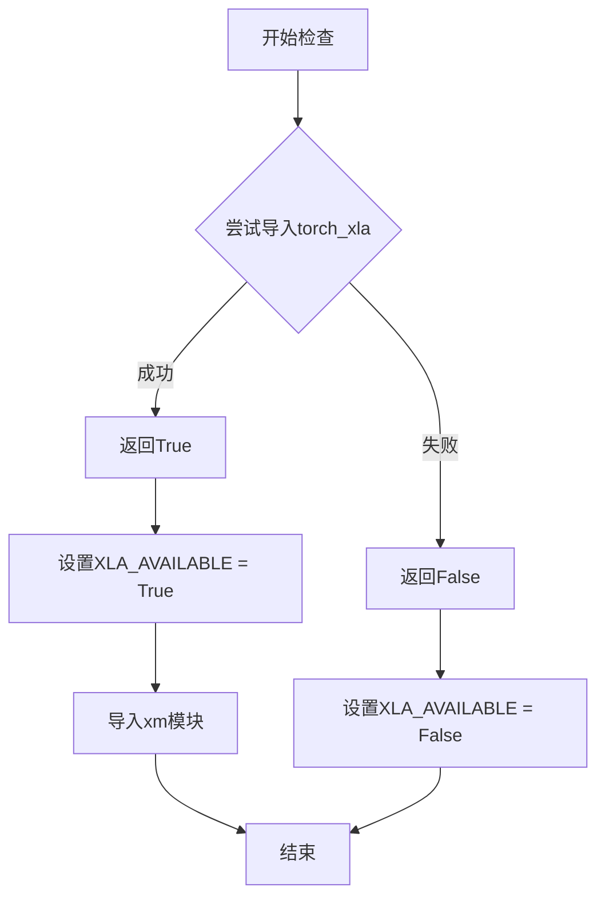
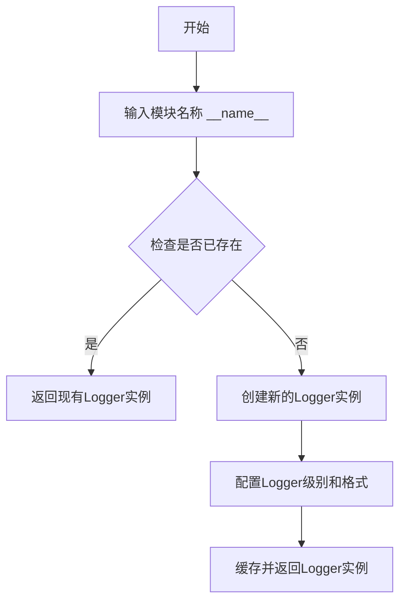
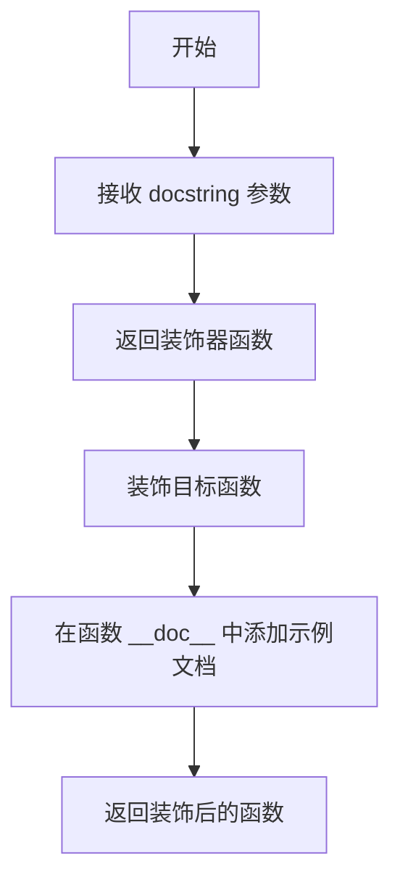
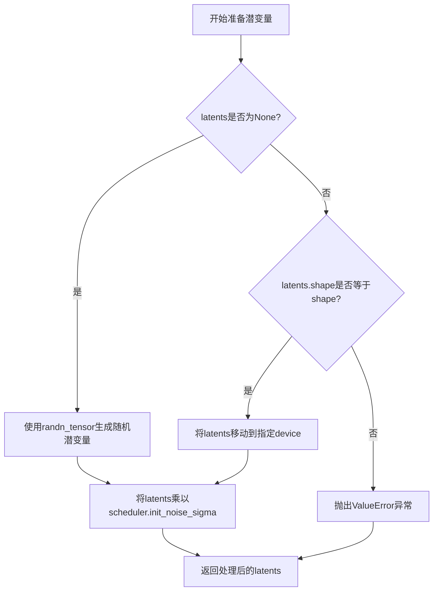
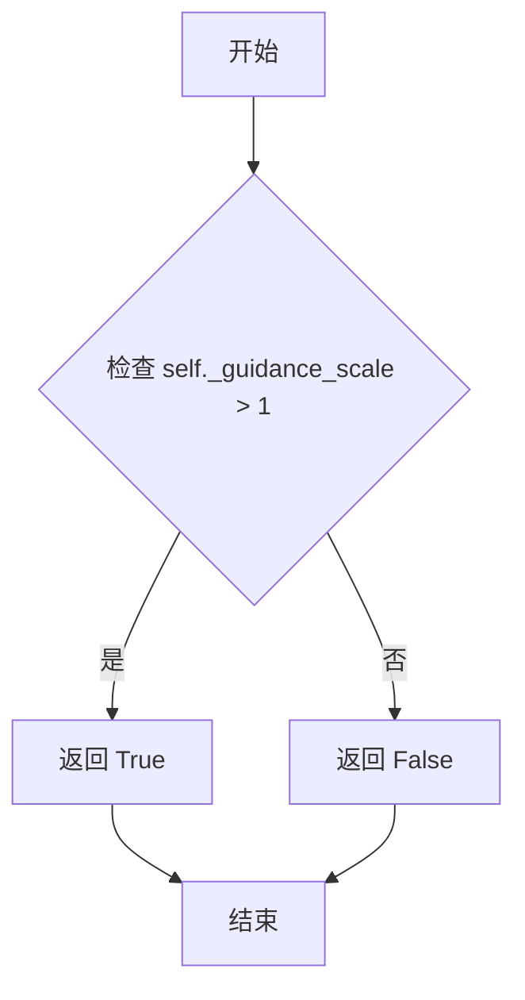

# `diffusers\src\diffusers\pipelines\wuerstchen\pipeline_wuerstchen.py` 详细设计文档

WuerstchenDecoderPipeline是一个用于图像生成的扩散模型管道，接收图像嵌入和文本提示，通过去噪过程生成最终图像。该管道结合了CLIP文本编码器、WuerstchenDiffNeXt解码器和PaellaVQModel VQGAN解码器，实现从图像嵌入到高质量图像的转换。

## 整体流程



## 类结构

```
DiffusionPipeline (基类)
├── DeprecatedPipelineMixin (混入类)
└── WuerstchenDecoderPipeline (主类)
    ├── 模块组件
    │   ├── CLIPTokenizer (tokenizer)
    │   ├── CLIPTextModel (text_encoder)
    │   ├── WuerstchenDiffNeXt (decoder)
    │   ├── PaellaVQModel (vqgan)
    │   └── DDPMWuerstchenScheduler (scheduler)
```

## 全局变量及字段


### `logger`
    
模块日志记录器，用于输出警告和信息

类型：`logging.Logger`
    


### `XLA_AVAILABLE`
    
XLA可用性标志，指示是否支持PyTorch XLA设备

类型：`bool`
    


### `EXAMPLE_DOC_STRING`
    
示例文档字符串，包含pipeline使用示例的文档

类型：`str`
    


### `WuerstchenDecoderPipeline.model_cpu_offload_seq`
    
模型CPU卸载顺序，指定模型在CPU和GPU间移动的顺序

类型：`str`
    


### `WuerstchenDecoderPipeline._callback_tensor_inputs`
    
回调张量输入列表，指定回调函数可访问的张量变量名

类型：`list[str]`
    


### `WuerstchenDecoderPipeline.tokenizer`
    
CLIP分词器，用于将文本编码为token IDs

类型：`CLIPTokenizer`
    


### `WuerstchenDecoderPipeline.text_encoder`
    
CLIP文本编码器，用于将token IDs编码为文本嵌入

类型：`CLIPTextModel`
    


### `WuerstchenDecoderPipeline.decoder`
    
Wuerstchen DiffNeXt解码器，用于去噪潜在表示

类型：`WuerstchenDiffNeXt`
    


### `WuerstchenDecoderPipeline.scheduler`
    
DDPM调度器，用于控制去噪过程的噪声调度

类型：`DDPMWuerstchenScheduler`
    


### `WuerstchenDecoderPipeline.vqgan`
    
VQGAN模型，用于将潜在表示解码为图像

类型：`PaellaVQModel`
    


### `WuerstchenDecoderPipeline._guidance_scale`
    
引导尺度(运行时)，控制分类器自由引导的强度

类型：`float`
    


### `WuerstchenDecoderPipeline._num_timesteps`
    
时间步数(运行时)，记录去噪过程的实际迭代次数

类型：`int`
    
    

## 全局函数及方法


### `randn_tensor`

生成随机张量（从外部导入的工具函数）。用于在扩散模型pipeline中生成符合正态分布的随机噪声张量，常用于初始化latents或添加噪声。

参数：

- `shape`：`tuple` 或 `int`，要生成张量的形状
- `generator`：`torch.Generator` 或 `list[torch.Generator]` 或 `None`，可选的随机数生成器，用于确保生成的可重复性
- `device`：`torch.device`，张量应放置的设备（CPU或CUDA）
- `dtype`：`torch.dtype`，张量的数据类型（如float32、float16等）

返回值：`torch.Tensor`，符合正态分布的随机张量

#### 流程图



#### 带注释源码

```
# 源码位置: ...utils.torch_utils.randn_tensor (外部导入)
# 以下为该函数在 WuerstchenDecoderPipeline 中的调用示例

# 在 prepare_latents 方法中的调用:
latents = randn_tensor(shape, generator=generator, device=device, dtype=dtype)

# 参数说明:
# - shape: 张量形状，如 (batch_size, channels, height, width)
# - generator: 可选的 PyTorch 随机数生成器，用于控制随机性
# - device: 指定生成张量应放置在 CPU 还是 CUDA 设备上
# - dtype: 指定张量的数据类型 (如 torch.float32, torch.float16 等)
#
# 返回值: 一个形状为 shape，数据类型为 dtype 的正态分布随机张量
#
# 用途:
# 1. 在扩散模型推理时初始化噪声 latent
# 2. 在训练时为样本添加高斯噪声
# 3. 作为 DiffusionPipeline 的中间变量用于随机采样
#
# 实现原理 (推测):
# 该函数是对 torch.randn 的封装，增加了:
# - 跨设备 (CPU/CUDA) 支持
# - 随机数生成器 (generator) 支持以确保可重复性
# - 可能的 XLA 设备支持 (当 is_torch_xla_available() 时)
```


### `deprecate`

用于在代码中发出弃用警告的实用函数，当检测到已废弃的参数或功能被使用时，会向用户发出警告并提供替代建议。

参数：

- `name`：`str`，被弃用的参数或功能的名称
- `version`：`str`，表示该功能将在哪个版本被移除（如 "1.0.0"）
- `message`：`str`，详细的弃用说明信息，通常包含替代方案

返回值：`None`，该函数仅用于打印警告信息，不返回任何值

#### 流程图



#### 带注释源码

```python
# deprecate 函数使用示例 1：警告 callback 参数已弃用
if callback is not None:
    deprecate(
        "callback",                      # 被弃用的参数名
        "1.0.0",                         # 将被移除的版本
        "Passing `callback` as an input argument to `__call__` is deprecated, consider use `callback_on_step_end`",  # 弃用消息和替代建议
    )

# deprecate 函数使用示例 2：警告 callback_steps 参数已弃用
if callback_steps is not None:
    deprecate(
        "callback_steps",                # 被弃用的参数名
        "1.0.0",                         # 将被移除的版本
        "Passing `callback_steps` as an input argument to `__call__` is deprecated, consider use `callback_on_step_end`",  # 弃用消息和替代建议
    )
```

#### 补充说明

`deprecate` 函数定义在 `diffusers.utils` 模块中（在文件头部通过 `from ...utils import deprecate` 导入）。该函数的具体实现位于 `src/diffusers/utils/deprecation_utils.py`，主要功能包括：

1. 检查当前 diffusers 版本是否已超过指定的弃用版本
2. 如果已超过，直接抛出 `FutureWarning` 异常
3. 如果未超过，打印警告信息提醒用户该功能将在未来版本中移除
4. 建议用户使用新的替代方案

在 `WuerstchenDecoderPipeline.__call__` 方法中，此函数用于提醒用户：
- `callback` 参数已弃用，应使用 `callback_on_step_end` 替代
- `callback_steps` 参数已弃用，应使用 `callback_on_step_end` 替代


### `is_torch_xla_available`

检查当前环境是否支持 PyTorch XLA（Accelerated Linear Algebra），用于确定是否可以导入和使用 torch_xla 库进行加速计算。

参数：
该函数无参数。

返回值：`bool`，如果 torch_xla 可用则返回 `True`，否则返回 `False`。

#### 流程图



#### 带注释源码

```python
# 这是一个从 ...utils 导入的函数
# 源码位置：在 diffusers 库的 utils 模块中定义
# 以下是基于代码使用方式的推断实现

def is_torch_xla_available() -> bool:
    """
    检查 torch_xla 是否可用。
    
    该函数尝试导入 torch_xla 模块，如果成功则返回 True，
    表示当前环境支持 XLA 加速计算。
    
    Returns:
        bool: 如果 torch_xla 可用返回 True，否则返回 False
    """
    try:
        import torch_xla
        return True
    except ImportError:
        return False


# 在代码中的实际使用方式：
# if is_torch_xla_available():
#     import torch_xla.core.xla_model as xm
#     XLA_AVAILABLE = True
# else:
#     XLA_AVAILABLE = False
```

#### 在 `WuerstchenDecoderPipeline` 中的使用

```python
# 导入检查函数
from ...utils import is_torch_xla_available

# 根据检查结果条件性导入 XLA 模块
if is_torch_xla_available():
    import torch_xla.core.xla_model as xm
    XLA_AVAILABLE = True
else:
    XLA_AVAILABLE = False

# 在 Pipeline 的 __call__ 方法中使用 XLA 优化
# 位于 denoising 循环结束后：
if XLA_AVAILABLE:
    xm.mark_step()
```

> **注意**：提供的代码片段中没有包含 `is_torch_xla_available` 函数的具体定义，它是从 `diffusers` 库的 `...utils` 模块导入的。上述源码是基于该函数的标准实现和代码中的使用方式进行的推断。


### `logging.get_logger`

获取与指定模块名称关联的日志记录器，用于在模块中记录日志信息。

参数：

- `__name__`：`str`，模块名称，通常使用 Python 的 `__name__` 特殊变量，表示调用此函数的模块的完全限定名。

返回值：`logging.Logger`，返回一个日志记录器实例，用于记录该模块的日志信息。

#### 流程图



#### 带注释源码

```python
# 获取当前模块的logger实例
# __name__ 是Python内置变量，表示当前模块的完全限定名
# 例如: 'diffusers.pipelines.wuerstchen.pipeline_wuerstchen_decoder'
logger = logging.get_logger(__name__)  # pylint: disable=invalid-name

# 后续可以通过此logger记录日志
# logger.warning("警告信息")
# logger.info("普通信息")
# logger.debug("调试信息")
```

> **说明**：此函数调用位于模块顶层，用于获取当前模块专属的日志记录器。在 diffusers 库中，通常使用此方式为每个模块创建独立的 logger，便于按模块过滤和控制日志输出。


# 分析结果

### `replace_example_docstring`

这是一个从 `diffusers` 库 `utils` 模块导入的装饰器函数，用于自动替换或增强函数的文档字符串（docstring）。在代码中，它被用作方法装饰器，将预定义的示例文档字符串（`EXAMPLE_DOC_STRING`）关联到被装饰的方法上，以便在生成文档或使用帮助函数时显示示例用法。

**注意**：该函数的实际实现源码不在当前代码文件中（它是从 `...utils` 导入的外部依赖），以下信息基于代码使用方式的推断。

参数：

- `docstring`：文档字符串参数，用于指定要关联到被装饰函数的示例文档字符串内容。

返回值：返回一个新的装饰器函数，该装饰器接受一个函数作为输入，并返回添加了示例文档字符串的函数。

#### 流程图



#### 带注释源码

```
# 由于 replace_example_docstring 是从外部导入的函数,
# 其实际源码不在当前文件中,以下是基于使用方式的推断:

def replace_example_docstring(docstring):
    """
    创建装饰器用于替换或增强函数的文档字符串
    
    Args:
        docstring: 要添加的示例文档字符串
    """
    def decorator(func):
        # 将示例文档字符串添加到函数的文档中
        if docstring:
            # 拼接或替换原有文档字符串
            func.__doc__ = docstring + "\n" + (func.__doc__ or "")
        return func
    return decorator

# 在代码中的使用方式:
@replace_example_docstring(EXAMPLE_DOC_STRING)
def __call__(self, ...):
    """
    函数被装饰后,__doc__ 属性会包含 EXAMPLE_DOC_STRING 的内容
    """
    ...
```

#### 代码中的实际使用

```python
# 定义示例文档字符串
EXAMPLE_DOC_STRING = """
    Examples:
        ```py
        >>> import torch
        >>> from diffusers import WuerstchenPriorPipeline, WuerstchenDecoderPipeline
        ...
        ```
"""

# 作为装饰器使用在 __call__ 方法上
@replace_example_docstring(EXAMPLE_DOC_STRING)
def __call__(
    self,
    image_embeddings: torch.Tensor | list[torch.Tensor],
    prompt: str | list[str] = None,
    ...
):
    """..."""
    # 方法实现
```

---

**补充说明**：如需查看 `replace_example_docstring` 的完整实现源码，需要查看 `diffusers` 库中的 `utils` 模块文件。该函数的具体实现可能包含更多高级功能，如文档字符串格式化、条件替换等。


### `WuerstchenDecoderPipeline.__init__`

WuerstchenDecoderPipeline的初始化方法，负责接收并注册所有必要的组件（包括tokenizer、text_encoder、decoder、scheduler、vqgan），并将latent_dim_scale配置注册到pipeline的配置中。

参数：

- `tokenizer`：`CLIPTokenizer`，CLIP tokenizer，用于对文本提示进行分词
- `text_encoder`：`CLIPTextModel`，CLIP文本编码器，用于将文本转换为embedding
- `decoder`：`WuerstchenDiffNeXt`，WuerstchenDiffNeXt解码器，用于去噪潜在表示
- `scheduler`：`DDPMWuerstchenScheduler`，DDPM Wuerstchen调度器，用于控制去噪过程
- `vqgan`：`PaellaVQModel`，Paella VQGAN模型，用于将潜在表示解码为图像
- `latent_dim_scale`：`float`，可选，默认为10.67，用于从图像embedding确定VQ潜在空间大小的乘数

返回值：`None`，构造函数无返回值

#### 流程图

```mermaid
flowchart TD
    A[开始 __init__] --> B[调用 super().__init__ 初始化基类]
    B --> C[调用 self.register_modules 注册所有模块]
    C --> D[注册 tokenizer 模块]
    C --> E[注册 text_encoder 模块]
    C --> F[注册 decoder 模块]
    C --> G[注册 scheduler 模块]
    C --> H[注册 vqgan 模块]
    D --> I[调用 self.register_to_config 注册配置]
    I --> J[结束 __init__]
    
    style A fill:#f9f,color:#000
    style J fill:#9f9,color:#000
```

#### 带注释源码

```
def __init__(
    self,
    tokenizer: CLIPTokenizer,           # CLIP分词器，用于文本预处理
    text_encoder: CLIPTextModel,         # CLIP文本编码器，将文本转为embedding
    decoder: WuerstchenDiffNeXt,         # WuerstchenDiffNeXt去噪解码器
    scheduler: DDPMWuerstchenScheduler,  # DDPM调度器，控制去噪步骤
    vqgan: PaellaVQModel,                 # VQGAN模型，解码潜在表示到图像
    latent_dim_scale: float = 10.67,     # 潜在维度缩放因子，默认10.67
) -> None:
    # 调用父类DeprecatedPipelineMixin和DiffusionPipeline的初始化方法
    super().__init__()
    
    # 将所有模型组件注册到pipeline的模块字典中
    # 这允许pipeline通过self.tokenizer, self.text_encoder等方式访问这些组件
    self.register_modules(
        tokenizer=tokenizer,
        text_encoder=text_encoder,
        decoder=decoder,
        scheduler=scheduler,
        vqgan=vqgan,
    )
    
    # 将latent_dim_scale参数注册到pipeline的配置对象中
    # 这样可以通过self.config.latent_dim_scale访问该配置
    self.register_to_config(latent_dim_scale=latent_dim_scale)
```


### `WuerstchenDecoderPipeline.prepare_latents`

该方法用于准备扩散模型的潜变量（latents）。如果未提供潜变量，则使用随机张量生成；否则使用提供的潜变量并验证其形状，最后将其乘以调度器的初始噪声sigma值以进行噪声调度。

参数：

- `shape`：`tuple` 或 `torch.Size`，期望的潜变量张量形状
- `dtype`：`torch.dtype`，潜变量的数据类型
- `device`：`torch.device`，潜变量应存放的设备
- `generator`：`torch.Generator | None`，用于生成确定性随机数的生成器
- `latents`：`torch.Tensor | None`，可选的预生成潜变量张量
- `scheduler`：`DDPMWuerstchenScheduler`，扩散调度器，用于获取初始噪声sigma值

返回值：`torch.Tensor`，处理后的潜变量张量

#### 流程图



#### 带注释源码

```python
def prepare_latents(self, shape, dtype, device, generator, latents, scheduler):
    # 如果未提供潜变量，则生成随机张量
    if latents is None:
        # 使用randn_tensor生成指定形状、数据类型和设备的随机张量
        latents = randn_tensor(shape, generator=generator, device=device, dtype=dtype)
    else:
        # 验证提供的潜变量形状是否匹配预期形状
        if latents.shape != shape:
            raise ValueError(f"Unexpected latents shape, got {latents.shape}, expected {shape}")
        # 将潜变量移动到指定设备
        latents = latents.to(device)

    # 根据调度器的初始噪声sigma进行缩放，用于噪声调度
    latents = latents * scheduler.init_noise_sigma
    return latents
```


### `WuerstchenDecoderPipeline.encode_prompt`

该方法用于将文本提示（prompt）编码为CLIP文本嵌入向量，以便后续在图像生成过程中作为条件控制信号。当启用Classifier-Free Guidance时，还会同时生成无条件嵌入用于无指导生成。

参数：

- `prompt`：`str | list[str]`，用户提供的文本提示，用于指导图像生成内容
- `device`：`torch.device`，指定计算设备（CPU/CUDA）
- `num_images_per_prompt`：`int`，每个提示词要生成的图像数量，用于扩展嵌入维度
- `do_classifier_free_guidance`：`bool`，是否启用Classifier-Free Guidance技术
- `negative_prompt`：`str | list[str] | None`，可选的负面提示，用于引导模型避免生成某些内容

返回值：`tuple[torch.Tensor, torch.Tensor | None]`，返回两个张量——第一个是条件文本嵌入（text_encoder_hidden_states），第二个是无条件文本嵌入（uncond_text_encoder_hidden_states，可能为None）

#### 流程图

```mermaid
flowchart TD
    A[开始 encode_prompt] --> B{判断 prompt 类型}
    B -->|list| C[batch_size = len(prompt)]
    B -->|single| D[batch_size = 1]
    C --> E[Tokenize prompt]
    D --> E
    E --> F[获取 input_ids 和 attention_mask]
    F --> G[检查是否被截断]
    G --> H{需要untruncated?}
    H -->|Yes| I[解码并警告用户]
    I --> J[截断到 model_max_length]
    H -->|No| K[直接使用]
    J --> L
    K --> L[CLIP Text Encoder 编码]
    L --> M[获取 last_hidden_state]
    M --> N[repeat_interleave 扩展到 num_images_per_prompt]
    N --> O{do_classifier_free_guidance?}
    O -->|No| P[返回 条件嵌入, None]
    O -->|Yes| Q[处理 negative_prompt]
    Q --> R{negative_prompt 类型}
    R -->|None| S["uncond_tokens = [''] * batch_size"]
    R -->|str| T["uncond_tokens = [negative_prompt]"]
    R -->|list| U["uncond_tokens = negative_prompt"]
    S --> V[Tokenize negative_prompt]
    T --> V
    U --> V
    V --> W[CLIP Text Encoder 编码 uncond]
    W --> X[repeat 扩展维度]
    X --> Y[reshape 为 batch_size * num_images_per_prompt]
    Y --> P
```

#### 带注释源码

```python
def encode_prompt(
    self,
    prompt,                              # str | list[str]: 输入的文本提示
    device,                              # torch.device: 计算设备
    num_images_per_prompt,              # int: 每个提示生成的图像数量
    do_classifier_free_guidance,        # bool: 是否启用CFG
    negative_prompt=None,               # str | list[str] | None: 负面提示
):
    """
    编码文本提示为CLIP文本嵌入。
    
    该方法将文本提示转换为文本编码器的隐藏状态，用于在图像生成过程中
    提供文本条件。当启用Classifier-Free Guidance时，同时生成无条件嵌入。
    
    Args:
        prompt: 文本提示，可以是单个字符串或字符串列表
        device: 运行设备
        num_images_per_prompt: 每个提示生成的图像数量
        do_classifier_free_guidance: 是否使用无分类器引导
        negative_prompt: 可选的负面提示
    
    Returns:
        Tuple of (text_encoder_hidden_states, uncond_text_encoder_hidden_states)
    """
    # 确定批量大小：如果是列表则取长度，否则默认为1
    batch_size = len(prompt) if isinstance(prompt, list) else 1
    
    # ============ 第一步：处理条件提示（prompt）============
    # 使用CLIP Tokenizer将文本转换为token IDs
    text_inputs = self.tokenizer(
        prompt,
        padding="max_length",                     # 填充到最大长度
        max_length=self.tokenizer.model_max_length,  # 最大token长度
        truncation=True,                          # 截断超长文本
        return_tensors="pt",                      # 返回PyTorch张量
    )
    text_input_ids = text_inputs.input_ids        # token IDs
    attention_mask = text_inputs.attention_mask   # 注意力掩码
    
    # 获取未截断的token IDs用于检查是否被截断
    untruncated_ids = self.tokenizer(
        prompt, 
        padding="longest", 
        return_tensors="pt"
    ).input_ids
    
    # 检查原始输入是否超过最大长度（CLIP模型有token长度限制）
    if untruncated_ids.shape[-1] >= text_input_ids.shape[-1] and not torch.equal(
        text_input_ids, untruncated_ids
    ):
        # 解码被截断的部分并记录警告
        removed_text = self.tokenizer.batch_decode(
            untruncated_ids[:, self.tokenizer.model_max_length - 1 : -1]
        )
        logger.warning(
            "The following part of your input was truncated because CLIP can only handle sequences up to"
            f" {self.tokenizer.model_max_length} tokens: {removed_text}"
        )
        # 截断到模型支持的最大长度
        text_input_ids = text_input_ids[:, : self.tokenizer.model_max_length]
        attention_mask = attention_mask[:, : self.tokenizer.model_max_length]
    
    # 通过CLIP文本编码器获取文本嵌入
    text_encoder_output = self.text_encoder(
        text_input_ids.to(device), 
        attention_mask=attention_mask.to(device)
    )
    # 获取最后一层隐藏状态
    text_encoder_hidden_states = text_encoder_output.last_hidden_state
    
    # 扩展条件嵌入维度以匹配生成的图像数量
    # repeat_interleave在batch维度上重复每个样本
    text_encoder_hidden_states = text_encoder_hidden_states.repeat_interleave(
        num_images_per_prompt, dim=0
    )
    
    # ============ 第二步：处理无条件嵌入（用于CFG）============
    uncond_text_encoder_hidden_states = None
    
    if do_classifier_free_guidance:
        # 处理负面提示类型
        uncond_tokens: list[str]
        if negative_prompt is None:
            # 默认使用空字符串
            uncond_tokens = [""] * batch_size
        elif type(prompt) is not type(negative_prompt):
            # 类型检查：negative_prompt类型必须与prompt一致
            raise TypeError(
                f"`negative_prompt` should be the same type to `prompt`, but got {type(negative_prompt)} !="
                f" {type(prompt)}."
            )
        elif isinstance(negative_prompt, str):
            # 字符串转换为单元素列表
            uncond_tokens = [negative_prompt]
        elif batch_size != len(negative_prompt):
            # 批量大小匹配检查
            raise ValueError(
                f"`negative_prompt`: {negative_prompt} has batch size {len(negative_prompt)}, but `prompt`:"
                f" {prompt} has batch size {batch_size}. Please make sure that passed `negative_prompt` matches"
                " the batch size of `prompt`."
            )
        else:
            # 列表类型直接使用
            uncond_tokens = negative_prompt
        
        # Tokenize负面提示
        uncond_input = self.tokenizer(
            uncond_tokens,
            padding="max_length",
            max_length=self.tokenizer.model_max_length,
            truncation=True,
            return_tensors="pt",
        )
        
        # 编码负面提示获取无条件嵌入
        negative_prompt_embeds_text_encoder_output = self.text_encoder(
            uncond_input.input_ids.to(device), 
            attention_mask=uncond_input.attention_mask.to(device)
        )
        
        # 获取无条件隐藏状态
        uncond_text_encoder_hidden_states = (
            negative_prompt_embeds_text_encoder_output.last_hidden_state
        )
        
        # 扩展无条件嵌入维度以匹配生成的图像数量
        # 使用repeat而不是repeat_interleave，因为需要在序列维度上复制
        seq_len = uncond_text_encoder_hidden_states.shape[1]
        uncond_text_encoder_hidden_states = uncond_text_encoder_hidden_states.repeat(
            1, num_images_per_prompt, 1
        )
        # 重塑为 (batch_size * num_images_per_prompt, seq_len, hidden_dim)
        uncond_text_encoder_hidden_states = uncond_text_encoder_hidden_states.view(
            batch_size * num_images_per_prompt, seq_len, -1
        )
    
    # 返回条件嵌入和无条件嵌入（元组）
    return text_encoder_hidden_states, uncond_text_encoder_hidden_states
```


### `WuerstchenDecoderPipeline.guidance_scale`

该属性是一个只读的 `@property` 方法，用于获取当前管道的引导比例（guidance scale）。该值在调用 `__call__` 方法时通过参数 `guidance_scale` 进行设置，并存储在实例变量 `_guidance_scale` 中。引导比例用于控制分类器自由引导（Classifier-Free Guidance）的强度，值越大表示生成的图像越紧密地跟随文本提示，但可能导致图像质量下降。

参数：無

返回值：`float`，返回当前设置的引导比例值，用于控制图像生成过程中文本引导的强度。

#### 流程图

```mermaid
graph TD
    A[调用 __call__ 方法] --> B[设置 self._guidance_scale = guidance_scale 参数]
    C[调用 guidance_scale 属性] --> D[返回 self._guidance_scale]
    D --> E[在去噪循环中使用 self.guidance_scale 进行插值]
    E --> F[torch.lerp 公式: pred = uncond + scale * (text - uncond)]
```

#### 带注释源码

```python
@property
def guidance_scale(self):
    """
    属性 getter 方法，用于获取分类器自由引导的强度比例。
    
    该属性返回一个浮点数，表示在图像生成过程中文本提示对最终图像的影响程度。
    当 guidance_scale > 1 时启用分类器自由引导，值越大表示文本引导越强。
    
    返回值:
        float: 当前设置的引导比例值，默认在 __call__ 中设置为 0.0
    """
    return self._guidance_scale
```

**使用示例（在 `__call__` 方法的去噪循环中）：**

```python
# 8. Check for classifier free guidance and apply it
if self.do_classifier_free_guidance:
    # predicted_latents 被分割为条件部分和无条件部分
    predicted_latents_text, predicted_latents_uncond = predicted_latents.chunk(2)
    # 使用 guidance_scale 进行线性插值，将无条件预测向条件预测方向调整
    # 公式: result = uncond + guidance_scale * (text - uncond)
    predicted_latents = torch.lerp(
        predicted_latents_uncond,  # 无条件预测（不参考文本）
        predicted_latents_text,    # 条件预测（参考文本）
        self.guidance_scale        # 引导强度系数
    )
```


### `WuerstchenDecoderPipeline.do_classifier_free_guidance`

该属性方法用于判断是否启用了无分类器自由引导（Classifier-Free Guidance）。它通过检查 guidance_scale 是否大于 1 来决定是否启用分类器自由引导功能。

参数：无（这是一个属性方法，只接受隐式的 self 参数）

返回值：`bool`，如果 guidance_scale > 1 则返回 True（表示启用了分类器自由引导），否则返回 False。

#### 流程图



#### 带注释源码

```python
@property
def do_classifier_free_guidance(self):
    """
    属性方法：判断是否启用无分类器自由引导（Classifier-Free Guidance）
    
    该属性检查 guidance_scale 是否大于 1来决定是否在图像生成过程中
    使用无分类器自由引导技术。当 guidance_scale > 1 时，模型会在生成过程中
    同时考虑条件和无条件输入，以更好地遵循文本提示。
    
    返回值:
        bool: 如果 guidance_scale > 1 返回 True，否则返回 False
    """
    return self._guidance_scale > 1
```


### `WuerstchenDecoderPipeline.num_timesteps`

该属性是一个只读属性，用于获取解码管道在去噪过程中实际执行的时间步数量。该值在调用管道生成图像时自动设置，反映了实际执行的推理步骤数。

参数：无（属性装饰器，不接受额外参数）

返回值：`int`，返回去噪过程中实际执行的时间步数量（即 `len(timesteps[:-1])`），该值在 `__call__` 方法执行去噪循环时自动设置。

#### 流程图

```mermaid
flowchart TD
    A[访问 num_timesteps 属性] --> B{检查 _num_timesteps 是否已设置}
    B -->|已设置| C[返回 self._num_timesteps]
    B -->|未设置| D[返回默认值或未初始化状态]
    
    subgraph __call__方法内部
        E[开始去噪循环] --> F[计算 timesteps 数量]
        F --> G[设置 self._num_timesteps = len(timesteps[:-1])]
    end
    
    G -.->|更新值| C
```

#### 带注释源码

```python
@property
def num_timesteps(self):
    """
    属性：获取解码管道在去噪过程中实际执行的时间步数量。
    
    注意：此属性返回的值取决于管道是否已被调用过。
    在 __call__ 方法执行期间，此值会被设置为 len(timesteps[:-1])，
    即实际执行的去噪步骤数（不包括最后一个timestep）。
    
    返回:
        int: 去噪循环中执行的时间步数量。如果在调用管道之前访问，
             则返回初始值（通常为 0 或未定义）。
    """
    return self._num_timesteps
```


### `WuerstchenDecoderPipeline.__call__`

这是 Wuerstchen 解码器管道的主调用方法，接收图像嵌入（来自 Prior 模型或图像提取），通过去噪循环生成最终图像，支持分类器自由引导（CFG），并可选地将潜在向量解码为最终图像。

参数：

- `image_embeddings`：`torch.Tensor | list[torch.Tensor]`，从图像提取或由 Prior 模型生成的图像嵌入
- `prompt`：`str | list[str]`，指导图像生成的提示词
- `num_inference_steps`：`int`，去噪步数，默认值为 12，步数越多图像质量越高但推理越慢
- `timesteps`：`list[float] | None`，自定义去噪时间步，若不指定则使用等间隔的 `num_inference_steps` 个时间步，必须按降序排列
- `guidance_scale`：`float`，分类器自由扩散引导（CFG）比例，默认 0.0，设置为 > 1 时启用引导，值越大越接近文本提示
- `negative_prompt`：`str | list[str] | None`，不用于引导图像生成的提示词，仅在启用 CFG 时生效
- `num_images_per_prompt`：`int`，每个提示词生成的图像数量，默认 1
- `generator`：`torch.Generator | list[torch.Generator] | None`，用于生成确定性结果的随机数生成器
- `latents`：`torch.Tensor | None`，预生成的噪声潜在向量，若不提供则使用随机 `generator` 生成
- `output_type`：`str`，生成图像的输出格式，可选 "pil"、"np"、"pt" 或 "latent"，默认 "pil"
- `return_dict`：`bool`，是否返回 `ImagePipelineOutput`，默认 True
- `callback_on_step_end`：`Callable[[int, int], None] | None`，去噪步骤结束时调用的回调函数
- `callback_on_step_end_tensor_inputs`：`list[str]`，传递给回调函数的张量输入列表

返回值：`ImagePipelineOutput | tuple`，当 `return_dict=True` 时返回 `ImagePipelineOutput`，否则返回元组

#### 流程图

```mermaid
flowchart TD
    A[开始 __call__] --> B[检查并处理回调参数]
    B --> C[获取设备 dtype 设置 guidance_scale]
    C --> D[检查输入参数有效性]
    D --> E[编码提示词: prompt_embeds, negative_prompt_embeds]
    E --> F[处理 image_embeddings 和 CFG]
    F --> G[计算潜在空间形状 latent_features_shape]
    G --> H[设置时间步 timesteps]
    H --> I[准备初始潜在向量 latents]
    I --> J[循环遍历 timesteps[:-1]]
    J --> K[扩展时间步 ratio]
    K --> L[调用 decoder 去噪预测]
    L --> M{是否启用 CFG?}
    M -->|是| N[分离预测结果并应用 lerp 引导]
    M -->|否| O[直接使用预测结果]
    N --> P[scheduler.step 计算上一步潜在向量]
    O --> P
    P --> Q{有 callback_on_step_end?}
    Q -->|是| R[执行回调并更新 latents]
    Q -->|否| S{XLA 可用?}
    R --> S
    S -->|是| T[xm.mark_step]
    S -->|否| U{继续循环?}
    T --> U
    U -->|是| J
    U -->|否| V{output_type == 'latent'?}
    V -->|否| W[使用 vqgan 解码 latents 为图像]
    V -->|是| X[直接返回 latents]
    W --> Y[根据 output_type 转换格式]
    X --> Z[释放模型钩子]
    Y --> Z
    Z --> AA[返回结果]
```

#### 带注释源码

```python
@torch.no_grad()
@replace_example_docstring(EXAMPLE_DOC_STRING)
def __call__(
    self,
    image_embeddings: torch.Tensor | list[torch.Tensor],
    prompt: str | list[str] = None,
    num_inference_steps: int = 12,
    timesteps: list[float] | None = None,
    guidance_scale: float = 0.0,
    negative_prompt: str | list[str] | None = None,
    num_images_per_prompt: int = 1,
    generator: torch.Generator | list[torch.Generator] | None = None,
    latents: torch.Tensor | None = None,
    output_type: str | None = "pil",
    return_dict: bool = True,
    callback_on_step_end: Callable[[int, int], None] | None = None,
    callback_on_step_end_tensor_inputs: list[str] = ["latents"],
    **kwargs,
):
    # 从 kwargs 中提取已弃用的回调参数并发出警告
    callback = kwargs.pop("callback", None)
    callback_steps = kwargs.pop("callback_steps", None)

    if callback is not None:
        deprecate(
            "callback", "1.0.0",
            "Passing `callback` as an input argument to `__call__` is deprecated, consider use `callback_on_step_end`",
        )
    if callback_steps is not None:
        deprecate(
            "callback_steps", "1.0.0",
            "Passing `callback_steps` as an input argument to `__call__` is deprecated, consider use `callback_on_step_end`",
        )

    # 验证回调张量输入是否在允许列表中
    if callback_on_step_end_tensor_inputs is not None and not all(
        k in self._callback_tensor_inputs for k in callback_on_step_end_tensor_inputs
    ):
        raise ValueError(
            f"`callback_on_step_end_tensor_inputs` has to be in {self._callback_tensor_inputs}, "
            f"but found {[k for k in callback_on_step_end_tensor_inputs if k not in self._callback_tensor_inputs]}"
        )

    # 0. 定义常用变量
    device = self._execution_device  # 执行设备
    dtype = self.decoder.dtype  # 解码器数据类型
    self._guidance_scale = guidance_scale  # 设置引导比例

    # 1. 检查输入参数有效性
    # 处理 prompt 类型
    if not isinstance(prompt, list):
        if isinstance(prompt, str):
            prompt = [prompt]
        else:
            raise TypeError(f"'prompt' must be of type 'list' or 'str', but got {type(prompt)}.")

    # 处理 negative_prompt 类型（当启用 CFG 时）
    if self.do_classifier_free_guidance:
        if negative_prompt is not None and not isinstance(negative_prompt, list):
            if isinstance(negative_prompt, str):
                negative_prompt = [negative_prompt]
            else:
                raise TypeError(
                    f"'negative_prompt' must be of type 'list' or 'str', but got {type(negative_prompt)}."
                )

    # 处理 image_embeddings 转换为 torch.Tensor
    if isinstance(image_embeddings, list):
        image_embeddings = torch.cat(image_embeddings, dim=0)
    if isinstance(image_embeddings, np.ndarray):
        image_embeddings = torch.Tensor(image_embeddings, device=device).to(dtype=dtype)
    if not isinstance(image_embeddings, torch.Tensor):
        raise TypeError(
            f"'image_embeddings' must be of type 'torch.Tensor' or 'np.array', but got {type(image_embeddings)}."
        )

    # 验证 num_inference_steps 类型
    if not isinstance(num_inference_steps, int):
        raise TypeError(
            f"'num_inference_steps' must be of type 'int', but got {type(num_inference_steps)}"
            " In Case you want to provide explicit timesteps, please use the 'timesteps' argument."
        )

    # 2. 编码提示词得到文本嵌入
    prompt_embeds, negative_prompt_embeds = self.encode_prompt(
        prompt,
        device,
        image_embeddings.size(0) * num_images_per_prompt,
        self.do_classifier_free_guidance,
        negative_prompt,
    )
    # 合并有条件和无条件文本嵌入用于 CFG
    text_encoder_hidden_states = (
        torch.cat([prompt_embeds, negative_prompt_embeds]) if negative_prompt_embeds is not None else prompt_embeds
    )
    # 处理图像嵌入用于 CFG（复制一份零张量）
    effnet = (
        torch.cat([image_embeddings, torch.zeros_like(image_embeddings)])
        if self.do_classifier_free_guidance
        else image_embeddings
    )

    # 3. 确定潜在空间的形状
    latent_height = int(image_embeddings.size(2) * self.config.latent_dim_scale)
    latent_width = int(image_embeddings.size(3) * self.config.latent_dim_scale)
    latent_features_shape = (
        image_embeddings.size(0) * num_images_per_prompt,  # batch_size * num_images_per_prompt
        4,  # 潜在通道数
        latent_height,  # 潜在高度
        latent_width,   # 潜在宽度
    )

    # 4. 准备并设置时间步
    if timesteps is not None:
        self.scheduler.set_timesteps(timesteps=timesteps, device=device)
        timesteps = self.scheduler.timesteps
        num_inference_steps = len(timesteps)
    else:
        self.scheduler.set_timesteps(num_inference_steps, device=device)
        timesteps = self.scheduler.timesteps

    # 5. 准备潜在向量
    latents = self.prepare_latents(
        latent_features_shape, dtype, device, generator, latents, self.scheduler
    )

    # 6. 运行去噪循环
    self._num_timesteps = len(timesteps[:-1])
    for i, t in enumerate(self.progress_bar(timesteps[:-1])):
        ratio = t.expand(latents.size(0)).to(dtype)  # 扩展时间步以匹配批次大小

        # 7. 去噪潜在向量
        predicted_latents = self.decoder(
            torch.cat([latents] * 2) if self.do_classifier_free_guidance else latents,
            r=torch.cat([ratio] * 2) if self.do_classifier_free_guidance else ratio,
            effnet=effnet,
            clip=text_encoder_hidden_states,
        )

        # 8. 检查是否应用分类器自由引导
        if self.do_classifier_free_guidance:
            # 分离条件和无条件预测
            predicted_latents_text, predicted_latents_uncond = predicted_latents.chunk(2)
            # 使用 lerp 在无条件预测和条件预测之间插值
            predicted_latents = torch.lerp(
                predicted_latents_uncond, predicted_latents_text, self.guidance_scale
            )

        # 9. 对潜在向量重新噪声到下一个时间步
        latents = self.scheduler.step(
            model_output=predicted_latents,
            timestep=ratio,
            sample=latents,
            generator=generator,
        ).prev_sample

        # 处理步骤结束时的回调
        if callback_on_step_end is not None:
            callback_kwargs = {}
            for k in callback_on_step_end_tensor_inputs:
                callback_kwargs[k] = locals()[k]
            callback_outputs = callback_on_step_end(self, i, t, callback_kwargs)

            # 更新回调返回的张量
            latents = callback_outputs.pop("latents", latents)
            image_embeddings = callback_outputs.pop("image_embeddings", image_embeddings)
            text_encoder_hidden_states = callback_outputs.pop(
                "text_encoder_hidden_states", text_encoder_hidden_states
            )

        # 处理已弃用的回调参数
        if callback is not None and i % callback_steps == 0:
            step_idx = i // getattr(self.scheduler, "order", 1)
            callback(step_idx, t, latents)

        # XLA 优化：标记计算步骤
        if XLA_AVAILABLE:
            xm.mark_step()

    # 10. 处理输出格式
    if output_type not in ["pt", "np", "pil", "latent"]:
        raise ValueError(
            f"Only the output types `pt`, `np`, `pil` and `latent` are supported not output_type={output_type}"
        )

    if not output_type == "latent":
        # 使用 VQ-GAN 解码潜在向量为图像
        latents = self.vqgan.config.scale_factor * latents
        images = self.vqgan.decode(latents).sample.clamp(0, 1)

        # 转换格式
        if output_type == "np":
            images = images.permute(0, 2, 3, 1).cpu().float().numpy()
        elif output_type == "pil":
            images = images.permute(0, 2, 3, 1).cpu().float().numpy()
            images = self.numpy_to_pil(images)
    else:
        images = latents

    # 释放所有模型
    self.maybe_free_model_hooks()

    # 返回结果
    if not return_dict:
        return images
    return ImagePipelineOutput(images)
```

## 关键组件


### WuerstchenDecoderPipeline

Wuerstchen图像解码管道，接收图像嵌入和文本提示，通过Diffusion模型和VQGAN解码器生成最终图像。

### 张量索引与惰性加载

使用`@torch.no_grad()`装饰器禁用梯度计算以节省显存；XLA支持(`torch_xla`)实现惰性求值和加速；`model_cpu_offload_seq`定义模型卸载顺序。

### 反量化支持

通过`PaellaVQModel.decode()`方法将latent空间反量化回像素空间，`scale_factor`用于缩放latents。

### 量化策略

支持`torch_dtype`指定模型精度；`_guidance_scale`控制classifier-free guidance强度；`dtype`属性管理不同模型分支的数据类型。

### 调度器

`DDPMWuerstchenScheduler`管理去噪过程的时间步和噪声调度。

### 模型组件

CLIPTextModel和CLIPTokenizer用于文本编码；WuerstchenDiffNeXt作为核心去噪解码器；PaellaVQModel作为VAE解码器。

### 输入验证与错误处理

对prompt类型、image_embeddings类型、num_inference_steps类型进行严格检查；支持列表和字符串两种输入格式。

### Classifier-Free Guidance

通过`do_classifier_free_guidance`属性判断是否启用；将prompt_embeds和negative_prompt_embeds拼接后一起处理；在去噪循环中对预测结果进行插值融合。

### 回调机制

`callback_on_step_end`支持在每个去噪步骤结束时执行自定义逻辑；`_callback_tensor_inputs`定义可传递的tensor输入列表。

### 潜在优化空间

缺少对`latent_dim_scale`参数的有效性验证；`encode_prompt`方法存在重复计算unconditional embeddings的风险；未实现模型量化推理支持。


## 问题及建议


### 已知问题

-   **属性初始化不一致**：`guidance_scale`、`do_classifier_free_guidance`、`num_timesteps` 依赖 `@property` 装饰器，但对应的私有变量 `_guidance_scale` 和 `_num_timesteps` 仅在 `__call__` 方法中设置，类定义中未初始化，可能导致意外行为。
-   **类型注解缺失**：`encode_prompt` 方法的所有参数均缺少类型注解，`prepare_latents` 方法同样缺少参数类型注解，影响代码可读性和类型安全检查。
-   **硬编码的张量复制操作**：在去噪循环中多次使用 `torch.cat([latents] * 2)` 和 `torch.cat([ratio] * 2)`，每次迭代都会创建新张量，增加内存开销。
-   **重复的图像转换逻辑**：在 `output_type == "np"` 和 `output_type == "pil"` 分支中都执行了 `images.permute(0, 2, 3, 1).cpu().float().numpy()`，存在代码重复。
-   **输入验证不足**：未验证 `image_embeddings` 的维度是否符合预期（如至少4维），仅在后续使用时可能抛出不够友好的错误。
-   **未使用的变量**：`attention_mask` 被传入 text_encoder 但未在模型中被有效利用，可能表明调用方式不完整。
-   **XLA优化不彻底**：`xm.mark_step()` 仅在循环末尾调用，可能无法最大程度发挥XLA加速效果。

### 优化建议

-   在 `__init__` 方法中初始化 `_guidance_scale = 0.0` 和 `_num_timesteps = 0`，或使用 `None` 并在属性中提供默认值。
-   为 `encode_prompt` 和 `prepare_latents` 方法添加完整的类型注解。
-   预先计算复制后的张量或在 CFG 条件下使用条件赋值替代 `torch.cat`，例如使用 `torch.where`。
-   提取公共的图像转换逻辑到一个辅助方法中。
-   在 `__call__` 方法开头增加对 `image_embeddings` 维度的验证，提供更清晰的错误信息。
-   评估 `attention_mask` 的必要性，若不需要可移除以简化代码。
-   考虑将 XLA `mark_step()` 移到更合适的位置或在更多张量操作后调用以优化编译性能。

## 其它


### 设计目标与约束

本代码的设计目标是将Wuerstchen模型的图像嵌入（image embeddings）解码为最终图像，实现文本到图像的生成流程。约束条件包括：1) 输入的image_embeddings必须为torch.Tensor或numpy数组类型；2) num_inference_steps必须为整数；3) 输出类型仅支持"pt"、"np"、"pil"和"latent"四种；4) prompt和negative_prompt类型必须一致（str或list[str]）；5) CLIPTokenizer处理文本长度受model_max_length限制。

### 错误处理与异常设计

代码包含多层次错误处理机制。类型检查方面：对prompt类型进行验证（str或list），对negative_prompt类型一致性检查，对image_embeddings类型验证（torch.Tensor或np.ndarray），对num_inference_steps类型验证（int），对output_type值范围验证。尺寸匹配验证：检查latents.shape与预期shape一致性，验证negative_prompt与prompt的batch_size一致性。弃用警告处理：对旧版callback和callback_steps参数使用deprecate函数提示迁移至callback_on_step_end。异常抛出：使用ValueError、TypeError等标准异常，错误信息包含实际值与期望值对比。

### 数据流与状态机

主数据流路径为：image_embeddings + prompt → encode_prompt() → prompt_embeds → 准备latents → 循环denoising（decoder预测 + scheduler.step） → vqgan.decode → 输出图像。状态转换：初始化状态 → 编码状态（encode_prompt）→ 调度状态（set_timesteps）→ 去噪循环状态（多次decoder+scheduler.step）→ 解码状态（vqgan.decode）→ 完成状态。关键状态变量包括_guidance_scale、_num_timesteps、latents张量。

### 外部依赖与接口契约

核心依赖包括：transformers库（CLIPTextModel、CLIPTokenizer）、diffusers自身模块（DDPMWuerstchenScheduler、DiffusionPipeline、ImagePipelineOutput、randn_tensor）、模型类（PaellaVQModel、WuerstchenDiffNeXt）、torch/numpy。接口契约：__call__方法接受image_embeddings（torch.Tensor或list）、prompt（str或list）、可选参数返回ImagePipelineOutput或tuple；encode_prompt方法返回text_encoder_hidden_states和uncond_text_encoder_hidden_states元组；prepare_latents方法返回latents张量。Pipeline需遵循diffusers库的模块注册机制（register_modules）。

### 性能优化建议

代码已包含XLA支持（is_torch_xla_available检查和xm.mark_step()）、模型CPU卸载序列定义（model_cpu_offload_seq）、可能的无钩子释放（maybe_free_model_hooks）。优化空间：1) 混合精度训练推理可进一步扩展；2) compile优化可减少首次推理延迟；3) 批处理优化可提高GPU利用率；4) 异步callback处理可减少主线程阻塞。

### 版本兼容性考虑

代码使用Python 3.9+类型提示语法（torch.Tensor | list[torch.Tensor]）；兼容torch 2.0+的torch.no_grad()装饰器；XLA支持通过可选导入实现优雅降级；弃用机制通过deprecate函数统一管理。未来需关注transformers库CLIP版本兼容性、diffusers库Pipeline基类变更、torch版本对新型号支持。

### 安全与合规性

模型加载需遵守Apache License 2.0；用户输入（prompt）通过tokenizer处理，无直接代码注入风险；生成内容需遵循wuerstchen模型许可协议；CLIP模型使用需注意其自身许可条款。


    