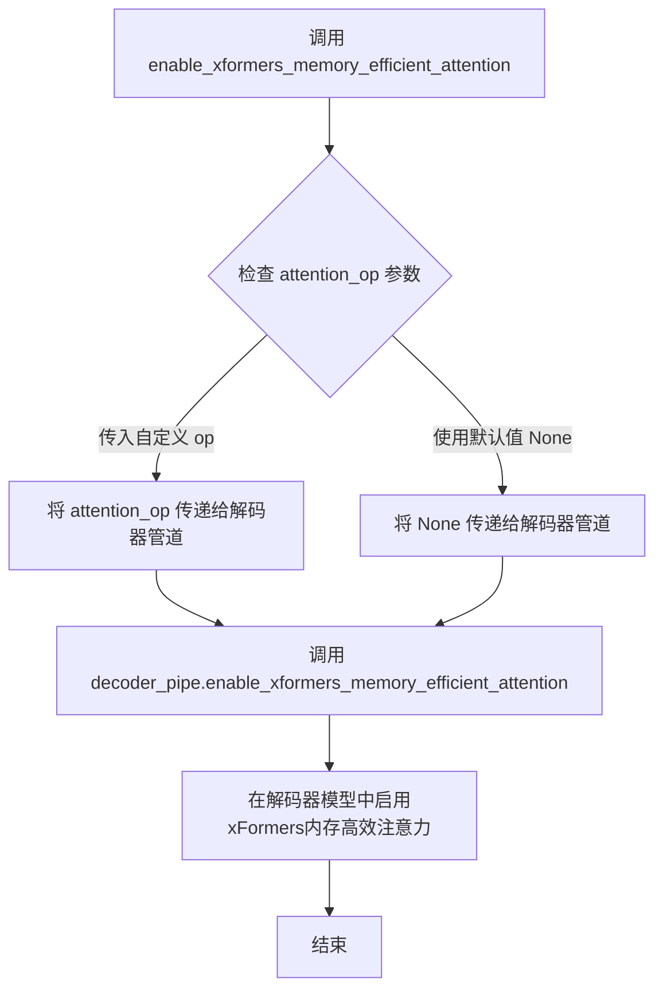
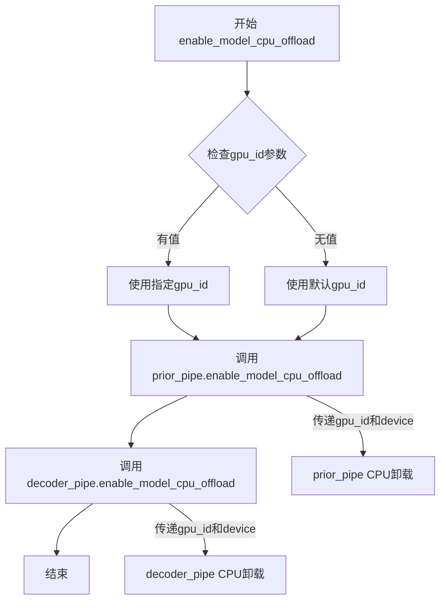
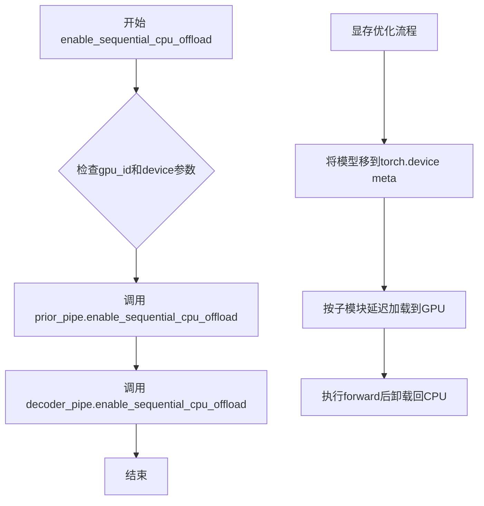
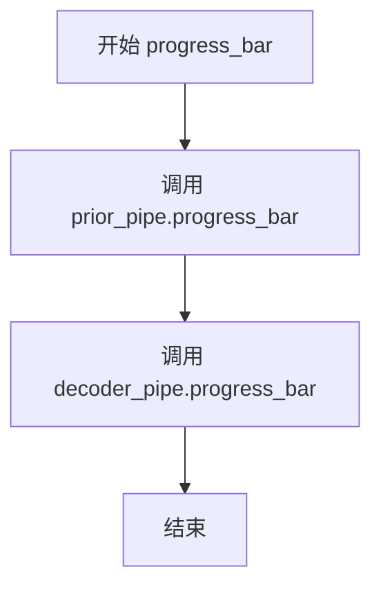
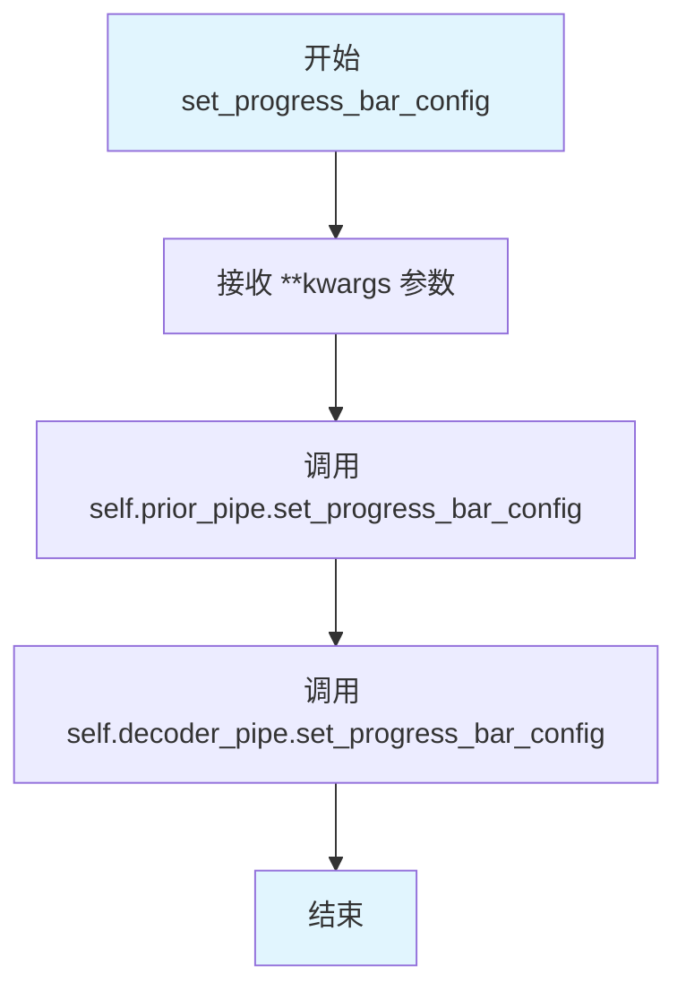
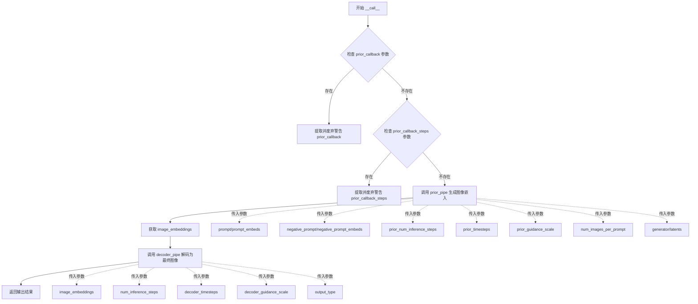

# `diffusers\src\diffusers\pipelines\wuerstchen\pipeline_wuerstchen_combined.py` 详细设计文档

WuerstchenCombinedPipeline是一个用于文本到图像生成的组合扩散管道，通过先验模型(prior)生成图像嵌入，再由解码器模型(decoder)根据嵌入生成最终图像，实现了Wuerstchen架构的两阶段图像生成流程。

## 整体流程

```mermaid
graph TD
    A[开始: __call__] --> B{检查prior_callback参数}
B --> C[调用prior_pipe生成图像嵌入]
C --> D[提取prior_outputs[0]作为image_embeddings]
D --> E[调用decoder_pipe生成最终图像]
E --> F[返回outputs]
F --> G[结束]
```

## 类结构

```
DiffusionPipeline (抽象基类)
├── DeprecatedPipelineMixin
└── WuerstchenCombinedPipeline (主类)
    ├── WuerstchenPriorPipeline (prior子管道)
    └── WuerstchenDecoderPipeline (decoder子管道)
```

## 全局变量及字段


### `TEXT2IMAGE_EXAMPLE_DOC_STRING`
    
Documentation string containing example usage code for the text-to-image generation pipeline

类型：`str`
    


### `WuerstchenCombinedPipeline.tokenizer`
    
The decoder tokenizer used for text inputs in the decoder pipeline

类型：`CLIPTokenizer`
    


### `WuerstchenCombinedPipeline.text_encoder`
    
The decoder text encoder used for text inputs in the decoder pipeline

类型：`CLIPTextModel`
    


### `WuerstchenCombinedPipeline.decoder`
    
The decoder model used for generating images from latent embeddings

类型：`WuerstchenDiffNeXt`
    


### `WuerstchenCombinedPipeline.scheduler`
    
The scheduler used for the decoder denoising process in image generation

类型：`DDPMWuerstchenScheduler`
    


### `WuerstchenCombinedPipeline.vqgan`
    
The VQGAN model used for encoding and decoding images in the decoder pipeline

类型：`PaellaVQModel`
    


### `WuerstchenCombinedPipeline.prior_tokenizer`
    
The tokenizer used for text inputs in the prior pipeline

类型：`CLIPTokenizer`
    


### `WuerstchenCombinedPipeline.prior_text_encoder`
    
The text encoder used for text inputs in the prior pipeline

类型：`CLIPTextModel`
    


### `WuerstchenCombinedPipeline.prior_prior`
    
The prior model used to generate image embeddings from text prompts

类型：`WuerstchenPrior`
    


### `WuerstchenCombinedPipeline.prior_scheduler`
    
The scheduler used for the prior pipeline denoising process

类型：`DDPMWuerstchenScheduler`
    


### `WuerstchenCombinedPipeline.prior_pipe`
    
The prior pipeline instance that generates image embeddings from text prompts

类型：`WuerstchenPriorPipeline`
    


### `WuerstchenCombinedPipeline.decoder_pipe`
    
The decoder pipeline instance that generates final images from image embeddings

类型：`WuerstchenDecoderPipeline`
    


### `WuerstchenCombinedPipeline._last_supported_version`
    
String indicating the last supported version of the pipeline (0.33.1)

类型：`str`
    


### `WuerstchenCombinedPipeline._load_connected_pipes`
    
Boolean flag indicating whether to load connected pipelines during initialization

类型：`bool`
    
    

## 全局函数及方法


### `WuerstchenCombinedPipeline.__init__`

这是 WuerstchenCombinedPipeline 类的初始化方法，负责接收并注册所有的子模块（tokenizer、text_encoder、decoder、scheduler、vqgan、prior相关的模块），并实例化两个内部管道：先验管道（WuerstchenPriorPipeline）和解码管道（WuerstchenDecoderPipeline），从而构建一个完整的 text-to-image 生成管线。

参数：

- `self`：隐式参数，表示类的实例本身。
- `tokenizer`：`CLIPTokenizer`，解码器端的分词器，用于对文本输入进行分词处理。
- `text_encoder`：`CLIPTextModel`，解码器端的文本编码器，将文本转换为嵌入向量。
- `decoder`：`WuerstchenDiffNeXt`，Wuerstchen 模型的解码器模块，用于从潜在向量生成图像。
- `scheduler`：`DDPMWuerstchenScheduler`，解码器端的噪声调度器，用于控制扩散过程。
- `vqgan`：`PaellaVQModel`，VQGAN 模型，用于解码器端的潜在向量量化。
- `prior_tokenizer`：`CLIPTokenizer`，先验管道的分词器，用于处理文本输入。
- `prior_text_encoder`：`CLIPTextModel`，先验管道的文本编码器，用于生成文本嵌入。
- `prior_prior`：`WuerstchenPrior`，先验模型，用于生成图像嵌入（CLIP 图像特征）。
- `prior_scheduler`：`DDPMWuerstchenScheduler`，先验管道的噪声调度器。

返回值：`None`，该方法为构造函数，不返回值，仅初始化实例属性。

#### 流程图

```mermaid
flowchart TD
    A[开始 __init__] --> B[调用 super().__init__]
    B --> C[调用 register_modules 注册所有子模块]
    C --> D[创建 WuerstchenPriorPipeline 实例]
    D --> E[创建 WuerstchenDecoderPipeline 实例]
    E --> F[结束 __init__]
    
    C -->|注册模块| C1[tokenizer]
    C -->|注册模块| C2[text_encoder]
    C -->|注册模块| C3[decoder]
    C -->|注册模块| C4[scheduler]
    C -->|注册模块| C5[vqgan]
    C -->|注册模块| C6[prior_tokenizer]
    C -->|注册模块| C7[prior_text_encoder]
    C -->|注册模块| C8[prior_prior]
    C -->|注册模块| C9[prior_scheduler]
```

#### 带注释源码

```python
def __init__(
    self,
    tokenizer: CLIPTokenizer,                    # 解码器端的分词器
    text_encoder: CLIPTextModel,                 # 解码器端的文本编码器
    decoder: WuerstchenDiffNeXt,                 # 解码器模型
    scheduler: DDPMWuerstchenScheduler,          # 解码器端的调度器
    vqgan: PaellaVQModel,                        # VQGAN 模型
    prior_tokenizer: CLIPTokenizer,              # 先验管道分词器
    prior_text_encoder: CLIPTextModel,           # 先验管道文本编码器
    prior_prior: WuerstchenPrior,                # 先验模型
    prior_scheduler: DDPMWuerstchenScheduler,    # 先验管道调度器
):
    # 调用父类 DeprecatedPipelineMixin 和 DiffusionPipeline 的初始化方法
    # 完成基础 Pipeline 的初始化工作
    super().__init__()

    # 将所有子模块注册到 Pipeline 中，便于统一管理和保存/加载
    # 注册顺序：无特定顺序，但需要与后续使用的参数名保持一致
    self.register_modules(
        text_encoder=text_encoder,           # 注册文本编码器
        tokenizer=tokenizer,                 # 注册分词器
        decoder=decoder,                     # 注册解码器模型
        scheduler=scheduler,                 # 注册解码器调度器
        vqgan=vqgan,                         # 注册 VQGAN 模型
        prior_prior=prior_prior,            # 注册先验模型
        prior_text_encoder=prior_text_encoder,  # 注册先验文本编码器
        prior_tokenizer=prior_tokenizer,     # 注册先验分词器
        prior_scheduler=prior_scheduler,    # 注册先验调度器
    )
    
    # 实例化先验管道 (Prior Pipeline)，用于生成图像嵌入 (image embeddings)
    # 该管道封装了 prior_prior, prior_text_encoder, prior_tokenizer, prior_scheduler
    self.prior_pipe = WuerstchenPriorPipeline(
        prior=prior_prior,
        text_encoder=prior_text_encoder,
        tokenizer=prior_tokenizer,
        scheduler=prior_scheduler,
    )
    
    # 实例化解码管道 (Decoder Pipeline)，用于从图像嵌入生成最终图像
    # 该管道封装了 text_encoder, tokenizer, decoder, scheduler, vqgan
    self.decoder_pipe = WuerstchenDecoderPipeline(
        text_encoder=text_encoder,
        tokenizer=tokenizer,
        decoder=decoder,
        scheduler=scheduler,
        vqgan=vqgan,
    )
```


### `WuerstchenCombinedPipeline.enable_xformers_memory_efficient_attention`

该方法是一个委托方法，用于在Wuerstchen组合管道中启用xFormers内存高效注意力机制，通过将调用转发给解码器管道来实现，以减少图像生成过程中的显存占用。

参数：

- `attention_op`：`Callable | None`，可选参数，指定要使用的注意力操作实现。如果为None，则使用默认的xFormers内存高效注意力实现。

返回值：`None`，该方法不返回任何值，仅执行副作用（启用内存高效注意力）。

#### 流程图



#### 带注释源码

```python
def enable_xformers_memory_efficient_attention(self, attention_op: Callable | None = None):
    """
    启用xFormers内存高效注意力机制
    
    该方法是一个委托方法，将注意力优化功能转发给内部的下游解码器管道。
    xFormers库提供的内存高效注意力实现可以显著减少注意力计算时的显存占用，
    特别是在处理高分辨率图像时效果明显。
    
    Args:
        attention_op: 可选的注意力操作实现。如果为None，则使用xFormers的默认
                    内存高效注意力实现。该参数允许高级用户自定义注意力计算方式，
                    例如使用特定的CUDA内核或其他优化实现。
    
    Returns:
        None: 该方法不返回任何值，直接修改内部管道状态
    
    Example:
        >>> # 启用默认的内存高效注意力
        >>> pipeline.enable_xformers_memory_efficient_attention()
        
        >>> # 使用自定义注意力操作
        >>> pipeline.enable_xformers_memory_efficient_attention(attention_op=custom_op)
    """
    # 将调用委托给decoder_pipe的同名方法
    # decoder_pipe是WuerstchenDecoderPipeline实例，负责最终的图像解码过程
    self.decoder_pipe.enable_xformers_memory_efficient_attention(attention_op)
```

#### 关键组件信息

- **WuerstchenCombinedPipeline**：组合管道类，协调先验管道和解码器管道的工作
- **decoder_pipe**：WuerstchenDecoderPipeline实例，负责将图像嵌入解码为最终图像
- **enable_xformers_memory_efficient_attention**：启用xFormers内存高效注意力的方法

#### 潜在的技术债务或优化空间

1. **缺乏先验管道的注意力优化**：该方法仅启用了解码器管道的内存高效注意力，未对先验管道（prior_pipe）进行同样的优化，可能导致显存使用不均衡
2. **无错误处理**：方法未检查xFormers是否已安装或可用，可能在不支持的环境中引发运行时错误
3. **无验证机制**：未验证decoder_pipe是否支持xFormers，缺少相应的兼容性检查

#### 其它项目

- **设计目标**：通过委托模式简化API，将复杂的注意力优化配置转发给下游组件
- **约束**：依赖于xFormers库的存在和decoder_pipe对该功能的支持
- **错误处理**：当前实现未包含任何错误处理机制，建议在调用前检查xFormers可用性或添加try-except包装
- **外部依赖**：依赖xFormers库和WuerstchenDecoderPipeline的enable_xformers_memory_efficient_attention方法实现


### WuerstchenCombinedPipeline.enable_model_cpu_offload

该方法用于将组合管道中的所有模型（先验管道和解码器管道）卸载到CPU，以减少GPU内存占用。该方法通过调用 accelerate 库的 CPU offload 功能实现，相比顺序卸载方式性能更好，但内存节省略少。

参数：

- `gpu_id`：`int | None`，要使用的GPU设备ID，默认为None
- `device`：`torch.device | str`，目标设备，默认为None

返回值：`None`，无返回值

#### 流程图



#### 带注释源码

```python
def enable_model_cpu_offload(self, gpu_id: int | None = None, device: torch.device | str = None):
    r"""
    Offloads all models to CPU using accelerate, reducing memory usage with a low impact on performance. Compared
    to `enable_sequential_cpu_offload`, this method moves one whole model at a time to the GPU when its `forward`
    method is called, and the model remains in GPU until the next model runs. Memory savings are lower than with
    `enable_sequential_cpu_offload`, but performance is much better due to the iterative execution of the `unet`.
    """
    # 调用先验管道的enable_model_cpu_offload方法，将先验模型（prior）卸载到CPU
    # prior_pipe包含: prior_prior, prior_text_encoder, prior_tokenizer, prior_scheduler
    self.prior_pipe.enable_model_cpu_offload(gpu_id=gpu_id, device=device)
    
    # 调用解码器管道的enable_model_cpu_offload方法，将解码器模型（decoder）卸载到CPU
    # decoder_pipe包含: decoder, text_encoder, tokenizer, scheduler, vqgan
    self.decoder_pipe.enable_model_cpu_offload(gpu_id=gpu_id, device=device)
```


### `WuerstchenCombinedPipeline.enable_sequential_cpu_offload`

该方法用于将所有模型（prior_pipe和decoder_pipe中的所有子模块）卸载到CPU，显著降低显存占用。它通过将模型移到`torch.device('meta')`设备，仅在需要时按子模块加载到GPU执行前向传播，从而实现内存优化。

参数：

- `gpu_id`：`int | None`，指定GPU设备ID，默认为None
- `device`：`torch.device | str`，目标设备，默认为None

返回值：`None`，该方法无返回值

#### 流程图



#### 带注释源码

```python
def enable_sequential_cpu_offload(self, gpu_id: int | None = None, device: torch.device | str = None):
    r"""
    Offloads all models (`unet`, `text_encoder`, `vae`, and `safety checker` state dicts) to CPU using 🤗
    Accelerate, significantly reducing memory usage. Models are moved to a `torch.device('meta')` and loaded on a
    GPU only when their specific submodule's `forward` method is called. Offloading happens on a submodule basis.
    Memory savings are higher than using `enable_model_cpu_offload`, but performance is lower.
    """
    # 将CPU卸载功能委托给prior_pipe（先验管道）
    # 该管道包含prior_prior、prior_text_encoder等模型组件
    self.prior_pipe.enable_sequential_cpu_offload(gpu_id=gpu_id, device=device)
    
    # 将CPU卸载功能委托给decoder_pipe（解码器管道）
    # 该管道包含decoder、text_encoder、vqgan等模型组件
    self.decoder_pipe.enable_sequential_cpu_offload(gpu_id=gpu_id, device=device)
```


### `WuerstchenCombinedPipeline.progress_bar`

该方法用于同步设置组合管道中先验管道（prior_pipe）和解码器管道（decoder_pipe）的进度条。它接受一个可选的可迭代对象和一个可选的总数参数，然后将这些参数同时传递给两个子管道的进度条方法，以实现统一的进度显示。

参数：

- `iterable`：`Any` 或 `None`，用于指定可迭代对象以追踪进度
- `total`：`int` 或 `None`，用于指定总迭代次数

返回值：`None`，该方法没有返回值，仅用于设置进度条配置

#### 流程图



#### 带注释源码

```python
def progress_bar(self, iterable=None, total=None):
    """
    设置组合管道中所有子管道的进度条。
    
    该方法将进度条配置同时传递给先验管道和解码器管道，
    以确保在生成过程中能够统一显示进度信息。
    
    Args:
        iterable: 可选的可迭代对象，用于追踪进度
        total: 可选的总数，指定迭代的总次数
    """
    # 调用先验管道的进度条方法
    self.prior_pipe.progress_bar(iterable=iterable, total=total)
    # 调用解码器管道的进度条方法
    self.decoder_pipe.progress_bar(iterable=iterable, total=total)
```


### `WuerstchenCombinedPipeline.set_progress_bar_config`

该方法用于配置生成过程中的进度条显示，通过将配置参数同时传递给先验管道（prior_pipe）和解码器管道（decoder_pipe），实现统一的进度条配置管理。

参数：

- `**kwargs`：可变关键字参数，接受任意数量的关键字参数，这些参数将直接传递给子管道的 `set_progress_bar_config` 方法。常见的参数包括但不限于：
  - `disable`：布尔值，是否禁用进度条
  - `desc`：字符串，进度条描述
  - `total`：整数，总迭代次数
  - 等其他 tqdm 支持的配置参数

返回值：`None`，无返回值，该方法直接修改内部状态。

#### 流程图



#### 带注释源码

```python
def set_progress_bar_config(self, **kwargs):
    """
    配置生成管道的进度条设置。
    
    该方法将进度条配置参数同时传递给先验管道（prior_pipe）
    和解码器管道（decoder_pipe），确保两个管道使用统一的进度条配置。
    
    Args:
        **kwargs: 任意关键字参数，会传递给子管道的 set_progress_bar_config 方法。
                  常见参数包括：
                  - disable (bool): 是否禁用进度条
                  - desc (str): 进度条描述文字
                  - total (int): 总迭代次数
                  - 其他 tqdm 支持的参数
    
    Returns:
        None: 无返回值，直接修改内部状态
    
    Example:
        >>> # 禁用进度条
        >>> pipeline.set_progress_bar_config(disable=True)
        >>> # 设置自定义描述
        >>> pipeline.set_progress_bar_config(desc="生成图像")
    """
    # 将配置参数传递给先验管道
    self.prior_pipe.set_progress_bar_config(**kwargs)
    # 将配置参数传递给解码器管道
    self.decoder_pipe.set_progress_bar_config(**kwargs)
```


### `WuerstchenCombinedPipeline.__call__`

这是一个文本到图像生成的两阶段流水线方法，首先通过Prior管道根据文本提示生成图像嵌入，然后通过Decoder管道利用VQGAN将嵌入解码为最终图像。

参数：

- `prompt`：`str | list[str] | None`，引导图像生成的文本提示
- `negative_prompt`：`str | list[str] | Optional`，不用于引导图像生成的提示
- `prompt_embeds`：`torch.Tensor | Optional`，预生成的文本嵌入
- `negative_prompt_embeds`：`torch.Tensor | Optional`，预生成的负面文本嵌入
- `num_images_per_prompt`：`int`，每个提示生成的图像数量
- `height`：`int`，生成图像的高度（像素）
- `width`：`int`，生成图像的宽度（像素）
- `prior_guidance_scale`：`float`，Prior的引导比例
- `prior_num_inference_steps`：`int`，Prior的去噪步数
- `prior_timesteps`：`list[float] | Optional`，Prior的自定义时间步
- `num_inference_steps`：`int`，Decoder的去噪步数
- `decoder_timesteps`：`list[float] | Optional`，Decoder的自定义时间步
- `decoder_guidance_scale`：`float`，Decoder的引导比例
- `generator`：`torch.Generator | list[torch.Generator] | Optional`，随机数生成器
- `latents`：`torch.Tensor | Optional`，预生成的噪声潜在向量
- `output_type`：`str`，输出格式（"pil"、"np"或"pt"）
- `return_dict`：`bool`，是否返回字典格式
- `prior_callback_on_step_end`：`Callable | Optional`，Prior每步结束时的回调函数
- `prior_callback_on_step_end_tensor_inputs`：`list[str]`，Prior回调的张量输入列表
- `callback_on_step_end`：`Callable | Optional`，Decoder每步结束时的回调函数
- `callback_on_step_end_tensor_inputs`：`list[str]`，Decoder回调的张量输入列表

返回值：`ImagePipelineOutput | tuple`，生成的图像或包含图像的元组

#### 流程图



#### 带注释源码

```python
@torch.no_grad()
@replace_example_docstring(TEXT2IMAGE_EXAMPLE_DOC_STRING)
def __call__(
    self,
    prompt: str | list[str] | None = None,
    height: int = 512,
    width: int = 512,
    prior_num_inference_steps: int = 60,
    prior_timesteps: list[float] | None = None,
    prior_guidance_scale: float = 4.0,
    num_inference_steps: int = 12,
    decoder_timesteps: list[float] | None = None,
    decoder_guidance_scale: float = 0.0,
    negative_prompt: str | list[str] | None = None,
    prompt_embeds: torch.Tensor | None = None,
    negative_prompt_embeds: torch.Tensor | None = None,
    num_images_per_prompt: int = 1,
    generator: torch.Generator | list[torch.Generator] | None = None,
    latents: torch.Tensor | None = None,
    output_type: str | None = "pil",
    return_dict: bool = True,
    prior_callback_on_step_end: Callable[[int, int], None] | None = None,
    prior_callback_on_step_end_tensor_inputs: list[str] = ["latents"],
    callback_on_step_end: Callable[[int, int], None] | None = None,
    callback_on_step_end_tensor_inputs: list[str] = ["latents"],
    **kwargs,
):
    """
    流水线调用时的执行函数
    """
    # 初始化prior管道参数字典，用于处理废弃参数
    prior_kwargs = {}
    
    # 处理废弃的prior_callback参数
    if kwargs.get("prior_callback", None) is not None:
        # 将旧参数移动到新的回调参数
        prior_kwargs["callback"] = kwargs.pop("prior_callback")
        # 发出废弃警告
        deprecate(
            "prior_callback",
            "1.0.0",
            "Passing `prior_callback` as an input argument to `__call__` is deprecated, consider use `prior_callback_on_step_end`",
        )
    
    # 处理废弃的prior_callback_steps参数
    if kwargs.get("prior_callback_steps", None) is not None:
        deprecate(
            "prior_callback_steps",
            "1.0.0",
            "Passing `prior_callback_steps` as an input argument to `__call__` is deprecated, consider use `prior_callback_on_step_end`",
        )
        prior_kwargs["callback_steps"] = kwargs.pop("prior_callback_steps")

    # === 第一阶段：调用Prior管道生成图像嵌入 ===
    prior_outputs = self.prior_pipe(
        prompt=prompt if prompt_embeds is None else None,  # 如果有embeds则不传prompt
        height=height,
        width=width,
        num_inference_steps=prior_num_inference_steps,
        timesteps=prior_timesteps,
        guidance_scale=prior_guidance_scale,
        negative_prompt=negative_prompt if negative_prompt_embeds is None else None,
        prompt_embeds=prompt_embeds,
        negative_prompt_embeds=negative_prompt_embeds,
        num_images_per_prompt=num_images_per_prompt,
        generator=generator,
        latents=latents,
        output_type="pt",  # 强制输出为PyTorch张量格式
        return_dict=False,
        callback_on_step_end=prior_callback_on_step_end,
        callback_on_step_end_tensor_inputs=prior_callback_on_step_end_tensor_inputs,
        **prior_kwargs,
    )
    # 从prior输出中提取图像嵌入
    image_embeddings = prior_outputs[0]

    # === 第二阶段：调用Decoder管道生成最终图像 ===
    outputs = self.decoder_pipe(
        image_embeddings=image_embeddings,  # 使用Prior生成的嵌入
        prompt=prompt if prompt is not None else "",  # 确保prompt不为None
        num_inference_steps=num_inference_steps,
        timesteps=decoder_timesteps,
        guidance_scale=decoder_guidance_scale,
        negative_prompt=negative_prompt,
        generator=generator,
        output_type=output_type,  # 用户指定的输出格式
        return_dict=return_dict,
        callback_on_step_end=callback_on_step_end,
        callback_on_step_end_tensor_inputs=callback_on_step_end_tensor_inputs,
        **kwargs,
    )

    # 返回最终输出
    return outputs
```

## 关键组件


### WuerstchenCombinedPipeline

WuerstchenCombinedPipeline 是一个组合管道，用于通过 Wuerstchen 模型进行文本到图像生成。它结合了先验管道（Prior Pipeline）和解码器管道（Decoder Pipeline），先通过先验模型生成图像嵌入，再通过解码器模型从嵌入重建最终图像。

### DiffusionPipeline（基类）

基础扩散管道类，提供通用的管道功能，如模型注册、下载保存、设备管理等通用基础设施。

### DeprecatedPipelineMixin（混入类）

提供管道弃用相关的功能，用于处理已弃用管道的兼容性和迁移逻辑。

### Prior Pipeline（先验管道）

负责将文本提示转换为图像嵌入表示。使用 CLIPTokenizer 和 CLIPTextModel 进行文本编码，通过 WuerstchenPrior 模型生成prior embeddings，为解码器提供高层语义引导。

### Decoder Pipeline（解码器管道）

负责从图像嵌入重建最终图像。使用 WuerstchenDiffNeXt 作为解码器模型，配合 PaellaVQModel (VQGAN) 进行图像重建，通过 DDPMWuerstchenScheduler 调度去噪过程。

### 张量索引与惰性加载

在 `__call__` 方法中，通过 `prior_outputs[0]` 直接索引先验管道的输出结果（image_embeddings），实现了张量的直接提取和使用。同时通过 `output_type="pt"` 指定返回 PyTorch 张量格式，支持后续解码器的处理。

### 内存高效注意力机制

`enable_xformers_memory_efficient_attention` 方法提供了 xFormers 内存高效注意力机制的集成，通过调用 `self.decoder_pipe.enable_xformers_memory_efficient_attention(attention_op)` 将内存优化能力传递给解码器管道。

### 模型 CPU 卸载功能

提供了两种模型卸载策略：`enable_model_cpu_offload` 使用加速库的模型级 CPU 卸载，在保持较好性能的同时减少显存占用；`enable_sequential_cpu_offload` 使用顺序 CPU 卸载，提供更高的内存节省但性能相对较低。两者都同时应用于 prior_pipe 和 decoder_pipe。

### 回调机制与惰性执行

支持 `prior_callback_on_step_end` 和 `callback_on_step_end` 回调函数，允许在每个去噪步骤结束后执行自定义逻辑。回调通过 `callback_on_step_end_tensor_inputs` 指定需要传递的张量输入，支持灵活的扩展和监控。

### 参数预处理与 kwargs 传递

通过 `prior_kwargs` 字典收集和处理已弃用的参数（如 `prior_callback`、`prior_callback_steps`），并在调用前进行兼容性处理和警告提示。实现了向后兼容性同时引导用户使用新 API。

### 多阶段生成流程

主 `__call__` 方法实现了两阶段生成流程：第一阶段通过 prior_pipe 生成图像嵌入，第二阶段将嵌入传递给 decoder_pipe 进行图像重建。支持自定义 timesteps、guidance_scale、generator 等参数，实现灵活的生成控制。


## 问题及建议


### 已知问题

-   **缺失安全检查器**：该组合管道没有集成SafetyChecker，无法过滤不当内容，存在潜在的内容安全风险
-   **参数传递冗余**：prompt_embeds和negative_prompt_embeds仅传递给prior_pipe，但decoder_pipe仍接受prompt参数，可能导致参数混淆
-   **硬编码版本号**：_last_supported_version = "0.33.1"硬编码在类中，缺乏灵活性
-   **资源重复持有**：通过register_modules注册模块后，又在self.prior_pipe和self.decoder_pipe中持有引用，可能导致模型权重重复加载到内存
-   **方法委托缺少检查**：enable_xformers_memory_efficient_attention等方法直接委托给子管道，但未检查子管道是否支持该功能
-   **进度条配置冲突**：progress_bar方法同时设置两个管道，但iterable和total参数同时传递可能导致进度显示异常
-   **回调函数覆盖**：kwargs中的prior_callback和prior_callback_steps通过pop修改字典，可能影响后续处理
-   **缺失类型注解**：部分变量如image_embeddings缺乏显式类型声明
-   **错误处理不足**：__call__方法中缺少对输入参数的有效性验证，如负prompt embeddings与prompt embeddings维度不匹配等
-   **模块耦合度高**：直接依赖具体的模型类(WuerstchenDiffNeXt, PaellaVQModel等)，缺乏抽象接口

### 优化建议

-   **添加安全检查器**：集成SafetyChecker或ContentFilter，对生成的图像进行安全审查
-   **重构参数逻辑**：明确区分哪些参数作用于prior_pipe，哪些作用于decoder_pipe，避免参数混淆
-   **配置化版本管理**：将版本号移至配置文件或从环境变量读取
-   **优化资源管理**：考虑使用弱引用或仅在需要时加载子管道模型
-   **添加接口检查**：在调用xformers等方法前检查子管道是否支持
-   **改进进度条逻辑**：为prior和decoder分别提供独立的进度条控制
-   **增强错误处理**：添加输入参数验证，如图像尺寸必须是VQGAN支持的尺寸、guidance_scale值域检查等
-   **抽象模块依赖**：通过接口或抽象基类解耦具体模型类依赖，便于替换实现
-   **完善类型注解**：为所有关键变量添加类型注解，提高代码可维护性
-   **添加配置选项**：提供更多可配置项，如是否启用安全检查、内存管理策略等


## 其它


### 设计目标与约束

本Pipeline旨在实现高效的文本到图像生成，通过结合Prior模型（生成图像嵌入）和Decoder模型（将嵌入解码为图像）实现Wuerstchen架构的完整推理流程。设计约束包括：1) 支持FP16/FP32混合精度计算；2) 兼容HuggingFace Diffusers框架接口；3) 支持xformers内存优化；4) 支持CPU/GPU模型卸载；5) 最小化推理延迟，目标在消费级GPU上实现秒级图像生成。

### 错误处理与异常设计

代码中存在以下异常处理机制：1) 使用`deprecate`函数对已废弃参数进行警告提示（如`prior_callback`和`prior_callback_steps`）；2) 依赖DiffusionPipeline基类进行参数验证；3) 通过`kwargs`传递额外参数，保留扩展性。潜在改进：增加输入参数校验（如height/width需为8的倍数、guidance_scale范围检查）、添加显存不足异常处理、支持更详细的错误信息返回。

### 数据流与状态机

Pipeline数据流如下：1) 输入prompt经过tokenizer和text_encoder生成prompt_embeds；2) prior_pipe接收prompt_embeds生成image_embeddings（latent空间）；3) decoder_pipe接收image_embeddings作为条件，通过DiffNeXt和VQGAN解码生成最终图像；4) 支持negative_prompt进行无分类器指导。状态管理通过scheduler控制denoising步骤，支持自定义timesteps序列。Pipeline内部维护prior_pipe和decoder_pipe两个子Pipeline实例的状态。

### 外部依赖与接口契约

主要外部依赖包括：1) `transformers`库提供CLIPTextModel和CLIPTokenizer；2) `torch`提供张量运算和GPU计算；3) `diffusers`框架提供DiffusionPipeline基类和调度器；4) 本地模块包括DDPMWuerstchenScheduler、PaellaVQModel、WuerstchenDiffNeXt、WuerstchenPrior及两个子Pipeline类。接口契约要求：1) 输入prompt支持字符串或字符串列表；2) 输出支持pil/numpy/tensor三种格式；3) 所有模型需实现forward方法；4) 调度器需实现step方法。

### 性能考虑与优化空间

当前实现支持三种优化手段：1) xformers内存高效注意力机制；2) 模型CPU卸载（sequential/model级别）；3) 混合精度计算（通过torch_dtype指定）。优化空间：1) 支持VAE分块解码处理大分辨率图像；2) 实现Prompt提示词缓存避免重复编码；3) 添加批处理推理支持多prompt并行；4) 支持TPU/XLA加速；5) prior和decoder可并行执行以减少总延迟。

### 版本兼容性说明

代码标记_last_supported_version为0.33.1，表明对特定版本后的API变更敏感。兼容性考虑：1) 调度器接口需匹配DDPMWuerstchenScheduler；2) xformers版本需与transformers兼容；3) torch版本建议2.0+以支持更好性能；4) 未来可能需适配新版本DiffusionPipeline基类接口。

### 资源管理与显存优化

显存管理通过以下方式实现：1) enable_model_cpu_offload实现迭代式模型卸载；2) enable_sequential_cpu_offload实现精细化顺序卸载；3) xformers减少注意力内存占用。建议：1) 添加显存监控回调；2) 支持显存预算配置；3) 对大batch_size场景添加自动分块处理。

    