# `diffusers\src\diffusers\pipelines\wuerstchen\pipeline_wuerstchen_prior.py` 详细设计文档

WuerstchenPriorPipeline是一个用于生成图像先验嵌入的Diffusion Pipeline，结合CLIP文本编码器和Wuerstchen Prior模型，通过DDPM调度器进行去噪处理，支持分类器自由引导(CFG)、LoRA权重加载和多种输出格式，用于为Wuerstchen图像生成模型提供文本条件的潜在表示。

## 整体流程

```mermaid
graph TD
    A[开始: __call__] --> B[0. 定义设备、batch_size等常用变量]
B --> C{1. 检查输入参数}
C -->|失败| D[抛出ValueError]
C -->|成功| E[2. encode_prompt: 编码文本提示]
E --> F[获取prompt_embeds和negative_prompt_embeds]
F --> G[3. 计算潜在空间形状]
G --> H[4. 设置时间步 timesteps]
H --> I[5. prepare_latents: 准备初始潜在向量]
I --> J[6. 开始去噪循环]
J --> K{7. prior模型预测]
K --> L{8. 是否使用CFG}
L -->|是| M[分离条件与非条件预测]
L -->|否| N[直接使用预测结果]
M --> O[torch.lerp应用guidance_scale]
N --> O
O --> P[9. scheduler.step: 更新到下一个时间步]
P --> Q{10. 是否还有时间步}
Q -->|是| J
Q -->|否| R[10. 反归一化 latents]
R --> S[maybe_free_model_hooks: 释放模型]
S --> T{output_type检查]
T -->|np| U[转换为numpy]
T -->|pt| V[保持tensor]
U --> W{return_dict检查]
V --> W
W -->|True| X[返回WuerstchenPriorPipelineOutput]
W -->|False| Y[返回tuple]
```

## 类结构

```
BaseOutput (utils模块)
├── WuerstchenPriorPipelineOutput (数据类)
DiffusionPipeline (pipeline_utils模块)
└── WuerstchenPriorPipeline
    └── StableDiffusionLoraLoaderMixin (loaders模块)
```

## 全局变量及字段


### `DEFAULT_STAGE_C_TIMESTEPS`
    
默认的C阶段时间步列表

类型：`list[float]`
    


### `EXAMPLE_DOC_STRING`
    
示例文档字符串

类型：`str`
    


### `logger`
    
模块日志记录器

类型：`Logger`
    


### `XLA_AVAILABLE`
    
XLA可用性标志

类型：`bool`
    


### `WuerstchenPriorPipelineOutput.image_embeddings`
    
生成的图像先验嵌入

类型：`torch.Tensor | np.ndarray`
    


### `WuerstchenPriorPipeline.unet_name`
    
UNet名称标识

类型：`str`
    


### `WuerstchenPriorPipeline.text_encoder_name`
    
文本编码器名称标识

类型：`str`
    


### `WuerstchenPriorPipeline.model_cpu_offload_seq`
    
CPU卸载顺序

类型：`str`
    


### `WuerstchenPriorPipeline._callback_tensor_inputs`
    
回调函数支持的tensor输入列表

类型：`list`
    


### `WuerstchenPriorPipeline._lora_loadable_modules`
    
支持LoRA加载的模块列表

类型：`list`
    


### `WuerstchenPriorPipeline.tokenizer`
    
CLIP分词器

类型：`CLIPTokenizer`
    


### `WuerstchenPriorPipeline.text_encoder`
    
CLIP文本编码器

类型：`CLIPTextModel`
    


### `WuerstchenPriorPipeline.prior`
    
Wuerstchen先验模型

类型：`WuerstchenPrior`
    


### `WuerstchenPriorPipeline.scheduler`
    
DDPM调度器

类型：`DDPMWuerstchenScheduler`
    


### `WuerstchenPriorPipeline.latent_mean`
    
潜在空间均值

类型：`float`
    


### `WuerstchenPriorPipeline.latent_std`
    
潜在空间标准差

类型：`float`
    


### `WuerstchenPriorPipeline.resolution_multiple`
    
分辨率倍数

类型：`float`
    


### `WuerstchenPriorPipeline._guidance_scale`
    
引导尺度

类型：`float`
    


### `WuerstchenPriorPipeline._num_timesteps`
    
时间步数

类型：`int`
    
    

## 全局函数及方法


### `is_torch_xla_available`

该函数用于检查当前环境中PyTorch XLA（TPU加速库）是否可用，返回布尔值以决定是否导入torch_xla相关模块。

参数：
- 该函数无参数

返回值：`bool`，返回True表示torch_xla可用，返回False表示不可用

#### 流程图

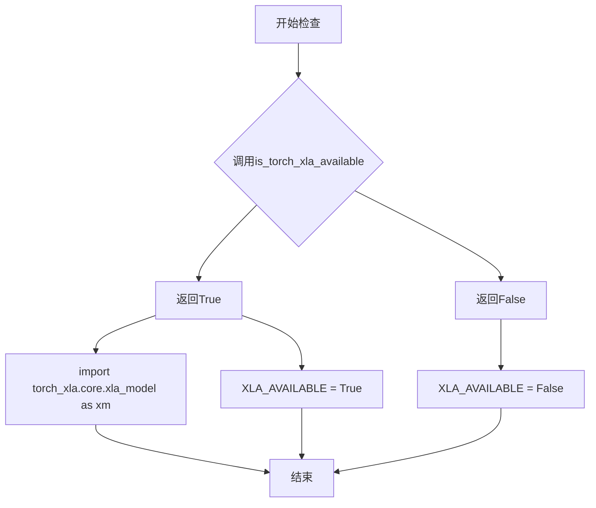

#### 带注释源码

```python
# 从diffusers工具模块导入is_torch_xla_available函数
from ...utils import BaseOutput, deprecate, is_torch_xla_available, logging, replace_example_docstring

# 条件检查：如果torch_xla可用
if is_torch_xla_available():
    # 导入torch_xla的核心模块
    import torch_xla.core.xla_model as xm
    # 设置全局标志，表示XLA可用
    XLA_AVAILABLE = True
else:
    # 设置全局标志，表示XLA不可用
    XLA_AVAILABLE = False
```


由于 `randn_tensor` 函数是从外部模块 `diffusers.utils.torch_utils` 导入的，在当前代码文件中并未定义该函数。根据其在代码中的使用方式和对 `diffusers` 库的了解，我提供以下信息：

### randn_tensor

生成符合标准正态分布的随机张量，用于初始化扩散模型的潜在表示（latents）

参数：

- `shape`：`tuple` 或 `int`，输出张量的形状
- `generator`：`torch.Generator` 或 `list[torch.Generator]`，可选，用于控制随机数生成的可重现性
- `device`：`torch.device`，张量应放置的设备
- `dtype`：`torch.dtype`，张量的数据类型

返回值：`torch.Tensor`，符合正态分布的随机张量

#### 流程图

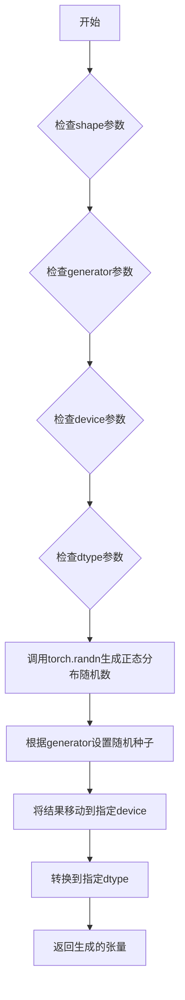

#### 带注释源码

```
# 该函数定义在 diffusers 库中，以下是基于使用方式的推断实现
def randn_tensor(
    shape: tuple,
    generator: Optional[torch.Generator] = None,
    device: Optional[torch.device] = None,
    dtype: Optional[torch.dtype] = None
) -> torch.Tensor:
    """
    生成符合标准正态分布的随机张量
    
    参数:
        shape: 张量的形状，支持元组或整数
        generator: 可选的PyTorch生成器，用于控制随机性
        device: 可选的设备参数，指定张量存放位置
        dtype: 可选的数据类型参数
    
    返回:
        符合正态分布的随机张量
    """
    # 如果没有指定device，使用cpu
    if device is None:
        device = torch.device("cpu")
    
    # 如果没有指定dtype，使用float32
    if dtype is None:
        dtype = torch.float32
    
    # 生成随机张量
    # 如果提供了generator，则使用它来生成确定性随机数
    if generator is not None:
        # 使用生成器生成随机数
        tensor = torch.randn(size=shape, generator=generator, device=device, dtype=dtype)
    else:
        # 直接生成随机张量
        tensor = torch.randn(size=shape, device=device, dtype=dtype)
    
    return tensor
```

> **注意**：由于 `randn_tensor` 函数定义在 `diffusers` 库的 `utils.torch_utils` 模块中，未包含在当前提供的代码文件内。上述源码为基于使用方式的合理推断。实际实现可能包含更多特性，如XLA设备支持、更多的参数选项等。建议直接查阅 `diffusers` 库的源码获取完整实现。


### `deprecate`

用于发出弃用警告的函数，当检测到已废弃的API参数被使用时，会抛出警告提醒用户该参数将在未来版本中移除。

参数：

-  `deprecated_name`：`str`，被弃用的参数名称
-  `deprecated_version`：`str`，计划移除的版本号
-  `message`：`str`，弃用说明信息，提供替代方案建议

返回值：`None`，该函数不返回值，仅通过 `warnings.warn()` 发出弃用警告

#### 流程图

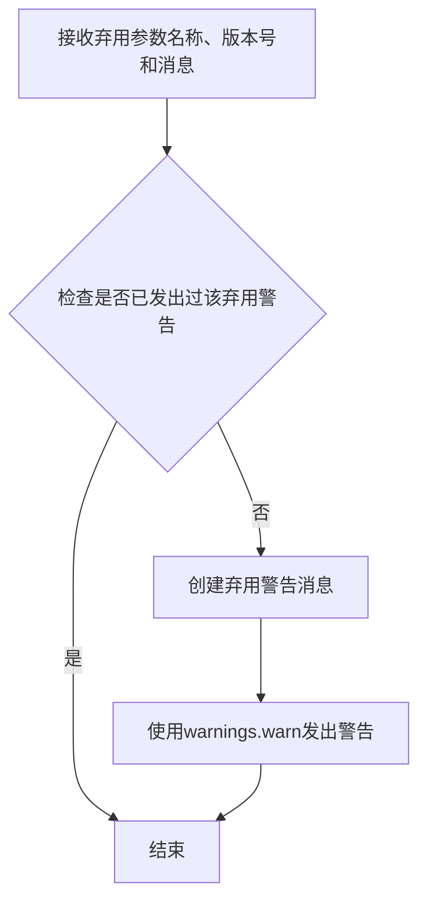

#### 带注释源码

```python
# 注：deprecate 函数定义在 diffusers 库的 utils 模块中
# 以下为从代码中提取的调用示例：

# 调用点1：在 __call__ 方法中检测 callback 参数
if callback is not None:
    deprecate(
        "callback",              # 被弃用的参数名
        "1.0.0",                 # 将弃用的版本号
        "Passing `callback` as an input argument to `__call__` is deprecated, consider use `callback_on_step_end`"  # 弃用消息和替代方案
    )

# 调用点2：在 __call__ 方法中检测 callback_steps 参数
if callback_steps is not None:
    deprecate(
        "callback_steps",        # 被弃用的参数名
        "1.0.0",                 # 将弃用的版本号
        "Passing `callback_steps` as an input argument to `__call__` is deprecated, consider use `callback_on_step_end`"  # 弃用消息和替代方案
    )
```

> **注意**：该函数定义位于 `diffusers.utils` 模块中（通过 `from ...utils import deprecate` 导入），源码中未直接提供其实现，仅包含两处调用点。


### `logging.get_logger`

获取一个日志记录器实例，用于在模块中记录日志信息。

参数：

- `__name__`：`str`，通常传入 Python 模块的 `__name__` 变量，用于标识日志来源的模块路径。

返回值：`logging.Logger`，返回一个 Python 日志记录器对象，用于记录日志信息。

#### 流程图

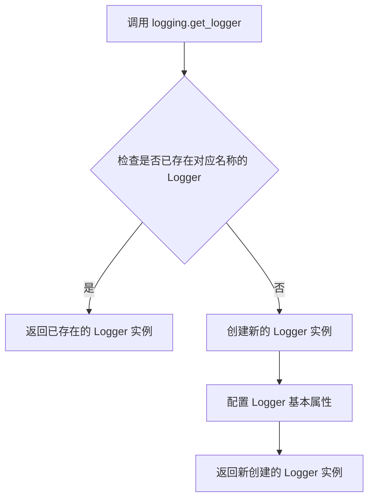

#### 带注释源码

```python
# 从 diffusers 库的 utils 模块导入 logging 对象
from ...utils import logging

# 使用 get_logger(__name__) 获取当前模块的日志记录器
# __name__ 是 Python 的内置变量，代表当前模块的完整路径
# 例如：对于 diffusers.pipelines.wuerstchen.pipeline_wuerstchen_prior 模块
# __name__ 的值就是 'diffusers.pipelines.wuerstchen.pipeline_wuerstchen_prior'
logger = logging.get_logger(__name__)  # pylint: disable=invalid-name

# 后续可以使用 logger 进行日志记录
# 例如：logger.warning("warning message")
#      logger.info("info message")
#      logger.debug("debug message")
#      logger.error("error message")
```

**说明：**

- `logging.get_logger` 是 Hugging Face diffusers 库中的一个工具函数，用于获取或创建与特定模块关联的日志记录器。
- 通过传入 `__name__` 参数，可以确保日志消息能够标识其来源模块，便于调试和追踪。
- 这里的 `logging` 对象是一个模块级别的日志管理器，封装了 Python 标准库的 `logging` 模块。
- 该函数返回的 `logger` 实例可以用于记录不同级别的日志信息，帮助开发者监控程序运行状态。
- 在代码中，该 logger 被用于输出警告信息，例如在截断文本时发出警告。


### `replace_example_docstring`

该函数是一个装饰器工厂，用于替换被装饰函数的文档字符串（docstring）。它通常与示例代码结合使用，以便在运行时将示例文档动态附加到函数的文档中。

参数：

-  `example_doc_string`：`str`，要替换或附加的示例文档字符串内容

返回值：`Callable`，返回一个装饰器函数，该装饰器函数接收被装饰的目标函数并返回修改后的函数

#### 流程图

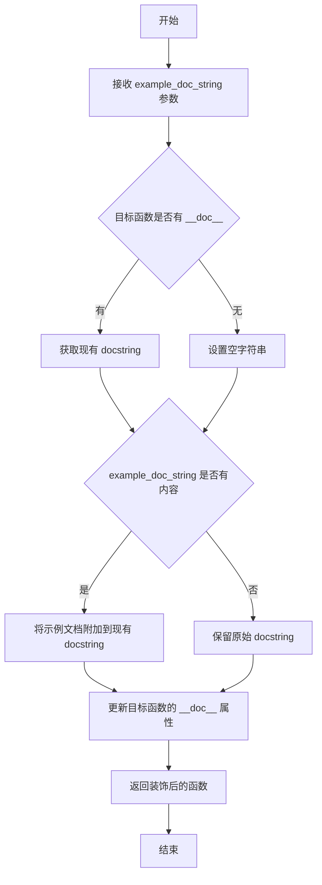

#### 带注释源码

```python
def replace_example_docstring(example_doc_string):
    """
    装饰器工厂：用于替换或增强函数的文档字符串。
    
    此函数创建一个装饰器，该装饰器将示例文档字符串附加到
    被装饰函数的现有文档字符串上。
    
    参数:
        example_doc_string (str): 包含示例代码的文档字符串，
                                   将被附加到目标函数的 docstring 上。
    
    返回:
        Callable: 一个装饰器函数，接收目标函数并返回修改后的函数。
    """
    
    def decorator(func):
        """
        实际的装饰器函数，负责修改目标函数的文档字符串。
        
        参数:
            func (Callable): 被装饰的目标函数。
        
        返回:
            Callable: 文档字符串被修改后的函数。
        """
        
        # 获取目标函数现有的文档字符串，如果没有则为空字符串
        func_doc = func.__doc__ or ""
        
        # 如果提供了示例文档字符串，则将其附加到现有文档字符串
        if example_doc_string:
            # 将示例文档字符串与原始文档字符串合并
            # 通常示例文档包含代码示例和使用说明
            func.__doc__ = func_doc + "\n\n" + example_doc_string
        else:
            # 如果没有提供示例文档字符串，保持原始文档字符串不变
            func.__doc__ = func_doc
        
        # 返回修改后的函数
        return func
    
    # 返回装饰器函数
    return decorator


# 使用示例：
# @replace_example_docstring(EXAMPLE_DOC_STRING)
# def __call__(self, prompt, ...):
#     """主调用函数的文档字符串"""
#     ...
#
# 执行后，__call__ 方法的 __doc__ 将包含原始文档字符串 + EXAMPLE_DOC_STRING 的内容
```


### `torch.no_grad`

`torch.no_grad` 是 PyTorch 的一个装饰器/上下文管理器，用于禁用梯度计算。在推理（inference）阶段使用此装饰器可以显著减少内存消耗并提升计算速度，因为它会阻止 PyTorch 构建计算图，从而节省显存资源。

参数：此方法无显式参数，作为装饰器或上下文管理器使用时不接受任何参数。

返回值：返回一个上下文管理器（context manager），该上下文管理器在其作用域内禁用梯度计算。

#### 流程图

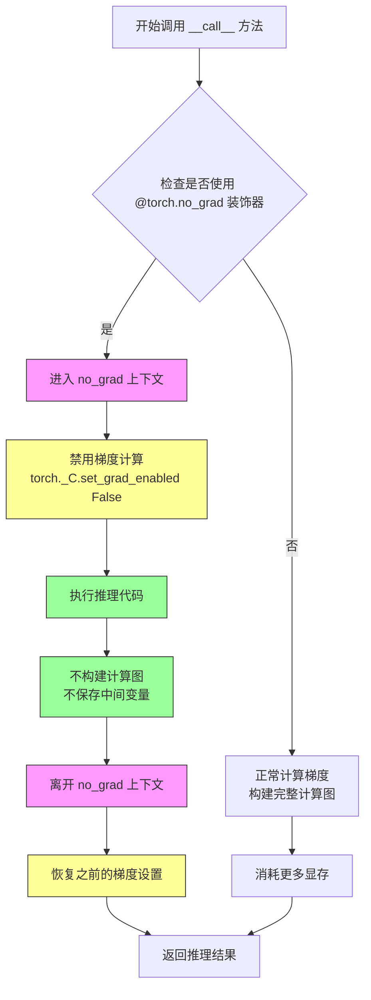

#### 带注释源码

```python
# torch.no_grad 装饰器源码位置: torch/no_grad.py

# 1. 作为装饰器使用时的典型源码结构：
def no_grad():
    """
    禁用梯度计算的装饰器/上下文管理器。
    用于推理阶段以减少内存消耗和加速计算。
    """
    return _DecoratorContextManager()

# 2. 在 WuerstchenPriorPipeline 中的实际使用：
@torch.no_grad()      # 装饰器：进入 no_grad 上下文，禁用梯度计算
@replace_example_docstring(EXAMPLE_DOC_STRING)
def __call__(
    self,
    prompt: str | list[str] | None = None,
    height: int = 1024,
    width: int = 1024,
    num_inference_steps: int = 60,
    timesteps: list[float] = None,
    guidance_scale: float = 8.0,
    negative_prompt: str | list[str] | None = None,
    prompt_embeds: torch.Tensor | None = None,
    negative_prompt_embeds: torch.Tensor | None = None,
    num_images_per_prompt: int | None = 1,
    generator: torch.Generator | list[torch.Generator] | None = None,
    latents: torch.Tensor | None = None,
    output_type: str | None = "pt",
    return_dict: bool = True,
    callback_on_step_end: Callable[[int, int], None] | None = None,
    callback_on_step_end_tensor_inputs: list[str] = ["latents"],
    **kwargs,
):
    # 在 no_grad 上下文中执行以下推理代码：
    # - encode_prompt: 编码文本提示（不需要梯度）
    # - prepare_latents: 准备潜在向量（不需要梯度）
    # - prior forward: 先验模型前向传播（不需要梯度）
    # - scheduler.step: 调度器步进（不需要梯度）
    # 
    # 好处：
    # 1. 不保存中间激活值，减少显存占用
    # 2. 不构建计算图，加速推理
    # 3. 允许 in-place 操作
    
    # ... 推理代码实现 ...
    
    return WuerstchenPriorPipelineOutput(latents)
    # 离开 no_grad 上下文，梯度计算自动恢复
```


### `WuerstchenPriorPipeline.__init__`

这是 WuerstchenPriorPipeline 类的初始化方法，负责接收并注册所有必要的组件（如分词器、文本编码器、prior模型、调度器等）以及配置参数（潜在空间均值、标准差和分辨率倍数），从而构建一个完整的图像先验生成管道。

参数：

- `tokenizer`：`CLIPTokenizer`，用于将文本提示转换为token序列的分词器
- `text_encoder`：`CLIPTextModel`，用于将token序列编码为文本嵌入的冻结文本编码器
- `prior`：`WuerstchenPrior`，用于从文本嵌入近似生成图像嵌入的unCLIP prior模型
- `scheduler`：`DDPMWuerstchenScheduler`，与prior配合使用生成图像嵌入的调度器
- `latent_mean`：`float`，可选，默认值42.0，潜在空间的均值，用于去归一化
- `latent_std`：`float`，可选，默认值1.0，潜在空间的标准差，用于去归一化
- `resolution_multiple`：`float`，可选，默认值42.67，生成图像的默认分辨率倍数

返回值：`None`，该方法不返回任何值，仅完成对象的初始化

#### 流程图

```mermaid
flowchart TD
    A[开始 __init__] --> B[调用 super().__init__ 初始化基类]
    B --> C[调用 register_modules 注册所有模块]
    C --> D[注册 tokenizer]
    C --> E[注册 text_encoder]
    C --> F[注册 prior]
    C --> G[注册 scheduler]
    G --> H[调用 register_to_config 注册配置参数]
    H --> I[注册 latent_mean]
    H --> J[注册 latent_std]
    H --> K[注册 resolution_multiple]
    I --> L[结束 __init__]
    J --> L
    K --> L
```

#### 带注释源码

```python
def __init__(
    self,
    tokenizer: CLIPTokenizer,              # CLIP分词器，用于文本预处理
    text_encoder: CLIPTextModel,            # CLIP文本编码器，用于生成文本嵌入
    prior: WuerstchenPrior,                 # Wuerstchen prior模型，用于生成图像先验嵌入
    scheduler: DDPMWuerstchenScheduler,     # DDPM调度器，用于去噪过程
    latent_mean: float = 42.0,              # 潜在空间均值，用于后处理去归一化
    latent_std: float = 1.0,                # 潜在空间标准差，用于后处理去归一化
    resolution_multiple: float = 42.67,     # 分辨率倍数，用于计算潜在空间尺寸
) -> None:
    """
    初始化 WuerstchenPriorPipeline 实例。
    
    该方法接收所有必要的组件和配置参数，将它们注册到pipeline中，
    以便在后续的图像生成过程中使用。
    """
    # 调用父类 DiffusionPipeline 的初始化方法
    # 设置基础pipeline功能（如设备管理、模型加载等）
    super().__init__()
    
    # 使用 register_modules 方法注册所有可学习/可替换的模块
    # 这些模块可以通过 pipeline 的 save_pretrained 和 from_pretrained 方法进行序列化和加载
    self.register_modules(
        tokenizer=tokenizer,                # 注册CLIP分词器
        text_encoder=text_encoder,          # 注册CLIP文本编码器
        prior=prior,                        # 注册Wuerstchen prior模型
        scheduler=scheduler,                # 注册DDPM调度器
    )
    
    # 使用 register_to_config 方法将配置参数保存到 config 属性中
    # 这些参数定义了潜在空间的统计特性和分辨率设置
    self.register_to_config(
        latent_mean=latent_mean,            # 保存潜在空间均值
        latent_std=latent_std,              # 保存潜在空间标准差
        resolution_multiple=resolution_multiple,  # 保存分辨率倍数
    )
```


### `WuerstchenPriorPipeline.prepare_latents`

该方法负责为 Wuerstchen Prior Pipeline 准备 latent 张量。如果未提供 latents，则使用随机噪声生成；否则验证提供的 latents 形状是否符合预期，并确保其位于正确的设备上。最后，根据调度器的初始噪声 sigma 对 latents 进行缩放，以适配扩散模型的噪声调度。

参数：

- `shape`：`tuple` 或 `list`，latent 张量的目标形状
- `dtype`：`torch.dtype`，生成 latent 的数据类型
- `device`：`torch.device`，生成 latent 的目标设备
- `generator`：`torch.Generator` 或 `None`，用于确保可重复生成随机数的随机数生成器
- `latents`：`torch.Tensor` 或 `None`，可选的预生成 latent 张量；若为 `None`，则随机生成
- `scheduler`：`DDPMWuerstchenScheduler`，用于获取初始噪声 sigma 值的调度器

返回值：`torch.Tensor`，处理后的 latent 张量

#### 流程图

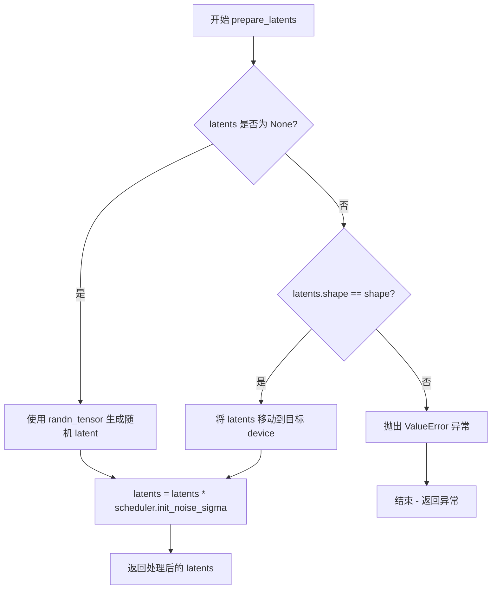

#### 带注释源码

```python
def prepare_latents(self, shape, dtype, device, generator, latents, scheduler):
    """
    准备用于扩散过程的 latent 张量。

    Args:
        shape: 期望的 latent 张量形状
        dtype: latent 的数据类型
        device: latent 应存放的设备
        generator: 可选的随机数生成器，用于可重复的随机生成
        latents: 可选的预生成 latent，若为 None 则随机生成
        scheduler: 用于获取初始噪声 sigma 的调度器
    """
    # 情况1：如果没有提供 latents，则使用 randn_tensor 生成随机噪声 latent
    if latents is None:
        latents = randn_tensor(shape, generator=generator, device=device, dtype=dtype)
    else:
        # 情况2：如果提供了 latents，首先验证形状是否匹配
        if latents.shape != shape:
            raise ValueError(f"Unexpected latents shape, got {latents.shape}, expected {shape}")
        
        # 将已存在的 latents 移动到目标设备
        latents = latents.to(device)

    # 使用调度器的初始噪声 sigma 对 latents 进行缩放
    # 这确保 latent 与扩散过程的初始噪声水平一致
    latents = latents * scheduler.init_noise_sigma
    
    return latents
```


### `WuerstchenPriorPipeline.encode_prompt`

该方法负责将文本提示词（prompt）编码为文本嵌入向量（text embeddings），供后续的扩散模型生成图像使用。它支持批量处理、负面提示词（negative prompt）以及分类器自由引导（Classifier-Free Guidance）。

参数：

- `device`：`torch.device`，执行计算的设备（如 CUDA 或 CPU）
- `num_images_per_prompt`：`int`，每个提示词需要生成的图像数量，用于扩展嵌入维度
- `do_classifier_free_guidance`：`bool`，是否启用分类器自由引导（CFG）技术
- `prompt`：`str | list[str] | None`，输入的文本提示词，可以是单个字符串或字符串列表
- `negative_prompt`：`str | list[str] | None`，负面提示词，用于引导模型避免生成相关内容
- `prompt_embeds`：`torch.Tensor | None`，可选的预计算提示词嵌入向量
- `negative_prompt_embeds`：`torch.Tensor | None`，可选的预计算负面提示词嵌入向量

返回值：`tuple[torch.Tensor, torch.Tensor]`，返回编码后的提示词嵌入和负面提示词嵌入元组

#### 流程图

```mermaid
flowchart TD
    A[encode_prompt 开始] --> B{判断 batch_size}
    B -->|prompt 是 str| C[batch_size = 1]
    B -->|prompt 是 list| D[batch_size = len(prompt)]
    B -->|都不是| E[batch_size = prompt_embeds.shape[0]]
    
    C --> F{prompt_embeds 为空?}
    D --> F
    E --> F
    
    F -->|是| G[调用 tokenizer 处理 prompt]
    G --> H[检查是否被截断]
    H --> I[调用 text_encoder 获取嵌入]
    I --> J[提取 last_hidden_state]
    
    F -->|否| K[直接使用 prompt_embeds]
    
    J --> L[转换 dtype 和 device]
    K --> L
    
    L --> M[repeat_interleave 扩展 num_images_per_prompt]
    
    M --> N{需要 negative_prompt_embeds?}
    N -->|是且 do_classifier_free_guidance| O{negative_prompt 为空?}
    N -->|否| P[直接返回]
    
    O -->|是| Q[uncond_tokens = [''] * batch_size]
    O -->|否| R[处理 negative_prompt 类型]
    
    Q --> S[tokenizer 处理 uncond_tokens]
    R --> S
    S --> T[text_encoder 获取 negative 嵌入]
    T --> U[repeat 复制 negative 嵌入]
    
    U --> P
    
    P[返回 (prompt_embeds, negative_prompt_embeds)]
```

#### 带注释源码

```python
def encode_prompt(
    self,
    device,
    num_images_per_prompt,
    do_classifier_free_guidance,
    prompt=None,
    negative_prompt=None,
    prompt_embeds: torch.Tensor | None = None,
    negative_prompt_embeds: torch.Tensor | None = None,
):
    # 根据 prompt 或 prompt_embeds 确定批次大小
    if prompt is not None and isinstance(prompt, str):
        batch_size = 1
    elif prompt is not None and isinstance(prompt, list):
        batch_size = len(prompt)
    else:
        batch_size = prompt_embeds.shape[0]

    # 如果未提供 prompt_embeds，则需要从 prompt 编码生成
    if prompt_embeds is None:
        # 获取提示词文本嵌入
        # 调用 tokenizer 将文本转换为 token IDs
        text_inputs = self.tokenizer(
            prompt,
            padding="max_length",
            max_length=self.tokenizer.model_max_length,
            truncation=True,
            return_tensors="pt",
        )
        text_input_ids = text_inputs.input_ids
        attention_mask = text_inputs.attention_mask

        # 获取未截断的 token IDs 用于检查
        untruncated_ids = self.tokenizer(prompt, padding="longest", return_tensors="pt").input_ids

        # 检查是否发生了截断，并记录警告信息
        if untruncated_ids.shape[-1] >= text_input_ids.shape[-1] and not torch.equal(
            text_input_ids, untruncated_ids
        ):
            # 解码被截断的部分用于日志输出
            removed_text = self.tokenizer.batch_decode(
                untruncated_ids[:, self.tokenizer.model_max_length - 1 : -1]
            )
            logger.warning(
                "The following part of your input was truncated because CLIP can only handle sequences up to"
                f" {self.tokenizer.model_max_length} tokens: {removed_text}"
            )
            # 截断 token IDs 和 attention mask 到模型最大长度
            text_input_ids = text_input_ids[:, : self.tokenizer.model_max_length]
            attention_mask = attention_mask[:, : self.tokenizer.model_max_length]

        # 调用文本编码器获取文本嵌入
        text_encoder_output = self.text_encoder(
            text_input_ids.to(device), attention_mask=attention_mask.to(device)
        )
        # 提取最后一层隐藏状态作为提示词嵌入
        prompt_embeds = text_encoder_output.last_hidden_state

    # 将提示词嵌入转换到正确的 dtype 和 device
    prompt_embeds = prompt_embeds.to(dtype=self.text_encoder.dtype, device=device)
    # 扩展提示词嵌入以匹配每个提示词生成的图像数量
    prompt_embeds = prompt_embeds.repeat_interleave(num_images_per_prompt, dim=0)

    # 如果需要分类器自由引导且未提供 negative_prompt_embeds，则生成它
    if negative_prompt_embeds is None and do_classifier_free_guidance:
        uncond_tokens: list[str]
        # 处理负面提示词为空的情况
        if negative_prompt is None:
            uncond_tokens = [""] * batch_size
        # 检查 negative_prompt 和 prompt 类型是否一致
        elif type(prompt) is not type(negative_prompt):
            raise TypeError(
                f"`negative_prompt` should be the same type to `prompt`, but got {type(negative_prompt)} !="
                f" {type(prompt)}."
            )
        # 处理单个字符串的负面提示词
        elif isinstance(negative_prompt, str):
            uncond_tokens = [negative_prompt]
        # 检查批次大小是否匹配
        elif batch_size != len(negative_prompt):
            raise ValueError(
                f"`negative_prompt`: {negative_prompt} has batch size {len(negative_prompt)}, but `prompt`:"
                f" {prompt} has batch size {batch_size}. Please make sure that passed `negative_prompt` matches"
                " the batch size of `prompt`."
            )
        else:
            uncond_tokens = negative_prompt

        # 对负面提示词进行 token 化
        uncond_input = self.tokenizer(
            uncond_tokens,
            padding="max_length",
            max_length=self.tokenizer.model_max_length,
            truncation=True,
            return_tensors="pt",
        )
        # 获取负面提示词的文本嵌入
        negative_prompt_embeds_text_encoder_output = self.text_encoder(
            uncond_input.input_ids.to(device), attention_mask=uncond_input.attention_mask.to(device)
        )

        # 提取负面提示词嵌入
        negative_prompt_embeds = negative_prompt_embeds_text_encoder_output.last_hidden_state

    # 如果使用分类器自由引导，复制无条件嵌入以匹配每个提示词的生成数量
    if do_classifier_free_guidance:
        # 获取序列长度
        seq_len = negative_prompt_embeds.shape[1]
        # 转换 dtype 和 device
        negative_prompt_embeds = negative_prompt_embeds.to(dtype=self.text_encoder.dtype, device=device)
        # 扩展负面提示词嵌入维度
        negative_prompt_embeds = negative_prompt_embeds.repeat(1, num_images_per_prompt, 1)
        # 重新整形为 [batch_size * num_images_per_prompt, seq_len, hidden_dim]
        negative_prompt_embeds = negative_prompt_embeds.view(batch_size * num_images_per_prompt, seq_len, -1)
        # 完成复制操作

    # 返回提示词嵌入和负面提示词嵌入
    return prompt_embeds, negative_prompt_embeds
```


### `WuerstchenPriorPipeline.check_inputs`

该方法用于验证 `WuerstchenPriorPipeline` .pipeline 的输入参数是否合法，确保用户不会同时传递冲突的参数（如 prompt 和 prompt_embeds），也不会同时缺失必要的参数，并检查参数的类型和形状是否匹配。

参数：

- `self`：`WuerstchenPriorPipeline` 实例本身
- `prompt`：`str | list[str] | None`，用于引导图像生成的文本提示
- `negative_prompt`：`str | list[str] | Optional`，不希望引导图像生成的文本提示
- `num_inference_steps`：`int`，去噪步数
- `do_classifier_free_guidance`：`bool`，是否启用无分类器引导
- `prompt_embeds`：`torch.Tensor | None`，可选的预生成文本嵌入
- `negative_prompt_embeds`：`torch.Tensor | None`，可选的预生成负向文本嵌入

返回值：`None`，该方法仅进行参数验证，不返回任何内容

#### 流程图

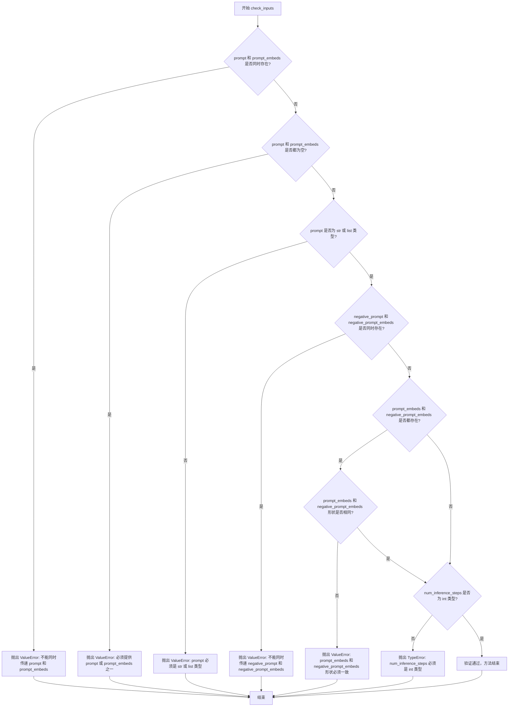

#### 带注释源码

```python
def check_inputs(
    self,
    prompt,
    negative_prompt,
    num_inference_steps,
    do_classifier_free_guidance,
    prompt_embeds=None,
    negative_prompt_embeds=None,
):
    """
    检查输入参数的有效性。
    
    该方法会验证：
    1. prompt 和 prompt_embeds 不能同时提供
    2. prompt 和 prompt_embeds 至少提供一个
    3. prompt 必须是 str 或 list 类型
    4. negative_prompt 和 negative_prompt_embeds 不能同时提供
    5. prompt_embeds 和 negative_prompt_embeds 形状必须一致（如果都提供）
    6. num_inference_steps 必须是整数类型
    """
    # 检查 prompt 和 prompt_embeds 是否冲突
    if prompt is not None and prompt_embeds is not None:
        raise ValueError(
            f"Cannot forward both `prompt`: {prompt} and `prompt_embeds`: {prompt_embeds}. Please make sure to"
            " only forward one of the two."
        )
    # 检查是否至少提供了一个必需的参数
    elif prompt is None and prompt_embeds is None:
        raise ValueError(
            "Provide either `prompt` or `prompt_embeds`. Cannot leave both `prompt` and `prompt_embeds` undefined."
        )
    # 检查 prompt 的类型是否合法
    elif prompt is not None and (not isinstance(prompt, str) and not isinstance(prompt, list)):
        raise ValueError(f"`prompt` has to be of type `str` or `list` but is {type(prompt)}")

    # 检查 negative_prompt 和 negative_prompt_embeds 是否冲突
    if negative_prompt is not None and negative_prompt_embeds is not None:
        raise ValueError(
            f"Cannot forward both `negative_prompt`: {negative_prompt} and `negative_prompt_embeds`:"
            f" {negative_prompt_embeds}. Please make sure to only forward one of the two."
        )

    # 检查 prompt_embeds 和 negative_prompt_embeds 的形状是否一致
    if prompt_embeds is not None and negative_prompt_embeds is not None:
        if prompt_embeds.shape != negative_prompt_embeds.shape:
            raise ValueError(
                "`prompt_embeds` and `negative_prompt_embeds` must have the same shape when passed directly, but"
                f" got: `prompt_embeds` {prompt_embeds.shape} != `negative_prompt_embeds`"
                f" {negative_prompt_embeds.shape}."
            )

    # 检查 num_inference_steps 的类型是否正确
    if not isinstance(num_inference_steps, int):
        raise TypeError(
            f"'num_inference_steps' must be of type 'int', but got {type(num_inference_steps)}\
                       In Case you want to provide explicit timesteps, please use the 'timesteps' argument."
        )
```


### `WuerstchenPriorPipeline.guidance_scale`

该属性是 WuerstchenPriorPipeline 管道类的一个只读属性，用于获取分类器自由引导（Classifier-Free Guidance）的缩放因子。该因子控制生成图像与文本提示的关联程度，值越大表示越严格遵循提示，但可能导致图像质量下降。

参数：无需参数

返回值：`float`，返回当前管道实例中分类器自由引导的缩放因子值（存储在内部变量 `_guidance_scale` 中）

#### 流程图

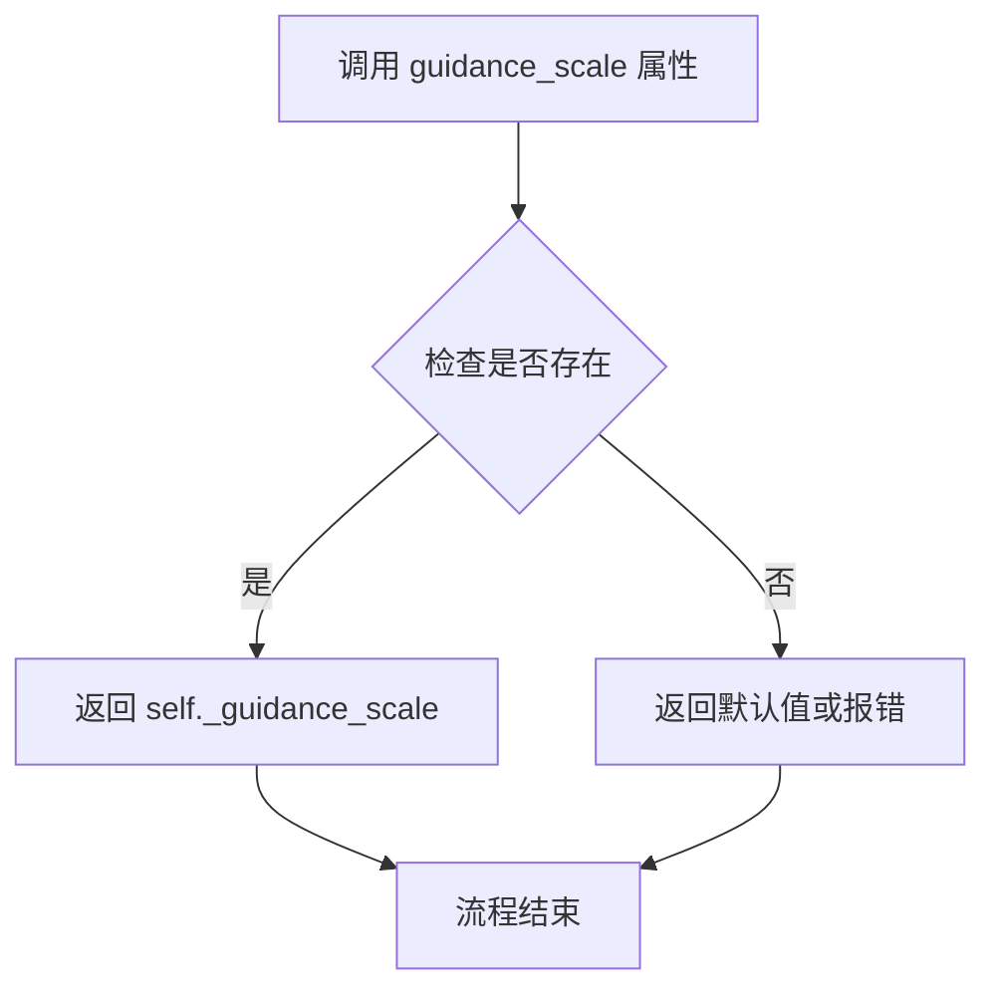

#### 带注释源码

```python
@property
def guidance_scale(self):
    """
    属性 getter 方法，用于获取分类器自由引导的缩放因子。
    
    该属性直接返回管道内部存储的 _guidance_scale 变量。
    该值在 __call__ 方法执行时被设置，默认值为 8.0。
    
    Returns:
        float: 分类器自由引导的缩放因子，控制文本提示对图像生成的影响程度。
    """
    return self._guidance_scale
```


### `WuerstchenPriorPipeline.do_classifier_free_guidance`

该属性用于判断当前是否启用了分类器无指导（Classifier-Free Guidance, CFG）。当引导比例 `guidance_scale` 大于 1 时，表示启用了 CFG；否则表示未启用。

参数： 无

返回值：`bool`，返回是否启用分类器无指导的布尔值标志（`True` 表示启用，`False` 表示未启用）

#### 流程图

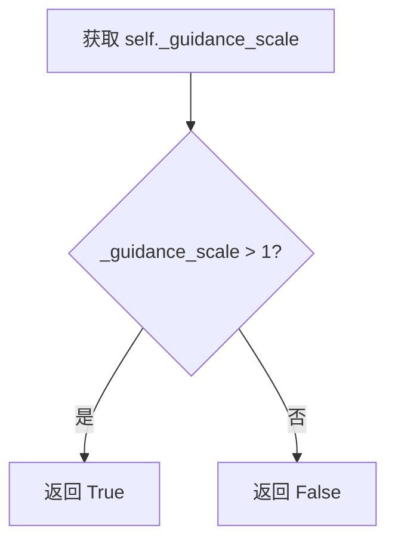

#### 带注释源码

```python
@property
def do_classifier_free_guidance(self):
    """
    属性：判断是否启用分类器无指导（Classifier-Free Guidance）
    
    该属性依赖于 _guidance_scale 参数，当 guidance_scale > 1 时，
    启用 CFG 模式，即在生成过程中同时考虑有条件和无条件的噪声预测，
    以提高生成质量。
    
    Returns:
        bool: 如果 guidance_scale > 1 返回 True，表示启用 CFG；
              否则返回 False，表示不启用 CFG。
    """
    return self._guidance_scale > 1
```


### `WuerstchenPriorPipeline.num_timesteps`

该属性是一个只读的属性访问器，用于获取在扩散模型推理过程中实际使用的时间步数量。该值在调用 `__call__` 方法执行推理时通过计算 `timesteps[:-1]` 的长度动态设置，反映了去噪循环中实际执行的时间步数（通常比调度器总时间步数少1个，因为最终时间步不参与迭代）。

参数：无（属性访问器不接受任何参数）

返回值：`int`，返回推理过程中实际执行的去噪时间步总数。

#### 流程图

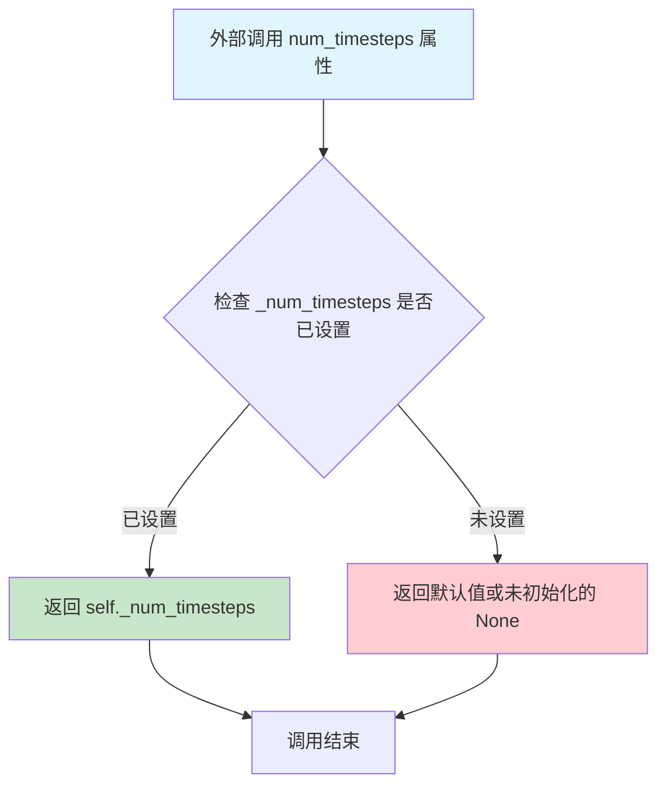

#### 带注释源码

```python
@property
def num_timesteps(self):
    """
    属性：获取扩散推理过程中的实际时间步数
    
    这是一个只读属性，返回在 Pipeline 调用过程中设置的时间步数量。
    该值在 __call__ 方法的 denoising loop 初始化阶段被设置：
    self._num_timesteps = len(timesteps[:-1])
    
    注意：使用 timesteps[:-1] 是因为最后一个时间步不参与实际的去噪迭代过程。
    
    返回:
        int: 实际执行的去噪步骤数量。如果在 __call__ 之前访问，返回 None。
    """
    return self._num_timesteps
```


### `WuerstchenPriorPipeline.__call__`

该方法是WuerstchenPriorPipeline的主入口函数，用于根据文本提示生成图像先验嵌入（image prior embeddings）。它通过编码提示词、准备潜在向量、执行去噪循环，最终输出用于指导图像生成的潜在向量。

参数：

- `prompt`：`str | list[str] | None`，用于指导图像生成的文本提示词
- `height`：`int`，生成图像的高度（像素），默认1024
- `width`：`int`，生成图像的宽度（像素），默认1024
- `num_inference_steps`：`int`，去噪迭代次数，默认60
- `timesteps`：`list[float]`，自定义去噪时间步，若不指定则使用等间距的num_inference_steps个时间步
- `guidance_scale`：`float`，分类器自由引导比例，默认8.0
- `negative_prompt`：`str | list[str] | None`，用于负面引导的提示词
- `prompt_embeds`：`torch.Tensor | None`，预生成的文本嵌入，可用于微调文本输入
- `negative_prompt_embeds`：`torch.Tensor | None`，预生成的负面文本嵌入
- `num_images_per_prompt`：`int | None`，每个提示词生成的图像数量，默认1
- `generator`：`torch.Generator | list[torch.Generator] | None`，随机数生成器，用于保证生成的可重复性
- `latents`：`torch.Tensor | None`，预生成的噪声潜在向量，若不提供则使用随机生成器采样
- `output_type`：`str | None`，输出格式，可选"pt"(torch.Tensor)、"np"(numpy数组)或"pil"(PIL图像)，默认"pt"
- `return_dict`：`bool`，是否返回WuerstchenPriorPipelineOutput对象，默认True
- `callback_on_step_end`：`Callable[[int, int], None] | None`，每个去噪步骤结束时的回调函数
- `callback_on_step_end_tensor_inputs`：`list[str]`，回调函数可访问的张量输入列表
- `**kwargs`：其他关键字参数

返回值：`WuerstchenPriorPipelineOutput | tuple`，当return_dict为True时返回包含生成图像嵌入的WuerstchenPriorPipelineOutput对象，否则返回元组

#### 流程图

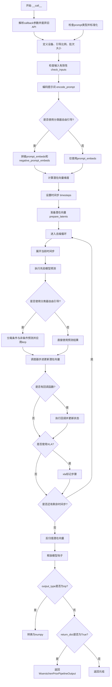

#### 带注释源码

```python
@torch.no_grad()
@replace_example_docstring(EXAMPLE_DOC_STRING)
def __call__(
    self,
    prompt: str | list[str] | None = None,
    height: int = 1024,
    width: int = 1024,
    num_inference_steps: int = 60,
    timesteps: list[float] = None,
    guidance_scale: float = 8.0,
    negative_prompt: str | list[str] | None = None,
    prompt_embeds: torch.Tensor | None = None,
    negative_prompt_embeds: torch.Tensor | None = None,
    num_images_per_prompt: int | None = 1,
    generator: torch.Generator | list[torch.Generator] | None = None,
    latents: torch.Tensor | None = None,
    output_type: str | None = "pt",
    return_dict: bool = True,
    callback_on_step_end: Callable[[int, int], None] | None = None,
    callback_on_step_end_tensor_inputs: list[str] = ["latents"],
    **kwargs,
):
    """
    Function invoked when calling the pipeline for generation.
    """
    # 解析旧的callback参数并发出废弃警告
    callback = kwargs.pop("callback", None)
    callback_steps = kwargs.pop("callback_steps", None)

    if callback is not None:
        deprecate(
            "callback",
            "1.0.0",
            "Passing `callback` as an input argument to `__call__` is deprecated, consider use `callback_on_step_end`",
        )
    if callback_steps is not None:
        deprecate(
            "callback_steps",
            "1.0.0",
            "Passing `callback_steps` as an input argument to `__call__` is deprecated, consider use `callback_on_step_end`",
        )

    # 验证回调张量输入是否在允许列表中
    if callback_on_step_end_tensor_inputs is not None and not all(
        k in self._callback_tensor_inputs for k in callback_on_step_end_tensor_inputs
    ):
        raise ValueError(
            f"`callback_on_step_end_tensor_inputs` has to be in {self._callback_tensor_inputs}, but found {[k for k in callback_on_step_end_tensor_inputs if k not in self._callback_tensor_inputs]}"
        )

    # 0. 定义常用变量：设备、引导比例、批次大小
    device = self._execution_device
    self._guidance_scale = guidance_scale
    if prompt is not None and isinstance(prompt, str):
        batch_size = 1
    elif prompt is not None and isinstance(prompt, list):
        batch_size = len(prompt)
    else:
        batch_size = prompt_embeds.shape[0]

    # 1. 检查输入有效性
    if prompt is not None and not isinstance(prompt, list):
        if isinstance(prompt, str):
            prompt = [prompt]
        else:
            raise TypeError(f"'prompt' must be of type 'list' or 'str', but got {type(prompt)}.")

    if self.do_classifier_free_guidance:
        if negative_prompt is not None and not isinstance(negative_prompt, list):
            if isinstance(negative_prompt, str):
                negative_prompt = [negative_prompt]
            else:
                raise TypeError(
                    f"'negative_prompt' must be of type 'list' or 'str', but got {type(negative_prompt)}."
                )

    self.check_inputs(
        prompt,
        negative_prompt,
        num_inference_steps,
        self.do_classifier_free_guidance,
        prompt_embeds=prompt_embeds,
        negative_prompt_embeds=negative_prompt_embeds,
    )

    # 2. 编码提示词
    prompt_embeds, negative_prompt_embeds = self.encode_prompt(
        prompt=prompt,
        device=device,
        num_images_per_prompt=num_images_per_prompt,
        do_classifier_free_guidance=self.do_classifier_free_guidance,
        negative_prompt=negative_prompt,
        prompt_embeds=prompt_embeds,
        negative_prompt_embeds=negative_prompt_embeds,
    )

    # 对于分类器自由引导，需要两次前向传播
    # 将无条件嵌入和文本嵌入拼接成单个批次以避免两次前向传播
    text_encoder_hidden_states = (
        torch.cat([prompt_embeds, negative_prompt_embeds]) if negative_prompt_embeds is not None else prompt_embeds
    )

    # 3. 确定图像嵌入的潜在形状
    dtype = text_encoder_hidden_states.dtype
    latent_height = ceil(height / self.config.resolution_multiple)
    latent_width = ceil(width / self.config.resolution_multiple)
    num_channels = self.prior.config.c_in
    effnet_features_shape = (num_images_per_prompt * batch_size, num_channels, latent_height, latent_width)

    # 4. 准备并设置时间步
    if timesteps is not None:
        self.scheduler.set_timesteps(timesteps=timesteps, device=device)
        timesteps = self.scheduler.timesteps
        num_inference_steps = len(timesteps)
    else:
        self.scheduler.set_timesteps(num_inference_steps, device=device)
        timesteps = self.scheduler.timesteps

    # 5. 准备潜在向量
    latents = self.prepare_latents(effnet_features_shape, dtype, device, generator, latents, self.scheduler)

    # 6. 运行去噪循环
    self._num_timesteps = len(timesteps[:-1])
    for i, t in enumerate(self.progress_bar(timesteps[:-1])):
        ratio = t.expand(latents.size(0)).to(dtype)

        # 7. 去噪图像嵌入
        predicted_image_embedding = self.prior(
            torch.cat([latents] * 2) if self.do_classifier_free_guidance else latents,
            r=torch.cat([ratio] * 2) if self.do_classifier_free_guidance else ratio,
            c=text_encoder_hidden_states,
        )

        # 8. 检查分类器自由引导并应用
        if self.do_classifier_free_guidance:
            predicted_image_embedding_text, predicted_image_embedding_uncond = predicted_image_embedding.chunk(2)
            predicted_image_embedding = torch.lerp(
                predicted_image_embedding_uncond, predicted_image_embedding_text, self.guidance_scale
            )

        # 9. 对潜在向量重新噪声到下一个时间步
        latents = self.scheduler.step(
            model_output=predicted_image_embedding,
            timestep=ratio,
            sample=latents,
            generator=generator,
        ).prev_sample

        # 执行每步结束时的回调
        if callback_on_step_end is not None:
            callback_kwargs = {}
            for k in callback_on_step_end_tensor_inputs:
                callback_kwargs[k] = locals()[k]
            callback_outputs = callback_on_step_end(self, i, t, callback_kwargs)

            latents = callback_outputs.pop("latents", latents)
            text_encoder_hidden_states = callback_outputs.pop(
                "text_encoder_hidden_states", text_encoder_hidden_states
            )
            negative_prompt_embeds = callback_outputs.pop("negative_prompt_embeds", negative_prompt_embeds)

        # 处理旧的回调API
        if callback is not None and i % callback_steps == 0:
            step_idx = i // getattr(self.scheduler, "order", 1)
            callback(step_idx, t, latents)

        if XLA_AVAILABLE:
            xm.mark_step()

    # 10. 反归一化潜在向量
    latents = latents * self.config.latent_mean - self.config.latent_std

    # 释放所有模型
    self.maybe_free_model_hooks()

    # 根据输出类型转换
    if output_type == "np":
        latents = latents.cpu().float().numpy()

    if not return_dict:
        return (latents,)

    return WuerstchenPriorPipelineOutput(latents)
```

## 关键组件


### WuerstchenPriorPipeline

WuerstchenPriorPipeline是用于Wuerstchen模型的图像先验生成管道，继承自DiffusionPipeline和StableDiffusionLoraLoaderMixin，实现从文本提示生成图像嵌入向量的核心功能。

### WuerstchenPriorPipelineOutput

输出数据类，包含image_embeddings字段，存储先验图像嵌入，可为torch.Tensor或np.ndarray类型。

### 张量索引与惰性加载

代码中通过`self._execution_device`实现设备惰性推断，通过`randn_tensor`在需要时才生成随机潜在变量，而非预先分配内存。

### 反量化支持

`prepare_latents`方法支持通过`scheduler.init_noise_sigma`对潜在变量进行缩放，实现反量化（denormalization）功能：`latents = latents * self.config.latent_mean - self.config.latent_std`。

### 量化策略

通过`torch_dtype=torch.float16`参数支持半精度量化，文本编码器输出自动转换为与text_encoder相同的dtype：`prompt_embeds = prompt_embeds.to(dtype=self.text_encoder.dtype, device=device)`。

### Classifier-Free Guidance

在`__call__`方法中实现CFG机制，通过`torch.cat([latents] * 2)`复制潜在变量，将条件和非条件预测拼接后使用`torch.lerp`进行插值融合。

### 调度器集成

使用DDPMWuerstchenScheduler，通过`scheduler.set_timesteps`和`scheduler.step`实现去噪过程的时序控制，支持自定义timesteps参数。

### LoRA加载支持

通过`StableDiffusionLoraLoaderMixin`混入实现LoRA权重加载，`_lora_loadable_modules = ["prior", "text_encoder"]`指定可加载模块。

### 回调机制

支持`callback_on_step_end`在每个去噪步骤结束时执行自定义逻辑，通过`_callback_tensor_inputs`控制传递给回调的tensor输入。

### 模型卸载

使用`model_cpu_offload_seq = "text_encoder->prior"`定义模型卸载顺序，通过`maybe_free_model_hooks`实现推理后自动卸载模型释放显存。


## 问题及建议


### 已知问题

-   **属性初始化不一致**：`__call__` 方法中在设置 `self._guidance_scale` 之后才使用 `self.do_classifier_free_guidance` 属性，但该属性依赖于 `_guidance_scale`，存在潜在的初始化顺序问题
-   **硬编码的默认时间步**：`DEFAULT_STAGE_C_TIMESTEPS` 常量被定义但在代码中未被使用，造成代码冗余
-   **类型提示不完整**：`encode_prompt` 方法的参数（如 `device`、`num_images_per_prompt` 等）缺少类型提示，降低了代码可读性和 IDE 支持
-   **代码重复**：`__call__` 方法中多次出现将 `prompt` 转换为列表的逻辑（将 str 转为 list），与 `encode_prompt` 方法中的批处理逻辑存在重复
-   **条件判断逻辑问题**：`check_inputs` 方法在 `__call__` 开头被调用，但此时 `_guidance_scale` 已设置，而 `do_classifier_free_guidance` 属性的实现依赖于该值，导致检查时机不当
- **API 兼容性问题**：代码同时支持旧的 `callback`/`callback_steps` 参数和新的 `callback_on_step_end` 参数，增加了代码复杂度和维护成本
- **潜在的类型检查缺陷**：`encode_prompt` 中当 `prompt_embeds` 不为 None 时，直接使用 `prompt_embeds.shape[0]` 获取 batch_size，但没有处理同时传入 `prompt` 参数的冲突情况

### 优化建议

-   在 `__init__` 方法中初始化所有私有属性（如 `_guidance_scale`、`_num_timesteps`），避免属性未定义的运行时错误
-   删除未使用的 `DEFAULT_STAGE_C_TIMESTEPS` 常量，或将其作为 scheduler 的默认参数使用
-   为 `encode_prompt` 方法的所有参数添加完整的类型提示
-   提取公共的批处理逻辑到独立方法中，减少 `__call__` 和 `encode_prompt` 中的重复代码
-   考虑废弃旧的 `callback` 和 `callback_steps` 参数接口，统一使用 `callback_on_step_end`
-   在 `check_inputs` 调用之前完成所有必要属性的设置，确保检查逻辑的正确性
-   统一错误消息格式，提供更明确的错误信息帮助开发者定位问题

## 其它


### 设计目标与约束

**设计目标**：为Wuerstchen图像生成模型提供先验（prior）管道，将文本提示转换为图像嵌入向量，支持分类器自由引导（Classifier-Free Guidance）以提高生成质量。

**约束条件**：
- 输入提示必须为字符串或字符串列表
- 支持的输出格式为"pt"（PyTorch张量）、"np"（NumPy数组）
- 默认推理步数为60步
- 支持通过LoRA进行模型微调
- 必须在支持CUDA的设备上运行以获得最佳性能

### 错误处理与异常设计

**异常类型**：
- `ValueError`：输入参数验证失败（如形状不匹配、类型错误、批次大小不一致）
- `TypeError`：类型不匹配（如negative_prompt与prompt类型不同）
- `RuntimeError`：设备相关错误

**错误处理机制**：
- `check_inputs()`方法验证所有输入参数
- 形状验证确保latents与预期形状一致
- 废弃警告使用`deprecate()`函数提示API变更
- 设备转移时使用`.to(device)`确保张量在正确设备上

**需改进处**：
- 缺少对空字符串prompt的处理
- XLA设备错误处理可以更详细
- 缺少对scheduler.step()返回值的完整性检查

### 数据流与状态机

**数据流**：
1. 输入：prompt/negative_prompt → Tokenizer → Text Encoder → prompt_embeds/negative_prompt_embeds
2. 潜在向量：randn_tensor生成或使用提供的latents
3. 调度器：DDPMWuerstchenScheduler管理去噪步
4. 推理循环：Prior模型预测 → CFG应用 → Scheduler步进
5. 输出：反归一化latents → WuerstchenPriorPipelineOutput

**状态管理**：
- `_guidance_scale`：引导强度
- `_num_timesteps`：推理步数
- `_execution_device`：执行设备
- 通过`register_modules()`管理组件生命周期

### 外部依赖与接口契约

**核心依赖**：
- `torch`：深度学习框架
- `transformers`：CLIPTextModel、CLIPTokenizer
- `diffusers`：DiffusionPipeline基类、调度器、工具函数
- `numpy`：数值计算

**接口契约**：
- `from_pretrained()`：从预训练模型加载
- `__call__()`：主推理方法，返回WuerstchenPriorPipelineOutput
- `encode_prompt()`：编码文本提示
- `prepare_latents()`：准备潜在向量
- LoRA相关方法：load_lora_weights、save_lora_weights

### 性能考虑与优化空间

**当前优化点**：
- 使用`torch.no_grad()`减少内存占用
- 支持XLA设备加速（JIT编译）
- 模型CPU卸载序列优化
- 批量生成支持（num_images_per_prompt）

**优化建议**：
- 可加入xformers内存优化
- 支持flash attention加速
- 推理时使用torch.compile加速
- 可加入动态批处理支持
- 缓存text_encoder输出减少重复计算

### 版本兼容性与平台支持

**最低版本要求**：
- Python 3.8+
- PyTorch 2.0+
- Transformers 4.21.0+

**平台支持**：
- CUDA（推荐）
- CPU（支持但性能较低）
- Apple Silicon（通过PyTorch Metal）
- XLA设备（可选，需要torch_xla）

### 测试策略建议

**单元测试**：
- 输入验证测试（check_inputs）
- encode_prompt输出形状验证
- prepare_latents随机种子可复现性

**集成测试**：
- 端到端生成测试
- LoRA加载保存测试
- 多设备兼容性测试
- CFG开关功能测试

### 监控与可观测性

**可观测性指标**：
- 推理步数（_num_timesteps）
- 内存使用（通过PyTorch内存管理）
- 推理时间（可通过callback_on_step_end收集）

**日志记录**：
- 使用transformers的logging模块
- 截断警告（token长度超限）
- 废弃API警告

### 部署与运维建议

**部署注意事项**：
- 模型权重下载需要网络连接
- 大模型内存占用（建议16GB+ GPU）
- 半精度（float16）推理推荐

**生产环境建议**：
- 实现健康检查接口
- 添加请求限流机制
- 缓存常用prompt embeddings
- 监控GPU内存泄漏

    