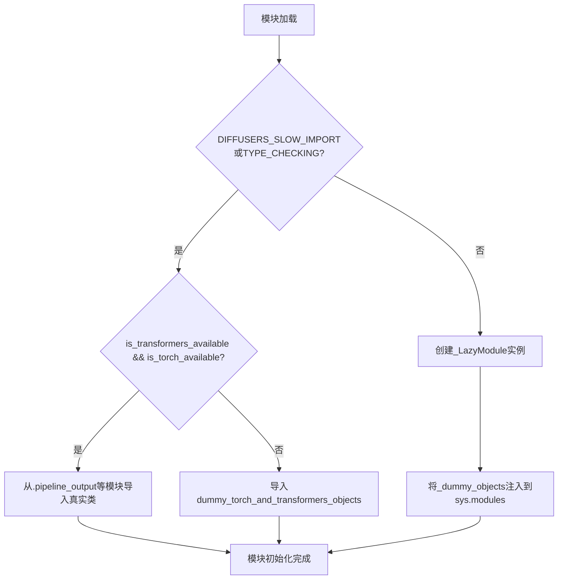
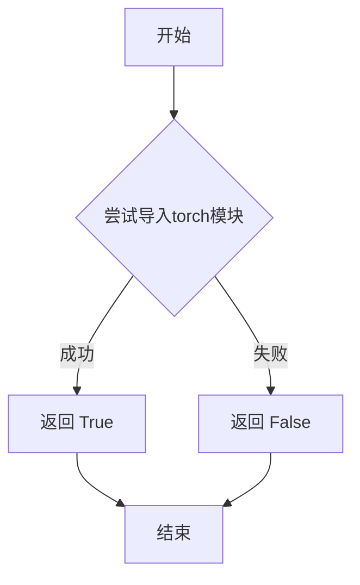
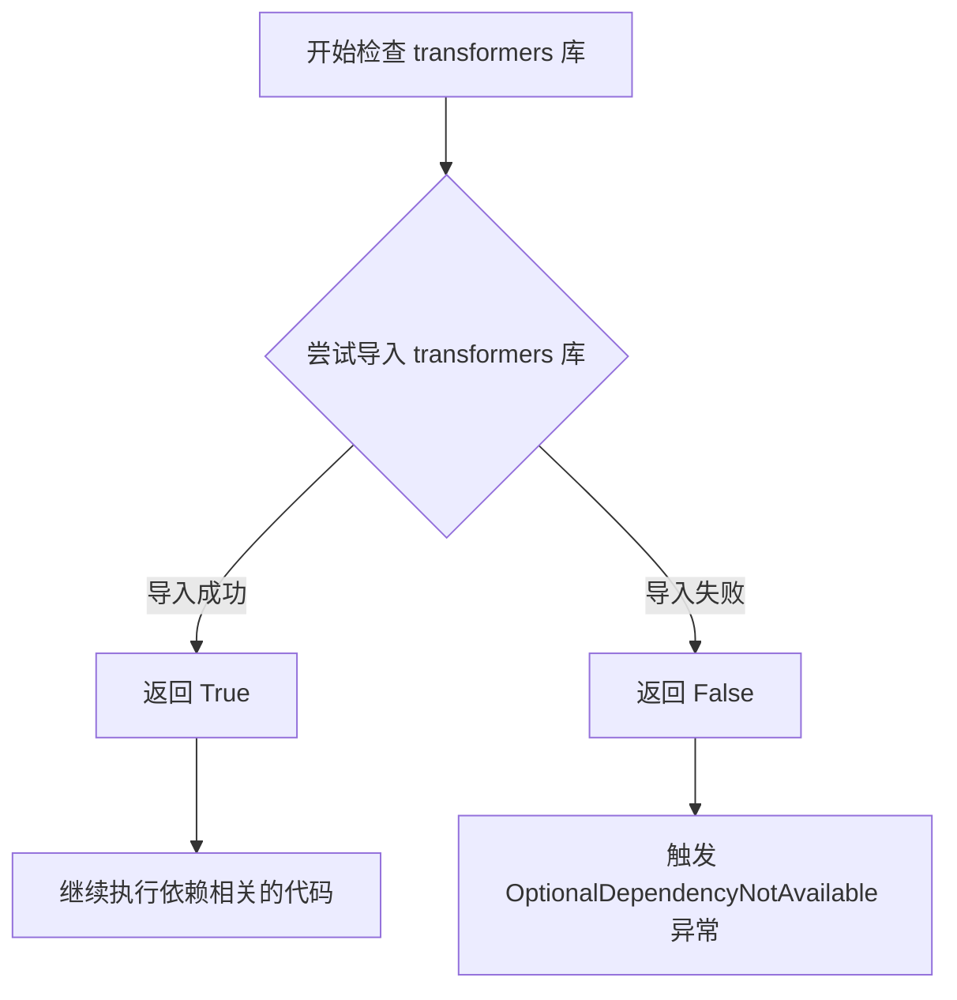
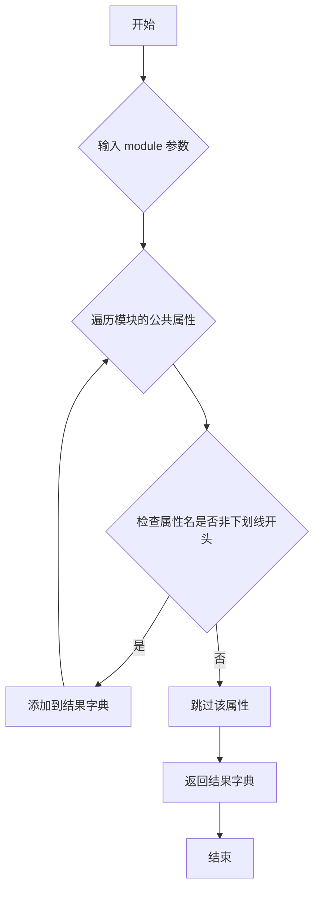
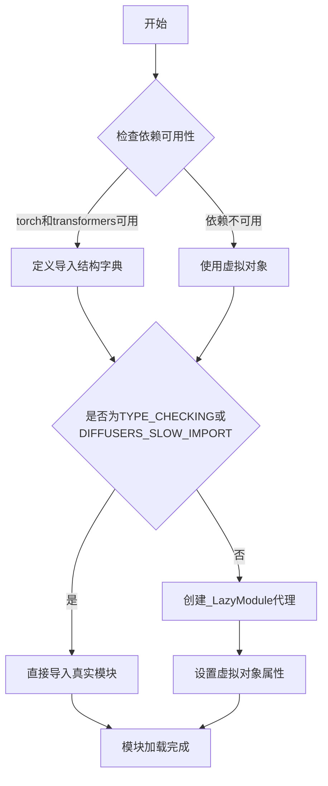

# `diffusers\src\diffusers\pipelines\z_image\__init__.py` 详细设计文档

这是Diffusers库的ZImage Pipeline延迟导入模块，通过_LazyModule实现可选依赖（torch和transformers）的懒加载机制，在运行时动态导入ZImagePipeline、ZImageControlNetPipeline等图像生成管线，并在依赖不可用时自动回退到dummy对象，确保库的完整导入兼容性。

## 整体流程



## 类结构

```
此文件为模块初始化文件，无类层次结构
├── _LazyModule (由diffusers.utils提供)
├── ZImagePipeline (从pipeline_z_image导入)
├── ZImageControlNetPipeline (从pipeline_z_image_controlnet导入)
├── ZImageControlNetInpaintPipeline (从pipeline_z_image_controlnet_inpaint导入)
├── ZImageImg2ImgPipeline (从pipeline_z_image_img2img导入)
├── ZImageInpaintPipeline (从pipeline_z_image_inpaint导入)
└── ZImageOmniPipeline (从pipeline_z_image_omni导入)
```

## 全局变量及字段


### `_dummy_objects`
    
存储虚拟对象的字典，用于依赖不可用时的回退

类型：`dict`
    


### `_import_structure`
    
定义模块导出结构的字典，映射导入名称到真实类名

类型：`dict`
    


### `DIFFUSERS_SLOW_IMPORT`
    
全局配置标志，控制是否使用慢速导入模式

类型：`bool`
    


### `TYPE_CHECKING`
    
typing模块标志，用于类型检查时的导入

类型：`bool`
    


    

## 全局函数及方法


### `is_torch_available()`

检查 torch 库是否可用，用于条件导入和延迟加载机制，确保在没有安装 torch 的环境中不会引发导入错误。

参数：该函数无参数

返回值：`bool`，返回 `True` 表示 torch 库已安装且可用，返回 `False` 表示不可用

#### 流程图



#### 带注释源码

```
# is_torch_available 定义于 ...utils 模块中
# 以下为该函数的标准实现模式

def is_torch_available():
    """
    检查 torch 库是否已安装且可用
    
    Returns:
        bool: 如果 torch 可用返回 True，否则返回 False
    """
    try:
        import torch
        return True
    except ImportError:
        return False

# 在当前代码中的实际使用方式：

# 1. 检查 torch 和 transformers 是否同时可用
if not (is_transformers_available() and is_torch_available()):
    raise OptionalDependencyNotAvailable()

# 2. 如果不可用，导入虚拟对象（dummy objects）用于延迟导入
_dummy_objects.update(get_objects_from_module(dummy_torch_and_transformers_objects))

# 3. 如果可用，定义真实的导入结构
else:
    _import_structure["pipeline_output"] = ["ZImagePipelineOutput"]
    _import_structure["pipeline_z_image"] = ["ZImagePipeline"]
    # ... 其他管道类
```

---

### 补充说明

#### 关键组件信息

| 组件名称 | 一句话描述 |
|---------|-----------|
| `is_torch_available()` | 动态检查 torch 库可用性的全局函数 |
| `is_transformers_available()` | 动态检查 transformers 库可用性的配套函数 |
| `OptionalDependencyNotAvailable` | 可选依赖不可用时的异常类 |
| `_LazyModule` | 延迟加载模块的实现类 |

#### 潜在的技术债务或优化空间

1. **重复检查逻辑**：在代码中出现两次相同的检查逻辑（try-except 块和 TYPE_CHECKING 块），可以提取为辅助函数以减少重复
2. **缺乏版本检查**：当前仅检查 torch 是否可用，未检查版本兼容性，可能导致运行时错误
3. **魔法字符串**：模块名称和导入结构使用硬编码，可考虑配置化

#### 其他项目

**设计目标与约束**：
- 实现可选依赖的延迟加载，避免在未安装相关库时导致整个模块无法导入
- 保持与 diffusers 库其他模块的一致性

**错误处理与异常设计**：
- 使用 `OptionalDependencyNotAvailable` 异常作为信号，配合 dummy 对象模式
- 不直接抛出 ImportError，而是通过返回值控制流程

**数据流与状态机**：
- 状态1：初始导入 → 检查依赖可用性
- 状态2：可用 → 注册真实对象到 `_import_structure`
- 状态3：不可用 → 注册 dummy 对象到 `_dummy_objects`
- 状态4：运行时导入 → 通过 `_LazyModule` 动态加载

**外部依赖与接口契约**：
- 依赖 `...utils` 模块中的 `is_torch_available`、`is_transformers_available`、`OptionalDependencyNotAvailable`、`_LazyModule`、`get_objects_from_module` 等
- 返回布尔值，调用方需根据返回值做相应处理


### `is_transformers_available`

检查 `transformers` 库是否可用，用于条件导入和延迟加载机制。

参数：
- 无参数

返回值：`bool`，返回 `True` 表示 `transformers` 库已安装且可用，返回 `False` 表示不可用。

#### 流程图



#### 带注释源码

```python
# is_transformers_available 是从 utils 模块导入的全局函数
# 用于检查 transformers 库是否可用
from ...utils import (
    DIFFUSERS_SLOW_IMPORT,
    OptionalDependencyNotAvailable,
    _LazyModule,
    get_objects_from_module,
    is_torch_available,
    is_transformers_available,  # <-- 从上级模块导入的检查函数
)

# 使用 is_transformers_available() 进行条件检查
try:
    if not (is_transformers_available() and is_torch_available()):
        # 如果 transformers 或 torch 不可用，抛出异常
        raise OptionalDependencyNotAvailable()
except OptionalDependencyNotAvailable:
    # 导入虚拟对象用于延迟导入
    from ...utils import dummy_torch_and_transformers_objects
    _dummy_objects.update(get_objects_from_module(dummy_torch_and_transformers_objects))
else:
    # 如果 transformers 和 torch 都可用，定义可导出的类
    _import_structure["pipeline_output"] = ["ZImagePipelineOutput"]
    _import_structure["pipeline_z_image"] = ["ZImagePipeline"]
    _import_structure["pipeline_z_image_controlnet"] = ["ZImageControlNetPipeline"]
    _import_structure["pipeline_z_image_controlnet_inpaint"] = ["ZImageControlNetInpaintPipeline"]
    _import_structure["pipeline_z_image_img2img"] = ["ZImageImg2ImgPipeline"]
    _import_structure["pipeline_z_image_inpaint"] = ["ZImageInpaintPipeline"]
    _import_structure["pipeline_z_image_omni"] = ["ZImageOmniPipeline"]
```


### `get_objects_from_module`

从指定模块中提取所有公共对象（类、函数、变量），返回一个以对象名称为键、对象本身为值的字典，用于支持延迟导入和虚拟对象替换。

参数：

- `module`：`Module` 类型，要从中提取对象的 Python 模块

返回值：`Dict[str, Any]` 类型，返回模块中所有非下划线开头的公共对象的字典，键为对象名称，值为对象本身

#### 流程图



#### 带注释源码

```python
def get_objects_from_module(module):
    """
    从给定模块中提取所有公共对象。
    
    该函数遍历模块的所有属性，过滤掉以下划线开头的私有属性，
    将剩余的公共对象收集到一个字典中返回。主要用于延迟导入机制中
    获取需要导出的对象列表。
    
    参数:
        module: 要提取对象的 Python 模块对象
        
    返回:
        包含模块中所有公共对象（类、函数、变量等）的字典，
        键为对象名称字符串，值为对象本身
    """
    # 初始化结果字典
    objects = {}
    
    # 遍历模块的所有属性
    for name in dir(module):
        # 跳过以单下划线或双下划线开头的私有/内部属性
        if name.startswith('_'):
            continue
        
        # 获取属性值并添加到结果字典
        try:
            objects[name] = getattr(module, name)
        except AttributeError:
            # 如果获取属性失败，跳过该属性
            continue
    
    return objects
```


### `_LazyModule.__init__`

延迟模块加载器初始化方法，用于创建一个惰性加载的模块代理，使得模块内的子模块在首次访问时才真正导入，从而优化导入时间。

参数：

- `name`：`str`，模块的完全限定名称（从 `__name__` 传入）
- `file`：`str`，模块文件的绝对路径（从 `globals()["__file__"]` 传入）
- `import_structure`：`dict`，定义模块内可导出对象的字典结构，键为子模块名，值为包含对象名的列表
- `spec`：`ModuleSpec`，模块规范对象（从 `__spec__` 传入），包含模块的元数据信息

返回值：`None`，该方法直接在传入的 `sys.modules[__name__]` 位置创建代理对象，无返回值

#### 流程图



#### 带注释源码

```python
# 定义用于存储虚拟对象的字典
_dummy_objects = {}
# 定义导入结构字典
_import_structure = {}

# 尝试检查torch和transformers是否同时可用
try:
    if not (is_transformers_available() and is_torch_available()):
        raise OptionalDependencyNotAvailable()
except OptionalDependencyNotAvailable:
    # 依赖不可用时，导入虚拟对象模块
    from ...utils import dummy_torch_and_transformers_objects
    # 从虚拟对象模块中获取所有对象并更新到_dummy_objects
    _dummy_objects.update(get_objects_from_module(dummy_torch_and_transformers_objects))
else:
    # 依赖可用时，定义真实的导入结构
    _import_structure["pipeline_output"] = ["ZImagePipelineOutput"]
    _import_structure["pipeline_z_image"] = ["ZImagePipeline"]
    _import_structure["pipeline_z_image_controlnet"] = ["ZImageControlNetPipeline"]
    _import_structure["pipeline_z_image_controlnet_inpaint"] = ["ZImageControlNetInpaintPipeline"]
    _import_structure["pipeline_z_image_img2img"] = ["ZImageImg2ImgPipeline"]
    _import_structure["pipeline_z_image_inpaint"] = ["ZImageInpaintPipeline"]
    _import_structure["pipeline_z_image_omni"] = ["ZImageOmniPipeline"]

# TYPE_CHECKING用于类型检查，DIFFUSERS_SLOW_IMPORT用于控制慢速导入
if TYPE_CHECKING or DIFFUSERS_SLOW_IMPORT:
    try:
        if not (is_transformers_available() and is_torch_available()):
            raise OptionalDependencyNotAvailable()
    except OptionalDependencyNotAvailable:
        # 导入虚拟对象供类型检查使用
        from ...utils.dummy_torch_and_transformers_objects import *
    else:
        # 导入所有真实的管道类供类型检查
        from .pipeline_output import ZImagePipelineOutput
        from .pipeline_z_image import ZImagePipeline
        from .pipeline_z_image_controlnet import ZImageControlNetPipeline
        from .pipeline_z_image_controlnet_inpaint import ZImageControlNetInpaintPipeline
        from .pipeline_z_image_img2img import ZImageImg2ImgPipeline
        from .pipeline_z_image_inpaint import ZImageInpaintPipeline
        from .pipeline_z_image_omni import ZImageOmniPipeline
else:
    import sys
    
    # 创建LazyModule代理对象，替换当前模块
    sys.modules[__name__] = _LazyModule(
        __name__,                          # 模块名称
        globals()["__file__"],             # 模块文件路径
        _import_structure,                 # 导入结构字典
        module_spec=__spec__,              # 模块规范对象
    )
    
    # 将虚拟对象设置为模块属性
    for name, value in _dummy_objects.items():
        setattr(sys.modules[__name__], name, value)
```


### `setattr(sys.modules, name, value)`

动态设置模块属性，将虚拟（dummy）对象绑定到懒加载模块的指定名称上，确保模块在导入时具备完整的属性集合。

参数：

- `sys.modules[__name__]`：`module`，当前模块对象，从 sys.modules 中获取的懒加载模块（`_LazyModule` 实例）
- `name`：`str`，要设置的属性名称，来自 `_dummy_objects` 字典的键
- `value`：`object`，要设置的属性值，来自 `_dummy_objects` 字典的值（通常为虚拟对象）

返回值：`None`，该函数无返回值，直接修改目标模块的命名空间

#### 流程图

```mermaid
flowchart TD
    A[开始] --> B{检查是否为 TYPE_CHECKING 或 DIFFUSERS_SLOW_IMPORT}
    B -->|是| C[直接导入所有 Pipeline 类]
    B -->|否| D[创建 _LazyModule 并注册到 sys.modules]
    D --> E[遍历 _dummy_objects 字典]
    E --> F[获取 name 和 value]
    F --> G[调用 setattr sys.modules[__name__] name value]
    G --> H[将虚拟对象绑定到模块属性]
    H --> I[结束]
```

#### 带注释源码

```python
# 遍历 _dummy_objects 字典中的所有虚拟对象
for name, value in _dummy_objects.items():
    # 使用 setattr 动态设置模块属性
    # 参数1: sys.modules[__name__] - 目标模块（刚创建的 _LazyModule）
    # 参数2: name - 属性名称（如 'ZImagePipelineOutput'）
    # 参数3: value - 虚拟对象实例
    setattr(sys.modules[__name__], name, value)
```

---

### 补充说明

| 项目 | 内容 |
|------|------|
| **设计目标** | 在懒加载机制下，确保模块被导入时拥有完整的属性集合，避免 AttributeError |
| **约束条件** | 仅在非 TYPE_CHECKING 模式下执行；依赖 `_dummy_objects` 和 `_LazyModule` 的正确初始化 |
| **错误处理** | 若 `sys.modules[__name__]` 不存在或 `_dummy_objects` 为空可能导致异常 |
| **数据流** | `_dummy_objects` → 遍历 → `setattr` 绑定 → 模块属性可用 |
| **外部依赖** | Python 内置 `sys` 和 `setattr`；项目内部的 `_LazyModule`、`_dummy_objects` |
| **技术债务** | 循环遍历调用 `setattr` 效率较低，可考虑批量 `__dict__.update()` 优化 |

## 关键组件


### 可选依赖检查与处理

负责检查torch和transformers两个可选依赖是否可用，当依赖不可用时使用虚拟对象（dummy objects）进行替换，确保模块在缺少可选依赖时仍可导入。

### 懒加载模块系统

使用_LazyModule实现延迟加载机制，将实际的导入操作推迟到首次访问模块成员时执行，减少启动时的导入开销。

### 导入结构定义

通过_import_structure字典定义模块的导出结构，包括管道输出类和各种管道实现类的名称列表，用于LazyModule的初始化。

### 虚拟对象管理

使用_dummy_objects字典存储可选依赖不可用时的替代对象，通过get_objects_from_module从dummy模块获取，并在LazyModule初始化后设置到sys.modules中。

### 管道类集合

包含七个图像处理管道实现：ZImagePipeline（基础管道）、ZImageControlNetPipeline（控制网络管道）、ZImageControlNetInpaintPipeline（控制网络修复管道）、ZImageImg2ImgPipeline（图生图管道）、ZImageInpaintPipeline（修复管道）、ZImageOmniPipeline（全能管道）以及ZImagePipelineOutput（管道输出）。


## 问题及建议


### 已知问题

-   **重复的依赖检查逻辑**：代码在第12-18行和第29-35行存在几乎完全相同的可选依赖检查代码（检查`is_transformers_available()`和`is_torch_available()`），违反DRY原则，维护成本高
-   **硬编码的导入结构**：pipeline类名在`_import_structure`字典定义和TYPE_CHECKING块的导入语句中重复出现两次，增加维护负担和出错风险
-   **缺乏版本兼容性检查**：仅检查依赖库是否存在，未验证版本兼容性，可能导致运行时错误
-   **异常处理粒度过粗**：统一捕获`OptionalDependencyNotAvailable`异常，无法区分不同类型的导入失败
-   **缺少文档注释**：未对各个pipeline类的用途和差异进行说明，降低代码可维护性
-   **魔法字符串缺乏统一管理**：pipeline名称以字符串形式硬编码，易产生拼写错误
-   **TYPE_CHECKING导入的性能隐患**：即使在TYPE_CHECKING分支，也可能触发实际导入，影响IDE性能和启动速度
-   **没有提供版本信息**：缺少__version__或相关的版本检查机制

### 优化建议

-   **提取依赖检查函数**：将重复的依赖检查逻辑封装为独立函数，如`check_dependencies()`，在两处调用
-   **使用常量或枚举定义pipeline列表**：定义`PIPELINE_CLASSES`列表或元组，通过循环生成`_import_structure`和TYPE_CHECKING导入，减少重复代码
-   **添加版本检查**：引入`is_transformers_version_compatible()`和`is_torch_version_compatible()`函数进行版本校验
-   **细化异常处理**：定义多个具体的异常类或使用异常链，提供更精确的错误信息
-   **补充文档字符串**：为每个pipeline类添加docstring，说明其用途（如"文本到图像生成"、"ControlNet引导生成"等）
-   **使用数据驱动方式**：将pipeline元数据（名称、类、描述）定义为配置数据结构，通过代码自动生成导入结构
-   **优化TYPE_CHECKING导入**：考虑使用`__getattr__`实现真正的延迟类型检查导入
-   **添加版本管理**：在模块级别添加`__version__`和相关版本检查函数，便于外部调用

## 其它


### 设计目标与约束

该模块旨在实现Diffusers库中ZImagePipeline系列pipeline的延迟加载（lazy loading），通过条件导入减少初始导入时间，优化用户体验。约束条件包括：必须同时满足torch和transformers两个依赖库可用才能导入真实对象，否则使用dummy对象替代。

### 错误处理与异常设计

采用OptionalDependencyNotAvailable异常来处理可选依赖不可用的情况。当is_transformers_available()或is_torch_available()返回False时，抛出该异常并捕获，随后从dummy模块导入替代对象，确保模块导入不会失败。这种设计允许在不满足依赖的环境下仍能完成导入，但调用实际功能时会触发真正的导入错误。

### 外部依赖与接口契约

模块依赖两个外部库：torch（is_torch_available()）和transformers（is_transformers_available()）。_import_structure字典定义了模块的公共接口契约，包含ZImagePipelineOutput、ZImagePipeline、ZImageControlNetPipeline、ZImageControlNetInpaintPipeline、ZImageImg2ImgPipeline、ZImageInpaintPipeline、ZImageOmniPipeline等7个导出类。

### 模块初始化流程

模块初始化分为三个阶段：首先构建_import_structure字典定义可导出对象；然后检查依赖可用性并填充_dummy_objects或导入真实类；最后通过_LazyModule替换sys.modules中的模块对象实现延迟加载。TYPE_CHECKING分支用于类型检查时的完整导入，避免运行时延迟加载。

### 延迟加载机制

_LazyModule是核心延迟加载实现，通过将_import_structure传递给_LazyModule构造函数，将实际导入延迟到首次访问模块属性时。setattr将_dummy_objects设置到sys.modules[__name__]，确保即使在依赖不可用时模块属性也存在，避免AttributeError。

### 兼容性考虑

该模块兼容Python的TYPE_CHECKING模式，在类型检查环境下会立即导入所有类型以支持IDE自动补全和类型检查。DIFFUSERS_SLOW_IMPORT标志用于控制是否启用延迟加载，设置为True时会像TYPE_CHECKING一样立即导入所有内容。

### 模块导出结构

_import_structure字典定义了模块的命名空间结构，键为子模块路径，值为导出的类名列表。这种结构支持from ... import *语法，并使diffusers.library_name()能够发现可用pipeline。

### 技术债务与优化空间

当前实现存在重复的依赖检查逻辑（在try-except块和TYPE_CHECKING分支中重复），可提取为独立函数。另外，_dummy_objects的更新方式依赖于get_objects_from_module函数的具体实现，建议增加单元测试覆盖dummy对象的正确性。当前设计完全依赖外部utils模块的函数，耦合度较高。

    