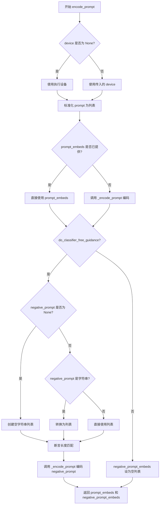
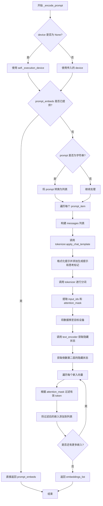
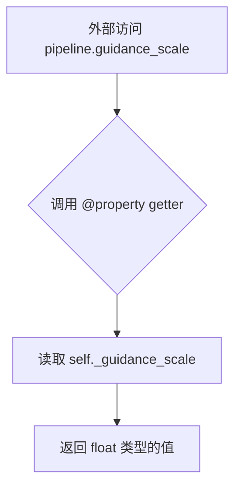
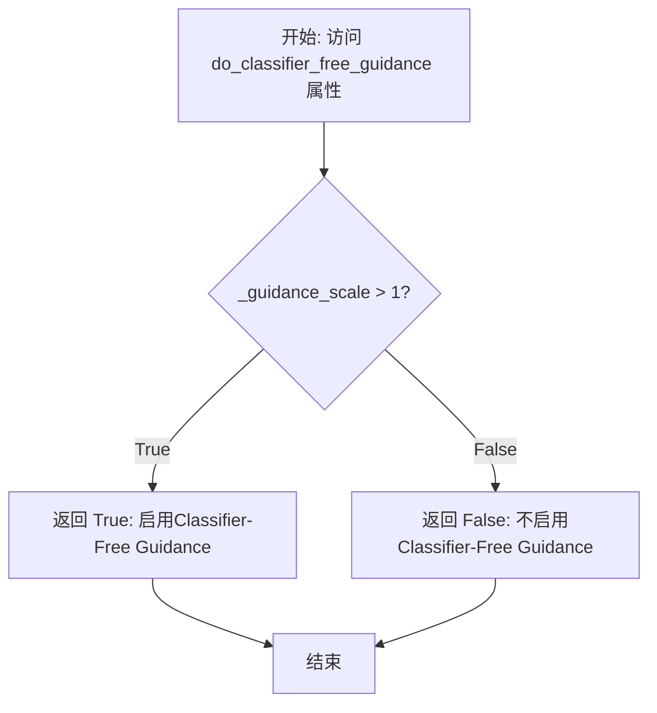
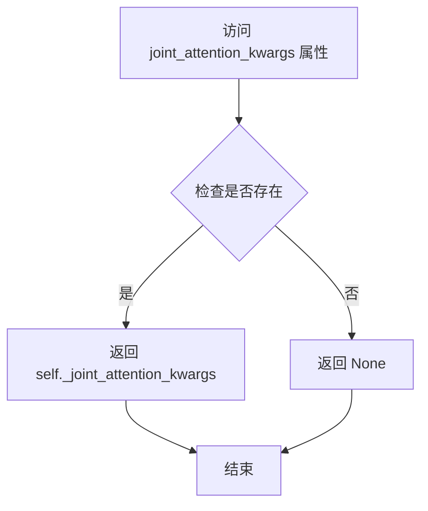
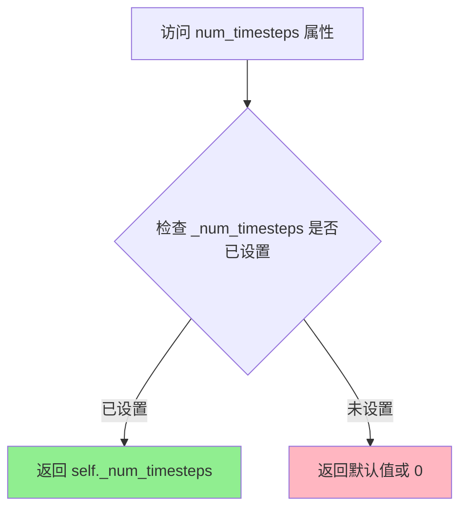
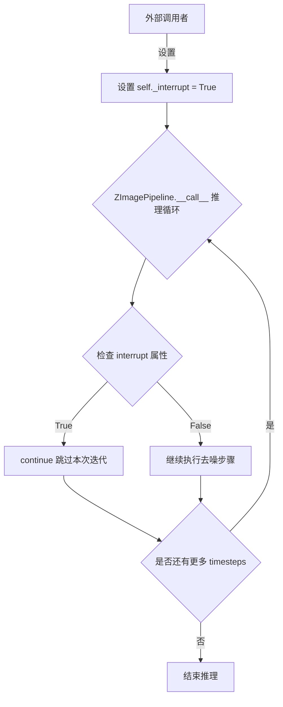
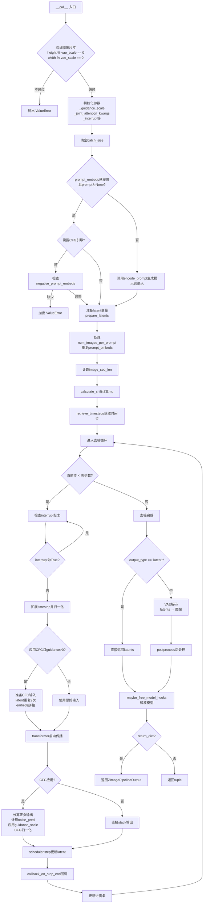

# `diffusers\src\diffusers\pipelines\z_image\pipeline_z_image.py` 详细设计文档

这是一个基于 Z-Image Transformer 的文本到图像扩散管道（Pipeline），实现了从文本提示（Prompt）生成图像的核心功能。代码封装了文本编码、潜在变量初始化、去噪推理（包含 CFG 引导）、VAE 解码及图像后处理的完整流程，支持自定义调度器、LoRA 加载和单文件模型加载。

## 整体流程

```mermaid
graph TD
    A[Start: __call__] --> B{参数校验 & 预处理}
    B --> C[获取执行设备 device]
    C --> D[编码提示词: encode_prompt]
    D --> E[准备初始潜在变量: prepare_latents]
    E --> F[计算时间步偏移: calculate_shift]
    F --> G[获取时间步序列: retrieve_timesteps]
    G --> H{去噪循环: for t in timesteps}
    H --> I[扩展时间步 & CFG截断处理]
    I --> J{是否应用CFG?}
    J -- 是 --> K[构建双倍batch输入]
    J -- 否 --> L[保持单倍batch输入]
    K --> M[调用 Transformer: self.transformer]
    L --> M
    M --> N[应用 CFG 逻辑 (Noise Prediction)]
    N --> O[调度器步进: scheduler.step]
    O --> P{执行回调? callback_on_step_end}
    P -- 是 --> Q[执行回调并更新 latents]
    P -- 否 --> R[更新进度条]
    Q --> R
    R --> H
    H --> S{循环结束?}
    S -- 是 --> T{output_type == 'latent'?}
    T -- 是 --> U[直接返回 latents]
    T -- 否 --> V[VAE解码: vae.decode]
    V --> W[图像后处理: image_processor.postprocess]
    U --> X[释放模型资源: maybe_free_model_hooks]
    W --> X
    X --> Y[End: 返回 ZImagePipelineOutput]
```

## 类结构

```
ZImagePipeline (主类)
├── 继承: DiffusionPipeline (基础扩散管道)
├── 继承: ZImageLoraLoaderMixin (LoRA加载)
├── 继承: FromSingleFileMixin (单文件加载)
└── 组件 Components:
    ├── scheduler (FlowMatchEulerDiscreteScheduler)
    ├── vae (AutoencoderKL)
    ├── text_encoder (PreTrainedModel)
    ├── tokenizer (AutoTokenizer)
    └── transformer (ZImageTransformer2DModel)
```

## 全局变量及字段


### `logger`
    
模块级日志记录器，用于记录管道运行时的日志信息

类型：`logging.Logger`
    


### `EXAMPLE_DOC_STRING`
    
使用示例文档字符串，包含管道调用的示例代码和使用说明

类型：`str`
    


### `ZImagePipeline.model_cpu_offload_seq`
    
类属性，定义模型卸载顺序配置，指定text_encoder->transformer->vae的卸载顺序

类型：`str`
    


### `ZImagePipeline._optional_components`
    
类属性，可选组件列表，用于标识管道中的可选模块

类型：`list`
    


### `ZImagePipeline._callback_tensor_inputs`
    
类属性，回调函数需要的张量输入列表，定义哪些张量可用于回调

类型：`list`
    


### `ZImagePipeline.scheduler`
    
实例属性，扩散调度器实例，负责管理去噪过程中的时间步调度

类型：`FlowMatchEulerDiscreteScheduler`
    


### `ZImagePipeline.vae`
    
实例属性，变分自编码器实例，用于将潜在空间解码到图像空间

类型：`AutoencoderKL`
    


### `ZImagePipeline.text_encoder`
    
实例属性，文本编码器实例，负责将文本提示转换为嵌入向量

类型：`PreTrainedModel`
    


### `ZImagePipeline.tokenizer`
    
实例属性，分词器实例，用于将文本分割为token序列

类型：`AutoTokenizer`
    


### `ZImagePipeline.transformer`
    
实例属性，图像生成Transformer模型实例，负责在潜在空间中进行去噪预测

类型：`ZImageTransformer2DModel`
    


### `ZImagePipeline.vae_scale_factor`
    
实例属性，VAE缩放因子，用于计算图像分辨率的缩放比例

类型：`int`
    


### `ZImagePipeline.image_processor`
    
实例属性，图像处理器，负责VAE解码后图像的后处理工作

类型：`VaeImageProcessor`
    


### `ZImagePipeline._guidance_scale`
    
实例属性（私有），内部guidance_scale存储，用于控制分类器自由引导的强度

类型：`float`
    


### `ZImagePipeline._joint_attention_kwargs`
    
实例属性（私有），联合注意力参数字典，用于传递给注意力处理器

类型：`dict`
    


### `ZImagePipeline._interrupt`
    
实例属性（私有），中断标志，用于控制推理过程的interrupt状态

类型：`bool`
    


### `ZImagePipeline._num_timesteps`
    
实例属性（私有），时间步总数，记录扩散过程的总步数

类型：`int`
    


### `ZImagePipeline._cfg_normalization`
    
实例属性（私有），CFG归一化标志，用于控制是否对分类器自由引导进行归一化处理

类型：`bool`
    


### `ZImagePipeline._cfg_truncation`
    
实例属性（私有），CFG截断值，用于控制在推理过程中何时截断CFG

类型：`float`
    
    

## 全局函数及方法


### `calculate_shift`

计算图像序列长度对应的噪声调度偏移量(mu)，通过线性插值在基础序列长度和最大序列长度之间计算偏移量，用于调整扩散模型的噪声调度计划。

参数：

- `image_seq_len`：`int`，目标图像的序列长度，通常由latents的空间维度计算得出
- `base_seq_len`：`int = 256`，基础序列长度，默认值为256
- `max_seq_len`：`int = 4096`，最大序列长度，默认值为4096
- `base_shift`：`float = 0.5`，基础偏移量，默认值为0.5
- `max_shift`：`float = 1.15`，最大偏移量，默认值为1.15

返回值：`float`，计算得到的噪声调度偏移量(mu)，用于传递给调度器的sigma_min参数

#### 流程图

```mermaid
flowchart TD
    A[开始 calculate_shift] --> B[计算斜率 m = (max_shift - base_shift) / (max_seq_len - base_seq_len)]
    B --> C[计算截距 b = base_shift - m * base_seq_len]
    C --> D[计算偏移量 mu = image_seq_len * m + b]
    D --> E[返回 mu]
```

#### 带注释源码

```python
def calculate_shift(
    image_seq_len,          # 目标图像的序列长度
    base_seq_len: int = 256,    # 基础序列长度，默认256
    max_seq_len: int = 4096,    # 最大序列长度，默认4096
    base_shift: float = 0.5,    # 基础偏移量，默认0.5
    max_shift: float = 1.15,    # 最大偏移量，默认1.15
):
    # 计算线性插值的斜率 (slope)
    # m = (max_shift - base_shift) / (max_seq_len - base_seq_len)
    m = (max_shift - base_shift) / (max_seq_len - base_seq_len)
    
    # 计算线性插值的截距 (intercept)
    # b = base_shift - m * base_seq_len
    b = base_shift - m * base_seq_len
    
    # 根据目标序列长度计算偏移量 mu
    # mu = image_seq_len * m + b
    mu = image_seq_len * m + b
    
    # 返回计算得到的偏移量
    return mu
```


### `retrieve_timesteps`

该函数是调度器时间步管理的核心工具方法，负责调用调度器的 `set_timesteps` 方法并获取处理后的时间步序列。它支持三种时间步配置方式：通过 `num_inference_steps` 自动计算、通过自定义 `timesteps` 列表或通过自定义 `sigmas` 列表，并返回时间步张量和实际推理步数。

参数：

- `scheduler`：`SchedulerMixin`，调度器实例，用于获取时间步的调度器对象
- `num_inference_steps`：`int | None`，扩散模型生成样本时使用的去噪步数，若使用此参数则 `timesteps` 必须为 `None`
- `device`：`str | torch.device | None`，时间步要移动到的设备，传入 `None` 则不移动时间步
- `timesteps`：`list[int] | None`，自定义时间步列表，用于覆盖调度器的时间步间隔策略，传入此参数时 `num_inference_steps` 和 `sigmas` 必须为 `None`
- `sigmas`：`list[float] | None`，自定义 sigmas 列表，用于覆盖调度器的时间步间隔策略，传入此参数时 `num_inference_steps` 和 `timesteps` 必须为 `None`
- `**kwargs`：任意关键字参数，将传递给调度器的 `set_timesteps` 方法

返回值：`tuple[torch.Tensor, int]`，元组包含调度器的时间步调度张量和推理步数

#### 流程图

```mermaid
flowchart TD
    A[开始] --> B{检查timesteps和sigmas是否同时传入}
    B -->|是| C[抛出ValueError: 只能传入timesteps或sigmas之一]
    B -->|否| D{检查timesteps是否传入}
    D -->|是| E[检查scheduler.set_timesteps是否支持timesteps参数]
    E -->|不支持| F[抛出ValueError: 当前调度器不支持自定义timesteps]
    E -->|支持| G[调用scheduler.set_timesteps<br/>参数: timesteps=timesteps, device=device, **kwargs]
    G --> H[获取scheduler.timesteps<br/>计算num_inference_steps = len(timesteps)]
    D -->|否| I{检查sigmas是否传入}
    I -->|是| J[检查scheduler.set_timesteps是否支持sigmas参数]
    J -->|不支持| K[抛出ValueError: 当前调度器不支持自定义sigmas]
    J -->|支持| L[调用scheduler.set_timesteps<br/>参数: sigmas=sigmas, device=device, **kwargs]
    L --> M[获取scheduler.timesteps<br/>计算num_inference_steps = len(timesteps)]
    I -->|否| N[调用scheduler.set_timesteps<br/>参数: num_inference_steps=num_inference_steps, device=device, **kwargs]
    N --> O[获取scheduler.timesteps]
    H --> P[返回timesteps和num_inference_steps]
    M --> P
    O --> P
    P --> Q[结束]
```

#### 带注释源码

```python
def retrieve_timesteps(
    scheduler,  # SchedulerMixin: 调度器实例，用于获取时间步
    num_inference_steps: int | None = None,  # int | None: 推理步数，若设置则timesteps必须为None
    device: str | torch.device | None = None,  # str | torch.device | None: 时间步的目标设备
    timesteps: list[int] | None = None,  # list[int] | None: 自定义时间步列表
    sigmas: list[float] | None = None,  # list[float] | None: 自定义sigmas列表
    **kwargs,  # 任意关键字参数，传递给scheduler.set_timesteps
):
    r"""
    Calls the scheduler's `set_timesteps` method and retrieves timesteps from the scheduler after the call. Handles
    custom timesteps. Any kwargs will be supplied to `scheduler.set_timesteps`.

    Args:
        scheduler (`SchedulerMixin`): The scheduler to get timesteps from.
        num_inference_steps (`int`): The number of diffusion steps used when generating samples with a pre-trained model. If used, `timesteps` must be `None`.
        device (`str` or `torch.device`, *optional*): The device to which the timesteps should be moved to. If `None`, the timesteps are not moved.
        timesteps (`list[int]`, *optional*): Custom timesteps used to override the timestep spacing strategy of the scheduler. If `timesteps` is passed, `num_inference_steps` and `sigmas` must be `None`.
        sigmas (`list[float]`, *optional*): Custom sigmas used to override the timestep spacing strategy of the scheduler. If `sigmas` is passed, `num_inference_steps` and `timesteps` must be `None`.

    Returns:
        `tuple[torch.Tensor, int]`: A tuple where the first element is the timestep schedule from the scheduler and the second element is the number of inference steps.
    """
    # 校验逻辑：timesteps和sigmas不能同时传入，只能选择其中一种方式自定义
    if timesteps is not None and sigmas is not None:
        raise ValueError(
            "Only one of `timesteps` or `sigmas` can be passed. Please choose one to set custom values"
        )
    
    # 处理自定义timesteps的情况
    if timesteps is not None:
        # 通过inspect检查scheduler.set_timesteps是否接受timesteps参数
        accepts_timesteps = "timesteps" in set(inspect.signature(scheduler.set_timesteps).parameters.keys())
        if not accepts_timesteps:
            raise ValueError(
                f"The current scheduler class {scheduler.__class__}'s `set_timesteps` does not support custom"
                f" timestep schedules. Please check whether you are using the correct scheduler."
            )
        # 调用scheduler的set_timesteps方法设置自定义时间步
        scheduler.set_timesteps(timesteps=timesteps, device=device, **kwargs)
        # 从scheduler获取设置后的时间步
        timesteps = scheduler.timesteps
        # 计算实际推理步数
        num_inference_steps = len(timesteps)
    
    # 处理自定义sigmas的情况
    elif sigmas is not None:
        # 通过inspect检查scheduler.set_timesteps是否接受sigmas参数
        accept_sigmas = "sigmas" in set(inspect.signature(scheduler.set_timesteps).parameters.keys())
        if not accept_sigmas:
            raise ValueError(
                f"The current scheduler class {scheduler.__class__}'s `set_timesteps` does not support custom"
                f" sigmas schedules. Please check whether you are using the correct scheduler."
            )
        # 调用scheduler的set_timesteps方法设置自定义sigmas
        scheduler.set_timesteps(sigmas=sigmas, device=device, **kwargs)
        # 从scheduler获取设置后的时间步
        timesteps = scheduler.timesteps
        # 计算实际推理步数
        num_inference_steps = len(timesteps)
    
    # 默认情况：使用num_inference_steps自动计算时间步
    else:
        scheduler.set_timesteps(num_inference_steps, device=device, **kwargs)
        timesteps = scheduler.timesteps
    
    # 返回时间步张量和推理步数
    return timesteps, num_inference_steps
```


### `ZImagePipeline.__init__`

该方法是 `ZImagePipeline` 类的构造函数，负责初始化扩散管道的核心组件。它首先调用父类 `DiffusionPipeline` 的初始化方法，随后注册 VAE、文本编码器、分词器、调度器和变换器模型，并根据 VAE 的配置计算缩放因子，最后初始化图像后处理处理器。

参数：

- `scheduler`：`FlowMatchEulerDiscreteScheduler`，控制扩散过程的噪声调度策略。
- `vae`：`AutoencoderKL`，变分自编码器模型，负责将潜在空间数据解码为图像。
- `text_encoder`：`PreTrainedModel`，预训练的文本编码模型，用于将文本提示转换为嵌入向量。
- `tokenizer`：`AutoTokenizer`，文本分词器，用于将输入文本转换为 token ID。
- `transformer`：`ZImageTransformer2DModel`，图像生成的核心去噪变换器模型。

返回值：`None`（构造函数，初始化实例本身）。

#### 流程图

```mermaid
graph TD
    A([开始 __init__]) --> B[调用 super().__init__()]
    B --> C[调用 self.register_modules 注册组件]
    C --> D{检查 VAE 是否存在}
    D -->|是| E[计算 vae_scale_factor]
    D -->|否| F[使用默认值 8]
    E --> G[初始化 VaeImageProcessor]
    F --> G
    G --> H([结束初始化])
```

#### 带注释源码

```python
def __init__(
    self,
    scheduler: FlowMatchEulerDiscreteScheduler,
    vae: AutoencoderKL,
    text_encoder: PreTrainedModel,
    tokenizer: AutoTokenizer,
    transformer: ZImageTransformer2DModel,
):
    # 1. 调用父类 DiffusionPipeline 的初始化方法，建立基础管道结构
    super().__init__()

    # 2. 将传入的模型组件注册到管道内部，以便在推理时动态调用
    # 注册顺序通常遵循模型数据流向：Text -> Transformer -> VAE
    self.register_modules(
        vae=vae,
        text_encoder=text_encoder,
        tokenizer=tokenizer,
        scheduler=scheduler,
        transformer=transformer,
    )
    
    # 3. 计算 VAE 的缩放因子 (VAE Scale Factor)
    # 这是一个防御性检查。如果 VAE 存在，则根据其配置中的 block_out_channels 计算下采样倍数的以 2 为底的对数幂。
    # 例如：通道 [320, 640, 1280] 长度为 3，2^(3-1) = 4 倍下采样。
    # 如果不存在，则回退到默认值 8。
    # 潜在技术债务: 这里的 if hasattr 检查逻辑略显冗余，因为 register_modules 刚被执行，
    # 且 fallback 值 8 是硬编码的，若 VAE 结构变更可能导致计算错误。
    self.vae_scale_factor = (
        2 ** (len(self.vae.config.block_out_channels) - 1) if hasattr(self, "vae") and self.vae is not None else 8
    )
    
    # 4. 初始化图像后处理处理器
    # 传入的 vae_scale_factor 乘以 2，这是因为管道内部的潜空间计算逻辑 (prepare_latents) 使用了 factor * 2，
    # 为了保持一致性，处理器也需要相应的缩放参数来处理分辨率。
    self.image_processor = VaeImageProcessor(vae_scale_factor=self.vae_scale_factor * 2)
```


### `ZImagePipeline.encode_prompt`

该方法封装了提示词编码逻辑，用于处理正负提示词，将其转换为模型可用的嵌入向量，并支持分类器自由引导（CFG）功能。当启用 CFG 时，会同时编码负向提示词以实现无分类器的文本引导图像生成。

参数：

- `prompt`：`str | list[str]`，正向提示词，可以是单个字符串或字符串列表
- `device`：`torch.device | None`，指定计算设备，默认为执行设备
- `do_classifier_free_guidance`：`bool`，是否启用分类器自由引导，默认为 True
- `negative_prompt`：`str | list[str] | None`，负向提示词，用于引导图像生成方向
- `prompt_embeds`：`list[torch.FloatTensor] | None`，预计算的正向提示词嵌入，若提供则跳过编码
- `negative_prompt_embeds`：`torch.FloatTensor | None`，预计算的负向提示词嵌入
- `max_sequence_length`：`int`，最大序列长度，默认为 512

返回值：`tuple[list[torch.FloatTensor], list[torch.FloatTensor]]`，返回正向和负向提示词嵌入的元组

#### 流程图



#### 带注释源码

```python
def encode_prompt(
    self,
    prompt: str | list[str],
    device: torch.device | None = None,
    do_classifier_free_guidance: bool = True,
    negative_prompt: str | list[str] | None = None,
    prompt_embeds: list[torch.FloatTensor] | None = None,
    negative_prompt_embeds: torch.FloatTensor | None = None,
    max_sequence_length: int = 512,
):
    """
    封装提示词编码逻辑，处理正负提示词，输出嵌入向量
    
    Args:
        prompt: 正向提示词，字符串或字符串列表
        device: 计算设备
        do_classifier_free_guidance: 是否启用分类器自由引导
        negative_prompt: 负向提示词
        prompt_embeds: 预计算的正向嵌入
        negative_prompt_embeds: 预计算的负向嵌入
        max_sequence_length: 最大序列长度
    
    Returns:
        正向和负向提示词嵌入的元组
    """
    # 将单个字符串提示词转换为列表，保持一致性
    prompt = [prompt] if isinstance(prompt, str) else prompt
    
    # 编码正向提示词
    prompt_embeds = self._encode_prompt(
        prompt=prompt,
        device=device,
        prompt_embeds=prompt_embeds,
        max_sequence_length=max_sequence_length,
    )

    # 处理分类器自由引导
    if do_classifier_free_guidance:
        # 如果未提供负向提示词，使用空字符串
        if negative_prompt is None:
            negative_prompt = ["" for _ in prompt]
        else:
            # 标准化负向提示词为列表格式
            negative_prompt = [negative_prompt] if isinstance(negative_prompt, str) else negative_prompt
        
        # 断言正负提示词数量一致
        assert len(prompt) == len(negative_prompt)
        
        # 编码负向提示词
        negative_prompt_embeds = self._encode_prompt(
            prompt=negative_prompt,
            device=device,
            prompt_embeds=negative_prompt_embeds,
            max_sequence_length=max_sequence_length,
        )
    else:
        # 不使用 CFG 时，负向嵌入为空列表
        negative_prompt_embeds = []
    
    return prompt_embeds, negative_prompt_embeds
```


### `ZImagePipeline._encode_prompt`

该方法是 `ZImagePipeline` 类的私有方法，实际执行文本提示的编码工作。它使用 tokenizer 将文本提示转换为 token IDs，应用聊天模板进行格式化，然后通过 text_encoder 生成文本嵌入，并利用注意力掩码过滤有效嵌入后返回。

参数：

- `self`：类实例本身，包含 tokenizer、text_encoder 等组件
- `prompt`：`str | list[str]`，需要编码的文本提示，可以是单个字符串或字符串列表
- `device`：`torch.device | None`，执行编码的设备，若为 None 则使用 `self._execution_device`
- `prompt_embeds`：`list[torch.FloatTensor] | None`，可选的预计算文本嵌入，若提供则直接返回
- `max_sequence_length`：`int`，最大序列长度，默认为 512

返回值：`list[torch.FloatTensor]`，编码后的文本嵌入列表，每个元素对应一个提示的嵌入向量

#### 流程图



#### 带注释源码

```python
def _encode_prompt(
    self,
    prompt: str | list[str],
    device: torch.device | None = None,
    prompt_embeds: list[torch.FloatTensor] | None = None,
    max_sequence_length: int = 512,
) -> list[torch.FloatTensor]:
    """
    编码文本提示为嵌入向量。
    
    参数:
        prompt: 输入的文本提示，可以是单个字符串或字符串列表
        device: 执行编码的设备
        prompt_embeds: 可选的预计算嵌入，若提供则直接返回
        max_sequence_length: 最大序列长度
    
    返回:
        文本嵌入列表，每个元素对应一个提示的嵌入向量
    """
    # 确定执行设备，优先使用传入的 device，否则使用 Pipeline 的执行设备
    device = device or self._execution_device

    # 如果已经提供了预计算的 prompt_embeds，直接返回，跳过编码过程
    if prompt_embeds is not None:
        return prompt_embeds

    # 统一将单个字符串转换为列表，方便后续统一处理
    if isinstance(prompt, str):
        prompt = [prompt]

    # 遍历每个提示文本，应用聊天模板进行格式化
    for i, prompt_item in enumerate(prompt):
        # 构建消息格式，符合聊天模板的输入格式
        messages = [
            {"role": "user", "content": prompt_item},
        ]
        # 使用 tokenizer 的 apply_chat_template 方法
        # tokenize=False: 不进行分词，只进行模板应用
        # add_generation_prompt=True: 添加生成提示，引导模型生成
        # enable_thinking=True: 启用思考模式（可能用于思维链等特性）
        prompt_item = self.tokenizer.apply_chat_template(
            messages,
            tokenize=False,
            add_generation_prompt=True,
            enable_thinking=True,
        )
        # 更新列表中的提示文本
        prompt[i] = prompt_item

    # 使用 tokenizer 将文本转换为模型输入格式
    # padding="max_length": 填充到最大长度
    # truncation=True: 截断超长序列
    # return_tensors="pt": 返回 PyTorch 张量
    text_inputs = self.tokenizer(
        prompt,
        padding="max_length",
        max_length=max_sequence_length,
        truncation=True,
        return_tensors="pt",
    )

    # 提取 input_ids（token IDs）和 attention_mask（注意力掩码）
    # 并将它们移动到指定的设备上
    text_input_ids = text_inputs.input_ids.to(device)
    prompt_masks = text_inputs.attention_mask.to(device).bool()

    # 调用 text_encoder 获取文本的隐藏状态表示
    # output_hidden_states=True: 返回所有层的隐藏状态
    prompt_embeds = self.text_encoder(
        input_ids=text_input_ids,
        attention_mask=prompt_masks,
        output_hidden_states=True,
    ).hidden_states[-2]  # 获取倒数第二层的隐藏状态（通常效果较好）

    # 处理每个提示的嵌入向量，根据 attention_mask 过滤有效 token
    embeddings_list = []
    for i in range(len(prompt_embeds)):
        # 仅保留有效 token 的嵌入（attention_mask 为 True 的位置）
        embeddings_list.append(prompt_embeds[i][prompt_masks[i]])

    return embeddings_list
```


### `ZImagePipeline.prepare_latents`

该方法负责生成或处理用于图像生成的初始潜在变量（latents），根据输入的图像尺寸和VAE缩放因子计算潜在变量的空间维度，并根据是否提供预生成潜在变量来执行随机初始化或形状验证与设备迁移。

参数：

- `batch_size`：`int`，批次大小，决定生成潜在变量的数量
- `num_channels_latents`：`int`，潜在变量的通道数，通常由transformer模型的输入通道数决定
- `height`：`int`，目标图像的高度（像素）
- `width`：`int`，目标图像的宽度（像素）
- `dtype`：`torch.dtype`，潜在变量的数据类型
- `device`：`torch.device`，潜在变量存放的设备（CPU/CUDA）
- `generator`：`torch.Generator | None`，用于生成确定性随机数的生成器
- `latents`：`torch.FloatTensor | None`，可选的预生成潜在变量，如果为None则随机生成

返回值：`torch.FloatTensor`，处理后的潜在变量张量，形状为 (batch_size, num_channels_latents, height, width)

#### 流程图

```mermaid
flowchart TD
    A[开始 prepare_latents] --> B[计算调整后的高度和宽度]
    B --> C{height = 2 * (height // (vae_scale_factor * 2))}
    C --> D{width = 2 * (width // (vae_scale_factor * 2))}
    D --> E[构建shape元组]
    E --> F{latents is None?}
    F -->|是| G[使用randn_tensor生成随机潜在变量]
    F -->|否| H{验证latents形状是否匹配}
    H -->|形状不匹配| I[抛出ValueError异常]
    H -->|形状匹配| J[将latents转移到目标设备]
    G --> K[返回latents]
    J --> K
```

#### 带注释源码

```python
def prepare_latents(
    self,
    batch_size,           # int: 批次大小，控制一次生成多少个样本
    num_channels_latents, # int: 潜在变量的通道数，由transformer.in_channels决定
    height,               # int: 输入图像高度（像素）
    width,                # int: 输入图像宽度（像素）
    dtype,                # torch.dtype: 潜在变量的数据类型（如torch.float32）
    device,               # torch.device: 计算设备（cuda/cpu）
    generator,            # torch.Generator | None: 随机数生成器，用于复现结果
    latents=None,         # torch.FloatTensor | None: 可选的预生成潜在变量
):
    """
    准备用于扩散模型推理的潜在变量。
    
    该方法负责：
    1. 根据VAE缩放因子调整输入图像尺寸到潜在空间
    2. 生成随机潜在变量或验证并迁移预提供的潜在变量
    """
    # Step 1: 将输入图像尺寸调整到潜在空间维度
    # VAE的缩放因子决定了像素空间与潜在空间的比例
    # 乘以2是为了适应模型的特殊处理需求
    height = 2 * (int(height) // (self.vae_scale_factor * 2))
    width = 2 * (int(width) // (self.vae_scale_factor * 2))

    # Step 2: 确定潜在变量的完整形状
    # 形状为 (batch_size, channels, latent_height, latent_width)
    shape = (batch_size, num_channels_latents, height, width)

    # Step 3: 处理潜在变量的初始化方式
    if latents is None:
        # 情况A：未提供潜在变量，使用随机噪声初始化
        # 使用randn_tensor生成服从标准正态分布的随机张量
        # generator参数确保结果可复现
        latents = randn_tensor(shape, generator=generator, device=device, dtype=dtype)
    else:
        # 情况B：提供了潜在变量，验证其形状是否符合预期
        if latents.shape != shape:
            # 形状不匹配时抛出明确的错误信息
            raise ValueError(f"Unexpected latents shape, got {latents.shape}, expected {shape}")
        # 将已存在的潜在变量移动到指定的计算设备
        latents = latents.to(device)
    
    # Step 4: 返回处理后的潜在变量
    return latents
```


### ZImagePipeline.guidance_scale

`guidance_scale` 是一个属性方法（property），用于获取当前 ZImagePipeline 实例的引导尺度（guidance scale）值。该值在图像生成过程中控制文本提示对生成结果的影响程度，通常用于 Classifier-Free Diffusion Guidance (CFDG) 技术中。

参数：

- （无参数）

返回值：`float`，返回当前设置的引导 scale 值，用于控制图像生成过程中分类器自由引导的强度。

#### 流程图



#### 带注释源码

```python
@property
def guidance_scale(self):
    """
    获取当前管道的 guidance_scale 值。
    
    guidance_scale 是 Classifier-Free Diffusion Guidance (CFG) 的关键参数，
    在 ZImagePipeline.__call__ 方法中被设置为 self._guidance_scale。
    当 guidance_scale > 1 时启用分类器自由引导，值越大生成的图像与文本提示越相关，
    但可能导致图像质量下降。
    
    返回:
        float: 当前使用的 guidance_scale 值，默认为 5.0
    """
    return self._guidance_scale
```


### `ZImagePipeline.do_classifier_free_guidance`

该属性方法用于判断当前是否启用 Classifier-Free Guidance（CFG）机制。当 `guidance_scale` 参数大于 1 时返回 `True`，表示启用 CFG 以提升生成图像与文本提示的相关性；否则返回 `False`，跳过 CFG 步骤以提高推理速度。

参数：

- （无参数，该方法为属性访问器）

返回值：`bool`，返回是否启用 CFG（当 `guidance_scale > 1` 时为 `True`，否则为 `False`）

#### 流程图



#### 带注释源码

```python
@property
def do_classifier_free_guidance(self):
    """
    判断是否启用 Classifier-Free Guidance（CFG）机制。
    
    CFG 是一种在扩散模型推理时同时处理正向和负向提示词的技术，
    通过在生成过程中引入负向提示信息来提升图像质量。
    
    只有当 guidance_scale > 1 时，CFG 才会被启用并产生实际效果。
    当 guidance_scale <= 1 时，CFG 逻辑会被跳过，以节省计算资源。
    
    Returns:
        bool: 如果 guidance_scale 大于 1 返回 True（启用CFG），否则返回 False。
    """
    return self._guidance_scale > 1
```


### `ZImagePipeline.joint_attention_kwargs`

获取联合注意力（Joint Attention） kwargs 的属性方法。该属性用于在扩散模型推理过程中，将自定义的注意力处理参数（如 `attention_processor` 等）传递给 transformer 模型的 Attention 机制，实现对注意力计算的定制化控制。

参数：无（属性访问器不接受参数）

返回值：`dict[str, Any] | None`，返回存储的联合注意力 kwargs 字典，可能为 `None`（当未在 pipeline 调用时传入该参数时）

#### 流程图



#### 带注释源码

```python
@property
def joint_attention_kwargs(self):
    """
    获取联合注意力 kwargs 的属性访问器。
    
    该属性用于存储在 pipeline __call__ 方法中传入的 joint_attention_kwargs 参数。
    这些参数会在推理过程中传递给 transformer 模型的 AttentionProcessor，
    允许用户自定义注意力计算行为（例如使用不同的注意力机制、添加注意力 mask 等）。
    
    Returns:
        dict[str, Any] | None: 联合注意力参数字典，如果未设置则返回 None
    """
    return self._joint_attention_kwargs
```

#### 关联信息

- **初始化位置**: 在 `__call__` 方法中通过 `self._joint_attention_kwargs = joint_attention_kwargs` 进行赋值
- **默认值**: `None`（当调用 pipeline 时未传入 `joint_attention_kwargs` 参数）
- **用途**: 传递给 `self.transformer` 的注意力处理器，用于控制 transformer 模型中的注意力计算方式
- **调用方**: `__call__` 方法内部使用，通过 `joint_attention_kwargs` 参数接收用户输入


### `ZImagePipeline.num_timesteps`

该属性返回图像生成管道的时间步数量，该值在调用管道生成图像时通过去噪循环前的调度器配置设置。

参数：无（这是一个属性访问器，不接受任何参数）

返回值：`int`，返回扩散模型去噪过程的时间步总数。

#### 流程图



#### 带注释源码

```python
@property
def num_timesteps(self):
    """
    属性：返回时间步数量
    
    该属性返回图像生成过程中使用的时间步数量。
    该值在 __call__ 方法中去噪循环开始前通过 retrieve_timesteps 函数设置：
    self._num_timesteps = len(timesteps)
    
    返回:
        int: 扩散模型去噪过程的时间步总数，通常等于 num_inference_steps
    """
    return self._num_timesteps
```


### `ZImagePipeline.interrupt`

该属性是 ZImagePipeline 类的一个只读属性，用于获取当前管道的终端执行的中断状态。当外部调用者设置 `_interrupt` 为 `True` 时，可以在不终止进程的情况下让正在运行的推理循环提前退出，实现优雅的中断机制。

参数：
- （无参数）

返回值：`bool`，返回当前的中断状态标记。如果为 `True` 表示已请求中断，推理循环将在下一次迭代开始时检查并退出；如果为 `False` 表示继续正常执行。

#### 流程图



#### 带注释源码

```python
@property
def interrupt(self):
    """
    属性：中断状态
    
    用途：
    - 提供一个只读接口来查询管道是否被请求中断
    - 在 __call__ 方法的去噪循环中会被检查
    - 允许外部代码在任意时刻设置中断请求，推理循环会在下一次迭代开始时响应
    
    示例用法：
        # 在另一个线程中设置中断
        pipeline._interrupt = True
        
        # 或者在回调中设置中断
        def callback(pipeline, step, timestep, kwargs):
            if some_condition:
                pipeline._interrupt = True
    """
    return self._interrupt
```


### `ZImagePipeline.__call__`

执行图像生成推理流程的主入口方法，负责从文本提示词生成图像。该方法整合了文本编码、潜在向量准备、去噪循环（包含CFG引导和VAE解码）等完整扩散模型推理流程，输出最终生成的图像。

参数：

- `prompt`：`str | list[str]`，可选，文本提示词或提示词列表，用于指导图像生成
- `height`：`int | None`，可选，生成图像的高度像素值，默认为1024
- `width`：`int | None`，可选，生成图像的宽度像素值，默认为1024
- `num_inference_steps`：`int`，可选，去噪迭代步数，默认为50，步数越多通常质量越高但推理越慢
- `sigmas`：`list[float] | None`，可选，自定义sigma值列表，用于支持自定义调度器时间步
- `guidance_scale`：`float`，可选，分类器自由引导比例，默认为5.0，用于控制生成图像与提示词的相关性
- `cfg_normalization`：`bool`，可选，是否启用CFG归一化，默认为False
- `cfg_truncation`：`float`，可选，CFG截断值，用于动态调整引导强度，默认为1.0
- `negative_prompt`：`str | list[str] | None`，可选，负面提示词，用于指定不想生成的内容
- `num_images_per_prompt`：`int | None`，可选，每个提示词生成的图像数量，默认为1
- `generator`：`torch.Generator | list[torch.Generator] | None`，可选，随机生成器，用于确保可复现的生成结果
- `latents`：`torch.FloatTensor | None`，可选，预生成的噪声潜在向量，可用于控制生成过程
- `prompt_embeds`：`list[torch.FloatTensor] | None`，可选，预计算的文本嵌入向量
- `negative_prompt_embeds`：`list[torch.FloatTensor] | None`，可选，预计算的负面文本嵌入向量
- `output_type`：`str | None`，可选，输出格式类型，默认为"pil"（PIL图像）
- `return_dict`：`bool`，可选，是否返回字典格式结果，默认为True
- `joint_attention_kwargs`：`dict[str, Any] | None`，可选，传递给注意力处理器的额外参数
- `callback_on_step_end`：`Callable[[int, int], None] | None`，可选，每步结束后调用的回调函数
- `callback_on_step_end_tensor_inputs`：`list[str]`，可选，回调函数可访问的张量输入列表
- `max_sequence_length`：`int`，可选，文本序列最大长度，默认为512

返回值：`ZImagePipelineOutput | tuple`，返回生成的图像结果。当`return_dict=True`时返回`ZImagePipelineOutput`对象（包含`images`属性），否则返回元组（第一个元素为图像列表）

#### 流程图



#### 带注释源码

```python
@torch.no_grad()
@replace_example_docstring(EXAMPLE_DOC_STRING)
def __call__(
    self,
    prompt: str | list[str] = None,
    height: int | None = None,
    width: int | None = None,
    num_inference_steps: int = 50,
    sigmas: list[float] | None = None,
    guidance_scale: float = 5.0,
    cfg_normalization: bool = False,
    cfg_truncation: float = 1.0,
    negative_prompt: str | list[str] | None = None,
    num_images_per_prompt: int | None = 1,
    generator: torch.Generator | list[torch.Generator] | None = None,
    latents: torch.FloatTensor | None = None,
    prompt_embeds: list[torch.FloatTensor] | None = None,
    negative_prompt_embeds: list[torch.FloatTensor] | None = None,
    output_type: str | None = "pil",
    return_dict: bool = True,
    joint_attention_kwargs: dict[str, Any] | None = None,
    callback_on_step_end: Callable[[int, int], None] | None = None,
    callback_on_step_end_tensor_inputs: list[str] = ["latents"],
    max_sequence_length: int = 512,
):
    # ========== 步骤1: 参数预处理与验证 ==========
    # 设置默认图像尺寸
    height = height or 1024
    width = width or 1024

    # 计算VAE缩放因子（用于尺寸对齐验证）
    vae_scale = self.vae_scale_factor * 2
    
    # 验证高度和宽度是否可被vae_scale整除
    if height % vae_scale != 0:
        raise ValueError(
            f"Height must be divisible by {vae_scale} (got {height}). "
            f"Please adjust the height to a multiple of {vae_scale}."
        )
    if width % vae_scale != 0:
        raise ValueError(
            f"Width must be divisible by {vae_scale} (got {width}). "
            f"Please adjust the width to a multiple of {vae_scale}."
        )

    # 获取执行设备
    device = self._execution_device

    # ========== 步骤2: 初始化内部状态 ==========
    self._guidance_scale = guidance_scale
    self._joint_attention_kwargs = joint_attention_kwargs
    self._interrupt = False
    self._cfg_normalization = cfg_normalization
    self._cfg_truncation = cfg_truncation

    # ========== 步骤3: 确定batch_size ==========
    # 根据输入类型确定批处理大小
    if prompt is not None and isinstance(prompt, str):
        batch_size = 1
    elif prompt is not None and isinstance(prompt, list):
        batch_size = len(prompt)
    else:
        # 当使用预计算的prompt_embeds时
        batch_size = len(prompt_embeds)

    # ========== 步骤4: 文本编码 ==========
    # 处理prompt_embeds与prompt的互斥逻辑
    if prompt_embeds is not None and prompt is None:
        # 提供embeddings但不提供prompt时，需要检查CFG条件
        if self.do_classifier_free_guidance and negative_prompt_embeds is None:
            raise ValueError(
                "When `prompt_embeds` is provided without `prompt`, "
                "`negative_prompt_embeds` must also be provided for classifier-free guidance."
            )
    else:
        # 正常编码prompt
        (
            prompt_embeds,
            negative_prompt_embeds,
        ) = self.encode_prompt(
            prompt=prompt,
            negative_prompt=negative_prompt,
            do_classifier_free_guidance=self.do_classifier_free_guidance,
            prompt_embeds=prompt_embeds,
            negative_prompt_embeds=negative_prompt_embeds,
            device=device,
            max_sequence_length=max_sequence_length,
        )

    # ========== 步骤5: 准备潜在向量 ==========
    # 获取transformer的输入通道数
    num_channels_latents = self.transformer.in_channels

    # 准备初始噪声latents
    latents = self.prepare_latents(
        batch_size * num_images_per_prompt,  # 总batch大小
        num_channels_latents,
        height,
        width,
        torch.float32,  # 使用float32精度
        device,
        generator,
        latents,
    )

    # ========== 步骤6: 处理多图生成 ==========
    # 为每个prompt生成多张图像时，重复embeddings
    if num_images_per_prompt > 1:
        # 重复positive embeddings
        prompt_embeds = [pe for pe in prompt_embeds for _ in range(num_images_per_prompt)]
        # 重复negative embeddings（如果启用CFG）
        if self.do_classifier_free_guidance and negative_prompt_embeds:
            negative_prompt_embeds = [npe for npe in negative_prompt_embeds for _ in range(num_images_per_prompt)]

    # 计算实际batch大小
    actual_batch_size = batch_size * num_images_per_prompt
    
    # 计算图像序列长度（用于scheduler参数计算）
    image_seq_len = (latents.shape[2] // 2) * (latents.shape[3] // 2)

    # ========== 步骤7: 准备时间步 ==========
    # 计算scheduler的mu参数（自适应步长调整）
    mu = calculate_shift(
        image_seq_len,
        self.scheduler.config.get("base_image_seq_len", 256),
        self.scheduler.config.get("max_image_seq_len", 4096),
        self.scheduler.config.get("base_shift", 0.5),
        self.scheduler.config.get("max_shift", 1.15),
    )
    
    # 设置最小sigma值
    self.scheduler.sigma_min = 0.0
    scheduler_kwargs = {"mu": mu}
    
    # 获取去噪时间步序列
    timesteps, num_inference_steps = retrieve_timesteps(
        self.scheduler,
        num_inference_steps,
        device,
        sigmas=sigmas,
        **scheduler_kwargs,
    )
    
    # 计算预热步数（用于进度条显示）
    num_warmup_steps = max(len(timesteps) - num_inference_steps * self.scheduler.order, 0)
    self._num_timesteps = len(timesteps)

    # ========== 步骤8: 去噪主循环 ==========
    with self.progress_bar(total=num_inference_steps) as progress_bar:
        for i, t in enumerate(timesteps):
            # 检查中断标志（支持外部中断推理）
            if self.interrupt:
                continue

            # ========== 8.1 时间步预处理 ==========
            # 广播到batch维度（兼容ONNX/Core ML）
            timestep = t.expand(latents.shape[0])
            # 转换到[0, 1]范围
            timestep = (1000 - timestep) / 1000
            # 归一化时间（0=开始，1=结束）
            t_norm = timestep[0].item()

            # ========== 8.2 CFG截断处理 ==========
            # 动态调整引导强度
            current_guidance_scale = self.guidance_scale
            if (
                self.do_classifier_free_guidance
                and self._cfg_truncation is not None
                and float(self._cfg_truncation) <= 1
            ):
                if t_norm > self._cfg_truncation:
                    # 超过截断点后禁用CFG
                    current_guidance_scale = 0.0

            # ========== 8.3 判断是否应用CFG ==========
            apply_cfg = self.do_classifier_free_guidance and current_guidance_scale > 0

            # ========== 8.4 准备模型输入 ==========
            if apply_cfg:
                # CFG模式：复制latents和timestep以同时处理正负样本
                latents_typed = latents.to(self.transformer.dtype)
                latent_model_input = latents_typed.repeat(2, 1, 1, 1)
                prompt_embeds_model_input = prompt_embeds + negative_prompt_embeds
                timestep_model_input = timestep.repeat(2)
            else:
                # 非CFG模式：直接使用原始输入
                latent_model_input = latents.to(self.transformer.dtype)
                prompt_embeds_model_input = prompt_embeds
                timestep_model_input = timestep

            # ========== 8.5 Transformer前向传播 ==========
            # 为每个样本添加序列维度
            latent_model_input = latent_model_input.unsqueeze(2)
            latent_model_input_list = list(latent_model_input.unbind(dim=0))

            # 调用transformer进行去噪预测
            model_out_list = self.transformer(
                latent_model_input_list, 
                timestep_model_input, 
                prompt_embeds_model_input, 
                return_dict=False
            )[0]

            # ========== 8.6 CFG后处理 ==========
            if apply_cfg:
                # 分离positive和negative输出
                pos_out = model_out_list[:actual_batch_size]
                neg_out = model_out_list[actual_batch_size:]

                noise_pred = []
                for j in range(actual_batch_size):
                    pos = pos_out[j].float()
                    neg = neg_out[j].float()

                    # CFG公式：pred = pos + w * (pos - neg)
                    pred = pos + current_guidance_scale * (pos - neg)

                    # CFG归一化（防止预测范数过大）
                    if self._cfg_normalization and float(self._cfg_normalization) > 0.0:
                        ori_pos_norm = torch.linalg.vector_norm(pos)
                        new_pos_norm = torch.linalg.vector_norm(pred)
                        max_new_norm = ori_pos_norm * float(self._cfg_normalization)
                        if new_pos_norm > max_new_norm:
                            pred = pred * (max_new_norm / new_pos_norm)

                    noise_pred.append(pred)

                noise_pred = torch.stack(noise_pred, dim=0)
            else:
                # 非CFG模式：直接堆叠输出
                noise_pred = torch.stack([t.float() for t in model_out_list], dim=0)

            # ========== 8.7 更新latents ==========
            # 移除额外的序列维度并取反（符合scheduler约定）
            noise_pred = noise_pred.squeeze(2)
            noise_pred = -noise_pred

            # 调用scheduler进行单步去噪
            latents = self.scheduler.step(
                noise_pred.to(torch.float32), 
                t, 
                latents, 
                return_dict=False
            )[0]
            
            # 验证精度
            assert latents.dtype == torch.float32

            # ========== 8.8 步骤结束回调 ==========
            if callback_on_step_end is not None:
                callback_kwargs = {}
                for k in callback_on_step_end_tensor_inputs:
                    callback_kwargs[k] = locals()[k]
                callback_outputs = callback_on_step_end(self, i, t, callback_kwargs)

                # 允许回调修改latents和embeddings
                latents = callback_outputs.pop("latents", latents)
                prompt_embeds = callback_outputs.pop("prompt_embeds", prompt_embeds)
                negative_prompt_embeds = callback_outputs.pop("negative_prompt_embeds", negative_prompt_embeds)

            # ========== 8.9 进度条更新 ==========
            # 仅在最后一步或预热完成后更新
            if i == len(timesteps) - 1 or ((i + 1) > num_warmup_steps and (i + 1) % self.scheduler.order == 0):
                progress_bar.update()

    # ========== 步骤9: 最终处理 ==========
    if output_type == "latent":
        # 直接返回latents（用于后续处理）
        image = latents

    else:
        # ========== 9.1 VAE解码 ==========
        # 将latents从latent space转换到image space
        latents = latents.to(self.vae.dtype)
        latents = (latents / self.vae.config.scaling_factor) + self.vae.config.shift_factor

        # VAE解码
        image = self.vae.decode(latents, return_dict=False)[0]
        
        # 后处理（转换为PIL/numpy等格式）
        image = self.image_processor.postprocess(image, output_type=output_type)

    # ========== 步骤10: 资源释放 ==========
    # 卸载所有模型（如果启用了CPU offload）
    self.maybe_free_model_hooks()

    # ========== 步骤11: 返回结果 ==========
    if not return_dict:
        return (image,)

    return ZImagePipelineOutput(images=image)
```

## 关键组件


### 张量索引与条件赋值

使用`prompt_masks[i]`布尔掩码对`prompt_embeds[i]`进行条件索引，只保留有效token的embedding，实现精确的张量切片操作。

### 惰性加载与条件初始化

`vae_scale_factor`通过`hasattr`和条件表达式惰性初始化；当`prompt_embeds`已提供时跳过文本编码步骤，实现计算资源的延迟加载。

### 反量化支持（CFG归一化与截断）

在推理过程中实现两种CFG后处理策略：`cfg_normalization`通过向量范数限制预测幅度，`cfg_truncation`在指定时间步后禁用CFG，实现动态推理控制。

### 潜在技术债务与优化空间

**1. 张量拼接效率**
```python
# 当前：多次list comprehension
noise_pred = torch.stack([t.float() for t in model_out_list], dim=0)
# 建议：预转换类型或使用torch.stack的dtype参数
```

**2. 循环中的张量操作**
```python
# 当前：逐个batch处理
for j in range(actual_batch_size):
    pos = pos_out[j].float()
    neg = neg_out[j].float()
# 建议：向量化操作替代循环
```

**3. 重复的设备转换**
```python
# 多处device转换，缺乏统一管理
latents.to(self.transformer.dtype)
latents.to(self.vae.dtype)
latents.to(torch.float32)
```

## 问题及建议


### 已知问题

- **缺少输入参数验证**：未对`num_inference_steps`、`num_images_per_prompt`等关键参数进行有效性检查，可能导致运行时错误或异常行为
- **硬编码魔法数字**：多处使用硬编码值如`vae_scale_factor * 2`、`1024`（默认尺寸）、`1000`（timestep转换）等，缺乏配置灵活性
- **类型转换风险**：混用`torch.float32`、`self.transformer.dtype`、`self.vae.dtype`，且在循环中进行频繁的`.float()`转换，可能导致数值精度问题
- **错误处理不完善**：`prepare_latents`仅检查shape一致性，未验证`batch_size`、`num_channels_latents`等参数的有效性
- **代码重复**：CFG（Classifier-Free Guidance）应用逻辑在循环内部实现，与主循环耦合度高，难以复用和测试
- **内存管理不足**：中间变量`latent_model_input_list`、`model_out_list`等在每步迭代中重复创建，可能导致显存碎片化
- **缺少资源清理验证**：`maybe_free_model_hooks()`调用后未确认模型是否真正卸载
- **日志记录缺失**：关键操作（如CFG截断、归一化应用）无日志输出，不利于线上问题排查

### 优化建议

- **添加参数校验函数**：在`__call__`入口处统一校验所有输入参数，包括类型、范围、兼容性等
- **配置外部化**：将硬编码值提取为`Pipeline`配置属性或初始化参数，支持运行时配置
- **统一数据类型管理**：建立明确的数据类型转换策略，使用上下文管理器处理临时类型转换
- **提取CFG逻辑**：将CFG计算逻辑封装为独立方法，提高代码可读性和可测试性
- **优化显存管理**：使用`torch.inference_mode()`替代`@torch.no_grad()`，并考虑在循环外预分配张量
- **增强日志记录**：在关键决策点（如CFG截断、模型卸载）添加日志，便于监控和调试
- **添加类型提示**：完善函数签名中的类型注解，提高IDE支持和代码可维护性
- **考虑批量优化**：将循环内的逐元素处理改为向量化操作，减少Python开销

## 其它


### 设计目标与约束

本管道的设计目标是实现高效、高质量的文本到图像生成功能，支持中英文提示词，采用Flow Match扩散模型架构。核心约束包括：支持1024x1024默认分辨率、num_inference_steps默认50步、guidance_scale默认5.0、仅支持torch.float32精度推理。模型内存占用需控制在消费级GPU可运行范围内（通常8GB+显存）。管道遵循Diffusers库的标准化接口设计，支持与现有Diffusers生态系统无缝集成。

### 错误处理与异常设计

代码中的错误处理主要通过以下方式实现：1）参数验证阶段检查height和width必须能被vae_scale_factor*2整除，否则抛出ValueError；2）在retrieve_timesteps函数中检查scheduler是否支持自定义timesteps或sigmas，不支持时抛出ValueError；3）在prompt_embeds和negative_prompt_embeds不一致时检查CFG场景下的参数完整性；4）latents shape不匹配时抛出ValueError。异常传播采用Python标准异常机制，管道级别的错误（如模型加载失败、CUDA OOM）将由调用方捕获处理。

### 数据流与状态机

管道的数据流遵循以下顺序：1）输入验证与参数标准化 → 2）文本编码（encode_prompt）生成prompt_embeds → 3）准备潜在变量（prepare_latents）→ 4）计算时间步调度（calculate_shift + retrieve_timesteps）→ 5）去噪循环（transformer推理 + CFG处理 + scheduler.step）→ 6）VAE解码（可选，output_type不是latent时）→ 7）后处理（image_processor.postprocess）→ 8）模型卸载（maybe_free_model_hooks）。状态管理通过实例变量_guidance_scale、_joint_attention_kwargs、_interrupt、_cfg_normalization、_cfg_truncation、_num_timesteps维护。

### 外部依赖与接口契约

核心依赖包括：torch（>=1.9.0）、transformers（PreTrainedModel、AutoTokenizer）、diffusers（DiffusionPipeline、VaeImageProcessor、FlowMatchEulerDiscreteScheduler）、accelerate（用于模型加载）。模型组件依赖：ZImageTransformer2DModel（变换器）、AutoencoderKL（VAE）、PreTrainedModel（text_encoder）。外部契约方面，管道实现了Diffusers标准的DiffusionPipeline接口，__call__方法返回ZImagePipelineOutput，支持通过joint_attention_kwargs传递注意力处理器参数，支持callback_on_step_end进行步骤级回调。

### 性能考虑与优化策略

代码支持多种注意力后端优化（flash-attn 2/3），通过transformer.set_attention_backend接口切换。内存优化采用model_cpu_offload_seq = "text_encoder->transformer->vae"实现模型按序卸载。推理性能优化包括：1）使用@torch.no_grad()装饰器禁用梯度计算；2）latents和prompt_embeds在num_images_per_prompt > 1时批量复制而非循环；3）CFG截断机制（cfg_truncation）在特定时间步后跳过CFG计算；4）可选的CFG归一化（cfg_normalization）防止预测过度偏移。时间步调度使用calculate_shift函数根据图像序列长度动态调整mu值。

### 安全性考虑

管道本身不直接涉及敏感数据处理，但提示词编码过程可能包含用户输入。建议在生产环境中对prompt进行内容过滤。模型权重来源需验证（代码中为"Z-a-o/Z-Image-Turbo"）。LoRA加载（通过ZImageLoraLoaderMixin）和单文件加载（通过FromSingleFileMixin）功能需确保加载的权重来源可信。模型运行在GPU上时需注意CUDA内存安全，避免OOM导致进程崩溃。

### 配置管理

管道配置通过以下途径管理：1）scheduler配置（base_image_seq_len、max_image_seq_len、base_shift、max_shift）从scheduler.config字典读取；2）vae_scale_factor根据vae.config.block_out_channels自动计算或默认为8；3）运行时参数通过__call__方法传入（guidance_scale、num_inference_steps、sigmas等）；4）注意力后端通过transformer.set_attention_backend动态设置。配置变更不影响已实例化的管道对象。

### 版本兼容性

代码依赖PyTorch 2.0+特性（如torch.no_grad装饰器、torch.linalg.vector_norm）。transformers库版本需支持apply_chat_template方法（用于提示词模板应用）和enable_thinking参数。diffusers库版本需支持FlowMatchEulerDiscreteScheduler和相关管道基类。代码从Flux和Stable Diffusion管道中复制了calculate_shift和retrieve_timesteps函数以保持接口一致性。Python类型注解使用Python 3.10+的联合类型语法（str | list[str]）。

### 测试策略

建议的测试覆盖包括：1）单元测试：calculate_shift函数数值验证、retrieve_timesteps函数参数处理、encode_prompt文本编码正确性、prepare_latents形状和类型；2）集成测试：完整管道运行（可使用小模型或低步数快速验证）、CFG开关功能验证、多提示词批量生成；3）性能测试：不同分辨率和步数下的推理时间、内存占用；4）回归测试：确保与预训练模型权重版本兼容。测试数据可使用代码中的示例提示词。

### 部署和运维相关

部署时需确保CUDA环境正确配置，建议使用Docker容器化部署。模型下载需要稳定网络连接，首次运行会自动下载预训练权重。生产环境建议使用FP16或BF16精度加速推理（当前代码固定使用torch.float32）。可配置模型自动卸载（maybe_free_model_hooks）释放推理后的GPU显存。监控指标应包括：推理延迟、GPU显存使用率、生成成功率。日志记录通过diffusers的logging模块（logger = logging.get_logger(__name__)）实现。


    