# `diffusers\src\diffusers\pipelines\z_image\pipeline_z_image_controlnet.py` 详细设计文档

ZImageControlNetPipeline是一个基于扩散模型的ControlNet图像生成管道,支持通过ControlNet条件控制来生成图像。该Pipeline集成了文本编码器、Transformer模型、VAE解码器以及ControlNet模型,使用Flow Match Euler离散调度器进行去噪过程,并支持分类器自由引导(CFG)、CFG归一化和截断等高级功能。

## 整体流程

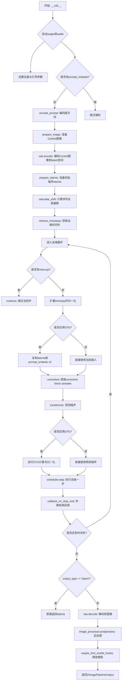

## 类结构

```
DiffusionPipeline (基类)
└── ZImageControlNetPipeline (继承自DiffusionPipeline和FromSingleFileMixin)
    ├── 组件模块:
    │   ├── FlowMatchEulerDiscreteScheduler (调度器)
    │   ├── AutoencoderKL (VAE)
    │   ├── PreTrainedModel (Text Encoder)
    │   ├── AutoTokenizer (分词器)
    │   ├── ZImageTransformer2DModel (Transformer)
    │   └── ZImageControlNetModel (ControlNet)
```

## 全局变量及字段


### `logger`
    
模块级别的日志记录器，用于输出调试和信息日志

类型：`logging.Logger`
    


### `EXAMPLE_DOC_STRING`
    
包含管道使用示例的文档字符串，展示如何加载模型和执行图像生成

类型：`str`
    


### `calculate_shift`
    
计算图像序列长度对应的移位值，用于调度器参数调整

类型：`function`
    


### `retrieve_latents`
    
从编码器输出中检索潜在向量，支持采样或argmax模式

类型：`function`
    


### `retrieve_timesteps`
    
从调度器获取时间步序列，支持自定义时间步和sigma值

类型：`function`
    


### `ZImageControlNetPipeline.model_cpu_offload_seq`
    
定义模型CPU卸载顺序的字符串，指定text_encoder->transformer->vae的卸载序列

类型：`str`
    


### `ZImageControlNetPipeline._optional_components`
    
可选组件列表，用于标识管道中非必需的模块

类型：`list`
    


### `ZImageControlNetPipeline._callback_tensor_inputs`
    
回调函数可访问的张量输入列表，包含latents和prompt_embeds

类型：`list`
    


### `ZImageControlNetPipeline.vae`
    
变分自编码器模型，负责潜在空间与图像空间的相互转换

类型：`AutoencoderKL`
    


### `ZImageControlNetPipeline.text_encoder`
    
文本编码器模型，将文本提示转换为文本嵌入向量

类型：`PreTrainedModel`
    


### `ZImageControlNetPipeline.tokenizer`
    
分词器，将文本字符串转换为token序列

类型：`AutoTokenizer`
    


### `ZImageControlNetPipeline.scheduler`
    
调度器，管理去噪过程中的时间步和噪声调度

类型：`FlowMatchEulerDiscreteScheduler`
    


### `ZImageControlNetPipeline.transformer`
    
主Transformer模型，执行潜在空间的去噪操作

类型：`ZImageTransformer2DModel`
    


### `ZImageControlNetPipeline.controlnet`
    
ControlNet模型，根据控制图像提供条件引导

类型：`ZImageControlNetModel`
    


### `ZImageControlNetPipeline.vae_scale_factor`
    
VAE缩放因子，用于计算图像下采样的尺度

类型：`int`
    


### `ZImageControlNetPipeline.image_processor`
    
图像处理器，负责图像的预处理和后处理操作

类型：`VaeImageProcessor`
    


### `ZImageControlNetPipeline._guidance_scale`
    
分类器自由引导尺度，控制文本提示对生成图像的影响程度

类型：`float`
    


### `ZImageControlNetPipeline._joint_attention_kwargs`
    
联合注意力参数字典，传递给注意力处理器配置

类型：`dict`
    


### `ZImageControlNetPipeline._interrupt`
    
中断标志，用于在去噪循环中暂停或终止生成过程

类型：`bool`
    


### `ZImageControlNetPipeline._cfg_normalization`
    
CFG归一化标志，控制是否对分类器自由引导预测进行归一化处理

类型：`bool`
    


### `ZImageControlNetPipeline._cfg_truncation`
    
CFG截断值，用于在指定时间点后禁用分类器自由引导

类型：`float`
    


### `ZImageControlNetPipeline._num_timesteps`
    
去噪过程的总时间步数，记录生成的迭代次数

类型：`int`
    
    

## 全局函数及方法


### `calculate_shift`

这是一个用于计算图像处理pipeline中scheduler的shift参数的全局辅助函数。该函数通过线性插值方法，根据图像序列长度（image_seq_len）在基础序列长度和最大序列长度之间计算相应的shift值，用于调整扩散模型的时间步调度。

参数：

- `image_seq_len`：`int`，图像序列长度，表示潜在空间中高宽尺寸的乘积除以4
- `base_seq_len`：`int`，基础序列长度，默认256，用于线性插值的起点
- `max_seq_len`：`int`，最大序列长度，默认4096，用于线性插值的终点
- `base_shift`：`float`，基础偏移量，默认0.5，对应base_seq_len时的shift值
- `max_shift`：`float`，最大偏移量，默认1.15，对应max_seq_len时的shift值

返回值：`float`，返回计算得到的mu值，用于scheduler的时间步调度

#### 流程图

```mermaid
flowchart TD
    A[开始] --> B[计算斜率 m = (max_shift - base_shift) / (max_seq_len - base_seq_len)]
    --> C[计算截距 b = base_shift - m * base_seq_len]
    --> D[计算 mu = image_seq_len * m + b]
    --> E[返回 mu]
    
    B -.-> F[线性插值公式]
    D -.-> F
```

#### 带注释源码

```python
# Copied from diffusers.pipelines.flux.pipeline_flux.calculate_shift
def calculate_shift(
    image_seq_len,         # 图像序列长度
    base_seq_len: int = 256,    # 基础序列长度，默认256
    max_seq_len: int = 4096,   # 最大序列长度，默认4096
    base_shift: float = 0.5,    # 基础偏移量，默认0.5
    max_shift: float = 1.15,    # 最大偏移量，默认1.15
):
    """
    计算图像处理pipeline中scheduler的shift参数。
    
    这是一个线性插值函数，用于根据图像序列长度计算mu值。
    在FLUX等扩散模型中，图像尺寸会影响最优的时间步调度，
    因此需要根据实际图像的序列长度动态调整shift参数。
    
    Args:
        image_seq_len: 图像序列长度，通常为 (height // 8) * (width // 8)
        base_seq_len: 基础序列长度，默认256
        max_seq_len: 最大序列长度，默认4096
        base_shift: 基础偏移量，默认0.5
        max_shift: 最大偏移量，默认1.15
    
    Returns:
        计算得到的mu值，用于调整scheduler的时间步
    """
    # 计算线性方程的斜率 m
    m = (max_shift - base_shift) / (max_seq_len - base_seq_len)
    
    # 计算线性方程的截距 b
    b = base_shift - m * base_seq_len
    
    # 根据图像序列长度计算最终的 mu 值
    mu = image_seq_len * m + b
    
    return mu
```


### `retrieve_latents`

该函数是一个工具函数，用于从编码器输出（encoder_output）中提取潜在表示（latents）。它支持三种模式：从潜在分布中采样、从潜在分布中获取最可能值（argmax）、或直接访问预存的潜在向量。这三种模式分别对应不同的生成策略和模型架构需求。

参数：

- `encoder_output`：`torch.Tensor`，编码器输出对象，可能包含 `latent_dist` 属性或 `latents` 属性
- `generator`：`torch.Generator | None`，可选的随机数生成器，用于采样时的随机性控制
- `sample_mode`：`str`，采样模式，默认为 "sample"，可选值为 "sample"（从分布采样）或 "argmax"（取分布峰值）

返回值：`torch.Tensor`，提取出的潜在表示张量

#### 流程图

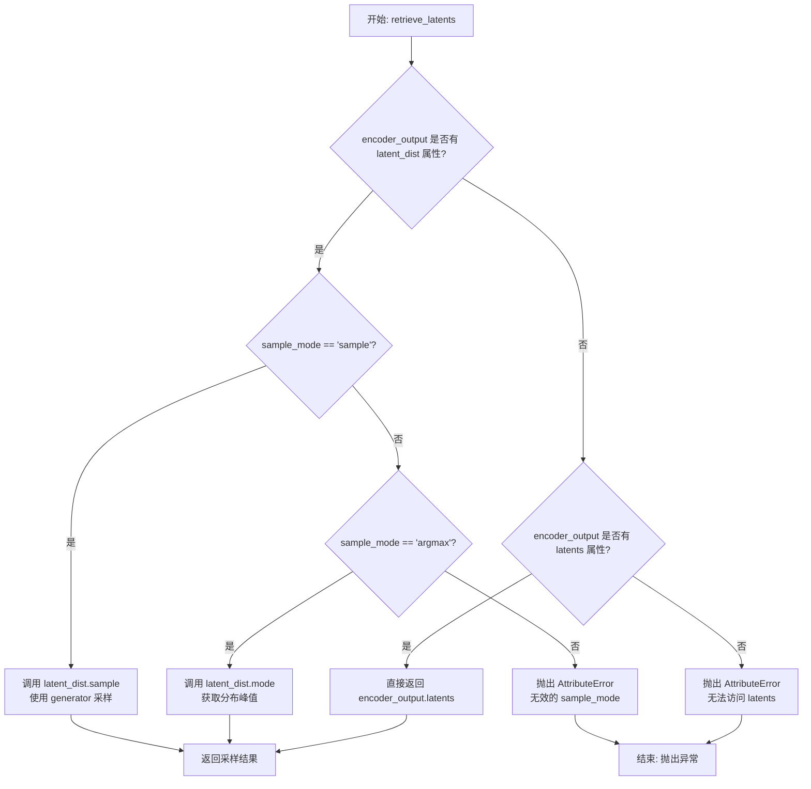

#### 带注释源码

```python
# 从稳定扩散 pipeline 中复制过来的工具函数
# 用于从编码器输出中提取潜在表示
def retrieve_latents(
    encoder_output: torch.Tensor,           # 编码器输出，包含潜在分布或潜在向量
    generator: torch.Generator | None = None,  # 可选的随机数生成器，控制采样随机性
    sample_mode: str = "sample"              # 采样模式：'sample'从分布采样，'argmax'取峰值
):
    # 情况1：如果编码器输出包含 latent_dist 属性，且模式为 sample
    # 从潜在分布中进行随机采样（利用高斯分布）
    if hasattr(encoder_output, "latent_dist") and sample_mode == "sample":
        return encoder_output.latent_dist.sample(generator)
    
    # 情况2：如果编码器输出包含 latent_dist 属性，且模式为 argmax
    # 获取潜在分布的峰值（最可能的潜在向量），用于确定性生成
    elif hasattr(encoder_output, "latent_dist") and sample_mode == "argmax":
        return encoder_output.latent_dist.mode()
    
    # 情况3：如果编码器输出直接包含 latents 属性
    # 直接返回预存的潜在向量（某些模型架构直接输出 latents）
    elif hasattr(encoder_output, "latents"):
        return encoder_output.latents
    
    # 错误处理：编码器输出不包含任何可访问的潜在表示
    else:
        raise AttributeError("Could not access latents of provided encoder_output")
```


### `retrieve_timesteps`

该函数是扩散管道中的通用时间步检索工具函数，用于调用调度器的 `set_timesteps` 方法并从调度器中检索时间步，支持自定义时间步或自定义 sigmas 两种方式来覆盖调度器的时间步间隔策略。

参数：

- `scheduler`：`SchedulerMixin`，要获取时间步的调度器对象
- `num_inference_steps`：`int | None`，使用预训练模型生成样本时使用的扩散步数，如果使用此参数则 `timesteps` 必须为 `None`
- `device`：`str | torch.device | None`，时间步要移动到的设备，如果为 `None` 则不移动
- `timesteps`：`list[int] | None`，用于覆盖调度器时间步间隔策略的自定义时间步，如果传入此参数则 `num_inference_steps` 和 `sigmas` 必须为 `None`
- `sigmas`：`list[float] | None`，用于覆盖调度器时间步间隔策略的自定义 sigmas，如果传入此参数则 `num_inference_steps` 和 `timesteps` 必须为 `None`
- `**kwargs`：任意关键字参数，将传递给调度器的 `set_timesteps` 方法

返回值：`tuple[torch.Tensor, int]`，元组中第一个元素是调度器的时间步调度，第二个元素是推理步数

#### 流程图

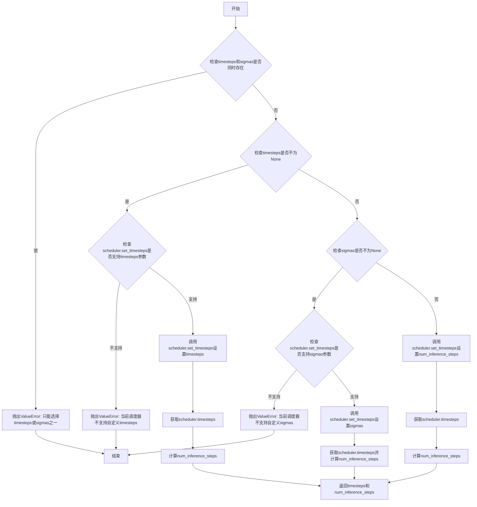

#### 带注释源码

```
# 从 diffusers.pipelines.stable_diffusion.pipeline_stable_diffusion 复制的函数
def retrieve_timesteps(
    scheduler,  # 调度器对象，用于生成时间步
    num_inference_steps: int | None = None,  # 推理步数，如果提供则timesteps必须为None
    device: str | torch.device | None = None,  # 目标设备，用于移动时间步
    timesteps: list[int] | None = None,  # 自定义时间步列表
    sigmas: list[float] | None = None,  # 自定义sigma列表
    **kwargs,  # 额外参数，传递给scheduler.set_timesteps
):
    r"""
    调用调度器的 `set_timesteps` 方法并在调用后从调度器检索时间步。
    处理自定义时间步。任何 kwargs 都将提供给 `scheduler.set_timesteps`。

    参数:
        scheduler (SchedulerMixin): 获取时间步的调度器。
        num_inference_steps (int): 使用预训练模型生成样本时使用的扩散步数。
            如果使用此参数，`timesteps` 必须为 None。
        device (str 或 torch.device, 可选): 时间步应移动到的设备。
            如果为 None，时间步不会移动。
        timesteps (list[int], 可选): 用于覆盖调度器时间步间隔策略的自定义时间步。
            如果传入 `timesteps`，则 `num_inference_steps` 和 `sigmas` 必须为 None。
        sigmas (list[float], 可选): 用于覆盖调度器时间步间隔策略的自定义 sigmas。
            如果传入 `sigmas`，则 `num_inference_steps` 和 `timesteps` 必须为 None。

    返回:
        tuple[torch.Tensor, int]: 元组，第一个元素是调度器的时间步调度，第二个元素是推理步数。
    """
    # 校验：timesteps 和 sigmas 不能同时提供
    if timesteps is not None and sigmas is not None:
        raise ValueError("Only one of `timesteps` or `sigmas` can be passed. Please choose one to set custom values")
    
    # 分支1：处理自定义 timesteps
    if timesteps is not None:
        # 检查调度器的 set_timesteps 方法是否接受 timesteps 参数
        accepts_timesteps = "timesteps" in set(inspect.signature(scheduler.set_timesteps).parameters.keys())
        if not accepts_timesteps:
            raise ValueError(
                f"The current scheduler class {scheduler.__class__}'s `set_timesteps` does not support custom"
                f" timestep schedules. Please check whether you are using the correct scheduler."
            )
        # 调用调度器设置自定义时间步
        scheduler.set_timesteps(timesteps=timesteps, device=device, **kwargs)
        # 从调度器获取生成的时间步
        timesteps = scheduler.timesteps
        # 计算推理步数
        num_inference_steps = len(timesteps)
    
    # 分支2：处理自定义 sigmas
    elif sigmas is not None:
        # 检查调度器的 set_timesteps 方法是否接受 sigmas 参数
        accept_sigmas = "sigmas" in set(inspect.signature(scheduler.set_timesteps).parameters.keys())
        if not accept_sigmas:
            raise ValueError(
                f"The current scheduler class {scheduler.__class__}'s `set_timesteps` does not support custom"
                f" sigmas schedules. Please check whether you are using the correct scheduler."
            )
        # 调用调度器设置自定义 sigmas
        scheduler.set_timesteps(sigmas=sigmas, device=device, **kwargs)
        # 从调度器获取生成的时间步
        timesteps = scheduler.timesteps
        # 计算推理步数
        num_inference_steps = len(timesteps)
    
    # 分支3：使用默认行为（通过 num_inference_steps 设置）
    else:
        # 调用调度器设置推理步数
        scheduler.set_timesteps(num_inference_steps, device=device, **kwargs)
        # 从调度器获取生成的时间步
        timesteps = scheduler.timesteps
    
    # 返回时间步调度和推理步数
    return timesteps, num_inference_steps
```


### ZImageControlNetPipeline.__init__

ZImageControlNetPipeline 的初始化方法，负责接收并注册扩散管道所需的核心组件（调度器、VAE、文本编码器、分词器、Transformer 和 ControlNet），并配置图像处理器的缩放因子。

参数：

- `scheduler`：`FlowMatchEulerDiscreteScheduler`，用于扩散过程的噪声调度器
- `vae`：`AutoencoderKL`，变分自编码器，用于潜在空间的编码和解码
- `text_encoder`：`PreTrainedModel`，预训练的文本编码器，将文本提示转换为嵌入向量
- `tokenizer`：`AutoTokenizer`，分词器，用于将文本分割为 token 序列
- `transformer`：`ZImageTransformer2DModel`，Z-Image 变换器模型，执行去噪预测
- `controlnet`：`ZImageControlNetModel`，ControlNet 模型，提供图像条件控制信息

返回值：`None`，该方法为构造函数，不返回任何值

#### 流程图

```mermaid
flowchart TD
    A[开始 __init__] --> B[调用 super().__init__ 初始化基类]
    B --> C[从 Transformer 转换 ControlNet 模型]
    C --> D[register_modules 注册所有模块]
    D --> E[计算 vae_scale_factor]
    E --> F[创建 VaeImageProcessor]
    F --> G[结束 __init__]
```

#### 带注释源码

```
def __init__(
    self,
    scheduler: FlowMatchEulerDiscreteScheduler,
    vae: AutoencoderKL,
    text_encoder: PreTrainedModel,
    tokenizer: AutoTokenizer,
    transformer: ZImageTransformer2DModel,
    controlnet: ZImageControlNetModel,
):
    # 1. 调用父类 DiffusionPipeline 的初始化方法
    #    设置基本的管道配置和属性
    super().__init__()
    
    # 2. 将 ControlNet 模型从 Transformer 转换而来
    #    确保 ControlNet 与 Transformer 的配置兼容
    controlnet = ZImageControlNetModel.from_transformer(controlnet, transformer)

    # 3. 注册所有模块到管道中
    #    这些模块将通过 self.xxx 访问
    #    例如 self.vae, self.transformer 等
    self.register_modules(
        vae=vae,
        text_encoder=text_encoder,
        tokenizer=tokenizer,
        scheduler=scheduler,
        transformer=transformer,
        controlnet=controlnet,
    )
    
    # 4. 计算 VAE 缩放因子
    #    基于 VAE 的 block_out_channels 计算下采样因子
    #    默认值为 8（如果 VAE 不可用）
    self.vae_scale_factor = (
        2 ** (len(self.vae.config.block_out_channels) - 1) if hasattr(self, "vae") and self.vae is not None else 8
    )
    
    # 5. 创建图像处理器
    #    使用两倍的 vae_scale_factor 以适应双阶段处理
    self.image_processor = VaeImageProcessor(vae_scale_factor=self.vae_scale_factor * 2)
```


### `ZImageControlNetPipeline.encode_prompt`

该方法是 `ZImageControlNetPipeline` 的核心组成，负责将文本 prompt 转换为神经网络可处理的 embedding 向量。它首先检查是否需要生成新的 embedding，若需要，则调用内部方法 `_encode_prompt` 进行处理。此外，该方法还支持 Classifier-Free Guidance (CFG) 技术，通过同时编码正向和负向 prompt 来引导模型生成更符合预期的图像。在编码过程中，它利用 tokenizer 的聊天模板功能，并从 text_encoder 的倒数第二层提取特征。

参数：

-  `prompt`：`str | list[str]`，要编码的文本提示，可以是单个字符串或字符串列表。
-  `device`：`torch.device | None`，指定运行设备，默认为 None（自动获取当前执行设备）。
-  `do_classifier_free_guidance`：`bool`，是否启用无分类器指导（CFG），默认为 True。
-  `negative_prompt`：`str | list[str] | None`，负向提示，用于指导模型避免生成的内容，默认为 None。
-  `prompt_embeds`：`list[torch.FloatTensor] | None`，预先编码好的提示 embedding，如果提供则直接使用，跳过编码步骤，默认为 None。
-  `negative_prompt_embeds`：`torch.FloatTensor | None`，预先编码好的负向提示 embedding，默认为 None。
-  `max_sequence_length`：`int`，最大序列长度，默认为 512。

返回值：`tuple[list[torch.FloatTensor], list[torch.FloatTensor]]`，返回一个元组，包含两个元素：第一个是编码后的正向提示 embedding 列表，第二个是编码后的负向提示 embedding 列表。

#### 流程图

```mermaid
graph TD
    A([Start]) --> B[Normalize prompt to list]
    B --> C{Is prompt_embeds provided?}
    C -- Yes --> D[Return provided prompt_embeds]
    C -- No --> E[Call _encode_prompt to encode prompt]
    E --> F{Is do_classifier_free_guidance True?}
    
    F -- Yes --> G{Is negative_prompt None?}
    G -- Yes --> H[negative_prompt = [empty string] * len(prompt)]
    G -- No --> I[Normalize negative_prompt to list]
    H --> J[Assert len(prompt) == len(negative_prompt)]
    I --> J
    J --> K[Call _encode_prompt to encode negative_prompt]
    
    F -- No --> L[negative_prompt_embeds = empty list]
    
    K --> M[Return prompt_embeds, negative_prompt_embeds]
    L --> M
    D --> M
```

#### 带注释源码

```python
def encode_prompt(
    self,
    prompt: str | list[str],
    device: torch.device | None = None,
    do_classifier_free_guidance: bool = True,
    negative_prompt: str | list[str] | None = None,
    prompt_embeds: list[torch.FloatTensor] | None = None,
    negative_prompt_embeds: torch.FloatTensor | None = None,
    max_sequence_length: int = 512,
):
    # 1. 预处理 prompt：如果是单个字符串则转换为列表
    prompt = [prompt] if isinstance(prompt, str) else prompt

    # 2. 调用内部方法 _encode_prompt 进行实际的编码
    #    这里体现了编码与聊天的分离，encode_prompt 负责流程控制
    prompt_embeds = self._encode_prompt(
        prompt=prompt,
        device=device,
        prompt_embeds=prompt_embeds,
        max_sequence_length=max_sequence_length,
    )

    # 3. 处理 Classifier-Free Guidance (CFG)
    if do_classifier_free_guidance:
        # 如果没有提供负向 prompt，则默认为空字符串
        if negative_prompt is None:
            negative_prompt = ["" for _ in prompt]
        else:
            # 同样规范化为列表
            negative_prompt = [negative_prompt] if isinstance(negative_prompt, str) else negative_prompt
        
        # 长度一致性检查，确保正负 prompt 一一对应
        assert len(prompt) == len(negative_prompt)
        
        # 编码负向 prompt
        negative_prompt_embeds = self._encode_prompt(
            prompt=negative_prompt,
            device=device,
            prompt_embeds=negative_prompt_embeds,
            max_sequence_length=max_sequence_length,
        )
    else:
        # 不使用 CFG 时，负向 embedding 为空列表
        negative_prompt_embeds = []

    # 4. 返回编码结果
    return prompt_embeds, negative_prompt_embeds
```


### `ZImageControlNetPipeline._encode_prompt`

该方法负责将文本提示（prompt）编码为文本嵌入向量（text embeddings），供后续的图像生成流程使用。它首先检查是否已有预计算的嵌入，若无则通过分词器和文本编码器生成新的嵌入。

参数：

- `self`：隐式参数，指向 `ZImageControlNetPipeline` 实例本身
- `prompt`：`str | list[str]`，要编码的文本提示，可以是单个字符串或字符串列表
- `device`：`torch.device | None`，指定计算设备，若为 `None` 则使用执行设备
- `prompt_embeds`：`list[torch.FloatTensor] | None`，可选的预计算文本嵌入，若提供则直接返回
- `max_sequence_length`：`int`，最大序列长度，默认为 512

返回值：`list[torch.FloatTensor]`，编码后的文本嵌入列表，每个元素对应一个提示的嵌入向量

#### 流程图

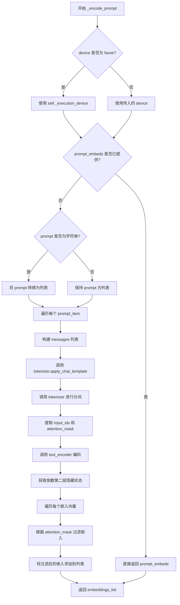

#### 带注释源码

```python
def _encode_prompt(
    self,
    prompt: str | list[str],
    device: torch.device | None = None,
    prompt_embeds: list[torch.FloatTensor] | None = None,
    max_sequence_length: int = 512,
) -> list[torch.FloatTensor]:
    """
    编码文本提示为嵌入向量
    
    参数:
        prompt: 要编码的文本提示
        device: 计算设备
        prompt_embeds: 预计算的嵌入（可选）
        max_sequence_length: 最大序列长度
    
    返回:
        文本嵌入列表
    """
    # 如果未指定设备，则使用管道的执行设备
    device = device or self._execution_device

    # 如果已经提供了嵌入，直接返回（避免重复计算）
    if prompt_embeds is not None:
        return prompt_embeds

    # 统一处理：确保 prompt 是列表格式
    if isinstance(prompt, str):
        prompt = [prompt]

    # 遍历每个提示，应用聊天模板并添加生成提示
    for i, prompt_item in enumerate(prompt):
        # 构建消息格式（用于聊天模板）
        messages = [
            {"role": "user", "content": prompt_item},
        ]
        # 应用聊天模板，启用思考模式
        prompt_item = self.tokenizer.apply_chat_template(
            messages,
            tokenize=False,          # 不进行分词，只返回格式化后的文本
            add_generation_prompt=True,  # 添加生成提示
            enable_thinking=True,    # 启用思考功能
        )
        prompt[i] = prompt_item

    # 使用 tokenizer 将文本转换为模型输入格式
    text_inputs = self.tokenizer(
        prompt,
        padding="max_length",       # 填充到最大长度
        max_length=max_sequence_length,  # 最大序列长度
        truncation=True,            # 截断超长文本
        return_tensors="pt",        # 返回 PyTorch 张量
    )

    # 将输入 ID 和注意力掩码移动到指定设备
    text_input_ids = text_inputs.input_ids.to(device)
    prompt_masks = text_inputs.attention_mask.to(device).bool()

    # 调用文本编码器获取隐藏状态
    # output_hidden_states=True 确保返回所有隐藏状态
    prompt_embeds = self.text_encoder(
        input_ids=text_input_ids,
        attention_mask=prompt_masks,
        output_hidden_states=True,
    ).hidden_states[-2]  # 取倒数第二层隐藏状态

    # 处理每个嵌入向量，根据注意力掩码过滤无效位置
    embeddings_list = []
    for i in range(len(prompt_embeds)):
        # 只保留有效token的嵌入（根据 attention_mask）
        embeddings_list.append(prompt_embeds[i][prompt_masks[i]])

    return embeddings_list
```


### `ZImageControlNetPipeline.prepare_latents`

该方法用于为图像生成流程准备初始潜在向量（latents），根据指定的批量大小、通道数、高度和宽度创建或验证潜在向量，并确保其形状符合模型要求。

参数：

- `batch_size`：`int`，批量大小，即一次生成图像的数量
- `num_channels_latents`：`int`，潜在向量的通道数，对应于Transformer模型的输入通道数
- `height`：`int`，生成图像的高度（像素），会被调整为适配VAE的尺度
- `width`：`int`，生成图像的宽度（像素），会被调整为适配VAE的尺度
- `dtype`：`torch.dtype`，潜在向量的数据类型（如torch.float32）
- `device`：`torch.device`，潜在向量所在的设备（如cuda或cpu）
- `generator`：`torch.Generator | None`，用于生成随机数的生成器，以确保可重复性
- `latents`：`torch.FloatTensor | None`，可选的预生成潜在向量，如果为None则随机生成

返回值：`torch.Tensor`，处理后的潜在向量张量，形状为(batch_size, num_channels_latents, height, width)

#### 流程图

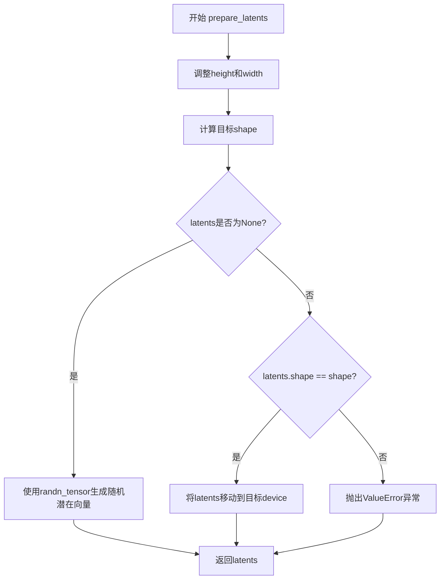

#### 带注释源码

```python
def prepare_latents(
    self,
    batch_size,              # int: 批量大小
    num_channels_latents,    # int: 潜在向量通道数
    height,                  # int: 图像高度
    width,                   # int: 图像宽度
    dtype,                   # torch.dtype: 数据类型
    device,                  # torch.device: 设备
    generator,               # torch.Generator | None: 随机生成器
    latents=None,            # torch.FloatTensor | None: 可选的预生成latents
):
    # 根据VAE的缩放因子调整高度和宽度，确保与VAE解码器兼容
    # 乘以2是因为latent空间的尺寸是像素空间的1/(vae_scale_factor*2)
    height = 2 * (int(height) // (self.vae_scale_factor * 2))
    width = 2 * (int(width) // (self.vae_scale_factor * 2))

    # 构建期望的潜在向量形状
    shape = (batch_size, num_channels_latents, height, width)

    # 如果没有提供latents，则随机生成
    if latents is None:
        latents = randn_tensor(shape, generator=generator, device=device, dtype=dtype)
    else:
        # 验证提供的latents形状是否匹配预期
        if latents.shape != shape:
            raise ValueError(f"Unexpected latents shape, got {latents.shape}, expected {shape}")
        # 确保latents在正确的设备上
        latents = latents.to(device)
    
    return latents
```


### `ZImageControlNetPipeline.prepare_image`

该方法用于准备和预处理控制网络（ControlNet）的输入图像。它接收原始图像或图像张量，进行尺寸调整、批次复制、设备转移和数据类型转换，以适配后续 ControlNet 的推理流程。

参数：

- `self`：隐式参数，指向 ZImageControlNetPipeline 实例
- `image`：`torch.Tensor | PipelineImageInput`，输入的控制图像，可以是原始图像列表，也可以是预处理后的张量
- `width`：`int`，目标图像宽度（像素）
- `height`：`int`，目标图像高度（像素）
- `batch_size`：`int`，提示词的批次大小，用于确定图像重复次数
- `num_images_per_prompt`：`int`，每个提示词生成的图像数量
- `device`：`torch.device`，图像要转移到的目标设备（如 CUDA 或 CPU）
- `dtype`：`torch.dtype`，图像的目标数据类型（如 bfloat16）
- `do_classifier_free_guidance`：`bool`，是否启用无分类器引导，默认为 False
- `guess_mode`：`bool`，猜测模式标志，默认为 False

返回值：`torch.Tensor`，处理后的图像张量，形状为 [batch_size * num_images_per_prompt, C, H, W]，如果启用 CFG 则形状翻倍

#### 流程图

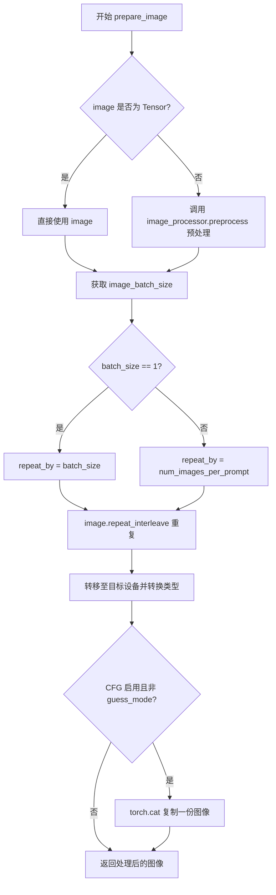

#### 带注释源码

```python
# Copied from diffusers.pipelines.controlnet_sd3.pipeline_stable_diffusion_3_controlnet.StableDiffusion3ControlNetPipeline.prepare_image
def prepare_image(
    self,
    image,
    width,
    height,
    batch_size,
    num_images_per_prompt,
    device,
    dtype,
    do_classifier_free_guidance=False,
    guess_mode=False,
):
    # 判断输入图像是否为 PyTorch 张量
    if isinstance(image, torch.Tensor):
        # 如果已是张量，直接使用
        pass
    else:
        # 否则调用图像处理器进行预处理（调整尺寸、归一化等）
        image = self.image_processor.preprocess(image, height=height, width=width)

    # 获取图像批次大小
    image_batch_size = image.shape[0]

    # 确定图像重复次数
    if image_batch_size == 1:
        # 单张图像时，重复 batch_size 次以匹配提示词数量
        repeat_by = batch_size
    else:
        # 图像批次大小与提示词批次大小相同时，使用 num_images_per_prompt
        repeat_by = num_images_per_prompt

    # 按指定维度重复图像张量
    image = image.repeat_interleave(repeat_by, dim=0)

    # 将图像转移至目标设备并转换数据类型
    image = image.to(device=device, dtype=dtype)

    # 如果启用无分类器引导且不在猜测模式，拼接图像用于 CFG
    # 拼接后的第一份用于条件输入，第二份用于无条件输入
    if do_classifier_free_guidance and not guess_mode:
        image = torch.cat([image] * 2)

    return image
```


### `ZImageControlNetPipeline.guidance_scale`

这是一个属性方法，用于获取当前管道的guidance_scale（分类器自由引导尺度）值。该属性返回在图像生成过程中使用的guidance_scale参数，该参数控制文本提示对生成图像的影响程度。

参数：

- （无参数，这是一个属性getter）

返回值：`float`，返回当前设置的guidance_scale值，用于控制分类器自由引导（CFG）的强度。值越大，生成的图像与文本提示的关联性越强，但可能导致图像质量下降。

#### 流程图

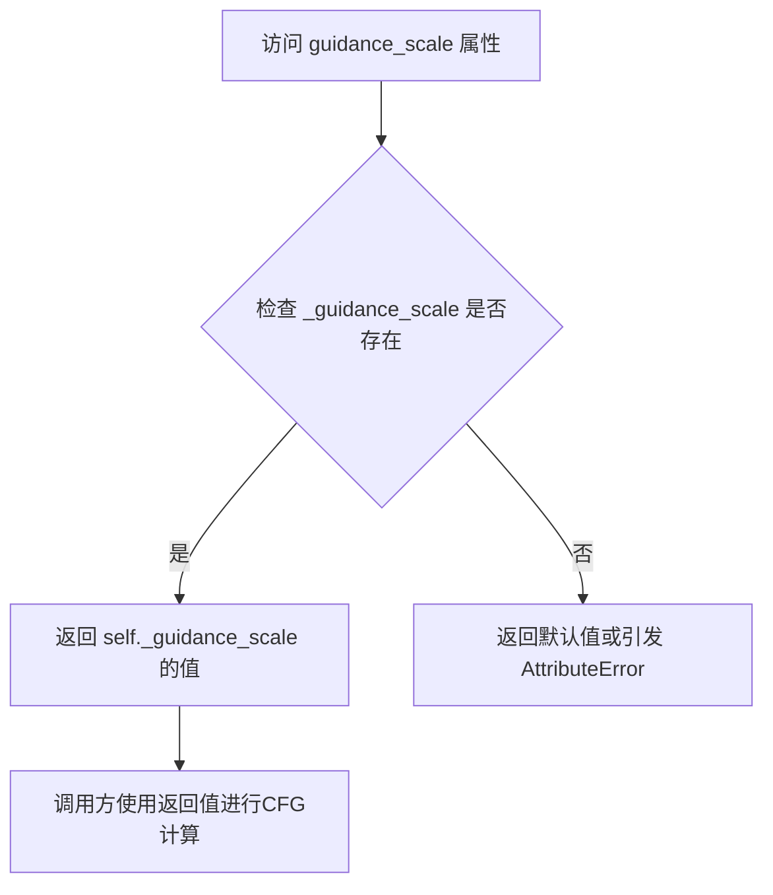

#### 带注释源码

```python
@property
def guidance_scale(self):
    """
    属性方法：获取当前guidance_scale值
    
    guidance_scale是分类器自由扩散引导（Classifier-Free Diffusion Guidance）
    中的关键参数。在图像生成过程中，该参数决定了文本提示对生成结果的影响程度。
    
    工作原理：
    - 当 guidance_scale > 1 时，启用分类器自由引导
    - 较高的值会使生成的图像更紧密地跟随文本提示
    - 较低的值（接近1）会减少引导效果，生成更多样化的图像
    
    在此类中，该值通过 __call__ 方法的 guidance_scale 参数设置，
    并存储在 self._guidance_scale 实例变量中。
    
    Returns:
        float: 当前使用的guidance_scale值
    """
    return self._guidance_scale
```


### `ZImageControlNetPipeline.do_classifier_free_guidance`

该属性是一个只读属性，用于判断当前管道是否启用无分类器引导（Classifier-Free Guidance，CFG）。它通过比较内部存储的 guidance_scale 值与 1 来决定返回值，当 guidance_scale 大于 1 时表示启用 CFG 模式。

参数：该属性不接受任何参数

返回值：`bool`，返回 True 表示启用无分类器引导（guidance_scale > 1），返回 False 表示禁用（guidance_scale <= 1）

#### 流程图

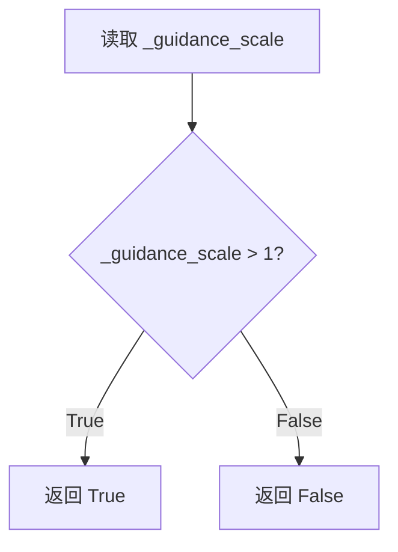

#### 带注释源码

```python
@property
def do_classifier_free_guidance(self):
    """
    属性：do_classifier_free_guidance
    
    用途：判断是否启用无分类器引导（Classifier-Free Guidance）
    
    工作原理：
    - 读取内部存储的 guidance_scale 值（self._guidance_scale）
    - 当 guidance_scale > 1 时，返回 True，表示启用 CFG
    - 当 guidance_scale <= 1 时，返回 False，表示禁用 CFG
    
    注意：
    - 这是一个只读属性，没有 setter
    - guidance_scale 在 __call__ 方法中被设置为参数传入的值
    - 该属性用于在去噪循环中决定是否执行 CFG 操作
    
    返回值类型：bool
    """
    return self._guidance_scale > 1
```


### `ZImageControlNetPipeline.joint_attention_kwargs`

该属性是 `ZImageControlNetPipeline` 类的只读属性 getter，用于获取在管道调用时设置的联合注意力机制（joint attention）参数 kwargs。这些参数会被传递到 `AttentionProcessor` 中，用于控制注意力机制的行为。

参数：无（属性访问不需要参数）

返回值：`dict[str, Any] | None`，返回联合注意力机制的参数字典。如果未设置，则返回 `None`。

#### 流程图

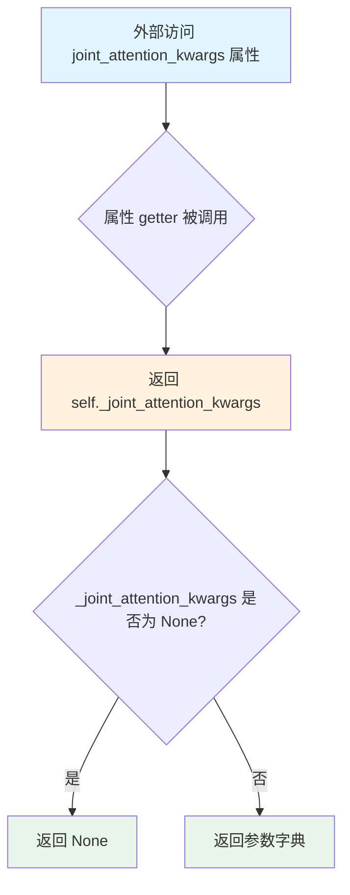

#### 带注释源码

```python
@property
def joint_attention_kwargs(self):
    """联合注意力机制参数字典的只读属性 getter。
    
    该属性返回在管道调用 __call__ 时传入的 joint_attention_kwargs 参数。
    这些参数会被传递到 AttentionProcessor 中，用于自定义注意力机制的行为，
    例如启用 flash attention、设置注意力掩码等。
    
    Returns:
        dict[str, Any] | None: 联合注意力机制的参数字典。如果未设置则返回 None。
    """
    return self._joint_attention_kwargs
```

#### 关联信息

| 项目 | 描述 |
|------|------|
| 定义位置 | `ZImageControlNetPipeline` 类内部 |
| 设置位置 | `__call__` 方法中 `self._joint_attention_kwargs = joint_attention_kwargs` |
| 参数来源 | `__call__` 方法的 `joint_attention_kwargs: dict[str, Any] | None = None` 参数 |
| 用途 | 传递给 `AttentionProcessor` 以自定义注意力行为 |
| 初始值 | `None` |


### `ZImageControlNetPipeline.num_timesteps`

该属性是一个只读的实例属性，用于返回当前管道的推理步数。它在 `__call__` 方法中被设置为 `len(timesteps)`，即扩散模型在生成图像时需要执行的去噪步数。这个属性允许外部代码查询管道已执行或计划执行的推理步骤数量。

参数：

- 该属性不接受任何参数

返回值：`int`，返回管道执行推理过程中的时间步总数。

#### 流程图

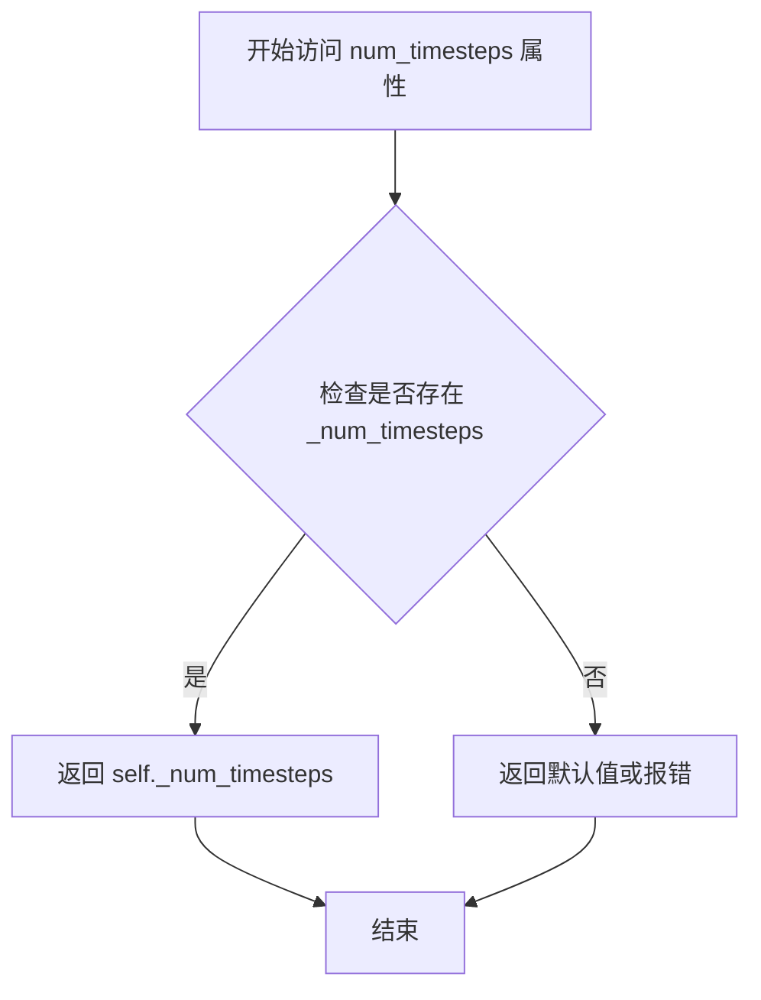

#### 带注释源码

```python
@property
def num_timesteps(self):
    """
    属性 getter 方法，用于获取管道的推理步数。
    
    这个属性在 __call__ 方法中被赋值：
    self._num_timesteps = len(timesteps)
    
    Returns:
        int: 返回扩散过程的时间步数量，即去噪推理的步数。
    """
    return self._num_timesteps
```


### `ZImageControlNetPipeline.interrupt`

该属性是一个只读属性，用于获取管道的停止标志。在去噪循环中通过检查 `self.interrupt` 的值来判断是否需要跳过当前迭代，从而实现中断管道执行的功能。

参数：无（属性访问不需要参数）

返回值：`bool`，返回 `_interrupt` 属性的值，表示是否请求中断管道执行。

#### 流程图

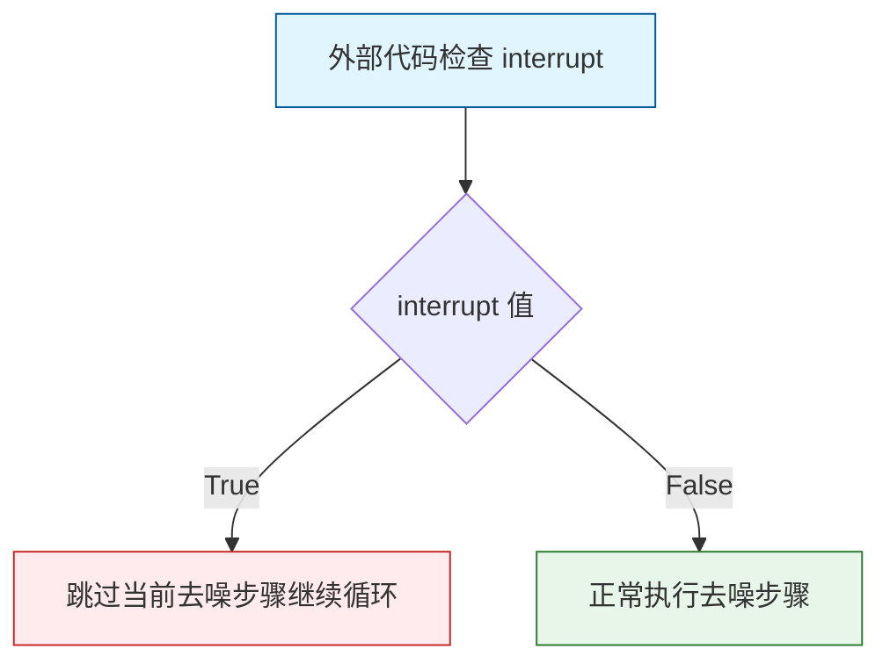

#### 带注释源码

```python
@property
def interrupt(self):
    """
    属性 getter：获取管道的中断标志。
    
    该属性在 __call__ 方法的去噪循环中被检查：
        if self.interrupt:
            continue
    
    当 _interrupt 被设置为 True 时，管道会在下一次迭代开始时
    跳过去噪步骤，但会继续执行完整个循环结构（而不是立即退出），
    这样可以确保资源清理等逻辑能够正常执行。
    
    Returns:
        bool: 中断标志。如果为 True，表示请求中断管道执行；
              如果为 False，表示管道应继续正常运行。
    """
    return self._interrupt
```


### `ZImageControlNetPipeline.__call__`

该方法是 Z-Image ControlNet 管道的主入口，接收文本提示词和控制图像，通过多个去噪步骤利用 ControlNet 和 Transformer 模型生成与文本提示词和控制图像条件相匹配的图像。支持 Classifier-Free Guidance (CFG) 引导、CFG 归一化和截断控制、图像潜在向量的自定义输入、以及推理过程中的回调机制，最终返回生成的图像或潜在向量。

参数：

- `prompt`：`str | list[str]`，用于引导图像生成的提示词，若未定义则必须传递 `prompt_embeds`
- `height`：`int | None`，生成图像的高度（像素），默认 1024
- `width`：`int | None`，生成图像的宽度（像素），默认 1024
- `num_inference_steps`：`int`，去噪步数，默认 50
- `sigmas`：`list[float] | None`，自定义 sigma 值，用于支持 sigmas 调度的调度器
- `guidance_scale`：`float`，CFG 引导比例，默认 5.0
- `control_image`：`PipelineImageInput`，控制网络的输入条件图像
- `controlnet_conditioning_scale`：`float | list[float]`，ControlNet 条件比例，默认 0.75
- `cfg_normalization`：`bool`，是否应用配置归一化，默认 False
- `cfg_truncation`：`float`，配置截断值，默认 1.0
- `negative_prompt`：`str | list[str] | None`，不引导图像生成的负面提示词
- `num_images_per_prompt`：`int`，每个提示词生成的图像数量，默认 1
- `generator`：`torch.Generator | list[torch.Generator]`，用于生成确定性结果的随机生成器
- `latents`：`torch.FloatTensor | None`，预生成的噪声潜在向量，用于图像生成
- `prompt_embeds`：`list[torch.FloatTensor] | None`，预生成的文本嵌入
- `negative_prompt_embeds`：`list[torch.FloatTensor] | None`，预生成的负面文本嵌入
- `output_type`：`str | None`，生成图像的输出格式，默认 "pil"
- `return_dict`：`bool`，是否返回 `ZImagePipelineOutput`，默认 True
- `joint_attention_kwargs`：`dict[str, Any] | None`，传递给 AttentionProcessor 的参数字典
- `callback_on_step_end`：`Callable[[int, int], None] | None`，每个去噪步骤结束时调用的函数
- `callback_on_step_end_tensor_inputs`：`list[str]`，回调函数接收的张量输入列表，默认 ["latents"]
- `max_sequence_length`：`int`，提示词最大序列长度，默认 512

返回值：`ZImagePipelineOutput | tuple`，当 `return_dict` 为 True 时返回 `ZImagePipelineOutput`（包含生成的图像列表），否则返回元组（第一个元素为图像列表）

#### 流程图

```mermaid
flowchart TD
    A[开始 __call__] --> B{检查 prompt_embeds 是否存在且 prompt 为 None}
    B -->|是| C{验证 negative_prompt_embeds 是否存在}
    B -->|否| D[调用 encode_prompt 生成提示词嵌入]
    C -->|否| E[抛出 ValueError 异常]
    C -->|是| F[继续执行]
    
    D --> F
    E --> F
    
    F --> G[准备控制图像: prepare_image]
    G --> H[使用 VAE 编码控制图像 retrieve_latents]
    H --> I[应用 VAE scaling 和 shift]
    J[准备潜在向量: prepare_latents] --> K
    
    I --> K[重复 prompt_embeds num_images_per_prompt 次]
    K --> L[计算 image_seq_len]
    L --> M[计算 schedule shift: calculate_shift]
    M --> N[设置调度器时间步: retrieve_timesteps]
    N --> O[进入去噪循环]
    
    O --> P{当前步骤 < 总步骤数?}
    P -->|是| Q[广播 timestep 到批次维度]
    Q --> R[归一化时间 t_norm]
    S{检查 CFG 截断条件} -->|满足| T[设置 current_guidance_scale = 0]
    S -->|不满足| U[保持 current_guidance_scale]
    
    T --> V
    U --> V{apply_cfg = do_CFG 且 guidance > 0}
    
    V -->|是| W[复制 latents x2, prompt_embeds x2, timestep x2, control_image x2]
    V -->|否| X[直接使用原始输入]
    
    W --> Y[调用 ControlNet 获取控制块样本]
    X --> Y
    
    Y --> Z[调用 Transformer 获取模型输出]
    Z --> AA{apply_cfg?}
    AA -->|是| AB[分离正负输出, 应用 CFG 公式]
    AA -->|否| AC[直接堆叠输出为 noise_pred]
    
    AB --> AD[可选的 Renormalization 归一化]
    AD --> AE[取负值, 计算上一步 x_t-1]
    AC --> AE
    
    AE --> AF[调度器 step 更新 latents]
    AF --> AG{回调函数存在?}
    AG -->|是| AH[调用 callback_on_step_end]
    AH --> AI[更新 latents 和 prompt_embeds]
    AG -->|否| AJ[检查是否需要进度条更新]
    
    AI --> AJ
    AJ -->|是| AK[更新 progress_bar]
    AK --> AL[返回循环开始]
    AJ -->|否| AL
    
    AL -->|否| AM[去噪循环完成]
    AM --> AN{output_type == 'latent'?}
    AN -->|是| AO[直接使用 latents 作为图像]
    AN -->|否| AP[解码 latents: latents / scaling + shift]
    AP --> AQ[VAE decode]
    AQ --> AR[后处理图像]
    
    AO --> AS[释放模型钩子]
    AR --> AS
    
    AS --> AT{return_dict?}
    AT -->|是| AU[返回 ZImagePipelineOutput]
    AT -->|否| AV[返回元组 (images,)]
    
    AU --> AV
    AV --> AX[结束]
```

#### 带注释源码

```python
@torch.no_grad()
@replace_example_docstring(EXAMPLE_DOC_STRING)
def __call__(
    self,
    prompt: str | list[str] = None,
    height: int | None = None,
    width: int | None = None,
    num_inference_steps: int = 50,
    sigmas: list[float] | None = None,
    guidance_scale: float = 5.0,
    control_image: PipelineImageInput = None,
    controlnet_conditioning_scale: float | list[float] = 0.75,
    cfg_normalization: bool = False,
    cfg_truncation: float = 1.0,
    negative_prompt: str | list[str] | None = None,
    num_images_per_prompt: int | None = 1,
    generator: torch.Generator | list[torch.Generator] | None = None,
    latents: torch.FloatTensor | None = None,
    prompt_embeds: list[torch.FloatTensor] | None = None,
    negative_prompt_embeds: list[torch.FloatTensor] | None = None,
    output_type: str | None = "pil",
    return_dict: bool = True,
    joint_attention_kwargs: dict[str, Any] | None = None,
    callback_on_step_end: Callable[[int, int], None] | None = None,
    callback_on_step_end_tensor_inputs: list[str] = ["latents"],
    max_sequence_length: int = 512,
):
    # 1. 设置默认图像尺寸
    height = height or 1024
    width = width or 1024

    # 2. 验证图像尺寸是否可被 VAE 缩放因子整除
    vae_scale = self.vae_scale_factor * 2
    if height % vae_scale != 0:
        raise ValueError(
            f"Height must be divisible by {vae_scale} (got {height}). "
            f"Please adjust the height to a multiple of {vae_scale}."
        )
    if width % vae_scale != 0:
        raise ValueError(
            f"Width must be divisible by {vae_scale} (got {width}). "
            f"Please adjust the width to a multiple of {vae_scale}."
        )

    # 3. 获取执行设备并设置内部状态
    device = self._execution_device

    self._guidance_scale = guidance_scale
    self._joint_attention_kwargs = joint_attention_kwargs
    self._interrupt = False
    self._cfg_normalization = cfg_normalization
    self._cfg_truncation = cfg_truncation
    
    # 4. 确定批次大小
    if prompt is not None and isinstance(prompt, str):
        batch_size = 1
    elif prompt is not None and isinstance(prompt, list):
        batch_size = len(prompt)
    else:
        batch_size = len(prompt_embeds)

    # 5. 处理提示词嵌入：验证或编码
    if prompt_embeds is not None and prompt is None:
        # 如果只提供了 prompt_embeds 而没有 prompt，必须提供 negative_prompt_embeds
        if self.do_classifier_free_guidance and negative_prompt_embeds is None:
            raise ValueError(
                "When `prompt_embeds` is provided without `prompt`, "
                "`negative_prompt_embeds` must also be provided for classifier-free guidance."
            )
    else:
        # 编码提示词生成嵌入
        (
            prompt_embeds,
            negative_prompt_embeds,
        ) = self.encode_prompt(
            prompt=prompt,
            negative_prompt=negative_prompt,
            do_classifier_free_guidance=self.do_classifier_free_guidance,
            prompt_embeds=prompt_embeds,
            negative_prompt_embeds=negative_prompt_embeds,
            device=device,
            max_sequence_length=max_sequence_length,
        )

    # 6. 准备控制图像
    num_channels_latents = self.transformer.in_channels

    # 预处理控制图像：调整尺寸并批处理
    control_image = self.prepare_image(
        image=control_image,
        width=width,
        height=height,
        batch_size=batch_size * num_images_per_prompt,
        num_images_per_prompt=num_images_per_prompt,
        device=device,
        dtype=self.vae.dtype,
    )
    # 更新实际高度和宽度
    height, width = control_image.shape[-2:]
    
    # 使用 VAE 编码控制图像获取潜在表示
    control_image = retrieve_latents(self.vae.encode(control_image), generator=generator, sample_mode="argmax")
    # 应用 VAE 的缩放因子和偏移
    control_image = (control_image - self.vae.config.shift_factor) * self.vae.config.scaling_factor
    control_image = control_image.unsqueeze(2)

    # 对于 2.0 版本模型：填充控制图像维度
    if num_channels_latents != self.controlnet.config.control_in_dim:
        control_image = torch.cat(
            [
                control_image,
                torch.zeros(
                    control_image.shape[0],
                    self.controlnet.config.control_in_dim - num_channels_latents,
                    *control_image.shape[2:],
                ).to(device=control_image.device, dtype=control_image.dtype),
            ],
            dim=1,
        )

    # 7. 准备潜在向量（噪声）
    latents = self.prepare_latents(
        batch_size * num_images_per_prompt,
        num_channels_latents,
        height,
        width,
        torch.float32,
        device,
        generator,
        latents,
    )

    # 8. 重复提示词嵌入以匹配每提示词图像数量
    if num_images_per_prompt > 1:
        prompt_embeds = [pe for pe in prompt_embeds for _ in range(num_images_per_prompt)]
        if self.do_classifier_free_guidance and negative_prompt_embeds:
            negative_prompt_embeds = [npe for npe in negative_prompt_embeds for _ in range(num_images_per_prompt)]

    actual_batch_size = batch_size * num_images_per_prompt
    # 计算图像序列长度
    image_seq_len = (latents.shape[2] // 2) * (latents.shape[3] // 2)

    # 9. 准备时间步
    # 计算调度器的时间步偏移
    mu = calculate_shift(
        image_seq_len,
        self.scheduler.config.get("base_image_seq_len", 256),
        self.scheduler.config.get("max_image_seq_len", 4096),
        self.scheduler.config.get("base_shift", 0.5),
        self.scheduler.config.get("max_shift", 1.15),
    )
    self.scheduler.sigma_min = 0.0
    scheduler_kwargs = {"mu": mu}
    timesteps, num_inference_steps = retrieve_timesteps(
        self.scheduler,
        num_inference_steps,
        device,
        sigmas=sigmas,
        **scheduler_kwargs,
    )
    num_warmup_steps = max(len(timesteps) - num_inference_steps * self.scheduler.order, 0)
    self._num_timesteps = len(timesteps)

    # 10. 去噪循环
    with self.progress_bar(total=num_inference_steps) as progress_bar:
        for i, t in enumerate(timesteps):
            # 检查中断标志
            if self.interrupt:
                continue

            # 广播时间步到批次维度
            timestep = t.expand(latents.shape[0])
            # 转换时间步格式
            timestep = (1000 - timestep) / 1000
            # 归一化时间（0 在开始，1 在结束）
            t_norm = timestep[0].item()

            # 处理 CFG 截断
            current_guidance_scale = self.guidance_scale
            if (
                self.do_classifier_free_guidance
                and self._cfg_truncation is not None
                and float(self._cfg_truncation) <= 1
            ):
                if t_norm > self._cfg_truncation:
                    current_guidance_scale = 0.0

            # 确定是否应用 CFG
            apply_cfg = self.do_classifier_free_guidance and current_guidance_scale > 0

            # 准备模型输入
            if apply_cfg:
                latents_typed = latents.to(self.transformer.dtype)
                # 复制以同时处理正负条件
                latent_model_input = latents_typed.repeat(2, 1, 1, 1)
                prompt_embeds_model_input = prompt_embeds + negative_prompt_embeds
                timestep_model_input = timestep.repeat(2)
                control_image_input = control_image.repeat(2, 1, 1, 1, 1)
            else:
                latent_model_input = latents.to(self.transformer.dtype)
                prompt_embeds_model_input = prompt_embeds
                timestep_model_input = timestep
                control_image_input = control_image

            # 为 transformer 准备输入（拆分为单独样本）
            latent_model_input = latent_model_input.unsqueeze(2)
            latent_model_input_list = list(latent_model_input.unbind(dim=0))

            # 11. 调用 ControlNet 获取控制块样本
            controlnet_block_samples = self.controlnet(
                latent_model_input_list,
                timestep_model_input,
                prompt_embeds_model_input,
                control_image_input,
                conditioning_scale=controlnet_conditioning_scale,
            )

            # 12. 调用 Transformer 获取模型输出
            model_out_list = self.transformer(
                latent_model_input_list,
                timestep_model_input,
                prompt_embeds_model_input,
                controlnet_block_samples=controlnet_block_samples,
            )[0]

            # 13. 应用 Classifier-Free Guidance
            if apply_cfg:
                # 分离正向和负向输出
                pos_out = model_out_list[:actual_batch_size]
                neg_out = model_out_list[actual_batch_size:]

                noise_pred = []
                for j in range(actual_batch_size):
                    pos = pos_out[j].float()
                    neg = neg_out[j].float()

                    # CFG 公式: pred = pos + scale * (pos - neg)
                    pred = pos + current_guidance_scale * (pos - neg)

                    # 可选的 Renormalization 归一化
                    if self._cfg_normalization and float(self._cfg_normalization) > 0.0:
                        ori_pos_norm = torch.linalg.vector_norm(pos)
                        new_pos_norm = torch.linalg.vector_norm(pred)
                        max_new_norm = ori_pos_norm * float(self._cfg_normalization)
                        if new_pos_norm > max_new_norm:
                            pred = pred * (max_new_norm / new_pos_norm)

                    noise_pred.append(pred)

                noise_pred = torch.stack(noise_pred, dim=0)
            else:
                noise_pred = torch.stack([t.float() for t in model_out_list], dim=0)

            # 14. 计算上一步的潜在向量
            noise_pred = noise_pred.squeeze(2)
            noise_pred = -noise_pred

            # 使用调度器步骤更新潜在向量
            latents = self.scheduler.step(noise_pred.to(torch.float32), t, latents, return_dict=False)[0]
            assert latents.dtype == torch.float32

            # 15. 步骤结束回调
            if callback_on_step_end is not None:
                callback_kwargs = {}
                for k in callback_on_step_end_tensor_inputs:
                    callback_kwargs[k] = locals()[k]
                callback_outputs = callback_on_step_end(self, i, t, callback_kwargs)

                # 更新可能的修改后的值
                latents = callback_outputs.pop("latents", latents)
                prompt_embeds = callback_outputs.pop("prompt_embeds", prompt_embeds)
                negative_prompt_embeds = callback_outputs.pop("negative_prompt_embeds", negative_prompt_embeds)

            # 16. 更新进度条
            if i == len(timesteps) - 1 or ((i + 1) > num_warmup_steps and (i + 1) % self.scheduler.order == 0):
                progress_bar.update()

    # 17. 最终处理：解码或直接返回潜在向量
    if output_type == "latent":
        image = latents
    else:
        # 反变换潜在向量
        latents = latents.to(self.vae.dtype)
        latents = (latents / self.vae.config.scaling_factor) + self.vae.config.shift_factor

        # 使用 VAE 解码
        image = self.vae.decode(latents, return_dict=False)[0]
        # 后处理图像
        image = self.image_processor.postprocess(image, output_type=output_type)

    # 18. 释放模型
    self.maybe_free_model_hooks()

    # 19. 返回结果
    if not return_dict:
        return (image,)

    return ZImagePipelineOutput(images=image)
```

## 关键组件


### 张量索引与惰性加载

代码中使用布尔掩码（boolean mask）进行张量索引，实现惰性加载和高效 Embedding 提取。在 `_encode_prompt` 方法中，通过 `prompt_masks[i]` 布尔掩码筛选有效 token：`embeddings_list.append(prompt_embeds[i][prompt_masks[i]])`。此外，`prepare_image` 方法使用 `repeat_interleave` 进行批量维度扩展，`__call__` 方法中使用 `unbind` 和 `expand` 进行张量形状操作。

### 反量化支持

代码支持从不同精度进行反量化操作。在推理过程中，通过 `.to(self.transformer.dtype)` 和 `.to(self.vae.dtype)` 将 latents 从 `torch.float32` 转换为模型所需的精度（如 `bfloat16`）。同时在 CFG 步骤中使用 `.float()` 将张量临时转换为 `float32` 进行计算，最后再转换回原始精度。

### 量化策略

代码实现了多精度量化策略。通过 `torch_dtype` 参数支持 `bfloat16` 加载，控制生成时使用 `torch.float32` 进行调度器计算以保证数值稳定性，同时在模型推理时动态转换为 transformer 和 vae 的目标精度。此外，通过 `cfg_normalization` 参数实现 CFG 结果的归一化处理，确保量化后的数值在合理范围内。


## 问题及建议


### 已知问题

-   **控制网未包含在模型卸载序列中**：`model_cpu_offload_seq = "text_encoder->transformer->vae"` 遗漏了 `controlnet`，可能导致控制网模型不会被正确卸载
-   **硬编码的回退值**：`self.vae_scale_factor` 的计算中，当 vae 不存在时硬编码回退值为 8，缺乏灵活性
-   **类型提示不一致**：代码中混合使用了 Python 3.10+ 的 `|` 联合类型语法和 `Optional`，如 `str | list[str]` 与 `list[torch.FloatTensor] | None`
-   **controlnet_conditioning_scale 验证缺失**：参数支持 list 类型，但未验证其长度是否与 batch size 匹配
-   **直接修改 scheduler 状态**：`self.scheduler.sigma_min = 0.0` 直接修改了 scheduler 的内部状态，可能产生副作用
-   **图像预处理条件判断问题**：`prepare_image` 方法中，当 `image` 是 torch.Tensor 时未进行任何处理，但后续仍执行 `repeat_interleave` 操作
-   **重复代码**：函数 `calculate_shift`、`retrieve_latents`、`retrieve_timesteps` 是从其他 pipeline 复制的，可考虑提取到共享工具模块

### 优化建议

-   **修复模型卸载序列**：将 `model_cpu_offload_seq` 修改为 `"text_encoder->transformer->controlnet->vae"`，确保控制网参与资源管理
-   **移除直接状态修改**：使用 scheduler 的配置参数或初始化参数来设置 sigma_min，而不是直接修改对象属性
-   **添加参数验证**：在 `__call__` 方法开始处添加 `controlnet_conditioning_scale` 的类型和长度验证
-   **统一类型提示**：将所有类型提示统一使用 `typing` 模块或统一使用 Python 3.10+ 的联合类型语法
-   **向量化 CFG 归一化**：将 `for j in range(actual_batch_size)` 循环中的 CFG 归一化操作改为张量运算，提升性能
-   **提取通用函数**：将 `calculate_shift`、`retrieve_latents`、`retrieve_timesteps` 移至共享工具模块，避免代码重复
-   **优化控制图像处理**：在 `prepare_image` 中对 torch.Tensor 输入添加显式的 dtype 和 device 转换逻辑，确保一致性

## 其它


### 设计目标与约束

本管道的设计目标是实现基于ControlNet的图像生成功能，支持通过控制图像（如姿态、骨骼等）来引导扩散模型生成符合条件的高质量图像。核心约束包括：1) 必须与HuggingFace Diffusers框架兼容；2) 支持FP16/BF16混合精度计算；3) 内存占用需控制在单卡可运行范围内（通过模型CPU卸载序列优化）；4) 支持自定义调度器和注意力后端；5) 图像尺寸需为vae_scale_factor的倍数。

### 错误处理与异常设计

管道采用分层错误处理策略：1) 参数验证阶段检查图像尺寸合法性（height/width必须能被vae_scale_factor*2整除）；2) 调度器兼容性检查在retrieve_timesteps中实现，验证set_timesteps方法是否支持自定义timesteps/sigmas；3) encoder_output属性检查在retrieve_latents中实现，确保能正确提取latent分布；4) prompt_embeds与prompt一致性检查确保classifier-free guidance正确工作；5) 关键断言包括latents维度匹配、latents类型转换后的dtype验证。

### 数据流与状态机

数据流遵循以下路径：1) 初始化阶段加载VAE、Text Encoder、Transformer、ControlNet模型；2) 编码阶段将prompt通过tokenizer和text_encoder转换为embedding；3) 准备阶段处理control_image为latent表示；4) 迭代阶段在每个timestep中，latents经过transformer预测噪声，scheduler执行去噪步骤；5) 解码阶段将最终latents通过VAE解码为图像。状态机包含：初始化态、编码态、准备态、迭代态（可中断）、解码态、完成态。

### 外部依赖与接口契约

核心依赖包括：transformers库提供PreTrainedModel和AutoTokenizer；diffusers库提供DiffusionPipeline基类、调度器、VAE、图像处理器；torch库提供张量运算和随机数生成；huggingface_hub用于模型下载。接口契约：encode_prompt接受str/list[str]返回embedding列表；prepare_latents返回初始噪声；__call__方法接受标准扩散管道参数，返回ZImagePipelineOutput或tuple；模型需实现指定的config属性（block_out_channels、in_channels、control_in_dim、scaling_factor、shift_factor等）。

### 性能考虑与优化空间

性能优化措施：1) 模型CPU卸载序列（model_cpu_offload_seq）实现智能显存管理；2) flash attention 2/3支持通过set_attention_backend切换；3) torch.no_grad()装饰器避免推理阶段梯度计算；4) progress_bar提供进度可视化。优化空间：1) 批处理推理可进一步优化多图生成；2) VAE tiling可用于超大幅图像；3) 编译优化（torch.compile）可加速transformer推理；4) 异步预处理可隐藏数据加载延迟。

### 资源管理与生命周期

资源管理策略：1) 初始化时注册所有模块到self.register_modules；2) 推理完成后通过maybe_free_model_hooks卸载所有模型；3) 中断机制通过_interrupt标志实现，可在任意step停止；4) generator参数支持确定性生成；5) 设备选择优先使用self._execution_device。内存管理：latents使用float32进行scheduler.step，其他计算优先使用transformer.dtype（通常为BF16）以平衡精度与性能。

### 安全性与合规性

代码遵循Apache 2.0许可证。安全性措施：1) 输入验证防止维度不匹配；2) 设备转移时保持dtype一致性；3) 敏感信息（如模型权重）不记录到日志。合规性：代码来自alibaba-pai和HuggingFace团队，需遵守各模型的使用条款和许可证限制。用户输入的prompt和control_image需确保已获得相应授权。

### 兼容性考虑

兼容性设计：1) 继承DiffusionPipeline和FromSingleFileMixin支持单文件加载；2) 支持PyTorch 2.0+的SDPA默认注意力；3) 调度器兼容性通过inspect检查set_timesteps参数动态适配；4) 支持PIL和numpy array两种输出格式；5) 模型版本2.0和2.1通过config.control_in_dim自动适配。向后兼容：示例代码中保留了对2.0和2.1版本模型的注释支持。

### 测试策略建议

建议测试覆盖：1) 单元测试验证calculate_shift、retrieve_latents、retrieve_timesteps等工具函数；2) 集成测试验证完整pipeline可正常运行；3) 参数边界测试（极端图像尺寸、零guidance_scale等）；4) 模型版本兼容性测试；5) 内存泄漏检测；6) 中断恢复测试；7) 批处理正确性验证。

### 部署注意事项

部署要点：1) 需安装diffusers、transformers、accelerate、huggingface_hub等依赖；2) 推荐使用CUDA设备以获得最佳性能；3) 模型下载需考虑网络环境；4) 大分辨率图像生成需确保显存充足（建议16GB+）；5) 多模型场景建议使用DeepSpeed或FSDP进行分布式推理；6) 生产环境建议添加推理超时保护。

### 监控与日志

日志策略：1) 使用logging.get_logger(__name__)获取专用logger；2) 示例文档通过replace_example_docstring自动填充；3) 进度通过tqdm progress_bar展示；4) 关键操作（如模型加载）可添加INFO级别日志。监控指标建议：推理耗时、显存占用、生成成功率、模型加载时间等。

    