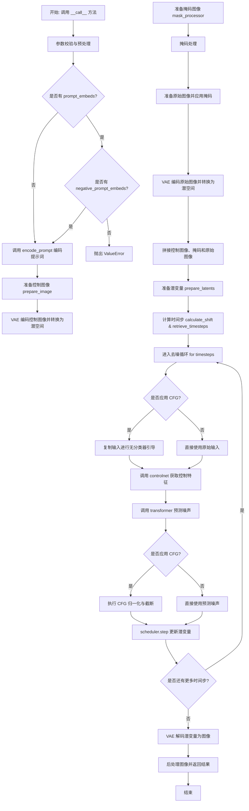
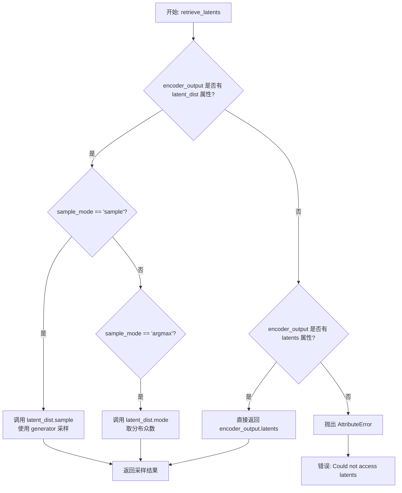
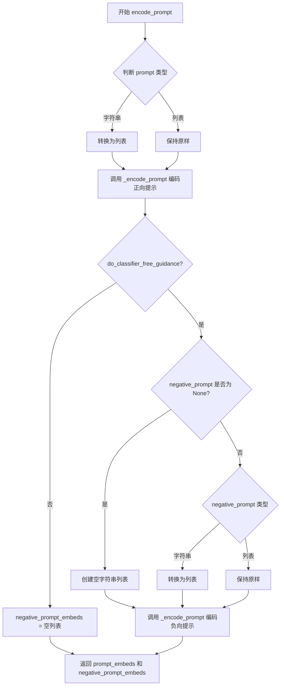
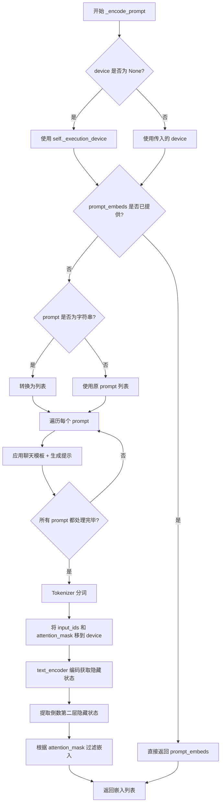
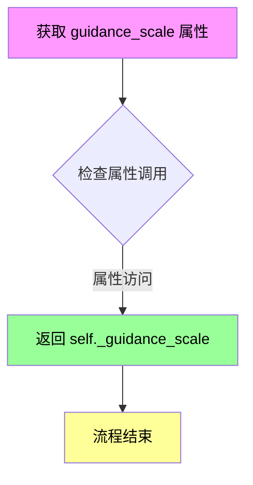
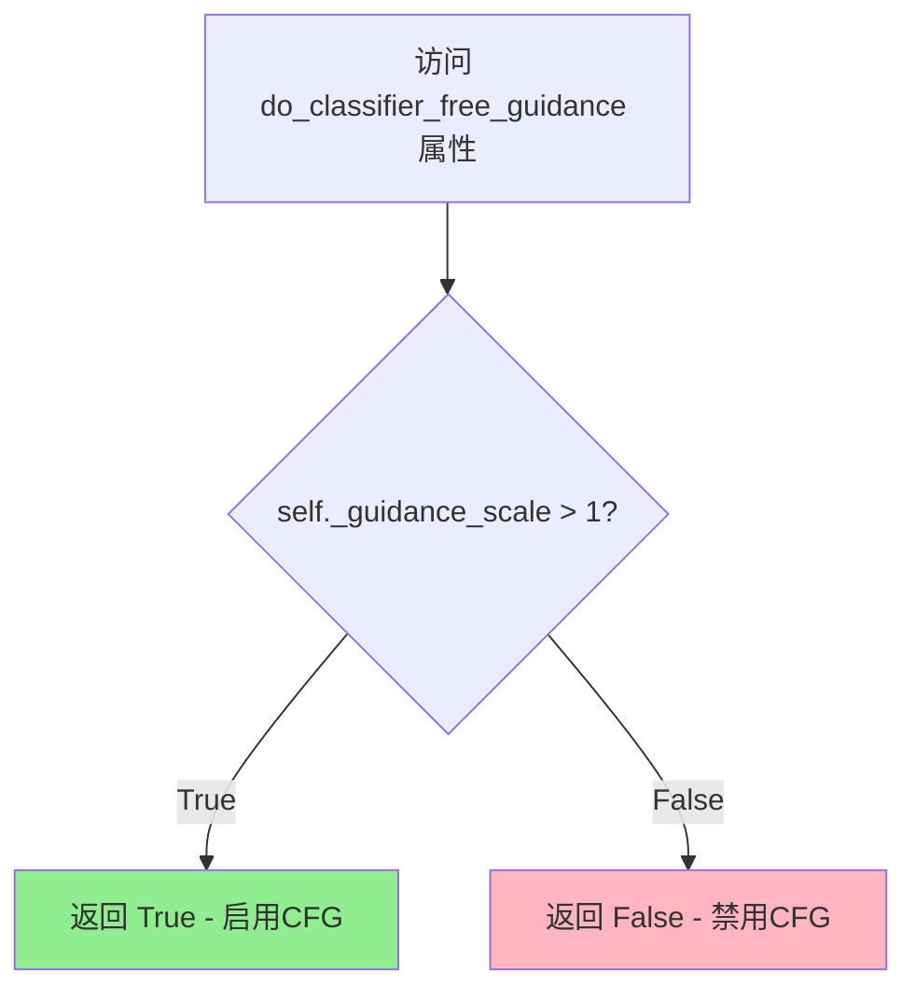
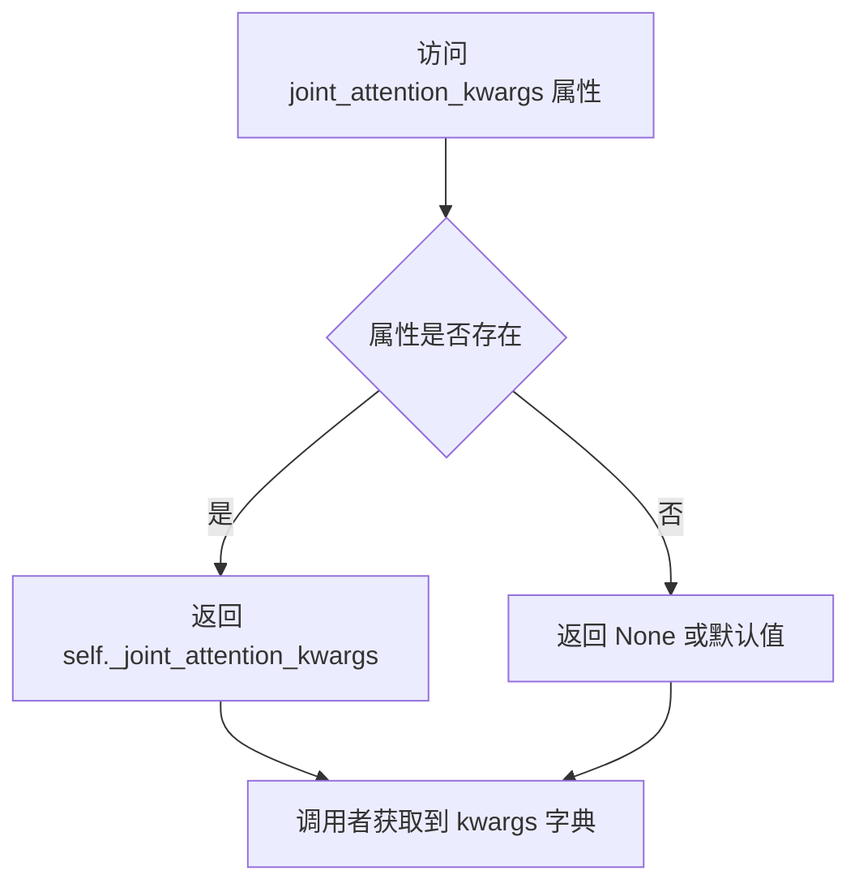
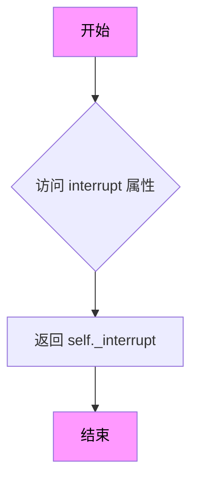

# `diffusers\src\diffusers\pipelines\z_image\pipeline_z_image_controlnet_inpaint.py` 详细设计文档

ZImageControlNetInpaintPipeline 是一个基于扩散模型的图像修复（inpainting）管道，结合了 ControlNet 控制网络和 ZImageTransformer2DModel 变换器模型。该管道通过接收文本提示（prompt）、原始图像、掩码图像和控制图像，在去噪过程中利用控制网络的特征来指导图像生成，实现高质量的图像修复和编辑功能。

## 整体流程



## 类结构

```
DiffusionPipeline (基类)
└── ZImageControlNetInpaintPipeline
    └── FromSingleFileMixin (混入类)
```

## 全局变量及字段


### `logger`
    
模块级日志记录器，用于记录运行信息

类型：`logging.Logger`
    


### `EXAMPLE_DOC_STRING`
    
示例文档字符串，包含pipeline使用示例代码

类型：`str`
    


### `ZImageControlNetInpaintPipeline.model_cpu_offload_seq`
    
模型CPU卸载顺序，指定模型组件卸载到CPU的先后顺序

类型：`str`
    


### `ZImageControlNetInpaintPipeline._optional_components`
    
可选组件列表，定义pipeline中的可选模块

类型：`list`
    


### `ZImageControlNetInpaintPipeline._callback_tensor_inputs`
    
回调张量输入列表，指定哪些张量可用于回调函数

类型：`list`
    


### `ZImageControlNetInpaintPipeline.scheduler`
    
调度器，用于控制扩散模型的采样过程

类型：`FlowMatchEulerDiscreteScheduler`
    


### `ZImageControlNetInpaintPipeline.vae`
    
VAE变分自编码器，用于图像的编码和解码

类型：`AutoencoderKL`
    


### `ZImageControlNetInpaintPipeline.text_encoder`
    
文本编码器，将文本提示转换为嵌入向量

类型：`PreTrainedModel`
    


### `ZImageControlNetInpaintPipeline.tokenizer`
    
分词器，用于将文本分割成token序列

类型：`AutoTokenizer`
    


### `ZImageControlNetInpaintPipeline.transformer`
    
图像变换器，主干扩散模型用于图像生成

类型：`ZImageTransformer2DModel`
    


### `ZImageControlNetInpaintPipeline.controlnet`
    
控制网络，提供额外的条件控制信息引导图像生成

类型：`ZImageControlNetModel`
    


### `ZImageControlNetInpaintPipeline.vae_scale_factor`
    
VAE缩放因子，用于计算图像 latent 空间的缩放比例

类型：`int`
    


### `ZImageControlNetInpaintPipeline.image_processor`
    
图像处理器，用于图像的预处理和后处理

类型：`VaeImageProcessor`
    


### `ZImageControlNetInpaintPipeline.mask_processor`
    
掩码处理器，用于处理图像修复任务的掩码

类型：`VaeImageProcessor`
    


### `ZImageControlNetInpaintPipeline._guidance_scale`
    
引导缩放因子，控制文本提示对生成图像的影响程度

类型：`float`
    


### `ZImageControlNetInpaintPipeline._joint_attention_kwargs`
    
联合注意力参数字典，传递给注意力处理器

类型：`dict`
    


### `ZImageControlNetInpaintPipeline._interrupt`
    
中断标志，用于中断扩散采样过程

类型：`bool`
    


### `ZImageControlNetInpaintPipeline._cfg_normalization`
    
CFG归一化标志，控制是否对分类器自由引导进行归一化

类型：`bool`
    


### `ZImageControlNetInpaintPipeline._cfg_truncation`
    
CFG截断值，用于在特定时间步后禁用引导

类型：`float`
    


### `ZImageControlNetInpaintPipeline._num_timesteps`
    
时间步数量，记录扩散过程的总步数

类型：`int`
    
    

## 全局函数及方法


### `calculate_shift`

计算图像序列长度偏移量，用于调整噪声调度。该函数通过线性插值根据图像序列长度计算噪声调度的偏移量 μ（mu），以适应不同分辨率图像的去噪过程。

参数：

- `image_seq_len`：图像序列长度（整型），表示输入图像的序列长度
- `base_seq_len`：`int`，基础序列长度，默认值为 256
- `max_seq_len`：`int`，最大序列长度，默认值为 4096
- `base_shift`：`float`，基础偏移量，默认值为 0.5
- `max_shift`：`float`，最大偏移量，默认值为 1.15

返回值：`float`，计算得到的噪声调度偏移量 μ（mu）

#### 流程图

```mermaid
graph TD
    A[开始] --> B[计算斜率 m<br>m = (max_shift - base_shift) / (max_seq_len - base_seq_len)]
    B --> C[计算截距 b<br>b = base_shift - m * base_seq_len]
    C --> D[计算偏移量 mu<br>mu = image_seq_len * m + b]
    D --> E[返回 mu]
```

#### 带注释源码

```python
# Copied from diffusers.pipelines.flux.pipeline_flux.calculate_shift
def calculate_shift(
    image_seq_len,
    base_seq_len: int = 256,
    max_seq_len: int = 4096,
    base_shift: float = 0.5,
    max_shift: float = 1.15,
):
    """
    计算图像序列长度偏移量，用于调整噪声调度
    
    该函数通过线性插值计算偏移量 μ，根据图像序列长度在基础偏移量和最大偏移量之间进行平滑过渡。
    这种方法来源于 Flux 管道，用于适应不同分辨率图像的去噪过程。
    
    Args:
        image_seq_len: 图像序列长度，即图像在latent空间的空间分辨率乘积
        base_seq_len: 基础序列长度，默认256
        max_seq_len: 最大序列长度，默认4096
        base_shift: 基础偏移量，默认0.5
        max_shift: 最大偏移量，默认1.15
    
    Returns:
        float: 计算得到的偏移量 mu
    """
    # 计算线性插值的斜率 m
    # 表示单位序列长度变化带来的偏移量变化
    m = (max_shift - base_shift) / (max_seq_len - base_seq_len)
    
    # 计算线性方程的截距 b
    # 确保当 seq_len = base_seq_len 时，偏移量恰好等于 base_shift
    b = base_shift - m * base_seq_len
    
    # 根据图像序列长度计算最终的偏移量 mu
    # 这是一个线性函数：mu = m * image_seq_len + b
    mu = image_seq_len * m + b
    
    return mu
```


### `retrieve_latents`

该函数用于从编码器输出中检索潜在变量（latents），支持多种采样模式（sample/argmax）以及直接获取预计算的 latents，是连接 VAE 编码器输出与潜在空间的关键桥梁。

参数：

- `encoder_output`：`torch.Tensor`，编码器的输出对象，通常包含 `latent_dist` 属性或 `latents` 属性
- `generator`：`torch.Generator | None`，用于随机采样的生成器，确保可复现性
- `sample_mode`：`str`，采样模式，可选值为 `"sample"`（从分布采样）或 `"argmax"`（取分布的众数）

返回值：`torch.Tensor`，检索到的潜在变量张量

#### 流程图



#### 带注释源码

```python
# Copied from diffusers.pipelines.stable_diffusion.pipeline_stable_diffusion_img2img.retrieve_latents
def retrieve_latents(
    encoder_output: torch.Tensor, generator: torch.Generator | None = None, sample_mode: str = "sample"
):
    """
    从编码器输出中检索潜在变量。
    
    Args:
        encoder_output: 编码器输出，包含 latent_dist 或 latents 属性
        generator: 可选的随机生成器，用于采样时的随机性控制
        sample_mode: 采样模式，"sample" 从分布采样，"argmax" 取众数
    
    Returns:
        潜在变量张量
    """
    # 优先检查 latent_dist 属性是否存在
    if hasattr(encoder_output, "latent_dist") and sample_mode == "sample":
        # 模式1: 从潜在分布中采样（随机采样）
        return encoder_output.latent_dist.sample(generator)
    elif hasattr(encoder_output, "latent_dist") and sample_mode == "argmax":
        # 模式2: 取潜在分布的众数（确定性输出）
        return encoder_output.latent_dist.mode()
    elif hasattr(encoder_output, "latents"):
        # 模式3: 直接返回预计算的 latents 属性
        return encoder_output.latents
    else:
        # 无法识别有效的潜在变量来源，抛出异常
        raise AttributeError("Could not access latents of provided encoder_output")
```


### `retrieve_timesteps`

从调度器检索时间步，支持自定义时间步和sigmas。该函数调用调度器的 `set_timesteps` 方法并从调度器中检索时间步，处理自定义时间步。任何 kwargs 将传递给 `scheduler.set_timesteps`。

参数：

- `scheduler`：`SchedulerMixin`，要获取时间步的调度器
- `num_inference_steps`：`int | None`，生成样本时使用的扩散步数。如果使用此参数，`timesteps` 必须为 `None`
- `device`：`str | torch.device | None`，时间步要移动到的设备。如果为 `None`，时间步不会被移动
- `timesteps`：`list[int] | optional`，用于覆盖调度器时间步间隔策略的自定义时间步。如果传递了 `timesteps`，则 `num_inference_steps` 和 `sigmas` 必须为 `None`
- `sigmas`：`list[float] | optional`，用于覆盖调度器时间步间隔策略的自定义sigmas。如果传递了 `sigmas`，则 `num_inference_steps` 和 `timesteps` 必须为 `None`
- `**kwargs`：任意关键字参数，将传递给 `scheduler.set_timesteps`

返回值：`tuple[torch.Tensor, int]`，第一个元素是调度器的时间步计划，第二个元素是推理步数

#### 流程图

```mermaid
flowchart TD
    A[开始 retrieve_timesteps] --> B{检查 timesteps 和 sigmas 是否同时存在}
    B -- 是 --> C[抛出 ValueError: 只能选择 timesteps 或 sigmas 之一]
    B -- 否 --> D{检查 timesteps 是否存在}
    D -- 是 --> E{检查 scheduler.set_timesteps 是否接受 timesteps 参数}
    E -- 否 --> F[抛出 ValueError: 当前调度器不支持自定义 timesteps]
    E -- 是 --> G[调用 scheduler.set_timesteps with timesteps]
    G --> H[获取 scheduler.timesteps]
    H --> I[计算 num_inference_steps = len(timesteps)]
    D -- 否 --> J{检查 sigmas 是否存在}
    J -- 是 --> K{检查 scheduler.set_timesteps 是否接受 sigmas 参数}
    K -- 否 --> L[抛出 ValueError: 当前调度器不支持自定义 sigmas]
    K -- 是 --> M[调用 scheduler.set_timesteps with sigmas]
    M --> N[获取 scheduler.timesteps]
    N --> I
    J -- 否 --> O[调用 scheduler.set_timesteps with num_inference_steps]
    O --> P[获取 scheduler.timesteps]
    P --> I
    I --> Q[返回 timesteps 和 num_inference_steps]
```

#### 带注释源码

```python
# Copied from diffusers.pipelines.stable_diffusion.pipeline_stable_diffusion.retrieve_timesteps
def retrieve_timesteps(
    scheduler,
    num_inference_steps: int | None = None,
    device: str | torch.device | None = None,
    timesteps: list[int] | None = None,
    sigmas: list[float] | None = None,
    **kwargs,
):
    r"""
    Calls the scheduler's `set_timesteps` method and retrieves timesteps from the scheduler after the call. Handles
    custom timesteps. Any kwargs will be supplied to `scheduler.set_timesteps`.

    Args:
        scheduler (`SchedulerMixin`):
            The scheduler to get timesteps from.
        num_inference_steps (`int`):
            The number of diffusion steps used when generating samples with a pre-trained model. If used, `timesteps`
            must be `None`.
        device (`str` or `torch.device`, *optional*):
            The device to which the timesteps should be moved to. If `None`, the timesteps are not moved.
        timesteps (`list[int]`, *optional*):
            Custom timesteps used to override the timestep spacing strategy of the scheduler. If `timesteps` is passed,
            `num_inference_steps` and `sigmas` must be `None`.
        sigmas (`list[float]`, *optional*):
            Custom sigmas used to override the timestep spacing strategy of the scheduler. If `sigmas` is passed,
            `num_inference_steps` and `timesteps` must be `None`.

    Returns:
        `tuple[torch.Tensor, int]`: A tuple where the first element is the timestep schedule from the scheduler and the
        second element is the number of inference steps.
    """
    # 检查是否同时传入了 timesteps 和 sigmas，两者只能选其一
    if timesteps is not None and sigmas is not None:
        raise ValueError("Only one of `timesteps` or `sigmas` can be passed. Please choose one to set custom values")
    
    # 处理自定义 timesteps 的情况
    if timesteps is not None:
        # 检查调度器的 set_timesteps 方法是否接受 timesteps 参数
        accepts_timesteps = "timesteps" in set(inspect.signature(scheduler.set_timesteps).parameters.keys())
        if not accepts_timesteps:
            raise ValueError(
                f"The current scheduler class {scheduler.__class__}'s `set_timesteps` does not support custom"
                f" timestep schedules. Please check whether you are using the correct scheduler."
            )
        # 调用调度器的 set_timesteps 方法
        scheduler.set_timesteps(timesteps=timesteps, device=device, **kwargs)
        # 从调度器获取时间步
        timesteps = scheduler.timesteps
        # 计算推理步数
        num_inference_steps = len(timesteps)
    
    # 处理自定义 sigmas 的情况
    elif sigmas is not None:
        # 检查调度器的 set_timesteps 方法是否接受 sigmas 参数
        accept_sigmas = "sigmas" in set(inspect.signature(scheduler.set_timesteps).parameters.keys())
        if not accept_sigmas:
            raise ValueError(
                f"The current scheduler class {scheduler.__class__}'s `set_timesteps` does not support custom"
                f" sigmas schedules. Please check whether you are using the correct scheduler."
            )
        # 调用调度器的 set_timesteps 方法
        scheduler.set_timesteps(sigmas=sigmas, device=device, **kwargs)
        # 从调度器获取时间步
        timesteps = scheduler.timesteps
        # 计算推理步数
        num_inference_steps = len(timesteps)
    
    # 默认情况：使用 num_inference_steps
    else:
        scheduler.set_timesteps(num_inference_steps, device=device, **kwargs)
        timesteps = scheduler.timesteps
    
    # 返回时间步和推理步数
    return timesteps, num_inference_steps
```


### `ZImageControlNetInpaintPipeline.__init__`

初始化 Z-Image 控制网图像修复管道，整合变分自编码器、文本编码器、Transformer、调度器等核心组件，并配置图像和掩码处理器。

参数：

- `scheduler`：`FlowMatchEulerDiscreteScheduler`，控制扩散模型的去噪调度策略
- `vae`：`AutoencoderKL`，变分自编码器，用于图像的编码和解码
- `text_encoder`：`PreTrainedModel`，预训练文本编码器，将文本提示转换为嵌入向量
- `tokenizer`：`AutoTokenizer`，分词器，用于对文本提示进行分词处理
- `transformer`：`ZImageTransformer2DModel`，Z-Image Transformer 主干网络，执行去噪过程
- `controlnet`：`ZImageControlNetModel`，控制网模型，提供额外的条件控制信息

返回值：无（`None`），构造函数仅初始化对象状态

#### 流程图

```mermaid
flowchart TD
    A[开始 __init__] --> B{调用父类初始化}
    B --> C{检查 transformer.in_channels == controlnet.config.control_in_dim}
    C -->|是| D[抛出 ValueError 异常]
    C -->|否| E[调用 ZImageControlNetModel.from_transformer 转换 controlnet]
    D --> Z[结束]
    E --> F[调用 register_modules 注册所有模块]
    F --> G{检查 vae 属性是否存在}
    G -->|是| H[计算 vae_scale_factor = 2^(len(vae.config.block_out_channels)-1)]
    G -->|否| I[设置 vae_scale_factor = 8]
    H --> J[创建 VaeImageProcessor 用于图像处理]
    I --> J
    J --> K[创建 VaeImageProcessor 用于掩码处理]
    K --> Z
```

#### 带注释源码

```python
def __init__(
    self,
    scheduler: FlowMatchEulerDiscreteScheduler,
    vae: AutoencoderKL,
    text_encoder: PreTrainedModel,
    tokenizer: AutoTokenizer,
    transformer: ZImageTransformer2DModel,
    controlnet: ZImageControlNetModel,
):
    """
    初始化 ZImageControlNetInpaintPipeline 管道实例。

    参数:
        scheduler: .FlowMatchEulerDiscreteScheduler，流量匹配欧拉离散调度器
        vae: AutoencoderKL，变分自编码器模型
        text_encoder: PreTrainedModel，文本编码器模型
        tokenizer: AutoTokenizer，文本分词器
        transformer: ZImageTransformer2DModel，Z-Image 主干Transformer模型
        controlnet: ZImageControlNetModel，控制网模型
    """
    # 调用父类 DiffusionPipeline 的初始化方法
    # 设置基本的管道配置和属性
    super().__init__()

    # 验证 Transformer 和 ControlNet 的通道兼容性
    # 如果 Transformer 的输入通道数等于 ControlNet 的控制输入维度
    # 则抛出异常，因为当前管道不兼容旧版本的 Union 控制网
    if transformer.in_channels == controlnet.config.control_in_dim:
        raise ValueError(
            "ZImageControlNetInpaintPipeline is not compatible with "
            "`alibaba-pai/Z-Image-Turbo-Fun-Controlnet-Union`, use "
            "`alibaba-pai/Z-Image-Turbo-Fun-Controlnet-Union-2.0`."
        )

    # 使用 from_transformer 方法将 controlnet 转换为适配当前 Transformer 的版本
    # 这一步会重新配置 ControlNet 的权重结构以匹配主模型
    controlnet = ZImageControlNetModel.from_transformer(controlnet, transformer)

    # 将所有模型组件注册到管道中
    # 这些组件将通过 self.component_name 方式访问
    # 同时支持 CPU/GPU 内存管理和模型卸载功能
    self.register_modules(
        vae=vae,
        text_encoder=text_encoder,
        tokenizer=tokenizer,
        scheduler=scheduler,
        transformer=transformer,
        controlnet=controlnet,
    )

    # 计算 VAE 的缩放因子，用于图像分辨率的调整
    # 基于 VAE 配置中的 block_out_channels 数量
    # 通常 VAE 有 [128, 256, 512, 512] 通道配置时，缩放因子为 8
    self.vae_scale_factor = (
        2 ** (len(self.vae.config.block_out_channels) - 1)
        if hasattr(self, "vae") and self.vae is not None
        else 8
    )

    # 初始化图像处理器，用于预处理输入图像和后处理输出图像
    # vae_scale_factor * 2 是因为图像处理需要更大的分辨率范围
    self.image_processor = VaeImageProcessor(vae_scale_factor=self.vae_scale_factor * 2)

    # 初始化掩码处理器，用于处理图像修复任务的掩码
    # do_normalize=False: 不进行归一化处理
    # do_binarize=True: 进行二值化处理，将掩码转换为黑白形式
    # do_convert_grayscale=True: 转换为灰度图像格式
    self.mask_processor = VaeImageProcessor(
        vae_scale_factor=self.vae_scale_factor,
        do_normalize=False,
        do_binarize=True,
        do_convert_grayscale=True
    )
```


### `ZImageControlNetInpaintPipeline.encode_prompt`

该方法负责将文本提示（prompt）编码为文本嵌入向量（text embeddings），支持 Classifier-Free Guidance（CFG）技术。当启用 CFG 时，会同时编码正向提示和负向提示，以便在后续的扩散模型推理过程中引导生成更符合预期的图像。

参数：

- `self`：`ZImageControlNetInpaintPipeline` 类实例
- `prompt`：`str | list[str]`，要编码的文本提示，可以是单个字符串或字符串列表
- `device`：`torch.device | None`，指定计算设备，默认为 None
- `do_classifier_free_guidance`：`bool`，是否启用无分类器引导，默认为 True
- `negative_prompt`：`str | list[str] | None`，负向提示，用于引导模型避免生成不想要的内容，默认为 None
- `prompt_embeds`：`list[torch.FloatTensor] | None`，预计算的正向提示嵌入，如果提供则直接使用，默认为 None
- `negative_prompt_embeds`：`torch.FloatTensor | None`，预计算的负向提示嵌入，默认为 None
- `max_sequence_length`：`int`，token 序列的最大长度，默认为 512

返回值：`tuple[list[torch.FloatTensor], list[torch.FloatTensor]]`，返回两个列表——正向提示嵌入和负向提示嵌入。

#### 流程图



#### 带注释源码

```python
def encode_prompt(
    self,
    prompt: str | list[str],
    device: torch.device | None = None,
    do_classifier_free_guidance: bool = True,
    negative_prompt: str | list[str] | None = None,
    prompt_embeds: list[torch.FloatTensor] | None = None,
    negative_prompt_embeds: torch.FloatTensor | None = None,
    max_sequence_length: int = 512,
):
    # 如果 prompt 是单个字符串，转换为列表；如果是列表则保持不变
    prompt = [prompt] if isinstance(prompt, str) else prompt
    
    # 调用内部方法 _encode_prompt 进行实际的提示编码
    # 仅当 prompt_embeds 未预计算时才会重新编码
    prompt_embeds = self._encode_prompt(
        prompt=prompt,
        device=device,
        prompt_embeds=prompt_embeds,
        max_sequence_length=max_sequence_length,
    )

    # 判断是否需要处理负向提示（当启用 CFG 时）
    if do_classifier_free_guidance:
        # 如果没有提供负向提示，则使用空字符串填充
        if negative_prompt is None:
            negative_prompt = ["" for _ in prompt]
        else:
            # 统一负向提示的格式为列表
            negative_prompt = [negative_prompt] if isinstance(negative_prompt, str) else negative_prompt
        
        # 确保正向提示和负向提示的数量一致
        assert len(prompt) == len(negative_prompt)
        
        # 调用 _encode_prompt 编码负向提示
        negative_prompt_embeds = self._encode_prompt(
            prompt=negative_prompt,
            device=device,
            prompt_embeds=negative_prompt_embeds,
            max_sequence_length=max_sequence_length,
        )
    else:
        # 如果不启用 CFG，负向提示嵌入为空列表
        negative_prompt_embeds = []
    
    # 返回正向和负向提示嵌入
    return prompt_embeds, negative_prompt_embeds
```


### `ZImageControlNetInpaintPipeline._encode_prompt`

该方法负责将文本提示（prompt）编码为文本嵌入向量（text embeddings），支持单条或多条提示，并利用聊天模板和注意力掩码进行文本编码。

参数：

- `self`：类实例本身
- `prompt`：`str | list[str]`，需要编码的文本提示，可以是单条字符串或字符串列表
- `device`：`torch.device | None`，指定执行设备，默认为 None（使用执行设备）
- `prompt_embeds`：`list[torch.FloatTensor] | None`，可选的预计算文本嵌入，如果提供则直接返回
- `max_sequence_length`：`int`，最大序列长度，默认为 512

返回值：`list[torch.FloatTensor]`，编码后的文本嵌入列表，每个元素对应一条提示的嵌入向量

#### 流程图



#### 带注释源码

```python
def _encode_prompt(
    self,
    prompt: str | list[str],
    device: torch.device | None = None,
    prompt_embeds: list[torch.FloatTensor] | None = None,
    max_sequence_length: int = 512,
) -> list[torch.FloatTensor]:
    """
    编码文本提示为嵌入向量
    
    参数:
        prompt: 输入的文本提示，字符串或字符串列表
        device: 计算设备，如果为None则使用默认执行设备
        prompt_embeds: 预计算的嵌入，如果已提供则直接返回
        max_sequence_length: 分词器的最大序列长度
    
    返回:
        编码后的文本嵌入列表
    """
    # 确定设备，优先使用传入的设备，否则使用Pipeline的默认执行设备
    device = device or self._execution_device

    # 如果已经提供了预计算的嵌入，直接返回，避免重复计算
    if prompt_embeds is not None:
        return prompt_embeds

    # 统一将字符串转换为列表，方便后续统一处理
    if isinstance(prompt, str):
        prompt = [prompt]

    # 遍历每个提示词，应用聊天模板进行格式化
    # 聊天模板将提示转换为适合大语言模型的对话格式
    for i, prompt_item in enumerate(prompt):
        messages = [
            {"role": "user", "content": prompt_item},
        ]
        # 使用tokenizer的聊天模板功能，添加生成提示和思考标记
        prompt_item = self.tokenizer.apply_chat_template(
            messages,
            tokenize=False,  # 不进行分词，只格式化
            add_generation_prompt=True,  # 添加生成提示
            enable_thinking=True,  # 启用思考模式
        )
        prompt[i] = prompt_item

    # 使用分词器对提示进行分词处理
    # padding到最大长度，截断超长部分，返回PyTorch张量
    text_inputs = self.tokenizer(
        prompt,
        padding="max_length",
        max_length=max_sequence_length,
        truncation=True,
        return_tensors="pt",
    )

    # 将分词后的input_ids和attention_mask移动到指定设备
    text_input_ids = text_inputs.input_ids.to(device)
    prompt_masks = text_inputs.attention_mask.to(device).bool()

    # 使用文本编码器编码输入，获取所有隐藏状态
    # output_hidden_states=True要求返回所有层的隐藏状态
    prompt_embeds = self.text_encoder(
        input_ids=text_input_ids,
        attention_mask=prompt_masks,
        output_hidden_states=True,
    ).hidden_states[-2]  # 取倒数第二层隐藏状态（通常效果较好）

    # 根据attention_mask过滤嵌入向量，只保留有效token的嵌入
    # padding部分的嵌入被丢弃
    embeddings_list = []

    for i in range(len(prompt_embeds)):
        embeddings_list.append(prompt_embeds[i][prompt_masks[i]])

    return embeddings_list
```


### ZImageControlNetInpaintPipeline.prepare_latents

该方法用于准备扩散模型的潜在变量（latents），包括根据VAE缩放因子调整图像尺寸，以及生成或验证潜在变量张量。

参数：

- `batch_size`：`int`，批次大小，指定要生成的图像数量
- `num_channels_latents`：`int`，潜在变量的通道数，对应transformer的输入通道数
- `height`：`int`，生成图像的高度（像素）
- `width`：`int`，生成图像的宽度（像素）
- `dtype`：`torch.dtype`，潜在变量的数据类型
- `device`：`torch.device`，潜在变量所在的设备（CPU或CUDA）
- `generator`：`torch.Generator | None`，用于生成随机数的确定性生成器
- `latents`：`torch.FloatTensor | None`，可选的预生成潜在变量，如果为None则随机生成

返回值：`torch.FloatTensor`，准备好的潜在变量张量，形状为 (batch_size, num_channels_latents, height, width)

#### 流程图

```mermaid
flowchart TD
    A[开始 prepare_latents] --> B[根据vae_scale_factor调整height和width]
    B --> C[计算潜在变量形状 shape = (batch_size, num_channels_latents, height, width)]
    C --> D{latents是否为None?}
    D -->|是| E[使用randn_tensor生成随机潜在变量]
    D -->|否| F{检查latents.shape是否等于shape}
    F -->|否| G[抛出ValueError异常]
    F -->|是| H[将latents移动到指定device]
    E --> I[返回latents]
    H --> I
    G --> J[结束]
```

#### 带注释源码

```python
def prepare_latents(
    self,
    batch_size,              # 批次大小，控制生成图像的数量
    num_channels_latents,   # 潜在变量通道数，等于transformer的in_channels
    height,                 # 输入的图像高度（像素）
    width,                  # 输入的图像宽度（像素）
    dtype,                  # 期望的潜在变量数据类型
    device,                 # 潜在变量应该存放的设备
    generator,              # 可选的随机数生成器，用于复现结果
    latents=None,           # 可选的预生成潜在变量，如果为None则随机生成
):
    # 根据VAE的缩放因子调整高度和宽度
    # 这里的计算考虑了vae_scale_factor * 2，以确保潜在变量的尺寸正确
    height = 2 * (int(height) // (self.vae_scale_factor * 2))
    width = 2 * (int(width) // (self.vae_scale_factor * 2))

    # 确定潜在变量的形状：批次大小 × 通道数 × 调整后的高度 × 调整后的宽度
    shape = (batch_size, num_channels_latents, height, width)

    if latents is None:
        # 如果没有提供潜在变量，使用randn_tensor生成随机潜在变量
        # 从标准正态分布中采样，形状为shape
        latents = randn_tensor(shape, generator=generator, device=device, dtype=dtype)
    else:
        # 如果提供了潜在变量，验证其形状是否与预期形状匹配
        if latents.shape != shape:
            raise ValueError(f"Unexpected latents shape, got {latents.shape}, expected {shape}")
        # 将潜在变量移动到指定的设备上
        latents = latents.to(device)
    
    # 返回准备好的潜在变量，用于后续的去噪过程
    return latents
```


### `ZImageControlNetInpaintPipeline.prepare_image`

该方法负责将输入图像预处理为适合扩散模型处理的张量格式，包括图像尺寸调整、批次大小适配、设备转移、数据类型转换，以及在需要时为无分类器引导（Classifier-Free Guidance）复制图像。

参数：

- `self`：`ZImageControlNetInpaintPipeline` 实例本身
- `image`：`PipelineImageInput` 或 `torch.Tensor`，待处理的输入图像
- `width`：`int`，目标宽度（像素）
- `height`：`int`，目标高度（像素）
- `batch_size`：`int`，批处理大小
- `num_images_per_prompt`：`int`，每个提示词生成的图像数量
- `device`：`torch.device`，目标设备（CPU/CUDA）
- `dtype`：`torch.dtype`，目标数据类型
- `do_classifier_free_guidance`：`bool`，是否启用无分类器引导（默认 False）
- `guess_mode`：`bool`，猜测模式标志（默认 False）

返回值：`torch.Tensor`，处理后的图像张量，形状为 `[batch_size * num_images_per_prompt * (2 if CFG else 1), channels, height, width]`

#### 流程图

```mermaid
flowchart TD
    A[开始: prepare_image] --> B{image是否为torch.Tensor?}
    B -->|是| C[直接使用image]
    B -->|否| D[调用image_processor.preprocess进行预处理]
    C --> E[获取image_batch_size]
    D --> E
    E --> F{image_batch_size == 1?}
    F -->|是| G[repeat_by = batch_size]
    F -->|否| H[repeat_by = num_images_per_prompt]
    G --> I[repeat_interleave扩展图像]
    H --> I
    I --> J[将图像转移到指定设备并转换数据类型]
    J --> K{do_classifier_free_guidance 且 not guess_mode?}
    K -->|是| L[复制图像用于CFG: torch.cat([image] * 2)]
    K -->|否| M[返回处理后的图像]
    L --> M
    M --> N[结束]
```

#### 带注释源码

```python
def prepare_image(
    self,
    image,
    width,
    height,
    batch_size,
    num_images_per_prompt,
    device,
    dtype,
    do_classifier_free_guidance=False,
    guess_mode=False,
):
    """
    准备图像用于扩散模型处理。
    
    处理流程：
    1. 预处理图像（调整尺寸、归一化等）
    2. 根据批次大小扩展图像维度
    3. 转移至目标设备并转换数据类型
    4. 在CFG模式下复制图像用于双通道推理
    """
    # 判断输入是否为PyTorch张量
    if isinstance(image, torch.Tensor):
        # 已经是张量，直接使用
        pass
    else:
        # 使用VAE图像处理器进行预处理（调整尺寸、归一化等）
        image = self.image_processor.preprocess(image, height=height, width=width)

    # 获取图像批次大小
    image_batch_size = image.shape[0]

    # 确定需要重复的次数
    if image_batch_size == 1:
        # 单张图像：按完整批次大小重复
        repeat_by = batch_size
    else:
        # 图像批次与提示词批次一致：按每提示词图像数重复
        repeat_by = num_images_per_prompt

    # 在批次维度上重复图像
    image = image.repeat_interleave(repeat_by, dim=0)

    # 将图像转移至目标设备并转换数据类型
    image = image.to(device=device, dtype=dtype)

    # 无分类器引导处理：复制图像以同时处理带引导和不带引导的情况
    if do_classifier_free_guidance and not guess_mode:
        image = torch.cat([image] * 2)

    return image
```


### `ZImageControlNetInpaintPipeline.guidance_scale`

该属性返回当前管道的 guidance_scale 值，用于控制 classifier-free diffusion guidance 的强度。guidance_scale 值越大，生成的图像与文本提示的相关性越高，但可能会牺牲一些图像质量。

参数：无（该属性无显式参数，`self` 为隐式参数）

返回值：`float`，返回存储在管道实例中的 guidance_scale 数值，用于控制无分类器引导强度。

#### 流程图



#### 带注释源码

```python
@property
def guidance_scale(self):
    """
    属性getter: 获取当前管道的guidance_scale值
    
    guidance_scale定义在Classifier-Free Diffusion Guidance论文中,
    用于在生成过程中平衡图像质量与文本prompt的遵守程度。
    值大于1时启用guidance, 值越高图像与prompt越相关但可能质量降低。
    
    Returns:
        float: 当前guidance_scale的值, 存储在self._guidance_scale中
    """
    return self._guidance_scale
```

#### 补充说明

| 项目 | 说明 |
|------|------|
| **属性类型** | Python property (只读 getter) |
| **存储变量** | `self._guidance_scale` (在 `__call__` 方法中设置) |
| **默认值** | 5.0 (在 `__call__` 方法参数中定义) |
| **关联属性** | `do_classifier_free_guidance` - 基于 guidance_scale > 1 判断是否启用 CFG |
| **设置方式** | 在调用 `__call__` 方法时通过 `guidance_scale` 参数传入 |


### `ZImageControlNetInpaintPipeline.do_classifier_free_guidance`

这是一个属性（property），用于判断当前是否启用无分类器引导（Classifier-Free Guidance，CFG）。当 `guidance_scale` 大于 1 时返回 `True`，表示在图像生成过程中将执行 CFG 逻辑。

参数：

- （无参数，属性访问）

返回值：`bool`，返回是否启用无分类器引导。`True` 表示启用（guidance_scale > 1），`False` 表示禁用（guidance_scale <= 1）。

#### 流程图



#### 带注释源码

```python
@property
def do_classifier_free_guidance(self):
    """
    属性：判断是否执行无分类器引导（Classifier-Free Guidance）
    
    原理：
    - CFG 通过在推理时同时考虑正向和负向提示词来改进生成质量
    - 当 guidance_scale > 1 时，CFG 才会产生效果
    - 该属性在管道中用于条件判断，决定是否需要为负向提示词重复处理
    
    与 guidance_scale 属性的关系：
    - guidance_scale 属性返回 self._guidance_scale 的值
    - do_classifier_free_guidance 返回 guidance_scale > 1 的布尔判断
    
    典型用途：
    - 在 encode_prompt 中判断是否需要编码 negative_prompt
    - 在 __call__ 中判断是否需要准备双份 latents 和 prompt_embeds
    - 在去噪循环中判断是否执行 CFG 逻辑
    
    返回：
        bool: True 表示启用 CFG，False 表示禁用
    """
    return self._guidance_scale > 1
```

#### 关键设计说明

| 项目 | 说明 |
|------|------|
| **设计目标** | 提供一个便捷的布尔判断，用于在管道各处快速检查是否启用 CFG |
| **约束条件** | 依赖于 `_guidance_scale` 实例变量的存在，该变量在 `__call__` 方法中设置 |
| **使用场景** | 条件分支判断（如是否编码 negative_prompt、是否复制 latents 进行 CFG 计算） |
| **潜在优化** | 可考虑缓存结果避免重复比较，但当前实现足够轻量 |


### `ZImageControlNetInpaintPipeline.joint_attention_kwargs`

这是一个属性 getter 方法，用于获取在管道调用期间传递的联合注意力关键字参数（joint attention kwargs）。该属性存储了在图像生成过程中传递给 AttentionProcessor 的自定义配置选项。

参数：无（这是一个属性访问器，不接受任何参数）

返回值：`dict[str, Any] | None`，返回存储的联合注意力关键字参数字典。如果没有传递任何参数，则返回 `None`。

#### 流程图



#### 带注释源码

```python
@property
def joint_attention_kwargs(self):
    """
    属性 getter 方法，用于获取联合注意力关键字参数。
    
    该属性在 __call__ 方法中被设置：
    self._joint_attention_kwargs = joint_attention_kwargs
    
    返回值:
        dict[str, Any] | None: 传递给 AttentionProcessor 的 kwargs 字典，
        用于自定义注意力机制的行为。
    """
    return self._joint_attention_kwargs
```


### `ZImageControlNetInpaintPipeline.num_timesteps`

这是一个只读属性方法，用于返回扩散管道在图像生成过程中使用的时间步（timesteps）数量。该属性在管道执行推理时被自动设置，数值取决于所选的推理步骤数（`num_inference_steps`）和调度器的配置。

参数：

- 该属性方法没有参数（作为 Python property 访问）

返回值：`int`，返回管道在生成图像时使用的时间步总数。

#### 流程图

```mermaid
flowchart TD
    A[访问 num_timesteps 属性] --> B{属性 getter 被调用}
    B --> C[返回 self._num_timesteps]
    
    D[__call__ 方法执行] --> E[计算 timesteps 列表长度]
    E --> F[设置 self._num_timesteps = len(timesteps)]
```

#### 带注释源码

```python
@property
def num_timesteps(self):
    """
    只读属性，返回扩散管道在推理过程中使用的时间步数量。
    
    该属性在 __call__ 方法中被设置，值为 timesteps 列表的长度。
    时间步数量直接影响图像生成的质量和计算成本。
    
    返回:
        int: 推理过程中使用的时间步总数
    """
    return self._num_timesteps
```

#### 相关上下文代码

```python
# 在 __call__ 方法中设置该属性的位置：
# 5. Prepare timesteps
timesteps, num_inference_steps = retrieve_timesteps(
    self.scheduler,
    num_inference_steps,
    device,
    sigmas=sigmas,
    **scheduler_kwargs,
)
# ... 设置时间步数量
self._num_timesteps = len(timesteps)  # 属性在此处被赋值
```


### `ZImageControlNetInpaintPipeline.interrupt`

该属性用于获取管道的中断标志状态。在扩散模型的推理过程中，可以通过该属性检查是否需要中断当前的图像生成任务。

参数： 无

返回值：`bool`，返回 `_interrupt` 属性的值，用于表示是否已请求中断管道执行

#### 流程图



#### 带注释源码

```python
@property
def interrupt(self):
    """
    中断属性，用于控制推理过程的停止。
    
    在 __call__ 方法开始时初始化为 False，当需要提前终止
    扩散过程时可以在外部设置为 True。在 denoising 循环中
    会检查该属性，如果为 True 则跳过当前步骤继续执行。
    
    Returns:
        bool: 中断标志状态，True 表示请求中断，False 表示继续执行
    """
    return self._interrupt
```


### `ZImageControlNetInpaintPipeline.__call__`

该方法是 Z-Image ControlNet 图像修复管道的核心调用函数，通过接收文本提示、掩码图像和控制图像，利用 ControlNet 和 Z-Image Transformer 模型进行去噪推理，生成符合条件的目标图像。方法内部实现了图像预处理、潜在向量准备、CFG 引导、ControlNet 控制、Transformer 推理、噪声预测与去噪步骤调度，以及最终的 VAE 解码过程。

参数：

- `prompt`：`str | list[str]`，用于引导图像生成的文本提示，如果未定义则必须传递 `prompt_embeds`
- `height`：`int | None`，生成图像的高度（像素），默认 1024
- `width`：`int | None`，生成图像的宽度（像素），默认 1024
- `num_inference_steps`：`int`，去噪步数，默认 50
- `sigmas`：`list[float] | None`，自定义 sigmas 值，用于支持 sigmas 的调度器
- `guidance_scale`：`float`，Classifier-Free Diffusion Guidance 中的引导比例，默认 5.0
- `image`：`PipelineImageInput`，输入的原图，用于修复
- `mask_image`：`PipelineImageInput`，掩码图像，指定需要修复的区域
- `control_image`：`PipelineImageInput`，控制图像，提供额外的生成控制条件
- `controlnet_conditioning_scale`：`float | list[float]`，ControlNet 条件缩放因子，默认 0.75
- `cfg_normalization`：`bool`，是否启用 CFG 归一化，默认 False
- `cfg_truncation`：`float`，CFG 截断值，用于控制 CFG 的时间范围，默认 1.0
- `negative_prompt`：`str | list[str] | None`，负向提示，用于引导不期望的特征
- `num_images_per_prompt`：`int`，每个提示生成的图像数量，默认 1
- `generator`：`torch.Generator | list[torch.Generator] | None`，随机生成器，用于确保可重复性
- `latents`：`torch.FloatTensor | None`，预生成的噪声潜在向量
- `prompt_embeds`：`list[torch.FloatTensor] | None`，预生成的文本嵌入
- `negative_prompt_embeds`：`list[torch.FloatTensor] | None`，预生成的负向文本嵌入
- `output_type`：`str | None`，输出格式，可选 "pil" 或 "latent"，默认 "pil"
- `return_dict`：`bool`，是否返回 `ZImagePipelineOutput` 对象，默认 True
- `joint_attention_kwargs`：`dict[str, Any] | None`，传递给注意力处理器的额外参数
- `callback_on_step_end`：`Callable[[int, int], None] | None`，每步结束时的回调函数
- `callback_on_step_end_tensor_inputs`：`list[str]`，回调函数接收的张量输入列表，默认 ["latents"]
- `max_sequence_length`：`int`，最大序列长度，默认 512

返回值：`ZImagePipelineOutput | tuple`，返回包含生成图像的管道输出对象，或包含图像列表的元组（当 `return_dict` 为 False 时）

#### 流程图

```mermaid
flowchart TD
    A[开始 __call__] --> B{验证 height/width}
    B --> C[获取执行设备 device]
    C --> D[设置内部状态<br/>_guidance_scale, _joint_attention_kwargs, _interrupt 等]
    E{判断 batch_size}
    E -->|prompt 是 str| F[batch_size = 1]
    E -->|prompt 是 list| G[batch_size = len(prompt)]
    E -->|prompt_embeds 提供| H[batch_size = len(prompt_embeds)]
    F --> I{prompt_embeds 是否存在<br/>且 prompt 为 None?}
    G --> I
    H --> I
    I -->|是| J{验证 negative_prompt_embeds}
    I -->|否| K[调用 encode_prompt<br/>生成 prompt_embeds 和<br/>negative_prompt_embeds]
    J -->|negative_prompt_embeds 为 None| L[抛出 ValueError]
    J -->|存在| M[跳过编码步骤]
    K --> N[准备 latent 变量]
    M --> N
    
    N --> O[prepare_image: 处理 control_image]
    O --> P[VAE encode control_image]
    P --> Q[retrieve_latents 获取 latent]
    Q --> R[应用 shift_factor 和 scaling_factor]
    R --> S[prepare_image: 处理 mask_image]
    S --> T[VAE encode mask_image]
    T --> U[prepare_image: 处理 init_image]
    U --> V[结合 mask_condition 和 init_image]
    V --> W[VAE encode init_image]
    W --> X[retrieve_latents 获取 latent]
    X --> Y[构建 control_image 张量<br/>拼接 control_image, mask_condition, init_image]
    Y --> Z[prepare_latents: 准备初始噪声 latent]
    
    Z --> AA[重复 prompt_embeds<br/>num_images_per_prompt 次]
    AA --> AB[计算 image_seq_len]
    AB --> AC[calculate_shift: 计算 mu]
    AC --> AD[retrieve_timesteps: 获取调度器时间步]
    AD --> AE[初始化进度条和去噪循环]
    
    AE --> AF{遍历每个 timestep t}
    AF -->|i=0,1,...,n| AG[检查 interrupt 标志]
    AG --> AH[扩展 timestep 到 batch 维度]
    AH --> AI[归一化时间 t_norm]
    AJ{CFG truncation<br/>条件检查}
    AJ -->|t_norm > _cfg_truncation| AK[设置 current_guidance_scale = 0]
    AJ -->|否则| AL[保持原 guidance_scale]
    AM{apply_cfg 检查<br/>do_classifier_free_guidance<br/>且 scale > 0}
    AM -->|是| AN[准备 CFG 输入<br/>重复 latents, prompt_embeds<br/>timestep, control_image x2]
    AM -->|否| AO[直接使用原始输入]
    AN --> AP[调用 controlnet<br/>获取 controlnet_block_samples]
    AO --> AP
    AP --> AQ[调用 transformer<br/>获取模型输出 model_out_list]
    AQ --> AR{CFG 应用检查}
    AR -->|是| AS[分离正负输出<br/>pos_out, neg_out]
    AR -->|否| AT[直接使用 model_out_list]
    AS --> AU[计算 noise_pred = pos + scale * (pos - neg)]
    AU --> AV[CFG normalization 检查]
    AV -->|是| AW[归一化 pred 的范数]
    AV -->|否| AX[跳过归一化]
    AT --> AY[堆叠 noise_pred]
    AW --> AY
    AX --> AY
    AY --> AZ[负向化 noise_pred]
    AZ --> BA[scheduler.step: 去噪一步]
    BA --> BB{callback_on_step_end<br/>是否提供?}
    BB -->|是| BC[执行回调函数]
    BB -->|否| BD[跳过回调]
    BC --> BE[更新 latents 和 prompt_embeds]
    BE --> BF[更新进度条]
    BD --> BF
    BF --> BG{是否最后一步<br/>或 warmup 完成}
    BG -->|否| AF
    BG -->|是| BH[去噪循环结束]
    
    BH --> BI{output_type == 'latent'?}
    BI -->|是| BJ[直接返回 latents]
    BI -->|否| BK[转换 latents: 除以 scaling_factor<br/>加回 shift_factor]
    BK --> BL[vae.decode: 解码为图像]
    BL --> BM[postprocess: 后处理图像]
    BM --> BN[maybe_free_model_hooks: 释放模型]
    
    BN --> BO{return_dict?}
    BO -->|是| BP[返回 ZImagePipelineOutput]
    BO -->|否| BQ[返回 tuple (images,)]
    
    style K fill:#e1f5fe
    style Z fill:#e1f5fe
    style AE fill:#fff3e0
    style AF fill:#fff3e0
    style BH fill:#e8f5e9
    style BN fill:#e8f5e9
```

#### 带注释源码

```python
@torch.no_grad()
@replace_example_docstring(EXAMPLE_DOC_STRING)
def __call__(
    self,
    prompt: str | list[str] = None,
    height: int | None = None,
    width: int | None = None,
    num_inference_steps: int = 50,
    sigmas: list[float] | None = None,
    guidance_scale: float = 5.0,
    image: PipelineImageInput = None,
    mask_image: PipelineImageInput = None,
    control_image: PipelineImageInput = None,
    controlnet_conditioning_scale: float | list[float] = 0.75,
    cfg_normalization: bool = False,
    cfg_truncation: float = 1.0,
    negative_prompt: str | list[str] | None = None,
    num_images_per_prompt: int | None = 1,
    generator: torch.Generator | list[torch.Generator] | None = None,
    latents: torch.FloatTensor | None = None,
    prompt_embeds: list[torch.FloatTensor] | None = None,
    negative_prompt_embeds: list[torch.FloatTensor] | None = None,
    output_type: str | None = "pil",
    return_dict: bool = True,
    joint_attention_kwargs: dict[str, Any] | None = None,
    callback_on_step_end: Callable[[int, int], None] | None = None,
    callback_on_step_end_tensor_inputs: list[str] = ["latents"],
    max_sequence_length: int = 512,
):
    r"""
    Function invoked when calling the pipeline for generation.

    Args:
        prompt (`str` or `list[str]`, *optional*):
            The prompt or prompts to guide the image generation. If not defined, one has to pass `prompt_embeds`.
            instead.
        height (`int`, *optional*, defaults to 1024):
            The height in pixels of the generated image.
        width (`int`, *optional*, defaults to 1024):
            The width in pixels of the generated image.
        num_inference_steps (`int`, *optional*, defaults to 50):
            The number of denoising steps. More denoising steps usually lead to a higher quality image at the
            expense of slower inference.
        sigmas (`list[float]`, *optional*):
            Custom sigmas to use for the denoising process with schedulers which support a `sigmas` argument in
            their `set_timesteps` method. If not defined, the default behavior when `num_inference_steps` is passed
            will be used.
        guidance_scale (`float`, *optional*, defaults to 5.0):
            Guidance scale as defined in [Classifier-Free Diffusion Guidance](https://arxiv.org/abs/2207.12598).
            `guidance_scale` is defined as `w` of equation 2. of [Imagen
            Paper](https://arxiv.org/pdf/2205.11487.pdf). Guidance scale is enabled by setting `guidance_scale >
            1`. Higher guidance scale encourages to generate images that are closely linked to the text `prompt`,
            usually at the expense of lower image quality.
        cfg_normalization (`bool`, *optional*, defaults to False):
            Whether to apply configuration normalization.
        cfg_truncation (`float`, *optional*, defaults to 1.0):
            The truncation value for configuration.
        negative_prompt (`str` or `list[str]`, *optional*):
            The prompt or prompts not to guide the image generation. If not defined, one has to pass
            `negative_prompt_embeds` instead. Ignored when not using guidance (i.e., ignored if `guidance_scale` is
            less than `1`).
        num_images_per_prompt (`int`, *optional*, defaults to 1):
            The number of images to generate per prompt.
        generator (`torch.Generator` or `list[torch.Generator]`, *optional*):
            One or a list of [torch generator(s)](https://pytorch.org/docs/stable/generated/torch.Generator.html)
            to make generation deterministic.
        latents (`torch.FloatTensor`, *optional*):
            Pre-generated noisy latents, sampled from a Gaussian distribution, to be used as inputs for image
            generation. Can be used to tweak the same generation with different prompts. If not provided, a latents
            tensor will be generated by sampling using the supplied random `generator`.
        prompt_embeds (`list[torch.FloatTensor]`, *optional*):
            Pre-generated text embeddings. Can be used to easily tweak text inputs, *e.g.* prompt weighting. If not
            provided, text embeddings will be generated from `prompt` input argument.
        negative_prompt_embeds (`list[torch.FloatTensor]`, *optional*):
            Pre-generated negative text embeddings. Can be used to easily tweak text inputs, *e.g.* prompt
            weighting. If not provided, negative_prompt_embeds will be generated from `negative_prompt` input
            argument.
        output_type (`str`, *optional*, defaults to `"pil"`):
            The output format of the generate image. Choose between
            [PIL](https://pillow.readthedocs.io/en/stable/): `PIL.Image.Image` or `np.array`.
        return_dict (`bool`, *optional*, defaults to `True`):
            Whether or not to return a [`~pipelines.stable_diffusion.ZImagePipelineOutput`] instead of a plain
            tuple.
        joint_attention_kwargs (`dict`, *optional*):
            A kwargs dictionary that if specified is passed along to the `AttentionProcessor` as defined under
            `self.processor` in
            [diffusers.models.attention_processor](https://github.com/huggingface/diffusers/blob/main/src/diffusers/models/attention_processor.py).
        callback_on_step_end (`Callable`, *optional*):
            A function that calls at the end of each denoising steps during the inference. The function is called
            with the following arguments: `callback_on_step_end(self: DiffusionPipeline, step: int, timestep: int,
            callback_kwargs: Dict)`. `callback_kwargs` will include a list of all tensors as specified by
            `callback_on_step_end_tensor_inputs`.
        callback_on_step_end_tensor_inputs (`List`, *optional*):
            The list of tensor inputs for the `callback_on_step_end` function. The tensors specified in the list
            will be passed as `callback_kwargs` argument. You will only be able to include variables listed in the
            `._callback_tensor_inputs` attribute of your pipeline class.
        max_sequence_length (`int`, *optional*, defaults to 512):
            Maximum sequence length to use with the `prompt`.

    Examples:

    Returns:
        [`~pipelines.z_image.ZImagePipelineOutput`] or `tuple`: [`~pipelines.z_image.ZImagePipelineOutput`] if
        `return_dict` is True, otherwise a `tuple`. When returning a tuple, the first element is a list with the
        generated images.
    """
    # 1. 设置默认高度和宽度
    height = height or 1024
    width = width or 1024

    # 计算 VAE 缩放因子
    vae_scale = self.vae_scale_factor * 2
    
    # 2. 验证高度和宽度是否可被 vae_scale 整除
    if height % vae_scale != 0:
        raise ValueError(
            f"Height must be divisible by {vae_scale} (got {height}). "
            f"Please adjust the height to a multiple of {vae_scale}."
        )
    if width % vae_scale != 0:
        raise ValueError(
            f"Width must be divisible by {vae_scale} (got {width}). "
            f"Please adjust the width to a multiple of {vae_scale}."
        )

    # 3. 获取执行设备
    device = self._execution_device

    # 设置内部状态变量
    self._guidance_scale = guidance_scale
    self._joint_attention_kwargs = joint_attention_kwargs
    self._interrupt = False
    self._cfg_normalization = cfg_normalization
    self._cfg_truncation = cfg_truncation
    
    # 4. 确定批处理大小
    if prompt is not None and isinstance(prompt, str):
        batch_size = 1
    elif prompt is not None and isinstance(prompt, list):
        batch_size = len(prompt)
    else:
        batch_size = len(prompt_embeds)

    # 5. 处理 prompt_embeds：如果提供了 prompt_embeds 但没有 prompt，跳过编码
    if prompt_embeds is not None and prompt is None:
        if self.do_classifier_free_guidance and negative_prompt_embeds is None:
            raise ValueError(
                "When `prompt_embeds` is provided without `prompt`, "
                "`negative_prompt_embeds` must also be provided for classifier-free guidance."
            )
    else:
        # 调用 encode_prompt 生成文本嵌入
        (
            prompt_embeds,
            negative_prompt_embeds,
        ) = self.encode_prompt(
            prompt=prompt,
            negative_prompt=negative_prompt,
            do_classifier_free_guidance=self.do_classifier_free_guidance,
            prompt_embeds=prompt_embeds,
            negative_prompt_embeds=negative_prompt_embeds,
            device=device,
            max_sequence_length=max_sequence_length,
        )

    # 6. 准备潜在变量相关参数
    num_channels_latents = self.transformer.in_channels

    # 7. 准备控制图像：预处理、编码、获取潜在向量
    control_image = self.prepare_image(
        image=control_image,
        width=width,
        height=height,
        batch_size=batch_size * num_images_per_prompt,
        num_images_per_prompt=num_images_per_prompt,
        device=device,
        dtype=self.vae.dtype,
    )
    # 更新 height 和 width 为实际处理后的尺寸
    height, width = control_image.shape[-2:]
    # VAE 编码控制图像并获取潜在向量
    control_image = retrieve_latents(self.vae.encode(control_image), generator=generator, sample_mode="argmax")
    # 应用 VAE 的 shift 和 scaling 因子
    control_image = (control_image - self.vae.config.shift_factor) * self.vae.config.scaling_factor
    # 扩展维度以匹配后续处理
    control_image = control_image.unsqueeze(2)

    # 8. 准备掩码条件
    mask_condition = self.mask_processor.preprocess(mask_image, height=height, width=width)
    # 复制掩码通道以匹配图像通道数
    mask_condition = torch.tile(mask_condition, [1, 3, 1, 1]).to(
        device=control_image.device, dtype=control_image.dtype
    )

    # 9. 准备初始图像（需要修复的图像）
    init_image = self.prepare_image(
        image=image,
        width=width,
        height=height,
        batch_size=batch_size * num_images_per_prompt,
        num_images_per_prompt=num_images_per_prompt,
        device=device,
        dtype=self.vae.dtype,
    )
    # 使用掩码过滤初始图像（只保留非掩码区域）
    height, width = init_image.shape[-2:]
    init_image = init_image * (mask_condition < 0.5)
    # VAE 编码初始图像并获取潜在向量
    init_image = retrieve_latents(self.vae.encode(init_image), generator=generator, sample_mode="argmax")
    # 应用 VAE 的 shift 和 scaling 因子
    init_image = (init_image - self.vae.config.shift_factor) * self.vae.config.scaling_factor
    # 扩展维度
    init_image = init_image.unsqueeze(2)

    # 10. 处理掩码条件：插值到与 latent 相同的尺寸
    mask_condition = F.interpolate(1 - mask_condition[:, :1], size=init_image.size()[-2:], mode="nearest").to(
        device=control_image.device, dtype=control_image.dtype
    )
    mask_condition = mask_condition.unsqueeze(2)

    # 11. 拼接控制图像、掩码条件和初始图像作为 ControlNet 的输入
    control_image = torch.cat([control_image, mask_condition, init_image], dim=1)

    # 12. 准备初始噪声潜在向量
    latents = self.prepare_latents(
        batch_size * num_images_per_prompt,
        num_channels_latents,
        height,
        width,
        torch.float32,
        device,
        generator,
        latents,
    )

    # 13. 重复 prompt_embeds 以匹配 num_images_per_prompt
    if num_images_per_prompt > 1:
        prompt_embeds = [pe for pe in prompt_embeds for _ in range(num_images_per_prompt)]
        if self.do_classifier_free_guidance and negative_prompt_embeds:
            negative_prompt_embeds = [npe for npe in negative_prompt_embeds for _ in range(num_images_per_prompt)]

    # 计算实际批处理大小和图像序列长度
    actual_batch_size = batch_size * num_images_per_prompt
    image_seq_len = (latents.shape[2] // 2) * (latents.shape[3] // 2)

    # 14. 计算时间步偏移 mu
    mu = calculate_shift(
        image_seq_len,
        self.scheduler.config.get("base_image_seq_len", 256),
        self.scheduler.config.get("max_image_seq_len", 4096),
        self.scheduler.config.get("base_shift", 0.5),
        self.scheduler.config.get("max_shift", 1.15),
    )
    
    # 设置调度器的最小 sigma 值
    self.scheduler.sigma_min = 0.0
    scheduler_kwargs = {"mu": mu}
    
    # 获取时间步
    timesteps, num_inference_steps = retrieve_timesteps(
        self.scheduler,
        num_inference_steps,
        device,
        sigmas=sigmas,
        **scheduler_kwargs,
    )
    
    # 计算预热步数
    num_warmup_steps = max(len(timesteps) - num_inference_steps * self.scheduler.order, 0)
    self._num_timesteps = len(timesteps)

    # 15. 去噪循环
    with self.progress_bar(total=num_inference_steps) as progress_bar:
        for i, t in enumerate(timesteps):
            # 检查是否中断
            if self.interrupt:
                continue

            # 广播时间步到批处理维度
            timestep = t.expand(latents.shape[0])
            # 归一化时间步 (1000 - t) / 1000
            timestep = (1000 - timestep) / 1000
            # 归一化时间 (0 在开始, 1 在结束)
            t_norm = timestep[0].item()

            # 处理 CFG 截断
            current_guidance_scale = self.guidance_scale
            if (
                self.do_classifier_free_guidance
                and self._cfg_truncation is not None
                and float(self._cfg_truncation) <= 1
            ):
                if t_norm > self._cfg_truncation:
                    current_guidance_scale = 0.0

            # 检查是否应用 CFG
            apply_cfg = self.do_classifier_free_guidance and current_guidance_scale > 0

            if apply_cfg:
                # 准备 CFG 输入：复制所有输入以同时处理正负向
                latents_typed = latents.to(self.transformer.dtype)
                latent_model_input = latents_typed.repeat(2, 1, 1, 1)
                prompt_embeds_model_input = prompt_embeds + negative_prompt_embeds
                timestep_model_input = timestep.repeat(2)
                control_image_input = control_image.repeat(2, 1, 1, 1, 1)
            else:
                # 不使用 CFG
                latent_model_input = latents.to(self.transformer.dtype)
                prompt_embeds_model_input = prompt_embeds
                timestep_model_input = timestep
                control_image_input = control_image

            # 扩展维度以适配 transformer
            latent_model_input = latent_model_input.unsqueeze(2)
            # 拆分为单独的元素
            latent_model_input_list = list(latent_model_input.unbind(dim=0))

            # 调用 ControlNet 获取控制样本
            controlnet_block_samples = self.controlnet(
                latent_model_input_list,
                timestep_model_input,
                prompt_embeds_model_input,
                control_image_input,
                conditioning_scale=controlnet_conditioning_scale,
            )

            # 调用 Transformer 获取模型输出
            model_out_list = self.transformer(
                latent_model_input_list,
                timestep_model_input,
                prompt_embeds_model_input,
                controlnet_block_samples=controlnet_block_samples,
            )[0]

            # 如果应用 CFG，执行 CFG 合并
            if apply_cfg:
                # 分离正向和负向输出
                pos_out = model_out_list[:actual_batch_size]
                neg_out = model_out_list[actual_batch_size:]

                noise_pred = []
                for j in range(actual_batch_size):
                    pos = pos_out[j].float()
                    neg = neg_out[j].float()

                    # CFG 公式：pred = pos + scale * (pos - neg)
                    pred = pos + current_guidance_scale * (pos - neg)

                    # 归一化检查
                    if self._cfg_normalization and float(self._cfg_normalization) > 0.0:
                        ori_pos_norm = torch.linalg.vector_norm(pos)
                        new_pos_norm = torch.linalg.vector_norm(pred)
                        max_new_norm = ori_pos_norm * float(self._cfg_normalization)
                        if new_pos_norm > max_new_norm:
                            pred = pred * (max_new_norm / new_pos_norm)

                    noise_pred.append(pred)

                noise_pred = torch.stack(noise_pred, dim=0)
            else:
                # 不使用 CFG，直接堆叠输出
                noise_pred = torch.stack([t.float() for t in model_out_list], dim=0)

            # 压缩维度并取负（用于后续的去噪步骤）
            noise_pred = noise_pred.squeeze(2)
            noise_pred = -noise_pred

            # 调用调度器执行去噪步骤：x_t -> x_t-1
            latents = self.scheduler.step(noise_pred.to(torch.float32), t, latents, return_dict=False)[0]
            assert latents.dtype == torch.float32

            # 步骤结束时的回调
            if callback_on_step_end is not None:
                callback_kwargs = {}
                for k in callback_on_step_end_tensor_inputs:
                    callback_kwargs[k] = locals()[k]
                callback_outputs = callback_on_step_end(self, i, t, callback_kwargs)

                # 更新可能被回调修改的变量
                latents = callback_outputs.pop("latents", latents)
                prompt_embeds = callback_outputs.pop("prompt_embeds", prompt_embeds)
                negative_prompt_embeds = callback_outputs.pop("negative_prompt_embeds", negative_prompt_embeds)

            # 更新进度条
            if i == len(timesteps) - 1 or ((i + 1) > num_warmup_steps and (i + 1) % self.scheduler.order == 0):
                progress_bar.update()

    # 16. 后处理：解码 latent 到图像
    if output_type == "latent":
        # 直接返回 latent
        image = latents
    else:
        # 将 latent 转换回图像空间
        latents = latents.to(self.vae.dtype)
        latents = (latents / self.vae.config.scaling_factor) + self.vae.config.shift_factor

        # VAE 解码
        image = self.vae.decode(latents, return_dict=False)[0]
        # 后处理图像
        image = self.image_processor.postprocess(image, output_type=output_type)

    # 17. 释放所有模型的钩子（内存管理）
    self.maybe_free_model_hooks()

    # 18. 返回结果
    if not return_dict:
        return (image,)

    return ZImagePipelineOutput(images=image)
```

## 关键组件


### ZImageControlNetInpaintPipeline

主修复管道类，继承自DiffusionPipeline和FromSingleFileMixin，负责整合VAE、文本编码器、Transformer和ControlNet模型完成基于ControlNet引导的图像修复任务。

### 张量索引与惰性加载

在`_encode_prompt`方法中使用`prompt_masks`对`prompt_embeds`进行索引，只保留有效token的嵌入向量，实现惰性加载避免处理填充token。

### 反量化支持

通过`retrieve_latents`函数从VAE编码器输出中提取latent分布，支持"sample"和"argmax"两种采样模式处理连续分布。

### 调度器配置

使用`FlowMatchEulerDiscreteScheduler`作为去噪调度器，结合`calculate_shift`函数根据图像序列长度动态计算sigma偏移参数。

### prepare_latents

准备初始噪声潜在向量，根据VAE缩放因子调整高度和宽度维度，确保潜在向量形状与模型输入匹配。

### prepare_image

预处理控制图像或输入图像，包括尺寸调整、批次复制和分类器自由引导的图像复制操作。

### encode_prompt

编码文本提示词为嵌入向量，处理提示词和负提示词，支持分类器自由引导模式，返回正负嵌入向量列表。

### __call__

主推理方法，执行完整的图像修复流程，包括：参数验证、提示词编码、潜在向量准备、控制图像处理、去噪循环、CFG应用、最终解码输出。

### 关键模型组件

VAE（AutoencoderKL）负责图像编码解码、Transformer（ZImageTransformer2DModel）执行去噪预测、ControlNet（ZImageControlNetModel）提取控制特征、文本编码器（PreTrainedModel）生成文本嵌入。

### 图像后处理

使用VaeImageProcessor进行预处理和后处理，mask_processor处理二值化遮罩，支持PIL和numpy输出格式。

### CFG策略实现

支持CFG归一化和截断配置，通过`cfg_normalization`参数控制预测向量范数缩放，通过`cfg_truncation`参数在特定时间步关闭CFG。


## 问题及建议


### 已知问题

-   **断言用于业务逻辑验证**：`encode_prompt` 方法中使用 `assert len(prompt) == len(negative_prompt)` 进行业务逻辑验证，当Python以优化模式运行时（`-O` flag），assert语句会被跳过，导致验证失效。
-   **类型注解不完整**：`prepare_latents` 方法的所有参数都缺少类型注解，`_encode_prompt` 方法的 `prompt_embeds` 参数也缺少类型注解，影响代码可维护性和IDE支持。
-   **设备转换冗余**：在去噪循环中多次调用 `.to(device)` 和 `.to(self.transformer.dtype)`，每次循环都进行张量设备转换，带来不必要的性能开销。
-   **mask_condition 维度处理**：使用 `F.interpolate(1 - mask_condition[:, :1], ...)` 进行掩码处理后再 `unsqueeze(2)`，这种先降维再升维的逻辑不够直观，增加代码理解难度。
-   **示例文档字符串语言不一致**：代码主体使用英文文档，但 `EXAMPLE_DOC_STRING` 中的注释和示例使用中文，与项目整体风格不一致。
-   **重复的图像预处理逻辑**：`prepare_image` 方法被调用两次处理 `control_image` 和 `init_image`，存在重复代码模式。
- **缺少空值检查**：在 `__call__` 方法中，当 `prompt` 和 `prompt_embeds` 都为 `None` 时，仅通过 `batch_size = len(prompt_embeds)` 尝试处理，但没有对 `prompt_embeds` 为空列表情况的处理。

### 优化建议

-   **用异常替代断言验证**：将 `assert len(prompt) == len(negative_prompt)` 替换为 `if len(prompt) != len(negative_prompt): raise ValueError(...)`。
-   **补充类型注解**：为 `prepare_latents` 方法的所有参数添加类型注解，保持代码一致性。
-   **缓存设备转换结果**：在循环开始前将 `latents` 转换为目标dtype，减少循环内转换；考虑使用 `torch.empty_like` 预分配张量。
-   **重构掩码处理逻辑**：将 `mask_condition` 的插值和维度调整封装为独立方法，增强可读性。
-   **统一文档语言**：将 `EXAMPLE_DOC_STRING` 中的中文描述改为英文，或为整个项目添加多语言支持。
-   **提取公共方法**：将 `prepare_image` 的调用和后续的 `retrieve_latents` 处理提取为可复用的辅助方法。
-   **增强输入验证**：在 `__call__` 方法开头增加对 `prompt` 和 `prompt_embeds` 同时为 `None` 的显式检查，并处理空列表情况。

## 其它


### 设计目标与约束

本Pipeline的设计目标是实现基于ControlNet的图像修复（Inpainting）功能，支持通过文本提示、掩码图像和控制图像来指导图像生成。核心约束包括：1) 输入图像尺寸必须能被vae_scale_factor*2整除；2) 支持分类器自由引导（CFG）机制，guidance_scale>1时启用；3) 管道支持模型CPU卸载，遵循model_cpu_offload_seq顺序；4) 最大序列长度限制为512；5) 仅支持FlowMatchEulerDiscreteScheduler调度器。

### 错误处理与异常设计

管道在以下场景抛出ValueError：1) 高度或宽度不能被vae_scale_factor*2整除；2) 当prompt_embeds提供但prompt为None时，negative_prompt_embeds必须同时提供；3) 提供的latents形状与预期形状不匹配；4) timesteps和sigmas不能同时传递；5) 调度器不支持自定义timesteps或sigmas。AttributeError在无法从encoder_output获取latents时抛出。管道内部使用assert验证latents数据类型为float32。

### 数据流与状态机

数据流遵循以下路径：1) 文本编码阶段：prompt→tokenizer→text_encoder→prompt_embeds；2) 图像预处理阶段：control_image和mask_image分别通过prepare_image和mask_processor处理，然后通过vae.encode获取latent表示；3) 潜在变量初始化：通过prepare_latents生成或接收噪声latents；4) 去噪循环：latents经transformer预测噪声，再由scheduler.step更新，反复迭代直到完成指定的num_inference_steps；5) 解码阶段：最终latents通过vae.decode转换为图像，并经image_processor后处理输出。

### 外部依赖与接口契约

管道依赖以下外部组件：1) transformers库提供PreTrainedModel和AutoTokenizer；2) torch和torch.nn.functional提供张量运算；3) diffusers库提供DiffusionPipeline基类、VAE模型、Transformer模型、ControlNet模型、Scheduler和各类图像处理器；4) huggingface_hub用于下载预训练模型权重。接口契约方面：encode_prompt返回(prompt_embeds, negative_prompt_embeds)元组；__call__方法接受复杂参数集并返回ZImagePipelineOutput或(image,)元组；prepare_latents返回torch.FloatTensor类型的latents；prepare_image返回预处理后的torch.Tensor。

### 并发与异步设计

管道当前不支持异步调用，所有推理操作均在torch.no_grad()装饰下同步执行。num_images_per_prompt>1时会复制prompt_embeds和negative_prompt_embeds以支持批量生成。推理过程中通过progress_bar提供进度反馈，callback_on_step_end支持在每个去噪步骤结束时执行自定义回调函数以实现进度跟踪或中间结果处理。

### 资源管理与内存优化

管道使用model_cpu_offload_seq定义模型卸载序列（text_encoder→transformer→vae），在推理完成后通过maybe_free_model_hooks()释放模型占用显存。latents在管道内主要使用float32精度，在传入transformer前转换为其指定dtype以利用混合精度。控制图像、掩码和初始图像的编码结果均存储在GPU上，需要足够显存支持高分辨率推理（如示例中的1728x992）。

### 版本兼容性与迁移指南

管道在初始化时检查transformer.in_channels与controlnet.config.control_in_dim是否匹配，若不匹配则抛出错误并提示使用Z-Image-Turbo-Fun-Controlnet-Union-2.0版本。calculate_shift、retrieve_latents、retrieve_timesteps等函数从其他diffusers管道复制，保持与上游diffusers库的接口兼容。attention backend可通过transformer.set_attention_backend()切换为flash或flash_3以支持不同硬件加速。

### 配置参数与调优建议

关键调优参数包括：1) guidance_scale控制文本引导强度，推荐范围0.0-15.0，0.0表示不使用CFG；2) num_inference_steps影响生成质量与速度的平衡，推荐25-50步；3) controlnet_conditioning_scale控制ControlNet条件的影响程度，示例中使用0.75；4) cfg_normalization和cfg_truncation用于高级CFG控制，可防止过度引导；5) max_sequence_length默认512，可根据文本长度需求调整。

### 安全性与伦理考量

管道生成的图像内容取决于输入的prompt文本，开发者需确保使用符合服务条款的提示词。代码中未包含显式的NSFW过滤机制，建议在上游调用处实现内容安全检查。模型权重来源于HuggingFace Hub，使用前需确认模型许可证（Apache 2.0）与使用场景兼容。

### 测试与验证要点

应验证以下场景：1) 不同尺寸组合（必须能被vae_scale_factor*2整除）；2) 无prompt时的prompt_embeds直接传入模式；3) guidance_scale=0.0禁用CFG的模式；4) num_images_per_prompt>1的批量生成；5) 自定义timesteps和sigmas调度；6) latents预填充的确定性生成；7) callback_on_step_end回调正常工作；8) output_type为latent时的延迟解码。

### 性能基准与优化方向

当前实现的主要性能瓶颈包括：1) VAE编码和解码的GPU计算；2) Transformer在长序列上的自注意力计算；3) ControlNet的多层级特征提取。可考虑的优化方向：1) 使用xformers或flash attention替代默认SDPA；2) 采用ONNX或TorchScript导出加速推理；3) 实现管道级批处理以提高GPU利用率；4) 考虑使用DeepCache等缓存策略减少冗余计算。


    