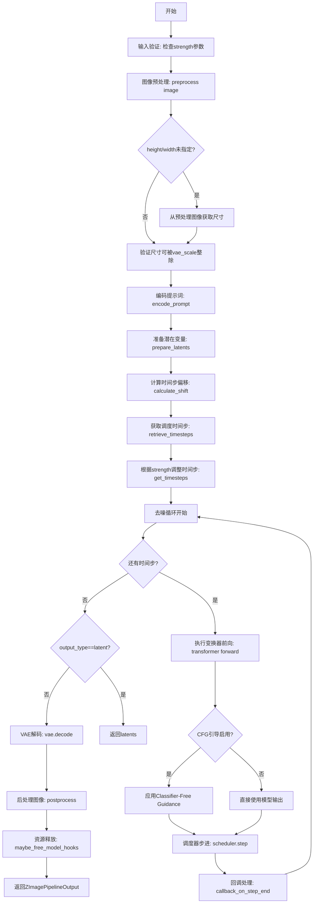
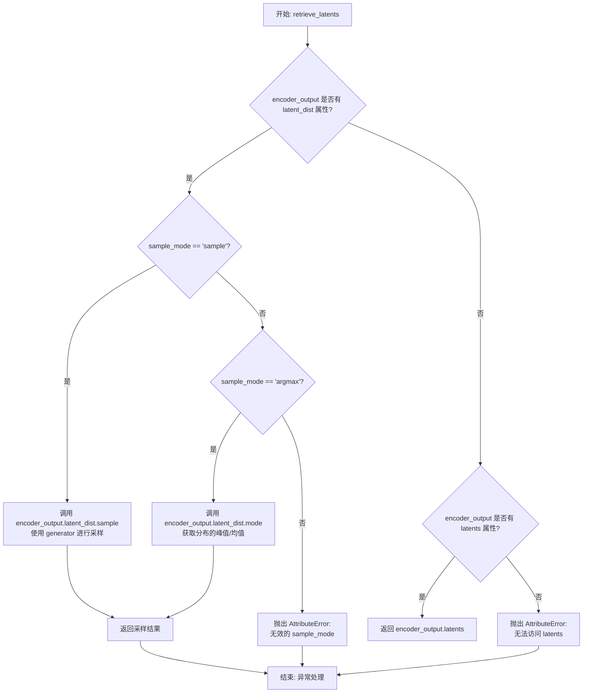
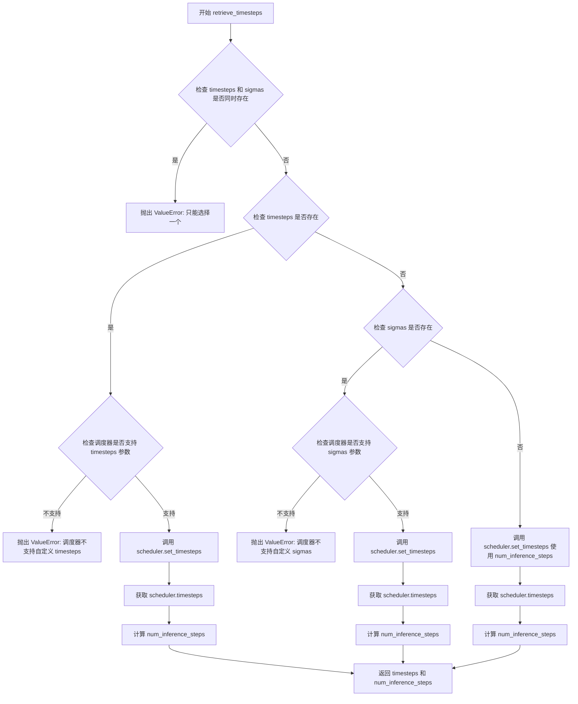
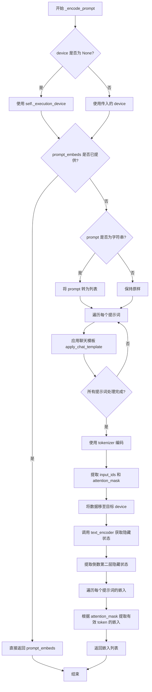
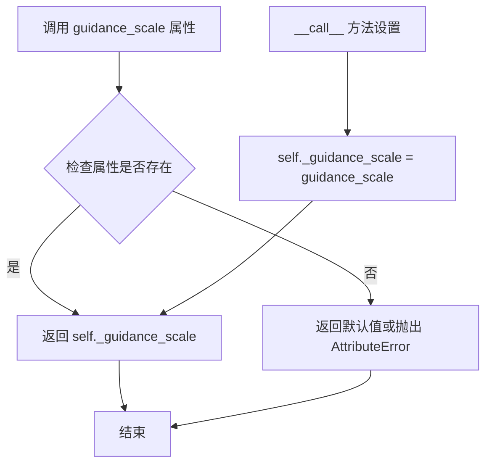
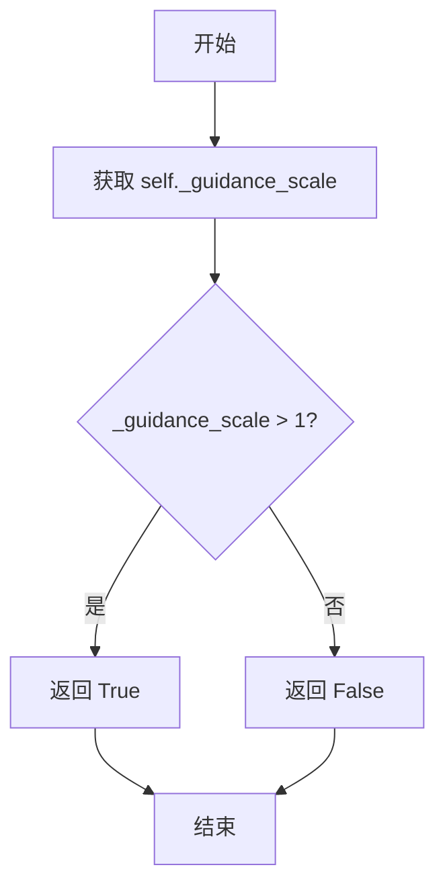
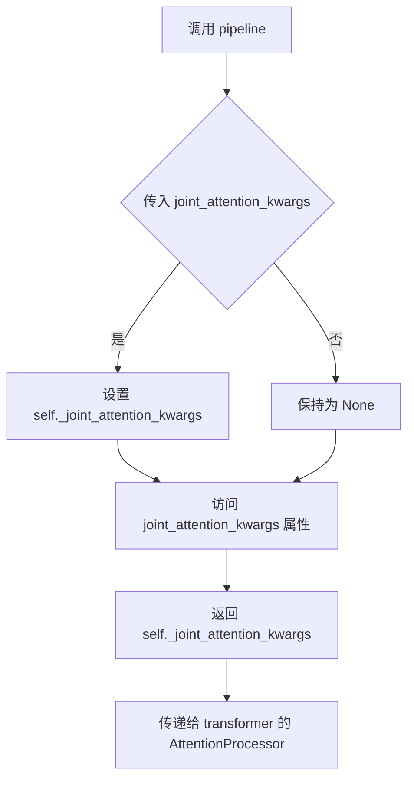
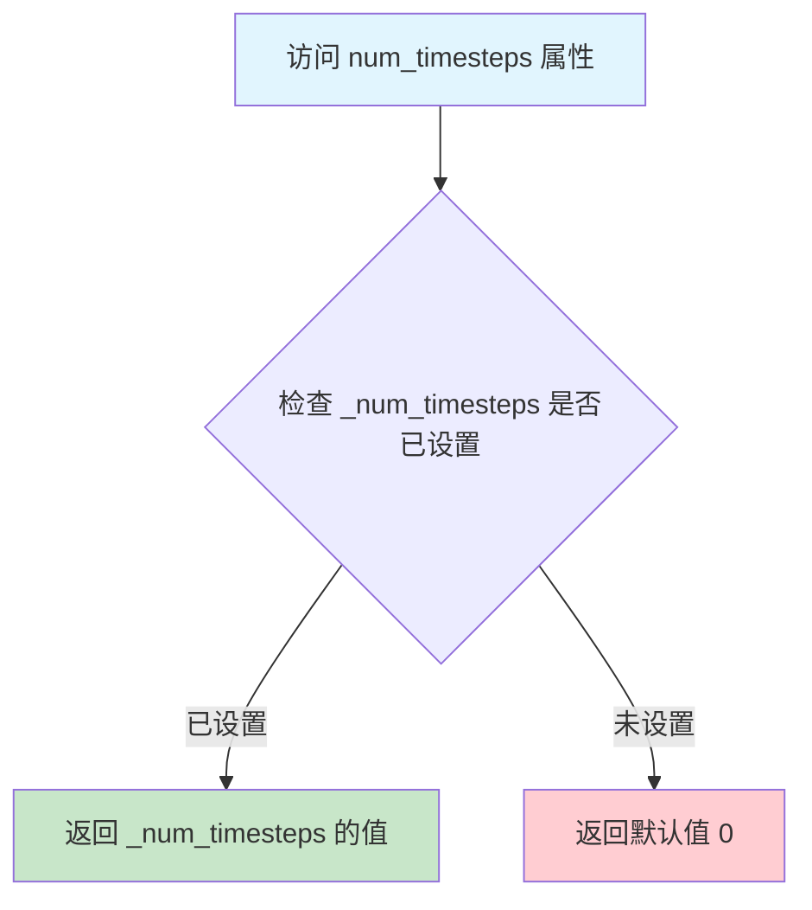
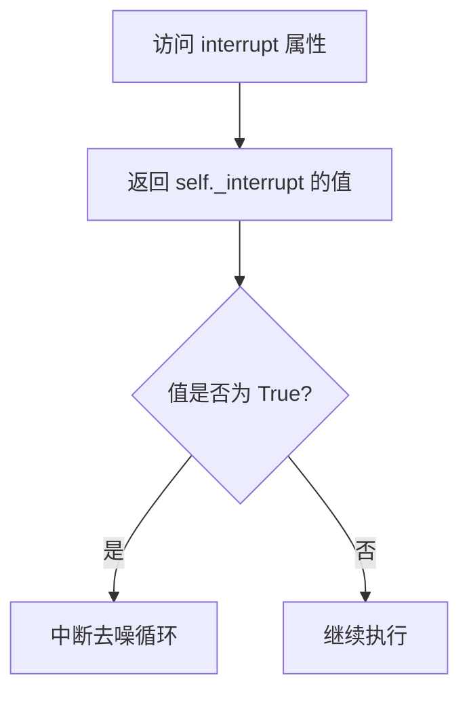

# `diffusers\src\diffusers\pipelines\z_image\pipeline_z_image_img2img.py` 详细设计文档

Z-Image图像到图像（img2img）扩散管道实现，基于FlowMatchEulerDiscreteScheduler调度器和ZImageTransformer2DModel变换器模型，实现文本提示引导的图像转换生成，支持VAE编解码、CLIP文本编码、Classifier-Free Guidance引导降噪等核心功能。

## 整体流程



## 类结构

```
DiffusionPipeline (抽象基类)
├── ZImageLoraLoaderMixin (LoRA加载混入)
├── FromSingleFileMixin (单文件加载混入)
└── ZImageImg2ImgPipeline (图像到图像管道)
```

## 全局变量及字段


### `logger`
    
模块日志记录器，用于记录管道运行过程中的日志信息

类型：`logging.Logger`
    


### `EXAMPLE_DOC_STRING`
    
示例文档字符串，包含管道使用示例和代码演示

类型：`str`
    


### `ZImageImg2ImgPipeline.scheduler`
    
扩散调度器，用于控制去噪过程的时间步进

类型：`FlowMatchEulerDiscreteScheduler`
    


### `ZImageImg2ImgPipeline.vae`
    
变分自编码器，用于编码和解码图像与潜在表示

类型：`AutoencoderKL`
    


### `ZImageImg2ImgPipeline.text_encoder`
    
文本编码器模型，用于将文本提示编码为嵌入向量

类型：`PreTrainedModel`
    


### `ZImageImg2ImgPipeline.tokenizer`
    
分词器，用于将文本提示转换为token序列

类型：`AutoTokenizer`
    


### `ZImageImg2ImgPipeline.transformer`
    
图像变换器模型，用于对编码的图像潜在表示进行去噪

类型：`ZImageTransformer2DModel`
    


### `ZImageImg2ImgPipeline.vae_scale_factor`
    
VAE缩放因子，用于计算潜在空间的缩放比例

类型：`int`
    


### `ZImageImg2ImgPipeline.image_processor`
    
图像处理器，用于图像的预处理和后处理

类型：`VaeImageProcessor`
    


### `ZImageImg2ImgPipeline._guidance_scale`
    
引导尺度，用于控制文本提示对生成图像的影响程度

类型：`float`
    


### `ZImageImg2ImgPipeline._joint_attention_kwargs`
    
联合注意力参数字典，用于传递注意力机制的额外参数

类型：`dict[str, Any]`
    


### `ZImageImg2ImgPipeline._interrupt`
    
中断标志，用于控制去噪循环的中断

类型：`bool`
    


### `ZImageImg2ImgPipeline._cfg_normalization`
    
CFG归一化标志，用于控制是否对无分类器引导进行归一化处理

类型：`bool`
    


### `ZImageImg2ImgPipeline._cfg_truncation`
    
CFG截断值，用于在去噪过程中截断无分类器引导

类型：`float`
    


### `ZImageImg2ImgPipeline._num_timesteps`
    
时间步数，记录去噪过程的总步数

类型：`int`
    


### `ZImageImg2ImgPipeline.model_cpu_offload_seq`
    
CPU卸载顺序，定义模型组件卸载到CPU的顺序

类型：`str`
    


### `ZImageImg2ImgPipeline._optional_components`
    
可选组件列表，定义管道中可选的模型组件

类型：`list`
    


### `ZImageImg2ImgPipeline._callback_tensor_inputs`
    
回调张量输入列表，定义回调函数可访问的张量变量

类型：`list[str]`
    
    

## 全局函数及方法


### `calculate_shift`

计算图像序列长度的偏移量（mu值），用于根据输入图像的序列长度动态调整调度器（scheduler）的参数，实现自适应的噪声调度。

参数：

- `image_seq_len`：`int`，图像序列长度，即图像在潜在空间中的token数量
- `base_seq_len`：`int`（默认值为 256），基础序列长度，用于线性插值的起始点
- `max_seq_len`：`int`（默认值为 4096），最大序列长度，用于线性插值的终点
- `base_shift`：`float`（默认值为 0.5），基础偏移量，对应 base_seq_len 时的偏移值
- `max_shift`：`float`（默认值为 1.15），最大偏移量，对应 max_seq_len 时的偏移值

返回值：`float`，计算得到的偏移量 mu，用于传递给调度器的参数

#### 流程图

```mermaid
flowchart TD
    A[开始 calculate_shift] --> B[输入参数<br/>image_seq_len, base_seq_len, max_seq_len<br/>base_shift, max_shift]
    B --> C[计算斜率 m = (max_shift - base_shift) / (max_seq_len - base_seq_len)]
    C --> D[计算截距 b = base_shift - m * base_seq_len]
    D --> E[计算偏移量 mu = image_seq_len * m + b]
    E --> F[返回 mu]
    
    style A fill:#f9f,stroke:#333
    style F fill:#9f9,stroke:#333
```

#### 带注释源码

```python
# Copied from diffusers.pipelines.flux.pipeline_flux.calculate_shift
def calculate_shift(
    image_seq_len,          # 图像序列长度（输入）
    base_seq_len: int = 256,      # 基础序列长度，默认256
    max_seq_len: int = 4096,      # 最大序列长度，默认4096
    base_shift: float = 0.5,     # 基础偏移量，默认0.5
    max_shift: float = 1.15,     # 最大偏移量，默认1.15
):
    # 计算线性插值的斜率 m
    # 斜率 = (最大偏移 - 基础偏移) / (最大序列长度 - 基础序列长度)
    m = (max_shift - base_shift) / (max_seq_len - base_seq_len)
    
    # 计算线性插值的截距 b
    # 截距 = 基础偏移 - 斜率 * 基础序列长度
    b = base_shift - m * base_seq_len
    
    # 计算最终的偏移量 mu
    # mu = 图像序列长度 * 斜率 + 截距
    mu = image_seq_len * m + b
    
    # 返回计算得到的偏移量，用于调整调度器参数
    return mu
```


### `retrieve_latents`

从编码器输出中提取潜在表示，支持 sample（采样）和 argmax（取模）两种模式，根据 encoder_output 的属性灵活获取 latent 值。

参数：

- `encoder_output`：`torch.Tensor`，编码器输出对象，可能包含 `latent_dist` 属性（分布对象）或 `latents` 属性（直接的张量）
- `generator`：`torch.Generator | None`，可选的随机数生成器，用于采样模式下的确定性生成
- `sample_mode`：`str`，采样模式，默认为 `"sample"`（从分布中采样），可设为 `"argmax"`（取分布的均值/模式）

返回值：`torch.Tensor`，提取出的潜在表示张量，形状为 (batch, channels, height, width)

#### 流程图



#### 带注释源码

```python
# Copied from diffusers.pipelines.stable_diffusion.pipeline_stable_diffusion_img2img.retrieve_latents
def retrieve_latents(
    encoder_output: torch.Tensor, generator: torch.Generator | None = None, sample_mode: str = "sample"
):
    """
    从编码器输出中提取潜在表示。
    
    该函数支持两种提取模式：
    1. sample 模式：从潜在分布中采样（适用于需要随机性的场景）
    2. argmax 模式：取潜在分布的均值/峰值（适用于确定性场景）
    
    同时也支持直接返回预计算的 latents 张量。
    """
    # 检查 encoder_output 是否有 latent_dist 属性（表示输出是分布形式）
    if hasattr(encoder_output, "latent_dist") and sample_mode == "sample":
        # sample 模式：从潜在分布中采样，可使用 generator 控制随机性
        return encoder_output.latent_dist.sample(generator)
    # argmax 模式：取分布的均值/峰值（最可能的潜在表示）
    elif hasattr(encoder_output, "latent_dist") and sample_mode == "argmax":
        return encoder_output.latent_dist.mode()
    # 检查 encoder_output 是否有直接的 latents 属性（预计算的张量）
    elif hasattr(encoder_output, "latents"):
        return encoder_output.latents
    # 如果都不满足，抛出异常
    else:
        raise AttributeError("Could not access latents of provided encoder_output")
```


### `retrieve_timesteps`

该函数是图像生成管道中的时间步检索工具函数，负责从调度器获取时间步序列。它支持三种方式来配置时间步：通过指定推理步数、使用自定义时间步列表或使用自定义sigma值。函数内部会验证调度器是否支持所请求的时间步配置方式，并将调度器设置的时间步返回给调用者。

参数：

- `scheduler`：`SchedulerMixin`，调度器对象，用于生成时间步序列
- `num_inference_steps`：`int | None`，扩散模型生成样本时使用的去噪步数，若使用此参数则`timesteps`必须为`None`
- `device`：`str | torch.device | None`，时间步要移动到的目标设备，若为`None`则不移动时间步
- `timesteps`：`list[int] | None`，自定义时间步列表，用于覆盖调度器的时间步间隔策略，若传入此参数则`num_inference_steps`和`sigmas`必须为`None`
- `sigmas`：`list[float] | None`，自定义sigma值列表，用于覆盖调度器的时间步间隔策略，若传入此参数则`num_inference_steps`和`timesteps`必须为`None`
- `**kwargs`：任意关键字参数，将传递给调度器的`set_timesteps`方法

返回值：`tuple[torch.Tensor, int]`，元组包含两个元素——第一个是调度器的时间步调度张量，第二个是推理步数

#### 流程图



#### 带注释源码

```python
# Copied from diffusers.pipelines.stable_diffusion.pipeline_stable_diffusion.retrieve_timesteps
def retrieve_timesteps(
    scheduler,
    num_inference_steps: int | None = None,
    device: str | torch.device | None = None,
    timesteps: list[int] | None = None,
    sigmas: list[float] | None = None,
    **kwargs,
):
    r"""
    Calls the scheduler's `set_timesteps` method and retrieves timesteps from the scheduler after the call. Handles
    custom timesteps. Any kwargs will be supplied to `scheduler.set_timesteps`.

    Args:
        scheduler (`SchedulerMixin`):
            The scheduler to get timesteps from.
        num_inference_steps (`int`):
            The number of diffusion steps used when generating samples with a pre-trained model. If used, `timesteps`
            must be `None`.
        device (`str` or `torch.device`, *optional*):
            The device to which the timesteps should be moved to. If `None`, the timesteps are not moved.
        timesteps (`list[int]`, *optional*):
            Custom timesteps used to override the timestep spacing strategy of the scheduler. If `timesteps` is passed,
            `num_inference_steps` and `sigmas` must be `None`.
        sigmas (`list[float]`, *optional*):
            Custom sigmas used to override the timestep spacing strategy of the scheduler. If `sigmas` is passed,
            `num_inference_steps` and `timesteps` must be `None`.

    Returns:
        `tuple[torch.Tensor, int]`: A tuple where the first element is the timestep schedule from the scheduler and the
        second element is the number of inference steps.
    """
    # 验证：timesteps 和 sigmas 不能同时指定，只能选择其中一种自定义方式
    if timesteps is not None and sigmas is not None:
        raise ValueError("Only one of `timesteps` or `sigmas` can be passed. Please choose one to set custom values")
    
    # 分支1：处理自定义 timesteps 的情况
    if timesteps is not None:
        # 通过 inspect 模块检查调度器的 set_timesteps 方法是否支持 timesteps 参数
        accepts_timesteps = "timesteps" in set(inspect.signature(scheduler.set_timesteps).parameters.keys())
        if not accepts_timesteps:
            raise ValueError(
                f"The current scheduler class {scheduler.__class__}'s `set_timesteps` does not support custom"
                f" timestep schedules. Please check whether you are using the correct scheduler."
            )
        # 调用调度器的 set_timesteps 方法设置自定义时间步
        scheduler.set_timesteps(timesteps=timesteps, device=device, **kwargs)
        # 从调度器获取设置后的时间步
        timesteps = scheduler.timesteps
        # 计算推理步数（时间步的数量）
        num_inference_steps = len(timesteps)
    
    # 分支2：处理自定义 sigmas 的情况
    elif sigmas is not None:
        # 检查调度器是否支持 sigmas 参数
        accept_sigmas = "sigmas" in set(inspect.signature(scheduler.set_timesteps).parameters.keys())
        if not accept_sigmas:
            raise ValueError(
                f"The current scheduler class {scheduler.__class__}'s `set_timesteps` does not support custom"
                f" sigmas schedules. Please check whether you are using the correct scheduler."
            )
        # 调用调度器的 set_timesteps 方法设置自定义 sigmas
        scheduler.set_timesteps(sigmas=sigmas, device=device, **kwargs)
        # 从调度器获取设置后的时间步
        timesteps = scheduler.timesteps
        # 计算推理步数
        num_inference_steps = len(timesteps)
    
    # 分支3：使用默认方式，通过 num_inference_steps 设置时间步
    else:
        scheduler.set_timesteps(num_inference_steps, device=device, **kwargs)
        timesteps = scheduler.timesteps
    
    # 返回时间步序列和推理步数
    return timesteps, num_inference_steps
```


### `ZImageImg2ImgPipeline.__init__`

初始化 ZImage 图像到图像生成管道，创建并注册所有必需的组件（调度器、VAE、文本编码器、分词器和变换器），并初始化图像处理器。

参数：

- `scheduler`：`FlowMatchEulerDiscreteScheduler`，用于与变换器一起去噪编码图像潜在表示的调度器
- `vae`：`AutoencoderKL`， variational auto-encoder 模型，用于在潜在表示之间对图像进行编码和解码
- `text_encoder`：`PreTrainedModel`，用于对文本提示进行编码的文本编码器模型
- `tokenizer`：`AutoTokenizer`，用于对文本提示进行分词的分词器
- `transformer`：`ZImageTransformer2DModel`，用于对编码图像潜在表示进行去噪的 ZImage 变换器模型

返回值：`None`，构造函数不返回任何值，仅初始化对象状态

#### 流程图

```mermaid
flowchart TD
    A[开始 __init__] --> B[调用 super().__init__]
    B --> C[调用 register_modules 注册所有模块]
    C --> D{检查 vae 是否存在且非空}
    D -->|是| E[根据 vae.config.block_out_channels 计算 vae_scale_factor]
    D -->|否| F[使用默认值 8]
    E --> G[创建 VaeImageProcessor]
    F --> G
    G --> H[结束 __init__]
```

#### 带注释源码

```
def __init__(
    self,
    scheduler: FlowMatchEulerDiscreteScheduler,  # 调度器：用于去噪过程的调度算法
    vae: AutoencoderKL,  # VAE：变分自编码器，用于图像与潜在表示之间的转换
    text_encoder: PreTrainedModel,  # 文本编码器：将文本提示转换为嵌入向量
    tokenizer: AutoTokenizer,  # 分词器：将文本转换为 token ID
    transformer: ZImageTransformer2DModel,  # 变换器：执行主要的去噪推理
):
    # 调用父类 DiffusionPipeline 的初始化方法
    # 设置基本的管道配置和执行设备
    super().__init__()

    # 注册所有模块到管道中，使其可通过 self.xxx 访问
    # 同时注册到 _internal_dict 用于序列化等用途
    self.register_modules(
        vae=vae,
        text_encoder=text_encoder,
        tokenizer=tokenizer,
        scheduler=scheduler,
        transformer=transformer,
    )
    
    # 计算 VAE 缩放因子
    # 用于调整潜在空间与像素空间之间的尺寸对应关系
    # 公式：2^(层数-1)，典型值为 8
    self.vae_scale_factor = (
        2 ** (len(self.vae.config.block_out_channels) - 1) 
        if hasattr(self, "vae") and self.vae is not None else 8
    )
    
    # 初始化图像预处理器
    # vae_scale_factor * 2 是因为潜在表示在空间上需要进一步降采样
    # 用于将输入图像预处理为管道所需的格式
    self.image_processor = VaeImageProcessor(vae_scale_factor=self.vae_scale_factor * 2)
```


### `ZImageImg2ImgPipeline.encode_prompt`

该方法负责将文本提示（prompt）和负向提示（negative_prompt）编码为文本嵌入向量（text embeddings），支持分类器自由引导（Classifier-Free Guidance，CFG）模式下的双 embeddings 生成。

参数：

- `prompt`：`str | list[str]`，用户输入的文本提示，可以是单个字符串或字符串列表
- `device`：`torch.device | None`，指定编码设备，默认为执行设备
- `do_classifier_free_guidance`：`bool`，是否启用分类器自由引导，默认为 True
- `negative_prompt`：`str | list[str] | None`，负向提示，用于引导模型避免生成不希望的内容
- `prompt_embeds`：`list[torch.FloatTensor] | None`，预生成的提示 embeddings，若提供则跳过编码
- `negative_prompt_embeds`：`torch.FloatTensor | None`，预生成的负向提示 embeddings
- `max_sequence_length`：`int`，最大序列长度，默认为 512

返回值：`tuple[list[torch.FloatTensor], list[torch.FloatTensor]]`，返回 (prompt_embeds, negative_prompt_embeds) 元组，分别对应正向和负向提示的 embeddings 列表

#### 流程图

```mermaid
flowchart TD
    A[encode_prompt 开始] --> B{prompt 是字符串?}
    B -->|是| C[转换为列表]
    B -->|否| D[保持列表]
    C --> E{prompt_embeds 已提供?}
    D --> E
    E -->|是| F[直接返回 prompt_embeds]
    E -->|否| G[调用 _encode_prompt 编码]
    G --> H{do_classifier_free_guidance?}
    H -->|是| I{negative_prompt 为空?}
    H -->|否| J[negative_prompt_embeds = 空列表]
    I -->|是| K[negative_prompt = 空字符串列表]
    I -->|否| L{negative_prompt 是字符串?}
    L -->|是| M[转换为列表]
    L -->|否| N[保持列表]
    K --> O[调用 _encode_prompt 编码 negative_prompt]
    M --> O
    N --> O
    O --> P[返回 (prompt_embeds, negative_prompt_embeds)]
    J --> P
    F --> P
```

#### 带注释源码

```python
def encode_prompt(
    self,
    prompt: str | list[str],                          # 输入文本提示
    device: torch.device | None = None,              # 计算设备
    do_classifier_free_guidance: bool = True,        # 是否启用 CFG
    negative_prompt: str | list[str] | None = None,  # 负向提示
    prompt_embeds: list[torch.FloatTensor] | None = None,  # 预计算的提示 embeddings
    negative_prompt_embeds: torch.FloatTensor | None = None, # 预计算的负向 embeddings
    max_sequence_length: int = 512,                  # 最大序列长度
):
    # 将单个字符串 prompt 转换为列表，统一处理逻辑
    prompt = [prompt] if isinstance(prompt, str) else prompt
    
    # 调用内部方法 _encode_prompt 进行正向提示编码
    # 如果 prompt_embeds 已提供，此处会直接返回（见 _encode_prompt 实现）
    prompt_embeds = self._encode_prompt(
        prompt=prompt,
        device=device,
        prompt_embeds=prompt_embeds,
        max_sequence_length=max_sequence_length,
    )

    # 如果启用分类器自由引导，需要同时编码负向提示
    if do_classifier_free_guidance:
        # 若未提供负向提示，则使用空字符串（对应无任何引导）
        if negative_prompt is None:
            negative_prompt = ["" for _ in prompt]
        else:
            # 同样将负向提示规范化为列表形式
            negative_prompt = [negative_prompt] if isinstance(negative_prompt, str) else negative_prompt
        
        # 验证 prompt 与 negative_prompt 数量一致
        assert len(prompt) == len(negative_prompt)
        
        # 对负向提示进行编码
        negative_prompt_embeds = self._encode_prompt(
            prompt=negative_prompt,
            device=device,
            prompt_embeds=negative_prompt_embeds,
            max_sequence_length=max_sequence_length,
        )
    else:
        # 不启用 CFG 时，负向 embeddings 为空列表
        negative_prompt_embeds = []
    
    # 返回正向和负向 embeddings 元组
    return prompt_embeds, negative_prompt_embeds


# 内部私有方法：实际执行文本到 embeddings 的编码转换
def _encode_prompt(
    self,
    prompt: str | list[str],
    device: torch.device | None = None,
    prompt_embeds: list[torch.FloatTensor] | None = None,
    max_sequence_length: int = 512,
) -> list[torch.FloatTensor]:
    # 确定设备，优先使用传入设备，否则使用执行设备
    device = device or self._execution_device

    # 若已提供 embeddings，直接返回（缓存复用机制）
    if prompt_embeds is not None:
        return prompt_embeds

    # 统一转换为列表
    if isinstance(prompt, str):
        prompt = [prompt]

    # 遍历每个 prompt，应用聊天模板进行格式化
    for i, prompt_item in enumerate(prompt):
        messages = [
            {"role": "user", "content": prompt_item},
        ]
        # 使用 tokenizer 的聊天模板处理提示，支持生成提示和思考功能
        prompt_item = self.tokenizer.apply_chat_template(
            messages,
            tokenize=False,              # 不进行 tokenize，仅返回格式化后的文本
            add_generation_prompt=True,  # 添加生成提示
            enable_thinking=True,        # 启用思考模式
        )
        prompt[i] = prompt_item

    # 使用 tokenizer 将文本转换为 tensor 序列
    text_inputs = self.tokenizer(
        prompt,
        padding="max_length",           # 填充到最大长度
        max_length=max_sequence_length, # 最大序列长度
        truncation=True,                # 启用截断
        return_tensors="pt",            # 返回 PyTorch tensor
    )

    # 提取 input_ids 和注意力掩码
    text_input_ids = text_inputs.input_ids.to(device)
    prompt_masks = text_inputs.attention_mask.to(device).bool()

    # 调用文本编码器模型生成 embeddings
    # output_hidden_states=True 返回所有层的隐藏状态
    # 取倒数第二层作为最终的 embeddings（-2 索引）
    prompt_embeds = self.text_encoder(
        input_ids=text_input_ids,
        attention_mask=prompt_masks,
        output_hidden_states=True,
    ).hidden_states[-2]

    # 后处理：根据注意力掩码过滤无效 token 的 embeddings
    embeddings_list = []
    for i in range(len(prompt_embeds)):
        # 仅保留有效 token 对应的 embedding（根据 attention_mask）
        embeddings_list.append(prompt_embeds[i][prompt_masks[i]])

    return embeddings_list
```


### `ZImageImg2ImgPipeline._encode_prompt`

该方法是 ZImageImg2ImgPipeline 类中的内部提示词编码方法，负责将文本提示词转换为模型可用的嵌入向量。它通过 tokenizer 应用聊天模板，将文本 token 化，然后使用 text_encoder 编码，最后根据注意力掩码提取有效的嵌入。

参数：

- `self`：隐式参数，ZImageImg2ImgPipeline 类的实例
- `prompt`：`str | list[str]`，要编码的文本提示词，可以是单个字符串或字符串列表
- `device`：`torch.device | None`，指定计算设备，若为 None 则自动获取执行设备
- `prompt_embeds`：`list[torch.FloatTensor] | None`，可选的预先编码好的提示词嵌入，若提供则直接返回
- `max_sequence_length`：`int = 512`，tokenizer 处理时的最大序列长度

返回值：`list[torch.FloatTensor]`，编码后的提示词嵌入向量列表，每个元素对应一个提示词的嵌入

#### 流程图



#### 带注释源码

```python
def _encode_prompt(
    self,
    prompt: str | list[str],
    device: torch.device | None = None,
    prompt_embeds: list[torch.FloatTensor] | None = None,
    max_sequence_length: int = 512,
) -> list[torch.FloatTensor]:
    """
    编码文本提示词为嵌入向量。
    
    参数:
        prompt: 要编码的提示词，字符串或字符串列表
        device: 目标设备，若为 None 则使用执行设备
        prompt_embeds: 预先编码好的嵌入，若提供则跳过编码直接返回
        max_sequence_length: 最大序列长度，默认 512
    
    返回:
        编码后的提示词嵌入列表
    """
    # 如果未指定设备，则使用管道的执行设备
    device = device or self._execution_device

    # 如果已经提供了嵌入表示，直接返回（避免重复计算）
    if prompt_embeds is not None:
        return prompt_embeds

    # 统一将字符串转为列表处理
    if isinstance(prompt, str):
        prompt = [prompt]

    # 遍历每个提示词，应用聊天模板进行格式化
    # 支持多轮对话格式，并启用思考模式（enable_thinking=True）
    for i, prompt_item in enumerate(prompt):
        messages = [
            {"role": "user", "content": prompt_item},
        ]
        # 使用 tokenizer 的聊天模板格式化提示词
        prompt_item = self.tokenizer.apply_chat_template(
            messages,
            tokenize=False,           # 不进行 token 化，只格式化
            add_generation_prompt=True,  # 添加生成提示
            enable_thinking=True,     # 启用思考模式
        )
        prompt[i] = prompt_item

    # 使用 tokenizer 将文本转为 token IDs 和注意力掩码
    text_inputs = self.tokenizer(
        prompt,
        padding="max_length",        # 填充到最大长度
        max_length=max_sequence_length,
        truncation=True,             # 截断超长序列
        return_tensors="pt",          # 返回 PyTorch 张量
    )

    # 提取 input_ids 和 attention_mask，并移至目标设备
    text_input_ids = text_inputs.input_ids.to(device)
    prompt_masks = text_inputs.attention_mask.to(device).bool()

    # 调用 text_encoder 获取文本的隐藏状态表示
    # output_hidden_states=True 确保返回所有层的隐藏状态
    prompt_embeds = self.text_encoder(
        input_ids=text_input_ids,
        attention_mask=prompt_masks,
        output_hidden_states=True,
    ).hidden_states[-2]  # 取倒数第二层（通常是倒数第二好的表示）

    # 根据注意力掩码提取每个有效 token 的嵌入
    # 移除填充（padding）部分的嵌入
    embeddings_list = []
    for i in range(len(prompt_embeds)):
        # 只保留非填充位置的嵌入
        embeddings_list.append(prompt_embeds[i][prompt_masks[i]])

    return embeddings_list
```


### `ZImageImg2ImgPipeline.get_timesteps`

获取去噪时间步，根据图像到图像转换的强度参数调整推理步数。该方法计算初始时间步，然后从调度器的时间步序列中提取相应的子集，以实现基于强度的噪声调度。

参数：

- `num_inference_steps`：`int`，总推理步数，表示去噪过程的迭代次数
- `strength`：`float`，强度值，范围在 0 到 1 之间，控制原始图像与噪声的混合程度
- `device`：`torch.device`，计算设备，用于指定张量存放的硬件设备

返回值：`tuple[torch.Tensor, int]`，返回元组，第一个元素是调整后的时间步张量，第二个元素是实际执行的推理步数

#### 流程图

```mermaid
flowchart TD
    A[开始 get_timesteps] --> B[计算 init_timestep = min(num_inference_steps × strength, num_inference_steps)]
    B --> C[计算 t_start = max(num_inference_steps - init_timestep, 0)]
    C --> D[从 scheduler.timesteps 切片获取 timesteps<br/>timesteps = scheduler.timesteps[t_start × scheduler.order :]]
    D --> E{scheduler 是否有 set_begin_index 方法?}
    E -->|是| F[调用 scheduler.set_begin_index(t_start × scheduler.order) 设置起始索引]
    E -->|否| G[跳过设置]
    F --> H[返回 timesteps 和 num_inference_steps - t_start]
    G --> H
    H --> I[结束]
```

#### 带注释源码

```
def get_timesteps(self, num_inference_steps, strength, device):
    """
    获取去噪时间步
    
    根据strength参数计算实际使用的时间步，实现基于强度的噪声调度。
    strength越高，使用的推理步数越少，保留更多原始图像信息。
    """
    # 计算初始时间步：取推理步数和 strength*步数 的较小值
    # 这确保了不会超过总推理步数
    init_timestep = min(num_inference_steps * strength, num_inference_steps)

    # 计算起始索引：从总步数中减去初始时间步，得到跳过的步数
    # 如果 strength=1.0，则 t_start=0，使用全部步数
    # 如果 strength=0.5，则 t_start=num_inference_steps/2，使用后半部分步数
    t_start = int(max(num_inference_steps - init_timestep, 0))
    
    # 从调度器的时间步序列中提取子集
    # scheduler.order 表示调度器的阶数，用于正确的顺序访问
    timesteps = self.scheduler.timesteps[t_start * self.scheduler.order :]
    
    # 如果调度器支持，设置起始索引以控制去噪过程的起点
    # 这对于从特定时间步开始去噪很重要
    if hasattr(self.scheduler, "set_begin_index"):
        self.scheduler.set_begin_index(t_start * self.scheduler.order)

    # 返回调整后的时间步和实际推理步数
    # 实际步数 = 总步数 - 跳过的步数
    return timesteps, num_inference_steps - t_start
```


### `ZImageImg2ImgPipeline.prepare_latents`

该方法负责为图像到图像（img2img）生成流程准备潜在变量（latents），包括调整图像尺寸以适配VAE缩放因子、使用VAE编码输入图像为潜在表示、应用缩放和偏移、处理批次大小扩展，以及通过flow matching scheduler向潜在变量添加噪声。

参数：

- `self`：`ZImageImg2ImgPipeline` 实例，管道对象自身
- `image`：`PipelineImageInput`，输入图像数据，用于编码为潜在变量
- `timestep`：`torch.Tensor`，当前扩散时间步，用于噪声缩放
- `batch_size`：`int`，批处理大小，生成的潜在变量数量
- `num_channels_latents`：`int`，潜在变量的通道数，由transformer的输入通道数决定
- `height`：`int`，目标高度（像素），将转换为潜在空间高度
- `width`：`int`，目标宽度（像素），将转换为潜在空间宽度
- `dtype`：`torch.dtype`，潜在变量的数据类型
- `device`：`torch.device`，计算设备（CPU/CUDA）
- `generator`：`torch.Generator | list[torch.Generator] | None`，随机数生成器，用于噪声生成的可控性
- `latents`：`torch.FloatTensor | None`，可选的预生成潜在变量，如果提供则直接返回

返回值：`torch.Tensor`，处理并添加噪声后的潜在变量，用于后续去噪过程

#### 流程图

```mermaid
flowchart TD
    A[开始准备潜在变量] --> B[调整height和width]
    B --> C{latents是否已提供?}
    C -->|是| D[直接将latents移动到目标设备并转换dtype]
    D --> Z[返回latents]
    C -->|否| E[将image移动到目标设备并转换dtype]
    E --> F{image通道数是否匹配?}
    F -->|是| G[使用VAE编码image]
    F -->|否| H{generator是否为list?}
    H -->|是| I[对每张图像分别编码并拼接]
    H -->|否| J[直接编码整个图像批次]
    I --> K[检索潜在表示]
    J --> K
    G --> K
    K --> L[应用缩放: (latents - shift_factor) * scaling_factor]
    L --> M{批次大小扩展?}
    M -->|batch_size > image_latents.shape[0] 且可整除| N[复制image_latents以匹配batch_size]
    M -->|batch_size > image_latents.shape[0] 且不可整除| O[抛出ValueError异常]
    M -->|否则| P[直接使用image_latents]
    N --> Q
    P --> Q
    O --> Z
    Q --> R[生成噪声: randn_tensor]
    R --> S[使用scheduler的scale_noise方法添加噪声]
    S --> Z
```

#### 带注释源码

```python
def prepare_latents(
    self,
    image,                          # PipelineImageInput: 输入图像
    timestep,                       # torch.Tensor: 当前时间步
    batch_size,                     # int: 批处理大小
    num_channels_latents,           # int: 潜在变量通道数
    height,                         # int: 目标高度
    width,                          # int: 目标宽度
    dtype,                          # torch.dtype: 数据类型
    device,                         # torch.device: 计算设备
    generator,                      # torch.Generator: 随机生成器
    latents=None,                   # torch.FloatTensor | None: 可选的预生成latents
):
    """
    准备用于图像到图像生成的潜在变量。
    
    该方法执行以下步骤：
    1. 根据VAE缩放因子调整图像尺寸
    2. 使用VAE将输入图像编码为潜在表示
    3. 应用VAE的缩放因子和偏移因子
    4. 处理批次大小扩展（支持批量图像生成）
    5. 使用flow matching scheduler添加噪声
    """
    
    # 步骤1: 调整高度和宽度以适配VAE的缩放因子
    # VAE的缩放因子通常是2的幂次方，这里乘以2以确保正确的空间维度
    height = 2 * (int(height) // (self.vae_scale_factor * 2))
    width = 2 * (int(width) // (self.vae_scale_factor * 2))
    
    # 定义潜在变量的形状: (batch_size, channels, height, width)
    shape = (batch_size, num_channels_latents, height, width)
    
    # 步骤2: 如果已经提供了latents，直接返回（跳过编码和噪声添加）
    if latents is not None:
        return latents.to(device=device, dtype=dtype)
    
    # 步骤3: 将输入图像移动到目标设备并转换数据类型
    image = image.to(device=device, dtype=dtype)
    
    # 步骤4: 检查图像通道数是否与潜在变量通道数匹配
    if image.shape[1] != num_channels_latents:
        # 通道数不匹配，需要使用VAE编码图像
        
        # 根据generator类型决定编码策略
        if isinstance(generator, list):
            # 如果有多个generator（每个样本一个），分别编码每张图像
            image_latents = [
                # 检索编码器输出的潜在分布样本
                retrieve_latents(self.vae.encode(image[i : i + 1]), generator=generator[i])
                for i in range(image.shape[0])
            ]
            # 沿批次维度拼接所有图像的潜在表示
            image_latents = torch.cat(image_latents, dim=0)
        else:
            # 单个generator，一次性编码整个图像批次
            image_latents = retrieve_latents(self.vae.encode(image), generator=generator)
        
        # 步骤5: 应用VAE的缩放因子和偏移因子
        # 这是编码的逆操作：解码时是 (latents / scaling_factor) + shift_factor
        # 所以编码时需要反过来：(latents - shift_factor) * scaling_factor
        image_latents = (image_latents - self.vae.config.shift_factor) * self.vae.config.scaling_factor
    else:
        # 图像已经是潜在表示形式，直接使用
        image_latents = image
    
    # 步骤6: 处理批次大小扩展
    # 当需要生成的图像数量大于编码的潜在变量数量时
    if batch_size > image_latents.shape[0] and batch_size % image_latents.shape[0] == 0:
        # 可以整除，复制潜在变量以匹配批次大小
        additional_image_per_prompt = batch_size // image_latents.shape[0]
        image_latents = torch.cat([image_latents] * additional_image_per_prompt, dim=0)
    elif batch_size > image_latents.shape[0] and batch_size % image_latents.shape[0] != 0:
        # 不能整除，抛出错误
        raise ValueError(
            f"Cannot duplicate `image` of batch size {image_latents.shape[0]} to {batch_size} text prompts."
        )
    
    # 步骤7: 生成随机噪声并使用flow matching scheduler进行缩放
    # 使用randn_tensor生成指定形状的随机噪声
    noise = randn_tensor(shape, generator=generator, device=device, dtype=dtype)
    
    # scale_noise方法根据当前时间步将噪声添加到图像潜在变量
    # 这是flow matching方法中的关键步骤
    latents = self.scheduler.scale_noise(image_latents, timestep, noise)
    
    # 返回处理后的潜在变量
    return latents
```


### `ZImageImg2ImgPipeline.__call__`

ZImageImg2ImgPipeline的主推理调用方法，用于基于输入图像和文本提示词生成图像到图像转换的结果。该方法通过编码提示词、准备潜在向量、执行去噪循环（包括分类器自由引导CFG、配置截断和归一化），最后解码潜在向量到像素空间来完成任务。

参数：

- `prompt`：`str | list[str] | None`，提示词或提示词列表，用于引导图像生成
- `image`：`PipelineImageInput`，输入图像，作为图像到图像转换的起点
- `strength`：`float`，转换强度，范围[0,1]，值越大添加的噪声越多，转换程度越高
- `height`：`int | None`，生成图像的高度，默认为输入图像高度
- `width`：`int | None`，生成图像的宽度，默认为输入图像宽度
- `num_inference_steps`：`int`，去噪步数，默认50步
- `sigmas`：`list[float] | None`，自定义sigma值，用于支持自定义调度器
- `guidance_scale`：`float`，分类器自由引导尺度，默认5.0
- `cfg_normalization`：`bool`，是否启用配置归一化，默认False
- `cfg_truncation`：`float`，配置截断值，用于CFG截断策略，默认1.0
- `negative_prompt`：`str | list[str] | None`，负面提示词，用于引导生成不想要的元素
- `num_images_per_prompt`：`int`，每个提示词生成的图像数量，默认1
- `generator`：`torch.Generator | list[torch.Generator] | None`，随机生成器，用于确保可重复性
- `latents`：`torch.FloatTensor | None`，预生成的噪声潜在向量
- `prompt_embeds`：`list[torch.FloatTensor] | None`，预生成的文本嵌入
- `negative_prompt_embeds`：`list[torch.FloatTensor] | None`，预生成的负面文本嵌入
- `output_type`：`str | None`，输出格式，默认"pil"
- `return_dict`：`bool`，是否返回字典格式，默认True
- `joint_attention_kwargs`：`dict[str, Any] | None`，传递给注意力处理器的参数字典
- `callback_on_step_end`：`Callable[[int, int], None] | None`，每个去噪步骤结束时的回调函数
- `callback_on_step_end_tensor_inputs`：`list[str]`，回调函数可访问的张量输入列表
- `max_sequence_length`：`int`，最大序列长度，默认512

返回值：`ZImagePipelineOutput | tuple`，生成的图像输出，当return_dict为True时返回ZImagePipelineOutput对象

#### 流程图

```mermaid
flowchart TD
    A[开始 __call__] --> B{验证 strength 在 [0,1]}
    B -->|否| B1[抛出 ValueError]
    B -->|是| C[预处理输入图像 init_image]
    C --> D{检查 height/width}
    D -->|未指定| E[从预处理图像获取尺寸]
    D -->|已指定| F[验证尺寸可被 vae_scale 整除]
    F --> G[设置设备 device]
    G --> H[初始化内部状态<br/>_guidance_scale, _joint_attention_kwargs<br/>_interrupt, _cfg_normalization, _cfg_truncation]
    H --> I{计算 batch_size}
    I --> J{编码提示词}
    J -->|prompt_embeds已提供| K[验证negative_prompt_embeds]
    J -->|需要编码| L[调用 encode_prompt]
    K --> L
    L --> M[准备潜在变量]
    M --> N[计算 latent 尺寸和 image_seq_len]
    N --> O[计算 scheduler shift mu]
    O --> P[获取 timesteps]
    P --> Q[根据 strength 调整 timesteps]
    Q --> R{验证 num_inference_steps >= 1}
    R -->|否| R1[抛出 ValueError]
    R -->|是| S[准备初始 latents]
    S --> T[进入去噪循环]
    T --> U{遍历每个 timestep t}
    U --> V{检查 interrupt]
    V -->|是| V1[continue 跳过]
    V -->|否| W[扩展 timestep 到 batch 维度]
    W --> X[计算归一化时间 t_norm]
    X --> Y{应用 CFG 截断]
    Y -->|满足条件| Z[设置 current_guidance_scale = 0]
    Y -->|不满足| AA[保持 current_guidance_scale]
    Z --> AB{决定是否应用 CFG]
    AA --> AB
    AB -->|是| AC[复制 latents x2<br/>组合 prompt_embeds<br/>重复 timestep x2]
    AB -->|否| AD[保持原始输入]
    AC --> AE[调用 transformer 进行推理]
    AD --> AE
    AE --> AF{apply_cfg 为真?}
    AF -->|是| AG[分离正负输出<br/>应用 CFG 公式<br/>可选归一化]
    AF -->|否| AH[直接堆叠输出]
    AG --> AI[计算上一步 x_t-1]
    AH --> AI
    AI --> AJ[scheduler.step 更新 latents]
    AJ --> AK[执行 callback_on_step_end]
    AK --> AL{检查是否更新 progress_bar}
    AL -->|是| AM[progress_bar.update]
    AL -->|否| AN[继续下一轮]
    AM --> AO{所有 timesteps 遍历完?}
    AN --> AO
    AO -->|否| U
    AO -->|是| AP{output_type == 'latent'?}
    AP -->|是| AQ[直接返回 latents]
    AP -->|否| AR[解码 latents 到图像<br/>后处理图像]
    AQ --> AS[释放模型钩子]
    AR --> AS
    AS --> AT{return_dict 为真?}
    AT -->|是| AU[返回 ZImagePipelineOutput]
    AT -->|否| AV[返回 tuple]
    AU --> AV
    AV --> AX[结束]
```

#### 带注释源码

```python
@torch.no_grad()
@replace_example_docstring(EXAMPLE_DOC_STRING)
def __call__(
    self,
    prompt: str | list[str] = None,
    image: PipelineImageInput = None,
    strength: float = 0.6,
    height: int | None = None,
    width: int | None = None,
    num_inference_steps: int = 50,
    sigmas: list[float] | None = None,
    guidance_scale: float = 5.0,
    cfg_normalization: bool = False,
    cfg_truncation: float = 1.0,
    negative_prompt: str | list[str] | None = None,
    num_images_per_prompt: int | None = 1,
    generator: torch.Generator | list[torch.Generator] | None = None,
    latents: torch.FloatTensor | None = None,
    prompt_embeds: list[torch.FloatTensor] | None = None,
    negative_prompt_embeds: list[torch.FloatTensor] | None = None,
    output_type: str | None = "pil",
    return_dict: bool = True,
    joint_attention_kwargs: dict[str, Any] | None = None,
    callback_on_step_end: Callable[[int, int], None] | None = None,
    callback_on_step_end_tensor_inputs: list[str] = ["latents"],
    max_sequence_length: int = 512,
):
    r"""
    Function invoked when calling the pipeline for image-to-image generation.

    Args:
        prompt (`str` or `list[str]`, *optional*):
            The prompt or prompts to guide the image generation. If not defined, one has to pass `prompt_embeds`.
            instead.
        image (`torch.Tensor`, `PIL.Image.Image`, `np.ndarray`, `list[torch.Tensor]`, `list[PIL.Image.Image]`, or `list[np.ndarray]`):
            `Image`, numpy array or tensor representing an image batch to be used as the starting point. For both
            numpy array and pytorch tensor, the expected value range is between `[0, 1]`. If it's a tensor or a
            list of tensors, the expected shape should be `(B, C, H, W)` or `(C, H, W)`. If it is a numpy array or
            a list of arrays, the expected shape should be `(B, H, W, C)` or `(H, W, C)`.
        strength (`float`, *optional*, defaults to 0.6):
            Indicates extent to transform the reference `image`. Must be between 0 and 1. `image` is used as a
            starting point and more noise is added the higher the `strength`. The number of denoising steps depends
            on the amount of noise initially added. When `strength` is 1, added noise is maximum and the denoising
            process runs for the full number of iterations specified in `num_inference_steps`. A value of 1
            essentially ignores `image`.
        height (`int`, *optional*, defaults to 1024):
            The height in pixels of the generated image. If not provided, uses the input image height.
        width (`int`, *optional*, defaults to 1024):
            The width in pixels of the generated image. If not provided, uses the input image width.
        num_inference_steps (`int`, *optional*, defaults to 50):
            The number of denoising steps. More denoising steps usually lead to a higher quality image at the
            expense of slower inference.
        sigmas (`list[float]`, *optional*):
            Custom sigmas to use for the denoising process with schedulers which support a `sigmas` argument in
            their `set_timesteps` method. If not defined, the default behavior when `num_inference_steps` is passed
            will be used.
        guidance_scale (`float`, *optional*, defaults to 5.0):
            Guidance scale as defined in [Classifier-Free Diffusion Guidance](https://arxiv.org/abs/2207.12598).
            `guidance_scale` is defined as `w` of equation 2. of [Imagen
            Paper](https://arxiv.org/pdf/2205.11487.pdf). Guidance scale is enabled by setting `guidance_scale >
            1`. Higher guidance scale encourages to generate images that are closely linked to the text `prompt`,
            usually at the expense of lower image quality.
        cfg_normalization (`bool`, *optional*, defaults to False):
            Whether to apply configuration normalization.
        cfg_truncation (`float`, *optional*, defaults to 1.0):
            The truncation value for configuration.
        negative_prompt (`str` or `list[str]`, *optional*):
            The prompt or prompts not to guide the image generation. If not defined, one has to pass
            `negative_prompt_embeds` instead. Ignored when not using guidance (i.e., ignored if `guidance_scale` is
            less than `1`).
        num_images_per_prompt (`int`, *optional*, defaults to 1):
            The number of images to generate per prompt.
        generator (`torch.Generator` or `list[torch.Generator]`, *optional*):
            One or a list of [torch generator(s)](https://pytorch.org/docs/stable/generated/torch.Generator.html)
            to make generation deterministic.
        latents (`torch.FloatTensor`, *optional*):
            Pre-generated noisy latents, sampled from a Gaussian distribution, to be used as inputs for image
            generation. Can be used to tweak the same generation with different prompts. If not provided, a latents
            tensor will be generated by sampling using the supplied random `generator`.
        prompt_embeds (`list[torch.FloatTensor]`, *optional*):
            Pre-generated text embeddings. Can be used to easily tweak text inputs, *e.g.* prompt weighting. If not
            provided, text embeddings will be generated from `prompt` input argument.
        negative_prompt_embeds (`list[torch.FloatTensor]`, *optional*):
            Pre-generated negative text embeddings. Can be used to easily tweak text inputs, *e.g.* prompt
            weighting. If not provided, negative_prompt_embeds will be generated from `negative_prompt` input
            argument.
        output_type (`str`, *optional*, defaults to `"pil"`):
            The output format of the generate image. Choose between
            [PIL](https://pillow.readthedocs.io/en/stable/): `PIL.Image.Image` or `np.array`.
        return_dict (`bool`, *optional*, defaults to `True`):
            Whether or not to return a [`~pipelines.stable_diffusion.ZImagePipelineOutput`] instead of a plain
            tuple.
        joint_attention_kwargs (`dict`, *optional*):
            A kwargs dictionary that if specified is passed along to the `AttentionProcessor` as defined under
            `self.processor` in
            [diffusers.models.attention_processor](https://github.com/huggingface/diffusers/blob/main/src/diffusers/models/attention_processor.py).
        callback_on_step_end (`Callable`, *optional*):
            A function that calls at the end of each denoising steps during the inference. The function is called
            with the following arguments: `callback_on_step_end(self: DiffusionPipeline, step: int, timestep: int,
            callback_kwargs: Dict)`. `callback_kwargs` will include a list of all tensors as specified by
            `callback_on_step_end_tensor_inputs`.
        callback_on_step_end_tensor_inputs (`List`, *optional*):
            The list of tensor inputs for the `callback_on_step_end` function. The tensors specified in the list
            will be passed as `callback_kwargs` argument. You will only be able to include variables listed in the
            `._callback_tensor_inputs` attribute of your pipeline class.
        max_sequence_length (`int`, *optional*, defaults to 512):
            Maximum sequence length to use with the `prompt`.

    Examples:

    Returns:
        [`~pipelines.z_image.ZImagePipelineOutput`] or `tuple`: [`~pipelines.z_image.ZImagePipelineOutput`] if
        `return_dict` is True, otherwise a `tuple`. When returning a tuple, the first element is a list with the
        generated images.
    """
    # 1. Check inputs and validate strength
    # 验证 strength 参数是否在有效范围内 [0, 1]
    if strength < 0 or strength > 1:
        raise ValueError(f"The value of strength should be in [0.0, 1.0] but is {strength}")

    # 2. Preprocess image
    # 预处理输入图像，将其转换为模型所需的格式
    init_image = self.image_processor.preprocess(image)
    init_image = init_image.to(dtype=torch.float32)

    # Get dimensions from the preprocessed image if not specified
    # 如果未指定 height 和 width，则从预处理后的图像中获取
    if height is None:
        height = init_image.shape[-2]
    if width is None:
        width = init_image.shape[-1]

    # 验证高度和宽度是否可被 VAE 缩放因子整除
    vae_scale = self.vae_scale_factor * 2
    if height % vae_scale != 0:
        raise ValueError(
            f"Height must be divisible by {vae_scale} (got {height}). "
            f"Please adjust the height to a multiple of {vae_scale}."
        )
    if width % vae_scale != 0:
        raise ValueError(
            f"Width must be divisible by {vae_scale} (got {width}). "
            f"Please adjust the width to a multiple of {vae_scale}."
        )

    # 获取执行设备
    device = self._execution_device

    # 3. 设置内部状态变量
    self._guidance_scale = guidance_scale
    self._joint_attention_kwargs = joint_attention_kwargs
    self._interrupt = False
    self._cfg_normalization = cfg_normalization
    self._cfg_truncation = cfg_truncation

    # 4. Define call parameters - 计算 batch_size
    if prompt is not None and isinstance(prompt, str):
        batch_size = 1
    elif prompt is not None and isinstance(prompt, list):
        batch_size = len(prompt)
    else:
        batch_size = len(prompt_embeds)

    # If prompt_embeds is provided and prompt is None, skip encoding
    # 如果提供了 prompt_embeds 但没有 prompt，验证 negative_prompt_embeds
    if prompt_embeds is not None and prompt is None:
        if self.do_classifier_free_guidance and negative_prompt_embeds is None:
            raise ValueError(
                "When `prompt_embeds` is provided without `prompt`, "
                "`negative_prompt_embeds` must also be provided for classifier-free guidance."
            )
    else:
        # 编码提示词（包含正向和负向提示词）
        (
            prompt_embeds,
            negative_prompt_embeds,
        ) = self.encode_prompt(
            prompt=prompt,
            negative_prompt=negative_prompt,
            do_classifier_free_guidance=self.do_classifier_free_guidance,
            prompt_embeds=prompt_embeds,
            negative_prompt_embeds=negative_prompt_embeds,
            device=device,
            max_sequence_length=max_sequence_length,
        )

    # 5. Prepare latent variables - 获取 transformer 的潜在通道数
    num_channels_latents = self.transformer.in_channels

    # Repeat prompt_embeds for num_images_per_prompt
    # 为每个提示词生成的图像数量复制 prompt_embeds
    if num_images_per_prompt > 1:
        prompt_embeds = [pe for pe in prompt_embeds for _ in range(num_images_per_prompt)]
        if self.do_classifier_free_guidance and negative_prompt_embeds:
            negative_prompt_embeds = [npe for npe in negative_prompt_embeds for _ in range(num_images_per_prompt)]

    # 计算实际批大小
    actual_batch_size = batch_size * num_images_per_prompt

    # Calculate latent dimensions for image_seq_len
    # 计算潜在空间的尺寸
    latent_height = 2 * (int(height) // (self.vae_scale_factor * 2))
    latent_width = 2 * (int(width) // (self.vae_scale_factor * 2))
    image_seq_len = (latent_height // 2) * (latent_width // 2)

    # 6. Prepare timesteps - 计算 scheduler 的 shift 参数
    mu = calculate_shift(
        image_seq_len,
        self.scheduler.config.get("base_image_seq_len", 256),
        self.scheduler.config.get("max_image_seq_len", 4096),
        self.scheduler.config.get("base_shift", 0.5),
        self.scheduler.config.get("max_shift", 1.15),
    )
    self.scheduler.sigma_min = 0.0
    scheduler_kwargs = {"mu": mu}
    timesteps, num_inference_steps = retrieve_timesteps(
        self.scheduler,
        num_inference_steps,
        device,
        sigmas=sigmas,
        **scheduler_kwargs,
    )

    # 7. Adjust timesteps based on strength
    # 根据 strength 参数调整 timesteps
    timesteps, num_inference_steps = self.get_timesteps(num_inference_steps, strength, device)
    if num_inference_steps < 1:
        raise ValueError(
            f"After adjusting the num_inference_steps by strength parameter: {strength}, the number of pipeline "
            f"steps is {num_inference_steps} which is < 1 and not appropriate for this pipeline."
        )
    latent_timestep = timesteps[:1].repeat(actual_batch_size)

    # 8. Prepare latents from image
    # 准备初始潜在向量（从输入图像编码而来）
    latents = self.prepare_latents(
        init_image,
        latent_timestep,
        actual_batch_size,
        num_channels_latents,
        height,
        width,
        prompt_embeds[0].dtype,
        device,
        generator,
        latents,
    )

    # 计算预热步数
    num_warmup_steps = max(len(timesteps) - num_inference_steps * self.scheduler.order, 0)
    self._num_timesteps = len(timesteps)

    # 9. Denoising loop - 去噪主循环
    with self.progress_bar(total=num_inference_steps) as progress_bar:
        for i, t in enumerate(timesteps):
            # 检查是否中断
            if self.interrupt:
                continue

            # broadcast to batch dimension in a way that's compatible with ONNX/Core ML
            # 将 timestep 扩展到批处理维度
            timestep = t.expand(latents.shape[0])
            # 转换为 0-1 范围 (1000 - timestep) / 1000
            timestep = (1000 - timestep) / 1000
            # Normalized time for time-aware config (0 at start, 1 at end)
            # 归一化时间用于时间感知配置
            t_norm = timestep[0].item()

            # Handle cfg truncation - 处理 CFG 截断
            current_guidance_scale = self.guidance_scale
            if (
                self.do_classifier_free_guidance
                and self._cfg_truncation is not None
                and float(self._cfg_truncation) <= 1
            ):
                # 当归一化时间超过截断阈值时，禁用 CFG
                if t_norm > self._cfg_truncation:
                    current_guidance_scale = 0.0

            # Run CFG only if configured AND scale is non-zero
            # 决定是否应用分类器自由引导
            apply_cfg = self.do_classifier_free_guidance and current_guidance_scale > 0

            if apply_cfg:
                # 准备 CFG 输入：复制潜在向量 x2，组合正负提示词
                latents_typed = latents.to(self.transformer.dtype)
                latent_model_input = latents_typed.repeat(2, 1, 1, 1)
                prompt_embeds_model_input = prompt_embeds + negative_prompt_embeds
                timestep_model_input = timestep.repeat(2)
            else:
                # 不使用 CFG
                latent_model_input = latents.to(self.transformer.dtype)
                prompt_embeds_model_input = prompt_embeds
                timestep_model_input = timestep

            # 为 transformer 准备输入 (添加序列维度)
            latent_model_input = latent_model_input.unsqueeze(2)
            latent_model_input_list = list(latent_model_input.unbind(dim=0))

            # 调用 transformer 模型进行推理
            model_out_list = self.transformer(
                latent_model_input_list,
                timestep_model_input,
                prompt_embeds_model_input,
            )[0]

            if apply_cfg:
                # Perform CFG - 执行分类器自由引导
                pos_out = model_out_list[:actual_batch_size]
                neg_out = model_out_list[actual_batch_size:]

                noise_pred = []
                for j in range(actual_batch_size):
                    pos = pos_out[j].float()
                    neg = neg_out[j].float()

                    # CFG 公式: pred = pos + scale * (pos - neg)
                    pred = pos + current_guidance_scale * (pos - neg)

                    # Renormalization - 可选的归一化重整
                    if self._cfg_normalization and float(self._cfg_normalization) > 0.0:
                        ori_pos_norm = torch.linalg.vector_norm(pos)
                        new_pos_norm = torch.linalg.vector_norm(pred)
                        max_new_norm = ori_pos_norm * float(self._cfg_normalization)
                        if new_pos_norm > max_new_norm:
                            pred = pred * (max_new_norm / new_pos_norm)

                    noise_pred.append(pred)

                noise_pred = torch.stack(noise_pred, dim=0)
            else:
                # 直接堆叠输出
                noise_pred = torch.stack([t.float() for t in model_out_list], dim=0)

            # 处理输出并反转噪声方向
            noise_pred = noise_pred.squeeze(2)
            noise_pred = -noise_pred

            # compute the previous noisy sample x_t -> x_t-1
            # 使用 scheduler 计算上一步的去噪结果
            latents = self.scheduler.step(noise_pred.to(torch.float32), t, latents, return_dict=False)[0]
            assert latents.dtype == torch.float32

            # 执行步骤结束时的回调函数
            if callback_on_step_end is not None:
                callback_kwargs = {}
                for k in callback_on_step_end_tensor_inputs:
                    callback_kwargs[k] = locals()[k]
                callback_outputs = callback_on_step_end(self, i, t, callback_kwargs)

                # 更新回调返回的变量
                latents = callback_outputs.pop("latents", latents)
                prompt_embeds = callback_outputs.pop("prompt_embeds", prompt_embeds)
                negative_prompt_embeds = callback_outputs.pop("negative_prompt_embeds", negative_prompt_embeds)

            # call the callback, if provided - 更新进度条
            if i == len(timesteps) - 1 or ((i + 1) > num_warmup_steps and (i + 1) % self.scheduler.order == 0):
                progress_bar.update()

    # 10. 解码潜在向量到图像
    if output_type == "latent":
        # 直接返回潜在向量（不解码）
        image = latents

    else:
        # 解码潜在向量到图像空间
        latents = latents.to(self.vae.dtype)
        latents = (latents / self.vae.config.scaling_factor) + self.vae.config.shift_factor

        # 使用 VAE 解码
        image = self.vae.decode(latents, return_dict=False)[0]
        # 后处理图像（转换为 PIL 或 numpy）
        image = self.image_processor.postprocess(image, output_type=output_type)

    # Offload all models - 释放模型内存
    self.maybe_free_model_hooks()

    # 11. 返回结果
    if not return_dict:
        return (image,)

    return ZImagePipelineOutput(images=image)
```


### `ZImageImg2ImgPipeline.guidance_scale`

该属性是一个只读的 `@property` 方法，用于获取图像生成过程中使用的引导尺度（guidance scale）值。引导尺度用于控制生成图像与文本提示的一致性，值越大生成的图像越贴近文本描述，但可能导致图像质量下降。

参数：无（这是一个属性 getter，不接受任何参数）

返回值：`float`，返回存储在实例中的 `_guidance_scale` 值，该值在调用 `__call__` 方法时通过参数 `guidance_scale` 设置。

#### 流程图



#### 带注释源码

```python
@property
def guidance_scale(self):
    """
    引导尺度属性 getter。
    
    该属性返回在图像生成过程中使用的引导尺度（guidance scale）值。
    引导尺度定义了分类器自由引导（Classifier-Free Guidance）的权重，
    用于在生成图像时平衡文本提示的影响。
    
    返回值:
        float: 当前使用的引导尺度值。该值在调用 __call__ 方法时通过
               guidance_scale 参数设置，默认值为 5.0。
    """
    return self._guidance_scale
```


### `ZImageImg2ImgPipeline.do_classifier_free_guidance`

该属性用于判断当前管道是否启用分类器自由引导（Classifier-Free Guidance，CFG）。通过比较内部存储的 `_guidance_scale` 与阈值 1 来确定是否启用 CFG，当 guidance_scale 大于 1 时返回 True，否则返回 False。

参数： 无

返回值：`bool`，返回 True 表示启用分类器自由引导，返回 False 表示不启用。

#### 流程图



#### 带注释源码

```python
@property
def do_classifier_free_guidance(self):
    """
    属性：判断是否启用分类器自由引导（CFG）
    
    该属性返回一个布尔值，表示管道在生成过程中是否应该应用分类器自由引导。
    CFG 是一种通过同时使用条件（正向）和非条件（负向）文本来引导图像生成的技术。
    
    实现逻辑：
    - 当 guidance_scale > 1 时，CFG 生效，模型会同时考虑 prompt 和 negative_prompt
    - 当 guidance_scale <= 1 时，CFG 被禁用，仅使用正向 prompt
    
    返回：
        bool: 如果 guidance_scale 大于 1 则返回 True，否则返回 False
    """
    return self._guidance_scale > 1
```


### `ZImageImg2ImgPipeline.joint_attention_kwargs` (property) - 联合注意力属性

该属性是一个只读属性，用于返回在管道调用时设置的联合注意力关键字参数（kwargs）。这些参数会被传递给注意力处理器（AttentionProcessor），用于控制文本和图像之间的联合注意力机制。

参数：

- （无参数 - 这是一个只读属性）

返回值：`dict[str, Any] | None`，返回存储的联合注意力 kwargs 字典，用于在去噪过程中传递给注意力处理器。如果未设置，则返回 `None`。

#### 流程图



#### 带注释源码

```python
@property
def joint_attention_kwargs(self):
    """
    联合注意力属性（只读）。
    
    返回在 pipeline __call__ 方法中设置的 joint_attention_kwargs。
    这些参数会在去噪循环中传递给 transformer 的注意力处理器，
    用于控制文本-图像联合注意力机制的行为。
    
    Returns:
        dict[str, Any] | None: 联合注意力关键字参数字典，如果未设置则返回 None。
    """
    return self._joint_attention_kwargs
```


### `ZImageImg2ImgPipeline.num_timesteps`

这是一个只读属性，用于获取图像到图像生成管道在去噪过程中使用的时间步数。该属性返回在调用管道时设置的时间步总数，初始化为0，只有在执行推理时才会被设置。

参数：
- 无参数（属性访问器不接受任何参数）

返回值：`int`，返回时间步的数量，即推理过程中去噪步骤的总数。

#### 流程图



#### 带注释源码

```python
@property
def num_timesteps(self):
    """
    只读属性，返回图像到图像生成管道使用的时间步数。
    
    该属性在 __call__ 方法中被设置：
    self._num_timesteps = len(timesteps)
    
    时间步数反映了去噪过程的迭代次数，通常等于 num_inference_steps
    经过 strength 参数调整后的值。
    
    Returns:
        int: 时间步的数量，即推理过程中去噪步骤的总数。
              如果管道尚未执行推理，则返回 0。
    """
    return self._num_timesteps
```

#### 使用场景说明

该属性在管道执行推理后会被自动设置，其值来源于 `__call__` 方法中：

```python
# 在 __call__ 方法中设置
num_warmup_steps = max(len(timesteps) - num_inference_steps * self.scheduler.order, 0)
self._num_timesteps = len(timesteps)
```

开发者可以通过此属性监控推理进度或调试管道行为，例如：

```python
pipe = ZImageImg2ImgPipeline.from_pretrained("Z-a-o/Z-Image-Turbo")
pipe.to("cuda")

# 执行推理
output = pipe(prompt="A fantasy landscape", image=init_image)

# 查询时间步数
print(f"去噪过程使用了 {pipe.num_timesteps} 个时间步")
```


### `ZImageImg2ImgPipeline.interrupt`

该属性用于获取或设置 pipeline 的中断状态，控制去噪循环是否被提前终止。

参数：
- 无

返回值：`bool`，返回当前的中断标志状态。如果为 `True`，则 pipeline 的执行会被中断。

#### 流程图



#### 带注释源码

```python
@property
def interrupt(self):
    """
    中断属性，用于控制 pipeline 执行过程中的中断状态。
    
    当该属性被设置为 True 时，pipeline 的去噪循环（如 __call__ 方法中的循环）
    会检测到中断请求并提前退出。这允许用户在运行时动态终止耗时的图像生成过程。
    
    返回:
        bool: 返回当前的中断标志。如果为 True，表示请求了中断；否则表示继续正常执行。
    """
    return self._interrupt
```


## 关键组件


### 张量索引与惰性加载

在`prepare_latents`方法中，通过`retrieve_latents`函数实现从VAE编码器输出中惰性提取潜在向量，支持多种采样模式（sample/argmax）；在去噪循环中，使用`latent_model_input.unbind(dim=0)`和`list()`转换实现张量解绑分发，配合`latents[:1].repeat(actual_batch_size)`进行时间步扩展，实现高效的张量索引与延迟加载机制。

### 反量化支持

代码在多个位置处理数据类型转换：从`init_image.to(dtype=torch.float32)`进行预处理，到`latents_typed = latents.to(self.transformer.dtype)`将潜在向量转换为transformer目标 dtype，再到`latents = latents.to(self.vae.dtype)`在解码前转换回VAE数据类型，以及`model_out_list[j].float()`和`noise_pred.to(torch.float32)`确保计算使用float32精度，实现完整的反量化数据类型管理流程。

### 量化策略

实现了两种量化相关的配置策略：`cfg_normalization`参数通过`torch.linalg.vector_norm`对CFG预测进行范数归一化，限制最大范数阈值防止数值爆炸；`cfg_truncation`参数在标准化时间`t_norm > self._cfg_truncation`时将guidance_scale置零，实现基于时间步的动态CFG截断，有效控制量化过程中的引导强度。

## 问题及建议


### 已知问题

- **硬编码的 VAE 缩放因子**：`self.vae_scale_factor * 2` 在多处重复出现（如 `prepare_latents`、`__call__`、`__init__` 中的 `VaeImageProcessor`），应该提取为类属性或方法，避免重复计算和潜在的同步问题
- **缺失的属性初始化注释**：类中使用的 `_guidance_scale`、`_joint_attention_kwargs`、`_interrupt`、`_cfg_normalization`、`_cfg_truncation`、`_num_timesteps` 等私有属性在 `__call__` 方法中动态设置，但缺少在 `__init__` 中的显式初始化，可能导致属性未定义的运行时错误
- **不完整的参数校验**：虽然检查了 `strength` 范围，但未检查 `num_inference_steps` 是否为正数、负面提示词长度与正向提示词不匹配等边界情况
- **低效的列表推导式**：在 `encode_prompt` 方法中循环处理 `prompt_embeds` 并使用 `append`，然后在 `__call__` 中再次使用列表推导展开 `prompt_embeds`，可以优化为一次性操作
- **潜在的内存泄漏风险**：在 denoising 循环中 `latents` 变量被原地修改，且 `callback_on_step_end` 可能返回新的 latents，但没有显式释放中间变量（如 `model_out_list`）
- **魔法数字**：代码中存在多处硬编码数字，如 `1000`、`2`、`0.0`、`1.0`，缺乏语义化命名，降低了可读性和可维护性

### 优化建议

- 在 `__init__` 方法中显式初始化所有私有属性（如 `self._guidance_scale = None`、`self._num_timesteps = 0`），提高代码健壮性
- 提取 `self.vae_scale_factor * 2` 为 `self._vae_scale_factor` 属性，在初始化时计算一次
- 将 `__call__` 方法中的 denoising 循环逻辑拆分为私有辅助方法（如 `_denoise_step`、`_apply_cfg`），提高可读性和可测试性
- 使用枚举或常量类替代魔法数字，如 `SIGMA_SCALE = 1000`、`DEFAULT_STRENGTH = 0.6`
- 添加输入类型检查和更详细的错误信息，特别是对 `generator` 参数类型为列表时的处理
- 考虑使用 `@torch.cuda.amp.autocast()` 或其他混合精度技术优化推理性能
- 在 `prepare_latents` 中添加对 `image` 为空或 None 的显式检查，避免后续隐藏的错误

## 其它


### 设计目标与约束

本代码实现ZImageImg2ImgPipeline图像到图像生成管道，核心目标是将文本提示与输入图像结合，通过去噪过程生成符合描述的目标图像。主要设计约束包括：1) 必须使用FlowMatchEulerDiscreteScheduler调度器进行去噪；2) 输入图像尺寸必须能被vae_scale_factor*2整除；3) strength参数必须控制在[0,1]范围内；4) 支持分类器自由引导(CFG)但可通过guidance_scale控制；5) 支持LoRA和单文件加载扩展；6) 默认输出PIL图像格式。

### 错误处理与异常设计

代码采用多层次错误处理机制。输入验证阶段：strength参数越界抛出ValueError("The value of strength should be in [0.0, 1.0]")；图像尺寸不满足vae倍数要求时抛出详细错误信息；timesteps与sigmas互斥时明确提示"Only one of timesteps or sigmas can be passed"。调度器兼容性检查：验证set_timesteps方法是否支持自定义参数，不支持时抛出详细错误并建议检查调度器类型。批次大小处理：无法将图像批量复制到指定文本提示数量时明确报错。潜在改进：可增加更多细粒度的参数校验、增加重试机制、区分可恢复与不可恢复错误类型。

### 数据流与状态机

管道数据流分为五个主要阶段。第一阶段(encode_prompt)：将文本prompt通过tokenizer和text_encoder编码为prompt_embeds和negative_prompt_embeds向量。第二阶段(prepare_latents)：对输入图像进行VAE编码得到潜在表示，根据strength参数添加适量噪声生成初始latents。第三阶段(timestep preparation)：根据num_inference_steps和strength计算实际使用的timesteps序列。第四阶段(denoising loop)：遍历每个timestep，执行Transformer推理、CFG计算、噪声预测、scheduler.step更新latents的循环。第五阶段(decode)：将最终latents通过VAE解码并后处理为图像输出。状态机维护_guidance_scale、_joint_attention_kwargs、_interrupt、_cfg_normalization、_cfg_truncation、_num_timesteps等内部状态。

### 外部依赖与接口契约

核心依赖包括：transformers库的AutoTokenizer和PreTrainedModel用于文本编码；diffusers库的DiffusionPipeline基类、PipelineImageInput类型、VaeImageProcessor图像处理器、FromSingleFileMixin和ZImageLoraLoaderMixin加载扩展；diffusers.models的AutoencoderKL和ZImageTransformer2DModel；diffusers.schedulers的FlowMatchEulerDiscreteScheduler；diffusers.utils的logging、replace_example_docstring、randn_tensor工具函数。接口契约：encode_prompt方法接收prompt字符串/列表、device、do_classifier_free_guidance等参数返回embeds元组；prepare_latents方法接收image、timestep、batch_size等参数返回latents张量；__call__主方法接收完整生成参数返回ZImagePipelineOutput或元组。

### 版本兼容性

代码引用自diffusers多个管线实现，需兼容diffusers 0.30.0+版本。FlowMatchEulerDiscreteScheduler需支持set_timesteps方法接受timesteps/sigmas参数和mu关键字参数。Transformer模型需具有in_channels属性和接受latent_model_input_list、timestep_model_input、prompt_embeds_model_input的forward签名。VAE需支持encode方法返回具有latent_dist或latents属性的encoder_output。tokenizer需支持apply_chat_template方法进行对话模板应用。建议在文档中明确标注最低依赖版本并提供版本检测机制。

### 性能优化建议

当前实现已有部分优化：使用torch.no_grad()装饰器禁用梯度计算；模型CPU卸载序列定义(model_cpu_offload_seq)；progress_bar进度条显示。建议进一步优化：1) 对于多图像生成可启用注意力切片(attention slicing)减少显存占用；2) 使用启用enabled_slicing的VAE decode；3) 对于超长序列可启用tile-based VAE解码；4) 考虑使用torch.compile加速推理；5) 批量处理时可启用channels-last内存布局；6) 对于消费级GPU可启用sequential_cpu_offload；7) 缓存频繁使用的张量避免重复分配。

### 安全与隐私

安全考量包括：1) prompt_embeds预生成机制需验证negative_prompt_embeds同步提供以避免CFG失效；2) 图像输入预处理转换到float32确保数值安全；3) deviceplacement确保张量在正确设备上避免CPU/GPU混淆；4) generator随机数种子设置支持可重复生成；5) 回调函数callback_on_step_end需在沙箱环境执行防止代码注入。隐私方面：模型权重来自HuggingFace Hub需注意许可协议；生成的图像不包含额外元数据；建议日志中避免记录完整prompt内容。

### 配置管理

关键配置项通过scheduler.config字典存储：base_image_seq_len(默认256)、max_image_seq_len(默认4096)、base_shift(默认0.5)、max_shift(默认1.15)用于计算mu偏移参数。vae配置包含block_out_channels用于计算vae_scale_factor，以及scaling_factor和shift_factor用于潜在空间缩放。管线级别model_cpu_offload_seq定义模型卸载顺序，_optional_components和_callback_tensor_inputs定义可选组件和回调张量。建议通过环境变量或配置文件支持运行时参数覆盖。

### 扩展性设计

代码设计良好的扩展点包括：1) 继承DiffusionPipeline基类保持与diffusers生态兼容；2) ZImageLoraLoaderMixin混入支持LoRA权重加载；3) FromSingleFileMixin混入支持单文件模型加载；4) joint_attention_kwargs参数传递至AttentionProcessor支持自定义注意力机制；5) callback_on_step_end支持推理过程自定义回调；6) 支持自定义sigmas或timesteps覆盖默认调度策略。扩展建议：可增加ControlNet、IP-Adapter等扩展支持；可增加img2img-specific的style transfer选项；可增加LCM/Lora等加速采样支持。

### 部署相关

部署考量因素：1) 显存需求估算-典型1024x1024图像约需8-12GB显存(bfloat16)；2) 模型加载顺序按model_cpu_offload_seq定义；3) 建议使用torch_dtype=torch.bfloat16减少显存；4) 支持CUDA设备自动选择；5) ONNX导出需注意动态尺寸支持；6) 容器化部署需安装对应PyTorch版本。监控建议：记录num_inference_steps实际值、生成图像分辨率、推理耗时等指标用于性能分析。

### 日志与监控

代码使用logging.get_logger(__name__)获取模块级logger，当前未进行大量日志输出。监控建议：1) 关键决策点记录日志如"Using CFG with scale={}"；2) 性能指标记录如各阶段耗时；3) 警告信息如检测到非最优配置；4) 错误信息包含足够上下文便于调试；5) 集成进度条显示当前step/总steps；6) 可增加TensorBoard/Prometheus指标导出支持长期监控。


    